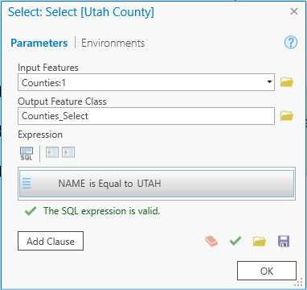
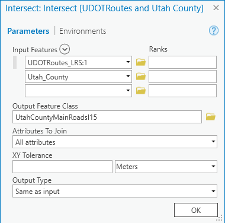
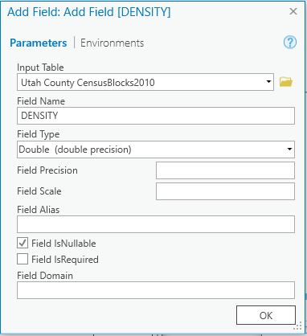
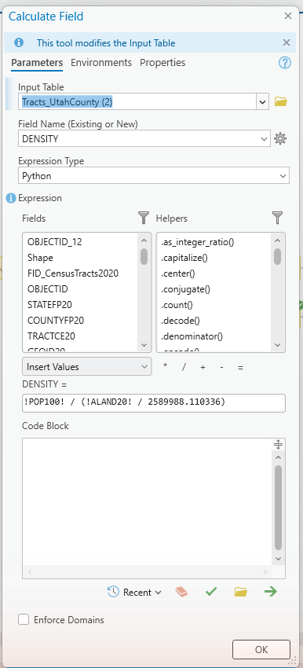
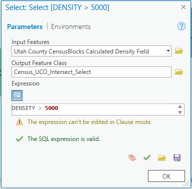
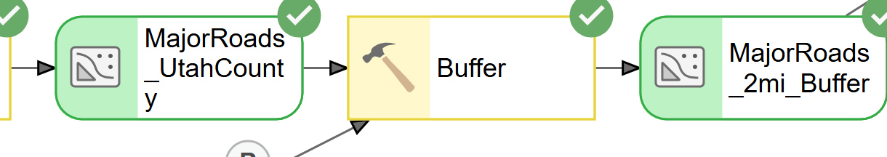
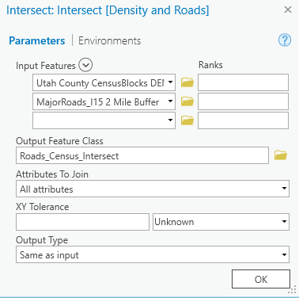
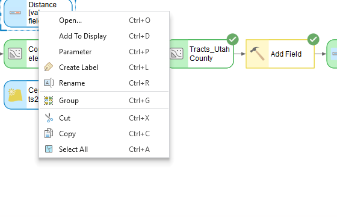

---
search:
  exclude: true
---

# DRAFT — Lab 1: Walmart Site Selection

**Civil Engineering 414 — Engineering Applications of GIS**

Fall 2026 · Dr. Dan Ames

> [!WARNING]
> **This is a draft for review. It is not the assigned version of Lab 1.**
>
> This page is a proposed revision of [Lab 1](README.md), rewritten after running the whole lab
> start to finish in ArcGIS Pro 3.7.1 and checking every field name, expression and result against
> the data students actually download. It is deliberately **not linked from the site navigation** —
> it is reachable only by its URL, so students following the course site will not find it.
>
> The unchanged parts of the lab are reproduced here in full so the page reads end to end.
>
> **Changes to what the lab asks students to do:**
>
> - **Data** — restructured around four ways of getting data: a prepared extract we host, an
>   official state download, data students create themselves, and a live service they never
>   download. The dead Walmart open-data link is gone; students build that layer by hand.
> - **Roads** — students now download a **6 MB Utah County extract** from this site instead of the
>   135 MB statewide file. It ships as a file geodatabase so the `CARTOCODE` domain survives, which
>   it does not in the official shapefile download.
> - **Step 10** — model parameters are kept, but repurposed: expose the two buffer *distances*, so
>   Step 12 is a dialog box rather than hand-editing tools.
> - **Step 12** — the second county is **removed**. In its place, students vary the three criteria,
>   tabulate how the answer moves, and report on which assumptions actually drive the result.
> - **Deliverables and rubric** — two maps (baseline plus one scenario) rather than one per county,
>   and a new 10-point sensitivity row. Point reallocation is a proposal, not a decision.
>
> **Corrections to things that were wrong:**
>
> - **Step 1** — clause mode vs. SQL mode, which the old text conflated.
> - **Step 2** — why the Intersect returns 173 features from 156 tracts.
> - **Step 3** — Add Field must be set to Double; the default silently truncates.
> - **Step 5** — the field is `CARTOCODE`, not `CARTO`, and the old `1,2,3,6` code list omitted the
>   major state highways.
> - **Step 6** — the buffer distance unit defaults to Meters, the single most damaging default here.
> - **Steps 0, 3, 6, 7, 8, 9** — expected values to check results against.
>
> Several boxes reference an **ArcGIS Tips and Reminders** page, also unlinked, at
> [`../../arcgis-tips.md`](../../arcgis-tips.md).
>
> **Figures.** Four have been re-captured in ArcGIS Pro 3.7 against the extract students actually
> download — the `CARTOCODE` attribute table in Step 5, the Select dialog in Figure 5b, the Buffer
> dialog in Figure 6, and the two new parameter menus at Figures 10 and 11. **The rest are still the
> original 2010-era captures** and show `CensusBlocks2010`, older dialog labels, and in Figure 2 a
> roads Intersect this version of the lab no longer asks for. Where a figure and the text disagree,
> the text is correct.

## Background

GIS is used by major corporations around the world to help manage shipping, inventory, sales, marketing, facilities, and expansion. Specifically, with respect to expansion, GIS is used extensively to help determine the most appropriate placement of new store locations.

This exercise assumes that the Walmart Corporation is interested in building a new store in Utah County. To conduct this analysis you will acquire and create several data layers corresponding to different spatial considerations and criteria. Once you have the data, you will use spatial analysis — several geoprocessing tools, assembled into a single model — to identify the most suitable locations for the new store, and you will recommend a specific site.

You will then do something a real analyst always has to do: find out how much your recommendation depends on the assumptions you were handed. The density threshold and the two distances in this lab are choices, not facts. In the last step you will vary them, see how far your answer moves, and report on it.

## Problem Statement

There are over 4,700 Walmart stores in the United States. About 90% of Americans live within 15 miles of a Walmart. <!-- VERIFY: store count and the "90% within 15 miles" figure are carried over from the Word handout with no source cited; confirm against a current Walmart corporate fact sheet before the semester starts. --> Walmart has stated that its goal is to provide inexpensive products to its customers. They provide a large variety of goods, allowing customers to save money without having to price shop (Fishman, 2006). Walmart is likely to continue to expand as population increases and the demand for inexpensive products increases.

Assume that you work for Walmart and have been assigned to select a new location for a store in Utah County. As you might suspect, there are many factors that govern the placement of a new store in a community. Some factors are based on physical requirements, others on political and economic issues. For example, see this article on siting a bicycle and ski equipment sales and rental shop in Wisconsin: <https://community.esri.com/community/education/blog/2012/08/10/siting-a-bicycle-and-ski-equipment-sales-and-rental-shop-in-wisconsin>
<!-- TODO(instructor): this Esri Community link returns 404 (it redirects to .../en/community/... and 404s there). The post appears to have been removed or moved in an Esri Community migration. Left verbatim rather than replaced with a guess — please supply a replacement URL or drop the example. -->

Suitable development areas can be determined by creating layers based on limiting criteria and combining those layers to find the places that meet all the criteria. For this lab, you are tasked with identifying the most suitable locations in Utah County for the placement of the new Walmart store.

## Spatial Considerations

For the purposes of this exercise, the spatial considerations will be limited to the following:

- **Proximity to other locations:** Find locations at least 2 miles away from any existing Walmart.
- **Proximity to major roads:** Find locations within 2 miles of I-15 or another major highway.
- **Population density:** Located in a high-density population area with over 5,000 people per square mile, using the 2020 Census tract data listed below.
- **Adequate space:** Walmart stores range from 51,000 ft² to 224,000 ft², averaging about 102,000 ft². <!-- VERIFY: store-footprint range and average are carried over from the Word handout with no source cited. --> The datasets in this lab do not include buildings, parcels, or land use, so your model cannot prove that a site is vacant. Treat this as a judgment step: screen your candidate zones visually against imagery, and state in your report what you were not able to verify from the data.

## Data

> [!IMPORTANT]
> **Set up your folder before you download anything.** On the lab machines you can only write to
> the **D: drive**. Make one folder for this class named after you — `D:\Smith\` — and one folder
> per lab inside it — `D:\Smith\Lab01\`. Put the project and this lab's data there.
>
> **Never use a space in a folder or file name you create.** Some geoprocessing tools, the raster
> tools especially, fail on paths containing spaces and do not tell you that the space is why.
>
> **Back your lab folder up to a USB or network drive every time you leave.** These are public
> machines and anyone who logs in can edit the D: drive.
>
> The full set of workspace conventions, and the settings that most often produce a wrong answer
> without an error message, are on the [ArcGIS Tips and Reminders](../../arcgis-tips.md) page.
> Read it before you start.

You need four layers for this project, and — deliberately — you will obtain them in four different ways. Getting data is most of the work in real GIS, and it almost never comes from one place:

| Layer | Where it comes from |
| --- | --- |
| Roads | A **prepared extract** we made for you and host on this site |
| Counties, Census tracts | An **official download** from the state agency that publishes them |
| Existing Walmarts | **Data you create yourself**, by finding the stores and placing points |
| Basemap | A **live web service** you never download at all |

That last one is easy to overlook. The imagery and topographic backdrop in your map are streamed from Esri's servers every time you pan. You are already using a data source you do not own, cannot edit, and did not download — worth noticing, because a lot of professional GIS works exactly that way.

Unzip each download into the lab folder you created above.

- **Utah Counties Shapefile:** <https://opendata.gis.utah.gov/datasets/utah-county-boundaries/about>
    - This shapefile represents all the counties in Utah, from which you will select the one you need. In the Download Options window, download the zipped Shapefile.
- **Utah County Roads — prepared extract:** [`lab01-utah-county-roads.zip`](../../data/lab01-utah-county-roads.zip) (about 6 MB)
    - Every road centerline inside Utah County: 38,817 features with all 90 attribute fields, as a file geodatabase. Read the `READ-ME-FIRST.txt` inside the zip — it records exactly where the data came from, what we did to it, and what we deliberately did *not* do.
    - **Why we prepared this one for you.** The original is UGRC's statewide [Utah Roads](https://opendata.gis.utah.gov/datasets/utah-roads/about) layer: 413,311 features, about 135 MB zipped and 600 MB unzipped. Clipping it to one county takes it to 6 MB. More importantly, the statewide download comes as a **shapefile**, and a shapefile cannot store a coded-value domain — so the road classification codes arrive with no way to look up what they mean. We converted the clip to a file geodatabase and re-attached that domain, so in Step 5 you can read the codes straight from the data. The prepared extract is genuinely more useful than the raw download, not just smaller.
    - We filtered nothing by road class. Interstates through driveways are all present; choosing which ones count is your job in Step 5.
- **2020 Census Tracts Shapefile:** <https://opendata.gis.utah.gov/datasets/utah-census-tracts-2020/about>
    - This shapefile represents the 2020 Census tract data for Utah. In the Download Options window, download the zipped Shapefile.
- **Current Walmart locations:** You will build this layer yourself. There is no download for it. Walmart's public open-data site, which earlier versions of this handout linked to, has been taken down; the copies of it still floating around ArcGIS Online are unmaintained 2020 snapshots owned by strangers, and you should not build an analysis on them. Instead, create a point feature class in your project geodatabase and place one point on each Walmart store in your county — see [Creating a point feature class](../../arcgis-tips.md#creating-a-point-feature-class). Locate the stores using Walmart's own store locator, a search in the map, or by recognising them in imagery. Expect to find somewhere around **a dozen** stores inside Utah County — the exact number is not fixed, and finding out what it is now is part of the job. Budget about fifteen minutes.

    - **Decide and state your inclusion rule.** Walmart operates more than one store format. Supercenters are the big-box stores this lab's square-footage figures describe; Neighborhood Markets are much smaller grocery-format stores. Whether a Neighborhood Market should count as "an existing Walmart" for a siting analysis is a judgement call, and it changes your answer. Make the call, apply it consistently, and defend it in your report.
    - **State in your report where you got each location, how you verified it, how many you found, and which formats you included.** Two students with different but well-documented rules can both be right. A student who does not say which rule they used cannot be.

## Analysis Tools

You will use the following new tools in this exercise:

- **Select:** Used to find and select features from your data layers based on attributes from the attribute table. You will first use it to select Utah County (and later your chosen county) in the counties shapefile. You will also use it in this laboratory to select population districts (represented with polygons) that have a density greater than 5000 people per square mile.
- **Intersect:** An overlay operation (Bolstad, pp. 357–358) that keeps only the area where the input layers overlap, and carries the attributes of both inputs into the result. Intersect is not the same as Clip: Clip keeps only the first layer's attributes, while Intersect keeps attributes from every input.
- **Buffer:** A proximity operation which creates an area equal to a distance, specified by the user, from a feature (Bolstad, p. 343). A buffer operation applied to a point feature layer returns a polygon feature layer with a series of circles of a specified distance around each point. A buffer operation applied to a polyline feature set returns a new polygon feature set with a single polygon surrounding each line segment at a specified distance.
- **Erase:** An overlay operation where the target features are "cut out" or removed at the locations of the input features.
- **Add Field:** Adds a blank new field to a table of a feature class, layer, or raster that has already been created and has an attribute table.
- **Calculate Field:** Calculates the values of a field for all objects within a feature class, layer, or raster.

## Example Model

Your ModelBuilder model might look like the following when it is finished. Note that you are encouraged to make your model "your own" by customizing the layout, the labels on the tools and datasets, etc. Make sure your labels are descriptive so that others can understand what each dataset represents and what each tool is actually doing. Do you see any ways that the following model can be improved? For example, a tool labeled as "Buffer" is much less informative than a tool labeled "Buffer (2 Miles)". Also, in GIS, there are always many ways to accomplish the same thing. For example, you might buffer your data before selection if you think that would work better (though that's a bad example, because it is better to select some data first and only buffer the selected data). Regardless, you might find other ways to improve your model over this example in terms of both the organization and tools you use, as well as the presentation, layout, and labeling.


<!-- TODO(instructor): this full-model overview is a zoomed-out ModelBuilder canvas grab and the node labels are close to illegible at web width. It needs re-export from ModelBuilder at a readable scale (this is one of the six illegible ModelBuilder images noted in ROADMAP.md), not a re-screenshot. -->
<!-- Stale: this image shows the OLD workflow (CensusBlocks2010, DENSITY > 5000 on blocks). Kept per the screenshot gate in ROADMAP.md. -->

## Complete the Lab

For an advanced GIS student, the information up to this point is all you need to complete the assignment and create an output map from the results. Feel free to try conducting the analysis using only the information provided above. If you complete the lab only using the information provided above (without using the step-by-step instructions below) make sure to indicate this in your lab report to be considered for extra credit.

<!-- TODO(instructor): this paragraph offers extra credit, but the rubric below has no extra-credit row and no stated value for it. Decide how many points it is worth (or remove the offer) — not changed here because point values are an instructor decision. -->

## Step by Step Solution

> [!WARNING]
> **The screenshots below predate the current data and workflow.** They were captured from an
> earlier version of this lab and still show `CensusBlocks2010`, the old density expression
> `!POP100! / !SqMiles!`, a `CARTO` road-class field that no longer exists, and dialog labels that
> have since been renamed. The current lab uses **2020 Census tracts**, the density expression in
> Step 3, and the `CARTOCODE` field described in Step 5.
>
> **Where a screenshot and the text disagree, the text wins.** Use the images for the shape and
> layout of each dialog, not for field names, values or button labels. Every instruction in the
> steps below was run and checked in ArcGIS Pro 3.7; the images were not re-captured.

> [!NOTE]
> **Important Note #1:** The following step-by-step solution walks through the analysis of Utah
> County at the default criteria. In Step 12 you will re-run the same model with different
> parameter values — so build it once, and build it so it is easy to change.

> [!NOTE]
> **Important Note #2:** My example screenshots in this and future assignments may or may not match
> your data exactly. So don't just rely on the screenshots. GIS data files, fields, and content
> names change all the time as data are updated or new data are released. Use my screenshots as a
> reference but use deductive logic as needed to modify your model based on the actual data you have
> downloaded.

### Step 0

**Create the project in your lab folder.** Start ArcGIS Pro and choose the **Map** template. Two things in the **New Project** dialog catch people out every semester:

- The **Location** box does not accept a typed path. Click the folder button beside it, and in the browse dialog that opens, type or paste `D:\Smith\Lab01` into the *Name* box at the bottom.
- If you have already made that `Lab01` folder, **uncheck "Create a folder for this local project"**. Leaving it checked gives you `D:\Smith\Lab01\Lab01`.

Never save the project to the C: drive, the desktop, or a network drive.

**Add your data to the map.** On the **Map** ribbon tab click **Add Data** and add the three shapefiles you downloaded and unzipped. You will drag them from the **Contents** pane onto the model canvas as you build the model, so they need to be in the map first.

**Create the model.** The quickest route is the **Analysis** ribbon tab ▸ **ModelBuilder**, which creates a new model in your project toolbox and opens the ModelBuilder view. (You can also do it from the **Catalog** pane: expand **Toolboxes**, right-click your project toolbox — `Lab01.atbx` — and choose **New ▸ Model**.) In the ModelBuilder view you drag data in from the Contents pane, and you can add a tool either by dragging it from the Geoprocessing pane or by simply typing its name on the canvas, which opens an *Add Tools To Model* search box. If you need a tutorial or refresher on ModelBuilder, watch this training video from Esri (the company that makes ArcGIS): <https://www.youtube.com/watch?v=fxcAb-xw_zU>

**Set the coordinate system before you measure anything.** On the **ModelBuilder** ribbon tab click **Environments** (in the *Model* group) and set **Output Coordinate System** to **NAD 1983 UTM zone 12N**. Search for it in the picker — note that Pro spells "zone" with a lowercase z. All of Utah falls in UTM zone 12. Buffers and area calculations made in geographic (latitude/longitude) coordinates are not measured in miles and will give wrong answers.

> [!TIP]
> **Sanity check.** With this environment set, your selected Utah County polygon should come out to
> about **2,141 square miles**. If you get a number like 0.6, your output is still in degrees and
> every distance and area downstream will be wrong.

### Step 1

Add the **Select** tool to your ModelBuilder canvas and connect the Counties layer to it as **Input Features**. Take the Select tool from **Analysis Tools** — searching for "Select" returns about two dozen tools, and *Select Layer By Attribute* is not the one you want here because it does not produce an output feature class.

Now build an expression that selects Utah County. There are two ways to do it, and they use different wording:

- In the default **clause** mode, build the row so it reads `NAME` — `is Equal to` — `UTAH`.
- Or switch on the **SQL Editor** toggle and type the SQL directly: `NAME = 'UTAH'`.

Text comparisons are case sensitive, and in SQL mode the value needs single quotes. The county names in this layer are stored in capitals, so `'Utah'` returns nothing. Note also that in ModelBuilder the value box will not offer a pick list of the field's existing values the way it does in a standalone tool — the tool has not run yet, so it cannot know them. You have to type `UTAH` yourself, which means a typo fails silently. (see Figure 1)

> [!WARNING]
> **Click OK on the tool dialog before you click Run.** If a tool's dialog is still open, the model
> runs with the last *committed* parameters rather than what is on your screen. A Select with no
> committed expression selects all 29 counties, reports success in about a second, and gives you no
> error at all. Note that the OK button **moves down** the dialog when you switch on the SQL Editor,
> which is exactly when people miss it.
>
> When this step has run, open the output attribute table. It should contain **exactly one
> feature**. If it has 29, the expression did not take.



![ModelBuilder detail: a blue Counties input oval feeding a yellow "Select [Utah County]" tool, which outputs a green Utah_County oval.](images/lab01-select-utah-county-model.png)

**Figure 1.** Select tool window and ModelBuilder example.

### Step 2

Use the Intersect tool to restrict the Census tract layer to Utah County. This reduces the amount of data being processed and makes the analysis run faster. Intersect keeps only the area where the inputs overlap and carries the attributes of both, so choose the order of the input features deliberately. (see Figure 2)

> [!NOTE]
> **The roads do not need this step.** The extract we gave you is already clipped to Utah County —
> that is what took it from 413,311 features to 38,817. Figure 2 shows the roads being intersected
> too, because it was captured when students downloaded the statewide layer themselves. You only
> need to do the census tracts. If you had downloaded the statewide roads yourself, you would
> intersect them here exactly the same way.

Pro will show an information banner suggesting the **Pairwise Intersect** tool instead. Either works for this lab; Intersect is what the rest of these instructions describe.

> [!NOTE]
> **Watch the feature count, and think about what it means.** Utah County contains 156 census
> tracts, but this Intersect produces **173** features. The extra ones are slivers: the tract layer
> and the county layer were digitized separately and their boundaries do not line up exactly, so
> thin fragments of tracts belonging to Salt Lake, Wasatch, Sanpete, Juab, Duchesne, Tooele and
> Carbon counties get pulled in. Some are smaller than a suburban lot.
>
> Each sliver carries its **parent tract's** total population and land area, so in the next step it
> will be assigned that parent tract's density even though only a fragment of it is inside your
> county. In Utah County this happens to do no harm, because those particular neighbours are rural
> and none of the slivers pass the density test. It may not be harmless in the county you choose in
> Step 12. Look at your results along the county line, and mention in your report what you found.

![ModelBuilder detail: the census layer and Utah_County feed an "Intersect [Census and Utah County]" tool, and UDOTRoutes_LRS and Utah_County feed an "Intersect [UDOTRoutes and Utah County]" tool, producing county-restricted census and main-roads outputs.](images/lab01-intersect-county-model.png)



**Figure 2.** Intersect tool window and ModelBuilder example.

### Step 3

Use the **Add Field** tool to create a new attribute table column called `DENSITY` in the county census tract layer.

> [!WARNING]
> **Set Field Type to `Double (64-bit floating point)`.** The default is `Long (32-bit integer)`,
> which silently discards the decimal part of every density you calculate. Nothing warns you.

Then use the **Calculate Field** tool to fill it in. Set **Field Name** to `DENSITY` — you will have to type it rather than pick it from the list, because that list is built from the table as it stands and Add Field has not run yet. Leave **Expression Type** as `Python`. (Older handouts call this "Python 3"; the label in Pro 3.7 is just "Python", and it is the same thing.) Use this expression to compute the number of people per square mile:

```text
!POP100! / (!ALAND20! / 2589988.110336)
```

(see Figure 3)

`ALAND20` is the tract's land area in square meters, so dividing by 2,589,988.110336 converts it to square miles and gives people per square mile. Before you trust the result, open the attribute table and confirm the field names and their units in the data you actually downloaded — Census field names change between vintages.

> [!TIP]
> **Check the result.** Across Utah County the calculated densities should run from 0 up to roughly
> 32,000 people per square mile. If every value is a whole number, your field is a Long integer
> rather than a Double; if the column is empty or full of nulls, check that you typed the field
> name into Calculate Field correctly.

![ModelBuilder detail: the county census layer feeds an "Add Field [DENSITY]" tool, whose output feeds a "Calculate Field [DENSITY]" tool, producing the calculated-density layer.](images/lab01-density-field-model.png)





**Figure 3.** Top: ModelBuilder example. Bottom: Add Field tool window and Calculate Field tool window.

<!-- Stale: the Calculate Field screenshot still shows the old !POP100! / !SqMiles! expression against CensusBlocks2010. The expression in the text above is the current one. Gated on the Lab 1 data validation; do not re-shoot yet. -->

### Step 4

Use the Select tool to select the areas where the population density is greater than 5,000, using the expression `DENSITY > 5000`. Later in the lab you will want to keep the areas inside these polygons. In an SQL expression the field name must match the data exactly, and comparisons against text values are case sensitive.



![ModelBuilder detail: the calculated-density layer feeds a "Select [DENSITY > 5000]" tool, producing the high-density output layer.](images/lab01-select-density-model.png)

**Figure 4.** The Select tool window and ModelBuilder example for DENSITY.

<!-- Stale: this Select screenshot runs against "Utah County CensusBlocks Calculated Density Field" (2010 blocks), not the 2020 tracts the current lab uses. -->

### Step 5

Use the Select tool to keep only I-15 and the other major highways in Utah County.

Open the roads attribute table first and find the field that classifies road type. In the current UGRC Utah Roads layer that field is **`CARTOCODE`** (alias *CartographicCode*). Two things about it matter:

- It is a **text** field, even though every value looks like a number. `CARTOCODE = 1` fails; `CARTOCODE = '1'` works.
- It has a **coded-value domain**, so each code has a documented meaning you can look up instead of guessing. Because we shipped the extract as a file geodatabase, that domain travels with the data: open the attribute table and you will see each code's description rather than a bare number. The domain is named `CVDomain_CartoCode`, and you can inspect the full code list from the layer's **Fields** design view.

<!-- VERIFY: the domain is confirmed attached and resolving (checked with arcpy on the packaged
     geodatabase: '4' -> "4 Major State Highways, Separated"). The exact ArcGIS Pro 3.7 menu path to
     the Fields/Domains design view was NOT re-checked in Pro - the workstation was locked at the
     time of writing - so the wording above deliberately avoids naming a menu path. Confirm the
     route and tighten this sentence before assigning the lab. -->


> [!NOTE]
> **This only works because of how the data was packaged.** If you download the statewide layer
> from UGRC yourself you get a shapefile, and the shapefile format cannot store a coded-value
> domain — you would see `1`, `2`, `3` with nothing to explain them, and the bundled metadata does
> not list the meanings either. The codes would then have to come from UGRC's online documentation.
> This is a real and common problem: **the file format you choose can silently throw away part of
> your data.** It is one reason professionals prefer geodatabases to shapefiles.


**Figure 5a.** The attribute table with the domain attached. Because the extract is a geodatabase, `CARTOCODE` reads as descriptions, not numbers.

For reference, the full domain is:

| Code | Meaning | Code | Meaning |
| --- | --- | --- | --- |
| 1 | Interstates | 10 | Other Federal Aid Eligible Local Roads |
| 2 | US Highways, Separated | 11 | Other Local, Neighborhood, Rural Roads |
| 3 | US Highways, Unseparated | 12 | Other |
| 4 | Major State Highways, Separated | 13 | Non-road feature |
| 5 | Major State Highways, Unseparated | 14 | Driveway |
| 6 | Other State Highways (Institutional) | 15 | Proposed |
| 7 | Ramps, Collectors | 16 | 4WD / high clearance may be required |
| 8 | Major Local Roads, Paved | 17 | Service Access Roads |
| 9 | Major Local Roads, Not Paved | 18 | General Access Roads |

Decide which of these count as "major highways" for siting a store, and justify your choice in your report. A defensible answer is codes 1 through 5 — interstates, US highways and major state highways:

```text
CARTOCODE IN ('1','2','3','4','5')
```

In the extract we gave you that keeps **1,532** of Utah County's 38,817 road segments.

> [!WARNING]
> **Do not copy the road expression from an older version of this handout.** Earlier versions used
> the equivalent of codes 1, 2, 3 and 6. That selects *institutional* roads (code 6) while leaving
> out codes 4 and 5, the major state highways. It returns **645** segments instead of 1,532 —
> it misses roughly sixty percent of the real network. If you find `CARTO = 1 OR CARTO = 2 ...`
> in an older copy of this handout, that field does not even exist in the current data.

> [!NOTE]
> Code 2 (US Highways, Separated) does not occur anywhere in Utah County. A code being absent from
> your county is not an error. Leaving it in the expression costs nothing and keeps the model
> honest about what it is asking for.


![ModelBuilder detail: the county main-roads layer feeds a "Select [Major Roads/I15]" tool, producing the major-roads output layer.](images/lab01-select-major-roads-model.png)

**Figure 5b.** The Select tool window and ModelBuilder example for major roads.

> [!NOTE]
> Figure 5b was captured in ArcGIS Pro 3.7 against the extract you downloaded, so the dialog, the
> field name and the expression all match what you should see.

<!-- Stale: CARTO = 1,2,3,6 screenshot retained deliberately; the step text no longer asserts that expression. -->

### Step 6

Use the **Buffer** tool to create a 2-mile buffer around the major roads you selected in Step 5. Later in the lab you will keep the areas inside this buffer.

> [!WARNING]
> **The Distance row has two boxes, and the second one will betray you.** The unit box reads
> *Unknown* until you type a number — and the moment you type one it quietly sets itself to
> **Meters**. Type `2`, click OK, and you have built a **two-metre** buffer instead of a two-mile
> one: wrong by a factor of 3,219, with no error and a perfectly normal green check mark.
>
> Set the unit yourself. There is no plain "Miles" option in ArcGIS Pro 3.7 — choose
> **Statute Miles** — which is what Figure 6 below shows.

Also set **Dissolve Type** to *Dissolve all output features into a single feature*. The default, *No Dissolve*, leaves you with one buffer polygon per road segment — 1,543 overlapping polygons in Utah County — which turns the Step 7 Intersect into a mess of overlapping slivers. Dissolved, you get one clean zone.

> [!TIP]
> **Check the result.** The dissolved 2-mile buffer around Utah County's major roads should be a
> single feature covering roughly **976 square miles**, a little under half the county. If your
> buffer has an area near zero, the unit box was still set to meters.




**Figure 6.** The Buffer tool window and ModelBuilder example for major roads buffer.

### Step 7

Use the Intersect tool to intersect the I-15/major roads buffer layer with the high-density census district layer to find the areas that contain both.

> [!NOTE]
> **Did this criterion actually change anything?** Compare the feature count and total area before
> and after. In Utah County the answer is no: all 47 high-density tracts are already within two
> miles of a major highway, because they are all strung along the I-15 corridor. The layer going
> into this Intersect and the layer coming out of it are the same — 47 features, about 26.4 square
> miles — so Steps 5 through 7 do not narrow the result at all.
>
> That is a real analytical finding, not a mistake, and it is worth more in your report than a
> number copied from the screen. **Report which of your criteria actually bound and which did not,
> and how you know.** Check it again for the county you choose in Step 12 — the answer may differ.



![ModelBuilder detail: the high-density census output and the 2-mile roads buffer both feed an "Intersect [Density and Roads]" tool, producing a "Roads Intersect Density" layer.](images/lab01-intersect-density-roads-model.png)

**Figure 7.** The Intersect tool window and ModelBuilder example of the density and roads intersect.

<!-- Stale: the XY Tolerance in this dialog reads "Unknown". With the projected output coordinate system set in Step 0 the units shown will differ. Screenshot retained; gated on the data validation. -->

### Step 8

Use the Buffer tool to create a 2-mile buffer around the existing Walmarts. Later in this lab you will want to keep the areas outside of this buffer.

This step needs the point layer you built yourself in the **Data** section — there is no Walmart download. If you have not made it yet, do that now: see [Creating a point feature class](../../arcgis-tips.md#creating-a-point-feature-class). Use the same point layer and inclusion rule you documented in the Data section.

As in Step 6, set the distance unit to **Statute Miles** rather than accepting Meters, and set **Dissolve Type** to *Dissolve all output features into a single feature*.

> [!TIP]
> **Check the result** — and check it with arithmetic, not just by comparing to a number we give you.
> One circle of radius 2 miles has area π × 2² ≈ **12.6 sq mi**. So *n* stores can never dissolve to
> more than 12.6 × *n* square miles, and overlap only ever pushes the total *lower*. For a dozen
> stores strung along the I-15 corridor you should land somewhere around **115–130 sq mi** — close to
> the ceiling, because the stores are far enough apart that their buffers barely overlap.
>
> If your figure is far outside that range, you have either miscounted your points or left the
> distance unit on Meters. This ceiling check works for any buffer in any lab: it is worth
> remembering.

![ModelBuilder detail: the Existing_Walmarts point layer feeds a "Buffer [2 Miles]" tool, producing a Walmart_Buffer polygon layer.](images/lab01-buffer-walmart-model.png)

**Figure 8.** The Buffer tool around the current Walmart locations.

### Step 9

Use the Erase tool to erase the buffered Walmart layer from the intersected population density with major roads buffer layer. This result will give you the target population that is not served by a Walmart. This is shown in Figure 9.

> [!TIP]
> **Check the result.** In Utah County this step is the one that really bites: it cuts the
> qualifying area roughly in half, from about 26.4 square miles down to about **12.9 square miles**,
> in around 31 separate polygons. Your own numbers will differ a little depending on which stores
> you digitized and which road codes you chose — that is expected. What matters is that you can
> explain the change.

![ModelBuilder detail: "Roads Intersect Density" and Walmart_Buffer feed an "Erase [Walmart from Density]" tool, producing the "Walmart Target Population" output layer.](images/lab01-erase-walmart-model.png)

**Figure 9.** The Erase tool in ModelBuilder.

### Step 10

Right-click the last output oval in your model and choose **Add To Display** (or select it and press `Ctrl+D`). The result is now added to your map automatically every time the model runs.

Now expose the two buffer distances so you can change them without opening the tools. A distance typed into a tool is not a variable yet, so this takes two moves:

1. **Right-click the Buffer tool** on the canvas and choose **Create Variable ▸ From Parameter ▸ Distance [value or field]**. A new blue oval appears, connected to the tool. (see Figure 10)
2. **Right-click that new oval** and choose **Parameter** — or select it and press `Ctrl+P`. A small `P` appears beside it.

Repeat for the second Buffer. When you now run the model from the Catalog pane, you get a dialog with those two distances in it.

![The ModelBuilder canvas context menu on a Buffer tool, opened to Create Variable, then From Parameter, showing the list of that tool's parameters: Distance [value or field], Side Type, End Type, Dissolve Type, Dissolve Field(s), and Method.](images/lab01-create-variable-parameter-menu.png)

**Figure 10.** Right-click the tool ▸ Create Variable ▸ From Parameter ▸ Distance.



**Figure 11.** Right-click the variable ▸ Parameter. The same menu carries Add To Display.

> [!NOTE]
> **Right-clicking the Distance row inside the tool dialog does nothing.** It looks like it ought to
> work, and older instructions say to do exactly that. It does not open a menu in ArcGIS Pro 3.7 —
> you have to create the variable from the canvas first, as above.

> [!NOTE]
> **Why bother — and when this feature is not worth it.** Model parameters are often oversold.
> Exposing whole datasets as parameters so that one model can be "reused" on any data sounds
> appealing and rarely survives contact with a real analysis: the field names differ, the
> projections differ, and you end up rebuilding the model anyway.
>
> Exposing a *number you intend to vary* is the case where they genuinely pay off. In Step 12 you
> will run this model several times with different distances. With parameters that is: type two
> numbers, click Run. Without them it is: open two tools, edit each one by hand, remember which you
> already changed, and hope. That is the whole reason we are doing it here — not because parameters
> are good practice in the abstract.

### Step 11

Decide where you think the best locations for a new Walmart would be. After running the ModelBuilder, the resulting polygons represent the ideal population that is not served by an existing Walmart. Ideal locations might be an empty field inside a candidate polygon. Non-ideal locations would be parks, school playgrounds, and cemeteries. Find and select several locations, show them on your map, and justify in your report why these locations are the best. Create a new point feature class to mark these points on your final map — the same technique you used for the Walmart locations in the Data section; see [Creating a point feature class](../../arcgis-tips.md#creating-a-point-feature-class) if you need the steps again.

### Step 12 — Test how much your answer depends on your assumptions

Everything you have produced so far rests on three numbers that somebody simply chose: 5,000 people per square mile, 2 miles from a major road, 2 miles from an existing Walmart. None of them is a law of nature. A recommendation that collapses the moment one of them shifts is a weak recommendation — and you cannot know whether yours does until you test it.

Run your model at least **three more times**, each with a different combination of those numbers, and record what happens. You decide which to vary and by how much, but decide deliberately and say why in your report. Some places to start:

- **Tighten the Walmart exclusion** to 3 miles, or 5. How much candidate area survives?
- **Change the road buffer** in either direction. Does that criterion change your answer at all?
- **Raise the density threshold** to 8,000 or 10,000. Which neighborhoods drop out first, and does that match where you would actually put a store?

For every run, record the run's parameter values, the number of candidate polygons, and their total area. Put it in a table — that table is a required deliverable.

Then answer these three questions in your report:

1. **Which parameter does your answer depend on most, and which barely matters?** Support it with the numbers from your table, not an impression.
2. **Is there a setting at which no suitable site exists at all?** If so, what does that tell you about the criteria — or about Utah County?
3. **Does your recommended site survive every scenario you ran, or only some?** If only some, is it still your recommendation? Defend your answer either way.

> [!TIP]
> Two things worth knowing before you start. One of these three criteria does almost nothing at its
> default value in Utah County — applying it leaves the result unchanged. And one of them can wipe
> out every candidate site completely if you push it far enough. Finding out which is which, and
> being able to show it, is the whole point of this step.

> [!NOTE]
> **Why this replaced "now do it again in another county."** Repeating the analysis somewhere else
> mostly repeats the data wrangling, which is the least interesting part of the work and which you
> have already demonstrated. Varying the assumptions instead keeps you in the analysis, and it is
> much closer to what site-selection work actually involves: the client rarely asks "what about
> Sanpete County," they ask "what if we could live with being three miles from an existing store."

## Deliverables

Make **two** professional map layouts:

1. **Your baseline result** — the target zones produced by the criteria as given (density over 5,000 per square mile, within 2 miles of a major road, more than 2 miles from an existing Walmart), with your recommended site or sites marked.
2. **One scenario from Step 12** — whichever of your runs most changes the decision. Say why you chose that one to show.

In each case include close-up data frames and an inset map of the specific spots you selected.

Write a brief report (2–3 pages) covering:

- the requirements of the project and your approach to solving it
- **one** screen capture of your model — only one is needed, since it is the same model throughout
- your **sensitivity table** from Step 12, and your answers to its three questions
- your specific recommendation for the site of the new Walmart, and a justification for why you chose those locations
- **where your Walmart point data came from and how you verified it**
- **which of the three spatial criteria actually narrowed your result and which did not**, with the counts and areas that show it

Make sure to review the rubric at the end of this lab for the full requirements of this laboratory exercise.

## References

Bolstad, P. (2008) *GIS Fundamentals: A First Text on Geographic Information Systems.* 3rd Edition. Esri Publishing.

Fishman, C. (2006) *The Walmart Effect: How the World's Most Powerful Company Really Works – and How It's Transforming the American Economy.* Penguin Books.

## Example Map

Note that this map is just an example. Your map will/must look different than this because it will be based on your own analysis, your own unique use of visual graphical cartographic elements and your own layout design choices. Also, your map must include your name.


<!-- Stale: the example map's legend reads "Suitble Areas" (misspelled in the graphic) and its density classes come from the old 2010 block analysis. The image cannot be corrected without re-making the layout. -->

## Rubric for Walmart Site Selection Project Report

| Item | Points |
| --- | --- |
| Assignment Title, Name, Date, Course | /1 |
| Summary of the requirements of the project | /4 |
| Describe your model:<br>• List each of the tools used<br>• List tool settings applied for the analysis<br>• List all input, intermediate, and output datasets<br>• Describe each input dataset including type (point, line, polygon, raster) and the source of the data<br>• Describe each output dataset (point, line, polygon, raster) | /5 |
| One or more full pages (8.5 x 11) showing your model:<br>• All text is readable (10 pt. font minimum)<br>• All tools and data sets are shown and labels are informative | /5 |
| Answer the following questions:<br>• Where are the best locations for a new Walmart?<br>• Which one site do you recommend and why did you select this location? | /5 |
| Make TWO full page (8.5 x 11) maps — your baseline result, and one Step 12 scenario:<br>• Show current Walmarts and optimal locations for a new one<br>• Map Title: Neat Line, North Arrow, Scale Bar<br>• All features (existing & future Walmart locations) are labeled<br>• Text box with author name, date, map projection<br>• Current Walmart locations marked with an appropriate graphical symbol<br>• **Important:** Show the final suitability layer that shows the effect of your intersection and erasing — this is the best way to show that you truly solved this correctly. E.g. see the yellow and orange areas in the example map.<br>• Base map is visible<br>• Zoomed to an appropriate scale for viewing all features<br>• The scenario map states which parameters were changed and to what<br>• All text is legible on printed map | /20<br>(10 per map) |
| Sensitivity analysis (Step 12):<br>• A table of at least three additional runs, giving the parameter values, the number of candidate polygons, and the total area for each<br>• Which parameter matters most and which barely matters, supported by those numbers<br>• Whether any setting eliminates every candidate site, and what that means<br>• Whether your recommended site survives every scenario, and whether it is still your recommendation | /10 |
| My self-assessment — score yourself against the 50 points above. This row adds no points to the total. | (no points) |

**Total: 50 points.**

<!-- Migration notes (2026-09-03): source: /Users/dan/ames-sync/Work/Teaching/CE 414 Engineering Applications of GIS/Labs/Lab 1 - Walmart Site Selection.docx (the Sept 3, 2026 corrected version — census vintage, density units, projected CRS, Intersect-vs-Clip, road criterion, judgment step and rubric total all migrated as-is, nothing reverted).
ArcGIS Pro version verified against: VERIFIED 2026-09-04 in ArcGIS Pro 3.7.1 (local install, not Citrix). The whole lab was run end to end as a first-time student, Steps 0-9, and every output was checked with arcpy and cross-checked against the live UGRC feature services.
CONFIRMED CORRECT: NAME = 'UTAH' (29 counties, uppercase); !POP100! / (!ALAND20! / 2589988.110336) against the 2020 tract download (POP100 SmallInteger, ALAND20 Double m2, no ALAND20 = 0 statewide so no divide-by-zero); NAD 1983 UTM zone 12N as the model Output Coordinate System (Counties_Select area = 2,140.9 sq mi vs the true 2,141).
CORRECTED: the road criterion. Field is CARTOCODE (text, coded-value domain CVDomain_CartoCode), NOT "CARTO" and not numeric. The old 1,2,3,6 expression included code 6 (institutional) while omitting 4 and 5 (major state highways): 645 vs 1,543 segments in Utah County. Step 5 now carries the full domain table and CARTOCODE IN ('1','2','3','4','5'). Code 2 does not occur in Utah County.
ADDED because they silently produce wrong answers with no error: Buffer distance unit auto-sets to Meters (and Pro 3.7 offers "Statute Miles", not "Miles"); Add Field defaults to Long not Double; Buffer Dissolve defaults to No Dissolve; clicking Run with a tool dialog open uses uncommitted parameters (observed: Select returned all 29 counties, "success" in 1.24 s).
ADDED as pedagogy: Step 2 Intersect yields 173 features from 156 tracts (17 slivers from 7 neighbouring counties; none pass the density filter in Utah County, verified). Steps 5-7 are a NO-OP in Utah County — 47 features / 26.42 sq mi before and after, under both the new and old road expressions — so the lab now asks students to report which criteria actually bound.
Verified run totals (Utah County): tracts 156 -> intersect 173 -> density > 5000 = 47 (26.4 sq mi); roads 413,311 statewide -> 38,921 in county -> 1,543 major; roads buffer 975.6 sq mi; Walmart buffer 557.9 sq mi (10 stores in county); final Walmart_Target_Zones 31 polygons, 12.9 sq mi.
DATA PACKAGE (2026-09-04): docs/data/lab01-utah-county-roads.zip, 6.30 MB. Built by clipping the UGRC statewide Utah Roads shapefile to the Counties_Select Utah County polygon (38,817 features, all 90 fields), converting to a file geodatabase, and re-attaching the CVDomain_CartoCode coded-value domain copied from the UGRC feature service. Round-trip verified from the zip: opens, 38,817 features, domain resolves ('4' -> "4 Major State Highways, Separated"). Includes READ-ME-FIRST.txt recording source, licence (CC BY 4.0), retrieval date and processing.
  KEY REASON for the package beyond size: shapefiles CANNOT store coded-value domains. The official UGRC download therefore arrives with no way to interpret CARTOCODE, and the bundled metadata XML does not list the code meanings either (checked). An earlier version of this page told students to "read the domain" from the download; that instruction was wrong and is now corrected.
  NOTE: Clip (used for the package) and Intersect (used in the original run) differ slightly at the boundary: 38,817 vs 38,921 features, and 1,532 vs 1,543 major segments. All expected values on this page are now the PACKAGE numbers.
Verified run totals with the package (Utah County): tracts 156 -> intersect 173 -> density > 5000 = 47 (26.42 sq mi); roads 38,817 -> 1,532 major; roads buffer 1 feature 975.6 sq mi; Walmart buffer 557.9 sq mi (10 stores); final 31 polygons, 12.86 sq mi.
SENSITIVITY (measured, for setting expectations on Step 12; do NOT publish this table to students): road buffer 2/1/0.5/0.25 mi at density 5000, Walmart 2 mi -> final 12.86 / 12.15 / 9.02 / 5.35 sq mi. Walmart buffer 2/3/5 mi at density 5000, road 2 mi -> 12.86 / 2.39 / 0.00 sq mi (5 mi eliminates every site). Density 5000/8000/10000 at road 2, Walmart 2 -> 47/15/7 tracts and 12.86 / 2.61 / 0.63 sq mi. So the Walmart distance dominates, the road distance is near-inert until below ~0.5 mi, and there IS a setting with no solution - which is what Step 12's TIP alludes to without giving away.
ALTERNATIVE CONSIDERED AND REJECTED: UDOT Routes ALRS (item 5eca80119fd349f3a435a751b86f1af8, UDOT_Admin, public) - 3,676 features statewide, 4.9 MB, reproduces the answer (975.8 sq mi buffer, 31 polygons, 12.86 sq mi). Rejected because it publishes no coded-value domain, uses a DIFFERENT code scheme from UGRC (1=Interstates, 2=US highways, 3=state routes, 5-8=ramps/connectors - inferred from route names, not documented), truncates ROUTE_ALIAS_COMMON to ROUTE_AL_1 in shapefile form, and duplicates divided highways by direction (I-15 appears twice). Server-side filtered downloads of the UGRC layer (?where=...) return 404/502 and are not a dependable student path.
NOT VERIFIED: Step 10 (right-click Parameter / Add To Display, and right-click a tool's Distance row to make it a parameter) — context menus did not render in the capture session. The ArcGIS Pro 3.7 menu path to the Fields/Domains design view in Step 5 was not re-checked (workstation locked); the wording deliberately avoids naming a path. Steps 11-12 were not performed. Figures 1-10 were NOT re-captured and remain stale — Figure 2 in particular now shows a roads Intersect the lab no longer asks for, and Figure 10 shows only the output-variable context menu, not the distance-parameter step.
RUBRIC: 30 points of "two maps, one per county" was re-split as 20 (two maps: baseline + one scenario) + 10 (sensitivity analysis), holding the total at 50. Point values are an instructor decision — this is a proposal.
PILOT RUN (2026-09-04): an AI agent was asked to work this draft end to end as a first-time student and to log its confusion. Its notes and report are at C:\Ames\Student01\. It matched every published check value except one, and it caught a real error.
  ERROR FOUND AND FIXED — Step 8 previously said a dissolved 2-mile buffer around ten stores covers "roughly 558 sq mi". That is geometrically impossible: one 2-mile circle is 12.6 sq mi, so ten can never exceed 126. The 558 figure came from MY Existing_Walmarts layer, which held all 47 Walmart points STATEWIDE because it was never clipped to the county; 47 x 12.6 = 590, so 557.9 was right for that layer and wrong for the lab's instructions. Verified: buffering only the 10 in-county stores gives 115.7 sq mi. Step 8 now teaches the pi*r^2*n ceiling check instead of quoting a single number. The Step 9 final (31 polygons, 12.86 sq mi) is UNAFFECTED and was re-verified both ways — the 37 out-of-county stores are too far from the candidate zones to change it.
  STORE COUNT DE-FACTUALISED — the pilot found 12 stores in Utah County via Walmart's own store finder (9 Supercenters + 3 Neighborhood Markets); my OSM-based count found 10. Neither is wrong; the count moves and depends on whether Neighborhood Markets count. The lab no longer states a number as fact. It now asks students to state their count, their inclusion rule, and to defend it.
  ALSO REPORTED, NOT YET VERIFIED BY ME: the pilot could not find a format button under the Hub "Download Options" panel for the counties/tracts downloads and fell back to the Hub download API. Needs checking on the actual lab machines before the semester — if the panel behaves that way there, 30 students will hit it at once in Step 0.
  NOT EXERCISED BY THE PILOT: it never obtained working desktop control, so it did the analysis with arcpy and never opened ModelBuilder. Every GUI trap this lab warns about (Meters-not-Miles, Long-not-Double, Run-with-dialog-open, right-click-does-nothing) is therefore still untested by anyone but me.
images renamed from fig-NN: fig-01.png -> lab01-full-model-overview.png; fig-02.png -> lab01-select-utah-county-dialog.png; fig-03.png -> lab01-select-utah-county-model.png; fig-04.png -> lab01-intersect-county-model.png; fig-05.png -> lab01-intersect-roads-county-dialog.png; fig-06.png -> lab01-density-field-model.png; fig-07.png -> lab01-add-field-density-dialog.png; fig-08.png -> lab01-calculate-field-density-dialog.png; fig-09.png -> lab01-select-density-dialog.png; fig-10.png -> lab01-select-density-model.png; fig-11.png -> lab01-select-major-roads-dialog.png; fig-12.png -> lab01-select-major-roads-model.png; fig-13.png -> lab01-buffer-roads-dialog.png; fig-14.png -> lab01-buffer-roads-model.png; fig-15.png -> lab01-intersect-density-roads-dialog.png; fig-16.png -> lab01-intersect-density-roads-model.png; fig-17.png -> lab01-buffer-walmart-model.png; fig-18.png -> lab01-erase-walmart-model.png; fig-19.png -> lab01-parameter-add-to-display-menu.png; fig-20.jpg -> lab01-example-map-utah-county.jpg. No image was deleted; all 20 are referenced.
stale/unverified screenshots (all retained deliberately; re-shoot is gated on Labs/Lab 1 Data/2026-09-02/ARCGIS_PRO_VALIDATION_CHECKLIST.md per ROADMAP.md): lab01-full-model-overview.png (old CensusBlocks2010 workflow AND illegible at web width — needs re-export from ModelBuilder, not a re-screenshot); lab01-intersect-county-model.png and lab01-intersect-roads-county-dialog.png (CensusBlocks2010, UDOTRoutes_LRS); lab01-density-field-model.png, lab01-add-field-density-dialog.png (CensusBlocks2010 input table); lab01-calculate-field-density-dialog.png (old expression !POP100! / !SqMiles!, 2010 block field list); lab01-select-density-dialog.png, lab01-select-density-model.png (2010 blocks); lab01-select-major-roads-dialog.png (CARTO is Equal to 1/2/3/6 — the step text deliberately no longer asserts this); lab01-intersect-density-roads-dialog.png (XY Tolerance "Unknown"); lab01-example-map-utah-county.jpg (legend misspells "Suitable" and density classes come from the 2010 block analysis).
TODO(instructor): (1) the Esri Community bicycle/ski-shop link 404s — supply a replacement or drop the example; (2) the "Complete the Lab" section offers extra credit but the rubric has no extra-credit row or point value; (3) lab01-full-model-overview.png needs re-export from ModelBuilder at a legible scale.
VERIFY (still open): "over 4,700 Walmart stores" and "about 90% of Americans live within 15 miles of a Walmart" (uncited, unchanged); Walmart store footprint range 51,000–224,000 ft², average ~102,000 ft² (uncited, unchanged); the Bolstad page numbers.
CLOSED 2026-09-04 by the Pro 3.7.1 run: NAD 1983 UTM zone 12N (note Pro spells "zone" lowercase), the !POP100! / (!ALAND20! / 2589988.110336) expression and both field names, and the ArcGIS Pro dialog and pane names throughout Steps 0-9.
dead/redirected links: DEAD — https://community.esri.com/community/education/blog/2012/08/10/siting-a-bicycle-and-ski-equipment-sales-and-rental-shop-in-wisconsin (redirects to https://community.esri.com/en/community/... then 404).
DEAD (2026-09-04), and this one defeats a status-code link check — https://walmart-open-data-walmarttech.opendata.arcgis.com/ returns HTTP 200 with an empty ArcGIS Hub shell but renders nothing: the browser console shows a 404 plus "An error occured initializing the HubSite instance". The Walmart-owned STORE_STATUS_PUBLIC_VIEW FeatureServer no longer answers public queries (no layers, no count). Only third-party COVID-era copies owned by unrelated ArcGIS Online users remain. The Data section no longer offers a download; students build the point layer themselves (10 stores in Utah County). NOTE for future link checks on this repo: a 200 from an ArcGIS Hub domain does not mean the site exists.
OK (200, no redirect): the three opendata.gis.utah.gov dataset pages and https://www.youtube.com/watch?v=fxcAb-xw_zU. All three UGRC downloads were exercised: counties 1.8 MB, tracts 6.0 MB, roads 141 MB zipped / 606 MB unzipped (Roads.dbf alone is 502 MB), roads download 4m19s on a fast home connection.
figure numbering: Word's caption fields lost their numbers. Restored as Figures 1–10 matching the ten step captions in document order; the "Example Model" overview image had no caption field in Word and is intentionally left unnumbered so that the in-text references "(see Figure 1)", "(see Figure 2)", "(see Figure 3)" and "This is shown in Figure 9" continue to resolve correctly. -->
