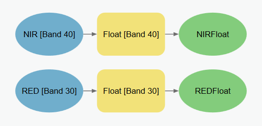
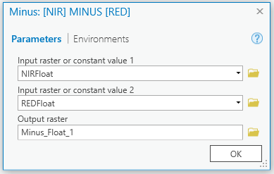
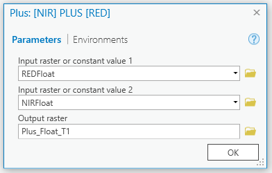
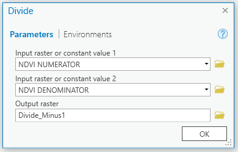
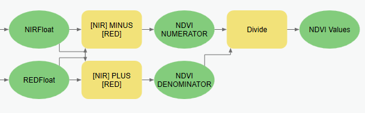
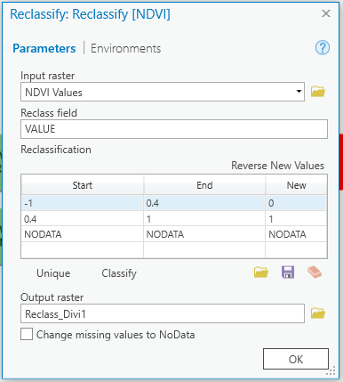
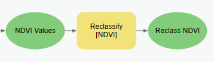

# Lab 2: NDVI

**Civil Engineering 414 — Engineering Applications of GIS**

Fall 2026 · Dr. Dan Ames

*Classifying Land Based on NDVI*

## Background

In 1972, NASA launched what is known today as the Landsat (Land + Satellite) program. The Landsat program is the longest continuous enterprise for acquiring satellite imagery of the Earth. The satellite imagery provides data for land assessment, coverage, and usage on a global scale. Landsat satellites collect images in several bands of the electromagnetic spectrum. These bands can be combined in various ways to create "false color" images and other data products. In GIS, Landsat data can be used to calculate the Normalized Difference Vegetation Index (NDVI), a measure of vegetation greenness, to identify irrigated cropland. A model for calculating NDVI can be created in ArcGIS Pro ModelBuilder by combining data from the red and near-infrared bands. A classified NDVI output map can be used to identify the locations of irrigated and non-irrigated land.

<!-- TODO(instructor): NDVI measures a spectral response associated with vegetation greenness and vigor. It does not measure irrigation directly. Consider adding a clarifying sentence here and in the Problem Statement so students do not read high NDVI as proof of irrigation. -->

## Problem Statement

Landsat records the energy that is reflected from the Earth's surface within the electromagnetic spectrum. According to the Global Land Cover Facility (GLCF), seven bands are recorded: red, near-infrared (NIR), green, blue, and two short-wave infrared (SWIR) wavelengths (Campbell, 167).

<!-- VERIFY: this sentence says "seven bands" but names only six (red, NIR, green, blue, and two SWIR). Kept verbatim; the intended seventh band was not stated in the source. -->
<!-- TODO(instructor): the Global Land Cover Facility (GLCF) is no longer distributing Landsat data. Decide on a current source of record for this paragraph. -->

Landsat imagery has been available since 1972. The imagery has been provided by six different satellites that have been part of the Landsat series. These satellites have been a major component of NASA's Earth observation program, featuring three primary sensors that have evolved over the past thirty years: MSS (Multi-Spectral Scanner), TM (Thematic Mapper), and ETM+ (Enhanced Thematic Mapper Plus). Landsat satellites supply high-resolution, visible, and infrared imagery. The ETM+ sensor also provides thermal imagery and panchromatic images. The Landsat data available through GLCF is designed to complement project goals of distributing a range of global, multi-temporal, multi-spectral, and multi-resolution imagery appropriate for land cover analysis.

<!-- TODO(instructor): Landsat history is out of date here — "six different satellites", "the past thirty years", and the MSS/TM/ETM+ sensor list all predate Landsat 8 (OLI/TIRS, 2013) and Landsat 9 (2021). Updating the satellite count, the time span, and the sensor list is an instructor decision; not changed in this migration. -->

Landsat satellite data records distinct electromagnetic wavelengths as unique bands. This allows a given location to be viewed as a separate layer in GIS. This way, you can see which wavelengths are reflected more and which are reflected less for a given area. Two bands that are frequently used in earth science projects are the red (3) and the NIR (4) bands. These bands reflect differently on water, rocks, and vegetation. (Jensen, 335) This makes the features on the Earth's surface distinguishable from each other (e.g., vegetation vs. volcanic rock). These bands are also reflected differently within vegetation itself due to variations in chlorophyll and water content (Jensen, 334). Green vegetation absorbs red light and reflects NIR. This means that different land cover types can be identified (e.g., forest vs. sagebrush steppe).

<!-- TODO(instructor): band numbers are sensor-dependent and were NOT corrected in this migration. "red (3)" and "NIR (4)" hold for TM and ETM+; on Landsat 8/9 OLI red is Band 4 and NIR is Band 5. Which numbering applies depends on which scene the lab data comes from — please confirm and add the Landsat 8/9 designations. -->
<!-- TODO(instructor): consider requiring students to identify the sensor and the red/NIR band numbers from the scene metadata (MTL file) rather than being told, so the lab works with whatever scene they download. -->

A table of all bands and their specific ranges in the electromagnetic spectrum is given below (see <https://landsat.gsfc.nasa.gov/satellites/landsat-8/landsat-8-bands/>).

| Band | RBV | MSS | TM | ETM+ |
| --- | --- | --- | --- | --- |
| 1 | 0.48–0.57 μm green | — | 0.45–0.52 μm blue | 0.45–0.52 μm blue |
| 2 | 0.58–0.68 μm red | — | 0.52–0.6 μm green | 0.52–0.61 μm green |
| 3 | 0.69–0.83 μm IR | — | 0.63–0.69 μm red | 0.63–0.69 μm red |
| 4 | — | 0.5–0.6 μm green | 0.76–0.9 μm NIR | 0.76–0.9 μm NIR |
| 5 | — | 0.6–0.7 μm red | 1.55–1.75 μm SWIR | 1.55–1.75 μm SWIR |
| 6 | — | 0.7–0.8 μm IR | 10.4–12.5 μm TIR | 10.4–12.5 μm TIR |
| 7 | — | 0.8–1.1 μm IR | 2.08–2.35 μm SWIR | 2.1–2.35 μm SWIR |
| 8 | — | — | — | 0.52–0.9 μm panchromatic |

**Table 1.** Landsat instrument bands.

Where:

- IR = infrared
- NIR = near infrared
- SWIR = short wavelength infrared
- TIR = thermal infrared (long infrared)
- μm = micron or micrometer

<!-- TODO(instructor): this table covers RBV, MSS, TM, and ETM+ only. The linked NASA page is about Landsat 8 (OLI/TIRS), whose bands are not in the table. Adding Landsat 8/9 columns is an instructor decision. -->

The difference in reflections of various wavelengths can be used to determine the effective "greenness" of vegetation. This is done by calculating the Normalized Difference Vegetation Index (NDVI). The NDVI is mathematically defined by Jensen, 2000, Campbell, 2008, and Lillesand, et al., 2008 (see Equation 1).

```text
NDVI = (NIR - RED) / (NIR + RED)
```

**Equation 1.** The Normalized Difference Vegetation Index (NDVI) equation.

NDVI is a reliable vegetative index that is used in many applications. NDVI has been used to detect grub feeding on turfgrass before damage becomes visible (Hamilton). The Idaho Department of Water Resources uses NDVI to determine evapotranspiration rates in the Eastern Snake Plain Aquifer and the Boise Valley Aquifer (Kramber). NDVI is designed to identify the areas of strongest reflected near-infrared and exclude any areas that contain red.

<!-- Correctness fix (2026-09-03): the source read "identify the warmest spots in the NIR band". NDVI uses *reflected* near-infrared, not emitted heat; "warmest spots" was changed to "areas of strongest reflected near-infrared". -->
<!-- TODO(instructor): the remainder of that sentence — "exclude any areas that contain red" — still mischaracterizes the index. NDVI is a normalized ratio of the NIR and red responses; it does not exclude red. Rewriting it is a pedagogical decision, so it was left as written. -->

One of the practical applications of NDVI is to differentiate between irrigated cropland and non-irrigated land (Calera et al. 2001). In this exercise, you will use ArcGIS Pro ModelBuilder to calculate the NDVI, and you will use Landsat data for the Utah County area to identify irrigated cropland from non-irrigated land.

<!-- VERIFY: "Calera et al. 2001" is cited here but does not appear in the References list. -->

> [!IMPORTANT]
> **Your job — see the deliverables below.** Compute and build result maps for **two** study areas.

## Data

**Landsat data:** Download the Landsat data from the link found on Learning Suite.

There are multiple datasets linked through Learning Suite. Use at least the Utah data and one other dataset for this assignment.

<!-- TODO(instructor): the instructor plan asks whether a second complete scene is necessary for this lab, or whether a smaller second study area would achieve the same learning outcome. The two-scene requirement is unchanged here, in the Deliverables, and in the rubric (30 points, 15 per map). -->
<!-- TODO(instructor): consider adding discussion of acquisition date, crop stage, cloud and shadow masking, open water, and bare soil, all of which affect how an NDVI scene should be interpreted. -->

## ModelBuilder Tools

You will use the following new tools in this exercise, along with tools from previous labs:

- **Float:** A Spatial Analyst tool that converts numerical data of other types into float data. Float data is a data type that stores a floating-point number (i.e., the decimal place can move).
- **Plus, Minus, and Divide:** Take input raster datasets and perform their respective operations.
- **Reclassify:** Changes values in a raster. In this exercise, based on your knowledge as the researcher, you will reclassify the NDVI value to reflect non-irrigated land and irrigated land.

## Example Model


<!-- Stale/unverified screenshot: this diagram labels the inputs "NIR [Band 40]" and "RED [Band 30]", which reflect one particular scene's file naming. It has not been re-shot for this migration and its band designations were not verified. -->

## Complete the Lab

For an advanced GIS student, the information up to this point is all you need to complete the assignment and create an output map from the results. Feel free to try conducting the analysis using only the information provided above. If you need extra help, follow the step-by-step solution below. Ensure that you create and screen capture an ArcGIS Pro toolbox interface for your model.

> [!TIP]
> If you complete the lab using only the information provided above — without using the step-by-step instructions below — make sure to indicate this in your lab report to be considered for extra credit.

There are **two parts** to this lab. Complete the analysis for Utah and then complete it for another Landsat dataset. I've provided a few other datasets on Learning Suite. You can use one of them, or you can download your own from one of several downloaders. You can find these downloadable datasets by searching for "Landsat Download" on Google. You can also use the information on this page to find new Landsat satellite scenes: <https://www.usgs.gov/landsat-missions/landsat-data-access>.

> [!NOTE]
> Most of these tools require that you make a simple user account on USGS.gov when prompted and confirm it in your email before you can download data.

Once you have acquired your data (Utah, and then later your own selected data), follow the steps below.

## Step-by-Step Solution

### Step 1

Use the Float tool to change the data inside the raster from an integer type to a float type for each of the input layers. The Float tool is a Spatial Analyst tool. You may need to turn on the Spatial Analyst extension to run the tool. Click the **Project** tab, open **Licensing**, and click the *Configuring your licensing options* button. Check the box for **Spatial Analyst**.

<!-- VERIFY: the source read "click the Configuring your licensing options button"; the exact ArcGIS Pro button label was not verified in this migration and has been left as written. The source also read "Check the box for Spatial Analysis"; corrected to "Spatial Analyst", the name of the extension named in the preceding sentence. -->



**Figure 1.** Using the Float tool in ModelBuilder.

### Step 2

Use the Minus, Plus, and Divide tools to model the NDVI equation. This method allows us to first calculate the top and bottom parts of the equation separately and then divide the two parts as the NDVI equation specifies (see Figure 2 and Figure 3).

```text
NDVI = (NIR - RED) / (NIR + RED)
```







**Figure 2.** The Minus, Plus, and Divide tool windows.



**Figure 3.** Minus, Plus, and Divide tools in ModelBuilder.

### Step 3

Use the Reclassify tool to reclassify the raster based on a pre-determined value that represents irrigated cropland. The value was determined by creating a polygon shapefile over an identified irrigated cropland area and calculating its mean. The pre-determined mean value is 0.4. Non-irrigated cropland values will be below the mean and irrigated cropland values above. Reclassify the raster based on the values given below.

- Non-irrigated cropland values: -1.0 – 0.4
- Irrigated cropland values: 0.4 – 1

<!-- TODO(instructor): 0.4 is not a universal irrigation threshold. Consider presenting it as an illustrative starting point and requiring students to justify their own threshold using known sample locations (a field they can confirm is irrigated, and one they can confirm is not) in their own scene. Threshold value left unchanged at 0.4 per the source. -->

In the Reclassification tool window, add or delete rows using the **Add Entry** and **Delete Entries** buttons (see Figure 4).





**Figure 4.** The Reclassify tool window used as a parameter, and the ModelBuilder example.

### Step 4

Use the methods shown in class to create a toolbox interface for your model. Right-click the input and output data and choose the **Parameter** option. This will add a letter "P" next to those ovals on your model. Save your model (and your ArcGIS Pro project file). Open the Catalog view and find your model in your project toolbox. Double-click the model to show its toolbox interface. Screen capture this interface to include in your report.

## Deliverables

Create a model that prepares all input data for the land cover analysis, conducts the analysis, and generates a map indicating the locations of irrigated land. Run the Utah data through your model. Then run another Landsat dataset through your model. Include two maps in your final report. Make sure it is clear where your map is located for both Utah and the self-selected location/Landsat tiles. Your resulting two maps should show irrigated and non-irrigated lands using NDVI. Identify interesting irrigation patterns, such as center-pivot irrigation areas with their distinctive circular shapes. Submit a report including your model, **two** maps, and conclusions of your findings as requested in the grading rubric. Make sure to include a screenshot of your toolbox interface as well.

## References

Campbell, J.A. (2008) *Introduction to Remote Sensing.* The Guilford Press. 465-466.

<!-- VERIFY: author initials for the Campbell reference were not checked against the book. -->

Hamilton, R.M., Foster, R.E., Gibb, T.J., Johannsen, C.J., and Santini, J.B. (2009) "Pre-visible Detection of Grub Feeding in Turfgrass using Remote Sensing." *Photogrammetric Engineering and Remote Sensing.* 75. 179-191.

Jensen, J.R. (2000) *Remote Sensing of the Environment: An Earth Resource Perspective.* Prentice Hall, Upper Saddle River, New Jersey. xii, 361-362.

Kramber, W.J., Morse, A., and Allen, R.G. (2010) "Mapping Evapotranspiration: A Remote Sensing Innovation." *Photogrammetric Engineering and Remote Sensing.* 76. 6-10.

Lillesand, T.M., Kiefer, R.W., and Chipman, J.W. (2008) *Remote Sensing and Image Interpretation.* John Wiley & Sons, Inc. 464.

## Example Maps

This is an example of a Utah map result. Make sure to create two maps: one for Utah and one for your selected Landsat tile/location.


<!-- Stale/unverified screenshot: the example layout's text box still reads "NDVI Lab / Date / Projection" placeholder text rather than a real author, date, and projection. Not re-made in this migration. -->

## Rubric for Classifying Land Based on the NDVI

| Item | Points |
| --- | --- |
| Assignment title, name, date, course, and brief report on the requirements of the project. What locations within Utah County are most irrigated? Are your results as expected, or did you find anything interesting or different than expected? | /5 |
| Describe your model:<br>• List each of the tools used<br>• List tool settings applied for the analysis (could someone repeat the lab using your report?)<br>• List all input, intermediate, and output datasets<br>• Describe each input dataset including type (point, line, polygon, raster) and the source of the data<br>• Describe each output dataset (point, line, polygon, raster) | /5 |
| One or more full pages (8.5 × 11) showing your model:<br>• All text is readable (10 pt. font minimum)<br>• All tools and datasets are shown | /5 |
| Make a full page (8.5 × 11) map showing the results of your NDVI classification for Utah County:<br>• Map title<br>• Neat line<br>• North arrow<br>• Scale bar<br>• Text box with author name, date, map projection<br>• NDVI classification image<br>• Irrigated land versus non-irrigated land clearly symbolized<br>• Polygon of Utah County<br>• Labeled points indicating locations of a few large cities<br>• Zoomed to an appropriate scale for viewing analysis results<br>• All text is legible on printed map | /30<br>(15 per map) |
| Create a toolbox interface for your model and include a screen capture of it including input and output data parameters. | /5 |
| **Total self evaluation** | **/50** |

<!-- Migration notes (2026-09-03): source: /Users/dan/ames-sync/Work/Teaching/CE 414 Engineering Applications of GIS/Labs/Lab 2 - NDVI.docx; ArcGIS Pro version verified against: NOT VERIFIED in this migration; images renamed from fig-NN: fig-01.png -> lab02-example-model-full.png, fig-02.png -> lab02-float-tool-modelbuilder.png, fig-03.png -> lab02-minus-tool-dialog.png, fig-04.png -> lab02-plus-tool-dialog.png, fig-05.png -> lab02-divide-tool-dialog.png, fig-06.png -> lab02-minus-plus-divide-modelbuilder.png, fig-07.png -> lab02-reclassify-tool-dialog.png, fig-08.png -> lab02-reclassify-modelbuilder.png, fig-09.jpg -> lab02-example-map-utah-county.jpg (no images deleted; all nine are referenced); stale/unverified screenshots: lab02-example-model-full.png (input labels "NIR [Band 40]" / "RED [Band 30]" are scene-specific and unverified), lab02-example-map-utah-county.jpg (layout text box still shows placeholder "NDVI Lab / Date / Projection"), all six ArcGIS Pro tool-dialog and ModelBuilder captures (not re-shot; Pro version they came from is unknown); TODO(instructor): NDVI measures greenness/vigor not irrigation; GLCF no longer distributes Landsat; Landsat history and sensor list predate Landsat 8/9; red/NIR band numbers are sensor-dependent (add Landsat 8/9 Band 4 red and Band 5 NIR); require students to identify sensor and bands from scene metadata; band table omits Landsat 8/9; "exclude any areas that contain red" mischaracterizes NDVI; whether a second complete scene is necessary; discuss acquisition date, crop stage, clouds, shadows, water, bare soil; treat 0.4 as an illustrative starting point and require threshold justification from known sample locations; VERIFY: "seven bands" but only six named; "Calera et al. 2001" cited in text but absent from References; the "Configuring your licensing options" button label; Campbell reference author initials; dead/redirected links: https://landsat.gsfc.nasa.gov/satellites/landsat-8/landsat-8-bands/ -> 200 but redirects to https://science.nasa.gov/mission/landsat/spectral-bands-and-applications/ (original URL kept, not replaced), https://www.usgs.gov/landsat-missions/landsat-data-access -> 403 to curl's default HEAD request but 200 with a browser user agent, so the page is live (USGS bot filtering, not a dead link). Corrections made: "Spatial Analysts tool" -> "Spatial Analyst tool"; "Check the box for Spatial Analysis" -> "Spatial Analyst"; "warmest spots in the NIR band" -> "areas of strongest reflected near-infrared"; in-text "(see Figure 5)" -> "(see Figure 4)" (the document has exactly four SEQ Figure fields); Figure 2 caption "Minus and Divide Tool Windows" -> "The Minus, Plus, and Divide tool windows" (three dialogs are shown); "central pivot irrigation" -> "center-pivot irrigation"; rubric toolbox-interface row "5" -> "/5" for consistency (point values unchanged; 5+5+5+30+5 = 50 matches the stated total). The "Example Model" and "Example Maps" images carry no figure number because the source document gave them no caption field. -->
