# Lab 2: NDVI

**Civil Engineering 414 — Engineering Applications of GIS**

Fall 2026 · Dr. Dan Ames

*Classifying Land Based on NDVI*

<!-- **Revision notes.** This page became the assigned version of Lab 2 on September 6, 2026.

It is a rewrite of the Word-era handout, done after running the whole lab
start to finish in **ArcGIS Pro 3.7.1** on September 6, 2026, against the Landsat extracts students
now download from this site.

The unchanged parts of the old handout were carried over in full.

**Changes to what the lab asks students to do:**

- **Data** — students download a **22 MB Utah County extract** of one Landsat 8 scene from this
  site (red and near-infrared bands only, already scaled to surface reflectance), instead of
  files attached to Learning Suite and a self-service USGS download. Downloading your own scene
  is now an optional *going further*, with the one processing step that download needs before
  NDVI is valid.
- **Band numbers** — the lab now says which band is red and which is near-infrared on **Landsat
  8 and 9** (Bands 4 and 5), not just on the retired TM and ETM+ sensors (Bands 3 and 4).
- **Data section** — opens with the six metadata questions from Lab 1 applied to a satellite
  scene, worked through the scene's own MTL file, with an infographic; and a second infographic
  of what the red and NIR bands actually measure at five places in the county.
- **Step 0** — a new set-up step: the project, the *Calculate statistics* prompt Pro shows for
  every new raster, how to check the Spatial Analyst license, and the **Environments** that
  decide what your rasters come out as, with a check value.
- **Step 5 (new)** — the classification threshold is exposed as a **model parameter**, so the
  toolbox interface has a threshold box and Step 6 is a dialog rather than hand-editing a tool.
- **Step 6 (new)** — a **sensitivity analysis**: run the model at three more thresholds,
  tabulate what happens, and answer three questions. This is the Lab 2 counterpart of Lab 1's
  Step 12.
- **The second study area is gone.** The old lab's "now find a scene somewhere else and do it
  again" is replaced by the sensitivity analysis, for the same reason Lab 1 dropped its second
  county: repeating the run elsewhere repeats the data wrangling, not the analysis. A second area
  remains available as an optional *going further*.
- **Deliverables and rubric** — two maps (the baseline and one threshold scenario from Step 6), a
  sensitivity table, and a self-assessment. The rubric is now five parts of ten — write-up,
  model, each map, sensitivity — itemized with the value of every bullet, plus up to five points
  of extra credit for the optional Magic Valley extract.

**Corrections to things that were wrong:**

- **Licensing** — the old text said to open *Configure your licensing options* and check a box
  for Spatial Analyst. Under the **Named User** licensing BYU uses there is no such checkbox: that
  dialog only sets the license type and portal. Extensions are assigned by the organization
  administrator, and the Licensing page merely reports whether you have one.
- **Reclassify** — ArcGIS Pro's Reclassify dialog has no *Add Entry* / *Delete Entries*
  buttons. Rows are added by typing into the empty last row and removed with the Delete key, or
  generated from the *Classify* button. The step now describes both.
- **Background** — the Landsat history stopped at Landsat 7 and cited a data archive (the Global
  Land Cover Facility) that closed years ago. Updated to Landsat 8 and 9 and to the USGS as the
  source of record.
- **NDVI description** — "identify the warmest spots in the NIR band and exclude any areas that
  contain red" mischaracterized the index. Rewritten.
- **The 0.4 threshold** — presented as a starting point students must check and defend. In this
  scene it is the county's *median* NDVI, and it classifies the forested Wasatch Front as
  irrigated cropland.

**Figures.** Every figure on this page was re-captured on the evening of September 6, 2026, in a
second, from-scratch pass through the lab in **ArcGIS Pro 3.7.1**, driven step by step as a student
would (new project, the zip from this site, the model built tool by tool). Windows display scaling
was set to 175 % for the session, so every dialog and pane is captured at 1.75x its earlier size and
stays sharp on high-resolution screens. The model figures are cut from ModelBuilder's own SVG
export at each step (tools/lab02/model-svg), so no snippet shows tools that do not exist yet at that
step; the two example maps were rebuilt from this run's outputs in their native WGS 1984 UTM Zone
12N. Findings from that pass that changed the text: the prompt on adding a band is *Build Pyramids
and Calculate Statistics*, not a statistics-only prompt; a model cannot be renamed while it is open
in ModelBuilder; the Catalog rename sets the model's Label, not its Name; and the Classify dialog
does not switch its Method to Manual Interval when a break value is edited.

**Site behavior:** external links open in a new tab and every figure opens in a pop-out viewer
when clicked. Both are site-wide settings. -->
## Background

In 1972, NASA launched what is known today as the Landsat (Land + Satellite) program. The Landsat program is the longest continuous enterprise for acquiring satellite imagery of the Earth. The satellite imagery provides data for land assessment, coverage, and usage on a global scale. Landsat satellites collect images in several bands of the electromagnetic spectrum. These bands can be combined in various ways to create "false color" images and other data products. In GIS, Landsat data can be used to calculate the Normalized Difference Vegetation Index (NDVI), a measure of vegetation greenness, and a classified NDVI map is one common way of mapping irrigated cropland. A model for calculating NDVI can be created in ArcGIS Pro ModelBuilder by combining data from the red and near-infrared bands.

Be clear from the start about what NDVI measures. It responds to green, photosynthesizing vegetation — its density and its vigor. It does **not** measure irrigation. In a dry July in Utah, irrigated fields are among the greenest things in the valley, which is why the index works here; but a forested mountainside, a golf course and a wetland are green too. Part of this lab is finding out where that distinction breaks down.

You will then do what a real analyst always has to do: find out how much your map depends on the one number you chose. The classification threshold in this lab is a choice, not a fact. In Step 6 you will vary it, see how far the answer moves, and use what moves to say what your map is really showing rather than simply believe the first one.

## Problem Statement

Landsat records the energy that is reflected from the Earth's surface within the electromagnetic spectrum, in a set of wavelength bands. The current satellites, Landsat 8 (launched 2013) and Landsat 9 (launched 2021), carry the Operational Land Imager (OLI), which records nine bands from the visible into the short-wave infrared, and the Thermal Infrared Sensor (TIRS), which records two thermal bands. The data are archived and distributed by the U.S. Geological Survey (USGS), free of charge and in the public domain.

<!-- VERIFY(instructor): satellite launch years, the OLI/TIRS band counts and the band table below are from the USGS Landsat mission pages (https://www.usgs.gov/landsat-missions); please confirm against the current page before the semester. The old paragraph's "seven bands" (six named) and the GLCF reference are gone. -->

Landsat imagery has been available since 1972, from nine satellites so far (Landsat 6 failed to reach orbit). The sensors have changed over that time — the Multispectral Scanner (MSS) on the early satellites, the Thematic Mapper (TM) on Landsats 4 and 5, the Enhanced Thematic Mapper Plus (ETM+) on Landsat 7, and OLI/TIRS on Landsats 8 and 9 — so **the band numbers are not the same from one sensor to the next.** Whenever you use Landsat data, find out which satellite the scene came from and look up its band designations before you use a band number.

Landsat satellite data records distinct electromagnetic wavelengths as unique bands. This allows a given location to be viewed as a separate layer in GIS. This way, you can see which wavelengths are reflected more and which are reflected less for a given area. Two bands that are used constantly in earth science are the **red** and the **near-infrared (NIR)** bands. These bands reflect differently on water, rocks, and vegetation (Jensen, 335). This makes the features on the Earth's surface distinguishable from each other (e.g., vegetation vs. volcanic rock). They also differ within vegetation itself due to variations in chlorophyll and water content (Jensen, 334). Green vegetation absorbs red light and reflects NIR strongly, so different land cover types can be told apart (e.g., forest vs. sagebrush steppe).

A table of the bands and their wavelength ranges for each Landsat sensor is given below (see <https://www.usgs.gov/landsat-missions/landsat-satellite-missions>).

| Band | MSS (Landsat 1–3) | TM (Landsat 4–5) | ETM+ (Landsat 7) | OLI / TIRS (Landsat 8–9) |
| --- | --- | --- | --- | --- |
| 1 | — | 0.45–0.52 μm blue | 0.45–0.52 μm blue | 0.43–0.45 μm coastal aerosol |
| 2 | — | 0.52–0.60 μm green | 0.52–0.61 μm green | 0.45–0.51 μm blue |
| 3 | — | 0.63–0.69 μm **red** | 0.63–0.69 μm **red** | 0.53–0.59 μm green |
| 4 | 0.5–0.6 μm green | 0.76–0.90 μm **NIR** | 0.76–0.90 μm **NIR** | 0.64–0.67 μm **red** |
| 5 | 0.6–0.7 μm red | 1.55–1.75 μm SWIR | 1.55–1.75 μm SWIR | 0.85–0.88 μm **NIR** |
| 6 | 0.7–0.8 μm NIR | 10.4–12.5 μm TIR | 10.4–12.5 μm TIR | 1.57–1.65 μm SWIR 1 |
| 7 | 0.8–1.1 μm NIR | 2.08–2.35 μm SWIR | 2.09–2.35 μm SWIR | 2.11–2.29 μm SWIR 2 |
| 8 | — | — | 0.52–0.90 μm panchromatic | 0.50–0.68 μm panchromatic |
| 9 | — | — | — | 1.36–1.38 μm cirrus |
| 10 | — | — | — | 10.6–11.19 μm TIR 1 |
| 11 | — | — | — | 11.5–12.51 μm TIR 2 |

**Table 1.** Landsat instrument bands. The red and NIR bands you need are in bold — and they are **Bands 3 and 4 on TM and ETM+, but Bands 4 and 5 on Landsat 8 and 9.**

Where:

- NIR = near infrared
- SWIR = short wavelength infrared
- TIR = thermal infrared (long infrared)
- μm = micron or micrometer

The difference in reflection of the red and NIR wavelengths can be used to determine the effective "greenness" of vegetation. This is done by calculating the Normalized Difference Vegetation Index (NDVI). The NDVI is mathematically defined by Jensen, 2000, Campbell, 2008, and Lillesand, et al., 2008 (see Equation 1).

```text
NDVI = (NIR - RED) / (NIR + RED)
```

**Equation 1.** The Normalized Difference Vegetation Index (NDVI) equation.

Because it is a normalized difference, NDVI always falls between −1 and +1. Healthy, dense vegetation reflects far more NIR than red, so its NDVI is high. Bare soil and rock reflect the two bands about equally, giving values near zero. Water absorbs NIR and comes out negative. Clouds and snow are bright in both bands and land near zero as well, which is one reason to choose a cloud-free scene. Figure A shows what that looks like in the scene you are about to use, measured rather than asserted.


**Figure A.** Red and NIR reflectance measured in the July 12, 2025 scene at five places in Utah County, and the NDVI that follows. Notice that the forest scores higher than the irrigated field, and that a downtown block and a dry bench are almost indistinguishable. The lake's −0.99 is the mean of a 1 km circle; the open-water cells themselves read exactly −1.0, for the reason given in the Data section.

NDVI is a reliable vegetative index that is used in many applications. NDVI has been used to detect grub feeding on turfgrass before damage becomes visible (Hamilton). The Idaho Department of Water Resources uses NDVI to determine evapotranspiration rates in the Eastern Snake Plain Aquifer and the Boise Valley Aquifer (Kramber).

One of the practical applications of NDVI is to differentiate between irrigated cropland and non-irrigated land (Calera et al. 2001). In this exercise, you will use ArcGIS Pro ModelBuilder to calculate the NDVI, and you will use Landsat data for the Utah County area to identify irrigated cropland from non-irrigated land.

<!-- VERIFY: "Calera et al. 2001" is cited here but does not appear in the References list. Left as in the source. -->

> [!IMPORTANT]
> **Your job — see the deliverables below.** Build one model, run it on Utah County, test how
> much the result depends on your threshold, and make two maps: the baseline and one scenario.

## Analysis Considerations

For the purposes of this exercise, the choices that shape the answer are these. Every one of them is a decision somebody made, and your report should treat them that way:

- **The threshold.** The handout's value is **0.4**: an NDVI at or above it is called irrigated cropland, below it is not. It came from the mean NDVI of one known irrigated field in an earlier scene. It is where you start, not where you finish (Steps 3 and 6).
- **The date.** The scene is from mid-July, when irrigated crops are at full canopy and everything unwatered has cured to brown. The same fields in April or October give a different map. Say the date on your map.
- **Clouds and their shadows.** This scene is essentially cloud-free (0.02 %). A scene of your own may not be, and NDVI under a cloud or in its shadow is meaningless.
- **Water.** Open water goes strongly negative. In the Utah County extract it reads exactly −1.0, for a reason explained in the Data section.
- **Scaling.** Landsat Level-2 pixel values are integers that must be scaled to reflectance. The extracts have had this done; a raw download has not (see *Going further* in the Data section).
- **Coordinate system and cell size.** The scene arrives in UTM Zone 12N at 30 m cells; a scene from elsewhere arrives in its own zone. What your outputs come out as is decided by the model's Environments (Step 0), not by luck.

## Data

> [!IMPORTANT]
> **Set up your folder before you download anything.** On the lab machines, work on the
> **D: drive**, in a folder named after you with one folder per lab inside it — `D:\Smith\Lab02\`.
> Put the project and this lab's data there. The C: drive is locked, network drives make Pro hang
> on the large rasters this lab uses, and a USB 3.0 external drive is a legitimate alternative.
> **Never use a space in a folder or file name**: the raster tools in particular fail on paths with
> spaces and do not say that the space is why. The full set of workspace conventions is on the
> [ArcGIS Tips and Reminders](../../arcgis-tips.md){ target="_blank" } page, which now has a
> section on rasters.

This lab uses the last of the data sources you met in Lab 1's Figure B: **remote sensing**. Nobody digitized these data. A satellite recorded them, a government agency processed and archived them, and you will download them. The six metadata questions from Lab 1 still apply — and for imagery the *when* and the *how* matter more than for any dataset you have used so far. The answers are in a plain-text file that ships with every Landsat scene, the **MTL file**. Open it in Notepad: Figure B shows where each answer lives. One trap: the file lists `REFLECTANCE_MULT_BAND_n` and `REFLECTANCE_ADD_BAND_n` **twice**. The values you want are the first ones, in the `LEVEL2_SURFACE_REFLECTANCE_PARAMETERS` group; the Level-1 values further down are for a different product and are wrong for these files.


**Figure B.** The six metadata questions, answered from the scene's MTL file. Three of those values go in your report.

Here is where this lab's data comes from:

| Layer | Where it comes from |
| --- | --- |
| Utah County red and NIR bands | A **prepared extract** we made for you and host on this site |
| County boundary and city points for your map | An **official download** from UGRC (you have the county from Lab 1) |
| Basemap and imagery | A **live web service** you never download at all |
| A second area | Optional: a second **prepared extract** on this site, or a **USGS download** through EarthExplorer (see *Going further*) |

### The Utah County extract (prepared for you)

Download [`lab02-utah-county-landsat.zip`](../../data/lab02-utah-county-landsat.zip) (about 22 MB) and unzip it into your lab folder. It contains:

| File | What it is |
| --- | --- |
| `UtahCounty_Red_B4_SR_x10000.tif` | Landsat 8 **Band 4, red** (0.64–0.67 μm), surface reflectance × 10,000 |
| `UtahCounty_NIR_B5_SR_x10000.tif` | Landsat 8 **Band 5, near-infrared** (0.85–0.88 μm), surface reflectance × 10,000 |
| `LC08_L2SP_038032_20250712_20250725_02_T1_MTL.txt` | The scene's original USGS metadata file, unchanged |
| `READ-ME-FIRST.txt` | Where the data came from, what we did to it, and how to cite it |

Read `READ-ME-FIRST.txt`. In brief: the scene is Landsat 8, path 38 row 32, acquired **July 12, 2025** at about 12:08 pm local time with 0.02 % cloud cover, from the USGS Collection 2 Level-2 surface-reflectance product. We clipped the two bands to the Utah County boundary (UGRC), applied the USGS reflectance scale factor so the values are true reflectance, floored the negative values at zero (over deep water that is nearly every NIR cell in Utah Lake, about 18 square miles), and stored the result as 16-bit integers multiplied by 10,000 to keep the files small. Both rasters are 30 m cells in WGS 1984 UTM Zone 12N, exactly as the USGS delivers the scene. **The bands are still integers, so the Float step below is still necessary.** Dividing by 10,000 is not: the factor cancels in the NDVI ratio.

> [!NOTE]
> **Two things about this extract that will show up in your results.** First, because we floored
> negative reflectance at zero, the NIR band is exactly 0 over deep water, so Utah Lake comes out
> at NDVI = **−1.0** rather than the −0.1 to −0.5 that open water usually reads. It is an artifact
> of the packaging, not a property of the lake; say so if you report it. Second, the raster covers
> **2,099 square miles** while the county polygon is 2,141: cells along the boundary that are not
> wholly inside the county were dropped in the clip. Neither affects the analysis.

The data are in the public domain. Credit them in your report as: *Landsat 8 image courtesy of the U.S. Geological Survey.*

### Going further: a second area (optional)

Nothing in this lab requires a second study area. But if you are curious whether a threshold that works in Utah County works anywhere else, there are two ways to find out. The first is worth **up to five points of extra credit**; the second is welcome in your report but is not graded.

**For extra credit: the Magic Valley extract.** Download [`lab02-magic-valley-landsat.zip`](../../data/lab02-magic-valley-landsat.zip) (about 5 MB). It is built exactly the same way as the Utah County extract, from a Landsat 8 scene of the Magic Valley in southern Idaho — path 40 row 31, acquired **July 10, 2025**, 0.01 % cloud — clipped to a 41 km by 27 km box south of the Snake River around Twin Falls, where center-pivot fields cover most of the ground. It has its own MTL file and READ-ME. It is in **UTM Zone 11N**, not 12, and it has almost no open water and no mountains. To earn the credit, do after Step 6 what you did for Utah County: add the two bands to a new map, run your model on them from its tool dialog at the threshold you settled on (about fifteen seconds), report the cells and area in class 1 (check values: the whole extract is **1,297,813 cells, 451 square miles**; at 0.4, class 1 is about **177 square miles, 39 %**), read the NDVI of a pivot you can verify is irrigated and of ground you can verify is not, and say whether your threshold still sits between them. Add a map or figure of the result and a paragraph on whether the threshold transfers and what in that landscape explains why. The rubric lists what each part is worth.

**Not graded: a scene of your own.** Get a Landsat 8 or 9 scene of anywhere in the world from the USGS. **EarthExplorer** (<https://earthexplorer.usgs.gov/>) is the standard tool; the USGS page on Landsat data access (<https://www.usgs.gov/landsat-missions/landsat-data-access>) lists the alternatives. You will need a free USGS account, confirmed by email. Choose the **Collection 2 Level-2** product and download only **Band 4 (red) and Band 5 (NIR)** for Landsat 8 or 9, from a cloud-free growing-season date.

> [!WARNING]
> **A raw USGS Level-2 download is not yet reflectance.** The pixel values are stored as integers
> that have to be scaled: *reflectance = DN × 0.0000275 − 0.2* (the `REFLECTANCE_MULT_BAND_n` and
> `REFLECTANCE_ADD_BAND_n` values in the scene's MTL file). We did this to the extract. **You
> must do it to your own scene**, on both bands, before you compute NDVI. The multiplier would
> cancel in the ratio, but the offset does not — skip it and every NDVI value is pushed toward
> zero. Two Raster Calculator steps at the front of your model will do it; say in your report
> that you did. Clip the bands to a study area first (Extract by Mask with a polygon you draw);
> a full scene is about 185 km on a side and the model takes minutes instead of seconds.

## ModelBuilder Tools

You will use the following new tools in this exercise, along with tools from previous labs. The icon beside each one is a reminder of what it does to your data.

| Tool | What it does |
| --- | --- |
| 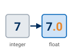{ .tool-icon }<br>**Float** | A Spatial Analyst tool that converts a raster from an integer type to a floating-point type, so that the decimal part of a division survives. NDVI is a ratio between −1 and 1; divide two integer rasters and every cell rounds to −1, 0 or 1 — almost all of them to 0. |
| 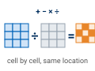{ .tool-icon }<br>**Plus, Minus, Divide** | Map-algebra tools that take two rasters and add, subtract or divide them **cell by cell**, producing a new raster. Order matters for Minus and Divide: the first input is the one the second is subtracted from, or divided into. |
| 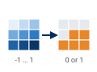{ .tool-icon }<br>**Reclassify** | Replaces ranges of values in a raster with new values. Here it turns the continuous NDVI surface into two classes — non-irrigated and irrigated — at a threshold you choose and defend. |
| { .tool-icon }<br>**Raster Calculator** | Evaluates a map-algebra *expression* you write, over every cell. In Step 5 it does the same job as Reclassify — `Con(NDVI >= threshold, 1, 0)` — but with the threshold as a variable the model can expose as a parameter. |

## Example Model

![The finished ModelBuilder model exported as a vector diagram: the red and NIR band rasters each pass through a Float tool; the two float rasters feed a Minus tool (NDVI_numerator) and a Plus tool (NDVI_denominator); those feed a Divide tool that produces NDVI. NDVI feeds a Reclassify tool producing NDVI_reclass and a Raster Calculator producing NDVI_class; a Double variable named Threshold also feeds the Raster Calculator. The two inputs, Threshold, and both outputs carry a P, marking them as model parameters.](images/lab02-model-overview.svg)

**Figure C.** The finished model, exported from ModelBuilder as a vector diagram — **click it to open it full size**. Rename the intermediate datasets to something a reader can follow, as here, rather than leaving Pro's defaults such as `Minus_NIR_Fl1`. Everything marked `P` appears in the tool dialog you build in Steps 4 and 5.

## Complete the Lab

For an advanced GIS student, the information up to this point is all you need to complete the assignment and create an output map from the results. Feel free to try conducting the analysis using only the information provided above. If you need extra help, follow the step-by-step solution below. Ensure that you create and screen capture an ArcGIS Pro toolbox interface for your model.

> [!TIP]
> If you complete the lab using only the information provided above — without using the step-by-step instructions below — say so in your report.

## Step-by-Step Solution

> [!NOTE]
> **Important Note #1:** The steps below walk through Utah County at the handout's threshold. In
> Step 6 you will re-run the same model at other thresholds — so build it once, and build it so it
> is easy to change.

> [!NOTE]
> **Important Note #2:** My example screenshots in this and future assignments may or may not match
> your data exactly. They were captured in ArcGIS Pro 3.7.1 against the extract you downloaded.
> Use them as a reference, but read what is actually on your screen. In particular, the paths in the figures start with `C:\Ames\` because they were captured on an instructor machine where C: is writable; yours will start with `D:\`.

### Step 0

**Create the project.** Start ArcGIS Pro, choose the **Map** template, name the project `Lab02`, and put it in your lab folder. As in Lab 1: the *Location* box does not take a typed path, so use the folder button beside it, and uncheck *Create a folder for this local project* if you already made the `Lab02` folder.

**Add the two Utah County bands to the map.** On the **Map** ribbon tab click **Add Data** and add `UtahCounty_Red_B4_SR_x10000.tif` and `UtahCounty_NIR_B5_SR_x10000.tif`. Pro will ask, once per raster, whether to **build pyramids and calculate statistics** for it (Figure 0a). Leave both boxes checked and click **OK** — without statistics Pro cannot stretch the display, and the raster draws as a flat gray block; pyramids are what let it redraw quickly when you zoom. It takes a few seconds per band.


**Figure 0a.** The pyramids-and-statistics prompt. Leave both checked and click OK.

> [!TIP]
> **Check what you loaded.** In the Contents pane each band shows its value range. The red band
> runs 0 to **13,276** and the NIR band 0 to **12,982** — reflectance × 10,000, so the brightest
> red cell in the county reflects about 133 % of what a perfect white surface would, which
> happens on bright playa and rooftops. If your ranges are 0 to 65,535 you have a raw download,
> not the extract.

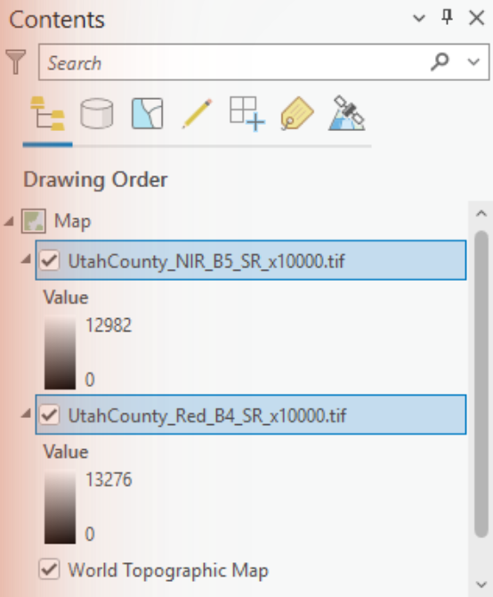

**Figure 0b.** The two bands in the Contents pane, with the value ranges to check against.

**Check that you have Spatial Analyst.** Every tool in this lab is a Spatial Analyst tool. Click the **Project** tab, then **Licensing**, and scroll the *ArcGIS Pro Extensions* list to **Spatial Analyst** — it should read *Licensed: Yes* (Figure 0c). If it says *No*, tell your instructor: with the Named User license BYU uses, extensions are assigned to your account by the organization's administrator, and there is nothing on this page you can click to turn one on. (The *Configure your licensing options* button only changes which portal Pro signs in to. Older versions of this handout said to open it and check a box; the box does not exist.)

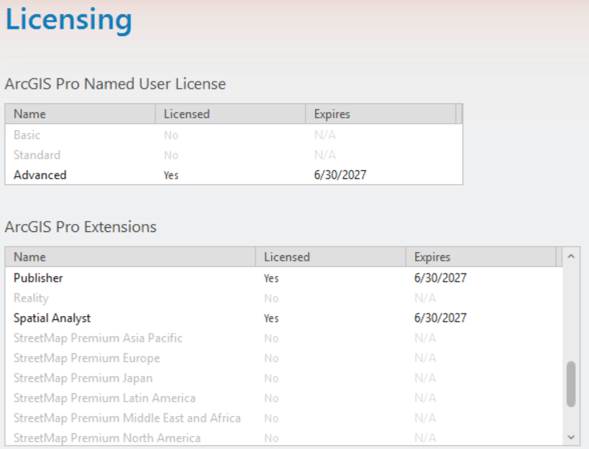

**Figure 0c.** Project ▸ Licensing. Spatial Analyst must show *Yes*.

**Create the model.** On the **Analysis** ribbon tab click **ModelBuilder**. That creates a model called *Model* in your project toolbox (`Lab02.atbx`) and opens it. Give it a real name before you forget — but first close the ModelBuilder view (the × on its tab): while a model is open in ModelBuilder, Pro will not rename it, and F2 silently does nothing. Then in the **Catalog** pane expand **Toolboxes ▸ Lab02.atbx**, click the selected name a second time (or press F2), and call it `NDVI` (Figure 0d). Right-click the model and choose **Edit** whenever you need to reopen it in ModelBuilder; **Open** runs it as a tool instead, which you will use in Step 4.

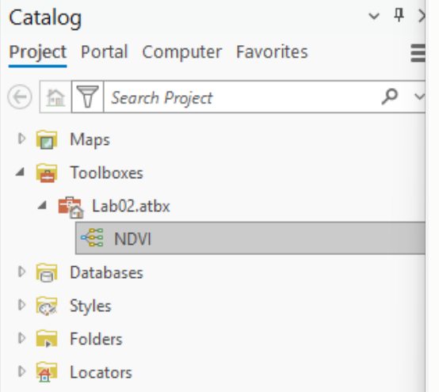

**Figure 0d.** The model in the project toolbox, renamed to NDVI.

**Look at the Environments before you build anything.** On the **ModelBuilder** ribbon tab click **Environments** (in the *Model* group). This dialog (Figure 0e) is the raster equivalent of Lab 1's coordinate-system step, and it has more knobs:

- **Output Coordinate System.** Leave it empty (*Same as Input*) for this lab, so every output comes out in the scene's own UTM zone. (Figure 0e shows it empty, which is what you want. If yours is filled in, the project inherited a coordinate system from the map: clear it, or every output will be silently reprojected and your maps will have to say so.) If you set it to a specific zone, Pro will silently *reproject* any scene from another zone into it — which is what would happen to a scene of your own from outside zone 12. That works, but you should know it happened.
- **Cell Size, Snap Raster, Extent, Mask** (under *Raster Analysis* and *Processing Extent*). Every one has a default that will do something you did not ask for if your inputs disagree: Cell Size defaults to the coarsest input, Extent to the intersection of the inputs. Here both bands match exactly, so the defaults are right — but check them again the day you mix rasters from two sources.

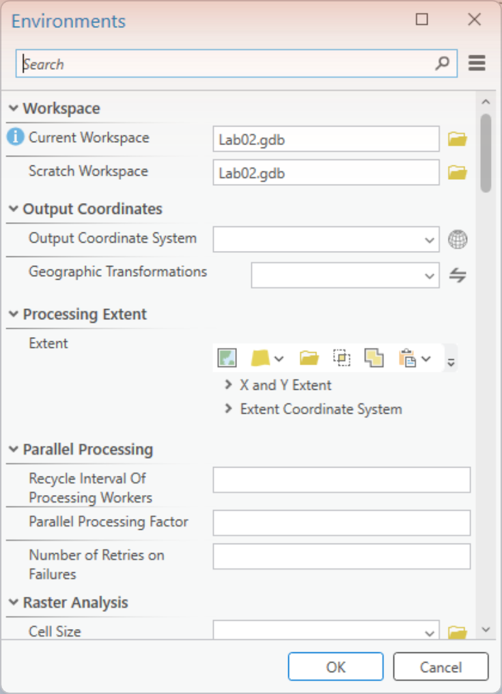

**Figure 0e.** ModelBuilder ▸ Environments. The settings that decide what your rasters come out as.

> [!TIP]
> **Sanity check.** Every classified raster your model produces for Utah County should have **6,040,284
> cells** with data, which at 30 m is **2,099 square miles**. You can read the count from the
> attribute table of any classified output (add the two Count values). A different number means an
> environment — extent, cell size or mask — changed something on the way through.

### Step 1

Use the **Float** tool to change the data inside each raster from an integer type to a float type. Both bands need it, so you will use the tool twice.

Drag the two band layers from the **Contents** pane onto the ModelBuilder canvas: they appear as blue input ovals. Then add the tool. There are two ways: on the **ModelBuilder** ribbon tab click **Tools** (in the *Insert* group) to open the Geoprocessing pane, search for *Float*, and drag **Float (Spatial Analyst Tools)** onto the canvas — or click an empty spot on the canvas and simply **start typing the tool's name**, which opens the *Add Tools To Model* search box (Figure 13, in Step 5, shows it); double-click the tool you want. Do it twice. (The Image Analyst and 3D Analyst toolboxes have a Float too. They do the same thing but need a different license; use the Spatial Analyst one.)

Connect each input to its Float tool by dragging from the oval to the tool. When you release, a menu asks which parameter the connection feeds (Figure 1a) — choose **Input raster or constant value**.

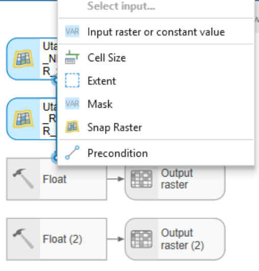

**Figure 1a.** Drop the connector on the tool and pick the parameter it feeds.

Now double-click each Float tool and give its **Output raster** a name you will recognize later — `NIR_Float` and `Red_Float` (Figure 1, top). A name typed here is created in your project geodatabase. Click **OK**.

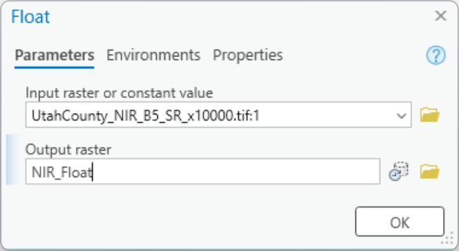


**Figure 1.** Top: the Float tool. The `:1` after the input name means band 1 of the file, which is the only band. Bottom: both bands converted.

> [!NOTE]
> **Why Float first?** These rasters are 16-bit integers. Minus and Plus of two integer rasters
> give integers, and Divide of two integer rasters gives an **integer** — so NDVI, which lives
> between −1 and 1, would come out as 0 almost everywhere. Float makes the arithmetic keep its
> decimals. The Float outputs have exactly the same value ranges as the inputs (0 to 13,276 and 0
> to 12,982); only the storage type changed. If your NDVI layer has only two or three distinct
> values, this is what you skipped.

### Step 2

Use the **Minus**, **Plus** and **Divide** tools to model the NDVI equation: first the top and bottom of the fraction separately, then the division.

```text
NDVI = (NIR - RED) / (NIR + RED)
```

Add **Minus (Spatial Analyst Tools)** and **Plus (Spatial Analyst Tools)** to the canvas. Connect `NIR_Float` to each as **Input raster or constant value 1** and `Red_Float` to each as **Input raster or constant value 2**. For Plus the order does not matter; for Minus it decides the sign of your entire result, so check it in the dialog (Figure 2). Name the outputs `NDVI_numerator` and `NDVI_denominator`.

Then add **Divide (Spatial Analyst Tools)**, connect `NDVI_numerator` as value 1 and `NDVI_denominator` as value 2, and name the output `NDVI`. Click **Auto Layout** and then **Fit to Window** on the ModelBuilder ribbon to tidy the canvas (Figure 3).


**Figure 2.** The Minus, Plus, and Divide tool windows. In every one, the first input is the thing on the left of the operator.


**Figure 3.** Minus, Plus, and Divide in ModelBuilder. The crossing connectors are normal — each Float output goes to two tools.

> [!WARNING]
> **Click OK on every tool dialog before you click Run.** As in Lab 1, a model runs with the last
> *committed* parameters. A dialog left open with an unsaved output name runs with the old one.
> One more quirk seen in Pro 3.7: occasionally a tool dialog's OK button ignores clicks until you
> drag the dialog to a new spot on the screen. If OK does nothing, move the dialog and try again.

**Run it.** Right-click the `NDVI` output oval and choose **Add To Display**, so the result appears in the map, then click **Run** on the ModelBuilder ribbon. A progress dialog steps through the five tools (Figure 4) — about half a minute for Utah County. Every tool and output turns green with a check mark when it has run.

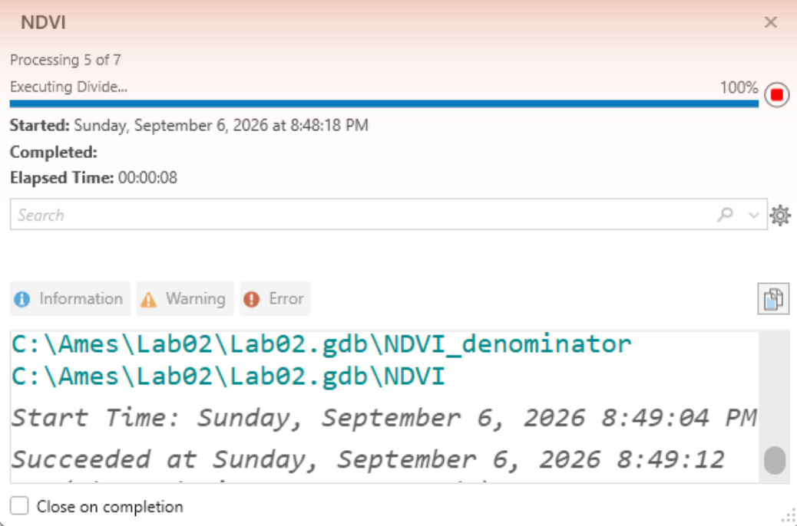

**Figure 4.** The model running. (This capture is from a later run, after Step 5 had added two more tools, so it counts to 7; yours will count to 5.) Leave *Close on completion* unchecked the first time so you can read the messages.

> [!TIP]
> **Check the result.** The NDVI layer's legend in the Contents pane should read **−1 to 1**. Over
> the county the mean is about **0.40** and the median **0.43**; **6.6 %** of the cells are below
> zero. Utah Lake should be black (−1.0, for the reason in the Data section), the mountains and the
> irrigated valley floor bright, and the dry benches and the west desert mid-gray (Figure 5). Two
> failure modes: only three values, −1, 0 and 1, with 0 nearly everywhere, means the Float step was skipped;
> values crowded near zero everywhere usually means the reflectance offset was not applied to a
> raw download.


**Figure 5.** The NDVI surface. Bright is green vegetation; dark is water.

### Step 3

Use the **Reclassify** tool to turn the NDVI surface into two classes at a threshold that separates irrigated cropland from everything else. The handout's threshold is **0.4**, which was found by drawing a polygon over a known irrigated field in an earlier scene and taking its mean NDVI:

- Non-irrigated land: −1.0 to 0.4 → new value **0**
- Irrigated cropland: 0.4 to 1.0 → new value **1**

Treat 0.4 as a starting point, not an answer — see the note after Figure 8.

Add **Reclassify (Spatial Analyst Tools)** to the canvas. Connect `NDVI` to it as **Input raster**, then double-click the tool. **Reclass field** should already read `VALUE`. The reclassification table starts empty, and ArcGIS Pro has no *Add Entry* or *Delete Entries* buttons — there are two ways to fill it:

- **Use Classify.** Click the **Classify** button, set **Classes** to `2` (use Tab, not Enter, to leave the box — Enter closes the dialog), then double-click the first *Upper value*, type `0.4`, press Tab, and click OK (Figure 6a). (The *Method* box may go on saying *Natural Breaks*; the break values in the list are what count.) The table now has two rows; change their **New** values to `0` and `1`.
- **Or type the rows.** Typing into the empty last row adds a row: enter *Start*, *End* and *New* for each class. To remove a row, click it once to select it and press the **Delete** key (clicking a selected cell a second time edits it instead).

Either way, finish with the two rows shown in Figure 6, plus the `NODATA → NODATA` row Pro adds for you. Name the **Output raster** `NDVI_reclass` and click **OK**.

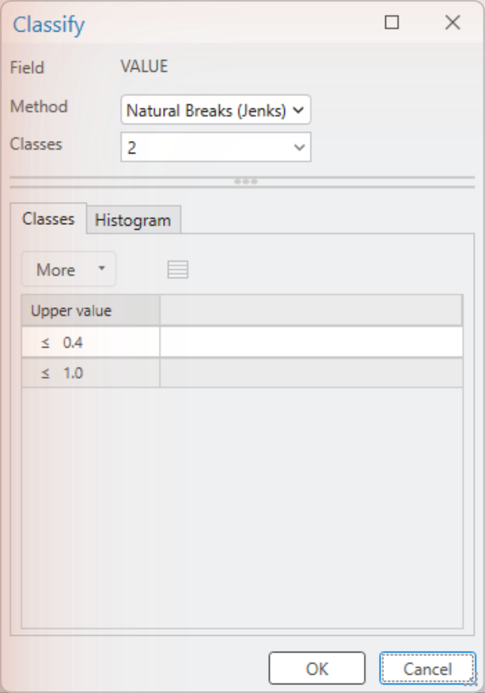

**Figure 6a.** The Classify dialog with two classes and a break at 0.4.


**Figure 6.** The Reclassify tool window, and the tool at the end of the model.

Right-click `NDVI_reclass` and choose **Add To Display**, then **Run** again. Only Reclassify runs this time — the tools that already ran are skipped (Figure 7a). The message log shows the remap table the tool used, `"-1 0.400000 0;0.400000 1 1"`, which is a good thing to paste into your report.

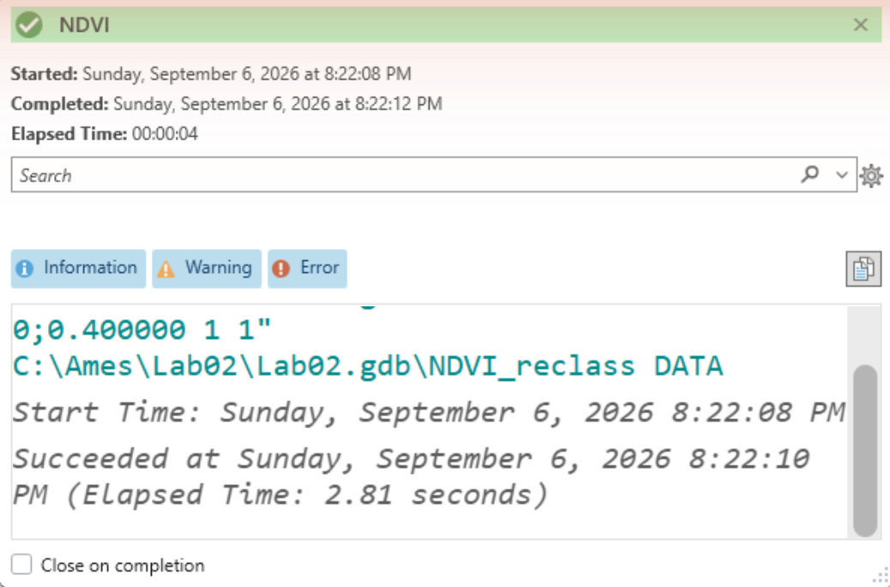

**Figure 7a.** Reclassify alone takes about five seconds.

> [!TIP]
> **Check the result.** Open the attribute table of `NDVI_reclass`. At 0.4, value 1 should have
> about **3,197,000 cells** — **1,111 of 2,099 square miles, 53 %** of the county. That is not a
> typo: the threshold puts half the county in the "irrigated" class. Keep reading.

**Symbolize it.** Select the `NDVI_reclass` layer, and on the **Raster Layer** ribbon tab click **Symbology**. Pro has already chosen *Unique Values* on `Value`. Double-click each *Label* to rename the classes — `Non-irrigated land` and `Irrigated cropland` — and click each color patch to pick something sensible, such as tan and green (Figure 7b).


**Figure 7b.** The classified result. Look at the mountains.

Now zoom in. Southwest of Utah Lake, around Elberta, the center-pivot sprinklers show up as the circles the assignment asks you to find (Figure 8). Compare the classified layer with the NDVI surface underneath it — turn `NDVI_reclass` off and on in the Contents pane — and notice which fields the threshold picks up and which it misses.

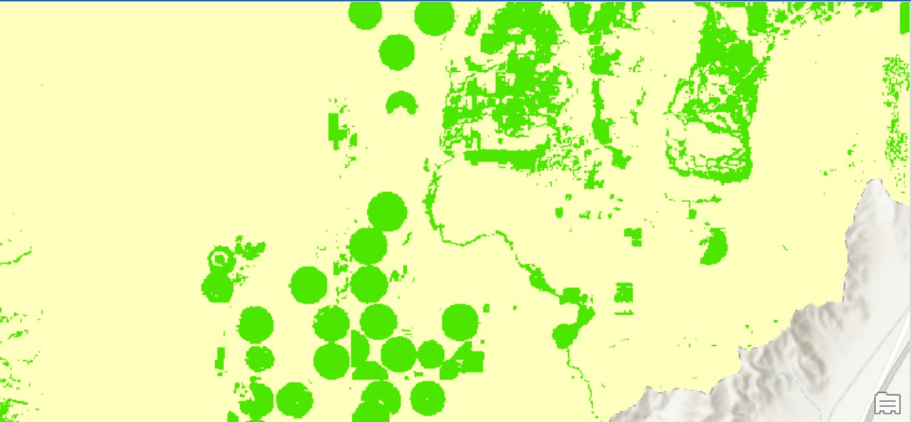

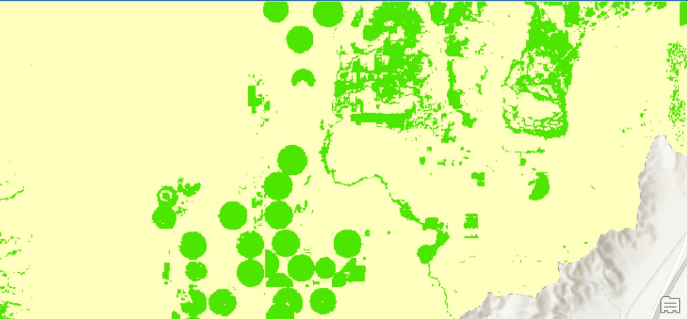

**Figure 8.** Center-pivot irrigation near Elberta. Top: classified at 0.4. Bottom: the NDVI surface beneath it. Some circles are much greener than others — a crop just planted, or just cut, can fall below the threshold and still be an irrigated field.

> [!IMPORTANT]
> **The threshold is yours to defend.** Look at Figure 7b again: at 0.4, the forested slopes of
> the Wasatch and Uinta mountains are "irrigated cropland." They are not — they are green because
> it is July and they are forest. Figure A has the numbers: forest reads about **0.75**, the
> irrigated field **0.47**, a dry bench **0.24** and a downtown block **0.27**. NDVI measures
> greenness, and a single threshold cannot tell an irrigated field from a canyon full of scrub
> oak. That is not a flaw in your model; it is a limit of the method, and your report has to say so.
>
> Do two things. **First**, check the threshold against your own scene: find a field you can
> confirm is irrigated (the imagery basemap and the circles in Figure 8 will do) and a patch of
> dry ground you can confirm is not, read the NDVI value of each with the Explore tool, and say
> whether 0.4 sits between them. Change it if it does not. **Second**, say in your report where the
> classification is wrong and why, and what extra information — elevation, a land-use layer, a
> second scene from another season — would let you fix it. Two students with different thresholds,
> each justified from their own scene, can both be right. Step 6 turns this into numbers.

### Step 4

Give your model a **toolbox interface**, so it can be run from a dialog like any other tool.

Right-click each of the two input ovals and the final `NDVI_reclass` output, and choose **Parameter** (Figure 9). A `P` appears beside each one. Then click **Save** on the ModelBuilder ribbon.


**Figure 9.** Right-click an input or output ▸ Parameter.

Parameters appear in the dialog in the order you created them. If your output ended up above your inputs, click **Properties** on the ModelBuilder ribbon, open the **Parameters** tab, and drag the rows by their row number into a sensible order — inputs first, output last (Figure 10). While you are there, look at the **General** tab (Figure 10a). A model has both a *Name* and a *Label*, and renaming it in the Catalog pane changed only the *Label* — the *Name* is still `Model`, which is why the dialog's title says so. Set the *Name* to `NDVI` as well.

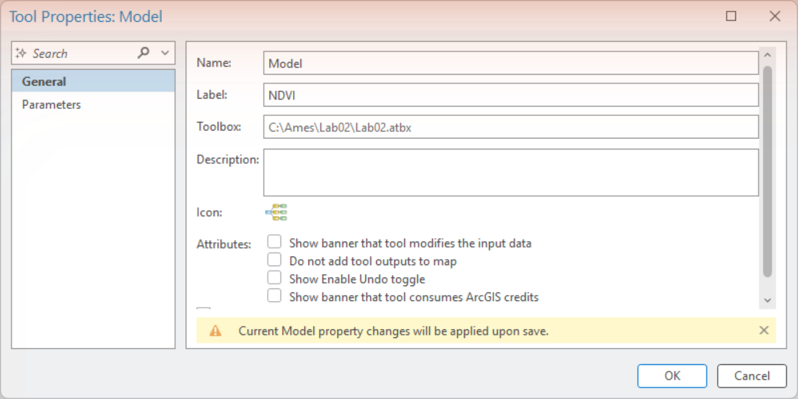

**Figure 10a.** Properties ▸ General. The Catalog rename changed the Label; the Name is set here.

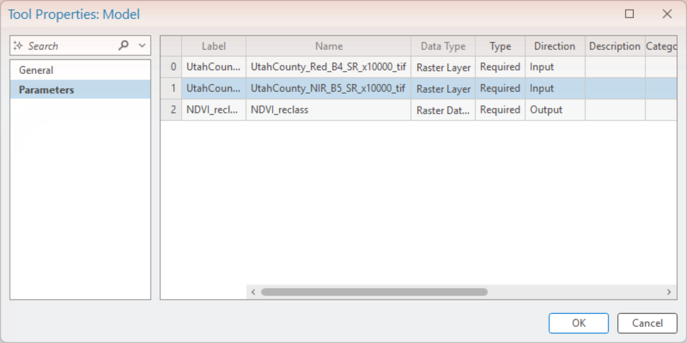

**Figure 10.** Properties ▸ Parameters. Drag a row by its number to reorder.

Now open the model as a tool: in the **Catalog** pane, right-click `NDVI` in `Lab02.atbx` and choose **Open**. The Geoprocessing pane shows your parameters and a **Run** button (Figure 11). **Do not click Run yet** — read the warning below first. You will add one more parameter in the next step before you screen-capture this for your report.

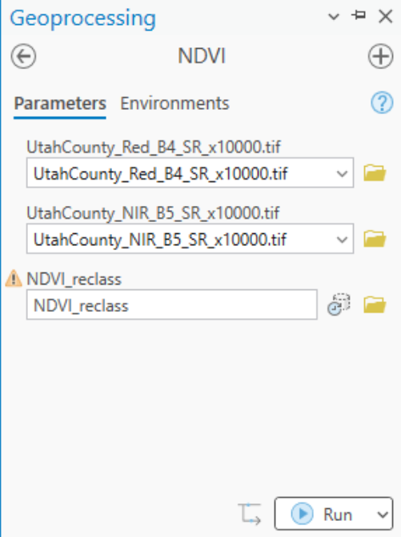

**Figure 11.** Your model, opened as a tool.

> [!WARNING]
> **Running the model as a tool deletes its intermediate data.** Everything in the model that is
> *not* a parameter — `NIR_Float`, `NDVI_numerator`, and the `NDVI` surface itself — is
> "intermediate," and ModelBuilder deletes intermediate datasets from your geodatabase when the
> model finishes running from the tool dialog (not when you click Run inside ModelBuilder). The
> NDVI layer will vanish from your map. If you want to keep the NDVI surface — and you do, for
> your report and for Step 6 — select the `NDVI` oval on the canvas and click **Intermediate** on
> the ModelBuilder ribbon to switch that flag off, or make it a parameter too.

### Step 5 — Expose the threshold

Everything in this lab hangs on one number, and right now that number is buried inside the Reclassify table. Get it out where it can be changed from the tool dialog, exactly the way Lab 1 exposed the two buffer distances.

1. On the **ModelBuilder** ribbon, in the *Insert* group, click **Create Variable**. In the *Variable Data Type* dialog leave *Single value* selected, choose **Double** from the data-type list (it is long: open it and press the Down arrow, or type D repeatedly, until *Double* is highlighted, then press Enter), and click OK (Figure 12a). A new oval labeled *Double* appears.
2. Right-click it ▸ **Rename**, and call it `Threshold`. Double-click it and type `0.4` as its value (Figure 12b). Right-click it again ▸ **Parameter**.
3. Click an empty spot on the canvas and **type** `Raster` — the *Add Tools To Model* box opens (Figure 13). Double-click **Raster Calculator (Spatial Analyst Tools)**.
4. Double-click the new tool. In the **Map Algebra expression** box type, exactly:

    ```text
    Con("%NDVI%" >= %Threshold%, 1, 0)
    ```

    Name the **Output raster** `NDVI_class` and click OK (Figure 14). The `%name%` syntax is ModelBuilder's *inline variable substitution*: it means "put the current value of that model variable here." As soon as you click OK, ModelBuilder draws the connectors from `NDVI` and `Threshold` to the tool by itself.

5. Right-click `NDVI_class` ▸ **Add To Display**, and ▸ **Parameter**. **Save**, then **Run**. Reclassify and Raster Calculator run (Figure 15); read the message log — it shows the expression with your threshold substituted in: `Con(Raster("...NDVI") >= 0.4, 1, 0)`.

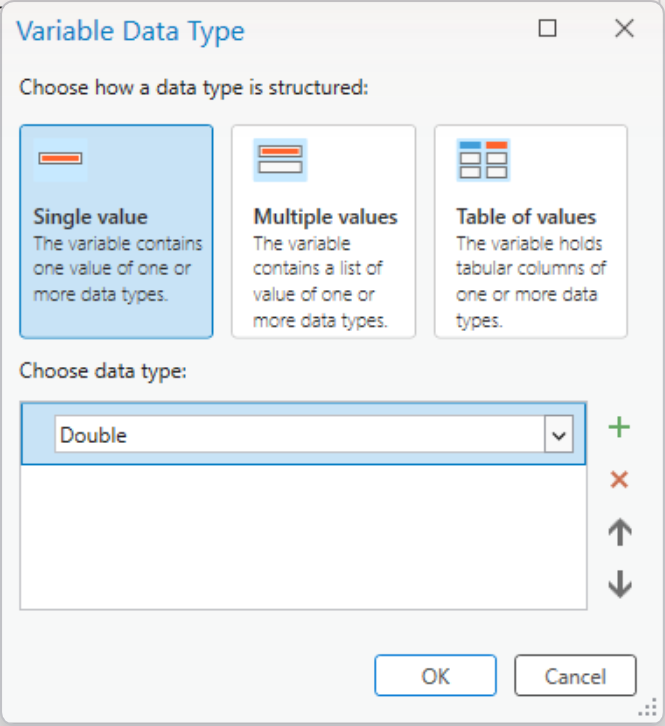

**Figure 12a.** Create Variable ▸ Double.

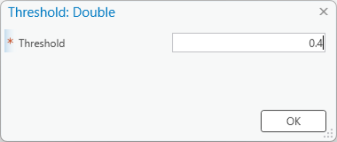

**Figure 12b.** Double-click the variable to give it a value.

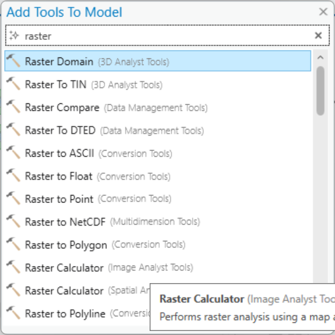

**Figure 13.** Type on the canvas to add a tool.

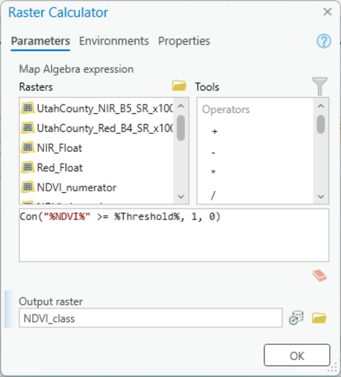

**Figure 14.** The Raster Calculator with the threshold as an inline variable.

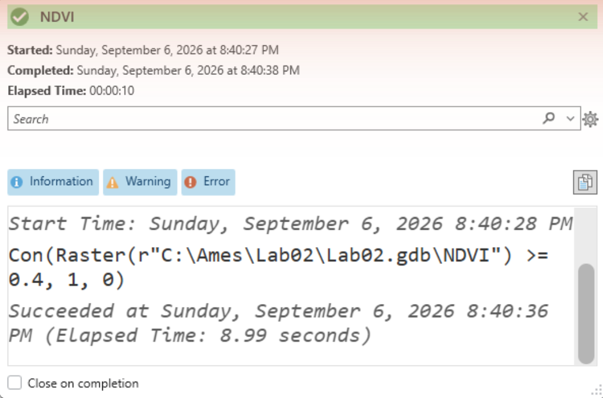

**Figure 15.** The run log. The substituted value, 0.4, is right there in the expression.

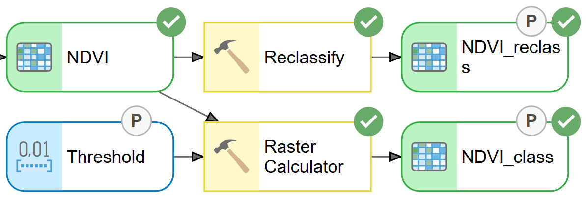

**Figure 16.** The finished model: Reclassify and Raster Calculator side by side, both classifying the same NDVI surface. They give identical results at 0.4 — check that they do — and only one of them can be changed from the dialog.

Now open **Properties ▸ Parameters** again, drag `Threshold` up under the two inputs by its row number (Figure 16b), and reopen the model from the Catalog pane. The dialog now has a **Threshold** box (Figure 17). **Screen capture this dialog for your report** — it is one of the deliverables.

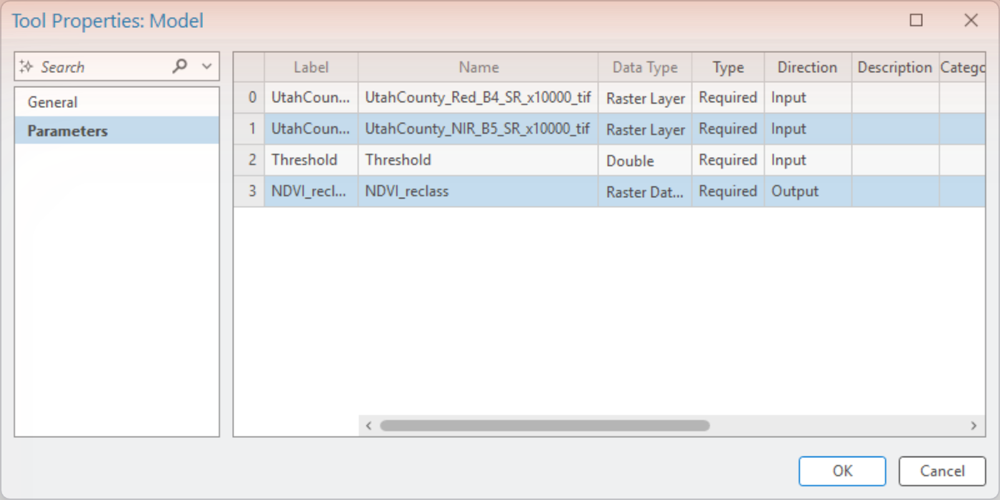

**Figure 16b.** Properties ▸ Parameters after the drag: inputs first, then the threshold, then the outputs. Mark `NDVI_class` as a parameter too and it joins the list.

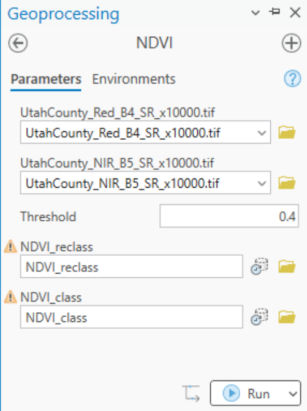

**Figure 17.** The toolbox interface with the threshold exposed.

> [!NOTE]
> **Why two classification branches?** Reclassify is the tool you will meet again in Labs 5 and 6,
> and its table is the honest way to show a reader every class boundary. The Raster Calculator
> branch exists for one reason: a number typed into a Reclassify table cannot be a model
> parameter, and a number in a `Con()` expression can. Once you have the threshold in the dialog,
> Step 6 is "type a number, click Run" instead of "open the tool, edit two rows, hope you changed
> both." That is the whole case for model parameters — not that they are good practice in the
> abstract, but that they make the run you are about to repeat cheap.

### Step 6 — How much depends on the threshold?

The classified map from Step 3 is *an* answer, not *the* answer: it is what the county looks like if "irrigated cropland" means "NDVI at or above 0.4," and Figure 7b already showed that definition sweeping in the mountains. This step is about not simply believing that map. Every threshold is a different definition of "green enough," and what drops in or out as you move it tells you what the class actually contains — forest, town lawns, wetland edges, a pivot between cuttings. Small changes to that one number are the tool for finding out, and for saying with numbers rather than impressions how much of your map you trust.

Run the model from its tool dialog at least **three more times**, each with a different threshold, and record what happens. Sensible choices are **0.3, 0.5 and 0.6 or 0.7**, but pick deliberately and say why. Each run: type the threshold, give both outputs a new name that carries the threshold in it (`NDVI_class_06`, and so on — the dialog warns you when a name already exists, and will overwrite it if you let it), and click Run. Remember which branch the threshold feeds: `NDVI_class` changes with it, but the Reclassify branch is still fixed at 0.4, so `NDVI_reclass_06` is the 0.4 classification under a misleading name. Read your counts from `NDVI_class_…`. The whole model re-runs each time, about a minute for Utah County (Figure 18).

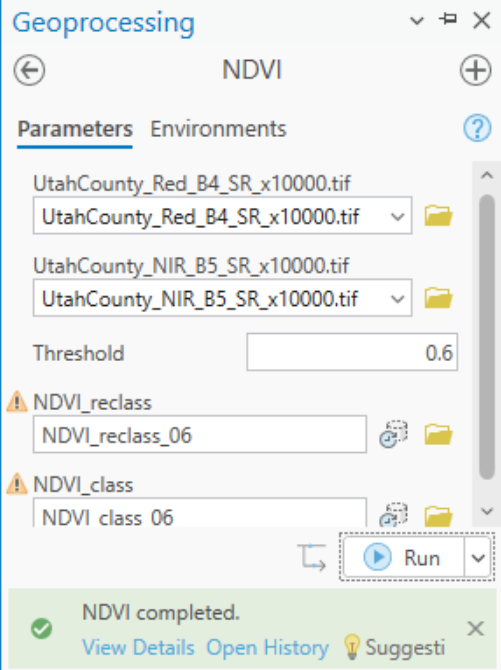

**Figure 18.** A scenario run from the dialog: threshold 0.6, outputs renamed, one minute. Only `NDVI_class_06` reflects the new threshold.

For every run, record the threshold, the number of cells in class 1 (from the attribute table of the `NDVI_class_…` output), and the area in square miles (cells × 900 m² ÷ 2,589,988). Put it in a table — that table is a required deliverable.

Then answer these three questions in your report:

1. **Which threshold best matches the fields you can verify?** Use the center pivots near Elberta and one dry area you are sure of, and the imagery basemap. Support it with the NDVI values you read, not an impression.
2. **At what threshold does the forest drop out — and what else drops out with it?** Look at the pivots as you raise the threshold. Is there a threshold that keeps the fields and loses the mountains?
3. **Is a single NDVI threshold enough to map irrigation in this county?** If not, what would you add — elevation, a land-use layer, a second date — and how would it help?

Finally, **pick one of these runs for your second map** — whichever one most changes what a reader would conclude about where the irrigated land is. Say on the map, in its title and its text box, what the threshold was and why you chose that run to show. Figures 19 and 20 are an example of the pair.

> [!TIP]
> Two things worth knowing before you start. At 0.4 the "irrigated" class covers about half the
> county, and even at 0.6 it is still a third — by which point some of the pivots in Figure 8 have
> gone too. And the forest never drops out before the fields do. Finding
> out why, and being able to show it, is the point of this step.

## Deliverables

Make **two** professional map layouts:

1. **Your baseline result** — the classified NDVI for Utah County at the threshold you chose and defended, with the center-pivot area shown in an inset.
2. **One scenario from Step 6** — the same model at a different threshold, whichever of your runs most changes the picture. Say on the map what changed and why you chose that run to show.

Write a brief report (2–3 pages of text, plus your figures and maps) covering:

- a title block — assignment title, your name, the date and the course — and the name of your peer reviewer
- the requirements of the project and your approach to solving it
- **a description of your model** a reader could repeat from: each tool and its settings, and every input, intermediate and output dataset with its type and, for the inputs, satellite, band, acquisition date, cloud cover and source
- **one** full-page figure of your model — export it from ModelBuilder (**Export ▸ Export To Graphic**) rather than screen-capturing it, so every label is readable — and **one** screen capture of its toolbox interface showing the threshold parameter
- **the three MTL values** from Figure B — acquisition date, cloud cover, and the reflectance offset — and what each one means for your result
- your **threshold table** from Step 6 and your answers to its three questions
- **where the classification is wrong and why**, and what additional data would fix it
- **a copy of the rubric below with your self-assessment filled in** — a score in every row, honestly arrived at. The grader will compare it with theirs.
- optionally, for up to five points of **extra credit**, the Magic Valley results described under *Going further* in the Data section

The rubric at the end of this lab gives the point value of every item above, so read it before you write.

> [!IMPORTANT]
> **Peer review before you submit.** Have another student in the class read your report against
> the rubric and give you feedback, then act on that feedback before the deadline. Name your
> reviewer in the report and say in a sentence what you changed because of them. A report nobody
> else has read is a draft, not a submission.

## References

Campbell, J.A. (2008) *Introduction to Remote Sensing.* The Guilford Press. 465-466.

<!-- VERIFY: author initials for the Campbell reference were not checked against the book. -->

Hamilton, R.M., Foster, R.E., Gibb, T.J., Johannsen, C.J., and Santini, J.B. (2009) "Pre-visible Detection of Grub Feeding in Turfgrass using Remote Sensing." *Photogrammetric Engineering and Remote Sensing.* 75. 179-191.

Jensen, J.R. (2000) *Remote Sensing of the Environment: An Earth Resource Perspective.* Prentice Hall, Upper Saddle River, New Jersey. xii, 361-362.

Kramber, W.J., Morse, A., and Allen, R.G. (2010) "Mapping Evapotranspiration: A Remote Sensing Innovation." *Photogrammetric Engineering and Remote Sensing.* 76. 6-10.

Lillesand, T.M., Kiefer, R.W., and Chipman, J.W. (2008) *Remote Sensing and Image Interpretation.* John Wiley & Sons, Inc. 464.

U.S. Geological Survey (2025). Landsat 8 OLI/TIRS Collection 2 Level-2 Surface Reflectance, scene LC08_L2SP_038032_20250712_20250725_02_T1. Extract prepared for BYU CE 414, 2026.

## Example Maps

Two example layouts follow, both laid out and exported from ArcGIS Pro 3.7.1 against the run described on this page. They are examples, not templates: your maps will and must look different, because they will be based on your own threshold, your own cartographic choices and your own layout. Your maps must include your name.

![Example finished layout titled "Irrigated Cropland in Utah County from Landsat NDVI": the classified raster over a light gray basemap of Utah County, tan for non-irrigated land and green for irrigated cropland, with seven labeled city points, the county outline, a red extent box near Elberta, an imagery inset of the center-pivot fields there with the classification at 55 % opacity, a legend, north arrow, scale bar in miles, and a text box giving the result (1,111 of 2,099 square miles above 0.4), the author, date, projection, data sources and method.](images/lab02-example-map-utah-county-2025.png)

**Figure 19.** The Utah County map at the handout's threshold. Two things to do better than this example: put the threshold in the title itself, not only the subtitle, and give the inset a scale bar of its own instead of a scale in its caption. Notice what the text box admits: 53 % of the county is above 0.4 because the forested mountains are in the green class. A map that shows the classification honestly, and says in words where it is wrong, is worth more than one that hides it.


**Figure 20.** The kind of second map Step 6 asks for: the threshold raised from 0.4 to 0.6, everything else unchanged. The irrigated class falls from 1,111 to 722 square miles, but the mountains stay green while several of the pivots in the inset turn tan — which is the argument that no single threshold does this job. The map says in its title and its text box exactly what was changed, as the rubric requires.

<!-- Both maps built 2026-09-06 by tools/lab02/build_layout.py (arcpy.mp against C:\Ames\Lab02\Lab02_Layout.aprx, exported by Pro at 150 dpi): `build_layout.py` for the 0.4 map, `build_layout.py NDVI_class_06 0.6 lab02-example-map-utah-county-06` for the scenario. City points are the seven largest municipalities by 2020 Census population from the UGRC Utah Municipal Boundaries service (Draper excluded: it crosses the county line). The old Word-era example, lab02-example-map-utah-county.jpg, was deleted when this page became the assigned lab. -->

## Rubric for Classifying Land Based on the NDVI

Fifty points in five parts of ten, plus up to five points of extra credit. The bullets say what each part is worth, so you know exactly what to submit.

| Item | Points |
| --- | --- |
| **Write-up** (2–3 pages)<br>• Assignment title, your name, date and course; your peer reviewer named, with a sentence on what you changed because of them (1)<br>• The requirements of the project and your approach to solving it, in your own words (2)<br>• The three MTL values — acquisition date, cloud cover and the reflectance offset — and what each one means for your result (2)<br>• Where the classification is wrong and why, and what additional data would fix it (3)<br>• Clear, organized writing: figures numbered and referred to in the text, sources credited, and this rubric pasted in with your self-assessment in every row (2) | /10 |
| **ModelBuilder model** — correct and working<br>• The model runs end to end from its tool dialog and produces a two-class raster; your cell count and area at the handout's 0.4 threshold match the check values in Steps 0 and 3 (4)<br>• A full-page (8.5 × 11) figure of the model: every tool and dataset shown, labels informative, all text readable at 10 pt or larger (2)<br>• A screen capture of the toolbox interface with the threshold exposed as a parameter, showing the input and output parameters (2)<br>• A description of the model a reader could repeat from: each tool, its settings, and every input, intermediate and output dataset with its type; for each input, the satellite and band, acquisition date, cloud cover and source (2) | /10 |
| **Map 1 — your baseline** (full page, 8.5 × 11)<br>• Title stating the threshold used (1)<br>• Neat line, north arrow and scale bar (1)<br>• Text box with author, date, map projection, and the satellite, scene and acquisition date (1)<br>• The classified raster, irrigated versus non-irrigated land clearly symbolized, with a legend (2)<br>• County polygon and a few labeled cities or towns (1)<br>• An inset of the center-pivot area (2)<br>• Basemap visible, zoomed to an appropriate scale, and all text legible when printed (2) | /10 |
| **Map 2 — one Step 6 scenario** (full page, 8.5 × 11)<br>• Title stating the threshold used (1)<br>• Neat line, north arrow and scale bar (1)<br>• Text box with author, date, map projection, and the satellite, scene and acquisition date (1)<br>• The classified raster, irrigated versus non-irrigated land clearly symbolized, with a legend (2)<br>• County polygon and a few labeled cities or towns (1)<br>• Basemap visible, zoomed to an appropriate scale, and all text legible when printed (2)<br>• The title and text box say what the threshold was changed to and why you chose this run to show (2) | /10 |
| **Threshold sensitivity** (Step 6)<br>• A table of at least three additional runs, giving the threshold, the cells in class 1 and the area for each (4)<br>• Which threshold best matches fields you can verify, supported by NDVI values you read (2)<br>• Where the forest drops out and what drops out with it (2)<br>• Whether a single threshold is enough, and what you would add (2) | /10 |
| **Total** | **/50** |
| **Extra credit — the Magic Valley extract** (see *Going further* in the Data section)<br>• Your model run on the Magic Valley extract at your chosen threshold, with the cells and area of class 1 reported (1)<br>• NDVI read at a pivot you can verify is irrigated and at ground you can verify is not, and whether your threshold sits between them (2)<br>• A map or figure of the result (1)<br>• A paragraph: does your threshold transfer, and what in that landscape explains why or why not (1) | up to +5 |

<!-- Migration notes (2026-09-06, draft, round 2): source: docs/assignments/lab-02/README.md (the 2026-09-03 migration of Lab 2 - NDVI.docx) plus a full run of the lab in ArcGIS Pro 3.7.1 on a local Windows machine (not Citrix), project C:\Ames\Lab02\Lab02.aprx, model NDVI in Lab02.atbx, outputs in Lab02.gdb. Round 2 works through tools/lab02/PARITY_PLAN.md, which compares this page with the Lab 1 draft.
ArcGIS Pro version verified against: VERIFIED 2026-09-06 in ArcGIS Pro 3.7.1. Every step 0-6 was driven in the GUI. Every dialog on this page is a capture of that session.
ROUND 3 (2026-09-06, later): instructor decision - the second study area is NOT a requirement. The old "find another scene" step (and round 2's Step 7 on the Magic Valley extract) is dropped in favor of the Step 6 sensitivity analysis, exactly as Lab 1 dropped its second county; the second deliverable map is now a Step 6 threshold scenario (Figure 20 already is one). The Magic Valley extract is KEPT in docs/data as an optional going-further download because it was already built and costs a student nothing; delete the zip and the two fetch/make scripts in tools/lab02 if it is not wanted.
DATA PACKAGES: (1) docs/data/lab02-utah-county-landsat.zip, 21.8 MB (rebuilt after the round-2 note said 24.3): LC08_L2SP_038032_20250712_20250725_02_T1 (2025-07-12, path 38 row 32, 0.02 % cloud), C2 L2 SR bands 4 and 5 clipped to the UGRC Utah County polygon, scale factor applied (DN*0.0000275-0.2), negatives floored at 0 (KEPT by instructor decision 2026-09-06 - it makes water read exactly -1.0, now explained on the page), stored S16 * 10000, LZW; MTL and READ-ME inside. Prepared by the instructor 2026-09-05. (2, OPTIONAL going-further only since round 3) docs/data/lab02-magic-valley-landsat.zip, 4.8 MB: LC08_L2SP_040031_20250710_20250715_02_T1 (2025-07-10, path 40 row 31, 0.01 % cloud, UTM zone 11), same processing, clipped to lon -114.75..-114.25 lat 42.33..42.57 (Twin Falls / Kimberly / Hansen), built by tools/lab02/fetch_second_scene.py (STAC search + signed download from the Planetary Computer mirror) and tools/lab02/make_second_extract.py. First attempt at a box further north (to 42.75) was a third NoData: the scene's data edge is at about 42.6 N here. 1,297,813 cells, 0 % NoData.
PILOT (2026-09-06, round 3): a fresh agent read the page as a first-time student and reproduced every published check value with arcpy (Spatial Analyst) against the hosted extracts; notes at C:\Ames\Pilot02\PILOT_NOTES.md. Every number matched (cells, area, NDVI stats, class-1 area at six thresholds, Magic Valley figures, MTL values). Text fixes made from its findings: Figure 0e shows an inherited Output Coordinate System and the example maps say NAD 1983 (now explained in Step 0 and Figure 19 rather than re-shot - no desktop control was available this round); Step 6 now says to count NDVI_class, not the fixed-at-0.4 reclass output; the rubric's check-value bullet applies to the 0.4 run; the MTL lists the reflectance scale factors twice; skipping Float gives -1/0/1 (396,438 / 5,643,798 / 48 cells), not 0/1; Figures A and B are now lettered in page order; Figure 1b/6b references fixed; the one-third crossing is at 0.611 so the Step 6 TIP was reworded; Float/Minus/Plus have 6,040,288 cells (4 cells with red = NIR = 0 become NoData in Divide); zip sizes corrected to 21.8 and 4.8 MB; the no-step-by-step extra-credit promise dropped (no rubric row); model description and title block added to Deliverables. Not fixed: the MSS column of Table 1 is now headed Landsat 1-3 but still not checked against the live USGS page. GUI pilot still owed: nobody has yet driven Steps 0-6 as a student on a lab machine.

PILOT (2026-09-06, round 4, GUI): Steps 0-6 driven end to end through the ArcGIS Pro 3.7.1 interface by desktop control, from a new project and the hosted zip, at 175 % display scaling, with every figure re-captured from that session. Text corrections made: Figure 0a is the Build Pyramids and Calculate Statistics prompt; rename is blocked while the model is open in ModelBuilder (F2 does nothing); the Catalog rename changes the Label and the Name stays Model until set in Properties > General; the Classify dialog kept Method = Natural Breaks after the 0.4 break was typed; the Environments figure now shows an empty Output Coordinate System and the example maps say WGS 1984 UTM Zone 12N, so the Step 0 and Figure 19 apologies are gone. Check values reproduced from the GUI run: 1,111 of 2,099 sq mi (53 %) at 0.4 and 722 (34 %) at 0.6. Still owed on a lab machine: nobody has run this on a D:-drive student image.
VERIFIED NUMBERS (Utah County): 6,040,284 cells = 2,099 sq mi (county polygon 2,141; the 42 sq mi is boundary cells dropped by the clip - instructor decision 2026-09-06: not worth chasing); NDVI min -1 max 1 mean 0.399 median 0.431, 6.6 % below 0; class 1 at 0.2/0.3/0.4/0.5/0.6/0.7 = 1651/1327/1111/917/722/496 sq mi = 79/63/53/44/34/24 %; circle means (tools/lab02/samples.json): pivot field red 0.138 NIR 0.385 NDVI 0.47 (300 m circle); forest above Provo 0.048/0.344/0.75; Cedar Valley bench 0.156/0.255/0.24; Utah Lake 0.082/0.000/-0.99; Provo blocks 0.147/0.247/0.27 (1 km circles). Whole model 36 s inside ModelBuilder, about 66 s from the tool dialog (everything re-runs). Magic Valley (optional extract, measured with arcpy, not the GUI): 1,297,813 cells = 451 sq mi, mean 0.424 median 0.288, 0.0 % below 0; class 1 at 0.3/0.4/0.5/0.6 = 218/177/147/120 sq mi = 48/39/33/27 %.
PARITY ITEMS DONE THIS ROUND (numbers refer to PARITY_PLAN.md): 1 sensitivity step + threshold exposed via Raster Calculator Con() with a Double variable, alongside Reclassify (option a); 2 second scene = second prepared extract (middle option) in round 2, then DROPPED as a requirement in round 3 (see above); 3 Data section: metadata questions for imagery + Figure B, source table, water and area notes, Figure A measured; 4 Step 0 Environments + cell-count check; 5 expected numbers in Steps 0-3 and 6; 6 SVG export of the model (Figure C) + second example map (0.6 scenario) + both infographics generated by tools/lab02/make_svgs.py; 7 deliverables itemized and rubric re-split 30 -> 20 + 10 (proposal, superseded in round 3 by the instructor's 10/10/10/10/10 rubric with per-bullet values and +5 Magic Valley extra credit); 8 raster section added to docs/arcgis-tips.md.
ROUND 3 FIGURES: the four per-step ModelBuilder snippets (Steps 1, 2, 3 and Figure 16) are now cut from the SVG export by tools/lab02/cut_model_snippets.py (headless Chrome at 3x, 1 SVG unit = 4 px), with the P markers removed for Steps 1-3 and the Threshold variable masked out of the Step 2 cut, since neither exists yet at those steps. The three tool icons are now generated by tools/lab02/make_svgs.py alongside the two infographics. NOT DONE: 9 pilot runs.
GUI FACTS added this round: Create Variable dialog is "Variable Data Type" (Single value / Multiple values / Table of values, then a data-type list); the variable's value dialog is titled "<name>: Double"; typing on the canvas opens "Add Tools To Model"; the Geoprocessing-pane drag-drop stopped registering under desktop control mid-session while type-on-canvas kept working; %var% references in a Raster Calculator expression draw the connectors automatically; running from the tool dialog deleted NDVI, NIR_Float, Red_Float, NDVI_numerator and NDVI_denominator (intermediate data) and removed the NDVI layer from the map - now a WARNING in Step 4; the Environments dialog showed Output Coordinate System = NAD_1983_UTM_Zone_12N already set in this project (inherited), which is why the outputs are NAD 83 while the inputs are WGS 84 - Step 0 now tells students to leave it empty; Export > Export To Graphic writes SVG (Export Image dialog, type picker defaults to SVG); the Export button's main face sends the model to the Python window; the toolbox alias shows as "Lab01" in run details because Lab02.atbx was copied from Lab 1 - harmless, worth renaming in Toolbox Properties.
CORRECTIONS carried from round 1: licensing checkbox does not exist under Named User; Reclassify has no Add/Delete Entries; band numbers for Landsat 8/9; NDVI description; Landsat history.
TODO(instructor): (1) rubric DECIDED 2026-09-06: 10 write-up / 10 model / 10 map 1 / 10 map 2 / 10 sensitivity, Magic Valley extra credit up to 5; (2) Magic Valley extract KEPT as the extra-credit dataset; (3) snippets cut from the SVG - done; (4) the extra-credit offer has no rubric row; (5) Calera et al. 2001 not in References; (6) Campbell initials; (7) check the Landsat band table and launch dates against the current USGS page; (8) rename the toolbox alias; (9) a GUI pilot by a first-time student on a lab machine before this is assigned (the round-3 pilot was arcpy + reading only). -->
