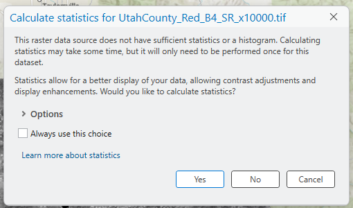
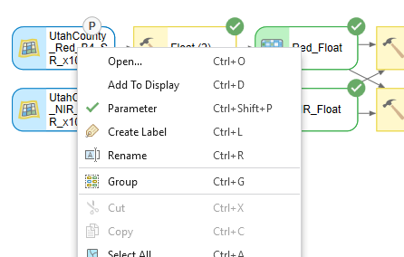

---
search:
  exclude: true
---

# DRAFT — Lab 2: NDVI

**Civil Engineering 414 — Engineering Applications of GIS**

Fall 2026 · Dr. Dan Ames

*Classifying Land Based on NDVI*

> [!WARNING]
> **This is a draft for review. It is not the assigned version of Lab 2.**
>
> This page is a proposed revision of [Lab 2](README.md), rewritten after running the whole lab
> start to finish in **ArcGIS Pro 3.7.1** on September 6, 2026, against the Landsat extract students
> now download from this site. It is deliberately **not linked from the site navigation** — it is
> reachable only by its URL.
>
> The unchanged parts of the lab are reproduced here in full so the page reads end to end.
>
> **Changes to what the lab asks students to do:**
>
> - **Data** — students download a **24 MB Utah County extract** of one Landsat 8 scene from this
>   site (red and near-infrared bands only, already scaled to surface reflectance) instead of a
>   file attached to Learning Suite. The second scene is still their own download, and the Data
>   section now explains the one processing step that download needs before NDVI is valid.
> - **Band numbers** — the lab now says which band is red and which is near-infrared on **Landsat
>   8 and 9** (Bands 4 and 5), not just on the retired TM and ETM+ sensors (Bands 3 and 4).
> - **Step 0** — a new set-up step: the project, the *Calculate statistics* prompt Pro shows for
>   every new raster, and how to check the Spatial Analyst license.
> - **Step 3** — the 0.4 threshold is presented as a starting point that students must **check and
>   defend**, with a worked example of what it gets wrong (it calls the forested Wasatch Front
>   "irrigated").
> - **Step 4** — parameters are put in a sensible order in the tool dialog, and the model is run a
>   second time *through* that dialog for the second scene, which is what the interface is for.
> - **Rubric** — unchanged point values; the report row now asks students to justify their
>   threshold, and there is a no-points self-assessment row as in the Lab 1 draft.
>
> **Corrections to things that were wrong:**
>
> - **Licensing** — the old text said to open *Configure your licensing options* and check a box
>   for Spatial Analyst. Under the **Named User** licensing BYU uses there is no such checkbox: that
>   dialog only sets the license type and portal. Extensions are assigned by the organization
>   administrator, and the Licensing page merely reports whether you have one.
> - **Reclassify** — ArcGIS Pro's Reclassify dialog has no *Add Entry* / *Delete Entries*
>   buttons. Rows are added by typing into the empty last row and removed with the Delete key, or
>   generated from the *Classify* button. The step now describes both.
> - **Background** — the Landsat history stopped at Landsat 7 and cited a data archive (the Global
>   Land Cover Facility) that closed years ago. Updated to Landsat 8 and 9 and to the USGS as the
>   source of record.
> - **NDVI description** — "identify the warmest spots in the NIR band and exclude any areas that
>   contain red" mischaracterized the index. Rewritten.
>
> **Figures.** Every figure on this page was captured in ArcGIS Pro 3.7.1 on September 6, 2026,
> from the run described above: fourteen new captures plus re-shoots of all eight old ModelBuilder
> and tool-dialog figures. The **example map** at the bottom is new too — laid out and exported
> from Pro against this run's result — so nothing on this page is stale.

## Background

In 1972, NASA launched what is known today as the Landsat (Land + Satellite) program. The Landsat program is the longest continuous enterprise for acquiring satellite imagery of the Earth. The satellite imagery provides data for land assessment, coverage, and usage on a global scale. Landsat satellites collect images in several bands of the electromagnetic spectrum. These bands can be combined in various ways to create "false color" images and other data products. In GIS, Landsat data can be used to calculate the Normalized Difference Vegetation Index (NDVI), a measure of vegetation greenness, and a classified NDVI map is one common way of mapping irrigated cropland. A model for calculating NDVI can be created in ArcGIS Pro ModelBuilder by combining data from the red and near-infrared bands.

Be clear from the start about what NDVI measures. It responds to green, photosynthesizing vegetation — its density and its vigor. It does **not** measure irrigation. In a dry July in Utah, irrigated fields are among the greenest things in the valley, which is why the index works here; but a forested mountainside, a golf course and a wetland are green too. Part of this lab is finding out where that distinction breaks down.

## Problem Statement

Landsat records the energy that is reflected from the Earth's surface within the electromagnetic spectrum, in a set of wavelength bands. The current satellites, Landsat 8 (launched 2013) and Landsat 9 (launched 2021), carry the Operational Land Imager (OLI), which records nine bands from the visible into the short-wave infrared, and the Thermal Infrared Sensor (TIRS), which records two thermal bands. The data are archived and distributed by the U.S. Geological Survey (USGS), free of charge and in the public domain.

<!-- VERIFY(instructor): satellite launch years, the OLI/TIRS band counts and the band table below are from the USGS Landsat mission pages (https://www.usgs.gov/landsat-missions); please confirm against the current page before the semester. The old paragraph's "seven bands" (six named) and the GLCF reference are gone. -->

Landsat imagery has been available since 1972, from nine satellites so far (Landsat 6 failed to reach orbit). The sensors have changed over that time — the Multispectral Scanner (MSS) on the early satellites, the Thematic Mapper (TM) on Landsats 4 and 5, the Enhanced Thematic Mapper Plus (ETM+) on Landsat 7, and OLI/TIRS on Landsats 8 and 9 — so **the band numbers are not the same from one sensor to the next.** Whenever you use Landsat data, find out which satellite the scene came from and look up its band designations before you use a band number.

Landsat satellite data records distinct electromagnetic wavelengths as unique bands. This allows a given location to be viewed as a separate layer in GIS. This way, you can see which wavelengths are reflected more and which are reflected less for a given area. Two bands that are used constantly in earth science are the **red** and the **near-infrared (NIR)** bands. These bands reflect differently on water, rocks, and vegetation (Jensen, 335). This makes the features on the Earth's surface distinguishable from each other (e.g., vegetation vs. volcanic rock). They also differ within vegetation itself due to variations in chlorophyll and water content (Jensen, 334). Green vegetation absorbs red light and reflects NIR strongly, so different land cover types can be told apart (e.g., forest vs. sagebrush steppe).

A table of the bands and their wavelength ranges for each Landsat sensor is given below (see <https://www.usgs.gov/landsat-missions/landsat-satellite-missions>).

| Band | MSS (Landsat 1–5) | TM (Landsat 4–5) | ETM+ (Landsat 7) | OLI / TIRS (Landsat 8–9) |
| --- | --- | --- | --- | --- |
| 1 | — | 0.45–0.52 μm blue | 0.45–0.52 μm blue | 0.43–0.45 μm coastal aerosol |
| 2 | — | 0.52–0.60 μm green | 0.52–0.61 μm green | 0.45–0.51 μm blue |
| 3 | — | 0.63–0.69 μm **red** | 0.63–0.69 μm **red** | 0.53–0.59 μm green |
| 4 | 0.5–0.6 μm green | 0.76–0.90 μm **NIR** | 0.76–0.90 μm **NIR** | 0.64–0.67 μm **red** |
| 5 | 0.6–0.7 μm red | 1.55–1.75 μm SWIR | 1.55–1.75 μm SWIR | 0.85–0.88 μm **NIR** |
| 6 | 0.7–0.8 μm NIR | 10.4–12.5 μm TIR | 10.4–12.5 μm TIR | 1.57–1.65 μm SWIR 1 |
| 7 | 0.8–1.1 μm NIR | 2.08–2.35 μm SWIR | 2.09–2.35 μm SWIR | 2.11–2.29 μm SWIR 2 |
| 8 | — | — | 0.52–0.90 μm panchromatic | 0.50–0.68 μm panchromatic |
| 9 | — | — | — | 1.36–1.38 μm cirrus |
| 10 | — | — | — | 10.6–11.19 μm TIR 1 |
| 11 | — | — | — | 11.5–12.51 μm TIR 2 |

**Table 1.** Landsat instrument bands. The red and NIR bands you need are in bold — and they are **Bands 3 and 4 on TM and ETM+, but Bands 4 and 5 on Landsat 8 and 9.**

Where:

- NIR = near infrared
- SWIR = short wavelength infrared
- TIR = thermal infrared (long infrared)
- μm = micron or micrometer

The difference in reflection of the red and NIR wavelengths can be used to determine the effective "greenness" of vegetation. This is done by calculating the Normalized Difference Vegetation Index (NDVI). The NDVI is mathematically defined by Jensen, 2000, Campbell, 2008, and Lillesand, et al., 2008 (see Equation 1).

```text
NDVI = (NIR - RED) / (NIR + RED)
```

**Equation 1.** The Normalized Difference Vegetation Index (NDVI) equation.

Because it is a normalized difference, NDVI always falls between −1 and +1. Healthy, dense vegetation reflects far more NIR than red, so its NDVI is high — typically 0.5 to 0.9 in mid-summer. Bare soil and rock reflect the two bands about equally, giving values near zero. Water absorbs NIR and comes out negative. Clouds and snow are bright in both bands and land near zero as well, which is one reason to choose a cloud-free scene.

NDVI is a reliable vegetative index that is used in many applications. NDVI has been used to detect grub feeding on turfgrass before damage becomes visible (Hamilton). The Idaho Department of Water Resources uses NDVI to determine evapotranspiration rates in the Eastern Snake Plain Aquifer and the Boise Valley Aquifer (Kramber).

One of the practical applications of NDVI is to differentiate between irrigated cropland and non-irrigated land (Calera et al. 2001). In this exercise, you will use ArcGIS Pro ModelBuilder to calculate the NDVI, and you will use Landsat data for the Utah County area to identify irrigated cropland from non-irrigated land.

<!-- VERIFY: "Calera et al. 2001" is cited here but does not appear in the References list. Left as in the source. -->

> [!IMPORTANT]
> **Your job — see the deliverables below.** Build one model, run it on **two** study areas, and
> make a result map for each.

## Data

> [!IMPORTANT]
> **Set up your folder before you download anything.** On the lab machines, work on the
> **D: drive**, in a folder named after you with one folder per lab inside it — `D:\Smith\Lab02\`.
> Put the project and this lab's data there. The C: drive is locked, network drives make Pro hang
> on the large rasters this lab uses, and a USB 3.0 external drive is a legitimate alternative.
> **Never use a space in a folder or file name**: the raster tools in particular fail on paths with
> spaces and do not say that the space is why. The full set of workspace conventions is on the
> [ArcGIS Tips and Reminders](../../arcgis-tips.md){ target="_blank" } page.

This lab uses the last of the data sources you met in Lab 1's Figure B: **remote sensing**. Nobody digitized these data. A satellite recorded them, a government agency processed and archived them, and you will download them. The metadata questions from Lab 1 still apply — *what* each band measures, *when* the scene was acquired, *how* it was processed — and for imagery the *when* and the *how* matter more than for any dataset you have used so far. An NDVI scene from April and one from July of the same field tell completely different stories.

**Two study areas are required.** The first is Utah County, from an extract we prepared for you. The second is a scene you choose and download yourself.

### The Utah County extract (prepared for you)

Download [`lab02-utah-county-landsat.zip`](../../data/lab02-utah-county-landsat.zip) (about 24 MB) and unzip it into your lab folder. It contains:

| File | What it is |
| --- | --- |
| `UtahCounty_Red_B4_SR_x10000.tif` | Landsat 8 **Band 4, red** (0.64–0.67 μm), surface reflectance × 10,000 |
| `UtahCounty_NIR_B5_SR_x10000.tif` | Landsat 8 **Band 5, near-infrared** (0.85–0.88 μm), surface reflectance × 10,000 |
| `LC08_L2SP_038032_20250712_20250725_02_T1_MTL.txt` | The scene's original USGS metadata file, unchanged |
| `READ-ME-FIRST.txt` | Where the data came from, what we did to it, and how to cite it |

Read `READ-ME-FIRST.txt`. In brief: the scene is Landsat 8, path 38 row 32, acquired **July 12, 2025** at about 12:08 pm local time with 0.02 % cloud cover, from the USGS Collection 2 Level-2 surface-reflectance product. We clipped the two bands to the Utah County boundary (UGRC), applied the USGS reflectance scale factor so the values are true reflectance, floored a handful of slightly negative values over deep water and shadow at zero, and stored the result as 16-bit integers multiplied by 10,000 to keep the files small. Both rasters are 30 m cells in WGS 1984 UTM Zone 12N, exactly as the USGS delivers the scene. **The bands are still integers, so the Float step below is still necessary.** Dividing by 10,000 is not: the factor cancels in the NDVI ratio.

> [!NOTE]
> **Why July?** Irrigated crops are at full canopy and everything that is not watered has cured to
> brown, so the contrast the lab depends on is at its strongest. Look at the acquisition date of
> any scene before you trust an NDVI from it.

The data are in the public domain. Credit them in your report as: *Landsat 8 image courtesy of the U.S. Geological Survey.*

### Your second scene (you download it)

Pick another agricultural area — anywhere in the world — and get a Landsat 8 or 9 scene of it from the USGS. **EarthExplorer** (<https://earthexplorer.usgs.gov/>) is the standard tool; the USGS page on Landsat data access (<https://www.usgs.gov/landsat-missions/landsat-data-access>) lists the alternatives. You will need a free USGS account, confirmed by email, before you can download.

Choose the **Collection 2 Level-2** product (surface reflectance) and download only the bands you need: **Band 4 (red) and Band 5 (NIR)** for Landsat 8 or 9. Pick a scene with as little cloud as you can find, acquired in the growing season for that place.

> [!WARNING]
> **A raw USGS Level-2 download is not yet reflectance.** The pixel values are stored as integers
> that have to be scaled: *reflectance = DN × 0.0000275 − 0.2* (the `REFLECTANCE_MULT_BAND_n` and
> `REFLECTANCE_ADD_BAND_n` values in the scene's MTL file). We already did this to the Utah County
> extract. **You must do it to your own scene**, on both bands, before you compute NDVI. The
> multiplier would cancel in the ratio, but the offset does not — skip it and every NDVI value is
> pushed toward zero. Two extra Raster Calculator steps (or Times and Plus tools) at the front of
> your model will do it; say in your report that you did.

Scenes are large — a full Landsat scene is about 185 km on a side — so consider clipping your two bands to a smaller study area (Extract by Mask, with a polygon you draw) before running the model. It will run in seconds instead of minutes.

## ModelBuilder Tools

You will use the following new tools in this exercise, along with tools from previous labs. The icon beside each one is a reminder of what it does to your data.

| Tool | What it does |
| --- | --- |
| { .tool-icon }<br>**Float** | A Spatial Analyst tool that converts a raster from an integer type to a floating-point type, so that the decimal part of a division survives. NDVI is a ratio between −1 and 1; divide two integer rasters and every cell rounds to 0 or 1. |
| { .tool-icon }<br>**Plus, Minus, Divide** | Map-algebra tools that take two rasters and add, subtract or divide them **cell by cell**, producing a new raster. Order matters for Minus and Divide: the first input is the one the second is subtracted from, or divided into. |
| { .tool-icon }<br>**Reclassify** | Replaces ranges of values in a raster with new values. Here it turns the continuous NDVI surface into two classes — non-irrigated and irrigated — at a threshold you choose and defend. |

## Example Model


**Figure A.** The finished model, as it looks in ArcGIS Pro 3.7 after a run. Yours should look like this when you are done — rename the intermediate datasets to something a reader can follow, as here, rather than leaving Pro's defaults such as `Minus_NIR_Fl1`.

## Complete the Lab

For an advanced GIS student, the information up to this point is all you need to complete the assignment and create an output map from the results. Feel free to try conducting the analysis using only the information provided above. If you need extra help, follow the step-by-step solution below. Ensure that you create and screen capture an ArcGIS Pro toolbox interface for your model.

> [!TIP]
> If you complete the lab using only the information provided above — without using the step-by-step instructions below — make sure to indicate this in your lab report to be considered for extra credit.

<!-- TODO(instructor): the extra-credit offer has no rubric row or point value, as in Lab 1. -->

## Step-by-Step Solution

> [!NOTE]
> My example screenshots in this and future assignments may or may not match your data exactly.
> They were captured in ArcGIS Pro 3.7.1 against the Utah County extract. Use them as a reference,
> but read what is actually on your screen.

### Step 0

**Create the project.** Start ArcGIS Pro, choose the **Map** template, name the project `Lab02`, and put it in your lab folder. As in Lab 1: the *Location* box does not take a typed path, so use the folder button beside it, and uncheck *Create a folder for this local project* if you already made the `Lab02` folder.

**Add the two bands to the map.** On the **Map** ribbon tab click **Add Data** and add `UtahCounty_Red_B4_SR_x10000.tif` and `UtahCounty_NIR_B5_SR_x10000.tif`. Pro will ask, once per raster, whether to **calculate statistics** for it (Figure 0a). Click **Yes** — without statistics Pro cannot stretch the display, and the raster draws as a flat gray block. It takes a few seconds per band.



**Figure 0a.** The statistics prompt. Say Yes.

**Check that you have Spatial Analyst.** Every tool in this lab is a Spatial Analyst tool. Click the **Project** tab, then **Licensing**, and scroll the *ArcGIS Pro Extensions* list to **Spatial Analyst** — it should read *Licensed: Yes* (Figure 0b). If it says *No*, tell your instructor: with the Named User license BYU uses, extensions are assigned to your account by the organization's administrator, and there is nothing on this page you can click to turn one on. (The *Configure your licensing options* button only changes which portal Pro signs in to. Older versions of this handout said to open it and check a box; the box does not exist.)


**Figure 0b.** Project ▸ Licensing. Spatial Analyst must show *Yes*.

**Create the model.** On the **Analysis** ribbon tab click **ModelBuilder**. That creates a model called *Model* in your project toolbox (`Lab02.atbx`) and opens it. Give it a real name before you forget: in the **Catalog** pane expand **Toolboxes ▸ Lab02.atbx**, click *Model* once more to rename it, and call it `NDVI` (Figure 0c). Right-click the model and choose **Edit** whenever you need to reopen it in ModelBuilder; **Open** runs it as a tool instead, which you will use in Step 4.


**Figure 0c.** The model in the project toolbox, renamed to NDVI.

### Step 1

Use the **Float** tool to change the data inside each raster from an integer type to a float type. Both bands need it, so you will use the tool twice.

Drag the two band layers from the **Contents** pane onto the ModelBuilder canvas: they appear as blue input ovals. Then, on the **ModelBuilder** ribbon tab, click **Tools** (in the *Insert* group) to open the Geoprocessing pane, search for *Float*, and drag **Float (Spatial Analyst Tools)** onto the canvas twice. (The Image Analyst and 3D Analyst toolboxes have a Float too. They do the same thing but need a different license; use the Spatial Analyst one.)

Connect each input to its Float tool by dragging from the oval to the tool. When you release, a menu asks which parameter the connection feeds (Figure 1a) — choose **Input raster or constant value**.


**Figure 1a.** Drop the connector on the tool and pick the parameter it feeds.

Now double-click each Float tool and give its **Output raster** a name you will recognize later — `NIR_Float` and `Red_Float` (Figure 1b). A name typed here is created in your project geodatabase. Click **OK**.


**Figure 1.** Top: the Float tool. The `:1` after the input name means band 1 of the file, which is the only band. Bottom: both bands converted.

> [!NOTE]
> **Why Float first?** These rasters are 16-bit integers. Minus and Plus of two integer rasters
> give integers, and Divide of two integer rasters gives an **integer** — so NDVI, which lives
> between −1 and 1, would come out as 0 almost everywhere. Float makes the arithmetic keep its
> decimals. If your NDVI layer has only two or three distinct values, this is what you skipped.

### Step 2

Use the **Minus**, **Plus** and **Divide** tools to model the NDVI equation: first the top and bottom of the fraction separately, then the division.

```text
NDVI = (NIR - RED) / (NIR + RED)
```

Search the Geoprocessing pane for *Minus* and drag **Minus (Spatial Analyst Tools)** onto the canvas; do the same for **Plus**. Connect `NIR_Float` to each as **Input raster or constant value 1** and `Red_Float` to each as **Input raster or constant value 2**. For Plus the order does not matter; for Minus it decides the sign of your entire result, so check it in the dialog (Figure 2). Name the outputs `NDVI_numerator` and `NDVI_denominator`.

Then add **Divide (Spatial Analyst Tools)**, connect `NDVI_numerator` as value 1 and `NDVI_denominator` as value 2, and name the output `NDVI`. Click **Auto Layout** and then **Fit to Window** on the ModelBuilder ribbon to tidy the canvas (Figure 3).


**Figure 2.** The Minus, Plus, and Divide tool windows. In every one, the first input is the thing on the left of the operator.


**Figure 3.** Minus, Plus, and Divide in ModelBuilder. The crossing connectors are normal — each Float output goes to two tools.

**Run it.** Right-click the `NDVI` output oval and choose **Add To Display**, so the result appears in the map, then click **Run** on the ModelBuilder ribbon. A progress dialog steps through the five tools (Figure 4) — about half a minute for Utah County. Every tool and output turns green with a check mark when it has run.


**Figure 4.** The model running. Leave *Close on completion* unchecked the first time so you can read the messages.

> [!TIP]
> **Check the result.** Open the NDVI layer's symbology or hover the map with the Explore tool.
> Values should run from about **−1 to +1**; the layer legend in the Contents pane shows the
> range. Utah Lake should be dark (negative — water absorbs NIR), the mountains and the irrigated
> valley floor bright, and the dry benches and the west desert mid-gray (Figure 5). If the whole
> county is one flat shade, look at the value range: values of exactly 0 and 1 mean the Float step
> was skipped, and values near zero everywhere usually mean the reflectance offset was not applied
> to a raw download.


**Figure 5.** The NDVI surface. Bright is green vegetation; dark is water.

### Step 3

Use the **Reclassify** tool to turn the NDVI surface into two classes at a threshold that separates irrigated cropland from everything else. The handout's threshold is **0.4**, which was found by drawing a polygon over a known irrigated field in an earlier scene and taking its mean NDVI:

- Non-irrigated land: −1.0 to 0.4 → new value **0**
- Irrigated cropland: 0.4 to 1.0 → new value **1**

Treat 0.4 as a starting point, not an answer — see the note after Figure 8.

Search for *Reclassify* and drag **Reclassify (Spatial Analyst Tools)** onto the canvas. Connect `NDVI` to it as **Input raster**, then double-click the tool. **Reclass field** should already read `VALUE`. The reclassification table starts empty, and ArcGIS Pro has no *Add Entry* or *Delete Entries* buttons — there are two ways to fill it:

- **Use Classify.** Click the **Classify** button, set **Classes** to `2`, then edit the first *Upper value* to `0.4` (which switches *Method* to *Manual Interval*) and click OK (Figure 6a). The table now has two rows; change their **New** values to `0` and `1`.
- **Or type the rows.** Typing into the empty last row adds a row: enter *Start*, *End* and *New* for each class. To remove a row, click it once to select it and press the **Delete** key (clicking a selected cell a second time edits it instead).

Either way, finish with the two rows shown in Figure 6b, plus the `NODATA → NODATA` row Pro adds for you. Name the **Output raster** `NDVI_reclass` and click **OK**.


**Figure 6a.** The Classify dialog with two classes and a break at 0.4.


**Figure 6.** The Reclassify tool window, and the tool at the end of the model.

Right-click `NDVI_reclass` and choose **Add To Display**, then **Run** again. Only Reclassify runs this time — the tools that already ran are skipped (Figure 7a). The message log shows the remap table the tool used, `-1 0.4 0;0.4 1 1`, which is a good thing to paste into your report.


**Figure 7a.** Reclassify alone takes about five seconds.

**Symbolize it.** Select the `NDVI_reclass` layer, and on the **Raster Layer** ribbon tab click **Symbology**. Pro has already chosen *Unique Values* on `Value`. Double-click each *Label* to rename the classes — `Non-irrigated land` and `Irrigated cropland` — and click each color patch to pick something sensible, such as tan and green (Figure 7b).


**Figure 7b.** The classified result. Look at the mountains.

Now zoom in. Southwest of Utah Lake, around Elberta, the center-pivot sprinklers show up as the circles the assignment asks you to find (Figure 8). Compare the classified layer with the NDVI surface underneath it — turn `NDVI_reclass` off and on in the Contents pane — and notice which fields the threshold picks up and which it misses.


**Figure 8.** Center-pivot irrigation near Elberta. Top: classified at 0.4. Bottom: the NDVI surface beneath it. Some circles are much greener than others — a crop just planted, or just cut, can fall below the threshold and still be an irrigated field.

> [!IMPORTANT]
> **The threshold is yours to defend.** Look at Figure 7b again: at 0.4, the forested slopes of
> the Wasatch and Uinta mountains are "irrigated cropland." They are not — they are green because
> it is July and they are forest. NDVI measures greenness, and a single threshold cannot tell an
> irrigated field from a canyon full of scrub oak. That is not a flaw in your model; it is a
> limit of the method, and your report has to say so.
>
> Do two things. **First**, check the threshold against your own scene: find a field you can
> confirm is irrigated (the imagery basemap and the circles in Figure 8 will do) and a patch of
> dry ground you can confirm is not, read the NDVI value of each with the Explore tool, and say
> whether 0.4 sits between them. Change it if it does not. **Second**, say in your report where the
> classification is wrong and why, and what extra information — elevation, a land-use layer, a
> second scene from another season — would let you fix it. Two students with different thresholds,
> each justified from their own scene, can both be right.

### Step 4

Give your model a **toolbox interface**, so it can be run from a dialog like any other tool — and so the same model can be run on your second scene without editing it.

Right-click each of the two input ovals and the final `NDVI_reclass` output, and choose **Parameter** (Figure 9). A `P` appears beside each one. Then click **Save** on the ModelBuilder ribbon.



**Figure 9.** Right-click an input or output ▸ Parameter.

Parameters appear in the dialog in the order you created them. If your output ended up above your inputs, click **Properties** on the ModelBuilder ribbon, open the **Parameters** tab, and drag the rows into a sensible order — inputs first, output last (Figure 10). While you are there, the **General** tab is where the model's *Name* and *Label* live.


**Figure 10.** Properties ▸ Parameters. Drag a row by its number to reorder.

Now open the model as a tool: in the **Catalog** pane, right-click `NDVI` in `Lab02.atbx` and choose **Open**. The Geoprocessing pane shows your three parameters and a **Run** button (Figure 11). **Screen capture this dialog for your report** — it is one of the deliverables.


**Figure 11.** Your model, run from its toolbox interface.

> [!NOTE]
> The yellow warning on the output means a raster with that name already exists (you just made
> it). Pro will overwrite it when you run; type a new name if you want to keep the first result.

### Step 5

**Run it on your second scene.** With your second scene's red and NIR bands added to a new map (and scaled to reflectance — see the warning in the Data section), open the model's toolbox interface from Step 4, point the two input parameters at those bands, give the output a new name, and click **Run**. If you clipped the scene to a study area, this takes seconds. Check the threshold the same way you did for Utah County, adjust it in the Reclassify tool if your scene needs a different one, and say what you did.

## Deliverables

Create a model that prepares all input data for the land cover analysis, conducts the analysis, and generates a map indicating the locations of irrigated land. Run the Utah County data through your model, then run your second Landsat scene through it. Include **two** maps in your final report, and make it clear where each map is. Your two maps should show irrigated and non-irrigated land as classified from NDVI. Identify interesting irrigation patterns, such as center-pivot fields with their distinctive circular shapes, and identify where the classification goes wrong and why. Submit a report including your model, the two maps, a screenshot of your toolbox interface, the threshold you used for each scene and how you checked it, and your conclusions as requested in the rubric.

> [!IMPORTANT]
> **Peer review before you submit.** Have another student read your report against the rubric
> and act on their feedback. Name your reviewer and say in a sentence what you changed.

## References

Campbell, J.A. (2008) *Introduction to Remote Sensing.* The Guilford Press. 465-466.

<!-- VERIFY: author initials for the Campbell reference were not checked against the book. -->

Hamilton, R.M., Foster, R.E., Gibb, T.J., Johannsen, C.J., and Santini, J.B. (2009) "Pre-visible Detection of Grub Feeding in Turfgrass using Remote Sensing." *Photogrammetric Engineering and Remote Sensing.* 75. 179-191.

Jensen, J.R. (2000) *Remote Sensing of the Environment: An Earth Resource Perspective.* Prentice Hall, Upper Saddle River, New Jersey. xii, 361-362.

Kramber, W.J., Morse, A., and Allen, R.G. (2010) "Mapping Evapotranspiration: A Remote Sensing Innovation." *Photogrammetric Engineering and Remote Sensing.* 76. 6-10.

Lillesand, T.M., Kiefer, R.W., and Chipman, J.W. (2008) *Remote Sensing and Image Interpretation.* John Wiley & Sons, Inc. 464.

U.S. Geological Survey (2025). Landsat 8 OLI/TIRS Collection 2 Level-2 Surface Reflectance, scene LC08_L2SP_038032_20250712_20250725_02_T1. Extract prepared for BYU CE 414, 2026.

## Example Maps

This is an example of a Utah County map result, laid out and exported from ArcGIS Pro 3.7 against the run described on this page. Make sure to create two maps: one for Utah County and one for your second scene. Yours will and must look different — your own threshold, your own cartographic choices, your own name.

![Example finished layout titled "Irrigated Cropland in Utah County from Landsat NDVI": the classified raster over a light gray basemap of Utah County, tan for non-irrigated land and green for irrigated cropland, with seven labeled city points, the county outline, a red extent box near Elberta, an imagery inset of the center-pivot fields there with the classification at 55 % opacity, a legend, north arrow, scale bar in miles, and a text box giving the result (1,111 of 2,099 square miles above 0.4), the author, date, projection, data sources and method.](images/lab02-example-map-utah-county-2025.png)

**Figure 12.** The example map. Notice what the text box admits: 53 % of the county is above 0.4 because the forested mountains are in the green class. A map that shows the classification honestly, and says in words where it is wrong, is worth more than one that hides it — and the rubric's "irrigated land versus non-irrigated land clearly symbolized" is easier to satisfy when the two classes are named for what they actually are.

<!-- Built 2026-09-06 by tools/lab02/build_layout.py (arcpy.mp against C:\Ames\Lab02\Lab02_Layout.aprx, exported by Pro at 150 dpi). City points are the seven largest municipalities by 2020 Census population from the UGRC Utah Municipal Boundaries service (Draper excluded: it is a Salt Lake County city that crosses the line). The old Word-era example, lab02-example-map-utah-county.jpg, is KEPT because the assigned README still references it. -->

## Rubric for Classifying Land Based on the NDVI

| Item | Points |
| --- | --- |
| Assignment title, name, date, course, and brief report on the requirements of the project. What locations within Utah County are most irrigated? Are your results as expected, or did you find anything interesting or different than expected? **What threshold did you use for each scene, how did you check it, and where does the classification go wrong?** | /5 |
| Describe your model:<br>• List each of the tools used<br>• List tool settings applied for the analysis (could someone repeat the lab using your report?)<br>• List all input, intermediate, and output datasets<br>• Describe each input dataset including type (point, line, polygon, raster), the satellite and bands, the acquisition date, and the source of the data<br>• Describe each output dataset (point, line, polygon, raster) | /5 |
| One or more full pages (8.5 × 11) showing your model:<br>• All text is readable (10 pt. font minimum)<br>• All tools and datasets are shown and labels are informative | /5 |
| Make a full page (8.5 × 11) map showing the results of your NDVI classification for Utah County, and one for your second scene:<br>• Map title<br>• Neat line<br>• North arrow<br>• Scale bar<br>• Text box with author name, date, map projection, and the satellite, scene and acquisition date<br>• NDVI classification image<br>• Irrigated land versus non-irrigated land clearly symbolized<br>• Polygon of the county or study area<br>• Labeled points indicating locations of a few large cities<br>• Zoomed to an appropriate scale for viewing analysis results<br>• All text is legible on printed map | /30<br>(15 per map) |
| Create a toolbox interface for your model and include a screen capture of it including input and output data parameters. | /5 |
| My self-assessment — paste this rubric into your report with your own score in every row. Peer reviewer named, and their feedback acted on. This row adds no points to the total. | (no points) |
| **Total self evaluation** | **/50** |

<!-- Migration notes (2026-09-06, draft): source: docs/assignments/lab-02/README.md (the 2026-09-03 migration of Lab 2 - NDVI.docx) plus a full run of the lab in ArcGIS Pro 3.7.1 on a local Windows machine (not Citrix), project C:\Ames\Lab02\Lab02.aprx, model NDVI in Lab02.atbx, outputs in Lab02.gdb.
ArcGIS Pro version verified against: VERIFIED 2026-09-06 in ArcGIS Pro 3.7.1. Every step 0-4 was driven in the GUI and every dialog on this page is a capture of that session.
DATA PACKAGE (2026-09-05): docs/data/lab02-utah-county-landsat.zip, 24.3 MB: Landsat 8 OLI scene LC08_L2SP_038032_20250712_20250725_02_T1 (2025-07-12, path 38 row 32, 0.02 % cloud), Collection 2 Level-2 SR bands 4 and 5 clipped to the UGRC Utah County polygon, reflectance scale factor applied (DN*0.0000275-0.2), negatives floored at 0, stored as S16 * 10000, LZW; MTL file and READ-ME-FIRST.txt inside. Prepared by the instructor before this session; its READ-ME-FIRST is the source for the Data section.
VERIFIED RUN (Utah County): Float x2 -> Minus (NIR_Float - Red_Float = NDVI_numerator) -> Plus (NDVI_denominator) -> Divide (NDVI, F32, range -1 to 1) -> Reclassify VALUE "-1 0.4 0;0.4 1 1" -> NDVI_reclass (U8). Whole model 36 s; Reclassify alone 5.15 s. Utah Lake is negative; the forested Wasatch/Uinta slopes classify as 1 at the 0.4 threshold, which is now a teaching point (the IMPORTANT box after Figure 8) rather than an error. Center pivots visible at 1:100,000 around Elberta (about 111.95 W 39.95 N).
CORRECTED: (1) Licensing - under Named User licensing, Project > Licensing > "Configure your licensing options" opens a dialog with License Type and portal URL only; there is no extension checkbox (captured: images/lab02-licensing-options-dialog.png, not used on the page). Spatial Analyst appears in the ArcGIS Pro Extensions list as Licensed: Yes (6/30/2027 on this account). The old "check the box for Spatial Analyst" instruction is gone. (2) Reclassify - Pro 3.7 has no Add Entry / Delete Entries; rows are added by typing into the empty last row and removed with the Delete key on a selected (not editing) row; the Classify button opens a Classify dialog (Method / Classes / Upper value) that populates the table. Typing a class count and pressing Enter in that dialog closes it without applying the count - use Tab or set the upper value directly. (3) Band numbers - the package is Landsat 8, so red = Band 4, NIR = Band 5; Table 1 now has an OLI/TIRS column and the text says TM/ETM+ numbering differs. (4) "warmest spots in the NIR band ... exclude any areas that contain red" replaced with a description of what the ratio does. (5) Landsat history updated to Landsat 8/9, OLI/TIRS, USGS distribution; GLCF removed.
GUI FACTS worth keeping: ModelBuilder connection drop shows a "Select input..." menu; renaming a tool's Output raster in its dialog renames the output variable oval; right-click on canvas elements works (Open, Add To Display Ctrl+D, Parameter Ctrl+P/Ctrl+Shift+P, Create Label, Rename, Group); Auto Layout + Fit to Window give the left-to-right layout in Figure A; Tool Properties > Parameters reorders by dragging the row number; parameter Labels could not be edited in that grid by double-click (left at their defaults); a model tool dialog opened from Catalog > right-click > Open (double-click does nothing while the model is open in ModelBuilder); Go To XY on the Map tab pans, then the scale box sets the zoom; mouse-wheel zoom over the map did not register under desktop control.
CAPTURE METHOD: tools/screenshots/ (capwin.py = PrintWindow of the Pro main window, which is immune to the Claude desktop window and Grammarly overlay that repeatedly covered plain screen grabs; capwin2.py for the untitled ModelBuilder tool dialogs; cap.py delayed screen grab for context menus). 24 images, all in this folder; the four map views are JPEG. Old figure names were reused for the eight re-shot figures so README.md picks them up too; README.md's captions were updated to match.
EXAMPLE MAP (2026-09-06): rebuilt from the 2025 scene by tools/lab02/build_layout.py; the reclass raster carries NAD 1983 UTM Zone 12N (the model ran under the map's coordinate system) although the source TIFFs are WGS 1984 UTM 12N - a 1 m datum shift, harmless here but worth a sentence in the Data section if students notice. Irrigated class = 1,111 of 2,099 sq mi (53 %).
NOT DONE / TODO(instructor): (1) the old Word-era example map jpg is kept only for README.md; (2) decide whether the second full scene is required or a small second study area would do - the draft keeps two scenes but now recommends clipping; (3) the extra-credit offer has no rubric row; (4) Calera et al. 2001 is cited but not in References; (5) Campbell initials; (6) the Landsat band-table figures and launch dates should be checked against the current USGS page; (7) the NDVI ranges quoted for vegetation (0.5-0.9), bare soil (near 0) and water (negative) are textbook generalizations, not measured from this scene - the scene's own values are shown in Figures 5 and 8 and match them.
OPEN QUESTIONS from the run: the Minus dialog's OK button did not respond until the dialog was dragged to a new position (reproduced twice); harmless but confusing for a student who thinks they clicked OK - worth a sentence if it recurs on the lab machines. -->
