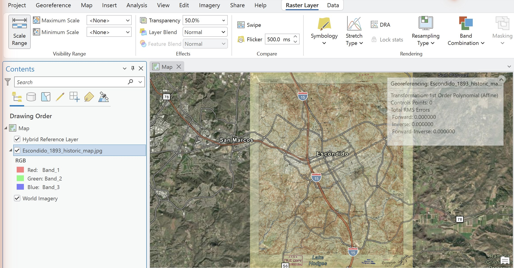
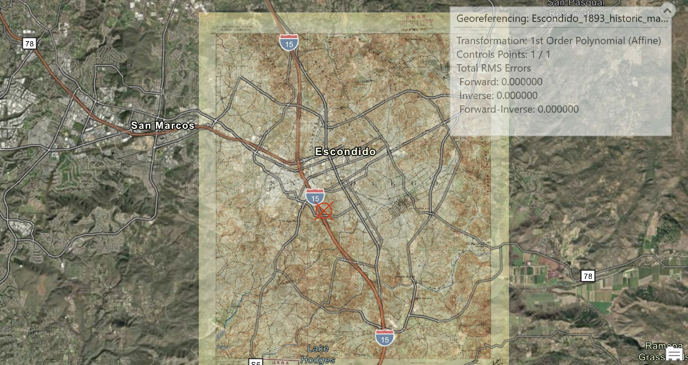
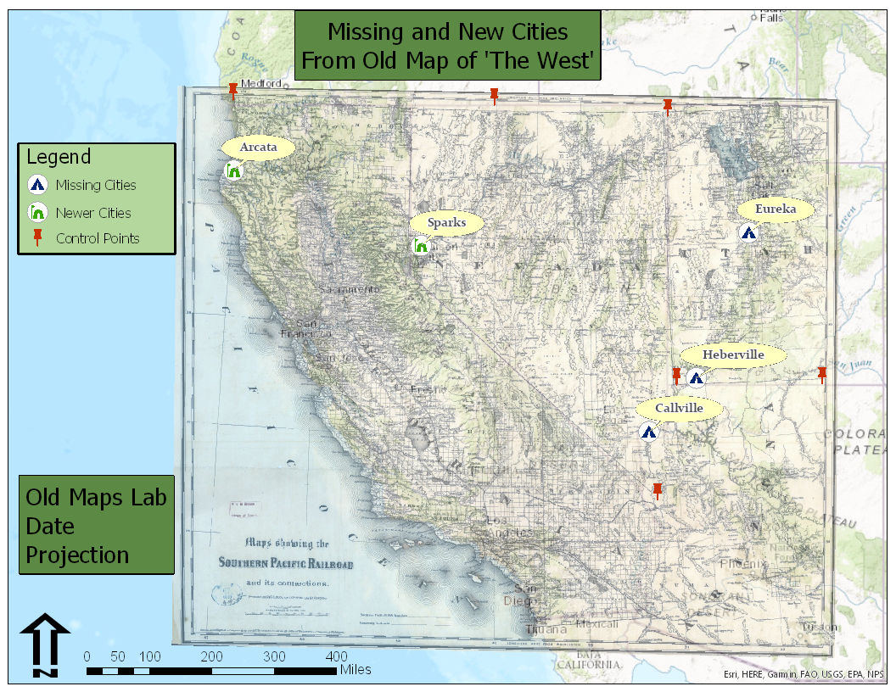

# Lab 3: Georectifying and Digitizing Historic Maps

**Civil Engineering 414 — Engineering Applications of GIS**

Fall 2026 · Dr. Dan Ames

<!--
Revision notes (2026-09-10). Rebuilt to the Labs 1 and 2 standard described in
tools/lab-conversion-guide.md, allowing for the fact that this lab has no ModelBuilder component.
The substantive changes, each of which closes a TODO(instructor) left by the September 3 migration:

1. ONE historic map instead of two. The handout required a pre-1900 U.S. state sheet AND a pre-1800
   European city sheet. The two cases exercise the identical workflow and double the student's time
   for the same skills, which is exactly what section 1 of the lab guide forbids ("Do not add a
   second study area ... it repeats the data wrangling, not the analysis"). The hour freed up went
   into Steps 5 and 8.
2. A SENSITIVITY STEP, Step 8, which this lab did not have. The student re-solves the same control
   points under three transformations and tabulates what moves. It is the analogue of Lab 1's
   distance sweep and Lab 2's threshold sweep, and it is what makes the lab an analysis rather than
   a procedure.
3. CONTROL POINT GUIDANCE: how many, where to put them, and which transformation needs how many.
   The minimum counts in Step 4 and the figure in Step 8 were read off the Transformation menu in
   ArcGIS Pro 3.7.1 on 2026-09-09; they are not from the handout.
4. RESIDUALS AND RMS, Step 5, worded so that a smaller number is not presented as better. The
   handout never mentioned the Control Point Table, though it was visible in one of its own figures.
5. AN INDEPENDENT CHECK. Every point in the solve is also a point that was fitted, so the lab now
   asks for a held-out check feature that was not used as a control point.
6. RUBRIC to five parts of ten, totalling 50, matching Labs 1 and 2. The old rubric had no stated
   total and its rows happened to sum to 50. "Rectification nodes" became "control points", which
   is what ArcGIS Pro calls them; that is a change to scored wording, so it is called out here.
7. pdf2jpg.net REMOVED. The handout told students to upload course material to an unaffiliated
   third-party site to convert a PDF. ArcGIS Pro has PDF To TIFF (verified: arcpy.conversion.
   PDFToTIFF exists in the 3.7.1 install), and a screen capture still works.
8. The dead usgwarchives.net source link is gone from student-facing text.

Still owed, and listed again in the migration notes at the foot of this page: Figures 6 to 11 are
still the September 3 captures from an older ArcGIS Pro, one of them showing a geodatabase named
for Lab 2, and there are no example layouts built as a baseline/scenario pair.
-->

## Background

Old maps and aerial photographs are an unreasonably good source of information for civil,
environmental and construction engineers. There are thousands of filing cabinets, in government
agencies and engineering consulting firms, filled with mapping data that exists only on paper. That
data can tell you:

- how cities and landscapes have changed over time
- how growth followed, or ignored, natural and manmade features
- what a river, coastline or wetland looked like before it was engineered
- what was on a site before the building that is on it now

Libraries and agencies have scanned a great deal of it, so more of this material is online now than
ever before. A scan, though, is just a picture. It has rows and columns of pixels and no idea where
on Earth it belongs. **Georeferencing** is the act of telling it: you match points you can identify
on the scan to the same points on a map that already knows where it is, and ArcGIS Pro solves for a
transformation that moves every other pixel accordingly.

That last part is the whole lab. You do not place the image; you place a handful of points and let
a mathematical transformation place the image. Which transformation you choose, how many points you
give it, and where you put them decide how much of the sheet ends up where it belongs — and the
number ArcGIS Pro reports to tell you how well it fits is measured on the very points you fitted,
so it can be made to look perfect while the map is wrong everywhere else. In Step 8 you will re-solve
the same points three ways, see how far the answer moves, and use what moves to decide which result
you would put your name on.

> [!IMPORTANT]
> **Your job — see the deliverables below.** Georeference one scanned historic map, digitize the
> features on it that are no longer on a modern map, test how much your result depends on the
> transformation you chose, and make two map layouts.

## Problem Statement

You need to find things that used to be somewhere and are not there now: a town that emptied out, a
rail spur that was pulled up, a street grid that was replaced, a channel that was straightened.
Nobody has this in a GIS. It exists on a sheet of paper that somebody scanned.

Your job is to turn the features on that sheet into a vector feature class, correctly located, so
they can be measured, overlaid and mapped alongside modern data. That takes two operations, in this
order:

1. **Georeference** the scan, so that its pixels sit in real-world coordinates.
2. **Digitize** the features from it, by drawing them on a new feature class while the georeferenced
   scan is underneath.

The order matters. Digitize first and every feature you draw is in the wrong place, permanently.

## Spatial Considerations

Every one of these is a decision you make, and every one of them changes your answer. Say in your
report what you chose and why.

- **Which sheet.** Age, scale and legibility trade against each other. An 1885 county atlas plate is
  full of vanished detail and drawn loosely; a 1950 USGS quadrangle is accurate and shows less
  change. Older is not automatically better.
- **Which basemap you georeference against.** Imagery shows what is there now; a topographic basemap
  shows named features and section lines that are easier to match on an old sheet. The basemap is
  your control, so its accuracy is a ceiling on yours.
- **How many control points, and where.** Three is the minimum for the default transformation and it
  is not enough. Points bunched in the middle of the sheet leave the corners free to wander.
- **Which transformation.** A first-order (affine) transformation can shift, scale, rotate and skew
  the whole sheet but keeps straight lines straight. Higher orders bend it. A spline forces the
  control points to match exactly and rubber-sheets everything between them.
- **The coordinate system of your map.** Set it before you digitize. Your new feature class inherits
  it, and lengths and areas you measure later depend on it.
- **What counts as "gone".** A road that moved fifty meters, a town that shrank, a lake that is
  smaller: you decide what qualifies, and you defend it.

## Data

> [!IMPORTANT]
> **Set up your folder before you download anything.** On the lab machines, work on the
> **D: drive**, in a folder named after you with one folder per lab inside it — `D:\Smith\Lab03\`.
> Put the project, the scan and everything you make there. The C: drive is locked, network drives
> make ArcGIS Pro slow on large scans, and a USB 3.0 external drive is a legitimate alternative.
> **Never use a space in a folder or file name.** The full set of workspace conventions is on the
> [ArcGIS Tips and Reminders](../../arcgis-tips.md){ target="_blank" } page.

Unlike Labs 1 and 2, nothing here is prepared for you. **You find the data, and you defend it.**
That is the point: the judgment you exercised in Lab 1 choosing which Walmart stores counted, you
exercise here choosing a sheet and a basemap.

| Layer | Where it comes from | What you must record |
| --- | --- | --- |
| Historic map scan | You find and download it | Repository, title, date, scale, and the URL you got it from |
| Modern basemap | ArcGIS Pro basemap gallery | Which basemap, and why that one |
| Digitized features | You create it | Coordinate system, geometry type, and what you chose to include |

### Judging the source

Apply the six metadata questions from the introductory course to your sheet before you use it —
**what, where, when, why, how, who** — and put the answers in your report:

- **What** does the sheet show, and at what scale? A scale printed on the sheet tells you how much
  detail to trust.
- **Where** does it cover, and does its coverage actually contain features you can match?
- **When** was it surveyed, which is often years before it was published? Both dates matter, and
  they are not the same date.
- **Why** was it made? A railroad promotional map, a fire insurance plan and a topographic survey
  are drawn to different standards and lie in different directions.
- **How** was it surveyed and drawn, and how was it scanned? A folded sheet flattened on a scanner
  bed has distortion no transformation will fully remove.
- **Who** made it, and are you allowed to use it? Anything published in the United States before
  1930 is in the public domain; a library's scan of it may still carry the library's own terms.

> [!WARNING]
> A pictorial or "bird's eye" view is not a map. Panoramic city views, common in the 1880s, are
> drawn in perspective from an imagined viewpoint, so no transformation will make them fit. They are
> wonderful documents and they will waste your afternoon. Use a plan view, drawn looking straight
> down.

### Where to find a sheet

Your sheet should be **older than 1900** if you can find one that covers ground you can match. The
further back it goes, the more change there is to find.

| Source | What is there |
| --- | --- |
| [USGS topoView](https://ngmdb.usgs.gov/topoview/) | Every USGS topographic sheet ever published, back to 1884, free, downloadable as GeoTIFF, JPEG or GeoPDF. The most reliable starting point |
| [USGS Historical Topographic Map Collection](https://www.usgs.gov/programs/national-geospatial-program/historical-topographic-maps-preserving-past) | The program behind topoView, with an explanation of what was scanned and how |
| [David Rumsey Map Collection](https://www.davidrumsey.com/) | Over 100,000 scanned historic maps, strong on the nineteenth century and on city plans |
| [Library of Congress map collections](https://www.loc.gov/maps/collections/) | Fire insurance plans, city plans, railroad maps. May show a bot check before it loads |

> [!TIP]
> **Check the result.** Before you commit to a sheet, ask yourself: can you name at least six
> features on it that you could also point to on a modern basemap? Section corners, road
> intersections, river confluences, a courthouse, a rail crossing. If you cannot find six, you
> cannot georeference it well, and you should find another sheet.

### If your download is a PDF

Many scans, including USGS GeoPDFs, arrive as PDF. ArcGIS Pro will not add a PDF to a map directly.
Convert it:

- **In ArcGIS Pro**, search the Geoprocessing pane for **PDF To TIFF** (Conversion Tools ▸ To
  Raster). Set the input PDF, an output `.tif` in your lab folder, and a resolution — 250 to 300 dpi
  is enough for a topographic sheet and keeps the file manageable.
- **Or take a screen capture** of the PDF opened at full size and save it as a `.jpg` or `.png`.
  This is fine and it is what most people do; you lose whatever resolution the screen does not show.

Do not upload the file to a third-party conversion website. You have the tool on your desk.

## Analysis Tools

There is no ModelBuilder model in this lab. Georeferencing is interactive by nature: you are looking
at two images and deciding that this corner is that corner, which is not something a model can do
for you. These are the tools you will use for the first time in this course.

| Tool | What it does |
| --- | --- |
| **Georeference** (Imagery tab, Alignment group) | Opens the Georeference tab for the selected raster layer. Everything below lives on that tab |
| **Fit to Display** (Prepare group) | Drops the scan into the current map view at roughly the right size and place, so you have something to drag points from. A first guess, not a result |
| **Add Control Points** (Adjust group) | The core tool. Click a point on the scan, then the same point on the basemap. Each pair is one link |
| **Transformation** (Adjust group) | Chooses the equation fitted to your control points. The menu states the minimum number of points each one needs |
| **Control Point Table** (Review group) | Lists every link with its residual, and the total RMS error. Where you find out what your points are actually doing |
| **Create Feature Class** (Catalog pane, right-click a geodatabase ▸ New) | Makes the empty point, line or polygon layer you are about to draw into |
| **Create Features** (Edit tab, Features group) | The editing pane you draw in |
| **Add** (attribute table, Field group) | Adds a field, so your features can carry a name |
| **Label** (Labeling tab) | Draws the values of a field on the map |

## Complete the Lab

If you would rather work it out than be walked through it, everything you need is above: find a
plan-view sheet older than 1900, georeference it against a basemap you choose, digitize what is gone,
and do the Step 8 comparison. The step-by-step solution below is there when you want it.

> [!TIP]
> If you complete the lab without the step-by-step solution, say so in your report. There is no
> extra credit for it; it is worth knowing about yourself.

## Step-by-Step Solution

> [!NOTE]
> **Important Note #1.** These steps walk through one sheet with one set of control points. Step 8
> re-solves *the same control points* under different transformations, so collect them carefully the
> first time — you will use them three times.

> [!NOTE]
> **Important Note #2.** The figures were captured in ArcGIS Pro 3.7.1 against a different sheet
> than yours, so your screen will not match exactly; the ribbon, the panes and the button names are
> what to follow. Paths in the figures start with `C:\` because they were captured on an instructor
> machine. Yours should be on `D:\`.

### Step 0 — Set Up the Project

1. Start ArcGIS Pro and create a new project using the **Map** template. Name it `Lab03`.
   In the *Location* box, browse to your lab folder; the box does not take a typed path.
2. Confirm that the project geodatabase is `Lab03.gdb`, in your lab folder. Everything you create
   goes in it.
3. On the **Map** tab, in the **Layer** group, click **Basemap** and choose one. Start with
   **Imagery Hybrid**: it shows what is on the ground now and labels the roads, which is what you
   need to match against.
4. Decide your coordinate system now, before you digitize anything. On the **View** tab, open **Map
   Properties ▸ Coordinate Systems** and set a projected system appropriate to your area — a UTM
   zone or a State Plane zone, in meters or feet. Record what you chose; it goes on your maps.

> [!WARNING]
> If you leave the map in the basemap's Web Mercator, every distance and area you measure later is
> wrong by a factor that grows with latitude. Lab 1 made this mistake deliberately so you would
> recognize it. Set a projected coordinate system.

### Step 1 — Find a Historic Map

Work through *Where to find a sheet* above and download one. Save it in your lab folder, as an
image, with no spaces in the file name. Convert it from PDF first if you need to.

Record the repository, the sheet title, the survey date, the publication date, the scale and the
URL. You need all six in your report.

### Step 2 — Add the Scan

1. In the **Catalog** pane, right-click **Folders** and add a folder connection to your lab folder.
2. Find your image and drag it into the map.
3. If ArcGIS Pro offers to build pyramids or calculate statistics, let it.
4. Right-click the layer in the **Contents** pane and choose **Zoom To Layer**.

The scan will be somewhere absurd — a speck in the Gulf of Guinea off West Africa is the classic,
because an image with no spatial reference is placed at coordinates near zero, and zero longitude
and zero latitude is in the ocean south of Ghana.

**Figure 1.** An image with no spatial reference, drawn at the origin of the coordinate system.

> [!TIP]
> **Check the result.** If your scan appears in roughly the right place without any work from you,
> it already carries spatial reference information — a GeoTIFF or GeoPDF often does. That is not a
> problem, but it means the software has already made the choices this lab is about. Say so in your
> report, and georeference it anyway to see how your solution compares.

### Step 3 — Fit to Display

1. Navigate the map to the area your sheet covers, at a scale where you can see the whole of it.
2. Select the scan in the **Contents** pane.
3. On the **Imagery** tab, in the **Alignment** group, click **Georeference**. The **Georeference**
   tab opens.

**Figure 2.** Where to find the Georeference button.

4. In the **Prepare** group, click **Fit to Display**. The scan jumps into the current view.
5. Make it semi-transparent so you can see the basemap through it. With the layer selected, go to
   the contextual **Raster Layer** tab, **Effects** group, and set **Transparency** to about 50 %.

**Figure 3.** After Fit to Display, with transparency turned up.

**Figure 4.** The Georeference tab in ArcGIS Pro 3.7.1. Everything in this lab is on it: **Fit to
Display** in Prepare, **Add Control Points** and **Transformation** in Adjust, **Control Point
Table** in Review, and **Save** — which you must click before you close.

### Step 4 — Add Control Points

In the **Adjust** group, click **Add Control Points**. Then, for each point:

1. Click a feature on the **scan**.
2. Click the **same feature** on the basemap.

The scan moves as soon as you have enough points for the current transformation. It will keep
moving, and settling, as you add more.

**Figure 5.** Matching a feature on the scan to the same feature on the basemap.

**How many, and where.** Collect **at least eight**, and spread them out:

- Put points near all four **corners** of the sheet, not only in the middle. A transformation is
  only constrained where you constrain it; corners left free will wander.
- Use features that have not moved: **road intersections, section corners, rail crossings, river
  confluences, building corners on old buildings**. Do not use a river bank, a shoreline, a field
  edge or a tree.
- Avoid clusters. Four points within one town tell the transformation almost as little as one point.

**The minimum is not the target.** Each transformation needs a minimum number of points, and if you
give it exactly that many it fits them perfectly and tells you nothing:

| Transformation | Minimum control points |
| --- | --- |
| Zero Order Polynomial (Only Shift) | 1 |
| Similarity Polynomial | 3 |
| 1st Order Polynomial (Affine) | 3 |
| 2nd Order Polynomial | 6 |
| 3rd Order Polynomial | 10 |
| Adjust | 3 |
| Projective | 4 |
| Spline | 10 |

> [!WARNING]
> Do not click **Save** and close the Georeference tab until you have finished Step 8. Saving writes
> the transformation to the image and you want to try three of them first. If you must stop, leave
> ArcGIS Pro open, or save and be prepared to re-collect your points.

> [!TIP]
> **Check the result.** With the default 1st Order Polynomial and exactly three points, your total
> RMS error will be 0.000000. That is not a good fit; it is an exact fit of three points by a
> transformation with exactly enough freedom to pass through three points. When the number stops
> being zero, you have started to learn something.

### Step 5 — Read the Residuals

In the **Review** group, click **Control Point Table**. Each row is one link, with its **residual**:
how far that point ended up from where you put it, in map units.

The table also reports a **total RMS error**, the root-mean-square of those residuals. Read it, and
then be careful with it.

> [!WARNING]
> **The RMS error is measured on the points you fitted.** Every control point in the table
> contributed to solving the transformation, so the residuals describe how well the equation
> reproduces its own inputs. It says nothing about the rest of the sheet. A high-order polynomial or
> a spline can drive the total RMS to zero and distort the map badly everywhere in between. A small
> number here is not a good result. It is a small number.

Work through the table once:

- If one point has a residual several times larger than the rest, look at it. You have probably
  matched the wrong intersection, or clicked a feature that moved. Delete it and re-collect it.
- If the residuals are all about the same size, that size is roughly the accuracy of your
  georeferencing at the points, which is the best case for the sheet as a whole.
- Record the total RMS error and the number of points. Both go in your report and in Step 8's table.

**Then check it somewhere you did not fit.** Find one feature on the scan that you did *not* use as
a control point and that still exists — a road intersection on the far side of the sheet, a bridge, a
section corner. Look at how far the scan puts it from where the basemap puts it. That distance is a
real measure of your georeferencing. The RMS error is not.

### Step 6 — Digitize the Features

Now find what is gone. Turn the transparency up and down, switch basemaps, and look for features on
the scan with nothing under them: a town site, a road that stops, a rail grade, a channel that has
moved.

1. In the **Catalog** pane, under **Databases**, right-click `Lab03.gdb`, then **New ▸ Feature
   Class**.
2. Name it, choose **Point** or **Line** depending on what you are capturing, and give it the
   coordinate system of your map.

**Figure 6.** Creating a feature class in the project geodatabase.

3. Select the new layer in the **Contents** pane, open the **Edit** tab, and click **Create** in the
   **Features** group.
4. In the **Create Features** pane, click your feature class and draw. Click once for a point; click
   along a line and double-click to finish it.
5. Click **Save** in the **Manage Edits** group when you are done. Edits are not saved until you say so.

**Figure 7.** Starting an edit session.

Capture **at least six** features. Six is enough to say something; two is an anecdote.

> [!TIP]
> **Check the result.** Turn the historic scan off. Your digitized features should still be in
> sensible places relative to the modern basemap — a vanished road should still connect to roads that
> exist. If a feature lands in the middle of a lake, either you drew it wrong or your georeferencing
> is worse than the RMS error suggested.

### Step 7 — Name and Label

1. Right-click your feature layer and open the **Attribute Table**.
2. In the **Field** group, click **Add**. Add a field named `Location_Name`, data type **Text**.
   Save the field definition.

**Figure 8.** Adding a field from the attribute table.

**Figure 9.** The new field in the Fields view.

3. Back in the attribute table, type a name for each feature. Use the name from the historic sheet
   where it has one; that name is part of what you found.

**Figure 10.** Naming the digitized features.

4. With the layer selected, open the **Labeling** tab, check **Label Features In This Class**, and
   set the **Field** to `Location_Name`.

**Figure 11.** Labeling the features.

### Step 8 — Test the Transformation

Your georeferenced sheet is *an* answer. It is the answer that one transformation gives for the
points you happened to collect. Before you put your name on it, find out how much of it is the sheet
and how much of it is your choice.

Using **the same control points**, re-solve with a different transformation from the **Transformation**
menu in the Adjust group. Run at least **three** in total: the default **1st Order Polynomial
(Affine)**, one higher-order polynomial (**2nd Order** if you have six or more points, **3rd Order**
if you have ten or more), and **Spline** if you have ten or more.

**Figure 12.** The Transformation menu, with the minimum control points each one needs.

For each run, record:

| Transformation | Control points | Total RMS error | Error at your check feature | What the sheet looks like |
| --- | ---: | ---: | ---: | --- |
| 1st Order Polynomial (Affine) | | | | |
| | | | | |
| | | | | |

"What the sheet looks like" is a sentence: is it straight, is it bowed, do the edges curl, does the
lettering stretch, does a straight section line on the sheet still look straight?

Then answer these three questions in your report, in bold, in this order:

1. **Which transformation gave the lowest total RMS error, and is that the one you would use?**
   Explain the difference between the two answers if there is one.
2. **What happened at your check feature — the one you did not use as a control point — as you
   changed transformations?** Did it track the RMS error, or move the other way?
3. **Which transformation would you defend to a client, and what would you tell them your
   georeferencing is good to?** Give a distance, and say how you know.

Finally, pick one run other than your baseline for **Map 2**, and say on the map what you changed and
why you chose that run to show.

> [!TIP]
> Watch what the spline does. It is the transformation that will give you the best-looking number.

## Deliverables

Make **two** professional map layouts, each a full page (8.5 × 11):

1. **Map 1 — your baseline.** The transformation you would defend. Show three things: the modern
   basemap, the georeferenced historic sheet, and your digitized features, labeled. Show your control
   points as well.
2. **Map 2 — one alternative transformation.** The same area under a different transformation from
   Step 8, with the title and text box saying which one and why you chose to show it.

Write a brief report (2–3 pages of text, plus your figures and maps) covering:

- your name, the date, the course, and the name of your peer reviewer, with a sentence on what you
  changed because of them
- the requirements of the project and your approach, in your own words
- **the source of your historic map**: repository, title, survey date, publication date, scale and URL
- the six metadata answers from *Judging the source*, and what they mean for your result
- which basemap you georeferenced against, and why
- **how many control points you used, how you distributed them, and which transformation you chose**
- your Step 8 table and the answers to its three questions
- where your result is wrong and why, and what would fix it
- a description of your digitized features: what they are, what they were called, and what is there now
- this rubric pasted in, with your self-assessment in every row

> [!IMPORTANT]
> **Peer review before you submit.** Have another student in the class read your report against
> the rubric and give you feedback, then act on that feedback before the deadline. Name your
> reviewer in the report and say in a sentence what you changed because of them. A report nobody
> else has read is a draft, not a submission.

## References

Esri. *Overview of georeferencing.* ArcGIS Pro documentation.
<https://pro.arcgis.com/en/pro-app/latest/help/data/imagery/overview-of-georeferencing.htm>

Esri. *PDF To TIFF.* ArcGIS Pro tool reference.
<https://pro.arcgis.com/en/pro-app/latest/tool-reference/conversion/pdf-to-tiff.htm>

U.S. Geological Survey. *Historical Topographic Map Collection.*
<https://www.usgs.gov/programs/national-geospatial-program/historical-topographic-maps-preserving-past>

## Example Maps

<!-- TODO(instructor): these two are finished layouts from earlier offerings, kept because they show
what a good result looks like. They are not a baseline/scenario pair, which is what the deliverables
now ask for, and neither has a usable source citation any more. Building a real pair the way
tools/lab01/build_layouts.py and tools/lab02/build_layout.py do would need a georeferenced sheet on
disk; nothing in this repository has one yet. -->

**Figure 13.** A finished layout showing towns on an 1876 sheet that are no longer populated places.
Note that the control points are on the map, the digitized features are labeled, and the historic
sheet is transparent enough to see the basemap through it.

<!-- TODO(instructor): the source line for this sheet pointed at
http://usgwarchives.net/maps/utah/images/west1876.jpg, which is dead — the host does not answer on
http or https, from the root or the file. It was removed from student-facing text rather than left
broken. If this example is kept, the sheet needs re-sourcing from a durable archive. -->

**Figure 14.** A second finished layout, this one digitizing streets rather than places.

<!-- TODO(instructor): the source for this sheet was a hot-linked product image on an Etsy CDN — live
but with no provenance, no license and no stability. Removed from student-facing text. Note also that
this example is a pictorial map, which the Data section now tells students not to use; if it stays,
it is worth saying out loud in class why this one worked. -->

> [!NOTE]
> These are examples, not templates. Your maps should be better than these: your name must be on
> them, and your symbology should suit the features you actually digitized.

## Rubric for Georectifying and Digitizing Historic Maps

Fifty points in five parts of ten. The bullets say what each part is worth, so you know exactly what
to submit.

| Item | Points |
| --- | --- |
| **Write-up** (2–3 pages) • Assignment title, your name, date and course; your peer reviewer named, with a sentence on what you changed because of them (1) • The requirements of the project and your approach, in your own words (2) • The source of your sheet — repository, title, survey and publication dates, scale and URL — and the six metadata answers, with what they mean for your result (3) • Where your result is wrong and why, and what data would fix it (2) • Clear, organized writing: figures numbered and referred to in the text, sources credited, and this rubric pasted in with your self-assessment in every row (2) | /10 |
| **Georeferencing** — correct and defensible • At least eight control points, distributed across the whole sheet rather than clustered, with the count reported (3) • The Control Point Table read: total RMS error reported, and any outlying residual investigated and explained (2) • A check made at one feature that was **not** used as a control point, with the error at that feature reported as a distance (3) • Which basemap you georeferenced against and why, and which coordinate system your map is in (2) | /10 |
| **Digitizing** • At least six features digitized from the historic sheet that are not on the modern basemap (3) • A feature class in the project geodatabase, correct geometry type, in the map's coordinate system (2) • A `Location_Name` field populated and labeled on the map (2) • A description of what you captured: what each feature is, what it was called, and what is there now (3) | /10 |
| **Map 1 — your baseline** (full page, 8.5 × 11) • Title stating the transformation used (1) • Neat line, north arrow and scale bar (1) • Text box with author, date, map projection, and the sheet's title and date (1) • All three layers shown: basemap, georeferenced sheet, digitized features (2) • Digitized features clearly symbolized and labeled, with a legend (2) • Control points shown (1) • Zoomed to an appropriate scale, and all text legible when printed (2) | /10 |
| **Transformation sensitivity** (Step 8) • The table, at least three transformations, with control points, total RMS error, check-feature error and a description for each (4) • Which transformation gave the lowest RMS and whether that is the one you would use (2) • What happened at the check feature as the transformation changed (2) • Which transformation you would defend, and what accuracy you would claim (2) | /10 |
| **Total** | **/50** |

Map 2 is graded inside the sensitivity row: the run you chose to show, and the title and text box
saying what changed and why.

> [!NOTE]
> **Using AI on this lab.** Use AI freely to understand a tool, work out an error, or
> tighten your write-up, and add one line at the end of your report saying what you used it
> for. Do not take a field name, an expression, a coordinate system, or a number from it —
> those come from your own data, and the rubric asks you to defend every one. See the
> [AI Use Policy](../../policies/ai-policy.md) for the full policy.

<!--
Migration notes. Original source: /Users/dan/ames-sync/Work/Teaching/CE 414 Engineering Applications
of GIS/Labs/Lab 3 - Georectifying and Digitizing Images.docx, migrated 2026-09-03, rebuilt to the
Labs 1 and 2 standard 2026-09-10. See the revision notes at the top of this file for the eight
substantive changes and why each was made.

VERIFIED in ArcGIS Pro 3.7.1 on 2026-09-09, from a live session:
- The Georeference button is on the Imagery tab, Alignment group.
- The Georeference tab groups are Prepare (Locate, Set SRS, Fit to Display, Move, Scale, Rotate,
  Flip, Fixed Rotate), Adjust (Add Control Points, Transformation, auto-georeference, undo),
  Review (Control Point Table), Save, Close. Figure 4 is a fresh capture of it.
- The Transformation menu offers Zero Order Polynomial (Only Shift) 1 point, Similarity Polynomial
  3, 1st Order Polynomial (Affine) 3, 2nd Order Polynomial 6, 3rd Order Polynomial 10, Adjust 3,
  Projective 4, Spline 10. Figure 12 is a fresh capture of it. The minimum-point table in Step 4 is
  read from that menu, not from the handout.
- Layer transparency is on the contextual Raster Layer tab, Effects group — not an "Appearance" tab,
  which is what the handout said. Step 3 now says Raster Layer.
- A georeferencing session shows a live status panel on the map with the transformation, the control
  point count and the total RMS errors (forward, inverse, forward-inverse). Not used as a figure
  because the only session available showed a Lab 2 raster; worth capturing against a real sheet.
- arcpy.conversion.PDFToTIFF exists in this install, so PDF To TIFF is available in the Geoprocessing
  pane. That is what replaced the third-party converter.

STILL OWED:
- Figures 6 to 11 are the 2026-09-03 captures from an older ArcGIS Pro and have not been re-shot.
  lab03-new-feature-class.png shows a geodatabase named "Lab 2 - Fun With Old Maps.gdb" in a Lab 3
  handout, which will confuse students; Step 0 now names the geodatabase Lab03.gdb, so the figure
  contradicts the text. lab03-add-field-button.png is correct as to the button ("Add", in the Field
  group), and Step 7 now matches it. Re-shooting these needs a georeferenced historic sheet in a
  project; none is on disk.
- Figures 1, 3 and 5 are the 2026-09-03 re-shoots against a USGS 1893 Escondido sheet. They are
  current enough, but the callouts that the Word original drew on them ("My Historic Map", "Basemap
  Reference", "Historic Map Reference") were text boxes and are gone, so Figure 1 is a basemap with
  a barely visible speck and Figure 5 shows no control points despite what it illustrates.
- No example layouts built as a baseline/scenario pair; the two kept are from earlier offerings.
- No hosted data. This lab deliberately has none — the student finds the sheet — but that means
  there are no absolute check values, only the structural ones in Steps 4 and 5.

LINKS, checked 2026-09-10: ngmdb.usgs.gov/topoview 200; davidrumsey.com 200; usgs.gov historical
topographic maps 403 to curl, live and correct in a browser; loc.gov/maps/collections 403 to curl,
shows a Cloudflare bot check in a browser, noted on the page; pro.arcgis.com georeferencing overview
200; pro.arcgis.com PDF To TIFF 200. REMOVED: usgwarchives.net (dead, no answer on either scheme),
pdf2jpg.net (third-party upload, replaced by PDF To TIFF), images.google.com and the ArcGIS Online
item from the old source list (replaced by topoView, David Rumsey and the Library of Congress, which
are archives rather than search engines).

RENAMED: the page title gained "Historic Maps" in place of "Images", since every source now
recommended is a map. The nav entry and tools/build_schedule.py's LABS table still say
"Georectifying and Digitizing Images"; changing those changes the Learning Suite link text too, so it
was left alone. TODO(instructor).
-->
