# Lab 3: Georectifying and Digitizing Images

**Civil Engineering 414 — Engineering Applications of GIS**

Fall 2026 · Dr. Dan Ames

## Background

Old maps and aerial photos can be an incredible source of information for civil, environmental, and construction engineers. There are thousands of filing cabinets, in government agencies and engineering consulting firms, that are filled with mapping data in paper form. This data can be used to help us better understand things such as:

- How cities and landscapes have changed or evolved over time
- How growth patterns are affected by natural and manmade geospatial features
- Effects of climate change on natural systems
- Impact of public transportation and other infrastructure on city planning

With the advent of inexpensive online storage space and thanks to major efforts by libraries and other agencies, old maps and aerial photos are more readily available online than ever before.

## Problem Statement

Let's assume two different scenarios:

- You need to identify the locations of some old historic cities that are no longer populated or do not show up on modern maps
- You need to identify the location of some old streets in an old European city that might not exist today

In both cases, the goal is to create vector feature classes of the identified features. These feature classes need to be created through a process of digitizing. Digitizing is where you identify the features on a map and then draw the features on a feature layer. Before you can do that, you need to georeference your old map. This means to place it in the correct place on the earth. When you draw features on a feature class using the map for reference, your features will show up in the right place.

<!-- TODO(instructor): The original handout called these deliverables "shapefiles" throughout, but Steps 5-6 create feature classes inside the lab geodatabase (see Figure 6). "shapefile" was changed to "feature class"/"feature layer" here as a plainly wrong ArcGIS Pro term. If you actually want students to produce standalone .shp files, the Step 5 instructions need to change instead. -->

## Procedure

You will work individually on this exercise. You will need to repeat the following steps for each map you create. Your U.S. state map should be dated earlier than 1900 and your European city map earlier than 1800. These maps will give you the best results in identifying changes between the basemaps. If you are having trouble finding a map older than 1900, try to find the closest map you can to that time period. The farther back in time your map represents, the more changes you will be able to find between then and now.

<!-- TODO(instructor): Consider whether two complete historic-map cases (a pre-1900 U.S. state map AND a pre-1800 European city map) are necessary. The two cases exercise the identical workflow and double the student time for the same skills; one case plus a deeper accuracy assessment may be a better trade. This is a pedagogy decision and was left unchanged. -->

### Step 1

Research and find a scanned historic map of a city or state of your choice. Make sure that the map has high resolution and is legible. These are some sources you can use to find an appropriate map:

- <https://www.loc.gov/maps/collections/>
- <https://images.google.com/>
- <https://www.arcgis.com/home/item.html?id=15118046711648a783844109bfdd2203>
- <https://www.usgs.gov/programs/national-geospatial-program/historical-topographic-maps-preserving-past>

<!-- TODO(instructor): Link check, 2026-09-03. loc.gov returns HTTP 403 to command-line requests because of Cloudflare bot protection; it loads normally in a browser. images.google.com (200), the ArcGIS Online item (200) and the USGS historical topographic maps page (200) are all live. No link on this list was replaced. -->

Download the scanned image of the map and save it to your computer. It is possible that the file you download will be a PDF. If this is the case, you will need to convert the PDF file to a JPG file. You can do this by using Adobe Acrobat Reader or a free online converter. Here is a suggested online converter: <https://pdf2jpg.net/convert.php>.

<!-- TODO(instructor): This step tells students to upload course material to an unaffiliated third-party website (pdf2jpg.net) to convert a PDF. That is unnecessary — ArcGIS Pro can add a PDF-derived raster, and the screen-capture alternative below already works — and it is a data-handling practice worth not teaching. The instruction was flagged, not deleted. Note also that the original hyperlink pointed at "https://pdf2jpg.net/convert.php#.W0TZSNJKiM8"; the stale AddThis fragment was dropped, and the URL now redirects to https://pdf2jpg.net/. -->

> [!TIP]
> You can also just open the PDF and take a screen capture of it and save the screen capture as an image file.

### Step 2

Start ArcGIS Pro, open a new blank map, and add a basemap.

### Step 3

Make a folder connection to the folder that contains the JPG file you saved. Drag the file from the Catalog pane to the Contents pane to add it to your map. The historic map does not know where it is supposed to be located. If you right-click and Zoom to Layer, you will notice that the historic map is floating somewhere random on the globe. For example, next to Africa.

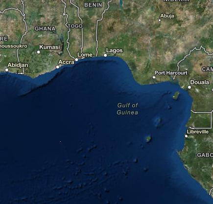

**Figure 1.** Random location of the historic map. In the original handout a callout labeled the speck in the Gulf of Guinea "My Historic Map."

You are going to use the georeferencing tool to pin the historic map on top of the ArcGIS Pro map.

In the map view, navigate to the general area of where the scanned map is located. Open the Imagery tab and click the Georeference button. This will open the Georeference tab on the ribbon.

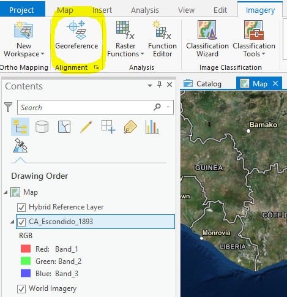

**Figure 2.** Where to find the Georeference button.

In the Prepare group, click the Fit to Display button. The scanned map will move to the area you previously navigated to. This is your first attempt to locate your scanned map on top of the basemap. On the Appearance tab, in the Effects group, you can change the transparency so that you can see what you are georeferencing. You can also turn the layer on and off to see behind the image.

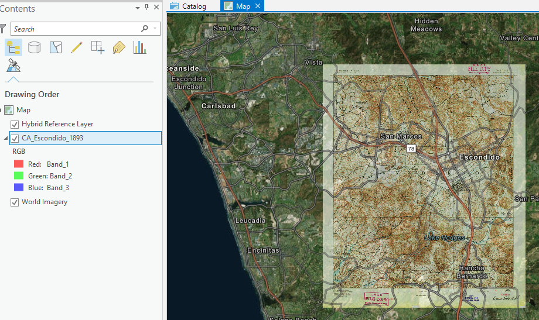

**Figure 3.** Fit to Display and transparency.

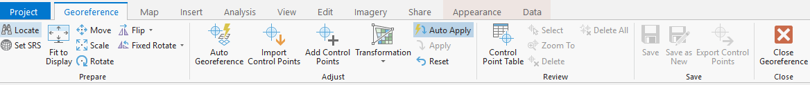

**Figure 4.** The Georeference tab.

### Step 4

On the Georeference tab, in the Adjust group, click Add Control Points. Click a defined corner or intersection on the image and match it to the same location on the basemap.

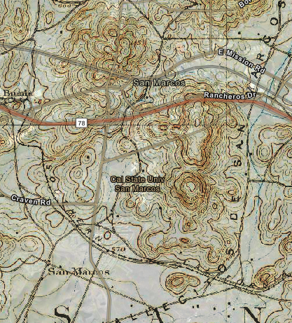

**Figure 5.** Example of reference points. In the original handout, callouts labeled one feature "Basemap Reference" and the matching feature "Historic Map Reference"; those callouts were Word text boxes and are not part of the image.

You may need to add several control points to get your map to line up properly on the basemap.

> [!IMPORTANT]
> After lining up your image with the basemap, be sure to click Save in the Save group of the Georeference tab to save the georeferencing position.

<!-- TODO(instructor): Step 4 gives no guidance on (a) how many control points to collect, (b) how to distribute them — spread across the full extent and away from a single edge or cluster, rather than bunched near the center, and (c) how to choose a transformation (first-order/affine vs. second- or third-order polynomial vs. spline) for a scanned sheet. The Georeference tab's Transformation control is visible in Figure 4 but is never mentioned in the text. Adding that guidance is a content decision and was left to you. -->

<!-- TODO(instructor): Step 4 never asks students to open the Control Point Table (visible in Figure 4) or to report residuals and total RMSE. If you add this, please word it so that a smaller RMSE is not presented as automatically better — RMSE here is a fit statistic on the very points used to solve the transformation, so a high-order polynomial can drive it toward zero while distorting the sheet everywhere else. -->

<!-- TODO(instructor): There is currently no independent check that the georeferencing is actually correct — every point used is also a point that was fit. Consider requiring a validation step: hold out one or two control points from the solve and report their positional error, or visually compare an independent feature (a section-line corner, a surviving street centerline, a river crossing) that was not used as a control point. -->

### Step 5

Identify a few point or polyline features on your historic image (e.g., locations, cities, or roads) that are not present on a modern map. You can explore different modern maps by changing the basemap display. In the Catalog pane, under the Databases category, right-click on the geodatabase created for your lab, scroll down to New, and click Feature Class. Create a new point or polyline feature class with the same coordinate system as your current map.

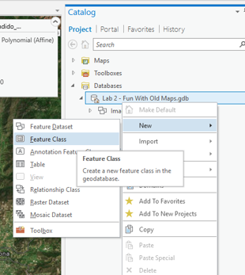

**Figure 6.** How to start creating a feature class.

<!-- VERIFY: The geodatabase in this screenshot is named "Lab 2 - Fun With Old Maps.gdb" — a Lab 2 name in a Lab 3 handout. Either the screenshot came from an earlier numbering of this lab or the lab was renumbered. The capture is otherwise correct; it was not altered. -->

Select the layer you just created, open the Edit tab, and click Create under the Features group. Use the Create Features pane to edit the new feature class and add the specific point and polyline features you identified. Be sure to click Save to save your edits when you are finished. For a more extensive review of editing a feature class, refer to the Basic Skills chapter.

<!-- TODO(instructor): "the Basic Skills chapter" has no corresponding page on the course site yet. Once one exists, turn this into a link. -->

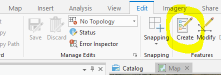

**Figure 7.** How to start editing a feature class.

### Step 6

You will want to add labels for the locations or roads you identified in your feature class. Right-click on your feature layer and open the Attribute Table. Click the Add Field button. Add a field called `Location_Name` with the data type set to Text. Switch back to the Attribute Table and name the locations accordingly.

<!-- VERIFY: In the ArcGIS Pro version shown in Figure 8 the attribute-table control is labeled simply "Add" under the "Field:" heading, not "Add Field". Confirm the label for the Pro version this lab is taught on before the wording is finalized. -->

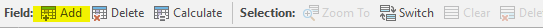

**Figure 8.** How to get to the Add Field control.

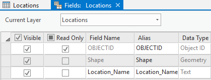

**Figure 9.** Adding the field.

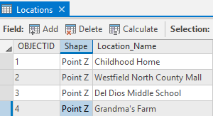

**Figure 10.** Filling the new field in the attribute table.

Make sure that the feature layer is still selected in the Contents pane. On the ribbon click the Labeling tab and click Label. Check Label Features In This Class. In the Field drop-down select `Location_Name`.

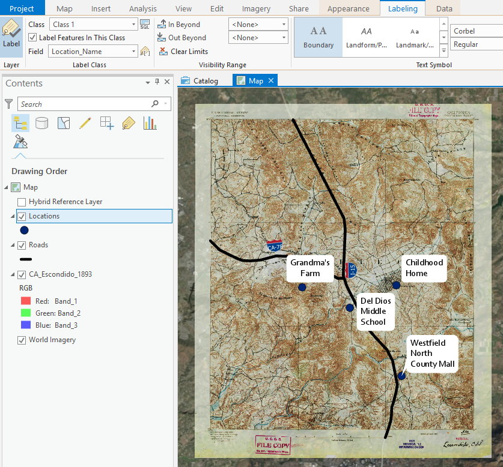

**Figure 11.** Labeling.

## Deliverables

Prepare and submit a brief report discussing your project and presenting your results. The project should be about 3 pages long, including your two full-page maps. Your project report needs to indicate where you got the original maps, what basemap you used for georeferencing, how many rectification nodes you used to georeference your images, and discuss the results. You should show two full page (8.5 x 11) maps that present 3 layers: the basemap, the georeferenced old map, and the digitized features. Your maps should include all of the required elements of a good map as noted in the grading rubric. Make sure to review the rubric at the end of this page for the full requirements for the laboratory exercise.

<!-- TODO(instructor): "rectification nodes" is not standard ArcGIS Pro terminology; the software calls them control points (or links). The wording was left verbatim here and in the rubric because changing it changes a scored rubric item. If you renumber or reword the rubric, "control points" would be clearer, and this is also the natural place to require the residual/RMSE report described in the Step 4 note above. -->

## Example Map of Missing Cities in a U.S. State

**Figure 12.** Example map of missing cities in a U.S. state.

Source of georeferenced map: <http://usgwarchives.net/maps/utah/images/west1876.jpg>

<!-- TODO(instructor): DEAD LINK. usgwarchives.net resolves (192.175.112.4) but every connection attempt fails over both http and https, from the site root as well as this file — the host appears to be down or unreachable, not merely moved. The original hyperlink in the Word file also carried a stray trailing "%20" ("...west1876.jpg%20"), which was removed; that alone was not the cause. No substitute map was chosen — picking the replacement source is your call. -->

## Example Map of Missing Roads in European City

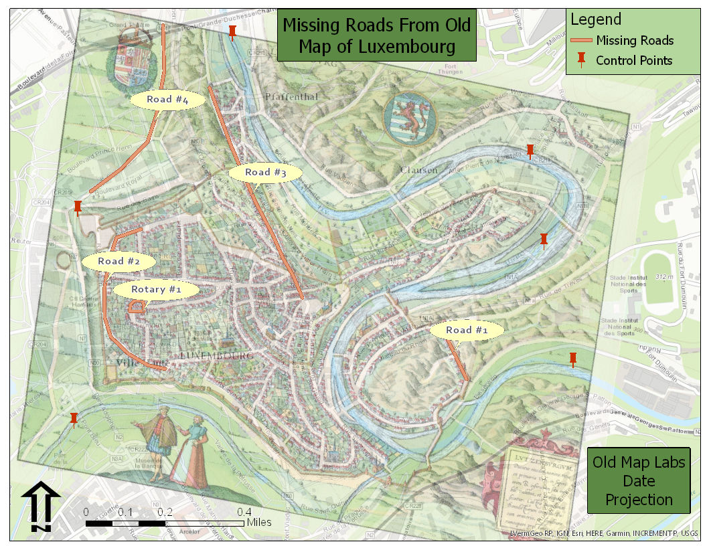

**Figure 13.** Example map of missing roads in a European city.

Source of georeferenced map: <https://img0.etsystatic.com/114/0/7893465/il_fullxfull.858391386_gp92.jpg>

<!-- TODO(instructor): This source is a hot-linked product image on an Etsy CDN (HTTP 200 as of 2026-09-03, but no stable provenance, no license, and it can disappear without notice). If the Luxembourg example is kept, a library or archive copy of the same sheet would be a more durable citation. -->

## Rubric for Georectifying and Digitizing Images

| Item | Points |
| --- | --- |
| Assignment Title, Name, Date, Course Name | /4 |
| Brief summary of the requirements of the project | /4 |
| Give the sources for both of the old maps that were found | /4 |
| List the number of georectification nodes used to rectify each image | /4 |
| List and describe the specific features that were found and digitized from each old map. | /4 |
| Make two full page (8.5 x 11) maps, one for each old map. Show georeferenced old map, digitized features, and control points used: • Map Title • Neat Line • North Arrow • Scale Bar • All digitized features are labeled • Text box with author name, date, map projection • Digitized features marked with a well-defined symbol • Background map is visible • Zoomed to an appropriate scale for viewing all features • All text is legible on printed map | State Map /15  City Map /15 |

<!-- TODO(instructor): The rubric states no point total. The scored rows sum to 50 (4+4+4+4+4+15+15). No numbers were changed; please confirm 50 is the intended total and add it to the table. In the Word original the map-requirements checklist was a single cell vertically merged across two rows, one scored "State Map /15" and one "City Map /15"; Markdown cannot merge cells, so the checklist appears once with both point boxes in the Points column. No requirement was added or dropped. -->

<!-- Migration notes (2026-09-03): source: /Users/dan/ames-sync/Work/Teaching/CE 414 Engineering Applications of GIS/Labs/Lab 3 - Georectifying and Digitizing Images.docx; ArcGIS Pro version verified against: NOT VERIFIED in this migration; images renamed from fig-NN: fig-01.png->lab03-random-location.png, fig-02.png->lab03-georeference-button.png, fig-03.png->lab03-fit-to-display.png, fig-04.png->lab03-georeference-tab.png, fig-05.png->lab03-control-point-example.png, fig-06.png->lab03-new-feature-class.png, fig-07.png->lab03-edit-create-features.png, fig-08.png->lab03-add-field-button.png, fig-09.png->lab03-fields-view.png, fig-10.png->lab03-attribute-table-filled.png, fig-11.png->lab03-labeling.png, fig-12.jpg->lab03-example-state-map.jpg, fig-13.jpg->lab03-example-city-map.jpg; stale/unverified screenshots: lab03-random-location.png (the "My Historic Map" callout was a Word text box and is gone; without it the figure is just a basemap of the Gulf of Guinea and the raster is a barely visible speck), lab03-control-point-example.png (the "Basemap Reference"/"Historic Map Reference" callouts were Word text boxes and are gone, and no control points are actually visible in the capture despite the caption), lab03-fit-to-display.png (caption promises transparency but no transparency control is shown), lab03-georeference-button.png and lab03-georeference-tab.png (older ArcGIS Pro ribbon styling; group and button names not re-verified against a current Pro release), lab03-new-feature-class.png (geodatabase named "Lab 2 - Fun With Old Maps.gdb" in a Lab 3 handout), lab03-add-field-button.png (button reads "Add", not "Add Field"); TODO(instructor): shapefile->feature class terminology in Problem Statement, whether two complete historic-map cases are needed, link-check results for Step 1 sources, third-party PDF converter pdf2jpg.net, control-point count/distribution and transformation-selection guidance, residual/RMSE reporting worded so lowest training RMSE is not treated as best, independent validation check, "Basic Skills chapter" has no site page, "rectification nodes" vs. control points, dead usgwarchives.net source link, unstable Etsy CDN source link, rubric has no stated total (rows sum to 50); VERIFY: geodatabase named for Lab 2 in Figure 6, "Add Field" vs. "Add" button label in Figure 8; dead/redirected links: http://usgwarchives.net/maps/utah/images/west1876.jpg DEAD (connection fails, http and https, root and file; stray trailing %20 removed from the original hyperlink), https://pdf2jpg.net/convert.php REDIRECTS to https://pdf2jpg.net/ (stale "#.W0TZSNJKiM8" fragment dropped), https://www.loc.gov/maps/collections/ returns 403 to curl via Cloudflare bot protection but is live in a browser, https://images.google.com/ 200, https://www.arcgis.com/home/item.html?id=15118046711648a783844109bfdd2203 200, https://www.usgs.gov/programs/national-geospatial-program/historical-topographic-maps-preserving-past 200, https://img0.etsystatic.com/114/0/7893465/il_fullxfull.858391386_gp92.jpg 200 -->
