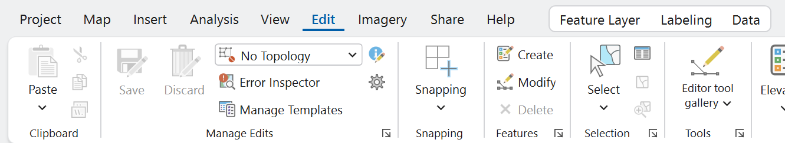
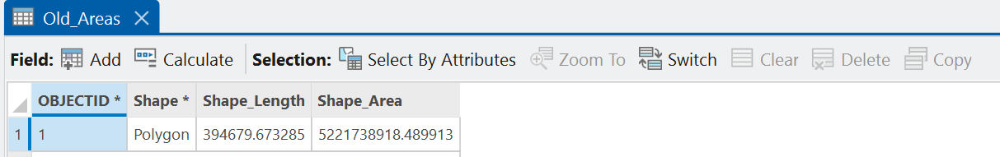
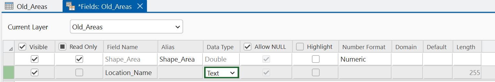
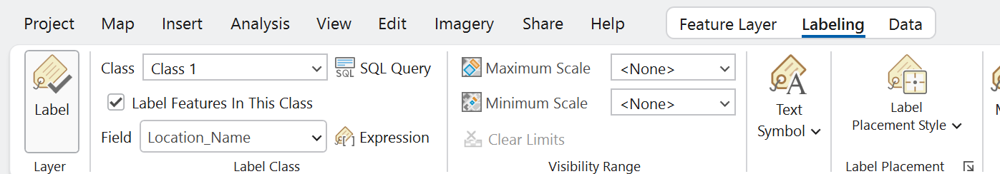
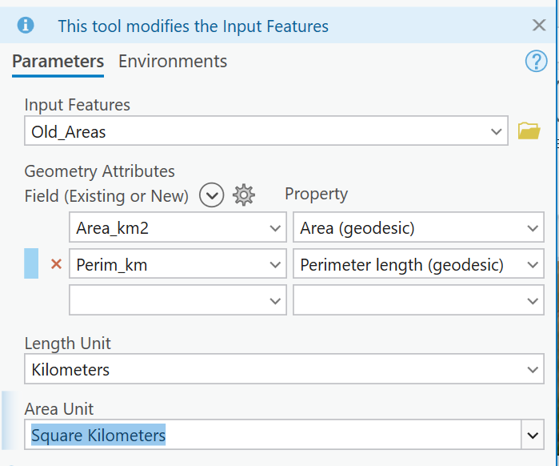

---
search:
  exclude: true
---

# DRAFT — Lab 3: Georectifying and Digitizing Historic Maps

**Civil Engineering 414 — Engineering Applications of GIS**

Fall 2026 · Dr. Dan Ames

> [!WARNING]
> **This is a draft for review.** It is not the assigned page. The assigned page is
> [Lab 3](README.md).
>
> **Changes to what the lab asks students to do**
>
> - **Attributes on every feature.** Every digitized feature carries a name, a type, what is there
>   now, and how confident the student is in it — not just a name.
> - **All three geometry types.** At least one point, one line and one polygon, so the lab is real
>   digitizing practice rather than dropping a handful of pins.
> - **One measurement.** One polygon is measured with Calculate Geometry, run by hand from the
>   attribute table, and the student states how far that area can be trusted.
> - **Check features are drawn and measured**, not eyeballed: three short lines from where the scan
>   puts a feature to where the basemap puts it.
> - **The sensitivity step varies the control points as well as the transformation** — all points,
>   a higher-order equation, and three clustered points — and Map 2 shows the digitized features over
>   the sheet as re-solved, so the student can see the sheet move under their work.
> - **The Stansbury survey of 1852** is named as the worked example.
> - **The transformation test now comes before digitizing** (Step 7), so the georeferencing session
>   runs Steps 4 to 7 and is then saved and closed. Digitizing no longer depends on keeping an unsaved
>   session open for most of the lab.
> - **Control points are exported to a file** at the end of Step 5, and the Map 2 run is kept with
>   **Save as New** before switching back.
> - **Control points are no longer required on Map 1** — they only draw during a georeferencing
>   session. The Control Point Table goes in the report instead.
> - Still **one week**, and still **no ModelBuilder**: this lab is deliberately done by hand.
>
> **Corrections to things that were wrong**
>
> - Step 0's route to Map Properties: it is not on the View tab. Double-click the map in Contents.
> - Two traps the page did not mention: a new field defaults to **Long**, and the attribute table's
>   "Click to add new row" line creates a feature with no geometry.
> - The September 17 corrections (deliverables list, topoView download format, Figure 5's caption)
>   are carried forward.
>
> **Figure provenance**
>
> - Figures 6a, 6b, 8a, 8b, 9a to 9d and 10 are captures from ArcGIS Pro 3.7.1 at 175% display scaling,
>   2026-09-18, from a student-style walk of this draft on the Stansbury sheet in `C:\Ames\Lab03Walk`.
> - Figures 1, 2, 3 and 5 are the 2026-09-03/04 captures against a USGS 1893 Escondido sheet.
> - Figures 4 and 7 are 2026-09-09 captures of the Georeference tab and the Transformation menu.
> - The tool-table icons are generated by `tools/lab03/make_svgs.py`.
>
> **Site behavior**
>
> - This draft is excluded from search and is not in the site menu. Reach it by URL.

## Background

Old maps and aerial photographs are an unreasonably good source of information for civil,
environmental and construction engineers. There are thousands of filing cabinets, in government
agencies and engineering consulting firms, filled with mapping data that exists only on paper. That
data can tell you:

- how cities and landscapes have changed over time
- how growth followed, or ignored, natural and manmade features
- what a river, coastline or wetland looked like before it was engineered
- what was on a site before the building that is on it now

Libraries and agencies have scanned a great deal of it, so more of this material is online now than
ever before. A scan, though, is just a picture. It has rows and columns of pixels and no idea where
on Earth it belongs. **Georeferencing** is the act of telling it: you match points you can identify
on the scan to the same points on a map that already knows where it is, and ArcGIS Pro solves for a
transformation that moves every other pixel accordingly.

That last part is the whole lab. You do not place the image; you place a handful of points and let a
mathematical transformation place the image. How many points you give it, where you put them, and
which transformation you choose decide how much of the sheet ends up where it belongs — and the
number ArcGIS Pro reports to tell you how well it fits is measured on the very points you fitted, so
it can be made to look perfect while the map is wrong everywhere else.

This lab is done by hand. There is no model to build: you place the control points yourself, you
draw every feature yourself, and you give every feature the attributes that make it useful to the
next person. In Step 7 you will re-solve the same sheet three ways, see how far it moves, and use
what moves to decide which result you would put your name on.

> [!IMPORTANT]
> **Your job — see the deliverables below.** Georeference one scanned historic map, digitize and
> describe the features on it that are no longer on a modern map, measure one of them, test how much
> your result depends on the control points and transformation you chose, and make two map layouts.

## Problem Statement

You need to find things that used to be somewhere and are not there now: a town that emptied out, a
rail spur that was pulled up, a street grid that was replaced, a channel that was straightened, a
lake that was larger. Nobody has this in a GIS. It exists on a sheet of paper that somebody scanned.

Your job is to turn the features on that sheet into feature classes, correctly located and properly
described, so they can be measured, overlaid and mapped alongside modern data. That takes two
operations, in this order:

1. **Georeference** the scan, so that its pixels sit in real-world coordinates.
2. **Digitize** the features from it, by drawing them into new feature classes while the
   georeferenced scan is underneath, and recording what each one is.

The order matters. Digitize first and every feature you draw is in the wrong place, permanently.

## Spatial Considerations

Every one of these is a decision you make, and every one of them changes your answer. Say in your
report what you chose and why.

- **Which sheet.** Age, scale and legibility trade against each other. An 1885 county atlas plate is
  full of vanished detail and drawn loosely; a 1950 USGS quadrangle is accurate and shows less
  change. Older is not automatically better.
- **Which basemap you georeference against.** Imagery shows what is there now; a topographic basemap
  shows named features and section lines that are easier to match on an old sheet. The basemap is
  your control, so its accuracy is a ceiling on yours.
- **How many control points, and where.** Three is the minimum for the default transformation and it
  is not enough. Points bunched in the middle of the sheet leave the corners free to wander.
- **Which transformation.** A first-order (affine) transformation can shift, scale, rotate and skew
  the whole sheet but keeps straight lines straight. Higher orders bend it. A spline forces the
  control points to match exactly and rubber-sheets everything between them.
- **The coordinate system of your map.** Set it before you digitize. Your new feature classes
  inherit it, and every length and area you measure depends on it.
- **What counts as "gone".** A road that moved fifty meters, a town that shrank, a lake that is
  smaller: you decide what qualifies, and you defend it.

## Data

> [!IMPORTANT]
> **Set up your folder before you download anything.** On the lab machines, work on the
> **D: drive**, in a folder named after you with one folder per lab inside it — `D:\Smith\Lab03\`.
> Put the project, the scan and everything you make there. The C: drive is locked, network drives
> make ArcGIS Pro slow on large scans, and a USB 3.0 external drive is a legitimate alternative.
> **Never use a space in a folder or file name.** The full set of workspace conventions is on the
> [ArcGIS Tips and Reminders](../../arcgis-tips.md){ target="_blank" } page.

Unlike Labs 1 and 2, nothing here is prepared for you. **You find the data, and you defend it.**
That is the point: the judgment you exercised in Lab 1 choosing which Walmart stores counted, you
exercise here choosing a sheet and a basemap.

| Layer | Where it comes from | What you must record |
| --- | --- | --- |
| Historic map scan | You find and download it | Repository, title, date, scale, and the URL you got it from |
| Modern basemap | ArcGIS Pro basemap gallery | Which basemap, and why that one |
| Digitized features | You create them — points, lines and polygons | Coordinate system, geometry types, the attributes you recorded, and what you chose to include |
| Error lines | You create them | One line per check feature, and which feature each one is |

### Judging the source

Apply the six metadata questions from the introductory course to your sheet before you use it —
**what, where, when, why, how, who** — and put the answers in your report:

- **What** does the sheet show, and at what scale? A scale printed on the sheet tells you how much
  detail to trust.
- **Where** does it cover, and does its coverage actually contain features you can match?
- **When** was it surveyed, which is often years before it was published? Both dates matter, and
  they are not the same date.
- **Why** was it made? A railroad promotional map, a fire insurance plan and a topographic survey
  are drawn to different standards and lie in different directions.
- **How** was it surveyed and drawn, and how was it scanned? A folded sheet flattened on a scanner
  bed has distortion no transformation will fully remove.
- **Who** made it, and are you allowed to use it? Anything published in the United States before
  1930 is in the public domain; a library's scan of it may still carry the library's own terms.

> [!WARNING]
> A pictorial or "bird's eye" view is not a map. Panoramic city views, common in the 1880s, are
> drawn in perspective from an imagined viewpoint, so scale changes continuously across the image
> and no transformation will make it fit. They are wonderful documents and they will waste your
> afternoon. Use a plan view, drawn looking straight down.

### Where to find a sheet

Your sheet should be **older than 1900** if you can find one that covers ground you can match. The
further back it goes, the more change there is to find.

| Source | What is there |
| --- | --- |
| [USGS topoView](https://ngmdb.usgs.gov/topoview/) | USGS topographic sheets from 1884 to 2006, plus the current US Topo series, free. The most reliable starting point. **Take the JPEG download, not the GeoTIFF** — see the warning below |
| [USGS Historical Topographic Map Collection](https://www.usgs.gov/programs/national-geospatial-program/historical-topographic-maps-preserving-past) | The program behind topoView, with an explanation of what was scanned and how |
| [David Rumsey Map Collection](https://www.davidrumsey.com/) | Over 100,000 scanned historic maps, strong on the nineteenth century and on city plans |
| [Library of Congress map collections](https://www.loc.gov/maps/collections/) | Fire insurance plans, city plans, railroad maps. May show a bot check before it loads |
| [Wikimedia Commons](https://commons.wikimedia.org/wiki/Category:Old_maps_by_country) | Public-domain scans, many of them Library of Congress copies, organized by country and state. Check the license box on the file page |

> [!WARNING]
> **Take the plain image, not the georeferenced one.** Where a repository offers a choice of
> formats, some of them already carry a spatial reference: USGS describes its GeoTIFF download as
> having "embedded georeferencing information so that the map can be used directly in a GIS", and a
> GeoPDF carries one too. Download one of those and ArcGIS Pro drops the sheet straight onto the
> basemap, correctly placed, with nothing for you to solve — somebody else did this lab for you.
> Take the **JPEG**, or any plain image format, so that the placement is yours.

> [!TIP]
> **Check the result.** Before you commit to a sheet, ask yourself two questions. Can you name at
> least **eleven** features on it that you could also point to on a modern basemap — eight to
> georeference with in Step 4, and three more, kept back, to check the result in Step 6? And does it
> show at least one **closed shape** — a lake, a pond, a town boundary, a field — that you could
> trace as a polygon and measure in Step 10? If the answer to either is no, find another sheet.

### A worked example: the Stansbury survey of 1852

The instructor's worked example for this lab is the **1852 map of the Great Salt Lake and adjacent
country**, surveyed in 1849 and 1850 by Captain Howard Stansbury of the Corps of Topographical
Engineers ([Library of Congress item 2018588045](https://www.loc.gov/item/2018588045/), public
domain, also on
[Wikimedia Commons](https://commons.wikimedia.org/wiki/File:Map_of_the_Great_Salt_Lake_and_adjacent_country_in_the_territory_of_Utah_-_surveyed_in_1849_and_1850_under_the_orders_of_Col._J.J._Abert_LOC_2018588045.jpg)).
It is worth looking at before you choose your own, for three reasons:

- It is a real survey rather than a compilation, so its errors are a surveyor's errors, not a
  copyist's.
- It was folded, and the crease lines show in the scan: distortion of exactly the kind no
  transformation removes.
- It shows the Great Salt Lake and Utah Lake as they were in 1850, and it carries a printed
  **graticule** of latitude and longitude, which makes the optional extra credit at the end of this
  lab possible.

You may use it for your own lab. If you do, be aware that its latitudes are excellent and its
longitudes are not — which is exactly the sort of thing this lab asks you to find out for yourself.

### If your download is a PDF

Many scans, including USGS GeoPDFs, arrive as PDF. ArcGIS Pro will not add a PDF to a map directly.
Convert it:

- **In ArcGIS Pro**, search the Geoprocessing pane for **PDF To TIFF** (Conversion Tools ▸ To
  Raster). Set the input PDF, an output `.tif` in your lab folder, and a resolution — 250 to 300 dpi
  is enough for a topographic sheet and keeps the file manageable.
- **Or take a screen capture** of the PDF opened at full size and save it as a `.jpg` or `.png`.
  This is fine and it is what most people do; you lose whatever resolution the screen does not show.

Do not upload the file to a third-party conversion website. You have the tool on your desk.

## Analysis Tools

There is no ModelBuilder model in this lab, on purpose. Georeferencing is interactive by nature — you
are looking at two images and deciding that this corner is that corner — and digitizing is a skill
you only get by doing a lot of it by hand. These are the tools you will use for the first time in
this course. The icon beside each one is a reminder of what it does to your data — the orange part is
what comes out.

| Tool | What it does |
| --- | --- |
| { .tool-icon } **Georeference** (Imagery tab, Alignment group) | Opens the Georeference tab for the selected raster layer. Everything in Steps 3 to 7 lives on that tab |
| { .tool-icon } **Fit to Display** (Prepare group) | Drops the scan into the current map view at roughly the right size and place, so you have something to drag points from. A first guess, not a result |
| { .tool-icon } **Add Control Points** (Adjust group) | The core tool. Click a point on the scan, then the same point on the basemap. Each pair is one link |
| { .tool-icon } **Transformation** (Adjust group) | Chooses the equation fitted to your control points. The menu states the minimum number of points each one needs |
| { .tool-icon } **Control Point Table** (Review group) | Lists every link with its residual, and the total RMS error. Where you find out what your points are actually doing |
| { .tool-icon } **Create Feature Class** (Catalog pane, right-click a geodatabase ▸ New) | Makes the empty point, line or polygon layer you are about to draw into |
| { .tool-icon } **Create Features** (Edit tab, Features group) | The editing pane you draw in |
| { .tool-icon } **Add** (attribute table, Field group) | Adds a field to a feature class. This is the button on the attribute table's own toolbar, not the **Add Field** geoprocessing tool you used in Lab 1; it does the same job from a different place |
| { .tool-icon } **Label** (Labeling tab) | Draws the values of a field on the map |
| { .tool-icon } **Calculate Geometry** (attribute table, right-click a field) | Writes a feature's own area, perimeter or length into a field. Use the **geodesic** options; they are measured on the ellipsoid rather than in the flat plane of your projection, so they do not inherit its distortion |
| { .tool-icon } **Measure Distance** (Map tab, Inquiry group) | Measures a straight-line distance on the map by clicking from one point to another. The quick way to re-check your reserved features in Step 7 without drawing anything |

## Complete the Lab

If you would rather work it out than be walked through it, everything you need is above: find a
plan-view sheet older than 1900, georeference it against a basemap you choose, check it at three
features you did not use, digitize and describe what is gone, measure one polygon, and do the Step 7
comparison. The step-by-step solution below is there when you want it.

> [!TIP]
> If you complete the lab without the step-by-step solution, say so in your report. There is no
> extra credit for it; it is worth knowing about yourself.

## Step-by-Step Solution

> [!NOTE]
> **Important Note #1.** The steps come in two halves. Steps 3 to 7 are one georeferencing session:
> you place the sheet, check it, and test it, and at the end of Step 7 you save it and close it.
> Steps 8 to 10 are digitizing and measuring, on a sheet that is already in place. Plan to do Steps 3
> to 7 in one sitting.

> [!NOTE]
> **Important Note #2.** The figures were captured against a different sheet than yours — most of
> them against the Stansbury sheet — so your screen will not match exactly. The ribbon, the panes
> and the button names are what to follow. Paths in the figures start with `C:\` because they were
> captured on an instructor machine. Yours should be on `D:\`.

### Step 0 — Set Up the Project

1. Start ArcGIS Pro and create a new project using the **Map** template. Name it `Lab03`.
   In the *Location* box, browse to your lab folder; the box does not take a typed path.
2. Confirm that the project geodatabase is `Lab03.gdb`, in your lab folder. Everything you create
   goes in it.
3. On the **Map** tab, in the **Layer** group, click **Basemap** and choose one. Start with
   **Imagery Hybrid**: it shows what is on the ground now and labels the roads, which is what you
   need to match against.
4. Decide your coordinate system now, before you add anything. In the **Contents** pane,
   double-click **Map** to open **Map Properties**, choose **Coordinate Systems**, and set a
   projected system appropriate to your area — a UTM zone or a State Plane zone. For Utah, search
   for `NAD 1983 UTM Zone 12N`. Record what you chose; it goes on your maps.

> [!WARNING]
> If you leave the map in the basemap's Web Mercator, every distance and area you measure later is
> wrong by a factor that grows with latitude. Lab 1's downloads arrived in Web Mercator, which made
> the wrong answer the default outcome rather than a hypothetical — that is why Lab 1 set an output
> coordinate system before it measured anything. Set a projected coordinate system here too.

> [!TIP]
> **Check the result.** Hover the pointer over your study area and read the coordinate pair at the
> bottom of the map view. In a UTM zone the easting is a six-digit number, roughly 160,000 to 830,000,
> and the northing a seven-digit number, both in meters. If the easting is negative or in the
> millions, the map is not in the system you set.

### Step 1 — Find a Sheet

Work through *Where to find a sheet* above and download one. Save it in your lab folder, as an
image, with no spaces in the file name. Convert it from PDF first if you need to.

Record the repository, the sheet title, the survey date, the publication date, the scale and the
URL. You need all six in your report.

### Step 2 — Add the Scan

1. In the **Catalog** pane, right-click **Folders** and add a folder connection to your lab folder.
2. Find your image and drag it into the map.
3. If ArcGIS Pro offers to calculate statistics, click **Yes**. It will also warn that the layer has
   an **Unknown Coordinate System** — that is expected; an unplaced scan has none.
4. Right-click the layer in the **Contents** pane and choose **Zoom To Layer**.

The scan will be somewhere absurd. An image with no spatial reference is placed at coordinates near
zero, which is the origin of whatever coordinate system your map is in — usually the middle of an
ocean, nowhere near your study area.

**Figure 1.** An image with no spatial reference, drawn at the origin of the map's coordinate
system. In this capture the map was in latitude and longitude, so the origin is off West Africa; in
a UTM map it lands somewhere else, equally far from home.

> [!TIP]
> **Check the result.** If your scan appears in roughly the right place without any work from you,
> it already carries spatial reference information — a GeoTIFF or GeoPDF often does. That means the
> software has already made the choices this lab is about. Say so in your report, and georeference it
> anyway to see how your solution compares.

### Step 3 — Fit to Display

1. Navigate the map to the area your sheet covers, at a scale where you can see the whole of it.
2. Select the scan in the **Contents** pane.
3. On the **Imagery** tab, in the **Alignment** group, click **Georeference**. The **Georeference**
   tab opens.

**Figure 2.** Where to find the Georeference button.

4. In the **Prepare** group, click **Fit to Display**. The scan jumps into the current view.
5. Make it semi-transparent so you can see the basemap through it. With the layer selected, go to
   the contextual **Raster Layer** tab, **Effects** group, and set **Transparency** to about 50 %.

**Figure 3.** After Fit to Display, with transparency turned up.

**Figure 4.** The Georeference tab. Everything in Steps 3 to 7 is on it: **Fit to Display** in
Prepare, **Add Control Points** and **Transformation** in Adjust, **Control Point Table** in Review,
and **Save** and **Save as New** in Save.

### Step 4 — Add Control Points

In the **Adjust** group, click **Add Control Points**. Then, for each point:

1. Click a feature on the **scan**.
2. Click the **same feature** on the basemap.

The scan moves as soon as you have enough points for the current transformation. It will keep
moving, and settling, as you add more. Zoom in to place each point; a point clicked at the scale of
the whole sheet is only as good as the pixel you happened to hit.

**Figure 5.** The very first control point, matched from the scan to the basemap. Read the status
panel in the top right: one point, and a total RMS error of 0.000000. The sheet is plainly still in
the wrong place, so that zero is telling you nothing — which is the whole point of the TIP below.
Keep going until you have eight, spread to the corners.

**How many, and where.** Collect **at least eight**, and spread them out:

- Put points near all four **corners** of the sheet, not only in the middle. A transformation is
  only constrained where you constrain it; corners left free will wander.
- Use features that have not moved: **road intersections, section corners, rail crossings, river
  confluences, island tips, mountain summits, building corners on old buildings**. Do not use a river
  bank, a shoreline, a field edge or a tree.
- Include **three that are close together near the middle** of the sheet as well as the ones at the
  corners. Step 7 re-solves the sheet from just those three.
- Keep **three** more identifiable features in reserve and do **not** use them here. Step 6 checks
  your result at those three, and they only work as a check if they had no say in the answer.

**The minimum is not the target.** Each transformation needs a minimum number of points, and if you
give it exactly that many it fits them perfectly and tells you nothing:

| Transformation | Minimum control points |
| --- | --- |
| Zero Order Polynomial (Only Shift) | 1 |
| Similarity Polynomial | 3 |
| 1st Order Polynomial (Affine) | 3 |
| 2nd Order Polynomial | 6 |
| 3rd Order Polynomial | 10 |
| Adjust | 3 |
| Projective | 4 |
| Spline | 10 |

> [!TIP]
> **Check the result.** With the default 1st Order Polynomial and exactly three points, your total
> RMS error will be 0.000000. That is not a good fit; it is an exact fit of three points by a
> transformation with exactly enough freedom to pass through three points. When the number stops
> being zero, you have started to learn something.

### Step 5 — Read the Residuals

In the **Review** group, click **Control Point Table**. Each row is one link, with its **residual**:
how far that point ended up from where you put it, in map units. The table also reports a **total
RMS error**, the root-mean-square of those residuals, and the same number appears in the status
panel on the map.

> [!WARNING]
> **The RMS error is measured on the points you fitted.** Every control point in the table
> contributed to solving the transformation, so the residuals describe how well the equation
> reproduces its own inputs. It says nothing about the rest of the sheet. A high-order polynomial or
> a spline can drive the total RMS to zero and distort the map badly everywhere in between. A small
> number here is not a good result. It is a small number.

Work through the table once:

- If one point has a residual several times larger than the rest, look at it. You have probably
  matched the wrong intersection, or clicked a feature that moved. Re-collect it.
- If the residuals are all about the same size, that size is roughly the accuracy of your
  georeferencing at the points, which is the best case for the sheet as a whole.
- Record the total RMS error and the number of points, and take a screen capture of the table.
  All three go in your report.

**Save your control points now.** Click **Export Control Points** on the table's toolbar and save
them as a text file in your lab folder. If you lose your session, **Import Control Points** on the
same toolbar brings every link back in seconds; without the file you would re-collect the sheet
from scratch.

### Step 6 — Check Your Error

The RMS error cannot tell you how good your georeferencing is, because it only knows about points
you already fitted. So measure it at your three reserved features — and rather than eyeball the gap,
**draw it**, so you have a measurement and a record of where you checked.

1. In the **Catalog** pane, under **Databases**, right-click `Lab03.gdb`, then **New ▸ Feature
   Class**. Name it `ErrorLines`, choose **Line**, and give it the coordinate system of your map.

**Figure 6a.** The project geodatabase in the Catalog pane. There is one, it is named for the lab,
and everything you create in this lab goes in it.

**Figure 6b.** Right-click the geodatabase and choose **New ▸ Feature Class**. You do this again in
Step 8 for each feature class you digitize.

2. On the **Edit** tab, click **Create**, pick `ErrorLines` in the **Create Features** pane, and for
   each reserved feature draw a **two-point line**: click where the *scan* puts the feature, then
   double-click where the *basemap* puts it. **Zoom in to about 1:50,000 before you draw each one.**
   At a whole-sheet scale one screen pixel can be a hundred meters or more, and a line drawn there is
   no more accurate than your aim.
3. Click **Save** in the **Manage Edits** group, and **Yes** when ArcGIS Pro asks whether to save all
   edits.
4. Open the `ErrorLines` attribute table (select the layer and press **Ctrl+T**), click **Add** in
   the **Field** group, name the new field `Error_m`, and change its **Data Type** from the default
   **Long** to **Double** — a `Long` field would throw away everything after the decimal point.
   Click **Save** on the **Fields** tab. Then right-click the `Error_m` column header and choose
   **Calculate Geometry**. Set the property to **Length (geodesic)** and the unit to **Meters**.
   Each line now carries its own length: the georeferencing error at that feature, on the ground.

> [!TIP]
> **Check the result.** You should have exactly **three** rows, each with an `Error_m` somewhere
> between tens of meters and a few kilometers, depending on your sheet. Record all three and their
> mean. Then look at them on the map. Your transformation has already absorbed any shift, rotation
> and stretch of the sheet *as a whole*, so what is left is how the sheet departs from that. Three
> lines of similar length pointing the same way suggest the sheet is bent smoothly in that region —
> the kind of error a higher-order transformation might reduce. Lines of very different lengths or
> directions point to local problems: a fold, a feature the surveyor misplaced, or a check feature you
> misidentified. Say in your report which you see.

### Step 7 — Test the Transformation

Your georeferenced sheet is *an* answer. It is the answer that one transformation gives for the
points you happened to collect. Before you digitize anything on it, find out how much of it is the
sheet and how much of it is your choice. Re-solve the sheet three ways:

| Run | Control points | Transformation |
| --- | --- | --- |
| 1 — baseline | all of them | 1st Order Polynomial (Affine) — the solve you already have |
| 2 — higher order | all of them | **2nd Order Polynomial**, or **Spline** if you collected ten or more |
| 3 — clustered | only your three close-together points near the middle | 1st Order Polynomial (Affine) |

Change the equation with the drop-down on the **Control Point Table** toolbar, or the
**Transformation** menu in the Adjust group. For run 3, **uncheck** the box at the start of every row
except your three clustered points. Unchecked links stay in the table but drop out of the solve; the
status panel's count changes to `3 / 8` (or however many you have), and checking them again brings
them straight back.

**Figure 7.** The Transformation menu, with the minimum control points each one needs.

For each run, record the total RMS error, and re-check your three reserved features with **Measure
Distance** (Map tab, Inquiry group): click where the scan now puts each one, then double-click where
the basemap puts it. You do not need to redraw your error lines; Measure Distance is the quick check.

| Run | Control points | Transformation | Total RMS error (m) | Mean check error (m) | What the sheet looks like |
| --- | ---: | --- | ---: | ---: | --- |
| 1 — baseline | | 1st Order (Affine) | | | |
| 2 — higher order | | | | | |
| 3 — clustered | 3 | 1st Order (Affine) | | | |

"What the sheet looks like" is a sentence: is it straight, is it bowed, do the edges curl, does a
straight line on the sheet still look straight?

**Keep the run you will show on Map 2.** Choose run 2 or run 3 — whichever moves the sheet more — and
while it is the active solve, click **Save as New** in the **Save** group. That writes a new,
georeferenced copy of the scan (a `.tif`) in your lab folder under a name you give it, such as
`sheet_run3.tif`; your original scan is untouched. Map 2 uses that copy.

**Then finish the session.** Switch back to run 1 — all links checked, 1st Order Polynomial — click
**Save**, and click **Close Georeference**. Your scan is now placed by run 1, which is what you
digitize on and what Map 1 shows.

Answer these three questions in your report, in bold, in this order:

1. **Which run gave the lowest total RMS error, and is that the one you would use?** If a run
   reported something very close to zero, say why, and what that zero is actually describing.
2. **What happened to your mean check error from run to run — did it track the RMS error, or move
   the other way?** Say what that means about what RMS can and cannot tell you.
3. **Which run would you defend to a client, and what would you tell them your georeferencing is
   good to?** Give a distance, and say how you know.

> [!TIP]
> One of these runs will give you the best RMS number you see all lab. It is the one you should trust
> least. Watch what the clustered run does to the corners of the sheet.

### Step 8 — Digitize the Features

Now find what is gone. Turn the transparency up and down, switch basemaps, and look for features on
the scan with nothing under them: a town site, a road that stops, a rail grade, a channel that has
moved, a lake that has shrunk.

Capture **at least six** features, and use **all three geometry types**: at least one **point** (a
town, a mill, a farmstead, a spring), at least one **line** (a road, a rail grade, a canal, a ford),
and at least one **polygon** (a lake, a town plat, a field, a quarry). Each geometry type goes in its
own feature class.

1. In the **Catalog** pane, under **Databases**, right-click `Lab03.gdb`, then **New ▸ Feature
   Class**, as in Step 6. Make one feature class per geometry type — for example `Old_Places`
   (point), `Old_Routes` (line) and `Old_Areas` (polygon) — each in the coordinate system of your
   map.
2. On the **Edit** tab, click **Create** in the **Features** group. The **Create Features** pane
   lists a template for each feature class that is visible on the map.

**Figure 8a.** The Edit tab. **Create** opens the Create Features pane; **Save**, in Manage Edits, is
how you keep what you drew.

3. Click a template and draw. Click once for a point; click along a line and double-click to finish
   it; click around a shape and double-click to close a polygon. Zoom in: a feature traced at the
   full-sheet scale is only as good as the pixels you could see.
4. Click **Save** in the **Manage Edits** group when you are done, and **Yes** to save all edits.

**Figure 8b.** The 1850 shoreline of the Great Salt Lake, traced from the Stansbury sheet into
`Old_Areas`, with the Create Features pane on the right. It is traced with forty-odd vertices at the
headlands and bays; a smoother tracing would be quicker and less defensible.

> [!TIP]
> **Check the result.** Turn the historic scan off. Your digitized features should still be in
> sensible places relative to the modern basemap — a vanished road should still connect to roads that
> exist. If a feature lands somewhere impossible, either you drew it wrong or your georeferencing is
> worse than Step 6 said. A template missing from the Create Features pane usually means that layer is
> turned off in Contents.

### Step 9 — Add Attributes

A feature with no attributes is a drawing. A feature with good attributes is data the next person
can use. Give **every** feature class the same four text fields, and fill them in for **every**
feature.

| Field | Type | What goes in it |
| --- | --- | --- |
| `Location_Name` | Text | The name on the historic sheet, exactly as printed. If it has none, a short description |
| `Feature_Type` | Text | What it is: town, road, rail grade, ford, lake, farmstead, mill |
| `Present_Day` | Text | What is there now, from the modern basemap: a subdivision, a freeway, farmland, dry lake bed |
| `Confidence` | Text | `High`, `Medium` or `Low` — how sure you are that you placed and identified it correctly |

1. Select a feature layer in **Contents** and press **Ctrl+T** to open its attribute table (or
   right-click it and choose **Attribute Table**).
2. On the table's toolbar, in the **Field** group, click **Add**. The **Fields** view opens with a new
   row. Type the field name, set **Data Type** to **Text**, and repeat for the other three. Click
   **Save** on the **Fields** tab of the ribbon.

**Figure 9a.** The attribute table's toolbar. **Add**, in the Field group, is where every new field
starts.

**Figure 9b.** A new field in the Fields view, with its **Data Type** changed to **Text**.

> [!WARNING]
> **A new field starts out as `Long`, a whole number.** If you only type the name, a text field will
> refuse your words, and a measurement field will silently throw away everything after the decimal
> point. Change the **Data Type** every time: **Text** for the four attributes here, **Double** for
> `Error_m`, `Area_km2` and `Perim_km`.

3. Back in the attribute table, fill in all four fields for every feature: click a cell, press
   **F2**, type, and press **Enter**. Use the name from the historic sheet where it has one; that
   name is part of what you found.

> [!WARNING]
> Do not click the **Click to add new row** line at the bottom of the table. It creates a new feature
> with no shape at all, which then sits in your data as an empty record. If one appears, select that
> row alone and press **Delete**. Features come from the Create Features pane, never from the table.

**Figure 9c.** One feature, fully described. The two measurement fields on the right come from
Step 10.

4. Repeat for each feature class.
5. With a feature layer selected in **Contents**, open the **Labeling** tab, set the **Field** to
   `Location_Name`, and click **Label** in the **Layer** group. Do this for each feature class.

**Figure 9d.** Labeling a feature class by `Location_Name`. The tab is only active while a feature
layer, not a table, is selected.

> [!NOTE]
> The `Confidence` field is the one that makes you think. A road you can trace from one surviving
> intersection to another is `High`. A town whose label sits in empty ground, with nothing on the
> basemap to confirm where the buildings stood, is `Low`, however sharply you clicked. Say in your
> report how you decided.

### Step 10 — Measure the Features

Now make the polygon you digitized produce a number.

1. Open your polygon feature class's attribute table and add two **Double** fields, `Area_km2` and
   `Perim_km`.
2. Right-click the `Area_km2` column header and choose **Calculate Geometry**. It opens with your
   feature class and field already filled in. Set the property to **Area (geodesic)**, then on the next
   row choose `Perim_km` and **Perimeter length (geodesic)**. Set **Length Unit** to **Kilometers** and
   **Area Unit** to **Square Kilometers**, and click **OK**.

**Figure 10.** Calculate Geometry, filling both measurement fields in one run.

> [!NOTE]
> Use the **geodesic** options. They are measured on the ellipsoid, so they give the right answer
> whatever coordinate system your feature class happens to be in. In a well-chosen UTM zone the plain
> and geodesic areas differ by only a fraction of a percent, but the geodesic one is the number you
> never have to defend.

**How far can you trust that area?** Your outline is only as well placed as your georeferencing, and
Step 6 measured that. If the whole outline were drawn one mean-check-error too far out, or too far
in, the area would change by roughly

> **perimeter × mean check error**

— with the perimeter in kilometers and the error converted to kilometers, that gives square
kilometers. Real errors rarely all push the same way at once, so treat it as the most your area
could plausibly be off, and state your area as a value **plus or minus at most** that amount. If
perimeter × error comes out larger than half the area itself, the sheet cannot tell you that
feature's area at all; say so rather than report a number.

> [!TIP]
> **Check the result.** `Area_km2` should be a plausible size for what you traced — a pond a fraction
> of a square kilometer, a large lake hundreds or thousands. A number in the millions means the unit
> is square meters; a whole number with no decimals means the field was left as `Long`. If you traced
> a lake that still exists, compare your area with its area today, and use your plus-or-minus to say
> how much of the difference you can actually claim is real.

## Going further: the graticule (optional, up to five points)

Nothing in this lab requires this section, and it is only possible on some sheets. Many
nineteenth-century survey sheets carry a printed **graticule** — a grid of latitude and longitude
lines, with the degrees labeled around the border. The Stansbury sheet does. Most city plans and
county atlas plates do not, and without one there is nothing to do here.

If your sheet has one, georeference it a second way, from the sheet's own coordinates: put control
points on the graticule intersections and give each one the latitude and longitude printed beside it,
rather than matching it to a feature on the basemap. You then have two georeferences of the same
sheet — one fitted to the ground, one fitted to what the surveyors believed the ground's coordinates
were. **The difference between them is the survey's own error**, separated out from yours.

Report, for at least three features, how far apart the two georeferences put them and in which
direction, and whether the difference is a constant shift or grows across the sheet. Say what that
implies about how the original survey was made — and note whether latitude and longitude are equally
wrong, because on many sheets of this period they are not.

> [!WARNING]
> A graticule fit will give you a beautiful RMS error, because a printed graticule is drawn very
> regularly and your points will sit on it almost perfectly. That number tells you nothing at all
> about whether the sheet is in the right place. Check it against a ground feature before you believe
> it.

## Deliverables

Make **two** professional map layouts, each a full page (8.5 × 11):

1. **Map 1 — your baseline.** Run 1. Show the modern basemap, the georeferenced historic sheet, and
   your digitized features, symbolized by type and labeled. The title states the transformation and
   the number of control points; a text box gives your name, the date, the map's coordinate system,
   and the sheet's title and date.
2. **Map 2 — one alternative run.** The same area and the same digitized features over the copy of
   the sheet you kept with **Save as New** in Step 7, with the title and text box saying which run
   it is and why you chose it.

Write a brief report (2–3 pages of text, plus your figures and maps) covering:

- your name, the date, the course, and the name of your peer reviewer, with a sentence on what you
  changed because of them
- the requirements of the project and your approach, in your own words
- **the source of your historic map**: repository, title, survey date, publication date, scale and URL
- the six metadata answers from *Judging the source*, and what they mean for your result
- which basemap you georeferenced against and why, and the coordinate system your map is in
- **how many control points you used, how you distributed them, and which transformation you chose**
- **a screen capture of your Control Point Table**, your **total RMS error**, and what you did about
  any point whose residual stood out from the rest
- **your three check features and the error at each**, as distances on the ground, their mean, and
  what the directions of the three error lines told you
- your Step 7 table and the answers to its three questions
- **a capture of the Catalog pane** showing your feature classes, and **a table of every digitized
  feature** with its four attributes, plus a sentence on how you decided the `Confidence` values
- **the area and perimeter of your polygon**, with its plus-or-minus and how you worked it out
- where your result is wrong and why, and what data would fix it
- this rubric pasted in, with your self-assessment in every row
- one line saying what, if anything, you used AI for
- the optional graticule comparison, if you did it

> [!IMPORTANT]
> **Peer review before you submit.** Have another student in the class read your report against
> the rubric and give you feedback, then act on that feedback before the deadline. Name your
> reviewer in the report and say in a sentence what you changed because of them. A report nobody
> else has read is a draft, not a submission.

## References

Esri. *Overview of georeferencing.* ArcGIS Pro documentation.
<https://pro.arcgis.com/en/pro-app/latest/help/data/imagery/overview-of-georeferencing.htm>

Esri. *Calculate Geometry Attributes.* ArcGIS Pro tool reference.
<https://pro.arcgis.com/en/pro-app/latest/tool-reference/data-management/calculate-geometry-attributes.htm>

Esri. *PDF To TIFF.* ArcGIS Pro tool reference.
<https://pro.arcgis.com/en/pro-app/latest/tool-reference/conversion/pdf-to-tiff.htm>

Stansbury, H. (1852). *Map of the Great Salt Lake and adjacent country in the Territory of Utah.*
Library of Congress. <https://www.loc.gov/item/2018588045/>

U.S. Geological Survey. *Historical Topographic Map Collection.*
<https://www.usgs.gov/programs/national-geospatial-program/historical-topographic-maps-preserving-past>

## Example Maps

<!-- TODO(instructor): these two are finished layouts from earlier offerings, kept because they show
what a good result looks like. They are not a baseline/scenario pair and neither has a usable source
citation. A real pair built from the Stansbury walk in C:\Ames\Lab03Walk (run 1, and
stansbury_run3_clustered.tif for Map 2) with arcpy.mp, the way tools/lab01/build_layouts.py does, is
owed. -->

**Figure 11.** A finished layout of towns on a nineteenth-century sheet that are no longer populated
places. The digitized features are labeled, and the historic sheet is transparent enough to see the
basemap through it.

**Figure 12.** A second finished layout, this one digitizing streets rather than places.

> [!NOTE]
> These are examples, not templates, and both would lose points against the rubric below. Neither
> text box carries an author — they read literally "Date" and "Projection" — and neither title says
> which transformation was used. Yours must do all of that, and your symbology should suit the
> features you actually digitized. Both show control points as pins, which your maps do not need.
> Read them for the layout, not the text.

## Rubric for Georectifying and Digitizing Historic Maps

Fifty points in five parts of ten. The bullets say what each part is worth, so you know exactly what
to submit.

| Item | Points |
| --- | --- |
| **Write-up** (2–3 pages) • Assignment title, your name, date and course; your peer reviewer named, with a sentence on what you changed because of them (1) • The requirements of the project and your approach, in your own words (2) • The source of your sheet — repository, title, survey and publication dates, scale and URL — and the six metadata answers, with what they mean for your result (3) • Where your result is wrong and why, and what data would fix it (2) • Clear, organized writing: figures numbered and referred to in the text, sources credited, a line on AI use, and this rubric pasted in with your self-assessment in every row (2) | /10 |
| **Georeferencing** — correct and defensible • At least eight control points, distributed across the whole sheet rather than clustered, with the count and the transformation you chose both reported (2) • The Control Point Table included and read: total RMS error reported, and any outlying residual investigated and explained (2) • Three check features that were **not** used as control points, drawn as error lines, with each error and the mean reported as distances on the ground (3) • What the directions of the three error lines told you (1) • Which basemap you georeferenced against and why, and which coordinate system your map is in (2) | /10 |
| **Digitizing, attributes and measurement** • At least six features digitized from the historic sheet that are not on the modern basemap, including at least one point, one line and one polygon, each geometry type in its own feature class, shown in a capture of the Catalog pane (3) • All four attributes filled in for every feature, and a table of them in the report (3) • A sentence on how you decided the `Confidence` values (1) • The polygon's geodesic area and perimeter, calculated with Calculate Geometry, with its plus-or-minus worked out from your mean check error (3) | /10 |
| **Map 1 — your baseline** (full page, 8.5 × 11) • Title stating the transformation and the number of control points (2) • Neat line, north arrow and scale bar (1) • Text box with author, date, map coordinate system, and the sheet's title and date (1) • All three layers shown: basemap, georeferenced sheet, digitized features (2) • Digitized features clearly symbolized by type and labeled, with a legend (2) • Zoomed to an appropriate scale, and all text legible when printed (2) | /10 |
| **Transformation sensitivity** (Step 7) • The table, three runs, with control points, transformation, total RMS error, mean check error and a description for each (3) • The three questions answered: what the lowest RMS actually describes; whether the check error tracked RMS; and which run you would defend, with the distance you would claim (4) • **Map 2** — a second full-page layout over the copy you kept with Save as New, with the title and text box saying which run it is and why you chose it (3) | /10 |
| **Total** | **/50** |
| **Extra credit — the graticule comparison** • A second georeference solved from the sheet's printed graticule (2) • The difference between the two answers at three or more features, with direction, and whether it is a constant shift or grows across the sheet (2) • What that implies about how the original survey was made, including whether latitude and longitude are equally wrong (1) | up to +5 |

Map 2 is graded in the sensitivity row, because the run it shows is a sensitivity result and only
means anything beside the table.

> [!NOTE]
> **Using AI on this lab.** Use AI freely to understand a tool, work out an error, or
> tighten your write-up, and add one line at the end of your report saying what you used it
> for. Do not take a field name, an expression, a coordinate system, or a number from it —
> those come from your own data, and the rubric asks you to defend every one. See the
> [AI Use Policy](../../policies/ai-policy.md) for the full policy.

<!--
DRAFT migration notes (2026-09-18, round 3). Round 2 rebuilt from the assigned page of 2026-09-17;
round 3 applies the second pilot (tools/lab03/PILOT_NOTES_2.md) and a student-style GUI walk of this
draft on the Stansbury sheet in ArcGIS Pro 3.7.1, project C:\Ames\Lab03Walk.

INSTRUCTOR DECISION, 2026-09-18: Lab 3 stays a MANUAL lab and a ONE-WEEK lab. No ModelBuilder model --
students georeference, digitize and run Calculate Geometry by hand. This is a deliberate exception
to section 1 of tools/lab-conversion-guide.md ("one model, built once"): a manual lab gives a break
from ModelBuilder and real digitizing practice. Do not "fix" it by adding a model. New over the
original handout: attributes on every digitized feature. The Stansbury 1852 sheet is the worked
example.

WHAT ROUND 1 TRIED AND WHY IT WAS DROPPED: a five-tool measurement model, five sensitivity runs, and
re-tracing the polygon under three georeferences. Piloted (tools/lab03/PILOT_NOTES.md) and rejected
by the instructor as too big and too far from the lab's purpose.

ROUND 3 STRUCTURE CHANGE: the transformation test (was Step 10) is now Step 7, before digitizing.
The second pilot found the old order kept an unsaved georeferencing session open from Step 4 to
Step 10 -- 3.5 to 6 hours, more than lab machines allow -- and that its closing "switch back to run
1 and Save" threw away the run Map 2 needed. Now: Steps 4-7 are one session; Step 5 exports the
control points; Step 7 keeps the Map 2 run with Save as New, then saves run 1 and closes. Digitized
features do not move with the transformation, so testing first loses nothing.

VERIFIED IN THE GUI WALK, 2026-09-18 (ArcGIS Pro 3.7.1, 175% scaling):
- Map Properties is reached by double-clicking the map in Contents; there is no Map Properties
  button on the View tab. Coordinate Systems search for "NAD 1983 UTM Zone 12N" works.
- Adding the scan raises a Calculate statistics prompt and an Unknown Coordinate System notice.
- Georeference is Imagery tab > Alignment group; Fit to Display is in Prepare; transparency is the
  contextual Raster Layer tab > Effects.
- The Control Point Table toolbar has Import Control Points and Export Control Points (text file,
  tab-separated: source x, negative source y, map x, map y), a transformation drop-down, and a check
  box per link. Unchecking a link removes it from the solve without deleting it: the status panel
  went 8/8 -> 5/8 -> 3/8 and back. Export asks whether to export only enabled links.
- The Save group holds Save, Export Control Points, Save as New and Generate Report. Save as New opens
  an Export Raster pane (TIFF, in the map's coordinate system) and wrote stansbury_run3_clustered.tif.
- Save wrote an .aux.xml (PolynomialXform, order 1) and a .jgwx beside the JPEG.
- Close Georeference leaves the georeferenced scan in place.
- Measure Distance is Map tab > Inquiry; it defaults to Planar and Metric.
- Edit tab > Create opens Create Features with one template per visible feature class; a hidden layer's
  template is listed under "Click here to see templates not listed". Save asks "Save all edits?".
- Attribute table: Ctrl+T opens it. Field group > Add opens the Fields view with a new row whose Data
  Type defaults to Long. Fields tab > Save commits the schema.
- Editing cells: click, F2, type, Enter is reliable. Tab-then-type via paste put values in the wrong
  cells. The "Click to add new row" line created an empty-geometry feature that had to be deleted.
- Column header right-click > Calculate Geometry opens Calculate Geometry Attributes prefilled with the
  layer and field. Area (geodesic), Perimeter length (geodesic), Length Unit Kilometers and Area Unit
  Square Kilometers are the exact labels.
- Labeling tab is grayed out while a table has focus; with the layer selected, Field drop-down plus
  the Label button (Layer group) labels the class.
- Adding fields with arcpy while the layer is open fails with ERROR 000464 (schema lock); in the GUI
  it works. Not relevant to students, relevant to anyone scripting this lab.
- The Add Data dialog will not take a typed path into a geodatabase ("Network Error"); drag from the
  Catalog pane instead.

STANSBURY WALK NUMBERS (instructor only; do NOT publish). Eight control points: Promontory Point,
Fremont Island, Stansbury Island, Antelope Island, Temple Square, Ensign Peak, Provo, Mount Nebo.
Three reserved checks: Carrington Island, Ogden, Table Mountain (West Mountain, Utah County).
- Run 1, affine, 8 points: total RMS 1,688 m (GUI: 1,688.06). Check errors 2,560 / 3,002 / 1,589 m,
  mean 2,384 m.
- Run 2, 2nd order, 8 points: total RMS 623 m (GUI: 622.57). Check errors 3,434 / 17,044 / 3,166 m,
  mean 7,881 m.
- Run 3, affine, 3 clustered points (Antelope Island, Temple Square, Ensign Peak): total RMS 0.000000
  (GUI). Check errors 2,601 / 7,232 / 16,919 m, mean 8,917 m.
  The textbook result: the higher-order run cuts RMS by almost two-thirds and more than triples the
  real error; the clustered run reports zero and is the worst of the three.
- Hand-drawn error lines at 1:500,000 measured 1,928 m (Carrington) and 3,650 m (Ogden) against the
  computed 2,560 and 3,002 m. Hence the instruction to draw them at 1:50,000.
- 1850 Great Salt Lake shoreline, traced with 42 vertices: 5,224 km2 geodesic area, 395 km perimeter
  (GUI Calculate Geometry: 5,223.78 and 394.76). Uncertainty at most 395 x 2.384 = 942 km2, about 18%.
- Old_Places: Phillips, Holmes and Haight farmsteads north of Salt Lake City and the City Mill.
  Old_Routes: the ford from the south end of Antelope Island to the mainland, 2.6 km.

COMPARED WITH THE ORIGINAL WORD HANDOUT (Lab 3 - Georectifying and Digitizing Images.docx, Google
Drive, read 2026-09-18): the original had two sheets, points and lines only, one Location_Name
field, control points shown on the maps, and a flat 4+4+4+4+4+15+15 rubric. This draft keeps its
skeleton (find, add, fit, control points, digitize, name and label) and its two maps, replaces the
second sheet with the second run, and drops control points from the map because they only draw during
a live georeferencing session.

STILL OWED:
1. A third no-GUI pilot of this round-3 text.
2. Example maps as a real baseline/scenario pair from the walk, built with arcpy.mp.
3. A metadata infographic for the Stansbury sheet (lettered Figure A).
4. Figures 1 to 5 are still the older Escondido captures; they are correct for their steps.
5. Instructor decision: whether to host the Stansbury sheet in docs/data/ so that "you may use it"
   does not depend on a 19 MB download from Wikimedia during lab.
-->
