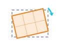
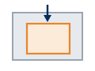
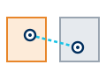
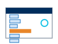
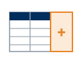
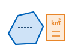
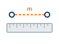
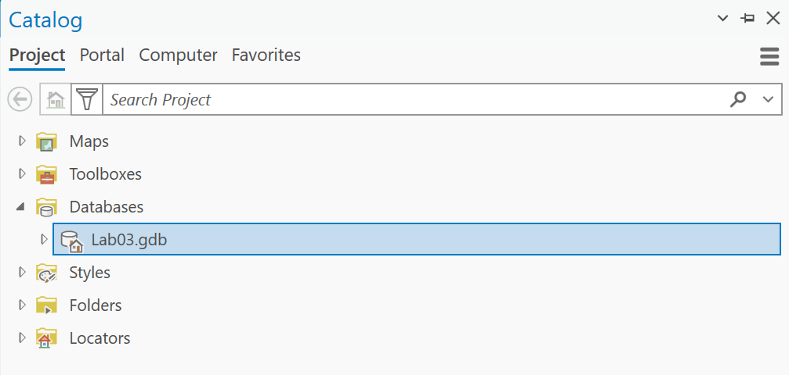

---
search:
  exclude: true
---

# DRAFT — Lab 3: Georectifying and Digitizing Historic Maps

**Civil Engineering 414 — Engineering Applications of GIS**

Fall 2026 · Dr. Dan Ames

> [!WARNING]
> **This is a draft for review.** It is not the assigned page. The assigned page is
> [Lab 3](README.md).
>
> **Changes to what the lab asks students to do**
>
> - **Attributes on every feature.** Every digitized feature carries a name, a type, what is there
>   now, and how confident the student is in it — not just a name.
> - **All three geometry types.** At least one point, one line and one polygon, so the lab is real
>   digitizing practice rather than dropping a handful of pins.
> - **One measurement.** One polygon is measured with Calculate Geometry, run by hand from the
>   attribute table, and the student states how far that area can be trusted.
> - **Check features are drawn and measured**, not eyeballed: three short lines from where the scan
>   puts a feature to where the basemap puts it.
> - **The sensitivity step varies the control points as well as the transformation** — all points,
>   a higher-order equation, and three clustered points — and Map 2 shows the digitized features over
>   the sheet as re-solved, so the student can see the sheet move under their work.
> - **The Stansbury survey of 1852** is named as the worked example.
> - Still **one week**, and still **no ModelBuilder**: this lab is deliberately done by hand.
>
> **Corrections to things that were wrong**
>
> - Nothing new. The September 17 corrections (deliverables list, topoView download format,
>   Figure 5's caption) are carried forward.
>
> **Figure provenance**
>
> - Figures 6a and 6b are captures from ArcGIS Pro 3.7.1 at 175% display scaling, 2026-09-18.
> - Figures 1, 2, 3 and 5 are the 2026-09-03/04 captures against a USGS 1893 Escondido sheet.
> - Figures 4 and 12 are 2026-09-09 captures of the Georeference tab and the Transformation menu.
> - **Figures 7 to 11 are still the 2026-09-03 captures from an older ArcGIS Pro** and are owed.
> - The tool-table icons are generated by `tools/lab03/make_svgs.py`.
>
> **Site behavior**
>
> - This draft is excluded from search and is not in the site menu. Reach it by URL.

## Background

Old maps and aerial photographs are an unreasonably good source of information for civil,
environmental and construction engineers. There are thousands of filing cabinets, in government
agencies and engineering consulting firms, filled with mapping data that exists only on paper. That
data can tell you:

- how cities and landscapes have changed over time
- how growth followed, or ignored, natural and manmade features
- what a river, coastline or wetland looked like before it was engineered
- what was on a site before the building that is on it now

Libraries and agencies have scanned a great deal of it, so more of this material is online now than
ever before. A scan, though, is just a picture. It has rows and columns of pixels and no idea where
on Earth it belongs. **Georeferencing** is the act of telling it: you match points you can identify
on the scan to the same points on a map that already knows where it is, and ArcGIS Pro solves for a
transformation that moves every other pixel accordingly.

That last part is the whole lab. You do not place the image; you place a handful of points and let a
mathematical transformation place the image. How many points you give it, where you put them, and
which transformation you choose decide how much of the sheet ends up where it belongs — and the
number ArcGIS Pro reports to tell you how well it fits is measured on the very points you fitted, so
it can be made to look perfect while the map is wrong everywhere else.

This lab is done by hand. There is no model to build: you place the control points yourself, you
draw every feature yourself, and you give every feature the attributes that make it useful to the
next person. In Step 10 you will re-solve the same sheet three ways, see how far it moves under the
features you drew, and use what moves to decide which result you would put your name on.

> [!IMPORTANT]
> **Your job — see the deliverables below.** Georeference one scanned historic map, digitize and
> describe the features on it that are no longer on a modern map, measure one of them, test how much
> your result depends on the control points and transformation you chose, and make two map layouts.

## Problem Statement

You need to find things that used to be somewhere and are not there now: a town that emptied out, a
rail spur that was pulled up, a street grid that was replaced, a channel that was straightened, a
lake that was larger. Nobody has this in a GIS. It exists on a sheet of paper that somebody scanned.

Your job is to turn the features on that sheet into feature classes, correctly located and properly
described, so they can be measured, overlaid and mapped alongside modern data. That takes two
operations, in this order:

1. **Georeference** the scan, so that its pixels sit in real-world coordinates.
2. **Digitize** the features from it, by drawing them into new feature classes while the
   georeferenced scan is underneath, and recording what each one is.

The order matters. Digitize first and every feature you draw is in the wrong place, permanently.

## Spatial Considerations

Every one of these is a decision you make, and every one of them changes your answer. Say in your
report what you chose and why.

- **Which sheet.** Age, scale and legibility trade against each other. An 1885 county atlas plate is
  full of vanished detail and drawn loosely; a 1950 USGS quadrangle is accurate and shows less
  change. Older is not automatically better.
- **Which basemap you georeference against.** Imagery shows what is there now; a topographic basemap
  shows named features and section lines that are easier to match on an old sheet. The basemap is
  your control, so its accuracy is a ceiling on yours.
- **How many control points, and where.** Three is the minimum for the default transformation and it
  is not enough. Points bunched in the middle of the sheet leave the corners free to wander.
- **Which transformation.** A first-order (affine) transformation can shift, scale, rotate and skew
  the whole sheet but keeps straight lines straight. Higher orders bend it. A spline forces the
  control points to match exactly and rubber-sheets everything between them.
- **The coordinate system of your map.** Set it before you digitize. Your new feature classes
  inherit it, and every length and area you measure depends on it.
- **What counts as "gone".** A road that moved fifty meters, a town that shrank, a lake that is
  smaller: you decide what qualifies, and you defend it.

## Data

> [!IMPORTANT]
> **Set up your folder before you download anything.** On the lab machines, work on the
> **D: drive**, in a folder named after you with one folder per lab inside it — `D:\Smith\Lab03\`.
> Put the project, the scan and everything you make there. The C: drive is locked, network drives
> make ArcGIS Pro slow on large scans, and a USB 3.0 external drive is a legitimate alternative.
> **Never use a space in a folder or file name.** The full set of workspace conventions is on the
> [ArcGIS Tips and Reminders](../../arcgis-tips.md){ target="_blank" } page.

Unlike Labs 1 and 2, nothing here is prepared for you. **You find the data, and you defend it.**
That is the point: the judgment you exercised in Lab 1 choosing which Walmart stores counted, you
exercise here choosing a sheet and a basemap.

| Layer | Where it comes from | What you must record |
| --- | --- | --- |
| Historic map scan | You find and download it | Repository, title, date, scale, and the URL you got it from |
| Modern basemap | ArcGIS Pro basemap gallery | Which basemap, and why that one |
| Digitized features | You create them — points, lines and polygons | Coordinate system, geometry types, the attributes you recorded, and what you chose to include |
| Error lines | You create them | One line per check feature, and which feature each one is |

### Judging the source

Apply the six metadata questions from the introductory course to your sheet before you use it —
**what, where, when, why, how, who** — and put the answers in your report:

- **What** does the sheet show, and at what scale? A scale printed on the sheet tells you how much
  detail to trust.
- **Where** does it cover, and does its coverage actually contain features you can match?
- **When** was it surveyed, which is often years before it was published? Both dates matter, and
  they are not the same date.
- **Why** was it made? A railroad promotional map, a fire insurance plan and a topographic survey
  are drawn to different standards and lie in different directions.
- **How** was it surveyed and drawn, and how was it scanned? A folded sheet flattened on a scanner
  bed has distortion no transformation will fully remove.
- **Who** made it, and are you allowed to use it? Anything published in the United States before
  1930 is in the public domain; a library's scan of it may still carry the library's own terms.

> [!WARNING]
> A pictorial or "bird's eye" view is not a map. Panoramic city views, common in the 1880s, are
> drawn in perspective from an imagined viewpoint, so scale changes continuously across the image
> and no transformation will make it fit. They are wonderful documents and they will waste your
> afternoon. Use a plan view, drawn looking straight down.

### Where to find a sheet

Your sheet should be **older than 1900** if you can find one that covers ground you can match. The
further back it goes, the more change there is to find.

| Source | What is there |
| --- | --- |
| [USGS topoView](https://ngmdb.usgs.gov/topoview/) | USGS topographic sheets from 1884 to 2006, plus the current US Topo series, free. The most reliable starting point. **Take the JPEG download, not the GeoTIFF** — see the warning below |
| [USGS Historical Topographic Map Collection](https://www.usgs.gov/programs/national-geospatial-program/historical-topographic-maps-preserving-past) | The program behind topoView, with an explanation of what was scanned and how |
| [David Rumsey Map Collection](https://www.davidrumsey.com/) | Over 100,000 scanned historic maps, strong on the nineteenth century and on city plans |
| [Library of Congress map collections](https://www.loc.gov/maps/collections/) | Fire insurance plans, city plans, railroad maps. May show a bot check before it loads |
| [Wikimedia Commons](https://commons.wikimedia.org/wiki/Category:Old_maps_by_country) | Public-domain scans, many of them Library of Congress copies, organized by country and state. Check the license box on the file page |

> [!WARNING]
> **Take the plain image, not the georeferenced one.** Where a repository offers a choice of
> formats, some of them already carry a spatial reference: USGS describes its GeoTIFF download as
> having "embedded georeferencing information so that the map can be used directly in a GIS", and a
> GeoPDF carries one too. Download one of those and ArcGIS Pro drops the sheet straight onto the
> basemap, correctly placed, with nothing for you to solve — somebody else did this lab for you.
> Take the **JPEG**, or any plain image format, so that the placement is yours.

> [!TIP]
> **Check the result.** Before you commit to a sheet, ask yourself two questions. Can you name at
> least **eleven** features on it that you could also point to on a modern basemap — eight to
> georeference with in Step 4, and three more, kept back, to check the result in Step 6? And does it
> show at least one **closed shape** — a lake, a pond, a town boundary, a field — that you could
> trace as a polygon and measure in Step 9? If the answer to either is no, find another sheet.

### A worked example: the Stansbury survey of 1852

The instructor's worked example for this lab is the **1852 map of the Great Salt Lake and adjacent
country**, surveyed in 1849 and 1850 by Captain Howard Stansbury of the Corps of Topographical
Engineers ([Library of Congress item 2018588045](https://www.loc.gov/item/2018588045/), public
domain, also on
[Wikimedia Commons](https://commons.wikimedia.org/wiki/File:Map_of_the_Great_Salt_Lake_and_adjacent_country_in_the_territory_of_Utah_-_surveyed_in_1849_and_1850_under_the_orders_of_Col._J.J._Abert_LOC_2018588045.jpg)).
It is worth looking at before you choose your own, for three reasons:

- It is a real survey rather than a compilation, so its errors are a surveyor's errors, not a
  copyist's.
- It was folded, and the crease lines show in the scan: distortion of exactly the kind no
  transformation removes.
- It shows the Great Salt Lake and Utah Lake as they were in 1850, and it carries a printed
  **graticule** of latitude and longitude, which makes the optional extra credit at the end of this
  lab possible.

You may use it for your own lab. If you do, be aware that its latitudes are excellent and its
longitudes are not — which is exactly the sort of thing this lab asks you to find out for yourself.

### If your download is a PDF

Many scans, including USGS GeoPDFs, arrive as PDF. ArcGIS Pro will not add a PDF to a map directly.
Convert it:

- **In ArcGIS Pro**, search the Geoprocessing pane for **PDF To TIFF** (Conversion Tools ▸ To
  Raster). Set the input PDF, an output `.tif` in your lab folder, and a resolution — 250 to 300 dpi
  is enough for a topographic sheet and keeps the file manageable.
- **Or take a screen capture** of the PDF opened at full size and save it as a `.jpg` or `.png`.
  This is fine and it is what most people do; you lose whatever resolution the screen does not show.

Do not upload the file to a third-party conversion website. You have the tool on your desk.

## Analysis Tools

There is no ModelBuilder model in this lab, on purpose. Georeferencing is interactive by nature — you
are looking at two images and deciding that this corner is that corner — and digitizing is a skill
you only get by doing a lot of it by hand. These are the tools you will use for the first time in
this course. The icon beside each one is a reminder of what it does to your data — the orange part is
what comes out.

| Tool | What it does |
| --- | --- |
| { .tool-icon } **Georeference** (Imagery tab, Alignment group) | Opens the Georeference tab for the selected raster layer. Everything in Steps 3 to 5 lives on that tab |
| { .tool-icon } **Fit to Display** (Prepare group) | Drops the scan into the current map view at roughly the right size and place, so you have something to drag points from. A first guess, not a result |
| { .tool-icon } **Add Control Points** (Adjust group) | The core tool. Click a point on the scan, then the same point on the basemap. Each pair is one link |
| { .tool-icon } **Transformation** (Adjust group) | Chooses the equation fitted to your control points. The menu states the minimum number of points each one needs |
| { .tool-icon } **Control Point Table** (Review group) | Lists every link with its residual, and the total RMS error. Where you find out what your points are actually doing |
| { .tool-icon } **Create Feature Class** (Catalog pane, right-click a geodatabase ▸ New) | Makes the empty point, line or polygon layer you are about to draw into |
| { .tool-icon } **Create Features** (Edit tab, Features group) | The editing pane you draw in |
| { .tool-icon } **Add** (attribute table, Field group) | Adds a field to a feature class. This is the button on the attribute table's own toolbar, not the **Add Field** geoprocessing tool you used in Lab 1; it does the same job from a different place |
| { .tool-icon } **Label** (Labeling tab) | Draws the values of a field on the map |
| { .tool-icon } **Calculate Geometry** (attribute table, right-click a field) | Writes a feature's own area, perimeter or length into a field. Use the **geodesic** options; they are measured on the ellipsoid rather than in the flat plane of your projection, so they do not inherit its distortion |
| { .tool-icon } **Measure** (Map tab, Inquiry group) | Measures a distance on the map by clicking from one point to another. The quick way to check a feature in Step 10 without drawing anything |

## Complete the Lab

If you would rather work it out than be walked through it, everything you need is above: find a
plan-view sheet older than 1900, georeference it against a basemap you choose, check it at three
features you did not use, digitize and describe what is gone, measure one polygon, and do the Step 10
comparison. The step-by-step solution below is there when you want it.

> [!TIP]
> If you complete the lab without the step-by-step solution, say so in your report. There is no
> extra credit for it; it is worth knowing about yourself.

## Step-by-Step Solution

> [!NOTE]
> **Important Note #1.** These steps walk through one sheet with one set of control points. Step 10
> re-solves *the same control points* under different settings, so collect them carefully the first
> time — you will use them three times.

> [!NOTE]
> **Important Note #2.** The figures were captured against a different sheet than yours, and Figures
> 7 to 11 come from an earlier release of ArcGIS Pro than the one on your machine, so your screen
> will not match exactly. The ribbon, the panes and the button names are what to follow. Paths in the
> figures start with `C:\` because they were captured on an instructor machine. Yours should be on
> `D:\`.

### Step 0 — Set Up the Project

1. Start ArcGIS Pro and create a new project using the **Map** template. Name it `Lab03`.
   In the *Location* box, browse to your lab folder; the box does not take a typed path.
2. Confirm that the project geodatabase is `Lab03.gdb`, in your lab folder. Everything you create
   goes in it.
3. On the **Map** tab, in the **Layer** group, click **Basemap** and choose one. Start with
   **Imagery Hybrid**: it shows what is on the ground now and labels the roads, which is what you
   need to match against.
4. Decide your coordinate system now, before you digitize anything. On the **View** tab, open **Map
   Properties ▸ Coordinate Systems** and set a projected system appropriate to your area — a UTM
   zone or a State Plane zone, in meters or feet. Record what you chose; it goes on your maps.

> [!WARNING]
> If you leave the map in the basemap's Web Mercator, every distance and area you measure later is
> wrong by a factor that grows with latitude. Lab 1's downloads arrived in Web Mercator, which made
> the wrong answer the default outcome rather than a hypothetical — that is why Lab 1 set an output
> coordinate system before it measured anything. Set a projected coordinate system here too.

> [!TIP]
> **Check the result.** After you set the coordinate system, hover the pointer over the middle of
> your study area and read the coordinate pair at the bottom of the map view. In a UTM zone the
> easting is a six-digit number, roughly 160,000 to 830,000, and the northing a seven-digit number.
> If you see a pair that looks like degrees, or eastings in the millions with a minus sign, the map
> is not in the system you set.

### Step 1 — Find a Sheet

Work through *Where to find a sheet* above and download one. Save it in your lab folder, as an
image, with no spaces in the file name. Convert it from PDF first if you need to.

Record the repository, the sheet title, the survey date, the publication date, the scale and the
URL. You need all six in your report.

### Step 2 — Add the Scan

1. In the **Catalog** pane, right-click **Folders** and add a folder connection to your lab folder.
2. Find your image and drag it into the map.
3. If ArcGIS Pro offers to build pyramids or calculate statistics, let it.
4. Right-click the layer in the **Contents** pane and choose **Zoom To Layer**.

The scan will be somewhere absurd — a speck in the Gulf of Guinea off West Africa is the classic,
because an image with no spatial reference is placed at coordinates near zero, and zero longitude
and zero latitude is in the ocean south of Ghana.

**Figure 1.** An image with no spatial reference, drawn at the origin of the coordinate system.

> [!TIP]
> **Check the result.** If your scan appears in roughly the right place without any work from you,
> it already carries spatial reference information — a GeoTIFF or GeoPDF often does. That is not a
> problem, but it means the software has already made the choices this lab is about. Say so in your
> report, and georeference it anyway to see how your solution compares.

### Step 3 — Fit to Display

1. Navigate the map to the area your sheet covers, at a scale where you can see the whole of it.
2. Select the scan in the **Contents** pane.
3. On the **Imagery** tab, in the **Alignment** group, click **Georeference**. The **Georeference**
   tab opens.

**Figure 2.** Where to find the Georeference button.

4. In the **Prepare** group, click **Fit to Display**. The scan jumps into the current view.
5. Make it semi-transparent so you can see the basemap through it. With the layer selected, go to
   the contextual **Raster Layer** tab, **Effects** group, and set **Transparency** to about 50 %.

**Figure 3.** After Fit to Display, with transparency turned up.

**Figure 4.** The Georeference tab in ArcGIS Pro 3.7.1. Everything in Steps 3 to 5 is on it: **Fit to
Display** in Prepare, **Add Control Points** and **Transformation** in Adjust, **Control Point
Table** in Review, and **Save** — which you must click before you close.

### Step 4 — Add Control Points

In the **Adjust** group, click **Add Control Points**. Then, for each point:

1. Click a feature on the **scan**.
2. Click the **same feature** on the basemap.

The scan moves as soon as you have enough points for the current transformation. It will keep
moving, and settling, as you add more.

**Figure 5.** The very first control point, matched from the scan to the basemap. Read the status
panel in the top right: one point, and a total RMS error of 0.000000. The sheet is plainly still in
the wrong place, so that zero is telling you nothing — which is the whole point of the TIP below.
This is where you start, not where you stop; keep going until you have eight, spread to the corners.

**How many, and where.** Collect **at least eight**, and spread them out:

- Put points near all four **corners** of the sheet, not only in the middle. A transformation is
  only constrained where you constrain it; corners left free will wander.
- Use features that have not moved: **road intersections, section corners, rail crossings, river
  confluences, building corners on old buildings**. Do not use a river bank, a shoreline, a field
  edge or a tree.
- Avoid clusters. Four points within one town tell the transformation almost as little as one point.
- Keep **three** more identifiable features in reserve and do **not** use them here. Step 6 checks
  your result at those three, and they only work as a check if they had no say in the answer.

**The minimum is not the target.** Each transformation needs a minimum number of points, and if you
give it exactly that many it fits them perfectly and tells you nothing:

| Transformation | Minimum control points |
| --- | --- |
| Zero Order Polynomial (Only Shift) | 1 |
| Similarity Polynomial | 3 |
| 1st Order Polynomial (Affine) | 3 |
| 2nd Order Polynomial | 6 |
| 3rd Order Polynomial | 10 |
| Adjust | 3 |
| Projective | 4 |
| Spline | 10 |

> [!WARNING]
> Do not click **Save** and close the Georeference tab until you have finished Step 10. Saving writes
> the transformation to the image and you want to try three of them first. If you must stop, either
> leave ArcGIS Pro open, or save and be prepared to re-collect your points.
> <!-- VERIFY in the GUI walk: whether reopening Georeference on a saved image restores its links. -->

> [!TIP]
> **Check the result.** With the default 1st Order Polynomial and exactly three points, your total
> RMS error will be 0.000000. That is not a good fit; it is an exact fit of three points by a
> transformation with exactly enough freedom to pass through three points. When the number stops
> being zero, you have started to learn something.

### Step 5 — Read the Residuals

In the **Review** group, click **Control Point Table**. Each row is one link, with its **residual**:
how far that point ended up from where you put it, in map units.

The table also reports a **total RMS error**, the root-mean-square of those residuals. Read it, and
then be careful with it.

> [!WARNING]
> **The RMS error is measured on the points you fitted.** Every control point in the table
> contributed to solving the transformation, so the residuals describe how well the equation
> reproduces its own inputs. It says nothing about the rest of the sheet. A high-order polynomial or
> a spline can drive the total RMS to zero and distort the map badly everywhere in between. A small
> number here is not a good result. It is a small number.

Work through the table once:

- If one point has a residual several times larger than the rest, look at it. You have probably
  matched the wrong intersection, or clicked a feature that moved. Delete it and re-collect it.
- If the residuals are all about the same size, that size is roughly the accuracy of your
  georeferencing at the points, which is the best case for the sheet as a whole.
- Record the total RMS error and the number of points. Both go in your report and in Step 10's table.

### Step 6 — Check Your Error

The RMS error cannot tell you how good your georeferencing is, because it only knows about points
you already fitted. So measure it at your three reserved features — and rather than eyeball the gap,
**draw it**, so you have a measurement and a record of where you checked.

1. In the **Catalog** pane, under **Databases**, right-click `Lab03.gdb`, then **New ▸ Feature
   Class**. Name it `ErrorLines`, choose **Line**, and give it the coordinate system of your map.

**Figure 6a.** The project geodatabase in the Catalog pane. There is one, it is named for the lab,
and everything you create in this lab goes in it.

**Figure 6b.** Right-click the geodatabase and choose **New ▸ Feature Class**. You do this again in
Step 7 for each feature class you digitize.

2. On the **Edit** tab, click **Create**, pick `ErrorLines` in the **Create Features** pane, and for
   each of your three reserved features draw a **two-point line**: click where the *scan* puts the
   feature, then double-click where the *basemap* puts it.
3. Click **Save** in the **Manage Edits** group.
4. Open the `ErrorLines` attribute table, add a **Double** field named `Error_m`, right-click its
   header and choose **Calculate Geometry**. Set the property to **Length (geodesic)** and the unit
   to **Meters**. Each line now carries its own length: the georeferencing error at that feature,
   on the ground.

> [!TIP]
> **Check the result.** You should have exactly **three** rows, each with an `Error_m` somewhere
> between a few meters and a few kilometers depending on your sheet. Record all three and their mean.
> Then look at the lines on the map. If all three point the same way, the whole sheet is shifted,
> which is usually the old survey's error rather than yours. If they point in different directions,
> the sheet is being stretched or bent, which usually is yours. Say in your report which you have.

### Step 7 — Digitize the Features

Now find what is gone. Turn the transparency up and down, switch basemaps, and look for features on
the scan with nothing under them: a town site, a road that stops, a rail grade, a channel that has
moved, a lake that has shrunk.

Capture **at least six** features, and use **all three geometry types**: at least one **point** (a
town, a mill, a spring), at least one **line** (a road, a rail grade, a canal, an old shoreline), and
at least one **polygon** (a lake, a town plat, a field, a quarry). Each geometry type goes in its own
feature class.

1. In the **Catalog** pane, under **Databases**, right-click `Lab03.gdb`, then **New ▸ Feature
   Class**, as in Step 6. Make one feature class per geometry type — for example `Old_Places`
   (point), `Old_Routes` (line) and `Old_Areas` (polygon) — each in the coordinate system of your
   map.
2. Select a feature class in the **Contents** pane, open the **Edit** tab, and click **Create** in the
   **Features** group.
3. In the **Create Features** pane, click the feature class and draw. Click once for a point; click
   along a line and double-click to finish it; click around a shape and double-click to close a
   polygon. Zoom in: a feature traced at the full-sheet scale is only as good as the pixels you
   could see.
4. Click **Save** in the **Manage Edits** group when you are done. Edits are not saved until you say so.

**Figure 7.** Starting an edit session.

> [!TIP]
> **Check the result.** Turn the historic scan off. Your digitized features should still be in
> sensible places relative to the modern basemap — a vanished road should still connect to roads that
> exist. If a feature lands in the middle of a lake, either you drew it wrong or your georeferencing
> is worse than Step 6 said.

### Step 8 — Add Attributes

A feature with no attributes is a drawing. A feature with good attributes is data the next person
can use. Give **every** feature class the same four text fields, and fill them in for **every**
feature.

| Field | Type | What goes in it |
| --- | --- | --- |
| `Location_Name` | Text | The name on the historic sheet, exactly as printed. If it has none, a short description |
| `Feature_Type` | Text | What it is: town, road, rail grade, canal, lake, shoreline, mill |
| `Present_Day` | Text | What is there now, from the modern basemap: a subdivision, a freeway, farmland, dry lake bed |
| `Confidence` | Text | `High`, `Medium` or `Low` — how sure you are that you placed and identified it correctly |

1. Right-click a feature layer and open the **Attribute Table**.
2. In the **Field** group, click **Add**. Add the four fields above, each with data type **Text**,
   and save the field definitions.

**Figure 8.** Adding a field from the attribute table.

**Figure 9.** A new field in the Fields view.

3. Back in the attribute table, fill in all four fields for every feature. Use the name from the
   historic sheet where it has one; that name is part of what you found.

**Figure 10.** Filling in the attributes.

4. Repeat for each feature class.
5. With a layer selected, open the **Labeling** tab, check **Label Features In This Class**, and set
   the **Field** to `Location_Name`. Do this for each feature class.

**Figure 11.** Labeling the features.

> [!NOTE]
> The `Confidence` field is the one that makes you think. A road you can trace from one surviving
> intersection to another is `High`. A town whose label sits in empty ground, with nothing on the
> basemap to confirm where the buildings stood, is `Low`, however sharply you clicked. Say in your
> report how you decided.

### Step 9 — Measure the Features

Now make the polygon you digitized produce a number.

1. Open your polygon feature class's attribute table and add two **Double** fields, `Area_km2` and
   `Perim_km`.
2. Right-click the `Area_km2` header, choose **Calculate Geometry**, and set the property to **Area
   (geodesic)** and the unit to **Square kilometers**. Run it.
3. Do the same for `Perim_km` with **Perimeter length (geodesic)** in **Kilometers**.
4. For your line feature class, add a `Length_km` field and calculate **Length (geodesic)** in
   **Kilometers** the same way.

> [!WARNING]
> Use the **geodesic** options, not the plain ones. The plain area and length are measured in the
> flat plane of your projection and carry its distortion; the geodesic ones are measured on the
> ellipsoid. On a sheet the size of a county the difference is small, on a sheet the size of a state
> it is not, and the geodesic number is the one you can defend.

**How far can you trust that area?** Your polygon's outline is only as well placed as your
georeferencing, and Step 6 measured that. If every point on the outline could be off by about your
mean check error, the area could be off by roughly

> **area uncertainty ≈ perimeter × mean check error**

— with the perimeter in kilometers and the error converted to kilometers, that gives square
kilometers. Work it out, and state your area as a value **plus or minus** that amount.

> [!TIP]
> **Check the result.** `Area_km2` should be a plausible size for what you traced — a pond a
> fraction of a square kilometer, a large lake hundreds or thousands. A number in the millions means
> the unit is square meters; a number that disagrees wildly with the feature's size on the sheet
> means the map's coordinate system is still Web Mercator. If you traced a lake that still exists,
> compare your area with its area today — and use your uncertainty to say how much of the difference
> you can actually claim is real.

### Step 10 — Test the Transformation

Your georeferenced sheet is *an* answer. It is the answer that one transformation gives for the
points you happened to collect. Before you put your name on it, find out how much of it is the sheet
and how much of it is your choice.

Re-solve the sheet three ways, **in this order**, so that you only ever take points away at the end:

| Run | Control points | Transformation |
| --- | --- | --- |
| 1 — baseline | all of them | 1st Order Polynomial (Affine) — the solve you already have |
| 2 — higher order | all of them | **2nd Order Polynomial**, or **Spline** if you collected ten or more |
| 3 — clustered | only three, all near the middle of the sheet | 1st Order Polynomial (Affine) |

Change the equation from the **Transformation** menu in the Adjust group. For run 3, leave only
three clustered links active in the **Control Point Table**.

<!-- VERIFY in the GUI walk: whether the Control Point Table lets a link be switched off with a
check box (non-destructive) or only deleted, and what the save-links button is called. The wording
above assumes a check box; if only delete exists, add "save your links first". -->

**Figure 12.** The Transformation menu, with the minimum control points each one needs.

For each run, record the total RMS error, and re-check your three reserved features with the
**Measure** tool (Map tab, Inquiry group): click where the scan now puts each one, then where the
basemap puts it. You do not need to redraw your error lines for this — Measure is the quick check.

| Run | Control points | Transformation | Total RMS error | Mean check error (m) | What the sheet looks like |
| --- | ---: | --- | ---: | ---: | --- |
| 1 — baseline | | 1st Order (Affine) | | | |
| 2 — higher order | | | | | |
| 3 — clustered | 3 | 1st Order (Affine) | | | |

"What the sheet looks like" is a sentence: is it straight, is it bowed, do the edges curl, does a
straight section line on the sheet still look straight?

Your digitized features do **not** move when you change the transformation — they were drawn in map
coordinates. The *sheet* moves underneath them. That is what Map 2 shows.

Then answer these three questions in your report, in bold, in this order:

1. **Which run gave the lowest total RMS error, and is that the one you would use?** If a run
   reported something very close to zero, say why, and what that zero is actually describing.
2. **What happened to your mean check error from run to run — did it track the RMS error, or move
   the other way?** Say what that means about what RMS can and cannot tell you.
3. **Which run would you defend to a client, and what would you tell them your georeferencing, and
   your measured area, are good to?** Give a distance and an area with its plus-or-minus, and say
   how you know.

Finally, pick **run 2 or run 3** for **Map 2** — whichever moves the sheet more — and say on the map
which run it is and why you chose it.

> [!TIP]
> One of these runs will give you the best RMS number you see all lab. It is the one you should trust
> least. Watch what the clustered run does to the corners of the sheet.

When you are done, switch back to run 1, click **Save** on the Georeference tab, and close it.

## Going further: the graticule (optional, up to five points)

Nothing in this lab requires this section, and it is only possible on some sheets. Many
nineteenth-century survey sheets carry a printed **graticule** — a grid of latitude and longitude
lines, with the degrees labeled around the border. The Stansbury sheet does. Most city plans and
county atlas plates do not, and without one there is nothing to do here.

If your sheet has one, georeference it a second way, from the sheet's own coordinates: put control
points on the graticule intersections and give each one the latitude and longitude printed beside it,
rather than matching it to a feature on the basemap. You then have two georeferences of the same
sheet — one fitted to the ground, one fitted to what the surveyors believed the ground's coordinates
were. **The difference between them is the survey's own error**, separated out from yours.

Report, for at least three features, how far apart the two georeferences put them and in which
direction, and whether the difference is a constant shift or grows across the sheet. Say what that
implies about how the original survey was made — and note whether latitude and longitude are equally
wrong, because on many sheets of this period they are not.

> [!WARNING]
> A graticule fit will give you a beautiful RMS error, because a printed graticule is drawn very
> regularly and your points will sit on it almost perfectly. That number tells you nothing at all
> about whether the sheet is in the right place. Check it against a ground feature before you believe
> it.

## Deliverables

Make **two** professional map layouts, each a full page (8.5 × 11):

1. **Map 1 — your baseline.** Run 1. Show the modern basemap, the georeferenced historic sheet, and
   your digitized features, labeled, with your control points.
2. **Map 2 — one alternative run.** The same area and the same digitized features over the sheet as
   re-solved in run 2 or run 3, with the title and text box saying which run and why you chose it.

Write a brief report (2–3 pages of text, plus your figures and maps) covering:

- your name, the date, the course, and the name of your peer reviewer, with a sentence on what you
  changed because of them
- the requirements of the project and your approach, in your own words
- **the source of your historic map**: repository, title, survey date, publication date, scale and URL
- the six metadata answers from *Judging the source*, and what they mean for your result
- which basemap you georeferenced against and why, and the coordinate system your map is in
- **how many control points you used, how you distributed them, and which transformation you chose**
- your **total RMS error**, and what you did about any point whose residual stood out from the rest
- **your three check features and the error at each**, as distances on the ground, their mean, and
  whether the three error lines pointed the same way or different ways
- **a table of every digitized feature** with its four attributes, and a sentence on how you decided
  the `Confidence` values
- **the area and perimeter of your polygon**, with its plus-or-minus and how you worked it out
- your Step 10 table and the answers to its three questions
- where your result is wrong and why, and what data would fix it
- this rubric pasted in, with your self-assessment in every row
- the optional graticule comparison, if you did it

> [!IMPORTANT]
> **Peer review before you submit.** Have another student in the class read your report against
> the rubric and give you feedback, then act on that feedback before the deadline. Name your
> reviewer in the report and say in a sentence what you changed because of them. A report nobody
> else has read is a draft, not a submission.

## References

Esri. *Overview of georeferencing.* ArcGIS Pro documentation.
<https://pro.arcgis.com/en/pro-app/latest/help/data/imagery/overview-of-georeferencing.htm>

Esri. *Calculate Geometry Attributes.* ArcGIS Pro tool reference.
<https://pro.arcgis.com/en/pro-app/latest/tool-reference/data-management/calculate-geometry-attributes.htm>

Esri. *PDF To TIFF.* ArcGIS Pro tool reference.
<https://pro.arcgis.com/en/pro-app/latest/tool-reference/conversion/pdf-to-tiff.htm>

Stansbury, H. (1852). *Map of the Great Salt Lake and adjacent country in the Territory of Utah.*
Library of Congress. <https://www.loc.gov/item/2018588045/>

U.S. Geological Survey. *Historical Topographic Map Collection.*
<https://www.usgs.gov/programs/national-geospatial-program/historical-topographic-maps-preserving-past>

## Example Maps

<!-- TODO(instructor): these two are finished layouts from earlier offerings, kept because they show
what a good result looks like. They are not a baseline/scenario pair and neither has a usable source
citation. A real pair built from the Stansbury sheet with arcpy.mp, the way
tools/lab01/build_layouts.py does, is owed. -->

**Figure 13.** A finished layout of towns on a nineteenth-century sheet that are no longer populated
places. Note that the control points are on the map, the digitized features are labeled, and the
historic sheet is transparent enough to see the basemap through it.

**Figure 14.** A second finished layout, this one digitizing streets rather than places.

> [!NOTE]
> These are examples, not templates, and both would lose points against the rubric below. Neither
> text box carries an author — they read literally "Date" and "Projection" — and neither title says
> which transformation was used. Yours must do all of that, and your symbology should suit the
> features you actually digitized. Read them for the layout, not the text.

## Rubric for Georectifying and Digitizing Historic Maps

Fifty points in five parts of ten. The bullets say what each part is worth, so you know exactly what
to submit.

| Item | Points |
| --- | --- |
| **Write-up** (2–3 pages) • Assignment title, your name, date and course; your peer reviewer named, with a sentence on what you changed because of them (1) • The requirements of the project and your approach, in your own words (2) • The source of your sheet — repository, title, survey and publication dates, scale and URL — and the six metadata answers, with what they mean for your result (3) • Where your result is wrong and why, and what data would fix it (2) • Clear, organized writing: figures numbered and referred to in the text, sources credited, and this rubric pasted in with your self-assessment in every row (2) | /10 |
| **Georeferencing** — correct and defensible • At least eight control points, distributed across the whole sheet rather than clustered, with the count and the transformation you chose both reported (2) • The Control Point Table read: total RMS error reported, and any outlying residual investigated and explained (2) • Three check features that were **not** used as control points, drawn as error lines, with each error and the mean reported as distances on the ground (3) • Whether the three error lines pointed the same way or different ways, and what you concluded from that (1) • Which basemap you georeferenced against and why, and which coordinate system your map is in (2) | /10 |
| **Digitizing, attributes and measurement** • At least six features digitized from the historic sheet that are not on the modern basemap, including at least one point, one line and one polygon, each geometry type in its own feature class in the map's coordinate system (3) • All four attributes filled in for every feature, and a table of them in the report (3) • A sentence on how you decided the `Confidence` values (1) • The polygon's geodesic area and perimeter, calculated with Calculate Geometry, with its plus-or-minus worked out from your mean check error (3) | /10 |
| **Map 1 — your baseline** (full page, 8.5 × 11) • Title stating the transformation used (1) • Neat line, north arrow and scale bar (1) • Text box with author, date, map projection, and the sheet's title and date (1) • All three layers shown: basemap, georeferenced sheet, digitized features (2) • Digitized features clearly symbolized by type and labeled, with a legend (2) • Control points shown (1) • Zoomed to an appropriate scale, and all text legible when printed (2) | /10 |
| **Transformation sensitivity** (Step 10) • The table, three runs, with control points, transformation, total RMS error, mean check error and a description for each (3) • The three questions answered: what the lowest RMS actually describes; whether the check error tracked RMS; and which run you would defend, with a distance and an area you would claim (4) • **Map 2** — a second full-page layout of run 2 or run 3, with the title and text box saying which run it is and why you chose it (3) | /10 |
| **Total** | **/50** |
| **Extra credit — the graticule comparison** • A second georeference solved from the sheet's printed graticule (2) • The difference between the two answers at three or more features, with direction, and whether it is a constant shift or grows across the sheet (2) • What that implies about how the original survey was made, including whether latitude and longitude are equally wrong (1) | up to +5 |

Map 2 is graded in the sensitivity row, because the run it shows is a sensitivity result and only
means anything beside the table.

> [!NOTE]
> **Using AI on this lab.** Use AI freely to understand a tool, work out an error, or
> tighten your write-up, and add one line at the end of your report saying what you used it
> for. Do not take a field name, an expression, a coordinate system, or a number from it —
> those come from your own data, and the rubric asks you to defend every one. See the
> [AI Use Policy](../../policies/ai-policy.md) for the full policy.

<!--
DRAFT migration notes (2026-09-18, round 2). Built from the assigned page of 2026-09-17, not from the
round-1 draft.

INSTRUCTOR DECISION, 2026-09-18: Lab 3 stays a MANUAL lab and a ONE-WEEK lab. No ModelBuilder model --
students georeference, digitize and run Calculate Geometry by hand. This is a deliberate exception
to section 1 of tools/lab-conversion-guide.md ("one model, built once"): a manual lab gives a break
from ModelBuilder and real digitizing practice. Do not "fix" it by adding a model. New over the
original handout: attributes on every digitized feature. The Stansbury 1852 sheet is the worked
example.

WHAT ROUND 1 TRIED AND WHY IT WAS DROPPED: a five-tool measurement model (Calculate Geometry
Attributes x2, Summary Statistics x2, Buffer to an uncertainty envelope), five sensitivity runs, and
re-tracing the polygon under three georeferences. It was piloted (tools/lab03/PILOT_NOTES.md) and the
model exported (it was Figure C), but it roughly doubled the lab and turned it into a ModelBuilder lab.
What survived, reshaped to be manual: drawn check-feature error lines (Step 6), one measured polygon
with a perimeter-times-error uncertainty (Step 9, replacing the Buffer envelope with arithmetic), and
control points varied alongside the transformation (Step 10, three runs ordered so points are only
removed at the end).

COMPARED WITH THE ORIGINAL WORD HANDOUT (Lab 3 - Georectifying and Digitizing Images.docx, read from
Google Drive 2026-09-18): the original had two sheets (a U.S. state before 1900 and a European city
before 1800), points and lines only, one Location_Name field, and a flat rubric of 4+4+4+4+4+15+15.
This draft keeps its six-step skeleton (find, add, fit, control points, digitize, name and label) and
its two maps, and replaces the second sheet with the second map of Step 10.

STILL OWED, in priority order:
1. GUI walk of this draft, as a student, on the Stansbury sheet. Resolves the three VERIFY comments.
2. Figures 7 to 11, and new figures for Calculate Geometry (Step 9) and Measure (Step 10).
3. Example maps as a real baseline/scenario pair from the Stansbury walk, built with arcpy.mp.
4. Second no-GUI pilot of this version.
5. A metadata infographic for the Stansbury sheet (lettered Figure A).
-->
