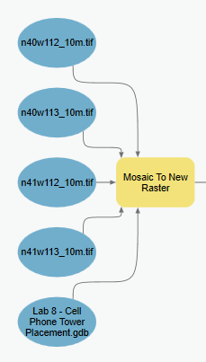
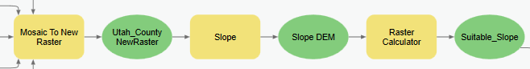
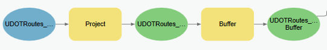
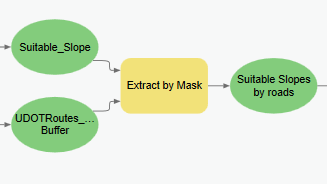
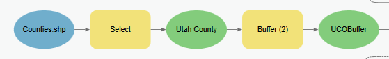
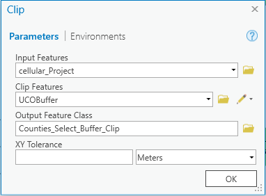
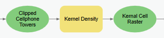
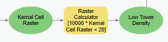
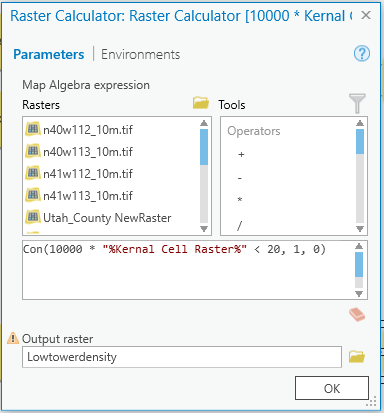
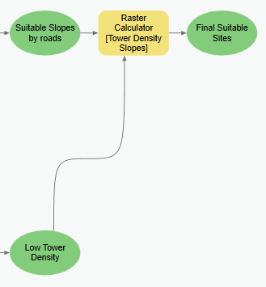

# Lab 4: Cell Phone Tower Placement

**Civil Engineering 414 — Engineering Applications of GIS**

Fall 2026 · Dr. Dan Ames

## Background

GIS is used regularly in industry and government to determine the most appropriate placement of physical infrastructure, such as cell phone towers. As cell phone use increases worldwide, the number of cell phone towers will also need to increase to support the growing demand for more usage. As with most site selection problems, geographic constraints on site selection, including proximity and terrain constraints, can be used in a geoprocessing workflow model to identify potential locations for cell phone towers. In this laboratory exercise, you will create a model using ArcGIS Pro ModelBuilder that produces a map showing potentially optimal locations for new cell phone towers in Utah County, Utah, USA.

## Problem Statement

In the current atmosphere of instant messaging and social networks, people want to be able to connect to others whenever and wherever. This has become possible for many people through cell phones and their vast array of applications. The convenience of sharing experiences (e.g., Instagram) instantly and calling for help in times of need (e.g., car trouble) are only a couple of reasons why cell phone use is increasing.

Cell phone companies continually compete to gain the best coverage by building new towers in both highly populated and rural areas of the country. It can be argued that the rural Western United States, in particular, needs more cell phone tower coverage due to its increasing population (U.S. Census Bureau, 2011) and the growing trend of replacing landlines. At the same time, cellular providers are for-profit companies with stockholders who expect careful planning decisions that increase revenue and lower costs. Hence, it is important for companies not to build too many cell towers, while still gaining as much coverage as possible (and being profitable).

Assume that you work for a multinational cellular phone company that is interested in expanding the extent of its coverage in the Western United States, including Utah County, Utah. As you might suspect, several factors govern the placement of cellular phone towers. Some factors are based on physical requirements, while others are based on political and economic issues. See the following website for further discussion on placement requirements:

- <https://arcelect.com/cell-cellular_antenna_installation_guidelines.htm>

Your task is to create an ArcGIS Pro ModelBuilder model that identifies the most suitable locations in Utah County for cell phone towers by using the three spatial considerations described below. Then apply your model in another county.

<!-- TODO(instructor): the lab never states whether its output is a recommendation for actual
     infrastructure placement or a demonstration of a screening method. The three-factor screen
     omits land ownership, zoning, line-of-sight/RF propagation, existing coverage, and access to
     power and backhaul. Consider adding an explicit framing sentence here saying which it is. -->

## Spatial Considerations

For this exercise, you will limit the spatial considerations to the following:

- **Proximity to cell tower:** Find locations with a density less than 20 cell towers per 10,000 square kilometers (i.e., in a 100 km × 100 km area).

- **Proximity to major roads:** Find specific locations that are within 1 km of the I-15 freeway or any of the other named highways in Utah County (and your second selected county).

- **Terrain slope:** Usually, towers can be constructed on a variety of slopes; however, flatter slopes are less expensive to build on and can also require shorter towers. Find locations with a slope of less than 5 degrees.

<!-- TODO(instructor): the handout gives the three thresholds (20 towers / 10,000 km², 1 km road
     buffer, 5 degree slope) without saying where they come from or asking students to justify
     them. Consider adding a sentence on the rationale, or a question asking students to test the
     sensitivity of the result to each threshold. Thresholds themselves left unchanged. -->

## Data

> [!NOTE]
> The cellular tower shapefile below is an older FCC extract and does not reflect the current tower
> network. It is used here because it is freely redistributable and adequate for practicing the
> workflow — treat the result as a methods demonstration, not a current picture of coverage.

<!-- TODO(instructor): replace or explicitly date the cell-tower dataset. The MapCruzin page still
     resolves (HTTP 200) but the vintage of the FCC extract is not stated on the page and is not
     stated here. FCC ASR (Antenna Structure Registration) is the current authoritative source;
     switching to it is an instructor decision, so nothing was changed. -->

- **Cellular:** <https://mapcruzin.com/free-wireless-gis-maps/cellular-shapefile.htm>

    Click the **Download FCC Cellular Shapefile** link to download the cellular shapefile for this project. This is a slightly outdated shapefile of cell towers across the United States, but it is suitable for this exercise. If this link doesn't work for you, any cellular shapefile you can find online can work for this lab.

- **Utah Counties Shapefile:** <https://gis.utah.gov/products/sgid/boundaries/>

    Find a shapefile that represents all the counties in Utah. Under the County Boundaries section, download the **County Boundaries: Shapefile**.

- **UDOT Highways:** <https://gis.utah.gov/products/sgid/transportation/road-centerlines/>

    Find a shapefile that represents all the major roads and highways in Utah. Under the Highway Linear Referencing System Routes section, download the **UDOT LRS Routes: Shapefile**.

- **NED (National Elevation Dataset):** <https://gis.utah.gov/products/sgid/elevation/>

    Download an elevation dataset for Utah provided by the USGS. Open either **Raster App: 10-meter USGS DEMs** or **30-meter USGS DEMs**. Download the 10 m or 30 m NED for Utah County using any of the methods on the page.

<!-- VERIFY: all three gis.utah.gov URLs in the original handout now redirect to reorganized
     product pages (see the migration notes at the end of this file). The section names quoted
     above — "County Boundaries: Shapefile", "Highway Linear Referencing System Routes",
     "UDOT LRS Routes: Shapefile", "Raster App: 10-meter USGS DEMs" — were kept verbatim from the
     handout and have NOT been checked against the current UGRC pages. Walk the pages once and
     update the labels if they have changed. -->

## ModelBuilder Tools

You will use the following new tools in this exercise, along with tools from previous labs:

- **Density:** Calculates the density of the input features within a region around each output cell. In this lab, density is the number of features per unit area — you will determine the number of cell phone towers within a given area.

- **Clip:** An overlay operation (Bolstad, p. 357–358) where the input layer is cut based on the extent of the bounding layer. This operation preserves information from the input layer within the area of the bounding layer.

- **Kernel Density:** Creates a smooth surface from points or polyline features using a kernel function. For more information, use the tool's help and online resources to understand what this tool does.

## Example Model

![Complete ModelBuilder model for the cell tower analysis: four DEM tiles feed Mosaic To New Raster, then Slope and Raster Calculator produce Suitable_Slope; the UDOT routes are projected and buffered; Extract by Mask combines them into Suitable Slopes by roads. On the lower branch, Counties.shp is selected and buffered, the cell tower points are projected and clipped, Kernel Density and a Raster Calculator produce Low Tower Density. A final Raster Calculator multiplies the two branches to produce Final Suitable Sites.](images/lab04-full-model-overview.png)

**Figure 1.** The complete model, end to end.

> [!WARNING]
> **This overview graphic is a zoomed-out ModelBuilder canvas capture and is hard to read at page
> width.** It needs to be re-exported from ModelBuilder at a legible size (or split across two
> images), not re-screenshotted. Use the per-step figures below as the readable reference.

<!-- VERIFY: the model overview above was captured from a project named "Lab 8 - Cell Phone Tower
     Placement.gdb". This exercise is Lab 4 in the current sequence, so the geodatabase name in the
     screenshot is stale. Nothing in the workflow depends on it, but the figure should be
     re-exported from a project named for Lab 4. -->

## Complete the Lab

For an advanced GIS student, the information up to this point is all you need to complete the assignment and create an output map from the results. Feel free to try conducting the analysis using only the information provided above.

> [!TIP]
> If you complete the lab using only the information provided above (without using the step-by-step
> instructions below), make sure to indicate this in your lab report to be considered for extra
> credit. If you need extra help, follow the step-by-step solution below.

## Step-by-Step Solution

### Step 1

If you have multiple raster tiles, use the **Mosaic To New Raster** tool to combine them. Set the output raster to the correct projection — NAD 1983 UTM Zone 12N, the coordinate system used throughout this lab. If you have one tile, use the **Project Raster** tool to set it to the correct projection.



**Figure 2.** The Mosaic To New Raster tool in ModelBuilder.

### Step 2

Use the **Slope** and the **Raster Calculator** tools to identify the suitable slopes (i.e., less than 5 degrees). Use the following conditional statement in the Raster Calculator:

```
Con("%Slope_DEM%" < 5,1,0)
```

This statement will assign a `1` to the output grid with slopes that are less than 5 degrees and a `0` to all other slope values.



**Figure 3.** The Slope and Raster Calculator tools in ModelBuilder.

<!-- VERIFY: the Slope tool's output units (degrees vs. percent rise) are not stated in the
     handout. The expression above assumes degrees, which is the ArcGIS Pro default, but the
     figure does not show the tool's parameters. Confirm the Slope tool is set to DEGREE before
     telling students the "< 5" test is a 5-degree test. -->

### Step 3

Use the **Buffer** tool to buffer the selected roads by 1 km. Select **Dissolve** on. Make sure that the buffered roads shapefile is projected in NAD 1983 UTM Zone 12N.



**Figure 4.** Projecting and buffering the UDOT LRS Routes shapefile.

<!-- TODO(instructor): Step 3 says to buffer "the selected roads" but no step in this handout
     selects a subset of the UDOT LRS Routes — the Spatial Considerations section says "the I-15
     freeway or any of the other named highways." Either add an explicit Select step or state that
     the whole LRS Routes layer is buffered. Left as written because it changes what students
     produce. -->

### Step 4

Use the **Extract by Mask** tool to extract areas from the slope raster that fall within the previously computed road buffers. Select the `Suitable_Slope` data layer to be the **Input Raster** and the `UDOTRoutes_LRS_Buffer` as the **Input raster or feature mask data**.



**Figure 5.** The Extract by Mask tool in ModelBuilder.

### Step 5

Use the **Select** tool to select the Utah County boundary. Use the SQL expression `"NAME" = "Utah"`. Then use the **Buffer** tool to place a 50-mile buffer around the Utah County boundary.

<!-- VERIFY: the field name (NAME), the value ("Utah"), and the quoting style in this expression
     are copied verbatim from the handout and have NOT been checked against the current UGRC
     County Boundaries shapefile. Check the attribute table for the actual county-name field and
     for how the value is spelled before students run this. Do not guess. -->



**Figure 6.** Selecting and buffering the county boundary.

<!-- TODO(instructor): the 50-mile county buffer is specified in miles while every other distance
     in this lab is metric (1 km road buffer, 20,000 m search radius, 10,000 km² density). The
     buffer distance is a pedagogical choice, so it was left at 50 miles; consider stating why an
     edge buffer is needed (so the kernel density near the county line is not biased by missing
     towers outside it) and whether a metric equivalent would be clearer. -->

### Step 6

Use the **Project** tool to make sure the cell tower layer is projected in NAD 1983 UTM Zone 12N.

Use the **Clip** tool to clip the cell phone towers point shapefile with the buffered Utah County layer to create a new layer of towers only in and around the county.

> [!TIP]
> You can also project the cell tower shapefile with the Clip tool. To change the output
> projection, right-click the tool and select **Make Variable → From Environment**, then click
> **Output Coordinate System**. This will display a lighter blue bubble that you can open and
> browse for the correct coordinate system.


**Figure 7.** Projecting and clipping the cell tower points in ModelBuilder.



**Figure 8.** The Clip tool parameters.

### Step 7

Use the **Kernel Density** tool to compute the density of the towers in the clipped and projected cell tower data layer. Specify the output cell size to 100 or 200 and the search radius to 20000. No population field data needs to be specified. Set the **Area units** to Square kilometers so that the output density raster will be in units of towers per square kilometer.

> [!TIP]
> If for any reason you are unable to edit this setting, you can pull this parameter out of the
> tool using a process similar to the one in Step 6. Right-click and select
> **Create Variable → From Parameter**, then click **Area Units**. It will show a lighter blue
> bubble that you can open and edit directly.



**Figure 9.** The Kernel Density tool in ModelBuilder.


**Figure 10.** Setting up the Kernel Density tool.

<!-- TODO(instructor): this step gives the Kernel Density parameters without explaining them.
     Students are not told (a) that the units of the output raster are towers per square kilometer
     and what a "density" surface means when the inputs are discrete points, (b) why the population
     field is NONE (each tower counts once), (c) what the 20,000 unit search radius means, that it
     is in the linear units of the projection (meters, since the data was just projected to UTM),
     or how that bandwidth was chosen, (d) why a 100 or 200 meter cell size, and (e) how the
     symbology/classification of the density surface should be set for the final map. All values
     were left exactly as given. -->

### Step 8

To identify the areas that meet the requirement of fewer than 20 towers per 10,000 km², you must first convert the tower density units from km² to 10,000 km². This simply requires multiplying the tower density grid by 10,000. You will use a conditional statement to select those cells that are lower than the required 20 towers / 10,000 km² density.

Use the **Raster Calculator** tool to combine both functions in one line and place a `1` in the output cells that meet the required density. Use the following statement:

```
Con(10000 * "%Kernal Cell Raster%" < 20, 1, 0)
```

> [!NOTE]
> `Kernal Cell Raster` is spelled that way on purpose: it is the name of the model variable as it
> appears in the screenshots. Whatever you name the Kernel Density output in your own model, the
> name inside `%…%` must match it exactly.



**Figure 11.** The density threshold Raster Calculator in ModelBuilder.



**Figure 12.** The Raster Calculator expression for the density threshold.

### Step 9

With the suitable zones computed from the slope and road proximity requirement and the areas of low tower density identified, these two raster data sets can be combined into a single map. Use the **Raster Calculator** tool to multiply the two rasters together. This will result in an output raster that has `1` everywhere that meets the criteria and `0` in the places that do not meet the criteria. Use this statement to multiply the two raster data layers:

```
"%Suitable Slopes by roads%" * "%Low Tower Density%"
```

> [!IMPORTANT]
> Save your model. A later lab builds on the work you do here, and you will need to open this model
> again.



**Figure 13.** The final Raster Calculator, combining the two suitability rasters.

<!-- TODO(instructor): there is no validation or reasonableness check anywhere in this lab.
     Consider adding a short step after Step 9 — for example, confirm that the number of suitable
     cells is plausible, spot-check two or three suitable areas against the imagery basemap and the
     existing tower points, verify that no "suitable" area falls outside the 1 km road buffer, and
     confirm the density raster's minimum and maximum are physically sensible. -->

## Deliverables

Using the given data, construct a ModelBuilder model that prepares all input data for the cellular phone tower analysis and conducts the analysis. As noted above, you are to find locations in Utah County that are the most suitable for the placement of new cell phone towers. Only consider the three given factors. After you create your solution for Utah County, select another county in Utah and re-run the analysis for a second county.

Prepare a brief report in Microsoft Word that includes a screenshot of your model, a list of the steps taken during the model-building process, and a final map of your results. Please review the rubric for the full requirements of this lab exercise.

## References

Bolstad, P. (2008) *GIS Fundamentals: A First Text on Geographic Information Systems*. 3rd Edition. Esri Publishing.

U.S. Census Bureau. Population Profile of the United States. (2011) <http://www.census.gov/population/www/pop-profile/profiledynamic.html>

<!-- VERIFY: the census.gov URL above returns HTTP 404 (checked 2026-09-03). Left in place rather
     than replaced with a guess — the 2011 "Population Profile of the United States" needs to be
     re-located on census.gov or the citation dropped. -->

U.S. Geological Survey. Geologic Provinces of the United States. (2011) <http://geomaps.wr.usgs.gov/parks/province/rockymtn.html>

<!-- VERIFY: the geomaps.wr.usgs.gov URL above returns HTTP 403 and redirects to the USGS home page
     (checked 2026-09-03). This reference is also never cited in the body of the lab. Left in place
     rather than replaced with a guess. -->

## Example Map


**Figure 14.** An example of a finished result map.

## Rubric for Cell Phone Tower Placement

| Item | Points |
| --- | --- |
| Assignment Title, Name, Date, Course | — |
| Brief report of the requirements of the project and why the project is useful, and describe your model<br>List each of the tools used<br>List tool settings applied for the analysis (could someone repeat the assignment using your lab report?)<br>List all input, intermediate, and output datasets<br>Describe each input dataset including type (point, line, polygon, raster) and the source of the data<br>Describe each output dataset (point, line, polygon, raster)<br>Describe the specific areas recommended for new towers<br>Do you agree with the results of the model, or did you find anything different than expected? | /10 |
| ModelBuilder<br>One or more full pages (8.5 × 11) showing your model<br>All text in the graphics is readable (10 pt. font minimum)<br>All tools and datasets are shown | /5 |
| Make TWO full-page (8.5 × 11) maps showing the results of your cell tower analysis.<br>Map Title<br>Neat Line<br>North Arrow<br>Scale Bar<br>Text box with author name, date, and map projection<br>Suitable locations for new cell phone towers are clearly shown<br>All datasets clearly symbolized<br>Visible base map showing road data<br>Data points showing existing cell phone towers<br>Zoomed to an appropriate scale for viewing analysis results<br>All text is legible on the printed map | /30<br>(15 pts each) |
| Create a Toolbox Interface for your model and include a screen capture of it, including input and output data parameters. | /5 |

<!-- TODO(instructor): the rubric states no total. The four scored rows sum to 50 points
     (10 + 5 + 30 + 5); the "Assignment Title, Name, Date, Course" row carries no points in the
     source and is shown here with an em dash. No numbers were changed. Confirm the intended total
     and whether the title row should be scored. The rubric also has no line for the extra credit
     offered in the "Complete the Lab" section above. -->

<!-- Migration notes (2026-09-03): source: /Users/dan/ames-sync/Work/Teaching/CE 414 Engineering Applications of GIS/Labs/Lab 4 - Cell Phone Tower Placement.docx;
ArcGIS Pro version verified against: NOT VERIFIED in this migration;
images renamed from fig-NN: fig-01.png -> lab04-full-model-overview.png; fig-02.png -> lab04-mosaic-to-new-raster.png; fig-03.png -> lab04-slope-raster-calculator.png; fig-04.png -> lab04-project-buffer-udot-routes.png; fig-05.png -> lab04-extract-by-mask.png; fig-06.png -> lab04-select-buffer-county.png; fig-07.png -> lab04-project-clip-towers.png; fig-08.png -> lab04-clip-tool-dialog.png; fig-09.png -> lab04-kernel-density-model.png; fig-10.png -> lab04-kernel-density-dialog.png; fig-11.png -> lab04-density-threshold-raster-calculator.png; fig-12.png -> lab04-density-threshold-raster-calculator-dialog.png; fig-13.png -> lab04-combine-rasters-raster-calculator.png; fig-14.jpg -> lab04-example-result-map.jpg;
stale/unverified screenshots: lab04-full-model-overview.png (illegible at page width, needs re-export from ModelBuilder, and shows a geodatabase named "Lab 8 - Cell Phone Tower Placement.gdb" though this is now Lab 4); all 13 ModelBuilder/dialog captures are undated and were not re-verified against a current ArcGIS Pro release; lab04-example-result-map.jpg is a student example whose provenance is unknown;
TODO(instructor): screening-method vs. real-recommendation framing (Problem Statement); rationale/sensitivity for the three thresholds (Spatial Considerations); replace or date the cell-tower dataset (Data); "the selected roads" in Step 3 with no Select step; 50-mile county buffer in a metric lab, and why an edge buffer is needed (Step 5); explain Kernel Density units, population field, search radius, cell size, and classification (Step 7); add a validation/reasonableness check after Step 9; rubric total not stated (four scored rows sum to 50) and no rubric line for the offered extra credit;
VERIFY: gis.utah.gov section names quoted in the Data section not checked against current UGRC pages; Slope tool output units (degrees vs. percent rise) not shown in the figure; SQL expression "NAME" = "Utah" field name, value, and quoting not checked against the current County Boundaries shapefile; model-overview screenshot names a Lab 8 geodatabase; census.gov reference URL is 404; geomaps.wr.usgs.gov reference URL is 403;
dead/redirected links: DEAD http://www.census.gov/population/www/pop-profile/profiledynamic.html (404); DEAD http://geomaps.wr.usgs.gov/parks/province/rockymtn.html (403, redirects to https://www.usgs.gov/); REDIRECTED http://www.arcelect.com/... -> https://arcelect.com/cell-cellular_antenna_installation_guidelines.htm (200, updated in text); REDIRECTED http://www.mapcruzin.com/... -> https://mapcruzin.com/free-wireless-gis-maps/cellular-shapefile.htm (200, updated in text); REDIRECTED http://gis.utah.gov/data/boundaries/citycountystate/ -> https://gis.utah.gov/products/sgid/boundaries/ (200, updated in text); REDIRECTED http://gis.utah.gov/data/sgid-transportation/roads-system/ -> https://gis.utah.gov/products/sgid/transportation/road-centerlines/ (200, updated in text); REDIRECTED http://gis.utah.gov/data/elevation-terrain-data/10-30-meter-elevation-models-usgs-ned/ -> https://gis.utah.gov/products/sgid/elevation/ (200, updated in text);
step renumbering: the source numbered its steps 1, 2, 3, 4, 4, 5, 6, 7, 9 (Step 4 duplicated, Step 8 missing). Renumbered 1-9 in document order. The cross-reference in the Kernel Density step read "a similar process used in Step 4"; the Make Variable / From Environment procedure it refers to is in the Clip step, which is now Step 6, so the reference was corrected to Step 6;
figure renumbering: the source captioned only 10 of its 13 body images (two steps had two images under one caption) and left the overview model and example map uncaptioned. Every image is now captioned and numbered 1-14 in document order, so source Figure N is now Figure N+1 for N = 1-5. There are no in-text figure references in this lab, so nothing needed re-pointing. -->
