# Lab 4: Cell Phone Tower Placement

**Civil Engineering 414 — Engineering Applications of GIS**

Fall 2026 · Dr. Dan Ames

<!-- **Revision notes.** This page became the assigned version of Lab 4 on September 25, 2026. It is a
rewrite of the September 3 migration of the Word handout, done after running the whole lab in
ArcGIS Pro 3.7.1, first with arcpy and then by building the model in the GUI.

**Changes to what the lab asks students to do**

- **The second county is gone.** In its place, Step 14 varies the four numbers the answer rests
  on — slope, road distance, density threshold and search radius — and the student tabulates a
  baseline row plus at least three runs, answers three questions, and maps one scenario.
- **The four numbers are model parameters** (Step 12), so each run is "type a number, click Run".
  The two thresholds live in Raster Calculator expressions as inline variables, as in Lab 2.
- **A new Step 13 checks the result** against imagery before anyone recommends a site: one
  candidate zone is on the surface of Utah Lake, and another is in Springville only because the
  tower data is thin there.
- **The tower data is a hosted extract** of the federal HIFLD archive (FCC data, last updated July
  2024), replacing the 2009 MapCruzin re-upload. Students read its metadata and report three values.
- **The DEM is four USGS 1 arc-second (about 30 m) tiles** downloaded directly from the National
  Map, 192 MB in all, rather than 10 m tiles (about 1.6 GB for the same four).
- **Rubric**: five parts of ten with valued bullets, matching Labs 1 to 3. The sensitivity row
  requires the baseline in the same table as the runs.

**Corrections to things that were wrong**

- **Steps 2–3 (Mosaic, Project Raster) now run once, outside the model.** Built inside it, Mosaic
  To New Raster made every repeat run from the tool dialog fail with `ERROR 002869: … DEM_Mosaic
  already exists` (observed in the GUI, with overwriting on) — which would have broken Step 14 for
  every student. The model now starts from `DEM_UTM`, and each run takes 1.5 minutes instead of 2.5.
- **Step 2 (Mosaic)**: typing a cell size into Mosaic To New Raster while it reprojects produced a
  117,789 × 128,657-cell raster and ran for 38 minutes. The step now leaves Cellsize blank and
  adds a Project Raster to square 30 m cells. Mosaic To New Raster also ignores the Cell Size
  environment and makes 24 × 31 m cells. Its Pixel Type defaults to 8 bit unsigned.
- **Step 5 (roads)**: the old text buffered "the selected roads" with no Select. The UDOT layer
  includes ramps and 1,500-plus local federal-aid routes; the step now selects
  `CARTO_CODE IN ('1', '2', '3')`, the code list UGRC documents on the dataset's page.
- **Step 8 (edge buffer)**: 50 km, not 50 miles, with the reason stated (it must be at least the
  search radius).
- **Step 9 (Kernel Density)**: cell size 30 m to match the DEM, not 100 or 200; units explained.
- **No Project tools**: the Output Coordinate System environment does the projecting, as in Lab 1.
- **Final extent**: the road corridor is clipped to Utah County, so the result stops at the county
  line instead of running to the edge of the DEM.
- Expected values in every step, measured in arcpy against the data students download.

**Figures.** Every figure on this page is new. The model (Figure C) is a ModelBuilder SVG export
and the seventeen dialog figures are screen captures, all from building and running this model
in the ArcGIS Pro 3.7.1 GUI on September 25, 2026 at 175 % display scaling. The maps are rendered
by ArcGIS Pro through arcpy.mp from the verification run; Figures A and B and the icons are
hand-authored SVG with real text. None of the Word-era images is used. -->


## Background

GIS is used regularly in industry and government to determine the most appropriate placement of physical infrastructure, such as cell phone towers. As cell phone use increases, the number of cell phone towers must also increase to carry the demand. As with most site selection problems, geographic constraints on site selection, including proximity and terrain constraints, can be combined in a geoprocessing model to identify potential locations for towers. In this lab you will build a model in ArcGIS Pro ModelBuilder that produces a map of candidate locations for new cell phone towers in Utah County, Utah.

The model is a **screening method**, not a design. It finds ground that passes three tests — flat enough, close to a highway, far from existing towers — and says nothing about land ownership, zoning, line of sight, radio coverage, or power and fiber, all of which a carrier would check before building anything. Three of the four numbers it rests on are thresholds somebody chose, and the fourth, the search radius of the density surface, changes what "far from existing towers" even means. The tower data is also far from complete. So the map your model draws is *an* answer, not *the* answer. In Step 14 you will vary those numbers, see how far the answer moves, and use what moves to decide which candidate site you can actually defend.

> [!IMPORTANT]
> **Your job — see the deliverables below.** Build one model, run it on Utah County at the criteria
> given, check the result against imagery, test the four numbers it depends on, and make two maps.

## Problem Statement

People expect to be able to connect wherever they are — to share an experience instantly, or to call for help when the car breaks down. Cell phone companies compete for coverage by building towers in both populated and rural areas, and much of the rural West still has gaps. At the same time, carriers are for-profit companies whose shareholders expect careful planning: build too few towers and customers leave; build too many and the money is wasted.

Assume that you work for a cellular company that is expanding its coverage in Utah County. Several factors govern where a tower can go. Some are physical, others political and economic. For background on the practical side, see this installer's page of [cellular antenna installation guidelines](https://arcelect.com/cell-cellular_antenna_installation_guidelines.htm){ target="_blank" }.

Your task is to build an ArcGIS Pro ModelBuilder model that identifies the most suitable locations in Utah County for new towers using the three spatial considerations below, check its result, and find out how much that result depends on the numbers you were given.

## Spatial Considerations

For this exercise, the spatial considerations are limited to the following. Each is a decision somebody made, and each reappears in Step 14.

- **Distance from existing towers:** find locations where the density of existing towers is **less than 20 per 10,000 square kilometers** (20 in a 100 km × 100 km square), measured with the Kernel Density tool using a **search radius of 20 km**. The radius is as much a choice as the threshold: Figure B shows what the two together mean around a single tower.
- **Proximity to major roads:** find locations **within 1 km** of I-15 or another Interstate, US or state highway in Utah County. A crew and a crane need a road.
- **Terrain slope:** towers can be built on a variety of slopes, but flatter ground is cheaper to build on and needs less site work. Find locations with a **slope of less than 5 degrees**.

And the choices ArcGIS Pro would otherwise make for you:

- **Coordinate system:** NAD 1983 UTM zone 12N for every output, set once in Step 0. Distances in meters, areas in square meters.
- **Cell size:** 30 meters, the resolution of the elevation data, for every raster in the model.
- **Edge buffer:** towers up to 50 km outside the county are counted, so that the density near the county line is not biased low by towers you left out (Step 8).
- **Tower data:** one record per FCC license site, not one per tower, as downloaded — Step 13 asks what that does.

## Data

> [!IMPORTANT]
> **Set up your folder before you download anything.** On the lab machines, work on the
> **D: drive**. Make one folder for this class named after you — `D:\Smith\` — and one folder per
> lab inside it — `D:\Smith\Lab04\`. Put the project and this lab's data there.
>
> The **C: drive is locked**, and a **network drive** is slow enough to make ArcGIS Pro hang. A
> **high-speed USB 3.0 external drive** is fine. **Back up your lab folder at the end of every
> session**: anyone can edit or delete what is on D:. And **never use a space** in a folder or file
> name you create — raster tools in particular fail on them without saying why. The full set of
> conventions is on the [ArcGIS Tips and Reminders](../../arcgis-tips.md){ target="_blank" } page.

You need five layers, and you will get them four different ways: an extract we prepared, two official state downloads, a set of federal elevation tiles, and a live basemap.

| Layer | Where it comes from |
| --- | --- |
| Existing cell towers | A **prepared extract** we made for you from a federal archive and host on this site |
| Counties, UDOT highways | An **official download** from the Utah Geospatial Resource Center (UGRC) |
| Elevation | An **official download** of four tiles from the U.S. Geological Survey's National Map |
| Basemap | A **live web service** you never download |

As in Lab 1, every source has to be judged before it is used, by asking the six metadata questions from CCE 114 ([Week 9 — Metadata](https://byu-hydroinformatics.github.io/cce114-geomatics/weeks/week-09/){ target="_blank" }): *what*, *where*, *when*, *why*, *how* and *who* — and whether the license lets you use it. In this lab one source fails several of those questions badly, and the lab is designed around finding that out rather than hiding it.

![Infographic: the six metadata questions — What, Where, When, Why, How and Who — each answered for the cell tower layer: FCC cellular license sites, one record per licensee per site, 33 of the 224 Utah records sharing a location with another; stored in latitude and longitude; last updated July 6, 2024 and archived; compiled by HIFLD from FCC licensing records; Cellular Radiotelephone Service only, so PCS and AWS sites are missing; U.S. government data with no use restrictions. A footer warns that a low-density cell may only mean no FCC cellular license site is recorded nearby.](images/lab04-tower-metadata.svg)

**Figure A.** The six metadata questions, applied to the tower layer. Confirm three of these values yourself from `READ-ME-FIRST.txt` and the source item's page — the last-update date, the licensing service the layer covers, and how many records share a location — copy them into your report, and say what each one does to your result.

Unzip each download into your lab folder.

- **Cell towers — prepared extract:** [`lab04-utah-cell-towers.zip`](../../data/lab04-utah-cell-towers.zip) (35 kB)
    - `UtahCellTowers.shp`: **224 points**, every Utah record of the federal layer [Cellular Towers in the United States (Archive)](https://www.arcgis.com/home/item.html?id=15dabb4108254481b591018be2598f3c){ target="_blank" }, compiled by the Homeland Infrastructure Foundation-Level Data (HIFLD) program from the Federal Communications Commission's license records. Read `READ-ME-FIRST.txt` inside the zip.
    - It is stored in **latitude/longitude** (GCS WGS 1984). Nothing was filtered, merged or de-duplicated.
    - **Why we prepared it:** the source is an *archive* — its publisher says it will no longer be updated or maintained — and archived services disappear. A copy we host means everyone in the class starts from the same 224 points, and the numbers in the steps below match yours.
    - **What it is not:** a list of every tower. It covers only the FCC's Cellular Radiotelephone Service, the original 800 MHz cellular band. Sites licensed only for later spectrum are not in it. Utah County has 15 records — far fewer than the towers you can see from I-15.
- **Utah Counties:** <https://opendata.gis.utah.gov/datasets/utah-county-boundaries/explore>{ target="_blank" }
    - The same layer as Lab 1; if you still have that download, reuse it. Otherwise click **Download** (the cloud icon) and choose **Shapefile**.
- **UDOT Routes ALRS:** <https://opendata.gis.utah.gov/datasets/uplan::udot-routes-alrs/explore>{ target="_blank" }
    - Every Interstate, US and state route in Utah, plus ramps, collectors and federal-aid local routes, maintained by the Utah Department of Transportation. Click **Download** and choose **Shapefile**. Then read UGRC's [description of the layer](https://gis.utah.gov/products/sgid/transportation/highway-routes-lrs/){ target="_blank" }: it lists what each `CARTO_CODE` value means, and you need that in Step 5.
- **Elevation — four USGS 1 arc-second DEM tiles** (about 30 m cells, 192 MB together). Utah County straddles four one-degree tiles, so you need all four. Download them directly:
    [`USGS_1_n40w112.tif`](https://prd-tnm.s3.amazonaws.com/StagedProducts/Elevation/1/TIFF/current/n40w112/USGS_1_n40w112.tif){ target="_blank" } (52 MB) ·
    [`USGS_1_n40w113.tif`](https://prd-tnm.s3.amazonaws.com/StagedProducts/Elevation/1/TIFF/current/n40w113/USGS_1_n40w113.tif){ target="_blank" } (47 MB) ·
    [`USGS_1_n41w112.tif`](https://prd-tnm.s3.amazonaws.com/StagedProducts/Elevation/1/TIFF/current/n41w112/USGS_1_n41w112.tif){ target="_blank" } (50 MB) ·
    [`USGS_1_n41w113.tif`](https://prd-tnm.s3.amazonaws.com/StagedProducts/Elevation/1/TIFF/current/n41w113/USGS_1_n41w113.tif){ target="_blank" } (43 MB)
    - These are the same files the [National Map Downloader](https://apps.nationalmap.gov/downloader/){ target="_blank" } gives you if you draw a box over Utah County and ask for the *1 arc-second DEM* — the Week 5 lecture shows how. A tile's name is its **northwest corner**: `n40w112` covers 39° to 40° N and 112° to 111° W.
    - Take the 1 arc-second tiles, not the 1/3 arc-second (10 m) ones: those are about 400 MB each, and 10 m cells mean nine times as many cells for every raster tool to process, for a screening analysis that does not need them.

## ModelBuilder Tools

You will use the following new tools, along with Select, Buffer and Raster Calculator from earlier labs. The orange part of each icon is what comes out.

| Tool | What it does |
| --- | --- |
| 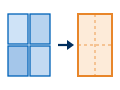{ .tool-icon }<br>**Mosaic To New Raster** | Joins several rasters that sit side by side into one new raster. You will use it to join the four DEM tiles. |
| 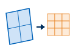{ .tool-icon }<br>**Project Raster** | Moves a raster into another coordinate system and **resamples** it — every output cell gets a new value computed from the input cells nearest to it. You choose the method and the cell size. |
| 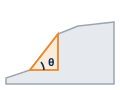{ .tool-icon }<br>**Slope** | Computes the steepness of every cell of an elevation surface from its eight neighbors, in degrees or percent rise (this week's reading in Bolstad). |
| 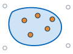{ .tool-icon }<br>**Clip** | An overlay operation that cuts the input to the shape of another layer and keeps only the input's attributes. |
| { .tool-icon }<br>**Kernel Density** | Spreads every point over a circle of the **search radius** and adds the spreads up, giving a smooth surface of how many points lie near each cell, per unit area. Figure B shows what that means for one tower. |
| 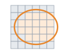{ .tool-icon }<br>**Extract by Mask** | Keeps the cells of a raster that fall inside a mask — a polygon layer or another raster — and sets every other cell to NoData. |


**Figure B.** What the density criterion means around one tower. At the given radius of 20 km, a single tower on its own is enough to fail the test anywhere within 5.8 km of it. At 40 km it takes several towers close together. Keep this figure in mind in Step 14.

## Example Model

Your finished model has four branches — roads, county, terrain and towers. The county branch feeds the other two vector branches, and the raster branches meet in two overlays. The terrain branch starts from `DEM_UTM`, an elevation raster you build once, *before* the model, in Steps 2 and 3. Make your model "your own": lay it out so it reads left to right, and give every tool and dataset a name that says what it holds. `Flat_Near_Road` tells a reader something; `ExtractB_Rast1` does not.

![The finished ModelBuilder model, exported as a vector diagram. Roads branch, top: UDOT_Routes into Select (2), Major_Highways, Buffer (2) with the Road_Distance parameter, Highway_Buffer, Clip (2), Road_Corridor. County branch, left: Counties into Select, Utah_County, which feeds Clip (2) and, lower down, Buffer, County_Buffer_50km, and Clip with UtahCellTowers, giving Towers_Near_County. Terrain branch, middle: DEM_UTM into Slope, Slope_Degrees, Raster Calculator (2) with the Max_Slope parameter, Flat_Enough. Tower branch: Towers_Near_County into Kernel Density with the Search_Radius parameter, Tower_Density, Raster Calculator with the Max_Density parameter, Low_Tower_Density. Road_Corridor and Flat_Enough meet at Extract by Mask, giving Flat_Near_Road; Flat_Near_Road and Low_Tower_Density meet at Raster Calculator (3), giving Suitable_Sites, which is marked P.](images/lab04-full-model.svg)

**Figure C.** The finished model, exported from ModelBuilder. This is a vector diagram — **click it to open it full size**, where every label is readable. The five elements marked `P` are the model parameters of Step 12; they appear in the tool dialog you build there.

## Complete the Lab

For an advanced GIS student, the information up to this point is all you need to complete the assignment. Feel free to try the analysis using only the information above. If you complete the lab without the step-by-step instructions below, say so in your report.

## Step-by-Step Solution

> [!NOTE]
> **Important Note #1:** The steps walk through Utah County at the criteria given. In Step 14 you
> will re-run the same model with different numbers, so build it once, and build it to be changed.

> [!NOTE]
> **Important Note #2:** Every expected number on this page was measured in ArcGIS Pro 3.7.1 on
> the data you download. Two of your downloads are live and change weekly (the UDOT routes and,
> less often, the DEM tiles), so a count may differ from ours by a little. A result that differs by
> a lot means a step went wrong; each step says what the common wrong numbers mean. The dialog
> figures were captured in ArcGIS Pro 3.7.1 while building this model, on an instructor machine
> with a larger display scale, so your dialogs may be laid out a little differently.

### Step 0 — Set Up the Project

**Create the project in your lab folder.** Start ArcGIS Pro and choose the **Map** template. In the **New Project** dialog, the **Location** box does not accept a typed path: click the folder button beside it and browse to `D:\Smith\Lab04`. If you already made that folder, **uncheck "Create a folder for this local project"**, or you will get `D:\Smith\Lab04\Lab04`.

**Check the license.** Slope, Kernel Density, Extract by Mask and Raster Calculator are **Spatial Analyst** tools. On the **Project** tab choose **Licensing** and confirm that *Spatial Analyst* is listed as licensed. It is on the lab machines.

**Add your data to the map**: `Counties.shp`, `UDOT_Routes.shp` (the file name may differ slightly), `UtahCellTowers.shp`, and the four `USGS_1_…tif` tiles. When ArcGIS Pro offers to calculate statistics or build pyramids for the tiles, say **Yes** — it takes a few seconds per tile and makes them draw properly.

**Create the model.** On the **Analysis** tab click **ModelBuilder**. In the **Catalog** pane, under **Toolboxes**, right-click the new model in `Lab04.atbx`, choose **Rename**, and call it `CellTowers`.

**Set the coordinate system for the whole model.** On the **ModelBuilder** tab click **Environments** and set **Output Coordinate System** to **NAD 1983 UTM zone 12N** (search for it; ArcGIS Pro spells *zone* with a lowercase z) (Figure 0). Every tool in the model now writes its output in UTM meters, so you do not need a single Project tool for the vector layers. You do need the environment: your five layers arrive in at least three coordinate systems — the counties in Web Mercator, the towers in latitude/longitude on WGS 1984, the DEM tiles in latitude/longitude on NAD 1983, and the UDOT routes in whatever UGRC's export uses that week. Leave **Cell Size** empty; each raster tool gets its cell size in its own step.

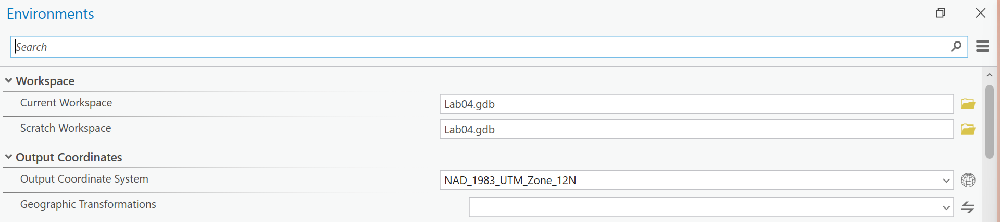

**Figure 0.** ModelBuilder ▸ Environments with the Output Coordinate System set. The dialog opens small; maximize it to see the whole name.

<!-- The UDOT Hub shapefile arrived in GCS WGS 1984 on 2026-09-04 and in NAD 1983 UTM zone 12N for
     the pilot on 2026-09-24, hence "whatever UGRC's export uses that week". On the capture machine the
     environment was already NAD_1983_UTM_Zone_12N when the dialog first opened (inherited from the
     application settings); a student machine will show it empty until they set it. -->
<!-- TODO(instructor): consider a Snap Raster environment (= DEM_UTM, once it exists) so the Kernel
     Density grid lines up with the DEM grid; the pilot got the same answers without it. -->

The first check value is in Step 1.

### Step 1 — Select Utah County

Add the **Select** tool (Analysis Tools) to the model with `Counties` as the input and build the expression `NAME = 'UTAH'` — in clause mode, `NAME` `is Equal to` `UTAH`. County names in this layer are stored in capitals, so `'Utah'` selects nothing. Name the output `Utah_County`.

> [!WARNING]
> **Click OK on the tool dialog before you click Run.** A dialog that is still open runs with its
> last committed parameters; a Select with no committed expression selects all 29 counties and
> reports success.

> [!TIP]
> **Check the result:** exactly **one feature** of about **5,545 km²** (2,141 square miles): the
> `Shape_Area` field reads about 5,544,870,000 square meters. That number also proves the Step 0
> environment is working. About **9,500 km²** means the output is still in Web Mercator, which
> inflates areas by about 70 % at Utah's latitude; a number smaller than 1 means degrees.

<!-- The 9,500 km2 Web Mercator figure: pilot measured 9,500.0 km2 (x 1.713) on 2026-09-24; Lab 1 measured 3,668 sq mi. -->

### Step 2 — Mosaic the DEM

The next two steps build one 30 m elevation raster from the four tiles. **Run them once, from the Geoprocessing pane, not inside your model.** The model starts from their result in Step 4.

> [!NOTE]
> **Why outside the model?** Two reasons, one practical and one general. The practical one:
> Mosaic To New Raster will not replace its own output. Inside a model that you run a second time
> from its tool dialog — which is exactly what Step 14 asks you to do — it stops with
> `ERROR 002869: Output file …\DEM_Mosaic already exists`, even with overwriting switched on in
> ArcGIS Pro's options. The general one: the four tiles never change between runs, so rebuilding
> an identical DEM every time only costs you about fifty seconds per run. Keep one-time data
> preparation out of a model you mean to run repeatedly.

On the **Analysis** tab click **Tools**, search for **Mosaic To New Raster** (Data Management Tools), and set (Figure 2):

- **Input Rasters**: all four DEM tiles — pick them one at a time; a new empty row appears each time.
- **Output Location**: your project geodatabase, `Lab04.gdb`.
- **Raster Dataset Name with Extension**: `DEM_Mosaic` (no extension inside a geodatabase).
- **Spatial Reference for Raster**: **NAD 1983 UTM zone 12N**. It may already be filled in from your project's settings.
- **Pixel Type**: `32 bit float`. The default is **8 bit unsigned**, which can only hold whole numbers from 0 to 255 — every elevation in the county is above that.
- **Cellsize**: leave it **empty**.
- **Number of Bands**: `1`.

> [!WARNING]
> **Do not type a cell size into Mosaic To New Raster.** It looks like the obvious place to ask for
> 30 m cells, and it is the worst mistake available in this lab. With the spatial reference set to
> UTM, typing `30` there produced a raster **117,789 columns by 128,657 rows** — 15 billion
> cells, almost all of them empty — and the tool ran for **38 minutes**. Typing `100` gave
> 58,435 × 131,613 cells and 15 minutes; `300` or `3000` fail at once with an error that all
> geometries "must have the same spatial reference". Left empty, the same step takes about
> **30 seconds**. You set the cell size properly in Step 3.


**Figure 2.** Mosaic To New Raster. Note the **empty Cellsize** and the **32 bit float** pixel type.

> [!TIP]
> **Check the result:** `DEM_Mosaic` should be **7,212 columns × 7,244 rows** (right-click it ▸
> **Properties** ▸ **Source** ▸ *Raster Information*), in NAD 1983 UTM zone 12N — and its cells are
> **24.05 m wide and 30.96 m tall**. They are not square, because a one-arc-second cell is shorter
> east–west than north–south at 40° N. That is why the next step exists. (If you left the spatial
> reference empty and your project has no output coordinate system, the mosaic stays in latitude
> and longitude. That is fine too: Step 3 projects it either way.)

### Step 3 — Project the DEM

Still in the Geoprocessing pane, open **Project Raster** (Data Management Tools) with `DEM_Mosaic` as the input. Name the output `DEM_UTM`, set the **Output Coordinate System** to NAD 1983 UTM zone 12N, **Resampling Technique** to **Bilinear interpolation**, and **Output Cell Size** to `30` in both the **X** and **Y** boxes (Figure 3a). The tool proposes the mosaic's own cell size, 24.05 × 30.96 (Figure 3b) — which is how you can see the non-square cells for yourself.


**Figure 3a.** Project Raster with bilinear resampling to square 30 m cells.

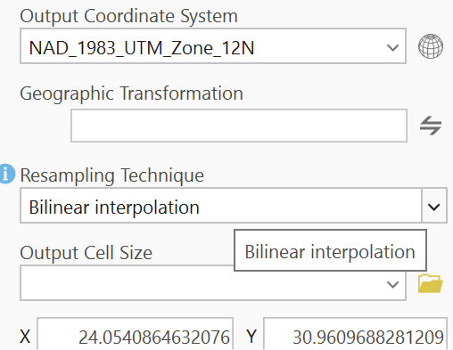

**Figure 3b.** What the tool proposes before you type 30: the mosaic's non-square cells.

> [!NOTE]
> **Why Bilinear?** Elevation is continuous: a new cell that falls between four old ones should get
> a value in between, and bilinear interpolation gives it one. *Nearest neighbor* copies the
> single nearest value and leaves little steps in the surface — and the Slope tool would read
> those steps as slope. Use Nearest for categories (land cover, a 1/0 result), never for
> elevation.

> [!TIP]
> **Check the result:** `DEM_UTM` is **5,783 columns × 7,477 rows of 30 m cells** (one row fewer
> if your mosaic stayed in latitude and longitude), with elevations
> from about **1,265 m** to about **3,628 m**. It takes about 15 seconds. If the cell size reads
> anything but 30, the X and Y boxes were left at their proposed values.


### Step 4 — Find Flat Ground

Back in your model: add the **Slope** tool (Spatial Analyst) and pick the `DEM_UTM` layer as its **Input raster** — the layer went into your map when Step 3 finished, and it now becomes a blue input on the canvas. **Output measurement** is **Degree** and **Method** is **Planar** by default; leave the **Z factor** at `1`, because the elevations and the cell size are both in meters. Name the output `Slope_Degrees` (Figure 4a).

Then add a **Raster Calculator** (the Spatial Analyst one — typing its name on the canvas offers an Image Analyst tool of the same name first) and type:

```text
Con("%Slope_Degrees%" < 5, 1, 0)
```

Name the output `Flat_Enough` (Figure 4b). `Con` means "if the condition is true, 1, otherwise 0", so the result is a two-value raster: 1 where the slope is under 5 degrees.

> [!WARNING]
> **Type the output name last.** When you type an expression, the Raster Calculator replaces
> whatever is in **Output raster** with a default such as `RasterC_1`. Enter the expression first,
> then the name, and look at it before you click OK. Extract by Mask does the same thing in Step 7.

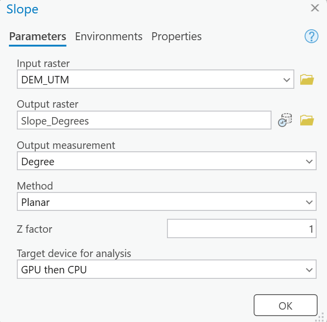

**Figure 4a.** Slope: Degree and Planar are the defaults.

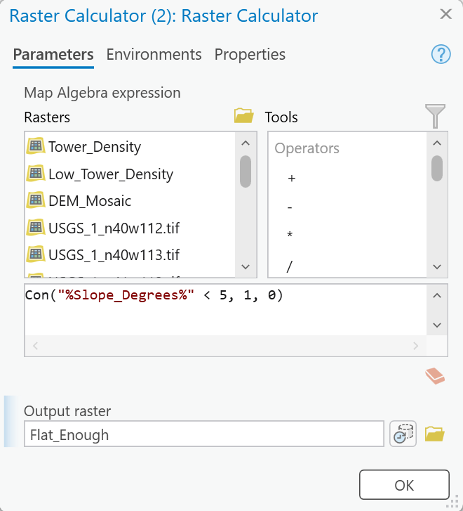

**Figure 4b.** The slope test. In Step 12 the `5` becomes a model parameter.

> [!WARNING]
> **Degree, not Percent rise.** A 5 **percent** slope is only 2.9 degrees. If you leave the
> measurement on Percent rise, `< 5` quietly becomes a stricter test: the county's flat ground
> shrinks from about 2,017 to about 1,691 km², with no error. Check that the Slope output's values
> run up to about 72, not about 300.

> [!TIP]
> **Check the result:** `Slope_Degrees` runs from **0 to about 71.6°**, and inside Utah County it
> averages **12.9°**. Of the county's area, about **2,017 km² (36 %)** comes out as 1 in
> `Flat_Enough` — the valley floor, Goshen and Cedar valleys, and the surface of Utah Lake (Figure
> 4c). Hold that last thought until Step 13.

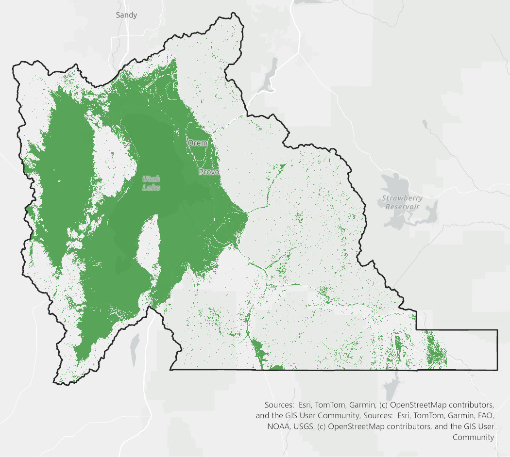

**Figure 4c.** `Flat_Enough` inside Utah County: green is slope under 5 degrees. Your map should match this one.

<!-- Measured 2026-09-24: PERCENT_RISE slope max 299.9; Con(< 5) inside the county 1,878,335 cells = 1,690.5 km2. -->

### Step 5 — Select Major Highways

The UDOT layer is more than highways. Open its attribute table and look at the `CARTO_CODE` field. UGRC's [page for the layer](https://gis.utah.gov/products/sgid/transportation/highway-routes-lrs/){ target="_blank" } documents the codes:

| `CARTO_CODE` | Meaning |
| --- | --- |
| 1 | Interstate highways |
| 2 | US highways |
| 3 | State highways |
| 5 | Miscellaneous routes associated with interchanges |
| 6, 7, 8 | Ramps on Interstates, US highways and state highways |
| 9 | Local routes, federal aid |
| I | Institutional roads designated as state highways |

"I-15 or any other Interstate, US or state highway" is codes 1, 2 and 3. Add a **Select** tool with `UDOT_Routes` as input, switch on the **SQL Editor**, and type:

```text
CARTO_CODE IN ('1', '2', '3')
```

Name the output `Major_Highways`. `CARTO_CODE` is a **text** field even though its values look like numbers — code `I` is why — so the quotes are required.

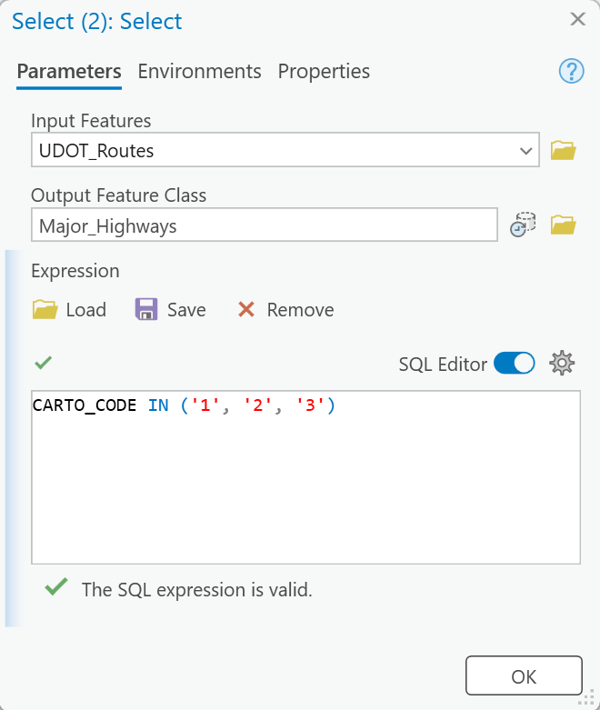

**Figure 5.** Select with the SQL Editor on. The green check means the syntax is valid, not that the codes are the ones you meant.

> [!TIP]
> **Check the result:** about **251 features** statewide (10 Interstate, 15 US and 226 state
> highway records) out of about 3,650. If you get about 1,800, your expression also caught the
> federal-aid local routes. Divided highways appear twice — once per direction — which does no
> harm to a buffer.

<!-- VERIFIED 2026-09-24: CARTO_CODE counts on the live service were 1:10 2:15 3:226 5:35 6:1406
     7:94 8:295 9:1588 I:18 (3,687 records, data updated 2026-09-23); the 2026-09-04 download used
     for the check values had the same 251 for codes 1-3 and 3,640 in all. -->

### Step 6 — Build Road Corridor

Add a **Buffer** with `Major_Highways` as input. Set **Distance** to `1` and the unit to **Kilometers**, and **Dissolve Type** to *Dissolve all output features into a single feature*. Name the output `Highway_Buffer` (Figure 6a).

> [!WARNING]
> **Set the unit yourself.** The unit box sets itself to **Meters** the moment you type a number.
> A 1-meter buffer is a thousand times too narrow and still produces a green check mark.
> Kilometers sits just *above* Meters in the list.

The buffer covers the whole state. Add a **Clip** (Analysis Tools) with `Highway_Buffer` as the input features and `Utah_County` as the clip features, and name the output `Road_Corridor` (Figure 6b). This is what keeps the final result inside the county. ArcGIS Pro suggests *Pairwise Buffer* and *Pairwise Clip* in a banner on both tools; either works.


**Figure 6a.** Buffer: 1 **Kilometers**, dissolved into one feature.

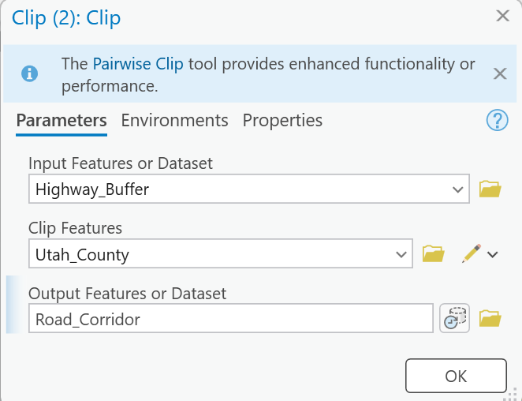

**Figure 6b.** Clip the statewide buffer to the county.

> [!TIP]
> **Check the result:** `Road_Corridor` is **one feature of about 974 km²**, about 18 % of the
> county. A few square kilometers means the unit was meters; a corridor with hundreds of features
> means Dissolve was left off.


**Figure 6c.** `Road_Corridor` and the highways it is built from.

### Step 7 — Mask Flat Ground

Add **Extract by Mask** (Spatial Analyst). Set **Input raster** to `Flat_Enough` and **Input raster or feature mask data** to `Road_Corridor`, and name the output `Flat_Near_Road` (Figure 7). Every cell outside the corridor becomes NoData; inside it, the 1s and 0s of `Flat_Enough` survive.

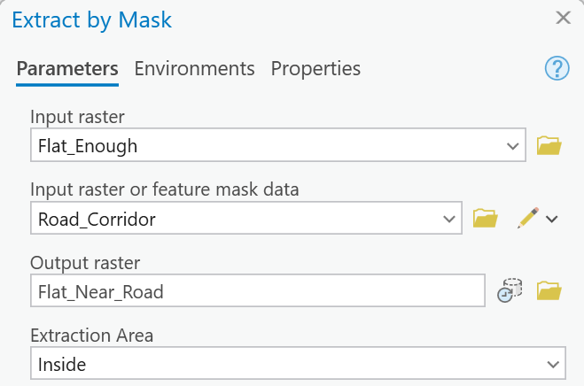

**Figure 7.** Extract by Mask, with the corridor as the mask.

> [!NOTE]
> **The Analysis Extent fills itself in.** Below *Extraction Area* the dialog shows an **Analysis
> Extent** with four numbers already in it — the rectangle around every layer in your map, which is
> most of Utah. Leave it: the values in your result are the same, but `Flat_Near_Road` comes out as
> a statewide rectangle of about 15,000 × 19,000 cells, nearly all NoData. Emptying the four boxes
> is not an option (the dialog flags them as invalid). The final result is unaffected, because the
> last step takes its extent from the density raster.

> [!TIP]
> **Check the result:** `Flat_Near_Road` has about **1,067,500 cells** with values (the corridor),
> of which about **734,400 are 1** — about **661 km²** of flat ground within a kilometer of a highway.
> Open its attribute table to see the two counts.


### Step 8 — Clip the Towers

A density near the county line depends on towers just outside it. Add a **Buffer** with `Utah_County` as input and a distance of `50` **Kilometers**, and name it `County_Buffer_50km`. Then add a **Clip** with `UtahCellTowers` as the input features and `County_Buffer_50km` as the clip features, and name the output `Towers_Near_County`.

> [!NOTE]
> **Why 50 km?** Kernel Density counts every tower within the search radius of a cell. A cell on
> the county line at a 20 km radius can "see" towers up to 20 km outside the county, so the buffer
> must be **at least as wide as the largest search radius you will try** in Step 14. Fifty
> kilometers covers radii up to 50 km. The towers are also where the model's output stops: the
> density raster covers only the rectangle around the towers you give it.

> [!TIP]
> **Check the result:** **71 towers** in `Towers_Near_County`, of which **15** are inside Utah
> County itself. If you get 224, the Clip used the wrong layer; if you get 15, you clipped to the
> county instead of the buffer.

### Step 9 — Map Tower Density

Add **Kernel Density** (Spatial Analyst) with `Towers_Near_County` as the input. As soon as the input is set, the dialog fills in several boxes for you; check each one (Figure 9a):

- **Population field**: `NONE` — each tower counts once. (Filled in for you.)
- **Output cell size**: type `30`, to match the DEM. The tool proposes about **1,772 m**, which would turn the whole county into a few thousand coarse cells.
- **Search radius**: `20000`. It is empty until you type it, and it is in the linear unit of the output coordinate system: meters, so 20 km.
- **Area units**: **Square kilometers**. It reads *Square map units* until the input is set, then switches itself to Square kilometers because the output is in meters.
- **Output cell values**: *Densities*; **Method**: *Planar*.

Name the output `Tower_Density`. Its values are **towers per square kilometer** — small numbers like 0.0024. The criterion is in towers per 10,000 km², so multiply by 10,000 before you compare (next step).


**Figure 9a.** Kernel Density, set up. Only the cell size, the radius and the output name were typed; the rest filled itself in.

> [!TIP]
> **Check the result:** multiplied by 10,000, the density runs from **0 to about 166 towers per
> 10,000 km²** over the whole buffered area; inside the county itself the highest value is about
> **115**. About **429** means the area units were square miles (a square mile is 2.59 km²). Values
> in the **millions** mean the search radius was typed as `20`, thinking kilometers: the tool reads
> it as 20 meters, and every tower becomes a spike.

<!-- GUI-verified 2026-09-25: proposed cell size 1772.47623336426; Area units editable in ModelBuilder,
     default Square map units, switches to Square kilometers once the input is set. The 429 and
     "millions" failure values are unit arithmetic (x 2.59; radius 20 m gives a single-tower peak of
     3/(pi 0.02^2) = 2,387 per km2), not measured runs. -->


**Figure 9b.** `Tower_Density` × 10,000, with the towers you clipped and the 20-per-10,000-km² contour in blue. Everything outside the blue line passes the density test.

### Step 10 — Find Low Density

Add a **Raster Calculator** and type:

```text
Con(10000 * "%Tower_Density%" < 20, 1, 0)
```

Name the output `Low_Tower_Density` (Figure 10). It is 1 wherever there are fewer than 20 towers per 10,000 km².

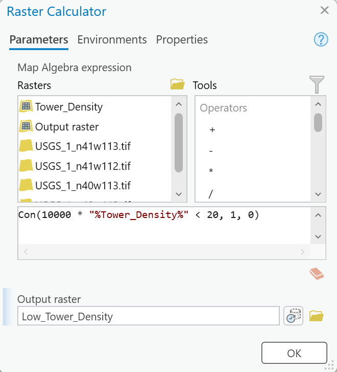

**Figure 10.** The density test, with the units converted inside the expression.

> [!TIP]
> **Check the result:** about **2,858 km²** of the county — just over half — is 1. The 1s are the
> west and south of the county and the high country; the 0s are the valley.

### Step 11 — Combine the Criteria

Add a final **Raster Calculator**:

```text
"%Flat_Near_Road%" * "%Low_Tower_Density%"
```

Name the output `Suitable_Sites` (Figure 11a). A cell is 1 only where both inputs are 1: flat, near a highway, and far from existing towers. It is NoData outside the road corridor.

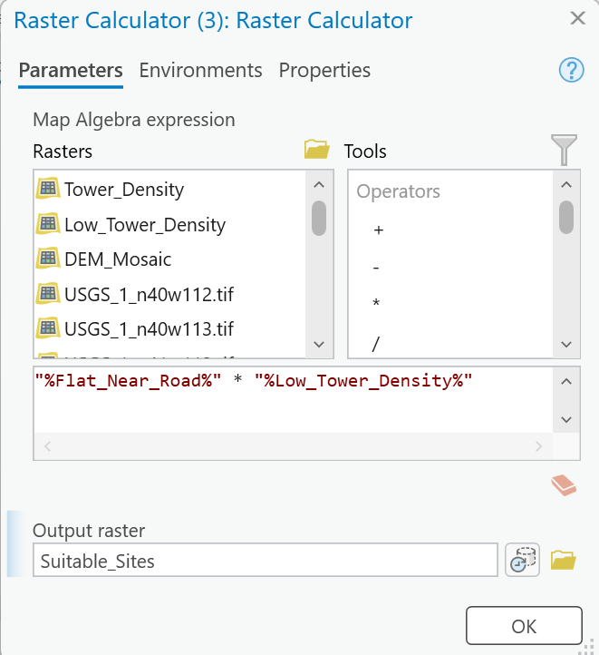

**Figure 11a.** Multiplying two 1/0 rasters is an AND.

Right-click `Suitable_Sites` and choose **Add To Display**, **save the model** (**Save** on the ModelBuilder tab), and click **Run**. The whole model takes about a minute and a half. A later lab reopens it.

> [!TIP]
> **Check the result:** open the attribute table of `Suitable_Sites`. Value 1 should have about
> **129,800 cells**, which at 900 m² each is **116.8 km²** (45.1 square miles) — **2.1 % of the
> county**. Figure 11b shows where.


**Figure 11b.** `Suitable_Sites` at the criteria given. Yours should look like this.

### Step 12 — Set Model Parameters

You are about to run this model several times with different numbers. Expose the four numbers as model parameters now, so each run is "type a number, click Run". Two of them are tool parameters and two are inside expressions:

1. **Road distance.** Right-click the **Buffer** tool on the roads branch ▸ **Create Variable** ▸ **From Parameter** ▸ **Distance [value or field]**. Right-click the new oval ▸ **Rename** ▸ `Road_Distance`, then right-click it ▸ **Parameter** (or select it and press `Ctrl+P`). A `P` appears beside it.
2. **Search radius.** Right-click **Kernel Density** ▸ **Create Variable** ▸ **From Parameter** ▸ **Search radius** (Figure 12a), rename it `Search_Radius`, and make it a parameter.
3. **Maximum slope.** On the **ModelBuilder** tab, click **Variable** (the *VAR* button), type `Double` into the data-type box and press Enter, and click OK. Rename the new oval `Max_Slope`, double-click it and type `5`, and make it a parameter. Then open the slope **Raster Calculator** and change the expression to `Con("%Slope_Degrees%" < %Max_Slope%, 1, 0)`. The `%name%` syntax means "put this variable's current value here"; the connector draws itself when you click OK.
4. **Maximum density.** The same again: a Double named `Max_Density`, value `20`, a parameter, and the density expression becomes `Con(10000 * "%Tower_Density%" < %Max_Density%, 1, 0)` (Figure 12b).

> [!WARNING]
> **Rename the right oval.** A variable made with *Create Variable ▸ From Parameter* lands on top of
> another element, and the tool you right-clicked is still the selected one — so pressing `Ctrl+R`
> straight away renames the *tool*. Right-click the new oval itself and choose **Rename**. The same
> goes for **Parameter**: use the oval's own right-click menu, and check that a `P` appears.


**Figure 12a.** Kernel Density ▸ Create Variable ▸ From Parameter ▸ **Search radius**.


**Figure 12b.** The threshold as an inline variable.

Make `Suitable_Sites` a parameter too, so you can name each run's output. Click **Properties** on the ModelBuilder tab: on **General**, give the model a *Name* (`CellTowers`, no spaces) and a *Label*; on **Parameters**, drag the rows by their numbers into a sensible order. Click **Save**. Then in the **Catalog** pane, double-click the model in `Lab04.atbx`: the Geoprocessing pane shows a dialog with your four numbers and the output (Figure 12c). **Screen capture it for your report.**

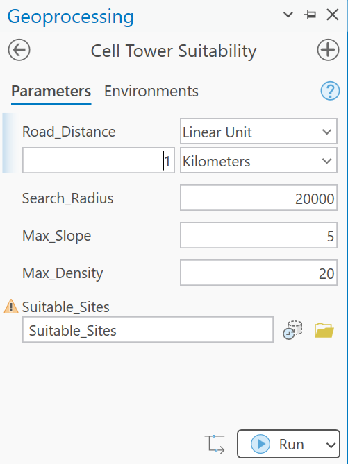

**Figure 12c.** The model as a tool: four numbers and an output name.

> [!WARNING]
> **Running from the dialog deletes intermediate data.** Everything that is not a parameter or an
> input — `Slope_Degrees`, `Major_Highways`, `Towers_Near_County`, `Tower_Density` and the rest —
> is deleted when the model finishes running from its **dialog**. Clicking **Run inside
> ModelBuilder** keeps all of it. So do Step 13 and your first map from the run you just made
> inside ModelBuilder, and whenever you need those layers again, run the model once more inside
> ModelBuilder. Do not look for a fix on the canvas toolbar: its **✗ Intermediate** button is
> *Delete Intermediate Data*, which deletes them immediately.
>
> ArcGIS Pro also has a per-dataset **Intermediate Data** flag meant for exactly this: select the
> oval and press `Ctrl+I` (or search for *Intermediate Data* in the Command Search box). We could
> not confirm that it keeps the data when the model runs from its dialog — you may have to save
> the model and reopen the tool from the Catalog pane before it takes effect. If the layers still
> disappear, re-run the model inside ModelBuilder as above.

### Step 13 — Check the Result

Before you recommend anything, look at what the model found. A screening model does exactly what you told it, including the things you did not mean.

1. **Turn on an imagery basemap** (**Map** tab ▸ **Basemap** ▸ **Imagery Hybrid**) and pan along the orange areas of `Suitable_Sites`. For each of the larger patches, ask whether a tower could actually go there.
2. **Find the zone on Utah Lake.** One candidate area of about **7 km²** lies between SR 68 and the lake off the west shore (Figure 13), and part of it is on the lake itself. Use the **Explore** tool on `DEM_UTM`, first out on open water and then inside that zone, and then on `Slope_Degrees` (from a run inside ModelBuilder — see the warning in Step 12): the lake surface in the elevation data is a single flat value, so its slope is exactly zero, it is within a kilometer of the highway, and there are no towers on it. Every criterion passes. You might expect the road rule to rule this out, but it does not: SR 68 runs within a kilometer of the shoreline, so the 1 km corridor reaches out over the water — about 5 km² of the corridor is lake surface, and about 1 km² of it survives into `Suitable_Sites`. Nothing in the model knows what water is — or a marshy shoreline a meter above it.
3. **Find the zone in Springville.** The second-largest candidate area, about **34 km²**, is in and around Springville along SR 77 — a populated valley that obviously has cell service. The tower layer simply has no license site recorded nearby (Figure A). This is the data, not the terrain.
4. **Count the duplicates.** Run **Find Identical** (Data Management Tools) on `Towers_Near_County` with `Shape` as the field, and open its output table: records that share a location share a `FEAT_SEQ` value. How many of the 71 records share a location with another, at how many places? A site with three records counts three times in the density.

Then **choose one site** you would recommend, and mark it with a point in a new point feature class, as you did for the Walmarts in Lab 1 ([Creating a point feature class](../../arcgis-tips.md#creating-a-point-feature-class){ target="_blank" }). Justify it in your report: why this patch, and why you trust it more than the lake or Springville.


**Figure 13.** One of the model's candidate zones, on imagery. Its straight east edge is the 1 km road corridor; what lies under the orange is shoreline and, in part, the lake.

> [!NOTE]
> **What to do about it is your call, and your report should say what you did.** You could remove
> the lake with a water layer, erase built-up areas, or de-duplicate the towers. You do not have to
> change the model — but you must say in your report which candidate zones you do not believe,
> why, and what data would fix each problem.

### Step 14 — Test the Assumptions

Everything so far rests on four numbers: a 5-degree slope, a 1 km road distance, a threshold of 20 towers per 10,000 km², and a 20 km search radius. None is a law of nature, and one of them — the radius — changes what the density test means (Figure B). The map from Step 11 is *an* answer. This step is about how much of it survives when those numbers move.

Run the model from its tool dialog at least **three more times**, each with a different set of values, and record what happens. Choose deliberately and say why. Places to start:

- **The density threshold**: halve it to 10 or quarter it to 5; double it to 40 or quadruple it to 80.
- **The search radius**: `10000` or `40000` — it is in meters, so type the zeros — with the threshold left at 20. Reread Figure B first.
- **The slope limit**: 3 degrees, or 10.
- **The road distance**: 0.5 km or 2 km. Check the unit box beside the number every time.

Give each run's output a name that says what changed (`Suitable_D40`, `Suitable_R10km`). Each run takes about a minute and a half (Figure 14).


**Figure 14.** A scenario run from the dialog: road distance 2 km, a new output name, a minute and a half. The path starts with `C:\` because it was captured on an instructor machine.

Record, for the **baseline and every run, in one table**: the four parameter values, the number of cells with value 1, the suitable area in km² (cells × 900 ÷ 1,000,000), the percentage of the county (÷ 5,545), and whether your recommended site is still suitable (with the **Explore** tool, click your site's point on that run's output). That table is a required deliverable, and the baseline row is part of it.

Then answer these three questions in your report:

1. **Which number does your answer depend on most, and which least?** Support it with your table, not an impression.
2. **Does your recommended site survive every run?** If not, which change removed it, and is it still your recommendation?
3. **How much of what you see is the tower data rather than the terrain or the roads?** Use Step 13 and Figure A: what would a complete tower layer change, and what data would you want before a carrier spent money on your site?

Finally, **pick one run for your second map** — whichever most changes what a reader would conclude — and say on the map, in its title and its text box, what changed and why you chose it.

> [!TIP]
> Two things worth knowing before you start. Across the values suggested above, one of the four
> numbers moves the suitable area by a factor of about twenty, and none of the others comes close.
> And one of them moves the answer in the opposite direction from what Figure B shows for a single
> tower. Finding out which is which, and being able to explain why, is the point of this step.

## Deliverables

Make **two** professional map layouts:

1. **Your baseline result** — `Suitable_Sites` at the criteria given (slope under 5°, within 1 km of an Interstate, US or state highway, under 20 towers per 10,000 km² at a 20 km radius), with the existing towers, the highways, and your recommended site marked, and an inset of that site on imagery.
2. **One scenario from Step 14** — whichever of your runs most changes the picture, saying in its title and text box what changed and why you chose it.

Write a brief report (2–3 pages of text, plus your figures and maps) covering:

- a title block — assignment title, your name, the date and the course — and the name of your peer reviewer
- the requirements of the project and your approach to solving it
- **a description of your model** a reader could repeat from: each tool and its settings, and every input, intermediate and output dataset with its type (point, line, polygon, raster) and source
- **one** full-page figure of your model — export it from ModelBuilder (**Export ▸ Export To Graphic**) rather than screen-capturing it — and **one** screen capture of its tool dialog with the four parameters
- **the three metadata values** from Figure A and what each means for your result
- **your recommended site** and why, and **which candidate zones you do not believe** and why (Step 13)
- your **sensitivity table** from Step 14, baseline included, and your answers to its three questions
- **a copy of the rubric below with your self-assessment filled in** — a score in every row, honestly arrived at. The grader will compare it with theirs.

The rubric at the end of this lab gives the point value of every item above, so read it before you write.

> [!TIP]
> **Start from the template.** [`lab04-report-template.docx`](lab04-report-template.docx) has the
> title block, a section for every item in the list above, the tables already set up with the
> columns the rubric asks for — including the sensitivity table with all four parameters — and the
> rubric at the end ready to fill in. Open it in Word or upload it to Google Docs, replace every
> gray italic prompt, and delete the prompts as you go. You are welcome to write your report any
> way you like — the template is a floor, not a ceiling — but if you use it and fill in every
> section, you will not have left a graded item out.

> [!IMPORTANT]
> **Peer review before you submit.** Have another student in the class read your report against
> the rubric and give you feedback, then act on that feedback before the deadline. Name your
> reviewer in the report and say in a sentence what you changed because of them. A report nobody
> else has read is a draft, not a submission.

## References

Bolstad, P. (2008) *GIS Fundamentals: A First Text on Geographic Information Systems.* 3rd Edition. Esri Publishing.

Esri. *How Kernel Density works.* ArcGIS Pro documentation. <https://pro.arcgis.com/en/pro-app/latest/tool-reference/spatial-analyst/how-kernel-density-works.htm>{ target="_blank" }

Homeland Infrastructure Foundation-Level Data (HIFLD). *Cellular Towers in the United States (Archive).* Federal Communications Commission data, last updated July 6, 2024. Utah extract prepared for BYU CE 414, 2026.

U.S. Geological Survey. *1 Arc-second Digital Elevation Models (DEMs), 3D Elevation Program,* tiles n40w112, n40w113, n41w112, n41w113. The National Map.

Utah Department of Transportation. *UDOT Routes ALRS.* Distributed by the Utah Geospatial Resource Center.

<!-- The Bolstad page numbers (357-358) and "Chapter 11" for slope are carried from the older
     handout and the Week 5 reading list; the 3rd-edition page numbers have NOT been checked (see
     the Bolstad edition memory: the course reads the 5th). -->

## Example Maps

Two example layouts follow, one for each map the Deliverables ask for. They were laid out and exported by ArcGIS Pro against the run described on this page. They are examples, not templates: your maps will and must look different, and they must carry your name.


**Figure 15.** The baseline map. Two things to do better than this example: label the places you talk about in your report (Springville, Utah Lake, Goshen), and show the zones you reject differently from the ones you accept.


**Figure 16.** The kind of second map Step 14 asks for: the density threshold doubled from 20 to 40, everything else unchanged. The title and text box say exactly what was changed.

## Rubric for Cell Phone Tower Placement

Fifty points in five parts of ten. The bullets say what each part is worth, so you know exactly what to submit.

This rubric is already laid out as a fillable table at the end of
[`lab04-report-template.docx`](lab04-report-template.docx), so you do not have to copy it out
of this page.

| Item | Points |
| --- | --- |
| **Write-up** (2–3 pages)<br>• Assignment title, your name, date and course; your peer reviewer named, with a sentence on what you changed because of them (1)<br>• The requirements of the project and your approach to solving it, in your own words (2)<br>• Your recommended site and why you chose it (2)<br>• The candidate zones you do not believe, why, and what data would fix each problem (Step 13) (2)<br>• The three metadata values from Figure A and what each one means for your result (2)<br>• Clear, organized writing: figures numbered and referred to in the text, sources credited, and this rubric pasted in with your self-assessment in every row (1) | /10 |
| **ModelBuilder model** — correct and working<br>• The model runs end to end from its tool dialog and produces `Suitable_Sites`; your baseline cell count and area match the Step 11 check value, within the small differences a week's newer download can make (4)<br>• A full-page (8.5 × 11) figure of the model, exported from ModelBuilder: every tool and dataset shown, labels informative, all text readable at 10 pt or larger (2)<br>• A screen capture of the tool dialog with the four parameters exposed (2)<br>• A description of the model a reader could repeat from: each tool, its settings, and every input, intermediate and output dataset with its type and source (2) | /10 |
| **Map 1 — your baseline** (full page, 8.5 × 11)<br>• Title, neat line, north arrow and scale bar (1)<br>• Text box with author, date, map projection and data sources (1)<br>• Suitable areas clearly symbolized, with a legend (2)<br>• Existing towers and the highways shown and symbolized (2)<br>• Your recommended site marked and labeled, with an inset of it on imagery (2)<br>• Basemap visible, zoomed to an appropriate scale, and all text legible when printed (2) | /10 |
| **Map 2 — one Step 14 scenario** (full page, 8.5 × 11)<br>• Title, neat line, north arrow and scale bar (1)<br>• Text box with author, date, map projection and data sources (1)<br>• Suitable areas for this scenario symbolized the same way as on Map 1, with a legend (2)<br>• Existing towers, highways and your recommended site shown (2)<br>• Basemap visible, zoomed to an appropriate scale, and all text legible when printed (2)<br>• The title and text box say which number was changed, to what, and why you chose this run to show (2) | /10 |
| **Sensitivity analysis** (Step 14)<br>• One table with the baseline and at least three more runs, giving for each the four parameter values, the cells and area in km², the percentage of the county, and whether your site survives (4)<br>• Which number the answer depends on most and least, supported by the table (2)<br>• Whether your recommended site survives every run, and whether it is still your recommendation (2)<br>• How much of the result is the tower data, and what data you would want before building (2) | /10 |
| **Total** | **/50** |

> [!NOTE]
> **Using AI on this lab.** Use AI freely to understand a tool, work out an error, or
> tighten your write-up, and add one line at the end of your report saying what you used it
> for. Do not take a field name, an expression, a coordinate system, or a number from it —
> those come from your own data, and the rubric asks you to defend every one. See the
> [AI Use Policy](../../policies/ai-policy.md) for the full policy.

<!-- Migration notes (2026-09-24 revision).
SOURCE: the September 3 migration of "Lab 4 - Cell Phone Tower Placement.docx" (README.md in this folder), rebuilt to the standard of Labs 1-3 per tools/lab-conversion-guide.md.
ARCGIS PRO VERSION: 3.7.1. Numbers first measured with arcpy (tools/lab04/run_model.py and scenario.py, arcgispro-py3, Spatial Analyst headless). GUI-VERIFIED 2026-09-25: the whole model built in ModelBuilder by desktop control in C:\Ames\Lab04GUI\Lab04.aprx (model CellTowers, label Cell Tower Suitability, in Lab04.atbx) at 175 % display scaling, every dialog captured from that session, and run both inside ModelBuilder and from the tool dialog. GUI results matched arcpy exactly: Suitable_Sites 129,818 ones (116.84 km2), Major_Highways 251, Road_Corridor 973.60 km2, Towers_Near_County 71, density max 165.63, slope max 71.56; scenario runs from the dialog: density 40 -> 274.43 km2, road 2 km -> 176.92, slope 10 -> 163.59.
DATA: (1) docs/data/lab04-utah-cell-towers.zip, 35 kB: 224 Utah records of HIFLD "Cellular Towers in the United States (Archive)" (item 15dabb4108254481b591018be2598f3c, last data update 2024-07-06), queried LocState='UT', JSONToFeatures to shapefile, GCS WGS 1984, nothing removed; READ-ME inside. Built by tools/lab04/fetch_towers.py + make_extract.py. 33 of 224 records share exact coordinates with another. Compared with the old MapCruzin file (July 2009, 21,265 US points, 229 Utah, 12 in Utah County): same FCC Cellular service, same order of sparseness; MapCruzin is a third-party re-upload with a jZip advertising shortcut inside the zip, so it was dropped. (2) DEM: USGS 1 arc-second "current" tiles n40w112 (2024-01-30), n40w113, n41w112, n41w113 (2026-05-20), 52+47+50+43 MB, GCS NAD83. (3) UDOT Routes ALRS shapefile downloaded 2026-09-04 (3,640 features, GCS WGS 1984; the pilot's 2026-09-24 Hub export was NAD 1983 UTM zone 12N); live service 2026-09-23 has 3,687, codes 1-3 unchanged at 251. (4) UGRC Counties shapefile (Web Mercator), same as Lab 1.
MOSAIC TRAP (measured): MosaicToNewRaster with the UTM spatial reference AND cellsize 30 -> 117,789 x 128,657 cells, extent 280,597-3,814,267 E / 1,105,588-4,965,298 N, 31 minutes to mosaic plus 7 more before Slope finished (38 min). Same with cellsize blank -> 7,212 x 7,244 cells of 24.054 x 30.961 m in 19-22 s, whether the UTM comes from the environment or the tool parameter. arcpy.env.cellSize = 30 is IGNORED by Mosaic To New Raster (still 24 x 31 m). Mosaicking in GCS then Project Raster to UTM 30 m bilinear gives 5,783 x 7,476 (the page's route, through the UTM mosaic, gives 5,783 x 7,477). Project Raster 9 s.
VERIFIED NUMBERS (baseline: slope < 5 deg, 1 km, 20 per 10,000 km2, 20 km radius, 30 m cells): Utah County 5,544.87 km2 (1 feature); DEM_UTM 1,265.3-3,628.0 m; slope 0-71.56 deg, county mean 12.92 deg (6,033,146 cells); Flat_Enough in county 2,241,315 cells = 2,017.2 km2 (36.4 %); Major_Highways 251 of 3,640; Road_Corridor 1 feature 973.60 km2, 1,067,492 cells; Flat_Near_Road value 1 = 734,371 cells = 660.93 km2; towers 71 in the 50 km buffer, 65 distinct locations, 15 in the county; Tower_Density x 10,000 max 165.63 (extent = towers' extent 351,690-556,050 E, 4,374,664-4,538,404 N, covers the county), in-county max 114.50 mean 27.66; Low_Tower_Density in county 2,857.8 km2; Suitable_Sites value 1 = 129,818 cells = 116.84 km2 = 45.11 sq mi = 2.11 % of the county; 1,725 separate patches (Raster To Polygon, no simplify), 9 of at least 1 km2: 37.25 (Goshen Valley, SR 68, 39.975 N 111.956 W), 34.30 (Springville, SR 77, 40.169 N 111.622 W), 11.43 (US 89, 39.875 N 111.542 W), 6.98 (Utah Lake west shore, SR 68, 40.242 N 111.861 W: 7,752 cells, of which 1,244 = 1.1 km2 sit at exactly 1,367.05 m, the hydro-flattened lake surface, the same value as mid-lake, and 3,057 are below 1,369 m), 4.67 (US 6, 39.876 N 111.043 W), 3.28 (SR 96), 2.39 (I-15 near Santaquin), 1.38 (US 6), 1.34 (SR 73). One tower's peak density: 3/(pi r^2) = 95.5 / 23.9 / 6.0 per 10,000 km2 at r = 10 / 20 / 40 km; falls below 20 at 7.36 / 5.82 km / never. Model runtime in arcpy: shared steps 46 s (mosaic 19 s, project 9 s), each parameter run 40-55 s.
SENSITIVITY (measured, for setting expectations; do NOT publish): suitable km2 at each one-at-a-time change from the baseline 116.8: max density 5/10/40/80 -> 30.7/45.8/274.4/592.1; radius 10/40 km -> 364.7/78.8; max slope 3/10/15 -> 91.6/163.6/200.1; road distance 0.5/2/5 km -> 71.3/176.9/303.5. De-duplicating the 6 repeated locations in the 71 clipped towers (Delete Identical on Shape) -> 176.2 km2 (+51 %). So: the density threshold dominates (factor of 19 from 5 to 80); the search radius runs "backwards" (a smaller radius gives MORE area, because each tower's footprint narrows even as its peak rises, and a larger radius makes clusters merge); slope and road distance move the answer by factors of about 2 and 4. The recommended example site (Goshen Valley label point, UTM 418391 4425403) is suitable at the baseline and at density 10 and 40 but NOT at density 5; see tools/lab04/site_survival.json for the full list.
CORRECTIONS carried into this revision (from the September 3 page's TODO/VERIFY list): the "selected roads" Select is now explicit with a documented code list; the 50-mile buffer is 50 km with its reason; Kernel Density units, population field, radius and cell size are explained; a validation step exists (Step 13); the rubric is five parts of ten with a total; the Lab 8 geodatabase name in the old overview is moot (the old captures are not used); Slope units are stated as Degree with a WARNING; NAME = 'UTAH' verified (Lab 1, same shapefile); the UGRC section names are replaced by direct /explore links; the MapCruzin dataset is replaced and dated.
FIGURES: Figure C lab04-full-model.svg = ModelBuilder Export To Graphic (SVG) of the final model, nothing selected. Seventeen dialog captures (lab04-environments, -mosaic-dialog, -project-raster-dialog, -project-raster-default-cellsize, -slope-dialog, -raster-calc-slope-literal, -select-highways-dialog, -buffer-highways-dialog, -clip-corridor-dialog, -extract-by-mask-dialog, -kernel-density-settings, -raster-calc-density-literal, -raster-calc-combine, -kd-create-variable-menu, -raster-calc-density-param, -tool-dialog, -scenario-run-complete) grabbed with tools/screenshots/cap.py and crop.py at 175 %. The Mosaic and Project Raster captures are the ModelBuilder dialogs from before those tools moved out of the model; the standalone Geoprocessing-pane versions have the same parameters. Figure 3b is the standalone pane. Figures A, B and the six icons by tools/lab04/make_svgs.py; check maps and example layouts by tools/lab04/build_figures.py (arcpy.mp). The schematic that stood in for Figure C was deleted. The fourteen Word-era images (lab04-full-model-overview, -mosaic-to-new-raster, -slope-raster-calculator, -project-buffer-udot-routes, -extract-by-mask, -select-buffer-county, -project-clip-towers, -clip-tool-dialog, -kernel-density-model, -kernel-density-dialog, -density-threshold-raster-calculator(-dialog), -combine-rasters-raster-calculator, -example-result-map) were deleted when this page became the assigned lab on 2026-09-25.
PILOT (2026-09-24, no-GUI, notes at C:\Ames\Pilot04\PILOT_NOTES.md): a fresh agent read the draft as a student and rebuilt the model from the page alone with its own arcpy script, on fresh downloads (Counties and UDOT via the Hub download API; UDOT arrived in NAD 1983 UTM zone 12N that day, 3,640 features). Every published check value matched (baseline 129,817 cells / 116.84 km2; Flat_Near_Road 734,417 ones vs our 734,371 - now "about 734,400"), and all eleven sensitivity runs matched ours to 0.1 km2. Duplicates in Towers_Near_County: 11 of 71 records at 5 shared locations (65 distinct; one location has three records). Mosaic cellsize 100 with the UTM environment ran 14.7 minutes and gave 58,435 x 131,613 cells (the runaway extent scales with the typed size); cellsize 300 and 3000 fail at once with ERROR 999999 "must have the same spatial reference" (added to the WARNING). Fixed from its 19 findings: Step 14 TIP was not observable with the suggested values (density now suggests 5 and 80; the TIP names Figure B instead of the parameter's name); radius suggestions now written 10000/40000; Step 12 now says which intermediates to keep (DEM_UTM, Slope_Degrees, Major_Highways, Towers_Near_County) because Step 13 and the maps need them; Step 13 duplicate hint uses Find Identical, not a LocCity sort; Step 0 check moved into Step 1; UDOT coordinate-system claim softened; Figure C step numbers; Figure B footnote overlap and "handout's value"; Esri credit moved off the data by padding the map extents; rubric model row now grades the Step 11 value, which the sensitivity table reports; Bolstad page numbers dropped (unverified for the course edition). Kept as is: figure numbering by step (the guide's rule); Step 0's heading (the guide's exact form).
GUI FACTS learned 2026-09-25: Mosaic To New Raster inside a model fails on a repeat tool-dialog run with ERROR 002869 ("Output file ...\DEM_Mosaic already exists") although Options > Geoprocessing > Allow overwrite is checked; the next run then succeeds (the failed run cleans up), so it alternates - hence Steps 2-3 moved outside the model. Mosaic dialog defaults: Spatial Reference filled from the environment, Pixel Type 8 bit unsigned, Cellsize blank. Standalone Mosaic 33 s, Project Raster 16 s (proposes the input's 24.054 x 30.961 cell size). Slope defaults Degree/Planar/Z 1. Kernel Density: Area units Square map units until the input is set, then Square kilometers; proposed cell size 1772.476; Population field fills NONE. Raster Calculator and Extract by Mask overwrite the typed output name when the expression/inputs change (type the name last). Extract by Mask 3.7 auto-fills an Analysis Extent of all map layers; Flat_Near_Road came out 14,866 x 18,663 cells (values identical). Buffer unit flips to Meters on typing; Kilometers is one row above Meters. The canvas toolbar's 'X Intermediate' button is Delete Intermediate Data, not the flag; the flag is the command 'Intermediate Data (Ctrl+I)' (found by Command Search; the ribbon is too narrow at 175 %). Setting it with Ctrl+I and re-running from the already-open dialog did NOT keep the datasets - untested whether reopening the tool would; the page therefore tells students to re-run inside ModelBuilder instead. Ctrl+R after Create Variable > From Parameter renames the TOOL, not the new variable. Parameter menu item shows Ctrl+P unchecked, Ctrl+Shift+P checked. Full model run inside ModelBuilder with Mosaic 2 min 29 s; tool-dialog runs without it 1 min 30 s (x3). A Dell SupportAssist toast covered the Add Tools box for a minute mid-session.
TODO(instructor): 1. Decide whether Step 13 should require removing the lake or only reporting it (instructor 2026-09-25: 'we don't need cell towers in the lake'; measured: 5.27 km2 of the 1 km corridor and 1.16 km2 of Suitable_Sites are on the hydro-flattened lake surface, because SR 68 runs within 1 km of the shore - the road rule does not exclude water; the page now says so in Step 13). 2. The Intermediate Data (Ctrl+I) flag is mentioned in Step 12 with a 'may have to reopen the tool' caveat; confirm on a lab machine. 3. DONE 2026-09-25: Lab 2 Step 4 reworded to recommend the parameter route and warn about the Delete Intermediate Data button. 4. Consider a Snap Raster environment (= DEM_UTM). 5. The arcelect.com background link is a vendor page (200 on 2026-09-24); keep or drop.
 -->
