# Lab 5: Watershed Delineation

**Civil Engineering 414 — Engineering Applications of GIS**

Fall 2026 · Dr. Dan Ames

## Background

The extraction of hydrographic features, such as watersheds, from digital elevation models is a common component of many geomorphic and hydrologic studies. Topographic watershed analysis can be a helpful first step in analyzing geomorphologic and/or hydrologic problems, such as calculating flow velocity, discharge, or sediment load. The purpose of this lab is to identify individual watersheds and stream hydrography directly from terrain data.

## Problem Statement

Hydrology is a crucial aspect of Earth science studies because water profoundly impacts nearly all aspects of life on Earth. Chemical reactions are dependent upon water availability, and water is a significant factor in rock weathering. All biological species are dependent upon water for survival. Hydrological studies include determining sediment load, nutrients, pollutants, and runoff. Maguire et al. (2005) discuss the use of hydrologic modeling within a GIS to simulate water velocity, depth, discharge, and quality throughout a domain of interest, such as a watershed, river channel system, or groundwater aquifer. Hydrologic modeling integrates discrete and continuous data. Time is also considered (Maguire et al., 2005).

The first step in most hydrological studies is to delineate watersheds. The U.S. Geological Survey defines a watershed as an area of land that drains all the streams and rainfall to a common outlet (USGS, 2011). Watersheds can be divided into smaller units or lumped into larger units, depending upon the number of incoming streams. When delineating watersheds with GIS, the shape and size of the watershed are dependent on the resolution of the DEM. The terrain of the watershed determines the direction water will flow and its accumulation.

Assume that you need to identify the drainage basin above a specific location to create a watershed model that simulates river runoff through that watershed. Your goal is to extract polygon representations of the watersheds in the region and polylines of the major flow networks using only a DEM and a ModelBuilder model. You will identify these flow networks and medium-scale watersheds (i.e., 20–40 watersheds for the entire map).

Create a ModelBuilder model and output map with about 20 to 40 sub-watersheds for this small basin. Overlay your resulting watershed boundaries and polyline rivers on a satellite image of the watershed to determine how well your results match the flow paths shown in the image. Also, compare your stream results to the USGS National Hydrography Dataset (NHD) to see how well your results compare to the official USGS stream network.

## Data

**National Elevation Data DEM.** For Part 1, download the Rock Canyon raster data provided on Learning Suite. For Part 2, you will download different DEM data for your own chosen area and run it through your ModelBuilder model to generate a second map. For Part 2, you can use the following site to find other DEM data: <https://gis.utah.gov/products/sgid/elevation/>. Click on the link for the USGS 3DEP Elevation Products and the link for the 10- and 30-meter 3DEP DEMs. Using the interactive map, approximately locate your area of interest. Draw a polygon (i.e., a square) around the general area. After you double-click to define the area of interest, open the results tab and download the DEM.

**NHD Streams Shapefile.** <https://gis.utah.gov/products/sgid/water/>

Download the Utah Streams NHD shapefile for every stream in Utah. You will use this shapefile to compare our delineated streams with the actual streams shown in this dataset. You will not be using these streams in the model — just for comparison on the map.

## ModelBuilder Tools

You will use the following new tools in this exercise, along with tools from previous labs:

**Fill.** Fills in the areas called pits (or sinks) in a raster. A pit is one or more cells that have no downstream cell — a place where water gets "stuck." The tool generates a raster where all the water flows out of the watershed.

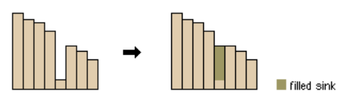

**Figure 1.** The Fill tool raises sinks so that water can drain out of the raster.

**Flow Direction.** Creates a raster of flow direction from each cell to its downslope neighbor. It assigns numerical values for the direction that the water is flowing. (North = 64, Northeast = 128, South = 4, etc.)

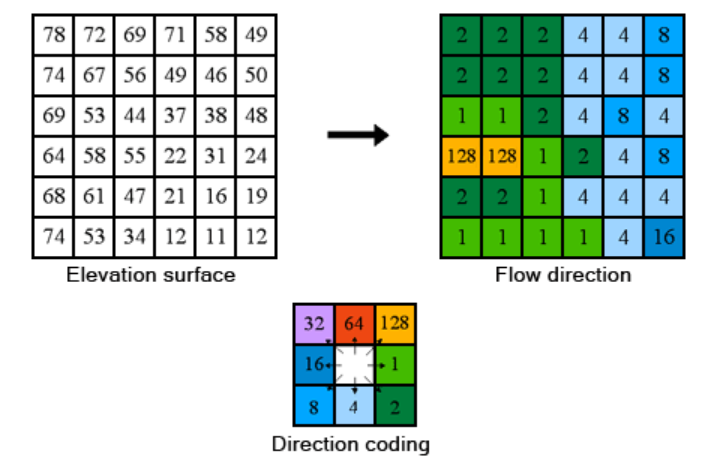

**Figure 2.** An elevation surface, the resulting flow direction raster, and the D8 direction coding.

**Flow Accumulation.** Measures the drainage area in units of grid cells. The cell you are looking at does not include the cell count of itself.

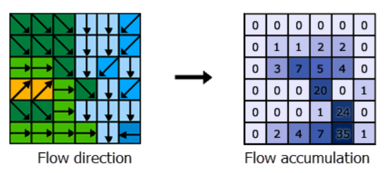

**Figure 3.** Flow direction (left) and the flow accumulation counts derived from it (right).

**Watershed.** Delineates the drainage area above a set of pour points. The scale of the result — how many watersheds you get, and how large each one is — is not set inside the Watershed tool itself. It is controlled earlier in the model, by the flow accumulation threshold that defines where streams begin: that threshold sets the stream network, and the ends of those streams become the pour points that the Watershed tool drains to. Cell threshold is the minimum number of cells that, when flowing together, are assumed to represent a stream. A low threshold results in a lot of smaller streams, and a large threshold results in fewer larger streams.

The threshold is set using the Greater Than tool to identify "stream" and "non-stream" cells. For example, if the user defines the threshold number as 200,000 cells, then all cells that have an upstream area of over 200,000 cells will be flagged as "stream" while everywhere else is considered "non-stream." This does not mean that there is actually flowing water at that point on the landscape, but it is an indicator that a river or stream may be present at that location. The conditional statement to identify grid cells with a large upstream area — in this example, 200,000 cells — looks like this: `Con("%flowAccum1%" > 200000,1,0)`.

<!-- VERIFY: the surrounding steps direct students to the Greater Than tool, but this example gives a Con() Map Algebra expression. Both produce a 1/0 stream raster; confirm which one the model is meant to use and whether the %flowAccum1% variable name matches the model variable students actually create. Kept verbatim from the Word source. -->

**Raster to Polyline / Raster to Polygon.** Creates a polyline or polygon feature based on raster cells with similar values or values within certain ranges. You will use this to convert your resulting raster of watersheds and raster of stream grid cells into vector shapefiles.

**Feature Vertices To Points.** Creates a point shapefile from all the vertices of a polyline shapefile. You will use this to find the points that lie at the end of your streams. You will use these points as the outlets of your watersheds.

**Mosaic To New Raster.** Merges multiple datasets at once. Depending on where you find your data, you may need to combine multiple rasters into one larger raster DEM dataset.

## Example Model

> [!NOTE]
> This model assumes that you have several raster datasets that need to be merged, or "mosaicked," into a single combined raster before conducting the analysis. For Part 1, we have provided a single raster dataset (for Rock Canyon), so you will not need to do the Mosaic To New Raster step. However, for Part 2, if your study area includes more than one raster, you may need to include this step. If you are using a single raster, you can enter it in "Input Rasters" — or you can enter multiple rasters in that parameter.

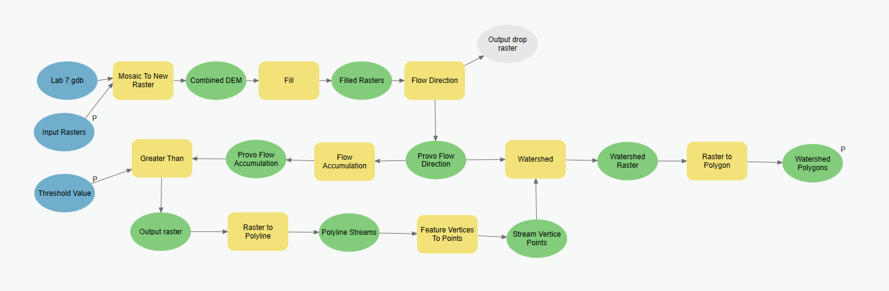

**Figure 4.** The complete model, from input rasters through to watershed polygons.

<!-- TODO(instructor): Figure 4 is a wide, zoomed-out ModelBuilder canvas capture. It needs a clean re-export from ModelBuilder rather than a re-screenshot, so the node labels stay legible at page width; splitting it into two stacked halves would also help. It also labels the input geodatabase "Lab 7.gdb", while Figures 5, 6, and 17 show "Lab 8 - Watershed Delineation.gdb" — neither matches this lab's current number. -->

## Complete the Lab

> [!TIP]
> For an advanced GIS student, the information up to this point is all you need to complete the assignment and create an output map from the results. Feel free to try conducting the analysis using only the information provided above, without referring to the example model. If you complete the lab using only the information provided above (without using the step-by-step instructions), make sure to indicate this in your lab report to be considered for extra credit. If you need extra help, follow the step-by-step solution below.

## Step-by-Step Solution

There are several different techniques and algorithms for extracting watershed boundaries and stream flow networks from DEM data. In this lab, you will take the following approach: fill any pits that are within the DEM, calculate the flow direction, compute flow accumulation, create raster flow networks, convert these to polylines (that will represent the rivers), extract watershed areas as raster data, and then convert these watersheds to polygons. This process will work, with minor adjustments, on any DEM. A basic outline of a model that can be used to complete this assignment is shown in Figure 4 above.

> [!NOTE]
> The screenshots in this section were captured when this lab carried a different number, so the geodatabase in them reads "Lab 7.gdb" or "Lab 8 - Watershed Delineation.gdb." Name your own geodatabase whatever your project uses; the workflow is unchanged.

### Step 1

Use the Mosaic To New Raster tool to combine the four different raster datasets. If you are working with a single input raster file, then you can skip this step. Select the project's geodatabase for the Output Location. For the Raster Dataset Name with Extension, name the raster dataset, but do not add an extension. No extension is needed because the final raster is inside the geodatabase. The text box only accepts names with 13 characters or fewer and does not allow spaces. Set NAD 1983 UTM Zone 12N as your projection. Change the Pixel Type (optional) box to 32 bit signed. The elevations recorded are very large float type numbers. If you choose something smaller, you might not retain any large elevation values. The Cellsize does not need to be changed. The Number of Bands option should be set to 1. This is because you only have one set of data in the rasters (i.e., elevation). If you were to combine basemaps, you might use 3 for the RGB bands in pictures. The Mosaic Operator (optional) option should be set to Blend and the Mosaic Colormap Mode (optional) option should be set to Match. These options help combine the rasters where they overlap and will maintain the whole range of elevations from all the rasters. See Figure 6 for an example of this setup.

<!-- VERIFY: two claims in this step could not be checked against ArcGIS Pro in this migration and are kept verbatim from the Word source: (1) the 13-character limit on the Raster Dataset Name box, and (2) "32 bit signed" as the Pixel Type, which the same paragraph then justifies by saying elevations are "float type numbers" — a signed integer type and a float type are not the same thing. Figure 6 does show "32 bit signed" selected. -->

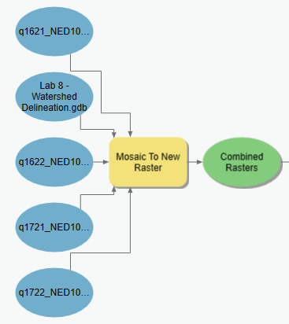

**Figure 5.** The Mosaic To New Raster tool in ModelBuilder.

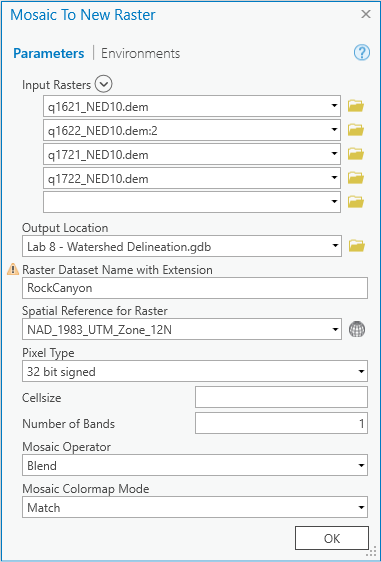

**Figure 6.** The Mosaic To New Raster tool window.

### Step 2

If you downloaded raster DEM data from the web and do not need to use the Mosaic To New Raster tool, you can proceed directly to the Project Raster tool to set your raster to the correct projection (see Figure 7). Make sure that every DEM in the model is set to the correct projection.

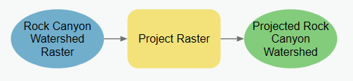

**Figure 7.** Using the Project Raster tool in ModelBuilder.

### Step 3

Use the Fill tool to fill the pits in the raster. Theoretically, this prevents water from getting "stuck" in a watershed. It allows the water to flow freely out of the canyon (see Figure 8).

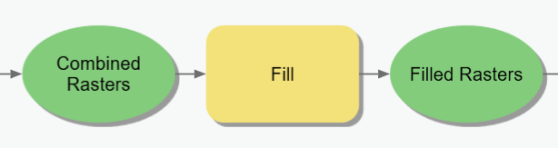

**Figure 8.** The Fill tool in ModelBuilder.

### Step 4

Use the Flow Direction tool to determine the flow direction from cell to cell. Use the filled raster you created in the last step as the input. Leave the output drop raster option blank (see Figure 9). Set Flow direction type to D8.

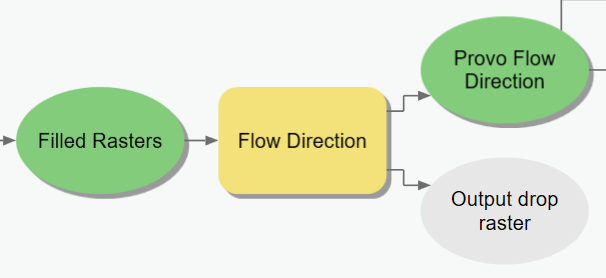

**Figure 9.** The Flow Direction tool in ModelBuilder.

### Step 5

Use the Flow Accumulation tool to calculate the flow accumulation in each cell based on the flow direction found in Step 4 (see Figure 11). Leave the Input Weight Raster blank; a default weight of 1 will then be applied to each cell.

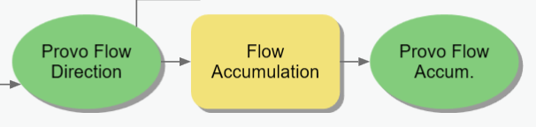

**Figure 10.** The Flow Accumulation tool in ModelBuilder.

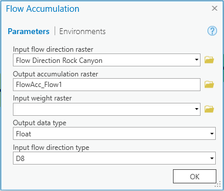

**Figure 11.** The Flow Accumulation tool window.

### Step 6

Use the Greater Than tool to define the threshold and to get a final number of watersheds, between 20 and 40. The threshold in this lab is the number of cells that will contribute to streams (around 5,000 or 10,000 cells).

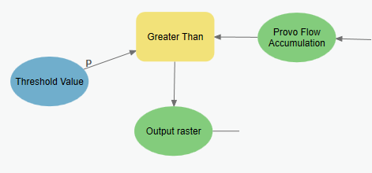

**Figure 12.** The Greater Than tool in ModelBuilder.

> [!TIP]
> You may need to repeat and edit this step to refine the number of watersheds so that they meet the requirement of having 20–40 sub-watersheds within the Rock Canyon watershed. The threshold will be different depending on the study area and raster size to get the required number of watersheds. You may even want to make the SQL statement a parameter for the model so that you can edit this step without having to be in the editor window of ModelBuilder.

<!-- TODO(instructor): the recommended plan calls for students to report one scale/threshold sensitivity result — e.g. the watershed count produced at two different thresholds — but neither the steps nor the rubric asks for it. Decide whether to add that requirement and a matching rubric row; not added here because it changes what students must produce. -->

### Step 7

Use the Raster to Polyline tool to convert the pixels that have been defined as a stream to a polyline shapefile. The output of this tool provides us with the streams for our Rock Canyon watershed. Right-click the output and select Add to Display. This will show your delineated streams in comparison to the measured streams found from the NHD shapefile. This also creates a unique situation where one of your desired outputs is both an intermediate and an output dataset.

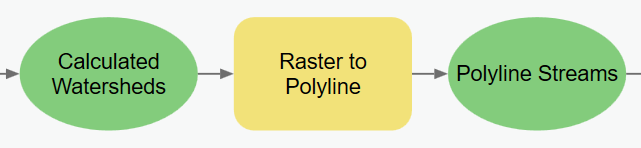

**Figure 13.** The Raster to Polyline tool in ModelBuilder.

<!-- VERIFY: in Figure 13 the input bubble is labeled "Calculated Watersheds," but at this point in the workflow the input is the thresholded stream raster from the Greater Than tool (Figure 12), which is what Figure 4 shows. The screenshot's variable name is misleading and should be renamed when the model is re-exported. -->

### Step 8

Use the Feature Vertices To Points tool to calculate the end points for the rivers. The end points will become the outlets for the watersheds that your model will extract. (That is, find the end points of the polylines.)

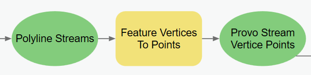

**Figure 14.** The Feature Vertices To Points tool in ModelBuilder.

### Step 9

Use the Watershed tool to create a watershed raster layer from the flow direction raster and the stream outlet points created in the previous steps. By using the flow direction raster and the points from the different streams, this tool assigns cells in the same watershed a unique value to identify the region.

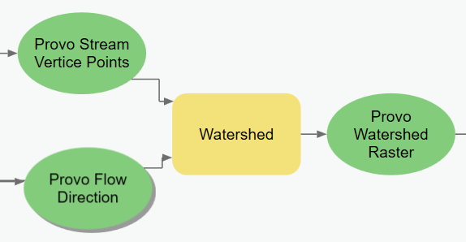

**Figure 15.** The Watershed tool in ModelBuilder.

### Step 10

The final watershed polygons are created from the watershed raster produced in Step 9, by converting the cell values for each of the regions into polygons. At the completion of this step, the shapefile can be added to the map. Make sure to Add to Display.

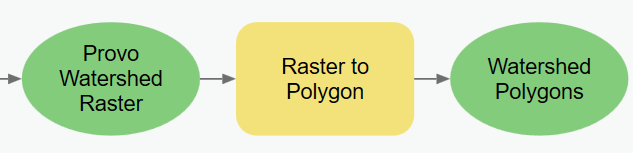

**Figure 16.** The Raster to Polygon tool in ModelBuilder.

### Step 11

After adding the shapefile to the map, you will have more streams and watersheds than are part of the Rock Canyon watershed. Refer to the example map provided for this lab (Figure 19) for the approximate shape of the watershed. Manually create a shapefile of the watersheds and streams that are only part of the canyon. Select the Watershed layer and open the Edit tab. Use the Select tool and shift-click all the watershed polygons within the appropriate area. After selecting the desired polygons, right-click the layer in the Contents pane and select Data and then Export Features. Use the browse button to find a suitable folder to save the selected features. Change the Save as Type option to shapefile. Follow a similar process for selecting the delineated and online streams.

<!-- VERIFY: "Change the Save as Type option to shapefile" was written for an earlier dialog. In current ArcGIS Pro the Export Features geoprocessing tool writes a shapefile when the Output Feature Class path points at a folder rather than a geodatabase. Kept verbatim; confirm the current wording in Pro before students use it. -->

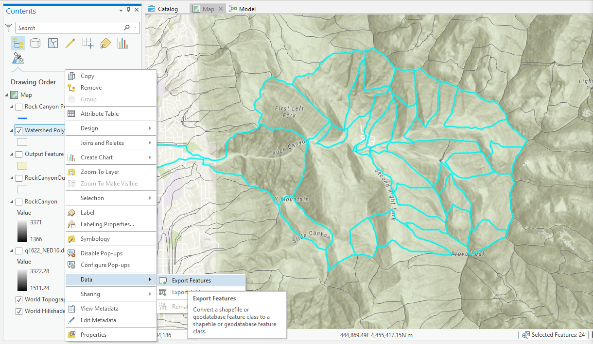

**Figure 17.** Selection of the watersheds in Rock Canyon, and exporting them with Data > Export Features.

<!-- TODO(instructor): Figure 17 is a stale capture — the ArcGIS Pro UI is from October 2018, the title bar reads "Lab 8 - Watershed Delineation", and a named student's ArcGIS sign-in ("Gina (Brigham Young University)") is legible in the top-right corner. Re-shoot, or at minimum crop the sign-in name, before this page is linked for students. -->

### Step 12

Please refer to course lecture material to recall how to create a ModelBuilder tool interface that allows a user to specify the input data, output data, and the flow accumulation threshold value. It might look something like Figure 18.

> [!IMPORTANT]
> Include a screen capture of your custom tool interface in your project report.

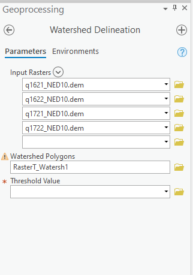

**Figure 18.** Example custom tool interface for your ModelBuilder model.

## Deliverables

**Part 1.** Using the provided data, construct a single ModelBuilder model with a customized graphical user interface (GUI) that will prepare all input data for the terrain analysis, conduct the analysis, and create a map from the results for Rock Canyon near Provo, Utah. Your resulting map should display the original DEM in shaded relief, with the derived watershed polygons in a transparent or semitransparent symbology, and both sets of stream networks clearly visible (the NHD stream data and the stream network you extracted from the DEM). Prepare a brief report that contains your model, the steps taken in the model-building process, describes your results for the project, and includes a final map of your results.

**Part 2.** Identify your own area of interest and download DEM data for this area. Re-run your model with this second dataset using the tool interface you created in Part 1. Prepare a second map that shows the delineated streams and watersheds for this new study area, and briefly discuss your results.

Review the rubric for the full requirements for this lab exercise.

<!-- TODO(instructor): the Word source carries no due date at all. The recommended plan asks that the due date fall after the Watershed Part 3 lecture; add the due date here, expressed as a week number per the site convention. -->

<!-- TODO(instructor): the recommended plan asks students to report the processing environment explicitly — cell size, snap raster, extent, and projection — for both study areas. Neither the deliverables nor the rubric requires it today. Adding it changes what students must produce, so it is flagged rather than written in. -->

<!-- TODO(instructor): decide whether Part 2 requires a full duplicate report or only the second map plus a short discussion. The deliverable text says "briefly discuss your results," while the rubric awards 15 of 30 map points per study area and says nothing about a second report. -->

## References

Maguire, D. J., Batty, M., and Goodchild, M. F. (2005). *GIS, Spatial Analysis, and Modeling*, 1st edition. Esri Press.

U.S. Geological Survey (USGS) (2011). <http://ga.water.usgs.gov/edu/watershed.html>

<!-- VERIFY: this USGS URL is dead as of 2026-09-03 — it 301-redirects to a malformed target (https://water.usgs.gov/edu/index.htmlwatershed.html) and returns 404. Left verbatim rather than replaced with a guess; the instructor should supply the current USGS Water Science School watershed page. -->

## Example Map

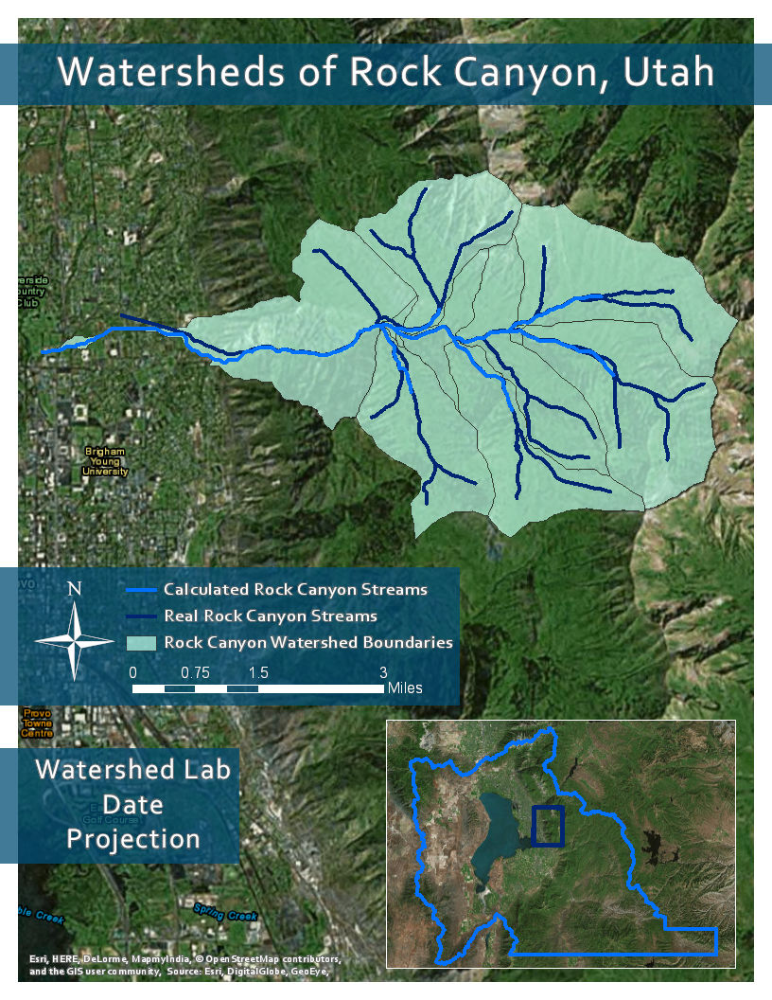

**Figure 19.** Example map of the Rock Canyon results. The "Watershed Lab / Date / Projection" text box is a placeholder for your own name, date, and map projection.

## Rubric for Extracting Watershed Hydrography from a DEM

| Item | Points |
| --- | --- |
| **Report** Assignment title, name, date, course Brief summary of the requirements of the project in your own words How does your delineated stream compare to the NHD data? How does the watershed boundary compare to the terrain visible in a basemap? Are your results as expected, or did you find anything interesting or different from what was expected? | /5 |
| **Show and describe your model** One or more full pages (8.5 x 11) showing your model All text is readable (10 pt. font minimum) All tools and datasets are shown List each of the tools used List tool settings applied for the analysis List all input, intermediate, and output datasets Describe each input dataset, including type (point, line, polygon, raster) and the source of the data Describe each output dataset (point, line, polygon, raster) | /10 |
| **Show a ModelBuilder tool interface** Include a user interface for setting the input data Include a user interface for setting the output data Include a user interface for adjusting the SQL statement that specifies the threshold value, customize the title, and other labels | /5 |
| **Map your results.** Make a full-page map showing the results of your watershed analysis for the provided Rock Canyon data and one for your own study area. Map title, neat line, north arrow, scale bar Text box with author name, date, and map projection Delineated watershed boundaries, stream network, and given stream network shown Each dataset clearly symbolized, visible basemap showing underlying terrain data, labels indicating NHD versus delineated stream network Zoomed to an appropriate scale for viewing analysis results All text is legible on the printed map | /30 (15 per study area) |
| **Total points possible** (Remember to get peer review feedback and a stamp) | /50 |

<!-- Migration notes (2026-09-03): REDACTION: lab05-export-selected-watersheds.png was cropped on 2026-09-03 to remove the ArcGIS Pro title bar/ribbon, which showed a named student's sign-in; the context menu and map are unchanged. source: /Users/dan/ames-sync/Work/Teaching/CE 414 Engineering Applications of GIS/Labs/Lab 5 - Watershed Delineation.docx (Word title: "Lab 5 – Extracting Watersheds from a DEM"); ArcGIS Pro version verified against: NOT VERIFIED in this migration; images renamed from fig-NN: fig-01->lab05-fill-sink-diagram.png, fig-02->lab05-flow-direction-diagram.png, fig-03->lab05-flow-accumulation-diagram.png, fig-04->lab05-example-model-overview.png, fig-05->lab05-mosaic-to-new-raster-model.png, fig-06->lab05-mosaic-to-new-raster-dialog.png, fig-07->lab05-project-raster-model.png, fig-08->lab05-fill-model.png, fig-09->lab05-flow-direction-model.png, fig-10->lab05-flow-accumulation-model.png, fig-11->lab05-flow-accumulation-dialog.png, fig-12->lab05-greater-than-model.png, fig-13->lab05-raster-to-polyline-model.png, fig-14->lab05-feature-vertices-to-points-model.png, fig-15->lab05-watershed-model.png, fig-16->lab05-raster-to-polygon-model.png, fig-17->lab05-export-selected-watersheds.png, fig-18.PNG->lab05-custom-tool-interface.png, fig-19.jpg->lab05-example-map-rock-canyon.jpg; figures renumbered: the Word document numbered only 14 of its 19 images (Figures 1-14 = the step screenshots); all 19 are now numbered in document order, so old Figure 1-14 are new Figure 5-18, and the in-text references were updated to match; stale/unverified screenshots: Figure 4 (illegible wide ModelBuilder canvas, labels input "Lab 7.gdb", needs re-export from ModelBuilder not a re-screenshot), Figures 5 and 6 (geodatabase named "Lab 8 - Watershed Delineation.gdb" from an earlier lab numbering), Figure 13 (input variable mislabeled "Calculated Watersheds" where it is the thresholded stream raster), Figure 17 (ArcGIS Pro UI captured 10/15/2018, title bar reads "Lab 8 - Watershed Delineation", and a student's sign-in name is visible in the top-right corner - re-shoot or crop before publishing); TODO(instructor): no due date anywhere in the source (add one, after the Watershed Part 3 lecture, as a week number), require explicit reporting of cell size / snap raster / extent / projection, add a scale-threshold sensitivity result, decide whether Part 2 needs a full duplicate report, re-export Figure 4 from ModelBuilder; VERIFY: Con("%flowAccum1%" > 200000,1,0) example versus the Greater Than tool the steps prescribe, the 13-character raster name limit, "32 bit signed" pixel type versus the "float type numbers" justification, "Change the Save as Type option to shapefile" wording in current Pro, Figure 13's mislabeled input variable, the dead USGS reference URL; dead/redirected links: http://ga.water.usgs.gov/edu/watershed.html -> 301 -> https://water.usgs.gov/edu/index.htmlwatershed.html -> 404 (DEAD, left verbatim); https://gis.utah.gov/products/sgid/elevation/ 200 OK; https://gis.utah.gov/products/sgid/water/ 200 OK; rubric total verified: 5+10+5+30 = 50 matches the stated /50 -->
