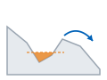
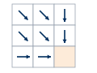
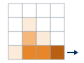
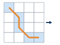
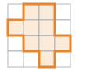

# Lab 5: Watershed Delineation

**Civil Engineering 414 — Engineering Applications of GIS**

Fall 2026 · Dr. Dan Ames

*Extracting streams and watersheds from a DEM*

<!-- **Revision notes.** This page became the assigned version of Lab 5 on September 29, 2026. It is a
rebuild of the September 3 migration of the Word handout, brought to the standard of Labs 1-4
(tools/lab-conversion-guide.md) and harmonized with Lab 4 in structure, detail and deliverables.
The previous page is kept, unlinked, at docs/assignments/lab05-backup/.

**Changes to what the lab asks students to do**

- **The second study area is gone.** In its place, Step 14 varies the flow accumulation
  threshold: a baseline row plus at least three more runs in one table (threshold, contributing
  area, stream segments, subwatersheds, stream length, mean subwatershed area, drainage density),
  three questions, and a second map of one threshold.
- **One study basin, delineated by the model**: the student places an outlet at the Rock Canyon
  trailhead (Step 2) and the model snaps it (Snap Pour Point) and delineates the basin (Watershed),
  so the manual select-and-export of polygons is gone and the result is "the drainage basin above
  a specific location", as the Problem Statement asks.
- **Subwatersheds are one per stream link** (Stream Link -> Watershed), the method the Week 6
  lecture teaches, instead of Raster to Polyline + Feature Vertices To Points (whose end vertices
  depend on digitizing direction, which Raster to Polyline does not tie to the flow).
- **The threshold is a model parameter** (Step 12) set through an inline variable in one Raster
  Calculator expression, as in Labs 2 and 4.
- **Two independent checks** (Step 13): the basin area against USGS StreamStats, and the stream
  network against the NHD, added as a live UGRC feature service.
- **Data**: a 4.2 MB hosted extract of the USGS 1/3 arc-second DEM replaces the Learning Suite
  raster, with READ-ME and metadata questions (Figure A).
- **Rubric**: five parts of ten with valued bullets, matching Lab 4.

**Corrections to things that were wrong**

- The Con("%flowAccum1%" > 200000, 1, 0) example contradicted the Greater Than instruction and
  returned 0s (not NoData) outside streams; the expression is now given exactly, with NoData outside.
- The "32 bit signed" Mosaic pixel type and the 13-character name limit are moot (no Mosaic).
- "Save as Type shapefile" (an old dialog) is gone; nothing is exported by hand.
- The dead USGS reference (ga.water.usgs.gov) is replaced by the Water Science School page.
- No due date problem: the lab is linked from the Week 6 page by tools/build_schedule.py.

**Figures.** Desktop control of ArcGIS Pro was not available when this page was rebuilt, so it has
no dialog captures yet; the settings are given in text, with the parameter labels read from the
ArcGIS Pro 3.7.1 tool definitions (arcpy.GetParameterInfo). Each place a capture belongs is
marked with a TODO(capture) comment. The maps are rendered by ArcGIS Pro through arcpy.mp from the
verification run; Figures A, B and C and the icons are hand-authored SVG with real text (Figure C
is a diagram of the model, not a ModelBuilder export). None of the Word-era images is used. -->

> [!TIP]
> **Start from the report template.** [`lab05-report-template.docx`](lab05-report-template.docx)
> has the title block, a section for every deliverable, the tables already set up with the columns
> the rubric asks for (including the two checks and the sensitivity table with the NHD reference
> row), and the rubric at the end ready to fill in. Open it in Word or upload it to Google Docs,
> replace every gray italic prompt, and delete the prompts as you go. You are welcome to write your
> report any way you like — the template is a floor, not a ceiling — but if you use it and fill in
> every section, you will not have left a graded item out.

## Background

The extraction of hydrographic features, such as watersheds and stream networks, from digital elevation models is a common first step in geomorphic and hydrologic studies. A watershed boundary and a stream network are what you need before you can estimate flow velocity, discharge or sediment load, route a design storm, or size a culvert. The purpose of this lab is to identify a watershed, its sub-watersheds and its stream network directly from terrain data.

The method is simple to state. Fill the pits in the elevation surface, send each cell's water to its steepest downhill neighbor, count how many cells drain through every cell, and call a cell a **stream** when that count passes a threshold. Everything upstream of a point is its watershed. Every step is automatic except one: **the threshold is a number you choose**. Nothing in the terrain says where a stream begins. A low threshold draws a dense network of small channels and cuts the basin into many small subwatersheds; a high one keeps only the main channels. So the map your model draws is *an* answer, not *the* answer. In Step 14 you will vary the threshold, see how far the answer moves, and use what moves to decide which network you can defend — and against what.

> [!IMPORTANT]
> **Your job — see the deliverables below.** Build one model, delineate the Rock Canyon basin and
> its streams and subwatersheds at the threshold given, check the result against two independent
> sources, test the threshold, and make two maps.

## Problem Statement

Hydrology is central to Earth science and engineering because water shapes nearly everything on the land surface: it weathers rock, carries sediment, nutrients and pollutants, and floods the places people build. Maguire et al. (2005) describe how hydrologic models inside a GIS simulate water velocity, depth, discharge and quality across a domain such as a watershed, a river channel or an aquifer. Those models combine continuous data (elevation, rainfall) with discrete features (streams, gages), and all of them start from the same place: the area that drains to the point you care about.

The U.S. Geological Survey defines a watershed as an area of land that drains all the streams and rainfall to a common outlet (USGS Water Science School). Watersheds nest: each can be divided into smaller subwatersheds, one for every tributary, or lumped into a larger basin. When you delineate them with GIS, their shape and size depend on the elevation data — its resolution, its age, and what it leaves out.

Assume you need the drainage basin above a specific location, the mouth of **Rock Canyon** on the east side of Provo, to build a runoff model of that basin. The model needs the basin boundary, a stream network, and a set of subwatersheds — about **20 to 40** of them — each small enough to be treated as one unit. Your task is to build an ArcGIS Pro ModelBuilder model that produces all three from a DEM and an outlet point, check the result against the USGS's own delineation and the National Hydrography Dataset, and find out how much the result depends on the one number you chose.

## Analysis Considerations

Each of these is a decision somebody made, and each reappears in a check value or in Step 14.

- **Stream threshold:** a cell is a stream when **more than 5,000 cells** drain through it. At 10 m cells that is more than **0.5 km²** of contributing area. The value was chosen to give 20–40 subwatersheds in Rock Canyon; it is the number Step 14 varies.
- **Outlet:** the Rock Canyon trailhead, where the creek leaves the canyon. You place it yourself (Step 2), and the model moves it onto the channel with a **snap distance of 50 m** (Step 6).
- **Flow model:** **D8** — each cell drains to exactly one of its eight neighbors, the steepest one downhill. It cannot split flow, and it only knows the ground surface.
- **Pits:** every pit is filled before flow is routed (Step 3). A real closed depression is filled like an error.

And the choices ArcGIS Pro would otherwise make for you:

- **Coordinate system:** NAD 1983 UTM zone 12N for every output, set once in Step 0. Distances in meters, areas in square meters.
- **Cell size:** **10 m**, close to the DEM's own spacing, about 10.3 m north–south, set when you project it (Step 1). The threshold is a *cell count*, so it only means an area once the cell size is fixed.
- **Polygon parts:** one polygon per subwatershed, not one per patch of cells (Step 10).

## Data

> [!IMPORTANT]
> **Set up your folder before you download anything.** On the lab machines, work on the
> **D: drive**. Make one folder for this class named after you — `D:\Smith\` — and one folder per
> lab inside it — `D:\Smith\Lab05\`. Put the project and this lab's data there.
>
> The **C: drive is locked**, and a **network drive** is slow enough to make ArcGIS Pro hang. A
> **high-speed USB 3.0 external drive** is fine. **Back up your lab folder at the end of every
> session**: anyone can edit or delete what is on D:. And **never use a space** in a folder or file
> name you create — raster tools in particular fail on them without saying why. The full set of
> conventions is on the [ArcGIS Tips and Reminders](../../arcgis-tips.md){ target="_blank" } page.

You need five things, and you will get them five different ways: an extract we prepared, a live feature service, a point you create, a live web application, and a live basemap.

| Layer | Where it comes from |
| --- | --- |
| Elevation (DEM) | A **prepared extract** of a U.S. Geological Survey tile, hosted on this site |
| NHD streams | A **live feature service** from the Utah Geospatial Resource Center (UGRC), added by its URL and never downloaded |
| The outlet | A point **you create** at the Rock Canyon trailhead |
| USGS StreamStats basin | A **live web application** you use as an independent check |
| Imagery | A **live basemap** |

As in Labs 1 and 4, every source has to be judged before it is used, by asking the six metadata questions from CCE 114 ([Week 9 — Metadata](https://byu-hydroinformatics.github.io/cce114-geomatics/weeks/week-09/){ target="_blank" }): *what*, *where*, *when*, *why*, *how* and *who*. For a watershed model the question that matters most is *how*: a DEM records the ground surface and nothing under it.

![Infographic: the six metadata questions — What, Where, When, Why, How and Who — each answered for the Rock Canyon DEM: bare-earth elevation in meters above NAVD 88 on 1/3 arc-second cells; a box over Rock Canyon stored in latitude and longitude on NAD 1983; tile n41w112 published May 20, 2026 from sources collected 1946 to 2023; the USGS 3D Elevation Program's general-purpose seamless layer; lidar, contour-based and radar sources resampled to one grid, bare earth and hydro-flattened, so a road fill over a culvert is a solid dam; USGS, public domain. A footer warns that the model sees only the ground surface, not the pipes, culverts and ditches under it.](images/lab05-dem-metadata.svg)

**Figure A.** The six metadata questions, applied to the DEM. Confirm three values yourself from `READ-ME-FIRST.txt` and the tile's [metadata file](https://prd-tnm.s3.amazonaws.com/StagedProducts/Elevation/13/TIFF/current/n41w112/USGS_13_n41w112.xml){ target="_blank" } — the publication date, the range of source dates, and the vertical datum — and add a fourth from the NHD: its last update (on the [UGRC page](https://gis.utah.gov/products/sgid/water/nhd-streams/){ target="_blank" }). Copy them into your report and say what each one does to your result.

### The Rock Canyon DEM (prepared for you)

- **Download:** [`lab05-rock-canyon-dem.zip`](../../data/lab05-rock-canyon-dem.zip) (4.2 MB). Unzip it into your lab folder; it unpacks into a subfolder, `lab05-rock-canyon-dem\`. Read `READ-ME-FIRST.txt` there.
- `RockCanyon_DEM.tif`: **1,620 columns × 1,188 rows** of bare-earth elevation in meters, from **about 1,376 m** on the east bench of Provo (1,377 m after projecting) to **about 3,371 m** at Provo Peak. It covers 111.665° to 111.515° W and 40.225° to 40.335° N.
- It is stored in **latitude/longitude** (GCS North American 1983), exactly as the USGS distributes it. Its cells are 1/3 arc-second: about **10.3 m north–south but only 7.9 m east–west** at this latitude. You project it to square 10 m cells in Step 1.
- **What we did to it:** cut this rectangle out of the USGS 1/3 arc-second tile `n41w112` and nothing else — no filling, smoothing, projecting or resampling.
- **Why we prepared it:** the whole one-degree tile is about 380 MB, and you need less than 1 % of it. If you want the whole tile, the [National Map Downloader](https://apps.nationalmap.gov/downloader/){ target="_blank" } gives it to you as *1/3 arc-second DEM, n41w112*; the Week 5 lecture shows how.

### NHD streams (a live service)

The Utah Geospatial Resource Center's **Utah Streams NHD** layer is the state's copy of the USGS National Hydrography Dataset: every mapped stream, canal and ditch in Utah. You will not download it (the statewide file is large). In Step 13 you add it to your map straight from its feature service URL:

```text
https://services1.arcgis.com/99lidPhWCzftIe9K/ArcGIS/rest/services/UtahStreamsNHD/FeatureServer/0
```

Read UGRC's [page for the layer](https://gis.utah.gov/products/sgid/water/nhd-streams/){ target="_blank" } first. Two things on it matter here: the date of the last update, and the `FCode` field, which says whether each line is a **perennial** (46006), **intermittent** (46003) or **ephemeral** (46007) stream. The NHD is *not* used in the model — only to judge it.

## ModelBuilder Tools

You will use the following new tools, along with Project Raster and Raster Calculator from earlier labs. All but Raster to Polygon are in **Spatial Analyst Tools ▸ Hydrology**. The orange part of each icon is what comes out.

| Tool | What it does |
| --- | --- |
| { .tool-icon }<br>**Fill** | Raises every **pit** — a cell or group of cells with no lower neighbor, where water would get stuck — to the level at which it spills. The result drains everywhere. |
| { .tool-icon }<br>**Flow Direction** | Codes each cell with the neighbor its water flows to, the steepest drop of the eight: 1 east, 2 southeast, 4 south, 8 southwest, 16 west, 32 northwest, 64 north, 128 northeast (Figure B). |
| { .tool-icon }<br>**Flow Accumulation** | Counts, for each cell, how many cells upstream drain through it. The cell itself is not counted, so ridge tops are 0 (Figure B). |
| { .tool-icon }<br>**Snap Pour Point** | Moves an outlet point to the cell of highest flow accumulation within a distance you set, so that it sits *on* the channel rather than beside it. |
| { .tool-icon }<br>**Watershed** | Finds every cell that drains to each pour point. Give it one point and you get one basin; give it a raster of stream segments and you get one subwatershed per segment. |
| { .tool-icon }<br>**Stream Link** | Numbers the segments of a stream raster: each stretch between two junctions (or from a source to a junction) gets its own value. |
| { .tool-icon }<br>**Stream to Feature** | Turns a stream raster into lines that follow the flow direction, one line per segment, drawn downstream. |
| { .tool-icon }<br>**Raster to Polygon** | Turns zones of equal cell value into polygons (Conversion Tools ▸ From Raster). |

![Three five-by-five grids of the same 25 cells of the filled Rock Canyon DEM. Left: elevations from 2,457.6 m in the lower left to 2,561.9 m in the upper right. Middle: the D8 code in each cell with an arrow: the left column drains south (4), the cells to its right drain west (16) or southwest (8). Right: the flow accumulation counted within the patch, rising down the left column from 0 at the top to 5, 10, 18 and 20 at the bottom left, where the patch drains out. A key lists the D8 codes, and a note says ArcGIS Pro's counts include every upstream cell in the DEM, and that a cell never counts itself.](images/lab05-d8-patch.svg)

**Figure B.** The whole method on 25 real cells of your DEM (after Fill). Every cell points to its steepest downhill neighbor; counting the arrows that lead into each cell gives the accumulation. The threshold in Step 8 is a cutoff on the right-hand numbers.

## Example Model

Your finished model has four rows — the surface, the basin, the streams and the subwatersheds — and every row after the first reuses `Flow_Direction`. The model starts from `DEM_UTM`, an elevation raster you project once, *before* the model, in Step 1, and from `Outlet`, a point you create in Step 2. Make your model "your own": lay it out so it reads left to right, and give every tool and dataset a name that says what it holds. `Stream_Links` tells a reader something; `StreamL_Rast1` does not.

![Diagram of the model in four rows. Surface: DEM_UTM into Fill, Filled_DEM, Flow Direction, Flow_Direction, Flow Accumulation, Flow_Accumulation. Basin: Outlet and Flow_Accumulation into Snap Pour Point, Snapped_Outlet; Snapped_Outlet and Flow_Direction into Watershed, Basin_Raster; Raster to Polygon, Rock_Canyon_Basin. Streams: Threshold (5000, marked P), Basin_Raster and Flow_Accumulation into Raster Calculator, Stream_Cells; Stream_Cells and Flow_Direction into Stream Link, Stream_Links; Stream_Links and Flow_Direction into Stream to Feature, Streams (marked P). Subwatersheds: Stream_Links and Flow_Direction into Watershed (2), Subwatershed_Raster; Raster to Polygon (2), Subwatersheds (marked P).](images/lab05-model-diagram.svg)

**Figure C.** The structure of the finished model — **click it to open it full size**. Your ModelBuilder canvas will hold the same tools and datasets. The elements marked `P` are model parameters; they appear in the tool dialog you build in Step 12.

<!-- TODO(capture): replace or supplement Figure C with a ModelBuilder Export To Graphic (SVG) of the
     built model once the GUI build is done, as in Lab 4. -->

## Complete the Lab

For an advanced GIS student, the information up to this point is all you need to complete the assignment. Feel free to try the analysis using only the information above. If you complete the lab without the step-by-step instructions below, say so in your report.

## Step-by-Step Solution

> [!NOTE]
> **Important Note #1:** The steps walk through Rock Canyon at a threshold of 5,000 cells. In
> Step 14 you will re-run the same model with other thresholds, so build it once, and build it to
> be changed.

> [!NOTE]
> **Important Note #2:** Every expected number on this page was measured in ArcGIS Pro 3.7.1 on
> the extract you download. Your outlet will not be exactly where ours is, so a few numbers
> (the basin's cell count, above all) may differ from ours in the last digit or two. A result
> that differs by a lot means a step went wrong; each step says what the common wrong numbers mean.

### Step 0 — Set Up the Project

**Create the project in your lab folder.** Start ArcGIS Pro and choose the **Map** template. In the **New Project** dialog, the **Location** box does not accept a typed path: click the folder button beside it and browse to `D:\Smith\Lab05`. If you already made that folder, **uncheck "Create a folder for this local project"**, or you will get `D:\Smith\Lab05\Lab05`.

**Check the license.** Every hydrology tool in this lab is a **Spatial Analyst** tool. On the **Project** tab choose **Licensing** and confirm that *Spatial Analyst* is listed as licensed. It is on the lab machines.

**Add the DEM to the map**: `RockCanyon_DEM.tif`. When ArcGIS Pro offers to calculate statistics, say **Yes**.

**Create the model.** On the **Analysis** tab click **ModelBuilder**. In the **Catalog** pane, under **Toolboxes**, right-click the new model in `Lab05.atbx`, choose **Rename**, and call it `RockCanyon`.

**Set the coordinate system for the whole model.** On the **ModelBuilder** tab click **Environments** and set **Output Coordinate System** to **NAD 1983 UTM zone 12N** (search for it; ArcGIS Pro spells *zone* with a lowercase z). Leave **Cell Size** empty: the DEM you build in Step 1 already has the cell size you want, and every tool in the model inherits it.

<!-- TODO(capture): the model's Environments dialog with Output Coordinate System set (Lab 4 Figure 0 pattern). -->

The first check value is in Step 1.

### Step 1 — Project the DEM

The DEM is in latitude and longitude, so its cells have no size in meters and are not square. Build one 10 m UTM elevation raster from it **once, from the Geoprocessing pane, not inside your model** — the model starts from its result. (The reason is the one from Lab 4: the input never changes between runs, so rebuilding it on every run of Step 14 only costs you time.)

On the **Analysis** tab click **Tools**, search for **Project Raster** (Data Management Tools), and set:

- **Input Raster**: `RockCanyon_DEM.tif`
- **Output Raster Dataset**: `DEM_UTM` in your project geodatabase, `Lab05.gdb`
- **Output Coordinate System**: **NAD 1983 UTM zone 12N**
- **Resampling Technique**: **Bilinear interpolation** — the default is *Nearest neighbor*
- **Output Cell Size**: `10` in both the **X** and **Y** boxes, whatever the tool proposes

<!-- TODO(capture): the Project Raster pane filled in as above. -->

> [!NOTE]
> **Why Bilinear, and why 10 m?** Elevation is continuous, so a new cell that falls between old ones
> should get a value in between; *Nearest neighbor* copies one old value and leaves small steps in
> the surface, and on a surface this steep those steps become false pits and flat spots for Step 3
> to fill. And 10 m is the DEM's own spacing north–south: a smaller cell would invent detail the
> data does not have, and a larger one would throw away the narrow side canyons.

> [!TIP]
> **Check the result:** `DEM_UTM` is **1,284 columns × 1,230 rows of 10 m cells** (right-click it ▸
> **Properties** ▸ **Source** ▸ *Raster Information*), with elevations from about **1,377 m** to about
> **3,371 m**. The corners are NoData — the latitude/longitude rectangle is slightly rotated in UTM.
> If the cell size reads anything but 10, the X and Y boxes were left at their proposed values. If
> the raster has 1,620 columns, you are looking at the input, not the output.

### Step 2 — Place the Outlet

The outlet is the point whose watershed you want: the **Rock Canyon trailhead**, where the creek leaves the canyon and enters Provo, at about **40.26525° N, 111.63° W**.

1. **Create a point feature class** named `Outlet` in `Lab05.gdb`, with the coordinate system **NAD 1983 UTM zone 12N** ([Creating a point feature class](../../arcgis-tips.md#creating-a-point-feature-class){ target="_blank" }).
2. **Turn on imagery** (**Map** tab ▸ **Basemap** ▸ **Imagery Hybrid**) and go to the trailhead: **Map** tab ▸ **Go To XY**, set the units to decimal degrees, and type `111.63W` and `40.26525N`. (A leading minus sign, `-111.63`, also means west.) Zoom in until you can see the Rock Canyon Trailhead Park parking lot.
3. On the **Edit** tab click **Create**, choose `Outlet`, and click **once on the creek** — the band of trees just northeast of the parking lot, about 60 m north of East 2300 North, running east–west (Figure 2). Click **Save** on the Edit tab.


**Figure 2.** The outlet as placed (yellow) and where Step 6 moves it (red), on imagery. The creek runs east to west through the trees just above the parking lot.

> [!TIP]
> **Check the result:** one point, in the trees northeast of the parking lot. It does not have to be on
> the exact cell of the channel — that is what Step 6 is for — but it has to be within about 50 m
> of it.

### Step 3 — Fill the Sinks

> [!NOTE]
> **How to check a step before the model is finished.** The check values in Steps 3 to 10 are
> for datasets that exist only once their tool has run. As you add each tool, right-click it on the
> canvas and choose **Run** (earlier tools that have not run yet run with it), then right-click its
> green output and choose **Add To Display**. Step 11 runs the whole model once more at the end.

Back in your model: add the **Fill** tool and pick the `DEM_UTM` layer as its **Input surface raster** — it becomes a blue input on the canvas. Leave **Z limit** empty, so every pit is filled however deep. Name the output `Filled_DEM`.

<!-- TODO(capture): the Fill dialog from ModelBuilder. -->

> [!NOTE]
> **Why fill?** In the next step every cell sends its water to a lower neighbor. A cell with no lower
> neighbor — a pit — would swallow everything upstream of it and stop the network there. Most pits
> in a DEM are errors: rounding, resampling, or a road fill that the DEM shows as a solid dam
> because it does not know about the culvert under it (Figure A). Some are real closed depressions,
> and Fill cannot tell the difference.

> [!TIP]
> **Check the result:** `Filled_DEM` runs from about **1,377 m** to about **3,371 m**, the same
> range as `DEM_UTM`: Fill only raises pits, so it never changes the lowest or highest cell. What it
> changed is invisible at this scale. If you want to see it, run **Raster Calculator** from the
> Geoprocessing pane on `"Filled_DEM" - "DEM_UTM"`: about **12,900 cells** were raised, most by
> less than a meter; the deepest pit, **13.5 m**, is a closed hollow high in the mountains near
> 40.254° N, 111.532° W, outside the basin you are about to delineate. Inside that basin only a few
> dozen cells change.

### Step 4 — Compute Flow Direction

Add **Flow Direction** with `Filled_DEM` as the **Input surface raster**, and name the output `Flow_Direction`. Leave **Force all edge cells to flow outward** unchecked, leave **Output drop raster** empty, and check that **Flow direction type** is **D8** (the default).

<!-- TODO(capture): the Flow Direction dialog from ModelBuilder. -->

> [!TIP]
> **Check the result:** `Flow_Direction` has exactly **eight values**: 1, 2, 4, 8, 16, 32, 64 and
> 128 (look at its symbology, or its attribute table after the model has run). If you see values
> such as 17, 68 or 132 — about **20 distinct values** in all, on a few dozen cells — the input was `DEM_UTM`, not
> `Filled_DEM`: where a cell has no single downhill neighbor, ArcGIS Pro writes the sum of the
> candidate directions' codes instead of one of them. Reconnect the tool to `Filled_DEM`.

### Step 5 — Accumulate the Flow

Add **Flow Accumulation** with `Flow_Direction` as the **Input flow direction raster**, and name the output `Flow_Accumulation`. Leave **Input weight raster** empty, so every cell counts as one; **Output data type** is **Float** and **Input flow direction type** is **D8**, the defaults.

<!-- TODO(capture): the Flow Accumulation dialog from ModelBuilder. -->

> [!TIP]
> **Check the result:** `Flow_Accumulation` runs from **0** (ridge tops and every other cell nothing
> drains into) to **430,024**, at the DEM's west edge on the Provo bench, where several canyons'
> water has joined. Symbolize it with a strong stretch and the streams appear (Figure 5). A maximum
> near **246,600** means Flow Direction was run on the unfilled DEM: the pits stop the water before
> it reaches the edge.


**Figure 5.** `Flow_Accumulation` over a hillshade, darker blue for more upstream cells (a logarithmic stretch, cells below 200 hidden). The red point is the outlet. Notice the straight, parallel lines on the city bench at the left — hold that thought until Step 13.

### Step 6 — Snap the Outlet

Add **Snap Pour Point** with `Outlet` as the **Input raster or feature pour point data** and `Flow_Accumulation` as the **Input accumulation raster**. Set **Snap distance** to `50` — it is in the units of the output coordinate system, meters — and leave **Pour point field** as it fills itself in. Name the output `Snapped_Outlet`.

<!-- TODO(capture): the Snap Pour Point dialog from ModelBuilder with Snap distance 50. -->

> [!WARNING]
> **The snap distance defaults to 0.** At 0 the outlet stays on whatever cell you clicked. A
> click 30 or 40 m to the side of the channel — which looks right on the imagery — lands on a
> hillside cell that drains only a handful of its neighbors. The model then runs without an
> error and delineates a "basin" of **a few cells to a few dozen**. A 10 m snap distance is not
> enough either. At 50 m the outlet moves onto the channel — about 45 m west, down to the cell
> with the most flow within reach — and the basin is the whole canyon.

> [!TIP]
> **Check the result** in Step 7: the basin's size tells you whether the snap worked. The snapped
> cell itself has a flow accumulation of about **252,100**.

### Step 7 — Delineate the Basin

Add **Watershed** with `Flow_Direction` as the **Input D8 flow direction raster** and `Snapped_Outlet` as the **Input raster or feature pour point data**, and name the output `Basin_Raster`. Then add **Raster to Polygon** with `Basin_Raster` as input, and name the output `Rock_Canyon_Basin`.

<!-- TODO(capture): the Watershed dialog and the Raster to Polygon dialog from ModelBuilder. -->

> [!TIP]
> **Check the result:** `Basin_Raster` has about **252,100 cells**, so `Rock_Canyon_Basin` is one
> polygon of about **25.21 km²** (9.73 square miles; `Shape_Area` about 25,210,000 square
> meters), reaching from the trailhead at about 1,553 m to Provo Peak at 3,371 m (Figure 7). If it
> is **a few cells or a few hundred square meters**, the outlet was not snapped: go back to Step 6.
> If it is about **43 km²**, your outlet is at the far west edge of the DEM, not at the trailhead.


**Figure 7.** `Rock_Canyon_Basin` on imagery, with the snapped outlet in red. Yours should match this outline.

### Step 8 — Define the Streams

Add a **Raster Calculator** (the Spatial Analyst one — typing its name on the canvas offers an Image Analyst tool of the same name first) and type:

```text
Con(("%Basin_Raster%" >= 0) & ("%Flow_Accumulation%" > 5000), 1)
```

Name the output `Stream_Cells`. Read it from the inside out: `"%Basin_Raster%" >= 0` is true inside the basin and **NoData** everywhere else (`Basin_Raster` has a value only inside the basin); `"%Flow_Accumulation%" > 5000` is true where more than 5,000 cells drain through; `&` needs both; and `Con(…, 1)` with no third argument writes 1 where the test is true and **NoData** where it is not.

> [!WARNING]
> **Type the output name last.** When you type an expression, the Raster Calculator replaces
> whatever is in **Output raster** with a default such as `RasterC_1`. Enter the expression first,
> then the name, and look at it before you click OK.

> [!NOTE]
> **Why NoData and not 0?** The next two tools treat *every cell with a value* as a stream,
> including cells whose value is 0. `Con(test, 1, 0)` would make the whole DEM one enormous "stream".
> Leaving out the third argument is what makes the non-stream cells NoData.

<!-- TODO(capture): the Raster Calculator dialog with this expression and the output Stream_Cells. -->

> [!TIP]
> **Check the result:** `Stream_Cells` has about **2,030 cells**, all with the value 1, all inside
> the basin. The threshold is a **cell count**: 5,000 cells of 10 m × 10 m is 500,000 m², so a
> cell is a stream when more than **0.5 km²** drains to it. If `Stream_Cells` covers the whole DEM
> or the whole basin, you typed the third argument.

### Step 9 — Link the Streams

Add **Stream Link** with `Stream_Cells` as the **Input stream raster** and `Flow_Direction` as the **Input flow direction raster**, and name the output `Stream_Links`. Then add **Stream to Feature** with `Stream_Links` as the **Input stream raster** and `Flow_Direction` again, leave **Simplify polylines** checked, and name the output `Streams`.

<!-- TODO(capture): the Stream Link and Stream to Feature dialogs from ModelBuilder. -->

> [!TIP]
> **Check the result:** `Stream_Links` runs from 1 to **29** — 29 stream segments, each the
> stretch between two junctions or from a source to a junction. `Streams` is **29 lines** with a
> total length of about **22.9 km** (right-click the `Shape_Length` column heading in its attribute
> table ▸ **Statistics** gives the sum, in meters). If your total is in the hundreds of
> kilometers, the stream raster was not limited to the basin.

### Step 10 — Delineate Subwatersheds

Add a second **Watershed** with `Flow_Direction` as the **Input D8 flow direction raster** and, this time, `Stream_Links` as the **Input raster or feature pour point data**. Name the output `Subwatershed_Raster`. Every cell in the basin now gets the number of the stream segment it drains to first: one subwatershed per segment.

Then add a second **Raster to Polygon** with `Subwatershed_Raster` as input, and **check "Create multipart features"**. Name the output `Subwatersheds`.

<!-- TODO(capture): the Raster to Polygon (2) dialog with Create multipart features checked. -->

> [!WARNING]
> **Check "Create multipart features."** It is off by default. A subwatershed's cells are all
> connected, but in D8 some are connected only corner to corner, and Raster to Polygon treats a
> corner as a break. Left unchecked, the 29 subwatersheds come out as about **61 polygons**,
> including slivers of one or two cells, and any count you report is wrong.

> [!TIP]
> **Check the result:** `Subwatersheds` is **29 polygons** that tile the basin with no gaps: their
> areas add up to about **25.21 km²**, the area of `Rock_Canyon_Basin`. The largest is about
> 3.5 km² and the smallest less than 0.01 km² — a short segment between two junctions a few cells
> apart gets a subwatershed of its own.

### Step 11 — Run the Model

Right-click `Rock_Canyon_Basin`, `Streams` and `Subwatersheds` and choose **Add To Display**, **save the model** (**Save** on the ModelBuilder tab), and click **Run** on the ModelBuilder tab. The whole model takes a minute or two. A later lab reopens it.

> [!TIP]
> **Check the result:** 29 stream segments, 29 subwatersheds, 22.9 km of stream, and a basin of
> 25.21 km². Figure 11 shows what that looks like. Twenty-nine is inside the 20-to-40 range the
> problem asks for; Step 14 asks how far outside it the other thresholds go.


**Figure 11.** `Subwatersheds` and `Streams` at a threshold of 5,000 cells. Yours should look like this, in different colors.

### Step 12 — Set Model Parameters

You are about to run this model several times with different thresholds. Expose the threshold as a model parameter now, so each run is "type a number, click Run". It lives inside an expression, so it takes a variable:

1. On the **ModelBuilder** tab, click **Variable** (the *VAR* button), type `Long` into the data-type box and press Enter, and click OK. Right-click the new oval ▸ **Rename** ▸ `Threshold`, double-click it and type `5000`, and right-click it ▸ **Parameter**. A `P` appears beside it.
2. Open the **Raster Calculator** from Step 8 and change the expression to:

   ```text
   Con(("%Basin_Raster%" >= 0) & ("%Flow_Accumulation%" > %Threshold%), 1)
   ```

   The `%name%` syntax means "put this variable's current value here"; the connector from `Threshold` draws itself when you click OK. Check that the output name is still `Stream_Cells`.
3. Make `Rock_Canyon_Basin`, `Streams` and `Subwatersheds` parameters too (right-click each ▸ **Parameter**), so each run can have its own output names.

Click **Properties** on the ModelBuilder tab: on **General**, give the model a *Name* (`RockCanyon`, no spaces) and a *Label* (`Rock Canyon Watersheds`); on **Parameters**, drag the rows by their numbers so `Threshold` comes first. Click **Save**. Then in the **Catalog** pane, double-click the model in `Lab05.atbx`: the Geoprocessing pane shows a dialog with the threshold and three outputs. **Screen capture it for your report.**

<!-- TODO(capture): the model as a tool in the Geoprocessing pane (Lab 4 Figure 12c pattern), and the
     Raster Calculator with %Threshold% (Lab 4 Figure 12b pattern). -->

> [!WARNING]
> **Running from the dialog deletes intermediate data.** Everything that is not a parameter or an
> input — `Filled_DEM`, `Flow_Direction`, `Flow_Accumulation`, `Basin_Raster`, `Stream_Links` and
> the rest — is deleted when the model finishes running from its **dialog**. Clicking **Run inside
> ModelBuilder** keeps all of it. The three outputs survive either way because they are parameters.
> Whenever you need an intermediate raster again, run the model once more inside ModelBuilder. Do
> not look for a fix on the canvas toolbar: its **✗ Intermediate** button is *Delete Intermediate
> Data*, which deletes them immediately.

### Step 13 — Check the Result

A model that runs without an error has only proved that it runs. Before you use its answer, compare it with two sources that did not come from your model.

1. **The basin, against the USGS.** Open [USGS StreamStats](https://streamstats.usgs.gov/ss/){ target="_blank" }, type `40.26525, -111.63` into **Find a place**, and choose the coordinate it suggests. Select **Utah** as the state, zoom in to level 15 (the zoom level shows at the lower left of the map), click **Delineate**, and click the blue stream cell at the trailhead. When the basin appears, click **Continue**, open **Basin Characteristics**, check **DRNAREA** (drainage area), and click **Continue** again. StreamStats delineates on its own elevation grid and stream network, independently of yours. How close is its drainage area to your `Rock_Canyon_Basin`? It reports square miles; you have square kilometers (1 mi² = 2.590 km²).
2. **The streams, against the NHD.** On the **Map** tab click the arrow under **Add Data** ▸ **Data From Path**, paste the feature service URL from the Data section, and click **Add**. Open **Clip** (Analysis Tools) from the Geoprocessing pane with the NHD layer as the input and `Rock_Canyon_Basin` as the clip features, and name the output `NHD_Basin`. **Before you click Run**, open the tool's **Environments** tab and set **Output Coordinate System** to NAD 1983 UTM zone 12N (see the warning below). Then sum `Shape_Length` for all its lines, and separately for each `FCode` (46006 perennial, 46003 intermittent, 46007 ephemeral). Compare the total with your `Streams` (Figure 13).
3. **Look at where they disagree.** With the imagery basemap on, follow your streams and the NHD's up the canyon. Where does one draw a channel the other does not? Which one does the imagery support?

> [!WARNING]
> **Measure the NHD in meters, not Web Mercator meters.** The service is stored in Web Mercator,
> and unless the Clip's output is projected, `Shape_Length` is in Web Mercator's inflated units:
> the NHD in the basin then reads about **49 km** instead of about **37 km**, too long by a third
> at Utah's latitude. And sum `Shape_Length`, not the NHD's own `LengthKM` field: `LengthKM` is
> the length of each whole line before the Clip cut it at the basin boundary.

> [!TIP]
> **Check the result:** StreamStats reports **9.8 square miles** (about 25.4 km²) — within about 1 %
> of your basin. The NHD has **36 lines and about 37.4 km** of stream in the basin: about 5.5 km
> perennial, 2.6 km intermittent and **29.3 km ephemeral**. Your model has 22.9 km.


**Figure 13.** Your streams at 5,000 cells (orange) against the NHD (blue: solid perennial or intermittent, dashed ephemeral), clipped to the basin.

Then **write down, for your report, where the model is wrong and why** — the "Where the method breaks" part of the rubric. Three places to start: the straight parallel lines on the Provo bench in Figure 5 (what does a D8 model do on a nearly flat, built-up surface, and why does it matter that your outlet is above the bench?); the NHD's ephemeral lines (who drew them, from what, and is a line on a map proof of a channel?); and Figure A's culvert warning (where in or below Rock Canyon could the real water go somewhere the DEM does not show?). For each, say what data would fix it.

> [!NOTE]
> **Two checks, two different kinds of agreement.** StreamStats checks the *boundary*, which
> depends on the DEM and the outlet and on nothing you chose. The NHD checks the *network*, which
> depends almost entirely on the threshold. Expect the first to agree closely and the second not
> to — and keep that in mind in Step 14.

### Step 14 — Test the Threshold

Everything you drew in Steps 8 to 11 rests on one number: 5,000 cells. It was chosen to give 20–40 subwatersheds, not because anything in Rock Canyon starts flowing at 0.5 km². The map from Step 11 is *an* answer. This step is about how much of it changes when the threshold moves, and what does not change at all.

Run the model from its tool dialog at least **three more times**, each with a different threshold, and record what happens. Choose deliberately and say why; spread your choices across at least a factor of ten. Places to start: **1,000, 2,000, 10,000, 20,000 or 50,000** cells. Give each run's three outputs names that say which threshold made them (`Basin_T2000`, `Streams_T2000`, `Subwatersheds_T2000`). Each run takes a minute or two.

<!-- TODO(capture): a completed scenario run pop-up from the tool dialog (Lab 4 Figure 14 pattern). -->

Record, for the **baseline and every run, in one table**:

| Column | How to get it |
| --- | --- |
| Threshold (cells) | what you typed |
| Contributing area (km²) | threshold × 100 m² ÷ 1,000,000 |
| Basin area (km²) | the `Shape_Area` of that run's `Rock_Canyon_Basin`, ÷ 1,000,000 |
| Stream segments | the number of lines in `Streams` |
| Subwatersheds | the number of polygons in `Subwatersheds` |
| Total stream length (km) | the sum of `Shape_Length` in `Streams`, ÷ 1,000 |
| Mean subwatershed area (km²) | basin area ÷ number of subwatersheds |
| Drainage density (km/km²) | total stream length ÷ basin area |

That table is a required deliverable, and the baseline row is part of it. Add the NHD's total length from Step 13 as a reference row at the bottom.

Then answer these three questions in your report:

1. **How do the segment and subwatershed counts depend on the threshold?** Describe the relationship with your table — roughly, what happens to the counts when the threshold doubles? — and give the range of thresholds that meets the 20-to-40-subwatershed requirement. Why are two of your columns always equal?
2. **Which threshold reproduces the NHD, and what does that tell you?** Find the threshold at which your total stream length comes closest to the NHD's, and the one at which it comes closest to the NHD's perennial and intermittent length alone. What do those two thresholds say about what the NHD's lines represent — and about which of your networks a runoff model should use?
3. **What did the threshold not change, and which network would you defend?** Look at the basin area, the outlet and the main channel across your runs. Which run would you hand to the engineer who asked for 20–40 subwatersheds, and what would you tell them about the streams in it?

Finally, **pick one run for your second map** — whichever most changes what a reader would conclude — and say on the map, in its title and its text box, what changed and why you chose it.

> [!TIP]
> Two things worth knowing before you start. Across the thresholds suggested above, one column of
> your table never moves at all, whatever you type. And at one of them the whole network collapses
> to a single segment — which means a single "subwatershed" that is the whole basin. Finding out
> where that happens, and being able to explain why it happens there and not at a lower threshold,
> is part of the point of this step.

## Deliverables

Make **two** professional map layouts:

1. **Your baseline result** — `Subwatersheds`, `Streams` and `Rock_Canyon_Basin` at a threshold of 5,000 cells over imagery or a hillshade, with the NHD streams in the basin shown and labeled so a reader can tell them from yours, the outlet marked, and a locator map showing where Rock Canyon is.
2. **One threshold from Step 14** — whichever of your runs most changes the picture, with its subwatersheds and streams symbolized as on Map 1, the NHD streams and the outlet shown, and its title and text box saying what changed and why you chose it.

Write a brief report (2–3 pages of text, plus your figures and maps) covering:

- a title block — assignment title, your name, the date and the course — and the name of your peer reviewer
- the requirements of the project and your approach to solving it
- **a description of your model** a reader could repeat from: each tool and its settings, and every input, intermediate and output dataset with its type (point, line, polygon, raster) and source
- **one** full-page figure of your model — export it from ModelBuilder (**Export ▸ Export To Graphic**) rather than screen-capturing it — and **one** screen capture of its tool dialog with the threshold parameter
- **the four metadata values** from Figure A and what each means for your result
- **the two checks from Step 13** — your basin area against StreamStats, and your stream length against the NHD — and **where the model is wrong**, why, and what data would fix it
- your **sensitivity table** from Step 14, baseline and NHD rows included, and your answers to its three questions
- one line at the end saying what, if anything, you used AI for (see the note after the rubric)
- **a copy of the rubric below with your self-assessment filled in** — a score in every row, honestly arrived at. The grader will compare it with theirs.

The rubric at the end of this lab gives the point value of every item above, so read it before you write.

> [!IMPORTANT]
> **Peer review before you submit.** Have another student in the class read your report against
> the rubric and give you feedback, then act on that feedback before the deadline. Name your
> reviewer in the report and say in a sentence what you changed because of them. A report nobody
> else has read is a draft, not a submission.

## References

Esri. *How Flow Direction works* and *How Flow Accumulation works.* ArcGIS Pro documentation. <https://pro.arcgis.com/en/pro-app/latest/tool-reference/spatial-analyst/how-flow-direction-works.htm>{ target="_blank" } · <https://pro.arcgis.com/en/pro-app/latest/tool-reference/spatial-analyst/how-flow-accumulation-works.htm>{ target="_blank" }

Maguire, D. J., Batty, M., and Goodchild, M. F. (2005). *GIS, Spatial Analysis, and Modeling.* Esri Press.

U.S. Geological Survey. *1/3 Arc-second Digital Elevation Model, 3D Elevation Program,* tile n41w112 (published May 20, 2026). The National Map.

U.S. Geological Survey. *StreamStats.* <https://streamstats.usgs.gov/ss/>{ target="_blank" }

U.S. Geological Survey Water Science School. *Watersheds and Drainage Basins.* <https://www.usgs.gov/water-science-school/science/watersheds-and-drainage-basins>{ target="_blank" }

Utah Geospatial Resource Center. *Utah Streams NHD* (derived from the USGS National Hydrography Dataset; last updated December 2016). <https://gis.utah.gov/products/sgid/water/nhd-streams/>{ target="_blank" }

## Example Maps

Two example layouts follow, one for each map the Deliverables ask for. They were laid out and exported by ArcGIS Pro against the run described on this page. They are examples, not templates: your maps will and must look different, and they must carry your name.

![Example baseline layout titled "Streams and Subwatersheds of Rock Canyon, Provo": the basin outlined in yellow over imagery, divided into 29 translucent colored subwatersheds with white edges, the delineated streams in orange, the NHD in blue (dashed for ephemeral), and a red outlet point at the canyon mouth; below, a locator of Utah County with the basin in orange, a legend, north arrow, scale bar in kilometers, and a text box giving 29 segments and 29 subwatersheds, 22.9 km of stream against 37.4 km in the NHD, the author, date, projection and data sources.](images/lab05-example-map-baseline.png)

**Figure 15.** The baseline map. Two things to do better than this example: label the peaks and the canyon so a reader can find their way around, and say on the map which of the NHD's lines your model does not reproduce.


**Figure 16.** The kind of second map Step 14 asks for: the threshold raised from 5,000 to 10,000 cells, everything else unchanged. Your own second map should be the run that most changes what a reader would conclude, which may not be this one. The title and text box say exactly what was changed and why this run was chosen.

## Rubric for Watershed Delineation

Fifty points in five parts of ten. The bullets say what each part is worth, so you know exactly what to submit.

This rubric is already laid out as a fillable table at the end of
[`lab05-report-template.docx`](lab05-report-template.docx), so you do not have to copy it out
of this page.

| Item | Points |
| --- | --- |
| **Write-up** (2–3 pages)<br>• Assignment title, your name, date and course; your peer reviewer named, with a sentence on what you changed because of them (1)<br>• The requirements of the project and your approach to solving it, in your own words (2)<br>• The two checks from Step 13: your basin area against StreamStats and your stream length against the NHD, with the numbers (2)<br>• Where the model is wrong, why, and what data would fix each problem (Step 13) (2)<br>• The four metadata values from Figure A and what each one means for your result (2)<br>• Clear, organized writing: figures numbered and referred to in the text, sources credited, and this rubric pasted in with your self-assessment in every row (1) | /10 |
| **ModelBuilder model** — correct and working<br>• The model runs end to end from its tool dialog; at the baseline threshold your basin area, segment count and subwatershed count match the Step 7 and Step 11 check values, within the small differences your own outlet can make (4)<br>• A full-page (8.5 × 11) figure of the model, exported from ModelBuilder: every tool and dataset shown, labels informative, all text readable at 10 pt or larger (2)<br>• A screen capture of the tool dialog with the threshold exposed as a parameter (2)<br>• A description of the model a reader could repeat from: each tool, its settings, and every input, intermediate and output dataset with its type and source (2) | /10 |
| **Map 1 — your baseline** (full page, 8.5 × 11)<br>• Title, neat line, north arrow and scale bar (1)<br>• Text box with author, date, map projection and data sources (1)<br>• Subwatersheds and the basin boundary clearly symbolized, with a legend (2)<br>• Your streams and the NHD streams both shown, symbolized so a reader can tell them apart (2)<br>• The outlet marked, and a locator map showing where the basin is (2)<br>• Imagery or hillshade visible, zoomed to the basin, and all text legible when printed (2) | /10 |
| **Map 2 — one Step 14 threshold** (full page, 8.5 × 11)<br>• Title, neat line, north arrow and scale bar (1)<br>• Text box with author, date, map projection and data sources (1)<br>• Subwatersheds and streams for this threshold symbolized the same way as on Map 1, with a legend (2)<br>• The NHD streams and the outlet shown (2)<br>• Imagery or hillshade visible, zoomed to the basin, and all text legible when printed (2)<br>• The title and text box say what threshold was used, what it replaced, and why you chose this run to show (2) | /10 |
| **Sensitivity analysis** (Step 14)<br>• One table with the baseline and at least three more thresholds, giving for each the threshold in cells and km², the basin area, the segments, the subwatersheds, the stream length, the mean subwatershed area and the drainage density, with the NHD as a reference row (4)<br>• How the counts depend on the threshold, the range that gives 20–40 subwatersheds, and why two columns are equal (2)<br>• The thresholds that reproduce the NHD, and what that says about the NHD and about which network to use (2)<br>• What the threshold does not change, and the network you would defend (2) | /10 |
| **Total** | **/50** |

> [!NOTE]
> **Using AI on this lab.** Use AI freely to understand a tool, work out an error, or
> tighten your write-up, and add one line at the end of your report saying what you used it
> for. Do not take a field name, an expression, a coordinate system, or a number from it —
> those come from your own data, and the rubric asks you to defend every one. See the
> [AI Use Policy](../../policies/ai-policy.md) for the full policy.

<!-- Migration notes (2026-09-29 rebuild).
SOURCE: the September 3 migration of "Lab 5 - Watershed Delineation.docx" (kept unlinked at docs/assignments/lab05-backup/README.md, with its 19 Word-era images), rebuilt to the standard of Labs 1-4 per tools/lab-conversion-guide.md and harmonized with Lab 4 (Cell Phone Tower Placement): same section order, Step 0 set-up, one-time data preparation outside the model, check values with failure interpretations in every step, parameter step, check step, sensitivity step with baseline-in-table, two maps, rubric of five tens.
ARCGIS PRO VERSION: 3.7.1. VERIFIED WITH ARCPY ONLY (tools/lab05/run_model.py, extra_checks.py, arcgispro-py3, Spatial Analyst headless). The GUI build was NOT done: computer-use access to ArcGIS Pro was requested twice on 2026-09-29 and denied (the instructor was away), so no dialog was seen. Dialog labels and defaults on the page come from arcpy.GetParameterInfo for each tool (Fill: Input surface raster / Z limit; Flow Direction: Force all edge cells to flow outward default off, Output drop raster, Flow direction type D8; Flow Accumulation: Input weight raster, Output data type Float, Input flow direction type D8; Snap Pour Point: Input raster or feature pour point data, Input accumulation raster, Snap distance default 0, Pour point field; Watershed: Input D8 flow direction raster, Input raster or feature pour point data; Stream Link; Stream to Feature: Simplify polylines default on; Raster to Polygon: Simplify polygons default on, Create multipart features default off; Project Raster: Resampling Technique default Nearest). GUI claims carried from the Lab 4 GUI session (2026-09-25): Raster Calculator overwrites the output name; the canvas Intermediate button deletes data; running from the dialog deletes intermediates; VAR button + data-type box; Create Variable renaming. NOT SEEN and to verify at a lab machine: Go To XY accepting "111.63W"/"40.26525N" (worked by desktop control in Week 3), Add Data > Data From Path with the UGRC URL, the ModelBuilder Raster Calculator accepting a Long variable inline, total model run time "about a minute" (arcpy: 55 s shared + 15 s per threshold).
DATA: (1) docs/data/lab05-rock-canyon-dem.zip, 4,188,547 bytes: RockCanyon_DEM.tif, a window of USGS_13_n41w112.tif ("current", Last-Modified 2026-05-20, metadata title "USGS 1/3 Arc Second n41w112 20260519", source time period 1946-01-01 to 2023-11-05), bounds -111.665 -111.515 40.225 40.335, 1,620 x 1,188 float32 cells, no NoData cells, 1376.36-3371.22 m, GCS NAD83; READ-ME inside. Built by tools/lab05/fetch_dem.py (rasterio /vsicurl/ windowed read) + make_extract.py. (2) UGRC Utah Streams NHD feature service (services1.arcgis.com/99lidPhWCzftIe9K/.../UtahStreamsNHD/FeatureServer/0), Web Mercator (wkid 102100), last update December 2016; queried for the DEM box on 2026-09-29 (285 features). (3) USGS StreamStats, ss-delineate API and the web app, 2026-09-29.
VERIFIED NUMBERS (threshold 5,000 cells, outlet 40.26525 N 111.63 W = UTM 446,432 E 4,457,388 N, snap 50 m): DEM_UTM 1,284 x 1,230 cells of 10 m, 1,376.67-3,370.60 m, 22,327 NoData corner cells; Fill raised 12,916 cells (1,916 by > 1 m), max 13.48 m at UTM 454,727 4,456,097 (40.2541 N 111.5324 W), outside the basin; inside the basin 43 cells raised, max 2.35 m; Flow_Direction values 1-128 only; unfilled DEM -> 20 distinct values, 39 non-D8 cells, and Flow Accumulation max 246,640; Flow_Accumulation max 430,024 at UTM 443,457 4,456,347 (40.2557 N 111.6649 W, the DEM's west edge); snapped outlet UTM 446,387 4,457,397, accumulation 252,138 (moved 45 m); Basin_Raster 252,139 cells = 25.2139 km2 = 9.735 sq mi, one polygon (simplified or not), elevation 1,553.4-3,370.6 m; unsnapped at the exact coordinate 252,116 cells; a point 40 m north of the channel with snap 0 -> 1 cell, snap 10 -> 5 cells, snap 50 -> 252,139. StreamStats (web app 2026-09-29): DRNAREA 9.8 sq mi; API Shape_Area 25,388,600 m2 (+0.7 %). Baseline: Stream_Cells 2,031; Stream_Links 1-29; Streams 29 lines, 22.913 km; Subwatersheds 29 multipart polygons (61 single-part), total 25.213 km2, mean 0.869, min 0.0083, max 3.520 km2. NHD_Basin: 36 lines, 37.43 km in UTM (37.44 km geodesic, 49.09 km if left in Web Mercator); FCode 46006 perennial 5.51 km, 46003 intermittent 2.61 km, 46007 ephemeral 29.31 km; names Dry Fork and unnamed. Figure B patch: tools/lab05/d8_patch.json (center UTM 450,007 4,459,047).
SENSITIVITY (measured, for setting expectations; do NOT publish): threshold cells -> segments = subwatersheds / stream km / mean subwatershed km2 / drainage density km per km2 / single-part polygons: 500 -> 290 / 83.2 / 0.087 / 3.30 / 664; 1,000 -> 140 / 56.1 / 0.180 / 2.22 / 294; 2,000 -> 78 / 38.6 / 0.323 / 1.53 / 157; 5,000 -> 29 / 22.9 / 0.869 / 0.91 / 61; 10,000 -> 15 / 16.5 / 1.681 / 0.66 / 22; 20,000 -> 9 / 11.5 / 2.802 / 0.46 / 14; 50,000 -> 1 / 4.9 / 25.21 / 0.20 / 1. The basin area (25.21 km2) is identical in every run. Counts fall roughly in inverse proportion to the threshold (x 2 threshold -> about x 0.5 segments); 20-40 subwatersheds is roughly 3,700-7,400 cells by log-log interpolation. The NHD total (37.4 km) is matched near 2,000 cells; the NHD perennial + intermittent length (8.1 km) falls between 20,000 (11.5 km) and 50,000 (4.9 km). At 50,000 cells only the trunk below the main confluence exceeds 5 km2, so the network is one link and the basin one subwatershed.
FIGURES: Figures A (lab05-dem-metadata.svg), B (lab05-d8-patch.svg, computed from the filled DEM and ArcGIS Pro's Flow_Direction) and C (lab05-model-diagram.svg, a hand-authored diagram, NOT a ModelBuilder export) and the eight icons by tools/lab05/make_svgs.py; check maps (lab05-check-outlet, -accumulation, -basin, -subwatersheds, -nhd) and the two example layouts by tools/lab05/build_figures.py (arcpy.mp, ArcGIS Pro 3.7.1, 150 dpi). No dialog captures (see TODO(capture) comments). The nineteen Word-era images were removed from this folder; they remain in docs/assignments/lab05-backup/images/.
PILOT (2026-09-29, no-GUI, notes at C:\Ames\Pilot05\PILOT_NOTES.md, about 10 minutes): a fresh agent rebuilt the model from the page alone with its own arcpy scripts; every published check value reproduced (basin 25.2137 km2, 29/29, 22.913 km, NHD 37.438 km, Web Mercator 49.103 km, StreamStats +0.7 %). Its off-channel clicks at snap 0 gave 5, 2 and 16 cells and at snap 10 gave 22, 4 and 16 (the Step 6 warning now says 'a few cells to a few dozen'); unfilled Flow Direction gave 19 distinct codes plus NoData ('about 20'). Fixed from its findings: Example Map 2 re-rendered at 10,000 cells because the 2,000-cell version gave away Step 14 Question 2; a NOTE before Step 3 on running each tool to see its check value; a basin-area column added to the Step 14 table and rubric so the TIP's 'one column never moves' is observable; Figure C now marks Rock_Canyon_Basin as a parameter; the Clip environment moved before Run, and LengthKM warned against; Map 2 deliverable now names the NHD and outlet; the AI-use line added to the deliverables; zip subfolder named; Kyhv Peak; the example maps' scale bar pulled inside the neat line; the naming example includes the basin output.
TODO(instructor): 1. GUI build and captures owed: build the model in ArcGIS Pro, export Figure C from ModelBuilder, and capture the dialogs marked TODO(capture) (about 14), per tools/screenshots/README.md. 2. GUI-verify the "not seen" items above (Go To XY, Data From Path, Long variable inline, run time). 3. DONE 2026-09-29: no-GUI pilot (see PILOT). 4. The Week 6 deck's "Example Model" slide still describes Greater Than + Raster to Polyline + Feature Vertices To Points; align it with this lab's Stream Link route or say why they differ. 5. Decide whether the 50-m snap distance should become a second parameter (it changes nothing at this outlet, which is why it is fixed). 6. Consider a Word report template (see the lab-deliverable-improvements note).
 -->
