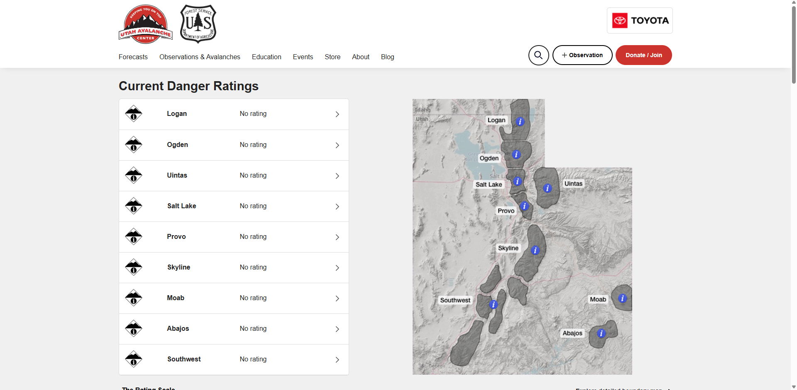
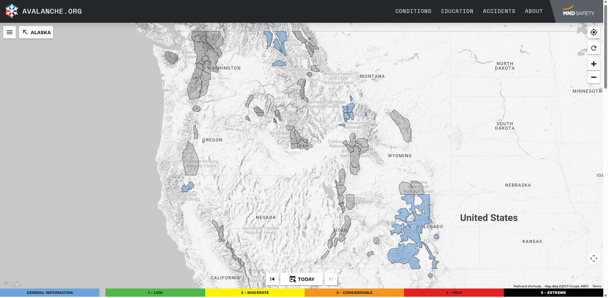
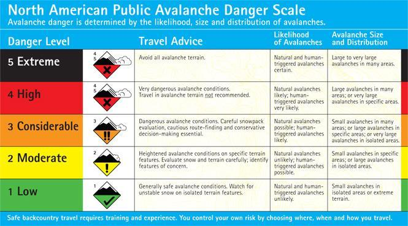
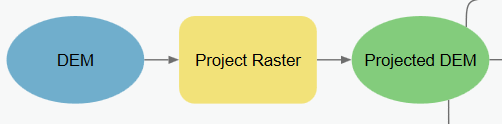
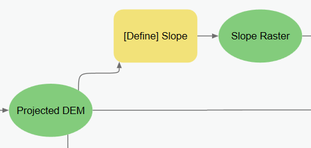
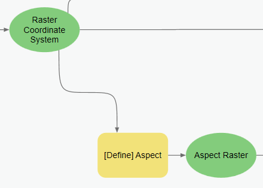
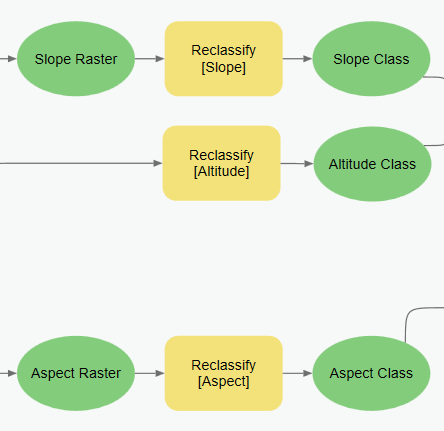
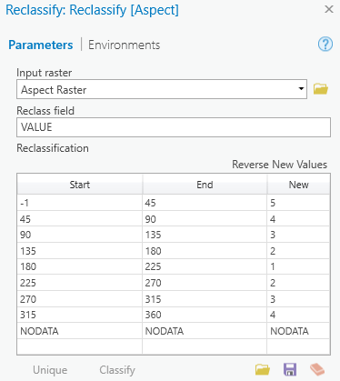

# Lab 6: Avalanche Hazard

**Civil Engineering 414 — Engineering Applications of GIS**

Fall 2026 · Dr. Dan Ames

> [!WARNING]
> **This is a classroom exercise, not an avalanche safety product.** The map you build here is a
> terrain-based screening of slope, aspect, and elevation, produced for the purpose of learning
> raster analysis and ModelBuilder. It does not account for snowpack, weather, wind loading,
> recent avalanche activity, or human triggering, and it is **not suitable for operational
> avalanche safety decisions**. For real trip planning, use the current advisory from the
> responsible avalanche center.

<!-- TODO(instructor): the recommended plan asks that the lab's output be renamed
     "terrain-based avalanche susceptibility screening" (rather than "avalanche hazard" /
     "avalanche risk"). Renaming the lab and its deliverables is an instructor decision, so the
     original wording is kept throughout this page. -->

## Background

An avalanche is defined as a large mass of snow, ice, earth, rock, or other material in swift motion down a mountainside or over a precipice (Webster, 2012). The possibility of an avalanche occurring is a risk that outdoor adventurers take every time they venture into the backwoods during the winter. Numerous avalanche risk centers operate extensive programs every winter to help analyze and predict avalanche hazard. These avalanche centers typically assess risk in terms of terrain variables combined with climate/weather conditions. Based on these factors, it is possible to create a map showing areas that fall under specific risk categories. This exercise involves creating an ArcGIS Pro ModelBuilder model that takes risk categories as input factors and generates an output map highlighting areas based on an established risk coloring scheme. See the Utah Avalanche Center website here: [https://utahavalanchecenter.org/](https://utahavalanchecenter.org/).

<!-- TODO(instructor): the recommended plan asks that this section define and distinguish
     susceptibility, hazard, exposure, vulnerability, and risk, which the handout currently uses
     interchangeably. That is a content/pedagogy change, so it is flagged rather than written. -->



**Figure 1.** A sample advisory: the Utah Avalanche Center home page, listing the current danger rating for each forecast region.

## Problem Statement

Winter backwoods adventures can include awesome activities such as cross-country skiing, snowshoeing, and snowmobiling. It is a common pastime for many people in mountainous areas, including Utah, Idaho, and Wyoming. There are specific risks to these activities, such as hypothermia and getting caught in an avalanche. In the world, more than 150 people are killed per year by an avalanche (National Geographic). Backwoods enthusiasts need to be aware of the potential avalanche hazard in the area they are going to visit. They also need to know that avalanche hazard is continually changing due to weather and ground conditions.

<!-- VERIFY: the "more than 150 people per year" figure above is attributed only to "National
     Geographic", with no citation, year, or link, and National Geographic does not appear in the
     References section. Kept verbatim. -->

Avalanche information centers such as the Northwest Weather and Avalanche Center and the Sawtooth National Forest Avalanche Center publish advisories throughout the avalanche season to help warn people about avalanche-prone areas. The American Avalanche Association describes avalanche hazards and provides safety information for North America. They provide a "North American Danger Scale" which describes the likelihood of an avalanche occurring and the expected size of the avalanche (see Figure 3).

- Northwest Avalanche Center: [https://nwac.us/get-the-forecast/](https://nwac.us/get-the-forecast/)
- Wyoming State Trails avalanche map: [http://www.jhavalanche.org/statetrailmaps/index.php](http://www.jhavalanche.org/statetrailmaps/index.php)
- American Avalanche Association: [http://www.avalanche.org/](http://www.avalanche.org/)

<!-- VERIFY: the Word original labeled the jhavalanche.org URL above "Sawtooth Avalanche Center",
     but the same URL is described later in the handout as the Wyoming State Trails Website, so
     the label was corrected to match the handout's own description. No URL for the Sawtooth
     Avalanche Center appears in this list in the original; the References section gives one. -->



**Figure 2.** A second sample advisory: the avalanche.org current-conditions map, with the five danger levels shown in the legend.

It should be relatively clear from these sample advisories (Figures 1 and 2) that it is possible to identify the rough aspect, slope, and elevation associated with the various warning levels. Note that not every advisory includes every hazard level. Nor does each advisory provide information on the full range of terrain factors that influence avalanche potential. Most avalanche advisory sites give tabular data only. However, some sites are beginning to show maps of avalanche hazard areas, such as the Wyoming State Trails Website: [http://www.jhavalanche.org/statetrailmaps/index.php](http://www.jhavalanche.org/statetrailmaps/index.php)

In this lab, you will use ArcGIS Pro ModelBuilder to develop a model that is flexible enough to generate any hazard level for any combination of terrain parameters in any location. Your approach should include calculating slope and aspect for the input digital elevation model (DEM); then using a Raster Calculator to return only those cells that meet the specified requirements. You will then create a map from the output to show the locations that have avalanche hazard, the degree of the hazard (i.e., low to extreme), and the corresponding color as described by the American Avalanche Association. The North American Danger Scale describes the danger levels, ranging from low to extreme, for the United States and Canada. It can be found on several avalanche awareness websites, including the American Avalanche Association's website.



**Figure 3.** Table showing the different hazards and other stats on avalanches.

## Spatial Considerations

Many factors contribute to avalanches. However, it is generally accepted that terrain is the most significant factor. For this project, you will assume that this set of terrain factors is reduced to a three-parameter set called the "three A's of avalanches." Altitude, slope, and aspect.

<!-- TODO(instructor): the recommended plan asks for an explicit statement here of the dynamic
     variables this model omits — snowpack structure and stability, weather, wind loading, and
     triggering (natural and human). The handout mentions weather only in passing, and adding a
     substantive discussion changes the content, so it is flagged rather than written. -->

Altitude refers to the elevation above mean sea level. Generally, higher altitudes tend to have a greater avalanche risk. Angle refers to the slope of the terrain. As one would expect, higher slopes tend to have a higher risk of an avalanche. This factor is also known as steepness. Aspect, or direction, refers to the compass direction the slope is facing. As noted above, shady slopes with north and northeastern aspects tend to have a greater risk of avalanches. The key terrain hazard factors for an avalanche are as follows:

- **Slope:** The constrained distribution of slope in degrees (values must fall within the range 0 to 90 degrees). Slopes under 25 degrees and over 60 degrees typically have a low avalanche risk because of the angle of repose for snow. Snow does not accumulate significantly on steep slopes and does not easily flow on flat slopes. Distribution of avalanches by slope has a sharp peak between 35 to 45 degrees. That peak hazard lies at around 38 degrees. Unfortunately, the steepest slopes are favored for skiing. (Clark et al. 2002, p 11)
- **Aspect:** The constrained distribution of Aspect is a constrained circular distribution (values go from 0 to 360 and then back to 0 degrees). The three primary variables that influence snowpack evolution are temperature, precipitation, and wind. In medium latitudes of the Northern Hemisphere, more accidents occur on shady slopes with northern and northeastern aspects. Slopes in the lee of the wind accumulate more snow, presenting locally deep areas and wind slabs. Cornices also accumulate on the downwind side of ridges and can contribute to avalanche danger. (Clark et al. 2002, p 11)
- **Profile:** Convex slopes are statistically more dangerous than concave slopes. The reasons lie partly in human behavior and the tensile strength of snow layers compared to their compression strength.
- **Surface:** Full-depth avalanches are more common on slopes with smooth ground cover, such as grass or a rock slab. Vegetation coverage is important for anchoring the snowpack; however, boulders or buried vegetation may create weak areas within the snowpack.

<!-- VERIFY: "Clark et al. 2002, p 11" is cited twice above but does not appear in the References
     section. The full citation could not be reconstructed, so the in-text citation is kept as
     written. -->

|  | Altitude (meters) | Slope (degrees) | Aspect (degrees) |
| --- | --- | --- | --- |
| Low (1) | 0 – 2200 | -1 – 25<br>60 – 90 | 180 – 225 |
| Moderate (2) | 2200 – 2400 | 25 – 30<br>55 – 60 | 135 – 180<br>225 – 270 |
| Considerable (3) | 2400 – 2600 | 30 – 32<br>50 – 55 | 90 – 135<br>270 – 315 |
| High (4) | 2600 – 2800 | 32 – 35<br>45 – 50 | 315 – 360<br>45 – 90 |
| Extreme (5) | 2800 – 10000 | 35 – 45 | -1 – 45 |

**Table 1.** The ratings on the left should be applied to the different altitudes, slopes, and aspects.

<!-- VERIFY: the Low slope range begins at -1. Slope output from the Slope tool is 0-90 degrees;
     -1 is the flat-aspect NoData-style code used by the Aspect tool, not a slope value. The
     threshold is left exactly as the instructor wrote it. -->

Table 1 is an example of avalanche risk hazard ranges for the altitude, slope, and aspect of the terrain. These values were obtained from an actual avalanche advisory posted on the Sawtooth National Forest Avalanche website.

## Data

Avalanche Risk Values: The numeric ranges of aspect, elevation, and slope associated with low, moderate, considerable, high, and extreme avalanche risk are generally posted on specific avalanche center websites and are updated daily throughout the avalanche season. The values shown in Table 1 were extracted from the Sawtooth National Forest Avalanche website and will be used for this laboratory exercise.

- **National Elevation Dataset:** [http://gis.utah.gov/data/elevation-terrain-data/10-30-meter-elevation-models-usgs-ned/](http://gis.utah.gov/data/elevation-terrain-data/10-30-meter-elevation-models-usgs-ned/)
    - Download the elevation dataset for Utah provided by the USGS. You should either download the 10 m or 30 m NED for Salt Lake County using any of the methods on the page. The Snowbird Ski Resort is in Salt Lake County.
    - Download data for another ski resort area of your choosing. It can be in Utah or another state.
- **Utah Ski Area Boundaries:** [http://gis.utah.gov/data/recreation/ski-areas/](http://gis.utah.gov/data/recreation/ski-areas/)
    - Download the boundaries (or locations) for this exercise. Use the Utah Ski Area Boundaries link to find and download the shapefile.

## ModelBuilder Tools

You will use the following new tools in this exercise, along with tools from previous labs:

- **Project:** Changes the projection of the input feature class, layer, or raster to one you define.
- **Slope:** Identifies the slope of each cell within a raster and creates a new raster.
- **Aspect:** Identifies the aspect of the steepest slope in each cell within a raster and creates a new raster.
- **Times:** Takes input rasters and multiplies cell values where they overlap.

<!-- VERIFY: Step 1 and the example model both use Project Raster, which is the raster tool;
     Project operates on feature classes. The tool list is left as the instructor wrote it. -->

## Example Model


**Figure 4.** The complete example model, from the input DEM through Project Raster, Slope, Aspect, three Reclassify operations, and the Raster Calculator that produces the Hazard Zones output.

## Complete the Lab

For an advanced GIS student, the information up to this point is all you need to complete the assignment and create an output map from the results. Feel free to try conducting the analysis using only the information provided above. If you need extra help, follow the step-by-step solution below. Make sure to conduct the lab for 2 study areas. Also, make sure to read Step 5 and Step 6 and the deliverables section because you need to make three maps using two methods.

> [!TIP]
> If you complete the lab only using the information provided above (without using the
> step-by-step instructions below), make sure to indicate this in your lab report to be
> considered for extra credit.

## Step-by-Step Solution

You will notice in the example ModelBuilder model that there are groupings of functions. This is done to illustrate the separate considerations that were given in the instructions; specifically, altitude, slope, and aspect. The parameters are classified into ranges that correspond to the five avalanche hazards described. The last step is combining the three raster layers into one output raster, indicating each of the individual avalanche hazards.

### Step 1

Use the Project Raster tool to transform the raster to the NAD 1983 projection. This will result in a new raster layer, assuming it is not already in that projection. This will ensure that all DEMs are projected into NAD 1983 for future projects as well.

<!-- VERIFY: "NAD 1983" names a datum, not a projection. Slope and Aspect need a projected
     coordinate system with linear units (and z-units matching x/y units) to return correct
     degrees. The specific projected CRS the instructor intends is not stated anywhere in the
     handout, so nothing has been substituted. -->



**Figure 5.** Using the Project Raster tool in ModelBuilder.

### Step 2

Use the Slope tool to calculate the slope of the projected raster layer from Step 1.



**Figure 6.** Using the Slope tool in ModelBuilder.

### Step 3

Use the Aspect tool to calculate the aspect of the projected raster layer from Step 1.

> [!NOTE]
> Flat aspects are given the value of **-1**. Remember this when you use the Reclassify tool.



**Figure 7.** Using the Aspect tool in ModelBuilder.

<!-- VERIFY: in this screenshot the upstream variable is labeled "Raster Coordinate System", while
     the same variable is labeled "Projected DEM" in Figure 4. The two captures appear to come
     from different versions of the model. Screenshot not re-shot for this migration. -->

### Step 4

Use the Reclassify tool to reclassify the different values that are required for the parameters in Table 1. Note that different ranges can be reclassified to the same new value. An example of this is shown in Figure 9.



**Figure 8.** Using the Reclassify tool on the Aspect, Slope, and Elevation rasters.



**Figure 9.** The Reclassify window for Aspect.

Add and edit the rows directly in the table. Enter the previous ranges given in Table 1 and then insert the values associated with their appropriate hazard level.

### Step 5

Use the Raster Calculator tool to combine the classification layers to create a map of the different hazard levels. There are multiple ways you can combine these raster layers to identify the hazard areas. One option would be to use a series of "con" statements (similar to "if then" statements in programming) to identify areas that meet specific classes. For example, the code below in Raster Calculator will mark all areas that meet class "1" in slope, aspect, and altitude as "1". And all areas that meet class "2" would be marked as class "2". Try using this expression in the Raster Calculator and explore the results. Make sure to label your risk zones and follow the symbology on Table 1 for the risk levels Low, Moderate, Considerable, High, and Extreme. Explore your mapped results. Are these results realistic? What is the problem with these results? Please include this map in your report and an explanation, in your own words, of the problem with this map. (Hint… what about an area that is class 5 warning on elevation, class 5 on slope, and class 4 on aspect? What would it be marked as in your final map?)

```
Con(("%Altitude Class%" == 1) & ("%Slope Class%" == 1) & ("%Aspect Class%" == 1), 1, Con(("%Altitude Class%" == 2) & ("%Slope Class%" == 2) & ("%Aspect Class%" == 2), 2, Con(("%Altitude Class%" == 3) & ("%Slope Class%" == 3) & ("%Aspect Class%" == 3), 3, Con(("%Altitude Class%" == 4) & ("%Slope Class%" == 4) & ("%Aspect Class%" == 4), 4, Con(("%Altitude Class%" == 5) & ("%Slope Class%" == 5) & ("%Aspect Class%" == 5), 5, 0)))))
```


**Figure 10.** Raster Calculator window in ModelBuilder.

Check the Parameter and Add to Display options on the Hazard Level raster layer.

### Step 6

Use the Raster Calculator again, but with a different calculation that will give more realistic or reliable results. Specifically, what if you multiply all of the classes together? Then your final range would be 0 to 125 (i.e., the highest risk areas would be class 5 slope, class 5 elevation, and class 5 aspect = 5 × 5 × 5 = 125). The problem with this approach is that now you have 125 results. But this is better because the 5,5,4 class will appear on your map as risk 100, which is much better than a map that shows it as risk 0. Does that make sense? Run this "multiply the values" calculation in Raster Calculator and then, in your risk map, divide the ranges 0-125 into five categories, Low, Moderate, Considerable, High, and Extreme, and apply the correct symbology (based on Table 1). Make a map of these results and include it in your report. Identify areas in your second map that show significantly different results than in your first map. Discuss why these differences exist and which results you are more confident in, and why.

<!-- TODO(instructor): the recommended plan asks for a validation/reflection step here — compare
     the model output against published avalanche-terrain information (for example a forecast
     center's terrain or avalanche-path mapping for the same area) and discuss where and why they
     disagree. Adding a task changes the deliverables, so it is flagged rather than written. -->

## Deliverables

For the Snowbird Ski Resort near Alta, Utah, construct a ModelBuilder model that prepares all your input data for a terrain analysis, conducts the analysis, and creates a map showing the avalanche hazard levels. Use the colors shown in Table 1 to symbolize the raster cells. You will need to prepare the map coloring/symbology outside of ModelBuilder. Assign the legend with the appropriate labels from Table 1. Include the legend on your map, labeling the levels from low to high, rather than using numbers. Duplicate these results for a second Ski Resort area of your choosing.

Your project report should show 3 maps:

1. A map of Snowbird, showing the "con statement method" results where we only color areas that specifically meet specific criteria,
2. A map of Snowbird showing the "multiply method" where we multiply the risk values to get a range of 1-125 and then reclassify these in the symbology tab.
3. A map of an area of your choosing where you use the multiply method to identify the risk areas in this newly selected area.

Write a brief report that presents your final model and clearly shows all elements of the model. Describe the steps and tools in your model and display your final map. Include any changes you made to the reclassifications or analysis and why you chose those methods. Make sure to review the rubric at the end of this chapter for the full requirements for the laboratory exercise.

## References

American Avalanche Association website: (http://www.avalanche.org/, 2011).

Northwest Weather and Avalanche Center (http://www.nwac.us/, 2011)

Sawtooth National Forest Avalanche Center: (http://www.sawtoothavalanche.com/index.html, 2011)

Wikipedia: (http://en.wikipedia.org/wiki/Avalanche, 2011)

Merriam-Webster Dictionary: (http://www.merriam-webster.com/dictionary/avalanche, 2012).

<!-- TODO(instructor): the recommended plan asks that these references be updated (they are dated
     2011-2012) and that the lab point students at a current avalanche-information authority.
     The existing links were tested during migration: the Sawtooth "/index.html" page now returns
     404, though the site root responds; the others resolve. No links were added or replaced,
     since choosing the authority to cite is an instructor decision. -->

## Example Map

> [!NOTE]
> This is an example of the "con statement method" from Step 5. This is the first of 3 maps you
> will produce in this lab. Remember that this is **not** a great result, and we would not want to
> share this with the public. Read Step 5 and Step 6 carefully and generate all three requested
> maps (2 for Snowbird and one for an area of your choosing).


**Figure 11.** Example output map for the Snowbird area using the con statement method.

## Rubric for Mapping Avalanche Risk using Slope, Aspect, Elevation

| Item | Points |
| --- | --- |
| Assignment Title, Name, Date, Course, Summary of the requirements of the project | /5 |
| Show and describe your model:<br>List each of the tools used<br>List tool settings applied for the analysis (could someone repeat the assignment using your lab report?)<br>List all input, intermediate, and output datasets<br>Describe each input dataset, including type (point, line, polygon, raster) and the source of the data<br>Describe each output dataset (point, line, polygon, raster)<br>Model is shown on one full page (8.5 × 11)<br>All text is readable (10 pt. font minimum)<br>All tools and data sets are shown<br>Show a Toolbox User Interface for your model that allows a user to select any input DEM and run the Avalanche analysis. | /10 |
| Discussion of Results:<br>Carefully read Step 5, Step 6, and the Deliverables section and make sure to show and discuss the 3 requested maps.<br>Discuss the two methods we used and answer the questions posed in those sections.<br>Is there a third possible way to combine aspect, slope, and elevation classes? We tried identifying unique areas with con statements and multiplying the risk areas, but what other options could we use? | /5 |
| Make THREE full-page (8.5 × 11) maps showing the results as requested in Step 5, Step 6, and the deliverables section. Be sure to include all of the map elements and standard map design techniques learned in class so far.<br>Map 1: Snowbird area using the con statement classification approach<br>Map 2: Snowbird area using the "multiply classes" method (make sure to classify your final results using symbology as shown in Table 1)<br>Map 3: Your selected study area, using the "multiply classes" method. | /30<br>(10/map) |
| Self-assessment | /50 |

<!-- TODO(instructor): the four scored rows above sum to exactly 50 (5 + 10 + 5 + 30), which
     matches the "/50" on the last row — so that row reads as the assignment total rather than a
     separately scored "Self-assessment" item. If self-assessment is meant to be scored on its
     own, the lab is worth 100 and a total row is missing. Point values were not changed. -->

<!-- Migration notes (2026-09-03): CROP (2026-09-03): the two browser captures (Figures 1 and 2) had the Chrome tab strip and address bar removed (they showed the capturing user's other open tabs and profile avatar); the page content is unchanged.
     source: /Users/dan/ames-sync/Work/Teaching/CE 414 Engineering Applications of GIS/Labs/Lab 6 - Avalanche Hazard.docx
     (Word title: "Lab 6 – Mapping Avalanche Risk using Slope, Aspect, and Elevation"; the page
     header follows the site-wide "Lab 6: Avalanche Hazard" pattern and the full descriptive title
     is preserved in the rubric heading.)
     ArcGIS Pro version verified against: NOT VERIFIED in this migration.
     images renamed from fig-NN:
       fig-01.png  -> lab06-utah-avalanche-center-ratings.png
       fig-02.png  -> lab06-avalanche-org-danger-map.png
       fig-03.jpeg -> lab06-north-american-danger-scale.jpeg
       fig-04.png  -> lab06-example-model-overview.png
       fig-05.png  -> lab06-model-project-raster.png
       fig-06.png  -> lab06-model-slope.png
       fig-07.png  -> lab06-model-aspect.png
       fig-08.png  -> lab06-model-reclassify-three.png
       fig-09.png  -> lab06-reclassify-aspect-window.png
       fig-10.png  -> lab06-raster-calculator-con.png
       fig-11.png  -> lab06-example-map-snowbird.png
     (Two further images in the .docx are header logos, referenced only from header1.xml, and were
     not extracted. Nothing in the body text refers to them.)
     figure renumbering: all 11 body images are now numbered in document order. Source captions
     Figure 1-7 map to Figures 3, 5, 6, 7, 8, 9, 10; Figures 1, 2, 4 and 11 are newly captioned
     images that the Word original left uncaptioned. In-text cross references were updated:
     "(see Figure 1)" -> "(see Figure 3)" and "shown in Figure 6" -> "shown in Figure 9".
     stale/unverified screenshots: Figure 7 (model-aspect) shows the upstream variable as "Raster
     Coordinate System" while Figure 4 shows "Projected DEM" — captures appear to be from
     different model versions. Figures 1 and 2 are live-website captures and will drift as those
     sites change. Figure 11 is a student example carrying placeholder text ("Avalanche Lab /
     Date / Projection"). No screenshot was re-shot or altered.
     TODO(instructor): rename output to "terrain-based avalanche susceptibility screening";
     define susceptibility vs hazard vs exposure vs vulnerability vs risk; state the dynamic
     variables the model omits (snowpack, weather, wind loading, triggering); add a
     validation/reflection comparison against published avalanche-terrain information; update the
     2011-2012 references and point at a current avalanche-information authority; resolve whether
     the rubric's "/50" row is the total or a separately scored self-assessment.
     VERIFY: "more than 150 people killed per year (National Geographic)" is uncited; "Clark et
     al. 2002, p 11" is cited twice but missing from References; Table 1's Low slope range starts
     at -1 although slope is 0-90; Step 1 calls NAD 1983 a "projection" and no projected CRS is
     specified; the ModelBuilder Tools list names "Project" while the steps use "Project Raster".
     dead/redirected links:
       http://www.sawtoothavalanche.com/index.html -> 404 (site root https://www.sawtoothavalanche.com/ returns 200)
       http://gis.utah.gov/data/elevation-terrain-data/10-30-meter-elevation-models-usgs-ned/ -> 200 but redirects to https://gis.utah.gov/products/sgid/elevation/
       http://gis.utah.gov/data/recreation/ski-areas/ -> 200 but redirects to https://gis.utah.gov/products/sgid/recreation/ski-areas/
       http://www.avalanche.org/ -> 200, redirects to https://avalanche.org/
       http://www.nwac.us/ -> 200, redirects to https://nwac.us/
       http://en.wikipedia.org/wiki/Avalanche -> 200, redirects to https
       https://utahavalanchecenter.org/ and http://www.merriam-webster.com/dictionary/avalanche
         -> 403 to curl (bot protection); both appear live in a browser
       http://www.jhavalanche.org/statetrailmaps/index.php -> 200 with a browser user agent;
         a plain HEAD request returns 406 and redirects to https://bridgertetonavalanchecenter.org/
       https://nwac.us/get-the-forecast/ -> 200
     No source paragraph or table was dropped. -->
