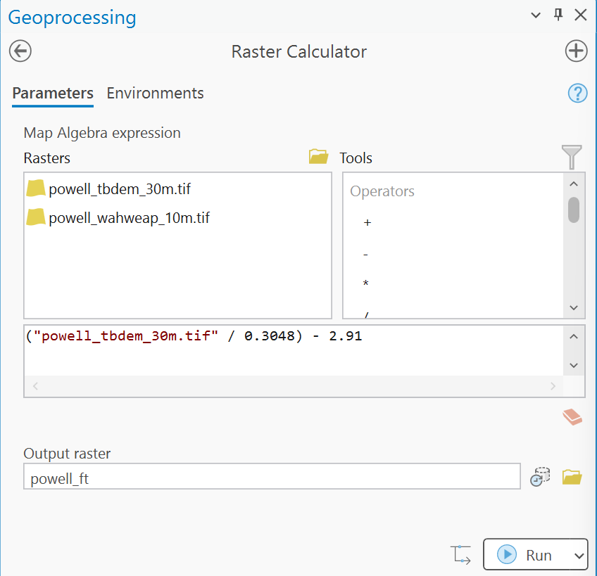
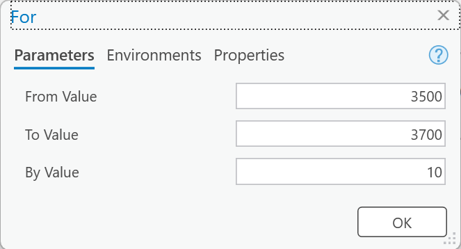
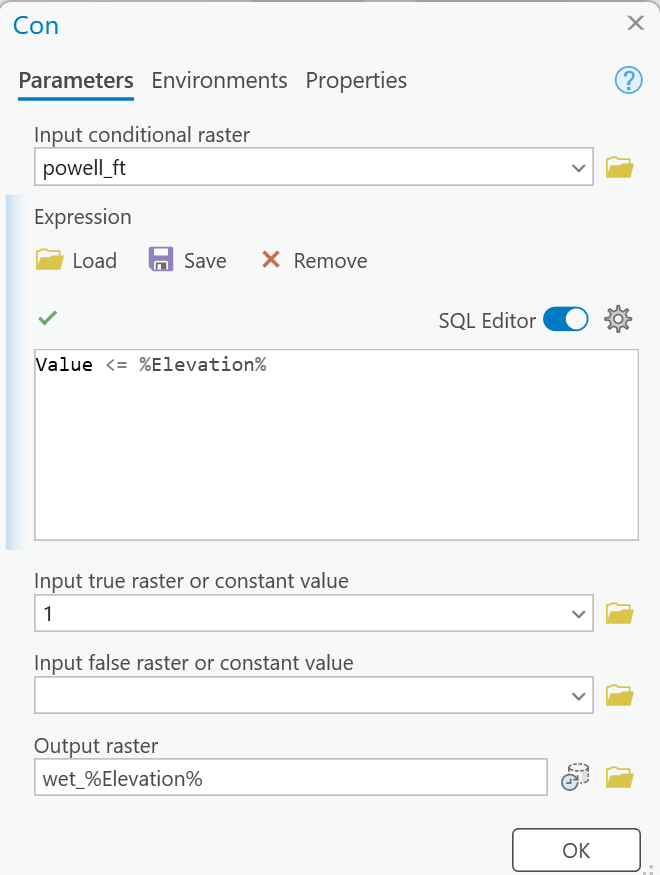
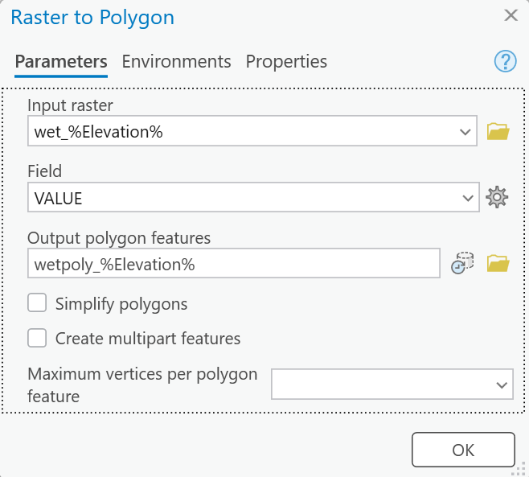
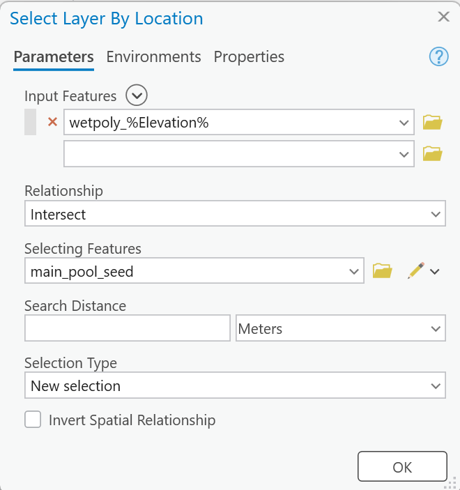
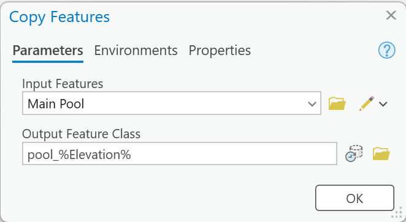
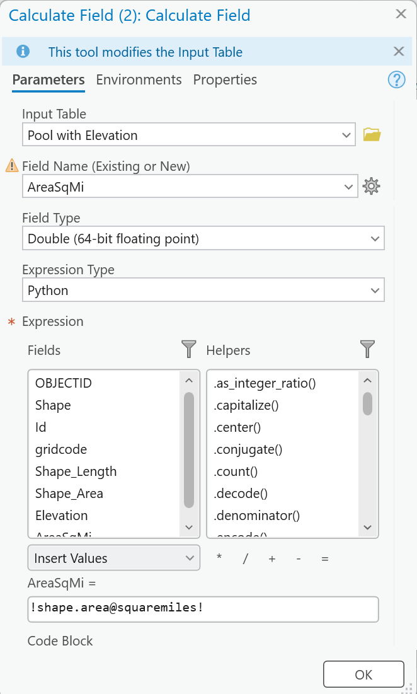
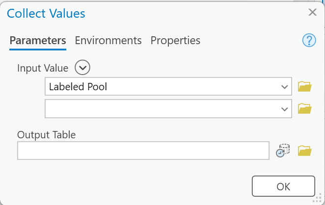
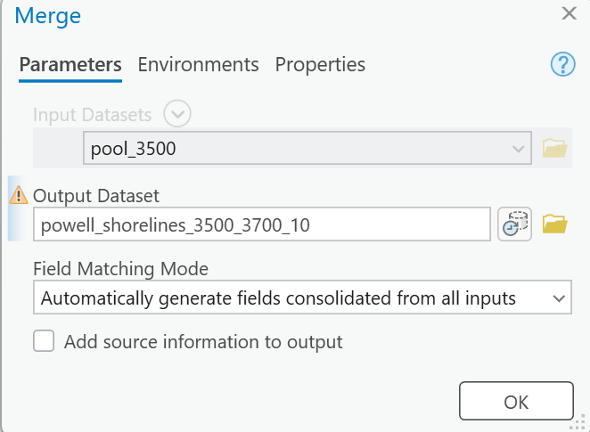
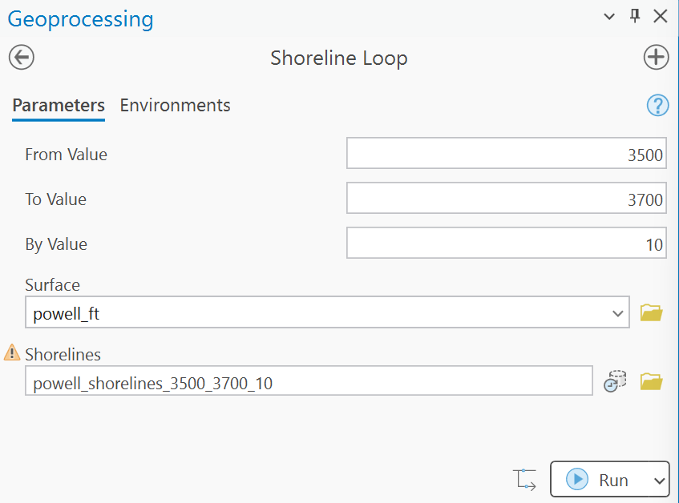

# Lab 6: Lake Depth Explorer

**Civil Engineering 414 — Engineering Applications of GIS**

Fall 2026 · Dr. Dan Ames

*Shorelines at Every Water Level — Looping in ModelBuilder, at Lake Powell*

<!-- **Revision notes.** Created September 8, 2026, as a placeholder for a new lab (no Word source).
Rewritten October 1, 2026, for Lake Powell from the instructor's Lab 6 package (built on the Mac,
CE414_Lab06_Package.zip): the student draft, the data package, and the check values. The analysis
was reproduced in arcpy on the Windows build machine (tools/lab06/run_model.py): every published
check value matches the package to 0.01 sq mi. The model was then built in the ArcGIS Pro 3.7.1
GUI on October 1-2, 2026 (C:\Ames\Lab06GUI\Lab06.aprx, model ShorelineLoop, at 175 % scaling):
it reproduced every check value exactly, every dialog on this page is a capture from that build,
and Figure C is its ModelBuilder export. See the migration notes at the bottom. -->

> [!TIP]
> **Start from the report template.** [`lab06-report-template.docx`](lab06-report-template.docx)
> has the title block, a section for every deliverable, the tables already set up with the columns
> the rubric asks for (including the shore-feature table and the range-and-step table), and the
> rubric at the end ready to fill in. Open it in Word or upload it to Google Docs, replace every
> gray italic prompt, and delete the prompts as you go. You are welcome to write your report any
> way you like — the template is a floor, not a ceiling — but if you use it and fill in every
> section, you will not have left a graded item out.

## Background

A reservoir is a valley with a dam across it, and the lake behind the dam is not one shape. It is a
different shape at every water-surface elevation. As the lake rises it spreads up side canyons and
across benches. As it drops it retreats to the old river channel, leaving boat ramps, marinas, and
water intakes stranded above the water line. Anyone who plans around a reservoir needs to know where
the shoreline will be at the elevation the lake is *going* to be, not where it is today: an engineer
sizing an intake, a park service deciding which ramp to extend, a houseboat owner deciding whether
to renew a slip.

Lake Powell is the clearest case in the country right now. It filled for the first time in 1980 and
reached its all-time high of **3,708.34 ft on July 14, 1983**. On **September 15, 2026** it set a
new record low of **3,516.62 ft**, below the April 2023 low of 3,519.92 ft — a drop of 192 feet from
the high. Over that range the lake lost more than half of its surface area, and one launch ramp
after another went dry.

The instructor built a web map that answers exactly this question for Lake Powell. Spend five
minutes with the [Lake Powell Depth Explorer](https://lakepowell.hydromap.com){ target="_blank" }
before reading further: drag the water level and watch the shoreline move. Every shoreline there is
the output of the same analysis you will build in this lab.

The analysis is simple. The lake bed is an elevation surface, and the shoreline at any water-surface
elevation is the line where that surface equals that elevation. Everything below is wet; everything
above is dry. What makes the problem interesting for a modeler is that nobody wants *one* shoreline.
They want a dozen, at regular intervals, from one run. Every lab so far built a model that runs once
and produces one answer. This lab builds a model that **loops**: it takes a list of water-surface
elevations, runs the same tools for each one, and collects the results into one dataset with the
elevation recorded on every shoreline. Once you have seen that pattern you will find it everywhere,
because most real analyses are one analysis repeated over a list of something.

Like every model, this one is only as good as the choices you make in it: which elevation surface,
in which vertical datum, at what cell size, over what range of elevations, and at what step. In
Step 7 you will vary the range and the step, see how far the shorelines and their areas move, and
use what moves to say how much the answer depends on those choices.

> [!IMPORTANT]
> **Your job — see the deliverables below.** Build one ModelBuilder model that loops over a list of
> water-surface elevations and produces a shoreline polygon for each, with the elevation stored as
> an attribute. Run it on Lake Powell, test the elevation range and step, find the elevation at
> which named shore features go dry, and make two maps of the nested shorelines.

## Problem Statement

You are given one elevation surface for the Lake Powell basin. It merges the lake bed, mapped by a
boat-mounted multibeam sonar survey in 2017, with the land around it, mapped by airborne lidar and
older topography. Using that surface:

1. Produce the shoreline of the lake at every water-surface elevation from **3,500 ft to 3,700 ft
   at a 10 ft step**, all in one polygon feature class, with the elevation of each stored in an
   `Elevation` field.
2. Report the surface area of the lake at each elevation.
3. Map the nested shorelines.
4. Identify the elevation at which at least three named shore features go dry — for example a
   launch ramp, a marina, and the dam's intakes.

## Analysis Considerations

Every one of these is a decision somebody made, and every one of them can change the answer.

- **The elevation surface.** The USGS *One Meter Topobathymetric Digital Elevation Model for Lake
  Powell, 1947–2018*. It merges 2017 multibeam sonar, 2018 lidar, and older topography (some of it
  mapped before the dam closed in 1963) into one raster. Where the surveys meet there can be a
  seam. The original is 1 m and about 3 GB; you get a 30 m version in which each cell is the
  average of the 900 one-meter cells inside it.
- **The vertical datum and units.** The surface is in **meters above NAVD88**, the modern North
  American datum. Reclamation reports Lake Powell's level, and states every operating threshold, in
  **feet above NGVD29**, the older datum the dam was built on. At Lake Powell the two differ by
  2.91 ft. If the surface and your elevation list are in different units or datums, every shoreline
  is wrong by a constant, and nothing in ArcGIS Pro will tell you. Step 1 converts the surface so
  the two match.
- **The water-surface range and step.** The default run is 3,500–3,700 ft at 10 ft: from just below
  this fall's record low to full pool. **Full pool** is 3,700 ft; **minimum power pool**, below
  which the dam cannot generate electricity, is 3,490 ft; **dead pool**, below which no water can
  leave through the dam's outlets, is 3,370 ft. The range and step are model parameters, and Step 7
  varies them.
- **Cell size.** A shoreline is only as fine as the surface's cells. A 30 m cell is wider than many
  of Lake Powell's side canyons, so narrow arms of the lake disappear or break apart at this
  resolution. A 10 m close-up of the south end of the lake is included so you can see the
  difference.
- **The coordinate system.** Area is reported for every shoreline, so the model must run in a
  projected coordinate system. The surface arrives in **NAD 1983 (2011) UTM zone 12N**, in meters,
  which is appropriate. Keep it.
- **What counts as the lake.** At any elevation some cells below the water surface lie in closed
  hollows that would never fill — potholes on the slickrock benches, pits in the surface. The
  analysis keeps only the water connected to the main pool at the dam. Step 4 is where that
  decision lives, and your report says what it excluded.

## Data

> [!IMPORTANT]
> **Set up your folder before you download anything.** On the lab machines, work on the **D:
> drive**: one folder for this class named after you, `D:\Smith\`, and one folder per lab inside
> it, `D:\Smith\Lab06\`. The **C: drive is locked**, and a **network drive** is slow enough to make
> ArcGIS Pro hang. **Never use a space** in a folder or file name you create — raster tools fail on
> them without saying why. **Back up your lab folder at the end of every session.** The full set of
> conventions is on the [ArcGIS Tips and Reminders](../../arcgis-tips.md){ target="_blank" } page.

- **Download:** [`lab06-powell-data.zip`](../../data/lab06-powell-data.zip) (5.3 MB). Unzip it into
  your Lab06 folder, and read `READ-ME-FIRST.txt`.

| File | What it is |
| --- | --- |
| `powell_tbdem_30m.tif` | The whole lake, 30 m cells, elevation in **meters NAVD88**. Your main input. |
| `powell_wahweap_10m.tif` | The south end of the lake — Glen Canyon Dam, Wahweap, Lone Rock, Antelope Point — at 10 m, **meters NAVD88**. Use it for the optional cell-size comparison at the end of Step 7. |
| `main_pool_seed.shp` | One point in the old river channel about 2.1 km upstream of Glen Canyon Dam, under water at every elevation in this lab. It is how your model knows which water is "the lake." |
| `powell_elevation_usbr.csv` | Reclamation's daily Lake Powell water-surface elevation, December 28, 1963 to September 30, 2026, in **feet NGVD29**. Recent values are provisional. |
| `READ-ME-FIRST.txt` | Sources, processing, datums, and the credit line for your maps. |

> [!TIP]
> **Check the data:** `powell_tbdem_30m.tif` is **4,340 columns × 4,331 rows of 30 m cells**, values
> **955.69 to 1,440.73** (meters), NAD 1983 (2011) UTM zone 12N, NoData −9999. Most of the grid is
> NoData: the surveyed area hugs the canyon. `powell_wahweap_10m.tif` is **1,701 × 1,878 cells of
> 10 m**, **954.77 to 1,318.34** m.

Basemaps and imagery come from ArcGIS Online; you do not download them.

### Shore features you create

Choose at least three named features on the shore and digitize a point for each — a launch ramp, a
marina, the dam, a landmark. Give the layer a `Name` field and an `Elevation` field, and fill
`Elevation` with the surface elevation at the point, in feet NGVD29, from your converted surface in
Step 1. For a launch ramp the elevation that matters is the **bottom (toe)** of the ramp: find it on
the imagery and the surface, and do not click the parking lot. State in your report how you chose
your features.

The National Park Service publishes the elevation below which each Lake Powell ramp is unusable,
on its [Changing Lake Levels](https://www.nps.gov/glca/learn/changing-lake-levels.htm){ target="_blank" }
page. Compare your elevations with theirs; expect yours to come out within a few feet, because the
Park Service's cutoff includes a depth margin for launching.

## ModelBuilder Tools

New in this lab:

| Tool | What it does |
| --- | --- |
| **For** (ModelBuilder ▸ Iterators) | The loop. Given a *From* value, a *To* value, and a *By* step, it runs everything downstream once per value and hands the current value to those tools as a variable. [Tool reference](https://pro.arcgis.com/en/pro-app/latest/tool-reference/modelbuilder-toolbox/for.htm){ target="_blank" } |
| **Inline variable substitution** | Writing `%Elevation%` in a tool's expression or output name inserts the current loop value, so each iteration computes and names its own result. [Help page](https://pro.arcgis.com/en/pro-app/latest/help/analysis/geoprocessing/modelbuilder/inline-variable-substitution.htm){ target="_blank" } |
| **Con** (Spatial Analyst) | Cell-by-cell *if*: where the surface is at or below the current elevation, 1; elsewhere, NoData. The wet cells at one water level. [Tool reference](https://pro.arcgis.com/en/pro-app/latest/tool-reference/spatial-analyst/con-.htm){ target="_blank" } |
| **Raster to Polygon** (Conversion) | Turns the wet cells into polygons whose boundaries are shorelines. [Tool reference](https://pro.arcgis.com/en/pro-app/latest/tool-reference/conversion/raster-to-polygon.htm){ target="_blank" } |
| **Select Layer By Location** (Data Management) | Keeps only the polygon that contains the seed point: the main pool. [Tool reference](https://pro.arcgis.com/en/pro-app/latest/tool-reference/data-management/select-layer-by-location.htm){ target="_blank" } |
| **Collect Values** (ModelBuilder ▸ Utilities) | Gathers the output of every iteration into one list for a tool after the loop. [Tool reference](https://pro.arcgis.com/en/pro-app/latest/tool-reference/modelbuilder-toolbox/collect-values.htm){ target="_blank" } |
| **Merge** (Data Management) | Combines the collected shorelines into one feature class. [Tool reference](https://pro.arcgis.com/en/pro-app/latest/tool-reference/data-management/merge.htm){ target="_blank" } |

Tools you already know: **Raster Calculator**, **Copy Features**, **Calculate Field** (which can
add a new field as it fills it), and the environment settings from earlier labs.

## Example Model

![The finished ModelBuilder model, exported as a vector diagram, in four rows. Iterator: From Value, To Value and By Value, each marked P, into For, which outputs Elevation. Flood: Surface, marked P, and the true value 1 into Con, wet_%Elevation%, Raster to Polygon, wetpoly_%Elevation%, and Select Layer By Location (which also takes main_pool_seed), whose outputs are Main Pool, Output Layer Names and Count. Label: Main Pool into Copy Features, pool_%Elevation%, Calculate Field, Pool with Elevation, Calculate Field (2), Labeled Pool. Collect: Labeled Pool into Collect Values, Output Values (and a gray Output Table), Merge, Shorelines, marked P.](images/lab06-full-model.svg)

**Figure C.** The finished model, exported from ModelBuilder. This is a vector diagram — **click it
to open it full size**, where every label is readable. Its shape is the point of the lab: an
iterator that hands out one elevation at a time, a chain of tools that turns that elevation into one
labeled shoreline (the second and third rows run once per elevation), and a collector that gathers
every shoreline into one dataset after the loop. The five elements marked `P` are the model
parameters; they become the tool dialog of Step 6. `Output Layer Names`, `Count` and `Output
Table` are extra outputs the tools always draw; you do not use them.

## Complete the Lab

For an advanced GIS student, the information up to this point is all you need to complete the
assignment. Feel free to try the analysis using only the information above. If you complete the lab
without the step-by-step instructions below, say so in your report.

## Step-by-Step Solution

> [!NOTE]
> **Test on a short loop first.** A full run takes about four minutes, on either surface. While you
> are building and debugging, set the loop to a few levels — From `3500`, To `3520`, By `10` is
> three — and check the result before you run all 21. Real modelers work this way: get the logic
> right on a small piece, then scale up.

> [!NOTE]
> **Every check value on this page** was measured on the files you download, with the steps below,
> both in ArcGIS Pro 3.7's arcpy and by running the model shown in the figures. Your numbers should
> match to the last digit shown.

### Step 0 — Set Up the Project

1. Create a new project in `D:\Smith\Lab06\` (with your own name). Choose the **Map** template;
   if you already made the folder, uncheck **Create a folder for this local project**.
2. Add both surfaces, the seed point, and an imagery or topographic basemap. When the **Build
   Pyramids and Calculate Statistics** dialog opens, click **OK**.
3. Confirm Spatial Analyst is licensed (**Project** ▸ **Licensing**).
4. On the **Analysis** tab click **ModelBuilder**. On the **ModelBuilder** tab click
   **Properties**, set **Name** to `ShorelineLoop` and **Label** to `Shoreline Loop`, and save.
5. On the **ModelBuilder** tab click **Environments**. Check that **Current Workspace** and
   **Scratch Workspace** are your project geodatabase, and leave everything else empty.

> [!IMPORTANT]
> **Leave Cell Size and Processing Extent empty.** With only one raster going into Con, ArcGIS Pro
> uses that raster's own cells and extent. If you set Cell Size to the 30 m surface and later run
> the model on the 10 m close-up, every result comes out in 30 m cells, with no error to tell you.


**Figure 0.** ModelBuilder ▸ Environments: the two workspaces set, everything else left empty.

### Step 1 — Read the Surface, and Put It in Feet NGVD29

Look at the surface before you build anything: its value range, cell size, coordinate system, and
vertical units. Then open `powell_elevation_usbr.csv`. The surface reads about 955–1,441 and the lake
record reads about 3,500–3,700. They are not in the same units, and they are not in the same datum
either.

Convert the surface with **Raster Calculator** (from the Geoprocessing pane, once, outside the model)
so it matches the Reclamation record:

```text
("powell_tbdem_30m.tif" / 0.3048) - 2.91
```



**Figure 1.** The conversion in Raster Calculator. Type the output name last: choosing a raster
or editing the expression can replace what you typed with a default name such as `RasterC_1`.

Save it as `powell_ft` in your project geodatabase. Do the same for the close-up and save it as
`wahweap_ft`. Dividing by 0.3048 converts meters to feet; subtracting 2.91 ft moves from NAVD88 to
NGVD29 at Lake Powell. The offset is from the USGS area–capacity report for the 2017 survey (Root
and Jones, 2022), and NOAA's VERTCON gives the same 2.9 ft at the dam.

> [!TIP]
> **Check the result:** `powell_ft` runs from **3,132.6 to 4,723.9** ft, and `wahweap_ft` from
> **3,129.5 to 4,322.4** ft. If your maximum is about 4,726.8, you forgot the datum shift. If it is
> about 1,441, you did not convert at all.

Now find on the map the dam, the old river channel, and your three shore features, and record each
feature's elevation from `powell_ft` with the **Explore** tool or **Extract Values to Points**.

> [!WARNING]
> **The datum trap.** If you skip this step and run the loop in feet on the meters surface, Step 3
> runs without an error and floods everything at every elevation, because every cell (955–1,441) is
> below 3,500. A shoreline that does not move when the elevation changes is the giveaway.

### Step 2 — Add the Loop

1. On the **ModelBuilder** tab, in the **Insert** group, open **Iterators** and choose **For**.
2. Double-click **For** and set **From Value** `3500`, **To Value** `3700`, **By Value** `10`.
3. Right-click its green output, `Value`, choose **Rename**, and type `Elevation`.
4. Right-click **For** ▸ **Create Variable** ▸ **From Parameter** ▸ **From Value**. Do the same for
   **To Value** and **By Value**. Three blue ovals appear, one per setting.
5. Right-click each blue oval and choose **Parameter**: a `P` appears beside it, and the value can
   now be changed from the tool dialog without opening ModelBuilder.



**Figure 2.** The For iterator. **To Value** is included: 3,500 to 3,700 by 10 is 21 levels.

> [!TIP]
> **Check the result:** the model runs **21** iterations — 3,500, 3,510, …, 3,700.

### Step 3 — Flood the Surface

Add **Con** (search for it in the Geoprocessing pane, right-click the Spatial Analyst result, and
choose **Add To Model**), and double-click it:

- **Input conditional raster**: `powell_ft`
- **Expression**: turn on **SQL Editor** and type `Value <= %Elevation%`
- **Input true raster or constant value**: `1`
- **Input false raster or constant value**: leave it **empty**, so dry cells are NoData
- **Output raster**: `wet_%Elevation%`

`%Elevation%` is the iterator's current value, so every iteration floods the surface to its own
level and writes its own raster: `wet_3500`, `wet_3510`, and so on.



**Figure 3.** Con, with the expression typed in the SQL Editor.

> [!WARNING]
> **Do not switch the SQL Editor off** once the expression is in. In our test, switching it off and
> back on cleared the expression without a warning.

Then make the surface a parameter too, so Step 7 can switch it: right-click the blue `powell_ft`
oval, choose **Parameter**, and rename it `Surface`.

> [!TIP]
> **Check the result:** at 3,550 ft, **303,538** wet cells on the 30 m whole lake and **295,745**
> on the 10 m close-up. These count every wet cell anywhere, not just the lake.

### Step 4 — Keep the Main Pool

The flooded raster includes every cell below the elevation: potholes on benches far from the lake
that would never fill, and pieces of the lake that 30 m cells cut off where a canyon is narrower
than a cell. Keep only the water connected to the dam:

1. **Raster to Polygon** on the wet raster, with **Simplify polygons** unchecked (so the polygon
   follows the cells exactly and the area is exact) and **Create multipart features** unchecked.
   Output `wetpoly_%Elevation%`.
2. **Select Layer By Location**: input `wetpoly_%Elevation%` (the model variable, straight from the
   list; no Make Feature Layer is needed), relationship **Intersect**, selecting features
   `main_pool_seed`. ModelBuilder names the selected layer after the first elevation, something
   like `wetpoly_3500_Layer`; rename that green oval `Main Pool` so the name does not mislead you.
3. **Copy Features**: input `Main Pool`, output `pool_%Elevation%`. Copy Features copies only the
   selected polygon.



**Figure 4a.** Raster to Polygon, with both boxes unchecked.



**Figure 4b.** Select Layer By Location keeps the polygon under the seed point.



**Figure 4c.** Copy Features writes the selected polygon to its own feature class.

> [!TIP]
> **Check the result:** at 3,550 ft on the whole lake, Raster to Polygon makes **602** separate
> polygons, and the one you keep is **103.93 sq mi** (299,072 cells); Step 4 removed 4,466 cells,
> about 1.6 sq mi. What does that say about the other 601?

### Step 5 — Label the Shoreline

Two **Calculate Field** tools, one after the other. Calculate Field's **Field Name (Existing or
New)** box adds the field if it does not exist yet, so you do not need Add Field first.

1. **Calculate Field**: Input Table `pool_%Elevation%`, Field Name `Elevation`, Field Type **Long
   (32-bit integer)**, Expression Type Python, `Elevation =` `%Elevation%`.
2. **Calculate Field (2)**: Input Table the first one's output, Field Name `AreaSqMi`, Field Type
   **Double (64-bit floating point)**, `AreaSqMi =` `!shape.area@squaremiles!`.

Like Select Layer By Location, each Calculate Field draws a green output named after the first
elevation (`pool_3500`). Rename them `Pool with Elevation` and `Labeled Pool`. Every polygon that
leaves the loop now carries its elevation and its area.


**Figure 5a.** The first Calculate Field writes the loop value into a new Long field.



**Figure 5b.** The second computes the area in square miles from the polygon's geometry.

### Step 6 — Collect and Merge

1. On the **ModelBuilder** tab, open **Utilities** and choose **Collect Values**. Double-click it
   and set **Input Value** to `Labeled Pool`. Leave **Output Table** empty.
2. Add **Merge**. Its **Input Datasets** list does not offer Collect Values' output, so connect it
   on the canvas instead: drag from the green **Output Values** oval onto **Merge**, and choose
   **Input Datasets** from the menu that pops up.
3. Double-click **Merge** and set **Output Dataset** to `powell_shorelines_3500_3700_10`.
4. Right-click the green output oval, choose **Parameter**, and rename it `Shorelines`.
5. Save the model, click **Open Tool** on the **ModelBuilder** tab, and run the model from the tool
   dialog that opens in the Geoprocessing pane.



**Figure 6a.** Collect Values gathers one `Labeled Pool` from every iteration.



**Figure 6b.** Merge, fed by the connector from Collect Values. The grayed input only shows the
name of one iteration's output; at run time it receives all of them. The warning icon only says the output
already exists from an earlier run.



**Figure 6c.** The model as a tool: the five parameters marked `P` in Figure C.

> [!TIP]
> **Check the result:** one row per elevation, **21** rows. Selected areas:
>
> | Elevation (ft) | Your area (sq mi) | USGS published area (sq mi) |
> | --- | --- | --- |
> | 3,500 | 75.65 | 77.0 |
> | 3,550 | 103.93 | 105.2 |
> | 3,600 | 140.37 | 141.5 |
> | 3,650 | 192.05 | 193.5 |
> | 3,700 | 247.36 | 248.7 (at 3,699.8 ft) |
>
> The published areas are interpolated from the USGS area–capacity table (Root and Jones, 2022).
> Yours run 0.4 to 1.8 % below them at every level. Your report should say why — think about
> narrow canyon arms and 30 m cells, and about Step 4.

The whole run took about **4½ minutes** in our test (about 12 seconds a level); expect longer on
the lab machines.


**Figure 6d.** The default run on the 10 m close-up: 21 shorelines, the lowest (darkest) drawn on
top. The main pool there grows from 7.34 sq mi at 3,500 ft to 35.54 sq mi at 3,700 ft.

### Step 7 — Test the Range and Step

The default run gives *a* set of shorelines, not *the* set. Run the model at least **three more
times** from its tool dialog:

1. A **finer step** — 5 ft or 2 ft — over a narrower range around today's level.
2. A **coarser step**, such as 25 ft.
3. A **different range** — only the elevations the lake has reached in the last ten years (read
   them from `powell_elevation_usbr.csv`: 3,610.9 ft on October 1, 2016, and as low as 3,516.6 ft
   since), or all the way down to dead pool, 3,370 ft.

> [!IMPORTANT]
> **Give every run a new Shorelines name** that states its range and step, such as
> `powell_shorelines_3500_3700_25`. A run that keeps the old name overwrites your baseline. Type
> the numbers into the name yourself: in our test, building the name from `%From Value%` and the
> other parameters wrote the right dataset but added the *previous* run's layer to the map.


**Figure 7.** A 25 ft run, finished: nine levels in a minute and a half. The pop-up's **Elapsed
Time** is the run time for your table.

Choose your values deliberately and say why. For **the baseline and every run, in one table**,
record the low elevation, the high elevation, the step, the number of shorelines, the lake area at
the lowest and highest elevations, and the run time. Then answer, in your report:

1. **Which shore features go dry, and at what elevation?** Does the answer change with the step,
   and by how much? A 10 ft step can only say "between 3,540 and 3,550".
2. **How much does the lake's area change per foot of elevation**, and is that rate the same at the
   bottom of the range as at the top? What about the shape of Glen Canyon explains the difference?
3. **What is the smallest step that still shows the shape of the basin?** What did the finer runs
   add, and what did they cost in run time?

Pick one of your runs for your second map, and say on the map what changed and why you chose it.

> [!TIP]
> **Check the result:** dead pool, 3,370 ft, leaves a main pool of **28.19 sq mi** — about 11 % of
> the lake at full pool. A 25 ft step from 3,500 to 3,700 gives **9** shorelines; a 5 ft step from
> 3,500 to 3,540 gives **9**; 3,370 to 3,700 by 10 gives **34**. The lake gains about **0.54 sq mi
> per foot** between 3,500 and 3,510 ft and about **1.11 sq mi per foot** between 3,690 and 3,700 ft.

> [!NOTE]
> **Optional, for the curious.** Run the default model once on the 10 m close-up (set **Surface** to
> `wahweap_ft`) and once on the 30 m surface, and compare the shoreline in one side canyon near
> Wahweap. That is the cell-size
> question from the Analysis Considerations, answered with your own eyes.

## Deliverables

Make **two** professional map layouts:

1. **Your baseline result** — the nested shorelines, 3,500–3,700 ft at 10 ft, symbolized so the
   elevation of each is readable, with your shore-feature points and an inset or close-up of one
   feature at the elevation it goes dry.
2. **One scenario from Step 7** — the same model at a different range or step, whichever of your
   runs most changes the picture. Say on the map what changed and why you chose that run to show.

Write a brief report (2–3 pages of text, plus your figures and maps) covering:

- a title block — assignment title, your name, the date and the course — and the name of your
  peer reviewer
- the requirements of the project and your approach to solving it
- **a description of your model** a reader could repeat from: the iterator and its three values,
  each tool inside the loop and its settings, how the results are collected, and every input,
  intermediate and output dataset with its type
- **one** full-page figure of your model — export it from ModelBuilder (**Export ▸ Export To
  Graphic**) rather than screen-capturing it — and **one** screen capture of its toolbox interface
  showing the three parameters
- **the three metadata values** for the surface — the survey date (2017 multibeam for the lake
  bed), the vertical datum (NAVD88, converted to NGVD29), and the cell size (30 m) — and what each
  one means for your result
- your **shore-feature table**: each feature, its elevation, the water-surface elevation at which it
  goes dry, and the Park Service cutoff where one is published
- your **range-and-step table** from Step 7 and your answers to its three questions
- **where the shorelines are wrong and why** — the seam between surveys, the 30 m cells in narrow
  canyons, the hollows removed in Step 4, the 2017 survey date against sediment deposited since —
  and what additional data would fix each
- **a copy of the rubric below with your self-assessment filled in** — a score in every row,
  honestly arrived at. The grader will compare it with theirs.

> [!IMPORTANT]
> **Peer review before you submit.** Have another student in the class read your report against
> the rubric and give you feedback, then act on that feedback before the deadline. Name your
> reviewer in the report and say in a sentence what you changed because of them.

**Credit line for your maps:** Elevation: Poppenga, S.K., Danielson, J.J., and Tyler, D.J., 2020,
One Meter Topobathymetric Digital Elevation Model for Lake Powell, Arizona–Utah, 1947–2018, USGS
data release, doi:10.5066/P9XX0J1Y (resampled to 30 m, converted to ft NGVD29). Lake levels: U.S.
Bureau of Reclamation, Upper Colorado Region, Lake Powell (site 919).

## References

- Poppenga, S.K., Danielson, J.J., and Tyler, D.J. (2020). *One Meter Topobathymetric Digital
  Elevation Model for Lake Powell, Arizona–Utah, 1947–2018.* U.S. Geological Survey data release.
  [doi:10.5066/P9XX0J1Y](https://doi.org/10.5066/P9XX0J1Y){ target="_blank" }
- Root, J.C., and Jones, D.K. (2022). *Elevation-area-capacity relationships of Lake Powell in 2018
  and estimated loss of storage capacity since 1963.* U.S. Geological Survey Scientific
  Investigations Report 2022-5017.
  [doi:10.3133/sir20225017](https://doi.org/10.3133/sir20225017){ target="_blank" }
- U.S. Bureau of Reclamation, Upper Colorado Region. *Lake Powell (site 919) daily pool
  elevation.* [usbr.gov](https://www.usbr.gov/uc/water/hydrodata/reservoir_data/919/dashboard.html){ target="_blank" }
- National Park Service, Glen Canyon National Recreation Area. *Changing Lake Levels.*
  [nps.gov](https://www.nps.gov/glca/learn/changing-lake-levels.htm){ target="_blank" }
- Ames, D.P. *Lake Powell Depth Explorer.* [lakepowell.hydromap.com](https://lakepowell.hydromap.com){ target="_blank" }
- Esri. *An overview of the ModelBuilder toolbox*, ArcGIS Pro documentation,
  [pro.arcgis.com](https://pro.arcgis.com/en/pro-app/latest/tool-reference/modelbuilder-toolbox/an-overview-of-the-modelbuilder-toolbox.htm){ target="_blank" }.

## Example Maps


**Figure 15.** The baseline map. Two things to do better than this example: add your shore-feature
points and the close-up the rubric asks for, and label a few levels on the map itself so a reader
does not have to match colors to the legend.


**Figure 16.** The kind of second map Step 7 asks for: the low end moved to dead pool, everything
else unchanged. The title and text box say what changed and why this run was chosen.

## Rubric for the Lake Depth Explorer

Fifty points in five parts of ten. The bullets say what each part is worth, so you know exactly
what to submit.

This rubric is already laid out as a fillable table at the end of
[`lab06-report-template.docx`](lab06-report-template.docx), so you do not have to copy it
out of this page.

| Item | Points |
| --- | --- |
| **Write-up** (2–3 pages)<br>• Assignment title, your name, date and course; your peer reviewer named, with a sentence on what you changed because of them (1)<br>• The requirements of the project and your approach to solving it, in your own words (2)<br>• The three metadata values for the surface and what each means for your result (2)<br>• The shore-feature table: how you chose the features and the elevation at which each goes dry (2)<br>• Where the shorelines are wrong and why, and what data would fix it (2)<br>• Organized writing, figures numbered and referred to, sources credited, rubric pasted with your self-assessment (1) | /10 |
| **ModelBuilder model** — correct and working<br>• The model runs end to end from its tool dialog, loops over the elevations, and produces one merged feature class with one labeled shoreline per elevation; the shoreline count and the areas at the default values match the check values (4)<br>• A full-page model figure exported from ModelBuilder, with the iterator, the loop, and the collector readable (2)<br>• A screen capture of the toolbox interface with the low, high, and step parameters exposed (2)<br>• A description of the model a reader could repeat from, including how the loop value reaches the tools inside it (2) | /10 |
| **Map 1 — your baseline** (full page, 8.5 × 11)<br>• Title stating the elevation range and step (1)<br>• Neat line, north arrow and scale bar (1)<br>• Text box with author, date, map projection, and the surface's source, survey date and vertical datum (1)<br>• The nested shorelines symbolized so each elevation is readable, with a legend (2)<br>• Your shore-feature points, labeled (1)<br>• An inset or close-up of one feature at the elevation it goes dry (2)<br>• Basemap, scale and legibility appropriate to the lake (2) | /10 |
| **Map 2 — one Step 7 scenario** (full page, 8.5 × 11)<br>• Title stating the elevation range and step (1)<br>• Neat line, north arrow and scale bar (1)<br>• Text box with author, date, map projection, and the surface's source, survey date and vertical datum (1)<br>• The nested shorelines symbolized so each elevation is readable, with a legend (2)<br>• Your shore-feature points, labeled (1)<br>• Title and text box say what changed from Map 1 and why this run was chosen (2)<br>• Basemap, scale and legibility appropriate to the lake (2) | /10 |
| **Range and step sensitivity** (Step 7)<br>• A table of at least three additional runs, giving the range, the step, the number of shorelines, and the areas at the lowest and highest elevations for each (4)<br>• Which features go dry and whether the step changes that answer (2)<br>• How the area changes per unit elevation and what the basin's shape has to do with it (2)<br>• The smallest step that still shows the basin's shape, and what the finer runs cost (2) | /10 |
| **Total** | **/50** |

> [!NOTE]
> **Using AI on this lab.** Use AI freely to understand a tool, work out an error, or
> tighten your write-up, and add one line at the end of your report saying what you used it
> for. Do not take a field name, an expression, a coordinate system, or a number from it —
> those come from your own data, and the rubric asks you to defend every one. See the
> [AI Use Policy](../../policies/ai-policy.md) for the full policy.

<!-- Migration notes. NEW LAB, no Word source. Placeholder created 2026-09-08; rewritten 2026-10-01 for Lake Powell from CE414_Lab06_Package.zip (prepared on the Mac the same day: student draft, data package, instructor key, scripts; unpacked at C:\Ames\Lab06Pkg\). Lake decision (Dan, 2026-10-01): Lake Powell for the lab, Great Salt Lake in the Week 7 lecture.
DATA: docs/data/lab06-powell-data.zip (5,315,608 bytes; files at the zip root): powell_tbdem_30m.tif, powell_wahweap_10m.tif, main_pool_seed.shp, powell_elevation_usbr.csv, READ-ME-FIRST.txt. Rebuild scripts in tools/lab06/ (build_powell.py needs the Mac's 3 GB source DEM; build_gsl.py and build_reference.py as shipped).
VERIFIED IN ARCPY (ArcGIS Pro 3.7, 2026-10-01): raster properties as stated; seed at UTM 458,886 E 4,088,928 N on bed 973.62 m = 3,191.3 ft NGVD29; the package's verify_in_arcgis.py ran unchanged and reproduced instructor/powell_check_values.csv main_pool_sqmi_4conn and regions_4conn exactly at all 21 levels (so Raster to Polygon is 4-connected, as the key expected); tools/lab06/run_model.py runs: default 21 rows 87.8 s; 25 ft step 9 rows; 5 ft step 3,500-3,540 9 rows; 3,370-3,700 by 10 34 rows 143.7 s, 28.19 sq mi at 3,370; 10 m close-up 21 rows, 7.34-35.54 sq mi; wet cells at 3,550 ft 303,538 (30 m) and 295,745 (10 m). Converted surfaces 3,132.6-4,723.9 and 3,129.5-4,322.4 ft. Area per foot 0.539 (3,500-3,510) and 1.11 (3,690-3,700). SIR 2022-5017 authors confirmed on pubs.usgs.gov: Jonathan Casey Root and Daniel K. Jones. NOAA NCAT/VERTCON 3.0 at 36.94 N 111.48 W: NGVD29 to NAVD88 +0.885 m = 2.90 ft, consistent with the 2.91 ft in SIR 2022-5017.
VERIFIED IN THE GUI (ArcGIS Pro 3.7.1, 2026-10-01/02, C:\Ames\Lab06GUI\Lab06.aprx, model ShorelineLoop): ModelBuilder tab Insert group has Iterators ▸ For and Utilities ▸ Collect Values; For's labels are From Value / To Value / By Value and To is inclusive (21 levels); Create Variable ▸ From Parameter ▸ From/To/By Value; Con's Expression takes Value <= %Elevation% with SQL Editor on (switching it off and on cleared the expression); Select Layer By Location takes the Raster to Polygon output variable directly (its output layer is auto-named wetpoly_3500_Layer, renamed Main Pool); Calculate Field's "Field Name (Existing or New)" + Field Type replaces Add Field (the page used to say Add Field + Calculate Field); Merge's Input Datasets list does not offer Collect Values' output, connect by dragging; the For run on the 30 m surface reproduced all 21 areas, 602 polygons and 303,538 wet cells at 3,550 exactly (4 min 27 s from ModelBuilder); from the tool dialog, 25 ft step 9 rows in 1 min 30 s; 10 m close-up (Surface = wahweap_ft) 7.34 / 35.54 sq mi and 295,745 wet cells, 4 min 20 s. Environments: the page used to tell students to set Output Coordinate System, Cell Size and Extent to the input surface; with Cell Size = powell_ft a 10 m run would silently resample to 30 m, so Step 0 now sets only the workspaces (the 10 m run above was with the others empty). Inline %From Value%_%To Value%_%By Value% in the Merge output name wrote the right dataset but the tool added the previous run's layer (stale name) to the map, so Step 7 has students type each name. Run time on lab machines not yet measured.
FIGURES: lab06-check-wahweap.jpg and the two example layouts by tools/lab06/build_figures.py (arcpy.mp, from run_model.py outputs). Dialog captures lab06-environments, -raster-calc, -for, -con, -raster-to-polygon, -select-by-location, -copy-features, -calc-elevation, -calc-area (both stitched from two scrolled grabs), -collect-values, -merge, -tool-dialog, -run-complete (.png) are screen grabs (tools/screenshots/cap.py) at 175 % from the 2026-10-01/02 session; Figure C (lab06-full-model.svg) is the model's Export To Graphic, laid out by hand in four rows. Originals in C:\Ames\Lab06GUI\caps.
TODO(instructor): (1) DONE 2026-10-02: GUI build, captures and Figure C; (2) sample the toe elevations of Wahweap Main, Wahweap Stateline Auxiliary and Antelope Point ramps on imagery and add them as a Step 1 check (NPS cutoffs 3,545, 3,515, 3,588 ft in the package key); (3) Figure A metadata infographic and tool icons; (4) no-GUI pilot; (5) Learning Suite due date to October 17; (6) report template check against the rewritten deliverables. -->
