# Lab 7: Big Southern Butte

**Civil Engineering 414 — Engineering Applications of GIS**

Fall 2026 · Dr. Dan Ames

*Calculating the volume of the Big Southern Butte.*

## Background

GIS is used extensively in geologic mapping and research. The United States Geological Survey (USGS) has extensive GIS resources online at the following websites:

- <https://water.usgs.gov/maps.html>
- <https://www.nationalmap.gov/>

Geologic mapping of historic volcanic activity on the Snake River Plain has been an active research area for several years (Greeley, 1982; Godchaux et al., 1992; Hughes et al., 1999). Recent advances in GIS terrain processing capabilities have allowed researchers to conduct investigations using spatial data. This has led to discoveries and analyses that were not previously possible.

## Problem Statement

For this exercise, you will compute the volume of the material that comprises the Big Southern Butte Mountain in southeastern Idaho, and the volume of another butte in southern Idaho. <!-- VERIFY: the Problem Statement says the second feature is "another butte in Southern Idaho", but the Deliverables section (Part 2) says any raised feature "in a DEM of your choosing". Confirm which scope is intended. --> The Big Southern Butte is found on the Snake River Plain and is one of the largest volcanic domes on Earth (U.S. Department of the Interior, 2012). Computing the total volume of the Butte will help geologists understand the nature of the volcanic activity that resulted in its formation (see Figure 1 and Figure 2).

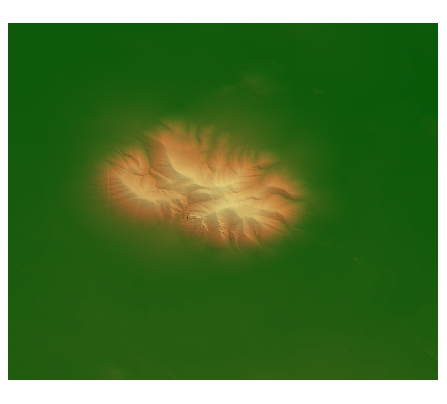

**Figure 1.** Raster representation of the Butte Mountain.

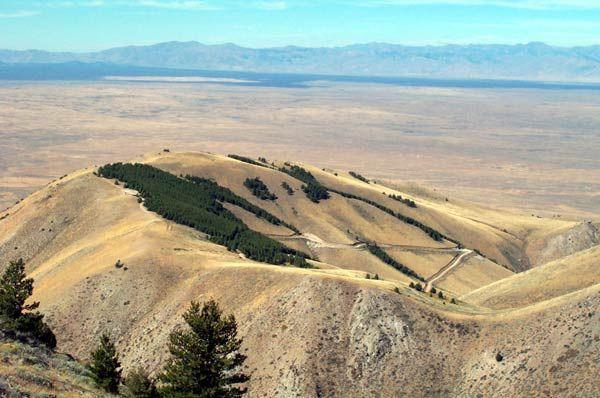

**Figure 2.** Photo of Big Southern Butte. The area that appears flat slightly slopes northward.

You will create a model in ArcGIS Pro that computes the volume of Big Southern Butte and your selected butte by separating the portion of the butte that rises above the plain from the original terrain surface. To do this, the model simulates the original terrain surface by interpolating surrounding elevations and computing the elevations of the butte above the simulated historic terrain surface. With this data, the model computes the total volume of land mass that comprises the feature.

This model should be constructed so that it can also be used to estimate the volume of other raised landscape features. Your model should accept two inputs: the DEM and the polygon you create of the Butte. Build your model to create a set of random points across the terrain and then eliminate any of the points that fall within the area of the butte. Use interpolation to compute a synthetic "base surface" representing the original terrain surface. Subtract the interpolated base surface from the original DEM to obtain a raster showing heights above the interpolated surface. Clip this to the original butte outline. Lastly, a summary statistic is computed to get the total volume of the butte.

## Spatial Considerations

The most significant factor that will change the results in this lab is the step where you will delineate the outline of the base of Big Southern Butte. If the user of the tool can view an aerial photo or other dataset to help identify the effective "base" of the mountain, this digitizing effort will be significantly more accurate. A second limiting factor is the accuracy of the interpolated surface. This will be affected by the number and distribution of points in your random points shapefile as well as the cell size of the input DEM. Depending on the extent of your raster layer, you can digitize a polygon around the Butte base to increase the accuracy of the interpolated surface.

<!-- TODO(instructor): the instructor plan asks for two additions here that are pedagogy decisions, so they are flagged rather than written in: (1) clarify why IDW is the interpolation method and how boundary points should be sampled (density, distance from the butte edge, whether points inside the butte polygon are excluded before or after value extraction); (2) require students to report an uncertainty or sensitivity result — e.g. re-run the model at two or more random-point counts, or with a second interpolation method, and report the spread in the computed volume. Both would also need matching rubric rows. -->

## Data

- **USGS DEM:** <https://www.nationalmap.gov/>

    Download the DEM for Big Southern Butte using the USGS National Map data viewer, or go to Inside Idaho's website and download elevation data for the area of interest. <!-- VERIFY: no URL is given for "Inside Idaho" in the source handout; the current site is not asserted here because it was not verified. --> As a point of reference, Big Southern Butte can be seen in Google Maps at 43.4038° latitude, -113.0306° longitude.

- **Two user-created polygons:** a polygon shapefile outlining the base of the butte and another slightly larger polygon shapefile surrounding that outline. You must create the first polygon shapefile in ArcGIS Pro using a basemap or other resource for reference. The second shapefile will be used to localize the random points we create in the model to help the model run faster.

## ModelBuilder Tools

You will use the following new tools in this exercise, along with tools from previous labs:

- **Raster Calculator** — allows you to perform "map algebra" on any number of input raster layers and produce a single output raster layer. This tool can perform any combination of your regular algebra expressions and the "con" statement, a conditional statement like "If-Then" in Excel or Visual Basic.
- **Create Random Points** — creates a specified number of random points within a specified extent. This shows the geographic location only and does not assign a value to the points.
- **Extract Values to Points** — assigns values to points based on cell values of the input raster.
- **Extract by Mask** — extracts cells either mostly or totally within a mask, like a polygon shapefile, and creates a new raster with only those cells. The Clip tool works similarly.
- **IDW (Inverse Distance Weighting)** — interpolates a surface into a raster using the inverse distance weighted equation.
- **Zonal Statistics** — calculates the statistics on the values inside the raster within the zone of another dataset or mask, like a polygon shapefile, and outputs one raster that contains only that value.

## Example Model


*The completed model, end to end.*

<!-- TODO(instructor): this full-model overview is a wide, zoomed-out ModelBuilder canvas grab and its labels are near-illegible at page width. It needs a re-export from ModelBuilder (larger node text, or split into two stacked halves), not a re-screenshot. It also shows the geodatabase named "Lab 8 - Big Southern Butte.gdb" from before the lab was renumbered. -->

## Complete the Lab

> [!TIP]
> For an advanced GIS student, the information up to this point is all you need to complete the assignment and create an output map from the results. Feel free to try conducting the analysis using only the information provided above. If you complete the lab only using the information provided above (without the step-by-step instructions below), indicate this in your lab report to be considered for extra credit. If you need additional help, follow the step-by-step solution below.

## Step-by-Step Solution

### Step 1

Create a polygon feature class called `Butte_Boundary` that encompasses the Big Southern Butte Mountain (use an imagery basemap to find the area the Butte covers). Your polygon feature class will not look exactly like the image below; however, if the boundaries are similar, you will be within the range of 3.0 to 6.0 km³ (0.7 to 1.4 mi³).

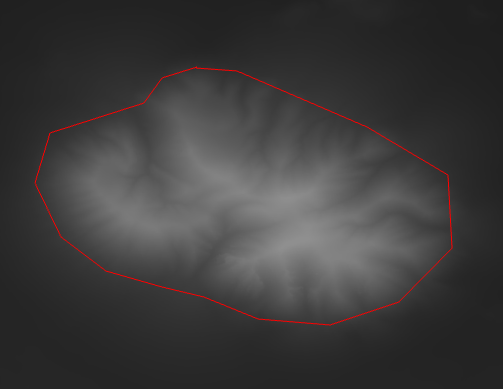

**Figure 3.** A polygon feature class approximately outlining the Butte Mountain with an elevation raster.

Create another polygon feature class named `Points_Boundary`. The purpose of this feature class is to confine the randomly created points that will be created in a later step. This will help the model to run faster and more accurately. Figure 4 shows the polygon feature class one might make as a boundary for the points.

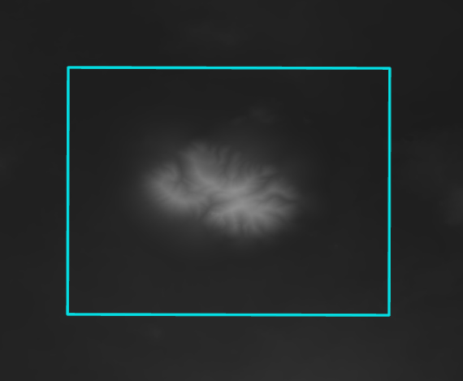

**Figure 4.** A polygon feature class defining the area in which random points will be created.

### Step 2

Open ModelBuilder. Either use the Mosaic To New Raster tool to combine multiple raster datasets and set it to the correct projection, or use the Project Raster tool to project the DEM to NAD 1983 UTM Zone 12N. In both tools, set the cell size to 30 meters.

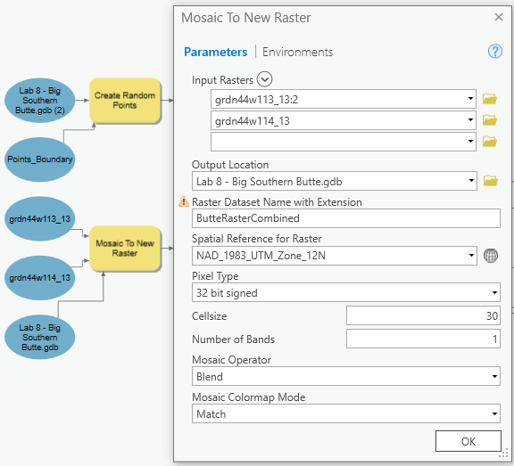

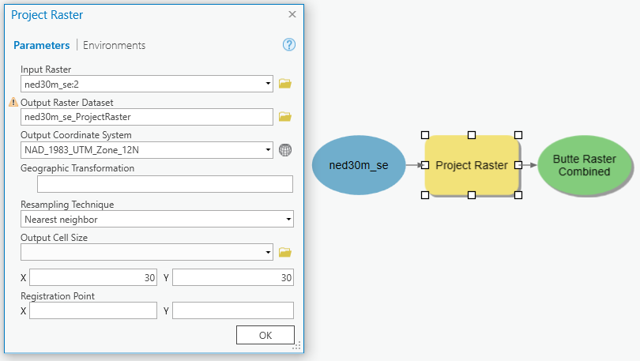

**Figure 5.** Mosaic To New Raster tool and Project Raster tool in ModelBuilder.

### Step 3

Use the Create Random Points tool to extract random points from the DEM. Create a geodatabase to store the random points that result from this step. Set this geodatabase as the Output Location. Set the Number of Points to 1000. Set the `Points_Boundary` feature class that you created as the Constraining Feature Class. This will bound the points within the feature class and give you points around and within the Butte boundary. In a later step we will use the points around the boundary to create an artificial surface underneath the Butte to calculate its volume.

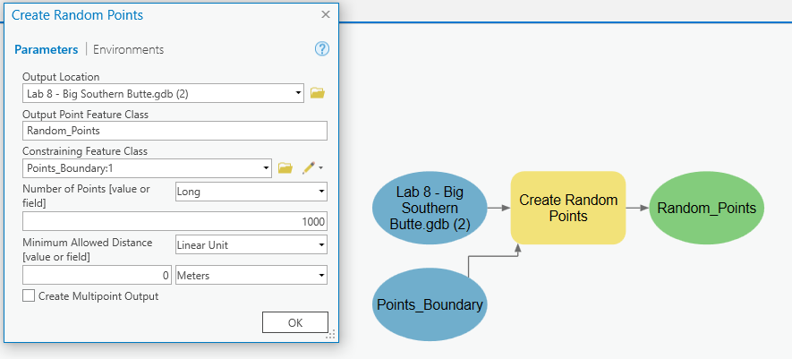

**Figure 6.** Setting up the Create Random Points tool.

The points that you created only show geographical location and have no value. The values from the DEM need to be assigned to the points so that they can be interpolated. Use the Extract Values to Points tool to assign elevation values to each of the random points.

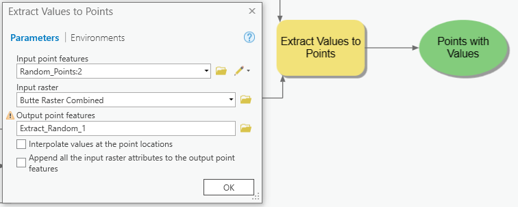

**Figure 7.** Extract Values to Points tool in ModelBuilder.

### Step 4

Use the Erase tool to erase the points that you determined are part of the Big Southern Butte Mountain. Use the Points with Values layer as the Input Features. Select the feature class you created of the Butte boundary for Erase Features. Next, use the Inverse Distance Weighted (IDW) tool to interpolate the Snake River Plain surface. This tool will interpolate the points to create a virtual Snake River Plain as it was before the Big Southern Butte Mountain was formed. For this lab, assume that the Snake River Plain is flat. Make sure to use the `RASTERVALU` field for the Z value field.

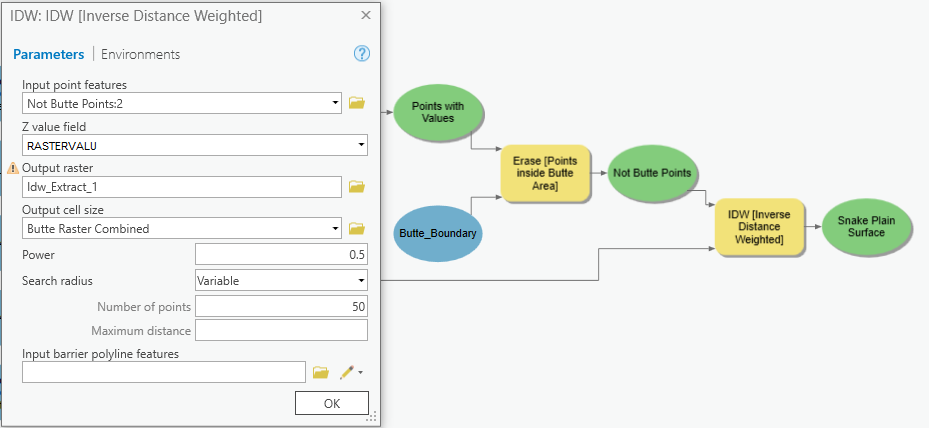

**Figure 8.** Using the Erase and IDW tools in ModelBuilder.

### Step 5

Reduce the area of the IDW plane and the elevation raster to only include the values within the `Butte_Boundary` polygon. Use the Extract by Mask tool to extract the portions of the original Butte DEM and the interpolated Snake River Plain to the extent of your delineated Big Southern Butte boundary.

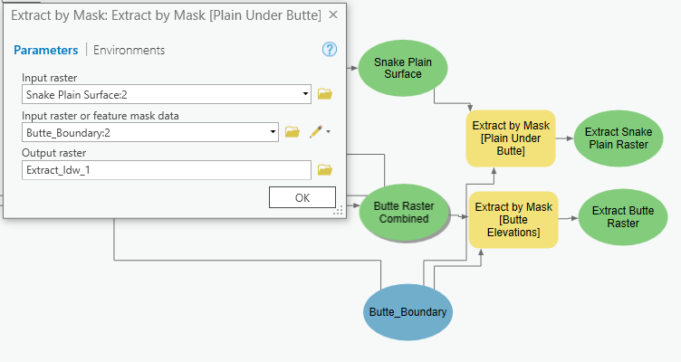

**Figure 9.** Using the Extract by Mask tool in ModelBuilder.

### Step 6

Use the Raster Calculator tool to find the volume between the interpolated Snake River Plain surface and the elevations in the original Butte DEM. To use it, enter a formula into the calculator. Depending on what cell size you chose earlier, your formula may look like this:

```text
("%Extract_Butte_Raster%" - "%Extract_Plains_Raster%") * 30 * 30 / (1000 ** 3)
```

<!-- VERIFY: the model-variable names in this expression differ from the ones in Figure 10, which reads ("%Extract Butte Raster%" - "%Extract Snake Plain Raster%"). The names depend on what the student calls the model variables; confirm which set the handout should show. -->

> [!NOTE]
> The double asterisks in the expression act as the power function, so `1000 ** 3` is one billion. This is because the Raster Calculator uses Python math syntax to manipulate the output raster. The result in each cell should represent the volume of that cell (height × width × length), converted from cubic meters to cubic kilometers.

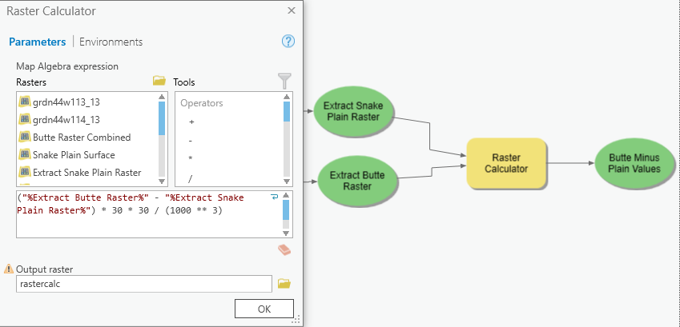

**Figure 10.** Raster Calculator tool in ModelBuilder with the Map Algebra expression.

### Step 7

Use the Zonal Statistics tool with the Statistics type option set to SUM to calculate the volume of the Big Southern Butte Mountain and represent the volume visually. Set the Zone Field option to `OBJECTID`. Use the `Butte_Boundary` layer as the Input Raster or Feature Zone Data so that the output raster will only have one value in every cell, the sum from the Raster Calculator.

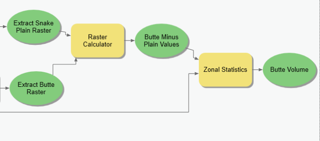

**Figure 11.** Using the Raster Calculator and Zonal Statistics tools in ModelBuilder.

## Deliverables

Using the data provided, construct a single ModelBuilder model with a customized graphical user interface (tool interface) that will prepare all your input data for the butte volume calculator and conduct the analysis.

For Part 1, create a map showing your model's results for Big Southern Butte.

For Part 2, find another raised feature (small hill, mountain, butte, etc.) in a DEM of your choosing. Create a map showing your model's results for this second dataset. Use your model's tool interface to add the required inputs, run your model, and compute your result for this new dataset.

<!-- TODO(instructor): the instructor plan suggests reducing the Part 2 workload — making the second site a concise transfer check (for example: reuse the tool interface on a smaller feature and report only the volume plus a one-paragraph sanity check) rather than a second full map deliverable. That is a scope decision and a rubric change, so it is flagged rather than made here; the Part 2 rubric row is currently worth 15 points. -->

Refer to the attached rubric for grading expectations. Prepare a brief report that includes your model, the steps taken in the model-building process, and the final maps of your results. Depending on your chosen base feature class, your final volume for Big Southern Butte should be between 3.0 and 6.0 km³ (0.7 to 1.4 mi³).

The final volume of your second feature and data set will vary but should be realistic. You should be able to make some simple measurements in ArcGIS Pro to ensure that your result is in the right range of values. Review the rubric for the complete requirements for this laboratory exercise.

## References

Godchaux, M.M., Bonnichsen, B., Jenks, M.D. (1992) Types of phreatomagmatic volcanoes in the western Snake River Plain, Idaho, USA, *Journal of Volcanology and Geothermal Research*, Volume 52, Issues 1–3, September 1992, Pages 1–25, ISSN 0377-0273, doi:10.1016/0377-0273(92)90130-6.

Greeley, R. (1982), The Snake River Plain, Idaho: Representative of a new category of volcanism, *J. Geophys. Res.*, 87(B4), 2705–2712, doi:10.1029/JB087iB04p02705.

Hughes, S.S., Smith, R.P., Hackett, W.R., and Anderson, S.R., 1999, Mafic Volcanism and Environmental Geology of the Eastern Snake River Plain, Idaho, in Hughes, S.S., and Thackray, G.D., eds., *Guidebook to the Geology of Eastern Idaho*: Idaho Museum of Natural History, p. 143–168.

United States Geological Survey (USGS) website <http://water.usgs.gov/maps.html>. United States Department of the Interior, Bureau of Land Management (2012) "Big Southern Butte Trail Flyer" http://www.blm.gov/id/st/en/fo/upper_snake/recreation_sites_/Big_Butte.html accessed 10/16/2012.

<!-- VERIFY: the BLM "Big Southern Butte Trail Flyer" URL returns 404 and the plain-http water.usgs.gov URL times out (the https form of the same address resolves). Both are left exactly as the source handout wrote them; no replacement URL has been guessed. -->

## Example Big Southern Butte Results Map — Part 1

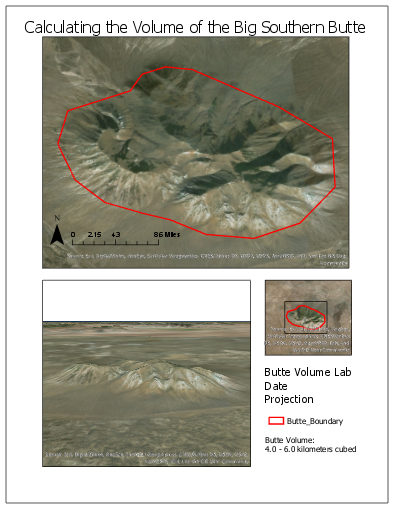

*An example of a finished Part 1 results map.*

## Grading Rubric

| Item | Points |
| --- | --- |
| Assignment title, name, date, course | |
| **Describe your model**<br>List each of the tools used<br>List tool settings applied for the analysis (could someone repeat the assignment using your lab report?)<br>List all input, intermediate, and output datasets<br>Describe each input dataset, including type (point, line, polygon, raster) and the source of the data<br>Describe each output dataset (point, line, polygon, raster) | /5 |
| **Show your model**<br>One or more full pages (8.5 x 11) showing your model (5 pts.)<br>All text is readable (10 pt. font minimum) (3 pts.)<br>All tools and data sets are shown (2 pts.) | /10 |
| **Show a ModelBuilder tool interface**<br>Include a user interface for setting the input data<br>Include a user interface for setting the output data<br>Include a user interface for adjusting the SQL statement that specifies the threshold value<br>Customize the title and other labels | /5 |
| **Part 1: Big Southern Butte results**<br>Make a full page (8.5 x 11) map showing the results of your Big Southern Butte analysis. Include all required map elements.<br>What is your total computed volume for Big Southern Butte?<br>Are your results as expected, or did you find anything interesting or different from what was expected? | /15 |
| **Part 2: Choose your own data results**<br>Download a new DEM for an area of interest and re-run your model from your tool interface using the new dataset. Make a full page (8.5 x 11) map showing the results of your second area analysis. Include all required map elements.<br>What is your total computed volume for your selected feature?<br>Are your results as expected, or did you find anything interesting or different than expected? | /15 |
| **Total points possible:** | **/50** |

<!-- TODO(instructor): in the "Show a ModelBuilder tool interface" row, the sub-item "Include a user interface for adjusting the SQL statement that specifies the threshold value" does not belong to this lab — Lab 7 uses no SQL statement and no threshold value anywhere in its workflow. It appears to be carried over from another lab's rubric. Removing or replacing it (for example with a parameter for the number of random points, or for the interpolation method) is a rubric decision, so it is left in place here. The row is worth 5 points. -->

<!-- Rubric total checked: 5 + 10 + 5 + 15 + 15 = 50, which matches the stated "/50". The "Assignment title, name, date, course" row carries no points in the source and is left blank. -->

<!--
Migration notes (2026-09-03):
source: /Users/dan/ames-sync/Work/Teaching/CE 414 Engineering Applications of GIS/Labs/Lab 7 - Big Southern Butte.docx
ArcGIS Pro version verified against: NOT VERIFIED in this migration.
images renamed from fig-NN:
  fig-01.png -> lab07-butte-raster-elevation.png
  fig-02.jpg -> lab07-big-southern-butte-photo.jpg
  fig-03.png -> lab07-complete-model-overview.png
  fig-04.png -> lab07-butte-boundary-polygon.png
  fig-05.png -> lab07-points-boundary-polygon.png
  fig-06.png -> lab07-mosaic-to-new-raster.png
  fig-07.png -> lab07-project-raster.png
  fig-08.png -> lab07-create-random-points.png
  fig-09.png -> lab07-extract-values-to-points.png
  fig-10.png -> lab07-erase-and-idw.png
  fig-11.png -> lab07-extract-by-mask.png
  fig-12.png -> lab07-raster-calculator.png
  fig-13.png -> lab07-zonal-statistics.png
  fig-14.png -> lab07-example-results-map.png
  (the placeholder .gitkeep file was deleted; no image was dropped — all 14 are referenced)
stale/unverified screenshots:
  lab07-complete-model-overview.png — illegible at page width; needs re-export from ModelBuilder, not a re-screenshot. Also shows "Lab 8 - Big Southern Butte.gdb".
  lab07-mosaic-to-new-raster.png — shows "Lab 8 - Big Southern Butte.gdb" (pre-renumbering).
  lab07-create-random-points.png — shows "Lab 8 - Big Southern Butte.gdb (2)" (pre-renumbering).
  All ModelBuilder and tool-dialog captures were taken in an unrecorded ArcGIS Pro build and have not been re-verified against the current release.
  lab07-example-results-map.png — the example map's legend reports "4.0 - 6.0 kilometers cubed" while the handout text states a 3.0 to 6.0 km3 range; the image was not altered.
TODO(instructor):
  Spatial Considerations — clarify interpolation-method choice and boundary-point sampling.
  Spatial Considerations — require an uncertainty or sensitivity result based on sampling density/method.
  Example Model — re-export the full-model overview image from ModelBuilder.
  Deliverables — consider reducing Part 2 to a concise transfer check.
  Grading Rubric — the "adjusting the SQL statement that specifies the threshold value" sub-item is unrelated to this lab.
VERIFY:
  Problem Statement — "another butte in Southern Idaho" vs Deliverables Part 2 "a DEM of your choosing".
  Data — "Inside Idaho's website" has no URL in the source; none was invented.
  Step 6 — model-variable names in the text expression differ from those in Figure 10.
  References — dead BLM URL and timing-out plain-http USGS URL, both left verbatim.
dead/redirected links:
  https://water.usgs.gov/maps.html -> 200 after redirect to https://www.usgs.gov/mission-areas/water-resources/maps (403 without a browser user agent)
  https://www.nationalmap.gov/ -> 200 after redirect to https://www.usgs.gov/programs/national-geospatial-program/national-map (403 without a browser user agent)
  http://water.usgs.gov/maps.html (References section) -> connection times out over plain http
  http://www.blm.gov/id/st/en/fo/upper_snake/recreation_sites_/Big_Butte.html -> 404 (dead)
-->
