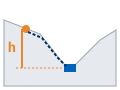
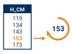
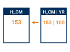
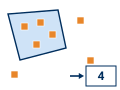

# Lab 7: Flood Mapping with HAND

**Civil Engineering 414 — Engineering Applications of GIS**

Fall 2026 · Dr. Dan Ames

*How high a river rises, and what it reaches — the Provo River at Provo*

<!-- **Revision notes.** New lab, written October 9, 2026 (no Word source). It completes the water
labs: Lab 5 (where water goes), Lab 6 (how much a lake holds), Lab 7 (how far a river floods).
Plan, decisions and measurements: tools/lab07/PLAN.md. The instructor's decisions of October 9,
2026: Provo River at Provo (USGS 10163000); FEMA's published FIS flows as the design flows; h =
gage height - 3.20 ft, uncorrected; 5 m lidar package; personal flow Q = 900 + 12 x the last two
digits of the BYU ID number; stream threshold as the sensitivity variable; buildings only; Iterate
Field Values over the hosted stage table. Every check value was measured from the hosted zip alone
in ArcGIS Pro 3.7.1 arcpy (tools/lab07/verify_package.py -> package_checks.json; personal.py ->
personal_lookup.csv). NOT YET BUILT IN THE GUI: every dialog figure is a TODO(capture), and the
GUI behavior of Iterate Field Values, inline %Value% in Raster Calculator and the dialog labels are
marked VERIFY. Figure C is a drawn diagram (make_svgs.py), not a ModelBuilder export. -->

> [!TIP]
> **Start from the report template.** [`lab07-report-template.docx`](lab07-report-template.docx)
> has the title block, a section for every deliverable, the tables already set up with the columns
> the rubric asks for, and the rubric at the end ready to fill in. You are welcome to write your
> report any way you like — the template is a floor, not a ceiling — but if you use it and fill in
> every section, you will not have left a graded item out.

> [!NOTE]
> **This is a one-week lab.** It is introduced on Tuesday of Week 8 and due on Saturday of the same
> week, the week of Midterm 1. Everything that takes preparation is done for you and hosted; the
> lab is two short models, a few tool runs and two maps.

## Background

Lab 5 found where water goes. Lab 6 measured how much a lake holds at every level. This lab asks
the question every floodplain manager, insurer and city engineer asks of a river: **when the river
rises, how far does the water reach, and what is in the way?**

Answering that properly takes a hydraulic model — a river surveyed in cross-sections, the flow
pushed through them, the water surface computed at each. That is what the Federal Emergency
Management Agency (FEMA) paid for on the Provo River, and its new flood map took effect in June
2026. But a hydraulic model takes months for one river, and there are millions of miles of river.
Two shortcuts are used instead, and this week's lectures compare them:

- **The bathtub.** Pick one water-surface elevation and flood every cell below it. That works for a
  lake (Lab 6). On a river it fails, because a river's water surface slopes downhill with the river:
  the Provo falls about 110 m across this lab's study area.
- **HAND — Height Above Nearest Drainage** (Nobre and others, 2011). For every cell, follow the
  water downhill until it reaches a stream, and record how far *down* that was. A cell with a HAND of
  1.2 m sits 1.2 m above the stream it drains to, wherever on the river it is. Flood the river by a
  depth *h*, and every cell with HAND ≤ *h* is wet. One threshold maps a whole river, and the water
  surface follows the river down the valley. NOAA's Office of Water Prediction maps floods for the
  National Water Model this way ([NOAA-OWP inundation mapping](https://github.com/NOAA-OWP/inundation-mapping){ target="_blank" }).<!-- Link checked 2026-10-09 (HTTP 200): the repository describes its Height Above Nearest Drainage method for the U.S. National Water Model. -->

HAND is built from the tools you used in Lab 5 — Fill, Flow Direction, Flow Accumulation and a
stream threshold — plus one new tool, **Flow Distance**. The depth *h* comes from hydrology: a
flood flow, turned into a water level by the stream gage's rating curve.

![Two measured panels. Top: the Provo River's long profile, falling from about 1,477 m at the mouth of Provo Canyon to about 1,367 m at Utah Lake over 17.6 km. A thin blue band 1.53 m thick follows the river line the whole way: the HAND water surface. A dashed orange horizontal line at 1,372.04 m, the 100-year stage elevation at the gage, crosses the river at the gage, so a bathtub at that level covers only the lowest 4.8 km of the river. Bottom: FEMA cross-section C, 123 m long, just upstream of the gage: the ground, FEMA's 1% water surface at 1,373.49 m as a dashed green line, and blue bars where HAND floods at h = 1.53 m; HAND floods 95 m of the section, FEMA 105 m.](images/lab07-profile.svg)

**Figure B.** One flood, two models, measured on this lab's data. Top: a bathtub at the 100-year
stage elevation reaches only the river below the gage; HAND's water surface follows the river all
the way up. Bottom: across the river, HAND and FEMA's hydraulic model agree closely here — but not
everywhere, and Step 6 asks you to find where they disagree.

> [!IMPORTANT]
> **Your job — see the deliverables below.** Build a model that computes HAND for the Provo River,
> and a second model that floods it at FEMA's 10- to 500-year flows; count the buildings each flood
> reaches; compare your 100-year flood with FEMA's; map your own design flood; and test how much the
> answer depends on the stream threshold.

## Problem Statement

The Provo River flows from the mouth of Provo Canyon through Provo to Utah Lake, past the USGS
stream gage **10163000, Provo River at Provo**. FEMA publishes flood flows for this reach. Using a
lidar elevation model, the gage's rating curve and those flows:

1. Compute the height of every cell above the river it drains to (HAND).
2. Turn FEMA's 10-, 25-, 50-, 100- and 500-year flows into flood depths at the gage, and map the
   land each flood would cover.
3. Count the buildings each flood reaches.
4. Compare your 100-year flood with FEMA's 1%-annual-chance floodplain, and say where and why they
   differ.

## Analysis Considerations

Every one of these is a decision somebody made, and every one of them can change the answer.

- **The flows.** FEMA's Flood Insurance Study for Utah County (revised June 23, 2026) lists the
  Provo River's peak flows "3 miles above tie-in to Utah Lake": **1,475, 1,810, 2,065, 2,325 and
  2,935 ft³/s** for the 10-, 25-, 50-, 100- and 500-year floods (10, 4, 2, 1 and 0.2 % chance in any
  year). These are small floods for a 673 mi² basin, because the river is **regulated**: every one
  of the gage's 90 recorded annual peaks carries the USGS code for "affected by regulation or
  diversion" — dams and reservoirs upstream hold back the snowmelt.
- **From flow to water level.** A stream gage measures the **gage height**, the water level above
  a fixed point, and the USGS keeps a **rating** — a table of measured flow against gage height — to
  turn one into the other. You look the flood flows up in that table (Step 1). The table stops at
  **8.00 ft and 2,150 ft³/s**; the 100- and 500-year flows are above it, so their gage heights come
  from extending the table's top segment along the same curve (the rating is a power law in the
  height above 3.20 ft, so the extension is straight on a log-log plot of flow against gage height
  minus 3.20 ft). That is a guess, and it is flagged in the stage table.
- **From water level to a HAND threshold.** HAND measures height above the stream, so the flood
  needs a *depth*. This lab uses the depth of water above the rating's **zero-flow level, 3.20 ft**:
  *h* = (gage height − 3.20 ft) × 0.3048, in meters. One depth is applied to the whole river, as if
  the 100-year flood were 1.53 m deep everywhere.
- **The elevation model.** **Hydro-flattened** lidar: the river is a flat water surface at whatever
  level it had the day the lidar was flown, not the channel bed. HAND is measured from that surface,
  while *h* is measured from the zero-flow level. They are not the same level; Step 6 asks what that
  does to your floods.
- **What counts as "the river."** A stream is a cell with more than a threshold number of cells
  draining through it, as in Lab 5: **2,000 cells** of 5 m, 0.05 km². Inside a city, that also makes
  streams of gutters and ditches, so the model keeps only stream cells within **30 m** of the
  mapped Provo River. The threshold is the parameter Step 7 varies.
- **What HAND cannot see.** Levees, bridges, culverts, the speed of the water, the channel's
  capacity. HAND knows only the ground and which way it slopes.
- **Cell size and coordinate system.** **5 m** cells, in **NAD 1983 UTM Zone 12N**, meters, so that
  areas are in square meters and every cell is the same size.

## Data

> [!IMPORTANT]
> **Set up your folder before you download anything.** On the lab machines, work on the **D:
> drive**: one folder for this class named after you, `D:\Smith\`, and one folder per lab inside
> it, `D:\Smith\Lab07\`. The **C: drive is locked**, and a **network drive** is slow enough to make
> ArcGIS Pro hang. **Never use a space** in a folder or file name you create — raster tools fail on
> them without saying why. **Back up your lab folder at the end of every session.** The full set of
> conventions is on the [ArcGIS Tips and Reminders](../../arcgis-tips.md){ target="_blank" } page.

- **Download:** [`lab07-provo-river-hand.zip`](../../data/lab07-provo-river-hand.zip) (12.4 MB).
  Unzip it into your Lab07 folder — the files are in a `lab07-provo-river-hand` folder inside it —
  and read `READ-ME-FIRST.txt`.

| Layer | What it is |
| --- | --- |
| `Provo_DEM.tif` | Bare-earth elevation, meters above NAVD 88, 5 m cells, from USGS 3D Elevation Program lidar |
| `ProvoData.gdb\Provo_River` | The Provo River from the National Hydrography Dataset, as served by the Utah Geospatial Resource Center (UGRC) |
| `ProvoData.gdb\Gage` | USGS stream gage 10163000, Provo River at Provo |
| `ProvoData.gdb\Stage_Table` | FEMA's five flood flows, each turned into a gage height and a HAND threshold (`H_M`, meters; `H_CM`, whole centimeters) |
| `ProvoData.gdb\Buildings` | Building footprints within 1 km of the river (UGRC, from Microsoft's computer-vision footprints) |
| `ProvoData.gdb\FEMA_Floodplain_1pct` | FEMA's riverine 1%-annual-chance flood zones (A, AE, AE floodway, AH) in the comparison area |
| `ProvoData.gdb\Comparison_Area` | Where you compare with FEMA: within 500 m of the river, minus FEMA's Utah Lake shoreline zones |
| `ProvoData.gdb\FEMA_Cross_Sections` | FEMA's 43 Provo River cross-sections: 1% water surface (`WSEL_REG`) and streambed (`STRMBED_EL`), feet NAVD 88 |
| `rating_10163000.csv` | The gage's rating: gage height (ft) and discharge (ft³/s), 3.42 to 8.00 ft |
| `peaks_10163000.csv` | The gage's annual peak flows, 1903 and 1934–2024 |
| Monitoring location 10163000 | The gage's live page at the USGS — [waterdata.usgs.gov](https://waterdata.usgs.gov/monitoring-location/10163000/){ target="_blank" } |

**What we already did for you.** Each of these would cost an evening and teach little that you have
not done before:

1. Read the elevation from the USGS 3DEP elevation service at 2 m, over an 8.6 × 10.6 km box from
   the mouth of Provo Canyon to Utah Lake, and resampled it to 5 m (bilinear). Nothing else: no
   filling, no smoothing.
2. Selected the Provo River from UGRC's NHD streams, the buildings within 1 km of it, and FEMA's
   riverine flood zones and cross-sections from FEMA's National Flood Hazard Layer.
3. Built the stage table. For each FEMA flow: the first row of the rating whose discharge is at
   least the flow gives the gage height; the gage height minus 3.20 ft, in meters, is `H_M`.
   You check one row yourself in Step 1.

> [!TIP]
> **Check the data:** `Provo_DEM.tif` is **1,718 columns × 2,124 rows** of 5 m cells, **1,366.78 to
> 1,645.53** m, NAD 1983 UTM Zone 12N. `Buildings` has **11,122** footprints, `FEMA_Cross_Sections`
> **43** lines, `Stage_Table` **5** rows. `Provo_River` is one feature in two parts, **17.57 km** long.

| `RETURN_YR` | `Q_CFS` | `GAGE_HT_FT` | `H_M` | `H_CM` | `RATING` |
| --- | --- | --- | --- | --- | --- |
| 10 | 1,475 | 7.11 | 1.192 | 119 | within table |
| 25 | 1,810 | 7.58 | 1.335 | 134 | within table |
| 50 | 2,065 | 7.90 | 1.433 | 143 | within table |
| 100 | 2,325 | 8.21 | 1.527 | 153 | extrapolated |
| 500 | 2,935 | 8.89 | 1.733 | 173 | extrapolated |

![Infographic: the six metadata questions — What, Where, When, Why, How and Who — answered for the lab's data. What: bare-earth elevation in meters above NAVD 88 on 5 m cells, and FEMA's peak flows turned into gage heights and h. Where: the Provo River from Provo Canyon's mouth to Utah Lake in NAD 1983 UTM 12N; gage 10163000 at 40.23926 N, 111.71119 W, datum 4,493.22 ft above NAVD 88. When: lidar from 3DEP projects flown 2013 to 2023, read October 8, 2026; rating 30.0 in force since April 26, 2023, provisional; FEMA flows and map effective June 23, 2026. Why: national best-available elevation, a gage to measure the river's flow, a FEMA study for flood insurance maps. How: hydro-flattened airborne lidar resampled from 2 m to 5 m; all 90 peaks coded 6, regulation or diversion. Who: USGS, FEMA and UGRC; public data. A footer warns that HAND is measured from the DEM's water surface while h is measured from the gage's zero-flow level.](images/lab07-metadata.svg)

**Figure A.** The six metadata questions, applied to this lab's data. Confirm three values yourself —
the gage datum (on the gage's [USGS page](https://waterdata.usgs.gov/monitoring-location/10163000/){ target="_blank" },
which tells you what to add to a gage height to get an elevation), the date of the rating, and the
effective date of FEMA's flood study — from the gage page and `READ-ME-FIRST.txt`, and say in your
report what each one does to your result.

## ModelBuilder Tools

New in this lab:

| Tool | What it does |
| --- | --- |
| { .tool-icon } **Flow Distance** (Spatial Analyst) | For every cell, the distance along its flow path to the stream it drains to. With **Vertical**, the height above that stream: HAND. [Tool reference](https://pro.arcgis.com/en/pro-app/latest/tool-reference/spatial-analyst/flow-distance.htm){ target="_blank" } |
| { .tool-icon } **Iterate Field Values** (ModelBuilder ▸ Iterators) | The loop, like Lab 6's For, but its values come from a field of a table: here, one HAND threshold per return period. [Tool reference](https://pro.arcgis.com/en/pro-app/latest/tool-reference/modelbuilder-toolbox/iterate-field-value.htm){ target="_blank" } |
| { .tool-icon } **Join Field** (Data Management) | Copies fields from one table onto another where a key field matches: the return period onto each flood. [Tool reference](https://pro.arcgis.com/en/pro-app/latest/tool-reference/data-management/join-field.htm){ target="_blank" } |
| { .tool-icon } **Spatial Join** (Analysis) | Writes onto each feature what it touches: here, the number of buildings each flood reaches, in `Join_Count`. [Tool reference](https://pro.arcgis.com/en/pro-app/latest/tool-reference/analysis/spatial-join.htm){ target="_blank" } |

Tools you already know: **Fill**, **Flow Direction**, **Flow Accumulation** (Lab 5), **Raster
Calculator** with a model variable (Lab 5), **Buffer** and **Extract by Mask** (Lab 4), and the
loop pieces from Lab 6 — **Raster to Polygon**, **Calculate Field**, **Collect Values** and
**Merge**. Step 6 also uses **Pairwise Clip** and **Pairwise Intersect**.

## Example Model

![Diagram of the two models. Model 1, HAND Builder: Provo_DEM, marked P, into Fill, Filled_DEM, Flow Direction, Flow_Direction, Flow Accumulation, Flow_Accumulation; Raster Calculator with Threshold (2000), marked P, makes Stream_Cells; Provo_River into Buffer 30 m makes River_Corridor; Extract by Mask makes River_Cells; Flow Distance, which also takes Filled_DEM and Flow_Direction, makes HAND, marked P. Model 2, Flood Loop: Stage_Table into Iterate Field Values, whose Value (H_CM) goes to Raster Calculator with the expression Con("%HAND%" <= %Value% / 100, 1) and HAND, marked P; then flood_%Value%, Raster to Polygon, Calculate Field, and Collect Values and Merge into Floods, marked P.](images/lab07-model.svg)

**Figure C.** The two models, drawn as a diagram (not a ModelBuilder export). The first computes
HAND once; the second floods it once per row of the stage table. They are two models because a
model with an iterator runs *every* tool in it once per value (Lab 6, Step 6): in one model,
Fill, Flow Direction, Flow Accumulation and Flow Distance would all run five times.
<!-- TODO(capture): replace Figure C with the GUI build's Export To Graphic of both models (lab07-full-model.svg). -->

## Complete the Lab

For an advanced GIS student, the information up to this point is all you need to complete the
assignment. Feel free to try the analysis using only the information above. If you complete the lab
without the step-by-step instructions below, say so in your report.

## Step-by-Step Solution

> [!NOTE]
> **Every check value on this page** was measured on the files you download, with the settings
> below, in ArcGIS Pro 3.7.1, and your numbers should match to the last digit shown. The whole HAND
> chain takes well under a minute on the 5 m surface.

### Step 0 — Set Up the Project

1. Create a new project named `Lab07` in `D:\Smith\Lab07\` with the **Map** template; if you
   already made the folder, uncheck **Create a folder for this local project**. ArcGIS Pro makes
   `Lab07.gdb` and `Lab07.atbx` beside it. The downloaded data stay in their own geodatabase,
   `lab07-provo-river-hand\ProvoData.gdb`.
2. Add `Provo_DEM.tif` (click **OK** to build pyramids and statistics) and, from
   `ProvoData.gdb`, `Provo_River`, `Gage`, `Buildings`, `FEMA_Floodplain_1pct`, `Comparison_Area` and
   `Stage_Table`. Add an imagery basemap.
3. Confirm Spatial Analyst is licensed (**Project** ▸ **Licensing**).
4. On the **Analysis** tab click **ModelBuilder**. On the **ModelBuilder** tab click
   **Properties**, set **Name** to `HANDBuilder` and **Label** to `HAND Builder`, and save.
5. On the **ModelBuilder** tab click **Environments** and set:
    - **Current Workspace** and **Scratch Workspace**: your project geodatabase, `Lab07.gdb`
    - **Extent**: choose `Provo_DEM.tif` from the list of the map's layers
    - **Snap Raster**: `Provo_DEM.tif`
    - **Cell Size**: `Provo_DEM.tif` (or type 5)

<!-- TODO(capture): Figure 0, the HAND Builder Environments dialog with the four settings. -->

> [!WARNING]
> **Set the Extent.** Without it, Extract by Mask (Step 3) makes `River_Cells` only as large as the
> box around the river corridor, Flow Distance (Step 4) follows it, and HAND covers **695,974** cells
> instead of **697,608**: the edges of the valley drop out, with no error.

### Step 1 — Read the Gage

Before any GIS, check where the stage table came from. Open
[the gage's page](https://waterdata.usgs.gov/monitoring-location/10163000/){ target="_blank" } and
`rating_10163000.csv` (Excel is fine).

1. On the gage page, find the **datum**: the number to add to a gage height to get an elevation.
   It should match `READ-ME-FIRST.txt`: **4,493.22 ft above NAVD 88**.
2. **Verify the 25-year row by hand.** FEMA's 25-year flow is **1,810 ft³/s**. Find the first row of
   `rating_10163000.csv` whose discharge is **at least** 1,810, read its gage height, and compute:
    - the water-surface elevation: 4,493.22 + gage height, in feet, then × 0.3048 for meters;
    - the HAND threshold: *h* = (gage height − 3.20) × 0.3048, in meters.
3. Open `peaks_10163000.csv` and look at the `peak_code` column (the 1903 peak reads `6,Bd`: code
   6, and its day is not known).

**Figure 1.** The rating turns a flow into a gage height. FEMA's 100- and 500-year flows are above
the top of the published table.

> [!TIP]
> **Check the result:** the row at 7.57 ft is 1,809.84 ft³/s — just short — so the answer is
> **7.58 ft** (1,817.45 ft³/s). Elevation 4,500.80 ft = **1,371.844 m**; *h* = 4.38 ft =
> **1.335 m**: the `Stage_Table` row for 25 years, `H_CM` **134**. Every one of the 90 peaks has code
> **6**, "affected by regulation or diversion."

> [!NOTE]
> **Two 100-year floods.** We also fitted a Log-Pearson Type III distribution — the standard
> flood-frequency curve — to the gage's own annual peaks, a teaching approximation of the
> USGS method (Bulletin 17C), not a published estimate. The 100-year flow came out **3,111 ft³/s**
> from the 32 peaks of 1993–2024, after Jordanelle Dam was finished upstream, and **2,827 ft³/s**
> from all 89 peaks since 1934;<!-- VERIFY: Jordanelle Dam completion/first storage 1992-93 (Reclamation pages timed out on 2026-10-09). --> FEMA's is **2,325 ft³/s**. Your report says, in a few sentences, why two
> careful estimates of "the 100-year flood" at the same gage can differ this much, and which you would
> design to. (Look at the peak codes, the record lengths, and what upstream dams do to a flood.)

### Step 2 — Condition the Surface

In the **HAND Builder** model, as in Lab 5:

1. **Fill**: input `Provo_DEM.tif`, output `Filled_DEM`. Right-click the `Provo_DEM.tif` oval ▸
   **Parameter**.
2. **Flow Direction**: input `Filled_DEM`, **Flow direction type** **D8**, output
   `Flow_Direction`.

<!-- TODO(capture): Figure 2, the Flow Direction dialog from ModelBuilder (D8). VERIFY the force-flow default (arcpy NORMAL) and the Method label seen in Lab 5. -->

> [!TIP]
> **Check the result:** `Filled_DEM` runs from **1,366.92 to 1,645.53** m. Fill raised **489,125**
> cells (12.23 km² of the box), by up to **8.47** m: the city is full of hollows — underpasses,
> basins, low yards — that the bare-earth surface shows as pits. `Flow_Direction` holds only the
> eight D8 codes, 1 to 128.

### Step 3 — Find the River

1. **Flow Accumulation**: input `Flow_Direction`, output `Flow_Accumulation` (accumulation data
   type Float).
2. On the **ModelBuilder** tab click **Variable**, type `Long`, and click OK. Right-click the new
   oval ▸ **Rename** ▸ `Threshold`, double-click it and type `2000`, and right-click it ▸
   **Parameter** (the same steps as Lab 5's Step 12).
3. **Raster Calculator**: `Con("%Flow_Accumulation%" > %Threshold%, 1)`, output `Stream_Cells`.
   With no third argument, every cell that is not a stream is **NoData**.
4. **Buffer**: input `Provo_River` (from `ProvoData.gdb`), distance **30 Meters**,
   **Dissolve Type** **Dissolve all output features into a single feature**, output `River_Corridor`.
5. **Extract by Mask**: input raster `Stream_Cells`, mask `River_Corridor`, output `River_Cells`.
   Make `River_Cells` a parameter, so that the tool-dialog runs of Step 7 keep it.

<!-- TODO(capture): Figure 3a, Raster Calculator with Con("%Flow_Accumulation%" > %Threshold%, 1); Figure 3b, Extract by Mask. VERIFY Extract by Mask's Analysis extent default in 3.7.1 with the Extent environment set. -->

> [!TIP]
> **Check the result:** `Flow_Accumulation` reaches **1,050,227** cells. `Stream_Cells` has
> **74,866** cells; `River_Cells` **3,191**.

> [!WARNING]
> **Do not skip the corridor.** Every one of the 74,866 stream cells — street gutters, ditches,
> canals — would become "a river" for Step 4, and the 100-year flood would cover **47.9 km²**
> instead of 1.57. The threshold alone cannot tell the Provo River from a gutter: inside this box,
> the river carries water from 673 square miles upstream that the DEM never sees.

### Step 4 — Height Above Drainage

Add **Flow Distance** (Spatial Analyst):

- **Input stream raster**: `River_Cells`
- **Input surface raster**: `Filled_DEM`
- **Input flow direction raster**: `Flow_Direction`
- **Distance type**: **Vertical**
- **Flow direction type**: **D8**
- **Statistics type**: **Minimum**
- **Output raster**: `HAND`

Make `HAND` a parameter. Save the model and run it inside ModelBuilder.

<!-- TODO(capture): Figure 4, the Flow Distance dialog. VERIFY the dialog labels; arcpy 3.7.1 names the parameters in_stream_raster, in_surface_raster, in_flow_direction_raster, distance_type (VERTICAL default), flow_direction_type (D8 default), statistics_type (MINIMUM default). -->

> [!TIP]
> **Check the result:** `HAND` has values on **697,608** cells, from **0 to 197.95** m (mean
> **23.54**). The rest is NoData: those cells drain somewhere other than the Provo River — to Utah
> Lake, to a canal, or out of the box.

> [!WARNING]
> **Use the filled surface.** With `Provo_DEM.tif` as the surface instead of `Filled_DEM`, HAND has
> **6,141 negative** cells (down to −1.92 m): the flow path climbs out of a pit the raw surface
> still has. Flow Distance also runs without a flow direction raster (it derives its own D8); give it
> yours anyway, so that the model says what it does.

### Step 5 — Flood Every Return Period

A second model, so that the loop does not rerun Steps 2–4 five times.

1. In the **Catalog** pane, right-click `Lab07.atbx` ▸ **New** ▸ **Model**. In **Properties** set
   **Name** `FloodLoop` and **Label** `Flood Loop`. Set the same environments as in Step 0.
2. **Insert** ▸ **Iterators** ▸ **Iterate Field Values**: **Input Table** `Stage_Table` (the
   downloaded one), **Field** `H_CM`. Its green output is `Value`, the threshold in centimeters for
   one row at a time.
3. **Raster Calculator**: `Con("%HAND%" <= %Value% / 100, 1)`, output `flood_%Value%`. Choose `HAND`
   from the map layers (add it from your project geodatabase first), then right-click its oval ▸
   **Parameter**.
4. **Raster to Polygon**: input `flood_%Value%`, **Simplify polygons** unchecked, **Create
   multipart features** checked, output `floodpoly_%Value%`. Each flood becomes one row.
5. **Calculate Field**: input `floodpoly_%Value%`, **Field Name** `H_CM`, **Field Type** Long,
   `H_CM =` `%Value%`.
6. **Collect Values** on Calculate Field's output, then **Merge** (connect Collect Values' output
   to Merge by dragging, as in Lab 6), output `Floods`; make `Floods` a parameter.
7. Save, and run the model.

<!-- TODO(capture): Figures 5a-5d: Iterate Field Values (Stage_Table, H_CM), Raster Calculator with %Value%, Raster to Polygon with multipart checked, Merge. VERIFY in the GUI: (1) the Insert ▸ Iterators menu lists Iterate Field Values and its output is named Value; (2) inline %Value% inside a Raster Calculator expression is substituted as a number, so %Value% / 100 is 1.53 (arcpy: Con(hand <= 153 / 100, 1) gives 62,693 cells); (3) %Value% in an output name gives flood_153; (4) the Data Type of Value (String by default) does not break the expression. A SQL where clause "Value * 100 <= 153" in Con fails in arcpy (ERROR 010416), so the page uses Raster Calculator. FALLBACK if Iterate Field Values misbehaves (instructor decision: Lab 6's For loop noted as fallback): For cannot step through five uneven values, so either (a) For From 119 To 173 By 1 (55 floods, of which the five stage-table values are the ones reported; slower, about 55 passes), or (b) Iterate Row Selection on Stage_Table + Get Field Value (H_CM). Decide after the GUI build. -->

> [!TIP]
> **Check the result:** `Floods` has **5** rows.
>
> | `H_CM` | Wet cells | Area (km²) |
> | --- | --- | --- |
> | 119 | 51,474 | 1.2869 |
> | 134 | 56,420 | 1.4105 |
> | 143 | 59,332 | 1.4833 |
> | 153 | 62,693 | 1.5673 |
> | 173 | 68,538 | 1.7135 |
>
> Area is the wet cells × 25 m², exactly, because the polygons are not simplified. If you have only
> one row, Merge ran outside the loop; if you have many rows per value, **Create multipart
> features** was unchecked.

> [!NOTE]
> **Why centimeters?** A name such as `flood_1.53` is not allowed in a geodatabase, so the loop
> iterates over whole centimeters and divides by 100 in the expression. Every threshold is rounded
> to the centimeter; the stage table's `H_M` keeps the millimeters.

### Step 6 — Count and Compare

Run these from the Geoprocessing pane, not in a model.

1. **Join Field**: **Input Table** `Floods`, **Input Join Field** `H_CM`, **Join Table**
   `Stage_Table`, **Join Table Field** `H_CM`, **Transfer Fields** `RETURN_YR` and `Q_CFS`.
2. **Spatial Join**: **Target Features** `Floods`, **Join Features** `Buildings`, **Join Operation**
   **Join one to one**, **Keep All Target Features** checked, **Match Option** **Intersect**,
   output `Floods_Buildings`. `Join_Count` is the number of buildings each flood touches.
3. **Compare the 100-year flood with FEMA.** Select the `H_CM` = 153 row of `Floods` and run
   **Pairwise Clip** with `Comparison_Area` (output `HAND100_Compare`), then **Pairwise Intersect**
   of `HAND100_Compare` and `FEMA_Floodplain_1pct` (output `Overlap100`). Sum `Shape_Area` in each
   of the three (right-click the field ▸ **Statistics**). Then:
    with *O* = area of `Overlap100`, *H* = area of `HAND100_Compare` (the clipped flood, not the
    whole one) and *F* = area of `FEMA_Floodplain_1pct`:
    - **hit rate** = *O* ÷ *F* — the share of FEMA's floodplain HAND also floods;
    - **false-alarm ratio** = (*H* − *O*) ÷ *H* — the share of HAND's flood FEMA does not map;
    - **critical success index**, CSI = *O* ÷ (*H* + *F* − *O*) — 1 is perfect agreement.

<!-- TODO(capture): Figure 6a Spatial Join dialog; Figure 6b the attribute table of Floods_Buildings. -->

> [!TIP]
> **Check the result:**
>
> | `RETURN_YR` | `Q_CFS` | Area (km²) | Buildings (`Join_Count`) |
> | --- | --- | --- | --- |
> | 10 | 1,475 | 1.2869 | 319 |
> | 25 | 1,810 | 1.4105 | 356 |
> | 50 | 2,065 | 1.4833 | 388 |
> | 100 | 2,325 | 1.5673 | 413 |
> | 500 | 2,935 | 1.7135 | 451 |
>
> At the 100-year flood: FEMA **1.3429** km², HAND in the comparison area **1.2801** km², overlap
> **0.7361** km² — hit rate **0.548**, false-alarm ratio **0.425**, CSI **0.390**.

A CSI of 0.39 means the two maps agree on a bit more than a third of the land either one floods.
That is typical of HAND against a detailed study, and the disagreement is not spread evenly. Put
`FEMA_Floodplain_1pct` (symbolized by `FLD_ZONE`) over your 100-year flood and look along the whole
river. Your report names **two places** where HAND is wrong, with coordinates and a cropped figure
of each, and says why. Things to look for:

- A floodplain FEMA maps that **leaves the river** — HAND can only flood land that drains *to* the
  river.
- HAND flooding **behind raised banks** where FEMA keeps the water in the channel — HAND does not
  know a bank is there if water would drain around it.
- The **channel itself**: the lidar's river surface sits a median **0.47 m above FEMA's streambed**
  at FEMA's 42 cross-sections with a water surface, while *h* is measured from the gage's
  zero-flow level, near the bed. `FEMA_Cross_Sections` gives you the streambed and the 1% water
  surface to check this at the section nearest your place.

> [!NOTE]
> Figure B (bottom) shows one place where they agree: at FEMA section C, just upstream of the gage,
> HAND floods 95 m of the 123 m section and FEMA's water surface covers 105 m.

### Step 7 — Test the Threshold

**First, your own design flood.** Every student floods the river at a different flow, worked out
from your **BYU ID number**: the **nine-digit number printed on your BYU ID card**, such as
`123456789`. It is **not your NetID**, the user name of letters and numbers you chose and use to sign
in to BYU sites.

> **Your design flow Q = 900 + 12 × (the last two digits of your BYU ID) ft³/s**
>
> Then, exactly as in Step 1: the first row of `rating_10163000.csv` whose discharge is at least Q
> gives the gage height, and *h* = (gage height − 3.20) × 0.3048 m, **to the millimeter**.
>
> - BYU ID `123456789`: last two digits **89**, Q = 900 + 12 × 89 = **1,968** ft³/s → **7.78** ft →
>   *h* = 4.58 ft = **1.396** m.
> - BYU ID `987654302`: last two digits **02**, Q = 900 + 24 = **924** ft³/s → **6.24** ft →
>   *h* = 3.04 ft = **0.927** m.
>
> Every design flow is between 900 and 2,088 ft³/s, inside the rating table. Write your BYU ID's last
> two digits, Q, the gage height and *h* in your report: the grader checks them.

From the Geoprocessing pane: **Raster Calculator** `Con("HAND" <= 1.396, 1)` (your *h*), output
`flood_mine`; **Raster to Polygon** as in Step 5; **Spatial Join** with `Buildings` as in Step 6.

> [!TIP]
> **Check the result:** with the example *h* of 1.396 m, **58,193** wet cells, **1.4548** km² and
> **376** buildings; with 0.927 m, **1.0799** km² and **258** buildings.

**Then, the threshold.** Open **HAND Builder** from the **Catalog** pane (it opens as a tool) and
run it **twice more**, with **Threshold** `400` and `8000`, and once at a threshold of your own
choosing. Give each run's `HAND` and `River_Cells` a new name (`HAND_T400`, `River_Cells_T400`).
Then run **Flood Loop** from the Catalog pane on each new HAND, with a new `Floods` name
(`Floods_T400`), and Spatial Join each one with `Buildings`.

> [!WARNING]
> **A run from the tool dialog deletes everything that is not a parameter** (Labs 5 and 8 saw it):
> every intermediate — `Filled_DEM`, `Flow_Direction`, `Flow_Accumulation`, `Stream_Cells`,
> `River_Corridor`, and the loop's `flood_` and `floodpoly_` datasets — goes. `HAND`, `River_Cells`
> and `Floods` are parameters, so they stay, under the new names you typed.

Record **all of it in one table**: your baseline (threshold 2,000), the three threshold runs and
your design flood, with the threshold, the number of `River_Cells`, and the area and buildings of
the 10- and 100-year floods (for the design-flood row, its own area and buildings).

> [!TIP]
> **Check the result:**
>
> | Threshold (cells) | `River_Cells` | 10-yr km² | 10-yr buildings | 100-yr km² | 100-yr buildings |
> | --- | --- | --- | --- | --- | --- |
> | 400 | 3,513 | 1.5235 | 387 | 1.8591 | 497 |
> | **2,000 (baseline)** | **3,191** | **1.2869** | **319** | **1.5673** | **413** |
> | 8,000 | 2,912 | 0.7684 | 169 | 0.9739 | 257 |

Then answer, in your report:

1. **What did the threshold change, and why?** Compare `River_Cells` at 400 and 8,000 with the
   baseline on the map: which cells join "the river" and which drop out, and what does that do to
   the floods and the building counts?
2. **Your flood against the threshold.** Where does your design flow fall against FEMA's return
   periods — below the 10-year flow, or between two of them? Did changing your flow move the building count more or less than changing the
   threshold did?
3. **Which threshold would you defend?** At the 100-year flood, how does the CSI against FEMA
   change from 400 to 8,000? Run Step 6's comparison on `Floods_T400` and `Floods_T8000`, with
   new output names (`HAND100_Compare_T400`, `Overlap100_T400`, and so on) so that your baseline's
   stay. Use those numbers, not the look of the map, to choose.

> [!TIP]
> For question 3, the 100-year CSI is **0.377** at 400, **0.390** at 2,000 and **0.325** at 8,000.
> At 8,000 the upper river is no longer a stream at all — find where `River_Cells_T8000` begins.

## Deliverables

Make **two** professional map layouts (letter size):

1. **Your baseline floods** — the five floods (10- to 500-year), nested and symbolized so each
   return period is readable, with a legend; the buildings the 100-year flood reaches highlighted;
   FEMA's 1% floodplain as an outline; the river and the gage; an inset or close-up of one place
   where HAND and FEMA disagree; an imagery basemap; a title, neat line, north arrow and scale bar;
   and a text box with your name, the date, the map projection, and the sources and dates of the
   elevation, the flows and the FEMA map.
2. **Your design flood** — your own flow from Step 7 (or, if it tells a stronger story, one
   threshold run), symbolized with a legend, with FEMA's 1% outline and the buildings it reaches
   highlighted and counted; an imagery basemap; a title, neat line, north arrow and scale bar; and
   a text box with your name, the date, the map projection, and the sources and dates. The title
   and text box say what changed from Map 1 and why you chose it.

Write a brief report (2–3 pages of text, plus your figures and maps) covering:

- a title block — assignment title, your name, the date and the course — and the name of your
  peer reviewer, with a sentence on what you changed because of them
- the requirements of the project and your approach to solving it
- **a description of both models** a reader could repeat from: each tool and its settings, every
  input, intermediate and output dataset with its type, and how the loop's value reaches the
  Raster Calculator expression
- **one** full-page figure of the two models, exported from ModelBuilder (**Export ▸ Export To
  Graphic**), and **one** screen capture of each model's tool dialog; and **upload your project's
  toolbox** (`Lab07.atbx`, in your project folder) with the report — the grader opens it to read your models
- **the three metadata values** — the gage datum, the date of the rating, and the effective date
  of FEMA's flood study — and what each means for your result
- **the 25-year row you verified in Step 1**, worked out step by step, and a few sentences on **why
  two 100-year floods differ** (FEMA's 2,325 ft³/s against 3,111 and 2,827 from the peaks)
- your **check values** from Steps 3 to 6: river cells, the HAND range, the five areas and building
  counts, and the 100-year hit rate, false-alarm ratio and CSI
- **where HAND is wrong**: two places, each with coordinates, a cropped figure and the reason —
  and what the 0.47 m between the lidar's river surface and FEMA's streambed does to every flood
- your **sensitivity table** from Step 7, with your BYU ID's last two digits, Q, gage height and
  *h*, and your answers to its three questions
- figures numbered and referred to in the text, and every source credited
- one line at the end saying what you used AI for, if anything (see the note under the rubric)
- **a copy of the rubric below with your self-assessment filled in** — a score in every row,
  honestly arrived at. The grader will compare it with theirs.

> [!NOTE]
> **Make it yours.** Everyone works from the same data, so the numbers will match a classmate's; the
> choices should not. Your map layouts, your color ramps and symbology, the labels you give your
> models' elements, the places you pick in Step 6 and the wording of your report are your own work.
> Submissions whose layouts, labels or symbology match another student's too closely are flagged
> for follow-up.

> [!IMPORTANT]
> **Peer review before you submit.** Have another student in the class read your report against
> the rubric and give you feedback, then act on that feedback before the deadline. Name your
> reviewer in the report and say in a sentence what you changed because of them.

**Credit line for your maps:** Elevation: USGS 3D Elevation Program lidar (read October 2026,
5 m). Flows and floodplain: FEMA Flood Insurance Study and National Flood Hazard Layer, Utah County
(effective June 23, 2026). Gage and rating: USGS 10163000. River and buildings: Utah Geospatial
Resource Center.

## References

Federal Emergency Management Agency (2026). *Flood Insurance Study, Utah County, Utah, and
Incorporated Areas*, volume 49049CV001B, revised June 23, 2026. Table 9, Summary of Discharges.
[FEMA Flood Map Service Center](https://msc.fema.gov/portal/downloadProduct?productTypeID=FINAL_PRODUCT&productSubTypeID=FIS_REPORT&productID=49049CV001B){ target="_blank" }.

Federal Emergency Management Agency. National Flood Hazard Layer (map service).
[hazards.fema.gov](https://hazards.fema.gov/arcgis/rest/services/public/NFHL/MapServer){ target="_blank" }.

Nobre, A.D., Cuartas, L.A., Hodnett, M., Rennó, C.D., Rodrigues, G., Silveira, A., Waterloo, M., and
Saleska, S. (2011). Height Above the Nearest Drainage — a hydrologically relevant new terrain model.
*Journal of Hydrology* 404, 13–29.
[doi:10.1016/j.jhydrol.2011.03.051](https://doi.org/10.1016/j.jhydrol.2011.03.051){ target="_blank" }.

England, J.F., Jr., and others (2019). *Guidelines for Determining Flood Flow Frequency — Bulletin
17C.* U.S. Geological Survey Techniques and Methods, book 4, chapter B5.
[doi:10.3133/tm4B5](https://doi.org/10.3133/tm4B5){ target="_blank" }.

U.S. Geological Survey. Monitoring location 10163000, Provo River at Provo, UT: annual peaks and
rating 30.0. [waterdata.usgs.gov](https://waterdata.usgs.gov/monitoring-location/10163000/){ target="_blank" }.

U.S. Geological Survey, Water Science School. *How Streamflow is Measured.*
[usgs.gov](https://www.usgs.gov/special-topics/water-science-school/science/how-streamflow-measured){ target="_blank" }.

U.S. Geological Survey, 3D Elevation Program. 3DEP Elevation image service.
[elevation.nationalmap.gov](https://elevation.nationalmap.gov/arcgis/rest/services/3DEPElevation/ImageServer){ target="_blank" }.

Utah Geospatial Resource Center. *NHD Streams* and *Building Footprints*.
[gis.utah.gov — NHD streams](https://gis.utah.gov/products/sgid/water/nhd-streams/){ target="_blank" };
[gis.utah.gov — building footprints](https://gis.utah.gov/products/sgid/location/building-footprints/){ target="_blank" }.

Esri. *Flow Distance* and *Iterate Field Values*, ArcGIS Pro tool reference (linked in the tools
table above).

<!-- LINK CHECK (curl -L, 2026-10-09): 200 doi:10.1016/j.jhydrol.2011.03.051; 200 doi:10.3133/tm4B5; 200 waterdata.usgs.gov/monitoring-location/10163000/; 200 msc.fema.gov FIS 49049CV001B download; 200 hazards.fema.gov NFHL MapServer; 200 usgs.gov how-streamflow-measured; 200 elevation.nationalmap.gov 3DEP ImageServer (502 once on 2026-10-09 at 01:00, 200 later); 200 gis.utah.gov nhd-streams and building-footprints; 200 pro.arcgis.com flow-distance, iterate-field-value, join-field, spatial-join, pairwise-clip, pairwise-intersect, raster-to-polygon, collect-values, iterators-for-looping; ../../arcgis-tips.md, ../../policies/ai-policy.md and ../../data/lab07-provo-river-hand.zip checked by mkdocs build --strict. Not used: doi:10.1111/1752-1688.12661 (Zheng et al. 2018) returns 403 to curl; fema.gov NFHL page returns 403 to curl. -->

## Example Maps

<!-- TODO(example maps): build Map 1 (baseline floods) and Map 2 (design flood, BYU ID example 89) with arcpy.mp from C:\Ames\HAND\PkgCheck\Work.gdb (tools/lab07/build_figures.py, not yet written), as for Labs 5, 6 and 8. -->

Example layouts are being prepared and will appear here. Until then, Labs 5 and 6 show the
standard the maps are graded to.

## Rubric for Flood Mapping with HAND

Fifty points in five parts of ten. The bullets say what each part is worth, so you know exactly
what to submit.

| Item | Points |
| --- | --- |
| **Write-up** (2–3 pages) • Assignment title, your name, date and course; your peer reviewer named, with a sentence on what you changed because of them (1) • The requirements of the project and your approach to solving it, in your own words (1) • The three metadata values — gage datum, rating date, FEMA effective date — and what each means for your result (2) • The 25-year row verified step by step, and why two 100-year floods differ, with the numbers (2) • Your check values: the five flood areas and building counts, and the 100-year hit rate, false-alarm ratio and CSI (1) • Where HAND is wrong: two places, each with coordinates, a cropped figure and the reason, and what the 0.47 m channel offset does to every flood (2) • Organized writing, figures numbered and referred to, sources credited, rubric pasted with your self-assessment (1) | /10 |
| **ModelBuilder models** — correct and working • Both models run from their tool dialogs and, at the defaults, match the check values: river cells, the HAND range, and the five flood areas (4) • A full-page figure of both models exported from ModelBuilder, all tools and datasets readable (2) • Screen captures of both tool dialogs with the threshold, HAND and the floods exposed as parameters (2) • A description of both models a reader could repeat from, including how the loop's value reaches the expression (2) | /10 |
| **Map 1 — your baseline floods** • Title, neat line, north arrow and scale bar (1) • Text box with author, date, map projection, and the sources and dates of the elevation, flows and FEMA map (1) • The five floods nested and symbolized so each return period is readable, with a legend (2) • Buildings reached by the 100-year flood highlighted, and FEMA's 1% floodplain outlined (2) • An inset or close-up of one place where HAND and FEMA disagree (2) • Basemap, scale and legibility appropriate to the river (2) | /10 |
| **Map 2 — your design flood** • Title, neat line, north arrow and scale bar (1) • Text box with author, date, map projection, and the sources and dates (1) • Your design flood (or a threshold run), with FEMA's 1% outline, symbolized with a legend (2) • The buildings it reaches highlighted, with their count (2) • Title and text box say what changed from Map 1 and why this run was chosen (2) • Basemap, scale and legibility (2) | /10 |
| **Sensitivity** (Step 7) • One table with the baseline, the three threshold runs and your design flood — with your BYU ID's last two digits, Q, gage height and *h* — giving river cells, areas and building counts (4) • What the threshold changed and why, with your numbers (2) • Your flood against FEMA's return periods and against the threshold's effect (2) • The threshold you would defend, from the CSI (2) | /10 |
| **Total** | **/50** |

> [!NOTE]
> **Using AI on this lab.** Use AI freely to understand a tool, work out an error, or
> tighten your write-up, and add one line at the end of your report saying what you used it
> for. Do not take a field name, an expression, a coordinate system, or a number from it —
> those come from your own data, and the rubric asks you to defend every one. See the
> [AI Use Policy](../../policies/ai-policy.md) for the full policy.

<!-- Migration notes (new lab, 2026-10-09).
SOURCE: none (new lab). Lineage: student final projects 2021 (Logan, Flow Distance, single stage), 2024 (Utah County flood-prone areas), 2025 (Mapping Flood Intervals with HAND: gage -> peak statistics -> rating -> stage -> HAND extents per return period). Plan: tools/lab07/PLAN.md.
ARCGIS PRO: 3.7.1 arcpy only (no GUI build yet). tools/lab07/verify_package.py extracts docs/data/lab07-provo-river-hand.zip and runs the page's path with the page's settings; probe_student_path.py tested the no-Extent trap (695,974 vs 697,608 HAND cells), the SQL where-clause failure (ERROR 010416 for 'Value * 100 <= 153'), multipart Raster to Polygon (1 row, area = cells x 25 exactly) and Spatial Join = Select Layer By Location count (413 at 100-yr). gotchas.py: stream raster with 0 off-stream inside the corridor gives the same HAND; no flow direction raster gives the same HAND; raw DEM surface 6,141 negative cells, min -1.92 m; no corridor 47.94 km2 at h 1.53 (41.74 at 1.19).
DATA: docs/data/lab07-provo-river-hand.zip, 12,411,788 bytes, built by tools/lab07/make_extract.py (5 m) from fetch_dem.py (3DEP ImageServer exportImage at 2 m, 30 tiles, Oct 8 2026) and fetch_vectors.py (UGRC UtahStreamsNHD, Buildings; NFHL layers 28 and 14, DFIRM 49049C, Oct 8 2026). Stage table: stage_table.py (design = FEMA FIS 49049CV001B Table 9, read from the page image; rating 30.0; first row >= Q; h = (GH - 3.20) ft x 0.3048; H_CM = round(h x 100)).
VERIFIED NUMBERS (package_checks.json): DEM 1,718 x 2,124, 1,366.78-1,645.53; Fill 1,366.92-1,645.53, 489,125 cells raised (12.228 km2), max 8.47 m; Flow_Accumulation max 1,050,227; Stream_Cells 74,866; River_Cells 3,191; HAND 697,608 cells, 0-197.95, mean 23.54; floods (cells, km2, buildings): 119 51,474 1.2869 319; 134 56,420 1.4105 356; 143 59,332 1.4833 388; 153 62,693 1.5673 413; 173 68,538 1.7135 451; 100-yr FEMA 1.3429, HAND in comparison 1.2801, overlap 0.7361, hit 0.548, FAR 0.425, CSI 0.390. Threshold runs (river cells; 10-yr km2/bldg; 100-yr km2/bldg/CSI): 400 3,513 1.5235/387 1.8591/497/0.377; 1,000 3,307 1.4163/370 1.7326/474/0.387; 4,000 3,110 1.1825/301 1.4389/397/0.394; 8,000 2,912 0.7684/169 0.9739/257/0.325. Personal (personal.py, mm h): 100 distinct h and areas, 74 distinct building counts; 89 -> 1,968 cfs, 7.78 ft, 1.396 m, 58,193 cells, 1.4548 km2, 376; 02 -> 924, 6.24, 0.927, 1.0799 km2, 258.
OTHER MEASURED FACTS (PLAN.md, xs_check.py, profile.py): FEMA 1% depth above streambed median 1.80 m (1.49-2.07); DEM channel minus FEMA bed median 0.47 m (0.10-1.44) at 42 sections; section C: HAND wet 95 m, FEMA 105 m of 123 m; the river long profile 1,476.98 -> 1,367.05 m over 17.57 km; 100-yr stage elevation 1,372.04 m reaches the lowest 4.8 km; the D8 path from the highest river cell leaves the river at 40.23923 N, 111.68941 W (441,358 E, 4,454,538 N) and exits the box's south edge. LP3 (stage_table.py, not published flows): post-Jordanelle WY1993-2024 n=32 Q100 3,111; all systematic WY1934-2024 n=89 Q100 2,827.
PILOT (no-GUI, 2026-10-09, C:\Ames\Pilot07\PILOT_NOTES.md): every check value on the page reproduced from the zip with arcpy (about 40, no mismatch). Fixed from its findings: the Extent warning now names Extract by Mask (it shrinks River_Cells; Flow Distance follows); Step 6 formulas name HAND100_Compare (the clipped flood; with the whole flood FAR would be 0.530 and CSI 0.339); Step 7 Q3 gives new output names so the baseline comparison is not overwritten; building counts moved from the model row to a write-up check-values bullet (they come from Spatial Join outside the models), where-wrong 3 -> 2 points; .atbx is opened to read the models (its paths point at the student's D: drive); Deliverables now list the peer-review sentence, numbered figures, the AI line, the loop-value description, Map 1 basemap and Map 2's full item list; Q2 allows a flow below the 10-year (IDs ending 00-47); rating extension described as log-log about the 3.20 ft offset (a linear extension gives 8.22/8.96 ft, not 8.21/8.89); 1903 peak code 6,Bd explained; the downloaded geodatabase renamed ProvoData.gdb (both were Lab07.gdb); the dialog-run deletion list completed; Provo_River described as one feature in two parts. Pilot measured section C HAND 96 m (page 95) and the bathtub's river length 4.6 km (page 4.8), both method-dependent.
TODO(capture): Figures 0, 2, 3a, 3b, 4, 5a-5d, 6a, 6b; Figure C export; example maps; GUI build at 175 % (C:\Ames\Lab07GUI\); lab-machine run time; Learning Suite due date (Saturday of Week 8). -->
