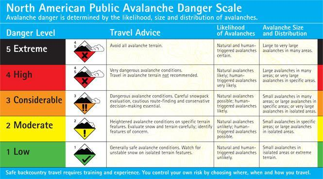

---
search:
  exclude: true
---

# DRAFT — Lab 7: Avalanche Hazard

**Civil Engineering 414 — Engineering Applications of GIS**

Fall 2026 · Dr. Dan Ames

*Terrain-based avalanche hazard screening from slope, aspect, and elevation*

> [!WARNING]
> **This is a draft for review** (October 2, 2026), written beside the assigned page while the
> instructor was away. It follows `tools/lab-conversion-guide.md` and the pattern of Labs 4–6. The
> decisions it needs are in `tools/lab07/PARITY_PLAN.md`.
>
> **Changes to what the lab asks students to do:** one study area (Snowbird), not two; two maps
> (baseline and one scenario), not three; the "all three agree" Con method becomes a step with a
> check value and a report question rather than a map; the multiply method's 1–125 scale is grouped
> into five classes by a stated rule (the cube root of the product); an **Elevation shift**
> parameter and two more combination rules (worst factor, best factor) make the sensitivity step;
> class areas inside the Snowbird boundary are measured with Tabulate Area and checked; the rubric
> is five parts of ten.
>
> **Corrections:** "Project Raster to the NAD 1983 projection" (a datum) is now NAD 1983 UTM zone 12N
> at 10 m; slope's Low band starts at 0, not −1; "Project" in the tool list is Project Raster; the
> uncited "150 deaths a year (National Geographic)" and "Clark et al. 2002" are replaced by sourced
> statements; the dead Sawtooth link is replaced.
>
> **Figures:** none of the dialog captures exist yet; each step marks the capture owed. Figure B
> (the danger scale) is the image the assigned page already uses. Nothing in this draft is a
> fabricated screenshot.
>
> **Every number** below was measured in ArcGIS Pro 3.7.1's arcpy on October 2, 2026
> (`tools/lab07/run_model.py`, `tool_checks.py`) against the hosted extract; the GUI build is owed.

> [!WARNING]
> **This is a classroom exercise, not an avalanche safety product.** The map you build here is a
> terrain-based screening of slope, aspect, and elevation, produced for the purpose of learning
> raster analysis and ModelBuilder. It does not account for snowpack, weather, wind loading,
> recent avalanche activity, or human triggering, and it is **not suitable for operational
> avalanche safety decisions**. For real trip planning, use the current forecast from the
> [Utah Avalanche Center](https://utahavalanchecenter.org/){ target="_blank" } or the avalanche
> center responsible for where you are going.

## Background

An avalanche is a mass of snow sliding fast down a slope. In the United States an average of
**27 people died in avalanches each winter** over the last ten winters, according to the Colorado
Avalanche Information Center, which keeps the national accident archive
([CAIC](https://avalanche.state.co.us/accidents/statistics-and-reporting){ target="_blank" }). Most
of them were backcountry skiers, riders, snowmobilers and climbers who chose the slope that slid.

Avalanche centers publish a forecast every morning of the season, and the forecast is partly a map
of terrain: it rates the danger by **elevation band** and by **aspect** (the compass direction a
slope faces), on the five-level North American Public Avalanche Danger Scale — Low, Moderate,
Considerable, High, Extreme (Figure B). The snowpack and the weather decide *how* dangerous today
is; the terrain decides *where* that danger lives. A slope steeper than about 30°, facing the
direction the wind loaded with snow, high enough to hold the cold weak layers, is where an avalanche
starts on a dangerous day.



**Figure B.** The North American Public Avalanche Danger Scale. Its five colors are the colors your
maps use.

This lab builds the terrain half of that picture for one ski area, Snowbird, in Little Cottonwood
Canyon east of Salt Lake City. A ModelBuilder model computes slope and aspect from an elevation
model, rates every 10 m cell on elevation, slope and aspect from a table taken from a real
avalanche advisory, and combines the three ratings into one map of **terrain-based hazard**. The
result is a screening: it says which terrain *could* be dangerous when the snowpack is, not whether
it is dangerous today.

The interesting part is the combining. Three ratings from 1 to 5 can be turned into one in several
defensible ways, and they do not agree. In Step 9 you will vary the elevation bands and compare
three ways of combining, see how far the map moves, and use what moves to say how much of the
answer is the terrain and how much is your choice of rule.

> [!IMPORTANT]
> **Your job — see the deliverables below.** Build one ModelBuilder model that rates Snowbird's
> terrain on elevation, slope and aspect and combines the three into a hazard class; measure how
> much of the ski area falls in each class; test the elevation bands and the combination rule; and
> make two maps.

## Problem Statement

You are given a 10 m elevation model of upper Little Cottonwood Canyon and the boundary of the
Snowbird ski area. Using them:

1. Rate every cell on **altitude**, **slope** and **aspect** with Table 1.
2. Combine the three ratings into one terrain hazard class from 1 (Low) to 5 (Extreme), by a rule
   you can state and defend.
3. Report how much of Snowbird, in square kilometers, falls in each class.
4. Map the result in the danger-scale colors.

## Analysis Considerations

Every one of these is a decision somebody made, and every one of them can change the answer.

- **The three factors.** Avalanche centers rate terrain by elevation, slope and aspect because
  those three are known before the season starts. Slope matters most: most slab avalanches start on
  slopes between 30° and 50°, avalanches on slopes under 30° are rare, and slopes over about 50°
  shed snow in small loose slides too often to build big slabs
  ([avalanche.org: slope angle](https://avalanche.org/avalanche-encyclopedia/terrain/slope-characteristics/slope-angle/){ target="_blank" }).
  Aspect matters because wind loads the lee side of a ridge with deep slabs and because the sun
  heals weak layers on south-facing slopes that survive on shaded ones
  ([avalanche.org: aspect](https://avalanche.org/avalanche-encyclopedia/terrain/slope-characteristics/aspect/){ target="_blank" }).
- **What the model leaves out.** The snowpack's layers and their strength, today's weather, wind
  loading, recent avalanches, and the person who triggers the slide. Also slope shape (convex rolls
  are more dangerous than concave bowls), ground cover (smooth grass and rock slabs slide more than
  boulder fields and forest), and terrain traps below a slope. None of these is in an elevation
  model. Your report says what each one would change.
- **Table 1.** The class breaks below come from one advisory, issued by the Sawtooth Avalanche
  Center for central Idaho on one day. Another day's advisory moves the elevation bands, and another
  center would use different ones. Step 9 moves them.
- **How the three ratings combine.** "All three agree", the product, the worst of the three, the
  best of the three — each is a different claim about how the factors interact. Step 6 builds two
  and Step 9 adds two more.
- **The elevation model.** Bare earth: the ground surface, without trees, lift towers or the
  winter snowpack, which can be meters deep and changes the slope a skier stands on. Cells of about
  10 m, so a gully narrower than that is not in it.
- **The coordinate system.** Slope and Aspect need cells and elevations in the same linear unit.
  The extract arrives in latitude and longitude; Step 1 projects it to **NAD 1983 UTM zone 12N** in
  meters.

|  | Altitude (meters) | Slope (degrees) | Aspect (degrees) |
| --- | --- | --- | --- |
| Low (1) | 0 – 2,200 | 0 – 25<br>60 – 90 | 180 – 225 |
| Moderate (2) | 2,200 – 2,400 | 25 – 30<br>55 – 60 | 135 – 180<br>225 – 270 |
| Considerable (3) | 2,400 – 2,600 | 30 – 32<br>50 – 55 | 90 – 135<br>270 – 315 |
| High (4) | 2,600 – 2,800 | 32 – 35<br>45 – 50 | 315 – 360<br>45 – 90 |
| Extreme (5) | above 2,800 | 35 – 45 | −1 – 45 |

**Table 1.** Terrain ratings from a Sawtooth Avalanche Center advisory. A value exactly on a break
goes to the lower range: 25° is Low and 35° is High, because ArcGIS Pro's Reclassify counts the end
of each range in that range. The Aspect tool gives flat cells **−1**, which this table rates Extreme;
flat cells are all slope class 1, so it does them little harm, but say in your report whether you
would rate them differently.

## Data

> [!IMPORTANT]
> **Set up your folder before you download anything.** On the lab machines, work on the **D:
> drive**: one folder for this class named after you, `D:\Smith\`, and one folder per lab inside
> it, `D:\Smith\Lab07\`. The **C: drive is locked**, and a **network drive** is slow enough to make
> ArcGIS Pro hang. **Never use a space** in a folder or file name you create — raster tools fail on
> them without saying why. **Back up your lab folder at the end of every session.** The full set of
> conventions is on the [ArcGIS Tips and Reminders](../../arcgis-tips.md){ target="_blank" } page.

| Layer | Where it comes from | How you get it |
| --- | --- | --- |
| `LittleCottonwood_DEM.tif` | USGS 3D Elevation Program, 1/3 arc-second DEM | Prepared extract, hosted here |
| Snowbird ski area boundary | Utah Geospatial Resource Center (UGRC), *Utah Ski Area Boundaries* | Live web layer, added by URL |
| Table 1 | A Sawtooth Avalanche Center advisory | You type it into the Reclassify and Raster Calculator tools |

- **Download:** [`lab07-little-cottonwood-dem.zip`](../../data/lab07-little-cottonwood-dem.zip)
  (2.4 MB). Unzip it into your Lab07 folder, and read `READ-ME-FIRST.txt`.
- **Add the ski areas** in Step 0 from this feature service URL:
  `https://services1.arcgis.com/99lidPhWCzftIe9K/arcgis/rest/services/SkiAreaBoundaries/FeatureServer/0`
  (the same layer as UGRC's [Utah Ski Area Boundaries](https://opendata.gis.utah.gov/datasets/utah-ski-area-boundaries/explore){ target="_blank" } page).

> [!TIP]
> **Check the data:** `LittleCottonwood_DEM.tif` is **1,296 columns × 864 rows** of 1/3 arc-second
> cells, values **2,176.4 to 3,500.5** (meters above NAVD 88), GCS North American 1983, no NoData
> cells. The ski-area layer has 14 polygons; Snowbird's is named `Snowbird Ski and Summer Resort`.

<!-- TODO(figure): Figure A, the six metadata questions for the DEM extract (copy tools/lab05/make_svgs.py metadata_card; same tile as Lab 5, so most answers carry over: published 2026-05-20, sources 1946-2023, bare earth, NAVD 88 meters, public domain), plus one line on the ski-area layer (UGRC, Web Mercator, last update). -->

## ModelBuilder Tools

New in this lab:

| Tool | What it does |
| --- | --- |
| **Slope** (Spatial Analyst) | The steepness of each cell, from its eight neighbors, in degrees from 0 (flat) to 90 (vertical). [Tool reference](https://pro.arcgis.com/en/pro-app/latest/tool-reference/spatial-analyst/slope.htm){ target="_blank" } |
| **Aspect** (Spatial Analyst) | The compass direction each cell's slope faces, in degrees clockwise from north (0 to 360), and −1 where the cell is flat. [Tool reference](https://pro.arcgis.com/en/pro-app/latest/tool-reference/spatial-analyst/aspect.htm){ target="_blank" } |
| **Cell Statistics** (Spatial Analyst) | A statistic of several rasters, cell by cell: here the maximum and the minimum of the three ratings. [Tool reference](https://pro.arcgis.com/en/pro-app/latest/tool-reference/spatial-analyst/cell-statistics.htm){ target="_blank" } |
| **Tabulate Area** (Spatial Analyst) | The area of each raster class inside each zone of a polygon layer, in one table. [Tool reference](https://pro.arcgis.com/en/pro-app/latest/tool-reference/spatial-analyst/tabulate-area.htm){ target="_blank" } |

Tools you already know: **Project Raster** (Lab 5), **Reclassify** (Lab 2), **Raster Calculator**
with an inline variable (Labs 2, 4 and 5), and model parameters.

<!-- TODO(figure): tool icons for Slope, Aspect, Cell Statistics, Tabulate Area (tools/lab07/make_svgs.py). -->

## Example Model

<!-- TODO(capture): Figure C, the finished model exported from ModelBuilder (Export To Graphic), in rows: DEM -> Project Raster -> DEM_UTM -> Slope -> Slope_Deg -> Reclassify -> Slope_Class; DEM_UTM -> Aspect -> Aspect_Deg -> Reclassify -> Aspect_Class; DEM_UTM + Elevation Shift (P) -> Raster Calculator -> Altitude_Class; the three classes -> Raster Calculator (agree) -> Agree_Class, -> Raster Calculator (geometric mean) -> Hazard_Class (P), -> Cell Statistics MAXIMUM -> Worst_Class, -> Cell Statistics MINIMUM -> Best_Class. -->

The finished model will appear here as **Figure C**: one elevation model in, three rating rasters in
the middle, and four combined maps out, with the elevation shift and the main output as parameters.

## Complete the Lab

For an advanced GIS student, the information up to this point is all you need to complete the
assignment. Feel free to try the analysis using only the information above. If you complete the lab
without the step-by-step instructions below, say so in your report.

## Step-by-Step Solution

> [!NOTE]
> **Build it once, build it to be changed.** The steps walk through Snowbird at the default
> elevation bands. Step 9 re-runs the same model with the bands moved, so give every dataset a
> readable name as you go.

> [!NOTE]
> **Every check value on this page** was measured on the files you download, with the steps below,
> in ArcGIS Pro 3.7.1. Your numbers should match to the last digit shown.

### Step 0 — Set Up the Project

1. Create a new project in `D:\Smith\Lab07\` with the **Map** template; if you already made the
   folder, uncheck **Create a folder for this local project**.
2. Add `LittleCottonwood_DEM.tif`. When the **Build Pyramids and Calculate Statistics** dialog
   opens, click **OK**.
3. On the **Map** tab click the arrow under **Add Data** ▸ **From Path**, paste the ski-area URL
   from the Data section, and click **Add**. Add an imagery or topographic basemap.
4. Confirm Spatial Analyst is licensed (**Project** ▸ **Licensing**).
5. On the **Analysis** tab click **ModelBuilder**. On the **ModelBuilder** tab click
   **Properties**, set **Name** to `AvalancheTerrain` and **Label** to `Avalanche Terrain`, and save.
6. On the **ModelBuilder** tab click **Environments** and check that **Current Workspace** and
   **Scratch Workspace** are your project geodatabase.

<!-- TODO(capture): the Environments dialog. -->

### Step 1 — Project the DEM

Add **Project Raster** to the model with `LittleCottonwood_DEM.tif` as the input:

- **Output Coordinate System**: NAD 1983 UTM Zone 12N
- **Resampling Technique**: Bilinear interpolation (elevations are continuous; nearest neighbor
  leaves stair steps that become stripes in Slope)
- **Output Cell Size**: 10
- **Output Raster Dataset**: `DEM_UTM`

<!-- VERIFY in the GUI build: whether Project Raster opens with Bilinear for this DEM, as it did in Lab 5, and the cell size it proposes. -->
<!-- TODO(capture): the Project Raster dialog. -->

> [!TIP]
> **Check the result:** `DEM_UTM` is **1,023 × 896** cells of 10 m, values **2,178.0 to 3,499.4**
> m. If the cell size reads about 0.0001, you are looking at the unprojected DEM.

### Step 2 — Compute Slope

Add **Slope** with `DEM_UTM` as the input, **Output measurement** Degree, and output `Slope_Deg`.

<!-- TODO(capture): the Slope dialog; VERIFY its parameter labels in 3.7.1 (Output measurement, Method, Z unit). -->

> [!TIP]
> **Check the result:** the steepest cell is **77.8°**, and half the cells are steeper than
> **27.3°** (the median; read it from the layer's statistics).

> [!WARNING]
> **Slope runs on the unprojected DEM too, and gives the wrong answer quietly.** On
> `LittleCottonwood_DEM.tif` itself it reports a median of 24.5° — about 3° too gentle. Its cells
> are 1/3 arc-second, which here is 10.3 m north–south but only 7.8 m east–west; projected cells are
> square meters. Three degrees moves a lot of terrain across the 25°, 30° and 35° breaks of Table 1.

### Step 3 — Compute Aspect

Add **Aspect** with `DEM_UTM` as the input and output `Aspect_Deg`.

> [!TIP]
> **Check the result:** values run from 0 to 360, plus **−1 on 480 flat cells** in the whole
> projected DEM.

<!-- TODO(capture): the Aspect dialog. -->

### Step 4 — Rate Slope and Aspect

Add **Reclassify** twice, with the slope and aspect rows of Table 1.

1. **Reclassify** `Slope_Deg`, field **Value**, nine rows: 0–25 → 1, 25–30 → 2, 30–32 → 3,
   32–35 → 4, 35–45 → 5, 45–50 → 4, 50–55 → 3, 55–60 → 2, 60–90 → 1. Output `Slope_Class`.
2. **Reclassify** `Aspect_Deg`, eight rows: −1–45 → 5, 45–90 → 4, 90–135 → 3, 135–180 → 2,
   180–225 → 1, 225–270 → 2, 270–315 → 3, 315–360 → 4. Output `Aspect_Class`.

Two ranges can share a new value; that is how the table says "steep and gentle are both Low."

<!-- TODO(capture): the two Reclassify dialogs. -->

> [!TIP]
> **Check the result** (inside Snowbird, measured in Step 8): slope class 1 covers **4.986 km²**
> and slope class 5 **2.047 km²**; aspect class 4 (northwest-to-north and northeast-to-east)
> **3.493 km²**. If any cell of `Slope_Class` is NoData, a range has a gap.

### Step 5 — Rate Altitude, With a Shift

Reclassify cannot take a parameter, and Step 9 needs to move the elevation bands. So rate altitude
with **Raster Calculator**, with the bands written out and an inline variable added to each break:

1. Right-click the canvas ▸ **Create Variable**, choose **Long**, name it `Shift`, and set its value
   to `0`. Right-click it ▸ **Parameter**.
2. Add **Raster Calculator** with this expression, and output `Altitude_Class`:

```text
Con("%DEM_UTM%" <= 2200 + %Shift%, 1, Con("%DEM_UTM%" <= 2400 + %Shift%, 2, Con("%DEM_UTM%" <= 2600 + %Shift%, 3, Con("%DEM_UTM%" <= 2800 + %Shift%, 4, 5))))
```

A positive shift raises every band (less of the mountain counts as high); a negative shift lowers
them.

<!-- VERIFY in the GUI build: the Variable data type list name (Long) and that %Shift% draws its connector to the Raster Calculator, as %Threshold% did in Lab 5. -->
<!-- TODO(capture): the Raster Calculator dialog. -->

> [!TIP]
> **Check the result:** at shift 0, Snowbird has **7.445 km²** above 2,800 m (altitude class 5)
> and no cells below 2,200 m. Most of the ski area is "Extreme" on altitude alone — keep that in
> mind in Step 9.

### Step 6 — Combine the Ratings

Two ways, both in Raster Calculator.

**First, "all three agree."** A cell gets a class only where all three ratings are that class:

```text
Con(("%Altitude_Class%" == 1) & ("%Slope_Class%" == 1) & ("%Aspect_Class%" == 1), 1, Con(("%Altitude_Class%" == 2) & ("%Slope_Class%" == 2) & ("%Aspect_Class%" == 2), 2, Con(("%Altitude_Class%" == 3) & ("%Slope_Class%" == 3) & ("%Aspect_Class%" == 3), 3, Con(("%Altitude_Class%" == 4) & ("%Slope_Class%" == 4) & ("%Aspect_Class%" == 4), 4, Con(("%Altitude_Class%" == 5) & ("%Slope_Class%" == 5) & ("%Aspect_Class%" == 5), 5, 0)))))
```

Output `Agree_Class`. Look at it before you go on.

> [!TIP]
> **Check the result:** inside Snowbird, **10.345 of 10.782 km²** — 96 % — is 0, unclassified. A
> 35–45° slope above 2,800 m facing between north and northeast (0–45°) rates 5, 5, 5 and is mapped
> Extreme; the same slope facing east (45–90°) rates 5, 5, 4 and is mapped *nothing*. Your report says why that is the wrong answer.

**Second, the geometric mean.** Multiply the three ratings (1 to 125), take the cube root, and round.
The cube root of a product of three numbers is their geometric mean, which brings the result back to
the 1–5 scale:

```text
Int(Power("%Altitude_Class%" * "%Slope_Class%" * "%Aspect_Class%", 1.0 / 3) + 0.5)
```

Output `Hazard_Class`, and make it a model parameter. Rated 5, 5, 4, a cell's product is 100, its
geometric mean 4.6, and its class 5. In product terms the classes are 1–3 Low, 4–15 Moderate, 16–42
Considerable, 43–91 High, 92–125 Extreme.

<!-- TODO(capture): both Raster Calculator dialogs. -->

> [!NOTE]
> **Why `+ 0.5` and `Int`.** `Int` drops the fraction, so adding 0.5 first rounds to the nearest
> class: a geometric mean of 3.48 (product 42) is Considerable, 3.50 (product 43) is High.

### Step 7 — Add Two More Rules

Add **Cell Statistics** twice, each with `Altitude_Class`, `Slope_Class` and `Aspect_Class` as the
inputs:

1. **Overlay statistic** Maximum, output `Worst_Class` — a cell is as dangerous as its worst factor.
2. **Overlay statistic** Minimum, output `Best_Class` — a cell is only as dangerous as its least
   dangerous factor.

These two bracket the geometric mean. You will compare all three in Step 9.

<!-- TODO(capture): the Cell Statistics dialog; VERIFY the parameter labels (Overlay statistic, Ignore NoData in calculations). -->

### Step 8 — Measure Snowbird

Run the model. Then add **Tabulate Area** (outside the model is fine) with:

- **Input raster or feature zone data**: the ski-area layer, with **only Snowbird selected** (select
  it with **Select By Attributes**, `NAME` begins with `Snowbird`)
- **Zone field**: `NAME`
- **Input raster or feature class data**: `Hazard_Class`, **Class field** `Value`
- **Output table**: `Snowbird_Hazard`

The table has one column per class, in square meters. Divide by 1,000,000 for km².

<!-- VERIFY in the GUI: that Tabulate Area honors the selection on the service layer (the arcpy check used a layer with a definition query), and its parameter labels. -->
<!-- TODO(capture): the Tabulate Area dialog and its output table. -->

> [!TIP]
> **Check the result** (km², Snowbird, shift 0):
>
> | Rule | Low | Moderate | Considerable | High | Extreme |
> | --- | --- | --- | --- | --- | --- |
> | Geometric mean (`Hazard_Class`) | 0.168 | 3.162 | 3.691 | 2.673 | 1.087 |
>
> The five add to **10.782 km²**, Snowbird's area. UGRC's own `Shape__Area` field says 18.7 million
> square meters: that is the area in the layer's Web Mercator coordinates, which stretch areas by
> about 1.73 at this latitude. Your table measures in the raster's UTM meters.

### Step 9 — Test the Assumptions

The default map is *an* answer, not *the* answer: one day's elevation bands from one advisory, and
one rule for combining. Run the model at least **three more times** from its tool dialog with a
different **Shift** — for example −400, −200 and +200 or +400 m — and tabulate `Hazard_Class`,
`Worst_Class` and `Best_Class` inside Snowbird each time with Tabulate Area.

Choose your values deliberately and say why: a storm that loads the upper mountain, a warm spell
that moves the problem up, a different avalanche center's bands. For **the baseline and every run,
in one table**, record the shift and, for each of the three rules, the area of Snowbird rated High
or Extreme. Then answer, in your report:

1. **How much does moving the elevation bands change the map?** Which factor is doing most of the
   sorting at Snowbird, and why?
2. **How much does the combination rule change the map?** For the same run, compare the High +
   Extreme area under the three rules. Which rule would you publish, and to whom?
3. **Where are the three rules in agreement**, and where do they disagree most? What kind of
   terrain is that?

Pick one run, or one rule, for your second map, and say on the map what changed and why you chose it.

> [!TIP]
> One of these two choices barely moves the map at Snowbird and the other changes it completely.
> Look at Step 5's check value before you guess which.

## Deliverables

Make **two** professional map layouts:

1. **Your baseline result** — `Hazard_Class` at shift 0 over Snowbird, in the danger-scale colors
   (Figure B) with the labels Low to Extreme, the Snowbird boundary, and an inset locating Little
   Cottonwood Canyon in Salt Lake County.
2. **One scenario from Step 9** — a different shift or a different rule, whichever most changes
   the picture. Say on the map what changed and why you chose it.

Write a brief report (2–3 pages of text, plus your figures and maps) covering:

- a title block — assignment title, your name, the date and the course — and the name of your
  peer reviewer
- the requirements of the project and your approach to solving it
- **a description of your model** a reader could repeat from: each tool and its settings, and every
  input, intermediate and output dataset with its type
- **one** full-page figure of your model, exported from ModelBuilder (**Export ▸ Export To
  Graphic**), and **one** screen capture of its toolbox interface with the shift parameter exposed
- **the three metadata values** for the DEM — its publication date and source dates, its vertical
  datum and units, and its cell size — and what each one means for your result
- the **"all three agree" result**: its check value and, in your own words, why it is the wrong
  answer
- your **sensitivity table** from Step 9 and your answers to its three questions
- **where the map is wrong and why** — what the terrain-only model leaves out (snowpack, weather,
  wind loading, triggering, slope shape, ground cover, terrain traps), what the bare-earth 10 m
  DEM cannot show, and what Table 1 assumes — and what data would fix each
- **a copy of the rubric below with your self-assessment filled in** — a score in every row,
  honestly arrived at. The grader will compare it with theirs.

> [!IMPORTANT]
> **Peer review before you submit.** Have another student in the class read your report against
> the rubric and give you feedback, then act on that feedback before the deadline. Name your
> reviewer in the report and say in a sentence what you changed because of them.

**Credit line for your maps:** Elevation: USGS 3D Elevation Program, 1/3 arc-second DEM, tile
n41w112 (May 2026). Ski areas: Utah Geospatial Resource Center. Ratings: Sawtooth Avalanche Center
advisory, via CE 414.

## References

avalanche.org. *North American Public Avalanche Danger Scale.* [avalanche.org](https://avalanche.org/avalanche-encyclopedia/human/resources/north-american-public-avalanche-danger-scale/){ target="_blank" }.

avalanche.org. *Avalanche Encyclopedia: Slope Angle* and *Aspect.* Accessed October 2, 2026.

Colorado Avalanche Information Center. *Statistics and Reporting.*
[avalanche.state.co.us](https://avalanche.state.co.us/accidents/statistics-and-reporting){ target="_blank" }. Accessed October 2, 2026.

Sawtooth Avalanche Center. [sawtoothavalanche.com](https://www.sawtoothavalanche.com/){ target="_blank" }.

Utah Avalanche Center. [utahavalanchecenter.org](https://utahavalanchecenter.org/){ target="_blank" }.

U.S. Geological Survey, 3D Elevation Program. 1/3 arc-second DEM, tile n41w112, published May 20, 2026.

Utah Geospatial Resource Center. *Utah Ski Area Boundaries.*
[opendata.gis.utah.gov](https://opendata.gis.utah.gov/datasets/utah-ski-area-boundaries/explore){ target="_blank" }.

## Example Maps

<!-- TODO(figure): two example layouts by arcpy.mp from the run_model.py outputs (copy tools/lab06/build_figures.py): Hazard_Class at shift 0, and one scenario. -->

## Rubric for Avalanche Hazard

Fifty points in five parts of ten. The bullets say what each part is worth, so you know exactly
what to submit.

| Item | Points |
| --- | --- |
| **Write-up** (2–3 pages)<br>• Assignment title, your name, date and course; your peer reviewer named, with a sentence on what you changed because of them (1)<br>• The requirements of the project and your approach to solving it, in your own words (2)<br>• The three metadata values for the DEM and what each means for your result (2)<br>• The "all three agree" result and why it is the wrong answer (2)<br>• Where the map is wrong and why, and what data would fix it (2)<br>• Organized writing, figures numbered and referred to, sources credited, rubric pasted with your self-assessment (1) | /10 |
| **ModelBuilder model** — correct and working<br>• The model runs end to end from its tool dialog and its Snowbird areas at shift 0 match the check values (4)<br>• A full-page model figure exported from ModelBuilder, all tools and datasets readable (2)<br>• A screen capture of the toolbox interface with the shift parameter exposed (2)<br>• A description of the model a reader could repeat from (2) | /10 |
| **Map 1 — your baseline** (full page, 8.5 × 11)<br>• Title stating the rule and the elevation bands (1)<br>• Neat line, north arrow and scale bar (1)<br>• Text box with author, date, map projection, and the DEM's source and date (1)<br>• The hazard classes in the danger-scale colors, labeled Low to Extreme in a legend (2)<br>• The Snowbird boundary and labeled places (1)<br>• An inset locating Little Cottonwood Canyon (2)<br>• Basemap, scale and legibility appropriate to the ski area (2) | /10 |
| **Map 2 — one Step 9 scenario** (full page, 8.5 × 11)<br>• Title stating the rule and the elevation bands (1)<br>• Neat line, north arrow and scale bar (1)<br>• Text box with author, date, map projection, and the DEM's source and date (1)<br>• The hazard classes in the danger-scale colors, labeled Low to Extreme in a legend (2)<br>• The Snowbird boundary and labeled places (1)<br>• Title and text box say what changed from Map 1 and why this run was chosen (2)<br>• Basemap, scale and legibility appropriate to the ski area (2) | /10 |
| **Sensitivity** (Step 9)<br>• One table with the baseline and at least three more runs, giving the shift and the High + Extreme area of Snowbird under each of the three rules (4)<br>• How much moving the elevation bands changes the map, and which factor does the sorting (2)<br>• How much the combination rule changes the map, and which rule you would publish and why (2)<br>• Where the rules agree and disagree, and what terrain that is (2) | /10 |
| **Total** | **/50** |

> [!NOTE]
> **Using AI on this lab.** Use AI freely to understand a tool, work out an error, or
> tighten your write-up, and add one line at the end of your report saying what you used it
> for. Do not take a field name, an expression, a coordinate system, or a number from it —
> those come from your own data, and the rubric asks you to defend every one. See the
> [AI Use Policy](../../policies/ai-policy.md) for the full policy.

<!-- Migration notes (draft, 2026-10-02).
SOURCE: the September 3 migration of "Lab 6 - Avalanche Hazard.docx" (docs/assignments/lab-07/README.md, still the assigned page), rebuilt to tools/lab-conversion-guide.md. Plan and decisions: tools/lab07/PARITY_PLAN.md.
ARCGIS PRO VERSION: 3.7.1 arcpy only (tools/lab07/run_model.py, tool_checks.py, and a Tabulate Area run against the live UGRC service layer, tools/lab07/student_route_checks.json). GUI build owed: every TODO(capture) and VERIFY above.
DATA: docs/data/lab07-little-cottonwood-dem.zip, 2,443,922 bytes: LittleCottonwood_DEM.tif, a window of USGS_13_n41w112.tif ("current", Last-Modified 2026-05-20), bounds -111.70 -111.58 40.53 40.61, 1,296 x 864 float32 cells, 2,176.42-3,500.47 m, no NoData; READ-ME inside. Built by tools/lab07/fetch_dem.py + make_extract.py. UGRC SkiAreaBoundaries feature service (services1.arcgis.com/99lidPhWCzftIe9K/arcgis/rest/services/SkiAreaBoundaries/FeatureServer/0), Web Mercator, 14 polygons, Snowbird = OBJECTID 13.
VERIFIED NUMBERS (shift 0, Snowbird via the live layer): DEM_UTM 1,023 x 896 of 10 m, 2,177.98-3,499.43 m; slope max 77.82; aspect -1 on 480 cells (whole extent); Tabulate Area total 10.782 km2 (10.781 with the boundary projected first); altitude classes 2-5: 0.172 / 1.638 / 1.527 / 7.445; slope classes 1-5: 4.986 / 1.667 / 0.794 / 1.289 / 2.047; aspect 1-5: 0.571 / 2.054 / 2.768 / 3.493 / 1.896; agree 0: 10.345, 3: 0.010, 4: 0.090, 5: 0.336; geometric mean 1-5: 0.168 / 3.162 / 3.691 / 2.673 / 1.087; maximum 2-5: 0.082 / 0.758 / 1.738 / 8.203; minimum 1-5: 5.116 / 2.363 / 1.663 / 1.303 / 0.336. Reclassify puts a value equal to a range's end in that range (tested: 25 -> 1, 35 -> 4, 60 -> 2). Tabulate Area measures in the value raster's coordinate system even with the Web Mercator zone layer (same areas with or without Output Coordinate System set). Reference run 51 s. Slope on the UNPROJECTED extract runs without error: Planar max 77.9, median 24.5 (projected: 77.8, median 27.3); Geodesic method max 79.9, median 27.5 - so the Step 2 warning is about the default Planar method. Power on an integer raster returns 32-bit float (cube root of 100 = 4.642), so no Float() is needed; Int(x + 0.5) rounds: products 3/4, 15/16, 42/43, 91/92 fall on the class breaks as the page states.
SENSITIVITY (do NOT publish; High + Extreme km2, geometric mean / maximum Extreme / minimum Extreme): shift -400: 3.975 / 10.613 / 0.415; -200: 3.937 / 9.152 / 0.406; 0: 3.760 / 8.203 / 0.336; +200: 3.317 / 6.415 / 0.258; +400: 2.465 / 4.289 / 0.126. The bands move the geometric-mean High + Extreme by -0.4 to +1.3 km2 over 800 m of shift; the rule moves Extreme alone from 0.34 to 8.20 km2 at shift 0.
TODO(instructor): 1. Decisions 1-7 in tools/lab07/PARITY_PLAN.md. 2. GUI build with captures and Figure C. 3. Figure A, tool icons, example maps. 4. No-GUI pilot. 5. Report template. 6. Promote (README.md -> lab07-backup, draft -> README.md), check the Week 8 page link, Learning Suite. -->
