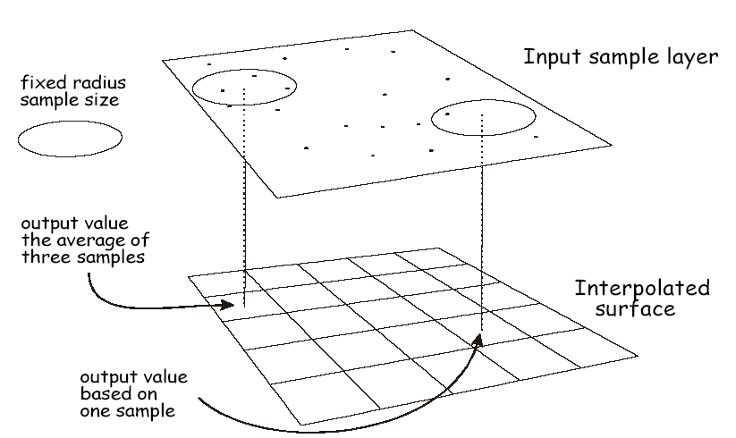

# Lab 8: Practicing with Interpolation

**Civil Engineering 414 — Engineering Applications of GIS**

Fall 2026 · Dr. Dan Ames

> [!NOTE]
> You may do this lab with one partner and each submit the same lab with both names on it. Still get
> it peer reviewed by another team/person.

## Background

This lab assignment is intended to help us explore and practice interpolation in depth. As you have
learned, there are many ways to interpolate missing data from given sample data spatially. We can use
these interpolation methods to estimate a single value M at a single given X and Y location using a
method like inverse distance weighting (IDW), Thiessen polygons, "K nearest neighbor averaging", or
any other method. However, in GIS, we usually don't want to interpolate a single value at a single
point; rather, we want to interpolate at ALL locations in a new output raster layer, given a set of
input points. It's the same principle as interpolating at a single point — but we repeat the process
at every location (i.e., the center) of every grid cell in a raster layer.

For example, Figure 1 shows using the fixed radius local averaging method to interpolate a grid cell
value at every location in a raster grid, given an input sample layer. To do this, the GIS software
just moves to the midpoint of each grid cell and then runs an interpolation function at that
location — using the input point data as the sample data.

**Figure 1.** Interpolating values in a raster at every grid cell based on input sample layer point
data (from Bolstad, *GIS Fundamentals*, 6th ed.).

## Step-by-Step Solution

### Step 1 – Get Started

- Download a DEM that covers Y Mountain in Provo, Utah.
  <!-- TODO(instructor): the handout names no download source for the Y Mountain DEM. Add the specific source (e.g. a National Map / USGS 3DEP query) so students all start from the same data. -->
- Start a new project in ArcGIS Pro and load the DEM into the map.
- Start a new model in ModelBuilder and add your DEM to the model.

### Step 2 – View and Project your True DEM

- Add the **Project Raster** tool to your model and use it to reproject the DEM into UTM NAD 83 Zone
  12 North. Make sure to set the cell size of your reprojected raster to 30 meters (don't use a
  random default cell size).
  <!-- VERIFY: coordinate system named exactly as in the source ("UTM NAD 83 Zone 12 North"). Confirm the intended CRS name/WKID in ArcGIS Pro (NAD 1983 UTM Zone 12N) before students use it. -->

### Step 3 – Get Random Samples from the True DEM

- Use the **Create Random Points** tool used in previous labs to generate 2500 random points that
  fall within the bounds of your DEM. Draw a box for the area where you want your random points as a
  new polygon shapefile. These will be created in a new shapefile or data layer.
- Use the **Extract Values to Points** tool used in previous labs to assign elevations to a new field
  in your random points layer.

<!-- TODO(instructor): the recommended course plan suggests adding a training/validation split (or repeated sampling) here — e.g. withhold a subset of the random points for independent validation rather than evaluating against every DEM cell. Not applied; this changes what students produce. -->

### Step 4 – Explore Thiessen Polygons

- Add a **Create Thiessen Polygons** tool to your model.
- Use the random points layer as the input to your Thiessen polygons tool.
- Make sure it is set to output a raster layer. Or if you output a vector layer, then add another
  tool to convert your vector polygons to raster.
- Give your output raster a meaningful name.

### Step 5 – Explore Inverse Distance Weighting

- Add three instances of the Inverse Distance Weighting (IDW) interpolation tool to your model.
- Use the random points layer as the input to your IDW tools.
- In each one, choose different values for the model parameters. Make sure to name the output raster
  layers something meaningful related to the method (IDW) and the parameter values you used.

### Step 6 – Explore Ordinary Kriging

- Add three instances of the Ordinary Kriging interpolation tool to your model.
- Use the random points layer as the input to your Kriging tools.
- In each one, choose different values for the model parameters. Make sure to name the output raster
  layers something meaningful related to the method (Kriging) and the parameter values you used.

<!-- TODO(instructor): Steps 4-6 produce seven interpolated surfaces (1 Thiessen + 3 IDW + 3 Kriging), and Step 7 then requires seven difference rasters. The recommended course plan calls for sharply reducing this count and/or reworking the lab as a low-stakes in-class practicum. Not applied; the number of required outputs is an instructor decision. -->

### Step 7 – Compare the Interpolated Results to the Original DEM – HOW??

- Each interpolated raster from each method can now be compared to the original DEM using the
  **Raster Calculator** tool.
- Add a separate Raster Calculator (you'll have 7 of them) for each of your interpolated rasters.
  Compute the difference between the original DEM ("True DEM") and the interpolated DEM by
  subtracting one from the other in the Raster Calculator.
- Name your output raster layers something meaningful like `krigingdiff.tif` or `idw1diff.tif` so
  that you can easily find them later if needed. Make sure they are all added to your map.
- Note that these rasters show the difference between your true DEM and your interpolated surfaces.
  Give them all the same color scale (e.g., -100 to 100 with a green to red gradient). It's essential
  to put them all on the same color scale, even if one only ranges from -10 to +10, so that you can
  compare differences BETWEEN the rasters, not just within a raster.

### Step 8 – Compute the Root-mean-squared-error (RMSE) for each Difference Raster

- RMSE is a common measure of the "average error" of a model or method. Each of our error maps will
  likely have values ranging from negative (where the interpolation method produced a higher value at
  a cell than the true DEM) to positive (where the interpolation method produced a lower value at a
  cell than the true DEM). Because we have negative and positive errors, we can't just compute the
  average of them. That would likely be close to zero — a lot of negative values averaged with a lot
  of positive values gets you to zero, and doesn't tell us much about the model's accuracy.
- You can compute RMSE by squaring your errors, summing them, and taking the square root of the
  result.
  <!-- TODO(instructor): this one-line summary of RMSE omits the mean. The bullets below (square, then Zonal Statistics mean, then square root) do include it, so the summary sentence contradicts the procedure that follows. Left verbatim rather than rewritten — please restate the full procedure (square the errors, take the MEAN of the squares, then the square root). -->
- To do this in your ModelBuilder model, add a Raster Calculator to each difference raster. In this
  Raster Calculator, simply compute the square of the raster cells. Give your output rasters a
  meaningful name like `krigingsquare.tif`, etc.
- Now that you have output rasters showing the squared error at every cell (only positive numbers),
  we can average them without the problem of averaging positives and negatives. To get the average of
  all the cell values, use a **Zonal Statistics** tool and choose the mean or average as the output
  statistic to be computed. This will create output rasters that have a single value — just the mean
  of all of the squared errors in all the cells.
- Use a final Raster Calculator to compute the square root of these values. This will return a new
  raster with the RMSE — the root (square root) of the mean of the squared errors for each method.

### Step 9 – Make a tool interface for your model

- Set the initial input raster DEM as a model parameter.
- Set any other parameters as model parameters that you choose.

### Step 10 – Re-run your analysis on another DEM of your choosing

- Download a DEM for a new and interesting location of your choosing (or resurrect a DEM we've used
  for another lab) and re-run your analysis using your model. Note that your model should
  automatically run for any new DEM without changing anything other than the initial input data set!
  Just use your tool interface to change the input DEM and run it.

## Example Model

![ModelBuilder canvas showing the example workflow: UtahCountyDEM into Project Raster to produce ProjectedDEM, a TestArea polygon and Create Random Points into Extract Values to Points, then Create Thiessen Polygons and IDW branches, followed by Raster Calculator difference and square steps, Zonal Statistics, and a final Raster Calculator producing RMSE.tif. Annotations read "Add the rest of the IDW analysis to compute RMSE" and "Add additional instances of IDW and Kriging with different parameters and compute RMSE for each method."](images/lab08-example-modelbuilder-model.png)

**Figure 2.** Example ModelBuilder model showing the Thiessen polygon branch worked all the way
through to RMSE, with the remaining IDW and Kriging branches left for you to add.

<!-- VERIFY: Figure 2 is a stale/unverified capture carried over from the Word handout. It was not re-shot for this migration and has not been checked against the current ArcGIS Pro ModelBuilder canvas. -->

## Deliverables

- Write a brief report, including the project requirements, interpolation tools, and parameters used.
  Follow the same report content and outline as in previous lab assignments.
- Include a single, one-page layout of your model. Make sure the model elements (data and tools) are
  labeled meaningfully.
- Create and include in your report a single, one-page, professional-looking map layout that shows
  the original DEM and all 7 of your interpolated rasters so that someone using your map layout can
  easily view and compare the interpolated surfaces. Make sure they use the same color scale and
  color ramps so they are easy to compare visually. Include text boxes for each of your interpolated
  maps, giving the interpolation method, the specific parameters chosen, and the RMSE error of each
  one.
- Create and include a second map layout for your second DEM study area.
- Make sure to have another student peer review your lab assignment and give you feedback before you
  submit it.

<!-- TODO(instructor): the recommended course plan suggests replacing the two full professional map layouts with a single comparison matrix (method x parameters x RMSE), and shifting grading toward interpretation of the methods rather than production volume. Not applied; deliverables, rubric items, and point values are instructor decisions. -->

## Grading Rubric

| Item | Points |
| --- | --- |
| Assignment Title, Name, Date, Course | — |
| Describe your model List each of the tools used List tool settings applied for the analysis (could someone repeat the assignment using your lab report?) List all input, intermediate, and output datasets Describe each input dataset, including type (point, line, polygon, raster) and the source of the data Describe each output dataset (point, line, polygon, raster) | /5 |
| Show your model One or more full pages (8.5 x 11) showing your model All text is readable (10 pt. font minimum) All tools and data sets are shown | /10 |
| Show a ModelBuilder tool interface Include a user interface for setting the input data Include a user interface for setting any other chosen parameters | /5 |
| DEM 1 Results – Y Mountain Make a full page (8.5 x 11) map showing the results of your Y Mountain analysis. Include all required map elements. Make sure your map includes the original true DEM and all 7 interpolation results. Display the RMSE error values for each method in text boxes in your map layout. Discuss your results. Which method and which parameters worked "best" and why? | /15 |
| DEM 2 Results – Your Chosen DEM Download a new DEM for an area of interest and re-run your model from your tool interface using the new dataset. Make a full page (8.5 x 11) map showing the results of your second area analysis. Include all required map elements. Discuss your results. Which method and which parameters worked "best" and why? | /15 |
| **Total points possible:** | **/50** |

<!-- TODO(instructor): the "Assignment Title, Name, Date, Course" row carries no point value in the Word original (rendered here as "—"). The five scored rows sum to 50, which matches the stated total, so this row appears to be worth 0 points. Confirm whether it should carry points or be folded into another row. -->

<!-- Migration notes (2026-09-03): source: /Users/dan/ames-sync/Work/Teaching/CE 414 Engineering Applications of GIS/Labs/Lab 8 - Practicing with Interpolation.docx; ArcGIS Pro version verified against: NOT VERIFIED in this migration; images renamed from fig-NN: fig-01.png -> lab08-fixed-radius-interpolation-concept.png, fig-02.png -> lab08-example-modelbuilder-model.png; stale/unverified screenshots: lab08-example-modelbuilder-model.png (ModelBuilder canvas carried over from Word, not re-shot or re-verified); TODO(instructor): no download source given for the Y Mountain DEM (Step 1); training/validation split or repeated sampling not added (Step 3); seven-interpolation / seven-difference-raster volume not reduced and lab not converted to a low-stakes in-class practicum (Steps 4-7); RMSE summary sentence omits the mean and contradicts the steps below it (Step 8) — left verbatim, not rewritten; two full map layouts not replaced with a comparison matrix and grading not re-weighted toward interpretation (Deliverables); rubric title row carries no point value (Rubric); VERIFY: CRS wording "UTM NAD 83 Zone 12 North" (Step 2), stale Figure 2 screenshot; dead/redirected links: none — the source document contains no URLs -->
