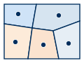
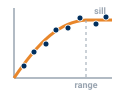
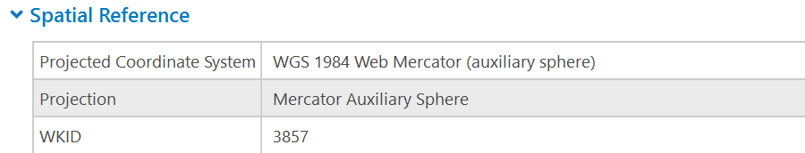
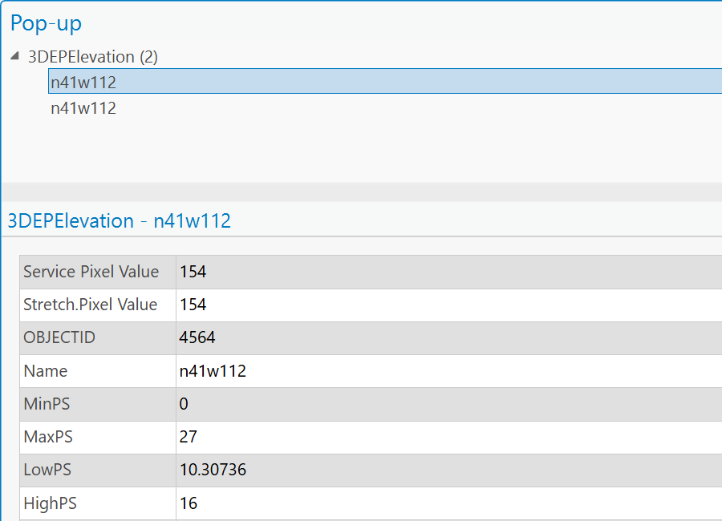
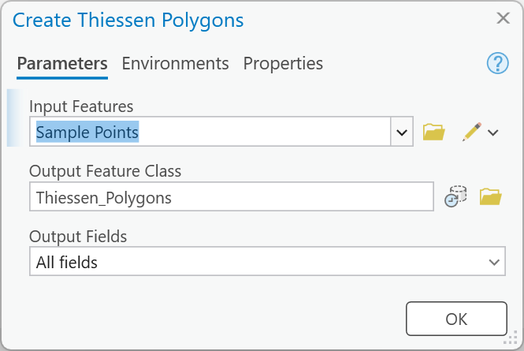

# Lab 8: Interpolation Explorer

**Civil Engineering 414 — Engineering Applications of GIS**

Fall 2026 · Dr. Dan Ames

*Rebuilding a mountain from samples, three ways, and measuring how wrong each one is*

<!-- **Revision notes.** Drafted October 6, 2026 beside the September 3 migration of the Word handout (kept, unlinked, at docs/assignments/lab08-backup/) and promoted October 7, 2026, with the instructor accepting every recommendation in tools/labs-09-11-plan.md section 4 and tools/lab08/PARITY_PLAN.md.

*Changes to what the lab asks students to do:* one study area (the second DEM is gone); a hosted
extract and study rectangle instead of "download a DEM and draw a box"; a look at the 3DEP image
service in Step 1 (the Week 9 tie-in); three methods carried all the way to RMSE instead of seven
surfaces and seven difference chains; the number of points, the IDW power and the Kriging
semivariogram exposed as parameters; a Step 10 sensitivity table at a personal random seed with
200 independent checkpoints; Map 1 is one comparison sheet; individual work, not pairs; rubric in
five parts of ten.

*Corrections:* RMSE is the root of the **mean** of the squared errors (the handout's summary left
out the mean); the coordinate system is named as ArcGIS Pro names it; Figure 1 (a reproduced
textbook figure) is replaced by a measured profile.

*Simplified October 7, 2026 (instructor's request):* students now receive `True_DEM` (projected,
30 m, clipped) and three hosted point sets (250, 2,500, 10,000; seed 1) instead of projecting,
clipping and sampling the DEM themselves. The model shrinks from 20 tools to 16 and from 12
parameters to 9; the sample points are the parameter instead of a number of points and a random
seed. The personal seed survived outside the model at first (Step 8: Create Random Points + Extract Values to
Points with the BYU ID digits). The Snap Raster / ERROR 010654 trap is gone (True_DEM is an input),
and IDW/Kriging now fill RASTERVALU by themselves (the CID default came from Create Random Points).

*Simplified again October 7, 2026 (instructor's request):* no personal point set; Step 8 is five
tool-dialog runs on the course's sets, and the per-student element is run 5's IDW power = 1 + (last
two digits of the nine-digit BYU ID) / 40. Checkpoints (seed 99) are hosted in the zip.

*Figures:* Figures A and B are generated from the data (`tools/lab08/make_svgs.py`); the example
maps are real ArcGIS Pro layouts (`build_figures.py`); Figure C and every step figure come from a
GUI build in ArcGIS Pro 3.7.1 at 175 % on October 7, 2026 (`C:\Ames\Lab09GUI\Lab08.aprx`). -->

> [!TIP]
> **Start from the report template.** [`lab08-report-template.docx`](lab08-report-template.docx)
> has the title block, a section for every deliverable, the tables already set up with the columns the
> rubric asks for, and the rubric at the end ready to fill in. You are welcome to write your report
> any way you like — the template is a floor, not a ceiling — but if you use it and fill in every
> section, you will not have left a graded item out.

## Background

Every elevation model, rainfall map and groundwater surface you will use as an engineer started as
points: survey shots, rain gauges, wells. Something turned those points into a surface, and that
something was an **interpolator**. In this lab the interpolator *is* the subject; in Lab 9 you will
use one (IDW) as a tool, to rebuild the plain under Big Southern Butte.

The idea is simple. To estimate a value at one place you look at the samples around it and combine
them: take the nearest one (**Thiessen**, or nearest neighbor), average the nearby ones with the
closest weighted most (**inverse distance weighting**, IDW), or weight them by a model of how fast
values stop resembling each other with distance (**Kriging**). A GIS does this at the center of
every cell of an output raster (Bolstad, *GIS Fundamentals*, Chapter 12). Each method has a
personality, and you can see it in the result: Thiessen makes terraces, IDW makes bull's-eyes around
its samples and can never go above the highest one, Kriging smooths.

What you usually cannot do is check the answer, because the true surface is the thing you do not
have. Here you do. We sampled a real elevation model of Y Mountain at random points; you rebuild it
from those points three ways, and subtract each rebuild from the truth, cell by cell. That gives you
a map of where each method fails and one number, the root-mean-square error (RMSE), for how badly.

**Figure B.** One row of cells across the study area, the truth and three surfaces rebuilt from only
250 points. Look at the ridge near kilometer 6.5: no method can put back a peak it never sampled.

How close a rebuild comes depends on choices you make: the method, its parameters, and above all how
many points you give it. In Step 8 you vary them, see how far the RMSE moves, and use what moves to
decide which method you would trust with a surface you cannot check.

> [!IMPORTANT]
> **Your job — see the deliverables below.** Build one ModelBuilder model that takes a set of sample
> points, rebuilds the surface by Thiessen polygons, IDW and Kriging, and reports each rebuild's error
> map and RMSE; run it on Y Mountain; test how the number of points and each method's parameters
> change the errors; and make two map sheets.

## Problem Statement

You are given a 30 m elevation model of Y Mountain and the valley below it — the truth — and three
sets of random points that sampled it. Using them:

1. Rebuild the surface from the points by Thiessen polygons, IDW and ordinary Kriging.
2. Map each rebuild's error against the true elevation model, and compute its RMSE.
3. Find out which method and which settings rebuild this mountain best, and where every method fails.

## Analysis Considerations

Every one of these is a decision somebody made, and every one of them can change the answer.

- **The truth.** The elevation model is treated as exact. It is not — it is itself a product of
  interpolation from lidar and older sources — but here it is the reference everything else is
  measured against. Your RMSE says how well you rebuilt the DEM, not how well anything matches the
  ground.
- **The cell size.** The DEM was projected to 30 m cells, as engineering-scale terrain work often
  does, and every surface is built on that grid. A finer grid would make the truth rougher and the
  errors bigger.
- **The samples.** 250, 2,500 or 10,000 random points in a 60.6 km² rectangle; at 2,500, about one
  point for every 27 cells. Random points cluster in some places and leave gaps in others, and the
  gaps are where the errors are. The course's three sets were drawn once, with a fixed random seed,
  so everyone's numbers match this page.
- **The method and its parameters.** Thiessen has none. IDW has a **power** (how fast a sample's
  influence falls off with distance; 2 is the default) and a number of neighbors (12). Kriging has a
  **semivariogram model** (spherical is the default) fitted to the points, and a number of neighbors
  (12). Every default is somebody's guess about a typical surface; Step 8 tests the guesses.
- **The measure of error.** RMSE weights large errors heavily, because it squares them. It is one
  number for the whole rectangle, and most of the rectangle is flat valley floor that every method
  gets right. Look at the error maps, not just the number.
- **The coordinate system.** **NAD 1983 UTM Zone 12N** in meters, so that cells are square and
  distances, which every interpolator depends on, are in meters in every direction.

## Data

> [!IMPORTANT]
> **Set up your folder before you download anything.** On the lab machines, work on the **D:
> drive**: one folder for this class named after you, `D:\Smith\`, and one folder per lab inside
> it, `D:\Smith\Lab08\`. The **C: drive is locked**, and a **network drive** is slow enough to make
> ArcGIS Pro hang. **Never use a space** in a folder or file name you create — raster tools fail on
> them without saying why. **Back up your lab folder at the end of every session.** The full set of
> conventions is on the [ArcGIS Tips and Reminders](../../arcgis-tips.md){ target="_blank" } page.

| Layer | What it is | How you get it |
| --- | --- | --- |
| `lab08-y-mountain\Lab08.gdb\True_DEM` | The DEM projected to UTM 12N at 30 m and cut to the study rectangle: the truth | Prepared for you, in the zip |
| `lab08-y-mountain\Lab08.gdb\Sample_Points_250`, `_2500`, `_10000` | Random points in the rectangle, each with the `True_DEM` value under it in `RASTERVALU` | Prepared for you, in the zip |
| `lab08-y-mountain\Lab08.gdb\Checkpoints` | 200 more random points in the rectangle, never used to interpolate; Step 8 tests the surfaces at them | Prepared for you, in the zip |
| `lab08-y-mountain\Lab08.gdb\Study_Area` | The study rectangle, on `True_DEM`'s 30 m grid | Prepared for you, in the zip |
| `YMountain_DEM.tif` | The source: USGS 3D Elevation Program, 1/3 arc-second DEM, tile n41w112 | In the zip, for its metadata and for Step 1 |
| 3DEP elevation image service | The same elevations, served live | A web service you add in Step 1 |

- **Download:** [`lab08-y-mountain.zip`](../../data/lab08-y-mountain.zip) (2.4 MB). Unzip it into
  your Lab08 folder — the files are in a `lab08-y-mountain` folder inside it — and read
  `READ-ME-FIRST.txt`.

**What we already did for you.** Every step below is one you have done in an earlier lab, so we did
them once, carefully, and handed you the results; your model starts where the interpolation starts.

1. **Project Raster** (Labs 4 and 5): `YMountain_DEM.tif` to NAD 1983 UTM Zone 12N, bilinear,
   30 m cells.
2. **Extract by Mask** (Lab 4): the projected DEM cut to `Study_Area`, a rectangle drawn well
   inside it with its corners on the 30 m grid. The result is `True_DEM`.
3. **Create Random Points**: 250, 2,500 and 10,000 points inside `Study_Area`, with the
   **Random Number Generator** environment set to seed 1, so the points are the same every time.
4. **Extract Values to Points** (Lab 9): the `True_DEM` value under each point, written to
   `RASTERVALU`.

We drew `Checkpoints` the same way, 200 points with a different seed, and attached no values.

> [!TIP]
> **Check the data:** `True_DEM` has **67,337** cells with values, from **1,368.5 to 2,896.5** m
> (mean **1,819.8**). `Sample_Points_250`, `_2500` and `_10000` have exactly that many points, each
> with the fields `OBJECTID`, `Shape` and `RASTERVALU`; at 2,500 points `RASTERVALU` runs from
> **1,368.7 to 2,886.7** m and the first point (`OBJECTID` 1) is at about **444,603.3 E,
> 4,453,723.7 N**. `Study_Area` is one rectangle of **60.6 km²** (8.67 × 6.99 km).

> [!NOTE]
> The samples never include the true highest cell (2,896.5 m): the tallest of the 2,500 is
> 2,886.7 m. Keep that number in mind in Steps 3 to 5.

![Infographic: the six metadata questions — What, Where, When, Why, How and Who — answered for the Y Mountain DEM: bare-earth elevation in meters above NAVD 88 on 1/3 arc-second cells, about 10.3 m north-south and 7.9 m east-west; Provo and the mountain front east of it, stored in latitude and longitude, with True_DEM its projection to UTM Zone 12N; tile n41w112 published May 20, 2026 from sources collected 1946 to 2023; the 3D Elevation Program's general-purpose seamless layer, playing the truth in this lab; a window cut from the tile with values unchanged; USGS, public domain. A footer says the DEM's own errors never show up in the RMSE.](images/lab08-dem-metadata.svg)

**Figure A.** The six metadata questions, applied to the DEM. Confirm three of the values yourself —
the publication and source dates, the vertical datum and units, and the cell size —
in `READ-ME-FIRST.txt`, in `YMountain_DEM.tif`'s properties in ArcGIS Pro, and in the tile's
[metadata file](https://prd-tnm.s3.amazonaws.com/StagedProducts/Elevation/13/TIFF/current/n41w112/USGS_13_n41w112.xml){ target="_blank" }
— and say in your report what each one does to your result.

## ModelBuilder Tools

New in this lab:

| Tool | What it does |
| --- | --- |
| { .tool-icon } **Create Thiessen Polygons** (Analysis) | Draws, around every point, the polygon of all the places nearer to it than to any other point. Given the points' values, it is nearest-neighbor interpolation. Needs an Advanced license. [Tool reference](https://pro.arcgis.com/en/pro-app/latest/tool-reference/analysis/create-thiessen-polygons.htm){ target="_blank" } |
| { .tool-icon } **IDW** (Spatial Analyst) | Interpolates a raster surface from points, each cell a weighted average of its nearest points, the nearest weighted most. [Tool reference](https://pro.arcgis.com/en/pro-app/latest/tool-reference/spatial-analyst/idw.htm){ target="_blank" } |
| { .tool-icon } **Kriging** (Spatial Analyst) | Interpolates a raster from points, weighting the neighbors by a semivariogram: a curve fitted to how much the values differ as the distance between them grows. [Tool reference](https://pro.arcgis.com/en/pro-app/latest/tool-reference/spatial-analyst/kriging.htm){ target="_blank" } |
| { .tool-icon } **Zonal Statistics as Table** (Spatial Analyst) | Like Zonal Statistics, but writes the statistics of each zone to a table instead of a raster — here, the mean of the squared errors inside the study rectangle. [Tool reference](https://pro.arcgis.com/en/pro-app/latest/tool-reference/spatial-analyst/zonal-statistics-as-table.htm){ target="_blank" } |

Tools you already know: **Polygon to Raster**, **Raster Calculator** (Labs 2 and
4–7), **Calculate Field** (Lab 6), and model parameters. Step 8 also uses **Extract Multi Values to
Points** and **Summary Statistics**.

## Example Model

![The finished ModelBuilder model, exported as a vector diagram. Sample Points, marked P, feeds three branches: Create Thiessen Polygons then Polygon to Raster (Thiessen_Surface); IDW with IDW Power, marked P (IDW_Surface); and Kriging with Semivariogram, marked P (Kriging_Surface, and an unused Output variance of prediction raster). True_DEM and each surface feed a Raster Calculator (Error_Thiessen, Error_IDW and Error_Kriging, all marked P); each error goes to a second Raster Calculator that squares it, then Zonal Statistics as Table over Study_Area (each with an unused Output Join Layer), then Calculate Field, ending in RMSE Thiessen, RMSE IDW and RMSE Kriging, all marked P.](images/lab08-full-model.svg)

**Figure C.** The finished model, exported from ModelBuilder — **click it to open it full size**.
Read it left to right: the sample points are rebuilt into a surface three ways; each rebuild is
subtracted from `True_DEM`, squared, averaged over the rectangle and square-rooted. The nine
elements marked `P` become the tool dialog of Step 8.

## Complete the Lab

For an advanced GIS student, the information up to this point is all you need to complete the
assignment. Feel free to try the analysis using only the information above. If you complete the lab
without the step-by-step instructions below, say so in your report.

## Step-by-Step Solution

> [!NOTE]
> **Important Note #1.** Steps 0–7 build the model and run it on the course's 2,500 points, so your
> numbers can be checked against this page. Step 8 re-runs the same model on other points and with
> other settings. Build it once, and build it to be changed.

> [!NOTE]
> **Important Note #2.** Every check value on this page was measured on the files you download, with
> the steps below, in ArcGIS Pro 3.7.1, and should match to the last digit shown. The screenshots
> were captured in the same version, building this model, and their paths start with `C:\` because
> they were made on an instructor machine.

### Step 0 — Set Up the Project

1. Create a new project named `Lab08` in `D:\Smith\Lab08\` with the **Map** template; if you already
   made the folder, uncheck **Create a folder for this local project**. ArcGIS Pro makes a project
   geodatabase and toolbox beside it, `Lab08.gdb` and `Lab08.atbx`. The downloaded data stay in their
   own `lab08-y-mountain\Lab08.gdb`; this page always says which of the two it means.
2. Add `True_DEM`, `Study_Area`, `Checkpoints` and the three `Sample_Points_` layers from
   `lab08-y-mountain\Lab08.gdb`, and `YMountain_DEM.tif` (click **OK** to build pyramids and
   statistics).
3. Confirm Spatial Analyst is licensed and that your license level is **Advanced** (**Project** ▸
   **Licensing**); Create Thiessen Polygons needs it. The lab machines have both.
4. On the **Analysis** tab click **ModelBuilder**. On the **ModelBuilder** tab click
   **Properties**, set **Name** to `InterpolationExplorer` and **Label** to `Interpolation Explorer`,
   and save.
5. On the **ModelBuilder** tab click **Environments** and set (type a name in the search box to
   find it):
    - **Current Workspace** and **Scratch Workspace**: your project geodatabase
    - **Cell Size**: `30`
    - **Snap Raster**: `True_DEM`
    - **Extent**: click the second button above the boxes, which lists the map's layers, and choose
      `True_DEM`. The boxes fill with its corners in latitude and longitude; that is fine.

**Figure 0.** ModelBuilder ▸ Environments. Leave Output Coordinate System empty: everything you use is
already in UTM.

> [!WARNING]
> **Set all three: Cell Size, Snap Raster and Extent.** Without the cell size, IDW and Kriging pick
> one from the spread of the points. Without the snap raster, they place their cells wherever their
> points' box puts them, and the subtraction in Step 6 compares cells offset by part of a cell.
> Without the extent, they fill only the box around the points; with 250 points that box misses
> strips along the edges, and those cells drop out of the RMSE. Nothing reports an error in any of
> these cases.

### Step 1 — Look at the Service

The same elevations are served live on the web. Before you use the prepared data, look at what the
service gives you.

1. On the **Map** tab, in the **Layer** group, click **Add Data From Path** (the yellow button
   beside the basemap gallery), paste
   `https://elevation.nationalmap.gov/arcgis/rest/services/3DEPElevation/ImageServer`, and click
   **Add**. It is slow; give it a minute.
2. Right-click the new `3DEPElevation` layer ▸ **Properties** ▸ **Source**. Expand **Raster
   Information** and **Spatial Reference** and record the columns and rows, the cell size, the pixel
   type and the coordinate system. Look at the layer's legend in the Contents pane, too.
3. On the **Map** tab click **Go To XY**, enter longitude **−111.58865** and latitude **40.21415**,
   and drop a marker there. This is the highest cell of `YMountain_DEM.tif`. Click the marker with
   **Explore**: the pop-up reports the service. Turn the service layer off and click again to read
   the DEM.
4. Remove the service layer and the marker's graphics layer. The rest of the lab runs on the prepared
   data.

**Figure 1a.** Add Data From Path, with the 3DEP elevation service.

**Figure 1b.** What came back: 1 m cells covering the whole country — 747 TB if you could download it
— in **8-bit unsigned** pixels.

**Figure 1c.** The service's coordinate system: Web Mercator, not the latitude and longitude of the
extract, and not UTM.

**Figure 1d.** The service at the highest cell of the extract. The value is **154**, not an
elevation; the source item is tile `n41w112`, the same tile the extract was cut from.

> [!TIP]
> **Check the result:** the service arrives drawn as a **hillshade**, with a legend from 0 to 255.
> That is the service's default *raster function*: the server turns elevations into a picture before
> sending them, and that is why the pixel type is 8-bit and the pop-up reads **154** at the marker.
> `YMountain_DEM.tif` reads about **2,893 to 2,897 m** there, depending on exactly which cell your click lands
> in (the highest cell is 2,896.9 m).

> [!NOTE]
> **Why not just use the service?** A service is convenient and always current, but what comes back
> depends on the request: here a shaded picture in Web Mercator rather than elevations in meters, and
> it can change whenever the USGS updates it. An analysis that others must check needs a fixed copy
> with a known date, which is why the course hosts one. Say in your report which of the two you would
> cite in an engineering report, and why.

### Step 2 — Choose the Sample Points

The sample points are the model's main input, and the one you will change most, so make them a
parameter before anything else uses them.

1. Add **Create Thiessen Polygons** to the model (Step 3 fills it in), and in its **Input Features**
   choose `Sample_Points_2500` from the map layers.
2. In the model, right-click the new `Sample_Points_2500` oval ▸ **Rename** it `Sample Points`, and
   right-click it ▸ **Parameter**.

Every tool that follows takes `Sample Points` — choose it under **Model Variables** in each tool's
list, not the map layer of the same set — so that changing this one input in Step 8 changes all three
methods at once.

> [!NOTE]
> **Why make the points a parameter?** In Step 8 you run the model on 250 and 10,000 points as well.
> With the points as a parameter, each of those runs is one choice in the tool dialog.

### Step 3 — Build the Thiessen Surface

1. **Create Thiessen Polygons**: **Input Features** `Sample Points`, output `Thiessen_Polygons`,
   **Output Fields** **All fields**.
2. Add **Polygon to Raster**: **Input Features** `Thiessen_Polygons`, **Value field**
   `RASTERVALU`, **Cell assignment type** Cell center, **Cellsize** 30 (it fills in from the
   environment), output `Thiessen_Surface`.

**Figure 3a.** Create Thiessen Polygons, with **All fields**.

**Figure 3b.** Polygon to Raster, with the value field changed to `RASTERVALU`.

> [!WARNING]
> **Two defaults here give a surface with no elevations in it.** Create Thiessen Polygons opens at
> **Output Fields: Only feature ID**, which leaves the polygons with no `RASTERVALU` at all. Polygon
> to Raster then fills **Value field** with `OBJECTID` by itself — a surface of polygon numbers, and
> no error. Choose **All fields** in the first, and `RASTERVALU` in the second.

> [!TIP]
> **Check the result:** **2,500** polygons, one per point. `Thiessen_Surface` runs from **1,368.7 to
> 2,886.7** m — exactly the range of the samples, because every cell simply takes the value of its
> nearest point.

### Step 4 — Build the IDW Surface

Add **IDW** (the Spatial Analyst tool; the search also offers a 3D Analyst and a Geostatistical
Analyst one): **Input point features** `Sample Points`, **Z value field** `RASTERVALU` (it fills in
by itself), **Output cell size** `30`, **Power** 2, **Search radius** Variable with 12 points, output
`IDW_Surface`. Then right-click the tool ▸ **Create Variable** ▸ **From Parameter** ▸ **Power**,
rename the new oval `IDW Power` (select it and press **Ctrl+R**), and make it a parameter.

**Figure 4.** IDW.

> [!TIP]
> **Check the result:** `IDW_Surface` runs from **1,368.7 to 2,885.5** m. IDW is a weighted average,
> so it can never go above its highest point or below its lowest: compare with the data check.

### Step 5 — Build the Kriging Surface

Add **Kriging** (Spatial Analyst): **Input point features** `Sample Points`, **Z value field**
`RASTERVALU`, output `Kriging_Surface`, **Kriging method** Ordinary, **Semi-variogram model**
Spherical, **Output cell size** `30`, **Search radius** Variable with 12 points. Leave **Lag size**
at the 30 it fills in, the range, sill and nugget empty, and the optional variance raster empty.
Then right-click the tool ▸ **Create Variable** ▸ **From Parameter** ▸ **Semivariogram
properties**, rename the oval `Semivariogram`, and make it a parameter. In the tool dialog it shows
the same controls as here: in Step 8 you pick another model from its **Semi-variogram model** list.

**Figure 5.** Kriging. The range, sill and nugget stay empty: Kriging fits them to your points.

> [!TIP]
> **Check the result:** `Kriging_Surface` runs from **1,368.7 to 2,884.3** m. Kriging *can* go beyond
> its samples; here it does not, and it pulls the peak down a little further than IDW.

### Step 6 — Map the Errors

Add **Raster Calculator** (Spatial Analyst) three times, one per surface, each the truth minus the
rebuild. Double-click `True_DEM` in the calculator's **Rasters** list to put it in the expression;
it joins the model as an input.

| Expression | Output |
| --- | --- |
| `"%True_DEM%" - "%Thiessen_Surface%"` | `Error_Thiessen` |
| `"%True_DEM%" - "%IDW_Surface%"` | `Error_IDW` |
| `"%True_DEM%" - "%Kriging_Surface%"` | `Error_Kriging` |

The quickest way to the second and third: select the first Raster Calculator, **Ctrl+C**, click
empty canvas, **Ctrl+V**, drag the copy clear, and edit its expression and output. A positive error
means the surface came out too **low** there; a negative error, too **high**. Give all three the same
diverging color scheme with the same class breaks (the example maps use −100, −50, −20, −5, 5, 20,
50, 100 m), so that the same color means the same error on every map.

**Figure 6.** The Thiessen error. Type the output name last and check it before **OK**: Raster
Calculator puts back the old name when the expression changes.

> [!TIP]
> **Check the result:**
>
> | Error raster | Minimum | Maximum | Mean |
> | --- | --- | --- | --- |
> | `Error_Thiessen` | −234.1 | 214.3 | −0.39 |
> | `Error_IDW` | −136.8 | 169.9 | −0.84 |
> | `Error_Kriging` | −104.0 | 164.4 | −0.31 |
>
> Every mean is under a meter: the errors cancel. That is why the next step squares them.

### Step 7 — Compute the RMSE

The root-mean-square error is the typical size of an error, whatever its sign: **square** every
cell's error, take the **mean** of the squares over the rectangle, and take the **square root**.
Build the chain once for Thiessen, then copy it twice:

1. **Raster Calculator**: `Square("%Error_Thiessen%")`, output `SqError_Thiessen`.
2. **Zonal Statistics as Table**: **Input raster or feature zone data** `Study_Area`, **Zone field**
   `OBJECTID`, **Input value raster** `SqError_Thiessen`, **Statistics type** Mean (it opens at
   All), output table `RMSE_Thiessen`.
3. **Calculate Field**: **Input Table** `RMSE_Thiessen`, **Field Name** `RMSE`, **Field Type**
   Double (it opens at Text), **Expression Type** Python, and in the box under `RMSE =`,
   `math.sqrt(!MEAN!)`. Rename its output oval `RMSE Thiessen`.

Copy the square Raster Calculator twice and edit it for IDW and Kriging. Then select the Zonal
Statistics as Table and Calculate Field tools and their outputs, copy and paste them twice, and in
each copy change only the value raster and the output table (`SqError_IDW` and `RMSE_IDW`;
`SqError_Kriging` and `RMSE_Kriging`): the copied Calculate Field follows its table by itself. Rename
the outputs `RMSE IDW` and `RMSE Kriging`.

Finally make the outputs parameters: the three error rasters and the three `RMSE` ovals. With
`Sample Points`, `IDW Power` and `Semivariogram`, that is nine. Save, and run the model inside
ModelBuilder.

**Figure 7a.** Squaring the Thiessen error.

**Figure 7b.** Zonal Statistics as Table, with **Mean**.

**Figure 7c.** Calculate Field. The warning beside Field Name only says the field will be added.

> [!TIP]
> **Check the result:** each table has one row (the zone field appears as `OBJECTID_1`) with
> **COUNT 67,337** and **AREA 60,603,300** (m²).
>
> | Table | MEAN (m²) | RMSE (m) |
> | --- | --- | --- |
> | `RMSE_Thiessen` | 800.3 | **28.29** |
> | `RMSE_IDW` | 428.9 | **20.71** |
> | `RMSE_Kriging` | 209.0 | **14.46** |
>
> If COUNT is smaller, an interpolator's output does not cover the whole rectangle — check the
> **Extent** environment of Step 0. At 2,500 points it can look right without it; at 250 it does not.
> The whole model runs in under ten seconds inside ModelBuilder.

### Step 8 — Test the Choices

The ranking at the defaults is *a* result, not *the* result. It came from one set of random points
and three sets of default parameters. Find out how much of it survives a change.

**First, the checkpoints and Map 1.** Your Step 7 run is your **baseline**, and its surfaces are
still on disk because you ran it inside ModelBuilder. Use them now, before any run from the tool
dialog (see the warning below). In real work you would not have a true DEM; you would hold back some
measured points and test against them. `Checkpoints` is 200 such points, drawn separately from the
samples and never used to interpolate:

1. **Extract Multi Values to Points** on `Checkpoints` (from the downloaded geodatabase; export a
   copy to your project geodatabase first, so the download stays clean) with `True_DEM` (output field
   name `TRUE_Z`), `Thiessen_Surface` (`TH_Z`), `IDW_Surface` (`IDW_Z`) and `Kriging_Surface`
   (`KR_Z`).
2. **Calculate Field** three times, new Double fields: `SQ_TH` = `(!TRUE_Z! - !TH_Z!) ** 2`,
   `SQ_IDW` = `(!TRUE_Z! - !IDW_Z!) ** 2`, `SQ_KR` = `(!TRUE_Z! - !KR_Z!) ** 2`.
3. **Summary Statistics** on your copy of `Checkpoints`: the **Mean** of `SQ_TH`, `SQ_IDW` and
   `SQ_KR`. The square root of each mean is that method's **checkpoint RMSE**.

Then make Map 1 (see the Deliverables) from the baseline's surfaces and error rasters.

> [!WARNING]
> **Finish Map 1 and the checkpoints before the first dialog run.** A run from the tool dialog deletes
> everything that is not a parameter (Lab 5 saw it), including the three surfaces Map 1 and
> the checkpoints need. The downloaded data are inputs, so they are never deleted.

**Then the tool dialog.** Save the model, close it, and open it from the **Catalog** pane
(**Toolboxes** ▸ `Lab08.atbx` ▸ **Interpolation Explorer**). Run it **five times**, giving every
output a name that says which run it is (`RMSE_IDW_n250`, `Error_Kriging_gauss`). Before each run,
empty the Semivariogram's **Major range**, **Partial sill** and **Nugget** boxes if a previous run
filled them, so that Kriging fits its model to the points afresh.

| Run | Sample Points | IDW Power | Semi-variogram model |
| --- | --- | --- | --- |
| 1 | `Sample_Points_250` | 2 | Spherical |
| 2 | `Sample_Points_10000` | 2 | Spherical |
| 3 | `Sample_Points_2500` | 1 | Exponential |
| 4 | `Sample_Points_2500` | 3 | Gaussian |
| 5 | `Sample_Points_2500` | **your own power** (below) | Spherical |

Runs 3 and 4 change IDW and Kriging at once; that is fine, because they are in different branches
and each RMSE comes from its own branch.

**Your own IDW power.** Every student tries a different power in run 5, worked out from your
**BYU ID number**: the **nine-digit number printed on your BYU ID card**, such as `123456789`. It is
**not your NetID**, the user name of letters and numbers you chose and use to sign in to BYU sites.

> **Your power = 1 + (the last two digits of your BYU ID) ÷ 40**
>
> - BYU ID `123456789`: the last two digits are **89**, so the power is 1 + 89 ÷ 40 = **3.225**.
> - BYU ID `987654302`: the last two digits are **02**, so the power is 1 + 2 ÷ 40 = **1.05**.
> - Last two digits **00**: the power is **1**.
>
> Every power falls between 1 and 3.475. Type it with all its decimals, and write your BYU ID's last
> two digits and your power in your report: the grader checks your run 5 against them.

**Figure 8.** The model as a tool, set up for run 5 with the example ID ending in 89 (power 3.225).
Lag size may show empty in the dialog; Kriging fills it in.

> [!TIP]
> **Check run 5:** only the IDW RMSE changes; the Thiessen and Kriging RMSEs are the same as your
> Step 7 run (28.29 and 14.46). With the example power of 3.225, IDW's RMSE is **20.29** m.

Record **all of it in one table**: your baseline (Step 7) and the five runs, each with the sample
points, the IDW power and semivariogram model, and the RMSE of all three methods, plus one more row
with the three checkpoint RMSEs of your baseline.

Then answer, in your report:

1. **Which method wins, and does the ranking survive?** Rank the methods at 250, 2,500 and 10,000
   points, with your numbers. Does the winner change? How much does going from 250 to 10,000 points
   buy each method?
2. **Which parameter mattered, and which barely did?** Compare what the IDW power (powers 1, 2, 3 and
   yours) and the semivariogram model did with what the number of points did. Before you explain the
   Gaussian run, look at its `Error_Kriging` map (an output, so the dialog run keeps it): where are its
   largest positive errors, the places the surface came out too low?
3. **Could you have known without the truth?** Compare each method's checkpoint RMSE with its RMSE
   over all 67,337 cells. Would 200 checkpoints have told a client the right ranking, and how far off
   would the number you quoted have been?

> [!TIP]
> Before you run the 10,000-point set, predict its RMSEs from your 250 and 2,500 results. Then look
> at where on the error maps the remaining error lives, and at the slope of the ground there.

## Deliverables

Make **two** professional map layouts (letter size, landscape is easiest):

1. **Your baseline comparison sheet** — from your Step 7 run: the true DEM with the
   sample points and the three surfaces in one row, **on one elevation color scale**; the three error
   rasters beneath their surfaces **on one diverging color scale** with the same breaks; each panel
   labeled with its method, its parameters and its RMSE; legends for both scales; a title, neat
   line, north arrow and scale bar; and a text box with your name, the date, the map projection, the
   DEM's source and date.
2. **One scenario from Step 8** — whichever run most changes the picture: its three error rasters
   on Map 1's error scale with a legend, each labeled with its method, parameters and RMSE (the true
   DEM and the surfaces are optional); a title, neat line, north arrow and scale bar; and a text box
   with your name, the date, the map projection, and the DEM's source and date. Say in
   the title and the text box what changed from Map 1 and by how much.

Write a brief report (2–3 pages of text, plus your figures and maps) covering:

- a title block — assignment title, your name, the date and the course — and the name of your
  peer reviewer
- the requirements of the project and your approach to solving it
- **a description of your model** a reader could repeat from: each tool and its settings, and every
  input, intermediate and output dataset with its type
- **one** full-page figure of your model, exported from ModelBuilder (**Export ▸ Export To
  Graphic**), and **one** screen capture of its tool dialog with the sample points, the IDW power
  and the semivariogram exposed; and **upload your project's toolbox** (`Lab08.atbx`, in your project
  folder) with the report — the grader opens it and runs it at your IDW power
- **the three metadata values** for the DEM — its publication date and source dates, its vertical
  datum and units, and its cell size — and **what the service returned** in Step 1, what each
  means for your result, and which of the two you would cite in an engineering report
- your **check values from Steps 3 to 7**, on the course's 2,500 points: each surface's range, the
  error table, and the three RMSEs
- **where the methods break**: on your baseline's error map for the best method (lowest RMSE), the cell with the
  largest error in either direction — its coordinates and size — and why the ground there defeats
  the interpolators, with a cropped figure of the spot. Its value is the raster's minimum or maximum
  (**Properties** ▸ **Source** ▸ **Statistics**), whichever is farther from zero. To find it, give
  the layer a two-class symbology with the break just short of that value, so that one cell stands
  out, and click it with **Explore** to read its coordinates
- your **sensitivity table** from Step 8, with your BYU ID's last two digits and your IDW power, and your answers to its three questions
- **a copy of the rubric below with your self-assessment filled in** — a score in every row,
  honestly arrived at. The grader will compare it with theirs.

> [!NOTE]
> **Make it yours.** Everyone works from the same data, so the numbers will match a classmate's; the
> choices should not. Your map layouts, your color ramps and symbology, the labels you give your
> model's elements, and the wording of your report are your own work. Submissions whose layouts,
> labels or symbology match another student's too closely are flagged for follow-up.

> [!IMPORTANT]
> **Peer review before you submit.** Have another student in the class read your report against
> the rubric and give you feedback, then act on that feedback before the deadline. Name your
> reviewer in the report and say in a sentence what you changed because of them.

**Credit line for your maps:** Elevation: USGS 3D Elevation Program, 1/3 arc-second DEM, tile
n41w112 (May 2026). Study area: drawn for CE 414.

## References

Bolstad, P. *GIS Fundamentals: A First Text on Geographic Information Systems*. Eider Press.
Chapter 12, the Week 9 reading on interpolation (any of the 5th to 7th editions).

U.S. Geological Survey, 3D Elevation Program. 1/3 arc-second DEM, tile n41w112, published May 20,
2026.

U.S. Geological Survey, 3D Elevation Program. 3DEP Elevation image service.
[elevation.nationalmap.gov](https://elevation.nationalmap.gov/arcgis/rest/services/3DEPElevation/ImageServer){ target="_blank" }.

## Example Maps

These are examples, not templates. Your maps carry your name, so your
numbers will differ a little from these.

![Example comparison sheet titled "Rebuilding Y Mountain from 2,500 Points: Kriging Comes Closest". Top row: the true DEM with 2,500 black sample points, then the Thiessen, IDW and Kriging surfaces, all on one green-to-brown-to-white elevation scale over a hillshade; the Thiessen surface is visibly faceted. Second row: the three error maps on one red-to-blue scale, labeled Thiessen error RMSE 28.29 m, IDW error RMSE 20.71 m, Kriging error RMSE 14.46 m; the valley floor is pale everywhere, and the mountain front is a mottle of red and blue, finest-grained for Thiessen and palest for Kriging. Legends, north arrow, scale bar and a text box at the bottom.](images/lab08-example-map-baseline.png)

**Figure 9.** A comparison sheet on the course's 2,500 points. Two things to do better than this example:
mark and label the largest error on the best method's error map, and use the empty band below the
error maps for a sentence on what the reader should notice.

**Figure 10.** The kind of second map Step 8 asks for. Yours needs only the error maps, and should
be the run that most changes what a reader would conclude, which may not be this one.

## Rubric for Interpolation Explorer

Fifty points in five parts of ten. The bullets say what each part is worth, so you know exactly
what to submit.

| Item | Points |
| --- | --- |
| **Write-up** (2–3 pages) • Assignment title, your name, date and course; your peer reviewer named, with a sentence on what you changed because of them (1) • The requirements of the project and your approach to solving it, in your own words (1) • The three metadata values for the DEM and what the service returned in Step 1, what each means for your result, and which you would cite (2) • Your check values from Steps 3 to 7, on the course's 2,500 points (2) • Where the methods break: the largest error on your baseline's error map for the best method, its coordinates and size, with a cropped figure, and why the ground there defeats the interpolators (3) • Organized writing, figures numbered and referred to, sources credited, rubric pasted with your self-assessment (1) | /10 |
| **ModelBuilder model** — correct and working • The model runs end to end from its tool dialog and, on the course's 2,500 points, matches the three RMSE check values (4) • A full-page model figure exported from ModelBuilder, all tools and datasets readable (2) • A screen capture of the tool dialog with the sample points, the IDW power and the semivariogram exposed as parameters (2) • A description of the model a reader could repeat from (2) | /10 |
| **Map 1 — your baseline comparison sheet** • Title, neat line, north arrow and scale bar (1) • Text box with author, date, map projection, and the DEM's source and date (1) • The true DEM with the sample points and the three surfaces on one elevation scale, with a legend (2) • The three error maps on one diverging scale with the same breaks, with a legend (2) • Every panel labeled with its method, parameters and RMSE (2) • Layout, scale and legibility: a reader can compare the panels at a glance (2) | /10 |
| **Map 2 — one Step 8 scenario** • Title, neat line, north arrow and scale bar (1) • Text box with author, date, map projection, and the DEM's source and date (1) • The scenario's three error maps on Map 1's error scale, with a legend (2) • Every panel labeled with its method, parameters and RMSE (2) • Title and text box say what changed from Map 1 and by how much (2) • Layout, scale and legibility (2) | /10 |
| **Sensitivity** (Step 8) • One table with your baseline and the five Step 8 runs — including run 5 at your own IDW power, with your BYU ID's last two digits — the RMSE of all three methods in every row, and a row with your baseline's three checkpoint RMSEs (4) • Which method wins and whether the ranking survives, with your numbers (2) • Which parameter mattered and which barely did, with your numbers (2) • What the checkpoints would and would not have told you (2) | /10 |
| **Total** | **/50** |

> [!NOTE]
> **Using AI on this lab.** Use AI freely to understand a tool, work out an error, or
> tighten your write-up, and add one line at the end of your report saying what you used it
> for. Do not take a field name, an expression, a coordinate system, or a number from it —
> those come from your own data, and the rubric asks you to defend every one. See the
> [AI Use Policy](../../policies/ai-policy.md) for the full policy.

<!-- Migration notes (draft 2026-10-06, promoted 2026-10-07).
SOURCE: "Lab 9 - Practicing with Interpolation.docx" (instructor's copy in Downloads, saved 2026-10-06), whose September 3 migration is archived at docs/assignments/lab08-backup/README.md; rebuilt to tools/lab-conversion-guide.md per tools/labs-09-11-plan.md section 4 (accepted 2026-10-06) and tools/lab08/PARITY_PLAN.md.
ARCGIS PRO: 3.7.1, arcpy (tools/lab08/run_model.py, extra_checks.py, chain_check.py, extent_check.py) and a GUI build on 2026-10-07 at 175 % (C:\Ames\Lab09GUI\Lab08.aprx, model InterpolationExplorer, set up by tools/lab08/gui_project.py; captures in caps\). Every check value reproduced in the GUI: first point, sample range, surface ranges, error table, ZSaT COUNT/AREA/MEAN and RMSE 28.29 / 20.71 / 14.46; a tool-dialog run at 250 points gave 80.73 / 69.46 / 50.38 (the oracle values) in 1 min 54 s; a full ModelBuilder run 1 min 34 s.
GUI FACTS (2026-10-07): Snap Raster True_DEM breaks every tool-dialog run (ERROR 010654, the output True_DEM is the same as the snap raster) - environments are now Snap Raster DEM_UTM and Extent = YMountain_DEM.tif from the layer list (fills in degrees; Study_Area from the layer list also fills in degrees; browsing to True_DEM gives UTM but True_DEM is a model output); with these the surfaces cover all of DEM_UTM, so Kriging's minimum is 1,368.5 (outside the rectangle) while the RMSEs are unchanged. Create Variable > From Environment > Random Number Generator exposes the seed as a parameter (Random Seed). Semivariogram properties can be a parameter; after a run its dialog shows the fitted range/sill (10950 / 513125.9) but a 250-point dialog run still refit (50.38). Defaults that silently give wrong surfaces: Thiessen Output Fields Only feature ID; Polygon to Raster Value field OBJECTID; IDW and Kriging Z value field CID; Zonal Statistics as Table Statistics All; Calculate Field Field Type Text. Kriging writes one extra cell on each side of the extent. Project Raster proposes 9.06 m. The service arrives through its Hillshade raster function: 40,075,015 x 20,498,394 cells of 1 m, 747.13 TB, unsigned char 8 bit, WGS 1984 Web Mercator (auxiliary sphere) WKID 3857; Explore at the highest cell reads Service Pixel Value 154, item n41w112, LowPS 10.30736. Dialog runs delete DEM_UTM, True_DEM, Sample_Points and the three surfaces. Copying a Zonal Statistics + Calculate Field chain keeps the Calculate Field wired to its own table. The copied blank project pre-filled Output Coordinate System in the model environments (cleared) and carried Lab01.atbx and Lab01.gdb.
DATA: docs/data/lab08-y-mountain.zip, 1,885,312 bytes: YMountain_DEM.tif (window -111.68 -111.57 40.20 40.27 of USGS_13_n41w112, published 2026-05-20, source dates 1946-2023; 1,188 x 756 float32, 1,368.03-2,896.92 m, no NoData) and Lab08.gdb\Study_Area (442,514.873-451,184.873 E, 4,450,507.050-4,457,497.050 N, on DEM_UTM's 30 m grid). Built by tools/lab08/fetch_dem.py, run_model.py, make_extract.py.
VERIFIED NUMBERS (seed 1 ACM599): DEM_UTM 314 x 262, 1,368.1-2,896.5; True_DEM 67,337 cells, 1,368.5-2,896.5, mean 1,819.8; first point 444,603.3 E 4,453,723.7 N; samples 1,368.7-2,886.7; Thiessen 2,500 polygons, surface 1,368.7-2,886.7, error -234.1/214.3 mean -0.39, MEAN 800.3, RMSE 28.29; IDW 1,368.7-2,885.5, error -136.8/169.9 mean -0.84, MEAN 428.9, RMSE 20.71; Kriging 1,368.7-2,884.3, error -104.0/164.4 mean -0.31, MEAN 209.0, RMSE 14.46; ZSaT COUNT 67,337 AREA 60,603,300 (at seed 1 / 2,500 points also without an Extent environment, but NOT in general: the pilot found IDW and Kriging at 250 points cover only 66,297 cells without Extent = True_DEM, RMSE 69.47 / 50.24 instead of 69.46 / 50.38; Extent now set in Step 0); Calculate Field math.sqrt(!MEAN!) reproduces the RMSEs; Create Thiessen Polygons ONLY_FID leaves only Input_FID. Service: REST identify 2,896.7 at the highest cell (40.21415 N, 111.58865 W).
SENSITIVITY (do NOT publish): see tools/lab08/PARITY_PLAN.md. Points 250/1,000/2,500/10,000: Kriging 50.38/24.90/14.46/6.90; IDW power 1/2/3/5: 23.98/20.71/20.20/21.60; Kriging Gaussian 24.81, other models 14.46; checkpoints within 2-3 m of the full-grid RMSE, same ranking; seeds 2-5 never change the ranking.
GRADING ORACLE: run_model.py --seed NNNN reproduces a student's own rows of the Step 8 table (baseline, IDW 1 / exponential, IDW 3 / Gaussian, plus the checkpoint RMSEs); the course rows are fixed (package_checks.json).
SIMPLIFIED VERSION (2026-10-07): zip now carries Lab08.gdb\True_DEM and Sample_Points_250/_2500/_10000 (seed 1, CID dropped), 2,436,872 bytes, rebuilt by make_extract.py and reverified from the zip by verify_package.py (package_checks.json): 250 -> 80.73 / 69.46 / 50.38; 2,500 -> 28.29 / 20.71 / 14.46; 10,000 -> 15.71 / 10.39 / 6.90; Kriging surface min 1,368.7 with Extent = True_DEM. GUI build 2 (C:\Ames\Lab09GUI2\Lab08.aprx, set up by tools/lab08/gui_project2.py): 16 tools, 9 parameters; ModelBuilder run 7 s; dialog run on My_Sample_Points (seed 4321) 1 min 11 s gave 27.32 / 19.10 / 12.79 and IDW 3 + Gaussian (range/sill/nugget cleared) 18.54 / 25.45, both exactly the oracle. GUI facts: with hosted points IDW and Kriging fill RASTERVALU by themselves; Snap Raster and Extent can both be True_DEM (an input, so no ERROR 010654); choosing a map layer in a tool's list creates the model variable (renamed Sample Points); double-clicking True_DEM in Raster Calculator brings it in as a model variable and the expression becomes "%True_DEM%"; Kriging's Semivariogram range/sill/nugget stay empty after a run if cleared before it. Captures replaced: Figures 0, 3a, 4, 5, 6, 7b, 8a; new 8b, 8c; Figure C re-exported. Old-version captures dropped from the page: project raster, extract by mask, create random points, extract values (files deleted).
PILOT 2 (no-GUI, simplified page, 2026-10-07, C:\Ames\Pilot09b\PILOT_NOTES.md): every number reproduced from the zip, including seed 4321 (baseline 27.32 / 19.10 / 12.79; checkpoints 28.98 / 18.49 / 12.70; IDW1+exponential 22.65 / 12.79; IDW3+Gaussian 18.54 / 25.45). Fixed: Gaussian question now reads the kept Error_Kriging, not the deleted surface; project named Lab08 and downloaded vs project geodatabase distinguished; 'steps 3 and 4' renamed to the tools; example maps renumbered 9-10; 'where the methods break' is the student's own baseline; Map 2 seed wording; checkpoint RMSEs get their own table row (matches template); alt text.
PILOT (no-GUI, 2026-10-06, C:\Ames\Pilot09\PILOT_NOTES.md): every seed-1 number reproduced; checkpoint recipe works as written (seed 1: 30.38 / 23.16 / 17.12, deliberately not published). Fixed from its findings: Extent environment added (Step 0, Step 3 warning, Step 9 tip); Step 10 warning to finish Map 1 and the checkpoints before dialog runs; semivariogram parameter path spelled out; Map 2 deliverable matches its rubric row, true DEM optional; 'largest error' defined (best method, either direction) with a way to find it; True_DEM cell count without the wrong 289 x 233; citation question added to deliverables and rubric; Figure A names the three values; checkpoint output location; OBJECTID_1 zone field noted.
LICENSE: the instructor confirmed 2026-10-07 that the lab machines have the same extensions as the build machine (Advanced, Spatial Analyst), so Create Thiessen Polygons is available.
TODO(instructor): 1. A dialog run with Kriging Gaussian and the fitted range/sill left in (the page tells students to clear them). 2. Week 9 deck alignment. 3. Learning Suite due date November 7. OLD-PAGE IMAGES moved with the archive: lab08-example-modelbuilder-model.png, lab08-fixed-radius-interpolation-concept.png. -->
