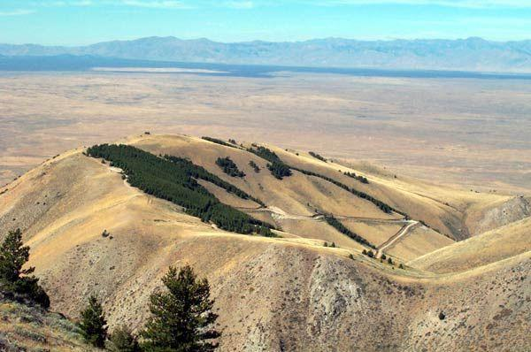
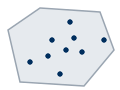
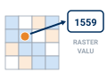
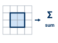

---
search:
  exclude: true
---

# DRAFT — Lab 8: Big Southern Butte

**Civil Engineering 414 — Engineering Applications of GIS**

Fall 2026 · Dr. Dan Ames

*Measuring the volume of a volcanic dome by rebuilding the plain beneath it*

> [!WARNING]
> **This is a draft for review** (October 5, 2026), written beside the assigned page. The decisions
> it rests on are in `tools/lab08/PARITY_PLAN.md`. Step figures marked TODO(capture) are owed from a
> GUI build in ArcGIS Pro.
>
> **Every number** below was measured in ArcGIS Pro 3.7.1's arcpy on October 5, 2026
> (`tools/lab08/run_model.py`, `step_checks.py`) against the hosted data.

> [!TIP]
> **Start from the report template.** `lab08-report-template.docx` (TODO: build after review) has
> the title block, a section for every deliverable, the tables already set up with the columns the
> rubric asks for, and the rubric at the end ready to fill in. You are welcome to write your report
> any way you like — the template is a floor, not a ceiling — but if you use it and fill in every
> section, you will not have left a graded item out.

## Background

Big Southern Butte rises about 760 m (2,500 ft) out of the flat lava plain of the eastern Snake
River Plain in Idaho, west of Idaho Falls. It is a **rhyolite dome**: two lobes of thick,
silica-rich lava that pushed up through the plain's basalt and merged about 300,000 years ago, and
it is among the largest rhyolite domes in the world
([USGS Yellowstone Volcano Observatory, 2023](https://www.usgs.gov/observatories/yvo/news/big-buttes-eastern-snake-river-plain){ target="_blank" }).
How much lava a dome holds is one of the numbers a volcanologist uses to compare eruptions, and
nobody can weigh a mountain. They measure it from an elevation model.



**Figure B.** Big Southern Butte from the plain. The plain looks flat; it falls gently to the north.

The trick is the ground *under* the butte. You cannot see it, so you rebuild it: sample elevations
on the plain all around the butte, interpolate a surface across the gap, and subtract that surface
from the real one. What is left is the butte, cell by cell, and adding up its cells gives its volume.
That is the same idea as Lab 6, where the water surface was the lid and the lake bed the bottom;
here the DEM is the lid and an interpolated plain is the bottom.

Every part of that recipe is a choice: where the butte ends, how many points sample the plain, and
how you interpolate between them (the Week 8 methods). In Step 9 you vary each choice and see which
moves the answer most.

> [!IMPORTANT]
> **Your job — see the deliverables below.** Build one ModelBuilder model that takes a DEM and an
> outline and returns the volume of the land inside the outline above an interpolated base surface;
> run it on Big Southern Butte; test how much the outline, the number of points, and the
> interpolation method change the volume; and make two maps.

## Problem Statement

You are given a 10 m elevation model of Big Southern Butte and the plain around it, and a reference
outline of the butte's base. Using them:

1. Rebuild the plain beneath the butte by interpolating from random points on the plain around it.
2. Compute the height of the butte above that rebuilt plain in every cell.
3. Report the butte's volume in cubic kilometers.
4. Map the height of the butte above the plain.

## Analysis Considerations

Every one of these is a decision somebody made, and every one of them can change the answer.

- **Where the butte ends.** The base of a dome blends into its apron of debris and into the lava
  flows around it. The reference outline was drawn by a rule from the DEM — every cell standing more
  than 10 m above a plane fitted to the plain — and `READ-ME-FIRST.txt` explains it. It is a
  reasonable base, not the only one. In Step 9 you draw your own.
- **The points on the plain.** Points inside the outline sample the butte, not the plain, so the
  model erases them. The rest sample a ring of plain 1,500 m wide. More points follow the plain's
  bumps more closely; fewer points smooth them out. The points are random, so two runs differ — unless
  you fix the random seed, which Step 0 does so that your numbers match this page.
- **The interpolation method.** IDW never goes above its highest point or below its lowest, so the
  rebuilt plain stays inside the range of the plain around it. A spline is smooth and can overshoot.
  Week 8 compared them; here you see what the difference does to a volume.
- **What the volume is.** The volume *above an interpolated surface*. If lava flows of the plain lap
  against the butte's lower slopes, part of the dome is buried below that surface, and no elevation
  model can see it.
- **The elevation model.** Bare earth, 1/3 arc-second cells (about 10 m), elevations in meters above
  NAVD 88.
- **The coordinate system.** A volume needs the cell size and the elevations in the same unit. The
  DEM arrives in latitude and longitude; Step 1 projects it to **NAD 1983 UTM zone 12N** in meters,
  so that each 10 m cell is 100 m² and each meter of height over it is 100 m³.

## Data

> [!IMPORTANT]
> **Set up your folder before you download anything.** On the lab machines, work on the **D:
> drive**: one folder for this class named after you, `D:\Smith\`, and one folder per lab inside
> it, `D:\Smith\Lab08\`. The **C: drive is locked**, and a **network drive** is slow enough to make
> ArcGIS Pro hang. **Never use a space** in a folder or file name you create — raster tools fail on
> them without saying why. **Back up your lab folder at the end of every session.** The full set of
> conventions is on the [ArcGIS Tips and Reminders](../../arcgis-tips.md){ target="_blank" } page.

| Layer | Where it comes from | How you get it |
| --- | --- | --- |
| `BigSouthernButte_DEM.tif` | USGS 3D Elevation Program, 1/3 arc-second DEM, two tiles joined | Prepared extract, hosted here |
| `Lab08.gdb\Butte_Boundary` | Derived from the DEM for this course (see the READ-ME) | In the same zip |

- **Download:** [`lab08-big-southern-butte.zip`](../../data/lab08-big-southern-butte.zip)
  (10.4 MB). Unzip it into your Lab08 folder — the files are in a `lab08-big-southern-butte` folder
  inside it — and read `READ-ME-FIRST.txt`.

> [!TIP]
> **Check the data:** `BigSouthernButte_DEM.tif` is **3,024 columns × 1,836 rows** of 1/3
> arc-second cells, values **1,499.8 to 2,307.1** (meters above NAVD 88), GCS North American 1983,
> no NoData cells. `Butte_Boundary` is one polygon of **28.03 km²** in NAD 1983 UTM Zone 12N.

![Infographic: the six metadata questions — What, Where, When, Why, How and Who — answered for the Big Southern Butte DEM: bare-earth elevation in meters above NAVD 88 on 1/3 arc-second cells, about 10.3 m north-south and 7.5 m east-west; a box around the butte stored in latitude and longitude, to be projected in Step 1; tiles n44w114 and n44w113 published April 7, 2026 from sources collected 1957 to 2024; the 3D Elevation Program's general-purpose seamless layer, not made to measure volcanoes; sources resampled to one grid, two tiles joined edge to edge; USGS, public domain. A footer says the cell size and vertical unit matter most for a volume.](images/lab08-dem-metadata.svg)

**Figure A.** The six metadata questions, applied to the DEM. Confirm three of the values yourself —
in `READ-ME-FIRST.txt`, in the raster's properties in ArcGIS Pro, and in the tiles'
metadata files
([n44w114](https://prd-tnm.s3.amazonaws.com/StagedProducts/Elevation/13/TIFF/current/n44w114/USGS_13_n44w114.xml){ target="_blank" },
[n44w113](https://prd-tnm.s3.amazonaws.com/StagedProducts/Elevation/13/TIFF/current/n44w113/USGS_13_n44w113.xml){ target="_blank" })
— and say in your report what each one does to your result.

## ModelBuilder Tools

New in this lab:

| Tool | What it does |
| --- | --- |
| { .tool-icon }<br>**Create Random Points** (Data Management) | Scatters a given number of points at random inside a polygon. The points have a location and nothing else. [Tool reference](https://pro.arcgis.com/en/pro-app/latest/tool-reference/data-management/create-random-points.htm){ target="_blank" } |
| { .tool-icon }<br>**Extract Values to Points** (Spatial Analyst) | Copies the raster value under each point into a new field, `RASTERVALU`. [Tool reference](https://pro.arcgis.com/en/pro-app/latest/tool-reference/spatial-analyst/extract-values-to-points.htm){ target="_blank" } |
| { .tool-icon }<br>**Erase** (Analysis) | Removes the parts of one layer that fall inside another — here, the points on the butte. [Tool reference](https://pro.arcgis.com/en/pro-app/latest/tool-reference/analysis/erase.htm){ target="_blank" } |
| { .tool-icon }<br>**IDW** (Spatial Analyst) | Interpolates a raster surface from points, each cell a weighted average of its nearest points, the nearest weighted most. [Tool reference](https://pro.arcgis.com/en/pro-app/latest/tool-reference/spatial-analyst/idw.htm){ target="_blank" } |
| { .tool-icon }<br>**Zonal Statistics** (Spatial Analyst) | A statistic of a raster's cells inside each zone — here, the sum of the cell volumes inside the outline. [Tool reference](https://pro.arcgis.com/en/pro-app/latest/tool-reference/spatial-analyst/zonal-statistics.htm){ target="_blank" } |

Tools you already know: **Project Raster** (Labs 4, 5 and 7), **Buffer** (Labs 1 and 4), **Extract by
Mask** (Lab 4), **Raster Calculator** (Labs 2 and 4–7), **Hillshade**, and model parameters. Step 9 also
uses **Spline** (Spatial Analyst), the smooth interpolator from Week 8.

## Example Model

<!-- TODO(capture): Figure C, the finished model exported with Export ▸ Export To Graphic from the GUI build. -->

**Figure C.** The finished model. Two inputs — the DEM and the outline — and one number out. The
upper branch rebuilds the plain from points around the butte; the lower branch cuts the real surface
to the outline; Raster Calculator and Zonal Statistics turn the difference into a volume.

## Complete the Lab

For an advanced GIS student, the information up to this point is all you need to complete the
assignment. Feel free to try the analysis using only the information above. If you complete the lab
without the step-by-step instructions below, say so in your report.

## Step-by-Step Solution

> [!NOTE]
> **Every check value on this page** was measured on the files you download, with the steps below,
> in ArcGIS Pro 3.7.1. With the random seed of Step 0, your numbers should match to the last digit
> shown.

### Step 0 — Set Up the Project

1. Create a new project in `D:\Smith\Lab08\` with the **Map** template; if you already made the
   folder, uncheck **Create a folder for this local project**.
2. Add `BigSouthernButte_DEM.tif` (click **OK** to build pyramids and statistics) and
   `Lab08.gdb\Butte_Boundary`. Add an imagery basemap and look at the outline against it.
3. Confirm Spatial Analyst is licensed (**Project** ▸ **Licensing**).
4. On the **Analysis** tab click **ModelBuilder**. On the **ModelBuilder** tab click
   **Properties**, set **Name** to `ButteVolume` and **Label** to `Butte Volume`, and save.
5. On the **ModelBuilder** tab click **Environments** and set:
    - **Current Workspace** and **Scratch Workspace**: your project geodatabase
    - **Random number generator**: **Seed** `1`, **Generator Type** ACM599 <!-- VERIFY in the GUI: the environment's label and that a model-level setting reaches Create Random Points -->
    - after Step 1 has run once: **Snap Raster** and **Cell Size**: `DEM_UTM`

<!-- TODO(capture): Figure 0, the Environments dialog. -->

> [!NOTE]
> **Why fix the seed?** Create Random Points draws from a random number generator. With the same seed
> it draws the same points every time, so your volume can be checked against this page. Another seed
> gives other points and a slightly different volume; Step 9 tests the choices that matter more.

### Step 1 — Project the DEM

Add **Project Raster** with `BigSouthernButte_DEM.tif` as the input:

- **Output Coordinate System**: NAD 1983 UTM Zone 12N
- **Resampling Technique**: Bilinear interpolation
- **Output Cell Size**: 10 (X and Y)
- **Output Raster Dataset**: `DEM_UTM`

<!-- TODO(capture): Figure 1, Project Raster. -->

> [!TIP]
> **Check the result:** `DEM_UTM` is **2,314 columns × 1,944 rows** of 10 m cells, values
> **1,499.8 to 2,306.8** m. The summit cell is about 0.3 m lower than in the original because
> bilinear resampling averages neighbors. The thin wedges along the edges are NoData: a latitude and
> longitude rectangle is slightly tilted in UTM.

### Step 2 — Draw the Sampling Ring

Add **Buffer** with `Butte_Boundary` as the input, **Distance** `1500` Meters, **Dissolve Type**
Dissolve all output features into a single feature, output `Points_Boundary`.

This polygon covers the butte and a ring of plain 1,500 m wide around it. The random points go here.

<!-- TODO(capture): Figure 2, Buffer. -->

> [!TIP]
> **Check the result:** `Points_Boundary` is **65.411 km²**; `Butte_Boundary` is **28.030 km²** of
> it.

### Step 3 — Sample the Plain

1. Add **Create Random Points**: **Output Location** your project geodatabase, **Output Point
   Feature Class** `Random_Points`, **Constraining Feature Class** `Points_Boundary`, **Number of
   Points [value or field]** `1000`. Right-click the number of points
   in the model ▸ **Create Variable** ▸ **From Parameter** ▸ **Number of Points**, and make that
   variable a model parameter. <!-- VERIFY the GUI path to expose Number of Points -->
2. Add **Extract Values to Points** with `Random_Points` and `DEM_UTM`, output `Points_Values`.

<!-- TODO(capture): Figures 3a and 3b, Create Random Points and Extract Values to Points. -->

> [!TIP]
> **Check the result:** 1,000 points, `RASTERVALU` from **1,531.2 to 2,277.2** m. With seed 1, the
> first point (`OBJECTID` 1) is at about **337,632.6 E, 4,806,349.7 N** — on the butte's east-southeast
> flank.

### Step 4 — Keep the Plain Points

Add **Erase**: **Input Features** `Points_Values`, **Erase Features** `Butte_Boundary`, output
`Plain_Points`.

> [!TIP]
> **Check the result:** **560** points remain, `RASTERVALU` **1,531.2 to 1,597.0** m (mean
> 1,559.4). If any point is above 1,600 m, the erase used the wrong polygon.

### Step 5 — Rebuild the Plain

Add **IDW**: **Input point features** `Plain_Points`, **Z value field** `RASTERVALU`, **Output
cell size** `10`, **Power** 2, **Search radius** Variable with 12 points, output `Plain_Surface`.

<!-- TODO(capture): Figure 5, IDW. -->

> [!WARNING]
> **Set the cell size.** IDW's default cell size comes from the extent of the points, not from the
> DEM, and is far coarser than 10 m. Type 10, and keep the Snap Raster environment on `DEM_UTM` so
> the plain's cells line up with the DEM's. <!-- VERIFY the GUI default cell size -->

> [!TIP]
> **Check the result** (after Step 6): inside the outline the rebuilt plain runs from **1,547.1 to
> 1,585.9** m, higher in the south. IDW cannot go above or below its points: compare with Step 4.

### Step 6 — Cut Both Surfaces to the Outline

Add **Extract by Mask** twice, each with `Butte_Boundary` as the mask:

1. `DEM_UTM` → `DEM_Butte`
2. `Plain_Surface` → `Plain_Butte`

<!-- TODO(capture): Figure 6, Extract by Mask. -->

> [!TIP]
> **Check the result:** each is **280,311** cells — 28.03 km² of 10 m cells, the outline's area.
> `DEM_Butte` runs from **1,554.8 to 2,306.8** m.

### Step 7 — Compute Height and Volume

Add **Raster Calculator** twice, both in the model:

1. The height of the butte above the plain, in meters, output `Height_Above_Plain`:

    ```text
    "%DEM_Butte%" - "%Plain_Butte%"
    ```

2. Each cell's volume, output `Volume_Cell`:

    ```text
    "%Height_Above_Plain%" * 10 * 10 / (1000 ** 3)
    ```

    Height times the cell's 10 m × 10 m is cubic meters; divided by 1,000³ it is cubic kilometers.
    `**` is Python's power operator.

<!-- TODO(capture): Figures 7a and 7b, the two Raster Calculators. -->

> [!TIP]
> **Check the result:** in `Height_Above_Plain` (**Properties** ▸ **Source** ▸ **Statistics**) the
> tallest cell is **729.1 m** above the plain and the mean is **183.5 m**. **53** cells at the edge
> are a fraction of a meter *below* the plain; they subtract a negligible amount.

### Step 8 — Add Up the Volume

Add **Zonal Statistics**: **Input raster or feature zone data** `Butte_Boundary`, **Zone field**
`OBJECTID`, **Input value raster** `Volume_Cell`, **Statistics type** Sum, output `Butte_Volume`.
Every cell of the output holds the same number: the sum. Read it in the layer's **Properties** ▸
**Source** ▸ **Statistics** or by clicking a cell.

Make these model parameters, and name them so the tool dialog reads well: the DEM, `Butte_Boundary`
and the number of points (inputs), and `Plain_Points`, `Height_Above_Plain` and `Butte_Volume`
(outputs). Step 9 and your maps need all three outputs.

<!-- TODO(capture): Figure 8, Zonal Statistics, and the tool dialog. -->

> [!TIP]
> **Check the result:** **5.145 km³**. As a sanity check: 28.03 km² of outline times a mean height
> of 183.5 m is 5.14 km³.

> [!WARNING]
> **A run from the tool dialog deletes everything that is not a parameter** (Labs 5 and 7 saw it),
> including `DEM_UTM`. Do Steps 1–8 from inside ModelBuilder first and record the check values before
> any dialog run. <!-- VERIFY in the GUI: a dialog run with Snap Raster and Cell Size set to DEM_UTM, after DEM_UTM has been deleted -->

### Step 9 — Test the Assumptions

The volume rests on three choices: the outline, the number of points, and the interpolation method.
Run the model from its tool dialog **four more times**, giving each output a name that says what
changed (`Butte_Volume_n250`, `Height_Above_Plain_n250`):

1. **Fewer and more points:** 250 and 4,000 (two runs).
2. **Your own outline:** in your project geodatabase, create a polygon feature class
   `My_Butte_Boundary` in NAD 1983 UTM Zone 12N. Turn off the reference outline layer, make a
   hillshade of `DEM_UTM` with the **Hillshade** tool, and digitize the base of the butte against it
   and the imagery as **one polygon** — Zonal Statistics sums each feature separately, so a second
   feature gives a second volume. Run the tool with it at 1,000 points.
3. **Another method:** save a copy of the model (**Save As**), replace IDW with **Spline**
   (Regularized, weight 0.1, 12 points, cell size 10), and run it once at 1,000 points with the
   reference outline. Leave the Processing Extent environment at its default: the spline's result
   depends on it.

For **the baseline and every run, in one table**, record what changed, the points kept after the
erase, the outline's area, the volume, the tallest cell, and the number of cells below the plain.
Where to read each:

- **Points kept:** the record count of that run's `Plain_Points` (open its attribute table).
- **Outline area:** the outline's `Shape_Area` field, in square meters.
- **Tallest cell:** that run's `Height_Above_Plain`, **Properties** ▸ **Source** ▸ **Statistics**,
  maximum.
- **Cells below the plain:** Raster Calculator, `Con("Height_Above_Plain_n250" < 0, 1)` (use the
  run's own raster), then the **Count** of value 1 in the output's attribute table. No output, or
  an empty table, means zero.

Then answer, in your report:

1. **Which choice moves the volume most,** and which least? Rank them with your numbers.
2. **What did the spline do that IDW cannot?** Map its cells below the plain and explain them with
   what you learned about the methods in Week 8.
3. **What does your number measure?** Is it the volume of the lava dome? Say what part of the dome
   the model cannot see, and what data would let you measure it.

> [!TIP]
> The random part of the model is not the part that matters most. Check how far apart your 250- and
> 4,000-point runs are before you guess.

## Deliverables

Make **two** professional map layouts:

1. **Your baseline result** — `Height_Above_Plain` from the baseline run in a clear color scale
   with a legend in meters, over a hillshade or imagery, with the reference outline, the volume in
   the title or a text box, a neat line, north arrow and scale bar, a text box with your name, the
   date, the map projection and the DEM's source and date, and an inset locating the butte in Idaho.
2. **One scenario from Step 9** — your own outline or the spline, whichever changes the picture
   more, with the same color scale as Map 1 so the two can be compared. Say on the map what changed
   and by how much.

Write a brief report (2–3 pages of text, plus your figures and maps) covering:

- a title block — assignment title, your name, the date and the course — and the name of your
  peer reviewer
- the requirements of the project and your approach to solving it
- **a description of your model** a reader could repeat from: each tool and its settings, and every
  input, intermediate and output dataset with its type
- **one** full-page figure of your model, exported from ModelBuilder (**Export ▸ Export To
  Graphic**), and **one** screen capture of its tool dialog with the outline and the number of
  points exposed
- **the three metadata values** for the DEM — its publication date and source dates, its vertical
  datum and units, and its cell size — and what each one means for your result
- your **check values from Steps 4 to 8**: the points kept, the tallest cell, and the volume
- your **sensitivity table** from Step 9 and your answers to its three questions
- **a copy of the rubric below with your self-assessment filled in** — a score in every row,
  honestly arrived at. The grader will compare it with theirs.

> [!IMPORTANT]
> **Peer review before you submit.** Have another student in the class read your report against
> the rubric and give you feedback, then act on that feedback before the deadline. Name your
> reviewer in the report and say in a sentence what you changed because of them.

**Credit line for your maps:** Elevation: USGS 3D Elevation Program, 1/3 arc-second DEM, tiles
n44w114 and n44w113 (April 2026). Butte outline: derived from the DEM for CE 414.

## References

Greeley, R. (1982). The Snake River Plain, Idaho: Representative of a new category of volcanism.
*Journal of Geophysical Research*, 87(B4), 2705–2712.
[doi:10.1029/JB087iB04p02705](https://doi.org/10.1029/JB087iB04p02705){ target="_blank" }.

Hughes, S.S., Smith, R.P., Hackett, W.R., and Anderson, S.R. (1999). Mafic volcanism and
environmental geology of the eastern Snake River Plain, Idaho. In Hughes, S.S., and Thackray, G.D.,
eds., *Guidebook to the Geology of Eastern Idaho*, Idaho Museum of Natural History, 143–168.

Lifton, Z. (2023). The Big Buttes of the Eastern Snake River Plain. *Yellowstone Caldera Chronicles*,
USGS Yellowstone Volcano Observatory, December 4, 2023.
[usgs.gov](https://www.usgs.gov/observatories/yvo/news/big-buttes-eastern-snake-river-plain){ target="_blank" }.

U.S. Geological Survey, 3D Elevation Program. 1/3 arc-second DEM, tiles n44w114 and n44w113,
published April 7, 2026.

## Example Maps

These are examples, not templates. Your maps carry your name, and your second map shows the run you
chose.

![Example baseline layout titled "Big Southern Butte: About 5.1 Cubic Kilometers Above the Plain": the height of the butte above the rebuilt plain inside the black reference outline, over a gray hillshade, in classes from pale yellow (0 to 50 m) at the edges through orange to dark red (600 to 750 m) at the two summit lobes. Below, an Idaho locator with an orange dot, a legend, north arrow, a scale bar in kilometers, and a text box: 5.145 cubic km inside the 28.03 sq km outline, tallest cell 729 m above the plain, mean height 183.5 m.](images/lab08-example-map-baseline.png)

**Figure 9.** The baseline map. Two things to do better than this example: label the summit and
one place on the plain, and show where the random points fell.


**Figure 10.** The kind of second map Step 9 asks for. Your own second map should be the run that
most changes what a reader would conclude, which may not be this one.

## Rubric for Big Southern Butte

Fifty points in five parts of ten. The bullets say what each part is worth, so you know exactly
what to submit.

| Item | Points |
| --- | --- |
| **Write-up** (2–3 pages)<br>• Assignment title, your name, date and course; your peer reviewer named, with a sentence on what you changed because of them (1)<br>• The requirements of the project and your approach to solving it, in your own words (2)<br>• The three metadata values for the DEM and what each means for your result (2)<br>• Your check values from Steps 4 to 8 (2)<br>• What the volume measures and what the model cannot see (Step 9, question 3) (2)<br>• Organized writing, figures numbered and referred to, sources credited, rubric pasted with your self-assessment (1) | /10 |
| **ModelBuilder model** — correct and working<br>• The model runs end to end from its tool dialog and its baseline volume matches the check value (4)<br>• A full-page model figure exported from ModelBuilder, all tools and datasets readable (2)<br>• A screen capture of the tool dialog with the outline and the number of points exposed as parameters (2)<br>• A description of the model a reader could repeat from (2) | /10 |
| **Map 1 — your baseline** (full page, 8.5 × 11)<br>• Title, with the volume in it or in a text box (1)<br>• Neat line, north arrow and scale bar (1)<br>• Text box with author, date, map projection, and the DEM's source and date (1)<br>• Height above the plain in a clear color scale with a legend in meters (2)<br>• The outline over a hillshade or imagery (1)<br>• An inset locating the butte in Idaho (2)<br>• Scale and legibility appropriate to the butte (2) | /10 |
| **Map 2 — one Step 9 scenario** (full page, 8.5 × 11)<br>• Title, with the volume in it or in a text box (1)<br>• Neat line, north arrow and scale bar (1)<br>• Text box with author, date, map projection, and the DEM's source and date (1)<br>• Height above the plain in the same color scale as Map 1, with a legend (2)<br>• The outline used, over a hillshade or imagery (1)<br>• Title and text box say what changed from Map 1 and by how much (2)<br>• Scale and legibility appropriate to the butte (2) | /10 |
| **Sensitivity** (Step 9)<br>• One table with the baseline and the four Step 9 runs (250 and 4,000 points, your own outline, the spline), with the points kept, the outline area, the volume, the tallest cell and the cells below the plain (4)<br>• Which choice moves the volume most and least, ranked with your numbers (3)<br>• What the spline did that IDW cannot, mapped and explained (3) | /10 |
| **Total** | **/50** |

> [!NOTE]
> **Using AI on this lab.** Use AI freely to understand a tool, work out an error, or
> tighten your write-up, and add one line at the end of your report saying what you used it
> for. Do not take a field name, an expression, a coordinate system, or a number from it —
> those come from your own data, and the rubric asks you to defend every one. See the
> [AI Use Policy](../../policies/ai-policy.md) for the full policy.

<!-- Draft notes (2026-10-05).
SOURCE: the September 3 migration of "Lab 7 - Big Southern Butte.docx" (docs/assignments/lab-08/README.md, still the assigned page), rebuilt to tools/lab-conversion-guide.md. Plan and decisions: tools/lab08/PARITY_PLAN.md.
CORRECTIONS carried: second-DEM Part 2 dropped (decision 1); 30 m -> 10 m and 30 * 30 -> 10 * 10; "Mosaic To New Raster or Project Raster" -> Project Raster only (the hosted extract is already one raster); SQL-threshold rubric item replaced; "3.0 to 6.0 km3 depending on your polygon" replaced by a check value on a hosted outline; uncited "one of the largest volcanic domes on Earth" and dead BLM flyer replaced by the USGS YVO article; Godchaux et al. 1992 (western plain) dropped; dead water.usgs.gov and nationalmap.gov links dropped; model-variable names in the Raster Calculator expression now match the step outputs.
DATA: docs/data/lab08-big-southern-butte.zip, 10,371,981 bytes: BigSouthernButte_DEM.tif (window -113.17 -112.89 43.32 43.49 of USGS_13_n44w114 + n44w113, both published 2026-04-07; 3,024 x 1,836 float32, 1,499.84-2,307.13 m, no NoData) and Lab08.gdb\Butte_Boundary (make_outline.py, threshold 10 m). Built by tools/lab08/fetch_dem.py, make_outline.py, make_extract.py.
SENSITIVITY (do NOT publish): IDW 5.145; Natural Neighbor 5.029; Spline 4.481 (11,963 cells below the plain); Kriging 4.988; Trend 5.312; 250 pts 5.229; 500 5.199; 2,000 5.103; 4,000 5.062; seeds 2-6 5.146-5.161; outline -200/-100/+100/+200 m: 4.846/5.008/5.236/5.322.
PILOT (no-GUI, 2026-10-05, C:\Ames\Pilot08\PILOT-REPORT.md): every check value reproduced from the student zip (volume 5.14502), and the Step 9 runs (250: 146 kept, 5.2288; 4,000: 2,302 kept, 5.0617; Spline 4.4811, 11,963 below) match. Fixed from its findings: Height_Above_Plain is now a model output (Step 7 split in two) and Plain_Points/Height_Above_Plain are output parameters so dialog runs keep what Step 9 and Map 2 need; Step 9 says where to read each table value (Con < 0 count verified: 53 baseline, 11,963 spline); four runs, not 'at least three'; own outline must be one polygon, reference layer turned off; seed promise removed; photo is Figure B; tools-you-know lab numbers corrected; columns x rows, edge NoData, ESE; Map 1 deliverable lists the rubric's elements. Still open: template link (build after review), the draft box citing PARITY_PLAN.md (removed at promotion).
GUI facts owed: the Random Numbers environment label and reach; exposing Number of Points; IDW's default cell size; dialog-run deletion of intermediates. -->
