# Lab 9: Wind Farm Site Selection

**Civil Engineering 414 — Engineering Applications of GIS**

Fall 2026 · Dr. Dan Ames

*Using raster analysis.*

## Background

Recent advances in clean energy research and ongoing efforts to update energy sources and reduce
carbon emissions have led to a rise in wind energy farms. To maximize efficiency, it's crucial to
analyze their locations based on criteria like consistent high winds and expansive flat plains. GIS
technology, leveraging various elevation and wind pattern datasets, provides an effective and
efficient way to evaluate different sites.

## Problem Statement

We selected several counties in South Dakota for analysis to identify the optimal site for a new
wind farm. The counties include Minnehaha, Moody, Lake, McCook, Turner, and Lincoln. South Dakota
was chosen because its topography and wind patterns make it a common location for wind farms.
Additionally, these counties are near cities that could benefit from increased electrical power
sources. You will conduct your analysis twice: first for this collection of counties, then for a
collection of counties you select in South Dakota.

<!-- TODO(instructor): STUDY-AREA CONTRADICTION #1 of 2. This paragraph names Minnehaha, Moody,
     Lake, McCook, Turner, and Lincoln counties, which are all in *southeastern* South Dakota, and
     the example map (Figure 28) shows that same southeastern corner. The "Spatial Considerations"
     paragraph below says "Suppose you are planning to develop a new wind farm in western South
     Dakota." Both wordings are preserved verbatim; pick one and correct the other. -->

## Spatial Considerations

Suppose you are planning to develop a new wind farm in western South Dakota. Several factors can
influence your decision on the placement, but for this lab exercise, you'll concentrate on the
following:

<!-- TODO(instructor): STUDY-AREA CONTRADICTION #2 of 2. Exact wording here: "Suppose you are
     planning to develop a new wind farm in western South Dakota." Exact wording in the Problem
     Statement above: "We selected several counties in South Dakota for analysis... The counties
     include Minnehaha, Moody, Lake, McCook, Turner, and Lincoln." Those counties are in
     southeastern South Dakota. Not resolved here — instructor decision. -->

- The area's average wind speed must be at least 7 m/s
- It must be within 30 miles of a town or city
- It must be within 2 miles of a main road
- It must not be within 20 miles of a current wind farm
- It must not be within 1 mile of a river

<!-- TODO(instructor): RIVER BUFFER CONTRADICTION, occurrence 1 of 4. This criterion says
     "It must not be within 1 mile of a river." Step 3's instruction text says "a 2-mile buffer
     around the Roads and Rivers." The Buffer Rivers dialog (Figure 11) shows 1 Mile. The model
     canvas labels the output "Rivers 2mi Buffer" (Figures 1, 8, and 13). Not resolved here. -->

<!-- TODO(instructor): The criteria above mix hard exclusions (wind speed >= 7 m/s; not within
     20 miles of an existing wind farm; not within 1 mile of a river) with what are really
     preferences (proximity to a town and to a road). The Step 6 / Step 7 procedure flattens all
     five to 0/1 and then weights them, so an "excluded" cell can still score highly if the other
     factors carry enough weight. Recommend separating a Boolean exclusion mask (applied with Times
     or Con) from the weighted preference layers. Pedagogy change — not made here. -->

<!-- TODO(instructor): Factor scores are not normalized before combining. Every reclassified input
     is 0/1 (Step 6) and the Weighted Sum weights in Figure 23 are raw integers 7/6/4/3/2 that do
     not sum to 1. Recommend normalizing each factor to a common 0-1 (or 1-10) scale and using
     weights that sum to 1 so the output score is interpretable. Pedagogy change — not made here. -->

<!-- TODO(instructor): The lab asks for one weighting and never tests it. Recommend requiring a
     weight-sensitivity comparison: run Weighted Sum at least twice with different defensible
     weight sets and have students report how (or whether) the selected site moves. Would need a
     matching rubric row. Not added here. -->

<!-- TODO(instructor): The analysis CRS is never stated. All buffers are in miles and all rasters
     must align, so the lab needs an explicit projected coordinate system set on the map and in the
     geoprocessing environment before Step 1. The student example map (Figure 28) records
     "NAD 1983 Zone 14" in its text box, which is consistent with NAD 1983 UTM Zone 14N for eastern
     South Dakota, but the handout never asks for it. Not asserted in the text here. -->

<!-- TODO(instructor): The geoprocessing environment settings that make a cell-by-cell raster
     overlay valid are never specified: snap raster, processing extent, mask, and resampling
     method. Step 6 only says "it is essential for all raster data sets you create to have the same
     projection and cell size," which is necessary but not sufficient — without a common snap
     raster and extent the layers will not align cell for cell. Not added here. -->

> [!NOTE]
> This lab assignment may feel a bit like our Walmart site selection, cell phone tower placement, or
> other site selection labs we have completed this semester. However, there is a major difference:
> we are going to use a raster-based index approach where we convert each layer to a raster and
> compare them strictly using grid-based, cell-by-cell map algebra instead of using only
> vector-based analysis.

## Data

The following datasets will be needed for this project. You can either download the data from the
suggested sources or create the data you need to complete this exercise. When you download the
data, unzip it, and save it to a folder created for this lab.

| Dataset | Source |
| --- | --- |
| Local Roads | Polyline data from Open Data GIS. Go to <https://gis.sd.gov> and search for "Local Roads" |
| Major Rivers | National Hydrography Dataset (NHD) shapefile dataset. Go to <https://nationalmap.gov/> and use the data downloader to find and download the NHD for South Dakota. |
| City Boundaries | South Dakota State GIS Website Shapefile. Go to <https://gis.sd.gov> and search for "South Dakota City Boundaries". |
| County Boundaries | Polygon data from Open Data GIS. Go to <https://gis.sd.gov> and search for "South Dakota County Boundaries". |
| State Boundaries | South Dakota State GIS Website Shapefile. Go to <https://gis.sd.gov> and search for "Statewide Boundary" |
| Existing Wind Farm Locations | Point Data of locations of existing wind farms can be downloaded from the U.S. Geological Survey Wind Turbine Database (USWTDB) here: <https://eerscmap.usgs.gov/uswtdb/data/> |
| Wind Speed | Explore the data in the Wind Resource Database of the National Renewable Energy Laboratory: <https://wrdb.nrel.gov/>. You can also download JPG images of wind speed from the Department of Energy here: <https://windexchange.energy.gov/maps-data/>. (Search for South Dakota.) If you use an image, you'll need to georeference it and digitize polygons representing different wind speed regions. The simplest option here is to use the 30 meter height data and digitize the polygons from it. |

<!-- VERIFY: <https://gis.sd.gov> redirects to
     https://opendata2017-09-18t192802468z-sdbit.opendata.arcgis.com/ (HTTP 200). The redirect
     target looks like an auto-generated ArcGIS Open Data hostname; confirm the search terms above
     still return these five layers on the current site. -->

<!-- VERIFY: <https://nationalmap.gov/> redirects to
     https://www.usgs.gov/programs/national-geospatial-program/national-map (HTTP 200; returns 403
     to a non-browser user agent). Confirm the "data downloader" path for the NHD is still what a
     student would find there. -->

<!-- VERIFY: <https://wrdb.nrel.gov/> could not be reached from the migration environment (DNS for
     the whole nrel.gov domain does not resolve here, so this is not evidence the link is dead).
     Test it from a normal network before the lab is assigned. -->

<!-- VERIFY: <https://windexchange.energy.gov/maps-data/> redirects to
     https://www.energy.gov/cmei/systems/windexchange/maps-and-data (HTTP 200). Consider updating
     the printed URL to the redirect target. -->

<!-- TODO(instructor): The Wind Speed row tells students to use "the 30 meter height data," but the
     example image (Figure 3), the model's input dataset ("Wind Speed 80m"), and its clipped output
     ("South Dakota 80m Wind Raster") are all 80 m data, and the 7 m/s threshold in the Spatial
     Considerations is a plausible 80 m threshold, not a 30 m one. Data-source decision — not
     changed here. -->

<!-- TODO(instructor): The Spatial Considerations require a site "within 2 miles of a main road,"
     but the only road dataset listed is "Local Roads," and Step 2 intersects Local Roads. Decide
     whether the criterion should say local roads or whether a separate primary/main road layer
     should be added to the data table. -->

## ModelBuilder Tools

In this exercise, you will need to use tools from previous lab exercises as well as the following
new tools:

- **Weighted Sum** — This tool allows you to calculate a weighted sum. Using this tool allows us to
  assign different weights to each of our input datasets. Consider that some factors are more
  important than others, so when you are combining layers, you may want to give the more important
  factors greater weight.
- **Get Raster Properties** — This tool allows you to extract individual data values from your
  raster datasets.
- **Equal To** — This allows you to extract data that is equal to the input value.

## Model Example

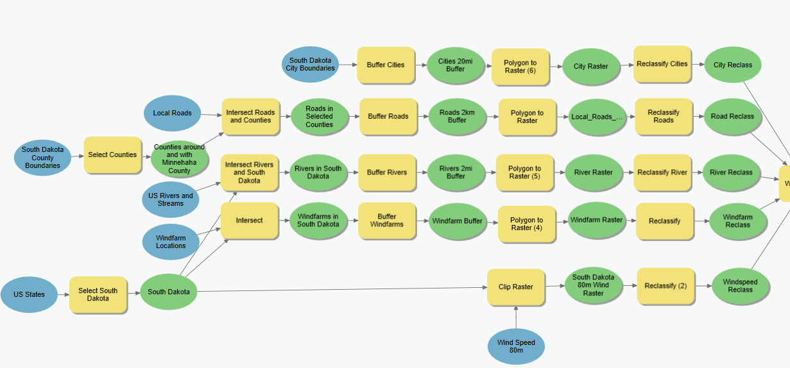

**Figure 1.** The preprocessing half of the completed model — select, intersect, buffer, convert to
raster, and reclassify, once for each input dataset.

<!-- TODO(instructor): Figure 1 is one of the six illegible ModelBuilder canvas grabs identified in
     the September 2026 image audit. It is a wide, zoomed-out screen capture; the node labels are at
     the edge of readability on screen and will not survive printing at 10 pt. It needs to be
     re-exported from ModelBuilder (Model > Export > To Graphic) rather than re-screenshotted, and
     is probably best split into two or three panels. Kept in place because the text refers to it. -->

<!-- TODO(instructor): The node labels inside Figure 1 disagree with the handout's own numbers and
     with the tool dialogs: the canvas reads "Cities 20mi Buffer" where the text and Figure 9 both
     say 30 miles; "Roads 2km Buffer" where the text and Figure 10 both say 2 miles (km vs. mi);
     and "Rivers 2mi Buffer" where Figure 11 shows 1 mile. Screenshots cannot be edited — the model
     must be rebuilt and re-exported once the buffer distances are settled. -->

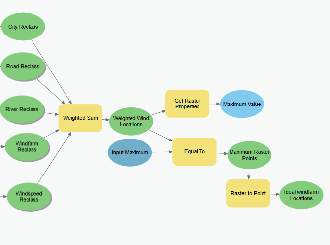

**Figure 2.** The analysis half of the completed model — the five reclassified rasters feed Weighted
Sum, and the maximum value of the result is used to extract the ideal wind farm locations.

## Complete the Lab

For an advanced GIS student, the information provided so far may be all you need to complete the
assignment and generate an output map from the results. Feel free to try conducting the analysis
using only the information above. If you complete the lab using only the info above (without the
step-by-step instructions below), be sure to indicate this in your lab report to qualify for extra
credit. If you need additional help, follow the step-by-step solution below.

## Step-by-Step Solution

<!-- TODO(instructor): This step-by-step section runs about 21 pages in the Word original and 26 of
     the lab's 28 figures sit inside it. Recommend restructuring into a short core brief (criteria,
     required outputs, environment settings, deliverables) plus a clearly labeled appendix holding
     the click-by-click walkthrough, so the analytical decisions are not buried in tool dialogs.
     Structural change to the assignment — not made here. -->

### Step 0

Either download raw wind speed data in shapefile or raster format from the links provided, or
download an image of wind speed and digitize the polygons of wind speeds. For the second approach,
we need to build our own wind speed raster using the JPG image downloaded from the Department of
Energy. This will require using the georeferencing tools learned in a previous lab to assign the
image a spatial location and projection. Next, you will either need to digitize the main polygons of
wind speed or convert your polygons to a raster. You can also convert the JPG to a raster and
reclassify the results from color codes to wind speeds. Regardless, the goal is to obtain a
georeferenced raster dataset showing the average wind speed regionally across South Dakota.

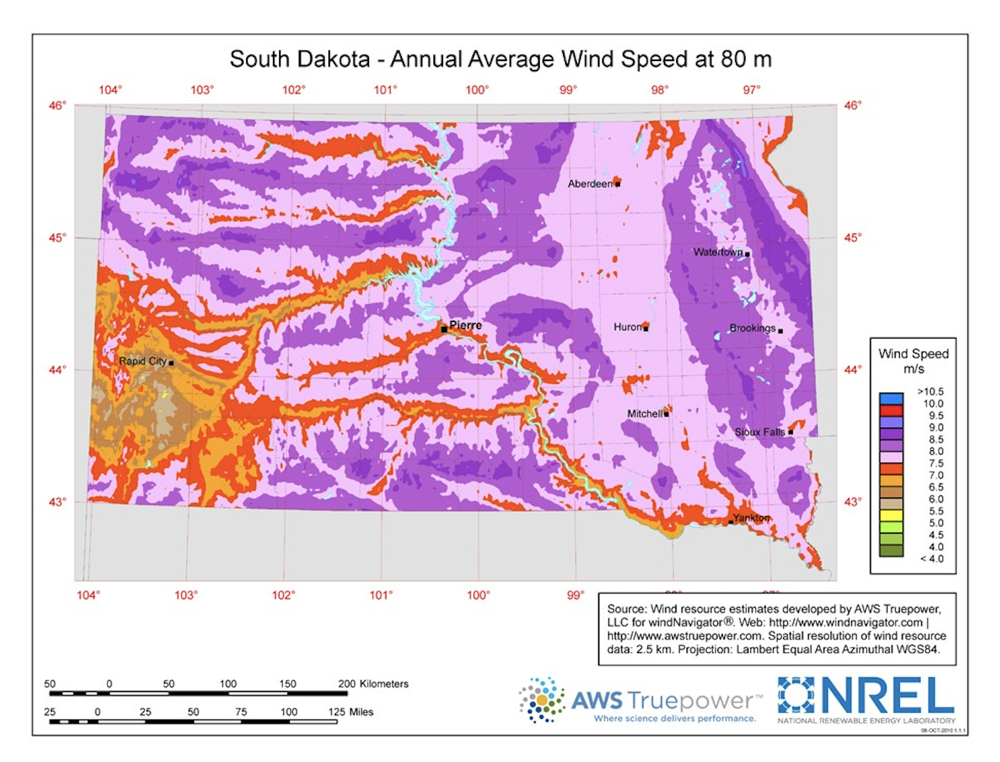

**Figure 3.** An annual average wind speed map for South Dakota — the kind of JPG you would
georeference and digitize in this step.

### Step 1

Use the Select tool to select the following counties: Minnehaha, Moody, Lake, McCook, Turner, and
Lincoln. We have been asked to build our wind farm in one of these counties.

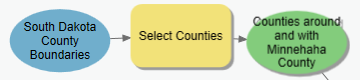

**Figure 4.** The Select step in the model.

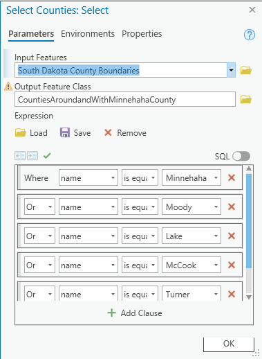

**Figure 5.** The Select tool dialog, with one clause per county name.

<!-- VERIFY: Figure 5 shows the query built on a field named "name" with values "Minnehaha",
     "Moody", "Lake", "McCook", "Turner". Confirm the field name and the exact spelling of the
     values against whichever county boundary layer is downloaded — the field is often NAME or
     NAMELSAD, and the clause list is scrolled so the Lincoln clause is not visible. -->

### Step 2

Next, we will use the Intersect tool to intersect the Local Roads with the selected counties. This
will allow us to keep the data only in the counties we are working with. Do the same for the US
Rivers and Streams and the wind farm locations.

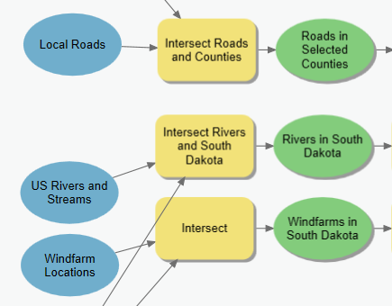

**Figure 6.** The three Intersect operations in the model.

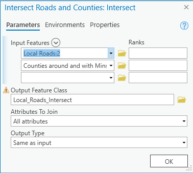

**Figure 7.** The Intersect tool dialog for the roads.

### Step 3

Next, we will use the Buffer tool to buffer each of our datasets. Each of these is shown below in
Figures 8 through 12. Make a 30-mile buffer around each of the cities, a 2-mile buffer around the
Roads and Rivers, and a 20-mile buffer around existing wind farms.

<!-- TODO(instructor): RIVER BUFFER CONTRADICTION, occurrence 2 of 4. Exact wording in this step:
     "a 2-mile buffer around the Roads and Rivers." Exact wording in the Spatial Considerations:
     "It must not be within 1 mile of a river." Figure 11 (Buffer Rivers dialog) shows a distance of
     1 Miles. The model canvas node in Figures 1, 8, and 13 is labeled "Rivers 2mi Buffer". Not
     resolved here. -->

> [!TIP]
> Don't forget to toggle the Dissolve Type to "Dissolve all output features into a single feature"!

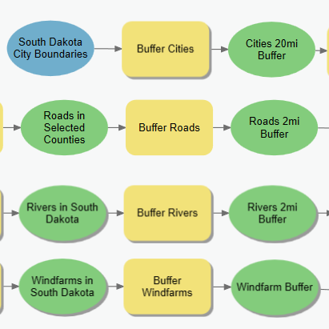

**Figure 8.** The four Buffer operations in the model.

<!-- TODO(instructor): RIVER BUFFER CONTRADICTION, occurrence 3 of 4. The rivers node in Figure 8 is
     labeled "Rivers 2mi Buffer", which contradicts the 1 Mile shown in Figure 11 and the "not
     within 1 mile of a river" criterion. Figure 8 also labels the cities output "Cities 20mi
     Buffer" while the text and Figure 9 both say 30 miles. Screenshot — cannot be corrected
     without rebuilding and re-exporting the model. -->

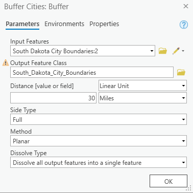

**Figure 9.** Buffer Cities — 30 Miles, dissolved into a single feature.

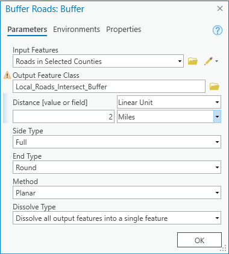

**Figure 10.** Buffer Roads — 2 Miles.

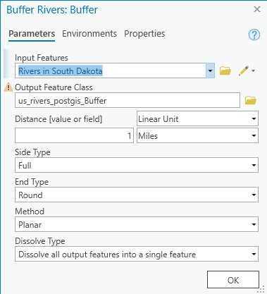

**Figure 11.** Buffer Rivers — the dialog shows 1 Mile.

<!-- TODO(instructor): RIVER BUFFER CONTRADICTION, occurrence 4 of 4. This screenshot shows a
     Distance of "1" with units "Miles", agreeing with the Spatial Considerations criterion and
     disagreeing with Step 3's "2-mile buffer around the Roads and Rivers" and with the "Rivers 2mi
     Buffer" node label in Figures 1, 8, and 13. Not resolved here. -->

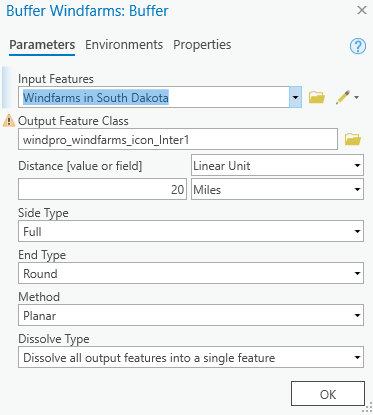

**Figure 12.** Buffer Windfarms — 20 Miles.

### Step 4

Next, we will use the Polygon to Raster tool on each dataset. Set the Cell Size to 1.

<!-- TODO(instructor): The cell size of 1 is given with no units and no justification. Its meaning
     depends entirely on the (unspecified) analysis CRS: 1 meter in a UTM-based CRS produces an
     enormous raster over six South Dakota counties, while 1 foot or 1 degree would each be worse.
     The source wind data in Figure 3 is 2.5 km resolution, so nothing in the analysis supports a
     1-unit cell. Recommend stating an explicit cell size with units (for example, a few hundred
     meters) and explaining how it was chosen from the coarsest input. Value left at 1 as
     written. -->

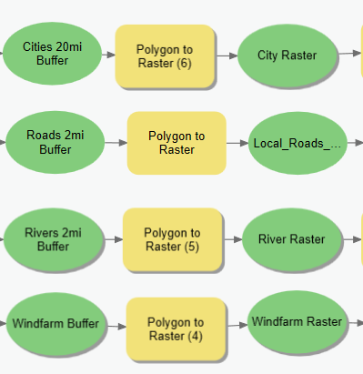

**Figure 13.** The four Polygon to Raster conversions in the model.

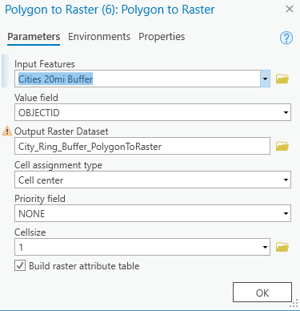

**Figure 14.** The Polygon to Raster dialog — note the Cellsize of 1.

<!-- VERIFY: Figure 14 uses OBJECTID as the Value field. Because the buffers were dissolved into a
     single feature, every polygon carries OBJECTID = 1, which is what makes the Step 6
     reclassification of "1 -> 1, NODATA -> 0" work. Confirm this is intended rather than
     incidental, and that OBJECTID exists on the buffer outputs in the student's workspace. -->

### Step 5

Use the Clip Raster tool to clip the wind speed raster data to the county boundaries data that we
created earlier.

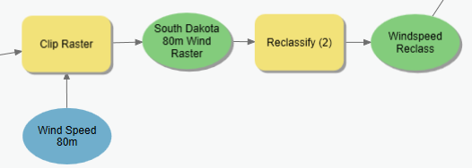

**Figure 15.** The Clip Raster step, producing the clipped wind speed raster.

<!-- VERIFY: The text says the wind speed raster is clipped "to the county boundaries data that we
     created earlier," but in Figures 1 and 15 the clip input comes from the "Select South Dakota"
     branch off US States — that is, the state boundary, not the six selected counties. Confirm
     which extent is intended. -->

### Step 6

Next, use the Reclassify tool to reclassify each raster dataset. This allows us to separate the
desirable areas to build a wind farm from the undesirable areas. We will assign a value of 1 to the
desirable areas and 0 to the undesirable areas.

> [!IMPORTANT]
> It is essential for all raster datasets you create to have the same projection and cell size.
> Also, ensure there are no spaces in your file names or folder paths.

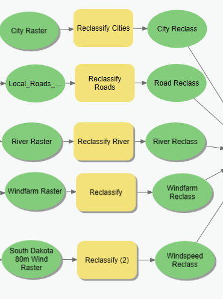

**Figure 16.** The five Reclassify operations in the model.

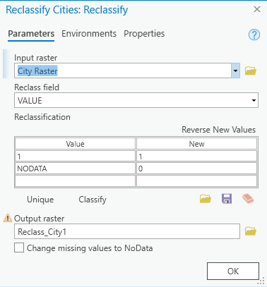

**Figure 17.** Reclassify Cities — inside the 30-mile city buffer is desirable (1).

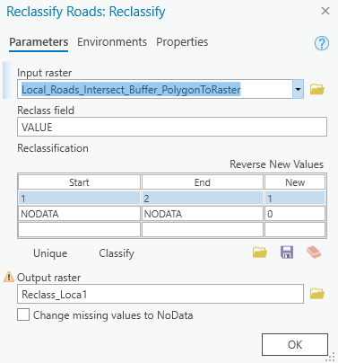

**Figure 18.** Reclassify Roads — inside the road buffer is desirable (1).

**Figure 19.** Reclassify River — the mapping is reversed, because being inside the river buffer is
undesirable (0).

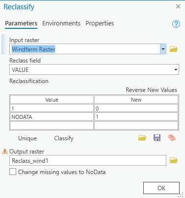

**Figure 20.** Reclassify Windfarm — reversed as well, because being near an existing wind farm is
undesirable (0).

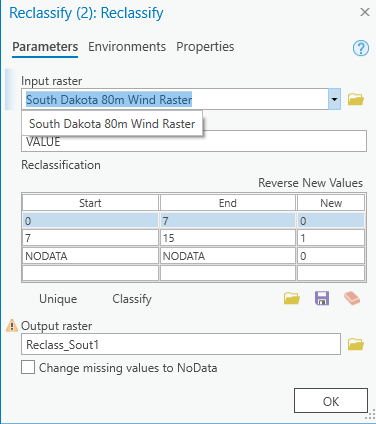

**Figure 21.** Reclassify the wind speed raster — speeds of 7 m/s and above become 1, everything
below becomes 0.

### Step 7

Next, we will use the Weighted Sum tool. To do so, we will enter each of our input datasets and
assign a weight to each based on its importance in our model. See Figure 23 to set these weights.
Note that the specific weights you select depend on your engineering judgment. Consider which
datasets are most important and which constraints deserve the most attention when choosing these
weights.

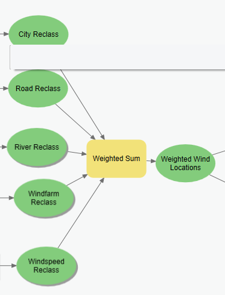

**Figure 22.** The Weighted Sum step in the model.

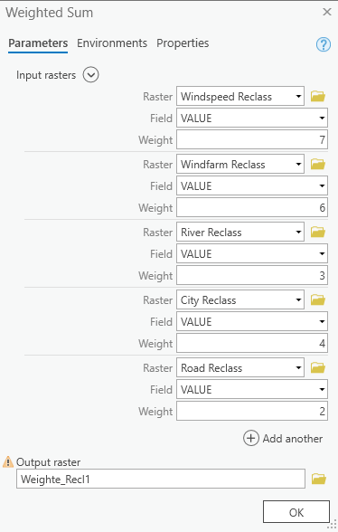

**Figure 23.** The Weighted Sum dialog. The weights shown here are one student team's judgment, not
a required answer.

<!-- VERIFY: the weights visible in Figure 23 are Windspeed 7, Windfarm 6, River 3, City 4, Road 2.
     The surrounding text says students choose their own weights, so treat this screenshot as an
     example rather than as the specification. -->

### Step 8

Finally, we will use the Get Raster Properties tool to find the maximum value. This value will then
be used in the Equal To tool to obtain our maximum raster points. This will ultimately show us the
best locations for a wind farm. Finally, use the Raster to Point tool to find the ideal wind farm
locations.

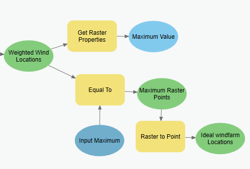

**Figure 24.** The final chain of the model.

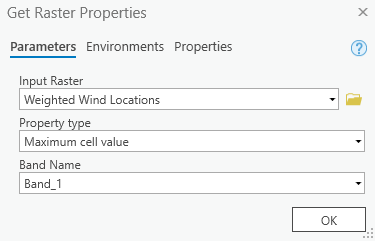

**Figure 25.** Get Raster Properties — set the Property type to **Maximum cell value**.

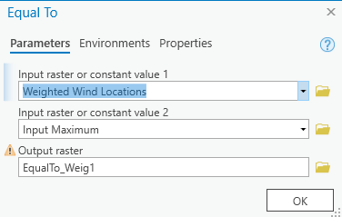

**Figure 26.** Equal To — compares the weighted raster against the maximum value found in Figure 25.

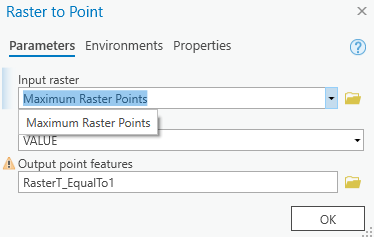

**Figure 27.** Raster to Point — converts the maximum-value cells to point features.

<!-- VERIFY: the "Input Maximum" node in Figures 2 and 24 is a model variable fed from the Get
     Raster Properties output. Confirm in ArcGIS Pro how that value is wired (the Get Raster
     Properties output is a string-typed value and normally needs to be connected as a precondition
     or converted before Equal To will accept it as a constant). The handout does not explain this
     connection and it is the step students are most likely to get stuck on. -->

## Example Map

> [!NOTE]
> This is not a complete example map, because it doesn't show the final selected point locations.
> Make sure your final map includes point locations that meet the goal of identifying the one
> location that has the maximum value from your weighted sum raster. Also, your project sponsor
> doesn't care about "bad locations," so this doesn't need to be mentioned on your map.

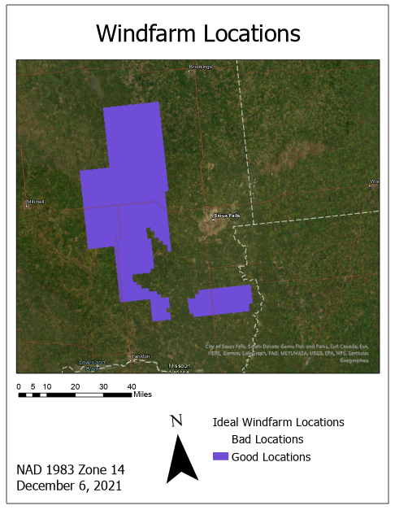

**Figure 28.** An example student map. Note that it shows suitable *areas*, not the final selected
point locations, and that its legend still lists "Bad Locations" — both of which the note above asks
you to fix in your own map.

## Rubric for Wind Farm Site Selection

| Item | Points |
| --- | --- |
| Assignment Title, Name, Date, Course |  |
| Brief report of the requirements of the project, what you learned, what worked well, and what you did differently, if anything, than the lab assignment. Describe the specific areas recommended for new wind farms. Do you agree with the results of the model, or did you find anything different from what you expected? | /10 |
| One or more full pages (8.5 x 11) showing your model. Also, describe your model, including: • List tool settings applied for the analysis (could someone repeat the assignment using your lab report?) • List all input, intermediate, and output datasets • Describe each input dataset, including type (point, line, polygon, raster) and the source of the data • Describe each output dataset (point, line, polygon, raster) • All text in the graphics is readable (10 pt. font minimum) • All tools and datasets are shown | /10 |
| Make a full page (8.5 x 11) map showing the results of the analysis. • Map Title, Neat Line, North Arrow, Scale Bar • Text box with author name, date, and map projection • Suitable locations for new wind farms are clearly shown • All datasets clearly symbolized • Visible base map showing road data • Data points showing existing wind farms • Zoomed to an appropriate scale for viewing analysis results • All text is legible on the printed map | /15  /15  (Analyze two counties in South Dakota and make two maps). |
| **Total Points** | **/50** |

<!-- Rubric total checked: 10 + 10 + 15 + 15 = 50, which matches the stated /50. The title row
     carries no points, as in the original. -->

<!-- TODO(instructor): The last rubric row awards 15 + 15 for "two maps" and its parenthetical says
     "Analyze two counties in South Dakota and make two maps," but the Problem Statement asks for
     two *collections* of counties (the six named ones, then a set the student chooses). Reconcile
     the count. Point values and structure left unchanged. -->

<!-- TODO(instructor): No rubric row covers the raster-specific work this lab is actually about —
     the reclassification scheme, the choice and justification of weights, the environment settings,
     or a weight-sensitivity comparison. Adding one would need point values reallocated, so nothing
     was changed. -->

## Credits

This lab was originally created by Camden Greenhalgh, Sarah Fox, and Emma Stucki as part of a final
project for BYU Civil Engineering 414, Fall 2021.

<!-- Migration notes (2026-09-03): REDACTION (2026-09-03): lab09-weighted-sum-model.png had a file-path tooltip containing a student surname painted out; lab09-example-map.png had the three student author names in the map text block painted out (CRS and date lines kept). Model nodes and map content are otherwise unchanged.
source: /Users/dan/ames-sync/Work/Teaching/CE 414 Engineering Applications of GIS/Labs/Lab 9 - Wind Farm Site Selection.docx

ArcGIS Pro version verified against: NOT VERIFIED in this migration. No ArcGIS Pro session was
opened; every tool name, parameter, and field name below is as it appeared in the Word original or
in its screenshots.

images renamed from fig-NN:
  fig-01 -> lab09-model-overview-preprocessing.png
  fig-02 -> lab09-model-overview-weighted-sum.png
  fig-03 -> lab09-sd-wind-speed-80m-map.png
  fig-04 -> lab09-select-counties-model.png
  fig-05 -> lab09-select-counties-dialog.png
  fig-06 -> lab09-intersect-model.png
  fig-07 -> lab09-intersect-roads-dialog.png
  fig-08 -> lab09-buffer-model.png
  fig-09 -> lab09-buffer-cities-dialog.png
  fig-10 -> lab09-buffer-roads-dialog.png
  fig-11 -> lab09-buffer-rivers-dialog.png
  fig-12 -> lab09-buffer-windfarms-dialog.png
  fig-13 -> lab09-polygon-to-raster-model.png
  fig-14 -> lab09-polygon-to-raster-dialog.png
  fig-15 -> lab09-clip-raster-model.png
  fig-16 -> lab09-reclassify-model.png
  fig-17 -> lab09-reclassify-cities-dialog.png
  fig-18 -> lab09-reclassify-roads-dialog.png
  fig-19 -> lab09-reclassify-rivers-dialog.png
  fig-20 -> lab09-reclassify-windfarms-dialog.png
  fig-21 -> lab09-reclassify-wind-speed-dialog.png
  fig-22 -> lab09-weighted-sum-model.png
  fig-23 -> lab09-weighted-sum-dialog.png
  fig-24 -> lab09-final-steps-model.png
  fig-25 -> lab09-get-raster-properties-dialog.png
  fig-26 -> lab09-equal-to-dialog.png
  fig-27 -> lab09-raster-to-point-dialog.png
  fig-28 -> lab09-example-map.png
No image was deleted; the text uses all 28. images/.gitkeep was removed.

stale/unverified screenshots:
  Figure 1 - illegible wide ModelBuilder canvas grab; needs re-export from ModelBuilder, not a
    re-screenshot. Also carries stale node labels: "Cities 20mi Buffer" (text and Figure 9 say 30
    miles), "Roads 2km Buffer" (text and Figure 10 say 2 miles), "Rivers 2mi Buffer" (Figure 11
    shows 1 mile).
  Figure 8 - same stale node labels for cities (20mi) and rivers (2mi).
  Figure 13 - same stale node labels for cities (20mi) and rivers (2mi).
  Figure 22 - a tooltip showing a personal file path
    (C:\Fox-Pinkney\Final Project-414\...\South Dakota Wind Farm.gdb\Reclass_City1) is open over the
    canvas; it should be dismissed before re-capture.
  Figure 28 - 2021 student map; carries the original authors' names and a December 6, 2021 date,
    shows areas rather than the required point locations, and its legend still lists "Bad
    Locations". Kept because the note above it depends on those defects.
  All dialog screenshots (Figures 5, 7, 9-12, 14, 17-21, 23, 25-27) are from an unidentified
    ArcGIS Pro version and were not re-verified against a current release.

TODO(instructor): study area southeastern vs. western South Dakota (2 spots); river buffer 1 mi vs.
  2 mi (4 spots); hard exclusions not separated from weighted preferences; factor scores not
  normalized; no weight-sensitivity comparison required; analysis CRS unspecified; snap raster,
  extent, mask and resampling unspecified; cell size of 1 has no units or justification; wind data
  30 m vs. 80 m; "main road" criterion vs. Local Roads dataset; 21-page procedure should be split
  into a core brief plus an appendix; Figure 1 needs re-export; stale model node labels; rubric
  "two counties" vs. "two collections of counties"; rubric has no row for the raster-specific work.

VERIFY: county name field and values in Figure 5; OBJECTID as the Polygon to Raster value field in
  Figure 14; whether Clip Raster uses the state or the county extent in Figure 15; the example
  weights in Figure 23; how the Get Raster Properties output is wired into Equal To; and the four
  data URLs noted in the Data section.

dead/redirected links:
  https://gis.sd.gov -> 200, redirects to
    https://opendata2017-09-18t192802468z-sdbit.opendata.arcgis.com/
  https://nationalmap.gov/ -> 200 with a browser user agent (403 without), redirects to
    https://www.usgs.gov/programs/national-geospatial-program/national-map
  https://eerscmap.usgs.gov/uswtdb/data/ -> 200, no redirect
  https://wrdb.nrel.gov/ -> COULD NOT TEST. DNS in the migration environment does not resolve
    nrel.gov at all (the apex domain fails too), so this is an environment limitation, not evidence
    the link is dead. Retest from a normal network.
  https://windexchange.energy.gov/maps-data/ -> 200, redirects to
    https://www.energy.gov/cmei/systems/windexchange/maps-and-data
No link was replaced with a guess.
-->
