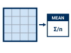

---
search:
  exclude: true
---

# DRAFT — Lab 9: Interpolation Explorer

**Civil Engineering 414 — Engineering Applications of GIS**

Fall 2026 · Dr. Dan Ames

*Rebuilding a mountain from samples, three ways, and measuring how wrong each one is*

> [!WARNING]
> **This is a draft for review.** It is not linked from the course schedule; the assigned page is
> still the September migration of the Word handout. The plan and the measured numbers are in
> `tools/lab09/PARITY_PLAN.md`.
>
> *Changes to what the lab asks students to do:* one study area (the second DEM is gone); a hosted
> extract and study rectangle instead of "download a DEM and draw a box"; a look at the 3DEP image
> service in Step 1 (the Week 9 tie-in); three methods carried all the way to RMSE instead of seven
> surfaces and seven difference chains; the number of points, the IDW power and the Kriging
> semivariogram exposed as parameters; a Step 10 sensitivity table at a personal random seed with
> 200 independent checkpoints; Map 1 is one comparison sheet; individual work, not pairs; rubric in
> five parts of ten.
>
> *Corrections:* RMSE is the root of the **mean** of the squared errors (the handout's summary left
> out the mean); the coordinate system is named as ArcGIS Pro names it; Figure 1 (a reproduced
> textbook figure) is replaced by a measured profile.
>
> *Figures:* Figures A and B are generated from the data (`tools/lab09/make_svgs.py`); the example
> maps are real ArcGIS Pro layouts (`build_figures.py`). **The dialog captures and Figure C are owed:**
> desktop control of ArcGIS Pro was not available when this draft was written, so every step figure
> is a `TODO(capture)` comment, and every GUI detail not carried over from the Lab 8 build is marked
> `VERIFY`.

## Background

Every elevation model, rainfall map and groundwater surface you will use as an engineer started as
points: survey shots, rain gauges, wells. Something turned those points into a surface, and that
something was an **interpolator**. In Lab 8 you used one (IDW) as a tool, to rebuild the plain under
Big Southern Butte. In this lab the interpolator *is* the subject.

The idea is simple. To estimate a value at one place you look at the samples around it and combine
them: take the nearest one (**Thiessen**, or nearest neighbor), average the nearby ones with the
closest weighted most (**inverse distance weighting**, IDW), or weight them by a model of how fast
values stop resembling each other with distance (**Kriging**). A GIS does this at the center of
every cell of an output raster (Bolstad, *GIS Fundamentals*, Chapter 12). Each method has a
personality, and you can see it in the result: Thiessen makes terraces, IDW makes bull's-eyes around
its samples and can never go above the highest one, Kriging smooths.

What you usually cannot do is check the answer, because the true surface is the thing you do not
have. Here you do. You will sample a real elevation model of Y Mountain at random points, rebuild it
from those points three ways, and subtract each rebuild from the truth, cell by cell. That gives you
a map of where each method fails and one number, the root-mean-square error (RMSE), for how badly.

**Figure B.** One row of cells across the study area, the truth and three surfaces rebuilt from only
250 points. Look at the ridge near kilometer 6.5: no method can put back a peak it never sampled.

How close a rebuild comes depends on choices you make: the method, its parameters, and above all how
many points you give it. In Step 10 you vary them, see how far the RMSE moves, and use what moves to
decide which method you would trust with a surface you cannot check.

> [!IMPORTANT]
> **Your job — see the deliverables below.** Build one ModelBuilder model that samples a DEM,
> rebuilds it by Thiessen polygons, IDW and Kriging, and reports each rebuild's error map and RMSE;
> run it on Y Mountain; test how the number of points and each method's parameters change the
> errors; and make two map sheets.

## Problem Statement

You are given a 1/3 arc-second elevation model of Y Mountain and the valley below it, and a study
rectangle. Using them:

1. Sample the elevation model at random points inside the rectangle.
2. Rebuild the surface from the points by Thiessen polygons, IDW and ordinary Kriging.
3. Map each rebuild's error against the true elevation model, and compute its RMSE.
4. Find out which method and which settings rebuild this mountain best, and where every method fails.

## Analysis Considerations

Every one of these is a decision somebody made, and every one of them can change the answer.

- **The truth.** The elevation model is treated as exact. It is not — it is itself a product of
  interpolation from lidar and older sources — but here it is the reference everything else is
  measured against. Your RMSE says how well you rebuilt the DEM, not how well anything matches the
  ground.
- **The cell size.** Step 2 projects the DEM to 30 m cells, as engineering-scale terrain work often
  does, and every surface is built on that grid. A finer grid would make the truth rougher and the
  errors bigger.
- **The samples.** 2,500 random points in a 60.6 km² rectangle: about one point for every 27 cells.
  Random points cluster in some places and leave gaps in others, and the gaps are where the errors
  are. The points are random, so two runs differ — unless you fix the random seed, which Step 0 does
  so that your numbers match this page. Step 10 then gives you your own seed.
- **The method and its parameters.** Thiessen has none. IDW has a **power** (how fast a sample's
  influence falls off with distance; 2 is the default) and a number of neighbors (12). Kriging has a
  **semivariogram model** (spherical is the default) fitted to the points, and a number of neighbors
  (12). Every default is somebody's guess about a typical surface; Step 10 tests the guesses.
- **The measure of error.** RMSE weights large errors heavily, because it squares them. It is one
  number for the whole rectangle, and most of the rectangle is flat valley floor that every method
  gets right. Look at the error maps, not just the number.
- **The coordinate system.** **NAD 1983 UTM Zone 12N** in meters, so that cells are square and
  distances, which every interpolator depends on, are in meters in every direction.

## Data

> [!IMPORTANT]
> **Set up your folder before you download anything.** On the lab machines, work on the **D:
> drive**: one folder for this class named after you, `D:\Smith\`, and one folder per lab inside
> it, `D:\Smith\Lab09\`. The **C: drive is locked**, and a **network drive** is slow enough to make
> ArcGIS Pro hang. **Never use a space** in a folder or file name you create — raster tools fail on
> them without saying why. **Back up your lab folder at the end of every session.** The full set of
> conventions is on the [ArcGIS Tips and Reminders](../../arcgis-tips.md){ target="_blank" } page.

| Layer | Where it comes from | How you get it |
| --- | --- | --- |
| `YMountain_DEM.tif` | USGS 3D Elevation Program, 1/3 arc-second DEM, tile n41w112 | Prepared extract, hosted here |
| `Lab09.gdb\Study_Area` | Drawn for this course on the 30 m grid of Step 2 | In the same zip |
| 3DEP elevation image service | USGS 3D Elevation Program, served live | A web service you add in Step 1 |

- **Download:** [`lab09-y-mountain.zip`](../../data/lab09-y-mountain.zip) (1.9 MB). Unzip it into
  your Lab09 folder — the files are in a `lab09-y-mountain` folder inside it — and read
  `READ-ME-FIRST.txt`.

> [!TIP]
> **Check the data:** `YMountain_DEM.tif` is **1,188 columns × 756 rows** of 1/3 arc-second cells,
> values **1,368.0 to 2,896.9** (meters above NAVD 88), GCS North American 1983, no NoData cells.
> `Study_Area` is one rectangle of **60.6 km²** (8.67 × 6.99 km) in NAD 1983 UTM Zone 12N.

![Infographic: the six metadata questions — What, Where, When, Why, How and Who — answered for the Y Mountain DEM: bare-earth elevation in meters above NAVD 88 on 1/3 arc-second cells, about 10.3 m north-south and 7.9 m east-west; Provo and the mountain front east of it, stored in latitude and longitude and projected in Step 2; tile n41w112 published May 20, 2026 from sources collected 1946 to 2023; the 3D Elevation Program's general-purpose seamless layer, playing the truth in this lab; a window cut from the tile with values unchanged; USGS, public domain. A footer says the DEM's own errors never show up in the RMSE.](images/lab09-dem-metadata.svg)

**Figure A.** The six metadata questions, applied to the DEM. Confirm three of the values yourself —
in `READ-ME-FIRST.txt`, in the raster's properties in ArcGIS Pro, and in the tile's
[metadata file](https://prd-tnm.s3.amazonaws.com/StagedProducts/Elevation/13/TIFF/current/n41w112/USGS_13_n41w112.xml){ target="_blank" }
— and say in your report what each one does to your result.

## ModelBuilder Tools

New in this lab:

| Tool | What it does |
| --- | --- |
| { .tool-icon } **Create Thiessen Polygons** (Analysis) | Draws, around every point, the polygon of all the places nearer to it than to any other point. Given the points' values, it is nearest-neighbor interpolation. Needs an Advanced license. [Tool reference](https://pro.arcgis.com/en/pro-app/latest/tool-reference/analysis/create-thiessen-polygons.htm){ target="_blank" } |
| { .tool-icon } **Kriging** (Spatial Analyst) | Interpolates a raster from points, weighting the neighbors by a semivariogram: a curve fitted to how much the values differ as the distance between them grows. [Tool reference](https://pro.arcgis.com/en/pro-app/latest/tool-reference/spatial-analyst/kriging.htm){ target="_blank" } |
| { .tool-icon } **Zonal Statistics as Table** (Spatial Analyst) | Like Zonal Statistics, but writes the statistics of each zone to a table instead of a raster — here, the mean of the squared errors inside the study rectangle. [Tool reference](https://pro.arcgis.com/en/pro-app/latest/tool-reference/spatial-analyst/zonal-statistics-as-table.htm){ target="_blank" } |

Tools you already know: **Project Raster** (Labs 4, 5, 7 and 8), **Extract by Mask** (Labs 4 and 8),
**Create Random Points** and **Extract Values to Points** (Lab 8), **IDW** (Lab 8), **Polygon to
Raster**, **Raster Calculator** (Labs 2 and 4–8), **Calculate Field** (Lab 6), and model parameters.
Step 10 also uses **Extract Multi Values to Points** and **Summary Statistics**.

## Example Model

<!-- TODO(capture): Figure C, the finished model exported from ModelBuilder as SVG (Export ▸ Export To Graphic, nothing selected), images/lab09-full-model.svg, from the GUI build. -->

*Figure C, the finished model exported from ModelBuilder, will be added after the ArcGIS Pro build.*
It reads left to right: the DEM is projected and cut to the rectangle (`True_DEM`); random points
sample it; three branches rebuild it (Thiessen polygons then Polygon to Raster; IDW; Kriging); each
rebuild is subtracted from `True_DEM`, squared, averaged over the rectangle and square-rooted. The
elements marked `P` become the tool dialog you use in Step 10.

## Complete the Lab

For an advanced GIS student, the information up to this point is all you need to complete the
assignment. Feel free to try the analysis using only the information above. If you complete the lab
without the step-by-step instructions below, say so in your report.

## Step-by-Step Solution

> [!NOTE]
> **Important Note #1.** Steps 0–9 build the model and run it at the defaults with the course's
> random seed, so your numbers can be checked against this page. Step 10 re-runs the same model
> with your own seed and other settings. Build it once, and build it to be changed.

> [!NOTE]
> **Important Note #2.** Every check value on this page was measured on the files you download, with
> the steps below, in ArcGIS Pro 3.7.1. With the random seed of Step 0, your numbers should match to
> the last digit shown. Screenshots were captured in the same version and may differ slightly from
> what you see.

### Step 0 — Set Up the Project

1. Create a new project in `D:\Smith\Lab09\` with the **Map** template; if you already made the
   folder, uncheck **Create a folder for this local project**.
2. Add `YMountain_DEM.tif` (click **OK** to build pyramids and statistics) and
   `Lab09.gdb\Study_Area`.
3. Confirm Spatial Analyst is licensed and that your license level is **Advanced** (**Project** ▸
   **Licensing**); Create Thiessen Polygons needs it. <!-- VERIFY: the lab machines' license level. -->
4. On the **Analysis** tab click **ModelBuilder**. On the **ModelBuilder** tab click
   **Properties**, set **Name** to `InterpolationExplorer` and **Label** to `Interpolation Explorer`,
   and save.
5. On the **ModelBuilder** tab click **Environments** and set:
    - **Current Workspace** and **Scratch Workspace**: your project geodatabase
    - **Random Number Generator**: **Seed** `1`; leave **Generator** at ACM collected algorithm 599
    - after Step 3 has run once: **Cell Size** `30`, and **Snap Raster** `True_DEM` — browse to it
      in your project geodatabase or type its path

    Type an environment's name in the dialog's search box to find it.

<!-- TODO(capture): Figure 0, the model Environments dialog (workspace, random, cell size, snap raster). -->

> [!NOTE]
> **Why fix the seed?** Create Random Points draws from a random number generator. With the same seed
> it draws the same points every time, so your RMSEs can be checked against this page. In Step 10 you
> switch to a seed of your own.

### Step 1 — Look at the Service

The same elevations are served live on the web. Before you use the prepared file, look at what the
service gives you.

1. On the **Map** tab click **Add Data** ▸ **From Path**, paste
   `https://elevation.nationalmap.gov/arcgis/rest/services/3DEPElevation/ImageServer`, and click
   **Add**. It is slow; give it a minute.
2. Right-click the new layer ▸ **Properties** ▸ **Source**, and record its **spatial reference** and
   **cell size**. Do the same for `YMountain_DEM.tif`.
3. On the **Map** tab click **Go To XY**, enter longitude **−111.58865** and latitude **40.21415**
   (decimal degrees), and pan there. This is the highest cell of the extract. Click it with
   **Explore** and read the value of both layers.
4. Remove the service layer. You will not use it again: the rest of the lab runs on the extract.

<!-- TODO(capture): Figure 1, the service layer's Properties > Source showing its spatial reference and cell size. -->

> [!TIP]
> **Check the result:** the service comes back in **WGS 1984 Web Mercator (auxiliary sphere)**, not
> in the latitude and longitude of the extract, with cells of about **1 m**. At the highest cell the
> extract reads **2,896.9 m** and the service within a few tenths of a meter of it (we measured
> **2,896.7 m**).
> <!-- VERIFY in the GUI: the wording of the spatial reference in Properties > Source, the cell size it shows, and what Explore returns at 40.21415 N, 111.58865 W (REST identify gave 2,896.7; the extract's cell there is 2,896.92, its maximum). -->

> [!NOTE]
> **Why not just use the service?** A service is convenient and always current, but what comes back
> depends on the request: it is reprojected, resampled to the screen, and can change when the USGS
> updates it. An analysis that others must check needs a fixed copy with a known date, which is why
> the course hosts one. Say in your report which of the two you would cite in an engineering report,
> and why.

### Step 2 — Project the DEM

Add **Project Raster** with `YMountain_DEM.tif` as the input:

- **Output Coordinate System**: NAD 1983 UTM Zone 12N
- **Resampling Technique**: Bilinear interpolation
- **Output Cell Size**: 30 (X and Y)
- **Output Raster Dataset**: `DEM_UTM`

<!-- TODO(capture): Figure 2, the Project Raster dialog from ModelBuilder. -->

> [!TIP]
> **Check the result:** `DEM_UTM` is **314 columns × 262 rows** of 30 m cells, values **1,368.1 to
> 2,896.5** m. The thin wedges along the edges are NoData: a latitude and longitude rectangle is
> slightly tilted in UTM. That is why the study rectangle sits well inside it.

### Step 3 — Cut the True Surface

Add **Extract by Mask**: **Input raster** `DEM_UTM`, **Input raster or feature mask data**
`Study_Area`, output `True_DEM`. Type the output name last: this tool replaces a typed name when its
inputs change.

Run the model this far, then set the **Cell Size** and **Snap Raster** environments of Step 0.

<!-- TODO(capture): Figure 3, the Extract by Mask dialog. -->

> [!TIP]
> **Check the result:** `True_DEM` has **67,337** cells with values (289 × 233), from **1,368.5 to
> 2,896.5** m, mean **1,819.8** m. This is the truth every rebuilt surface is measured against.

> [!WARNING]
> **Set the Snap Raster.** Without it, the interpolators place their cells wherever their points'
> extent puts them, and the subtraction in Step 8 compares cells that are offset by part of a cell.
> Nothing reports an error; every RMSE is simply a little wrong.

### Step 4 — Sample the Surface

1. Add **Create Random Points**: **Output Location** your project geodatabase, **Output Point
   Feature Class** `Random_Points`, **Constraining Feature Class** `Study_Area`, **Number of Points
   [value or field]** `2500` (leave its type at Long). Then right-click the tool in the model ▸
   **Create Variable** ▸ **From Parameter** ▸ **Number of Points [value or field]**, right-click the
   new oval ▸ **Rename** it `Number of Points`, and right-click it ▸ **Parameter**.
2. Add **Extract Values to Points** with `Random_Points` and `True_DEM`, output `Sample_Points`.

<!-- TODO(capture): Figure 4a, Create Random Points; Figure 4b, Extract Values to Points. -->

> [!TIP]
> **Check the result:** 2,500 points, `RASTERVALU` from **1,368.7 to 2,886.7** m. With seed 1, the
> first point (`OBJECTID` 1) is at about **444,603.3 E, 4,453,723.7 N**. If any `RASTERVALU` is
> empty or −9999, a point fell outside `True_DEM`: check the constraining feature class.

> [!NOTE]
> The samples never include the true highest cell (2,896.5 m): the tallest sample is 2,886.7 m. Keep
> that number in mind for the next three steps.

### Step 5 — Build the Thiessen Surface

1. Add **Create Thiessen Polygons**: **Input Features** `Sample_Points`, output
   `Thiessen_Polygons`, **Output Fields** **All fields**.
2. Add **Polygon to Raster**: **Input Features** `Thiessen_Polygons`, **Value field**
   `RASTERVALU`, **Cell assignment type** Cell center, **Cellsize** 30, output `Thiessen_Surface`.

<!-- TODO(capture): Figure 5a, Create Thiessen Polygons with Output Fields = All fields; Figure 5b, Polygon to Raster. -->

> [!WARNING]
> **Output Fields defaults to "Only feature ID".** Left there, the polygons carry no elevation —
> only `Input_FID` — and Polygon to Raster has no `RASTERVALU` to offer. Choose **All fields**.

> [!TIP]
> **Check the result:** **2,500** polygons, one per point. `Thiessen_Surface` runs from **1,368.7 to
> 2,886.7** m — exactly the range of the samples, because every cell simply takes the value of its
> nearest point.

### Step 6 — Build the IDW Surface

Add **IDW**: **Input point features** `Sample_Points`, **Z value field** `RASTERVALU`, **Output
cell size** `30`, **Power** 2, **Search radius** Variable with 12 points, output `IDW_Surface`. Then
right-click the tool ▸ **Create Variable** ▸ **From Parameter** ▸ **Power**, rename the oval
`IDW Power`, and make it a parameter.

<!-- TODO(capture): Figure 6, the IDW dialog. -->

> [!TIP]
> **Check the result:** `IDW_Surface` runs from **1,368.7 to 2,885.5** m. IDW is a weighted average,
> so it can never go above its highest point or below its lowest: compare with Step 4.

### Step 7 — Build the Kriging Surface

Add **Kriging**: **Input point features** `Sample_Points`, **Z value field** `RASTERVALU`, output
`Kriging_Surface`, **Kriging method** Ordinary, **Semivariogram model** Spherical, **Output cell
size** `30`, **Search radius** Variable with 12 points. Leave the optional output variance raster
empty. Then make the semivariogram properties a model variable and a parameter, named
`Semivariogram`.
<!-- VERIFY in the GUI: that Semivariogram properties can be exposed with Create Variable > From Parameter, and what its dialog control looks like in the tool dialog. Fallback: a Save As copy of the model per semivariogram model, as Lab 8 did for Spline. -->

<!-- TODO(capture): Figure 7, the Kriging dialog. -->

> [!TIP]
> **Check the result:** `Kriging_Surface` runs from **1,368.7 to 2,884.3** m. Kriging *can* go beyond
> its samples; here it does not, and it pulls the top down a little further than IDW.

### Step 8 — Map the Errors

Add **Raster Calculator** three times, one per surface, each the truth minus the rebuild:

| Expression | Output |
| --- | --- |
| `"%True_DEM%" - "%Thiessen_Surface%"` | `Error_Thiessen` |
| `"%True_DEM%" - "%IDW_Surface%"` | `Error_IDW` |
| `"%True_DEM%" - "%Kriging_Surface%"` | `Error_Kriging` |

A positive error means the surface came out too **low** there; a negative error, too **high**. Give
all three the same diverging color scheme with the same class breaks (the example maps use −100,
−50, −20, −5, 5, 20, 50, 100 m), so that the same color means the same error on every map.

<!-- TODO(capture): Figure 8, one Raster Calculator dialog. -->

> [!TIP]
> **Check the result:**
>
> | Error raster | Minimum | Maximum | Mean |
> | --- | --- | --- | --- |
> | `Error_Thiessen` | −234.1 | 214.3 | −0.39 |
> | `Error_IDW` | −136.8 | 169.9 | −0.84 |
> | `Error_Kriging` | −104.0 | 164.4 | −0.31 |
>
> Every mean is under a meter: the errors cancel. That is why the next step squares them.

### Step 9 — Compute the RMSE

The root-mean-square error is the typical size of an error, whatever its sign: **square** every
cell's error, take the **mean** of the squares over the rectangle, and take the **square root**.
For each of the three error rasters:

1. **Raster Calculator**: `Square("%Error_Thiessen%")`, output `SqError_Thiessen` (likewise IDW and
   Kriging).
2. **Zonal Statistics as Table**: **Input raster or feature zone data** `Study_Area`, **Zone field**
   `OBJECTID`, **Input value raster** `SqError_Thiessen`, **Statistics type** Mean, output table
   `RMSE_Thiessen`.
3. **Calculate Field** on `RMSE_Thiessen`: **Field Name** `RMSE` (a new field, type Double),
   **Expression Type** Python 3, **Expression** `math.sqrt(!MEAN!)`.

Then make the parameters: the DEM and `Study_Area` (inputs) and `Number of Points`, `IDW Power` and
`Semivariogram` (from Steps 4, 6 and 7), and as outputs the three error rasters and the three
`RMSE_` tables (the outputs of the Calculate Field tools). Step 10 and your second map need them.

<!-- TODO(capture): Figure 9a, Zonal Statistics as Table; Figure 9b, Calculate Field; Figure 9c, the model as a tool in the Geoprocessing pane. -->

> [!TIP]
> **Check the result:** each table has one row with **COUNT 67,337** and **AREA 60,603,300** (m²).
>
> | Table | MEAN (m²) | RMSE (m) |
> | --- | --- | --- |
> | `RMSE_Thiessen` | 800.3 | **28.29** |
> | `RMSE_IDW` | 428.9 | **20.71** |
> | `RMSE_Kriging` | 209.0 | **14.46** |
>
> If COUNT is smaller, an interpolator's output does not cover the whole rectangle — check the Cell
> Size and Snap Raster environments.

> [!WARNING]
> **A run from the tool dialog deletes everything that is not a parameter** (Labs 5, 7 and 8 saw it).
> Do Steps 2–9 from inside ModelBuilder first and record the check values before any dialog run.
> <!-- VERIFY: which outputs a dialog run of this model keeps, and its run time. -->

### Step 10 — Test the Choices

The ranking at the defaults is *a* result, not *the* result. It came from one set of random points
and three sets of default parameters. Find out how much of it survives a change.

**First, your own points.** In **ModelBuilder** ▸ **Environments**, change the **Random Number
Generator** seed to the **last four digits of your BYU ID** as a number (`0042` is `42`; if that
gives 0, use `9999`). Save, and run the model **inside ModelBuilder** at the defaults. This is your
**baseline**: Map 1 is made from it, and it is the first row of your table. Write your seed in your
report: the grader re-runs your model with it.

**Then the checkpoints.** In real work you would not have a true DEM; you would hold back some
measured points and test against them. Do that once, on your baseline surfaces:

1. Run **Create Random Points** from the Geoprocessing pane (not in the model): constraining feature
   class `Study_Area`, **200** points, output `Checkpoints`, and on its **Environments** tab
   **Random Number Generator** seed `99`. Everyone uses the same 200 checkpoints.
2. **Extract Multi Values to Points** on `Checkpoints` with `True_DEM` (output field name `TRUE_Z`),
   `Thiessen_Surface` (`TH_Z`), `IDW_Surface` (`IDW_Z`) and `Kriging_Surface` (`KR_Z`).
3. **Calculate Field** three times, new Double fields: `SQ_TH` = `(!TRUE_Z! - !TH_Z!) ** 2`,
   `SQ_IDW` = `(!TRUE_Z! - !IDW_Z!) ** 2`, `SQ_KR` = `(!TRUE_Z! - !KR_Z!) ** 2`.
4. **Summary Statistics** on `Checkpoints`: the **Mean** of `SQ_TH`, `SQ_IDW` and `SQ_KR`. The
   square root of each mean is that method's **checkpoint RMSE**.

**Then four more runs**, from the model's tool dialog, giving every output a name that says what
changed (`RMSE_Kriging_n250`, `Error_IDW_n250`):

1. **250 points** (everything else at the defaults).
2. **10,000 points**.
3. **IDW power 1 and Kriging exponential** (one run changes both: they are in different branches).
4. **IDW power 3 and Kriging Gaussian**.

For **the baseline and every run, in one table**, record your seed, what changed, and the RMSE of all
three methods; add the three checkpoint RMSEs to the baseline row.

Then answer, in your report:

1. **Which method wins, and does the ranking survive?** Rank the methods at each number of points,
   with your numbers. Does the winner change? How much does going from 250 to 10,000 points buy each
   method?
2. **Which parameter mattered, and which barely did?** Compare what the IDW power and the
   semivariogram model did with what the number of points did. Look at a Gaussian surface's highest
   cell before you explain it.
3. **Could you have known without the truth?** Compare each method's checkpoint RMSE with its RMSE
   over all 67,337 cells. Would 200 checkpoints have told a client the right ranking, and how far off
   would the number you quoted have been?

> [!TIP]
> Before you run the 10,000-point case, predict its RMSEs from your 250 and 2,500 results. Then look
> at where on the error maps the remaining error lives, and at the slope of the ground there.

## Deliverables

Make **two** professional map layouts (letter size, landscape is easiest):

1. **Your baseline comparison sheet** — from your personal-seed baseline: the true DEM with your
   sample points and the three surfaces in one row, **on one elevation color scale**; the three error
   rasters beneath their surfaces **on one diverging color scale** with the same breaks; each panel
   labeled with its method, its parameters and its RMSE; legends for both scales; a title, neat
   line, north arrow and scale bar; and a text box with your name, the date, the map projection, the
   DEM's source and date, and your seed.
2. **One scenario from Step 10** — whichever run most changes the picture: its three error rasters
   on Map 1's error scale, each with its RMSE, and the true DEM for reference (the surfaces are
   optional). Say on the map what changed and by how much.

Write a brief report (2–3 pages of text, plus your figures and maps) covering:

- a title block — assignment title, your name, the date and the course — and the name of your
  peer reviewer
- the requirements of the project and your approach to solving it
- **a description of your model** a reader could repeat from: each tool and its settings, and every
  input, intermediate and output dataset with its type
- **one** full-page figure of your model, exported from ModelBuilder (**Export ▸ Export To
  Graphic**), and **one** screen capture of its tool dialog with the number of points, the IDW power
  and the semivariogram exposed; and **upload your project's toolbox** (`Lab09.atbx`, in your project
  folder) with the report — the grader opens it and runs it at your seed
- **the three metadata values** for the DEM — its publication date and source dates, its vertical
  datum and units, and its cell size — and **what the service returned** in Step 1, and what each
  means for your result
- your **check values from Steps 4 to 9** at seed 1: the first point, each surface's range, and the
  three RMSEs
- **where the methods break**: the largest error on your own baseline error maps — its coordinates
  and size, read from your raster — and why the ground there defeats the interpolators
- your **sensitivity table** from Step 10, with your seed, and your answers to its three questions
- **a copy of the rubric below with your self-assessment filled in** — a score in every row,
  honestly arrived at. The grader will compare it with theirs.

> [!IMPORTANT]
> **Peer review before you submit.** Have another student in the class read your report against
> the rubric and give you feedback, then act on that feedback before the deadline. Name your
> reviewer in the report and say in a sentence what you changed because of them.

**Credit line for your maps:** Elevation: USGS 3D Elevation Program, 1/3 arc-second DEM, tile
n41w112 (May 2026). Study area: drawn for CE 414.

## References

Bolstad, P. *GIS Fundamentals: A First Text on Geographic Information Systems*. Eider Press.
Chapter 12, the Week 8 reading on interpolation (any of the 5th to 7th editions).

U.S. Geological Survey, 3D Elevation Program. 1/3 arc-second DEM, tile n41w112, published May 20,
2026.

U.S. Geological Survey, 3D Elevation Program. 3DEP Elevation image service.
[elevation.nationalmap.gov](https://elevation.nationalmap.gov/arcgis/rest/services/3DEPElevation/ImageServer){ target="_blank" }.

## Example Maps

These are examples, not templates. Your maps carry your name and your own seed's results, so your
numbers will differ a little from these.

![Example comparison sheet titled "Rebuilding Y Mountain from 2,500 Points: Kriging Comes Closest". Top row: the true DEM with 2,500 black sample points, then the Thiessen, IDW and Kriging surfaces, all on one green-to-brown-to-white elevation scale over a hillshade; the Thiessen surface is visibly faceted. Second row: the three error maps on one red-to-blue scale, labeled Thiessen error RMSE 28.29 m, IDW error RMSE 20.71 m, Kriging error RMSE 14.46 m; the valley floor is pale everywhere, and the mountain front is a mottle of red and blue, finest-grained for Thiessen and palest for Kriging. Legends, north arrow, scale bar and a text box at the bottom.](images/lab09-example-map-baseline.png)

**Figure 10.** A baseline comparison sheet at seed 1. Two things to do better than this example:
mark and label the largest error on each error map, and use the empty band below the error maps for
a sentence on what the reader should notice.

**Figure 11.** The kind of second map Step 10 asks for. Yours needs only the error maps and the true
DEM, and should be the run that most changes what a reader would conclude, which may not be this one.

## Rubric for Interpolation Explorer

Fifty points in five parts of ten. The bullets say what each part is worth, so you know exactly
what to submit.

| Item | Points |
| --- | --- |
| **Write-up** (2–3 pages) • Assignment title, your name, date and course; your peer reviewer named, with a sentence on what you changed because of them (1) • The requirements of the project and your approach to solving it, in your own words (1) • The three metadata values for the DEM and what the service returned in Step 1, and what each means for your result (2) • Your check values from Steps 4 to 9 at seed 1 (2) • Where the methods break: the largest error on your own error maps, its coordinates and size, and why the ground there defeats the interpolators (3) • Organized writing, figures numbered and referred to, sources credited, rubric pasted with your self-assessment (1) | /10 |
| **ModelBuilder model** — correct and working • The model runs end to end from its tool dialog and, at seed 1, matches the three RMSE check values (4) • A full-page model figure exported from ModelBuilder, all tools and datasets readable (2) • A screen capture of the tool dialog with the number of points, the IDW power and the semivariogram exposed as parameters (2) • A description of the model a reader could repeat from (2) | /10 |
| **Map 1 — your baseline comparison sheet** • Title, neat line, north arrow and scale bar (1) • Text box with author, date, map projection, the DEM's source and date, and your seed (1) • The true DEM with your sample points and the three surfaces on one elevation scale, with a legend (2) • The three error maps on one diverging scale with the same breaks, with a legend (2) • Every panel labeled with its method, parameters and RMSE (2) • Layout, scale and legibility: a reader can compare the panels at a glance (2) | /10 |
| **Map 2 — one Step 10 scenario** • Title, neat line, north arrow and scale bar (1) • Text box with author, date, map projection, the DEM's source and date, and your seed (1) • The scenario's three error maps on Map 1's error scale, with a legend (2) • Every panel labeled with its method, parameters and RMSE (2) • Title and text box say what changed from Map 1 and by how much (2) • Layout, scale and legibility (2) | /10 |
| **Sensitivity** (Step 10) • One table with your seed, the baseline and the four Step 10 runs, the RMSE of all three methods in every row, and the three checkpoint RMSEs on the baseline row (4) • Which method wins and whether the ranking survives, with your numbers (2) • Which parameter mattered and which barely did, with your numbers (2) • What the checkpoints would and would not have told you (2) | /10 |
| **Total** | **/50** |

> [!NOTE]
> **Using AI on this lab.** Use AI freely to understand a tool, work out an error, or
> tighten your write-up, and add one line at the end of your report saying what you used it
> for. Do not take a field name, an expression, a coordinate system, or a number from it —
> those come from your own data, and the rubric asks you to defend every one. See the
> [AI Use Policy](../../policies/ai-policy.md) for the full policy.

<!-- Draft notes (2026-10-06).
SOURCE: "Lab 8 - Practicing with Interpolation.docx" (instructor's copy in Downloads, saved 2026-10-06), whose September 3 migration is the live docs/assignments/lab-09/README.md; rebuilt to tools/lab-conversion-guide.md per tools/labs-09-11-plan.md section 4 (accepted 2026-10-06) and tools/lab09/PARITY_PLAN.md.
ARCGIS PRO: 3.7.1, arcpy only (tools/lab09/run_model.py, extra_checks.py, chain_check.py, extent_check.py). GUI build OWED: desktop control denied 2026-10-06.
DATA: docs/data/lab09-y-mountain.zip, 1,885,312 bytes: YMountain_DEM.tif (window -111.68 -111.57 40.20 40.27 of USGS_13_n41w112, published 2026-05-20, source dates 1946-2023; 1,188 x 756 float32, 1,368.03-2,896.92 m, no NoData) and Lab09.gdb\Study_Area (442,514.873-451,184.873 E, 4,450,507.050-4,457,497.050 N, on DEM_UTM's 30 m grid). Built by tools/lab09/fetch_dem.py, run_model.py, make_extract.py.
VERIFIED NUMBERS (seed 1 ACM599): DEM_UTM 314 x 262, 1,368.1-2,896.5; True_DEM 67,337 cells, 1,368.5-2,896.5, mean 1,819.8; first point 444,603.3 E 4,453,723.7 N; samples 1,368.7-2,886.7; Thiessen 2,500 polygons, surface 1,368.7-2,886.7, error -234.1/214.3 mean -0.39, MEAN 800.3, RMSE 28.29; IDW 1,368.7-2,885.5, error -136.8/169.9 mean -0.84, MEAN 428.9, RMSE 20.71; Kriging 1,368.7-2,884.3, error -104.0/164.4 mean -0.31, MEAN 209.0, RMSE 14.46; ZSaT COUNT 67,337 AREA 60,603,300 with or without a Processing Extent environment (snap raster set); Calculate Field math.sqrt(!MEAN!) reproduces the RMSEs; Create Thiessen Polygons ONLY_FID leaves only Input_FID. Service: REST identify 2,896.7 at the highest cell (40.21415 N, 111.58865 W).
SENSITIVITY (do NOT publish): see tools/lab09/PARITY_PLAN.md. Points 250/1,000/2,500/10,000: Kriging 50.38/24.90/14.46/6.90; IDW power 1/2/3/5: 23.98/20.71/20.20/21.60; Kriging Gaussian 24.81, other models 14.46; checkpoints within 2-3 m of the full-grid RMSE, same ranking; seeds 2-5 never change the ranking.
GRADING ORACLE: run_model.py --seed NNNN reproduces a student's Step 10 table (all five rows plus the checkpoint RMSEs) in about two minutes.
TODO(instructor): 1. GUI build and captures (Figures 0-9, Figure C). 2. Lab machines' license level (Thiessen). 3. Exposing the semivariogram as a parameter. 4. Report template. 5. Week 9 deck alignment. 6. Learning Suite due date November 7. -->
