# Lab 10: Least Cost Path Power Line Analysis

**Civil Engineering 414 — Engineering Applications of GIS**

Fall 2026 · Dr. Dan Ames

## Background

Aging infrastructure in the United States has generated an increased demand for new infrastructure. Utility companies are exploring ways to enhance this aging infrastructure and reduce its limitations. To do this, the utility companies first need to identify suitable locations for utility lines. ArcGIS Pro ModelBuilder is a useful tool for this process and can help determine the best location for constructing the new infrastructure.

As a GIS professional, you might be asked to perform network analysis and create models that identify these locations. The placement of utility lines is a complex modeling topic. Normally, the least-cost path between two points would be a straight line. However, in this case, engineering limitations and topography make it very difficult to model a least-cost path. Additionally, public opinion can also influence the location and process of construction. Public opinions such as NIMBYism (Not In My Back Yard) and BANANAism (Build Absolutely Nothing Anywhere Near Anything) require rethinking of locations and processes (Vajjhala and Fischbeck, 2006).

A GIS professional will be assigned to adjust model inputs and create paths that include many factors (Meehan, 2003). <!-- VERIFY: in-text citation says "Meehan, 2003" but the only Meehan entry in the References list is dated 2007. Kept verbatim — there are both a 2003 and a later Esri Press Meehan title, so the intended edition is not unambiguous. --> This underscores the importance of creating an ArcGIS Pro model. Additional layers, weights on those layers, and changes in requirements influence the least-cost path. A standard model makes it easier to create a path. This is because it automates the process, allowing it to be used as many times as necessary to derive an acceptable path for all parties involved. The purpose of this lab is to familiarize you with a few of the processes and requirements that might be used in the modeling of a least cost path for utility line placement. You will not be asked to model social behaviors in this model.

## Problem Statement

This lab simulates the placement of a high-voltage power line between two points in Utah County. Although the start and end points for this lab are not the locations of substations or proposed substations, its purpose is to produce a model that is feasible to replicate on other projects where the points are real. This lab assumes that the new NSA Data Center, built in Bluffdale, will require power from the wind farm at the mouth of Spanish Fork Canyon, Utah.

<!-- TODO(instructor): the instructor plan calls for updating the scenario language (the "new NSA Data Center" framing dates from the original handout). Scenario wording is a pedagogy decision, so it is left as written. -->

## Spatial Considerations

For this exercise, the spatial considerations will be limited to the following:

**Lines:**

1. Start at a proposed substation near the mouth of Spanish Fork Canyon and end at a proposed substation near the new NSA facility in Bluffdale.
2. Be within 2 kilometers of a major highway or interstate. Reclassify values to either 1 or NODATA.
3. Not be within 2 kilometers of a major river or water body. Set the new values to either 1 or 10.
4. Should not pass through or around cities within a 5-kilometer radius. Depending on the distance from a city, scale new values from 1 to 10.
5. Use existing power lines along the path. Set new values as either 1 or 10.

**Elevations:** Lower elevations are more suitable for power lines. You will use the elevation as the scale, so no reclassification is needed for this lab.

**Scaling:** Use a uniform scale factor (1 to 10) for the raster calculator/reclassification tools to determine suitable locations. The scales above are scaling guidelines, with lower values indicating more suitable areas. This scale will work well with the Multiple Ring Buffer tool.

<!-- TODO(instructor): the spatial considerations do not distinguish an impassable barrier (a cell the path may never cross, i.e. NODATA on the cost surface) from a merely expensive cell (a high traversal cost). Consideration 2 makes everything outside the 2 km road corridor NODATA — an absolute barrier — while considerations 3-5 use costs of 1 or 10. Decide which constraints are hard and which are weighted, and say so here. -->

<!-- TODO(instructor): units and raster environments are not specified in this section. The step-by-step solution sets a 100 (map unit) cell size and an extent taken from the Utah County DEM, but the handout never states the analysis coordinate system or whether the cost surface's units are meters. Add an explicit statement of projected CRS, linear unit, cell size, extent, and snap raster. -->

<!-- TODO(instructor): the instructor plan asks that students run at least one alternative weighting scenario (for example, re-running the model with the municipality or river weights changed) and compare the resulting paths. That is a change to what students must produce, so it is not added here. The rubric currently asks only "what classifications would you change" as a written answer. -->

For this lab, you are only creating a least cost path for the placement of a line. Do not be concerned about the placement of individual towers.

## Data

<!-- TODO(instructor): every gis.utah.gov link below still resolves, but each one redirects to a reorganized page on the current Utah Geospatial Resource Center site, and the named download links ("UDOT LRS Routes: Shapefile", "Lakes NHD High Res: Shapefile", etc.) may no longer carry those exact labels. Links kept as written rather than replaced with a guess; see the migration notes at the end of this file for the observed redirect targets. -->

- **UDOT Highways:** <http://gis.utah.gov/data/sgid-transportation/roads-system/>

    You can find a shapefile that represents all the major roads and highways in Utah. You should download the UDOT LRS Routes: Shapefile. This will download in a zipped file.

- **Utah Lakes and Streams:** <http://gis.utah.gov/data/water-data-services/lakes-rivers-dams/>

    You will need to download a shapefile that contains all known water bodies in Utah. Using the NHD Lakes section, download the Lakes NHD High Res: Shapefile link. You will also need to download a shapefile that contains all known streams in Utah. Using the NHD Streams section, download the Streams NHD High Res: Shapefile link.

- **NED (National Elevation Dataset):** <http://gis.utah.gov/data/elevation-terrain-data/10-30-meter-elevation-models-usgs-ned/>

    You will need to download the elevation dataset for Utah provided by the USGS. You should either download the 10 m or 30 m NED for Utah County using any of the methods on the page.

- **Municipal Boundaries:** <http://gis.utah.gov/data/boundaries/citycountystate/>

    You will need to download the city boundaries for Utah. This can be found in the Municipal Boundaries section using the Municipal Boundaries: Shapefile link.

- **Utah County Shapefile:** <http://gis.utah.gov/data/boundaries/citycountystate/>

    You can find a shapefile that represents all the counties from Utah (you will select the specific county you need during the exercise).

- **Utility Data:** You will need to download the electrical lines that are in Utah. Download `ElectricalLines_shp.zip` from Learning Suite.

- **User Created Point Shapefiles:** For the starting and ending locations, you will need to create two separate point shapefiles with a proper projection. One should show where to start (the source) and to end (the destination) in the least cost path calculation. These points do not represent actual or future substations. The starting point should be at the mouth of Spanish Fork Canyon (approximately at 40.076955, -111.584886) and the ending point near the proposed NSA facility in Bluffdale (approximately 40.460597, -111.935419; near the Point of the Mountain).

## ModelBuilder Tools

In this exercise, you may use previous tools and will use the following new tools.

- **Polyline/Polygon to Raster:** Converts a feature class or layer into a raster based on a specified value field.
- **Cost Distance:** Calculates the least cost distance for each cell from the start point on the cost surface. <!-- TODO(instructor): Cost Distance is a legacy Spatial Analyst tool. The current ArcGIS Pro equivalent is Distance Accumulation. -->
- **Cost Path:** Calculates a least cost path from the source to the destination by using the Cost Distance tool outputs. <!-- TODO(instructor): Cost Path is a legacy Spatial Analyst tool. The current ArcGIS Pro equivalents are Optimal Path As Line and Optimal Path As Raster. -->
- **Multiple Ring Buffer:** Creates multiple buffers at specified distances around the input features.

## Example Model

**Figure 1.** The complete least cost path model in ModelBuilder.

<!-- TODO(instructor): Figure 1 is a zoomed-out ModelBuilder canvas capture and the node labels are effectively illegible at page width. It needs to be re-exported from ModelBuilder (Export to Graphic at a larger size, or as a model-documentation table), not re-screenshotted. -->

## Complete the Lab

For an advanced GIS student, the information up to this point is all you need to complete the assignment and create an output map from the results. Feel free to try conducting the analysis using only the information provided above. If you complete the lab only using the information provided above (without using the step-by-step instructions below), make sure to indicate this in your lab report to be considered for extra credit. If you need extra help, follow the step-by-step solution below.

## Step-by-Step Solution

> [!NOTE]
> **About the tools used below.** This solution uses the legacy Spatial Analyst tools **Cost Distance**, **Cost Back Link**, and **Cost Path**. Those tools still run in ArcGIS Pro, but Esri has deprecated them; current practice is **Distance Accumulation** (which produces the accumulative cost and back-direction rasters) followed by **Optimal Path As Line** or **Optimal Path As Raster**. The screenshots, parameter names, and rubric on this page all assume the legacy tools, so the steps have deliberately not been rewritten. Your instructor will confirm which set of tools to use before you start.

### Step 1

Use the Mosaic To New Raster tool to combine the DEMs of Utah County. Set the cell size to 100.

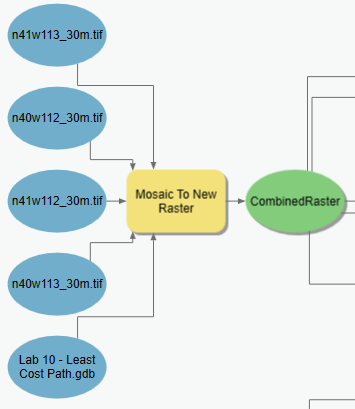

**Figure 2.** Mosaic To New Raster tool in ModelBuilder.

<!-- VERIFY: "Set the cell size to 100" does not name a unit. The DEM tiles in Figure 2 are 30 m products, so 100 is presumably 100 meters in a projected coordinate system, but the handout never says so. Kept verbatim. -->

### Step 2

Use the Select tool to select lakes with an area greater than 1 square kilometer by using the SQL expression `AreaSqKm > 1`. Use the Select tool to select the major rivers by using the SQL expression `IsMajor = 1`. This will filter out small lakes and streams and will help the model to run faster.

<!-- VERIFY: field names AreaSqKm (NHD lakes) and IsMajor (NHD streams) are taken verbatim from the source handout and have not been checked against the current Utah NHD High Res downloads. -->

Select and Buffer Utah County to use as a clip or intersect feature in the following steps. This layer will limit each of the layers to the area of interest for the calculations and provides a cleaner map. Set the buffer of Utah County to 5 kilometers.

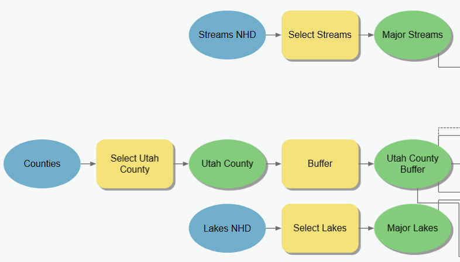

**Figure 3.** Steps 1 and 2 in ModelBuilder.

### Step 3

Clip or intersect the buffered Utah County layer with the highways, cities, rivers (streams), lakes, and electrical lines to isolate the data needed for the analysis and to have the model run faster. In Figure 4, the roads are being clipped by the county, while the other datasets are intersected with the county. Using either tool for any of the datasets will produce the desired result we need for this lab.

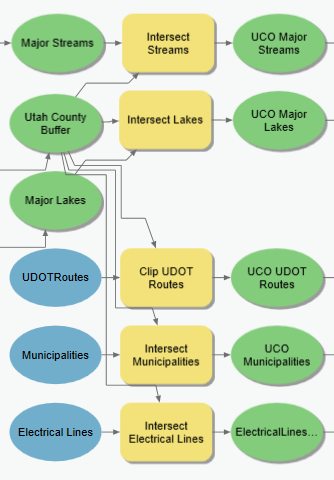

**Figure 4.** Using the Clip and Intersect tools.

### Step 4

The requirements state that the lines need to be within 2 kilometers of a major road, should avoid major rivers and lakes by at least 2 kilometers, and avoid cities by at least 5 kilometers. Use the Buffer and Multiple Ring Buffer tools to accomplish this. In Figure 5, the municipalities layer is being buffered with the Multiple Ring Buffer tool while the roads, rivers, and lakes can be buffered with the Buffer tool.

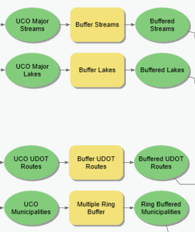

**Figure 5.** The Buffer, Multiple Ring Buffer, and Intersect tools in ModelBuilder.

The Multiple Ring Buffer tool should be configured as shown in Figures 6 and 7. Use 1 kilometer increment offsets from 1 to 5 kilometers. In the Environments tab, set the Extent to the combined NED raster of Utah County.

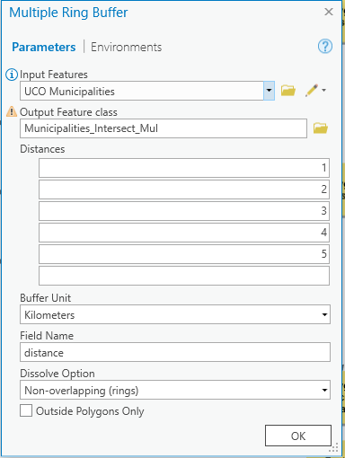

**Figure 6.** Parameters tab of the Multiple Ring Buffer tool.

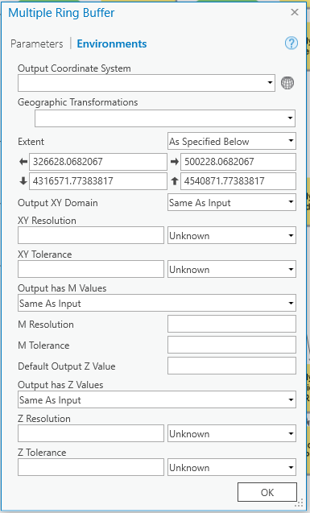

**Figure 7.** Environments tab of the Multiple Ring Buffer tool, with the Extent set from the combined NED raster.

<!-- VERIFY: the extent coordinates shown in Figure 7 (326628.07, 4316571.77 to 500228.07, 4540871.77) are from the original author's session. They are not stated anywhere in the text and their coordinate system is not given; students should set the Extent from their own combined DEM rather than typing these numbers. -->

### Step 5

Once all the data layers are processed with their buffers, all layers need to be converted to a raster to process in a raster calculator. To make the raster similar in size to the other rasters in the series, each layer needs to be processed to the extent of the Utah County DEM. The extent can be entered in as an environment parameter. Use the Polygon to Raster tool for the buffers and the Polyline to Raster tool for the power line shapefile. Make sure that all the rasters are set to the same cell size as the DEM under the Environments tab.

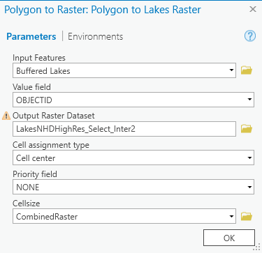

**Figure 8.** Parameters tab of the Polygon to Raster tool.

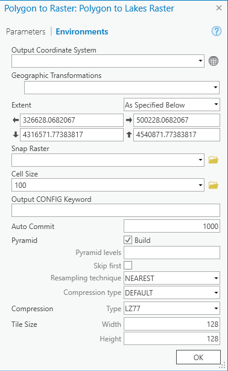

**Figure 9.** Environments tab of the Polygon to Raster tool, showing the extent and the 100 cell size.

### Step 6

Reclassify each layer according to the spatial considerations stated in the beginning of the lab.

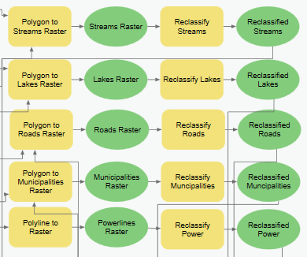

**Figure 10.** Polygon to Raster, Polyline to Raster, and Reclassify tools in ModelBuilder.

All values within lake/streams buffers should be given the value of 10 and NODATA the value of 1.

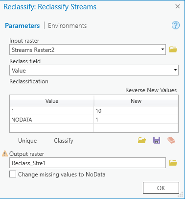

**Figure 11.** Reclassify tool in ModelBuilder for the streams raster.

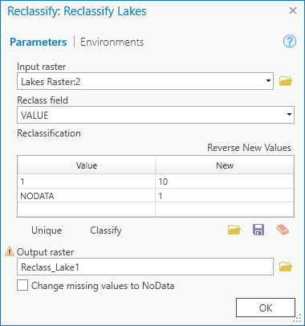

**Figure 12.** Reclassify tool in ModelBuilder for the lakes raster.

Values within the road buffer should be reclassified to 1 with all outside values assigned to NODATA.

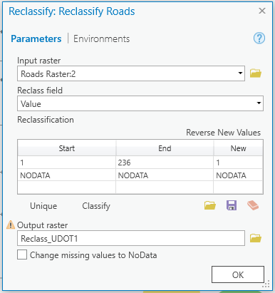

**Figure 13.** Reclassify tool in ModelBuilder for the roads raster.

The Municipalities should be reclassified so that the inner rings have a greater value and the outer rings have a lesser value.

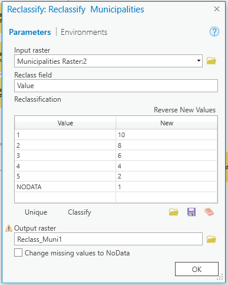

**Figure 14.** Reclassify tool in ModelBuilder for the municipalities raster.

Values along the power lines should be 1 with all NODATA values assigned to 10.

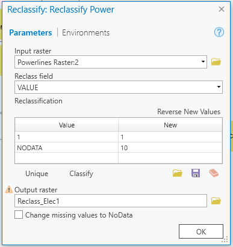

**Figure 15.** Reclassify tool in ModelBuilder for the power lines raster.

> [!IMPORTANT]
> Make sure that the cell size is set to 100 in all the Reclassify tools. You can check this under the Environments tab in the Reclassify tool window. The elevation will be multiplied to the scale factors. There will be no need to reclassify any of the values from the DEM.

### Step 7

Use the Raster Calculator tool and multiply the reclassified rasters together. This result gives you a sort of artificial "terrain." Desired, low-cost areas act like valleys while undesirable, high-cost areas are represented like mountains or plateaus. This artificial "terrain" can be manipulated by changing the buffers or reclassification values to weight different information on how it impacts our result. For this lab, we are considering all the spatial considerations almost equally.

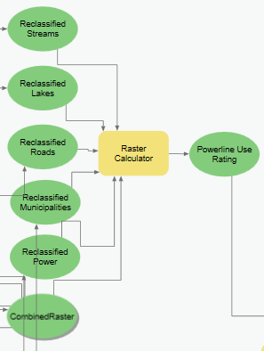

**Figure 16.** Using the Raster Calculator tool to combine all the different rasters that were created in the model.

### Step 8

Use the Cost Distance tool to calculate the least accumulative cost distance.

<!-- TODO(instructor): legacy tool. Cost Distance is deprecated; the current ArcGIS Pro replacement is Distance Accumulation, whose Output Back Direction Raster feeds Optimal Path As Line. Steps and screenshots left as written pending a re-test. -->

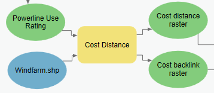

**Figure 17.** The Cost Distance tool in ModelBuilder.

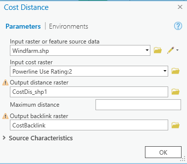

**Figure 18.** Cost Distance tool window.

### Step 9

Use the Cost Path tool to create the least cost path. This tool takes the two cost rasters from the previous tool and the destination point to create the least cost path.

<!-- TODO(instructor): legacy tool. Cost Path is deprecated; the current ArcGIS Pro replacements are Optimal Path As Line and Optimal Path As Raster. Steps and screenshots left as written pending a re-test. -->

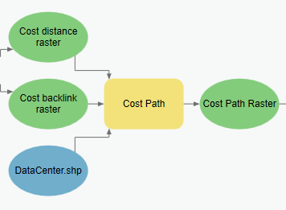

**Figure 19.** The Cost Path tool in ModelBuilder.

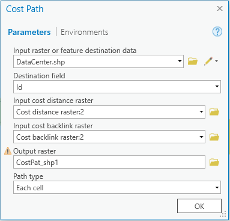

**Figure 20.** Cost Path tool window.

<!-- VERIFY: Figure 20 shows Path type set to "Each cell" and Destination field "Id". Neither is stated in the text; both are taken from the original author's session and have not been re-tested. -->

### Step 10

This final step takes the least cost path raster and converts it to a polyline shapefile. This makes the line visible to the viewer and it is easier to change the symbology.

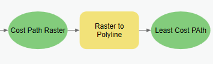

**Figure 21.** The Raster to Polyline tool in ModelBuilder.

> [!TIP]
> Make sure to save your model, because in a later lab you will need to access the work that you have done in this laboratory exercise.

## Deliverables

Once completed, submit your ModelBuilder process chart in its entirety and a map that demonstrates how you analyzed the included data and the results. Your map should conform to generally accepted cartography standards and should include at minimum, a scale bar, north arrow, and legend (see the following rubric). Your report should explain your ModelBuilder process and how it works. Make sure to provide any equations you used in your calculations and feel free to share any challenges you faced as you completed the process. Make sure to review the rubric at the end of this lab for the full requirements for the laboratory exercise.

## References

Meehan, Bill. *Case Studies in GIS: Empowering Electric and Gas Utilities with GIS.* Redlands, California: Esri Press, 2007. Print.

Schmidt, Andrew J. "Implementing a GIS Methodology for Siting High Voltage Electric Transmission Lines." *Papers in Resource Analysis* Volume 11, Winona, Minnesota: Saint Mary's University of Minnesota University Central Services Press, 2009. Accessed 05 July 2010. Web.

Vajjhala, Shalini P. and Paul S. Fischbeck. "Quantifying Siting Difficulty: A Case Study of U.S. Transmission Line Siting." Discussion Paper for Resources For the Future. Accessed 24 June 2010. Web. <http://www.rff.org/rff/documents/Rff-DP-06-03.pdf> <!-- TODO(instructor): this URL returns 404. A working replacement has not been substituted because the correct current location has not been verified. -->

## Example Map

**Figure 22.** Example map layout for the least cost path analysis.

## Rubric for Least Cost Path Analysis

> [!NOTE]
> We are only running this lab for one study area.

| Item | Points |
| --- | --- |
| Assignment Title, Name, Date, Course | |
| Brief report of the requirements of the project and why it matters. | /10 |
| Describe your model: list each of the tools used; list tool settings applied for the analysis (could someone repeat the assignment using your lab report?); list all input, intermediate, and output datasets; describe each input dataset, including type (point, line, polygon, raster) and the source of the data; describe each output dataset (point, line, polygon, raster) | /10 |
| One or more full pages (8.5 x 11) showing your model; all text is readable (10 pt. font minimum); all tools and data sets are shown | /10 |
| Describe the route computed for the new power line and what appears realistic versus unrealistic. What classifications would you change to make the model more realistic? | /5 |
| Create a full-page (8.5 x 11) map showing the results of your least-cost path analysis: map title, neat line, north arrow, scale bar; text box with author name, date, map projection; proposed path for new power lines clearly shown; all datasets clearly symbolized; visible basemap showing cities and major roads; zoomed to an appropriate scale for viewing analysis results; all text is legible on printed map; include an inset map showing the virtual terrain that was created. | /15 |

<!-- TODO(instructor): the rubric states no total. The five scored rows sum to 50 points, and the first row ("Assignment Title, Name, Date, Course") carries no point value at all — it may be intended as a checklist item or may be missing its points. Point values are an instructor decision and have not been changed. -->

<!-- TODO(instructor): the instructor plan asks that the lecture example, the assignment steps, and the rubric be aligned. The Week 11 lecture deck teaches the same legacy Cost Distance / Cost Path workflow used here, and the rubric asks students to list "tool settings applied," which will need updating in step with whichever tool set is adopted. -->

<!-- Migration notes (2026-09-03):
source: /Users/dan/ames-sync/Work/Teaching/CE 414 Engineering Applications of GIS/Labs/Lab 10 - Least Cost Path Power Line Analysis.docx
ArcGIS Pro version verified against: NOT VERIFIED in this migration.

images renamed from fig-NN:
  fig-01 -> lab10-full-model-overview.png
  fig-02 -> lab10-mosaic-to-new-raster-model.png
  fig-03 -> lab10-select-buffer-county-model.png
  fig-04 -> lab10-clip-intersect-model.png
  fig-05 -> lab10-buffer-tools-model.png
  fig-06 -> lab10-multiple-ring-buffer-parameters.png
  fig-07 -> lab10-multiple-ring-buffer-environments.png
  fig-08 -> lab10-polygon-to-raster-parameters.png
  fig-09 -> lab10-polygon-to-raster-environments.png
  fig-10 -> lab10-raster-conversion-reclassify-model.png
  fig-11 -> lab10-reclassify-streams.png
  fig-12 -> lab10-reclassify-lakes.png
  fig-13 -> lab10-reclassify-roads.png
  fig-14 -> lab10-reclassify-municipalities.png
  fig-15 -> lab10-reclassify-power-lines.png
  fig-16 -> lab10-raster-calculator-model.png
  fig-17 -> lab10-cost-distance-model.png
  fig-18 -> lab10-cost-distance-tool.png
  fig-19 -> lab10-cost-path-model.png
  fig-20 -> lab10-cost-path-tool.png
  fig-21 -> lab10-raster-to-polyline-model.png
  fig-22 -> lab10-example-map.png
No image was deleted; all 22 are referenced. images/.gitkeep removed.

figure numbering: the Word captions were numbered 1-17 but two images (the full-model
overview and the example map) had no caption, and three captions each covered two
screenshots. All 22 images are now numbered 1-22 in document order, and the three in-text
references were repointed (old "Figure 3" -> Figure 4, old "Figure 4" -> Figure 5,
old "Figure 5" -> Figures 6 and 7).

stale/unverified screenshots:
  - lab10-full-model-overview.png (Figure 1) — illegible at page width; needs re-export
    from ModelBuilder, not a re-screenshot.
  - All 21 ModelBuilder/tool captures are from an earlier ArcGIS Pro session and show the
    legacy Cost Distance / Cost Path dialogs. Not re-shot; not verified against a current
    ArcGIS Pro release.

TODO(instructor):
  - scenario language ("new NSA Data Center") not updated
  - impassable barriers vs high traversal costs not distinguished
  - units and raster environments (CRS, linear unit, cell size, extent, snap raster) not specified
  - no alternative weighting scenario required
  - data links redirect; named download labels may have changed
  - Cost Distance / Cost Path / Cost Back Link are deprecated (ModelBuilder Tools list, Step 8, Step 9)
  - Figure 1 needs re-export from ModelBuilder
  - rubric states no total; scored rows sum to 50; first row has no point value
  - lecture example, assignment steps, and rubric need aligning

VERIFY:
  - "Meehan, 2003" in-text vs "Meehan ... 2007" in the References list
  - "Set the cell size to 100" — no unit given
  - field names AreaSqKm and IsMajor not checked against current Utah NHD downloads
  - Multiple Ring Buffer extent coordinates in Figure 7 — session-specific, CRS unknown
  - Cost Path "Path type = Each cell" and "Destination field = Id" in Figure 20 — not in the text

dead/redirected links (checked 2026-09-03 with curl -sIL):
  - http://gis.utah.gov/data/sgid-transportation/roads-system/ -> 200 after redirect to
    https://gis.utah.gov/products/sgid/transportation/road-centerlines/
  - http://gis.utah.gov/data/water-data-services/lakes-rivers-dams/ -> 200 after redirect to
    https://gis.utah.gov/products/sgid/water/nhd-lakes/
  - http://gis.utah.gov/data/elevation-terrain-data/10-30-meter-elevation-models-usgs-ned/ -> 200
    after redirect to https://gis.utah.gov/products/sgid/elevation/
  - http://gis.utah.gov/data/boundaries/citycountystate/ -> 200 after redirect to
    https://gis.utah.gov/products/sgid/boundaries/
  - http://www.rff.org/rff/documents/Rff-DP-06-03.pdf -> 404 DEAD
-->
