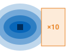
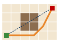
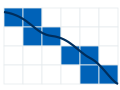
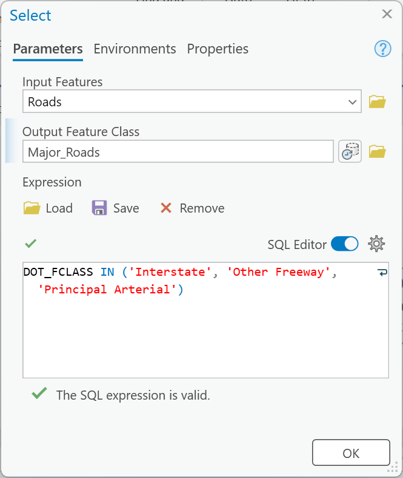
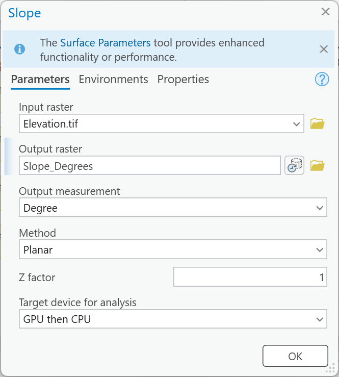
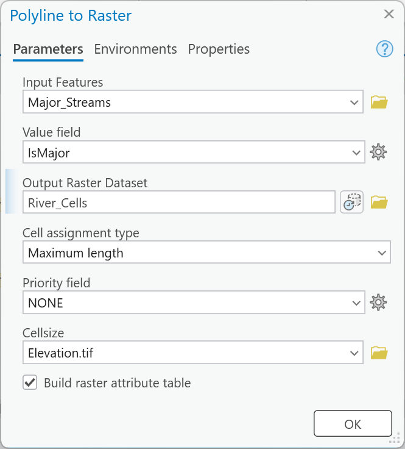
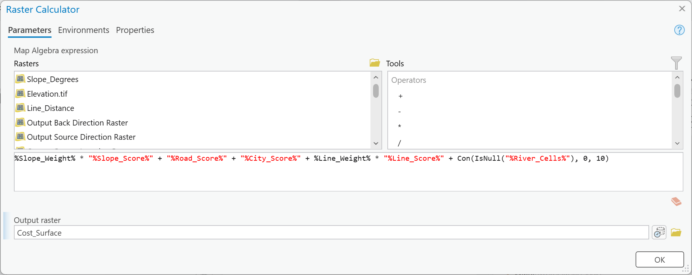
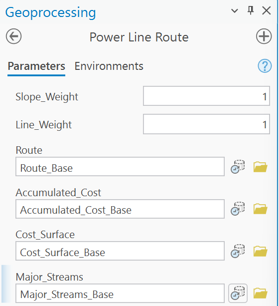

---
search:
  exclude: true
---

# DRAFT — Lab 11: Least Cost Path Power Line Analysis

**Civil Engineering 414 — Engineering Applications of GIS**

Fall 2026 · Dr. Dan Ames

*Routing a high-voltage line from Spanish Fork Canyon to Bluffdale, and finding out which decisions move it*

> [!WARNING]
> **This is a draft for review.** It is not linked from the course schedule; the assigned page is
> still the September migration of the Word handout (`README.md` in this folder). The plan, the
> decisions and every measured number are in `tools/lab11/PLAN.md` and
> `tools/lab11/check_values.json`.
>
> *Changes to what the lab asks students to do:* one hosted data package (`lab11-power-line.zip`,
> 18.0 MB) instead of six downloads, a county mosaic and a county buffer, clip and intersect; the
> endpoints are two real substations from UGRC's transmission layer, not typed coordinates; the
> buffers and Multiple Ring Buffer are replaced by straight-line distance rasters (Distance
> Accumulation with no cost raster) reclassified to scores; terrain enters as **slope**, not raw
> elevation; the cost surface is a weighted **sum** with two model parameters (**Slope_Weight**,
> **Line_Weight**) instead of a product; lakes and marshes over 1 km² are the only hard barrier; a Step 9 sensitivity
> table with a personal line weight from the BYU ID; two maps; the toolbox (`Lab11.atbx`) is
> uploaded with the report; "where the route is unrealistic" must name two places on the student's
> own route; rubric in five parts of ten, total 50.
>
> *Corrections:* the deprecated Cost Distance / Cost Back Link / Cost Path / Raster to Polyline chain
> is replaced by Distance Accumulation and Optimal Path As Line (ArcGIS Pro 3.7.1 shows Cost Distance's
> own deprecation notice); "cell size 100" with no unit is now 30 m in NAD 1983 UTM Zone 12N with the
> extent, snap raster and cell size all set; the road corridor was an absolute barrier (NoData outside
> 2 km) while everything else was a cost, without saying so — now one barrier, stated and explained;
> "lower elevations are more suitable" is replaced by slope; "network analysis" (this is a raster cost
> analysis); the "new NSA Data Center" is "the data center at Bluffdale"; the field names `AreaSqKm`,
> `IsMajor`, `DOT_FCLASS` and `LAYER` and every SQL value are verified against the package; the dead
> Resources for the Future link is removed; the rubric's untotaled rows are replaced.
>
> *Figures:* Figure A and the three tool icons are generated SVG (`tools/lab11/make_svgs.py`).
> Figure C and Figures 0–8 come from the GUI build of October 9, 2026 (ArcGIS Pro 3.7.1 at 175 %,
> `C:\Ames\Lab11GUI`, `tools/lab11/gui_project.py`): the model was built from this page, run inside
> ModelBuilder and from its tool dialog, and every check value in Steps 1–8 matched
> (`tools/lab11/check_gui.py`). The GUI build changed the page in three places: the endpoints are
> split by two Selects in the model, not definition-query layers; the barrier is not a dialog
> parameter (a Select output cannot be cleared from the dialog), so Step 9 no longer offers a
> no-barrier run; Reclassify rows are typed, since the table is empty before the model runs. The
> example maps are owed. There is no Figure B yet (see the TODO in the Background). The 22 Word-era images in `images/` are used only by the
> assigned page and go when this draft is promoted.
>
> *Site behavior:* excluded from search, not in the nav; reach it by URL.

> [!NOTE]
> **This is a one-week lab**, due Saturday of Week 12. Everything that takes preparation is done
> for you and hosted: you build one model, run it six times, and make two maps.

<!-- PILOT (no-GUI, 2026-10-09, C:\Ames\Pilot11\PILOT_NOTES.md): all 39 check values reproduced from the zip alone. Fixed from its findings: personal Line_Weight formula changed to 0.005 x digits (above about 0.6 the route stays within 300 m of the baseline: 1.09 moved 6 m, 0.8 199 m, 0.4 2,542 m, 0.22 2,905 m); maps now use the downloaded layers with definition queries, since a dialog run deletes the Select outputs; the major lakes are Utah Lake, Deer Creek Reservoir, White Lake and four unnamed swamp/marsh waterbodies (not five unnamed, not all open water); four -> six Selects in Figure C caption and deliverables; the crossing caveat dropped (Pairwise Intersect gives exactly 4 single points for every run); Week 12 deck link qualified (the deck uses an earlier 100 m setup, 68.86 km); orphan blank lines, Major_Streams_L0 in the naming example, pyramids prompt and Figure 8 alt text fixed.
TODO(instructor): report template (lab11-report-template.docx, tools/templates/make_lab_report_template.js) is owed; add the "Start from the report template" TIP here, as in Labs 7 and 10, once it exists. -->

## Background

Aging infrastructure in the United States, and new demand on top of it, means new transmission
lines. Before a utility can build one, it has to find a route for it. The placement of a utility
line is a hard modeling problem. Left to itself, the cheapest path between two points is a straight
line, but engineering limits and terrain make a straight line rare, and public opinion matters as
much as either. Opposition summed up as NIMBY (Not In My Back Yard) and BANANA (Build Absolutely
Nothing Anywhere Near Anything) can force a utility to rethink a route and the process that chose
it (Vajjhala and Fischbeck, 2006).

A GIS professional on a siting project is asked to adjust the model's inputs again and again and to
produce paths that weigh many factors at once (Meehan, 2007).<!-- VERIFY: Meehan 2003 vs 2007. The source handout cited "Meehan, 2003" in the text but listed only the 2007 Esri Press title; this draft cites the 2007 title it lists. --> That is why the
work belongs in a model: added layers, changed weights and new requirements all change the least
cost path, and a model can be re-run as many times as it takes to reach a route everyone involved
can accept. This lab introduces a few of the processes and requirements used to model a least cost
path for a power line. It does not model the public's behavior; Step 9 asks you what that leaves out.

A least cost path works on a **cost surface**: a raster in which every cell says how expensive it is
to build across it. You decide what makes a cell expensive — steep ground, distance from a road you
could build from, nearness to a city, distance from an existing line whose corridor you could share,
a river to cross — and give each a score. Then ArcGIS Pro accumulates the cost outward from the start
and walks the cheapest way home from the end.

The route you get is the cheapest route **for the costs you chose**, and nothing more. Every score
and every weight in this lab is a decision, and several of them are close calls. In Step 9 you will
vary the weights, see how far the route moves, and use what moves to say which decisions the answer
really depends on, and which ones hardly matter.

<!-- TODO(figure): Figure B — a measured study-area map (the box, the two substations, the existing kV lines, Utah Lake, the 52.79 km straight line) built with arcpy.mp, or drop the letter and renumber Figure C as B. -->

> [!IMPORTANT]
> **Your job — see the deliverables below.** Build one ModelBuilder model that turns slope, roads,
> cities, existing lines and streams into a cost surface and routes a power line across it; run it
> from the study area's two substations; test how much the route depends on the weights; and make
> two maps.

## Problem Statement

A new high-voltage line is needed from an existing substation at the mouth of Spanish Fork Canyon,
in the area of the wind park there, to an existing substation at the Point of the Mountain in
Bluffdale, near the data center at Bluffdale. Both substations are features of the Utah Geospatial
Resource Center's transmission-line layer. Using an elevation model and the roads, lakes, streams,
city boundaries and existing power lines between them:

1. Build a cost surface that scores every 30 m cell on slope, distance to a major road, nearness to
   a city, distance to an existing line, and whether it is a major stream.
2. Find the least cost route from the source substation to the destination substation, around the
   major lakes.
3. Report its length, its total accumulated cost, and how many major streams it crosses.
4. Re-run the model with the weights changed, and say what moved the route and why.

## Analysis Considerations

Every one of these is a decision somebody made, and every one of them can change the answer.

- **The endpoints are substations.** `Endpoints` holds two existing substations, copied from UGRC's
  transmission layer (its object IDs **2185** and **1350**, kept in the field `UGRC_OID`): the
  **Source** at the mouth of Spanish Fork Canyon (40.0808° N, 111.5837° W) and the **Destination** at
  the Point of the Mountain, Bluffdale (40.4662° N, 111.9473° W). A new line starts and ends where it
  can connect to the grid. The straight line between them is **52.79 km**.
- **Cell size and coordinate system.** **30 m** cells, in **NAD 1983 UTM Zone 12N**, meters, so that
  every cell is the same size and distances and costs are in meters. The extent, snap raster and cell
  size of every raster are set from `Elevation.tif`.
- **Slope, not elevation.** Lower ground is not cheaper to build on; steep ground is more expensive:
  harder access, harder tower foundations. So terrain enters as **slope in degrees**, scored 1 to 10.
  Elevation itself is not in the cost.
- **Four scores, 1 to 10, higher = more expensive.** The class breaks are this lab's choices, not an
  engineering standard. You will defend or change them in your report.

    | Score | From | 1 (cheap) … 10 (expensive) |
    | --- | --- | --- |
    | `Slope_Score` | slope, degrees | 0–5: **1**, 5–10: **2**, 10–15: **4**, 15–20: **6**, 20–30: **8**, over 30: **10** |
    | `Road_Score` | distance to a major road | within 1 km: **1**, 1–2 km: **3**, 2–5 km: **6**, over 5 km: **10** |
    | `City_Score` | distance to a city boundary (0 inside a city) | within 1 km: **10**, 1–2 km: **8**, 2–3 km: **6**, 3–4 km: **4**, 4–5 km: **2**, over 5 km: **1** |
    | `Line_Score` | distance to an existing kV line | within 500 m: **1**, 0.5–2 km: **5**, over 2 km: **10** |

    A road you can build from is cheap access; a city is right-of-way you would have to buy through
    neighborhoods; an existing line is a corridor you can share.
- **Equal weights by default.** The cost of a cell is the sum of the four scores, with **Slope_Weight**
  and **Line_Weight** multiplying the slope and line scores. Both are **1** by default, which says
  every factor matters equally. Nobody knows that, so the two weights are **model parameters** and
  Step 9 changes them.
- **One hard barrier: lakes and marshes over 1 km².** A **barrier** is a cell the route may never enter; a **cost** is a
  cell it may cross if nothing cheaper exists. Only waterbodies over 1 km² — Utah Lake, Deer Creek
  Reservoir, White Lake and four unnamed marshes — are barriers. Cities stay a cost, not a barrier: both
  substations are inside cities, and most of the valley floor between them is municipal.
- **A major stream adds 10 per cell.** Each cell a major stream passes through adds **10** to the
  cost, so a route crosses a river where it has to, and does not run along one.
- **Distances are straight-line.** Distance to a road, a city or a line is measured as the crow
  flies, not along the ground or a road network.
- **What the model ignores.** Right-of-way and who owns the land; tower placement and span lengths;
  line capacity and voltage; existing lines that are full; and public opinion. None of these is in
  the data, and your report says what each would change.

## Data

> [!IMPORTANT]
> **Set up your folder before you download anything.** On the lab machines, work on the **D:
> drive**: one folder for this class named after you, `D:\Smith\`, and one folder per lab inside
> it, `D:\Smith\Lab11\`. The **C: drive is locked**, and a **network drive** is slow enough to make
> ArcGIS Pro hang. **Never use a space** in a folder or file name you create — raster tools fail on
> them without saying why. **Back up your lab folder at the end of every session.** The full set of
> conventions is on the [ArcGIS Tips and Reminders](../../arcgis-tips.md){ target="_blank" } page.

- **Download:** [`lab11-power-line.zip`](../../data/lab11-power-line.zip) (18.0 MB). Unzip it into
  your Lab11 folder — the files are in a `lab11-power-line` folder inside it — and read
  `READ-ME-FIRST.txt`.

Every layer is a prepared extract, clipped to one box, **39.98–40.55° N, 112.05–111.45° W**, from the
mouth of Spanish Fork Canyon to Bluffdale, and stored in NAD 1983 UTM Zone 12N:

| Layer | What it is | Where it comes from |
| --- | --- | --- |
| `Elevation.tif` | Ground elevation, meters above NAVD 88, 30 m cells | USGS [3D Elevation Program](https://www.usgs.gov/3d-elevation-program){ target="_blank" } (3DEP), read from the 3DEP elevation image service and exported at 30 m with bilinear resampling |
| `PowerLineData.gdb\Roads` | Road centerlines that UDOT gives a functional class (`DOT_FCLASS`) | UGRC [Road Centerlines](https://gis.utah.gov/products/sgid/transportation/road-centerlines/){ target="_blank" } (UtahRoads) |
| `PowerLineData.gdb\Lakes` | Every NHD waterbody in the box, with `AreaSqKm` | UGRC [NHD Lakes](https://gis.utah.gov/products/sgid/water/nhd-lakes/){ target="_blank" } |
| `PowerLineData.gdb\Streams` | Every NHD flowline in the box, with `IsMajor` | UGRC [NHD Streams](https://gis.utah.gov/products/sgid/water/nhd-streams/){ target="_blank" } |
| `PowerLineData.gdb\Cities` | Municipal boundaries | UGRC [Municipal Boundaries](https://gis.utah.gov/products/sgid/boundaries/municipal/){ target="_blank" } |
| `PowerLineData.gdb\Power_Lines` | Transmission lines (`LAYER` `KV-46`, `KV-138`, `KV-345`) and substations (`LAYER` `SUB-...`) | UGRC TransmissionLines, a live feature service with no product page: [the service layer](https://services1.arcgis.com/99lidPhWCzftIe9K/ArcGIS/rest/services/TransmissionLines/FeatureServer/0){ target="_blank" } |
| `PowerLineData.gdb\Endpoints` | The two substations, `Role` = `Source` / `Destination` | Copied from `Power_Lines` (`UGRC_OID` 2185 and 1350) |
| `Major_Roads`, `Major_Lakes`, `Major_Streams`, `Existing_Lines` | The subsets the model uses | **You make them**, in Step 1 |

**What we already did for you.** Read each layer from its source on October 9, 2026, clipped it to
the box, and kept only the fields the lab uses plus `UGRC_OID`, the feature's object ID in the UGRC
service. Field values were not changed. There is no layer here for you to create and defend; the
weights you choose in Step 9 play that role.

> [!TIP]
> **Check the data:** `Elevation.tif` is **1,719 columns × 2,124 rows** of 30 m cells, **1,314.97 to
> 3,568.37** m, NAD 1983 UTM Zone 12N. In `PowerLineData.gdb`: `Roads` **8,937** features, `Lakes`
> **967**, `Streams` **4,086**, `Cities` **34**, `Power_Lines` **292**, `Endpoints` **2**.

![Infographic titled "Reading the metadata: the six questions from CCE 114", six cards answered for this lab's data. What: Elevation.tif is ground elevation in meters above NAVD 88 on 30 m cells; roads with a UDOT class; NHD lakes and streams; city limits; power lines (KV-46, 138 and 345) and substations. Where: 39.98 to 40.55 N, 112.05 to 111.45 W, the mouth of Spanish Fork Canyon to Bluffdale, NAD 1983 UTM zone 12N in meters for every layer, while the services themselves serve Web Mercator. When: all read October 9, 2026; roads "Last Update 08/05/2026"; cities and lakes edited October 1, 2026; streams and power lines March 7, 2026; a last-edit date is not when a feature was mapped. Why: roads for cartography, address location and UDOT's linear referencing; cities for "cartography and approximate boundary identification"; 3DEP as the national best-available elevation. How: city boundaries change only when certified by the Lieutenant Governor's Office; 3DEP exported at 30 m, bilinear, and every layer clipped to the box; the power-line layer does not say. Who: USGS (3DEP, the NHD) and the Utah Geospatial Resource Center (roads with UDOT, cities, power lines); public data, credit each source. An orange footer: the power-line layer's whole description is "Electrical transmission facilities in Utah" — no source, no date of mapping, no accuracy; your route leans on it, so say what you would want to know before trusting it and what a missing or misplaced line would do to your route.](images/lab11-metadata.svg)

**Figure A.** The six metadata questions, applied to this lab's data. Confirm three values yourself
and copy them into your report: the **"Last Update"** date in the description of the
[UtahRoads service layer](https://services1.arcgis.com/99lidPhWCzftIe9K/ArcGIS/rest/services/UtahRoads/FeatureServer/0){ target="_blank" };
what the municipal boundaries are **for**, from the description of the
[UtahMunicipalBoundaries service layer](https://services1.arcgis.com/99lidPhWCzftIe9K/ArcGIS/rest/services/UtahMunicipalBoundaries/FeatureServer/0){ target="_blank" };
and what the [TransmissionLines service layer](https://services1.arcgis.com/99lidPhWCzftIe9K/ArcGIS/rest/services/TransmissionLines/FeatureServer/0){ target="_blank" }'s
metadata says, and what it does not. Say what each one means for your route.

## ModelBuilder Tools

New in this lab:

| Tool | What it does |
| --- | --- |
| { .tool-icon }<br>**Distance Accumulation** (Spatial Analyst) | For every cell, the cheapest total cost of reaching it from a source, spreading slowly through expensive cells and never through a barrier; it also writes the **back direction**, the way home. With no cost raster it gives plain straight-line distance, so this lab uses it for both jobs. [Tool reference](https://pro.arcgis.com/en/pro-app/latest/tool-reference/spatial-analyst/distance-accumulation.htm){ target="_blank" } |
| { .tool-icon }<br>**Optimal Path As Line** (Spatial Analyst) | Walks from a destination back to the source along the back direction raster, and draws the cheapest route as a line feature class. [Tool reference](https://pro.arcgis.com/en/pro-app/latest/tool-reference/spatial-analyst/optimal-path-as-line.htm){ target="_blank" } |
| { .tool-icon }<br>**Polyline to Raster** (Conversion) | Turns lines into cells: every cell a line passes through takes the value of a field you choose, and every other cell is NoData. Here, the major streams become river cells. [Tool reference](https://pro.arcgis.com/en/pro-app/latest/tool-reference/conversion/polyline-to-raster.htm){ target="_blank" } |

Tools you already know: **Select** (Lab 1), **Slope** (Lab 10), **Reclassify** (Lab 2), and
**Raster Calculator** with model variables (Labs 5 and 10).

## Example Model

![The Power Line Route model exported from ModelBuilder, laid out left to right. Roads, Lakes, Streams and Power_Lines each go through a Select to Major_Roads, Major_Lakes, Major_Streams (marked P) and Existing_Lines; Cities, Major_Roads and Existing_Lines each go to a Distance Accumulation that makes City_Distance, Road_Distance and Line_Distance, plus three unused outputs each; Elevation.tif goes through Slope to Slope_Degrees; four Reclassify tools make Slope_Score, Road_Score, City_Score and Line_Score; Polyline to Raster makes River_Cells; Raster Calculator takes the four scores, River_Cells, Slope_Weight and Line_Weight (both marked P) and makes Cost_Surface (P). Endpoints goes through two Selects to Source_Point and Destination_Point; a fourth Distance Accumulation takes Source_Point, Major_Lakes as the barrier and Cost_Surface and makes Accumulated_Cost (P) and Back_Direction; Optimal Path As Line takes Destination_Point, Accumulated_Cost and Back_Direction and makes Route (P). Every tool carries a green check from a completed run.](images/lab11-model.svg)

**Figure C.** The finished model, exported from ModelBuilder — **click it to open it full size**. Six
selections and an elevation model in; five score rasters in the middle; one cost surface; one
route out. The elements marked `P` are the model parameters — the two weights and the outputs you keep —
and they become the tool dialog of Step 8. ModelBuilder numbers repeated tools itself:
*Select (2)*, *Distance Accumulation (3)*.

## Complete the Lab

For an advanced GIS student, the information up to this point is all you need to complete the
assignment. Feel free to try the analysis using only the information above. If you complete the lab
without the step-by-step instructions below, say so in your report.

## Step-by-Step Solution

> [!NOTE]
> **Build it once, build it to be changed.** The steps walk through the route at the default
> weights. Step 9 re-runs the same model six times with the weights changed, so give every dataset
> a readable name as you go.

> [!NOTE]
> **Every check value on this page** was measured on the files you download, with the settings
> below, in ArcGIS Pro 3.7.1. Your numbers should match to the last digit shown. The screenshots
> were captured in the same version and may differ slightly from yours.

### Step 0 — Set Up the Project

1. Create a new project named `Lab11` in `D:\Smith\Lab11\` with the **Map** template; if you already
   made the folder, uncheck **Create a folder for this local project**. ArcGIS Pro makes `Lab11.gdb`
   and `Lab11.atbx` beside it. The downloaded data stay in their own geodatabase,
   `lab11-power-line\PowerLineData.gdb`.
2. Add `Elevation.tif` (if ArcGIS Pro offers to build pyramids or statistics, click **OK**) and, from
   `PowerLineData.gdb`, `Roads`, `Lakes`, `Streams`, `Cities` and `Power_Lines`. Add an imagery
   basemap.
3. Add `Endpoints` too. It holds both substations; the model separates them in Step 1.
4. Confirm Spatial Analyst is licensed (**Project** ▸ **Licensing**).
5. On the **Analysis** tab click **ModelBuilder**. On the **ModelBuilder** tab click
   **Properties**, set **Name** to `PowerLineRoute` and **Label** to `Power Line Route`, and save.
6. On the **ModelBuilder** tab click **Environments** and set:
    - **Current Workspace** and **Scratch Workspace**: your project geodatabase, `Lab11.gdb`
    - **Output Coordinate System**: NAD 1983 UTM Zone 12N (the same as every layer in the package)
    - **Extent**: choose `Elevation.tif` from the list of the map's layers
    - **Snap Raster**: `Elevation.tif`
    - **Cell Size**: `Elevation.tif` (30)


**Figure 0.** ModelBuilder ▸ **Environments**. Choosing `Elevation.tif` for the Extent fills in its
four edges.

> [!TIP]
> **Check the result:** after Steps 2 and 3, every raster the model makes is **1,719 columns × 2,124
> rows** of **30 m** cells, exactly the size of `Elevation.tif` (the layer's **Properties** ▸
> **Source** ▸ **Raster Information**). A distance raster of another size means the Extent or Cell
> Size environment was not set.

### Step 1 — Select the Layers

Add six **Select** tools to the model, each from the downloaded layer, with these expressions
(turn on **SQL Editor** and type them exactly; the check mark under the box should say **The SQL
expression is valid**):

| Input | Output | Expression |
| --- | --- | --- |
| `Roads` | `Major_Roads` | `DOT_FCLASS IN ('Interstate', 'Other Freeway', 'Principal Arterial')` |
| `Lakes` | `Major_Lakes` | `AreaSqKm > 1` |
| `Streams` | `Major_Streams` | `IsMajor = 1` |
| `Power_Lines` | `Existing_Lines` | `LAYER LIKE 'KV-%'` |
| `Endpoints` | `Source_Point` | `Role = 'Source'` |
| `Endpoints` | `Destination_Point` | `Role = 'Destination'` |

The power-line layer holds both lines and substations; the substations' `LAYER` values begin with
`SUB-`, and `KV-%` keeps only the lines. The last two split the endpoints into one point each.
To make the next Select quickly, copy and paste one on the canvas, then change its input,
expression and output; type the output name **after** validating the expression, which can reset it.



**Figure 1.** Select, with the expression typed in the SQL editor.

> [!TIP]
> **Check the result:** `Major_Roads` **1,377** features, `Major_Lakes` **7** (Utah Lake, Deer Creek
> Reservoir, White Lake and four unnamed marshes), `Major_Streams` **319**, `Existing_Lines` **241**; `Source_Point` and `Destination_Point` **1** each. An output with the
> same count as its input — 8,937 roads, 292 power lines — means the expression was not applied; 292
> power lines include the **51** substations.

### Step 2 — Compute Slope

Add **Slope** (Spatial Analyst) with `Elevation.tif` as the input, **Output measurement** **Degree**
(the default), and output `Slope_Degrees`. The dialog suggests the **Surface Parameters** tool
instead; Slope is the one this lab uses.



**Figure 2.** Slope, in degrees.

> [!TIP]
> **Check the result:** `Slope_Degrees` runs from **0 to 71.81°**, mean **11.21°** (the layer's
> **Properties** ▸ **Source** ▸ **Statistics**). A maximum above 90 means **Percent rise** was chosen.

### Step 3 — Measure Distances

Add **Distance Accumulation** three times. Each takes one layer as **Input Raster or Feature
Sources** and nothing else: leave **Input Raster or Feature Barriers**, **Input Surface Raster** and
**Input Cost Raster** empty.

| Input Raster or Feature Sources | Output Distance Accumulation Raster |
| --- | --- |
| `Major_Roads` | `Road_Distance` |
| `Cities` (the downloaded layer) | `City_Distance` |
| `Existing_Lines` | `Line_Distance` |

With no cost raster, every cell costs 1 per meter, so the "accumulated cost" is simply the
straight-line distance in meters to the nearest source. One tool does both jobs in this lab: here it
measures distance, and in Step 7 it accumulates cost.


**Figure 3.** Distance Accumulation with a source and nothing else: straight-line distance.

> [!TIP]
> **Check the result:** `Road_Distance` reaches **24,515 m**, `City_Distance` **14,923 m**, and
> `Line_Distance` **15,571 m**. `City_Distance` is **0** inside every city, because a polygon source
> covers its own cells.

### Step 4 — Score the Factors

Add **Reclassify** four times, one for each table in the Analysis Considerations. For the last row
of each distance table, end the range at **100000** — larger than any distance in the box.
The table is empty until the model has run, so type the rows: click a **Start** cell, type, and press
**Tab** to move to **End** and **New**; ArcGIS Pro adds its own **NODATA** row. To make the next
Reclassify, copy one, change its input, and clear the rows with **Remove all remap records**.

| Input raster | Rows (start – end: new value) | Output raster |
| --- | --- | --- |
| `Slope_Degrees` | 0–5: 1; 5–10: 2; 10–15: 4; 15–20: 6; 20–30: 8; 30–90: 10 | `Slope_Score` |
| `Road_Distance` | 0–1000: 1; 1000–2000: 3; 2000–5000: 6; 5000–100000: 10 | `Road_Score` |
| `City_Distance` | 0–1000: 10; 1000–2000: 8; 2000–3000: 6; 3000–4000: 4; 4000–5000: 2; 5000–100000: 1 | `City_Score` |
| `Line_Distance` | 0–500: 1; 500–2000: 5; 2000–100000: 10 | `Line_Score` |

A value exactly on a break goes to the lower range: a cell exactly 1,000 m from a road scores 1.


**Figure 4.** The city score: the nearer the city, the more expensive.

> [!TIP]
> **Check the result** (cells in each class; the layer's attribute table lists them):
>
> | Score | 1 | 2 | 3 | 4 | 5 | 6 | 8 | 10 |
> | --- | --- | --- | --- | --- | --- | --- | --- | --- |
> | `Slope_Score` | 1,848,647 | 324,957 | | 259,000 | | 249,393 | 501,985 | 459,492 |
> | `Road_Score` | 646,624 | | 374,134 | | | 835,970 | | 1,794,428 |
> | `City_Score` | 1,055,936 | 198,582 | | 228,810 | | 254,776 | 293,203 | 1,619,849 |
> | `Line_Score` | 614,688 | | | | 1,084,196 | | | 1,952,272 |
>
> `Road_Score`, `City_Score` and `Line_Score` each add up to **3,651,156** cells, the whole box.
> `Slope_Score` adds up to **3,643,474**: 7,682 fewer, the one-cell ring around the edge of the box,
> where Slope has no neighbors on one side and writes NoData.<!-- VERIFY in the GUI build: 7,682 = 2 x 1,719 + 2 x 2,122, exactly the outer ring; confirm Slope_Degrees is NoData there rather than the DEM. --> If a score raster has
> NoData anywhere else, a range has a gap.

### Step 5 — Mark the Rivers

Add **Polyline to Raster** with `Major_Streams` as the **Input Features** and **Value field**
`IsMajor` — every major stream has `IsMajor` = 1 — and output `River_Cells`. Leave **Cell
assignment type** at **Maximum length**; the cell size comes from the environment.

Any field that holds 1 on every feature works.



**Figure 5.** Every cell a major stream passes through becomes a river cell.

> [!TIP]
> **Check the result:** `River_Cells` has **9,713** cells, all with the value 1; every other cell is
> NoData.

### Step 6 — Build the Cost

1. On the **ModelBuilder** tab click **Variable**, choose **Double**, and click **OK**. Right-click
   the new oval ▸ **Rename** ▸ `Slope_Weight`, double-click it and type `1`, and right-click it ▸
   **Parameter**. Do the same for `Line_Weight`, also `1`.
2. Add **Raster Calculator** with this expression, and output `Cost_Surface`:

```text
%Slope_Weight% * "%Slope_Score%" + "%Road_Score%" + "%City_Score%" + %Line_Weight% * "%Line_Score%" + Con(IsNull("%River_Cells%"), 0, 10)
```

Double-click a raster in the **Rasters** list and it goes in as `"%Slope_Score%"`; type the weights
as `%Slope_Weight%` and `%Line_Weight%`, without quotation marks, since they are numbers.

The last term turns river cells into 10 and every other cell into 0: `IsNull` is true where
`River_Cells` is NoData. Without it, every cell off a river would be NoData in the sum. Type the
output name last; Raster Calculator can replace a typed name with a default when the expression
changes. Make `Cost_Surface` a parameter, so that a run from the tool dialog keeps it.



**Figure 6.** The cost surface: four scores, two weights and the river crossings. Drag the dialog's
corner to widen it.

> [!TIP]
> **Check the result:** `Cost_Surface` runs from **4 to 48**, mean **23.69**. A minimum of 4 is a
> cell scoring 1 on every factor, off a river. If your minimum is not 4, a weight is not 1 or a score
> raster has NoData; if most of the box is NoData, the `Con(IsNull(...))` term is missing.

> [!NOTE]
> **Why a sum, and why weights.** Adding scores says a steep cell next to a road is still expensive
> for being steep; each factor adds its own cost. A weight of 2 says that factor matters twice as much
> as the others; 0 removes it. Reclassify's table cannot be a parameter, but a number in Raster
> Calculator can, which is why the weights live here.

### Step 7 — Route the Line

1. Add **Distance Accumulation** again:
    - **Input Raster or Feature Sources**: `Source_Point`
    - **Output Distance Accumulation Raster**: `Accumulated_Cost`
    - **Input Raster or Feature Barriers**: `Major_Lakes`
    - **Input Surface Raster**: empty
    - **Input Cost Raster**: `Cost_Surface`
    - **Output Back Direction Raster**: `Back_Direction`
2. Add **Optimal Path As Line**:
    - **Input Raster or Feature Destinations**: `Destination_Point` (**Destination Field** fills
      in with `UGRC_OID`; leave it)
    - **Input Distance Accumulation Raster**: `Accumulated_Cost`
    - **Input Back Direction or Flow Direction Raster**: `Back_Direction`
    - **Output Optimal Path as Line**: `Route`
    - **Path Type**: **Each zone** (with one destination, it does not matter)
3. Make `Accumulated_Cost` and `Route` parameters. Save the model and run it inside ModelBuilder
   (**Run** on the ModelBuilder tab). It took about a minute and a half on a laptop.


**Figure 7a.** The cost accumulated outward from the source substation, around the lakes.


**Figure 7b.** The route walked home from the destination.

Then measure three things about the route:

- **Its length:** the `Shape_Length` field of `Route`, in meters. If `Route` has more than one row,
  add them.
- **The total accumulated cost:** on the **Map** tab click **Explore**, and click `Accumulated_Cost`
  exactly at the `Destination` point (zoom in until one cell is clearly visible). The pop-up gives the
  cell's value.
- **The major streams it crosses:** run **Pairwise Intersect** of `Route` and `Major_Streams` with
  **Output Type** **Point**, and count the points it makes.

> [!TIP]
> **Check the result:** `Route` is **56.09 km** long; the straight line between the substations is
> **52.79 km**. The accumulated cost at the destination is **744,018**, and `Accumulated_Cost` reaches
> **1,116,187** at the far corner of the box. The route crosses **4** major streams. If your route is
> close to the straight line, bending only around the lakes, Distance Accumulation got no cost raster.

> [!NOTE]
> **Reading the two rasters.** `Accumulated_Cost` is cost × meters: a step across one 30 m cell of cost
> 4 adds 120. At the destination, 744,018 over 56,090 m is an average cost of about 13 per meter
> along the route. `Back_Direction` says which way to step to get home, in **degrees**: **0** marks the
> source, **90** means go east, 180 south, 270 west and 360 north. The Week 12 Thursday deck reads one cell by cell on an earlier, coarser version of this setup ([Least Cost Path Analysis, Part B](https://byu-hydroinformatics.github.io/ce414-gis-applications/slides/week-12/least-cost-path-b.html){ target="_blank" }); its numbers are not this lab's.

### Step 8 — Run the Tool

Step 9 runs the model six times, so make each run cheap: everything you will change or keep must be
a parameter.

1. Check that these are parameters (right-click ▸ **Parameter**; a `P` appears beside each):
   `Slope_Weight`, `Line_Weight`, `Major_Streams` (so the crossings can be counted after every run),
   `Cost_Surface`, `Accumulated_Cost` and `Route`.
2. Save, and close the model's tab. In the **Catalog** pane, open `Lab11.atbx` and double-click
   **Power Line Route**: it opens as a tool in the Geoprocessing pane.
3. Run it once at the defaults, with new output names — `Route_Base`, `Accumulated_Cost_Base`,
   `Cost_Surface_Base`, `Major_Streams_Base` — and measure the route as in Step 7. A yellow warning
   that a dataset already exists only means it will be replaced.




**Figure 8.** The model as a tool. Give every output a new name for each run.

> [!WARNING]
> **A run from the tool dialog deletes everything that is not a parameter** (Labs 5, 7 and 10 saw
> it): `Major_Roads`, `Existing_Lines`, `Slope_Degrees`, the three distance rasters, the four score
> rasters, `River_Cells`, `Back_Direction`, `Major_Lakes`, `Source_Point` and `Destination_Point` all
> go, including the copies the earlier run inside ModelBuilder made. That is why the datasets you need later are parameters. Make your Step 4 and
> Step 5 checks from the run inside ModelBuilder, before any dialog run, and for your maps use the
> downloaded layers (`Roads`, `Lakes`, `Power_Lines`, `Endpoints`) with **definition queries**
> holding the same expressions as the Selects, not the model's outputs.

> [!TIP]
> **Check the result:** at the defaults, the dialog run reproduces Step 7 exactly: `Route_Base` is
> **56.09 km**, with **744,018** at the destination and **4** crossings. If it does not, a parameter
> was left at a value from testing.

### Step 9 — Test the Weights

The default route is *an* answer, not *the* answer. It is the cheapest route only if slope, roads,
cities and existing lines each matter exactly as much as the others, and nobody decided that; it is
simply what weights of 1 say. Before you defend a route, find out which of those weights it depends
on.

**First, your own line weight.** Every student routes the line with a different **Line_Weight**,
worked out from your **BYU ID number**: the **nine-digit number printed on your BYU ID card**, such as
`123456789`. It is **not your NetID**, the user name of letters and numbers you chose and use to sign
in to BYU sites.

> **Your Line_Weight = 0.005 × (the last two digits of your BYU ID)**, from 0 to 0.495.
>
> - BYU ID `123456789`: last two digits **89**, Line_Weight = 0.005 × 89 = **0.445**: route
>   **______ km**, accumulated cost at the destination **______**, **______** major streams crossed.
> - BYU ID `987654302`: last two digits **02**, Line_Weight = 0.005 × 2 = **0.010**: route
>   **______ km**, accumulated cost at the destination **______**, **______** major streams crossed.
>
> Write your BYU ID's last two digits and your Line_Weight in your report: the grader checks your
> route against them.

<!-- TODO(numbers): personal example rows for BYU IDs ending 89 and 02 from tools/lab11/personal_lookup.csv (not yet generated: run `python run_model.py personal` with the ArcGIS Pro Python) -->

**Then run the model from its tool dialog at least five times**, each with new output names that say
what changed (`Route_L0`, `Accumulated_Cost_L0`, `Cost_Surface_L0`, `Major_Streams_L0`):

| Run | Slope_Weight | Line_Weight |
| --- | --- | --- |
| Baseline (Step 8) | 1 | 1 |
| `L0` | 1 | **0** |
| `L2` | 1 | **2** |
| `S5` | **5** | 1 |
| Yours | 1 | **your Line_Weight** |
| Your choice | ? | ? |

For the last run, choose something deliberately and say why: set slope to 0 to remove it, push one
weight far up, or try a Line_Weight between 0 and yours to see where the route starts to move.

Record **all of it in one table**: for the baseline and every run, the Slope_Weight, the Line_Weight,
the route length in km, the total accumulated cost at the destination, the
number of major streams crossed, and **the largest distance between the run's route and the
baseline's**. Measure that last one with the **Measure** tool (**Map** tab ▸ **Measure**) at the place
where the two lines are farthest apart, to the nearest 100 m.

Then answer, in your report:

1. **Which weight moved the route, and which barely did — and why?** Put each run's route on the
   baseline map and look at where the baseline runs before you explain it.
2. **How much longer than the straight line is your route, and what is it buying with the extra
   kilometers?** Use your own run's length and the 52.79 km straight line, and point to the places on
   the map where the route bends.
3. **What does the cost surface leave out?** Right-of-way, landowners, the public opinion the
   Background raises, line capacity: say what each would do to your route and what data you would add
   to the model to include it.

Your second map shows your own route and one other run beside the baseline; say on the map what
changed and why.

> [!TIP]
> Look at where the baseline route runs. Nearly all of it hugs existing lines, and in a flat valley,
> slope is low almost everywhere the route could go. One weight moves the route kilometers; the other
> barely moves it at all.

## Deliverables

Make **two** professional map layouts (letter size):

1. **Your baseline route** — `Route_Base` and the two substations, clearly symbolized, over the
   existing lines, the major roads, the cities and the major lakes, with a legend; an **inset of the
   cost surface**, the "virtual terrain" the route crossed, with its own legend; an imagery basemap;
   a title, neat line, north arrow and scale bar; and a text box with your name, the date, the map
   projection, and the sources and dates of the data.
2. **Your route and one other run** — the baseline, your personal Line_Weight route and one other
   run from Step 9 (whichever most changes the picture), each distinguishable in the legend, with the
   endpoints, the existing lines and an imagery basemap; a title, neat line, north arrow and scale
   bar; and a text box with your name, the date, the map projection, and the sources and dates. The
   title and text box say what changed from Map 1 and why.

Write a brief report (2–3 pages of text, plus your figures and maps) covering:

- a title block — assignment title, your name, the date and the course — and the name of your
  peer reviewer, with a sentence on what you changed because of them
- the requirements of the project and your approach to solving it
- **a description of your model** a reader could repeat from: each tool and its settings, the six
  Select expressions, the four score tables, the Raster Calculator expression, and every input,
  intermediate and output dataset with its type
- **one** full-page figure of your model, exported from ModelBuilder (**Export ▸ Export To
  Graphic**), and **one** screen capture of its tool dialog with the weights and the
  route exposed as parameters; and **upload your project's toolbox** (`Lab11.atbx`, in your project
  folder) with the report — the grader opens it to read your model
- **the three metadata values** — the Roads "Last Update" date, what the municipal boundaries are
  for, and what the power-line layer's metadata does and does not say — and what each means for your
  route
- your **check values** from Steps 1 to 7: the six selection counts, the `Cost_Surface` range, and
  the route's length, accumulated cost and stream crossings at the defaults
- **where the route is unrealistic**: two places on **your** route, each with coordinates, a cropped
  figure and the reason, and what data would fix it
- your **sensitivity table** from Step 9, with your BYU ID's last two digits and your Line_Weight,
  and your answers to its three questions
- figures numbered and referred to in the text, and every source credited
- one line at the end saying what you used AI for, if anything (see the note under the rubric)
- **a copy of the rubric below with your self-assessment filled in** — a score in every row,
  honestly arrived at. The grader will compare it with theirs.

> [!NOTE]
> **Make it yours.** Everyone works from the same data, so the numbers will match a classmate's; the
> choices should not. Your map layouts, your color ramps and symbology, the labels you give your
> model's elements, your own-choice run, the places you pick as unrealistic and the wording of your
> report are your own work. Submissions whose layouts, labels or symbology match another student's
> too closely are flagged for follow-up.

> [!IMPORTANT]
> **Peer review before you submit.** Have another student in the class read your report against
> the rubric and give you feedback, then act on that feedback before the deadline. Name your
> reviewer in the report and say in a sentence what you changed because of them.

**Credit line for your maps:** Elevation: USGS 3D Elevation Program (3DEP), 30 m. Roads, lakes,
streams, cities and power lines: Utah Geospatial Resource Center (UGRC), read October 2026.

## References

Meehan, B. (2007). *Case Studies in GIS: Empowering Electric and Gas Utilities with GIS.* Redlands,
California: Esri Press.<!-- VERIFY: Meehan 2003 vs 2007. The source handout cited "Meehan, 2003" in the text and listed this 2007 title; there is also a 2003 Esri Press Meehan title. -->

Schmidt, A.J. (2009). Implementing a GIS methodology for siting high voltage electric transmission
lines. *Papers in Resource Analysis* 11. Winona, Minnesota: Saint Mary's University of Minnesota
University Central Services Press.

Vajjhala, S.P., and Fischbeck, P.S. (2006). *Quantifying Siting Difficulty: A Case Study of U.S.
Transmission Line Siting.* Discussion Paper 06-03. Washington, D.C.: Resources for the Future.<!-- VERIFY: find a live URL for RFF DP 06-03 (the rff.org/rff/documents/Rff-DP-06-03.pdf link returns 404). -->

Esri. *Distance Accumulation* and *Optimal Path As Line*, ArcGIS Pro tool reference.
[Distance Accumulation](https://pro.arcgis.com/en/pro-app/latest/tool-reference/spatial-analyst/distance-accumulation.htm){ target="_blank" };
[Optimal Path As Line](https://pro.arcgis.com/en/pro-app/latest/tool-reference/spatial-analyst/optimal-path-as-line.htm){ target="_blank" }.

Utah Geospatial Resource Center. *Road Centerlines*, *NHD Lakes*, *NHD Streams*, *Municipal
Boundaries* and *TransmissionLines*. [gis.utah.gov](https://gis.utah.gov/products/sgid/transportation/road-centerlines/){ target="_blank" }
(the layer pages are linked in the Data section).

U.S. Geological Survey. *3D Elevation Program.*
[usgs.gov](https://www.usgs.gov/3d-elevation-program){ target="_blank" }.

<!-- LINK CHECK (curl -L, 2026-10-09): 200 gis.utah.gov road-centerlines, nhd-lakes, nhd-streams, municipal; 200 services1.arcgis.com TransmissionLines, UtahRoads and UtahMunicipalBoundaries FeatureServer/0; 200 pro.arcgis.com distance-accumulation, optimal-path-as-line, polyline-to-raster; 200 byu-hydroinformatics.github.io week-12 least-cost-path-b.html; usgs.gov/3d-elevation-program returns 403 to curl (usgs.gov blocks scripts) and must be opened in a browser; reported 200 earlier on 2026-10-09. ../../arcgis-tips.md, ../../policies/ai-policy.md and ../../data/lab11-power-line.zip checked by mkdocs build --strict. -->

## Example Maps

<!-- TODO(example maps): two layouts built with arcpy.mp (copy tools/lab07/build_figures.py) from the reference run: the baseline route with the cost-surface inset, and the baseline with the IDs-ending-89 personal route and one other run; captions with what a student should do better. -->

Two example layouts, one of the baseline route and one of a personal route beside the baseline, will
appear here. They are examples, not templates: your maps carry your name and show your own runs.

## Rubric for Least Cost Path Power Line Analysis

Fifty points in five parts of ten. The bullets say what each part is worth, so you know exactly
what to submit.

| Item | Points |
| --- | --- |
| **Write-up** (2–3 pages)<br>• Assignment title, your name, date and course; your peer reviewer named, with a sentence on what you changed because of them (1)<br>• The requirements of the project and your approach to solving it, in your own words (2)<br>• The three metadata values — the Roads "Last Update" date, what the municipal boundaries are for, what the power-line metadata does and does not say — and what each means for your route (2)<br>• Your check values from Steps 1 to 7: the selection counts, the cost range, and the route's length, accumulated cost and crossings (1)<br>• Where the route is unrealistic: two places on your route, each with coordinates, a cropped figure and the reason, and what data would fix it (3)<br>• Organized writing, figures numbered and referred to, sources credited, rubric pasted with your self-assessment (1) | /10 |
| **ModelBuilder model** — correct and working<br>• The model runs from its tool dialog and, at the defaults, matches the check values: a 56.09 km route, 744,018 at the destination, 4 crossings (4)<br>• A full-page model figure exported from ModelBuilder, all tools and datasets readable (2)<br>• A screen capture of the tool dialog with the two weights and the route exposed as parameters, and `Lab11.atbx` uploaded (2)<br>• A description of the model a reader could repeat from, with the Select expressions, the score tables and the cost expression (2) | /10 |
| **Map 1 — your baseline route**<br>• Title, neat line, north arrow and scale bar (1)<br>• Text box with author, date, map projection, and the sources and dates of the data (1)<br>• The route and the two substations clearly symbolized, with a legend (2)<br>• Existing lines, major roads, cities and major lakes symbolized and readable (2)<br>• An inset of the cost surface, the "virtual terrain", with its legend (2)<br>• Imagery basemap, scale and legibility appropriate to the route (2) | /10 |
| **Map 2 — your route and one other run**<br>• Title, neat line, north arrow and scale bar (1)<br>• Text box with author, date, map projection, and the sources and dates (1)<br>• The baseline, your personal route and one other run, each distinguishable in the legend (2)<br>• The endpoints and the existing lines shown, so a reader can see what the routes follow (2)<br>• Title and text box say what changed from Map 1 and why this run was chosen (2)<br>• Imagery basemap, scale and legibility (2) | /10 |
| **Sensitivity** (Step 9)<br>• One table with the baseline and at least five runs — including your BYU ID's last two digits and Line_Weight — giving the weights, length, accumulated cost, crossings and the largest distance from the baseline (4)<br>• Which weight moved the route and which barely did, and why (2)<br>• How much longer than the straight line your route is, and what the extra kilometers buy (2)<br>• What the cost surface leaves out, and what you would add (2) | /10 |
| **Total** | **/50** |

> [!NOTE]
> **Using AI on this lab.** Use AI freely to understand a tool, work out an error, or
> tighten your write-up, and add one line at the end of your report saying what you used it
> for. Do not take a field name, an expression, a coordinate system, or a number from it —
> those come from your own data, and the rubric asks you to defend every one. See the
> [AI Use Policy](../../policies/ai-policy.md) for the full policy.

<!-- Migration notes (rebuild drafted 2026-10-09).
SOURCE: the September 3, 2026 migration of "Lab 10 - Least Cost Path Power Line Analysis.docx" (docs/assignments/lab-11/README.md, still the assigned page), rebuilt to tools/lab-conversion-guide.md from tools/lab11/PLAN.md (design accepted by the instructor October 6, 2026 in tools/labs-09-11-plan.md sections 6 and 8). Background voice, the NIMBY/BANANA paragraph and the references are carried from it; "network analysis" corrected to a raster cost analysis; the in-text "Meehan, 2003" now cites the 2007 title the reference list gave (VERIFY inline).
ARCGIS PRO: 3.7.1, arcpy only (tools/lab11/run_model.py on the hosted zip, extracted to C:\Ames\Lab11\ref; check_values.json). Cost Distance shows its own deprecation notice naming Distance Accumulation (seen in the GUI October 9, 2026, Week 12 deck). Distance Accumulation and Optimal Path As Line dialog labels on the page are from the Week 12 Thursday deck's captures (lcpb-distance-accumulation.png, lcpb-optimal-path.png), run there on definition-query layers Source and Destination. NO GUI BUILD of this model yet: every other dialog label is marked VERIFY.
DATA PACKAGE: docs/data/lab11-power-line.zip, 17,984,171 bytes (18.0 MB), built by tools/lab11/make_package.py on 2026-10-09: Elevation.tif from the 3DEP ImageServer exportImage (30 m, bilinear, F32, UTM 12N; box 410,340-461,910 E, 4,425,630-4,489,350 N), 1,719 x 2,124, 1,314.97-3,568.37 m; PowerLineData.gdb from UGRC feature services (UtahRoads where DOT_FCLASS not empty 9,031 -> 8,937 after clip; UtahLakesNHD 985 -> 967; UtahStreamsNHD 4,141 -> 4,086; UtahMunicipalBoundaries 35 -> 34; TransmissionLines 294 -> 292); Endpoints = centers of UGRC TransmissionLines substations OBJECTID 2185 (Source, 450,234 E 4,436,883 N, 40.08075 N 111.58370 W; 428 m from the handout's source coordinate) and 1350 (Destination, 419,692 E 4,479,936 N, 40.46622 N 111.94729 W; 1,095 m from the handout's destination coordinate), probe_endpoints.py and endpoint_chips.py. READ-ME-FIRST.txt inside. Endpoint scenario wording: "the data center at Bluffdale" replaces the handout's "new NSA Data Center"; no capacities or dates claimed for the wind park or the data center.
VERIFIED NUMBERS (check_values.json): selections Major_Roads 1,377, Major_Lakes 7, Major_Streams 319, Existing_Lines 241 (292 - 241 = 51 substations); Slope_Degrees 0-71.81, mean 11.2132; Road_Distance max 24,515.2 (mean 6,202.2); City_Distance max 14,923.4 (mean 3,147.5); Line_Distance max 15,571.3 (mean 3,115.9); Slope_Score 1:1,848,647 2:324,957 4:259,000 6:249,393 8:501,985 10:459,492 (sum 3,643,474 = 3,651,156 - 7,682, the outer ring); Road_Score 1:646,624 3:374,134 6:835,970 10:1,794,428; City_Score 1:1,055,936 2:198,582 4:228,810 6:254,776 8:293,203 10:1,619,849; Line_Score 1:614,688 5:1,084,196 10:1,952,272 (each sums to 3,651,156); River_Cells 9,713 (value field IsMajor in the GUI build; run_model.py uses a field One = 1, same cells; MAXIMUM_LENGTH); Cost_base 4-48, mean 23.6865; Acc_base max 1,116,187.4 (mean 566,466.8); baseline route 56.09 km, total cost 744,018.2 at the destination (GetCellValue), 4 river crossings (Pairwise Intersect points merged within one 30 m cell), 92.8 % within 1 km of a major road, 99.7 % within 500 m of an existing line, 100 % with City_Score 10; straight line 52.79 km.
SENSITIVITY (do NOT publish; run_model.py, check_values.json "sensitivity"; moved = distance from the baseline route sampled every 100 m along the run's route): line0 (S1, L0, lakes) 53.70 km, cost 650,456.3, 4 crossings, 100.0 % near road, 50.8 % near line, moved median 904 m, max 3,408 m, 25.8 % within 300 m; line0_5 (S1, L0.5) 55.01 km, 712,499.9, 4, 99.9 %, 82.8 %, median 58 m, max 2,530 m, 74.0 %; line2 (S1, L2) 55.88 km, 800,664.9, 4, 89.5 %, 99.8 %, median 2 m, max 455 m, 97.7 %; slope0 (S0, L1) 56.05 km, 685,047.6, 4, 92.7 %, 99.7 %, median 6 m, max 122 m, 100.0 %; slope5 (S5, L1) 55.73 km, 974,822.6, 4, 88.6 %, 99.2 %, median 9 m, max 561 m, 93.9 %; nobarrier (S1, L1, no barrier) 56.03 km, 743,288.9, 4, 92.8 %, 99.7 %, median 0 m, max 406 m, 97.3 %. Every run 100 % City_Score 10. Line_Weight moves the route kilometers; Slope_Weight and the lake barrier barely move it; crossings never change from 4 (so the crossings column is a check, not a finding). PLAN.md's finding about the FIRST design: it exposed Slope_Weight and a river Crossing_Cost; neither moved the route (slope weight 0-2, crossing cost 0-20 and removing the lake barrier all within a few hundred meters), because 99.7 % of the route lies within 500 m of an existing kV line and the co-location score dominates; explore_weights.py: Line_Weight 0 keeps 26 % within 300 m, 0.5 keeps 74 %, road weight 0 keeps 55 %, slope weight 5 keeps 94 %, city weight 0 keeps 100 %. Hence Line_Weight (personal, 0.005 x digits = 0-0.495, where the route responds; first set at 0.20-1.19 until the pilot showed weights above about 0.6 stay within 300 m of the baseline) and Slope_Weight as the contrast.
CORRECTIONS (from the Word-era page): deprecated Cost Distance / Cost Back Link / Cost Path / Raster to Polyline -> Distance Accumulation + Optimal Path As Line; elevation multiplier ("lower is more suitable") -> slope score; product of rasters -> weighted sum; road corridor as NoData barrier -> road distance score; Multiple Ring Buffer and Buffers -> straight-line distance rasters; "cell size 100" (no unit) -> 30 m, UTM 12N, extent/snap/cell size set; six downloads + county mosaic/buffer/clip -> one hosted package; typed endpoint coordinates -> two UGRC substations; dead RFF link removed; rubric with no total and an unscored row -> five rows of ten. Field names AreaSqKm, IsMajor, DOT_FCLASS (values Interstate, Other Freeway, Principal Arterial) and LAYER (KV-%, SUB-...) verified against the package. Step 8 adds Major_Streams, Cost_Surface and Accumulated_Cost as parameters beyond the plan's four, because a dialog run deletes non-parameters and Step 9 needs the cost at the destination, the crossings and Map 1's cost inset for every run.
FIGURES: Figure A (lab11-metadata.svg) and the three icons by tools/lab11/make_svgs.py, from READ-ME-FIRST.txt and the UGRC service descriptions read 2026-10-09. Figure C, Figures 0-8 and the example maps owed (TODO comments). Figure B unassigned (TODO in the Background). On promotion delete the 22 Word-era images (lab11-*-model.png, lab11-*-tool.png, lab11-multiple-ring-buffer-*, lab11-polygon-to-raster-*, lab11-reclassify-*, lab11-full-model-overview.png, lab11-example-map.png) used only by the assigned page.
TODO(instructor): 1. GUI build of the model in ArcGIS Pro 3.7.1 at 175 % (C:\Ames\Lab11), resolving every VERIFY (expression syntax, definition-query layers in a model, barrier as a dialog parameter, Polyline to Raster on IsMajor, Pairwise Intersect crossing count, Slope edge NoData, Extent check); then the captures for Figures 0-8 and Figure C (SVG export), and snippets if wanted. 2. Example maps (arcpy.mp). 3. Report template (lab11-report-template.docx). 4. Learning Suite due date (Saturday of Week 12). 5. Week 12 Part B deck alignment: the deck computes the handout's rules at 100 m from the handout coordinates (68.86 km route, elevation multiplier) while this lab uses 30 m, substations, slope and a weighted sum (56.09 km); its closing slides link the lab. 6. Personal lookup: run `python tools/lab11/run_model.py personal` for personal_lookup.csv and fill the Step 9 example rows (IDs ending 89 and 02). 7. Decide Figure B. 8. No-GUI pilot, then promote. -->
