<!-- _class: lead -->
<!-- _paginate: skip -->

# Data Models

## Engineering Applications of GIS

Dr. Dan Ames
Brigham Young University

<!-- Week 1 review lecture. Most students have had an introductory GIS course, so this hour is a refresher on data models rather than a first exposure. The hands-on work happens in Lab 1. -->

---

# Outline

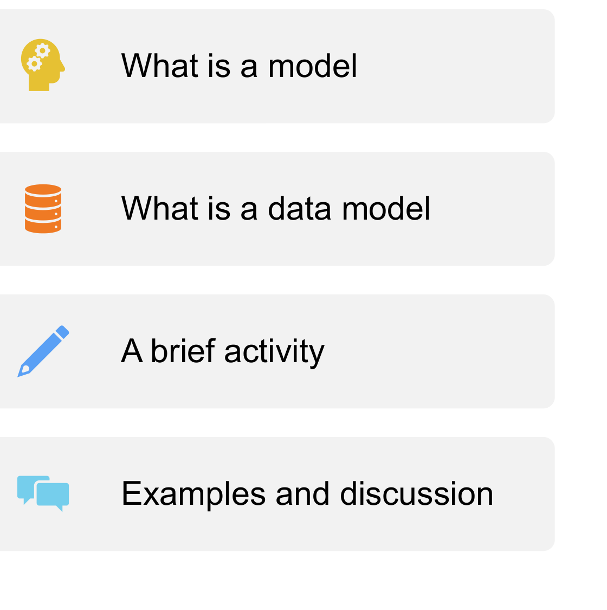

- What is a model
- What is a data model
- A brief activity
- Examples and discussion

<!-- The shape of the hour. The first half is deliberately non-technical: airplanes and rivers. The second half is the encoding: vector, raster, TIN. -->

---

# What you should be able to do after today

- Explain what it means to call a GIS dataset a **model** — an abstraction chosen for a purpose
- Distinguish the **vector**, **raster**, and **TIN** data models, and say when each is appropriate
- Separate a **data model** from its **file format** (vector vs. shapefile vs. geodatabase)
- Open data in **ArcGIS Pro** and inspect its geometry type, attribute table, and coordinate system

<!-- Read these out loud at the start and come back to them at the end. The last one is the bridge into Lab 1. -->

<!-- TODO(graphic): a simple four-icon strip matching the four outcomes, or an ArcGIS Pro screenshot showing a layer's geometry type and coordinate system side by side. -->

---

# Dr. Ames' Definition

Model = Abstraction of Reality

Concept, Idea, Notion, Generalization
Reality

<!-- Everything in this course is a model in this sense. A GIS layer is never the thing itself; it is a simplification someone chose, for a purpose, and the choice is what we are studying. -->

---

# Consider this kind of model

<!-- TODO(instructor): consider shortening the airplane/river opening (source slides 4-19). It runs about sixteen slides before the first GIS-specific content. -->

<!-- The pun that opens the lecture: "model" already means several things. A fashion model is an abstraction too — a stand-in that shows you how a garment behaves, not the person who will wear it. -->

---

<!-- _class: lead -->

# What are some ways to model an airplane?

<!-- Take answers from the room before advancing: photo, drawing, blueprint, plastic kit, flying RC model, wind-tunnel model, a CFD simulation, a spec sheet. Write them on the board; the next several slides work through them. -->

---

# Vultee P-66 Vanguard

<!-- The Vultee P-66 Vanguard was a United States Army Air Forces fighter aircraft. It was initially ordered by Sweden, but by the time the aircraft were ready for delivery in 1941, the United States would not allow them to be exported, designating them as P-66s and retaining them for defensive and training purposes. Eventually, a large number were sent to China where they were pressed into service as combat aircraft with indifferent results. But it is still a cool looking airplane that is interesting to consider from a "modeling" point of view. -->

---

# The real thing: Vultee factory footage

<a href="https://youtu.be/g0lePaHC2aI" target="_blank">

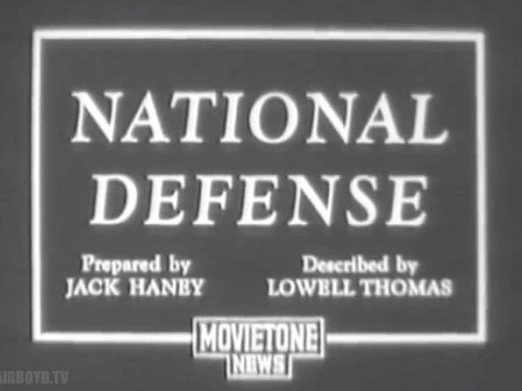

</a>

<a href="https://youtu.be/g0lePaHC2aI" target="_blank">youtu.be/g0lePaHC2aI</a>

<!-- This is the Vultee airplane factory video: http://youtu.be/g0lePaHC2aI Click the thumbnail to open it in a new tab. -->

---

# A model that flies

<a href="https://youtu.be/74PdV0MteS8?t=47s" target="_blank">

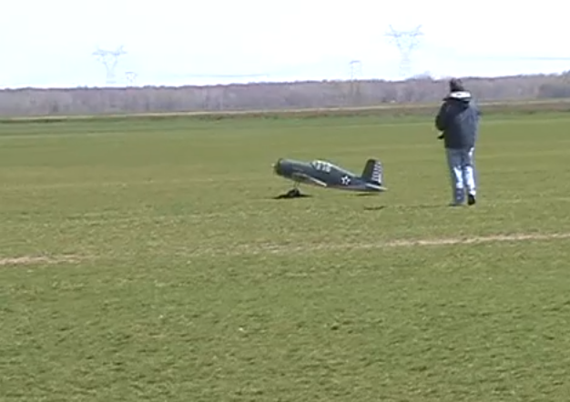

</a>

<a href="https://youtu.be/74PdV0MteS8?t=47s" target="_blank">youtu.be/74PdV0MteS8?t=47s</a>

<!-- Model airplane flying video: http://youtu.be/74PdV0MteS8?t=47s A flying model keeps the aerodynamics and throws away the scale, the materials, and the pilot. -->

---

# Models of the Vanguard

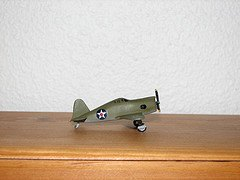

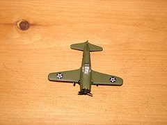

<!-- What information can you gain from each of these models of the Vanguard P-66? What does each one throw away? -->

---

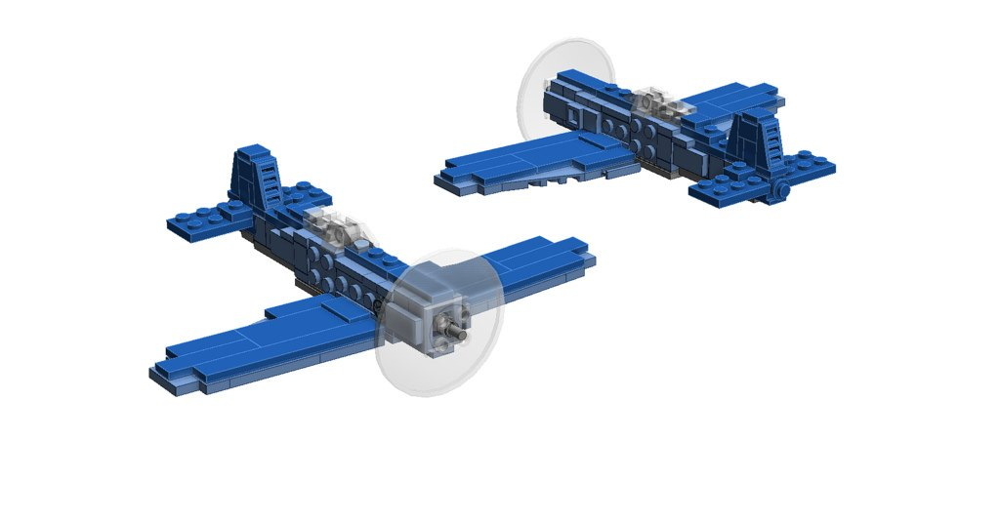

<!-- What information can you gain from this model of the Vanguard P-66? -->

---

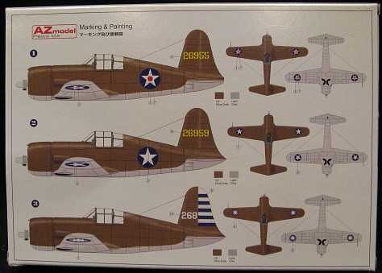

<!-- What information can you gain from this model of the Vanguard P-66? -->

---

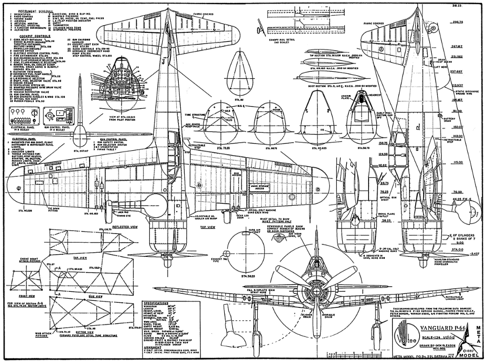

<!-- How is this a "model" of a Vanguard P-66 airplane? Is it an abstraction of reality? Could it be considered a model? What information can you gain from this model of the Vanguard P-66? -->

---

<!-- _class: lead -->

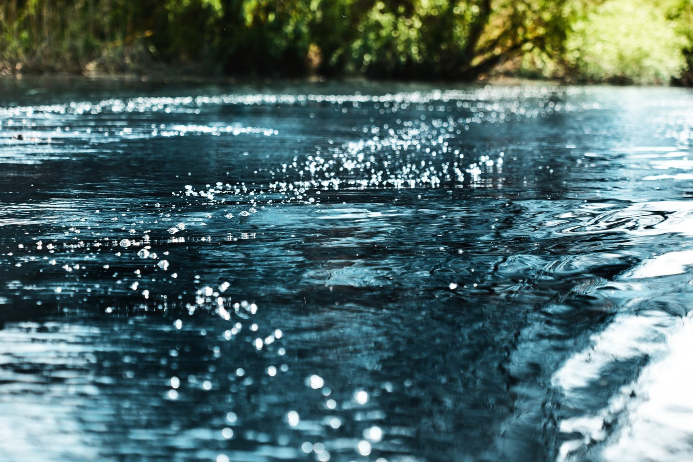

# Consider a river

## What are some ways that you could "model" a river?

<!-- Same exercise, now with something that has no edges and never holds still. Take answers before advancing: a photo, a video, a map, a cross section, a hydrograph, a table of gage readings, a hydraulic model. -->

---

# Lochsa River, northern Idaho

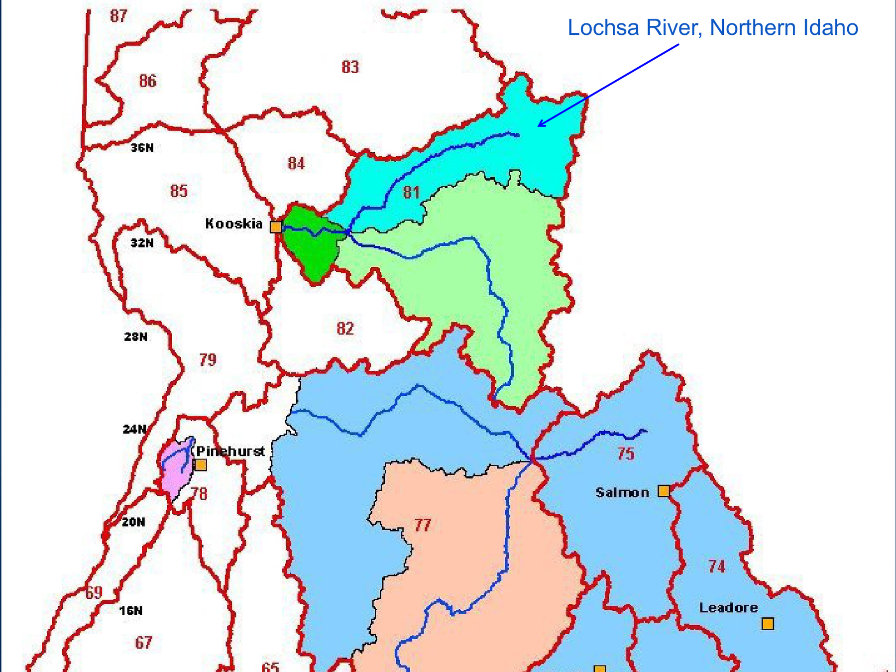

<!-- A map is a model. Watershed boundaries as polygons, the river itself as a polyline, gage sites as points. -->

---

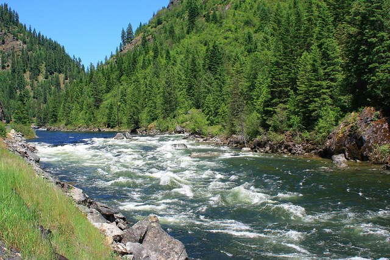

<!-- This is the Lochsa River in northern Idaho. -->

---

# Is this reality, or a model?

<a href="https://youtu.be/wSWY0Mq3zFU" target="_blank">

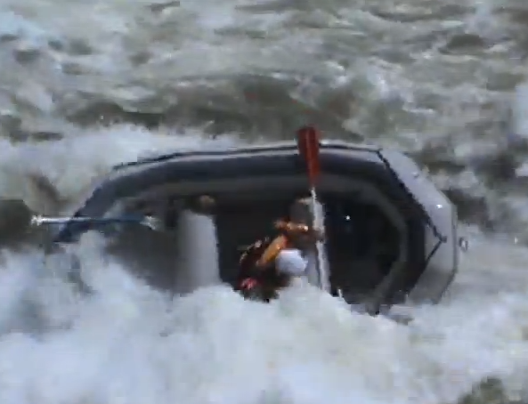

</a>

<a href="https://youtu.be/wSWY0Mq3zFU" target="_blank">youtu.be/wSWY0Mq3zFU</a>

<!-- This is a rafting ride on the Lochsa River in Idaho on Memorial Day weekend 2013 (May 28, 2013). http://youtu.be/wSWY0Mq3zFU Is this video "reality" or a "model"? Well, it is a video of reality, but it is actually just a model — it is a representation of reality. -->

---

# The same river, as a hydrograph

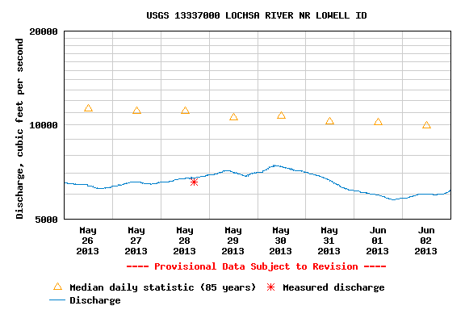

<!-- Here is another representation of the streamflow in the Lochsa River in Idaho at the same time. Which "model" gives you more information, the video or the plot? What kind of information is provided in both models? What is not communicated in each model? -->

---

# The same river, as a table

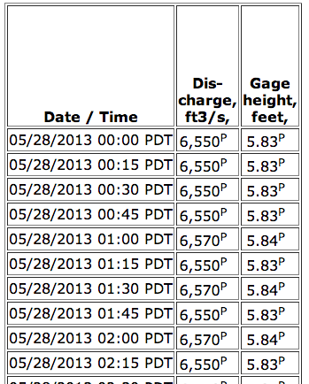

<!-- Here is another data model for the same river on the same day. What information do we get here that isn't available in the graph or the video? Source: http://waterdata.usgs.gov/id/nwis/uv?cb_00060=on&cb_00065=on&format=html&period=&begin_date=2013-05-28&end_date=2013-05-29&site_no=13337000 -->

---

# The same river, as geometry

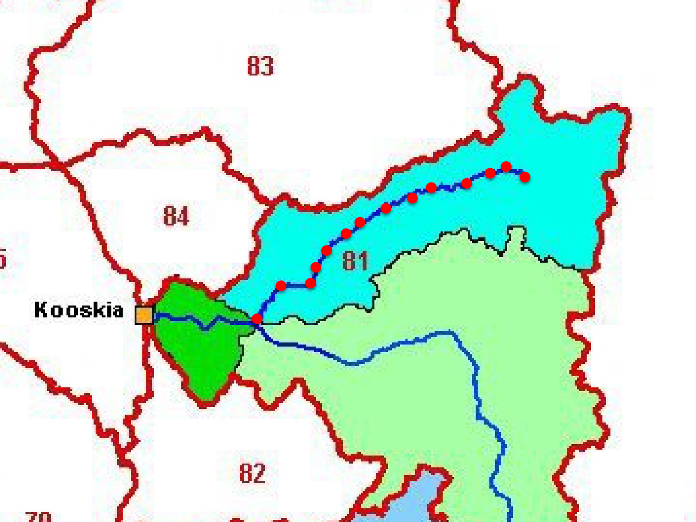

<!-- What about this "model" of the Lochsa River? What information do you learn from this model that you don't get from the other data models? How are you going to represent this data in numbers? Identify the vertices? Get the XY values, and list them? -->

---

<!-- _class: activity -->

# Hands on with ArcGIS Pro and Utah County sample data

- Download the zip file from Learning Suite and unzip it to a folder you control
- Start a new **ArcGIS Pro** project, then add the data from the **Catalog pane**
- Make a map, then turn labels on from the **Labeling** tab
- For each layer, check its **geometry type** and its **coordinate system**
- Which data models are represented here — vector, raster, or TIN?

<!-- Keep this to about ten minutes as a look, not a tutorial; the full version is Lab 1. Add layers one at a time and ask the same question after each: what did the computer have to store in order to draw that? -->

<!-- TODO(graphic): an ArcGIS Pro screenshot of the Utah County data added to a map, with the Catalog pane visible. Capture from a real Pro session — do not fabricate. -->

---

# Consider a political boundary

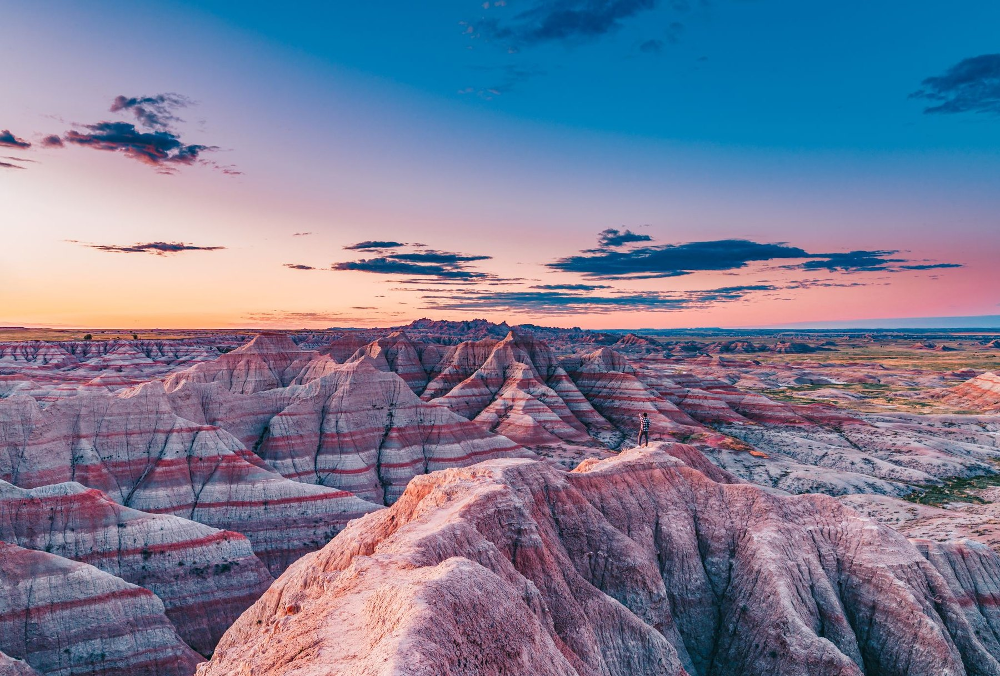

What are some ways to model the geometry of the political boundary of a U.S. state like Utah?

<!-- Move from things with fuzzy edges (a river) to something with edges that exist only on paper. A state boundary has no physical presence at all; it is entirely a model. -->

---

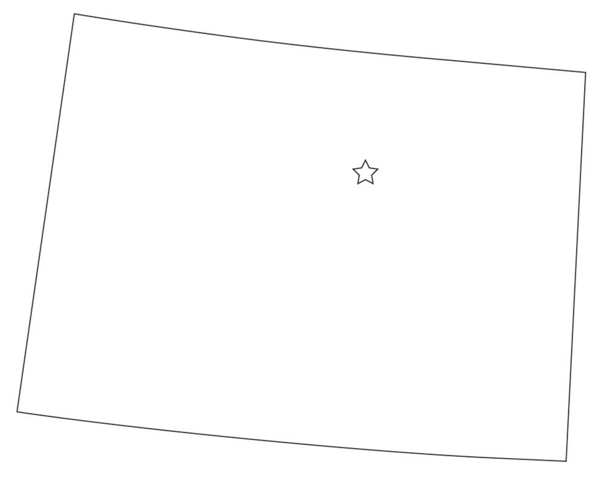

<!-- Look at this state outline. Anyone know which state it is? Right, Colorado. How did you know? Spatial reasoning based on the shape and the location of Denver? Great!

How can we represent this state shape using the fewest kilobytes of RAM possible? Good idea — let's digitize the corners. I have to measure them from some point of origin. For this example, I measured distances from an origin at the exact center of the image. We also need to know the units. In this case the units are inches, so we would need to scale them up to kilometers to have this be "geolocatable". -->

---

# "I'll Sue Ya" (Weird Al Yankovic)

<a href="https://youtu.be/MeXQBHLIPcw?t=2m6s" target="_blank">

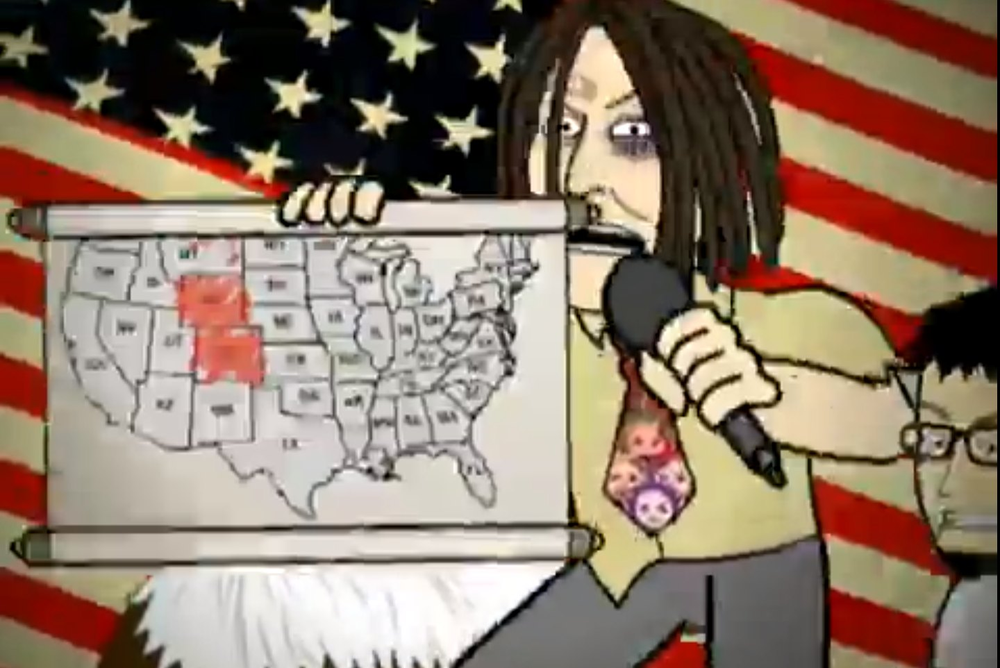

</a>

- A song about frivolous lawsuits; the last one in the list is a suit against the **state of Colorado** for looking too much like **Wyoming**
- Which is the joke we are about to take seriously: how much shape does it take to tell two rectangles apart?
- Play from 2:06 to about 2:30
- <a href="https://youtu.be/MeXQBHLIPcw?t=2m6s" target="_blank">youtu.be/MeXQBHLIPcw?t=2m6s</a>

<!-- We are going to look at the state of Colorado. Play the audio from 2:06 to about 2:30 and stop there — some later scenes are a little dodgy to show in class. Lyrics are not reproduced on this slide by design; play the clip instead. -->

---

<!-- _class: lead -->

# Polygon data model activity

<!-- Section break. From here on we encode the same shape three different ways, using nothing but numbers. -->

---

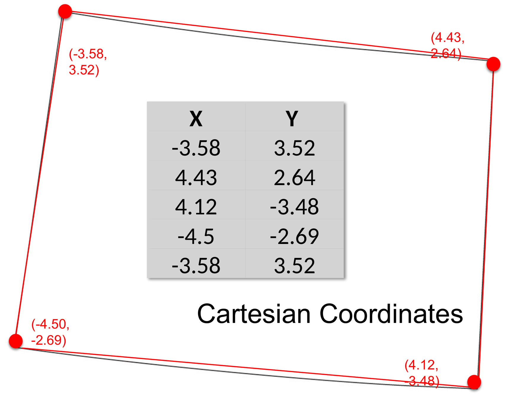

<!-- Given just these coordinates, we can come up with a numeric representation of the shape. Why do I show 5 rows in this table of numbers? Yes! Because we need to "close" the polygon. This is typical of spatial data representation in most data models.

It takes 8 bytes (64 bits) of memory to hold a single floating point double precision real number. So how much memory is required to store this polygon? 80 bytes.

How accurate is this representation of the state of Colorado? Not very. Why? Because the red lines are straight and the black lines are curved. But why is that? I thought Colorado was a square? The reason is because the data are projected. We'll learn more about projection systems and distortion next week. -->

<!-- TODO(instructor): the speaker note above promises projections "next week." Confirm which week projections are actually taught this semester and correct the note. -->

---

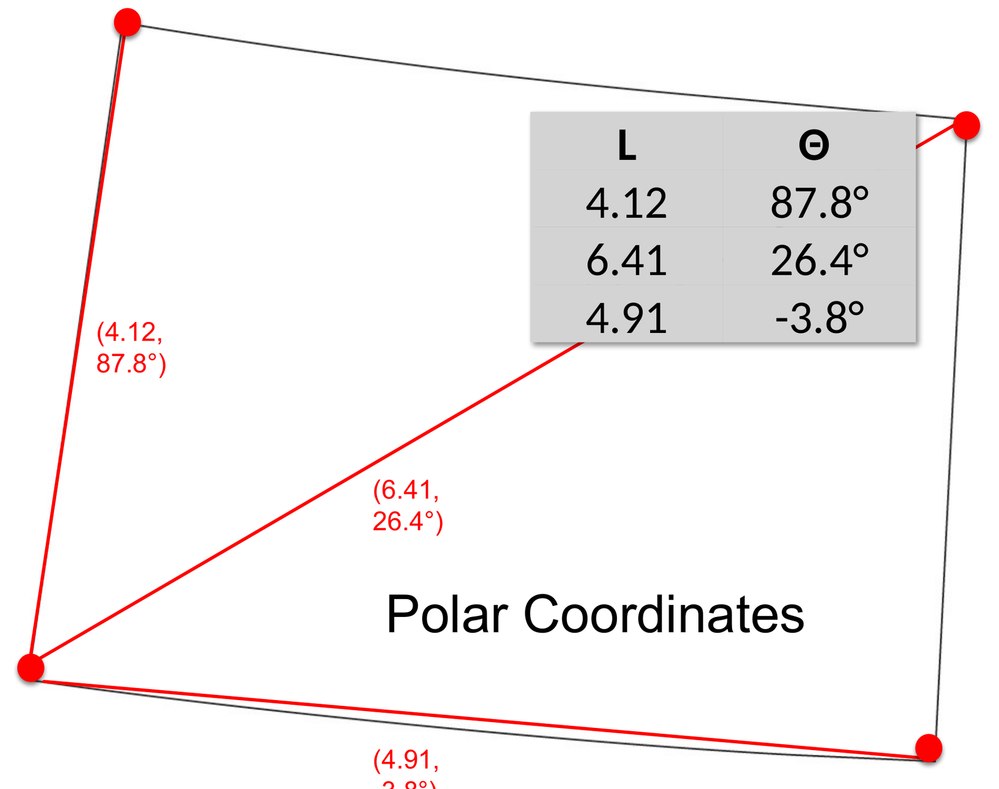

<!-- Here is another way to represent the geometry of the state of Colorado. What method is this? Correct — this is a radial coordinate system where we assume one point at an origin and measure the distance and angle to each of the other points in the shape in sequential order, where L is the length and theta is the angle from directly east. -->

---

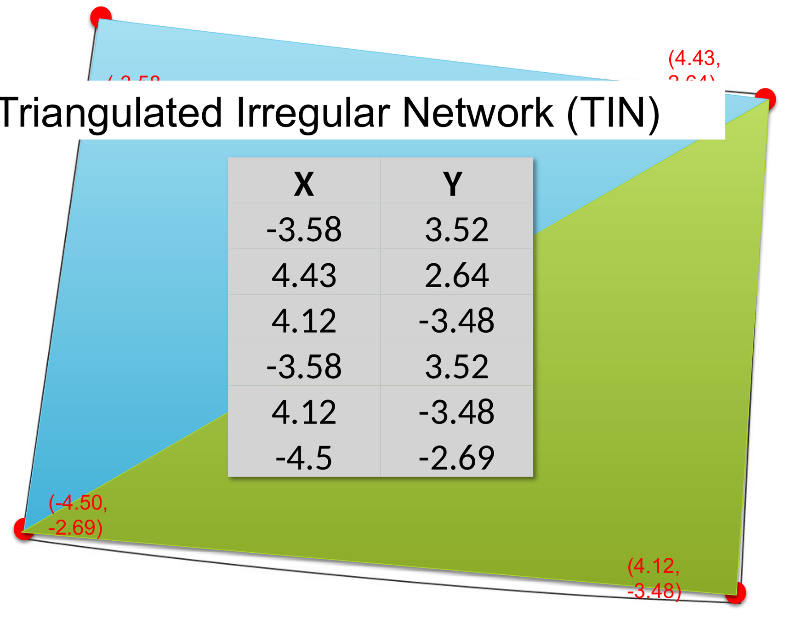

<!-- Here is another way to represent the geometry of the state of Colorado. What method is this? Correct — these are triangles.

In what case would this be a very efficient method for representing data? Any ideas? This is an important point. You can use triangles to represent 3D objects like an elevation surface really efficiently because it uses fewer triangles in large flat areas and more triangles in rough, highly varying areas. So for a video game, for example, it is most efficient to represent objects and terrain as triangles with "textured" images on the triangle faces. -->

---

# Triangles scale to any shape

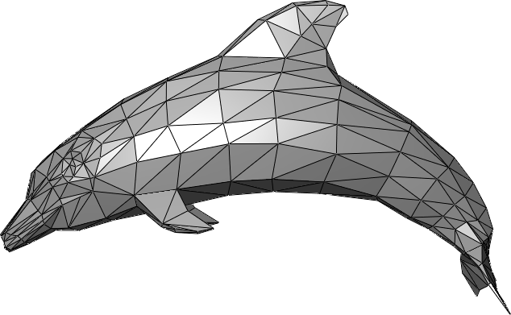

<!-- Big triangles where the surface is flat, small triangles where it curves. Same idea as the Colorado slide, applied to a curved 3D object. -->

---

# More triangles where it matters

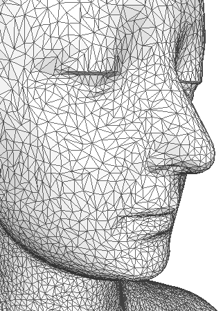

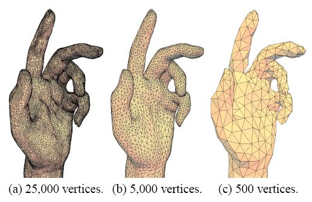

<!-- The three hands are the same shape at 25,000, 5,000 and 500 vertices. Ask which one you would choose for a video game and which for a surgical simulator — the answer is the whole point of choosing a data model. -->

---

# Triangulated Irregular Network (TIN)

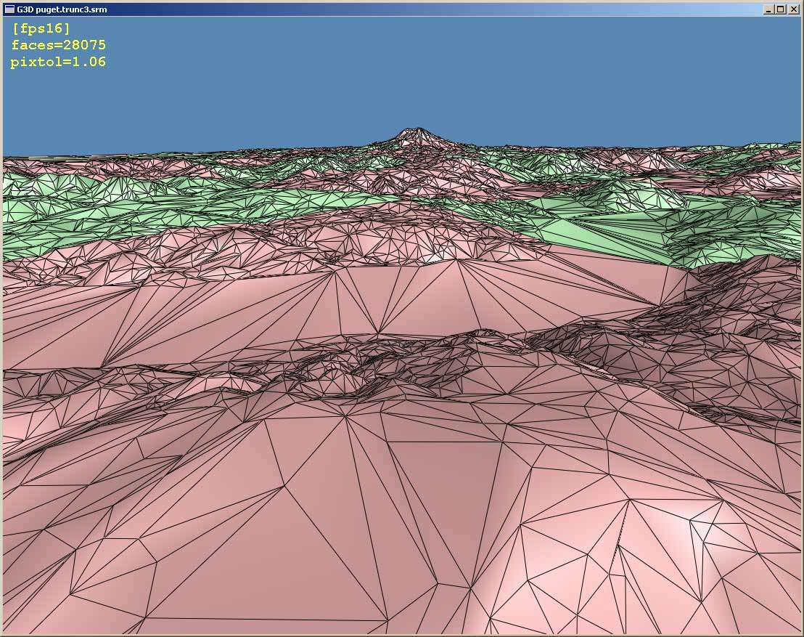

<!-- Terrain as a TIN: exactly how game engines and many engineering surface models store elevation. Note the frame rate and face count in the corner — the compression is the reason to use it. -->

<!-- Stale screenshot: this is a capture from an older 3D viewer, kept because it is the source deck's figure. A current ArcGIS Pro 3D scene of a TIN would be a better replacement. -->

---

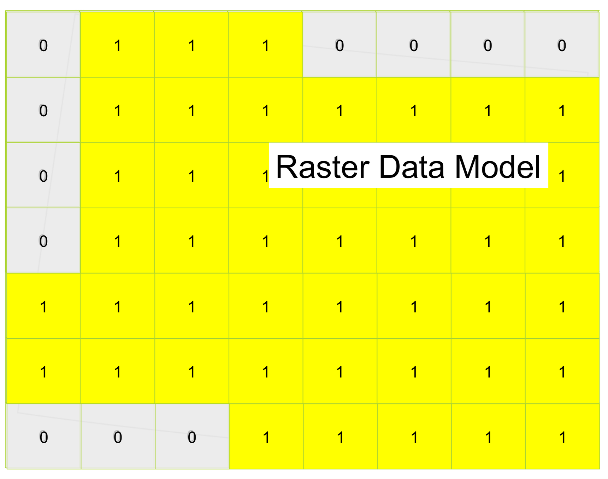

<!-- Here is another way to represent the geometry of the state of Colorado. What method is this? Correct — this is a raster. A raster is a regularly spaced grid of values. The raster has to be completely filled in with values. You need to specify which value means "no data". In this case, I used the number 0 to indicate "no data". The number 1 is used to indicate the location of the state of Colorado.

What do you think of this data model for the state of Colorado? What is good about it? (Fast, easy to fill in.) What is bad about it? (Pixelated borders, a lot of memory required.) How many bytes are used to represent it? 360 bytes. Is this a "better" data model? Does the additional data storage requirement result in more accuracy? No. -->

---

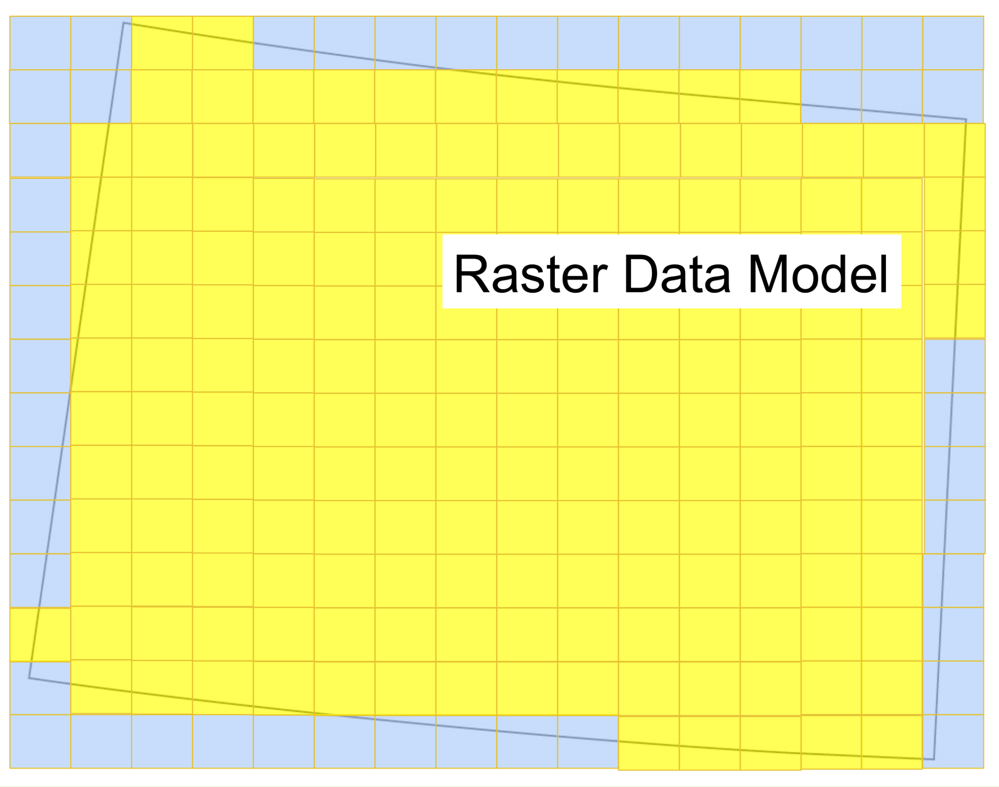

<!-- What do you think of the higher resolution data model? Does it make sense to represent a polygon with a raster data model? No? Then what kind of data would it make sense to represent with a raster model? -->

---

# Each pixel is a number

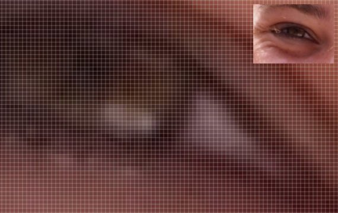

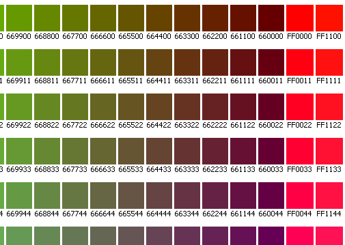

Each pixel (raster cell) is represented by a hexadecimal number that indicates the color to display.

<!-- Digital photos are raster images. Each pixel has a different value from the one next to it, representing a different color. Raster works really well for digital photos. -->

---

# Air temperature

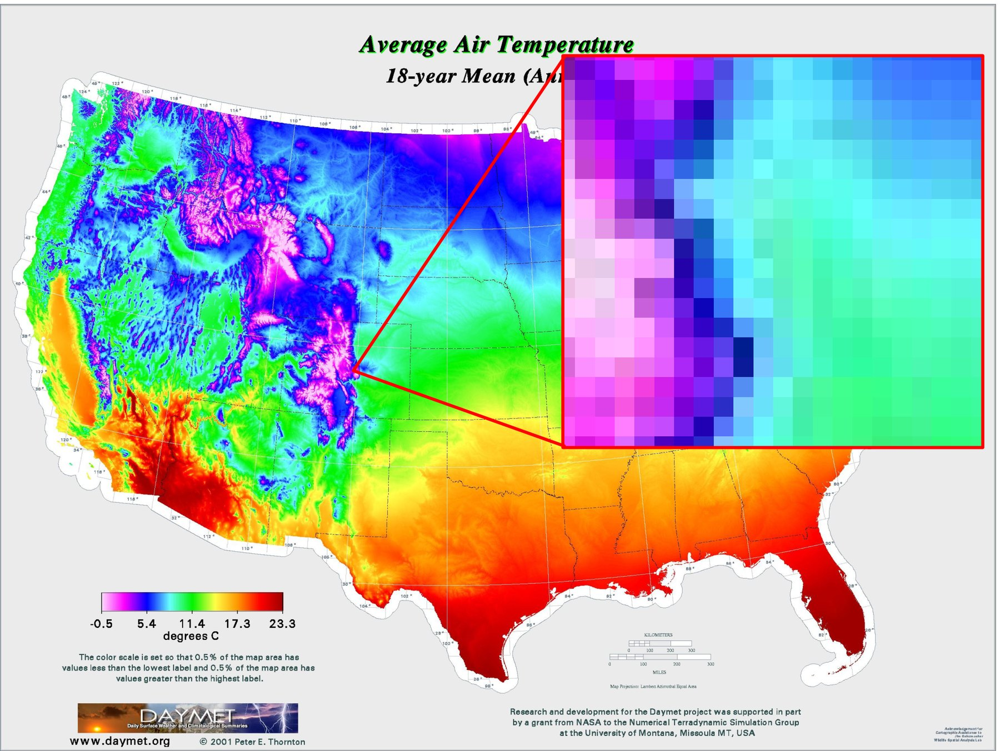

<!-- What data model would be best to store air temperature data — point, line, polygon or raster? Note that each cell contains a temperature value; the colors are drawn by the GIS software based on the temperature. Temperature has a value everywhere, which is exactly what a raster stores. -->

---

# Tsunami wave heights

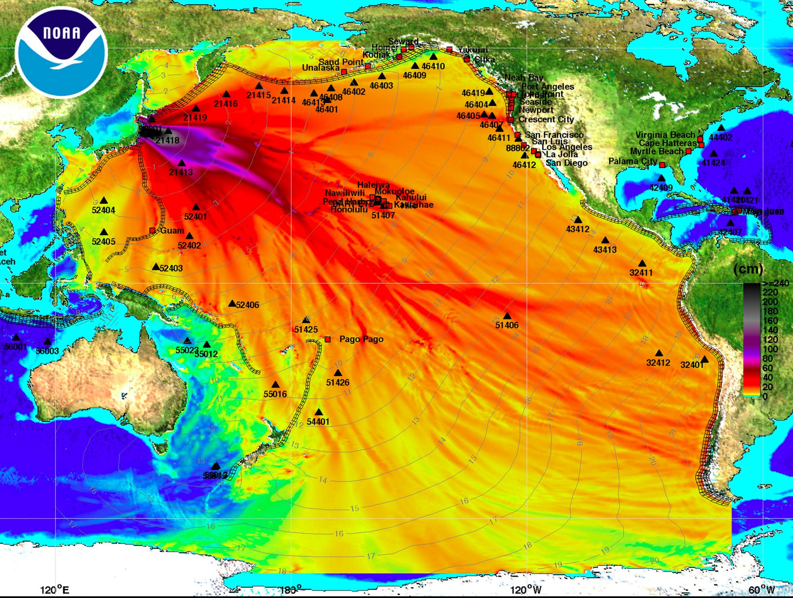

<!-- Predicted wave heights and propagation times for the Fukushima earthquake. Another continuous surface: every cell of ocean carries a value. -->

---

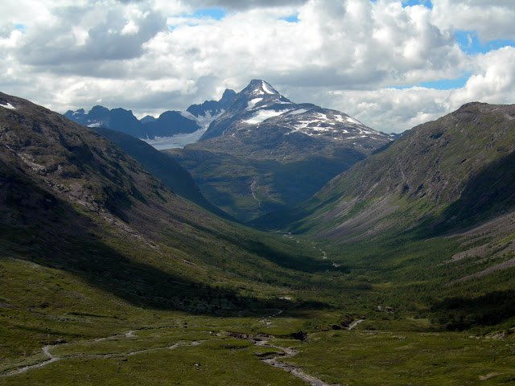

<!-- How about terrain? Ask what you would have to store to describe this valley to a computer, then advance. -->

---

# Terrain as a grid of elevations

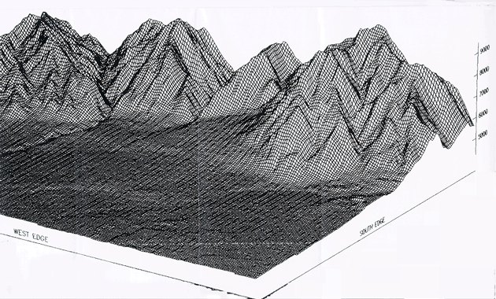

<!-- A regular grid of elevation values drawn as a wireframe surface. Compare it with the TIN terrain slide: the spacing here is regular, the TIN's was not. -->

---

<!-- _class: activity -->

# Suitability…

**Vector**
- Fewer distinct values
- Discrete

**Raster**
- Highly variable
- Continuous

**Triangulated Irregular Network**
- 3D rendering
- High data compression

<!-- The summary. Discrete things you can count — towers, roads, parcels — are vector. Things that vary everywhere — elevation, temperature, imagery — are raster. TINs are a compact way to store surfaces for 3D work. Ask the room for one example of each from their own discipline before moving on. -->

---

<!-- _class: quiz -->

# What is the data model?

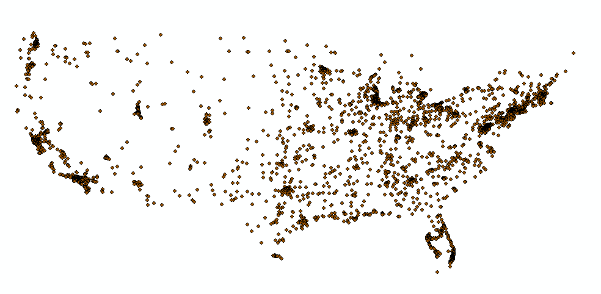

- How could you store this data in a file?
- Can you store vector polyline data in Notepad? Excel?

<!-- Points — U.S. cities. Yes, you could store the coordinates in a text file or a spreadsheet; that is exactly what a CSV of latitude and longitude is. What a plain text file does not give you is a spatial index, a coordinate system definition, or a way to store the geometry of a line or polygon compactly. -->

---

<!-- _class: quiz -->

# What is the data model?

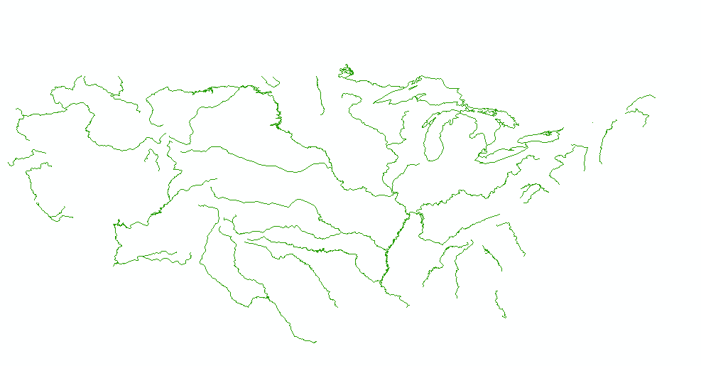

- How best to encode it? What is the file format?
- What is the difference between the vector data model and a "shapefile"?

<!-- Polylines — major U.S. rivers. The distinction to land here: "vector" is the data model, the conceptual organization; "shapefile" is one file format that can hold it. The same rivers could be a feature class in a file geodatabase, a GeoPackage, or a GeoJSON file and still be polylines. -->

---

<!-- _class: quiz -->

# What is the data model?

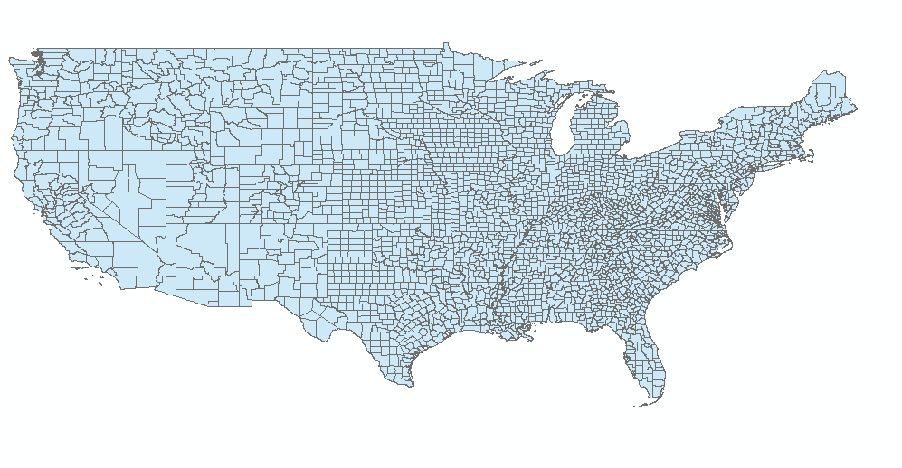

- What is the file format?

<!-- Polygons — U.S. counties. Each county is a closed ring of coordinates. Ask what has to be stored where two counties share a border, and whether it gets stored twice. -->

---

<!-- _class: quiz -->

# What is the data model?

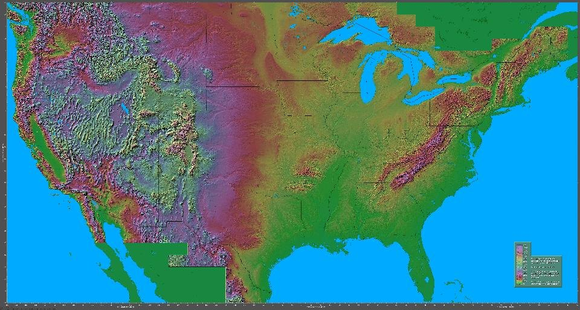

- What kinds of spatial data are most suited to this data model?
- What is the file format?

<!-- Raster — a continental elevation surface. Continuous, highly variable data with a value everywhere. Common formats: GeoTIFF, IMG, and the raster datasets inside a geodatabase. -->

<!-- Stale screenshot: this figure is an ArcMap-era map export. Fine as a picture of a raster, but worth re-making in ArcGIS Pro. -->

---

<!-- _class: lead -->

# What makes GIS cool…

## Spatial data linked to tabular data!

<!-- The payoff of the hour. Every one of the vector layers we just looked at has a table behind it, and the row and the shape are the same object. -->

---

# One row per feature

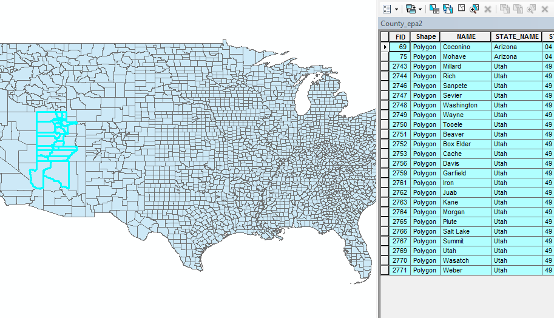

<!-- Select a row in the table and the county lights up on the map; select a county on the map and its row highlights. The geometry and the attributes are the same record. This is what separates GIS from a drawing program. -->

<!-- Stale screenshot: this is an ArcMap attribute-table window, not ArcGIS Pro. Re-shoot in Pro with the same counties layer. -->

---

# Before Next Class

- Read *GIS Fundamentals* (Bolstad) <!-- TODO(instructor): reading chapter -->
- Take the open-book quiz on **Learning Suite**
- Start [Lab 1](https://byu-hydroinformatics.github.io/ce414-gis-applications/assignments/lab-01/) — it puts today's data models into ArcGIS Pro
- Questions? Office hours: [calendly.com/dan-ames/office-hours](https://calendly.com/dan-ames/office-hours)

<!-- Fill in the quiz due date and the reading chapter before class. -->

<!-- TODO(graphic): a simple "what's due" visual, or an ArcGIS Pro screenshot of the Lab 1 starting project. -->

<!-- Conversion notes (2026-09-03): Source deck "CE 414 Week 1 - Review - Data Models Refresher.pptx", 45 slides, extracted 2026-09-03. All 45 source slides were converted; nothing was dropped. One slide was added at the end ("Before Next Class") per the conversion guide. No hidden slides in the source.

Source order was preserved, including the instructor's Sept 3 insertion of the learning-objectives slide at position 3 (after the Outline slide) and the replacement of the old ArcMap slide with "Hands on with ArcGIS Pro and Utah County sample data".

Slides built from PowerPoint shapes were rendered from the PDF at 200 dpi rather than rebuilt: the Outline SmartArt (page 2), the Lochsa map callout (15), the digitized-vertices map (20), the Colorado outline (23), Cartesian/Polar/TIN (26-28), and the two raster grids (32-33), plus the air-temperature map with its zoom inset (35).

Weird Al "I'll Sue Ya": the source slide reproduced the song lyrics. They are NOT reproduced here. The slide keeps the title, the still image, the timestamped link, and a one-line description of what the joke illustrates.

Stale / pre-Pro screenshots kept and flagged in place:
- images/dm-arcmap-attribute-table.png — an ArcMap attribute-table window (source slide 44). Needs a Pro re-shoot.
- images/dm-us-elevation-raster.jpg — an ArcMap-era map export used as the raster quiz image (source slide 42).
- images/dm-tin-terrain.jpg — a capture from an old third-party 3D viewer (source slide 30).
No ArcMap/ArcCatalog/ArcToolbox wording remained in the deck text; the hands-on slide already says ArcGIS Pro, Catalog pane, and Labeling tab.

TODO(instructor): (1) consider shortening the airplane/river opening, flagged once at its start; (2) the Cartesian slide's speaker note promises projections "next week" — confirm the actual week and correct it; (3) the reading chapter in GIS Fundamentals (Bolstad) is not named in the source deck and was not guessed.

TODO(graphic): the learning-objectives slide, the ArcGIS Pro hands-on slide, and the Before Next Class slide have no graphic. Per this pass's instructions no images were generated; the hands-on slide specifically wants a real ArcGIS Pro capture, not a generated one.

The source deck's Suitability slide is marked _class: activity rather than quiz — it is a summary to discuss, and the quiz class prefixes the title with a question mark, which would misread. The four "What is the data model?" slides are marked _class: quiz. -->
