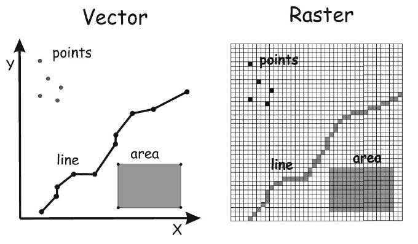
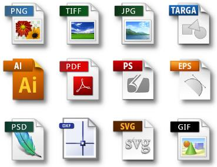
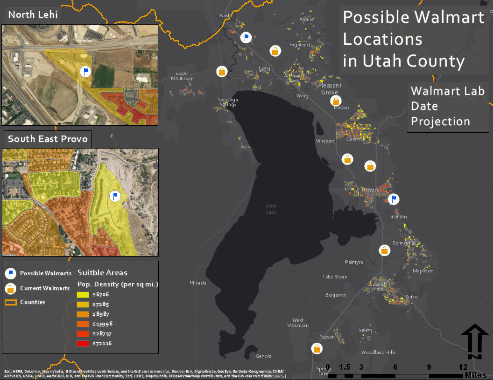

<!-- _class: lead -->
<!-- _paginate: skip -->

# Data Models

## Engineering Applications of GIS

Dr. Dan Ames
Brigham Young University

<!-- Week 1 review lecture. Most students have had an introductory GIS course, so this hour is a refresher on data models rather than a first exposure. The hands-on look at ArcGIS Pro comes at the end of the hour, and the full version is Lab 1. -->

<!-- stamp:begin -->
<!-- _footer: 'CE 414 · Week 1 — Data Models RefresherLast Updated: 2026-09-09© 2026 Daniel P. Ames · <a href="https://creativecommons.org/licenses/by/4.0/">CC BY 4.0</a>' -->
<!-- stamp:end -->

---

# Outline

🧠 What is a model

🗄️ What is a data model

💬 Examples and discussion

🖥️ Hands on in ArcGIS Pro

<!-- The shape of the hour. We start with a river and ask what it means to model it, then encode a shape three different ways with nothing but numbers, and finish by opening real data in ArcGIS Pro. -->

---

# What you should be able to do after today

- Explain what it means to call a GIS dataset a **model** — an abstraction chosen for a purpose
- Distinguish the **vector**, **raster**, and **TIN** data models, and say when each is appropriate
- Separate a **data model** from its **file format** (vector vs. shapefile vs. geodatabase)
- Open data in **ArcGIS Pro** and inspect its geometry type, attribute table, and coordinate system

<!-- Read these out loud at the start and come back to them at the end. The last one is what we do together at the end of the hour, and it is the bridge into Lab 1. -->

---

# Dr. Ames' Definition

Model = Abstraction of Reality

Concept, Idea, Notion, Generalization
Reality

<!-- Everything in this course is a model in this sense. A GIS layer is never the thing itself; it is a simplification someone chose, for a purpose, and the choice is what we are studying. -->

---

<!-- _class: lead -->

# Consider a river

## What are some ways that you could "model" a river?

<!-- Take answers from the room before advancing: a photo, a video, a map, a cross section, a hydrograph, a table of gage readings, a hydraulic model. The next few slides work through the ones people usually name. -->

---

<!-- _class: quiz -->

# Is this a data model, or reality?

<ol type="A">
<li>Data model</li>
<li>Reality</li>
<li>Neither</li>
</ol>

<a href="https://youtu.be/wSWY0Mq3zFU" target="_blank">youtu.be/wSWY0Mq3zFU</a>

<!-- This is a rafting ride on the Lochsa River in Idaho on Memorial Day weekend 2013 (May 28, 2013). Click the thumbnail to open it in a new tab. Is this video "reality" or a "model"? It is a video of reality, but it is actually a model: a representation of reality. -->

---

<!-- _class: quiz -->

# What is this?

<ol type="A">
<li>Raster data model</li>
<li>Vector data model</li>
<li>Triangulated data model</li>
<li>Reality</li>
<li>None of the above</li>
</ol>

<!-- This is the Lochsa River in northern Idaho. A photo is a raster: a grid of pixels, each holding a color. -->

---

<!-- _class: quiz -->

# What is this?

Lochsa River, northern Idaho

<ol type="A">
<li>Raster data model</li>
<li>Vector data model</li>
<li>Triangulated data model</li>
<li>Reality</li>
<li>None of the above</li>
</ol>

<!-- A map is a model. Watershed boundaries as polygons, the river itself as a polyline, gage sites as points: vector. -->

---

<!-- _class: quiz -->

# Which data model best represents the Lochsa River?

<ol type="A">
<li>The photo</li>
<li>The video</li>
<li>The map</li>
<li>The time series table</li>
<li>The graph</li>
</ol>

<!-- Two more representations of the same river on the same day: the USGS gage table and the hydrograph. Which "model" gives you more information, the video or the plot? What kind of information is provided in both? What is not communicated in each? The honest answer is "it depends on the question", which is the point of the whole hour. Table source: USGS NWIS site 13337000, May 28-29, 2013. -->

---

# The same river, as geometry

<!-- What about this "model" of the Lochsa River? What information do you learn from this model that you don't get from the others? How are you going to represent this in numbers? Identify the vertices, get the XY values, and list them. That is the vector data model, and the next slides make it explicit. -->

---

<!-- _class: quiz -->

# Data Models

What are the **geometry characteristics** of each of these feature types?

- Points
- Polylines
- Polygons

<!-- Ask them to picture the river vertices from the last slide. What did the computer actually have to store for each vertex? Just a coordinate pair. A gage site is one pair; the river is an ordered list of them. -->

---

# Data Models

- **Point** data model: `(x, y)`
- **Polyline** data model: `(x0,y0), (x1,y1), (x2,y2), …`
- **Polygon** data model: `(x0,y0), (x1,y1), (x2,y2), … (x0,y0)`
- How can you store this data?
- What is the file format?

<!-- River = an ordered list of coordinate pairs. Watershed boundary = the same, but the last pair repeats the first to close the ring. -->

---

# Data Model vs. File Format

- **Data Model** = the *conceptual* organization of the data
- **File Format** = how data are *stored* on the computer

<!-- "Polyline" is the data model. A shapefile, a feature class in a file geodatabase, a GeoPackage, or a GeoJSON file are file formats. The same river could be stored in any of them and still be a polyline. We come back to this with the quiz slides at the end. -->

---

<!-- _class: lead -->

# Part 2

## Encoding the world with numbers: vector, raster, TIN

<!-- Section break. From here on we encode the same shape three different ways, using nothing but numbers. -->

---

<!-- Look at this state outline. Anyone know which state it is? Right, Colorado. How did you know? Spatial reasoning based on the shape and the location of Denver.

How can we represent this state shape using the fewest bytes of memory possible? Let's digitize the corners. I have to measure them from some point of origin; for this example I measured distances from an origin at the exact center of the image. We also need to know the units. Here the units are inches, so we would need to scale them up to kilometers to make this "geolocatable". -->

---

<!-- Given just these coordinates, we can come up with a numeric representation of the shape. Why are there five rows in the table? Because we need to "close" the polygon. This is typical of spatial data representation in most data models.

It takes 8 bytes (64 bits) of memory to hold a single double-precision real number, so how much memory is required to store this polygon? 80 bytes.

How accurate is this representation of Colorado? Not very. The red lines are straight and the black lines are curved. But isn't Colorado a rectangle? The data are projected. Coordinate systems and projections get their own week later in the semester. -->

---

<!-- Here is another way to represent the geometry of the state. What method is this? A polar (radial) coordinate system: we assume one point at an origin and measure the distance and angle to each of the other points in sequential order. L is the length and theta is the angle measured from due east. -->

---

<!-- Another way: triangles. In what case would this be a very efficient method for representing data? You can use triangles to represent 3D objects like an elevation surface really efficiently, because it uses fewer triangles in large flat areas and more triangles in rough, highly varying areas. For a video game, for example, it is most efficient to represent objects and terrain as triangles with textured images on the faces. -->

---

# Triangles scale to any shape

<!-- Big triangles where the surface is flat, small triangles where it curves. Same idea as the Colorado slide, applied to a curved 3D object. -->

---

# More triangles where it matters

<!-- The three hands are the same shape at 25,000, 5,000 and 500 vertices. Ask which one you would choose for a video game and which for a surgical simulator — the answer is the whole point of choosing a data model. -->

---

# Triangulated Irregular Network (TIN)

<!-- Terrain as a TIN: exactly how game engines and many engineering surface models store elevation. Note the frame rate and face count in the corner — the compression is the reason to use it. -->

<!-- Stale screenshot: this is a capture from an older 3D viewer, kept because it is the source deck's figure. A current ArcGIS Pro 3D scene of a TIN would be a better replacement. -->

---

<!-- Another way to represent Colorado: a raster. A raster is a regularly spaced grid of values. The raster has to be completely filled in, so you need to specify which value means "no data". Here 0 means no data and 1 marks the state.

What is good about it? Fast, easy to fill in. What is bad? Pixelated borders and a lot of memory. How many bytes? 360 here. Is this a "better" data model? Does the additional storage result in more accuracy? No. -->

---

<!-- What do you think of the higher-resolution raster? Does it make sense to represent a polygon with a raster data model? No? Then what kind of data would it make sense to represent with a raster? -->

---

# Each pixel is a number

Each pixel (raster cell) is stored as a hexadecimal number that tells the screen which color to display.

<!-- Digital photos are raster images. Each pixel has a different value from the one next to it, representing a different color. Raster works really well for digital photos. -->

---

<!-- _class: quiz -->

# Which data model for air temperature?

- Point?
- Line?
- Polygon?
- Raster?

<!-- Raster. Each cell contains a temperature value; the colors are drawn by the GIS software based on the value. Temperature is continuous: it has a value everywhere, which is exactly what a raster stores. -->

---

# Raster: tsunami wave heights

<!-- Predicted wave heights and propagation times for the 2011 Fukushima earthquake, from NOAA. Another continuous surface: every cell of ocean carries a value. -->

---

<!-- How about terrain? Ask what you would have to store to describe this valley to a computer, then advance. -->

---

<!-- _class: quiz -->

# What data model represents the terrain here?

<ol type="A">
<li>Vector</li>
<li>Raster</li>
<li>Triangulated (TIN)</li>
<li>Other</li>
</ol>

<!-- Raster: a regular grid of elevation values drawn as a wireframe surface. Compare it with the TIN terrain slide: the spacing here is regular, the TIN's was not. -->

---

<!-- _class: activity -->

# When to use each data model

**Vector**
- Fewer distinct values
- Discrete

**Raster**
- Highly variable
- Continuous

**Triangulated Irregular Network**
- 3D rendering
- High data compression

<!-- The summary. Discrete things you can count — towers, roads, parcels — are vector. Things that vary everywhere — elevation, temperature, imagery — are raster. TINs are a compact way to store surfaces for 3D work. Ask the room for one example of each from their own discipline before moving on. -->

---

<!-- _class: quiz -->

# What is the data model?

- How could you store this data in a file?
- Can you store vector polyline data in Notepad? Excel?

<!-- Points — U.S. cities. Yes, you could store the coordinates in a text file or a spreadsheet; that is exactly what a CSV of latitude and longitude is. What a plain text file does not give you is a spatial index, a coordinate system definition, or a way to store the geometry of a line or polygon compactly. -->

---

<!-- _class: quiz -->

# What is the data model?

- How best to encode it? What is the file format?
- What is the difference between the vector data model and a "shapefile"?

<!-- Polylines — major U.S. rivers. The distinction to land here: "vector" is the data model, the conceptual organization; "shapefile" is one file format that can hold it. The same rivers could be a feature class in a file geodatabase, a GeoPackage, or a GeoJSON file and still be polylines. -->

---

<!-- _class: quiz -->

# What is the data model?

- What is the file format?

<!-- Polygons — U.S. counties. Each county is a closed ring of coordinates. Ask what has to be stored where two counties share a border, and whether it gets stored twice. -->

---

<!-- _class: quiz -->

# What is the data model?

- What kinds of spatial data are most suited to this data model?
- What is the file format?

<!-- Raster — a continental elevation surface. Continuous, highly variable data with a value everywhere. Common formats: GeoTIFF, IMG, and the raster datasets inside a geodatabase. -->

<!-- Stale screenshot: this figure is an ArcMap-era map export. Fine as a picture of a raster, but worth re-making in ArcGIS Pro. -->

---

<!-- _class: lead -->

# What makes GIS cool…

## Spatial data linked to tabular data!

<!-- The payoff of the hour. Every one of the vector layers we just looked at has a table behind it, and the row and the shape are the same object. -->

---

# One row per feature

<!-- Select a row in the table and the county lights up on the map; select a county on the map and its row highlights. The geometry and the attributes are the same record. This is what separates GIS from a drawing program. -->

<!-- Stale screenshot: this is an ArcMap attribute-table window, not ArcGIS Pro. Re-shoot in Pro with the same counties layer. -->

---

<!-- _class: activity -->

# Hands on with ArcGIS Pro and Utah County sample data

- Download the zip file from Learning Suite and unzip it to a folder you control
- Start a new **ArcGIS Pro** project, then add the data from the **Catalog pane**
- Make a map, then turn labels on from the **Labeling** tab
- For each layer, check its **geometry type** and its **coordinate system**
- Open an **attribute table**: one row per feature
- Which data models are represented here — vector, raster, or TIN?

<!-- Do this together at the end of the hour. Keep it to about ten minutes as a look, not a tutorial; the full version is Lab 1. Add layers one at a time and ask the same question after each: what did the computer have to store in order to draw that? The map on the right is the Lab 1 example product, so this is where the same data is headed. -->

<!-- TODO(graphic): replace the Lab 1 example map with an ArcGIS Pro screenshot of the Utah County data added to a map, with the Catalog pane visible. Capture from a real Pro session — do not fabricate. -->

---

# Before Next Class

- Read **Chapters 1 and 2** of *GIS Fundamentals* (Bolstad)
- Take **Quiz 1** (open book) on **Learning Suite** — due **Saturday 11:59 pm**
- Start [Lab 1](https://byu-hydroinformatics.github.io/ce414-gis-applications/assignments/lab-01/) — it puts today's data models into ArcGIS Pro
- Questions? Office hours: [calendly.com/dan-ames/office-hours](https://calendly.com/dan-ames/office-hours)

<!-- Quiz 1 covers Chapters 1 and 2 and is due Saturday 11:59 pm; Lab 1 is due Saturday of Week 2. -->

<!-- Revision notes (2026-09-03): Re-synced with the CCE 114 "GIS Data Models & File Formats" deck (cce114-geomatics, slides/day-02) at the instructor's request. Dropped from the earlier conversion: the fashion/runway-model slide, the whole airplane sequence (Vultee P-66, factory and flying-model videos, model kits, LEGO, blueprint), the "Consider a political boundary" slide, Weird Al "I'll Sue Ya", and the "Polygon data model activity" section break. The deck now goes straight from the definition of a model to "Consider a river".

Brought over from CCE 114: the A/B/C answer-choice quiz format for the river slides, the "Data Models" geometry-characteristics and coordinate-list slides, "Data Model vs. File Format", the air-temperature and terrain quizzes, and the "Part 2" section break. The Colorado encoding walk-through (outline, Cartesian, polar, TIN, raster) is kept because the vector/raster/TIN comparison and the summary slide depend on it.

Unlike CCE 114, which opens with a live look at the sample data, the ArcGIS Pro hands-on slide is placed at the END of the deck, just before Before Next Class. Its graphic is the Lab 1 example map; a real Pro capture of the Utah County data should replace it.

Stale / pre-Pro screenshots kept and flagged in place:
- images/dm-arcmap-attribute-table.png — an ArcMap attribute-table window. Needs a Pro re-shoot.
- images/dm-us-elevation-raster.jpg — an ArcMap-era map export used as the raster quiz image.
- images/dm-tin-terrain.jpg — a capture from an old third-party 3D viewer.

The reading chapters, Quiz 1, and its due date were filled in from the Fall 2026 syllabus transcription (see the "Site and decks" commit) — no longer a TODO. -->
