<!-- _class: lead -->
<!-- _paginate: skip -->

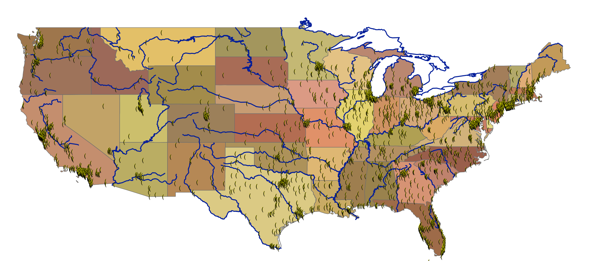

# Spatial Modeling and ArcGIS ModelBuilder — Part A

CE 414 Engineering Applications of GIS
Dr. Dan Ames
Civil & Construction Engineering
Brigham Young University

<!-- ModelBuilder is one of the most powerful, and most underused, tools in ArcGIS Pro. It is a way to perform analysis and to automate workflows: you build the workflow once, document it, and run it again on new data. This session and Part B together walk through creating and executing models with geoprocessing tools and data, and using the ModelBuilder environment to document and share models so other people can run them. The material assumes you are comfortable in ArcGIS Pro but new to ModelBuilder. -->

---

# Today's Goals

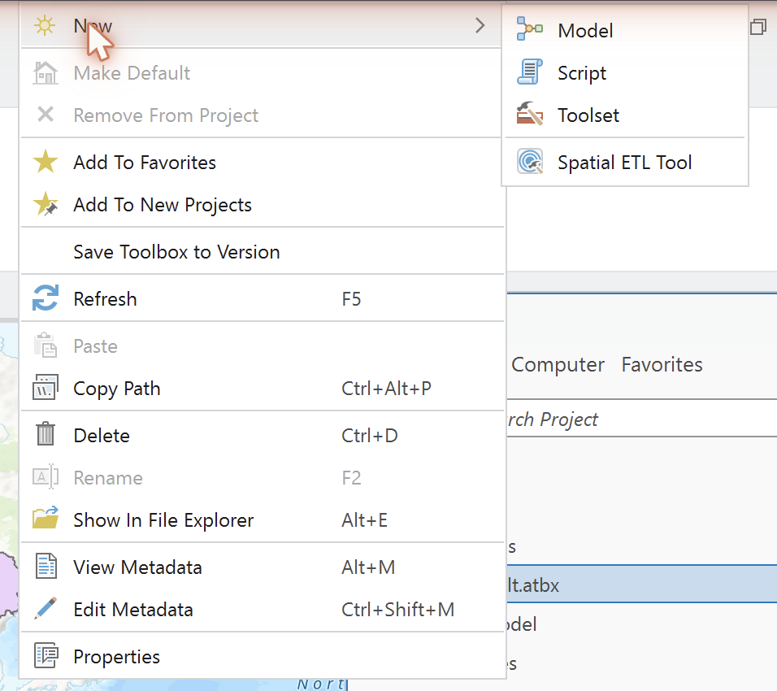

By the end of class you should be able to:

- Say what a **model** is, and recognize models that are not computer programs
- Explain what **ModelBuilder** is and when to reach for it instead of running tools one at a time
- Create a **toolbox** and a **model** in ArcGIS Pro and set the model's environments
- Name the groups on the **ModelBuilder ribbon** and read an element's state from its color
- Follow the **Cities Near Rivers** model from problem to result

<!-- This is the concepts-and-mechanics half. Part B picks up the same Cities Near Rivers example and turns it into a shareable tool with parameters. -->

---

# Review: What is a Model?

A model is an idealized and simplified representation of reality

Or&hellip; an <strong style="color:#fff;">"Abstraction of Reality"</strong>

- The word does a lot of work in engineering: it covers globes, maps, photographs, equations, and computer programs
- What every one of them has in common: something is **left out on purpose**

<!-- Start by asking the class for examples of models before showing the definition. The next six slides are all examples; keep them moving. -->

---

# A globe is a model of the Earth

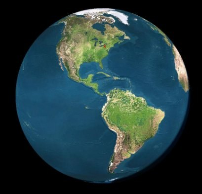

<!-- Round, rotates, shows continents and oceans. Leaves out everything smaller than a few hundred kilometers. Ask what a globe is good for that a flat map is not. -->

---

# A map is a graphical model of the earth's surface

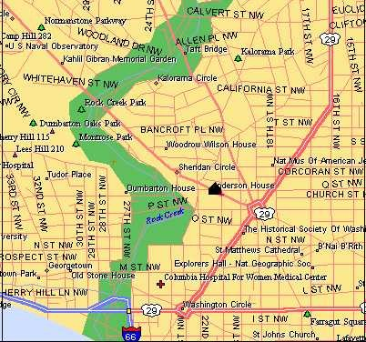

<!-- A map is a graphical model. Every symbol on it is a decision about what matters. -->

---

# A photo is a pictorial model of surface features

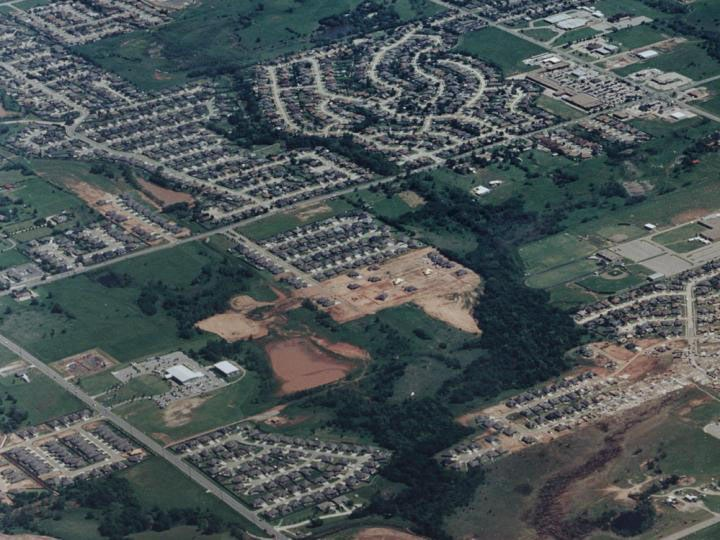

<!-- A photo is a pictorial model of the earth surface. It records reflectance, not roads or parcels; the interpretation is still up to you. -->

---

# Weather forecasting model

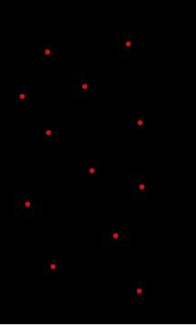

**Weather stations** — point measurements

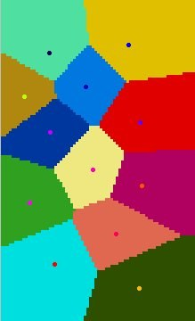

**Predicted model** — Thiessen polygons

<!-- A dozen stations measure temperature at a dozen points. Thiessen (Voronoi) polygons assign every location the value of its nearest station, which turns point measurements into a surface. It is a crude model, and it is still a model: it produces a value everywhere from data collected somewhere. -->

---

# A Digital Elevation Model is a model of the earth's terrain

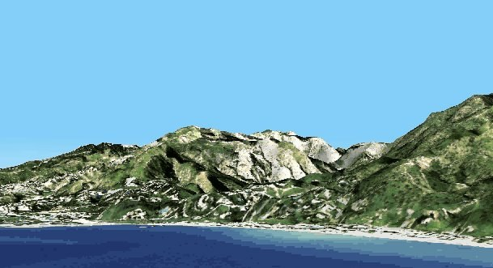

<!-- A DEM stores one elevation per cell. The word "model" is in the name. Point out that a DEM is both a data model, a raster, and a model of the terrain. -->

---

# There are many types of models

A model could be a <strong>theory</strong>, a <strong>law</strong>, a <strong>hypothesis</strong>, an <strong>equation</strong>, or even a <strong>structured idea</strong>

From Haggett and Chorley, 1967

<!-- Nothing on this list is a computer program. Ask the class for an engineering example of each: Manning's equation, the rational method, a free-body diagram. The point is that we model constantly and only sometimes write code. -->

<!-- TODO(graphic): source slide 8 has no figure. A simple visual of the five kinds of models listed here would help. -->

---

# A recipe is a model

flour salt shortening → cut → pie dough → roll out → pie crust

eggs → beat → beaten eggs

pumpkin puree evaporated milk spices beaten eggs → mix → pie filling

pie crust pie filling → fill pan &amp; bake → <strong>Pumpkin Pie</strong>

- "a pattern of something to be made" — *Merriam-Webster*
- Merriam-Webster's technical sense is closer to ours: a set of data and inferences presented as a mathematical description of something, or a computer simulation built on one

(Adapted from Merrilee Torres, Burlington County, NJ, GIS Users Group)

<!-- Ovals are data, boxes are processes, and the arrows carry one into the next. That is exactly the vocabulary of ModelBuilder: data element, tool, derived data. If you can write a recipe you can build a model. -->

---

# What is ModelBuilder?

A GIS-integrated system used for:

- **Automating workflow** by stringing processes together, saved so it can be run again
- **Designing** models
- **Implementing** models
- Creating a model containing methods and procedures **to be shared with others**
- **Showing the process** used to create an output, as a flow diagram

Especially useful for automating **geoprocessing** tasks.

<!-- The share-and-document points are the ones students undervalue. A model is a picture of your analysis that a reviewer can read, which is worth as much as the automation. -->

<!-- TODO(graphic): source slide 10 is text only. A simple ModelBuilder canvas diagram would carry this slide. -->

---

# Example geoprocessing tasks

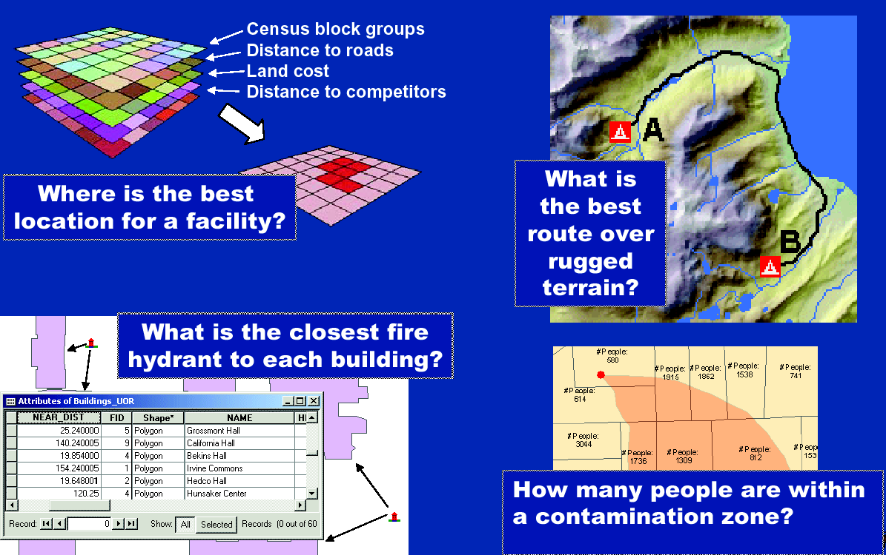

(Adapted from Brett Rose, Esri DC Technology Center)

<!-- Four familiar questions: site selection from weighted layers, least-cost route over terrain, nearest facility, and population inside a zone. Every one of them is several tools in a row, which is precisely when a model pays for itself. Least-cost path is its own lecture later in the semester. -->

---

# Geoprocessing options in ArcGIS

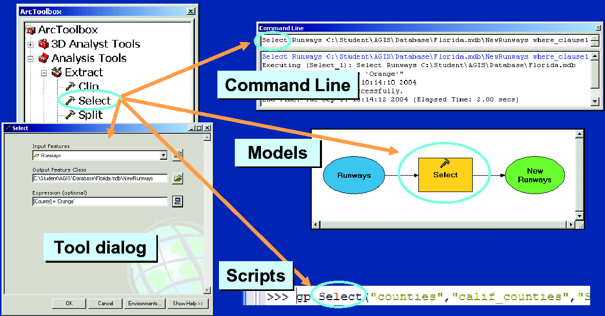

(Adapted from Brett Rose, Esri DC Technology Center)

The same tool, four ways to run it: the **tool dialog**, the **command line**, a **model**, and a **script**.

<!-- The point of the figure survives the version change: one geoprocessing tool, four front ends. In ArcGIS Pro the tool dialog lives in the Geoprocessing pane, the command line is the Python window, and scripts are arcpy. What changes between them is repeatability, not the result. -->

<!-- TODO(instructor): this composite is an ArcGIS 9 / Windows XP-era screenshot (ArcToolbox, Command Line window). Needs a new ArcGIS Pro capture showing the Geoprocessing pane, the Python window, a model, and an arcpy script. -->

---

<!-- _class: lead -->

# Building a model in ArcGIS Pro

## Toolbox → model → environments → ribbon

---

# How to start a new model

- Open your project in ArcGIS Pro and show the **Catalog pane** (View ▸ Catalog Pane)
- Right-click **Toolboxes ▸ New Toolbox**
- Give it a meaningful name — it is saved as a `.atbx` file in your project folder
- A toolbox is also a good place to organize the tools you use most, not just models

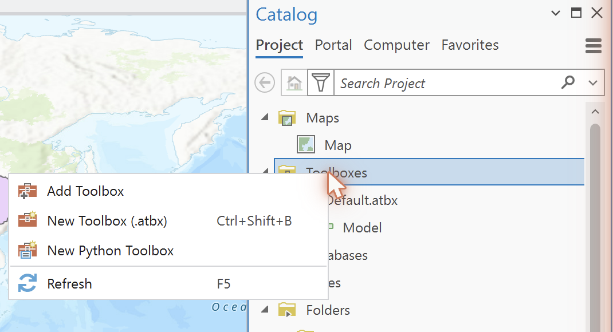

<!-- You can do plenty of non-ModelBuilder work with a new toolbox, such as collecting the tools you use every week in one place. Note the keyboard shortcut in the menu: Ctrl+Shift+B. -->

---

# Add a model to your toolbox

- Right-click your new toolbox ▸ **New ▸ Model** — the ModelBuilder view opens
- To rename it, right-click the model in the Catalog pane ▸ **Properties**, then edit **Name** and **Label**
- Save with **Ctrl+S**, or ModelBuilder ▸ **Save**
- The model is stored inside the toolbox file (`.atbx` in current Pro; older `.tbx` still opens)

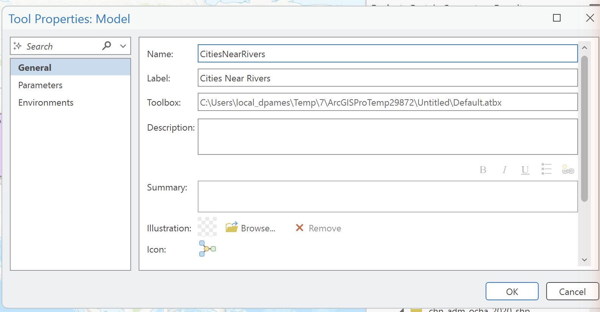

<!-- Name is the internal name with no spaces, used by arcpy; Label is what people see in the Catalog pane. Set both now, because renaming later breaks anything that calls the model by name. -->

---

# Set the model's environments

- Set environments for the whole model in **Properties ▸ Environments**
- **Current workspace** — the geodatabase or folder used for inputs and outputs
- **Output coordinate system** — set this deliberately before any distance or area step
- **Scratch workspace** — where intermediate results you do not need to keep are written
- These apply to every tool in the model unless a tool overrides them

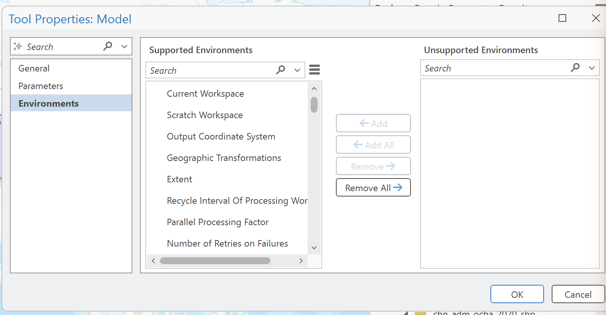

<!-- The output coordinate system is the one that bites people. A buffer distance in miles means nothing until the data are in a projected coordinate system with sensible linear units. The Cities Near Rivers example later projects both inputs before buffering for exactly this reason. -->

---

# The ModelBuilder ribbon

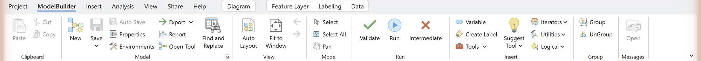

- **Model** — New, Save, Properties, Environments, Export, Report
- **View** — Find and Replace, Auto Layout, Fit to Window
- **Mode** — Select, Select All, Pan
- **Run** — Validate, Run, Intermediate
- **Insert** — Variable, Create Label, Tools, Iterators, Utilities, Logical

**Validate** has no ArcMap equivalent: it checks every tool's parameters at once, which is the fastest way to find out why a model will not run.

<!-- The ribbon tab is contextual: it only appears while a ModelBuilder view is the active view. Auto Layout arranges elements into a readable left-to-right chain and is worth pressing often. Fit to Window is how you find an element you dragged off the canvas. Run executes the processes that have not run yet; to re-run a model that has already completed, use Validate first and delete any output the previous run created. To run one tool in isolation, right-click that element and choose Run. -->

---

# Model elements have three states

**1) Not ready to run** — parameters are not defined

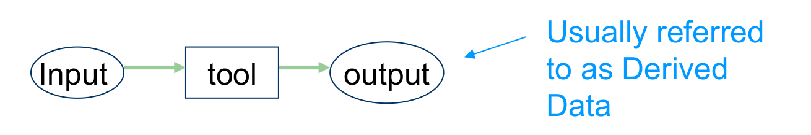

**2) Ready to run** — all elements are colored

**3) Already run** — elements are colored and shaded

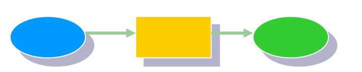

(Adapted from Merrilee Torres, Burlington County, NJ, GIS Users Group)

<!-- Reading the canvas is the whole debugging skill. Blue oval = input data, yellow box = tool, green oval = derived output. Unfilled outlines mean a required parameter is still empty. The drop shadow means that step has already executed, so its output exists on disk. -->

<!-- TODO(instructor): these three diagrams are drawn from the original PowerPoint shapes and use the ArcMap element colors. Current ArcGIS Pro uses the same blue/yellow/green convention but a flatter style; a screenshot of a real Pro canvas in each of the three states would be better. -->

---

# Start building your model

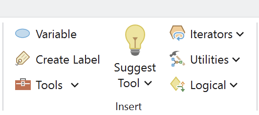

- First, plan what you want to do
  - What data will you need?
  - What processes will you run on each dataset?
- If the model is not open, right-click it in the **Catalog pane** and choose **Edit**
- Drag data onto the canvas from the **Catalog pane** or the **Contents pane**
- Drag tools onto the canvas from the **Geoprocessing pane**, or use **Insert ▸ Tools** on the ModelBuilder ribbon
- To connect two elements, **drag from one onto the other** and pick the parameter it should feed

<!-- The connection step is the one that changed. ArcMap had a click-to-connect tool on the toolbar; ArcGIS Pro has no such tool. In Pro you hover the edge of an element, drag the line onto the target element, release, and choose which parameter the connection fills, for example Input Features. -->

<!-- TODO(instructor): source slide 18 said "connect data layers to tools using the [tool]" and showed two toolbar icons for the ArcMap Add Data and Add Connection buttons. Both icons were empty placeholder files in the PowerPoint and neither button exists in ArcGIS Pro, so the icons were dropped and the bullet was rewritten for Pro's drag-to-connect behavior. Worth confirming the exact wording against a live Pro session. -->

---

<!-- _class: lead -->

# Example: Cities Near Rivers

## One problem, start to finish

---

# The problem

Find all **U.S. cities within 10 miles of a major river**.

- Two inputs: a **cities** point layer and a **rivers** line layer
- One question that takes several tools in sequence
- Exactly the kind of job you do not want to repeat by hand

<!-- Ask the class how they would do it with tool dialogs before showing the model. They will get close: project, buffer, intersect. Then show them the model and point out that the model is the same answer, written down. -->

---

# The model

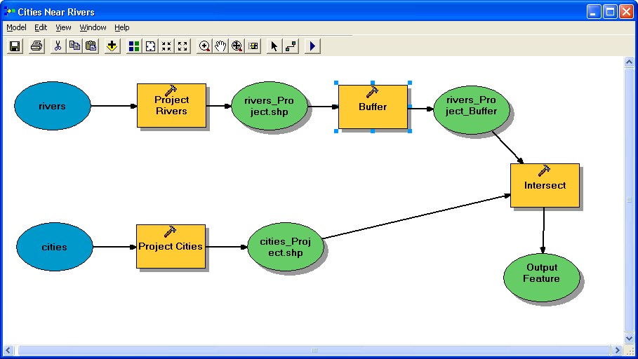

`rivers` → **Project** → **Buffer** → buffered rivers, and `cities` → **Project** → then **Intersect** the two.

<!-- Read the diagram out loud, following the arrows. Both inputs are projected first so that "10 miles" means something, then the rivers are buffered, then Intersect keeps the cities that fall inside the buffer. Note that the intermediate datasets, the green ovals in the middle, are things nobody wants to keep; that is what the Intermediate setting is for. -->

<!-- TODO(instructor): this is the classic ArcMap ModelBuilder window (title bar, Model/Edit/View/Window/Help menus). Needs an ArcGIS Pro re-capture of the same model on a Pro canvas. -->

---

# The result

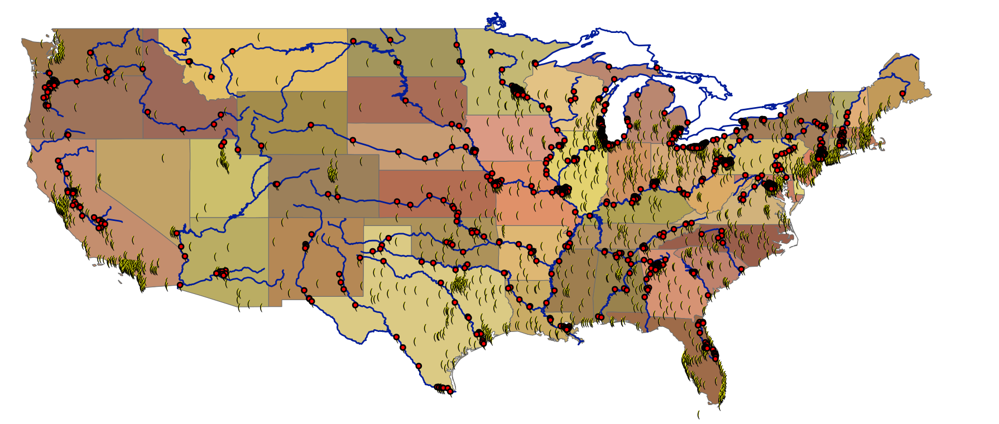

**898 out of 3,128 U.S. cities** are within 10 miles of a major river.

<!-- VERIFY: this figure depends entirely on which cities and rivers datasets are used and on the projection. Re-run the model against the dataset the course actually distributes before quoting the number to students. -->

- Red dots are the cities the model kept
- Note where they cluster, and where they do not

<!-- TODO(instructor): re-verify the 898 of 3,128 figure against the current course data, or restate it as "about 29 percent" with the dataset named. -->

<!-- The distribution is the interesting part: the Northeast, the Ohio and Mississippi corridors, and California's Central Valley. Ask why, and you get a short conversation about where American cities were founded. -->

---

<!-- _class: activity -->

# You try it

**What percentage of U.S. cities are within 10 miles of a major U.S. river?**

- Build the model yourself: **Project → Buffer → Intersect**
- Set **Output Coordinate System** to an equidistant projection before you buffer
- Set the **geographic transformation** if the inputs use a different datum
- Compare your count with the number on the previous slide, and be ready to explain a difference

<!-- Use the rivers and cities data from the course dataset. Use Buffer and Intersect from the Analysis toolbox. Set the projection to USA Contiguous Equidistant Conic, and make sure to set the geographic transformation. -->

<!-- TODO(instructor): the original note pointed students at rivers and cities data "from the CD (from the MapWindow installer)," which no longer exists. Name the current download location for the cities and rivers layers. -->

---

# Things to remember

- To re-open a model, right-click it in the **Catalog pane** and choose **Edit**
- To make an output appear in the map, right-click that output element and check **Add To Display** <!-- VERIFY: menu label in current ArcGIS Pro -->
- If elements stay unfilled, a required parameter is missing — open each tool and check its settings, or press **Validate**
- Right-click a working dataset you do not need to keep and mark it **Intermediate**
- Delete intermediate data to start fresh <!-- VERIFY: in ArcMap this was Model ▸ Delete Intermediate Data; the verified Pro ribbon has Run ▸ Intermediate. Confirm the exact command and its location before class. -->
- To test one step, right-click that tool element and choose **Run**

<!-- These six are the ones students email about. Validate is the single biggest time-saver and did not exist in ArcMap. -->

---

# Coming up: ModelBuilder, Part B

- We keep the same **Cities Near Rivers** model and make it useful to somebody else
- Turning inputs and distances into **parameters**, so the model becomes a tool with its own dialog
- **Variables**, labels, and documenting a model so a reviewer can read it
- Running a model over many inputs

<!-- Part B is the payoff: today's model is hard-wired to one buffer distance and one pair of layers, and by the end of Part B it is a general tool. -->

<!-- TODO(graphic): this preview slide has no figure. A screenshot of the finished parameterized tool dialog from Part B would work well here. -->

---

# Before Next Class

- Read the assigned textbook chapter <!-- TODO(instructor): reading chapter -->
- Take the **open-book quiz** on Learning Suite
- Work on [Lab 1](https://byu-hydroinformatics.github.io/ce414-gis-applications/assignments/lab-01/)
- Bring a laptop with ArcGIS Pro, and have a project open before class
- Questions? Office hours: [calendly.com/dan-ames/office-hours](https://calendly.com/dan-ames/office-hours)

<!-- Fill in the reading chapter and the quiz due date before class. -->

<!--
Conversion notes (2026-09-03): Source deck "CE 414 Week 2 - ModelBuilder A.pptx", 23 slides, converted to 28.
No source slide was dropped; slides 2 and 8 gained styled callouts in place of empty space, and a title
slide, a Today's Goals slide, two lead section dividers, a Part B preview and a Before Next Class slide
were added.

Images dropped: image11-image14 (slide 13), image15-image16 (slide 14), image17 (slide 15) and image18
(slide 16) were the superseded ArcMap-era captures on slides that now carry the 2026 ArcGIS Pro captures
(image26-image30); image20 and image21 (slide 18) were empty placeholder icon files for ArcMap toolbar
buttons that do not exist in ArcGIS Pro; image1.emf (the BYU seal on the title slide) is an EMF that does
not convert. Slide 9's recipe diagram was rebuilt in HTML because the PowerPoint connectors render across
the title in the PDF export; the labels and flow are unchanged from the original.

ArcMap-era screenshots kept and flagged: the "Geoprocessing options in ArcGIS" composite (source slide 12),
the classic Cities Near Rivers ModelBuilder window (source slide 20), and the three element-state diagrams
(source slide 17, drawn PowerPoint shapes rendered from the PDF). The "You try it" monitor graphic is dated
clip art from the original deck.

The Cities Near Rivers result figure (898 of 3,128) is carried over unverified and marked VERIFY; source
slide 22 asks students to reproduce it, so the figure and the dataset need to agree.

Slide 18's connect-the-elements bullet was rewritten: ArcMap's click-to-connect tool does not exist in
ArcGIS Pro, where you drag from one element onto another and pick the parameter.

The ModelBuilder ribbon group list on the ribbon slide was verified against the live software capture and
should be kept exact.
-->
