<!-- _class: lead -->
<!-- _paginate: skip -->

# Spatial Modeling and ArcGIS ModelBuilder — Part A

CE 414 Engineering Applications of GIS
Dr. Dan Ames
Civil & Construction Engineering
Brigham Young University

<!-- ModelBuilder is one of the most powerful, and most underused, tools in ArcGIS Pro. It is a way to perform analysis and to automate workflows: you build the workflow once, document it, and run it again on new data. This session and Part B together walk through creating and executing models with geoprocessing tools and data, and using the ModelBuilder environment to document and share models so other people can run them. Today is concepts and mechanics; by the end you should be able to start Lab 1 tonight. -->

---

# Today's Goals

By the end of class you should be able to:

- Say what a **model** is, and recognize models that are not computer programs
- Explain what **ModelBuilder** is and when to reach for it instead of running tools one at a time
- Create a **toolbox** and a **model** in ArcGIS Pro, set its environments, and read the canvas
- Follow the **Cities Near Rivers** model from problem to result
- Recognize the **Lab 1 model** below as the same pattern, longer

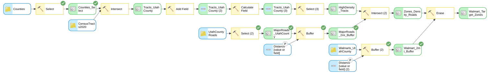

<!-- The picture on the right is the Lab 1 model, finished. It looks like a lot; by the end of today it should look like a chain of things you have already seen. Part B picks up the same Cities Near Rivers example and turns it into a shareable tool with parameters. -->

---

# Review: What is a Model?

A model is an idealized and simplified representation of reality

Or&hellip; an <strong style="color:#fff;">"Abstraction of Reality"</strong>

- The word, "model", does a lot of work in engineering: it covers globes, maps, photographs, equations, and computer programs
- What every one of them has in common: they are an **intentional simplification of the real world**

<!-- Start by asking the class for examples of models before showing the definition. The next five slides are all examples; keep them moving. -->

---

# A globe is a model of the Earth

<!-- Image: an antique-styled desk globe rendered from Natural Earth 1:110m land polygons (public domain) by tools/make_antique_globe_gif.py; no openly licensed animation of a real physical globe was available. -->

<!-- Round, rotates, shows continents and oceans. Leaves out everything smaller than a few hundred kilometers. Ask what a globe is good for that a flat map is not. -->

---

# A map is a graphical model of the earth's surface

<!-- Photo: "maps lying on the floor" by Andrew Neel, https://unsplash.com/photos/1-29wyvvLJA, Unsplash License. -->

<!-- A map is a graphical model. Every symbol on it is a decision about what matters. -->

---

# An aerial photo is a pictorial model of surface features

<!-- A photo is a pictorial model of the earth surface. It records reflectance, not roads or parcels; the interpretation is still up to you. Lab 2 will make this concrete: two Landsat bands are pictures, and the vegetation map you build from them is a model. -->

---

# A simple weather forecasting model

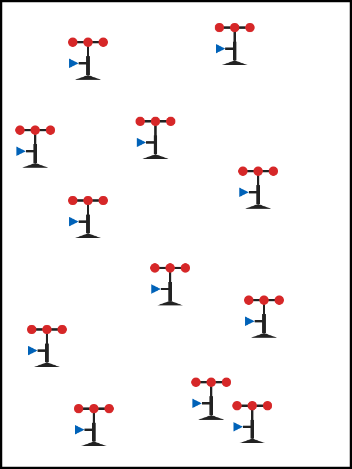

**Weather stations** — point measurements

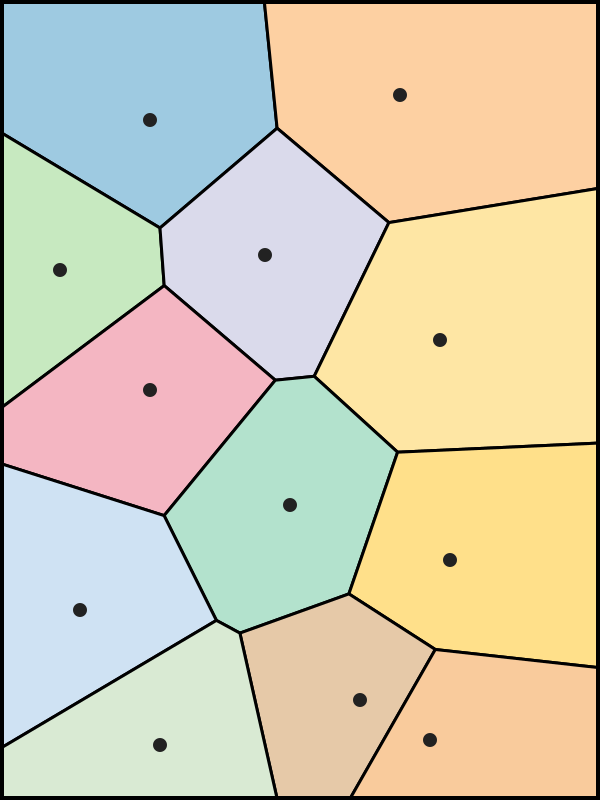

**Predicted model** — Thiessen polygons

<!-- A dozen stations measure temperature at a dozen points. Thiessen (Voronoi) polygons assign every location the value of its nearest station, which turns point measurements into a surface. It is a crude model, and it is still a model: it produces a value everywhere from data collected somewhere. -->

---

# A Digital Elevation Model is a model of the earth's terrain

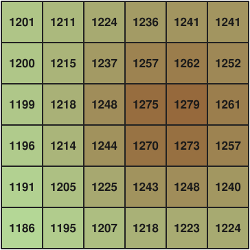

<small>One number per cell</small>

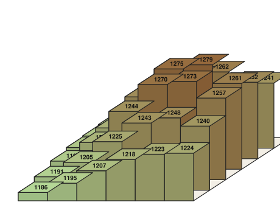

<small>The same numbers as columns</small>

<small>The terrain they describe</small>

A DEM is two models at once: a **raster data model** (a regularly spaced grid of numeric values — discussed last week) holding one number per cell, and a **model or representation of the terrain (elevations)** built from those numbers.

<!-- This is the one-line bridge from last week's data models. The word "model" is in the name. A DEM is a raster, one elevation per cell, and it is also a simplified representation of the ground. Every raster analysis later in the course starts from this double meaning. -->

---

# There are many types of models

T

Theory

Bernoulli's energy principle

L

Law

Conservation of mass

H

Hypothesis

"Cities cluster near rivers"

E

Equation

Manning's equation, NDVI

S

Structured idea

A site-selection workflow

A model could be a <strong>theory</strong>, a <strong>law</strong>, a <strong>hypothesis</strong>, an <strong>equation</strong>, or even a <strong>structured idea</strong>

From Haggett and Chorley, 1967

* <svg class="mb-ring" viewBox="0 0 286 330"><ellipse cx="143" cy="165" rx="130" ry="152" transform="rotate(-7 143 165)"/></svg>Enabled by ModelBuilder — Core Modeling Environment for this Class

<!-- Nothing on this list is a computer program. Ask the class for an engineering example of each: Manning's equation, the rational method, a free-body diagram. The two orange tiles are the ones this course builds in ModelBuilder: equations (Lab 2's NDVI) and structured ideas (Lab 1's site-selection chain). We model constantly and only sometimes write code. -->

---

# A recipe is a model

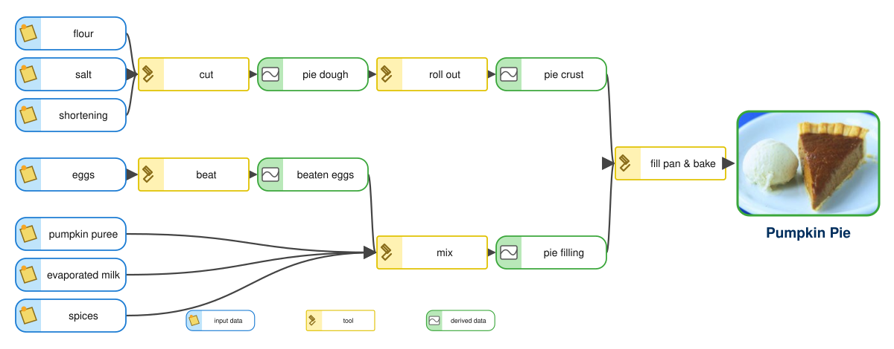

- **Blue is input data, yellow is a tool, green is derived data** — exactly ModelBuilder's color code, drawn here the way ArcGIS Pro draws it
- "a pattern of something to be made" — *Merriam-Webster*

(Adapted from Merrilee Torres, Burlington County, NJ, GIS Users Group)

<!-- Blue elements are input data, yellow ones are tools, green ones are derived data, and the arrows carry one into the next. That is exactly the vocabulary of ModelBuilder: data element, tool, derived data. The shapes match what ArcGIS Pro 3.7 draws: rounded rectangles for data with an icon panel, square boxes with a hammer for tools. If you can write a recipe you can build a model. On Thursday everyone brings a sketch of a cookie recipe drawn this way; say so now. -->

---

# What is ModelBuilder?

A GIS-integrated system, built into ArcGIS Pro, for:

- **Automating workflow** by stringing tools together, saved so it can be run again
- **Designing** and **implementing** models, and **sharing** them with other people
- **Showing the process** used to create an output, as a flow diagram — one analysis, written down

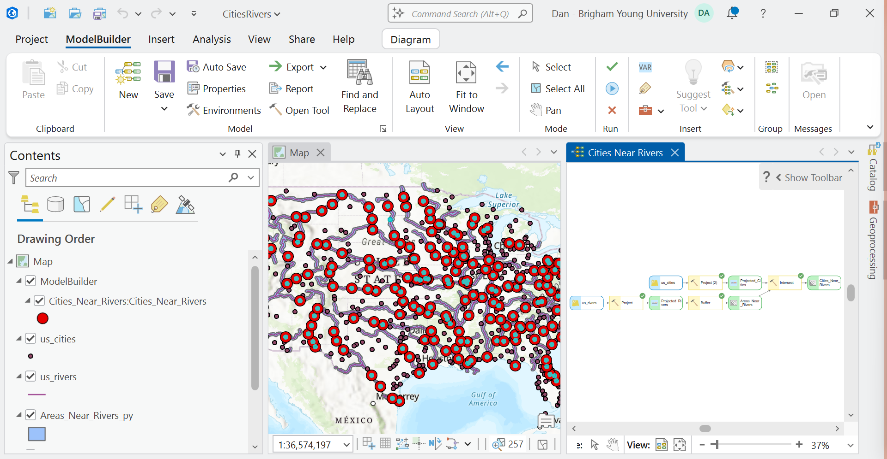

ModelBuilder is a view inside ArcGIS Pro 3.7, open here beside the map and the data it works on

<!-- The screenshot is the whole ArcGIS Pro window: the ModelBuilder ribbon tab along the top, the Contents pane with the map's layers on the left, the map in the middle, and the Cities Near Rivers model in its own view on the right. The point of showing all the chrome is that ModelBuilder is not a separate program: it lives in the same window as the maps you make and the data you look at, and the model runs on the layers listed in Contents. The share-and-document points are the ones students undervalue. A model is a picture of your analysis that a reviewer can read, which is worth as much as the automation. -->

---

# What is geoprocessing?

<strong style="color:#ffd21f;">Geoprocessing</strong> = running a <strong style="color:#fff;">tool</strong> on geographic data to produce <strong style="color:#fff;">new</strong> data: a layer, a table, or a number that answers a spatial question

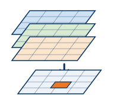

Where is the best site for a new facility?

Buffer · Erase · Intersect — Lab 1

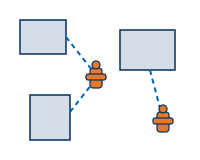

Which fire hydrant is closest to each building?

Near

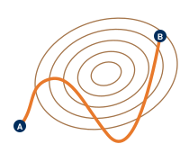

What is the best route over rugged terrain?

Cost Distance · Cost Path — Lab 10

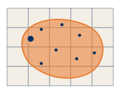

How many people live inside a contamination zone?

Buffer · Summarize Within

Every answer is several tools in a row — <strong>ModelBuilder</strong> is where you string them together.

<!-- Questions adapted from Brett Rose, Esri DC Technology Center. -->

<!-- Say the word out loud: geoprocessing. A tool takes data in and puts new data out; everything in the labs is geoprocessing. Four familiar questions: site selection from several criteria layers, nearest facility, least-cost route over terrain, and population inside a zone. Every one of them is several tools in a row, which is precisely when a model pays for itself. Site selection is Lab 1; least-cost path is Lab 10 and its own lecture later in the semester. The tool names on the cards are the ArcGIS Pro tools that answer each question. -->

---

# Four ways to run the same geoprocessing analysis

The <strong>Buffer</strong> step of Cities Near Rivers in ArcGIS Pro 3.7: one tool, four front ends, one result — only the <strong>repeatability</strong> changes.

<strong style="color:#ffd21f;">1</strong> &nbsp;<strong style="color:#fff;">Tool dialog</strong> — Geoprocessing pane

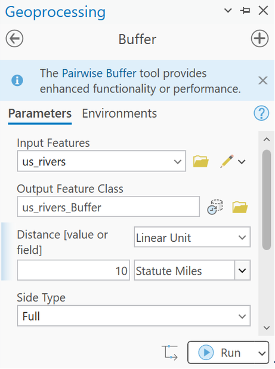

<strong style="color:#ffd21f;">2</strong> &nbsp;<strong style="color:#fff;">Python window</strong> — one line, run now

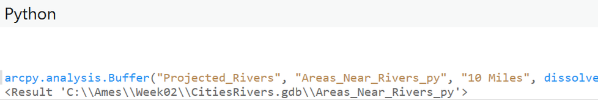

<strong style="color:#ffd21f;">3</strong> &nbsp;<strong style="color:#fff;">Model</strong> — ModelBuilder, a picture of the whole chain

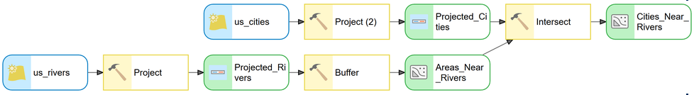

<strong style="color:#ffd21f;">4</strong> &nbsp;<strong style="color:#fff;">Script</strong> — notebook or .py file, the same chain as code

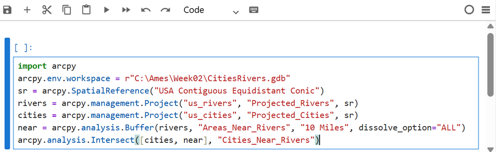

<!-- All four panels are ArcGIS Pro 3.7, and all four run the same Buffer. The dialog is what you have used so far. The Python window runs one line at a time. The model is today's subject: a picture of the whole chain that can be run again. The script is the same chain as arcpy code, which you will meet later in the course. Every one of them calls the identical geoprocessing tool underneath. -->

---

<!-- _class: lead -->

# Building a model in ArcGIS Pro

## Toolbox → model → environments → ribbon

---

# Models live in a toolbox

- A **toolbox** is a file (`.atbx`) that holds models, script tools, and other tools — one file you can copy, email, or hand to a reviewer
- Every ArcGIS Pro project comes with a **default toolbox named after the project** (`Lab01.atbx` for a project called Lab01), listed in the **Catalog pane** under **Toolboxes**
- **Usual way:** right-click the default toolbox ▸ **New ▸ Model**
- **Also fine:** the **New** button on the ModelBuilder ribbon, or **ModelBuilder** on the Analysis ribbon — both create the model in that same default toolbox
- You only need **New Toolbox** when you want tools that travel separately from a project

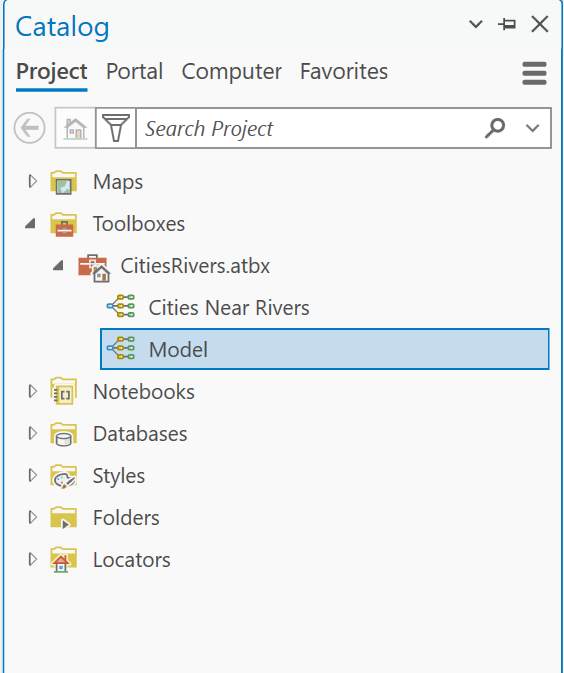

The default toolbox holding two models, one made from the Catalog pane, one from the ribbon's New button

<!-- Verified in ArcGIS Pro 3.7.1 on September 7: the default toolbox is CitiesRivers.atbx for the CitiesRivers project, and ModelBuilder ribbon > New created a model named Model inside that same toolbox (the capture shows it, highlighted). The Analysis ribbon's ModelBuilder button behaves the same way. -->

<!-- The toolbox is the unit of sharing: one .atbx file carries the model and any script tools with it, which is how you will hand in a model or send one to a teammate. Students do not need to make a toolbox; the project already has one, and both the Catalog right-click and the ribbon's New button put the model there. Making a separate toolbox is for tools you want to move between projects. -->

---

# Name, label, and saving

- A model has a **Name** and a **Label**. Renaming it in the Catalog pane changes only the *Label*; set the *Name* in **Properties ▸ General**
- A model cannot be renamed while it is open in ModelBuilder: close the view first
- Save with **Ctrl+S**, or ModelBuilder ▸ **Save** — the model is saved into its toolbox, not into the map

<!-- Name is the internal name with no spaces, used by arcpy; Label is what people see in the Catalog pane. The screenshot shows the trap: this model was renamed NDVI in the Catalog pane, and its Name is still Model, which is why the dialog title says so. Set both now, because renaming later breaks anything that calls the model by name. Both facts were checked in Pro 3.7.1 on September 6. -->

---

# Environments: the settings every tool reads

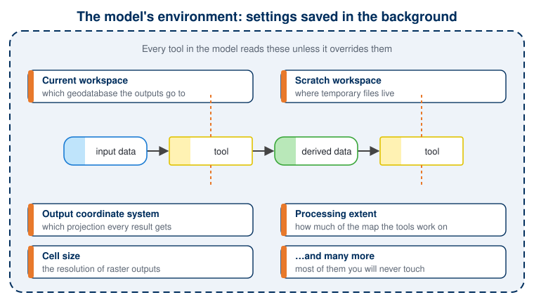

Set them once for the whole model: ModelBuilder ribbon ▸ <strong>Environments</strong>. A tool's own Environments tab can override any of them. <strong>Output Coordinate System</strong> left empty means <em>same as input</em>: leave it empty on purpose, or set it on purpose.

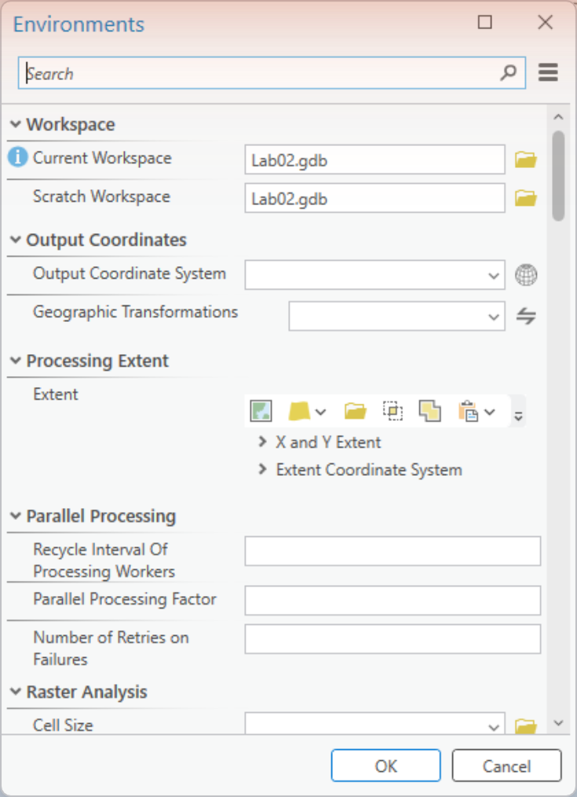

The Environments dialog, ArcGIS Pro 3.7

<!-- "Environment" is the word students stumble on. It is nothing more than a set of background settings that every tool consults when it runs: where outputs go, where temporary files go, what projection results get, how much of the map to process, what cell size rasters get. You can set them on a single tool, on the whole model, or on the project; the model-level setting is the one that matters here. The output coordinate system is the one that bites people. A buffer distance in miles means nothing until the data are in a projected coordinate system with sensible linear units. The Cities Near Rivers example later projects both inputs before buffering for exactly this reason. In Lab 2 the opposite lesson applies: an inherited coordinate system silently reprojects every output. -->

---

# The ModelBuilder ribbon

- **Model** — New, Save, Properties, Environments, Export, Report
- **View** — Find and Replace, Auto Layout, Fit to Window
- **Mode** — Select, Select All, Pan
- **Run** — Validate, Run, Intermediate
- **Insert** — Variable, Create Label, Tools, Iterators, Utilities, Logical

**Validate** checks every tool's parameters at once, which is the fastest way to find out why a model will not run. **Auto Layout** and **Fit to Window** are worth pressing often.

<!-- The ribbon tab is contextual: it only appears while a ModelBuilder view is the active view. Auto Layout arranges elements into a readable left-to-right chain. Fit to Window is how you find an element you dragged off the canvas. Run executes the processes that have not run yet; to re-run a model that has already completed, press Validate first. To run one tool in isolation, right-click that element and choose Run. -->

---

# Model elements have three states

**1) Not ready to run** — gray: a required parameter is still empty

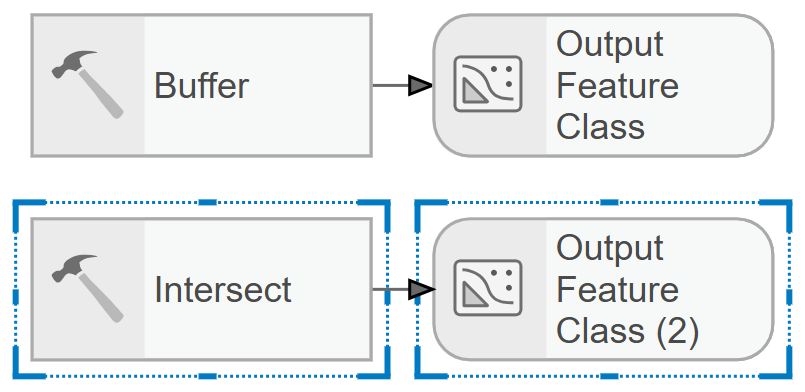

**2) Ready to run** — every element is colored: blue inputs, yellow tools, green outputs

**3) Already run** — colored, with a **green check** on everything that has executed

<!-- Reading the canvas is the whole debugging skill. Blue oval = input data, yellow box = tool, green oval = derived output. Gray means a required parameter is still empty, and it propagates downstream, so fix the leftmost gray element first. The green check means that step has already executed and its output exists on disk. All three strips are the same Cities Near Rivers model, exported from ArcGIS Pro 3.7 at three moments. -->

---

# Start building your model

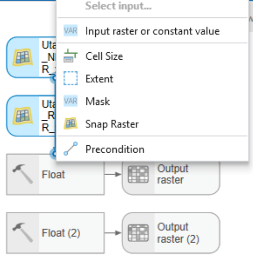

- First, plan what you want to do: what data, and what process on each dataset
- If the model is not open, right-click it in the **Catalog pane** and choose **Edit**
- Drag data onto the canvas from the **Catalog** or **Contents** pane
- Add tools from the **Geoprocessing pane**, or click an empty spot on the canvas and **start typing the tool's name**
- To connect two elements, **drag from one onto the other**; a menu asks which parameter the connection feeds

<!-- The connection step is the one that changed from ArcMap. There is no connect tool: you hover the edge of an element, drag onto the target, release, and choose the parameter, as in the menu on the right, captured from the Lab 2 model. Typing on the canvas to add a tool is the fastest route and is what the labs use. -->

---

<!-- _class: lead -->

# Example: Cities Near Rivers

## One problem, start to finish

---

# The problem

Find all **U.S. cities within 10 miles of a major river**.

- Two inputs: a **cities** point layer and a **rivers** line layer
- One question that takes several tools in sequence
- Exactly the kind of job you do not want to repeat by hand

* How would you solve this in GIS?
* What is the recipe (the model) for this analysis?

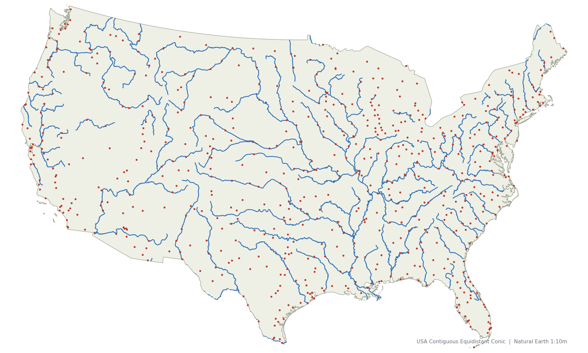

678 cities and the major rivers of the lower 48, in USA Contiguous Equidistant Conic.  The case in point: Chicago, photographed from the Chicago River in summer 2026. The city is there because the river is.

<!-- Two arrow presses, two discussions. First press: "How would you solve this in GIS?" Let them talk it through with tool names: measure distance, buffer, select by location, intersect. Second press: "What is the recipe?" Push them to say it as a sequence: project both layers, buffer the rivers, intersect the cities with the buffer, count. That sequence is the model on the next slide; the point is that they wrote it before seeing it. The photos are Chicago from the river: the case in point, a city that exists because of its river. -->

---

# The model

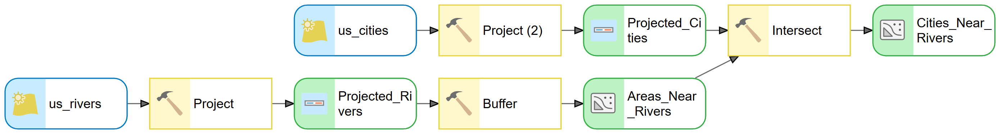

`us_rivers` → **Project** → **Buffer** (10 miles) → areas near rivers; `us_cities` → **Project**; then **Intersect** the two.

<!-- Read the diagram out loud, following the arrows. Both inputs are projected first so that "10 miles" means something, then the rivers are buffered, then Intersect keeps the cities that fall inside the buffer. The intermediate datasets, the green ovals in the middle, are things nobody wants to keep; that is what the Intermediate setting is for. This is the model as built in ArcGIS Pro 3.7 on September 7, 2026, ready to run and not yet run. -->

---

# Two dialogs that decide the answer

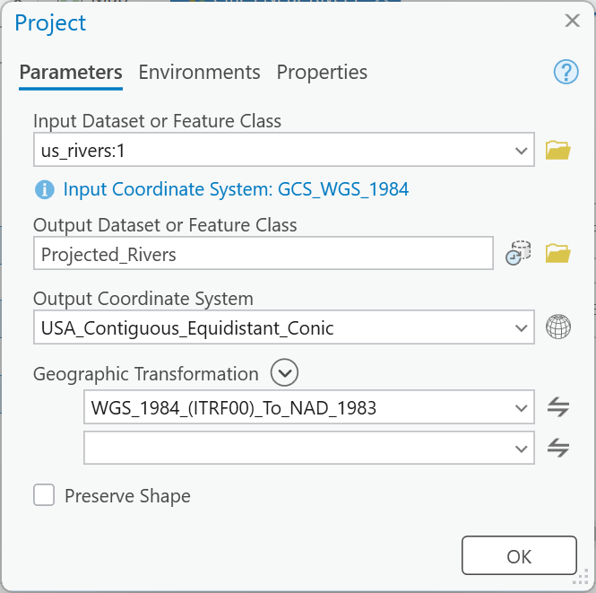

**Project** — an equidistant projection, and the geographic transformation ArcGIS Pro proposes

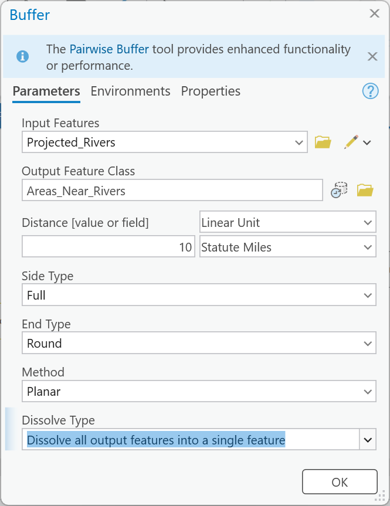

**Buffer** — 10 *Statute Miles*, not 10 *Unknown*; dissolve everything into one feature

<!-- Two dialogs, two decisions. Project: the inputs are in WGS 1984 latitude and longitude, where a "mile" has no meaning, so both are projected to USA Contiguous Equidistant Conic; because the datum changes, Pro asks for a geographic transformation and proposes one. Buffer: the unit box reads Unknown until you set it, and it defaults to meters if you only type a number. Dissolving the buffers into one feature keeps Intersect from producing a city twice where two river buffers overlap. Lab 1 has the same Buffer trap. -->

---

# The result

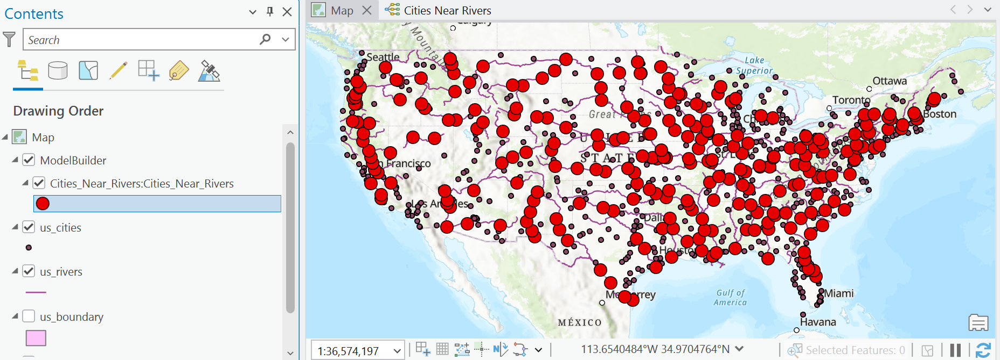

**256 of 678 cities** — about **38 percent** — are within 10 miles of a major river.

- Red dots are the cities the model kept
- Dataset: Natural Earth 1:10m populated places and rivers, conterminous U.S. (the download on the next slide)
- Note where they cluster, and where they do not

<!-- The number depends entirely on which cities and rivers you use, so it is quoted with its dataset. This is the same Natural Earth extract students download. The distribution is the interesting part: the Mississippi and Ohio corridors, the Northeast, California's Central Valley. Ask why, and you get a short conversation about where American cities were founded. -->

---

<!-- _class: activity -->

# You try it

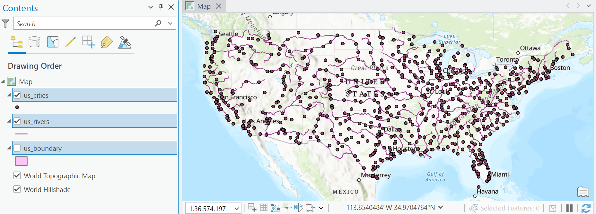

**What percentage of U.S. cities are within 10 miles of a major river?**

- Download [week02-cities-rivers.zip](https://byu-hydroinformatics.github.io/ce414-gis-applications/data/week02-cities-rivers.zip) (under 1 MB) and add `us_cities` and `us_rivers` to a new map
- Build the model: **Project → Buffer → Intersect**
- Project to **USA Contiguous Equidistant Conic** before you buffer, and accept the geographic transformation
- Compare your count with **256 of 678**, and be ready to explain a difference
- Then change **one thing**: set the buffer to **5 miles** and run again. How many now? One parameter, one click, a new answer

<!-- Five miles with the same projected workflow gives 214 of 678 (computed from the course data package with tools/week02_problem_map.py on September 7); keep that number for checking, do not put it on the slide. The point of the second run is the speed: nobody rebuilds anything, they edit one number in the Buffer element and press Run. Use the hosted download; it is three shapefiles from Natural Earth, public domain, clipped to the lower 48. Buffer and Intersect are in the Analysis toolbox, Project is in Data Management. If someone gets 257 instead of 256, they probably used a geodesic distance instead of a projected one; that difference is a Thursday discussion. -->

---

# Read a model out loud

1. **Rivers** are *projected* into a map projection with real distance units
2. The projected rivers are *buffered* 10 miles → **areas near rivers**
3. **Cities** are *projected* the same way
4. Projected cities are *intersected* with the areas → **cities near rivers**

Every green check is a dataset on disk that you can open and inspect.

<!-- This is the skill Lab 1's rubric rewards under "a description of the model a reader could repeat from": say the chain as a sentence, input to output, naming each tool and each intermediate dataset. Practice on this one before you build your own. -->

---

# Lab 1 is the same pattern, longer

Select ▸ Intersect ▸ Add Field ▸ Calculate Field ▸ Select ▸ Select ▸ Buffer ▸ Intersect ▸ Buffer ▸ Erase — ten tools, one chain.

<!-- Do not teach the steps here; the lab page does that. The point is recognition: blue inputs, yellow tools, green outputs, connectors, and P markers on the things the user gets to change. Two buffers, two intersects, one erase. Every element on this canvas is something you have now seen. -->

---

# Where the lab's data comes from

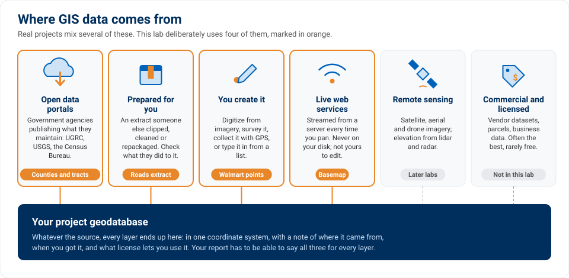

<!-- This is the data-sources figure from the Lab 1 page. Three of the four layers are downloads from the Utah Geospatial Resource Center; one, the Walmart locations, you make yourself, because the public dataset that used to exist has been taken down. Modeling starts with knowing where every input came from and how far to trust it. -->

---

# Judge the data before you model it

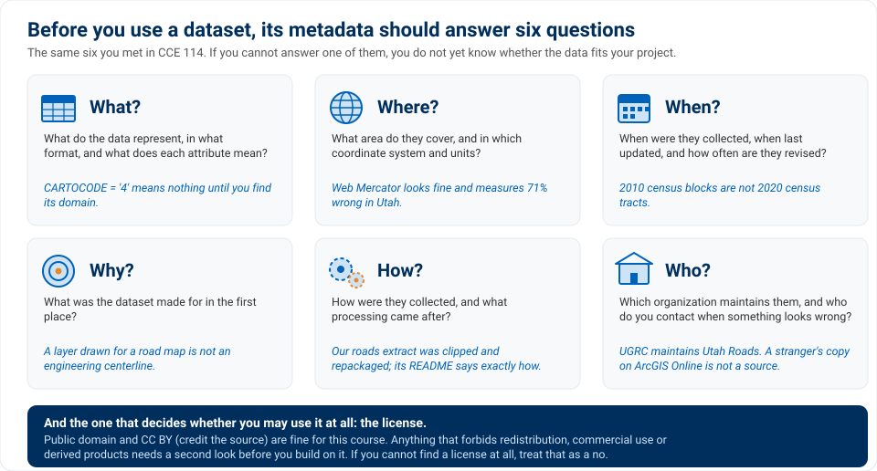

<!-- Six questions from CCE 114's metadata lecture, each answered for a Lab 1 layer. What, where, when, why, how, who, and the license question underneath. A model built on a layer you cannot answer these questions for is a model with an unknown error in it. The lab's write-up asks for these answers. -->

---

# The tools you will use in Lab 1

 <strong>Select</strong> rows that match an expression

 <strong>Intersect</strong> keep where two layers overlap

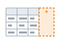 <strong>Add Field</strong> a new attribute column

 <strong>Calculate Field</strong> fill it with an expression

 <strong>Buffer</strong> a zone at a distance

 <strong>Erase</strong> remove where another layer is

Every one is a **Spatial Analysis** or **Data Management** tool you can find by typing its name on the canvas.

<!-- These are the six icons from the Lab 1 page's tool table, so the lab and the lecture use the same vocabulary. Select and Intersect narrow the data; Add Field and Calculate Field compute the density; Buffer draws the distance criteria; Erase removes the areas already served. -->

---

# Two traps, shown once

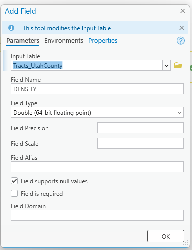

**Add Field** — the type must be **Double**. The default, *Long*, silently drops every decimal.

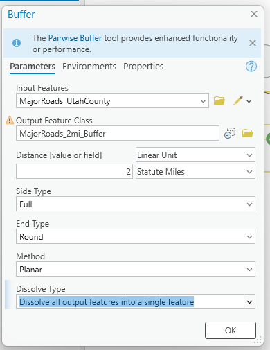

**Buffer** — the unit box reads *Unknown* until you set it, then defaults to **Meters**. Choose *Statute Miles*.

<!-- These are the two most expensive mistakes in Lab 1, and both are silent: nothing warns you. A Long density field gives every tract a density of 0, 1 or 2, so nothing passes the 5,000 test; a two-meter buffer selects almost nothing. Both dialogs are captured from the Lab 1 run, and the lab page shows them again where they occur. -->

---

# Things to remember

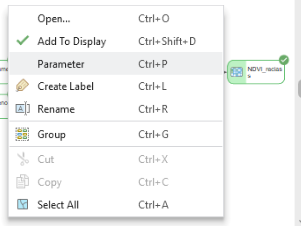

- To re-open a model for editing, right-click it in the **Catalog pane** and choose **Edit**; double-click runs it as a tool instead
- To make an output appear in the map, right-click that output and check **Add To Display**
- If elements stay gray, a required parameter is missing — open the tool, or press **Validate**
- Right-click a working dataset you do not need to keep and check **Intermediate Data**
- To test one step, right-click that tool element and choose **Run**

<!-- These are the ones students email about. The menu on the right is an output element's right-click menu in Pro 3.7.1: Add To Display is exactly that label. Validate is the single biggest time-saver. The Run group on the ribbon also has an Intermediate button that toggles the same flag on a selected element. -->

---

# Coming up: ModelBuilder, Part B

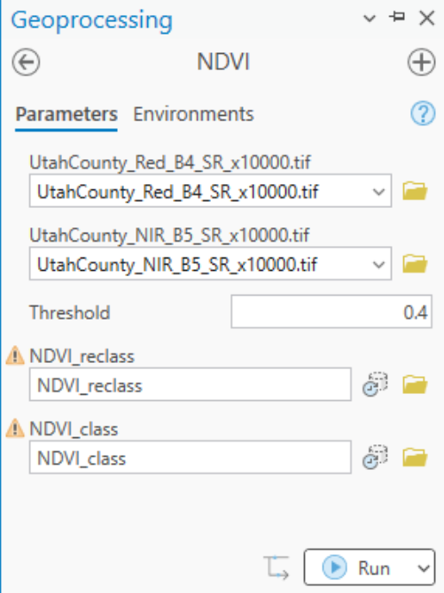

- We keep the **Cities Near Rivers** model and make it useful to somebody else
- Turning inputs and distances into **parameters**, so the model becomes a tool with its own dialog, like the one on the right
- **Renaming** elements and documenting a model so a reviewer can read it
- Then a **Lab 1 clinic**: the rubric, a complete submission, checking your answer, peer review

<!-- Part B is the payoff: today's model is hard-wired to one buffer distance and one pair of layers, and by the end of Part B it is a general tool. The dialog on the right is the Lab 2 model as a tool, with the classification threshold exposed; Lab 1 does the same with its two buffer distances. -->

---

# Before Next Class

- **Think about what is involved in baking a cookie** — we will do an in-class activity on this!
- Start [Lab 1](https://byu-hydroinformatics.github.io/ce414-gis-applications/assignments/lab-01/): Steps 0 to 4 are within reach tonight
- Read the assigned textbook chapter <!-- TODO(instructor): reading chapter -->
- Take the **open-book quiz** on Learning Suite
- Questions? Office hours: [calendly.com/dan-ames/office-hours](https://calendly.com/dan-ames/office-hours)

<!-- Fill in the reading chapter and the quiz due date before class. The cookie question is the prep for Thursday's in-class exercise; no sketch is required, but anyone who brings one gets a head start. -->

<!--
Revision notes (2026-09-07): Part A revised against slides/week-02/LECTURE_PLAN.md. 28 slides -> 35.
- Dropped: the ArcGIS 9 "geoprocessing options" composite, the ArcMap Cities Near Rivers window, the
  drawn element-state diagrams, the monitor clip art, and the unverified "898 of 3,128" figure.
- New ArcGIS Pro 3.7.1 captures (Sept 7, 175 % display scaling, project C:\Ames\Week02\CitiesRivers.aprx):
  four-ways composite (Geoprocessing pane, Python window, canvas, notebook), the three element states
  (SVG exports of the same model), the Project and Buffer dialogs, the ready model, the result map, and
  the You-try-it starting map. Data: docs/data/week02-cities-rivers.zip (Natural Earth 1:10m, public
  domain, conterminous U.S.); the answer 256 of 678 was verified by the model in Pro and by arcpy.
- Reused from the labs (copied into images/ with mba- prefixes): Lab 1 model overview, data-sources and
  metadata infographics, six tool icons, Add Field and Buffer dialogs; Lab 2 model overview, Tool
  Properties General, Environments dialog, connect menu, output context menu, threshold tool dialog.
- Text corrections from the Sept 6 Lab 2 GUI run: Catalog rename sets the Label not the Name; a model
  cannot be renamed while open in ModelBuilder; a run element carries a green check, not a shadow;
  connect-by-drag wording verified; "Add To Display" and "Intermediate Data" labels verified.
- The five-kinds-of-model slide is an HTML tile strip (no AI image; two generated attempts garbled).
- Still open: the reading chapter and quiz date on the last slide.
-->
