<!-- _class: lead -->
<!-- _paginate: skip -->

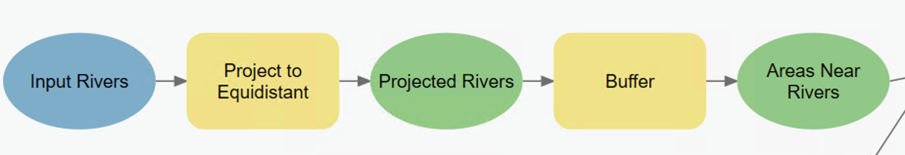

# Spatial Modeling and ArcGIS ModelBuilder — Part B

CE 414 Engineering Applications of GIS
Civil & Construction Engineering, Brigham Young University

Dr. Dan Ames

<!-- Part B of the ModelBuilder sequence. Part A got a working model on the canvas; today we make it readable, make it reusable, and document it. ModelBuilder is one of the most powerful and most underused parts of ArcGIS Pro: it closely integrates GIS data with process models, and it lets you automate a workflow once instead of clicking through it every semester. Today is instruction plus hands-on time, aimed at students who are comfortable in ArcGIS Pro but new to ModelBuilder. -->

---

# Today's Goals

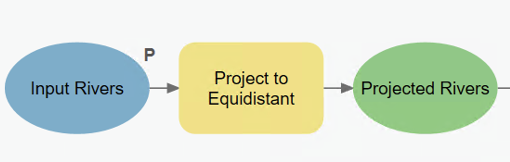

In Part A we built the **Cities Near Rivers** model — Project, Buffer, Intersect — and ran it end to end.

By the end of class you should be able to:

- Judge when a **smaller** model is the better model
- Get model output onto the map, and debug a gray node
- **Rename** model elements so the canvas reads like a sentence
- Turn a model variable into a **parameter** so the model runs as a tool
- Write **metadata** so someone else can use your model

<!-- Set expectations: nothing new gets added to the analysis today. Everything on this list is about turning a canvas that only you can run into a tool that anyone can run. -->

---

<!-- _class: quiz -->

# Cookie model review

- Is a **bigger** model better?
- What is the value of a **smaller** model?
  - Speed?
  - Easiness to understand, and to explain?
  - Less buggy?
- How can you make a smaller model?

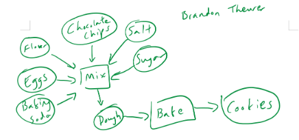

<!-- We sketched models of a cookie and put them in the shared class Google Doc. Let's look at a few of them side by side. Some sketches list every ingredient as its own node; others collapse the dry ingredients into one. Ask the class which sketch they would rather hand to someone else, and why. The answer we are steering toward: a model is a communication device as much as an automation device, and every extra node is something else that can break. -->

---

<!-- _class: quiz -->

# Cities Near Rivers: how many ways?

- **Option 1:** Buffer + Intersect — what we built in Part A
- **Option 2:** **Select Layer By Location**, "within a distance of"
- **Option 3?** There is always another way…
  - Convert the rivers to raster and work in cell space?
  - Use the **Near** tool and then select on the resulting distance field?

Which one would you put in a model you have to hand to someone else, and why?

<!-- Discussion slide, not a lookup. Push on the trade-offs: Buffer + Intersect creates real intermediate data you can inspect, which is good for teaching and bad for disk space. Select Layer By Location is one node instead of two but leaves you with a selection rather than a feature class. Near writes a distance field onto the input, which is a side effect. The point is that "correct" is not the same as "smallest", and neither is the same as "easiest to explain". -->

<!-- TODO(graphic): a side-by-side of the same answer produced three ways (Buffer+Intersect, Select Layer By Location, Near) would make this slide land; needs a real ArcGIS Pro capture. -->

---

<!-- _class: lead -->

# First, three things that will save you an hour

---

# Get the output onto the map

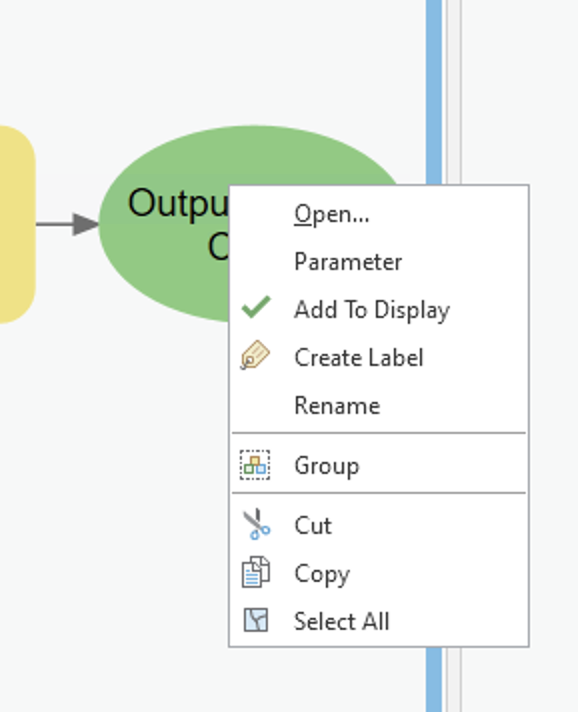

- Running a model does **not** put its results in your map by default
- Right-click the **output data** element you care about and check **Add To Display**
- Do this for the final output; leave the intermediate data unchecked so your **Contents** pane stays readable
- The check mark sticks with the model, so it applies every time the model runs

<!-- This is the single most common "my model did nothing" complaint. The model ran fine; the output just went to the geodatabase without being added to the map. Show the check mark going on and off. -->

---

# A gray node means a missing parameter

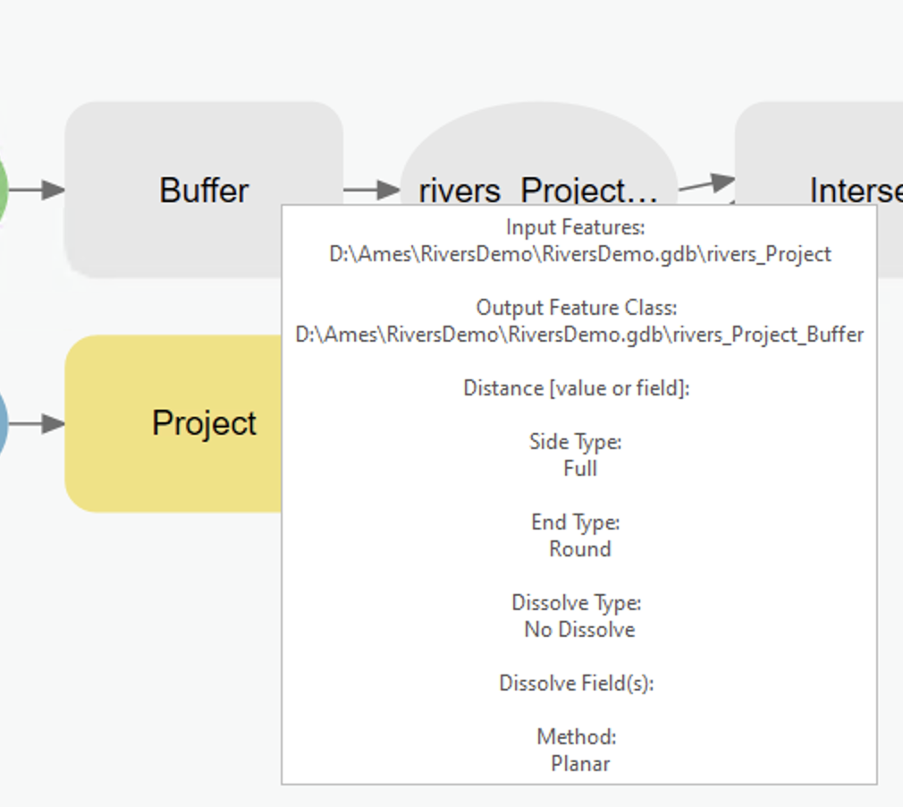

- If a tool or its output is **gray**, the model is not ready to run
- Hover the node: the tooltip lists what the tool is set to, and what is still blank
- Here the **Buffer** distance has no value, so **Buffer** and everything downstream of it stay gray

<!-- Colored means ready: blue ovals are input data, yellow rectangles are tools, green ovals are output data. Gray means "not ready", and it propagates downstream, so always fix the leftmost gray node first. Hovering gives you the whole parameter list without opening the tool. -->

---

# Test one piece at a time

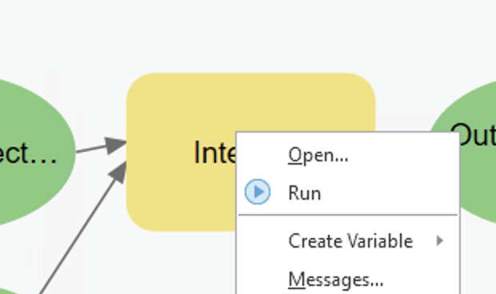

- You do not have to run the whole model to test one step
- Right-click the tool you want to check and choose **Run**
- ModelBuilder runs that tool and everything it depends on, and stops
- **Messages…** on the same menu shows what the tool actually reported

<!-- Build and debug incrementally. A five tool model that you only ever run end to end takes five times as long to debug. Point out Messages: that is where the real error text lives, not in the canvas. -->

---

# Rename your elements

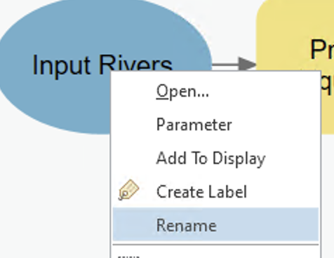

Right-click an element and choose **Rename**. Default names, then better names:

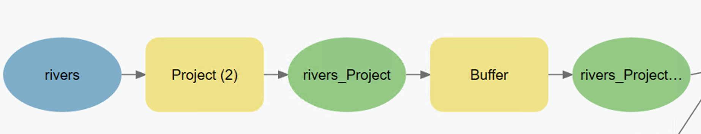

<!-- Compare the two strips. "rivers_Project_Buffer" tells you which tools ran. "Areas Near Rivers" tells you what the data means. The second one is what you want on a canvas someone else has to read, and it is also what shows up as the parameter label when the model is run as a tool. Renaming an element does not rename the data on disk. -->

---

<!-- _class: lead -->

# Working with parameters

## Turning a canvas into a tool

---

# Mark a variable as a parameter

- Any data variable in your model can be made a **parameter**
- Right-click the element and click **Parameter**
- A letter **P** next to the element marks it
- This tells ArcGIS Pro to treat that variable as an **input the user supplies** when the model is run directly, instead of a value baked into the model

<!-- This is the hinge of the whole lecture. Without parameters, a model is a recording of one specific analysis. With parameters, it is a tool. Toggle the P on and off so they see the marker appear. -->

---

# Now the model opens ready to run

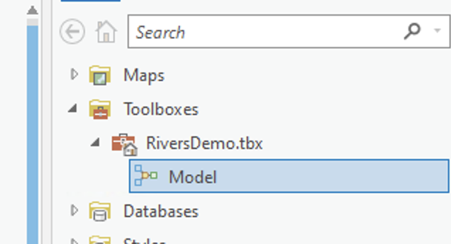

- Find the model in the **Catalog** pane under **Toolboxes**
- **Double-click** it — you get a tool dialog, not the canvas

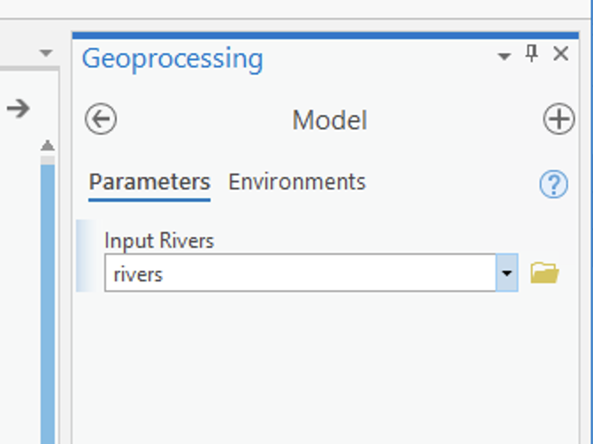

- The **Geoprocessing** pane shows one box per parameter
- Labels are the names you gave the elements, already filled in with the values you set

<!-- Double-click runs the model as a tool; right-click and Edit opens the canvas. Students mix these two up constantly. Note that the parameter label reads "Input Rivers" because that is what we renamed the element to on the previous slide — renaming and parameterizing pay off together. The screenshot shows a .tbx toolbox; new projects in current ArcGIS Pro create .atbx toolboxes, which behave the same way here. -->

---

# Two parameters, two inputs

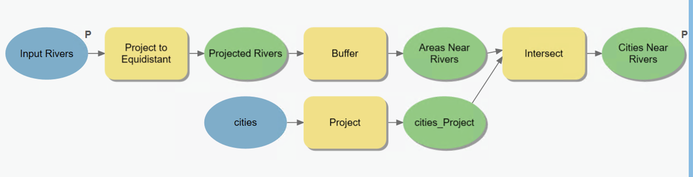

- Mark **both** the rivers input and the final output as parameters
- The **P** markers show which elements the user will be asked for

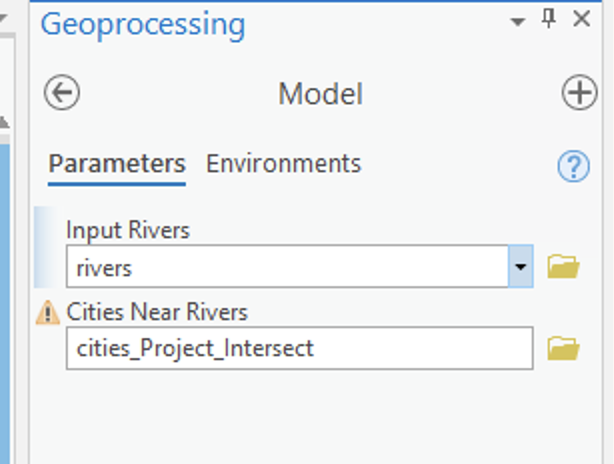

<!-- Left to right: Input Rivers is a P because the user chooses which rivers; Cities Near Rivers is a P because the user chooses where the answer gets written. The warning triangle on the output just means that feature class already exists and will be overwritten. Everything without a P stays fixed inside the model. -->

---

# Create a variable from a tool parameter

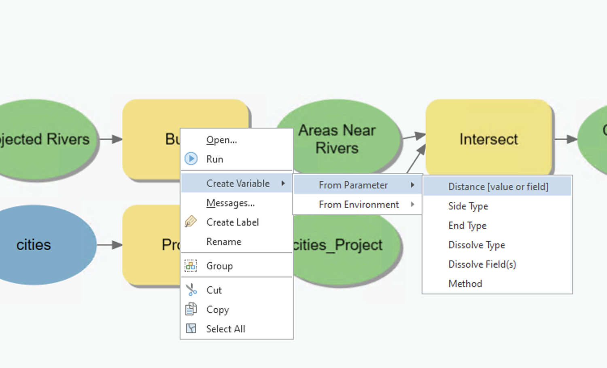

<!-- Sometimes the thing you want the user to control is not a dataset but a setting inside a tool: here, the Buffer distance. Right-click the tool, choose Create Variable, then From Parameter, then pick the setting you want to pull out - Distance [value or field]. The submenu is exactly the Buffer tool's own parameter list, so what you can expose depends on the tool. -->

---

# Then make that variable a parameter

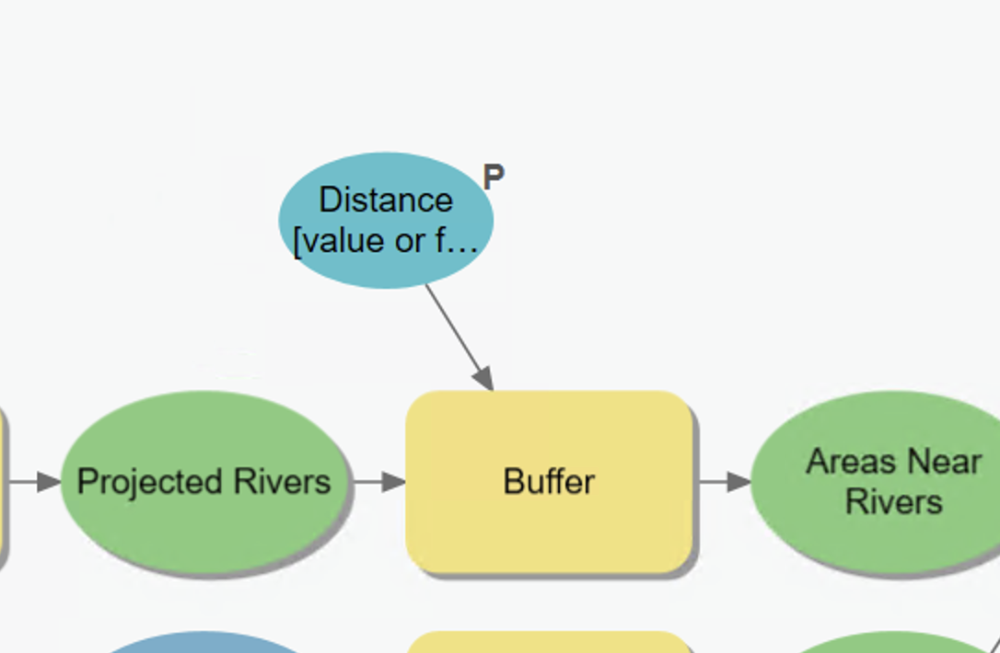

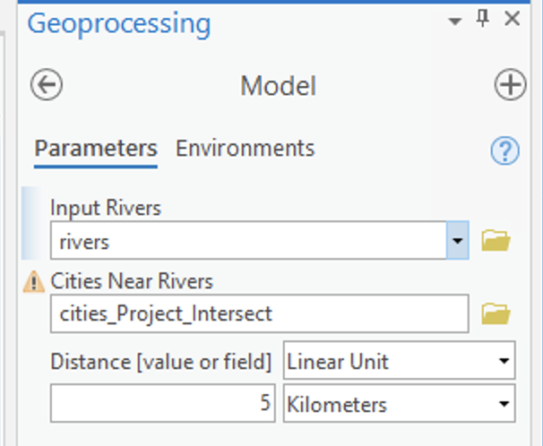

The distance is now a **P** on the canvas, and a third box on the tool dialog — units and all.

<!-- The new variable appears as its own oval wired into Buffer. Right-click it, click Parameter, and it joins the other two on the dialog as a Linear Unit with its own units dropdown. Now the same model answers "cities within 5 km" and "cities within 25 km" without anyone opening the canvas. This is the payoff: three parameters, one reusable tool. -->

---

<!-- _class: lead -->

# Documenting your model

---

# Metadata documentation

Writing metadata for your model helps you:

- **Remember** what it does and how it works, next semester
- **Share** it with your friends and neighbors — and with a grader

How do you do it?

- Right-click the model in the **Catalog** pane and choose **Edit Metadata**

<!-- Un-documented models are write-only. Six months later you will not remember which of the three buffers mattered. Make the case that metadata is part of the deliverable, not an extra. -->

<!-- TODO(instructor): verify the exact context-menu wording in the ArcGIS Pro version you teach on - current builds show "Edit Metadata" on the item's right-click menu; older builds nested it as Metadata > Edit. -->

<!-- TODO(graphic): no capture exists of the model's right-click menu in the Catalog pane showing Edit Metadata; one screenshot would settle both this slide and the wording question above. -->

---

# Edit metadata documentation

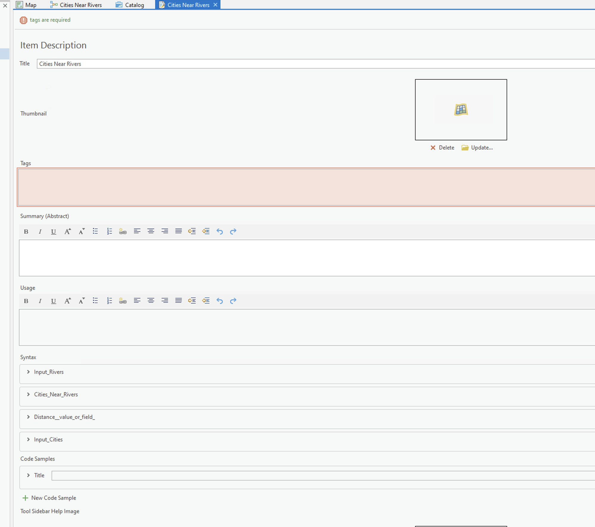

- **Title** — a name a stranger would understand
- **Tags** — required; the editor flags it in red until you fill it in
- **Summary** and **Usage** — what it does, and when to use it
- Under **Syntax**, expand each parameter and write one line explaining it

<!-- This is the Item Description metadata style, which is the default and is plenty for a class model. Point at the red Tags box: the editor will not let you finish without at least one tag. The four entries under Syntax are exactly the parameters we created - Input_Rivers, Cities_Near_Rivers, Distance__value_or_field_, Input_Cities - so the parameter names you chose become the documentation headings. -->

---

# View metadata documentation

- What you typed comes back as a formatted tool help page
- The **Syntax** line is generated from your parameters, in order
- Blank entries show as "There is no explanation for this parameter" — that is the checklist of what you still owe

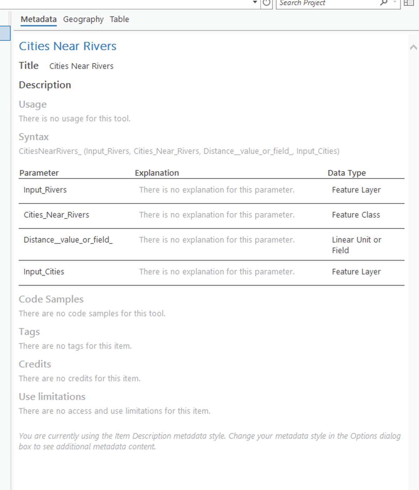

<!-- Compare this against the help page of any built-in ArcGIS Pro tool: same layout, same sections. That is the standard your model is being held to. Every gray "There is no ..." line in this screenshot is a gap the author left. -->

---

# Going forward: build a tool interface for all your models

- Every analysis you repeat is a candidate for a model
- Parameters plus metadata turn it into something you can hand to a colleague, or to yourself next year
- Here the same pattern wraps a watershed delineation: a list of input rasters, an output, and a threshold

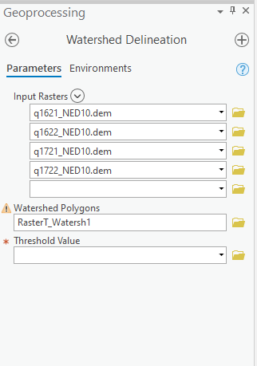

<!-- The habit to leave them with: whenever you catch yourself doing the same five clicks twice, build the model, expose the two or three things that actually change, and write the metadata while you still remember it. -->

---

# Before Next Class

- Finish [Lab 1](https://byu-hydroinformatics.github.io/ce414-gis-applications/assignments/lab-01/) — bring questions about your model to the next session
- Read the assigned textbook chapter <!-- TODO(instructor): reading chapter -->
- Take the open-book quiz on **Learning Suite**
- Questions? Office hours: [calendly.com/dan-ames/office-hours](https://calendly.com/dan-ames/office-hours)

<!-- Fill in the reading chapter and the quiz due date before class. Remind them that the lab deliverable includes the model metadata, not just the map. -->

<!-- TODO(graphic): closing administrative slide, no graphic. -->

<!--
Conversion notes (2026-09-03):
- Source: "CE 414 Week 2 - ModelBuilder B.pptx" (13 slides) from
  /Users/dan/ames-sync/Work/Teaching/CE 414 Engineering Applications of GIS/Lectures/2026/.
  13 source slides -> 20 converted slides. Nothing was cut for content.
- Structure changes: added a title slide, a Today's Goals slide (with the one-line Part A recap),
  two lead section dividers, and a Before Next Class slide. Source slide 4 ("Things to remember",
  three bullets and three screenshots at thumbnail size) was split into three slides so each
  screenshot is legible. Source slides 8 and 9 were each re-cut across two slides for the same
  reason.
- Images: all 19 raster images from the source deck are used, prefixed mbb-. image1.emf (the BYU
  seal on the title slide) was dropped - EMF does not render in a browser and the lead title slide
  does not need it. mbb-model-two-parameters.png and mbb-edit-metadata-item-description.png were
  downscaled to 2000 px wide; the metadata editor shot was also cropped 140 px off the left to
  remove a sliver of an adjacent pane. No image was generated or altered otherwise.
- Screenshots: these are current ArcGIS Pro captures from the RiversDemo project and are the
  quality bar for the ModelBuilder sequence - none need a re-shoot. Two small age markers worth
  knowing about: the Catalog pane screenshot shows a .tbx toolbox (current Pro creates .atbx by
  default; behavior here is identical), and the model canvas screenshots predate any Pro theme
  change. Both are noted in the speaker notes rather than flagged as defects.
- Wording brought up to date: "ArcGIS" -> "ArcGIS Pro"; "toolbox" -> "the Catalog pane under
  Toolboxes"; source slide 10's "choose Metadata / Edit" -> "choose Edit Metadata"; menu labels
  matched to the deck's own screenshots (Add To Display, Parameter, Rename, Run, Messages...,
  Create Variable > From Parameter). The ArcGIS 9 workshop-abstract language in the source title
  slide's speaker notes was rewritten for ArcGIS Pro.
- TODOs left in place (no AI images were generated in this pass):
  - TODO(graphic) on "Cities Near Rivers: how many ways?" - needs a real three-way comparison
    capture, which does not exist yet.
  - TODO(graphic) on "Metadata documentation" - no capture exists of the model's right-click menu
    in the Catalog pane. The "View metadata" screenshot was deliberately NOT reused here, so that
    slide is text-only, matching source slide 10 which also had no image.
  - TODO(graphic) on "Before Next Class" - closing administrative slide.
  - TODO(instructor) on the metadata slide - confirm the right-click wording ("Edit Metadata")
    in the Pro version taught this semester.
  - TODO(instructor) on Before Next Class - the textbook reading chapter.
- Not verified in ArcGIS Pro by the converter: every UI claim on these slides is read off the
  deck's own screenshots, not from a live session.
-->
