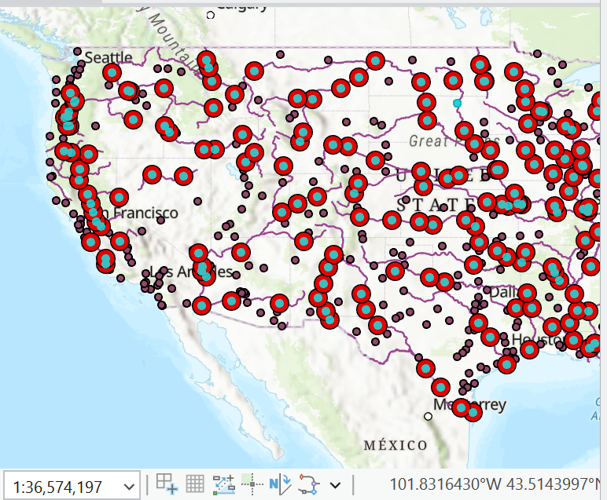
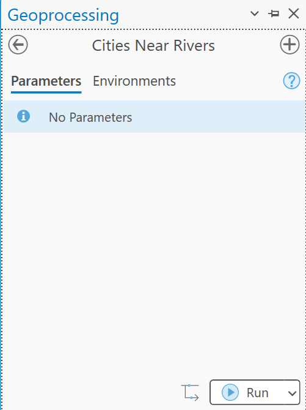
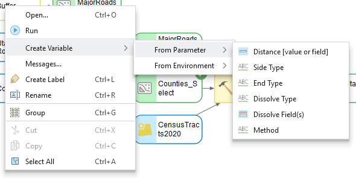
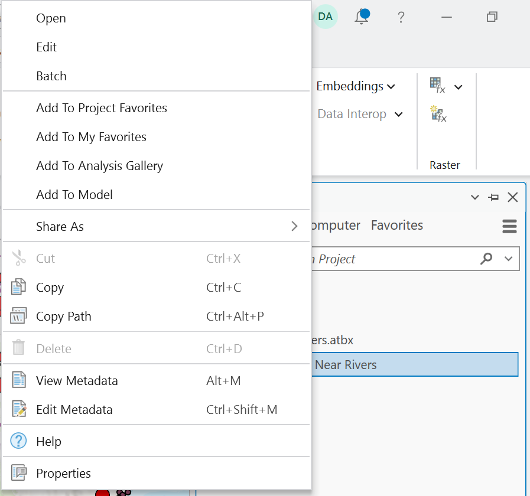
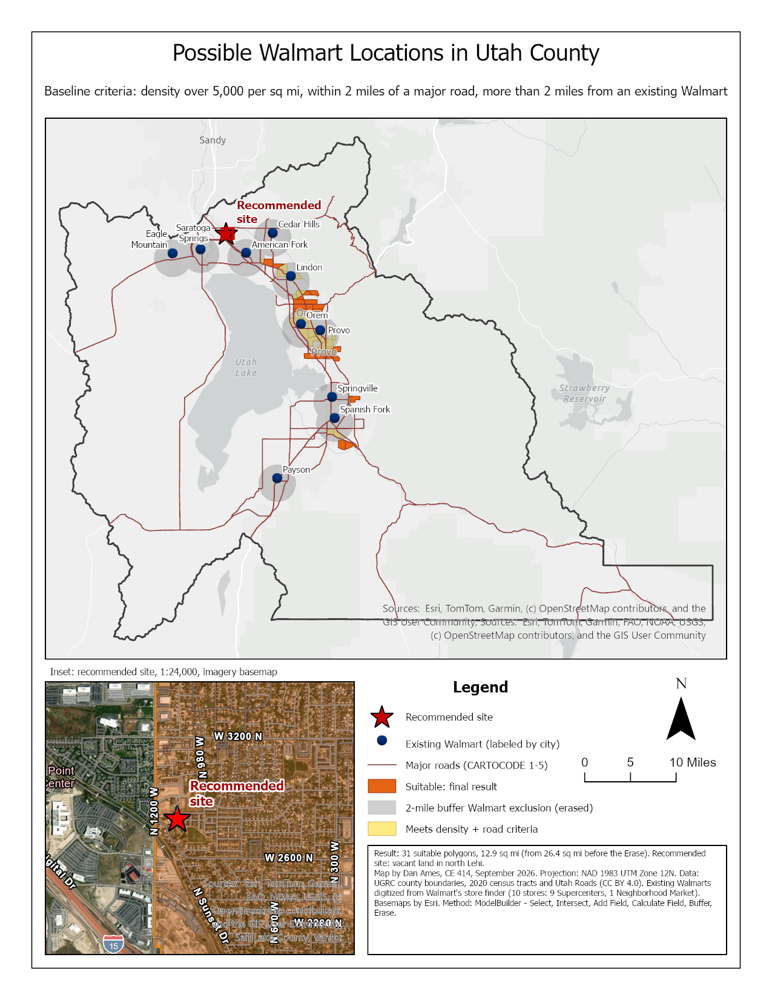
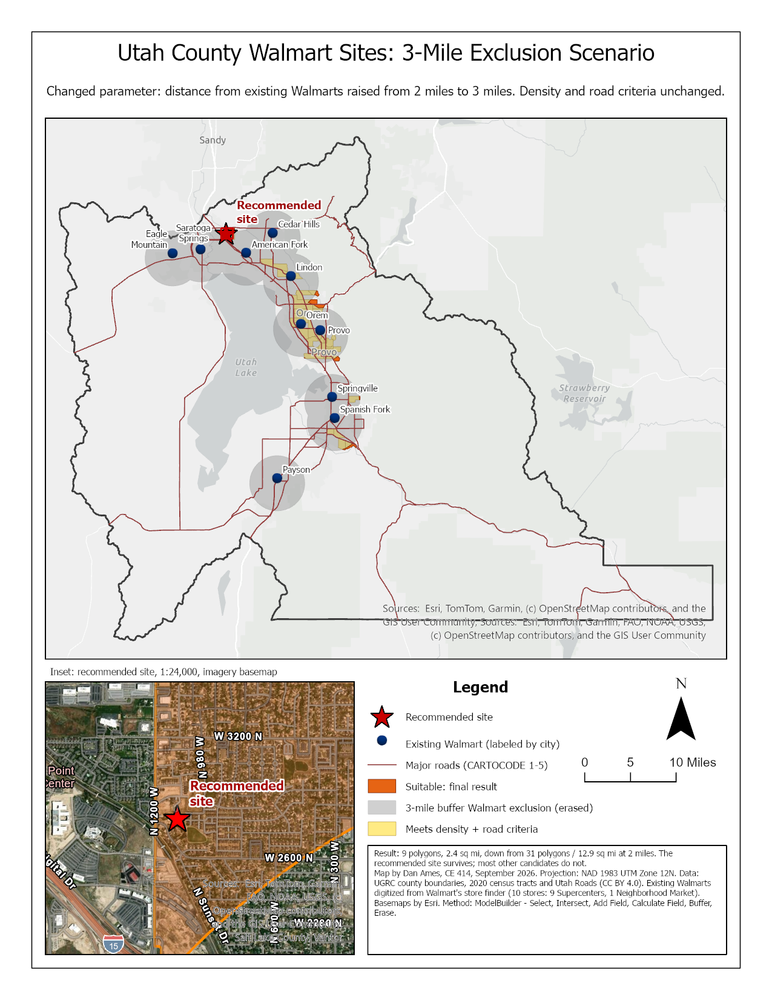

<!-- _class: lead -->
<!-- _paginate: skip -->

# Spatial Modeling and ArcGIS ModelBuilder — Part B

CE 414 Engineering Applications of GIS
Civil & Construction Engineering, Brigham Young University

Dr. Dan Ames

<!-- Part B of the ModelBuilder sequence. Part A got a working model on the canvas; today we make it readable, make it reusable, and document it, and then we spend the last third of class on Lab 1: what the rubric rewards, what a complete submission looks like, how to know whether your answer is right, and how peer review works. -->

---

# Today's Goals

Part A built the **Cities Near Rivers** model and ran it. By the end of class you should be able to:

- Judge when a **smaller** model is the better model
- Get output onto the map, debug a gray element, **rename** elements
- Turn a model variable into a **parameter** so the model runs as a tool
- Write **metadata** so someone else can use your model
- Read the **Lab 1 rubric** and know what each part rewards
- Give, and act on, a **peer review**

<!-- Set expectations: nothing new gets added to the analysis today. Everything on this list is about turning a canvas that only you can run into a tool that anyone can run, and then about finishing Lab 1 well. -->

---

<!-- _class: quiz -->

# Cookie model review

- Is a **bigger** model better?
- What is the value of a **smaller** model?
  - Speed?
  - Easiness to understand, and to explain?
  - Less buggy?
- How can you make a smaller model?

<!-- Everyone brought a sketch. Put three or four of them side by side on the document camera or the shared doc. Some list every ingredient as its own node; others collapse the dry ingredients into one. Ask the class which sketch they would rather hand to someone else, and why. The answer we are steering toward: a model is a communication device as much as an automation device, and every extra node is something else that can break. -->

---

# The same cookie, drawn the ModelBuilder way

flour
sugar
eggs
butter

→
Mix
→
dough
→
Bake <small>350 °F, 11 min</small>
→
<strong>cookies</strong>

- Four **inputs** (blue), two **tools** (yellow), one **intermediate** dataset and one **output** (green)
- The oven temperature and time are **settings inside a tool** — the kind of thing Step 10 of Lab 1 pulls out as a parameter
- Try it live: in ArcGIS Pro, four small tables, **Merge** renamed *Mix*, **Copy Rows** renamed *Bake*, every element renamed

<!-- This is the tidy version of the sketches, drawn with ModelBuilder's colors. Build it live if there is time: create four empty tables in the project geodatabase, drag them onto a new model, add Merge and rename it Mix, add Copy Rows and rename it Bake, rename the outputs dough and cookies, and run it. The tools are stand-ins; the vocabulary is the point: data, tool, derived data, connector, and a setting that could become a parameter. -->

---

<!-- _class: quiz -->

# Cities Near Rivers: how many ways?

- **Option 1:** Buffer + Intersect — what we built in Part A: **256** cities
- **Option 2:** **Select Layer By Location**, *within a distance geodesic* of the rivers: **257** cities
- **Option 3?** There is always another way — the **Near** tool and a selection on its distance field, or rasterize and work in cell space

Which one would you put in a model you have to hand to someone else — and why are the two counts different?

<!-- Discussion slide, not a lookup. Buffer + Intersect creates real intermediate data you can inspect, which is good for teaching and bad for disk space. Select Layer By Location is one node instead of two but leaves you with a selection rather than a feature class. Near writes a distance field onto the input, which is a side effect. The counts differ by one because Option 1 measured 10 miles on a projected plane and Option 2 measured it geodesically; one city sits right at the edge. "Correct" is not the same as "smallest", and neither is the same as "easiest to explain". -->

---

<!-- _class: lead -->

# First, three things that will save you an hour

---

# Get the output onto the map

- Running a model does **not** put its results in your map by default
- Right-click the **output data** element you care about and check **Add To Display**
- Do this for the final output; leave the intermediate data unchecked so your **Contents** pane stays readable
- The check mark sticks with the model, so it applies every time the model runs

<!-- This is the single most common "my model did nothing" complaint. The model ran fine; the output just went to the geodatabase without being added to the map. Show the check mark going on and off. -->

---

# A gray element means a missing parameter

- If a tool or its output is **gray**, the model is not ready to run
- Hover the element: the tooltip lists what the tool is set to, and what is still blank
- Here the **Buffer** distance has no value, so **Buffer** and everything downstream of it stay gray

<!-- Colored means ready: blue ovals are input data, yellow rectangles are tools, green ovals are output data. Gray means "not ready", and it propagates downstream, so always fix the leftmost gray element first. Hovering gives you the whole parameter list without opening the tool. -->

---

# Test one piece at a time

- You do not have to run the whole model to test one step
- Right-click the tool you want to check and choose **Run**
- ModelBuilder runs that tool and everything it depends on, and stops
- **Messages…** on the same menu shows what the tool actually reported

<!-- Build and debug incrementally. A five tool model that you only ever run end to end takes five times as long to debug. Point out Messages: that is where the real error text lives, not in the canvas. -->

---

# Rename your elements

Right-click an element and choose **Rename**. Default names, then better names:

<!-- Compare the two strips. "rivers_Project_Buffer" tells you which tools ran. "Areas Near Rivers" tells you what the data means. The second one is what you want on a canvas someone else has to read, and it is also what shows up as the parameter label when the model is run as a tool. Renaming an element does not rename the data on disk, and it does not rename the model itself; the model's Name lives in Properties, General. -->

---

<!-- _class: lead -->

# Working with parameters

## Turning a canvas into a tool

---

# Without parameters, a model is a recording

- Double-click the Cities Near Rivers model in the Catalog pane and this is what opens: a tool dialog with **No Parameters**
- Everything is baked in — which rivers, which cities, which distance
- It will run, and it will produce the same answer every time
- To make it answer a *different* question, someone has to open the canvas

<!-- This is the hinge of the whole lecture, and it is what Part A's model looks like as a tool: nothing to fill in. Without parameters, a model is a recording of one specific analysis. With parameters, it is a tool. -->

---

# Mark a variable as a parameter

- Any data variable in your model can be made a **parameter**
- Right-click the element and click **Parameter**
- A letter **P** next to the element marks it
- This tells ArcGIS Pro to treat that variable as an **input the user supplies** when the model is run directly, instead of a value baked into the model

<!-- Toggle the P on and off so they see the marker appear. This is Lab 1 Step 10 and Lab 2 Step 4. -->

---

# Now the model opens ready to run

- Find the model in the **Catalog** pane under **Toolboxes**
- **Double-click** it — you get a tool dialog, not the canvas

- The **Geoprocessing** pane shows one box per parameter
- Labels are the names you gave the elements, already filled in with the values you set

<!-- Double-click runs the model as a tool; right-click and Edit opens the canvas. Students mix these two up constantly. Note that the parameter label reads "Input Rivers" because that is what we renamed the element to on the previous slide - renaming and parameterizing pay off together. The screenshot shows a .tbx toolbox; new projects in current ArcGIS Pro create .atbx toolboxes, which behave the same way here. -->

---

# Two parameters, two inputs

- Mark **both** the rivers input and the final output as parameters
- The **P** markers show which elements the user will be asked for

<!-- Left to right: Input Rivers is a P because the user chooses which rivers; Cities Near Rivers is a P because the user chooses where the answer gets written. The warning triangle on the output just means that feature class already exists and will be overwritten. Everything without a P stays fixed inside the model. -->

---

# Create a variable from a tool parameter — the same move in your lab

**Cities Near Rivers** — Buffer ▸ Create Variable ▸ From Parameter ▸ *Distance*

**Lab 1, Step 10** — the same menu on the road buffer

<!-- Sometimes the thing you want the user to control is not a dataset but a setting inside a tool: here, the Buffer distance. Right-click the tool, choose Create Variable, then From Parameter, then pick the setting you want to pull out. The submenu is exactly the Buffer tool's own parameter list, so what you can expose depends on the tool. The right-hand capture is from the Lab 1 run: identical move, identical menu. -->

---

# Then make that variable a parameter

The distance is now a **P** on the canvas, and a third box on the tool dialog — units and all. Lab 2 does the same with a **Double** variable and a Raster Calculator expression.

<!-- The new variable appears as its own oval wired into Buffer. Right-click it, click Parameter, and it joins the other two on the dialog as a Linear Unit with its own units dropdown. Now the same model answers "cities within 5 km" and "cities within 25 km" without anyone opening the canvas. This is the payoff: three parameters, one reusable tool. -->

---

<!-- _class: lead -->

# Documenting your model

---

# Metadata documentation

Writing metadata for your model helps you:

- **Remember** what it does and how it works, next semester
- **Share** it with your friends and neighbors — and with a grader

How do you do it?

- Right-click the model in the **Catalog** pane and choose **Edit Metadata** (Ctrl+Shift+M)

<!-- Un-documented models are write-only. Six months later you will not remember which of the three buffers mattered. Make the case that metadata is part of the deliverable, not an extra. The menu on the right is Pro 3.7.1's: Edit Metadata is the exact label, with View Metadata just above it. -->

---

# Edit metadata documentation

- **Title** — a name a stranger would understand
- **Tags** — required; the editor flags it in red until you fill it in
- **Summary** and **Usage** — what it does, and when to use it
- Under **Syntax**, expand each parameter and write one line explaining it

<!-- This is the Item Description metadata style, which is the default and is plenty for a class model. Point at the red Tags box: the editor will not let you finish without at least one tag. The four entries under Syntax are exactly the parameters we created - Input_Rivers, Cities_Near_Rivers, Distance__value_or_field_, Input_Cities - so the parameter names you chose become the documentation headings. -->

---

# View metadata documentation

- What you typed comes back as a formatted tool help page
- The **Syntax** line is generated from your parameters, in order
- Blank entries show as "There is no explanation for this parameter" — that is the checklist of what you still owe

<!-- Compare this against the help page of any built-in ArcGIS Pro tool: same layout, same sections. That is the standard your model is being held to. Every gray "There is no ..." line in this screenshot is a gap the author left. -->

---

<!-- _class: lead -->

# Lab 1 clinic

## The rubric, a complete submission, checking your answer, peer review

---

# What the rubric rewards

Write-up · 10
Recommended site and why (3) · requirements and approach (2) · how you made the Walmart points and why you trust them (2) · which criteria narrowed the result (1) · peer reviewer named (1) · clear writing, rubric pasted in (1)

Model · 10
Runs from its dialog, counts match the check values (4) · full-page model figure, readable (2) · tool-dialog capture with the two distances exposed (2) · a description a reader could repeat from (2)

Map 1 · 10
Baseline: title, north arrow, scale bar (1) · text box with author, date, projection (1) · Walmarts and proposed sites labeled (2) · suitability layer shown (2) · recommended site marked (1) · inset (1) · basemap and legibility (2)

Map 2 · 10
One Step 12 scenario: the same map elements (6) · the scenario's suitability layer (2) · title and text box say what changed, to what, and why this run (2)

Sensitivity · 10
Table of at least three more runs with counts and areas (4) · which parameter matters most (2) · does any setting eliminate every site (2) · does your site survive every scenario (2)

<strong>50 points.</strong> Five parts, ten each. You grade yourself first, in the rubric you paste into the report.

<!-- Every number here is copied from the rubric at the bottom of the Lab 1 page. Two things to point at. First, the model is worth as much as either map, and half of its points are "the counts match the check values": the lab gives you numbers to check against, so use them. Second, the self-assessment is not optional; the grader compares your scores with theirs. -->

---

# A complete submission looks like this

**Report, 2 to 3 pages, containing:**

- Requirements and your approach
- **One** model figure, exported from ModelBuilder (*Export ▸ Export To Graphic*), and **one** capture of its tool dialog
- How you made the Walmart points, and why you trust them
- The sensitivity table and answers to its three questions
- Your recommendation and why
- The rubric, with your score in every row
- Your peer reviewer's name, and what you changed

**Plus two full-page maps**, the baseline and one scenario.

The example map is not a template: yours will differ, because your stores and your runs differ.

<!-- The map on the left is the example baseline layout from the Lab 1 page, built from the same run the check values come from. Walk the list: it is the Deliverables section of the lab, in order. The thing students most often leave out is the model description; the thing they most often get wrong is a screenshot of the canvas at 40 percent zoom instead of an export. -->

---

# What a publication-quality map has

1. **Title** that says what and where — and, on the scenario map, what changed
2. **Legend** with names a stranger understands, not layer names
3. **North arrow** and a **scale bar** in the units your reader uses
4. **Inset** with an extent box, for the part that matters
5. **Text box**: result in numbers, author, date, projection, data sources, method
6. **Reference features**: county outline, labeled cities, existing stores
7. A **basemap** that stays in the background
8. Everything **legible when printed** on one page

<!-- Point at each element on the example as you go: the title with the threshold in it; the legend that says "Irrigated cropland", not "NDVI_reclass"; the inset at Elberta with its red extent box; the text box that admits how much of the county the class covers. The rubric's map rows are exactly this list. -->

---

# Is the answer right?

**Baseline** — 2 miles from a Walmart

**Scenario** — 3 miles from a Walmart

- **Check values:** 1,532 road segments, 47 dense tracts, about 12.9 square miles after the erase. A different number means a unit, an environment, or a field type went wrong
- **Did each criterion change anything?** In Utah County the road buffer removes nothing; say so, with counts
- **Vary the numbers** (Step 12): a recommendation that survives every scenario is worth more than one that appears in only one

<!-- The Learning Suite entry for today promised "how accurate are the results, how can we validate the model." The honest answer has three parts. Against the check values, which catch mechanical errors. Against your own criteria, which asks whether each one earned its place. And against the scenarios, which is the only real test of whether the recommendation is robust. The two maps are the lab's example pair: same model, one number changed. -->

---

# Peer review, how to do it

1. **Swap** reports with someone, in class or by Friday
2. **Read against the rubric**, row by row, and write down **three things to fix**
3. The author **fixes them**, names the reviewer in the report, and says in one sentence what changed

<!-- The lab requires this: a named reviewer and a sentence on what changed. Pair people up now if there is time. Reviewing against the rubric is the point; "looks good" is not a review. A report nobody else has read is a draft. -->

<!-- TODO(instructor): a one-slide look at an anonymized prior-year report page was planned here ("the analysis is the same, the deliverables are different"). No prior-year PDF is on this machine; supply an anonymized page and it can be added as a slide with a one-line caption. -->

---

# Going forward: build a tool interface for all your models

- Every analysis you repeat is a candidate for a model
- Parameters plus metadata turn it into something you can hand to a colleague, or to yourself next year
- Here the same pattern wraps a watershed delineation: a list of input rasters, an output, and a threshold

<!-- The habit to leave them with: whenever you catch yourself doing the same five clicks twice, build the model, expose the two or three things that actually change, and write the metadata while you still remember it. -->

---

# Before Next Class

- Finish [Lab 1](https://byu-hydroinformatics.github.io/ce414-gis-applications/assignments/lab-01/) by **Saturday 11:59 pm** — get your peer review done before the deadline, not the night of it
- Read **Chapter 13** of *GIS Fundamentals* (Cartographic Models and Modeling)
- Take **Quiz 2** (open book) on **Learning Suite** — due **Saturday 11:59 pm**
- Questions? Office hours: [calendly.com/dan-ames/office-hours](https://calendly.com/dan-ames/office-hours)

<!-- Remind them that the lab deliverable includes the model description and the self-assessed rubric, not just the maps. -->

<!--
Revision notes (2026-09-07): Part B revised against slides/week-02/LECTURE_PLAN.md. 20 slides -> 30.
- Kept every RiversDemo capture from the Sept 3 conversion; they remain the quality bar.
- New ArcGIS Pro 3.7.1 captures (Sept 7, 175 % scaling, C:\Ames\Week02\CitiesRivers.aprx): the Catalog
  right-click menu showing Edit Metadata (closes the wording TODO), the model opened as a tool with No
  Parameters, and Select Layer By Location with its map (257 geodesic vs 256 projected, the
  "how many ways" discussion).
- New slides: the tidy cookie model (HTML diagram in ModelBuilder colors; a real-canvas version was
  attempted and abandoned, the speaker notes say how to build it live), "Without parameters, a model
  is a recording", and the five-slide Lab 1 clinic: rubric strip (values copied from the lab page),
  complete submission, publication-quality map, is the answer right, peer review.
- Reused from Lab 1 (copied with mbb- prefixes): the two example maps, the Create Variable menu.
- Infographic: mbb-peer-review.png (OpenAI gpt-image-1, medium). A generated rubric strip was rejected
  because it invented scores; the rubric is HTML with the real point values.
- Still open: reading chapter, quiz date, Lab 1 due date, and the anonymized prior-year page.
-->
