<!-- _class: lead -->
<!-- _paginate: skip -->

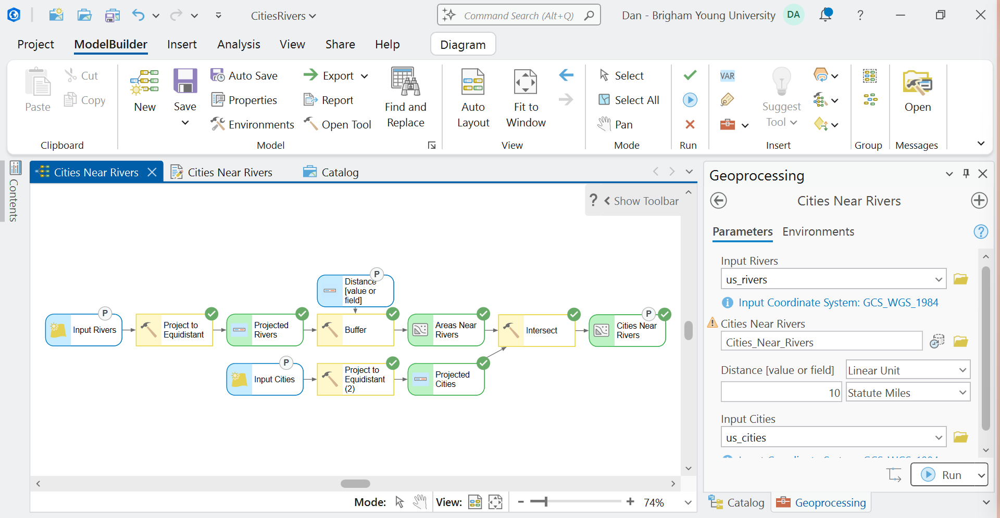

# Spatial Modeling and ArcGIS ModelBuilder — Part B

CE 414 Engineering Applications of GIS
Civil & Construction Engineering, Brigham Young University

Dr. Dan Ames

<!-- Part B of the ModelBuilder sequence. Part A got a working model on the canvas; today we make it readable, make it reusable, and document it, and then we spend the last third of class on Lab 1: what the rubric rewards, what a complete submission looks like, how to know whether your answer is right, and how peer review works. The window on the right is where we end up: the Cities Near Rivers model with four P markers, and the tool dialog those four parameters produce, side by side in ArcGIS Pro 3.7. -->

---

# Today's Goals

Part A built the **Cities Near Rivers** model and ran it. By the end of class you should be able to:

- Judge when a **smaller** model is the better model
- Get output onto the map, debug a gray element, **rename** elements
- Turn a model variable into a **parameter** so the model runs as a tool
- Write **metadata** so someone else can use your model
- Read the **Lab 1 rubric** and know what each part rewards
- Give, and act on, a **peer review**

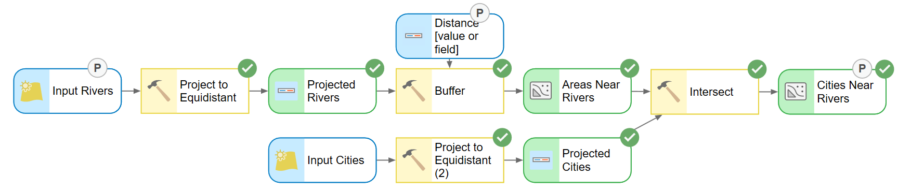

<!-- Set expectations: nothing new gets added to the analysis today. Everything on this list is about turning a canvas that only you can run into a tool that anyone can run, and then about finishing Lab 1 well. The strip is where the model will be by the middle of class: readable names and three P markers. -->

---

<!-- _class: activity -->

# Model a cookie

- Get out a piece of paper, look at the cookie sitting in front of you, think about the recipe, and try to build a **ModelBuilder-style model** showing the process of building that cookie
- **Don't eat the cookie**
- Once you've completed your model, **write your name** on your paper, **take a picture** of it, and **submit it on Learning Suite** for today's in-class activity

<!-- Hand out the cookies first, then put this up. Ten minutes. Blue ovals for ingredients, yellow boxes for what you do to them, green ovals for what comes out: that is the only rule. Walk the room and look for two things, someone who drew one box called "make cookies" and someone who is still drawing the wheat field; both go on the document camera for the next slide. The picture goes to Learning Suite by 9:30 am, fifteen minutes after class. -->

---

# Cookie model review

- Is a **bigger** model better?
- What is a **smaller** model good for? Speed? Easier to explain? Fewer things to break?
- What does the **big** one give you that the small one cannot?

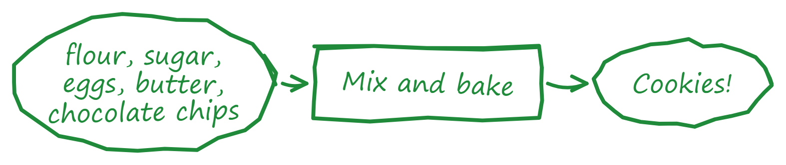

One tool. Still a model.

Two tools: the sketch most people draw

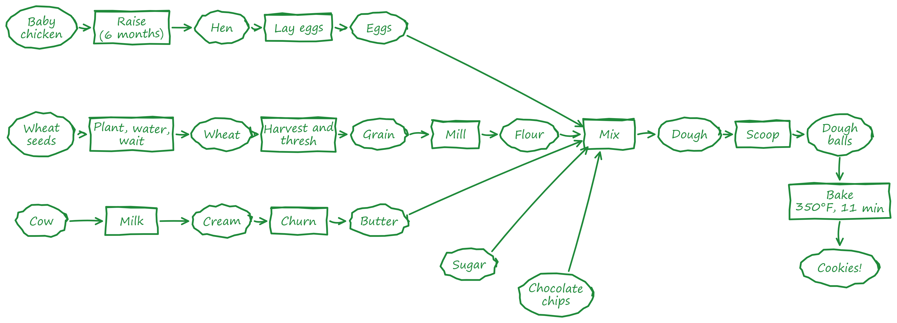

Eleven tools, back to the chick and the wheat seed

<!-- Three sketches of the same cookie. The one-tool version is a legitimate model: it says what goes in and what comes out and hides everything else, which is exactly what you want when the recipe is not the question. The middle one is what most of the room drew. The long one starts from a baby chicken and a wheat seed and names every intermediate product; it is not wrong either, and it is the one you want when a step might change (a different flour), when someone has to check your work, or when you need to reuse a piece (the flour chain is a model of its own). Ask which one they would hand to a stranger, and which one they would hand to an auditor. The answer we are steering toward: a model is a communication device as much as an automation device, the right size depends on who has to read it, and every extra node is something else that can break. -->

<!-- Figures: the one-tool and eleven-tool sketches are drawn by tools/week02_cookie_sketches.py in the style of the student sketch in the middle (green marker, ovals and boxes, handwriting font, rendered to PNG). -->

---

# The same cookie, drawn the ModelBuilder way

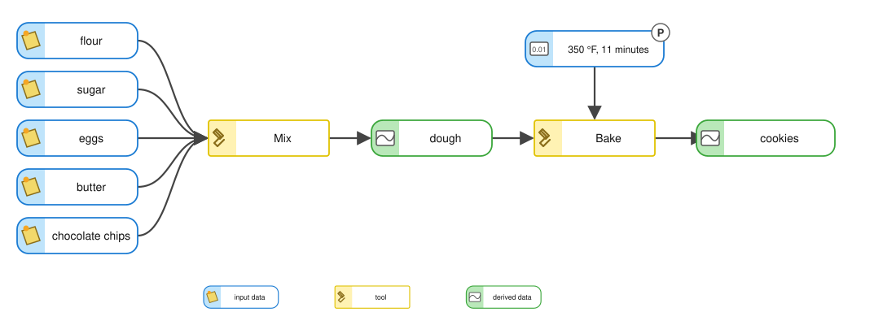

- Five **inputs** (blue), two **tools** (yellow), one **intermediate** dataset and one **output** (green), drawn the way ArcGIS Pro 3.7 draws them
- The oven temperature and time are a **setting inside Bake**, pulled out as its own variable with a **P**: exactly what Step 10 of Lab 1 does to the buffer distance
- Try it live: in ArcGIS Pro, five small tables, **Merge** renamed *Mix*, **Copy Rows** renamed *Bake*, every element renamed

<!-- This is the middle sketch redrawn in ModelBuilder's own element style, the same style as Part A's pie recipe: rounded rectangles with an icon panel for data, square boxes with a hammer for tools, a connector for every ingredient, and a value variable with a P marker for the oven setting. Build it live if there is time: create five empty tables in the project geodatabase, drag them onto a new model, add Merge and rename it Mix, add Copy Rows and rename it Bake, rename the outputs dough and cookies, and run it. The tools are stand-ins; the vocabulary is the point: data, tool, derived data, connector, parameter. Figure drawn by tools/week02_cookie_model.py. -->

---

# Cities Near Rivers: how many ways?

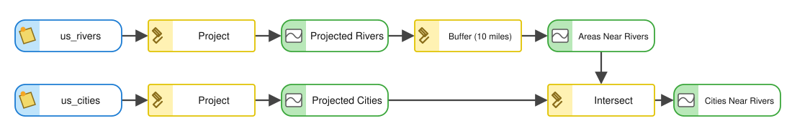

<strong style="color:#002e5d;">Option 1, Buffer + Intersect:</strong> what we built in Part A, <strong style="color:#002e5d;">256</strong> cities

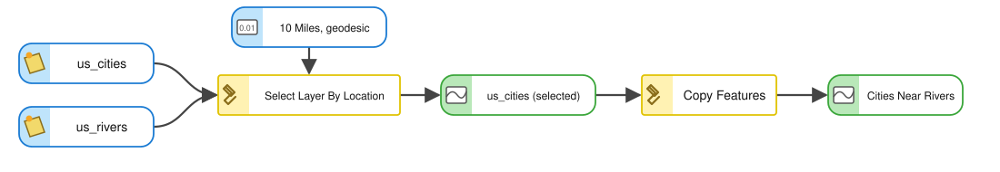

<strong style="color:#002e5d;">Option 2, Select Layer By Location</strong> <em>within a distance geodesic</em>, then Copy Features: <strong style="color:#002e5d;">257</strong> cities

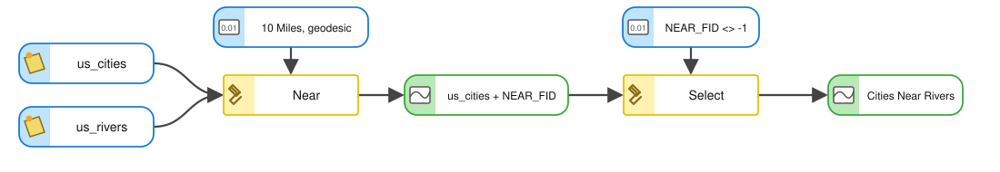

<strong style="color:#002e5d;">Option 3, Near</strong> writes the nearest river onto every city, then <strong style="color:#002e5d;">Select</strong> keeps the ones that found one

Which one would you put in a model you have to hand to someone else? Why are the two counts different?

<!-- Discussion slide, not a lookup. Three canvases for one question, all drawn in ArcGIS Pro's element style. Buffer + Intersect creates real intermediate data you can inspect, which is good for teaching and bad for disk space. Select Layer By Location is one tool instead of four but leaves you with a selection rather than a feature class, so Copy Features follows it. Near writes NEAR_FID and NEAR_DIST onto the input, which is a side effect on your data, and then a Select on NEAR_FID does the classifying. The counts differ by one because Option 1 measured 10 miles on a projected plane and Option 2 measured it geodesically; one city sits right at the edge. "Correct" is not the same as "smallest", and neither is the same as "easiest to explain". The three diagrams come from tools/week02_three_ways.py; the map is Option 2's selection in Pro 3.7.1. -->

---

<!-- _class: lead -->

# First, three things that will save you an hour

## Open your Cities Near Rivers model from Tuesday, or rebuild it: Project, Buffer, Project, Intersect

---

# Get the output onto the map

- Running a model does **not** put its results in your map by default
- Right-click the **output data** element you care about and check **Add To Display**
- Do this for the final output; leave the intermediate data unchecked so your **Contents** pane stays readable
- The check mark sticks with the model, so it applies every time the model runs

* <strong>You try it:</strong> right-click your final output, check <strong>Add To Display</strong>, run the model. Does the result appear?

<!-- This is the single most common "my model did nothing" complaint. The model ran fine; the output just went to the geodatabase without being added to the map. The menu on the right is the Cities_Near_Rivers output element in ArcGIS Pro 3.7.1, with Add To Display already checked from Part A; show the check mark going on and off. -->

---

# A gray element means a missing parameter

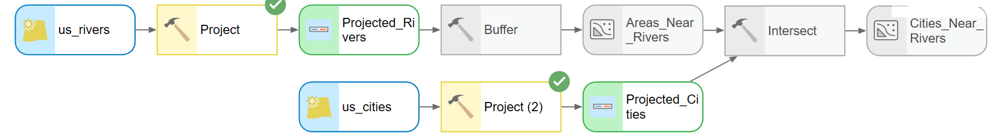

- If a tool or its output is **gray**, the model is not ready to run
- Gray **propagates downstream**: one empty box in Buffer grays out Buffer, its output, Intersect, and the final result
- **Hover** the gray tool: the tooltip lists every setting, and the blank one is the culprit — here the Buffer **distance**

* <strong>You try it:</strong> delete Buffer's distance and click OK. What turns gray? Hover it, then put 10 miles back.

<!-- Colored means ready: blue inputs, yellow tools, green outputs. Gray means "not ready", and it propagates downstream, so always fix the leftmost gray element first. The strip is the Part A model with the Buffer distance deleted: everything upstream of Buffer is still colored and everything from Buffer on is gray. Hovering gives you the whole parameter list without opening the tool; "Distance [value or field]:" with nothing after it is the answer. -->

---

# Test one piece at a time

- You do not have to run the whole model to test one step
- Right-click the tool you want to check and choose **Run**
- ModelBuilder runs that tool and everything it depends on, and stops
- **Messages…** on the same menu shows what the tool actually reported

* <strong>You try it:</strong> right-click the <strong>Buffer</strong> tool and choose Run. Only Project and Buffer run. Then open its Messages.

<!-- Build and debug incrementally. A five tool model that you only ever run end to end takes five times as long to debug. Point out Messages: that is where the real error text lives, not in the canvas. The menu is the Intersect tool's right-click menu in ArcGIS Pro 3.7.1. -->

---

# Rename your elements

Right-click an element and choose **Rename** (or select it and press Ctrl+R). The names ArcGIS Pro gave them, then the names a reader needs:

* <strong>You try it:</strong> rename your rivers input to <strong>Input Rivers</strong> and the buffer output to <strong>Areas Near Rivers</strong>.

<!-- Compare the two strips. "Project (2)" tells you which tool ran, twice. "Project to Equidistant" tells you why. "us_rivers" is a file name; "Input Rivers" is what the data means, and it is also the label that shows up on the tool dialog when the model is run as a tool. Renaming an element does not rename the data on disk, and it does not rename the model itself; the model's Name lives in Properties, General. Both strips are the same model in ArcGIS Pro 3.7.1, before and after ten renames. -->

---

<!-- _class: lead -->

# Working with parameters

## Turning a canvas into a tool

---

# Without parameters, a model is a recording

- Double-click the Cities Near Rivers model in the Catalog pane and this is what opens: a tool dialog with **No Parameters**
- Everything is baked in — which rivers, which cities, which distance
- It will run, and it will produce the same answer every time
- To make it answer a *different* question, someone has to open the canvas

* <strong>You try it:</strong> <strong>double-click</strong> your model in the Catalog pane. What does the dialog offer you?

<!-- This is the hinge of the whole lecture, and it is what Part A's model looks like as a tool: nothing to fill in. Without parameters, a model is a recording of one specific analysis. With parameters, it is a tool. -->

---

# Make the distance a parameter

Right-click <strong>Buffer</strong> ▸ Create Variable ▸ From Parameter ▸ <strong>Distance</strong>

A new element appears, wired into Buffer. Right-click it ▸ <strong>Parameter</strong> and it gets a <strong>P</strong>

- The distance used to live inside the Buffer dialog. Now it is its own **variable** on the canvas, and the circled **P** tells ArcGIS Pro it is an **input the user supplies**
- Any element can be marked the same way: right-click ▸ **Parameter**, or select it and press Ctrl+P

* <strong>You try it:</strong> right-click <strong>Buffer</strong> ▸ Create Variable ▸ From Parameter ▸ <strong>Distance</strong>, then right-click the new element ▸ <strong>Parameter</strong>.

<!-- This is Lab 1 Step 10 and Lab 2 Step 5. Sometimes the thing you want the user to control is not a dataset but a setting inside a tool; Create Variable pulls it out onto the canvas, and the submenu is exactly the Buffer tool's own parameter list, so what you can expose depends on the tool. ArcGIS Pro drops the new variable on top of the tool's input, so drag it clear. Toggle the P on and off so they see the marker appear. Both captures are ArcGIS Pro 3.7.1 on the Part A model. -->

---

# Now the model opens ready to run

- Find the model in the **Catalog** pane under **Toolboxes**
- **Double-click** it — you get a tool dialog, not the canvas

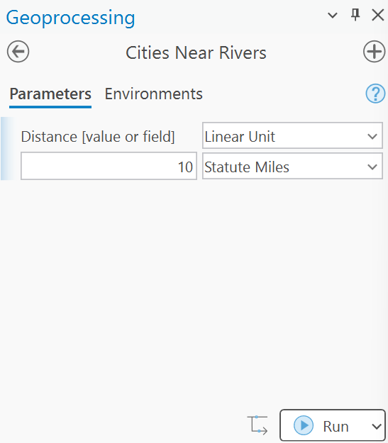

- The **Geoprocessing** pane shows one box per parameter: here the **distance**, already filled in with 10 Statute Miles, units dropdown and all
- Type 5, click Run, and the same model answers a different question

<!-- Double-click runs the model as a tool; right-click and Edit opens the canvas. Students mix these two up constantly. The dialog is the model with exactly one parameter, the distance we just created: a Linear Unit box with its own units list. This is the payoff of the previous slide, and it is what Lab 1's tool dialog looks like once the two buffer distances are exposed. -->

---

# Three parameters: an input, a setting, an output

- Mark the rivers input and the final output the same way, right-click ▸ **Parameter**
- The **P** markers show everything the user will be asked for; everything without one stays fixed inside the model
- The **distance** is the one you will change most; a different input is how the same model runs on another state's rivers

<!-- Left to right on the canvas: Input Rivers is a P because the user may choose which rivers; Distance is a P because they will certainly change it; Cities Near Rivers is a P because the user chooses where the answer gets written. The dialog lists the three in that order, the distance as a Linear Unit with its units dropdown. The warning triangle on the output just means that feature class already exists and will be overwritten. Now the same model answers "cities within 5 km" and "cities within 25 km" without anyone opening the canvas. -->

---

# The same move in your lab

Lab 1, Step 10: the same menu on the road buffer

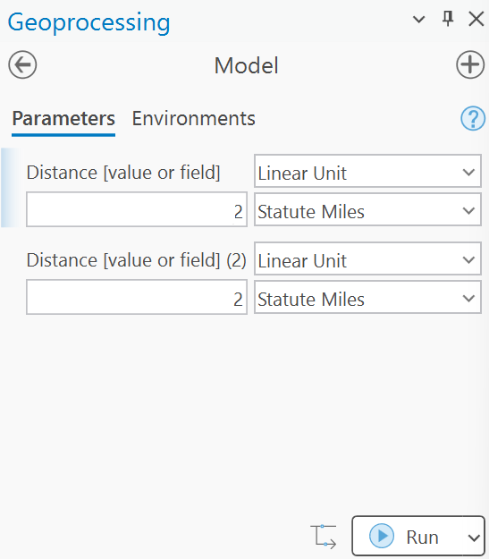

The Lab 1 model as a tool, two distances exposed

- Lab 1 pulls **both buffer distances** out exactly this way, and the rubric asks for a capture of the dialog they produce
- Lab 2 does it with a **Double** variable and a Raster Calculator expression, so the classification threshold becomes a parameter
- Rename the variables before you capture the dialog: *Distance [value or field] (2)* tells your reader nothing

<!-- The right-hand capture is from the Lab 1 run: identical move, identical menu, and the dialog it produces if you stop at Step 10 without renaming anything. The rubric's "tool-dialog capture with the two distances exposed" is worth more when the two boxes say which distance is which. -->

---

<!-- _class: lead -->

# Documenting your model

---

# Metadata documentation

Writing metadata for your model helps you:

- **Remember** what it does and how it works, next semester
- **Share** it with your friends and neighbors — and with a grader

How do you do it?

- Right-click the model in the **Catalog** pane and choose **Edit Metadata** (Ctrl+Shift+M)

<!-- Un-documented models are write-only. Six months later you will not remember which of the three buffers mattered. Make the case that metadata is part of the deliverable, not an extra. The menu on the right is Pro 3.7.1's: Edit Metadata is the exact label, with View Metadata just above it. -->

---

# Edit metadata documentation

- **Title** — a name a stranger would understand
- **Tags** — required; leave them empty and the editor flags the box in red
- **Summary** — what the model does, in two sentences
- **Usage** — what to supply, and when to run it
- Under **Syntax**, expand each parameter and write one line explaining it
- **Save** on the Metadata ribbon when you are done

<!-- This is the Item Description metadata style, which is the default and is plenty for a class model. The four entries under Syntax are exactly the parameters we created, Input_Rivers, Cities_Near_Rivers, Distance__value_or_field_, Input_Cities, so the parameter names you chose become the documentation headings. In the capture the Summary and Usage are written and the four parameter explanations are still empty; the next slide shows what that looks like from the reader's side. -->

---

# View metadata documentation

- What you typed comes back as a formatted tool help page: right-click the model, **View Metadata**
- The **Syntax** line is generated from your parameters, in order
- Blank entries show as "There is no explanation for this parameter" — that is the checklist of what you still owe

<!-- Compare this against the help page of any built-in ArcGIS Pro tool: same layout, same sections. That is the standard your model is being held to. The Description and Usage came from the editor on the previous slide; every gray "There is no ..." line in this capture is a gap the author left, and the four parameter explanations are the ones that matter most to whoever runs the tool. -->

---

<!-- _class: lead -->

# Lab 1 clinic

## The rubric, a complete submission, checking your answer, peer review

---

# What the rubric rewards

Write-up · 10
Recommended site and why (3) · requirements and approach (2) · how you made the Walmart points and why you trust them (2) · which criteria narrowed the result (1) · peer reviewer named (1) · clear writing, rubric pasted in (1)

Model · 10
Runs from its dialog, counts match the check values (4) · full-page model figure, readable (2) · tool-dialog capture with the two distances exposed (2) · a description a reader could repeat from (2)

Map 1 · 10
Baseline: title, north arrow, scale bar (1) · text box with author, date, projection (1) · Walmarts and proposed sites labeled (2) · suitability layer shown (2) · recommended site marked (1) · inset (1) · basemap and legibility (2)

Map 2 · 10
One Step 12 scenario: the same map elements (6) · the scenario's suitability layer (2) · title and text box say what changed, to what, and why this run (2)

Sensitivity · 10
Table of at least three more runs with counts and areas (4) · which parameter matters most (2) · does any setting eliminate every site (2) · does your site survive every scenario (2)

<strong>50 points.</strong> Five parts, ten each. You grade yourself first, in the rubric you paste into the report.

<!-- Every number here is copied from the rubric at the bottom of the Lab 1 page. Two things to point at. First, the model is worth as much as either map, and half of its points are "the counts match the check values": the lab gives you numbers to check against, so use them. Second, the self-assessment is not optional; the grader compares your scores with theirs. -->

---

# A complete submission looks like this

**Report, 2 to 3 pages, containing:**

- Requirements and your approach
- **One** model figure, exported from ModelBuilder (*Export ▸ Export To Graphic*), and **one** capture of its tool dialog
- How you made the Walmart points, and why you trust them
- The sensitivity table and answers to its three questions
- Your recommendation and why
- The rubric, with your score in every row
- Your peer reviewer's name, and what you changed

**Plus two full-page maps**, the baseline and one scenario.

The example map is not a template: yours will differ, because your stores and your runs differ.

<!-- The map on the left is the example baseline layout from the Lab 1 page, built from the same run the check values come from. Walk the list: it is the Deliverables section of the lab, in order. The thing students most often leave out is the model description; the thing they most often get wrong is a screenshot of the canvas at 40 percent zoom instead of an export. -->

---

# What a publication-quality map has

1. **Title** that says what and where — and, on the scenario map, what changed
2. **Legend** with names a stranger understands, not layer names
3. **North arrow** and a **scale bar** in the units your reader uses
4. **Inset** with an extent box, for the part that matters
5. **Text box**: result in numbers, author, date, projection, data sources, method
6. **Reference features**: county outline, labeled cities, existing stores
7. A **basemap** that stays in the background
8. Everything **legible when printed** on one page

<!-- Point at each element on the example as you go: the title with the threshold in it; the legend that says "Irrigated cropland", not "NDVI_reclass"; the inset at Elberta with its red extent box; the text box that admits how much of the county the class covers. The rubric's map rows are exactly this list. -->

---

# Is the answer right?

**Baseline** — 2 miles from a Walmart

**Scenario** — 3 miles from a Walmart

- **Check values:** 1,532 road segments, 47 dense tracts, about 12.9 square miles after the erase. A different number means a unit, an environment, or a field type went wrong
- **Did each criterion change anything?** In Utah County the road buffer removes nothing; say so, with counts
- **Vary the numbers** (Step 12): a recommendation that survives every scenario is worth more than one that appears in only one

<!-- The Learning Suite entry for today promised "how accurate are the results, how can we validate the model." The honest answer has three parts. Against the check values, which catch mechanical errors. Against your own criteria, which asks whether each one earned its place. And against the scenarios, which is the only real test of whether the recommendation is robust. The two maps are the lab's example pair: same model, one number changed. -->

---

# Peer review, how to do it

1. **Swap** reports with someone, in class or by Friday
2. **Read against the rubric**, row by row, and write down **three things to fix**
3. The author **fixes them**, names the reviewer in the report, and says in one sentence what changed

<!-- The lab requires this: a named reviewer and a sentence on what changed. Pair people up now if there is time. Reviewing against the rubric is the point; "looks good" is not a review. A report nobody else has read is a draft. -->

<!-- TODO(instructor): a one-slide look at an anonymized prior-year report page was planned here ("the analysis is the same, the deliverables are different"). No prior-year PDF is on this machine; supply an anonymized page and it can be added as a slide with a one-line caption. Fall 2026: the two named prior-year PDFs attached to the Learning Suite Thursday entry are shown live instead. -->

---

# Going forward: build a tool interface for all your models

- Every analysis you repeat is a candidate for a model
- Parameters plus metadata turn it into something you can hand to a colleague, or to yourself next year
- Right: today's model with **four** parameters, and the **Lab 1** model with its two distances exposed
- The Lab 1 dialog says *Distance [value or field] (2)* because nobody renamed the variables — **rename yours** before you capture the dialog for your report

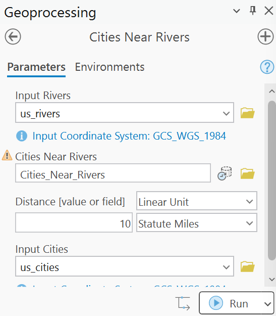

<small>Cities Near Rivers, four parameters</small>

<small>The Lab 1 model, two distances</small>

<!-- The habit to leave them with: whenever you catch yourself doing the same five clicks twice, build the model, expose the two or three things that actually change, and write the metadata while you still remember it. Both dialogs are ArcGIS Pro 3.7.1. The Lab 1 one is exactly what a student gets after Step 10 if they stop there: it works, and the labels are unreadable. The rubric's "tool-dialog capture with the two distances exposed" is worth more when the two boxes say which distance is which. -->

---

# Before Next Class

- Finish [Lab 1](https://byu-hydroinformatics.github.io/ce414-gis-applications/assignments/lab-01/) by **Saturday 11:59 pm** — get your peer review done before the deadline, not the night of it
- Read **Chapter 13** of *GIS Fundamentals* (Cartographic Models and Modeling)
- Take **Quiz 2** (open book) on **Learning Suite** — due **Saturday 11:59 pm**
- Questions? Office hours: [calendly.com/dan-ames/office-hours](https://calendly.com/dan-ames/office-hours)

<!-- Remind them that the lab deliverable includes the model description and the self-assessed rubric, not just the maps. -->

<!--
Revision notes (2026-09-09, evening): the parameter sequence now follows the distance. Slide 13 creates the Distance
variable from Buffer and marks it (new bubble with a P); slide 14 opens the model with the distance as its only parameter
(new capture, mbb-tool-dialog-distance-parameter.png, ArcGIS Pro 3.7.1); slide 15 adds the input and output for three
parameters; the old "create a variable" and "then make that variable a parameter" slides fold into these, and the Lab 1
tie-in slide keeps the Lab 1 menu beside the Lab 1 dialog. The one-parameter (Input Rivers) and two-parameter dialog
captures are no longer used.
Revision notes (2026-09-09, later): the quiz question mark is gone from the cookie review and how-many-ways slides; how-many-ways
now shows three ModelBuilder canvases (tools/week02_three_ways.py) with the map small at the side; the four save-you-an-hour
slides and the two parameter slides carry an orange "You try it" fragment (theme class .tryit) so the class stops and does
each move on their own Cities Near Rivers model; the section lead tells them to open or rebuild it.
Revision notes (2026-09-09): a "Model a cookie" activity slide (the instructor's wording) now precedes the
cookie review; the review slide shows three sketches of the same cookie (one tool, the student sketch with two
tools, and an eleven-tool version back to a baby chicken and a wheat seed; the two new ones are drawn by
tools/week02_cookie_sketches.py in the student sketch's green-marker style and rendered to PNG); and the tidy
cookie model is now an SVG in the ArcGIS Pro 3.7 element style (tools/week02_cookie_model.py), matching Part A's
pie recipe, with the oven setting shown as a value variable with a P marker.
Revision notes (2026-09-08): every ArcGIS Pro capture in Part B replaced with ArcGIS Pro 3.7.1 captures
taken the same way as Part A's (Sept 8, 175 % display scaling, project C:\Ames\Week02\CitiesRivers.aprx,
model Cities Near Rivers). The Sept 3 "RiversDemo" captures were from an older ArcGIS Pro (oval elements)
and are gone. New this session:
- Canvas strips: default and renamed element names, gray-element strip, first P marker, two and three
  parameters, the Distance variable wired into Buffer; all screen grabs of the canvas at 105 % zoom.
- Right-click menus: Rename, Add To Display (checked), Run/Messages on a tool, Create Variable > From
  Parameter > Distance, and the hover tooltip on a gray Buffer.
- Catalog tree with the model; Geoprocessing pane with one, two, three and four parameters; the whole
  ArcGIS Pro window (model plus its four-parameter dialog) on the title slide.
- Metadata editor (Item Description, Tags/Summary/Usage filled, parameter explanations empty) and the
  View Metadata page, each stitched from three or four scrolled captures.
- The Lab 1 model's own tool dialog from C:\Ames\Lab01\Lab01.aprx replaces the ArcMap-era watershed
  dialog on the "Going forward" slide, and the slide now says why the labels there need renaming.
- The model in CitiesRivers.atbx now carries the renames, four parameters and the metadata; the Part A
  state of the toolbox and project is archived in C:\Ames\Week02\Backup_partA.
Revision notes (2026-09-07): Part B revised against slides/week-02/LECTURE_PLAN.md. 20 slides -> 30.
- Kept every RiversDemo capture from the Sept 3 conversion; they remain the quality bar.
- New ArcGIS Pro 3.7.1 captures (Sept 7, 175 % scaling, C:\Ames\Week02\CitiesRivers.aprx): the Catalog
  right-click menu showing Edit Metadata (closes the wording TODO), the model opened as a tool with No
  Parameters, and Select Layer By Location with its map (257 geodesic vs 256 projected, the
  "how many ways" discussion).
- New slides: the tidy cookie model (HTML diagram in ModelBuilder colors; a real-canvas version was
  attempted and abandoned, the speaker notes say how to build it live), "Without parameters, a model
  is a recording", and the five-slide Lab 1 clinic: rubric strip (values copied from the lab page),
  complete submission, publication-quality map, is the answer right, peer review.
- Reused from Lab 1 (copied with mbb- prefixes): the two example maps, the Create Variable menu.
- Infographic: mbb-peer-review.png (OpenAI gpt-image-1, medium). A generated rubric strip was rejected
  because it invented scores; the rubric is HTML with the real point values.
- Still open: reading chapter, quiz date, Lab 1 due date, and the anonymized prior-year page.
-->
