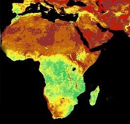
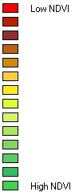
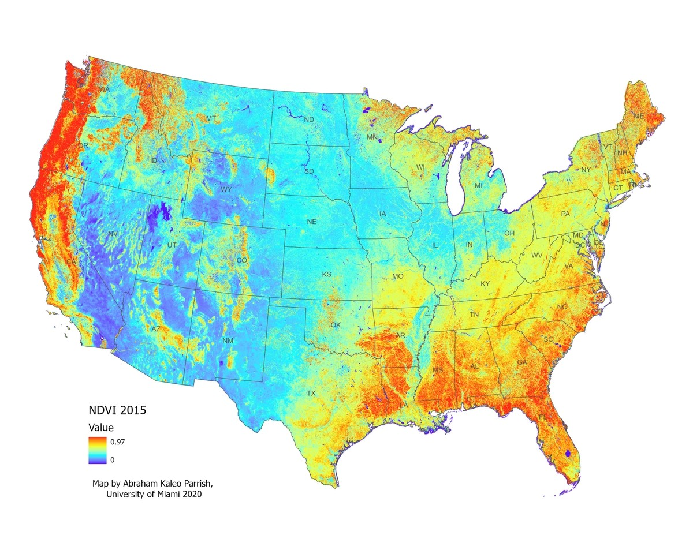
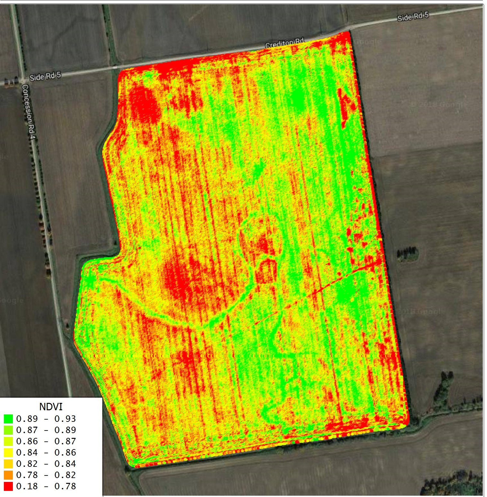
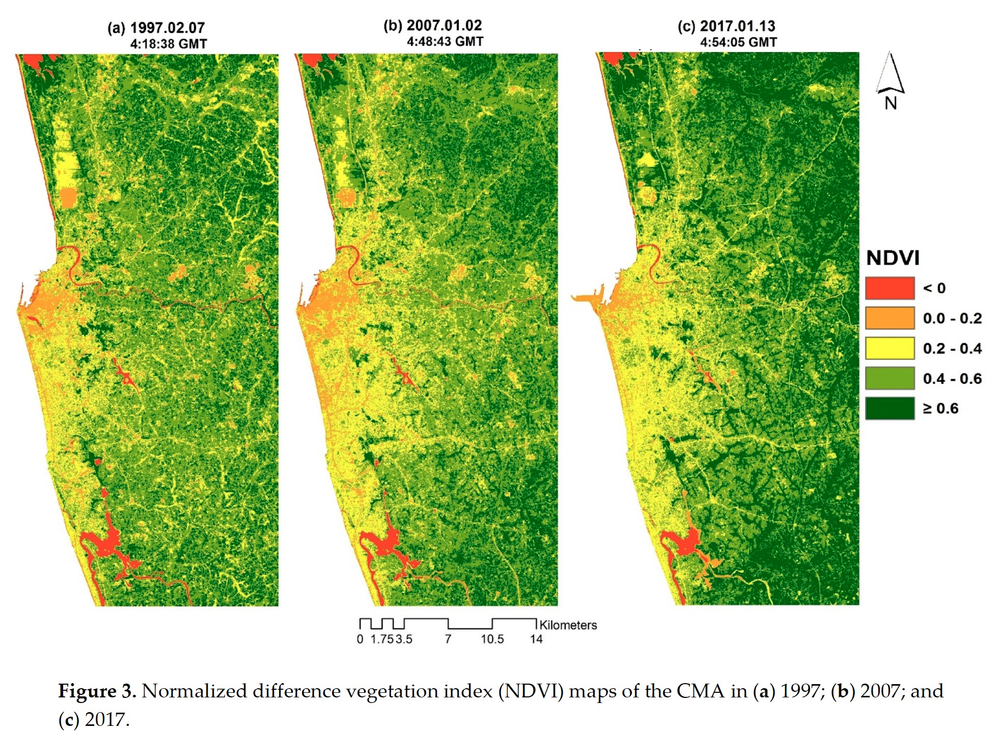

<!-- TODO(instructor): deck title says ModelBuilder Part C but content is NDVI — rename or merge with Week 3 Raster deck? -->

<!-- _class: lead -->
<!-- _paginate: skip -->

# Spatial Modeling and ArcGIS ModelBuilder — Part C

CE 414 Engineering Applications of GIS
Dr. Dan Ames
Civil & Construction Engineering, Brigham Young University

<!-- TODO(graphic): title-slide background image. No AI-generated image in this pass; the only candidates in the source deck are already used on later slides. -->

<!-- Short session. The source deck is titled "Part C" but contains no ModelBuilder material at all: it is a worked example of what a spatial *model* is, using NDVI. Use it as the bridge from the ModelBuilder mechanics of Week 2 into the raster math the students will actually automate in Lab 2. -->

<!-- Speaker note carried from source slide 1 (an ESRI-style workshop abstract; "ArcGIS 9" updated to "ArcGIS Pro"): ModelBuilder is one of the most powerful — and yet most underused — tools in ArcGIS. The ModelBuilder environment introduces a new and exciting way to perform analysis and to automate workflows. ModelBuilder can help you maximize your time and energy by providing a rich environment that closely integrates GIS and process models. This workshop will help you learn how to create your own models that automate workflows or perform analysis. You will learn how to create and execute models with geoprocessing tools and data, as well as how to use the many features of the ModelBuilder environment to document and distribute your models so they can be used by others. The workshop will include instruction, hands-on computer experience, and useful strategies for creating and working with models in ArcGIS Pro. Audience: this workshop is targeted at those familiar with ArcGIS, but new to ModelBuilder. -->

<!-- TODO(instructor): that abstract describes a ModelBuilder workshop, but nothing in this deck is about ModelBuilder. Keep it, rewrite it, or drop it once the deck's identity is settled. -->

---

# Today's Goals

- By the end of class you should be able to:
  - Say what a **model** is in the broad sense — a theory, a law, an equation, a structured idea
  - Write the **NDVI** equation and explain each term
  - Explain *why* red and near-infrared are the two bands that carry vegetation signal
  - Read an NDVI map at **continental**, **farm-plot**, and **multi-date** scale
  - Recognize NDVI as a **raster model** you can build from band math

<!-- TODO(graphic): a supporting illustration for the goals slide. Not generated in this pass. -->

<!-- This is the concepts half hour. Lab 2 is where they build the equation as a ModelBuilder model, so keep pointing forward to it. -->

---

# There are many types of models

- A model could be a **theory**, a **law**, a **hypothesis**, an **equation**, or even a **structured idea**
- Every one of them is the same move: a simplification of reality kept because it is *useful*
- The two on the right-hand end of that list are the ones a GIS can run
- Today we take one equation — NDVI — and treat it as a spatial model

From Haggett and Chorley, 1967

<!-- TODO(graphic): source slide 2 was text on a navy background with hand-drawn ovals around "an equation" and "a structured idea" — no figure to carry across. Not generated in this pass. -->

<!-- The original slide circled "an equation" and "a structured idea" by hand. That was the point being made: those are the two kinds of model that can be encoded and executed. Ask the class for models from their other courses — Manning's equation, a rating curve, a traffic level-of-service table — and sort them into the list. -->

---

# Vegetation Index Model

The **Normalized Difference Vegetation Index (NDVI)** models the abundance of living plant material from satellite data:

  NDVI
  =
  
    NIR &minus; R
    NIR + R
  

- Emphasizes areas that reflect **more near-infrared (NIR)** and **less red (R)**
- Healthy leaves absorb red light for photosynthesis and scatter NIR strongly — so the ratio rises with green, vigorous vegetation
- The index is *normalized*: it always falls between **&minus;1 and +1**

<!-- TODO(graphic): source slide 3 was text and a typeset equation on a navy background — no figure to carry across. Not generated in this pass. -->

<!-- CORRECTED from the source: the original slide read "Emphasizes areas that have MORE HEAT (NIR) and LESS RED color." Near-infrared at these wavelengths is reflected sunlight, not emitted heat — thermal infrared is a different, much longer band. Say this out loud; students carry the "NIR = heat" misconception into Lab 2. -->

<!-- Red and NIR band numbers are sensor-dependent: red is Band 3 and NIR Band 4 on Landsat TM/ETM+, but Band 4 and Band 5 on Landsat 8/9 OLI. Have students read the band numbers off the scene metadata rather than memorizing them. -->

---

# NDVI Vegetation Index — Continental Scale

  
  

<!-- Sahara desert has low NDVI value. Central African rainforest (Congo, Kenya, Tanzania, Madagascar) has high NDVI. -->

<!-- Ask what the black is before you say it: ocean and no-data, not "zero vegetation". Then walk the gradient from the Sahara down through the Sahel into the Congo basin. -->

<!-- TODO(instructor): this Africa/Mediterranean NDVI raster came into the PowerPoint at 265x251 px with no source credit. It is soft on a projector and cannot be credited. A current MODIS or VIIRS NDVI composite from NASA Earth Observations would replace it cleanly. -->

---

# NDVI Vegetation Index — Continental Scale

Source: <a href="https://newsroom.heart.org/file/aitken-ndvi-map-of-the-united-states?action=">newsroom.heart.org/file/aitken-ndvi-map-of-the-united-states</a>

<!-- Sahara desert has low NDVI value. Central African rainforest (Congo, Kenya, Tanzania, Madagascar) has high NDVI. -->

<!-- TODO(instructor): the speaker note above is the Africa note, copied onto this slide (and the next two) in the source PowerPoint. It does not describe this map. Kept because the conversion carries every source note across; replace or delete it. -->

<!-- The same index over the United States: the 100th meridian shows up as a color break without anyone drawing it. Ask why the Wasatch Front reads greener than the West Desert 40 miles away, and what irrigation does to the picture — the lead-in to Lab 2. -->

---

# NDVI Vegetation Index — Farm Plot Scale

Source: <a href="https://www.pix4d.com/blog/pix4dmapper-optimizing-the-ROI-of-fungicides-with-NDVI">pix4d.com/blog/pix4dmapper-optimizing-the-ROI-of-fungicides-with-NDVI</a>

<!-- Sahara desert has low NDVI value. Central African rainforest (Congo, Kenya, Tanzania, Madagascar) has high NDVI. -->

<!-- Same equation, different sensor and a few centimeters per pixel instead of a few kilometers: this is a drone survey of a single field, used to target fungicide. The equation does not care about the platform — the resolution and the question change, not the model. -->

---

# NDVI Vegetation Index — Change Detection

Figure 3 from <a href="https://doi.org/10.3390/ijgi6070189">doi.org/10.3390/ijgi6070189</a> (<em>ISPRS International Journal of Geo-Information</em>, 2017)

<!-- Sahara desert has low NDVI value. Central African rainforest (Congo, Kenya, Tanzania, Madagascar) has high NDVI. -->

<!-- The third use of the same model: run it on three dates and difference the results. Twenty years of urban growth show up as NDVI falling in the places that were built on. This is where a raster model becomes a monitoring tool rather than a snapshot. -->

---

<!-- _class: activity -->

# Where this goes: Lab 2

- **[Lab 2 — NDVI](https://byu-hydroinformatics.github.io/ce414-gis-applications/assignments/lab-02/)** builds today's equation as a **ModelBuilder** model in ArcGIS Pro
- The chain is short and every piece is a Spatial Analyst tool:
  - **Float** the red and NIR bands so the division is not integer math
  - **Minus** and **Plus** for the numerator and the denominator
  - **Divide** for the index itself
  - **Reclassify** to split the result into classes and read the map
- Before you build it: find the red and NIR band numbers in the scene metadata — do not assume them
- Due in **Week 4**; nothing is due this week

<!-- TODO(graphic): a ModelBuilder canvas capture of the NDVI chain would belong here. Lab 2 has one, but a deck may not reference an image outside its own folder, so a copy needs to be made deliberately. Not fabricated in this pass. -->

<!-- This slide is the bridge the source deck never had. Keep it short — the lab handout carries the detail. -->

---

# Before Next Class

- Reading: **chapter to be announced**
- Take the open-book quiz on **Learning Suite**
- **No lab is due this week.** Start [Lab 2 — NDVI](https://byu-hydroinformatics.github.io/ce414-gis-applications/assignments/lab-02/), which is due in Week 4
- Questions? Office hours: [calendly.com/dan-ames/office-hours](https://calendly.com/dan-ames/office-hours)

<!-- TODO(instructor): reading chapter -->

<!-- TODO(graphic): a closing image. Not generated in this pass. -->

<!-- Fill in the reading chapter and the quiz due date before class. -->

<!-- Conversion notes (2026-09-03): source "CE 414 Week 3 - ModelBuilder C.pptx", 7 slides -> 10 slides here (title, Today's Goals, source slides 2-7, a Lab 2 preview, and Before Next Class). No source slide dropped; no hidden slides in the source. CONTENT PROBLEM: the deck is titled "Spatial Modeling and ArcGIS ModelBuilder - Part C" but contains no ModelBuilder content whatsoever - it is a short NDVI lesson. Title kept as the source has it; see the TODO at the top of this file. CORRECTION MADE: source slide 3 read "Emphasizes areas that have MORE HEAT (NIR) and LESS RED color." Near-infrared here is reflected sunlight, not emitted heat, so this now reads "more reflected near-infrared (NIR) and less red". No other factual change. ArcGIS 9 wording in the slide 1 speaker note updated to ArcGIS Pro. Source slides 2 and 3 were PowerPoint text on a navy background with no figure; the NDVI equation is typeset in HTML/CSS here rather than kept as an image. Images: mbc-ndvi-africa-map.jpg + mbc-ndvi-africa-legend.jpg (source image2/image3, only 265x251 and 94x239 px - soft on a projector and uncredited, flagged for replacement), mbc-ndvi-us-2015.jpg (1200x927, from a TIFF), mbc-ndvi-farm-plot.jpg (1515x1547, from a 9.4 MB TIFF), mbc-ndvi-change-detection.jpg (1962x1438, from a 4.7 MB PNG); all converted to JPEG, nothing wider than 2000 px, folder ~1.8 MB. The source title-slide EMF (a BYU seal) was not carried across. Speaker notes: source slides 5, 6 and 7 all carry a copy of slide 4's Africa note; every one is carried across as required, each flagged. Link checks 2026-09-03: newsroom.heart.org NDVI map 200; pix4d blog 200; dx.doi.org/10.3390/ijgi6070189 resolves to mdpi.com/2220-9964/6/7/189, which returns 403 to curl behind Cloudflare bot protection but is live in a browser - the DOI is good and was not replaced. Lab 2 page and the office-hours link both 200. No ArcGIS screenshots appear in this deck, so there is nothing to re-shoot; the outstanding image work is the five TODO(graphic) placeholders and the low-resolution Africa raster. -->
