<!-- _class: lead -->
<!-- _paginate: skip -->

# Raster Analysis and Map Algebra — Part A

## NDVI as your first raster model

CE 414 Engineering Applications of GIS
Civil & Construction Engineering, Brigham Young University

Dr. Dan Ames

<!-- Week 3, Tuesday. Part A is the concepts and the first raster model: what a raster is, map algebra, and NDVI end to end. Part B on Thursday takes the same model, makes its threshold a parameter, and spends most of the hour in ArcGIS Pro. Everything today points at Lab 2, which is NDVI, which is map algebra on two bands of a satellite image. By the end of class every student should be able to say what the NDVI model does cell by cell, and why the Lab 2 model has a Float step. -->

<!-- stamp:begin -->
<!-- _footer: 'CE 414 · Week 3 — Raster Analysis and Map Algebra, Part ALast Updated: 2026-09-09© 2026 Daniel P. Ames · <a href="https://creativecommons.org/licenses/by/4.0/">CC BY 4.0</a>' -->
<!-- stamp:end -->

---

# Today's Goals

By the end of class you should be able to:

- Say what one raster cell stores, and whether that number is a **measurement** or a **label**
- Define **map algebra** and state the rule: *same cell in, same cell out*
- Name the four things that must line up before two rasters can be combined, and what **integer** division does to a ratio
- Write the **NDVI** equation, and explain why **red** and **near-infrared** are the two bands
- Recognize the Lab 2 model as that equation, tool by tool

<!-- Set expectations. Part 1 is a short refresher, Week 1 did the data model. Part 2 is map algebra, with the Excel activity in the middle of it. Part 3 is NDVI, built up from the physics to the Lab 2 model and the threshold table. Thursday's Part B picks up from there: the local, focal, zonal, global families, the threshold as a parameter, and four exercises in ArcGIS Pro. -->

---

# Where this sits

Week 1

Data models: a raster is a grid of numbers

Week 2

ModelBuilder: chain tools, expose parameters

Today

Raster analysis: math on the grid, and NDVI as the first model

Thursday and Lab 2

Hands-on raster analysis; the NDVI model as a tool with a threshold parameter

- Lab 1 was **vector** analysis: buffers, intersects, an erase, on features with attribute tables
- Lab 2 is **raster** analysis: the same idea of a model, but every operation is arithmetic on cells
- The vocabulary from Week 2 carries straight over: data, tool, derived data, parameter

<!-- One slide to place the week. Nothing new in ModelBuilder this week; the new thing is what the tools do to a grid. Say out loud that the Lab 2 model is six tools long and that four of them are arithmetic. -->

---

<!-- _class: lead -->

# Part 1
## A raster is a grid of numbers

---

# What is raster data?

- A **regularly spaced grid** of numeric values; grid cells are pixels
- One cell holds **one number**. No shape, no boundary, no attribute table row of its own
- The cell size is the resolution: **30 m** for the Landsat bands in Lab 2, so every cell is 900 square meters
- Zoom in far enough on any image and it stops being a picture and becomes a table of numbers
- [datacarpentry.org — Introduction to Raster Data](https://datacarpentry.org/organization-geospatial/01-intro-raster-data/)

<!-- Source: Data Carpentry, Introduction to Raster Data. Ask: what is the smallest thing this dataset can tell you about? Answer: one cell. That is why cell size is the first question about any raster. Week 1 covered the data model; this is one slide of reminder. -->

---

# Measurement or label?

- **Land use** (top): codes for categories. Averaging code 4 and code 8 means nothing
- **Elevation** (bottom): continuous. Averaging two elevations gives an elevation
- The answer sets what is legal, how to symbolize, and how to **resample**: nearest neighbor for labels, bilinear for measurements
- NDVI is a measurement; its classified Lab 2 map is a label

<!-- Open by saying it out loud: same area, two very different rasters. That line used to be the first bullet and was cut on 2026-09-09 when the text was overrunning the footer; the figure makes the point without it. -->

<!-- This is the one distinction from the old discrete-versus-continuous slides that matters for analysis. It comes back on the resampling slide and again in Lab 2 Step 3, where Reclassify turns a measurement into a label. -->
<!-- The elevation range was cut from the text on 2026-09-09 when the slide was shortened: it read "high 532 to low 299", but the legend in ra-landuse-and-elevation.jpg reads "High : 53.2 / Low : 299", which cannot both be right. VERIFY against the source raster before quoting a number here again. -->

---

# NoData is not zero

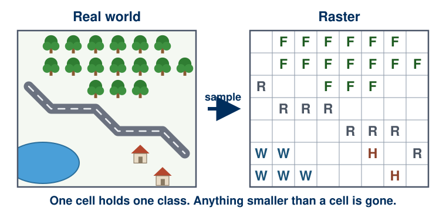

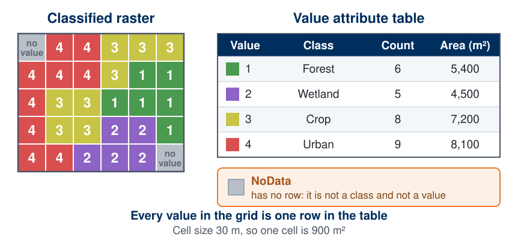

- A cell with **no value** is NoData, shown gray here, and stored separately from every real number
- NoData is not zero: zero elevation is sea level, zero NDVI is bare rock; NoData is *we do not know*
- Every tool this week treats it the same way: **anything combined with NoData is NoData**, and statistics skip it
- The Lab 2 extract has NoData outside the county, so the county boundary in your results is where the data stop, not a line anyone drew

<!-- Top: the real world resolved into a coarse grid of class letters. Bottom: the same idea with a value attribute table, plus the gray NoData cells. Point at it now; it comes back in the next four slides and in every analysis they will run. The Lab 2 sanity check (6,040,284 cells with data) is a NoData count in disguise. -->

<!-- Figures redrawn as SVG on 2026-09-09, replacing ra-real-world-to-raster.jpg and ra-discrete-raster-value-table.jpg, which came across in the migration with no recorded source and so could not be cited. These are ours. The counts in the value attribute table are the real counts of the grid drawn beside it (6, 5, 8, 9 of the 28 cells that carry a value; the other two are NoData), and the areas follow from the 30 m cell size stated on the figure. -->

---

# A spatial data mantra?

## "Raster is faster, but vector is correcter"

**Is it true?**

- Faster at *what*?
- Correcter about *what*?
- Which of Lab 1's steps would have been easier on a grid? Which of Lab 2's would be easier on polygons?

<!-- "Correcter" is how the saying is actually passed around in the GIS community, and it is what the banner in the photo says, so the slide matches it. If someone objects to the word, that is a fine way into the argument. -->

<!-- Let them argue for two or three minutes. Push toward: raster wins on continuous surfaces, per-cell math, and whole-area coverage; vector wins on discrete objects, exact boundaries, network problems, and attribute richness. The honest answer is that the data model should follow the phenomenon. A raster operation is an array operation: no topology to traverse, no geometry to intersect, just walk the array. That is why continental-scale analysis is done on grids. -->

---

<!-- _class: lead -->

# Part 2
## Map algebra: arithmetic on the grid

---

# Map algebra

- Map algebra is a **cell-by-cell** combination of raster layers using mathematical operations
  - **Unary**: one layer in, one out
  - **Binary**: two layers in, one out
- Addition, subtraction, multiplication, division, max, min, comparisons: virtually any operation you would find in a spreadsheet
- Every output cell depends **only** on the input cell at the same place

© Paul Bolstad, *GIS Fundamentals*

<!-- (a) is unary: multiply every cell of one layer by 2. (b) is binary: add LayerA to LayerB cell by cell to get Sumlayer. Note the circled cells, 1 + 2 = 3, and say out loud that the two layers had to be the same size, aligned, and in the same coordinate system for that sentence to even mean anything. That is the slide after next. -->

---

# The rule: same cell in, same cell out

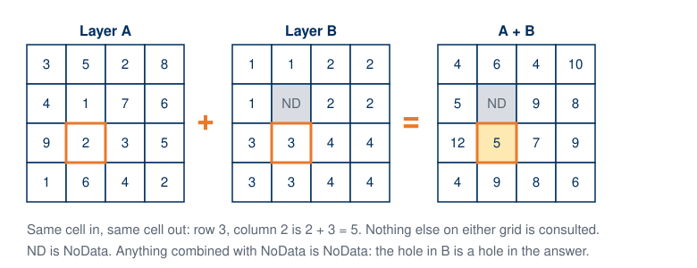

<!-- Walk one cell: row 3, column 2 of A is 2, of B is 3, so the answer is 5, and nothing else on either grid was consulted. Then the hole: B has a NoData cell, so the answer has a NoData cell in the same place. This is the whole of local map algebra; everything else is which operation you put between the grids. -->

---

<!-- _class: activity -->

# In-class activity: Simple Map Algebra in Excel

- Open the workbook from Learning Suite: two small grids and a blank one
- Fill the blank grid with **formulas**, not numbers: `=B3+H3`, then drag across the block
- Then the three variations on the sheet: a **product**, a **comparison** (`=IF(B3>5,1,0)`), and a division with a **blank** cell in one input
- **Upload the workbook to Learning Suite by 9:30 am**, fifteen minutes after class

© Paul Bolstad, *GIS Fundamentals*

<!-- The spreadsheet formula =B3+H3 is map algebra. Drag it across the block and you have run a binary local function. The blank-cell variation is NoData: Excel treats a blank as zero in addition, which is exactly the mistake a raster GIS is built to avoid. Ten minutes. Collect the workbooks through Learning Suite; the point is that they have typed a cell-by-cell expression before they see the Raster Calculator. -->

<!-- Legacy figure: the spreadsheet capture is Bolstad's, Excel 2003-era. Kept as the concept illustration; the activity workbook itself lives on Learning Suite. -->

---

# Predict before you compute

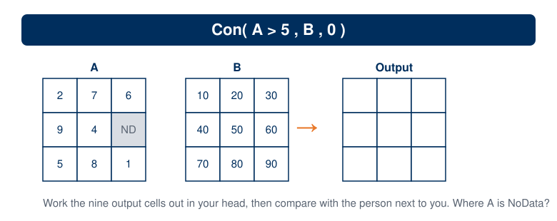

<!-- Paper exercise, two minutes, no computer. Con(A > 5, B, 0) reads: where A is greater than 5, take B, otherwise 0. Have them fill in all nine cells, including the one where A is NoData. Then the next slide. -->

---

# The answer

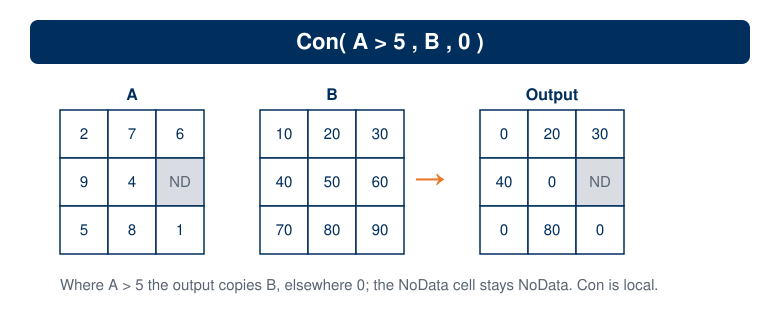

- **Con** is the workhorse of the Raster Calculator: *condition, value if true, value if false*
- It is a **local** function: nine cells in, nine cells out, no neighbors consulted
- In Lab 2 Step 5 the same expression classifies six million cells: `Con("NDVI" >= 0.4, 1, 0)`

<!-- The NoData cell is the one most people get wrong: it is not 0, it is NoData, because the condition cannot be evaluated. Then point at the Lab 2 expression: it is this exercise with a real raster in place of A and constants in place of B. -->

---

# Four things that must line up

1. **Coordinate system.** Both grids in the same one, or the cells do not even lie on top of each other
2. **Cell size.** A 30 m cell and a 10 m cell have no one-to-one match; the tool resamples one of them
3. **Alignment.** Same origin, so cell edges coincide (the **snap raster** environment)
4. **Extent.** The output covers the **intersection** of the inputs unless you say otherwise

When a tool has to resample, the choice is yours: **nearest neighbor** for labels, **bilinear** or **cubic** for measurements. In Lab 2 the two bands come from one scene, so all four line up by construction. The day you mix a DEM with a Landsat band, none of them do.

© Paul Bolstad, *GIS Fundamentals*

<!-- The figure is the failure mode: Layer1 and Layer2 do not share an origin or a cell size, so "cell A plus cell B" has no well-defined answer until you decide what to resample. In ArcGIS Pro these are the Environments: Output Coordinate System, Cell Size, Snap Raster, Extent, Mask. Lab 2 Step 0 opens that dialog on purpose. -->

---

# Integer or float

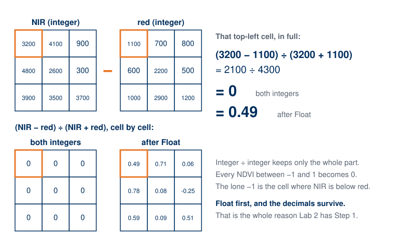

<!-- The Lab 2 extract stores reflectance as integers, times ten thousand, to keep the files small. Divide two integer rasters and the Divide tool keeps only the whole part: every NDVI between minus one and one becomes zero, and the map is a single flat color. Thursday's first exercise is to do exactly this on purpose and look at the result. The fix is the Float tool, which is Lab 2 Step 1. Raster Calculator division behaves differently (it returns floating point), which is one reason the lab uses the Spatial Analyst tools explicitly. -->

---

# Map algebra as a switch: the 0/1 mask

- Build a grid where water is `0` and land is `1`, then **multiply** it by an elevation grid
  - `0` wherever water was (x × 0 = 0)
  - the original elevation wherever land was (x × 1 = x)
- You *could* add the two grids instead, and the computer would let you. The result would be meaningless
- Better still in ArcGIS Pro: set the water to **NoData**, and those cells drop out of every downstream statistic instead of dragging the mean toward zero

<!-- A 0/1 grid is a switch. Ask why adding is meaningless: because you would be adding a unitless class code to meters, and every land cell would silently gain one meter of elevation. The Lab 2 classified map is a 0/1 grid; multiply it by anything and you have masked that thing to irrigated land. -->

---

<!-- _class: lead -->

# Part 3
## NDVI: your first raster model

---

# Why red and near-infrared

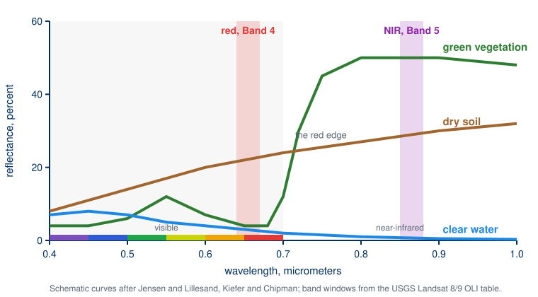

- Chlorophyll **absorbs red** light for photosynthesis, so a healthy leaf reflects very little of it
- The leaf's cell structure **scatters near-infrared** strongly, so reflectance jumps at the **red edge**
- Soil rises gently across both; water absorbs almost everything past red
- Two bands, one on each side of the red edge, separate living vegetation from everything else

<!-- The single most common misconception: near-infrared here is reflected sunlight, not heat. Thermal infrared is a different, much longer band. Say it out loud; students carry "NIR = heat" into Lab 2. The curves are schematic, after Jensen and after Lillesand, Kiefer and Chipman; the band windows are the Landsat 8 and 9 OLI table on the Lab 2 page. Week 4's remote sensing lecture goes further into the spectrum and sensors; today only needs the red edge. -->

---

# In the red band, vegetation is dark

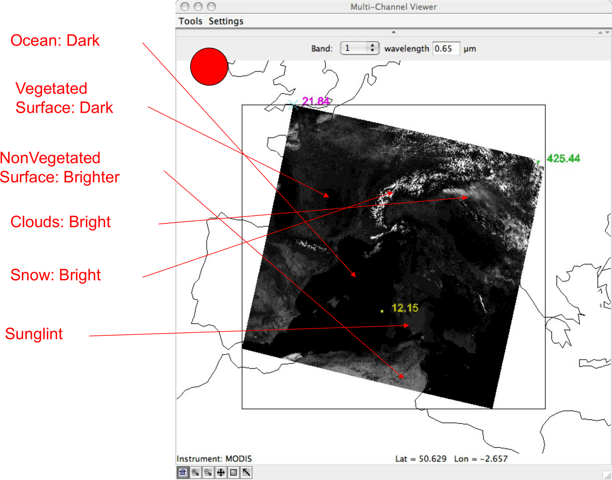

- One MODIS scene over western Europe, one band at a time: this is **0.65 µm**, red
- Healthy vegetation is **dark**, because chlorophyll absorbs red
- Bare ground is brighter; cloud and snow are brightest of all
- A **band** is one wavelength window stored as its own grid of numbers. Landsat gives you nine of them; Lab 2 uses two

<!-- Borrowed from the Week 4 remote sensing deck so that the physics arrives before the lab instead of after it. Set the pattern: a band is a raster. The red band and the near-infrared band of one scene are two rasters that line up perfectly, which is why NDVI is the ideal first map-algebra problem. -->

---

# The equation, one cell at a time

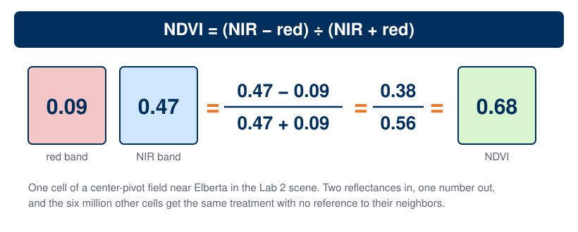

- NDVI is **normalized**: always between **−1 and +1**, whatever the sensor or the sun angle
- Dense healthy vegetation is high; bare soil and rock sit near zero; water goes negative
- It is a **local** function: red in, near-infrared in, one number out, six million times

<!-- Read the arithmetic: 0.47 minus 0.09 over 0.47 plus 0.09 is 0.38 over 0.56, which is 0.68. That is a well-watered pivot in July. The point of drawing it as three cells is to connect the equation to Part 2: this is A and B and an expression, nothing more. The normalization is why an index from a drone and an index from Landsat can be compared at all. -->

---

# What NDVI sees in Utah County

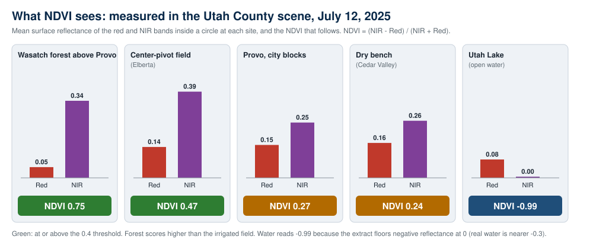

<!-- Measured, not asserted: red and NIR reflectance at five places in the July 12, 2025 scene students download for Lab 2. Two things to point at. The forest above Provo scores higher than the irrigated field near Elberta, so NDVI is a greenness index, not an irrigation detector; and a downtown block and a dry bench are almost indistinguishable at 0.27 and 0.24. The lake at minus 0.99 is an artifact of the extract, explained on the lab page. -->

---

# The same model at every scale

Source: <a href="https://newsroom.heart.org/file/aitken-ndvi-map-of-the-united-states?action=">newsroom.heart.org</a>

Drone NDVI of one field. Source: <a href="https://www.pix4d.com/blog/pix4dmapper-optimizing-the-ROI-of-fungicides-with-NDVI">pix4d.com</a>

- The **equation does not care about the platform**: kilometers per pixel across a continent, centimeters per pixel across one field
- What changes is the cell size and the question. Run it on three dates and difference the results, and it becomes a monitoring tool

<!-- Left: the United States. The hundredth meridian shows up as a color break without anyone drawing it; ask why the Wasatch Front reads greener than the West Desert forty miles away. Right: a single field from a drone, used to target fungicide. Same two lines of arithmetic. -->

---

# NDVI as a ModelBuilder model

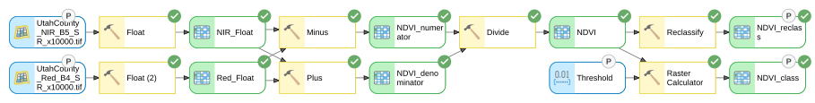

- **Float** both bands so the division keeps its decimals; **Minus** and **Plus** for the numerator and the denominator; **Divide** for the index
- **Reclassify** turns the measurement into a two-class label at a threshold; **Raster Calculator** does the same with `Con()` so the threshold can be a **parameter**
- Every P is something the tool dialog asks for: the two bands, the threshold, the outputs

<!-- This is the finished Lab 2 model, exported from ModelBuilder. Read it left to right with Part 2's vocabulary: four local operations and two classifications. The two classification branches exist because a number typed into a Reclassify table cannot be a model parameter, and a number in a Con() expression can; that is Lab 2 Step 5, and it is why Thursday's threshold sweep takes a minute per run instead of an afternoon. -->

---

# The threshold is a choice, and a raster model makes it cheap to test

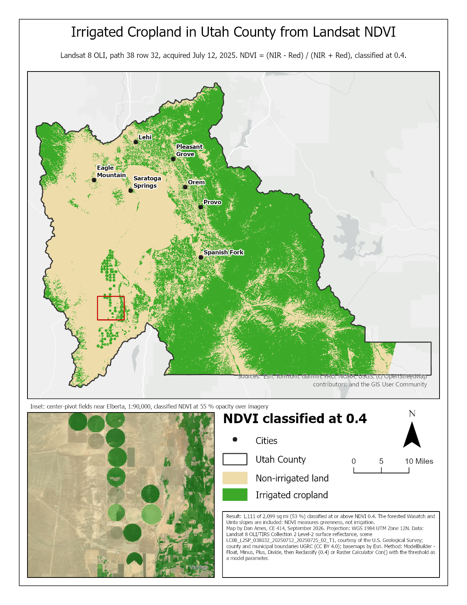

Utah County, July 2025, cells at or above the threshold:

| Threshold | Square miles | Share of county |
| --- | ---: | ---: |
| 0.3 | 1,327 | 63 % |
| 0.4 | 1,111 | 53 % |
| 0.5 | 917 | 44 % |
| 0.6 | 722 | 34 % |
| 0.7 | 496 | 24 % |

- The 0.4 in the handout is the county **median**, and it calls the forested Wasatch Front cropland
- Lab 2 Step 6 asks you to run it at three more thresholds and say what drops in and out. Thursday you will do it live

<!-- The numbers were computed from the course extract with the same Con() expression the lab uses; they match the lab page's check values at 0.4 and 0.6. The teaching point is not the numbers, it is that a raster model with a parameter turns "is 0.4 right?" from an opinion into a table. The forest never drops out before the fields do, which is the honest answer to whether one threshold can map irrigation. -->

---

# Before Next Class

- **Lab 2 — NDVI** is due **Saturday 11:59 pm**: [assignments/lab-02](https://byu-hydroinformatics.github.io/ce414-gis-applications/assignments/lab-02/). Steps 0 to 3 are within reach tonight; the model is the six tools on the slide you just saw
- **Thursday, Part B**: bring the Lab 2 project with the two bands and your NDVI raster loaded. Most of the hour is ArcGIS Pro open on your own desk
- **Reading**: Chapter 10 of *GIS Fundamentals* (Topics in Raster Analysis)
- **Quiz 3**, open book, on Learning Suite, due **Saturday 11:59 pm**
- **Office hours**: [calendly.com/dan-ames/office-hours](https://calendly.com/dan-ames/office-hours)

<!-- Point them at the lab and connect it back: NDVI is the same cell-by-cell arithmetic, run on two bands of the same image rather than two separate grids, so extent and cell size are guaranteed to match. The reading is the local, focal, zonal, global chapter, which Part B opens with; NDVI itself is not in it, which is why today carried it. Say plainly that Thursday needs a working project, because the first exercise starts a few minutes in. -->

<!--
Revision notes (2026-09-09): Part A of the Week 3 pair. This was one 32-slide deck, "Raster Analysis
and Map Algebra", itself a merge of the Sept 3 raster deck with the retired "ModelBuilder, Part C"
NDVI deck. Split into Part A and Part B on 2026-09-09 at the instructor's request, immediately after
the NDVI material: Part A keeps Parts 1 to 3 (the raster refresher, map algebra with the Excel
activity, and NDVI through the threshold table); Part 4 and the whole of the former
raster-hands-on.md became Part B for Thursday, plus new material on the threshold as a parameter.
- Figures generated by tools/week03_grid_figures.py, tools/week03_spectral_signature.py and
  tools/week03_nodata_svgs.py; ArcGIS Pro 3.7.1 captures from Sept 9 at 175 % scaling.
- The threshold table was computed with tools/week03_prep.py from the course extract; 0.4 and 0.6
  match the lab page's check values.
- The Excel map-algebra activity stays on Tuesday per the instructor (Sept 9).
-->
