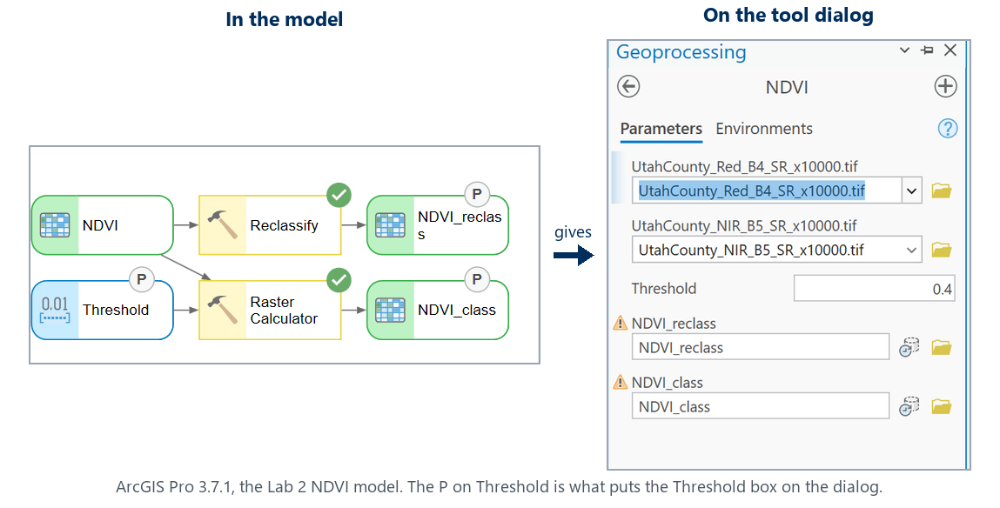

<!-- _class: lead -->
<!-- _paginate: skip -->

# Raster Analysis and Map Algebra — Part B

## Beyond one cell: local, focal, zonal, global

CE 414 Engineering Applications of GIS
Civil & Construction Engineering, Brigham Young University

Dr. Dan Ames

<!-- Week 3, Thursday. Part A was the concepts: map algebra, NDVI as a local raster function, the Lab 2 model and its threshold table. Part B is the local, focal, zonal and global families, and the one thing Part A stopped short of: turning the threshold into a model parameter, so the sweep is five runs of a tool rather than five edits of an expression. It closes with one hands-on exercise, the Con() threshold sweep, which is the start of Lab 2 Step 6 done live. The image is the center pivots near Elberta in the Lab 2 NDVI. -->

<!-- stamp:begin -->
<!-- _footer: 'CE 414 · Week 3 — Raster Analysis and Map Algebra, Part BLast Updated: 2026-09-09© 2026 Daniel P. Ames · <a href="https://creativecommons.org/licenses/by/4.0/">CC BY 4.0</a>' -->
<!-- stamp:end -->

---

# Today's Goals

By the end of class you should be able to:

- Name the four families of raster function — **local**, **focal**, **zonal**, **global** — and put a tool you have used in the right one
- Say what a **moving window** does, and what a mean does to an edge
- Find a Spatial Analyst tool by name in the **Geoprocessing pane**
- Explain why a threshold belongs in a model as a **parameter** rather than buried in an expression
- Read a `Con()` expression and say what area it classifies

Spatial Analyst Tools, by family

<!-- Set the frame: today is the rest of the raster toolbox, organized into four families, and then the one idea Part A left hanging - a threshold you can change without editing the expression. Check that Spatial Analyst shows Licensed: Yes (Lab 2 Step 0) before anyone gets stuck on a gray Run button. -->

---

<!-- _class: lead -->

# Beyond one cell
## Local, focal, zonal, global

---

# Four kinds of raster function

- **Local**: one cell in, one cell out. Map algebra, Reclassify, NDVI, Con
- **Focal** (neighborhood): a **window** of cells in, one cell out. Focal Statistics, Filter, Slope, Aspect
- **Zonal**: all the cells sharing a **zone** in, one number per zone out. Zonal Statistics
- **Global**: the whole grid in, every cell out. Euclidean Distance, Flow Accumulation, Distance Accumulation

© Paul Bolstad, *GIS Fundamentals*

<!-- This four-way split organizes the entire Spatial Analyst toolbox, and it is the reading's organizing idea (Chapter 10). Ask, for each Lab 1 and Lab 2 tool they have used, which family it belongs to. Everything in Lab 2 is local. Terrain analysis in Week 5 is focal; watersheds in Week 6 are global. -->

---

# Moving windows

- A **kernel** is the set of weights the window applies; 1/9 in every cell is the 3 × 3 mean
- The same window with a different function: **mean** smooths, **range** finds edges, **majority** cleans up a classified map
- Slope and aspect are focal functions on a DEM; Week 5 is built on them

<!-- The dashed box is the window; it steps one cell at a time across the whole grid and writes one number at every stop. The spike of 9 becomes 4.1: smoothing removes noise, and it removes real detail with it, which is why a smoothed DEM makes a worse slope map. Ask what happens at the edge of the grid: the window hangs off the data, and the border cells are NoData unless the tool is told to ignore them. -->

---

# Kernels and noise

© Paul Bolstad, *GIS Fundamentals*

<!-- Left: three window shapes and the weights they carry. Right: an input layer with a spike, a high-pass kernel, and the output, with one window position worked out longhand in the middle. A low-pass filter averages the spike away; a high-pass filter makes it stand out. The next slide is that idea on the real NDVI, at the edge of a center-pivot field. -->

---

# What a mean does to an edge

**NDVI**, 30 m cells

**5 × 5 mean**, the same cells

- The pivots are still there, and the road, but every **edge** is now a ramp instead of a step
- Smoothing removes noise and it removes real detail with it. A smoothed DEM makes a worse slope map (Week 5)
- The same window with **Majority** cleans speckle off a classified raster, and moves the class area while it does it

<!-- Both captures are the Lab 2 NDVI at the Elberta pivots in ArcGIS Pro 3.7.1, 1:50,000, made with Focal Statistics, Rectangle 5 by 5, Mean. Ask which one they would use to count pivots, and which to draw a field boundary. The majority filter on the 0.4 class raster grows class 1 from 1,111 to about 1,133 square miles: it fills holes inside fields and rounds off corners, which is a design decision, not a free clean-up. -->

---

# One number per zone, not per cell

- The zones can be any polygons, or any integer raster: cities, census tracts, the classified NDVI itself
- Zonal Statistics as Table writes a **table** you can join back to the polygons and map
- Compare with focal: a window moves and writes a value at every cell; a zone stands still and writes one row

<!-- Ask what "mean NDVI of Provo" leaves out: everything about where inside Provo the green is. That is the price of a zonal summary, and the reason the standard deviation column is worth reading. -->

---

# Where the tools live in ArcGIS Pro

The **Spatial Analyst** toolbox is organized the way this lecture was:

- **Local**: Map Algebra (Raster Calculator), Math (Float, Plus, Minus, Divide), Reclass, Conditional
- **Neighborhood**: Focal Statistics, Filter, Block Statistics
- **Zonal**: Zonal Statistics, Zonal Statistics as Table, Tabulate Area
- **Surface**: Slope, Aspect, Hillshade, Contour, Viewshed
- **Hydrology**: Fill, Flow Direction, Flow Accumulation, Watershed

Find any of them by name in the **Geoprocessing pane** search box, or browse **Toolboxes ▸ Spatial Analyst Tools**.

<!-- Spend a minute in the live toolbox rather than the screenshot, which is the Geoprocessing pane's Toolboxes tab in ArcGIS Pro 3.7.1 with Spatial Analyst Tools expanded. The toolsets are the families we just named. Every Lab 2 tool is in Math, Map Algebra or Reclass, which is to say local. -->

---

<!-- _class: lead -->

# The threshold as a parameter

---

# Make the threshold a parameter

- Mark the variable as a **parameter**, exactly as in Week 2: right-click it, choose **Parameter**, a **P** appears
- That is why Lab 2 classifies with `Con()`: a number in a Reclassify table cannot be a parameter, a number in an expression can

<!-- Say the first half out loud, because it is no longer a bullet: in Part A the threshold was a number inside the model, and changing it meant opening the canvas and retyping the expression. This is the one idea Part A stopped short of, and it is Lab 2 Step 5. The Week 2 procedure applies unchanged, which is the point worth making: nothing about ModelBuilder is different because the data are rasters. Both halves of the figure are real captures of the Lab 2 model in ArcGIS Pro 3.7.1 on Sept 9, 2026, composed by tools/week03_threshold_parameter_figure.py; the schematic they replaced is gone. Worth doing live if the room is with you: the Geoprocessing pane only re-reads a model's parameters after the model is saved and the tool re-opened, which is a good thing to have hit once yourself before thirty students hit it. -->

---

# One tool, five answers

Same model, same data, five runs of the tool dialog:

| Threshold | Square miles | Share of county |
| --- | ---: | ---: |
| 0.3 | 1,327 | 63 % |
| 0.4 | 1,111 | 53 % |
| 0.5 | 917 | 44 % |
| 0.6 | 722 | 34 % |
| 0.7 | 496 | 24 % |

- A parameter turns *"is 0.4 right?"* from an opinion into a table you can put in a report
- The area falls by more than half across the range. Any recommendation that does not say which threshold it used is not a recommendation
- **In a few minutes** you build three rows of this table yourself. Lab 2 Step 6 wants the rest

<!-- These are the Part A numbers, repeated on purpose: Tuesday they were a result you were shown, today they are a result you produce. Computed from the course extract with the same Con() expression the lab uses; they match the lab page's check values at 0.4 and 0.6. The forest never drops out before the fields do, which is the honest answer to whether one threshold can map irrigation. -->

---

<!-- _class: lead -->

# The exercise
## One expression, three thresholds

---

# The Raster Calculator

0. **No NDVI raster yet?** Download `NDVI.tif`, **Map ▸ Add Data**, and check the layer is called `NDVI` — rename it in the Contents pane if it is not
1. Search for **Raster Calculator** (Spatial Analyst)
2. In the expression box type, with the quotes:
   `Con("NDVI" >= 0.4, 1, 0)`
   Double-click a layer in the *Rasters* list to insert it correctly
3. Output `NDVI_class_04`, then **Run**
4. Open the output's attribute table: two rows, **Count** for 0 and for 1

**Write down:** the square miles at 0.4. The lab page has the check value; do you match it?

byu-hydroinformatics.github.io/ce414-gis-applications/data/lab02-utah-county-ndvi/NDVI.tif

<!-- Step 0 is there because not everyone will have run the Lab 2 model yet, and the exercise should not wait on it: NDVI.tif is the model's own output, on the course site, 19 MB. VERIFY(instructor): whether ArcGIS Pro 3.7.1 names the layer NDVI or NDVI.tif when a GeoTIFF is added from disk - the expression below needs the layer name to match, which is why step 0 says to check it and why step 2 says to double-click from the Rasters list rather than typing the name. It does not do Lab 2 for them; computing it, and finding out why Float is necessary, is the lab. The Geoprocessing-pane Raster Calculator, ArcGIS Pro 3.7.1. Con reads: where the condition is true, 1, otherwise 0. This is the paper exercise from Part A with a real raster in place of A. The check value at 0.4 is on the lab page (about 3,197,000 cells, 1,111 square miles, 53 percent of the county); a different number usually means the model's environments changed the extent or cell size. Cells times 900 square meters divided by 2,589,988 gives square miles. -->

---

# Now change the number twice

- Run the same expression at **0.3** and at **0.6**, changing only the number and the output name
- Two runs, about fifteen seconds each. Doing the whole sweep is why Lab 2 exposes the threshold as a **parameter**
- Fill in the three rows of the table beside this list

**Write down:** whether the **mountain forest** above Provo is still in class 1 at 0.6

| Threshold | Square miles | Share |
| --- | ---: | ---: |
| 0.3 | | |
| 0.4 | 1,111 | 53 % |
| 0.6 | | |

- Turn the layers on and off over the imagery basemap to answer the forest question
- These three rows are a start on **Lab 2 Step 6**; the lab asks for more

<!-- Instructor's answers, computed from the course extract on Sept 9, 2026: 0.3 gives 1,327 square miles (63 percent) and 0.6 gives 722 (34 percent). The forest never drops out before the fields do: at 0.6 the Wasatch canopy is still in the class while the pivots are thinning. That is the honest answer to Lab 2's third question, and the reason the lab suggests adding elevation or a second date. Leave the table blank on the slide; the numbers are theirs to find. Two extra runs rather than four keeps this to fifteen minutes; the lab is where the full sweep happens. -->

---

# What you have

**From the exercise**

- The square miles in class 1 at **0.3**, **0.4** and **0.6**
- Whether the mountain forest survives at 0.6
- Three classified rasters, and three rows of the **Lab 2 Step 6** sweep to keep going with

**The families, once more**

- **Local**: Con and Reclassify today; Float, Minus, Plus and Divide in the Lab 2 model
- **Focal**: Focal Statistics, and in Week 5, Slope and Aspect
- **Zonal**: Zonal Statistics as Table
- **Global**: Week 6, when a DEM becomes a watershed

<!-- Close by naming the family of every tool named today. If the quiz asks which family Reclassify belongs to, or what Focal Statistics does at the edge of a raster, they have seen both. The Spatial Analyst toolbox has far more than these; the point of the hour was that it is organized, and that terrain and hydrology are the next two weeks. -->

---

# Before Next Class

- **Lab 2 — NDVI** is due **Saturday 11:59 pm**: [assignments/lab-02](https://byu-hydroinformatics.github.io/ce414-gis-applications/assignments/lab-02/). Step 6 needs the full sweep; you have three of its rows. The two maps and the rubric self-assessment are what remain
- **Reading**: Chapter 10 of *GIS Fundamentals* (Topics in Raster Analysis)
- **Quiz 3**, open book, on Learning Suite, due **Saturday 11:59 pm**
- **Office hours**: [calendly.com/dan-ames/office-hours](https://calendly.com/dan-ames/office-hours)

<!-- Remind them that the sweep table started in class is a required Lab 2 deliverable and needs finishing, and that the map they choose for the scenario should be the run that most changes what a reader would conclude. -->

---

<!-- _class: activity -->

# One Last Thing — Which Family?

Eight questions: **which family a tool belongs to**, what a window does to an edge, and why the threshold is a parameter. **Scan the code**, or open the link below.

- Not graded, nothing recorded — it is a check that today landed
- Every answer explains itself; read the explanation before you move on
- The last three items are the ideas Lab 2 Step 6 is built on

byu-hydroinformatics.github.io/ce414-gis-applications/quizzes/raster-functions/

<!-- Four or five minutes, in pairs, then a show of hands on the ones that split. Zonal Statistics as Table is the item that splits the room: half the class expects a raster back, because every other tool today returned one, and the point is that a zone writes one row rather than one cell. The Con-versus-Reclassify item is the other one worth talking through out loud, since it is the reason Lab 2 is built the way it is. If the room has no signal, put the URL on the board; the items read aloud just as well, and the family questions work as a show of four fingers. -->

<!--
Authoring notes (2026-09-09): Part B of the Week 3 pair, for the Thursday session. It combines
Part 4 of the former "Raster Analysis and Map Algebra" deck (local, focal, zonal, global; moving
windows; kernels; the Spatial Analyst toolbox) with the whole of the former raster-hands-on.md,
plus two new slides on the threshold as a model parameter. The split was made on 2026-09-09 at the
instructor's request, immediately after the NDVI material in Part A.
- NEW on 2026-09-09: the "threshold as a parameter" section, which the week page had promised
  ("the NDVI model as a tool with a threshold parameter") but no deck carried. Its figure,
  ra-threshold-parameter.svg, is a hand-drawn schematic and says so on the figure; a real ArcGIS Pro
  capture of the model beside its tool dialog would be better. TODO(instructor). The right-click
  wording is stated as it is in the Week 2 Part B deck and is marked VERIFY on the slide's notes.
- CUT TO THREE EXERCISES on 2026-09-09 at the instructor's request: there was not time for four,
  and the goal of the hour is breadth across the raster tool families rather than depth. The
  integer-trap exercise went, because Part A already teaches integer versus float and it was the
  one exercise that taught a bug rather than a family.
- CUT TO ONE EXERCISE on 2026-09-17 at the instructor's request: the class is not ready for a full
  hands-on hour and the session is short on time, so the Tuesday Excel map-algebra activity carries
  the hands-on load for the week. Removed: the Exercise 2 and Exercise 3 lead slides, the Focal
  Statistics and Zonal Statistics as Table tool-step slides, the optional zonal-by-city table and
  the optional edge detector, the "three exercises" overview slide, and every instruction to fill in
  and upload an activity sheet. What remains hands-on is the Con() threshold sweep.
  The two concept slides that had been sitting inside the removed exercises, "What a mean does to an
  edge" and "One number per zone, not per cell", were moved up beside the focal and zonal teaching
  they belong to, so the families are still taught end to end - shown rather than run.
  The cut slides are in git history at 52454de if a future year has the time for them; their
  figures (ra-focal-statistics.png, ra-zonal-statistics.png, ra-zonal-table.png) are still in
  images/ and are now unreferenced.
- The one remaining exercise no longer assumes a working NDVI raster, because not everyone will
  have run the Lab 2 model by Thursday. docs/data/lab02-utah-county-ndvi/NDVI.tif is that raster,
  computed from the two bands in lab02-utah-county-landsat.zip and verified against the lab's own
  published check values: 6,040,284 cells with data, mean 0.3995, and 1,327 / 1,111 / 722 square
  miles at thresholds 0.3 / 0.4 / 0.6. The file is named NDVI.tif so the layer lands as NDVI and
  the slide's Con("NDVI" >= 0.4, 1, 0) works unchanged.
- Results were computed headlessly first with tools/week03_prep.py into C:\Ames\Week03\Week03.gdb,
  so the speaker notes carry real numbers: integer division gives -1 on 138 sq mi, 0 on 1,961 sq mi,
  1 on 48 cells; the threshold sweep is 1,327 / 1,111 / 917 / 722 / 496 sq mi at 0.3 to 0.7; the
  5 x 5 majority of the 0.4 class covers 1,133 sq mi; mean NDVI by municipality runs from Vineyard
  (-0.03) to Woodland Hills (0.56).
- ArcGIS Pro 3.7.1 captures (Sept 9, 175 % scaling, C:\Ames\Lab02\Lab02.aprx, project closed
  without saving): the integer-division result with its Contents pane, the Raster Calculator, Focal
  Statistics and Zonal Statistics as Table panes (each stitched from two scrolled grabs), the zonal
  table panel, the Spatial Analyst toolset list, and the Elberta pivots in NDVI and in the 5 x 5
  mean at 1:50,000.
- The sweep table on the exercise slide is deliberately blank except for the 0.4 check value the lab
  already gives; the filled table on the parameter slide is the instructor's own run.
- DECISION NEEDED: with the numbers sheet gone, the Week 3 schedule page still lists an "In-class
  activity: Raster Analysis Hands-On ... upload the numbers sheet by 9:30 am - 5 points" row for
  Thursday. Either drop that row from tools/build_schedule.py or point it at whatever Thursday's
  activity becomes. The Excel map-algebra activity stays on Tuesday.
-->
