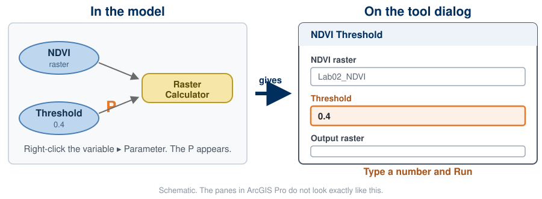
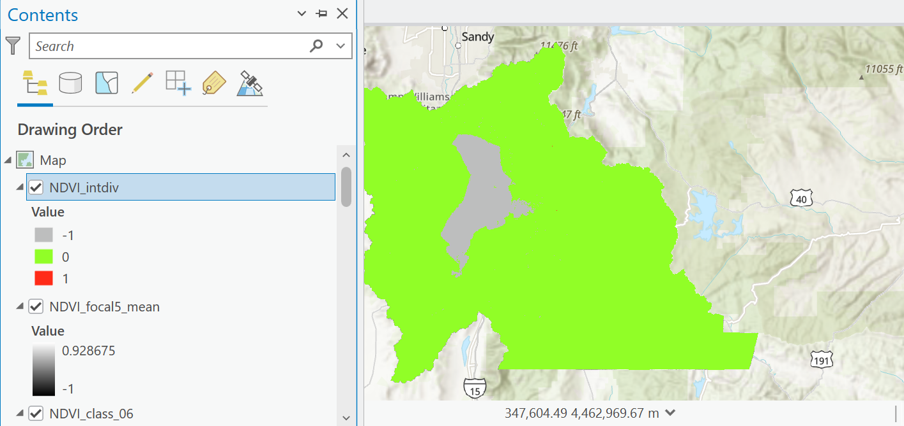
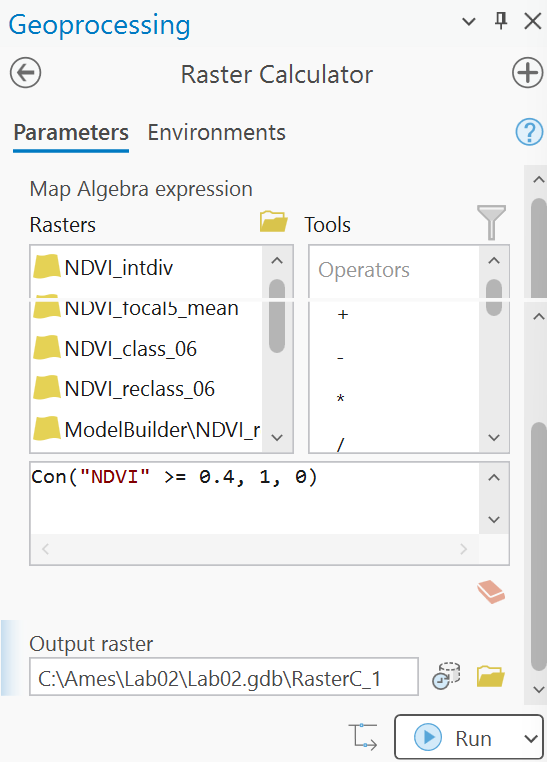
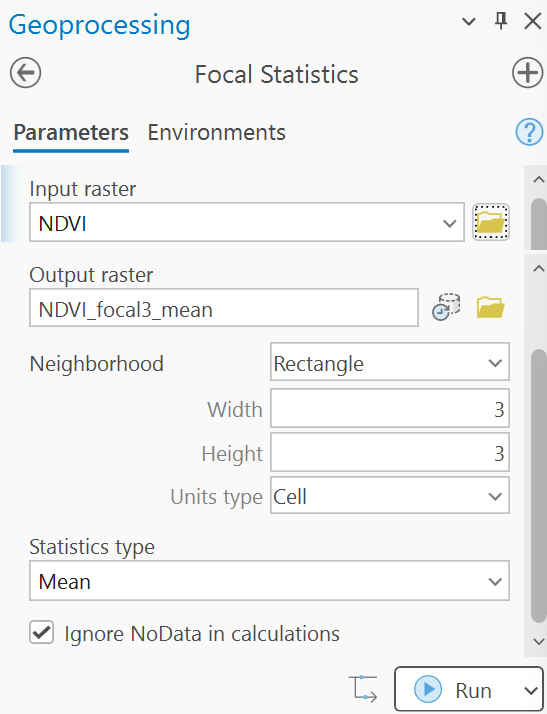
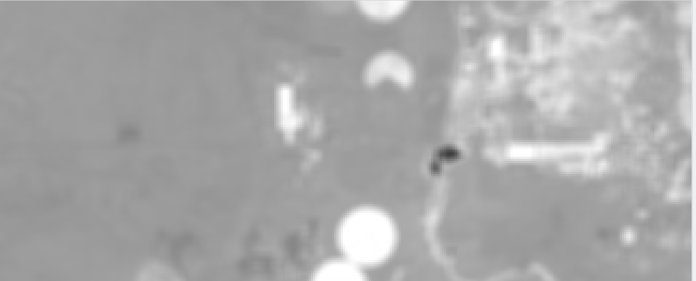
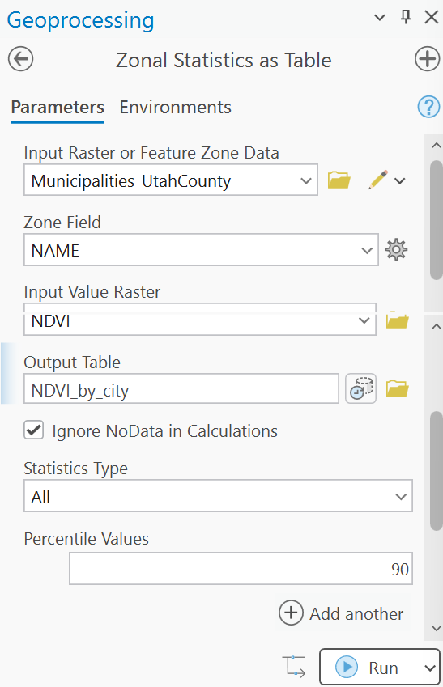
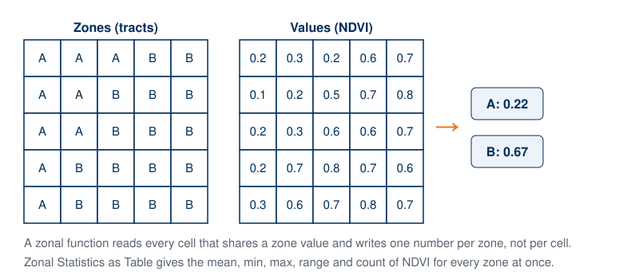
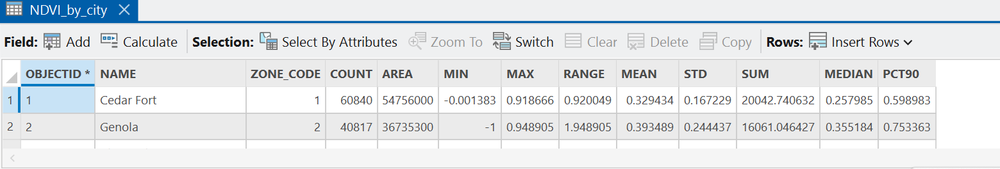

<!-- _class: lead -->
<!-- _paginate: skip -->

# Raster Analysis and Map Algebra — Part B

## Beyond one cell, and four exercises on your Lab 2 data

CE 414 Engineering Applications of GIS
Civil & Construction Engineering, Brigham Young University

Dr. Dan Ames

<!-- Week 3, Thursday. Part A was the concepts: map algebra, NDVI as a local raster function, the Lab 2 model and its threshold table. Part B is a short run of new material and then ArcGIS Pro open on every desk. The new material is the local, focal, zonal, global families, and the one thing Part A stopped short of: turning the threshold into a model parameter, so the sweep is five runs of a tool rather than five edits of an expression. Then four exercises on the Lab 2 extract, each ending in a number students write on the activity sheet. Exercise 2 is Lab 2 Step 6 done live. The image is the center pivots near Elberta in the Lab 2 NDVI, where exercise 3 happens. -->

<!-- stamp:begin -->
<!-- _footer: 'CE 414 · Week 3 — Raster Analysis and Map Algebra, Part BLast Updated: 2026-09-09© 2026 Daniel P. Ames · <a href="https://creativecommons.org/licenses/by/4.0/">CC BY 4.0</a>' -->
<!-- stamp:end -->

---

# How today works

- **First**, the four families of raster function, and the NDVI model as a tool with a **threshold parameter**
- **Then the rest of the hour**, four exercises in ArcGIS Pro. Open your **Lab 2 project** now: you need the two bands and an **NDVI** raster in the map. If you have not run the model yet, run it from its tool dialog, about a minute
- Every tool today is in the **Geoprocessing pane**: search it by name, fill in the boxes, Run
- Each exercise ends in **one number**, an area, a count or a city. Write it on the **activity sheet** and upload the sheet to Learning Suite by **9:30 am**
- Work in pairs if you like, but each of you runs the tools

Spatial Analyst Tools, by family

<!-- Have them open the project while you talk; ten minutes of setup at most. Anyone without a working NDVI raster can compute it in one Raster Calculator line, with Float() around both bands; the point of exercise 1 is exactly what happens without it. Check that Spatial Analyst shows Licensed: Yes (Lab 2 Step 0) before anyone gets stuck on a gray Run button. -->

---

<!-- _class: lead -->

# Beyond one cell
## Local, focal, zonal, global

---

# Four kinds of raster function

- **Local**: one cell in, one cell out. Map algebra, Reclassify, NDVI, Con
- **Focal** (neighborhood): a **window** of cells in, one cell out. Focal Statistics, Filter, Slope, Aspect
- **Zonal**: all the cells sharing a **zone** in, one number per zone out. Zonal Statistics
- **Global**: the whole grid in, every cell out. Euclidean Distance, Flow Accumulation, Distance Accumulation

Later today you run one exercise on each of the first three.

© Paul Bolstad, *GIS Fundamentals*

<!-- This four-way split organizes the entire Spatial Analyst toolbox, and it is the reading's organizing idea (Chapter 10). Ask, for each Lab 1 and Lab 2 tool they have used, which family it belongs to. Everything in Lab 2 is local. Terrain analysis in Week 5 is focal; watersheds in Week 6 are global. -->

---

# Moving windows

- A **kernel** is the set of weights the window applies; 1/9 in every cell is the 3 × 3 mean
- The same window with a different function: **mean** smooths, **range** finds edges, **majority** cleans up a classified map
- Slope and aspect are focal functions on a DEM; Week 5 is built on them

<!-- The dashed box is the window; it steps one cell at a time across the whole grid and writes one number at every stop. The spike of 9 becomes 4.1: smoothing removes noise, and it removes real detail with it, which is why a smoothed DEM makes a worse slope map. Ask what happens at the edge of the grid: the window hangs off the data, and the border cells are NoData unless the tool is told to ignore them. -->

---

# Kernels and noise

© Paul Bolstad, *GIS Fundamentals*

<!-- Left: three window shapes and the weights they carry. Right: an input layer with a spike, a high-pass kernel, and the output, with one window position worked out longhand in the middle. A low-pass filter averages the spike away; a high-pass filter makes it stand out. The third exercise today runs a 5 by 5 mean over NDVI and looks at what it does to the edge of a center-pivot field. -->

---

# Where the tools live in ArcGIS Pro

The **Spatial Analyst** toolbox is organized the way this lecture was:

- **Local**: Map Algebra (Raster Calculator), Math (Float, Plus, Minus, Divide), Reclass, Conditional
- **Neighborhood**: Focal Statistics, Filter, Block Statistics
- **Zonal**: Zonal Statistics, Zonal Statistics as Table, Tabulate Area
- **Surface**: Slope, Aspect, Hillshade, Contour, Viewshed
- **Hydrology**: Fill, Flow Direction, Flow Accumulation, Watershed

Find any of them by name in the **Geoprocessing pane** search box, or browse **Toolboxes ▸ Spatial Analyst Tools**.

<!-- Spend a minute in the live toolbox rather than the screenshot, which is the Geoprocessing pane's Toolboxes tab in ArcGIS Pro 3.7.1 with Spatial Analyst Tools expanded. The toolsets are the families we just named. Every Lab 2 tool is in Math, Map Algebra or Reclass, which is to say local. -->

---

<!-- _class: lead -->

# The threshold as a parameter
## What Part A stopped short of

---

# Make the threshold a parameter

- In Part A the threshold was a **number inside the model**. Changing it meant opening the canvas and retyping the expression
- Mark the variable as a **parameter**, exactly as in Week 2: right-click it, choose **Parameter**, a **P** appears. It is now a box on the model's own tool dialog
- That is why Lab 2 classifies with `Con()`: a number in a Reclassify table cannot be a parameter, a number in an expression can

<!-- This is the one idea Part A stopped short of, and it is Lab 2 Step 5. The Week 2 procedure applies unchanged, which is the point worth making: nothing about ModelBuilder is different because the data are rasters. VERIFY the exact right-click wording in ArcGIS Pro 3.7 before class; the figure is deliberately drawn as a schematic rather than a screen capture, and a real capture of the model and its dialog side by side would be better here. TODO(instructor). -->

---

# One tool, five answers

Same model, same data, five runs of the tool dialog:

| Threshold | Square miles | Share of county |
| --- | ---: | ---: |
| 0.3 | 1,327 | 63 % |
| 0.4 | 1,111 | 53 % |
| 0.5 | 917 | 44 % |
| 0.6 | 722 | 34 % |
| 0.7 | 496 | 24 % |

- A parameter turns *"is 0.4 right?"* from an opinion into a table you can put in a report
- The area falls by more than half across the range. Any recommendation that does not say which threshold it used is not a recommendation
- **Exercise 2** is this table, built by you, and it is Lab 2 Step 6

<!-- These are the Part A numbers, repeated on purpose: Tuesday they were a result you were shown, today they are a result you produce. Computed from the course extract with the same Con() expression the lab uses; they match the lab page's check values at 0.4 and 0.6. The forest never drops out before the fields do, which is the honest answer to whether one threshold can map irrigation. -->

---

# The four exercises

1

The integer trap

Minus, Plus, Divide on the raw bands. <em>Local.</em>

2

One expression, five thresholds

Con() in the Raster Calculator, then the sweep. <em>Local.</em>

3

Neighborhoods

Focal Statistics on NDVI, at a field edge. <em>Focal.</em>

4

Zones

Zonal Statistics as Table by city. <em>Zonal.</em>

Budget: about fifteen minutes each. An optional fifth exercise, an **edge detector**, is at the end for anyone who finishes early.

<!-- Say the family out loud each time a tool runs: this is local, this is focal, this is zonal. That is the reading's organizing idea and it is what the quiz can ask about. -->

---

<!-- _class: lead -->

# Exercise 1
## The integer trap

---

# Do Lab 2 wrong on purpose

1. Search the Geoprocessing pane for **Minus** (Spatial Analyst). Input 1 the **NIR** band, input 2 the **red** band, both straight from the zip, no Float. Output `Diff_int`
2. **Plus**, same two bands, output `Sum_int`
3. **Divide**: `Diff_int` over `Sum_int`, output `NDVI_intdiv`
4. Look at the new layer's symbology in the **Contents** pane, then open its **attribute table**

**Write down:** how many distinct values the output has, and how many square miles came out as **−1**

<!-- Three tools, three minutes. The bands are stored as integers (reflectance times ten thousand), and the Spatial Analyst Divide tool keeps the output integer when both inputs are integer, so it truncates: every NDVI between minus one and one becomes zero. The attribute table is the tell: three rows instead of six million distinct values. Cells times 900 square meters divided by 2,589,988 gives square miles, the same conversion as the lab. -->

---

# What you should see

- Three values in the whole county: **0** almost everywhere, **−1** over the lake and a few shadows, and a handful of **1**s
- The green is not "no vegetation"; it is a **data type** deciding your answer for you
- The fix is one tool on each band: **Float**. Lab 2 Step 1 exists for this reason

<!-- Captured from the course extract in ArcGIS Pro 3.7.1: the integer division gives minus one on about 138 square miles (Utah Lake, where NIR is zero in the extract, plus shadowed slopes), zero on about 1,961 square miles, and one on 48 cells in the whole county. Ask what the Reclassify step would have done with this raster: at a 0.4 threshold, nothing at all is cropland. Then have everyone delete the three outputs; nobody wants them in a report by accident. -->

---

<!-- _class: lead -->

# Exercise 2
## One expression, five thresholds

---

# The Raster Calculator

1. Search for **Raster Calculator** (Spatial Analyst)
2. In the expression box type, with the quotes:
   `Con("NDVI" >= 0.4, 1, 0)`
   Double-click a layer in the *Rasters* list to insert it correctly
3. Output `NDVI_class_04`, then **Run**
4. Open the output's attribute table: two rows, **Count** for 0 and for 1

**Write down:** the count of 1 cells and the square miles at 0.4. The lab page has the check value; do you match it?

<!-- The Geoprocessing-pane Raster Calculator, ArcGIS Pro 3.7.1. Con reads: where the condition is true, 1, otherwise 0. This is the paper exercise from Tuesday with a real raster in place of A. The check value at 0.4 is on the lab page (about 3,197,000 cells, 1,111 square miles, 53 percent of the county); a different number usually means the model's environments changed the extent or cell size. -->

---

# Now sweep it

- Run the same expression at **0.3, 0.5, 0.6 and 0.7**, changing only the number and the output name (`NDVI_class_03`, and so on)
- Each run takes about fifteen seconds; the whole model would take a minute, which is why Lab 2 exposes the threshold as a parameter
- Fill the table on the activity sheet: threshold, cells at or above it, square miles, share of the county

**Write down:** the threshold at which the **mountain forest** above Provo drops out of class 1, and whether the Elberta pivots are still in it

| Threshold | Square miles | Share |
| --- | ---: | ---: |
| 0.3 | | |
| 0.4 | 1,111 | 53 % |
| 0.5 | | |
| 0.6 | | |
| 0.7 | | |

- Turn layers on and off over the imagery basemap to answer the forest question
- This table **is** Lab 2 Step 6; keep it

<!-- Instructor's answers, computed from the course extract on Sept 9, 2026: 0.3 gives 1,327 square miles (63 percent), 0.5 gives 917 (44 percent), 0.6 gives 722 (34 percent), 0.7 gives 496 (24 percent). The forest never drops out before the fields do: at 0.7 the pivots are thinning and the Wasatch canopy is still in the class. That is the honest answer to Lab 2's third question, and the reason the lab suggests adding elevation or a second date. Leave the table blank on the slide; the numbers are theirs to find. -->

---

<!-- _class: lead -->

# Exercise 3
## Neighborhoods

---

# Focal Statistics

1. Search for **Focal Statistics** (Spatial Analyst)
2. Input **NDVI**; neighborhood **Rectangle, 3 by 3 cells**; statistic **Mean**; output `NDVI_focal3_mean`. Run
3. Run it again with a **5 by 5** window, output `NDVI_focal5_mean`
4. Go to the pivots near **Elberta** (Map ▸ Go To XY: 111.95 W, 39.95 N, then set the scale to **1:50,000**) and flip between NDVI and the two means

**Write down:** the NDVI of one cell at the **edge** of a pivot in the original, and in the 5 by 5 mean (use the Explore tool pop-up)

<!-- Focal: a window of cells in, one cell out. Three by three is nine cells, five by five is twenty-five. Ask what the window does at the county boundary: with Ignore NoData checked it averages whatever data are in the window; unchecked, the border cells become NoData. -->

---

# What a mean does to an edge

**NDVI**, 30 m cells

**5 × 5 mean**, the same cells

- The pivots are still there, and the road, but every **edge** is now a ramp instead of a step
- Smoothing removes noise and it removes real detail with it. A smoothed DEM makes a worse slope map (Week 5)
- Try the same window with **Majority** on your classified raster: speckle disappears, and the class area moves

<!-- Both captures are the Lab 2 NDVI at the Elberta pivots in ArcGIS Pro 3.7.1, 1:50,000. Ask which one they would use to count pivots, and which to draw a field boundary. The majority filter on the 0.4 class raster grows class 1 from 1,111 to about 1,133 square miles: it fills holes inside fields and rounds off corners, which is a design decision, not a free clean-up. -->

---

<!-- _class: lead -->

# Exercise 4
## Zones

---

# Zonal Statistics as Table

1. You need **city polygons**: download the Utah Municipal Boundaries from [UGRC](https://gis.utah.gov/products/sgid/boundaries/municipal/), or use the Utah County census tracts from Lab 1 as the zones instead
2. Search for **Zonal Statistics as Table** (Spatial Analyst)
3. Zone data the municipalities, zone field **NAME**; value raster **NDVI**; output `NDVI_by_city`; statistics **All**. Run
4. Open the table from **Standalone Tables** in the Contents pane and sort by **MEAN**

**Write down:** the greenest and the least green city in Utah County by mean NDVI, and the one with the largest **standard deviation**

<!-- Zonal: every cell that shares a zone value in, one number per zone out. The table has one row per city: count, area, min, max, range, mean, standard deviation, sum, median, ninetieth percentile. Cities that cross the county line (Draper, Bluffdale) are cut by the county extent, so their statistics describe only the part inside the county. -->

---

# One number per zone, not per cell

- The zones can be any polygons, or any integer raster: cities, census tracts, the classified NDVI itself
- Zonal Statistics as Table writes a **table** you can join back to the polygons and map
- Compare with focal: a window moves and writes a value at every cell; a zone stands still and writes one row

<!-- The bridge between the tool dialog and the table on the next slide. Ask what "mean NDVI of Provo" leaves out: everything about where inside Provo the green is. That is the price of a zonal summary, and the reason the standard deviation column is worth reading. -->

---

# The table, and what it says

**Least green**, July 2025 mean NDVI

| City | Mean |
| --- | ---: |
| Vineyard | −0.03 |
| Eagle Mountain | 0.21 |
| Fairfield | 0.22 |
| Saratoga Springs | 0.28 |

**Greenest**

| City | Mean |
| --- | ---: |
| Woodland Hills | 0.56 |
| Draper (county part) | 0.54 |
| Spring Lake | 0.52 |
| Alpine | 0.51 |

<!-- Vineyard's mean is negative because a third of its polygon is Utah Lake at minus one in the extract; that is exercise 1's lesson coming back. Eagle Mountain and Fairfield are Cedar Valley: dry benches and new subdivisions. The greenest cities are bench towns against the mountain with mature trees and, in Woodland Hills, forest inside the boundary. Provo, the biggest city, is in the middle at 0.42 with the largest standard deviation, 0.29, because it contains everything from the lake to the canyon. Ask what a mean NDVI per city is actually a measurement of: tree canopy and lawn, not agriculture. Numbers from tools/week03_prep.py on the course extract, Sept 9, 2026. -->

---

# Optional: an edge detector

- **Focal Statistics** again on NDVI: 3 by 3, statistic **Range**, output `NDVI_focal3_range`
- The range is the biggest difference inside the window: near zero in the middle of a field or a lake, large wherever NDVI changes fast
- Symbolize it and look at Elberta: the pivots become **rings**, the canals become lines
- This is the idea behind every edge filter and behind slope: a focal function on how fast the surface changes

<!-- For anyone ahead. On the course extract the range is zero to 1.87 with a mean of 0.15; the maxima are field edges against bare soil and the lake shore. Slope in Week 5 is the same idea with elevation instead of NDVI and a derivative instead of a range. -->

---

# What you have

**On the activity sheet, uploaded by 9:30 am:**

1. Distinct values and the −1 area from the integer division
2. Cells and square miles at 0.4, and the sweep table
3. One edge cell before and after the 5 × 5 mean
4. Greenest and least green city, and the widest spread

**In your Lab 2 project:** the threshold sweep that Step 6 asks for, half done

**The families, once more**

- **Local**: Minus, Plus, Divide, Float, Con, Reclassify
- **Focal**: Focal Statistics, and in Week 5, Slope and Aspect
- **Zonal**: Zonal Statistics as Table
- **Global**: next month, when a DEM becomes a watershed

<!-- Close by naming the family of every tool they ran today. If the quiz asks which family Reclassify belongs to, or what Focal Statistics does at the edge of a raster, they have run both. -->

---

# Before Next Class

- **Lab 2 — NDVI** is due **Saturday 11:59 pm**: [assignments/lab-02](https://byu-hydroinformatics.github.io/ce414-gis-applications/assignments/lab-02/). Step 6 is today's sweep, written up; the two maps and the rubric self-assessment are what remain
- **Today's activity sheet**, with your four numbers, is due on Learning Suite by **9:30 am**
- **Reading**: Chapter 10 of *GIS Fundamentals* (Topics in Raster Analysis)
- **Quiz 3**, open book, on Learning Suite, due **Saturday 11:59 pm**
- **Office hours**: [calendly.com/dan-ames/office-hours](https://calendly.com/dan-ames/office-hours)

<!-- Remind them that the sweep table from exercise 2 is a required Lab 2 deliverable, and that the map they choose for the scenario should be the run that most changes what a reader would conclude. -->

<!--
Authoring notes (2026-09-09): Part B of the Week 3 pair, for the Thursday session. It combines
Part 4 of the former "Raster Analysis and Map Algebra" deck (local, focal, zonal, global; moving
windows; kernels; the Spatial Analyst toolbox) with the whole of the former raster-hands-on.md,
plus two new slides on the threshold as a model parameter. The split was made on 2026-09-09 at the
instructor's request, immediately after the NDVI material in Part A.
- NEW on 2026-09-09: the "threshold as a parameter" section, which the week page had promised
  ("the NDVI model as a tool with a threshold parameter") but no deck carried. Its figure,
  ra-threshold-parameter.svg, is a hand-drawn schematic and says so on the figure; a real ArcGIS Pro
  capture of the model beside its tool dialog would be better. TODO(instructor). The right-click
  wording is stated as it is in the Week 2 Part B deck and is marked VERIFY on the slide's notes.
- Every exercise runs on the Lab 2 Utah County extract students already have; exercise 4 needs the
  UGRC municipal boundaries (link checked Sept 9, 200) or the Lab 1 census tracts as a fallback.
- Results were computed headlessly first with tools/week03_prep.py into C:\Ames\Week03\Week03.gdb,
  so the speaker notes carry real numbers: integer division gives -1 on 138 sq mi, 0 on 1,961 sq mi,
  1 on 48 cells; the threshold sweep is 1,327 / 1,111 / 917 / 722 / 496 sq mi at 0.3 to 0.7; the
  5 x 5 majority of the 0.4 class covers 1,133 sq mi; mean NDVI by municipality runs from Vineyard
  (-0.03) to Woodland Hills (0.56).
- ArcGIS Pro 3.7.1 captures (Sept 9, 175 % scaling, C:\Ames\Lab02\Lab02.aprx, project closed
  without saving): the integer-division result with its Contents pane, the Raster Calculator, Focal
  Statistics and Zonal Statistics as Table panes (each stitched from two scrolled grabs), the zonal
  table panel, the Spatial Analyst toolset list, and the Elberta pivots in NDVI and in the 5 x 5
  mean at 1:50,000.
- The sweep table on the exercise slide is deliberately blank except for the 0.4 check value the lab
  already gives; the filled table on the parameter slide is the instructor's own run.
- The Thursday activity (the numbers sheet) needs a matching Learning Suite item; the Excel
  map-algebra activity stays on Tuesday.
-->
