<!-- _class: lead -->
<!-- _paginate: skip -->

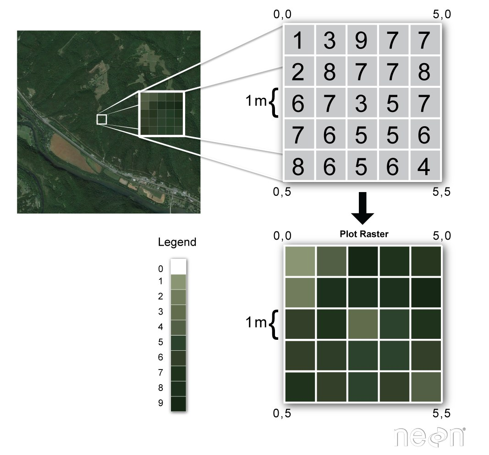

# Raster Analysis and Map Algebra

Dr. Dan Ames
CE 414 Engineering Applications of GIS
Civil & Construction Engineering
Brigham Young University

<!-- Week 3 concepts lecture. The lab this week is Lab 2, NDVI, which is map algebra on two bands of a satellite image, so everything here has a direct payoff on Thursday. -->

<!-- TODO(instructor): the source title slide carried a speaker note left over from a different presentation - a ModelBuilder workshop abstract that has nothing to do with raster analysis. It is preserved here for the record but is not used in the deck: "ModelBuilder is one of the most powerful - and yet most underused - tools in ArcGIS. The ModelBuilder environment introduces a new and exciting way to perform analysis and to automate workflows... The workshop will include instruction, hands-on computer experience, and useful strategies for creating and working with models with ArcGIS 9. Audience: This workshop is targeted to those familiar with ArcGIS, but new to ModelBuilder." Delete or replace. -->

---

# Today's Goals

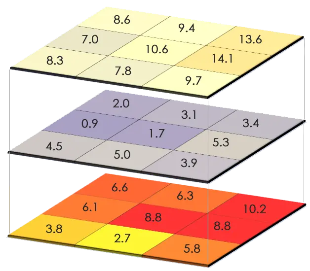

By the end of class you should be able to:

- Say what a **raster** is, and what one cell actually stores
- Tell **discrete** raster data from **continuous** raster data, and give an example of each
- Define **map algebra** and explain why it is a *cell-by-cell* operation
- Tell a **local**, a **focal** (neighborhood), and a **global** function apart
- Name what has to line up before two rasters can be combined
- Find the raster tools in ArcGIS Pro and read a raster expression

<!-- Set expectations. This is the concepts day. Lab 2 applies it: NDVI is a single local map-algebra expression on two raster bands. -->

---

# What is Raster Data?

<div class="columns">
<div>

- "Regularly spaced grid of numeric values"
- **"Grid cells" = "pixels"**
- The value of a pixel can be **continuous** (e.g. elevation) or **categorical** (e.g. land use)
- One cell holds **one number**. No shape, no boundary, no attribute table row of its own
- [datacarpentry.org — Introduction to Raster Data](https://datacarpentry.org/organization-geospatial/01-intro-raster-data/)

</div>
<div>


</div>
</div>

<!-- Source: Data Carpentry, Introduction to Raster Data. Zoom in far enough on any image and it stops being a picture and becomes a table of numbers. That table is the whole data model. Ask: what is the smallest thing this dataset can tell you about? Answer: one cell. -->

---

# Discrete versus Continuous Raster Data

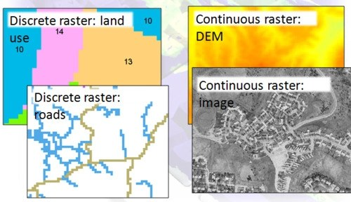

- **Discrete**: land use, roads. The value is a *class code*, and the classes have edges
- **Continuous**: a DEM, an image. The value is a *measurement*, and it changes gradually

<!-- Four panels: discrete land use, discrete roads, a continuous DEM, a continuous image. The distinction is not about the file, it is about what the number means. Averaging two elevations is sensible; averaging land-use code 4 and code 8 is not. -->

---

# Discrete versus Continuous Raster Data

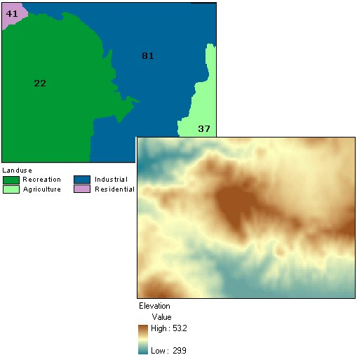

- Same area, two very different rasters
- **Land use** (top): a handful of values, each standing for a category — Recreation, Agriculture, Industrial, Residential
- **Elevation** (bottom): a continuous surface, high 532 to low 299
- The question to ask of any raster: **is this number a measurement, or a label?**

<!-- The answer decides which operations are legal. It also decides how you symbolize it - unique values for a label, a stretched color ramp for a measurement - and which resampling method you may use later. -->

---

# Example Continuous Raster Data

Precipitation · Temperature · Elevation · **Other?** Anything you could measure at *any* point in the study area and get a number.

<div class="imggrid" style="grid-template-columns: repeat(4, 1fr);">

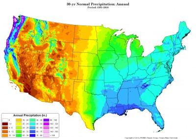

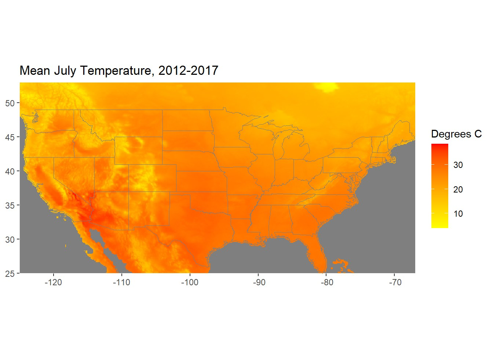

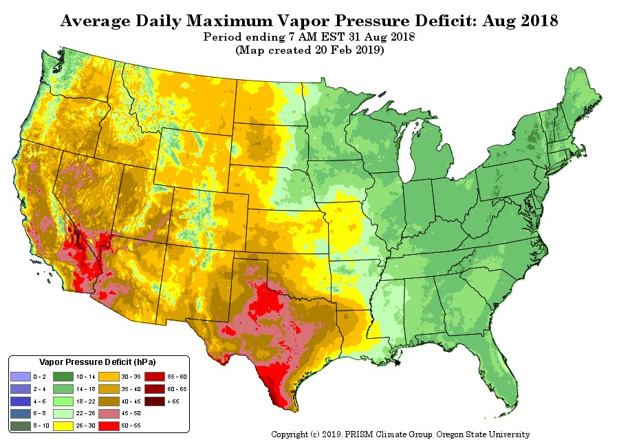


</div>

<!-- Ask the class for more: pH, air pressure, salinity, population density, noise level, groundwater depth. The precipitation and vapor-pressure-deficit maps are PRISM Climate Group products. The bottom-right panel is the mental model to keep: stacked grids, perfectly registered, one value per cell per layer. -->

---

# Example Discrete Raster Data

<div class="columns">
<div>

- Political boundaries
- Things on the land
- Land cover types
- Soil types
- Other?

A discrete raster usually carries a **value attribute table**: one row per class, not one row per cell.

</div>
<div>

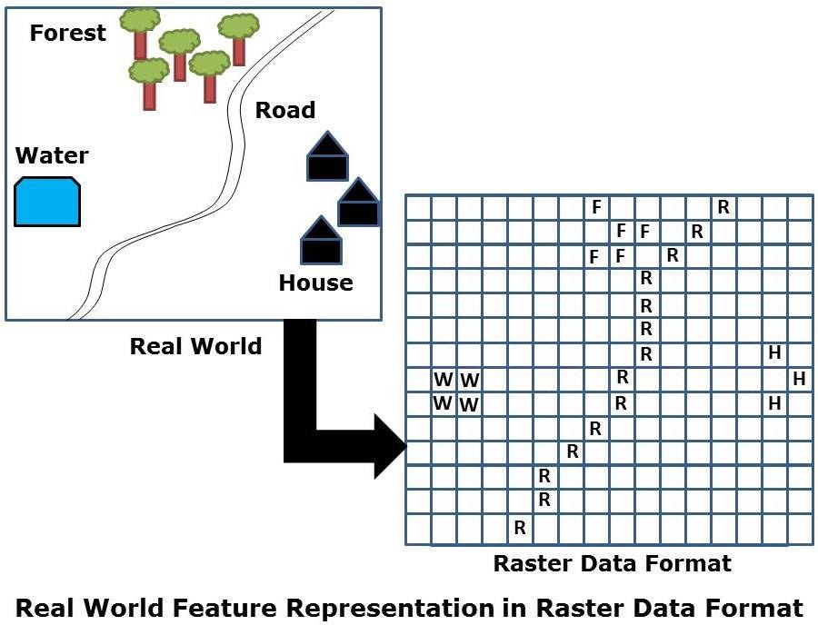

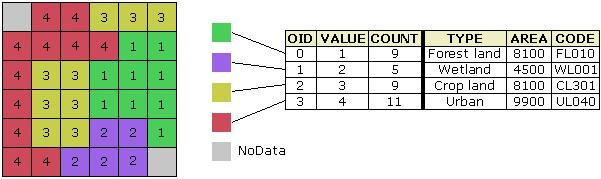

</div>
</div>

<!-- Top: the real world resolved into a coarse grid of class letters - F for forest, W for water, R for road, H for house. Bottom: the same idea with a value attribute table, plus the gray NoData class. NoData is not zero. Point at it now; it comes back in every analysis they will run. -->

---

# Why we use Raster GIS

<div class="columns">
<div>

Raster GIS is often used because:

- Raster is better suited for spatially **continuous** data like elevation
- Raster is better for **visualization** and for modeling environmental phenomena
- Other continuous data: pH, air pressure, temperature, salinity
- A raster is a **simplified realization** of the world, which allows fast and efficient processing
- A raster GIS performs geoprocessing on a **grid-based** realization of the world

</div>
<div>

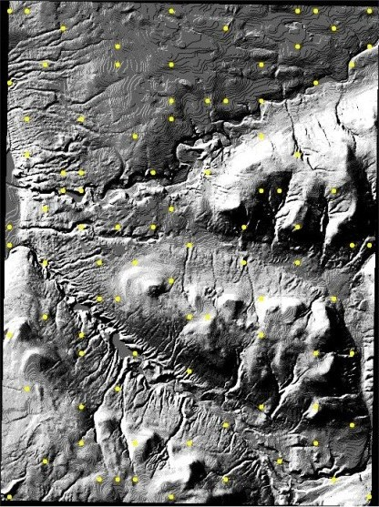

</div>
</div>

<!-- The efficiency argument is worth dwelling on: a raster operation is an array operation. No topology to traverse, no geometry to intersect - just walk the array. That is why continental-scale analysis is done on grids. -->

---

# Raster GIS, put to work

<div class="imggrid" style="grid-template-columns: repeat(2, 1fr); max-width: 760px; margin: 0 auto;">

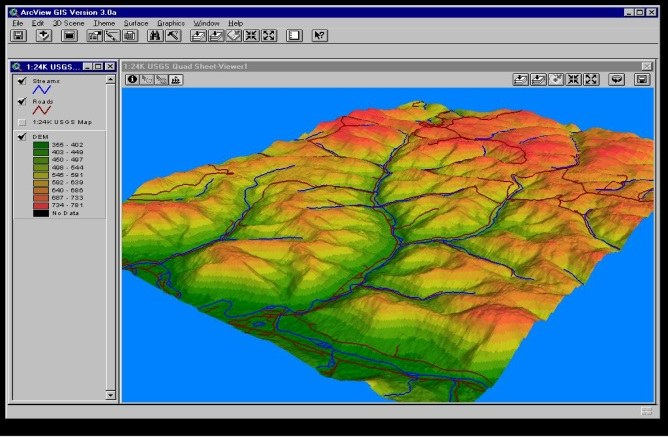

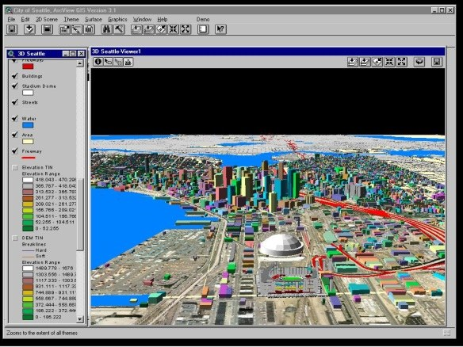

</div>

Terrain and urban surfaces rendered from grids — every visible surface is one number per cell.

<!-- These two captures are from ArcGIS 9-era ArcScene and are kept only as illustrations of what grid-based rendering looks like. The equivalent in ArcGIS Pro is a local or global scene in a 3D map view. Flagged for re-capture. -->

<!-- TODO(graphic): replace both legacy ArcScene captures with one ArcGIS Pro 3D scene showing a DEM as an elevation surface. -->

---

<!-- _class: quiz -->

# A Spatial Data Mantra?

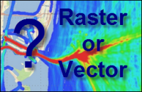

## "Raster is Faster but Vector is Better"

**Is it true?**

- Faster at *what*?
- Better for *what*?
- What would you have to measure to settle it?

<!-- Let them argue for two or three minutes. Push toward: raster wins on continuous surfaces, per-cell math, and whole-area coverage; vector wins on discrete objects, exact boundaries, network problems, and attribute richness. The honest answer is that the data model should follow the phenomenon, not the other way around. -->

---

# Basic Raster Grid Manipulation

<div class="columns">
<div>

Some basic raster manipulations include:

- **Reclassify** — collapse many values into few
- **Convert** — raster to vector, or vector to raster
- **Preparation for analysis**
  - Set the **extent**
  - **Mask** (the cousin of what we did with Clip)
- **Watch out for coordinate systems!**

</div>
<div>

<div class="imggrid" style="grid-template-columns: repeat(2, 1fr); max-width: 420px;">

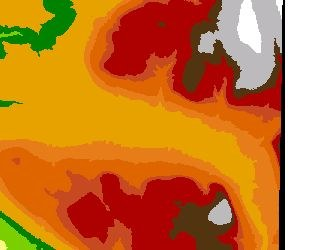

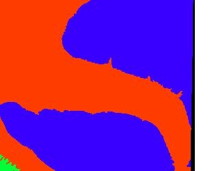

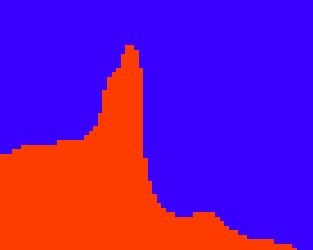

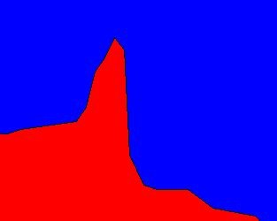

</div>

<span style="font-size:0.75em">Top row: reclassify. Bottom row: raster converted to vector.</span>

</div>
</div>

<!-- Top row, left to right: many classes collapsed to two. Bottom row: the blocky raster boundary becomes a smooth polygon boundary - and notice that the conversion invents precision the raster never had. In ArcGIS Pro these are Reclassify, Raster to Polygon / Polygon to Raster, and Extract by Mask, all in the Geoprocessing pane. Environment settings for extent, cell size, and mask are set per tool or per project. -->

---

# Map Algebra

<div class="columns">
<div>

- Map algebra is a **cell-by-cell** combination of raster layers using mathematical operations
  - **Unary** — one layer
  - **Binary** — two layers
- Basic mathematical operations
  - Addition, subtraction, division, max, min — virtually any operation you would find in a spreadsheet
- Strong analytical functions

</div>
<div>

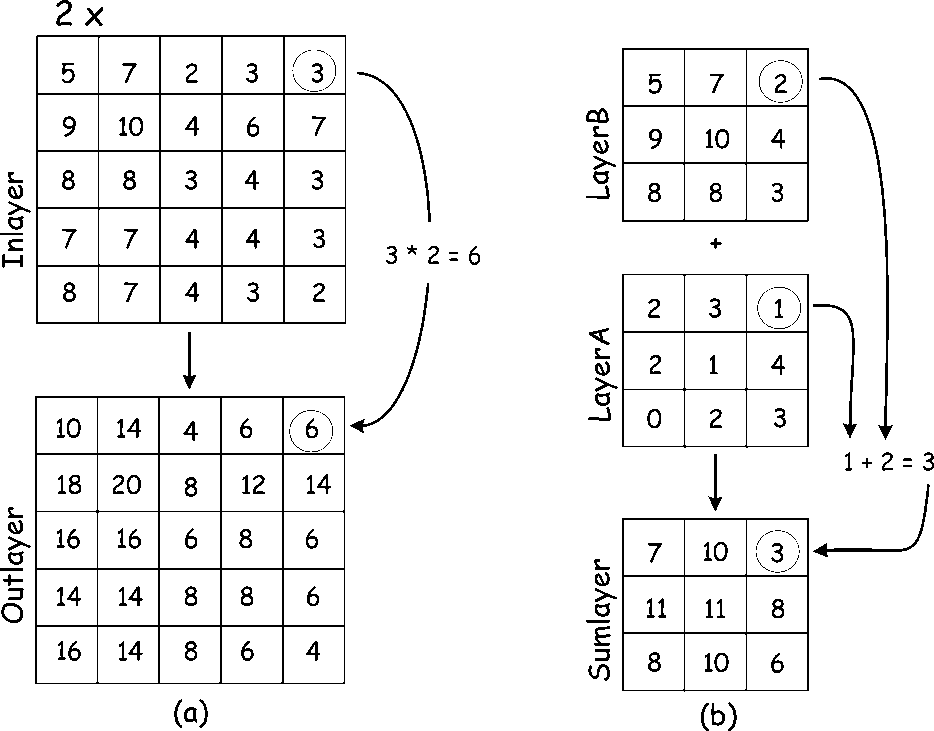

<span style="font-size:0.7em">© Paul Bolstad, *GIS Fundamentals*</span>

</div>
</div>

<!-- (a) is unary: multiply every cell of one layer by 2. (b) is binary: add LayerA to LayerB cell by cell to get Sumlayer. Note the circled cells - 1 + 2 = 3 - and say out loud that the two layers had to be the same size, aligned, and in the same coordinate system for that sentence to even mean anything. That is the next slide. -->

---

# Map Algebra in a Spreadsheet

<div class="columns">
<div>

- Map algebra and raster GIS is simple to visualize in a spreadsheet — an example of multiplication and addition
- The use of **arrays** makes map algebra and raster GIS very computationally efficient
- But be careful of:
  - Layers that are **not coincident**
  - **Different cell sizes**

</div>
<div>

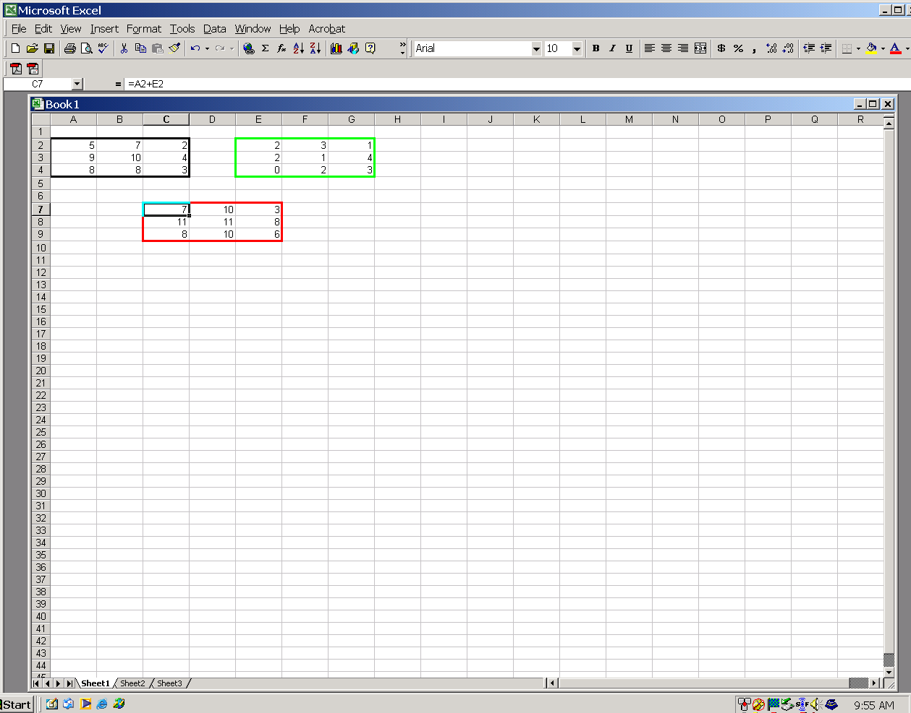

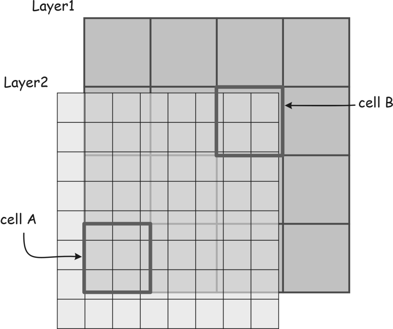

<span style="font-size:0.7em">© Paul Bolstad, *GIS Fundamentals*</span>

</div>
</div>

<!-- The spreadsheet formula =A2+E2 is map algebra. Drag it across the block and you have run a binary local function. The lower figure is the failure mode: Layer1 and Layer2 do not share an origin or a cell size, so "cell A plus cell B" has no well-defined answer until you decide what to resample. -->

<!-- TODO(instructor): the course plan asks for explicit coverage here, before the class runs its first expression - cell-by-cell operations stated as a rule, NoData propagation, raster data type (integer vs float, and what division does to each), analysis extent, cell size, snap raster, and the choice of resampling method (nearest for discrete, bilinear or cubic for continuous). The plan also asks for a raster-calculator prediction exercise: show two small grids and an expression, have students write the output grid on paper before the computer answers. Write the slides you want; this is a content decision, not a conversion one. -->

<!-- Legacy screenshot: the spreadsheet capture is Excel 2003-era. Harmless as a concept illustration, but flagged. -->

---

# Map Algebra: a 0/1 mask

<div class="columns">
<div>

- Map algebra extends to a great many mathematical operations
- The computer will let you perform virtually any calculation — **beware: some will make sense, others won't**
- Build a grid where water is `0` and land is `1`, then multiply it by an elevation grid:
  - `0` wherever water was (x × 0 = 0)
  - the original elevation wherever land was (x × 1 = x)
- You *could* add the two grids instead — but the result would be meaningless

</div>
<div>

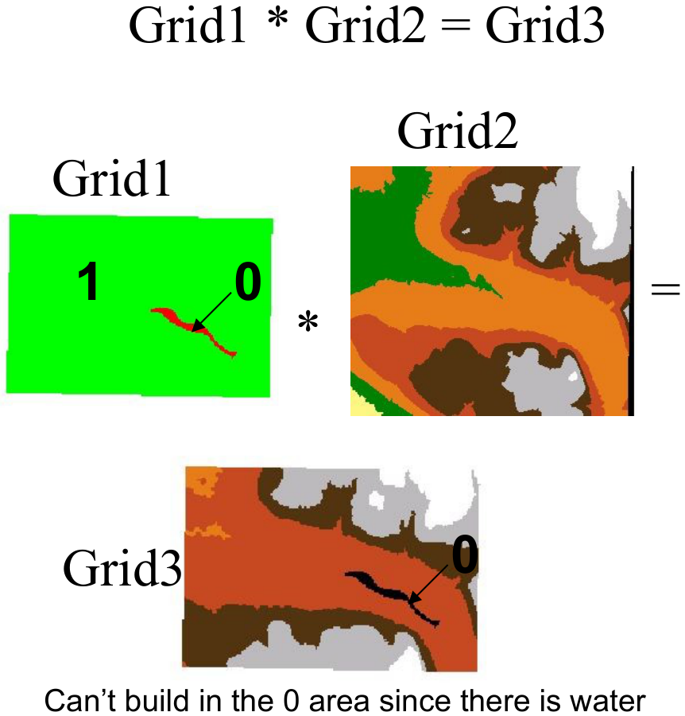

</div>
</div>

<!-- This is the workhorse pattern: a 0/1 grid is a switch. Multiplying by it turns areas off. Ask why adding is meaningless - because you would be adding a unitless class code to meters, and every land cell would silently gain one meter of elevation. Also note the alternative in ArcGIS Pro: set water to NoData instead of 0, and the cells drop out of downstream statistics entirely rather than dragging the mean toward zero. -->

---

<!-- _class: lead -->

# Part 2
## Raster Functions

<!-- Break point. Part 1 was what a raster is and what cell-by-cell math means. Part 2 is the classification of raster functions by how much of the grid each one looks at. -->

---

# Raster Functions

<div class="columns">
<div>

- **Local**: only uses data in a single cell to calculate an output value — what we typically think of as map algebra
- **Neighborhood (Focal)**: uses data from a set of cells, most often a **kernel**
- **Global**: uses all the data in a raster layer

</div>
<div>

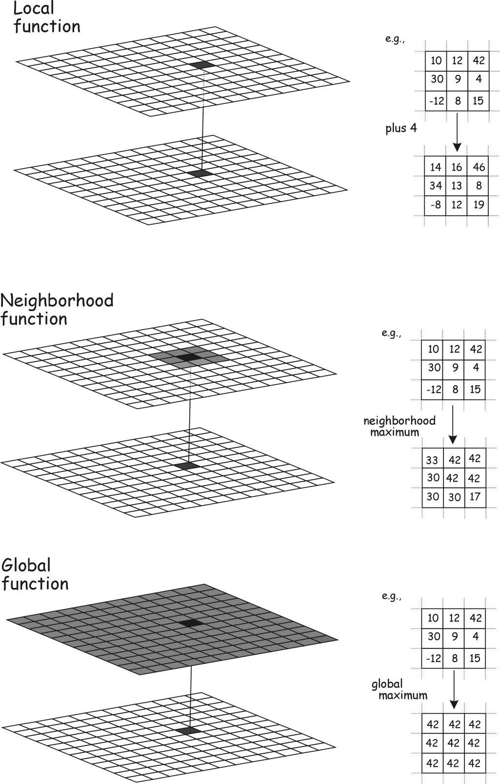

<span style="font-size:0.7em">© Paul Bolstad, *GIS Fundamentals*</span>

</div>
</div>

<!-- This three-way split organizes the entire Spatial Analyst toolbox. Local: Raster Calculator, Reclassify, NDVI. Focal: Focal Statistics, Filter, Slope, Aspect. Global: Euclidean Distance, Flow Accumulation, Distance Accumulation. Zonal is the fourth family - all cells sharing a zone value - and it shows up in the toolbox tour later. -->

---

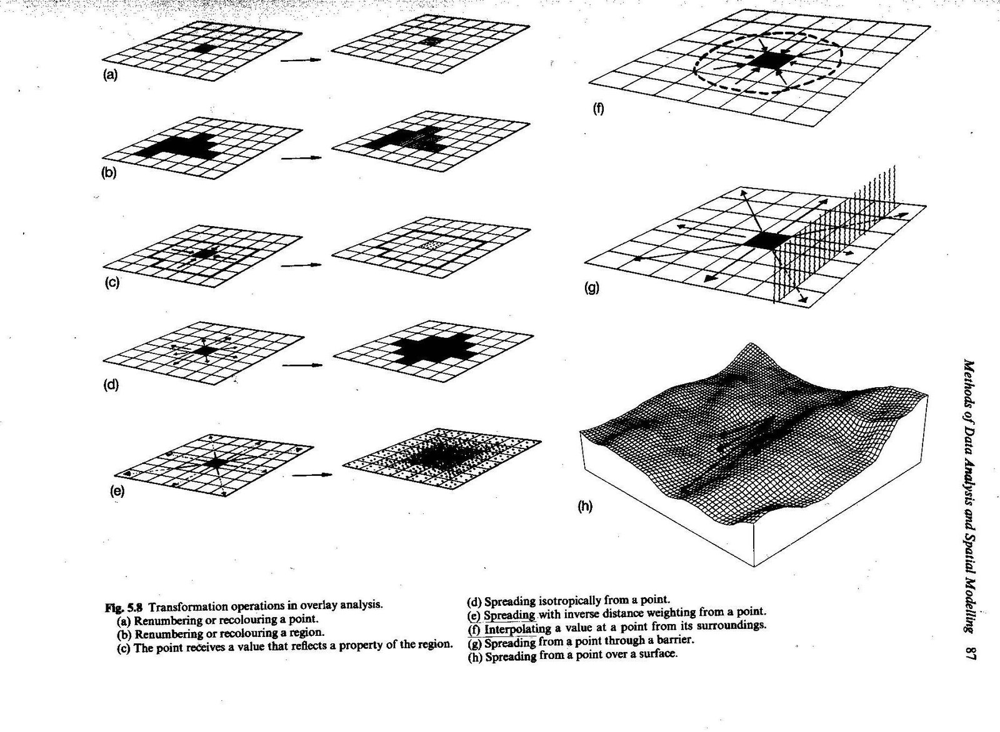

<!-- A catalog of transformation operations in overlay analysis: renumbering and reclassing a point or a region; a point taking a value that reflects a property of its region; spreading isotropically from a point; spreading with inverse-distance weighting; interpolating a value at a point from its surroundings; spreading from a point through a barrier; spreading from a point over a surface. Walk two or three of them and ask which family - local, focal, global - each belongs to. -->

<!-- TODO(instructor): this is a scanned figure from a textbook (the page footer reads "Methods of Data Analysis and Spatial Modelling", p. 87). It carries no attribution on the source slide. Add the citation or replace the figure. -->

---

# Moving Windows

<div class="columns">
<div>

- Useful for calculating **local statistical functions** or **edge detection**
- **Kernel**: a set of constants applied with a function — such as 1/9 being the mean of the center cell and its eight neighbors
- Other configurations may be used when dealing with diagonal or adjacent cells

</div>
<div>

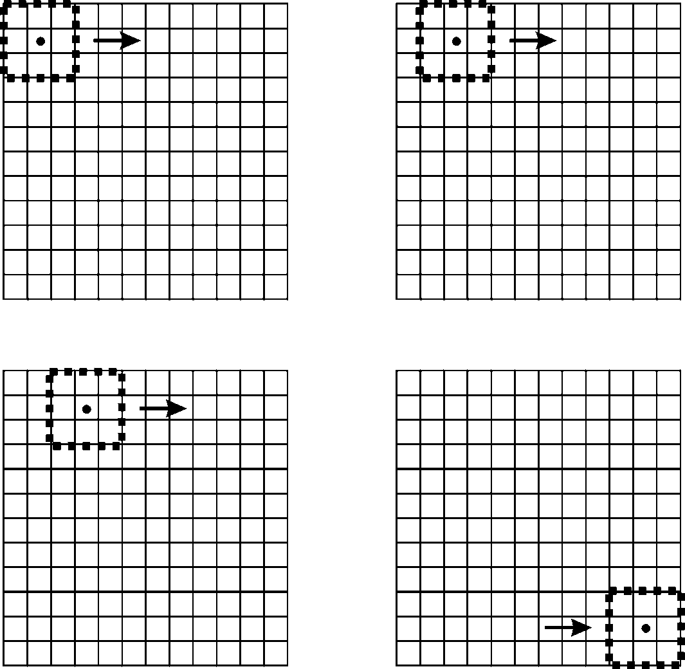

<span style="font-size:0.7em">© Paul Bolstad, *GIS Fundamentals*</span>

</div>
</div>

<!-- The dashed box is the window; it steps one cell at a time across the whole grid, and at every stop it writes one number to the output. Ask what happens at the edge of the grid - the window hangs off, and the output is NoData unless you tell the tool otherwise. -->

---

# Moving Windows: Noise Removal

<div class="columns">
<div>

- **Noise removal**
- Noise may be erroneous data values, or spikes we wish to remove
- Gores, or spikes in a DEM, may be removed through **filtering** and **smoothing**
- The same window, a different function: a low-pass filter averages the spike away, a high-pass filter makes it stand out

</div>
<div>

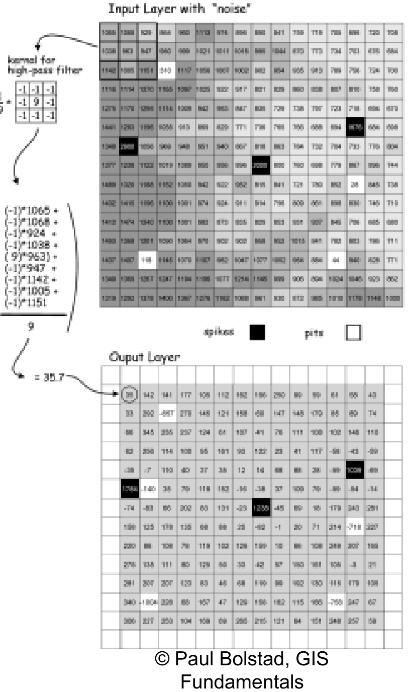

<span style="font-size:0.7em">© Paul Bolstad, *GIS Fundamentals*</span>

</div>
</div>

<!-- Input layer with noise, a kernel for a high-pass filter, output layer. The arithmetic in the middle is one window position worked out longhand. Point out the cost: smoothing removes real detail along with the spike, so a smoothed DEM makes a worse slope map. -->

---

# Raster Analysis: Overlay and Cost Surfaces

<div class="columns">
<div>

- A look at some raster functions
- In ArcGIS Pro, run through the **Raster Calculator** tool in the Geoprocessing pane (Spatial Analyst), or script it with **arcpy** and the `arcpy.sa` map-algebra syntax
- Historically the same work was written as GRID `DOCELL` blocks:

<div style="font-size:0.55em">

```
DOCELL
  if (ingrid1 > 5 & ingrid < 50) outgrid = 500
     else if (ingrid1 == 50) outgrid = 700
     else if (ingrid1 > 50 & ingrid < 100) outgrid = 800
     else outgrid = 1000
END
```

</div>

</div>
<div>

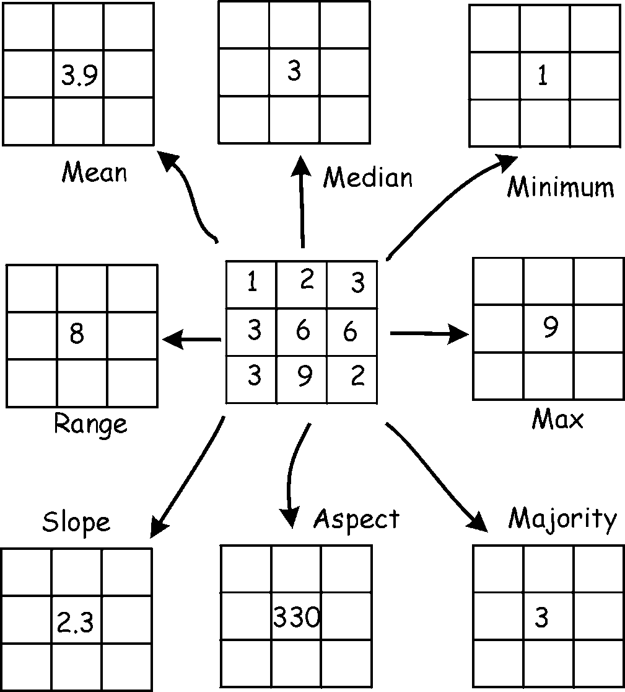

<span style="font-size:0.7em">© Paul Bolstad, *GIS Fundamentals*</span>

</div>
</div>

<!-- One 3x3 window, eight different focal functions, eight different answers: mean 3.9, median 3, minimum 1, range 8, max 9, majority 3, slope 2.3, aspect 330. The DOCELL block is the ancestor of Con() nested inside Con() in the Raster Calculator; it is here for context, not to be typed. -->

<!-- TODO(instructor): the DOCELL example is reproduced verbatim from the source slide and has two defects worth fixing or teaching from - it switches between `ingrid1` and `ingrid`, and the ranges leave gaps (values 0 to 5, and 100 and above, all fall to the final `else`). Decide whether to correct it, replace it with the ArcGIS Pro `Con()` equivalent, or keep it as a debugging exercise. -->

<!-- Legacy wording note: the source slide said "Tour of ARC/INFO Grid help", "the command line in ArcInfo", and "Addition of scripts to automate tasks". Updated to ArcGIS Pro Raster Calculator and arcpy. -->

---

# Terrain Ruggedness Index

<div class="columns">
<div>

A focal function on a DEM: compare the center cell to each of its **eight neighbors**.

$$
Y = \left[\;\sum (x_{ij} - x_{oo})^2\;\right]^{1/2}
$$

where

- **Y** = estimated terrain ruggedness index ("tri") of cell (0,0)
- **x<sub>ij</sub>** = elevation of a neighbor cell to cell (0,0)

</div>
<div>

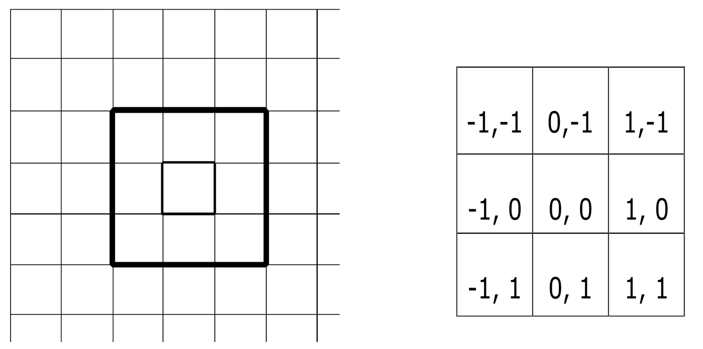

</div>
</div>

<!-- The right-hand table is the neighbor offsets: (-1,-1) through (1,1), with (0,0) at the center. TRI is the root of the summed squared elevation differences, so it has units of meters and it is large where the surface changes fast in any direction. Flat ground gives zero. -->

<!-- VERIFY: the summation symbol did not survive the source slide's embedded equation - the rendered formula reads "Y = [ (xij - xoo)^2 ]^1/2" with a blank where the sigma belongs. It is restored here from the DOCELL implementation on the next slide, which sums eight squared differences before taking the square root. Confirm before class. -->

---

# TRI, Written Out

```
docell
    ssdiff := ((sqr (el (0, 0) - el (-1, -1))) + (sqr (el (0, 0) - el (0, -1)))
            + (sqr (el (0, 0) - el (1, -1))) + (sqr (el (0, 0) - el (-1, 0)))
            + (sqr (el (0, 0) - el (1, 0))) + (sqr (el (0,0) - el (-1,1)))
            + (sqr (el (0, 0) - el (0, 1))) + (sqr (el (0, 0) - el (1, 1))))

    tri  =  sqrt (ssdiff)
end
```

- `ssdiff` = temporary scalar, "sum squared difference" (square meters)
- `tri` = terrain ruggedness index (meters)
- `el` = name of elevation grid (meters)

<!-- Eight terms, one per neighbor, each a squared difference from the center. Then one square root. Read it aloud once and the formula on the previous slide stops being abstract. The modern equivalent is a single Raster Calculator expression, or the Focal Statistics range/standard-deviation tools as an approximation. -->

<!-- TODO(graphic): a screenshot of the equivalent expression typed into the ArcGIS Pro Raster Calculator would replace this bare code slide. -->

<!-- Note: the source slide labels the variable "terrain roughness index" here and "Terrain Ruggedness Index" in the title. Kept verbatim. -->

---

# TRI Across Montana

<div class="imggrid" style="grid-template-columns: 1.71fr 1.38fr 2.21fr;">

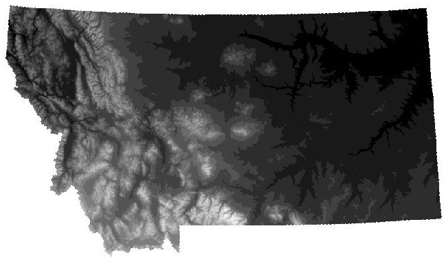

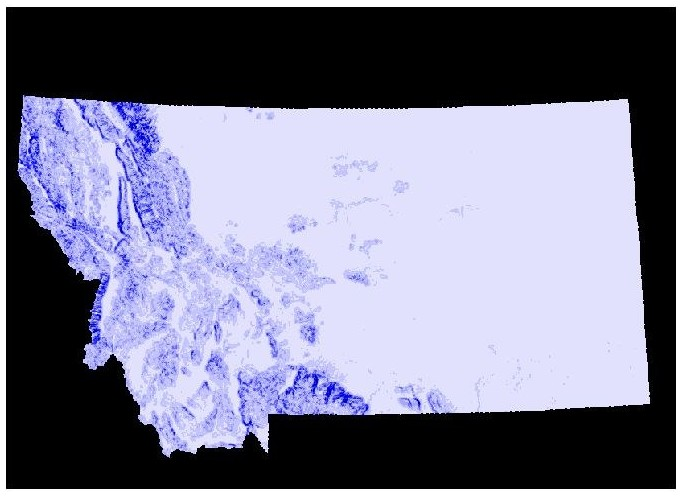

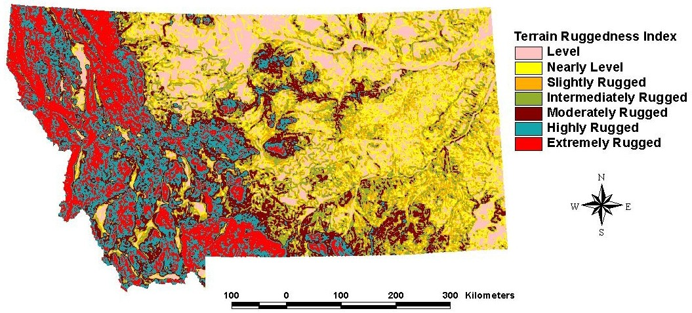

</div>

Elevation → continuous ruggedness → classified ruggedness

<!-- Left: the input DEM. Center: TRI as a continuous surface - the Rockies light up, the eastern plains go flat. Right: the same surface reclassified into named categories from Level to Extremely Rugged. That last step is a local function, and it is the moment a measurement becomes a label. Ask who chose the class breaks and on what basis. -->

<!-- VERIFY: the three source panels carry no captions. The reading given here - DEM, continuous TRI, classified TRI - is inferred from the images and from the legend on the third panel. -->

---

# Raster Functions in ArcGIS Pro

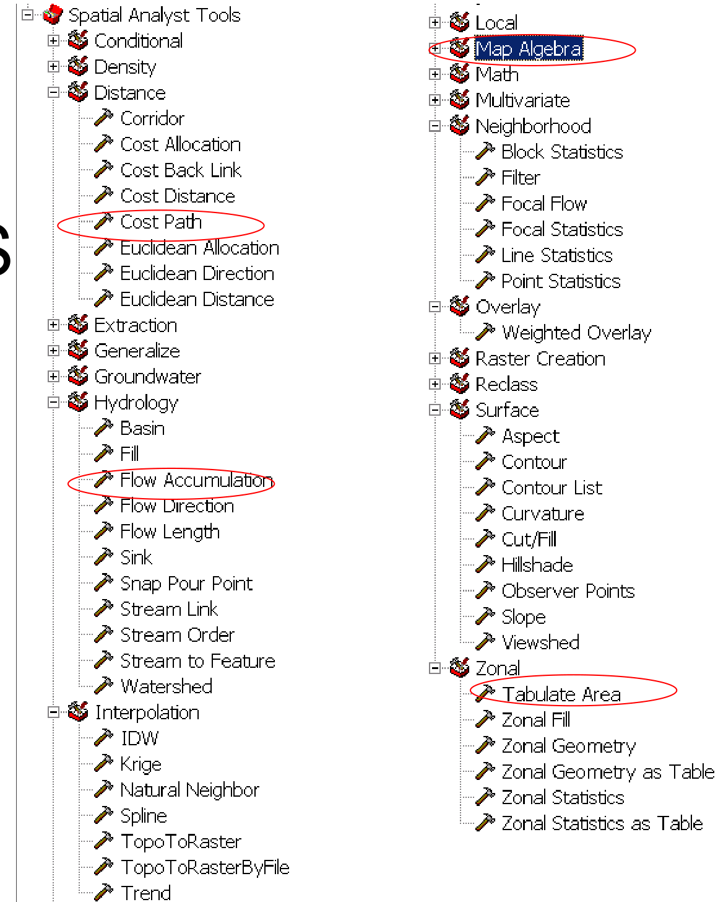

The **Spatial Analyst** toolbox is organized by the families we just named:

- **Local**: Map Algebra, Math, Reclass
- **Neighborhood**: Block Statistics, Filter, Focal Statistics
- **Surface**: Slope, Aspect, Hillshade, Contour, Viewshed
- **Hydrology**: Fill, Flow Direction, Flow Accumulation, Watershed
- **Zonal**: Tabulate Area, Zonal Statistics

Reach all of it from the **Geoprocessing pane** search box, or from **Toolboxes** in the **Catalog** pane.

<!-- Spend a few minutes browsing the live toolbox rather than the screenshot. The point is that the toolbox is organized exactly the way the lecture was: by how much of the grid each function reads. -->

<!-- Legacy screenshot: this is an ArcToolbox tree from ArcMap, not the ArcGIS Pro Geoprocessing pane. Flagged for re-capture. Note also that the Distance toolset shown here lists the deprecated Cost Distance / Cost Back Link / Cost Path tools; current practice is Distance Accumulation and Optimal Path As Line, which is the Week 11 topic. -->

<!-- TODO(graphic): re-capture as the ArcGIS Pro Geoprocessing pane with the Spatial Analyst toolbox expanded. -->

---

# Before Next Class


- **Lab 2 — NDVI**: [assignments/lab-02](https://byu-hydroinformatics.github.io/ce414-gis-applications/assignments/lab-02/)
  NDVI is a single **local** map-algebra expression on two raster bands. Everything in Part 1 of today applies directly
- **Reading**: see the syllabus
- **Open-book quiz** on Learning Suite
- **Office hours**: [calendly.com/dan-ames/office-hours](https://calendly.com/dan-ames/office-hours)

<!-- Point them at the lab and connect it back: NDVI is the same cell-by-cell arithmetic, run on two bands of the same image rather than two separate grids, so extent and cell size are guaranteed to match. -->

<!-- TODO(instructor): reading chapter -->

<!-- TODO(instructor): this deck never introduces NDVI, but the lab that follows it is entirely NDVI. Consider adding two or three slides that teach NDVI with sensor-specific band selection, including Landsat 8/9 examples. Band numbers differ by sensor, so none are asserted here. -->

<!-- Conversion notes (2026-09-03): Source deck "CE 414 Week 3 - Raster Analysis and Map Algebra.pptx", 22 slides, converted to 24. No source slides dropped; nothing in the deck was genuinely empty. Slide 13 ("Part 2") was a bare section divider and is kept as a `lead` slide with a subtitle. Slides 15, 20 and 21 carried images with no title text and have been given titles. Added: a Today's Goals slide and a Before Next Class slide.

Slides 19-21 of the source were built from PowerPoint shapes and EMF objects; those regions were re-rendered from the PDF at 200 dpi rather than rebuilt (ra-tri-neighborhood.png, ra-grid-multiply-example.png, ra-spatial-analyst-toolbox-legacy.png, ra-noise-filtering.png).

Version wording updated to ArcGIS Pro: "Tour of ARC/INFO Grid help" and "the command line in ArcInfo" became the Raster Calculator in the Geoprocessing pane plus arcpy; "A tour of raster functions in ArcGIS" became ArcGIS Pro with the Geoprocessing and Catalog panes named. Concepts were not changed. Both DOCELL blocks are reproduced verbatim.

Stale screenshots kept and flagged, none fabricated: ra-arcscene-dem-legacy.jpg and ra-arcscene-city-legacy.jpg (ArcGIS 9-era ArcScene), ra-spatial-analyst-toolbox-legacy.png (ArcMap ArcToolbox tree, which also shows the deprecated Cost Distance / Cost Path tools), ra-map-algebra-spreadsheet.png (Excel 2003-era).

Open items are marked in place: TODO(instructor) on the title slide (leftover ModelBuilder speaker note), on the spreadsheet slide (the course plan's cell-by-cell / NoData / data type / extent / cell size / snap raster / resampling material and the raster-calculator prediction exercise), on the overlay-transformations figure (uncited textbook scan), on the DOCELL example (inconsistent variable name and gaps in the ranges), and on the Before Next Class slide (reading chapter; NDVI with sensor-specific band selection). TODO(graphic) on the ArcScene slide, the TRI code slide, and the toolbox slide. VERIFY on the TRI formula (the summation symbol did not survive the source EMF and was reconstructed from the DOCELL code) and on the three Montana panels (captions inferred; the source gave none). No Landsat band numbers were added. -->
