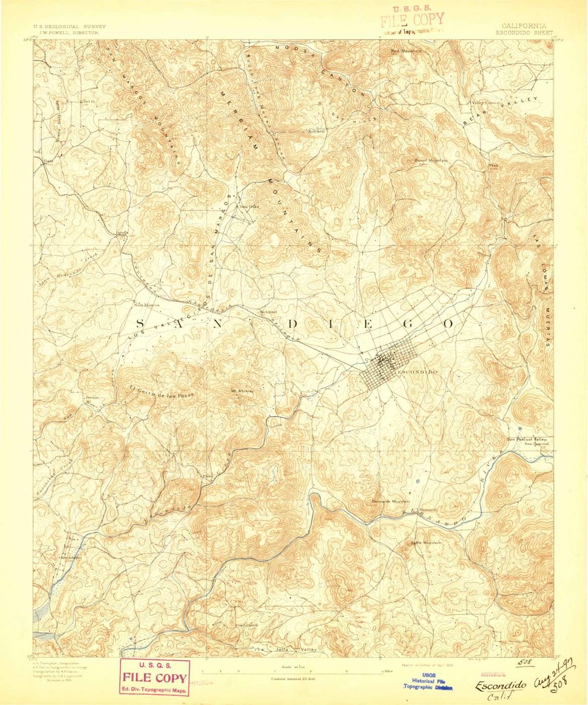
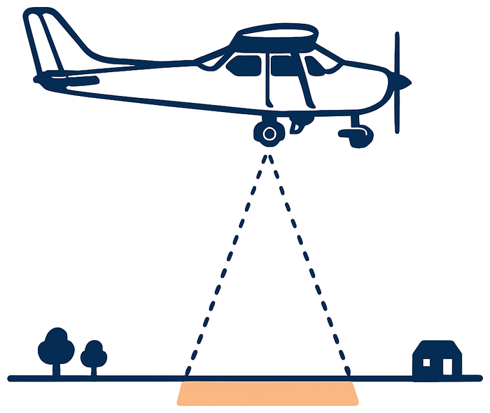
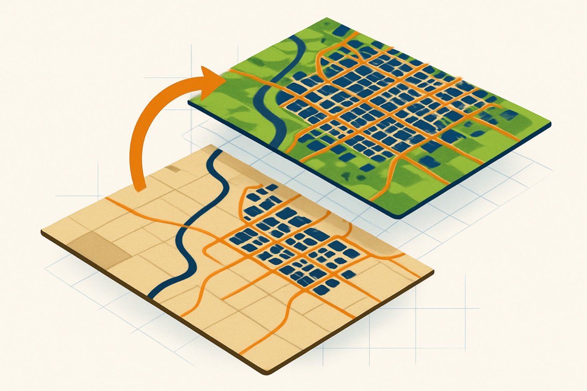
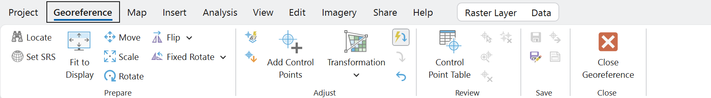
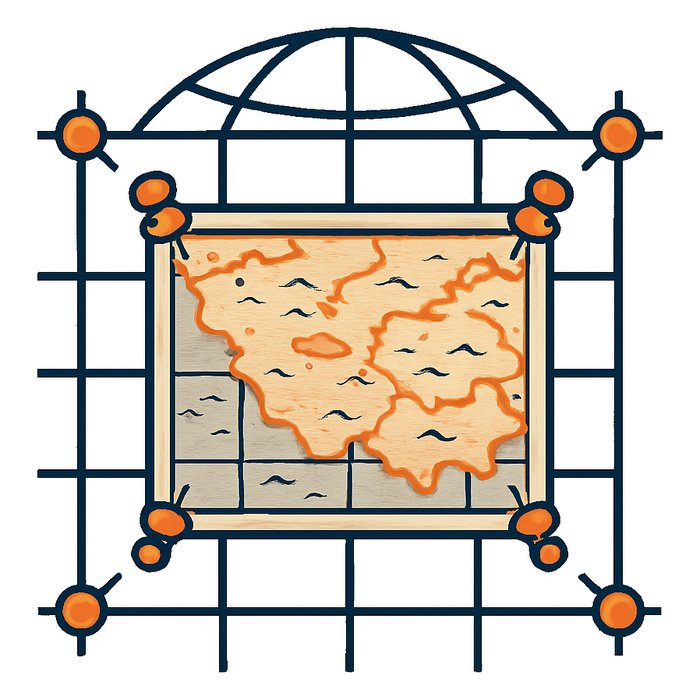
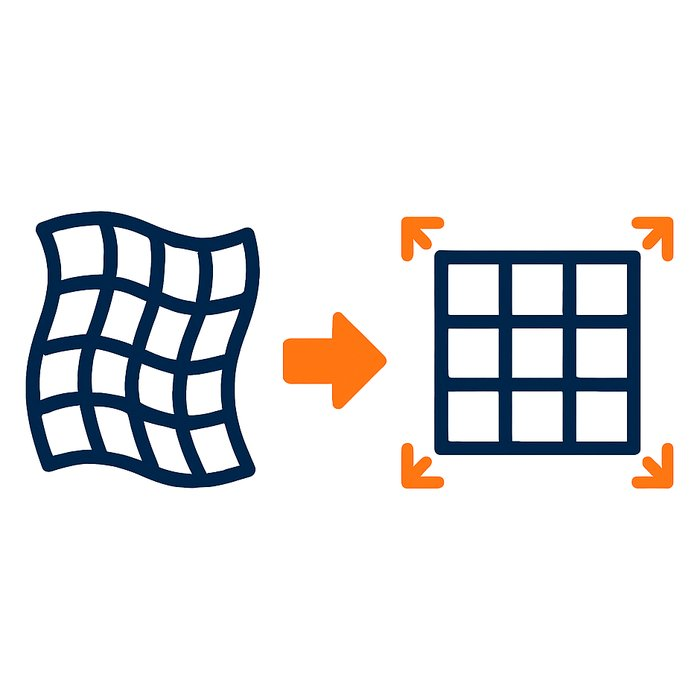
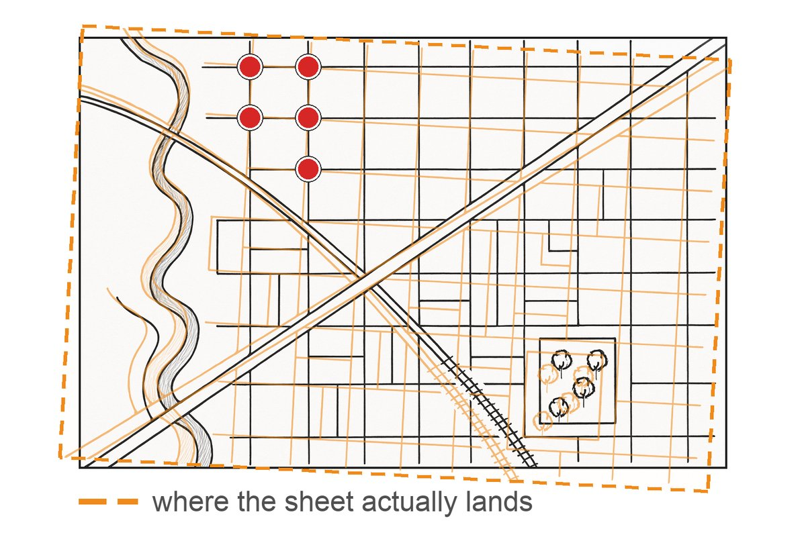
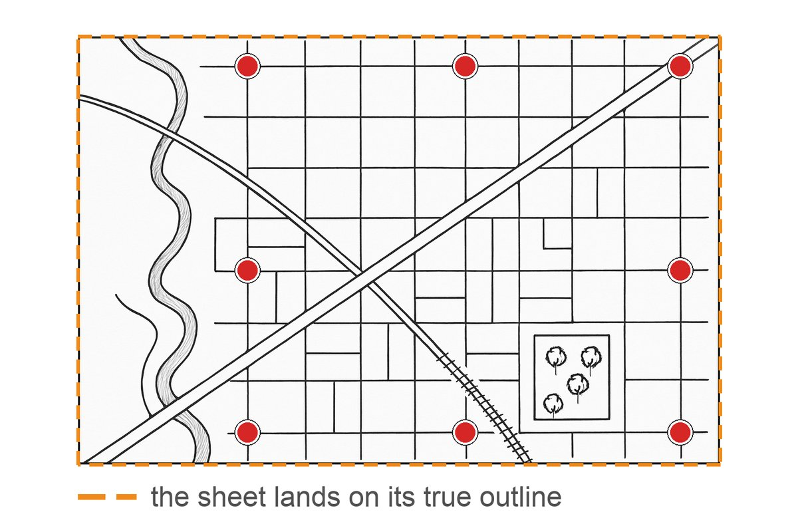

<!-- _class: lead -->
<!-- _paginate: skip -->

# Georectifying Images

CE 414 Engineering Applications of GIS
Dr. Dan Ames
Civil & Construction Engineering
Brigham Young University

<!-- Concepts lecture for Week 4. Lab 3, Georectifying and Digitizing, is where students do this themselves in ArcGIS Pro. -->

<!-- TODO(instructor): the source title slide carried a speaker note that is a ModelBuilder workshop abstract left over from another deck. It was not carried across. Confirm nothing was lost. -->

<!-- stamp:begin -->
<!-- _footer: 'CE 414 · Week 4 — Georectifying ImagesLast Updated: 2026-09-21© 2026 Daniel P. Ames · <a href="https://creativecommons.org/licenses/by/4.0/">CC BY 4.0</a>' -->
<!-- stamp:end -->

---

# Today's Goals

By the end of class you should be able to:

- Say what it means to **georectify** an image, and which images cannot be
- Name what a georectified raster stores: an origin, a cell size, a coordinate system
- Name the three steps: **georectify → digitize → analyze**, and why that order
- Say where **control points** belong, and why their spread beats their number
- Read a **residual** and a **total RMS error**, and say why a small one proves nothing

<!-- Set expectations. This is the concepts hour; the hands-on version is Lab 3, where students georeference a scanned map in ArcGIS Pro and digitize features off it. -->

---

<!-- _class: activity -->

# In-Class Activity

- Turn off your computer monitor
- Take a blank piece of paper
- Draw, from memory, a map of your childhood neighborhood, including distinguishing points, lines and polygons
- Take a photo of it

<!-- Give them about five minutes. Keep the photo on their phone — partway through class they will follow along and georeference their own drawing, so the drawing has to be theirs and it has to be rough. -->

---

# Problem…

**Meet Kristin Ulmer, Ph.D.**

- **She has:** a map figure in a publication
- **She needs:** a shapefile of the locations of sand boils and standard penetration tests (SPTs) after the 1990 Luzon earthquake in Dagupan City, the Philippines

<!-- A former CE 414 student wrote in to say she had used georeferencing constantly in her research: "I have used georeferencing a TON in my recent research project. As I was georeferencing yet another image today, I thought about the assignment I did for your class where I first learned how to georeference an old map and put it in its place in the world." The lower photo is street damage from liquefaction and lateral spreading in Dagupan City. -->

<!-- TODO(instructor): guest speaker slide — still relevant? Decide whether to keep the portrait and the name on a public course site, or reduce this to the problem statement alone. -->

---

# Problem…

- Where does this map fit on the earth?
- What are our options for turning this into GIS data?

<!-- This is the figure she started from: a scanned page from a published paper showing the locations of sounding tests in Dagupan City. It has streets, a river, a north arrow and a scale bar, but no coordinates the computer can use. The photo on the left is a sand boil in a field, the surface evidence of liquefaction. Ask the class: what would you have to know to place this figure on the earth? -->

---

# Solution…

<!-- The same figure, georeferenced onto satellite imagery of Dagupan City, with liquefaction observations digitized as points. From the researcher: "The figure shows locations of SPT boreholes drilled throughout the city after the M7.7 1990 Luzon earthquake. The paper documented all of the locations where liquefaction was or was not observed, so I marked those locations with pink dots based on the descriptions. I used the image to get coordinates for the SPT sites marked on the map." The result went into an open database of liquefaction case histories: nextgenerationliquefaction.org. -->

---

# KFC-UK Demo

**Is the future of Britain written in this piece of KFC?**

- A live demo: any image at all can be dropped into a coordinate system
- Whether the result *means* anything is a separate question
- <a href="http://i.dailymail.co.uk/i/pix/2014/09/16/1410875785556_wps_47_KFC_UK_It_wasn_t_just_the.jpg" target="_blank">Source image</a>

<!-- The joke slide, and a real demo. Georeference the piece of chicken over a map of Great Britain in front of the class: pick control points at Land's End, the tip of Scotland, and East Anglia, and let students watch the image warp into place. The lesson underneath the joke is that the software will happily georeference anything you give it, so the judgment about what makes a valid control point is yours. -->

<!-- TODO(instructor): the source image is a Daily Mail photo. Confirm the rights before this deck is published to a public site, or swap in a substitute. -->

---

# What does it mean to "georectify" an image?

Start with an image that shows features of interest:

- A **map**
- A **drawing**
- An **aerial photo**

<!-- Two kinds of source image: a hand-drawn sketch map, and the 1893 USGS Escondido sheet that the Lab 3 handout georeferences, shown here as it comes from the scanner: no coordinates, a paper map with a north arrow and a scale bar. The next four slides sort images into ones you can georeference and ones you cannot. -->

<!-- The Escondido sheet is USGS Historical Topographic Map Collection item 297424 (1:62,500, edition of 1893), public domain, downloaded from prd-tnm.s3.amazonaws.com and rasterized at 110 dpi. -->

---

# Can this map be georeferenced?

* No

<!-- An 1870s bird's-eye lithograph of Salt Lake City. Beautiful, and useless for georectifying: it is drawn in oblique perspective, so the scale changes continuously from the foreground to the mountains. No two-dimensional transformation can make it line up with a map. -->

---

# Can this photo be georeferenced?

* No

<!-- An oblique aerial photo of Salt Lake City, shot out the side of an airplane. Same problem as the lithograph: the camera was not pointed straight down, so near objects are at a different scale from far ones and tall buildings lean. This is a photo of a place, not a plan view of it. -->

---

<h1 style="font-size:0.95em">Can this earthquake map from 1990 be georeferenced?</h1>

* Yes! Because it is an orthographic (plan) view

<!-- The Utah Geological and Mineral Survey earthquake fault map of a portion of Salt Lake County. It is drawn in plan view, looking straight down, at a constant scale, with a scale bar. That is what makes it georectifiable. The source slide labeled this "Orthograph." -->

---

<h1 style="font-size:1.05em">Can this aerial photo of a park be georeferenced?</h1>

* Yes! It is an orthophoto that is nearly nadir
  

<!-- An orthophoto: an aerial image taken looking straight down and already corrected so that scale is constant across the frame. Ask what tells you this is nadir and not oblique — the buildings do not lean, and the streets stay parallel across the whole image. The diagram appears with the answer: the camera under the airplane points straight down, so the patch of ground it records is directly beneath it and at one scale. -->

---

# What does it mean to "georectify" an image?

- Locate the image's spatial coordinates in some projected coordinate system
- For example: the latitude and longitude of the lower-left corner, plus the width and height of each cell (pixel)

<!-- This is the whole idea in one picture. Once you know where one corner sits and how big a pixel is on the ground, every other pixel has a location too. The coordinate values on this slide are made up for illustration; the imagery is not at that latitude and longitude. -->

---

# What does it mean to "georectify" an image?

Distort or un-distort the image if needed to fit the specific projection…

<!-- Fitting an image to a coordinate system is usually not just a shift and a scale. The image has to be stretched, rotated, and sometimes bent so that features land where they belong in the target projection. The bigger the area and the rougher the source, the more warping it takes. -->

---

# Why would you need to georectify an image?

- To identify current conditions from a photo
- To see changes over time
- To digitize features and create a vector data set

<!-- Three motivations. The third is the one Lab 3 exercises: georectify a scanned map, then trace the features off it into a new feature class. Ask for examples from their own disciplines — a hand-marked as-built drawing, a historical flood photo, a 1950s plat map. -->

<!-- The graphic stacks two aerial views of the same town on one coordinate grid — an old sepia photo of farmland below, a modern color view above with the same river but far more buildings — with orange road lines and navy building polygons digitized off each. -->

---

# A paper fault map

You are handed this paper copy earthquake fault map. You want to analyze the fault lines in GIS. How?

1. **Georectify** the image
2. **Digitize** the features
3. **Analyze** the features!

<!-- The orange lines are the digitized product drawn over the scanned map. Walk the three steps: the scan has no coordinates, so georectify it; the fault traces are pixels, not features, so digitize them; only then can you buffer, intersect, or measure them. -->

---

# An aerial photo of a cemetery

You are handed an aerial photo of a cemetery taken from an airplane. You want to map the features on it in GIS. How?

1. **Georectify** the image
2. **Digitize** the features
3. **Analyze** the features!

<svg viewBox="270 88 1130 470" style="width: 100%; height: auto; display: block;" role="img" aria-label="Aerial photo of a cemetery with its paved loop paths traced as orange polylines">

<image href="images/geo-cemetery-orthophoto.jpg" x="0" y="0" width="1500" height="652"/>
<path class="cem-trace cem-1" style="--len:925" stroke-dasharray="925" d="M 305,445 L 330.3,450.2 L 353.9,456.4 L 374.4,464.9 L 396.9,469.9 L 424.7,466.7 L 449.7,463.3 L 471.4,457.7 L 492,450.2 L 511.9,440.8 L 530.7,430.5 L 550.1,423.6 L 570,420.6 L 589.4,424.4 L 606.3,437 L 623.8,451 L 645.9,456.3 L 662.7,470 L 680.1,475.2 L 691.1,481.7 L 701.7,492.1 L 718.2,502.3 L 739.9,504.5 L 761.8,498.1 L 782.5,489.2 L 803.3,480.1 L 825.8,471.5 L 849.2,464.8 L 871.1,464.9 L 889.9,466.9 L 908.8,469.7 L 929.9,475.7 L 953.7,476 L 976.9,478.2 L 998.7,473.6 L 1016.9,459.5 L 1036.8,447.8 L 1053.1,432.3 L 1067.4,415.5 L 1079,396.5 L 1088.6,375.2 L 1101.6,355.9 L 1103,333"><title>winding path through the west lobe</title></path>
<path class="cem-trace cem-2" style="--len:494" stroke-dasharray="494" d="M 1048.1,142.5 L 1030.4,130.2 L 1010.6,120.7 L 989.6,115.1 L 967.8,113 L 946.6,113.7 L 927.8,119 L 913.5,129.2 L 907.8,144.4 L 909.1,162.7 L 905.8,182.2 L 910.5,202.6 L 911.8,224.6 L 914.3,245.3 L 925.9,260.1 L 941.8,269.6 L 959.8,273.9 L 977.9,271.8 L 993.9,263.9 L 1005.7,252.2 L 1012.4,237.8 L 1022.7,222 L 1029.8,202.4 L 1038.4,183.5 L 1047.7,164 Z"><title>west loop</title></path>
<path class="cem-trace cem-3" style="--len:587" stroke-dasharray="587" d="M 1049.2,148.8 L 1062.4,146 L 1081.7,144.8 L 1101.6,143.6 L 1120.5,142.5 L 1137.3,149.4 L 1152.9,158.5 L 1170.3,165.4 L 1185.7,174.1 L 1181.8,194.8 L 1180.7,218.3 L 1179.5,242 L 1174.2,264.6 L 1166,285.4 L 1155.9,304.7 L 1141.1,320.8 L 1122.6,332.3 L 1103,333 L 1085.9,314.3 L 1072.6,295.2 L 1058.9,279.4 L 1043.3,267.1 L 1025.6,260.7 L 1011.8,256.2 L 1008.5,246.2 L 1010.1,235 L 1022.2,221.9 L 1029.8,202.5 L 1038.4,183.4 L 1046.8,164.7 Z"><title>center loop</title></path>
<path class="cem-trace cem-4" style="--len:482" stroke-dasharray="482" d="M 1103,333 L 1124.8,333.9 L 1150.6,327 L 1178.3,329.9 L 1204.9,335.4 L 1227.3,347.7 L 1248.4,361.1 L 1270.7,365.5 L 1286.6,352.5 L 1293.1,331.8 L 1298.7,309.5 L 1301.9,285.4 L 1302.8,259.8 L 1300.7,234.1 L 1297,209.5 L 1286.8,189 L 1269.9,175.2 L 1249.1,167.9 L 1227.3,164.9 L 1206.9,164.4 L 1188.2,165.3 L 1185.7,174.1"><title>northeast loop</title></path>
<path class="cem-trace cem-5" style="--len:519" stroke-dasharray="519" d="M 1103,333 L 1105.3,351.8 L 1106.4,369.1 L 1112.9,385.4 L 1120.9,400.7 L 1126.7,416.2 L 1128.4,434.4 L 1131.2,454.2 L 1132.6,473.5 L 1128.9,491.1 L 1125.8,507.1 L 1125.4,521.2 L 1138.3,531.3 L 1160.2,537.1 L 1184.9,539.9 L 1209.3,536.9 L 1232.1,530.2 L 1253.3,519.8 L 1271.5,502.6 L 1283.9,481.1 L 1288,458.5 L 1286.2,436.1 L 1282,413.3 L 1273.5,391.7 L 1262.1,372.7 L 1243.2,359.9"><title>south loop</title></path>
<g class="cem-vtx cem-v1"><circle cx="305" cy="445" r="3.5"/><circle cx="330.3" cy="450.2" r="3.5"/><circle cx="353.9" cy="456.4" r="3.5"/><circle cx="374.4" cy="464.9" r="3.5"/><circle cx="396.9" cy="469.9" r="3.5"/><circle cx="424.7" cy="466.7" r="3.5"/><circle cx="449.7" cy="463.3" r="3.5"/><circle cx="471.4" cy="457.7" r="3.5"/><circle cx="492" cy="450.2" r="3.5"/><circle cx="511.9" cy="440.8" r="3.5"/><circle cx="530.7" cy="430.5" r="3.5"/><circle cx="550.1" cy="423.6" r="3.5"/><circle cx="570" cy="420.6" r="3.5"/><circle cx="589.4" cy="424.4" r="3.5"/><circle cx="606.3" cy="437" r="3.5"/><circle cx="623.8" cy="451" r="3.5"/><circle cx="645.9" cy="456.3" r="3.5"/><circle cx="662.7" cy="470" r="3.5"/><circle cx="680.1" cy="475.2" r="3.5"/><circle cx="691.1" cy="481.7" r="3.5"/><circle cx="701.7" cy="492.1" r="3.5"/><circle cx="718.2" cy="502.3" r="3.5"/><circle cx="739.9" cy="504.5" r="3.5"/><circle cx="761.8" cy="498.1" r="3.5"/><circle cx="782.5" cy="489.2" r="3.5"/><circle cx="803.3" cy="480.1" r="3.5"/><circle cx="825.8" cy="471.5" r="3.5"/><circle cx="849.2" cy="464.8" r="3.5"/><circle cx="871.1" cy="464.9" r="3.5"/><circle cx="889.9" cy="466.9" r="3.5"/><circle cx="908.8" cy="469.7" r="3.5"/><circle cx="929.9" cy="475.7" r="3.5"/><circle cx="953.7" cy="476" r="3.5"/><circle cx="976.9" cy="478.2" r="3.5"/><circle cx="998.7" cy="473.6" r="3.5"/><circle cx="1016.9" cy="459.5" r="3.5"/><circle cx="1036.8" cy="447.8" r="3.5"/><circle cx="1053.1" cy="432.3" r="3.5"/><circle cx="1067.4" cy="415.5" r="3.5"/><circle cx="1079" cy="396.5" r="3.5"/><circle cx="1088.6" cy="375.2" r="3.5"/><circle cx="1101.6" cy="355.9" r="3.5"/><circle cx="1103" cy="333" r="3.5"/></g>
<g class="cem-vtx cem-v2"><circle cx="1048.1" cy="142.5" r="3.5"/><circle cx="1030.4" cy="130.2" r="3.5"/><circle cx="1010.6" cy="120.7" r="3.5"/><circle cx="989.6" cy="115.1" r="3.5"/><circle cx="967.8" cy="113" r="3.5"/><circle cx="946.6" cy="113.7" r="3.5"/><circle cx="927.8" cy="119" r="3.5"/><circle cx="913.5" cy="129.2" r="3.5"/><circle cx="907.8" cy="144.4" r="3.5"/><circle cx="909.1" cy="162.7" r="3.5"/><circle cx="905.8" cy="182.2" r="3.5"/><circle cx="910.5" cy="202.6" r="3.5"/><circle cx="911.8" cy="224.6" r="3.5"/><circle cx="914.3" cy="245.3" r="3.5"/><circle cx="925.9" cy="260.1" r="3.5"/><circle cx="941.8" cy="269.6" r="3.5"/><circle cx="959.8" cy="273.9" r="3.5"/><circle cx="977.9" cy="271.8" r="3.5"/><circle cx="993.9" cy="263.9" r="3.5"/><circle cx="1005.7" cy="252.2" r="3.5"/><circle cx="1012.4" cy="237.8" r="3.5"/><circle cx="1022.7" cy="222" r="3.5"/><circle cx="1029.8" cy="202.4" r="3.5"/><circle cx="1038.4" cy="183.5" r="3.5"/><circle cx="1047.7" cy="164" r="3.5"/></g>
<g class="cem-vtx cem-v3"><circle cx="1049.2" cy="148.8" r="3.5"/><circle cx="1062.4" cy="146" r="3.5"/><circle cx="1081.7" cy="144.8" r="3.5"/><circle cx="1101.6" cy="143.6" r="3.5"/><circle cx="1120.5" cy="142.5" r="3.5"/><circle cx="1137.3" cy="149.4" r="3.5"/><circle cx="1152.9" cy="158.5" r="3.5"/><circle cx="1170.3" cy="165.4" r="3.5"/><circle cx="1185.7" cy="174.1" r="3.5"/><circle cx="1181.8" cy="194.8" r="3.5"/><circle cx="1180.7" cy="218.3" r="3.5"/><circle cx="1179.5" cy="242" r="3.5"/><circle cx="1174.2" cy="264.6" r="3.5"/><circle cx="1166" cy="285.4" r="3.5"/><circle cx="1155.9" cy="304.7" r="3.5"/><circle cx="1141.1" cy="320.8" r="3.5"/><circle cx="1122.6" cy="332.3" r="3.5"/><circle cx="1103" cy="333" r="3.5"/><circle cx="1085.9" cy="314.3" r="3.5"/><circle cx="1072.6" cy="295.2" r="3.5"/><circle cx="1058.9" cy="279.4" r="3.5"/><circle cx="1043.3" cy="267.1" r="3.5"/><circle cx="1025.6" cy="260.7" r="3.5"/><circle cx="1011.8" cy="256.2" r="3.5"/><circle cx="1008.5" cy="246.2" r="3.5"/><circle cx="1010.1" cy="235" r="3.5"/><circle cx="1022.2" cy="221.9" r="3.5"/><circle cx="1029.8" cy="202.5" r="3.5"/><circle cx="1038.4" cy="183.4" r="3.5"/><circle cx="1046.8" cy="164.7" r="3.5"/></g>
<g class="cem-vtx cem-v4"><circle cx="1103" cy="333" r="3.5"/><circle cx="1124.8" cy="333.9" r="3.5"/><circle cx="1150.6" cy="327" r="3.5"/><circle cx="1178.3" cy="329.9" r="3.5"/><circle cx="1204.9" cy="335.4" r="3.5"/><circle cx="1227.3" cy="347.7" r="3.5"/><circle cx="1248.4" cy="361.1" r="3.5"/><circle cx="1270.7" cy="365.5" r="3.5"/><circle cx="1286.6" cy="352.5" r="3.5"/><circle cx="1293.1" cy="331.8" r="3.5"/><circle cx="1298.7" cy="309.5" r="3.5"/><circle cx="1301.9" cy="285.4" r="3.5"/><circle cx="1302.8" cy="259.8" r="3.5"/><circle cx="1300.7" cy="234.1" r="3.5"/><circle cx="1297" cy="209.5" r="3.5"/><circle cx="1286.8" cy="189" r="3.5"/><circle cx="1269.9" cy="175.2" r="3.5"/><circle cx="1249.1" cy="167.9" r="3.5"/><circle cx="1227.3" cy="164.9" r="3.5"/><circle cx="1206.9" cy="164.4" r="3.5"/><circle cx="1188.2" cy="165.3" r="3.5"/><circle cx="1185.7" cy="174.1" r="3.5"/></g>
<g class="cem-vtx cem-v5"><circle cx="1103" cy="333" r="3.5"/><circle cx="1105.3" cy="351.8" r="3.5"/><circle cx="1106.4" cy="369.1" r="3.5"/><circle cx="1112.9" cy="385.4" r="3.5"/><circle cx="1120.9" cy="400.7" r="3.5"/><circle cx="1126.7" cy="416.2" r="3.5"/><circle cx="1128.4" cy="434.4" r="3.5"/><circle cx="1131.2" cy="454.2" r="3.5"/><circle cx="1132.6" cy="473.5" r="3.5"/><circle cx="1128.9" cy="491.1" r="3.5"/><circle cx="1125.8" cy="507.1" r="3.5"/><circle cx="1125.4" cy="521.2" r="3.5"/><circle cx="1138.3" cy="531.3" r="3.5"/><circle cx="1160.2" cy="537.1" r="3.5"/><circle cx="1184.9" cy="539.9" r="3.5"/><circle cx="1209.3" cy="536.9" r="3.5"/><circle cx="1232.1" cy="530.2" r="3.5"/><circle cx="1253.3" cy="519.8" r="3.5"/><circle cx="1271.5" cy="502.6" r="3.5"/><circle cx="1283.9" cy="481.1" r="3.5"/><circle cx="1288" cy="458.5" r="3.5"/><circle cx="1286.2" cy="436.1" r="3.5"/><circle cx="1282" cy="413.3" r="3.5"/><circle cx="1273.5" cy="391.7" r="3.5"/><circle cx="1262.1" cy="372.7" r="3.5"/><circle cx="1243.2" cy="359.9" r="3.5"/></g>
</svg>

<!-- Same three steps, a completely different source image. The point of pairing these two slides is that the workflow does not care whether the source is a drawn map or a photograph. The orange polylines draw themselves one after another when the slide comes up: that is the digitizing step, traced off a photo that has already been georectified. -->

<!-- TODO(instructor): the source slide read "You want to analyze the fault lines in GIS" — copied from the previous fault-map slide but shown over the cemetery orthophoto. Corrected here to "map the features on it." Name the cemetery features you actually want (roads, plots, tree canopy?) if you want the example to stay concrete. -->

---

<!-- _class: activity -->

# You try it!

Follow along to georeference your hand-drawn map!

- Where are your control points?
- What is the reference layer?
- How well does it fit, and how would you know?

<!-- Bring back the drawing from the in-class activity. The interesting failure is that a from-memory sketch has no consistent scale, so the residuals will be large no matter how carefully the points are placed. That is the point: georeferencing does not create accuracy that was never in the source. -->

---

# In ArcGIS Pro — Follow Along on your computer

Select the image, then **Imagery** tab ▸ **Georeference**. Everything is on the tab that opens:
**Fit to Display** to get a first guess, **Add Control Points** to pair a spot on the image with the
same spot on a reference layer, **Transformation** to choose the equation, **Control Point Table** to
see what your points are doing, and **Save** — which writes the result to the raster.

<!-- ArcGIS Pro 3.7.1, captured Sept 9, 2026. Walk the groups left to right; the order on the tab is the order of the workflow. Lab 3 is the live version of this. Note that Save is a separate deliberate act: close without it and the work is gone. -->

---

# Three words that are not the same thing

**Georeferencing**

Giving an image real-world coordinates, so the software knows where it is. The pixels do not move.

**Rectification**

Resampling the image onto that coordinate system, so the pixels really are square on the ground. The pixels move.

*Older references, and plenty of practitioners, call this **rubber-sheeting**.*

**Digitizing**

Drawing vector features off the image once it is in place. Makes new data.

Georeference first, digitize second. The other way round, every feature lands wrong, permanently.

<!-- The words get used interchangeably and they should not be. In ArcGIS Pro, Save on the Georeference tab writes a transformation alongside the raster: it is georeferenced, not rectified, and the original pixels are untouched. Export the layer and you get a rectified raster. The distinction matters when somebody asks for "the georeferenced file" and you hand them a .tif with an auxiliary file they then lose. Rubber-sheeting is the old name for rectification: you will still hear it from surveyors and read it in older documentation, and it is the same operation, so do not let the second word convince a student it is a third thing. -->

---

# Where the control points go

Too close together: the far corners are unconstrained and wander

Well separated: every corner is pinned

- **Distribution matters more than count.** A transformation is only constrained where you constrain it, so put points near all four **corners**. Four points inside one town tell it almost as little as one
- Use things that have **not moved**: road intersections, section corners, rail crossings, building corners, river confluences. Never a shoreline, a riverbank, a field edge or a tree
- **At least eight for a scanned sheet.** Every transformation has a minimum, and giving it exactly that many is a trap: three points fit a first-order polynomial exactly and report zero error. **A zero is not a good fit. It is an exact fit of too few points.**

<!-- This is the judgment half of georeferencing and the half the software will not do for you. The left panel is the same sheet with five points crowded into one corner: the orange outline is where that transformation actually puts it, and the far corners swing away. Ask the class where they would put points on the Dagupan figure from the start of the hour: the river bends are tempting and they are the worst choice on the sheet, because a river in 1990 is not the river in the basemap. -->

---

# Which transformation?

- **1st Order Polynomial (Affine)** shifts, scales, rotates and skews the whole sheet, and keeps straight lines straight. Start here
- **2nd and 3rd Order** bend the sheet. Use them when the source really is distorted, not to make a number smaller
- **Spline** forces every control point to match exactly and rubber-sheets everything in between. It will always give you the best-looking error
- The menu states the **minimum points** each one needs

<!-- ArcGIS Pro 3.7.1, captured Sept 9, 2026. The honest default is affine: a scanned sheet is a flat piece of paper photographed flat, and affine is the transformation that describes that. Reach for a higher order when you can name the distortion you are correcting — a folded sheet, a curled edge, a map drawn on a projection you cannot identify. -->

---

# The error it reports is measured on the points you fitted

<!-- The hydrograph figure is generated by tools/week04_hydrograph_svg.py — edit the script and
     re-run it rather than hand-tuning the coordinates. Its 
<g stroke="#dfe4ea" stroke-width="1">
<line x1="62.0" y1="376.0" x2="602.0" y2="376.0"/>
<line x1="62.0" y1="306.0" x2="602.0" y2="306.0"/>
<line x1="62.0" y1="236.0" x2="602.0" y2="236.0"/>
<line x1="62.0" y1="166.0" x2="602.0" y2="166.0"/>
<line x1="62.0" y1="96.0" x2="602.0" y2="96.0"/>
<line x1="62.0" y1="26.0" x2="602.0" y2="26.0"/>
</g>
<g stroke="#22262e" stroke-width="1.6">
<line x1="62.0" y1="376.0" x2="62.0" y2="26.0"/>
<line x1="62.0" y1="376.0" x2="602.0" y2="376.0"/>
</g>
<g fill="#22262e" font-size="15" text-anchor="end">
<text x="53.0" y="381.0">0</text>
<text x="53.0" y="311.0">30</text>
<text x="53.0" y="241.0">60</text>
<text x="53.0" y="171.0">90</text>
<text x="53.0" y="101.0">120</text>
<text x="53.0" y="31.0">150</text>
</g>
<g fill="#22262e" font-size="17" font-weight="600">
<text x="332.0" y="414" text-anchor="middle">time</text>
<text x="18" y="201.0" text-anchor="middle" transform="rotate(-90 18 201.0)">flow</text>
</g>
<path class="hyd-spline" d="M 78.0 348.0 L 83.2 339.9 L 88.3 332.0 L 93.4 324.3 L 98.6 316.7 L 103.7 309.3 L 108.8 302.0 L 114.0 294.9 L 119.1 287.9 L 124.2 281.2 L 129.3 274.6 L 134.5 268.1 L 139.6 261.9 L 144.7 255.8 L 149.9 249.9 L 155.0 244.2 L 160.1 238.7 L 165.3 233.4 L 170.4 228.3 L 175.5 223.4 L 180.6 218.6 L 185.8 214.1 L 190.9 209.8 L 196.0 205.7 L 201.2 201.8 L 206.3 198.1 L 211.4 194.6 L 216.6 191.4 L 221.7 188.3 L 226.8 185.5 L 232.0 182.9 L 237.1 180.6 L 242.2 178.5 L 247.3 176.6 L 252.5 174.9 L 257.6 173.5 L 262.7 172.4 L 267.9 171.4 L 273.0 170.8 L 278.1 170.4 L 283.3 170.2 L 288.4 170.3 L 293.5 170.6 L 298.7 171.2 L 303.8 172.1 L 308.9 173.3 L 314.0 174.7 L 319.2 176.4 L 324.3 178.3 L 329.4 180.6 L 334.6 183.1 L 339.7 185.9 L 344.8 189.0 L 350.0 192.4 L 355.1 196.0 L 360.2 199.9 L 365.3 204.1 L 370.5 208.4 L 375.6 213.0 L 380.7 217.7 L 385.9 222.6 L 391.0 227.6 L 396.1 232.8 L 401.3 238.1 L 406.4 243.4 L 411.5 248.8 L 416.7 254.3 L 421.8 259.8 L 426.9 265.3 L 432.0 270.8 L 437.2 276.2 L 442.3 281.6 L 447.4 287.0 L 452.6 292.3 L 457.7 297.4 L 462.8 302.5 L 468.0 307.4 L 473.1 312.2 L 478.2 316.7 L 483.4 321.1 L 488.5 325.3 L 493.6 329.2 L 498.7 332.9 L 503.9 336.3 L 509.0 339.4 L 514.1 342.2 L 519.3 344.7 L 524.4 346.8 L 529.5 348.6 L 534.7 350.0 L 539.8 351.0 L 544.9 351.5 L 550.0 351.7 L 555.2 351.3 L 560.3 350.5 L 565.4 349.2 L 570.6 347.4 L 575.7 345.0 L 580.8 342.1 L 586.0 338.7" fill="none" stroke="#b3261e" stroke-width="3" stroke-linecap="round" stroke-dasharray="680"/>
<g fill="#22262e">
<circle cx="78.0" cy="348.0" r="4.6"/>
<circle cx="104.8" cy="346.8" r="4.6"/>
<circle cx="131.5" cy="345.7" r="4.6"/>
<circle cx="158.2" cy="343.3" r="4.6"/>
<circle cx="185.0" cy="315.3" r="4.6"/>
<circle cx="211.7" cy="254.7" r="4.6"/>
<circle cx="238.4" cy="180.0" r="4.6"/>
<circle cx="265.2" cy="135.7" r="4.6"/>
<circle cx="291.9" cy="114.7" r="4.6"/>
<circle cx="318.6" cy="145.0" r="4.6"/>
<circle cx="345.4" cy="189.3" r="4.6"/>
<circle cx="372.1" cy="226.7" r="4.6"/>
<circle cx="398.8" cy="254.7" r="4.6"/>
<circle cx="425.6" cy="275.7" r="4.6"/>
<circle cx="452.3" cy="292.0" r="4.6"/>
<circle cx="479.0" cy="306.0" r="4.6"/>
<circle cx="505.8" cy="317.7" r="4.6"/>
<circle cx="532.5" cy="327.0" r="4.6"/>
<circle cx="559.2" cy="334.0" r="4.6"/>
<circle cx="586.0" cy="338.7" r="4.6"/>
</g>
<g class="hyd-cp" fill="#1f8a4c" stroke="#ffffff" stroke-width="2">
<circle cx="78.0" cy="348.0" r="9"/>
<circle cx="238.4" cy="180.0" r="9"/>
<circle cx="345.4" cy="189.3" r="9"/>
<circle cx="452.3" cy="292.0" r="9"/>
<circle cx="586.0" cy="338.7" r="9"/>
</g>
<g class="hyd-cp" font-size="15">
<circle cx="372.1" cy="54.0" r="7" fill="#1f8a4c" stroke="#ffffff" stroke-width="2"/>
<text x="386.1" y="59.0" fill="#002e5d" font-weight="600">control points</text>
</g>
<g class="hyd-note">
<rect x="222.4" y="75.0" width="290" height="30" rx="7" fill="#ffffff" fill-opacity="0.92" stroke="#b3261e" stroke-width="1.4"/>
<text x="234.4" y="95.0" font-size="16" fill="#b3261e" font-weight="600">RMSE at the 5 control points = 0.0</text>
</g>
</svg>

<!-- This is the single most useful idea in the hour and the one students get wrong for years afterwards. It is the same hold-out logic as any model validation: a number computed on the training data is not a measure of performance. The animation makes that concrete — twenty observations appear, five of them are picked as control points, and the spline threaded through those five lands exactly on every one of them, total RMSE 0.0, while it smears the flat baseflow into a ramp, cuts 24 units off the peak and sags below the recession. Same hold-out idea: the fit statistic only ever looked at the green points. Lab 3 makes them do it in ArcGIS Pro: several transformations, the same points, and the check feature moving the opposite way from the RMS. -->

---

# Before Next Class

- Lab 3, [Georectifying and Digitizing Historic Maps](https://byu-hydroinformatics.github.io/ce414-gis-applications/assignments/lab-03/), is due **Saturday 11:59 pm**
- Read **Chapter 6** of *GIS Fundamentals* (Remote Sensing)
- Take **Quiz 4** (open book) on Learning Suite — due **Saturday 11:59 pm**
- Questions? Office hours: [calendly.com/dan-ames/office-hours](https://calendly.com/dan-ames/office-hours)

<!-- Lab 3 is the hands-on version of everything in this lecture. The handout is being revised, so this slide names it and links it and nothing more; point students at the page, not at specific steps. -->

---

<!-- _class: activity -->

# One Last Thing — Line It Up

Eight questions on **putting a scanned map in its place** — control points, and what RMS error is not.

**Scan the code**, or open the link below.

- Not graded, nothing recorded — it is a check that today landed
- Every answer explains itself; read the explanation before you move on
- The last three are the ones Lab 3 Step 8 hands straight back to you

byu-hydroinformatics.github.io/ce414-gis-applications/quizzes/georectifying/

<!-- Four or five minutes, individually, then a show of hands on the spline item. That is the one that splits the room: students read "lowest error" as "best fit" and pick spline, and the explanation only lands if you say out loud that spline drives the RMS to zero by construction and can wreck the map between the points. The hold-out item behind it is the idea worth the whole hour. If the room has no signal, put the URL on the board; the items read aloud just as well, and the spline and three-point items are worth arguing through together anyway. -->

<!-- Conversion notes (2026-09-03): Source "CE 414 Week 4 - Georectifying Images.pptx", 19 slides → 19 slides here (no slide dropped; source slides 11+12 merged into one, 13+14 merged into one, and three slides added: Today's Goals, In ArcGIS Pro, Before Next Class).

This deck contains NO ArcGIS user interface at all — it is motivating photos and maps. The "In ArcGIS Pro" slide was added as text only, with a TODO(graphic) for real Pro captures of the Imagery ▸ Georeference tab, Add Control Points, and the control-point table with residuals and RMSE. Nothing was fabricated.

Objective fix made: the source slide 17 title read "You are handed an aerial photo of a cemetery … You want to analyze the fault lines in GIS" — "fault lines" was copied from slide 16 and does not match the cemetery orthophoto shown. Changed to "map the features on it"; flagged for the instructor to name the intended features.

Wording: source slide 9 labeled the fault map "Orthograph," which is not a standard term; written here as "Orthographic (plan) view."

Illustrative values kept as-is: the "Lat = 41.1234 / Lon = -121.1234" annotation baked into geo-pixel-coordinates-annotated.jpg is a made-up example in the source and does not correspond to the imagery shown; the speaker note says so.

Three slides were built from PowerPoint shapes and were re-rendered from the PDF at 200 dpi rather than rebuilt: source slides 12 (annotated orthophoto), 14 (projection warp), and 16 (fault map with digitized traces).

Rights to verify before publishing publicly: the 1870s Salt Lake City bird's-eye lithograph carries a "www.history-map.com" watermark; the Utah county map is marked "© geology.com" and the Utah state map "©1999 maps.com" (both inside geo-projection-warp.jpg); the KFC photo is credited to the Daily Mail.

The source title slide's speaker note was a ModelBuilder workshop abstract left over from another deck and was not carried across.

Revision notes (2026-09-21, instructor review before the Week 4 lecture): the in-class drawing
activity moved ahead of the researcher case study and the KFC demo moved up behind it, so the
hour opens with something to do and a laugh before the technical section. The "You try it"
follow-along now sits directly before the ArcGIS Pro slide. The four can-it-be-georeferenced
slides use the theme's `.tryit` fragment so the answer appears on a key press. The "What does it
mean" slide swapped the watermarked bird's-eye view and the orthophoto for the Lab 3 Escondido
1893 sheet, unrectified. Generated illustrations (family, nadir diagram, change over time, the
three-word icons) came from the OpenAI image skill; the control-point panels are Pillow overlays
on one generated line-art map; the hydrograph figure is built by tools/week04_hydrograph_svg.py.
The Before Next Class slide names Lab 3 and links it only, because the handout is being revised. -->
