<!-- _class: lead -->
<!-- _paginate: skip -->

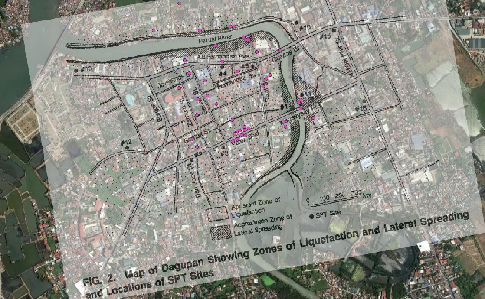

# Georectifying Images

CE 414 Engineering Applications of GIS
Dr. Dan Ames
Civil & Construction Engineering, Brigham Young University

<!-- Concepts lecture for Week 4. Lab 3, Georectifying and Digitizing, is where students do this themselves in ArcGIS Pro. -->

<!-- TODO(instructor): the source title slide carried a speaker note that is a ModelBuilder workshop abstract left over from another deck. It was not carried across. Confirm nothing was lost. -->

---

# Today's Goals

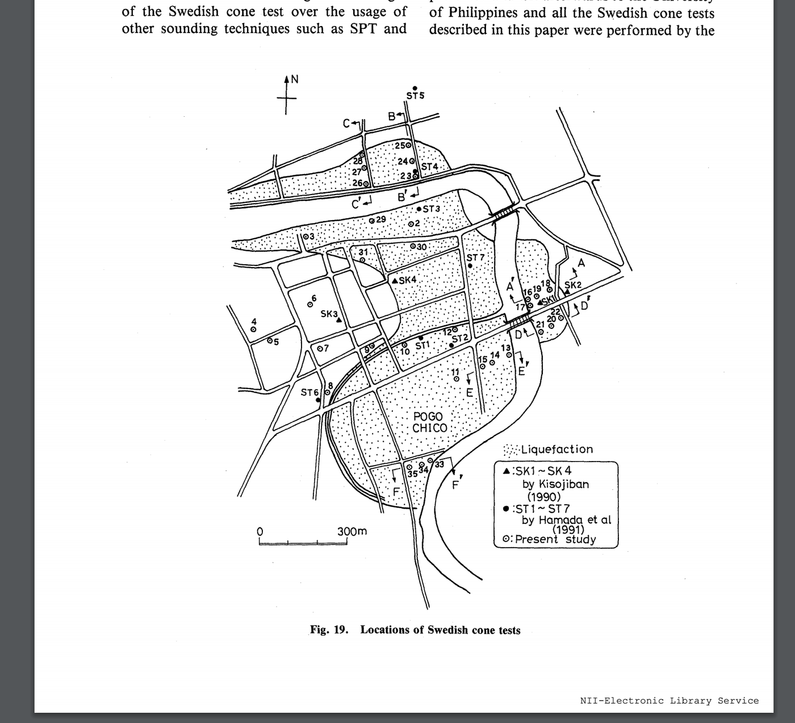

By the end of class you should be able to:

- Say what it means to **georectify** an image, in your own words
- Tell which images *can* be georectified and which cannot, and why
- Explain what a georectified raster stores: an origin, a cell size, a coordinate system
- Name the three steps that turn a paper map into analyzable GIS data: **georectify → digitize → analyze**
- Recognize when georectifying is the right answer to an engineering problem

<!-- Set expectations. This is the concepts hour; the hands-on version is Lab 3, where students georeference a scanned map in ArcGIS Pro and digitize features off it. -->

---

# Problem…

**Meet Kristin Ulmer, Ph.D.**

- **She has:** a map figure in a publication
- **She needs:** a shapefile of the locations of sand boils and standard penetration tests (SPTs) after the 1990 Luzon earthquake in Dagupan City, the Philippines

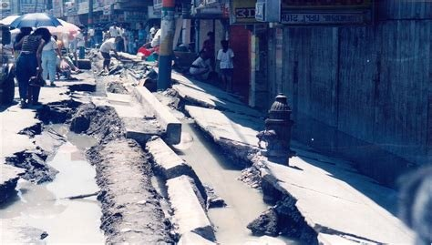

<!-- A former CE 414 student wrote in to say she had used georeferencing constantly in her research: "I have used georeferencing a TON in my recent research project. As I was georeferencing yet another image today, I thought about the assignment I did for your class where I first learned how to georeference an old map and put it in its place in the world." The lower photo is street damage from liquefaction and lateral spreading in Dagupan City. -->

<!-- TODO(instructor): guest speaker slide — still relevant? Decide whether to keep the portrait and the name on a public course site, or reduce this to the problem statement alone. -->

---

# Problem…

- Where does this map fit on the earth?
- What are our options for turning this into GIS data?

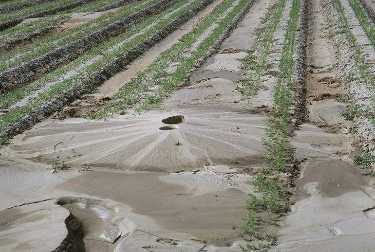

<!-- This is the figure she started from: a scanned page from a published paper showing the locations of sounding tests in Dagupan City. It has streets, a river, a north arrow and a scale bar, but no coordinates the computer can use. The photo on the left is a sand boil in a field, the surface evidence of liquefaction. Ask the class: what would you have to know to place this figure on the earth? -->

---

# Solution…

<!-- The same figure, georeferenced onto satellite imagery of Dagupan City, with liquefaction observations digitized as points. From the researcher: "The figure shows locations of SPT boreholes drilled throughout the city after the M7.7 1990 Luzon earthquake. The paper documented all of the locations where liquefaction was or was not observed, so I marked those locations with pink dots based on the descriptions. I used the image to get coordinates for the SPT sites marked on the map." The result went into an open database of liquefaction case histories: nextgenerationliquefaction.org. -->

---

<!-- _class: activity -->

# Pop Quiz

- Turn off your computer monitor
- Take a blank piece of paper
- Draw, from memory, a map of your childhood neighborhood, including distinguishing points, lines and polygons
- Take a photo of it

<!-- Give them about five minutes. Keep the photo on their phone — at the end of class they will try to georectify their own drawing, so the drawing has to be theirs and it has to be rough. -->

<!-- TODO(graphic): needs an illustration for this activity slide — see SCREENSHOT_SHOT_LIST -->

---

# What does it mean to "georectify" an image?

Start with an image that shows features of interest:

- A **map**
- A **drawing**
- An **aerial photo**

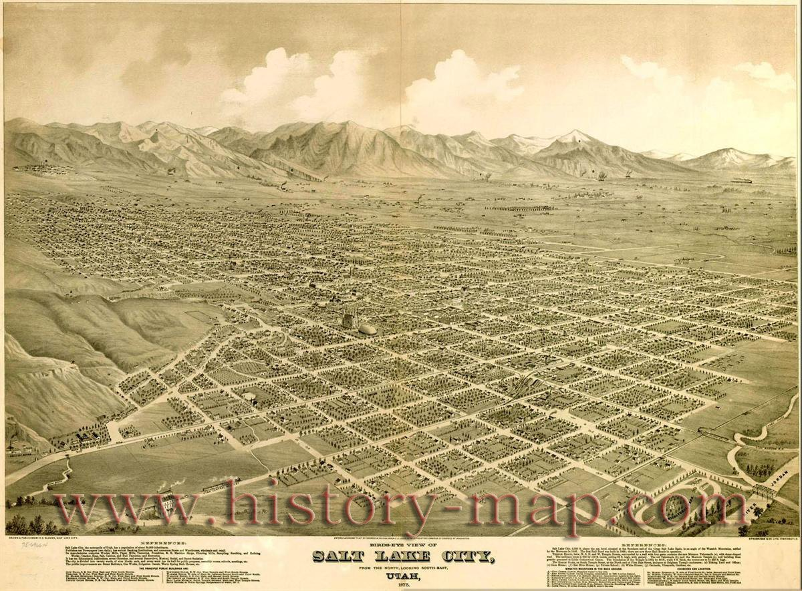
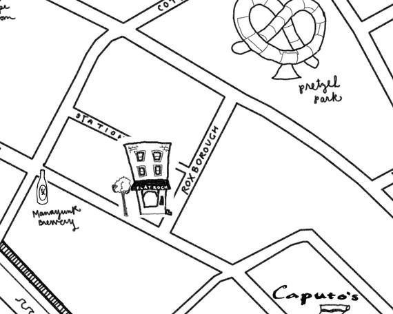
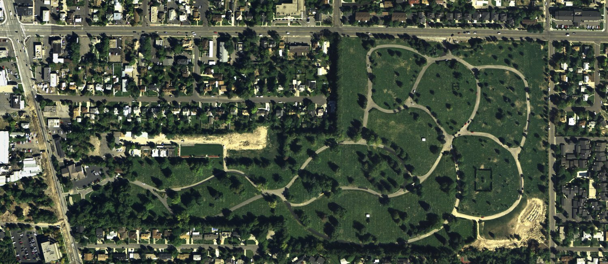

<!-- Three kinds of source image. The next four slides sort images into ones you can georectify and ones you cannot. -->

---

# No

<!-- An 1870s bird's-eye lithograph of Salt Lake City. Beautiful, and useless for georectifying: it is drawn in oblique perspective, so the scale changes continuously from the foreground to the mountains. No two-dimensional transformation can make it line up with a map. -->

---

# No

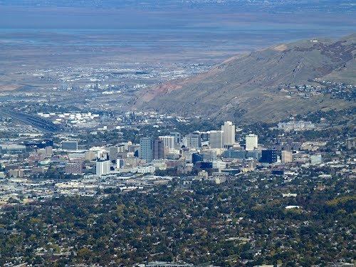

<!-- An oblique aerial photo of Salt Lake City, shot out the side of an airplane. Same problem as the lithograph: the camera was not pointed straight down, so near objects are at a different scale from far ones and tall buildings lean. This is a photo of a place, not a plan view of it. -->

---

# Yes

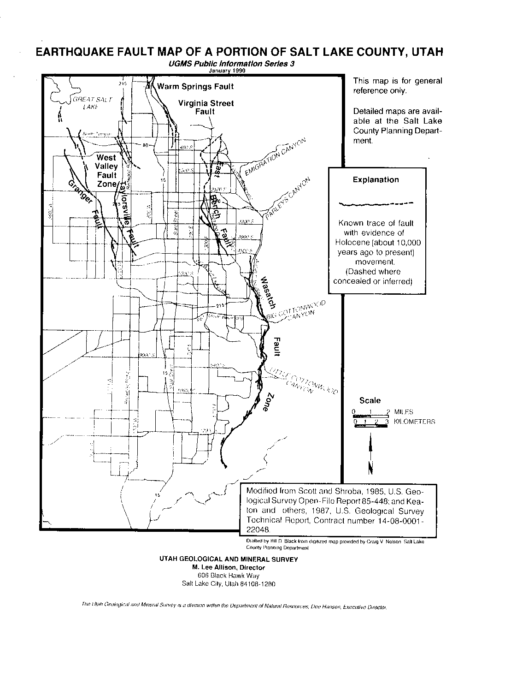

**Orthographic (plan) view**

<!-- The Utah Geological and Mineral Survey earthquake fault map of a portion of Salt Lake County. It is drawn in plan view, looking straight down, at a constant scale, with a scale bar. That is what makes it georectifiable. The source slide labeled this "Orthograph." -->

---

# Yes

**Orthophoto**

<!-- An orthophoto: an aerial image taken looking straight down and already corrected so that scale is constant across the frame. Ask what tells you this is nadir and not oblique — the buildings do not lean, and the streets stay parallel across the whole image. -->

---

# What does it mean to "georectify" an image?

- Locate the image's spatial coordinates in some projected coordinate system
- For example: the latitude and longitude of the lower-left corner, plus the width and height of each cell (pixel)

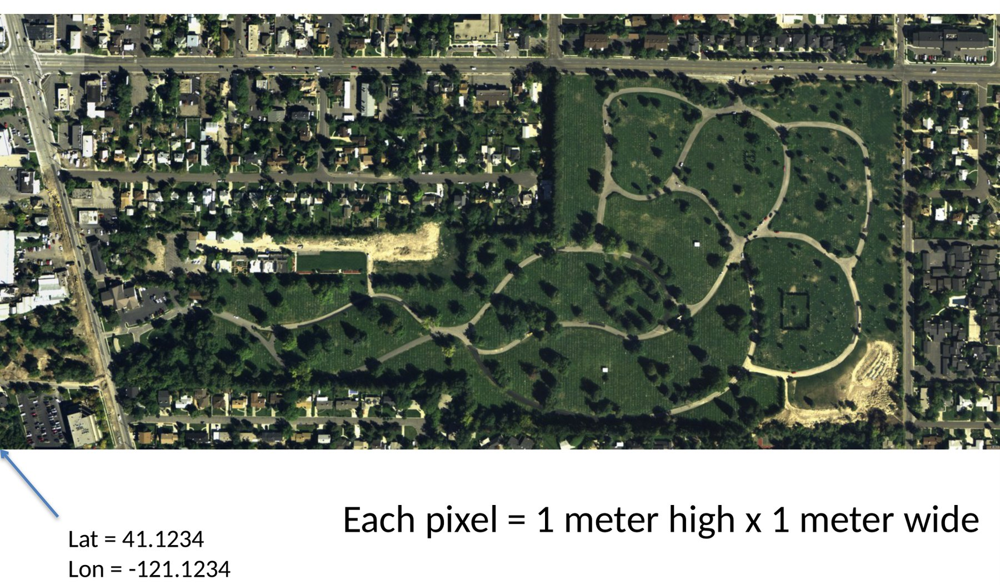

<!-- This is the whole idea in one picture. Once you know where one corner sits and how big a pixel is on the ground, every other pixel has a location too. The coordinate values on this slide are made up for illustration; the imagery is not at that latitude and longitude. -->

---

# What does it mean to "georectify" an image?

Distort or un-distort the image if needed to fit the specific projection…

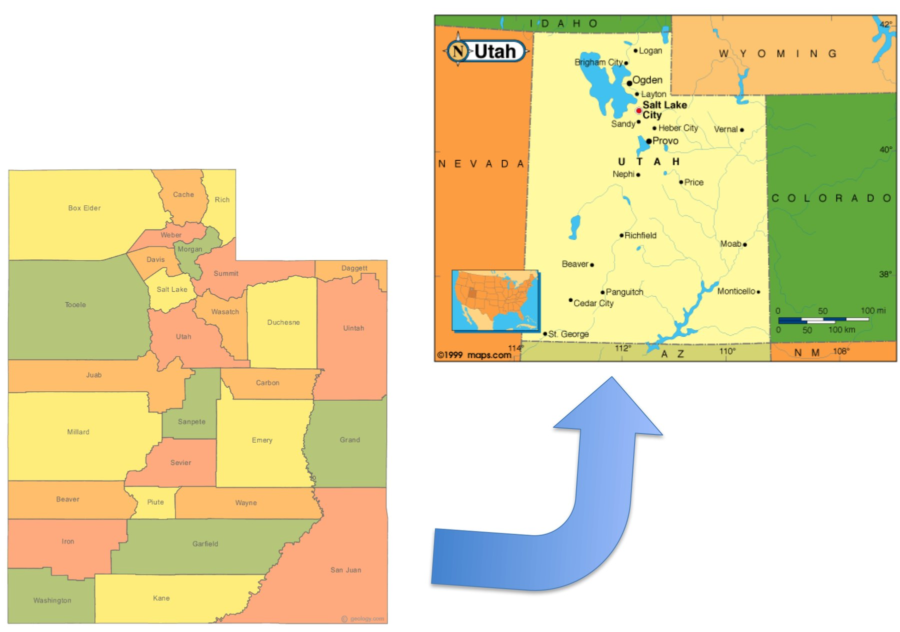

<!-- Fitting an image to a coordinate system is usually not just a shift and a scale. The image has to be stretched, rotated, and sometimes bent so that features land where they belong in the target projection. The bigger the area and the rougher the source, the more warping it takes. -->

---

# Why would you need to georectify an image?

- To identify current conditions via photo?
- To see changes over time?
- To digitize features and create a vector data set?

<!-- Three motivations. The third is the one Lab 3 exercises: georectify a scanned map, then trace the features off it into a new feature class. Ask for examples from their own disciplines — a hand-marked as-built drawing, a historical flood photo, a 1950s plat map. -->

<!-- TODO(graphic): needs an illustration — a then-and-now image pair would carry this slide. See SCREENSHOT_SHOT_LIST -->

---

# A paper fault map

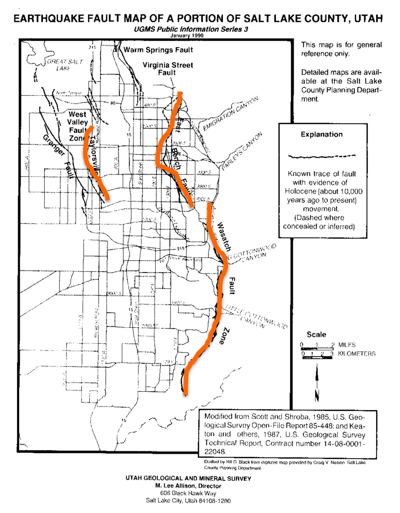

You are handed this paper copy earthquake fault map. You want to analyze the fault lines in GIS. How?

1. **Georectify** the image
2. **Digitize** the features
3. **Analyze** the features!

<!-- The orange lines are the digitized product drawn over the scanned map. Walk the three steps: the scan has no coordinates, so georectify it; the fault traces are pixels, not features, so digitize them; only then can you buffer, intersect, or measure them. -->

---

# An aerial photo of a cemetery

You are handed an aerial photo of a cemetery taken from an airplane. You want to map the features on it in GIS. How?

1. **Georectify** the image
2. **Digitize** the features
3. **Analyze** the features!

<!-- Same three steps, a completely different source image. The point of pairing these two slides is that the workflow does not care whether the source is a drawn map or a photograph. -->

<!-- TODO(instructor): the source slide read "You want to analyze the fault lines in GIS" — copied from the previous fault-map slide but shown over the cemetery orthophoto. Corrected here to "map the features on it." Name the cemetery features you actually want (roads, plots, tree canopy?) if you want the example to stay concrete. -->

---

# In ArcGIS Pro

- Add the image to a map, then open the **Imagery** ribbon tab ▸ **Georeference**
- Use **Add Control Points** to pair a location on the image with the matching location on a reference layer
- Watch the **control point table**: it lists each link with its **residual**, and the **RMSE** for the whole fit
- Choose a **transformation** appropriate to the number and quality of your points
- **Save** when the fit is acceptable, so the georeferencing travels with the raster

<!-- The bullet steps are here so the lecture can name the workflow; the live version is Lab 3. -->

<!-- TODO(graphic): needs Pro captures — see SCREENSHOT_SHOT_LIST -->

<!-- TODO(instructor): this deck never teaches the judgment part of georeferencing. Please add content for: (1) where to put control points and why distribution matters more than count; (2) how to choose a transformation; (3) how to read residuals and RMSE, and why a low RMSE is not proof of a good fit; (4) validating against points not used in the fit; (5) the distinction between georeferencing, rectification, and digitizing. -->

---

# KFC-UK Demo

**Is the future of Britain written in this piece of KFC?**

- A live demo: any image at all can be dropped into a coordinate system
- Whether the result *means* anything is a separate question
- <a href="http://i.dailymail.co.uk/i/pix/2014/09/16/1410875785556_wps_47_KFC_UK_It_wasn_t_just_the.jpg" target="_blank">Source image</a>

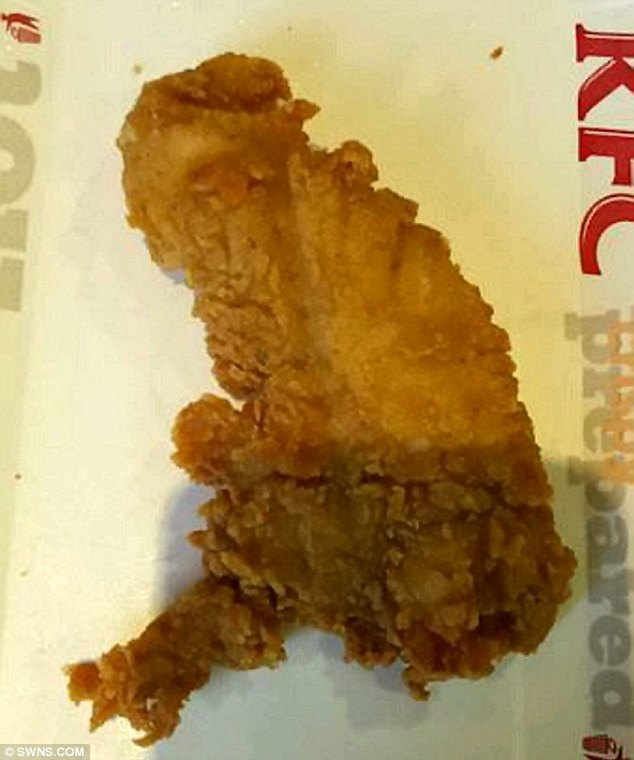

<!-- The joke slide, and a real demo. Georeference the piece of chicken over a map of Great Britain in front of the class: pick control points at Land's End, the tip of Scotland, and East Anglia, and let students watch the image warp into place. The lesson underneath the joke is that the software will happily georeference anything you give it, so the judgment about what makes a valid control point is yours. -->

<!-- TODO(instructor): the source image is a Daily Mail photo. Confirm the rights before this deck is published to a public site, or swap in a substitute. -->

---

# You try it…

Try to georectify your hand-drawn map of your home neighborhood…

- Where are your control points?
- What is the reference layer?
- How well does it fit, and how would you know?

<!-- Bring back the drawing from the pop quiz. The interesting failure is that a from-memory sketch has no consistent scale, so the residuals will be large no matter how carefully the points are placed. That is the point: georectifying does not create accuracy that was never in the source. -->

---

# Before Next Class

- Lab 3: [Georectifying and Digitizing](https://byu-hydroinformatics.github.io/ce414-gis-applications/assignments/lab-03/)
- Read the assigned chapter <!-- TODO(instructor): reading chapter -->
- Take the open-book quiz on Learning Suite
- Questions? Office hours: [calendly.com/dan-ames/office-hours](https://calendly.com/dan-ames/office-hours)

<!-- Fill in the reading and the quiz due date before class. Lab 3 is the hands-on version of everything in this lecture. -->

<!-- Conversion notes (2026-09-03): Source "CE 414 Week 4 - Georectifying Images.pptx", 19 slides → 19 slides here (no slide dropped; source slides 11+12 merged into one, 13+14 merged into one, and three slides added: Today's Goals, In ArcGIS Pro, Before Next Class).

This deck contains NO ArcGIS user interface at all — it is motivating photos and maps. The "In ArcGIS Pro" slide was added as text only, with a TODO(graphic) for real Pro captures of the Imagery ▸ Georeference tab, Add Control Points, and the control-point table with residuals and RMSE. Nothing was fabricated.

Objective fix made: the source slide 17 title read "You are handed an aerial photo of a cemetery … You want to analyze the fault lines in GIS" — "fault lines" was copied from slide 16 and does not match the cemetery orthophoto shown. Changed to "map the features on it"; flagged for the instructor to name the intended features.

Wording: source slide 9 labeled the fault map "Orthograph," which is not a standard term; written here as "Orthographic (plan) view."

Illustrative values kept as-is: the "Lat = 41.1234 / Lon = -121.1234" annotation baked into geo-pixel-coordinates-annotated.jpg is a made-up example in the source and does not correspond to the imagery shown; the speaker note says so.

Three slides were built from PowerPoint shapes and were re-rendered from the PDF at 200 dpi rather than rebuilt: source slides 12 (annotated orthophoto), 14 (projection warp), and 16 (fault map with digitized traces).

Rights to verify before publishing publicly: the 1870s Salt Lake City bird's-eye lithograph carries a "www.history-map.com" watermark; the Utah county map is marked "© geology.com" and the Utah state map "©1999 maps.com" (both inside geo-projection-warp.jpg); the KFC photo is credited to the Daily Mail.

The source title slide's speaker note was a ModelBuilder workshop abstract left over from another deck and was not carried across. -->
