<!-- TODO(instructor): the course plan suggests two structural changes to this deck, both of which
are instructor decisions and were NOT made during conversion: (1) split it into a remote-sensing
deck and a separate 3D-imaging/LiDAR deck, and (2) move the essential remote-sensing material
(spectrum, bands, reflected near-infrared) ahead of the NDVI lab so students meet it before
Lab 2 rather than after. Everything below is in the source deck's original order. -->

<!-- _class: lead -->
<!-- _paginate: skip -->

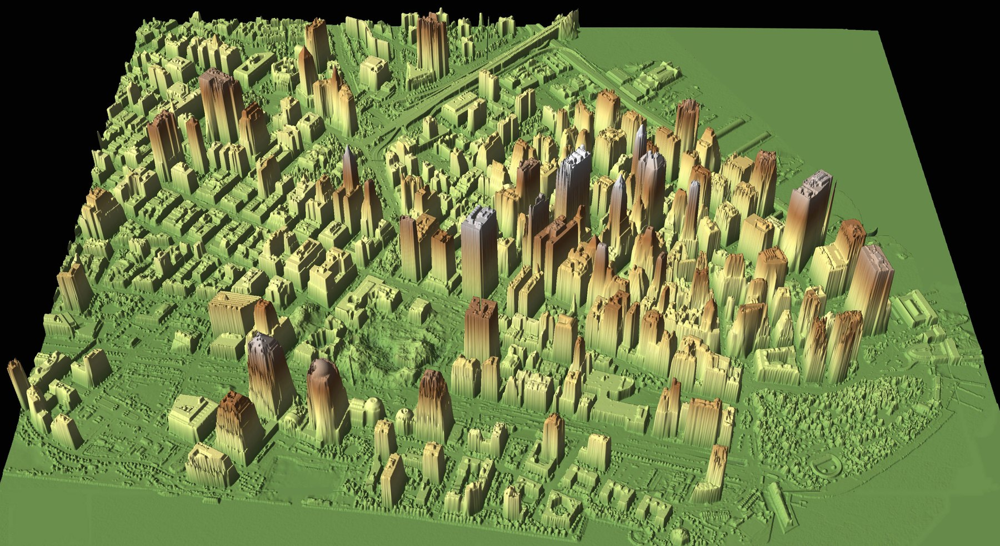

# Remote Sensing and 3D Imaging

CE 414 Engineering Applications of GIS
Dr. Dan Ames
Civil & Construction Engineering
Brigham Young University

<!-- Concepts lecture. Everything here is about how a sensor turns energy into numbers, and what
those numbers let you measure. The lab that applies it is Lab 2, NDVI.

The speaker note attached to this slide in the source PowerPoint was a leftover ModelBuilder
workshop abstract from another deck (ArcGIS 9 era) and had nothing to do with remote sensing.
It was removed during conversion. -->

---

# Today's Goals

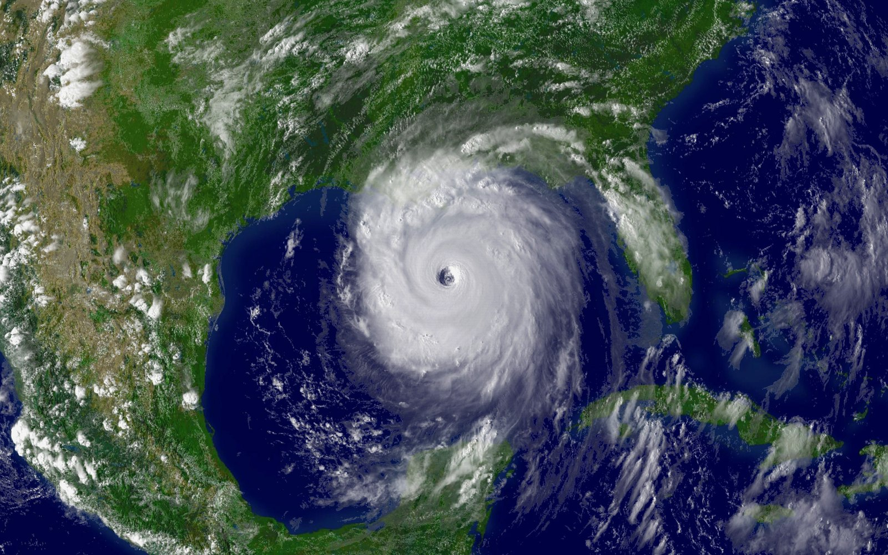

- By the end of class you should be able to:
  - Find visible light, **near-infrared**, **thermal infrared**, and radar on the electromagnetic spectrum
  - Explain what a digital image actually stores, and read a hexadecimal color
  - Say what a **band** is, and why one scene looks different in every band
  - Tell **multispectral** from **hyperspectral** imagery
  - Explain how **LiDAR** measures a surface, and what a point cloud is

<!-- Set expectations: this is a "how the data get made" lecture. Nothing here is software-specific,
but it is what makes the band math in Lab 2 mean something. -->

---

<!-- _class: lead -->

# Where we are going

1. The Electromagnetic Spectrum
2. Digital Images
3. Multi-band Images
4. Hyperspectral Images
5. Some Example Images
6. LiDAR Imagery, and some example LiDAR images

<!-- The original outline slide. Five topics plus the LiDAR half. Point out that the first four
build on each other and the fifth is a gallery. -->

---

<!-- _class: lead -->

# 1 — The Electromagnetic Spectrum

---

# The spectrum, in two minutes

<a href="https://www.youtube.com/watch?v=m4t7gTmBK3g" target="_blank">

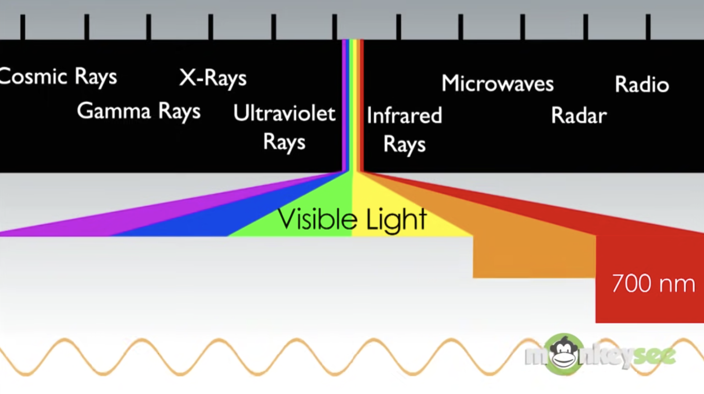

</a>

<a href="https://www.youtube.com/watch?v=m4t7gTmBK3g" target="_blank">youtube.com/watch?v=m4t7gTmBK3g</a>

<!-- Click the image to open the video in a new tab. The point to land: visible light is a sliver of
a very wide spectrum, and a remote sensor is simply an instrument built to measure some other part
of it. VERIFY: this YouTube link came across from the source deck and has not been re-checked. -->

---

# The whole spectrum, end to end

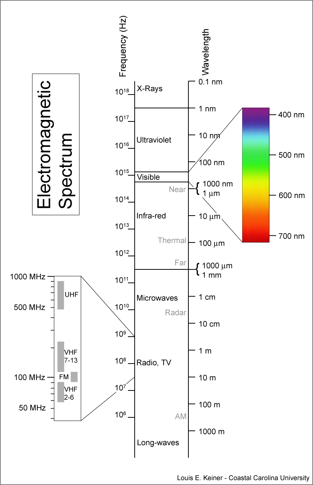

- Visible light is a narrow slice, roughly **400 to 700 nm**
- Just longer than red: **near-infrared**, then **thermal infrared**, then far infrared
- Longer still: **microwaves and radar**, then radio and TV
- Shorter than violet: ultraviolet, X-rays, gamma rays
- A sensor is built to measure **specific windows**, not "light" in general

<!-- Worth saying out loud, because it is the single most common confusion in this material:
*reflected near-infrared* is sunlight bouncing off a surface, exactly like visible light — it is not
heat. *Thermal infrared*, further to the right on this chart, is energy the surface emits because of
its own temperature. Vegetation looks bright in the near-infrared because leaves reflect it, not
because plants are warm. Diagram credit: Louis E. Keiner, Coastal Carolina University. -->

---

# What actually reaches the ground

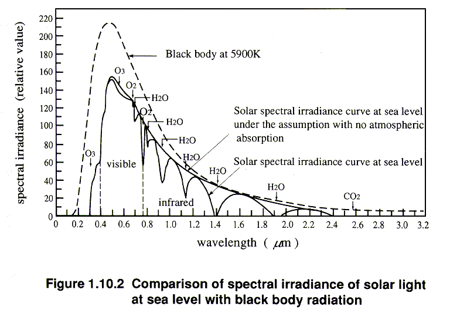

- Dashed curve: a **black body at 5900 K** — the sun as a perfect radiator
- Solid curve: what arrives at **sea level** after the atmosphere takes its cut
- Every notch is absorption by a gas: **O₃, O₂, H₂O, CO₂**
- Sensors are designed for the gaps between the notches — the **atmospheric windows**
- You cannot measure a wavelength the atmosphere has already eaten

<!-- Ask why nobody builds a satellite sensor at 1.4 µm. Because water vapor absorbs essentially all
of it — look at the notch. This is why band choices on real satellites look arbitrary until you put
this curve behind them. -->

---

<!-- _class: lead -->

# 2 — Digital Images

---

# Each pixel is a number

Each pixel (raster cell) is represented by a **hexadecimal number** that indicates the color to display.

<!-- Digital photos are raster images. Each pixel has a different value from the one next to it,
representing a different color. Raster works really well for digital photos. Zoom far enough into
any photo and the picture stops being a picture and becomes a grid of numbers. -->

---

# What are hexadecimal numbers?

- A **6-digit** number holding the **red**, **green**, and **blue** components of a color
- Each digit takes one of **16** values:
  `0 1 2 3 4 5 6 7 8 9 A B C D E F`

#000000

RED
GREEN
BLUE

<!-- Two hex digits per channel. Walk through #FF0000, #00FF00, #0000FF on the board if the class
has not seen hex before. -->

---

# Counting in hexadecimal

- Two-digit counting runs:
  `00, 01, 02, … 09, 0A, 0B, 0C, 0D, 0E, 0F,`
  `10, 11, … 9E, 9F, A0, A1, … FE, FF`
- That is **256 possible values** per channel

#000000

256 values of RED
256 values of GREEN
256 values of BLUE

<!-- 0 through 255 in decimal, 00 through FF in hex. Same number, different base. -->

---

<!-- _class: quiz -->

# How many colors is that?

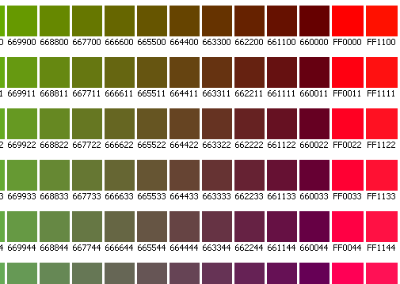

- How many unique combinations of red, green, and blue?
  - **256 × 256 × 256 = 16,777,216**
- Is that enough? How many colors can the human eye actually tell apart?
- The BBC puts the working figure at **about a million**: three types of cone cell, roughly 100 shades each

<!-- Answer: yes, 24-bit color is comfortably more than the eye can resolve, by more than a factor of
ten. The grid on the right is a slice of the hex color space — neighboring swatches differ by one
step in one channel, and most of those steps are invisible. -->

---

<!-- _class: lead -->

# 3 — Multi-band Images

## Open an image in ArcGIS Pro

<!-- In the source deck this said "open an image in ArcGIS" — ArcMap-era wording, updated to ArcGIS
Pro. In Pro, a multiband raster comes into the Contents pane as one layer with a band list; the
Symbology pane is where you choose which band drives red, green, and blue. -->

---

# Band 1 — red

- One MODIS scene over western Europe, shown **one band at a time**
- This band: **0.65 µm**
- In the **red** band, healthy vegetation is **dark** — chlorophyll absorbs red
- Bare ground is brighter; cloud and snow are brightest of all

<!-- Three slides, one scene, three bands. Set the pattern here: a "band" is one wavelength window,
stored as its own grid of numbers. The lat/lon and instrument are in the window's status bar —
MODIS, off the coast of Britain and France. -->

---

# Band 4 — green

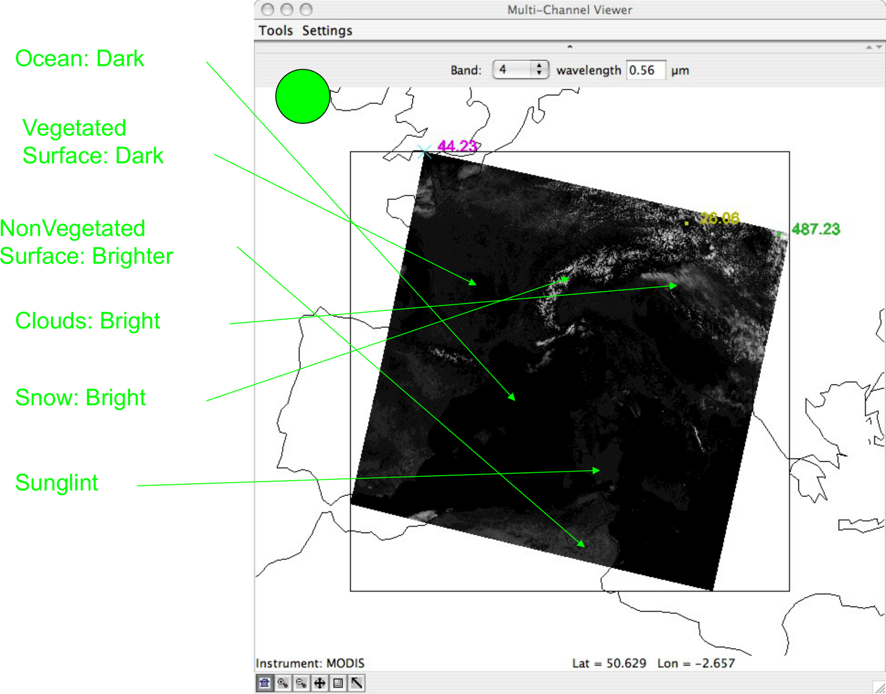

- Same scene, same features, **different band**: 0.56 µm
- What changed between this and the red band, and what did not?
- The annotations are the presenter's; look past them at the pixels

<!-- Ask the class what changed and what did not before you say anything. -->

---

# Band 3 — blue

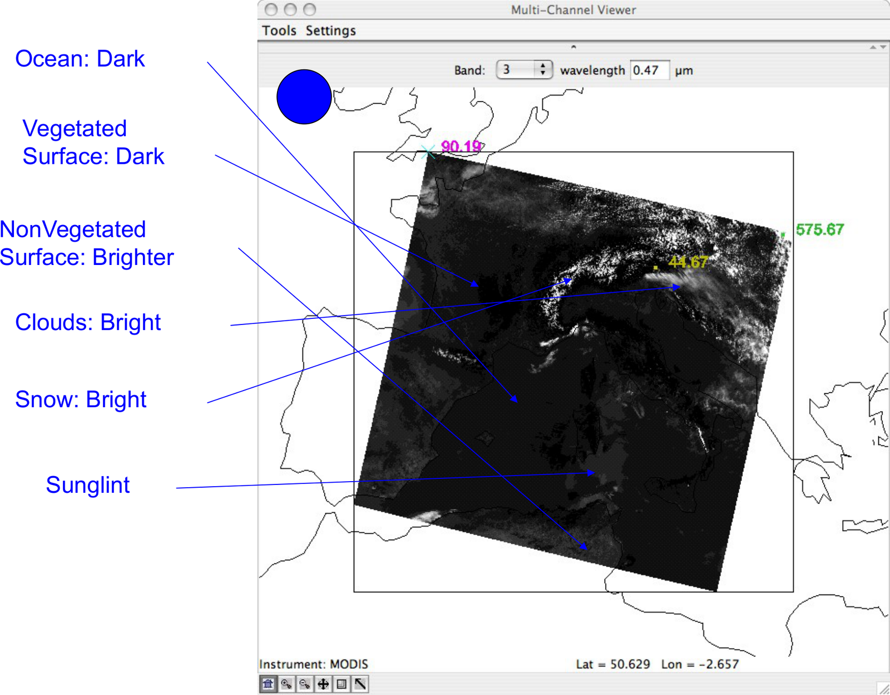

- 0.47 µm. Blue **scatters hardest** in the atmosphere, so this band looks hazier
- Stack red, green, and blue together and you get a natural-color image
- Swap a different band into the red channel and you get a **false-color** image

<!-- Same scene again, blue band. Blue scatters hardest in the atmosphere, so this band tends to look
hazier than the others.

TODO(instructor): update the sensor/band material. These three captures are from a legacy
Multi-Channel Viewer, and the wavelength/band-number labeling — and the satellite lineup the course
talks about generally, including Landsat history — has not been refreshed. Band numbers were
deliberately NOT changed during conversion; they are whatever the original screenshots show.

TODO(instructor): the leader-line annotations are identical on all three slides, which undercuts the
comparison the sequence is meant to set up. If these are re-shot, vary the labels per band. -->

---

<!-- _class: lead -->

# 4 — Hyperspectral Images

---

# Many narrow, contiguous bands

- **Multispectral**: a handful of fairly wide bands
- **Hyperspectral**: hundreds of narrow, contiguous bands
- The result is a **full spectrum for every pixel**, not just a few samples
- Soil, vegetation, and water each have a spectral shape you can match against
- Not every GIS reads a hyperspectral cube directly — they usually need dedicated software

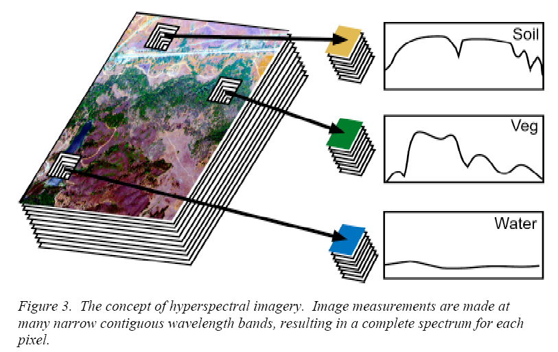

Source: satjournal.tcom.ohiou.edu/pdf/shippert.pdf

<!-- The original slide said simply "Can't open in ArcGIS…". That claim is softened here rather than
restated as fact.

TODO(instructor): verify against current ArcGIS Pro. Pro's multidimensional raster support has moved
a long way since this slide was written, and the "can't open it" line may no longer be true.
VERIFY: the satjournal.tcom.ohiou.edu source link is from the original deck and has not been
re-checked. -->

---

<!-- _class: lead -->

# 5 — Some Example Images

## What can you see from orbit?

---

# The Eiffel Tower, straight down

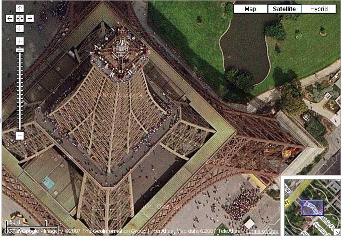

<!-- High-resolution aerial imagery served through a web map. Note the tower's shadow, which is how
you get height out of a nadir image. Source noted in the original deck:
llll20.wordpress.com/2007/06/09/very-cool-google-satellite-maps/ -->

---

# Snow across the mid-Atlantic

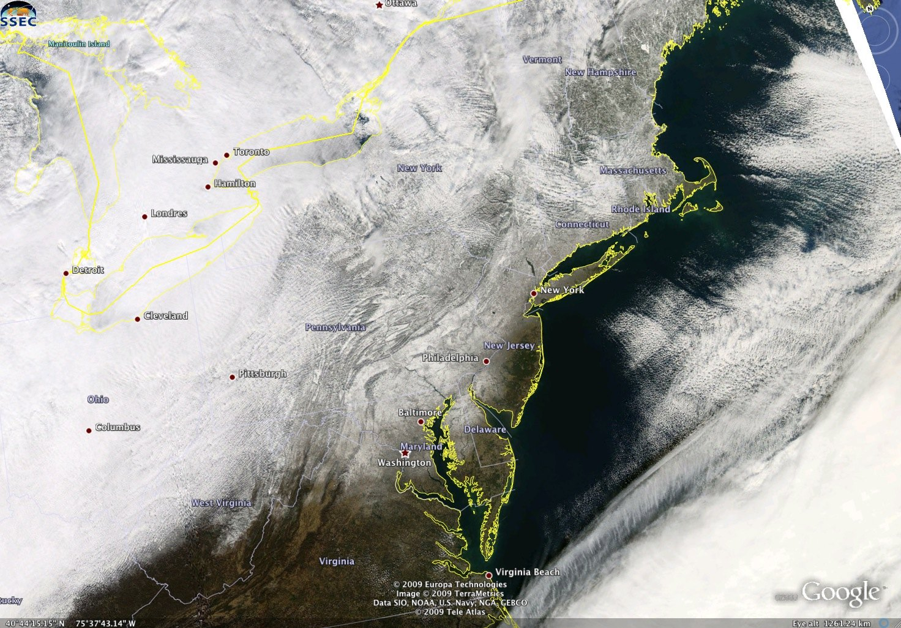

<!-- A winter storm over Maryland and the mid-Atlantic coast. Snow and cloud are both bright; telling
them apart is a classic multi-band problem, because snow and cloud separate in the shortwave
infrared even though they look the same in visible light. Source noted in the original deck:
weblogs.marylandweather.com, January 2009. -->

---

# Smoke from the 2007 California wildfires

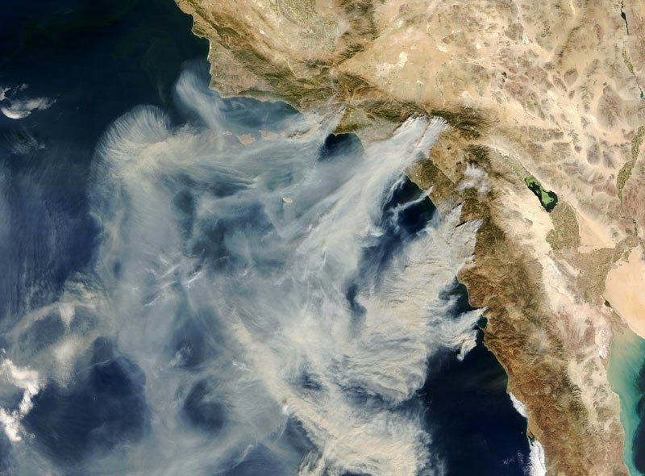

<!-- Smoke plumes blowing offshore. This is the kind of image that gets used operationally within
hours. Source noted in the original deck: andrewlias.blogspot.com, October 2007. -->

---

# Europe before dawn

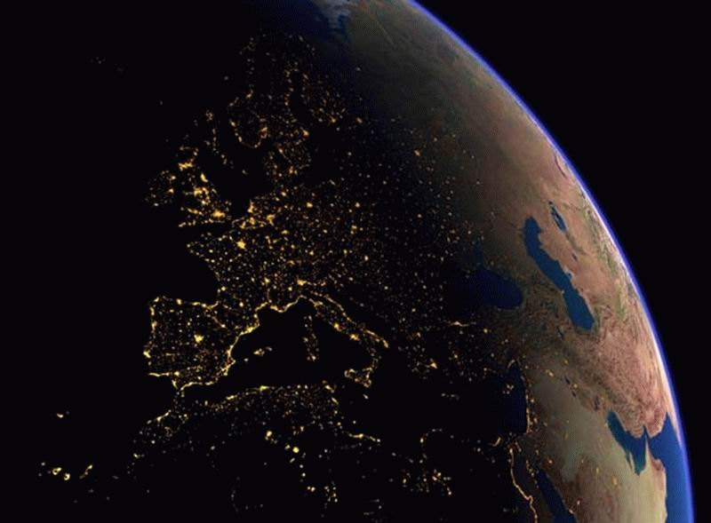

<!-- City lights at night — the sensor is measuring emitted light rather than reflected sunlight.
Night lights are used as a proxy for population and for economic activity. Source noted in the
original deck: strangetravel.com. -->

---

<!-- _class: quiz -->

# What are you looking at?

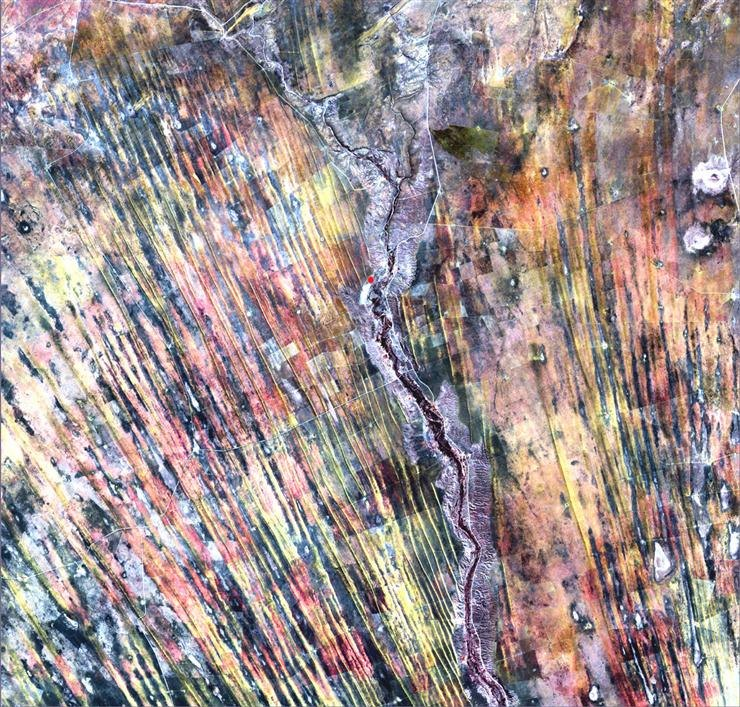

- A false-color scene: the colors are **band assignments**, not what your eye would see
- What are the long parallel streaks?
- What is the dark line running down the middle?

<!-- Open discussion. Draw out that "false color" means someone chose which band drives red, green,
and blue.

TODO(instructor): this image came into the deck from a "cool satellite photos" link and its subject,
sensor, and location are not recorded anywhere in the source. Identify and attribute it, or replace
it, before using it as a discussion prompt. -->

---

# Inauguration day: the National Mall

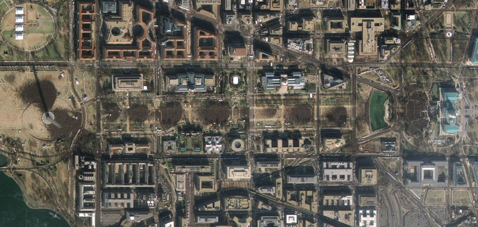

<!-- The 2009 presidential inauguration, imaged from orbit. The dark texture filling the Mall is a
crowd. Source noted in the original deck: zeitgeistinapetiole.wordpress.com. In the source deck this
image and the next one shared a single slide; they were split so each is legible. -->

---

# Inauguration day: the Capitol

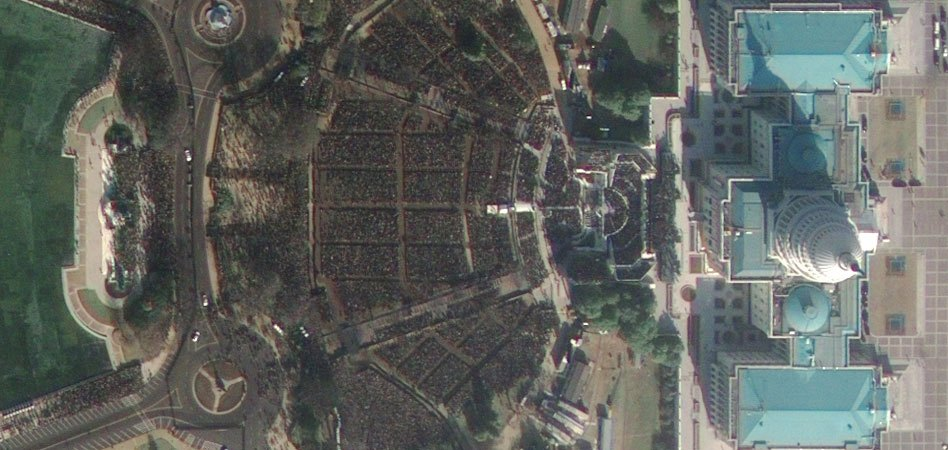

<!-- The west front of the Capitol, zoomed. Crowd-size estimation from satellite imagery is a real
and contested application — ask what you would need to know to turn this into a number (ground
resolution, and an assumption about people per square meter). -->

---

# Palm Jumeirah, Dubai

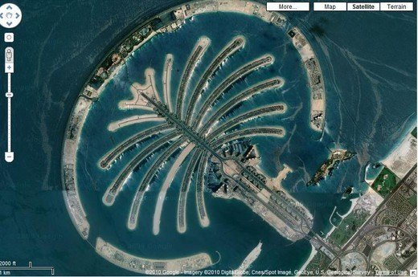

<!-- Man-made islands. A good prompt: how would you map the shoreline of something that did not exist
five years before the image was taken? Source noted in the original deck:
noupe.com/photography/40-bizarre-and-cool-google-earth-photos.html -->

---

# Hurricane Katrina, August 2005

<!-- True-color view of the storm in the Gulf. The next three slides follow Katrina through three very
different kinds of imagery. Source noted in the original deck: sapphireeventsnola.com. -->

---

# The Superdome, 2005

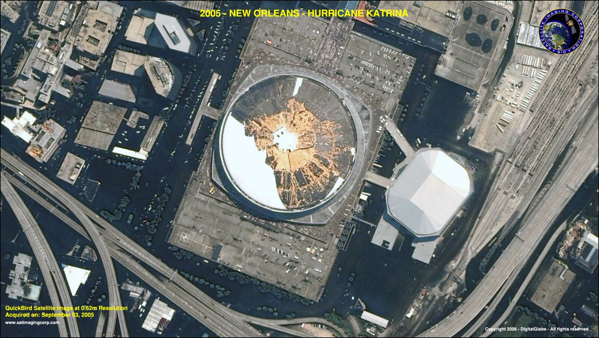

<!-- High-resolution commercial satellite imagery of the Superdome after the storm — you can see the
roof membrane torn away. Source noted in the original deck:
satimagingcorp.com/galleryimages/hurricane-katrina-superdome-picture.jpg -->

---

# Katrina in the thermal infrared

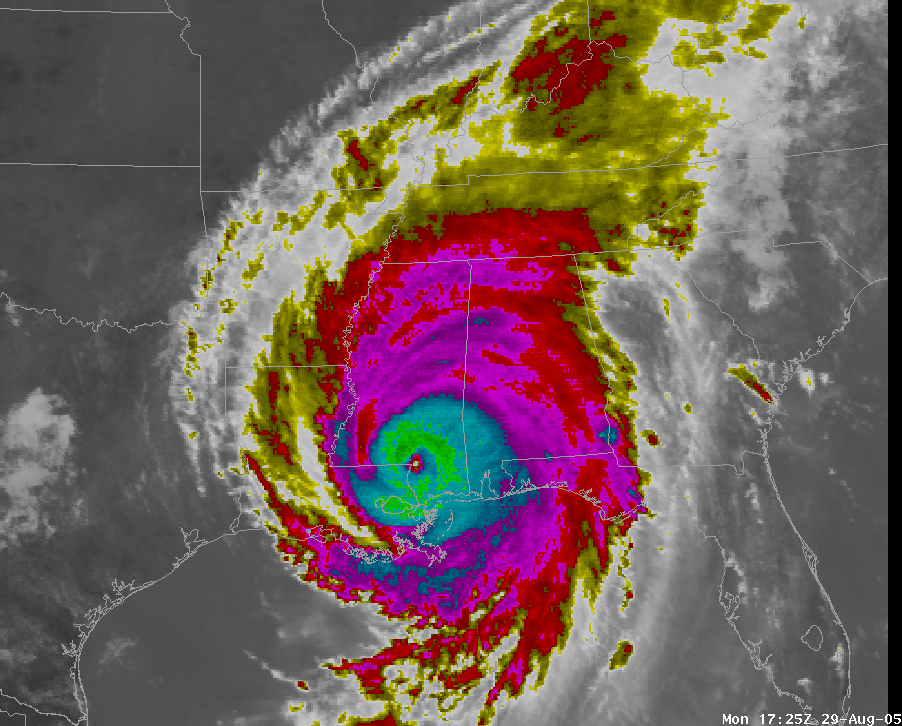

<!-- Same storm, enhanced infrared. This one genuinely IS about emitted heat: the sensor measures
thermal infrared, the colors are a temperature enhancement, and cold means high — the coldest
cloud tops are the tallest, most vigorous convection, which is why the eyewall lights up.
Timestamp on the image: 17:25Z, 29 August 2005.

TODO(instructor): provenance. The image is embedded in the PowerPoint and renders correctly, but its
only recorded source is a NOAA URL in the picture's alt text
(www.srh.noaa.gov/images/hun/stormsurveys/katrina/katrina_IRsat_29_1725Z.png) that the September 2026
audit found no longer resolves. Re-source or re-attribute it from a current NOAA archive. -->

---

# Japan, March 2011: before and after

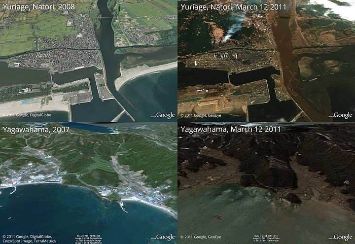

<!-- Yuriage in Natori, and Yagawahama: 2007–2008 imagery on the left, 12 March 2011 on the right.
Before-and-after pairs are the single most common emergency-response product. Source noted in the
original deck: boingboing.net, March 2011. -->

---

# The same village, before and after

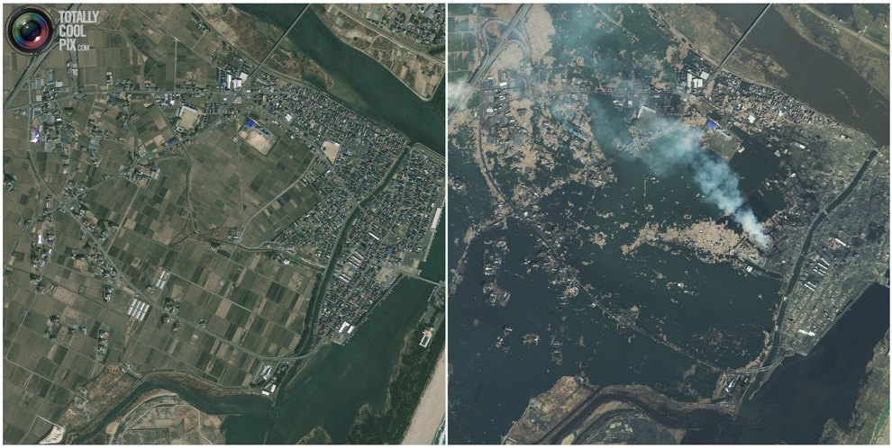

<!-- A closer pair. Ask what you would have to do to these two images before you could difference them
— which is exactly the georectification problem. Source noted in the original deck:
totallycoolpix.com/2011/03/japan-earthquake-and-tsunami-before-and-after/ -->

---

<!-- _class: lead -->

# LiDAR

## Light Detection And Ranging

---

# What is LiDAR and how does it work?

- Fire a pulse of laser light, measure how long it takes to come back
- Time of flight × speed of light ÷ 2 = **range**
- Combine range with the sensor's own **position and orientation** (GPS and IMU) to get an `(x, y, z)` point
- Hundreds of thousands of pulses a second gives a **point cloud**
- A single pulse can return **more than once** — treetop, branch, ground

<a href="https://www.youtube.com/watch?v=EYbhNSUnIdU" target="_blank">youtube.com/watch?v=EYbhNSUnIdU</a>

<!-- Click the graphic to open the video. Multiple returns per pulse is the idea that makes the next
slide make sense: it is how a laser sees the ground through a canopy.
VERIFY: this YouTube link came across from the source deck and has not been re-checked. -->

---

# A forest, in points

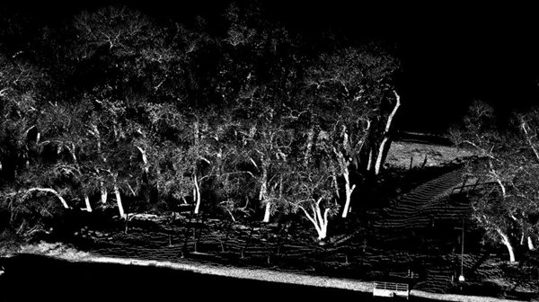

<!-- A side view through a point cloud of trees. Every white dot is one laser return. Note that there
are returns from inside and below the canopy — that is the multiple-return behavior from the last
slide, and it is why LiDAR can produce a bare-earth surface under forest. -->

---

# Mount Rushmore as a point cloud

<!-- Terrestrial scanning at very high point density. The scan lines are visible as vertical striping.
Used here for documentation and change monitoring of the monument. -->

---

# Where the scanner sits

<!-- Terrestrial (tripod-mounted) LiDAR. Airborne LiDAR gets you a county; a terrestrial scanner gets
you one slope, one bridge, one quarry face, at far higher density. Civil engineering uses both. -->

---

# A city as a surface

<!-- Buildings extracted from an airborne point cloud and rendered as a surface. This is the input to
line-of-sight studies, solar potential, view analysis, and flood modeling in an urban core. -->

---

# Bare-earth terrain

<!-- Same data, classified to ground returns only and rendered as a surface. Vegetation and structures
have been removed. -->

---

# The same terrain, hillshaded

<!-- A hillshade of the bare-earth model. Channels, terraces, roads, and old cut lines show up that
you cannot see on the ground or in a photograph. This is why LiDAR changed geomorphology and
archaeology. -->

---

# Cool LiDAR videos

- <a href="https://www.youtube.com/watch?v=nXlqv_k4P8Q" target="_blank">youtube.com/watch?v=nXlqv_k4P8Q</a>
- <a href="https://www.youtube.com/watch?v=TFZ7Guej8VM" target="_blank">youtube.com/watch?v=TFZ7Guej8VM</a>
- <a href="https://www.youtube.com/watch?v=k6nfskNev-Q" target="_blank">youtube.com/watch?v=k6nfskNev-Q</a>
- <a href="https://www.youtube.com/watch?v=hCP2XaOCAlk" target="_blank">youtube.com/watch?v=hCP2XaOCAlk</a>

<!-- TODO(graphic): this slide has no image. It wants four linked video thumbnails, one per clip.
No image was generated for it in this pass.
VERIFY: all four links came across from the source deck and have not been re-checked. -->

---

<!-- _class: activity -->

# Next: Lab 2 — NDVI

- You will compute a **vegetation index** from a multi-band image in ArcGIS Pro
- NDVI compares **reflected near-infrared** against **red**:
  healthy leaves absorb red and reflect near-infrared strongly
- That is the whole reason today's spectrum and band material matters — the index is arithmetic on two bands
- Lab 2: [byu-hydroinformatics.github.io/ce414-gis-applications/assignments/lab-02/](https://byu-hydroinformatics.github.io/ce414-gis-applications/assignments/lab-02/)

<!-- Say "reflected near-infrared", not "heat". The near-infrared signal in NDVI is reflected
sunlight; leaf structure bounces it back. Nothing in NDVI measures temperature.

TODO(graphic): this slide has no image. It wants a red/near-infrared reflectance comparison for
healthy versus stressed vegetation, or a paired natural-color / NDVI view of the lab study area.
No image was generated for it in this pass. -->

---

# Before Next Class

- Start **Lab 2 — NDVI**: [assignments/lab-02](https://byu-hydroinformatics.github.io/ce414-gis-applications/assignments/lab-02/)
- Reading: <!-- TODO(instructor): reading chapter --> see Learning Suite
- Take the open-book **quiz** on Learning Suite
- Questions? Office hours: [calendly.com/dan-ames/office-hours](https://calendly.com/dan-ames/office-hours)

<!-- TODO(instructor): fill in the textbook reading chapter for this week; the source deck did not
name one. Confirm the quiz due date before class. -->

<!-- Conversion notes (2026-09-03): converted from "CE 414 Week 4 - Remote Sensing and 3D
Imaging.pptx" (38 slides) to 43 slides. DROPPED: source slide 11, a byte-identical duplicate of
source slide 7 (same title, same two images). The title slide's speaker note was also dropped — it
was a leftover ArcGIS 9 ModelBuilder workshop abstract pasted in from another deck. ADDED: Today's
Goals, a Lab 2 preview, and Before Next Class, per the conversion guide. Source slide 23 (the
inauguration pair) was split across two slides so each image is legible at projector size; no other
slide was re-cut.

ArcGIS wording: source slide 12's "Open an image in ArcGIS" is now "ArcGIS Pro". No other ArcGIS 9 /
ArcMap / ArcCatalog / ArcToolbox wording appears in this deck — it contains no ArcGIS UI screenshots
at all, so nothing here needs a Pro re-shoot.

Infrared/heat check: no slide in the source equated near-infrared with heat, so no such wording was
changed. The Katrina infrared slide is genuinely about emitted thermal infrared and was left as it
stands; the near-infrared-is-reflected-not-emitted point was added as a speaker note on the spectrum
slide and in the Lab 2 preview, where it is load-bearing for NDVI.

Sensor bands: the three MODIS band slides keep the band numbers and wavelengths shown in the original
screenshots. Nothing was renumbered — see the TODO(instructor) on that slide.

Stale/at-risk images: the three MODIS captures are from a legacy Multi-Channel Viewer; the Eiffel
Tower, Dubai, Maryland-snow, wildfire, night-lights, inauguration and tsunami images are all
2007–2011 web-sourced and were kept as-is, with the source URLs recorded in each slide's speaker
note. One image (the false-color scene) has no recorded subject or source. The Katrina infrared
image is embedded and renders, but its only recorded provenance is a NOAA URL that no longer
resolves.

TODO(graphic): two slides have no image — "Cool LiDAR videos" and the Lab 2 preview. No images were
generated in this pass. -->
