<!-- TODO(instructor): the course plan suggests moving the essential remote-sensing material
(spectrum, bands, reflected near-infrared) ahead of the NDVI lab so students meet it before
Lab 2 rather than after. That is an instructor decision and has not been made. -->

<!-- _class: lead -->
<!-- _paginate: skip -->

# Remote Sensing

CE 414 Engineering Applications of GIS
Dr. Dan Ames
Civil & Construction Engineering
Brigham Young University

<!-- Concepts lecture. Everything here is about how a sensor turns energy into numbers, and what
those numbers let you measure. The lab that applied it was Lab 2, NDVI, which they have already done; this hour is the physics underneath it.

The thread through the whole hour is the spectrum: every section comes back to it. Section 2 is a
camera as a three-band sensor, section 3 is bands as stacked grids, section 4 is hundreds of
narrow slices of the same spectrum, section 5 pulls real images apart band by band, and section 6
puts the sensor in orbit.

The speaker note attached to this slide in the source PowerPoint was a leftover ModelBuilder
workshop abstract from another deck (ArcGIS 9 era) and had nothing to do with remote sensing.
It was removed during conversion. -->

<!-- stamp:begin -->
<!-- _footer: 'CE 414 · Week 4 — Remote SensingLast Updated: 2026-09-23© 2026 Daniel P. Ames · <a href="https://creativecommons.org/licenses/by/4.0/">CC BY 4.0</a>' -->
<!-- stamp:end -->

---

# Today's Goals

- By the end of class you should be able to:
  - Find visible light, **near-infrared**, **thermal infrared**, and radar on the electromagnetic spectrum, and say why sensors look through **atmospheric windows**
  - Explain what a pixel stores, and read a hexadecimal color
  - Split a color image into its **red, green, and blue bands**, and read a **false-color** image
  - Tell **multispectral** from **hyperspectral** imagery
  - Name the main **Earth-observing satellites** and the four resolutions they trade off

<!-- Set expectations: this is a "how the data get made" lecture. Nothing here is software-specific,
but it is what makes the band math in Lab 2 mean something. -->

---

<!-- _class: lead -->

# 1 — The Electromagnetic Spectrum

---

# The spectrum, at a glance

<svg viewBox="0 0 1600 970" style="display:block;margin:0 auto;height:550px;" xmlns="http://www.w3.org/2000/svg" font-family="Avenir Next, Segoe UI, Helvetica, Arial, sans-serif">
<defs><marker id="sp-ah" viewBox="0 0 10 10" refX="8" refY="5" markerWidth="6" markerHeight="6" orient="auto-start-reverse"><path d="M0,0 L10,5 L0,10 z" fill="#002e5d"/></marker></defs>
<line x1="40" y1="34" x2="1560" y2="34" stroke="#002e5d" stroke-width="5" marker-start="url(#sp-ah)" marker-end="url(#sp-ah)"/>
<rect x="560" y="10" width="480" height="48" fill="#ffffff"/>
<text x="800" y="46" font-size="32" font-weight="700" fill="#002e5d" text-anchor="middle">wavelength</text>
<image href="images/rs-em-spectrum-visible.png" x="0" y="70" width="1600" height="897"/>
<text x="24" y="398" font-size="30" font-style="italic" fill="#ffffff">shorter wavelength, more energy</text>
<text x="24" y="440" font-size="30" font-style="italic" fill="#ffd27a">UV and shorter: mostly absorbed by the atmosphere</text>
<text x="1580" y="398" font-size="30" font-style="italic" fill="#ffffff" text-anchor="end">longer wavelength, less energy</text>
<text x="1580" y="440" font-size="30" font-style="italic" fill="#ffd27a" text-anchor="end">Radar: the satellite sends its own pulse</text>
<rect x="0" y="608" width="245" height="94" fill="#7b2fc4"/>
<text x="122" y="672" font-size="46" fill="#ffffff" text-anchor="middle">400 nm</text>
<line x1="520" y1="712" x2="833" y2="462" stroke="#ffffff" stroke-width="10"/>
<line x1="520" y1="712" x2="833" y2="462" stroke="#002e5d" stroke-width="5"/>
<circle cx="833" cy="462" r="9" fill="#002e5d" stroke="#ffffff" stroke-width="3"/>
<line x1="1000" y1="712" x2="960" y2="462" stroke="#ffffff" stroke-width="10"/>
<line x1="1000" y1="712" x2="960" y2="462" stroke="#002e5d" stroke-width="5"/>
<circle cx="960" cy="462" r="9" fill="#002e5d" stroke="#ffffff" stroke-width="3"/>
<rect x="270" y="712" width="500" height="128" rx="12" fill="#ffffff" stroke="#8b1a1a" stroke-width="4"/>
<text x="520" y="764" font-size="40" font-weight="700" fill="#8b1a1a" text-anchor="middle">Near-infrared</text>
<text x="520" y="816" font-size="34" fill="#22262e" text-anchor="middle">reflected sunlight: NDVI</text>
<rect x="800" y="712" width="500" height="128" rx="12" fill="#ffffff" stroke="#e8792b" stroke-width="4"/>
<text x="1050" y="764" font-size="40" font-weight="700" fill="#c0601a" text-anchor="middle">Thermal infrared</text>
<text x="1050" y="816" font-size="34" fill="#22262e" text-anchor="middle">heat the surface emits</text>
</svg>

<!-- The point to land: visible light is a sliver of a very wide spectrum, and a remote sensor is
simply an instrument built to measure some other part of it. Walk the labels left to right: short
wavelengths carry more energy per photon, and the atmosphere absorbs most of the ultraviolet and
everything shorter, so Earth imaging lives from the visible rightward. Near-infrared sits just past
700 nm and is reflected sunlight, the band NDVI used in Lab 2. Thermal infrared is further out
(roughly 8 to 14 µm for Earth imaging) and is heat the surface emits. Radar is different again:
the satellite supplies its own energy, which is where next week's active-sensor story starts.

The figure is a still from a short MonkeySee explainer video. The video link that used to sit on
this slide is dead and was removed on 2026-09-23; the labels were added in its place. -->

---

# The whole spectrum, end to end

- Visible light is a narrow slice, roughly **400 to 700 nm**
- Just longer than red: **near-infrared**, then **thermal infrared**, then far infrared
- Longer still: **microwaves and radar**, then radio and TV
- Shorter than violet: ultraviolet, X-rays, gamma rays
- A sensor is built to measure **specific windows**, not "light" in general

<!-- Worth saying out loud, because it is the single most common confusion in this material:
*reflected near-infrared* is sunlight bouncing off a surface, exactly like visible light — it is not
heat. *Thermal infrared*, further to the right on this chart, is energy the surface emits because of
its own temperature. Vegetation looks bright in the near-infrared because leaves reflect it, not
because plants are warm. Diagram credit: Louis E. Keiner, Coastal Carolina University. -->

---

# What actually reaches the ground

- **Same spectrum, zoomed in** to 0–3.2 µm: the strip on top is the visible and infrared from the last two slides
- Dashed: the sun as a **5900 K black body**. Its output **peaks in the visible**, which is why our eyes work there
- Solid: what arrives at **sea level**. Every notch is a gas: **O₃, O₂, H₂O, CO₂**
- Sensors put their bands in the gaps, the **atmospheric windows**

<svg viewBox="0 -100 768 530" style="display:block;width:100%;" xmlns="http://www.w3.org/2000/svg" font-family="Avenir Next, Segoe UI, Helvetica, Arial, sans-serif">
<defs><linearGradient id="irr-vis" x1="0" x2="1" y1="0" y2="0"><stop offset="0" stop-color="#8000ff"/><stop offset="0.2" stop-color="#0000ff"/><stop offset="0.4" stop-color="#00ffcc"/><stop offset="0.55" stop-color="#33ff00"/><stop offset="0.75" stop-color="#ffcc00"/><stop offset="1" stop-color="#ff0000"/></linearGradient>
<clipPath id="irr-clip"><rect x="0" y="0" width="768" height="430"/></clipPath></defs>
<text x="384" y="-78" font-size="19" font-weight="700" fill="#002e5d" text-anchor="middle">The part of the spectrum satellites image in reflected sunlight</text>
<rect x="166" y="-62" width="62" height="30" fill="url(#irr-vis)"/>
<rect x="228" y="-62" width="123" height="30" fill="#8b1a1a"/>
<rect x="351" y="-62" width="248" height="30" fill="#7a5c2e"/>
<rect x="362" y="-62" width="21" height="30" fill="#ffffff" opacity="0.85"/>
<rect x="454" y="-62" width="31" height="30" fill="#ffffff" opacity="0.85"/>
<text x="197" y="-12" font-size="16" font-weight="700" fill="#22262e" text-anchor="middle">visible</text>
<text x="290" y="-41" font-size="16" font-weight="700" fill="#ffffff" text-anchor="middle">near-IR</text>
<text x="420" y="-41" font-size="16" font-weight="700" fill="#ffffff" text-anchor="middle">SWIR</text>
<text x="545" y="-41" font-size="16" font-weight="700" fill="#ffffff" text-anchor="middle">SWIR</text>
<text x="372" y="-12" font-size="15" fill="#5a6472" text-anchor="middle">H₂O</text>
<text x="470" y="-12" font-size="15" fill="#5a6472" text-anchor="middle">H₂O</text>
<text x="686" y="-50" font-size="15" fill="#5a6472" text-anchor="middle">thermal IR is</text>
<text x="686" y="-32" font-size="15" fill="#5a6472" text-anchor="middle">off-chart, ~10 µm →</text>
<g clip-path="url(#irr-clip)"><image href="images/rs-solar-irradiance.png" x="0" y="0" width="768" height="562"/></g>
<rect x="166" y="18" width="62" height="350" fill="url(#irr-vis)" opacity="0.28"/>
<line x1="372" y1="-32" x2="372" y2="368" stroke="#5a6472" stroke-width="1.5" stroke-dasharray="4 4"/>
<line x1="470" y1="-32" x2="470" y2="368" stroke="#5a6472" stroke-width="1.5" stroke-dasharray="4 4"/>
</svg>

<!-- This slide joins the last two to the physics. The strip across the top uses the same names as
the spectrum slides: visible, then near-infrared, then shortwave infrared. The shaded column is
the visible, and it is exactly where the sun's curve peaks: our eyes evolved to use the part of
the spectrum where there is the most light and the atmosphere lets it through.

Then the dashed lines: at 1.4 and 1.9 µm water vapor absorbs essentially all of the sunlight, so
no satellite puts a band there. Ask why nobody builds a satellite sensor at 1.4 µm before you say
it. This is why band choices on real satellites look arbitrary until you put this curve behind
them. Thermal infrared, around 10 µm, is off the right edge of this chart; that energy is emitted
by the Earth, not reflected from the sun. -->

---

<!-- _class: lead -->

# 2 — Digital Images

## How a camera turns a slice of the spectrum into numbers

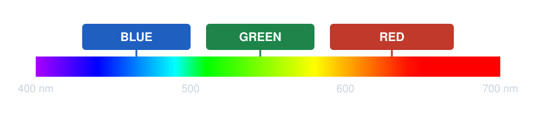

<!-- The bridge from section 1: a digital camera is a remote sensor with three bands, all inside
the visible slice. Each band window gets its own number for every pixel. The windows drawn here
are schematic, not a particular camera's filter curves. Everything in this section is those three
numbers. -->

---

# Each pixel is a number

Each pixel (raster cell) is represented by a **hexadecimal number** that indicates the color to display.

<!-- Digital photos are raster images. Each pixel has a different value from the one next to it,
representing a different color. Raster works really well for digital photos. Zoom far enough into
any photo and the picture stops being a picture and becomes a grid of numbers: one for the red
window, one for green, one for blue. -->

---

# What are hexadecimal numbers?

- A **6-digit** number holding the **red**, **green**, and **blue** components of a color
- **Two digits per band**
- Each digit takes one of **16** values:
  `0 1 2 3 4 5 6 7 8 9 A B C D E F`

#
00
00
00

RED
GREEN
BLUE

<!-- Two hex digits per channel, and the dashed boxes show which pair belongs to which band. Walk
through #FF0000, #00FF00, #0000FF on the board if the class has not seen hex before. -->

---

# Counting in hexadecimal

- Two-digit counting runs:
  `00, 01, … 09, 0A, … 0F,`
  `10, 11, … 9F, A0, … FE, FF`
- That is **256 possible values** per band: `00` = 0, `FF` = 255
- Mix the three bands to get any color

#
00
00
00
black
0
0
0

#
80
00
80
purple
128
0
128

#
FF
A5
00
orange
255
165
0

#
FF
00
00
red
255
0
0

<!-- 0 through 255 in decimal, 00 through FF in hex. Same number, different base. Cover the swatches
and have the class predict each color from its three pairs before you reveal it: purple is equal
red and blue with no green; orange is full red, about two-thirds green, no blue; pure red is one
band full and the other two empty. Black is all three bands at zero: no light at all. -->

---

<!-- _class: quiz -->

# How many colors is that?

- How many unique combinations of red, green, and blue?
  - **256 × 256 × 256 = 16,777,216**
- Is that enough? How many colors can the human eye actually tell apart?
- The BBC puts the working figure at **about a million**: three types of cone cell, roughly 100 shades each

<!-- Answer: yes, 24-bit color is comfortably more than the eye can resolve, by more than a factor of
ten. The grid on the right is a slice of the hex color space — neighboring swatches differ by one
step in one channel, and most of those steps are invisible. -->

---

<!-- _class: lead -->

# 3 — Multi-band Images

## Open an image in ArcGIS Pro

<!-- In the source deck this said "open an image in ArcGIS" — ArcMap-era wording, updated to ArcGIS
Pro. In ArcGIS Pro, a multiband raster comes into the Contents pane as one layer with a band list;
the Symbology pane is where you choose which band drives red, green, and blue. -->

---

# A color image is three bands, stacked

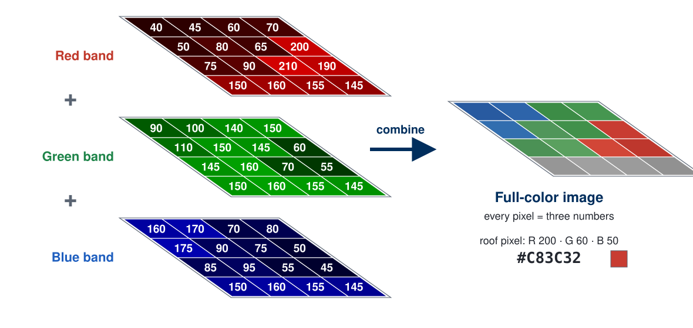

<!-- Read it left to right. Each sheet of grid paper is one band: the same 4 by 4 grid of pixels,
but each sheet holds only one number per cell, how much red, green, or blue light that pixel sent
back. Stack the three and every pixel now has three numbers, which is exactly the hex color from
the last section: the roof pixel is R 200, G 60, B 50, or #C83C32.

Run it backwards too, because that is the point for the rest of the hour: any full-color image can
be pulled apart into its bands, and a satellite image is the same idea with more sheets. The pixel
values are illustrative, chosen to look like water, grass, a red roof, and pavement. The figure is
generated by tools/week04_remote_sensing_figures.py. -->

---

# Band 1 — red

- One MODIS scene over western Europe, shown **one band at a time**
- This band: **0.65 µm**
- In the **red** band, healthy vegetation is **dark** — chlorophyll absorbs red
- Bare ground is brighter; cloud and snow are brightest of all

<!-- Three slides, one scene, three bands. Set the pattern here: a "band" is one wavelength window,
stored as its own grid of numbers, one sheet from the last slide. The lat/lon and instrument are in
the window's status bar — MODIS, off the coast of Britain and France.

TODO(instructor): re-create this slide and the next two in ArcGIS Pro on the machine that has it. Plan and
checklist: tools/week04-arcgis-capture-plan.md, item 1. -->

---

# Band 4 — green

- Same scene, same features, **different band**: 0.56 µm
- What changed between this and the red band, and what did not?
- The annotations are the presenter's; look past them at the pixels

<!-- Ask the class what changed and what did not before you say anything.

TODO(instructor): re-create in ArcGIS Pro (tools/week04-arcgis-capture-plan.md, item 1). -->

---

# Band 3 — blue

- 0.47 µm. Blue **scatters hardest** in the atmosphere, so this band looks hazier
- Stack red, green, and blue together and you get a natural-color image
- Swap a different band into the red channel and you get a **false-color** image

<!-- Same scene again, blue band. Blue scatters hardest in the atmosphere, so this band tends to look
hazier than the others.

TODO(instructor): re-create in ArcGIS Pro (tools/week04-arcgis-capture-plan.md, item 1). These three
captures are from a legacy Multi-Channel Viewer, the leader-line annotations are identical on all
three slides, and the band numbers are whatever the original screenshots show. The re-shoot fixes
all three problems. -->

---

<!-- _class: lead -->

# 4 — Hyperspectral Images

---

# Many narrow, contiguous bands

- **Multispectral**: a handful of fairly wide bands
- **Hyperspectral**: hundreds of narrow, contiguous bands
- Each sheet in the stack is **one narrow slice of the spectrum**
- The result is a **full spectrum for every pixel**, not just a few samples
- Soil, vegetation, and water each have a spectral shape you can match against

Source: satjournal.tcom.ohiou.edu/pdf/shippert.pdf

<!-- Same stack of sheets as the RGB slide, with hundreds of sheets instead of three. The curves on
the right are what you get by drilling down through the stack at one pixel: the values of every
sheet, plotted against wavelength. The next slide puts those sheets back on the spectrum.

The original slide said "Can't open in ArcGIS…". That is dropped: ArcGIS Pro's multidimensional
raster support has moved a long way. VERIFY in ArcGIS Pro which hyperspectral formats it reads
before saying anything either way. VERIFY: the satjournal.tcom.ohiou.edu source link is from the
original deck and has not been re-checked. -->

---

# Where the bands sit on the spectrum

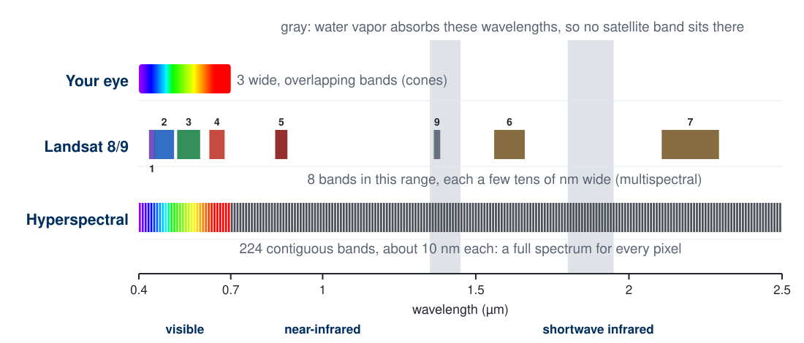

<!-- This is the cube, unfolded along the wavelength axis from the spectrum slides. Top row: your
eye, three wide overlapping bands, all in the visible. Middle row: Landsat 8/9's Operational Land
Imager, eight bands in this range, each a few tens of nanometers wide; band 4 (red) and band 5
(near-infrared) are the pair you used for NDVI in Lab 2. Band 9 sits deliberately inside the
1.38 µm water-vapor notch: it sees only high cirrus cloud, because the atmosphere hides the ground.
Bottom row: a hyperspectral sensor with 224 contiguous bands of about 10 nm, the AVIRIS layout.

The gray columns are the same water-vapor notches as the sunlight-at-the-ground slide. Landsat's
thermal bands (10 and 11, near 11 and 12 µm) are far off the right edge. The figure is generated by
tools/week04_remote_sensing_figures.py from the USGS band designations. -->

---

<!-- _class: lead -->

# 5 — Pulling Real Images Apart

## Every picture is a stack of bands

---

# The Eiffel Tower, band by band

 Full color

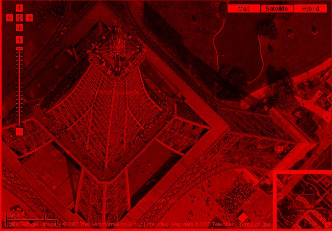 Red band, 0–255

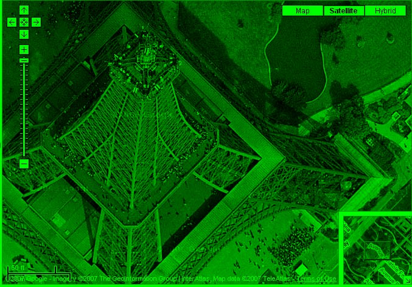 Green band, 0–255

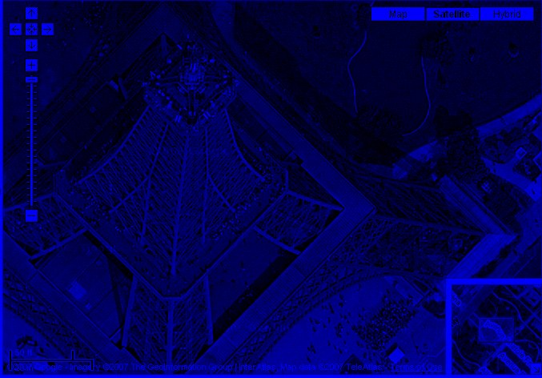 Blue band, 0–255

- Each band is drawn from **black (0) to full color (255)**, so the three add back up to the original
- The lawn is brightest in **green**; the iron and pavement are about equal in all three
- The shadow is dark in every band: no light came back to measure

<!-- Same move as the grid-paper slide, on real pixels. The tower's shadow is also how you get height
out of a straight-down image.

These band images were split from the photo's own pixel values with a script
(tools/week04_remote_sensing_figures.py), not captured in ArcGIS Pro. TODO(instructor): replace
with the ArcGIS Pro version, one band loaded at a time with a black-to-red, black-to-green,
black-to-blue stretch (tools/week04-arcgis-capture-plan.md, item 2). Source of the photo noted in
the original deck: llll20.wordpress.com/2007/06/09/very-cool-google-satellite-maps/ -->

---

# Snow or cloud?

 Full color

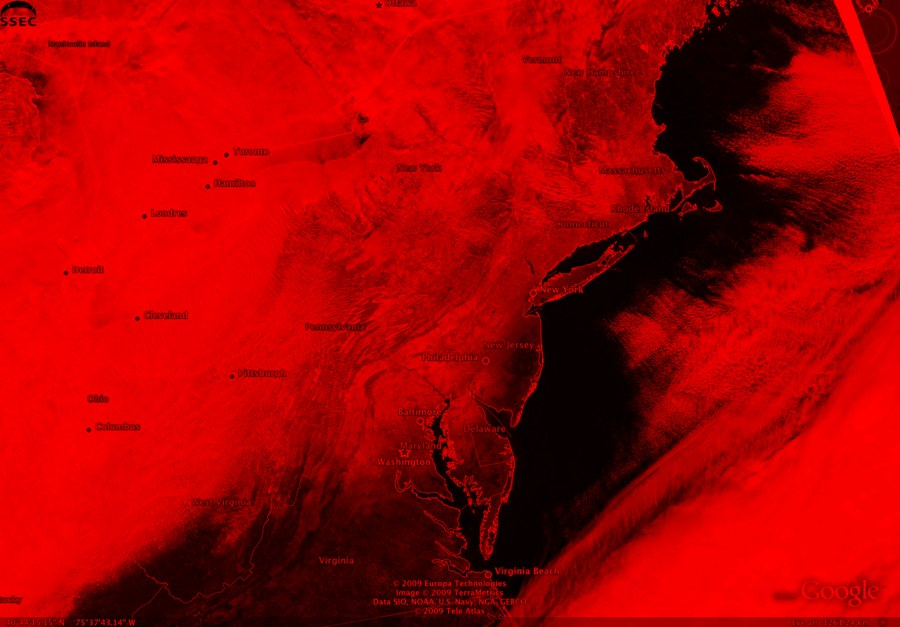 Red band

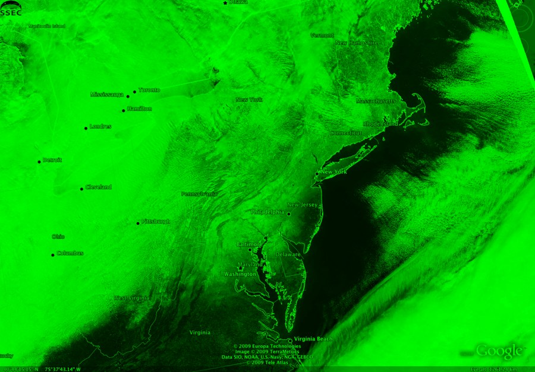 Green band

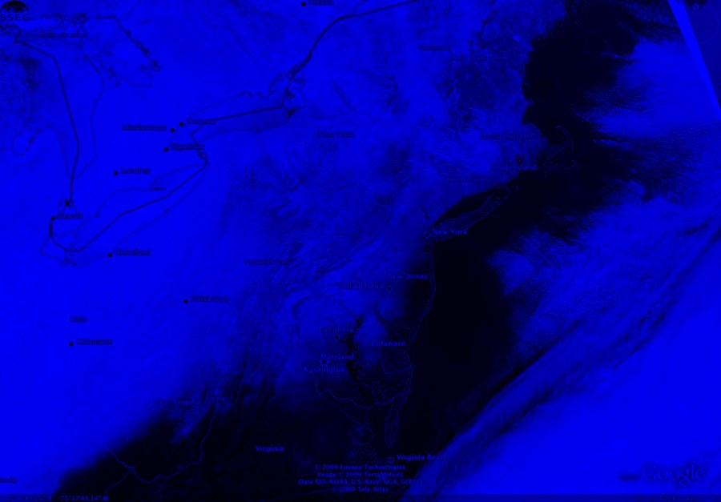 Blue band

- Snow and cloud are **bright in all three visible bands**: visible light cannot tell them apart
- Move to the **shortwave infrared, near 1.6 µm** (Landsat band 6): snow goes dark, cloud stays bright
- Notice the yellow state lines vanish from the blue band: yellow is **red + green, no blue**

<!-- A winter storm over Maryland and the mid-Atlantic, January 2009. The lesson is that the answer
to "snow or cloud?" is on the band ruler, not in the picture: you need a band outside the visible.
That is what the Normalized Difference Snow Index is built on. Source noted in the original deck:
weblogs.marylandweather.com, January 2009.

Band images split by script, not ArcGIS Pro (tools/week04-arcgis-capture-plan.md, item 2). -->

---

# Smoke from the 2007 California wildfires

 Full color

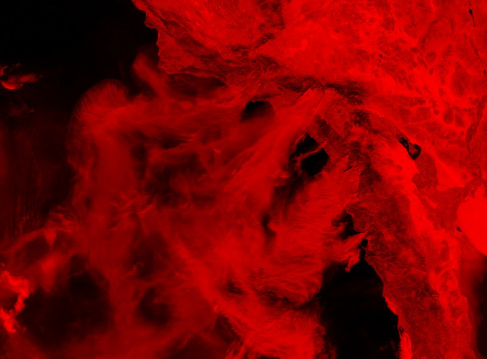 Red band

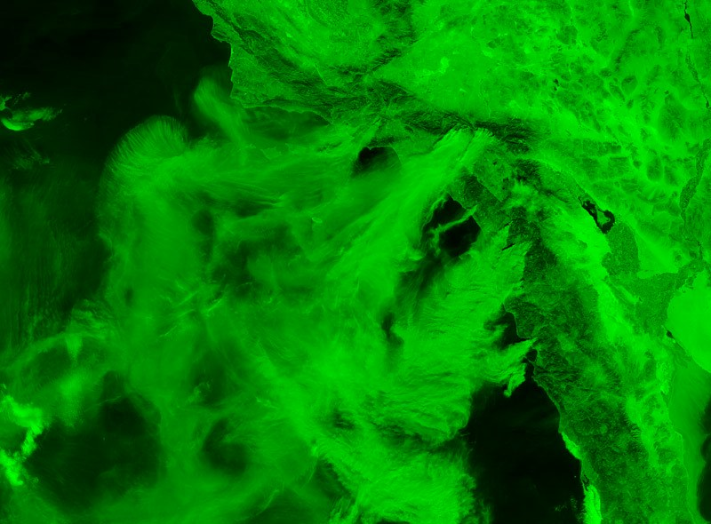 Green band

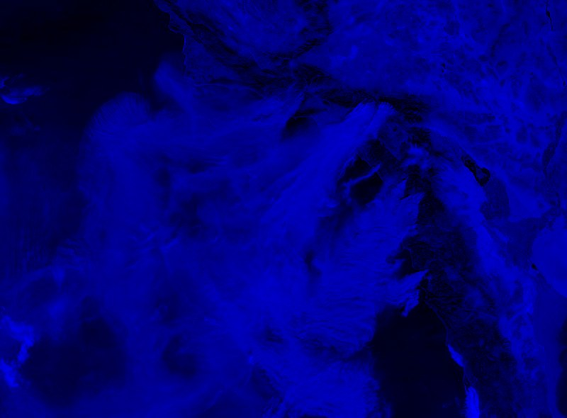 Blue band

- The desert is brightest in **red**; smoke over the ocean is brightest in **blue**
- Small smoke particles **scatter short wavelengths** most, the same reason the MODIS blue band looked hazy
- A longer wavelength sees **through** haze, which is why fire maps lean on infrared bands

<!-- Numbers from this image: open desert averages about R 198, G 171, B 142; smoke over open water
about R 88, G 112, B 123, against clear water at R 8, G 18, B 28. The smoke adds more to the blue
band than to the red. Point back at the Band 3 slide.

Source noted in the original deck: andrewlias.blogspot.com, October 2007. Band images split by
script, not ArcGIS Pro (tools/week04-arcgis-capture-plan.md, item 2). -->

---

# Europe at night

 Full color

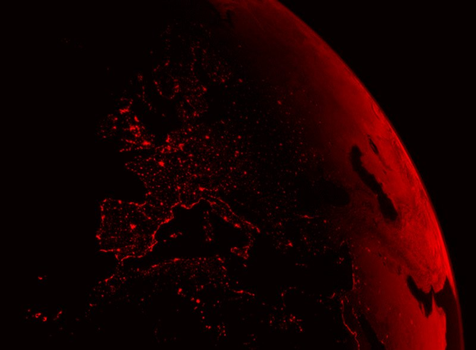 Red band

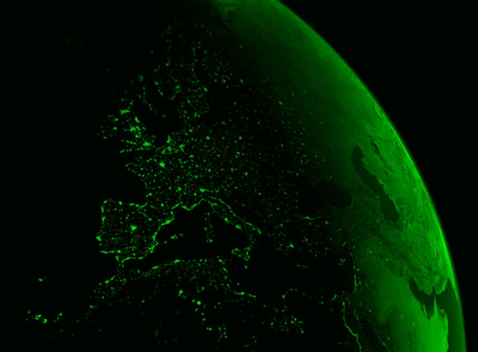 Green band

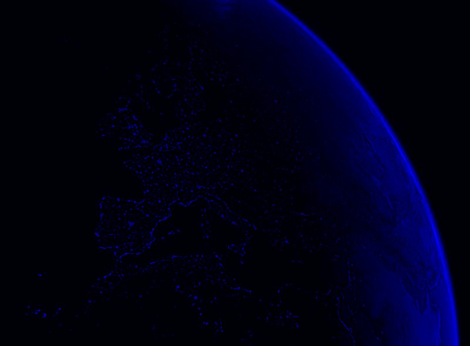 Blue band

- City lights are **emitted** light, not reflected sunlight
- Strong in red and green, weak in blue: that mix is **orange**
- The thin blue rim is the atmosphere **scattering** sunlight on the day side

<!-- Night lights are used as a proxy for population and for economic activity. The orange of older
European street lighting comes from sodium-vapor lamps, which put nearly all their light near
589 nm, between green and red on the spectrum; the switch to white LEDs is adding blue to night
imagery.

Caution: this is a rendered composite (a day side and a night side on one globe), not a single
satellite frame, so the colors are the renderer's choice. Use it for the band logic, not as a
measurement. Source noted in the original deck: strangetravel.com. Band images split by script,
not ArcGIS Pro (tools/week04-arcgis-capture-plan.md, item 2). -->

---

<!-- _class: quiz -->

# What are you looking at?

- A false-color scene: the colors are **band assignments**, not what your eye would see
- What are the long parallel streaks?
- What is the dark line running down the middle?

<!-- Open discussion. Draw out that "false color" means someone chose which band drives red, green,
and blue: the same three sheets, but one of them is from outside the visible.

TODO(instructor): this image came into the deck from a "cool satellite photos" link and its subject,
sensor, and location are not recorded anywhere in the source. Identify and attribute it, or replace
it, before using it as a discussion prompt. -->

---

<!-- _class: lead -->

# 6 — Satellites

## Who takes the picture, and what they trade off

---

# How a satellite image gets made

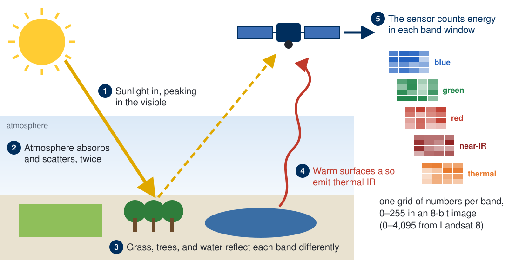

<!-- The whole lecture on one diagram; walk the numbers. (1) Sunlight arrives, peaking in the
visible: the dashed black-body curve. (2) The atmosphere absorbs and scatters it on the way down
and again on the way back up, which is why bands sit in the windows. (3) Each surface reflects
each band differently: that difference is the signal, and it is what NDVI exploits. (4) Warm
surfaces also emit thermal infrared, day and night. (5) The sensor counts the energy in each band
window and writes one grid of numbers per band, the sheets from section 3.

All of this is passive: the sun supplies the energy. Next week LiDAR supplies its own. Radar
satellites such as Sentinel-1 do the same with microwaves, which is why they see through cloud and
work at night. -->

---

# Two orbits, two jobs

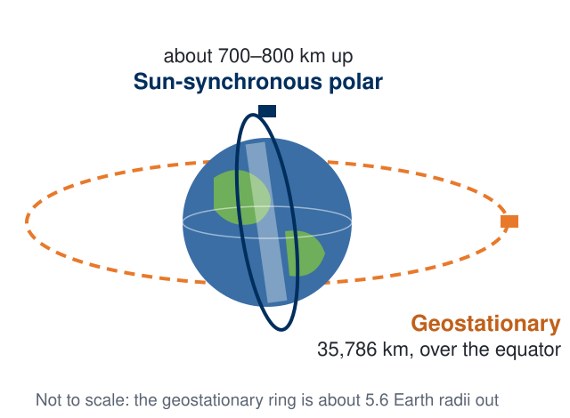

**Sun-synchronous polar**: Landsat, Sentinel-2, Terra and Aqua (MODIS)
- Pole to pole while Earth turns underneath: the **whole planet**, one strip at a time
- Crosses each place at the **same local time**, so shadows and light match between dates
- Returns every few days to weeks

**Geostationary**: GOES
- Orbits once a day over the equator, so it **hangs over one spot**
- Watches a whole hemisphere **every few minutes**, with coarser pixels

<!-- Low and close means sharp pixels but a long wait to come back; high and far means you never
look away but each pixel covers kilometers. Landsat flies at about 705 km, Sentinel-2 at about
786 km. Weather satellites like GOES are geostationary, which is why the Katrina infrared loop a
few slides on could be refreshed every few minutes. -->

---

# Every satellite is a trade-off

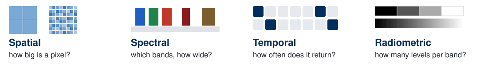

| Satellite (agency) | Pixel size | Bands | Revisit |
| --- | --- | --- | --- |
| **Landsat 8 & 9** (NASA / USGS) | 30 m (15 m panchromatic) | 11 | 8 days, the pair together |
| **Sentinel-2** (ESA) | 10, 20, or 60 m | 13 | 5 days, two satellites |
| **MODIS** on Terra & Aqua (NASA) | 250 m to 1 km | 36 | 1 to 2 days |
| **GOES** (NOAA), geostationary | 0.5 to 2 km | 16 | 5 to 15 minutes |
| **Commercial**, e.g., WorldView-3 | about 0.3 m | 8 visible/near-IR, plus more | on request |

<!-- No satellite wins on all four. Sharp pixels cost coverage and revisit; frequent revisit costs
pixel size. Radiometric resolution ties back to the hex slides: an 8-bit band has 256 levels,
while Landsat 8 records 12 bits (4,096 levels) and Landsat 9 records 14 bits. Landsat has an
unbroken record back to 1972, and Landsat and Sentinel-2 data are free, which is why most
engineering work starts there.

VERIFY before class: Terra and Aqua are both well past their design lives and drifting; check
whether MODIS is still delivering, and name VIIRS as its successor if not. The WorldView-3 band
count and revisit are summarized loosely on purpose; the commercial lineup changes quickly. -->

---

# One storm, three sensors

 <b>Wide view</b> the whole storm, coarse pixels

 <b>Commercial, sub-meter</b> the Superdome roof, a few blocks across

 <b>Thermal infrared</b> emitted heat, day or night

- Same event, three **trade-offs**: coverage, detail, and a band outside the visible
- Which would you want **during** the storm? Which **the week after**?

<!-- Hurricane Katrina, August 2005. The true-color view shows the whole storm in the Gulf. The
high-resolution commercial image of the Superdome after the storm shows the roof membrane torn
away: the detail an insurance adjuster or engineer needs, and useless for tracking the storm.
The enhanced infrared view genuinely IS about emitted heat: colors are a temperature enhancement,
and the coldest cloud tops are the tallest, most vigorous convection, which is why the eyewall
lights up. Timestamp on the image: 17:25Z, 29 August 2005.

Sources noted in the original deck: sapphireeventsnola.com (true color);
satimagingcorp.com/galleryimages/hurricane-katrina-superdome-picture.jpg (Superdome).

TODO(instructor): provenance of the infrared image. Its only recorded source is a NOAA URL
(www.srh.noaa.gov/images/hun/stormsurveys/katrina/katrina_IRsat_29_1725Z.png) that the September
2026 audit found no longer resolves. Re-source or re-attribute it from a current NOAA archive. -->

---

# Japan, March 2011: before and after

<!-- Yuriage in Natori, and Yagawahama: 2007–2008 imagery on the left, 12 March 2011 on the right.
This is what temporal resolution buys: a satellite that passes regularly already has the "before"
image on file. Before-and-after pairs are the single most common emergency-response product. Ask
what you would have to do to these two images before you could difference them, which is exactly
the georectification problem from Tuesday. Source noted in the original deck: boingboing.net,
March 2011. -->

---

# Where today shows up

**Behind you — Lab 2**

You already built **NDVI**: reflected **near-infrared** against **red**, because healthy leaves absorb red and bounce near-infrared back.

Today is why those two bands and not any other two. The index was arithmetic; the choice of bands was physics.

**Ahead — Week 5**

Next week the sensor points at the ground and measures **distance** instead of brightness.

**LiDAR** on Tuesday, and what you can compute from the surface it produces on Thursday.

<!-- Two minutes of joining up. Say "reflected near-infrared", not "heat": the near-infrared in NDVI is reflected sunlight that leaf structure bounces back, and nothing in NDVI measures temperature. Then hand off to Week 5: everything today was passive, measuring sunlight that something else emitted; LiDAR is active, and that difference is where Tuesday starts. -->

---

# Before Next Class

- Finish **Lab 3 — Georectifying and Digitizing Historic Maps**, due **Saturday 11:59 pm**: [assignments/lab-03](https://byu-hydroinformatics.github.io/ce414-gis-applications/assignments/lab-03/)
- Read **Chapter 6** of *GIS Fundamentals* (Remote Sensing)
- Take **Quiz 4** (open book) on Learning Suite — due **Saturday 11:59 pm**
- Questions? Office hours: [calendly.com/dan-ames/office-hours](https://calendly.com/dan-ames/office-hours)

<!-- Lab 3 is due this Saturday. Next week is elevation: LiDAR on Tuesday, terrain analysis on Thursday, and Lab 4 needs a DEM, so Tuesday is the hour that tells them where to get one. -->

---

<!-- _class: activity -->

# One Last Thing — Light and Bands

Eight questions on what the sensor actually measured. **Scan the code**, or open the link below.

- Not graded, nothing recorded — it is a check that today landed
- Every answer explains itself; read the explanation before you move on
- Good warm-up for Quiz 4 on Learning Suite, and for the *GIS Fundamentals* reading

byu-hydroinformatics.github.io/ce414-gis-applications/quizzes/remote-sensing/

<!-- Four or five minutes, then a show of hands on the first item. That one splits the room every
time: near-infrared in a vegetation image is reflected sunlight bouncing off leaf structure, and a
good half of the class will pick "leaves are warmer than the ground" because the word infrared
sounds like heat. Draw the distinction on the board one more time - reflected near-infrared is
sunlight, thermal infrared is what a surface emits because of its own temperature - and point back
at the Katrina infrared slide, which is the one image today that really is heat. If the room has no
signal, put the URL on the board; the items read aloud just as well. -->

<!--
Split notes (2026-09-10). This was "Remote Sensing and 3D Imaging", 43 slides, at slug
remote-sensing-3d-imaging. Its last nine slides were LiDAR and they moved to Week 5, into
slides/week-05/elevation-data-lidar.md, at the instructor's decision: 43 slides is too many for a
75-minute session, and a bare-earth LiDAR surface is a DEM, so LiDAR belongs beside terrain
analysis rather than at the end of a spectrum-and-bands lecture.

What changed here beyond the removal: the deck is renamed "Remote Sensing"; the title slide's
background was a LiDAR city render that left with the LiDAR block, replaced with the false-color
terrain image; the LiDAR goal became a false-color goal; "Where we are going" lost its sixth item;
and the closing "Where today shows up" now hands off to Week 5 on the passive-versus-active
distinction rather than pointing at LiDAR slides that are no longer in this deck.

Old slug remote-sensing-3d-imaging.html is now a 404. Learning Suite carries it on Thu Sep 24.
-->

<!--
Revision notes (2026-09-23), instructor review the day before the lecture. Removed the "Where we
are going" contents slide. Removed the dead YouTube link from the spectrum slide and labeled the
figure instead. The irradiance slide and the Digital Images divider now tie back to the spectrum.
Added dashed pair boxes to the hex slides, and four decoded colors to the counting slide. Added the
grid-paper RGB stack slide and a band-ruler slide after the hyperspectral cube. The old gallery is
gone: Eiffel, snow, smoke and night lights are now band splits (section 5), the inauguration, Dubai
and second Japan slides are dropped, and Katrina's three images are one slide in a new Satellites
section (section 6). New figures: tools/week04_remote_sensing_figures.py. ArcGIS Pro captures still
to make: tools/week04-arcgis-capture-plan.md.
-->
