<!-- _class: lead -->
<!-- _paginate: skip -->

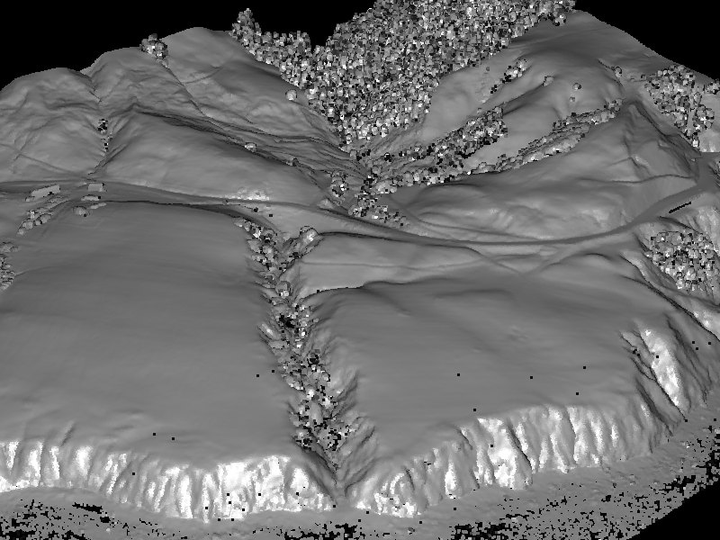

# Elevation Data and LiDAR

## Where a surface comes from before you analyze it

CE 414 Engineering Applications of GIS
Civil & Construction Engineering, Brigham Young University

Dr. Dan Ames

<!-- Week 5, Tuesday. This hour is entirely about where elevation data comes from: what a DEM is, how LiDAR measures one, and which portal to open to download one. Thursday is what you compute from it. Lab 4 needs a DEM, so the download half of this hour is the one they will use on Saturday. The image is a hillshade of a bare-earth LiDAR surface, which is both halves of the hour in one picture. -->

<!-- stamp:begin -->
<!-- _footer: 'CE 414 · Week 5 — Elevation Data and LiDARLast Updated: 2026-09-10© 2026 Daniel P. Ames · <a href="https://creativecommons.org/licenses/by/4.0/">CC BY 4.0</a>' -->
<!-- stamp:end -->

---

# Today's Goals

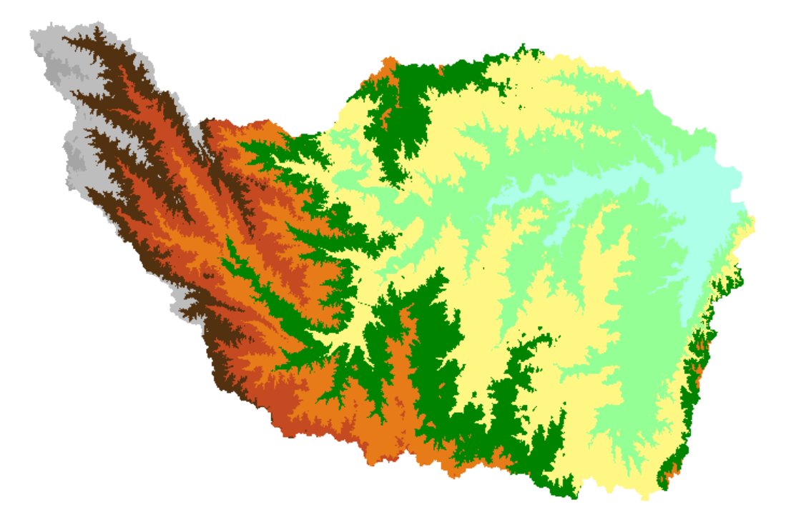

By the end of class you should be able to:

- Define an **elevation surface**, and name the ways a **DEM** can represent one
- Explain how **LiDAR** measures a surface, and what a **point cloud** is
- Say what a **return** is, and how a bare-earth model is separated from a canopy
- Name three sources of free DEMs and the **cell size** each one gives you
- Say what cell size costs you, and pick one for a job

<!-- Frame the hour: concept, then measurement, then acquisition. They leave able to download the DEM that Lab 4 needs. -->

---

<!-- _class: lead -->

# Part 1
## What an elevation surface is

<!-- Two slides. Keep it short; most of them have met a DEM before. -->

---

# Elevation surface and DEM

- **Elevation surface** — the ground surface elevation at each point
- **Digital Elevation Model (DEM)** — a digital representation of an elevation surface

Examples of a DEM include a (square) digital elevation grid, a triangular irregular network, a set of digital line graph contours, or random points.

<!-- The distinction that matters: the surface is the real thing, the DEM is a model of it. A grid is only one way to model a surface; a TIN, contours and a point cloud are others. Everything else today assumes the square grid case. -->

---

# Digital elevation grid

**Digital elevation grid** — a grid of cells (square or rectangular) in some coordinate system, having land surface elevation as the value stored in each cell. A **square digital elevation grid** is the common special case.

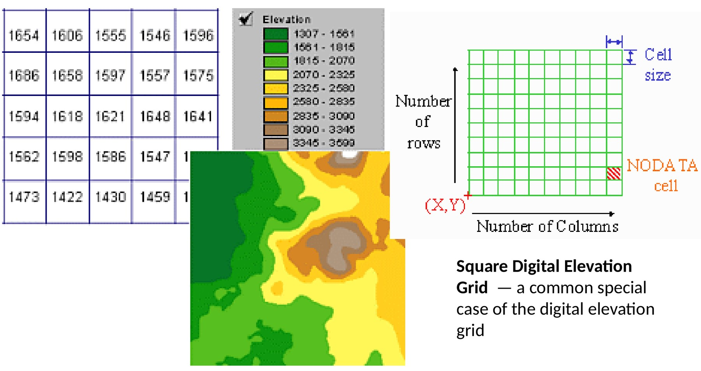

<!-- Walk the anatomy: number of rows, number of columns, cell size, an (X,Y) origin, and NODATA cells where there is no value. The number in the cell is an elevation; the color is only symbology applied to that number. -->

---

<!-- _class: lead -->

# Part 2
## How it gets measured

<!-- The LiDAR half. Everything before this hour in the course has been passive remote sensing — measuring light something else emitted. LiDAR is active: it emits and times the return. That distinction is worth naming out loud before the first slide. -->

---

<!-- _class: lead -->

# LiDAR

## Light Detection And Ranging

---

# What is LiDAR and how does it work?

- Fire a pulse of laser light, measure how long it takes to come back
- Time of flight × speed of light ÷ 2 = **range**
- Combine range with the sensor's own **position and orientation** (GPS and IMU) to get an `(x, y, z)` point
- Hundreds of thousands of pulses a second gives a **point cloud**
- A single pulse can return **more than once** — treetop, branch, ground

<a href="https://www.youtube.com/watch?v=EYbhNSUnIdU" target="_blank">

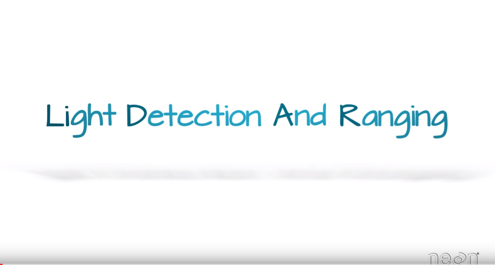

</a>

<a href="https://www.youtube.com/watch?v=EYbhNSUnIdU" target="_blank">youtube.com/watch?v=EYbhNSUnIdU</a>

<!-- Click the graphic to open the video. Multiple returns per pulse is the idea that makes the next
slide make sense: it is how a laser sees the ground through a canopy.
VERIFY: this YouTube link came across from the source deck and has not been re-checked. -->

---

# A forest, in points

<!-- A side view through a point cloud of trees. Every white dot is one laser return. Note that there
are returns from inside and below the canopy — that is the multiple-return behavior from the last
slide, and it is why LiDAR can produce a bare-earth surface under forest. -->

---

# Mount Rushmore as a point cloud

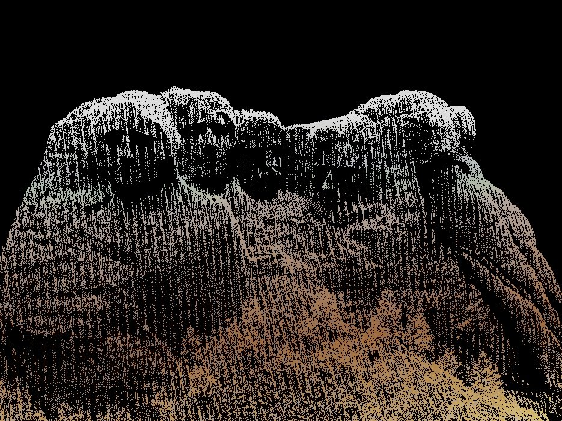

<!-- Terrestrial scanning at very high point density. The scan lines are visible as vertical striping.
Used here for documentation and change monitoring of the monument. -->

---

# Where the scanner sits

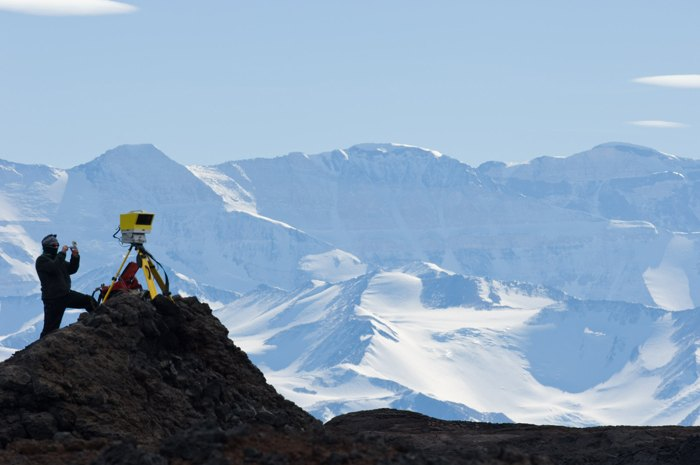

<!-- Terrestrial (tripod-mounted) LiDAR. Airborne LiDAR gets you a county; a terrestrial scanner gets
you one slope, one bridge, one quarry face, at far higher density. Civil engineering uses both. -->

---

# A city as a surface

<!-- Buildings extracted from an airborne point cloud and rendered as a surface. This is the input to
line-of-sight studies, solar potential, view analysis, and flood modeling in an urban core. -->

---

# Bare-earth terrain

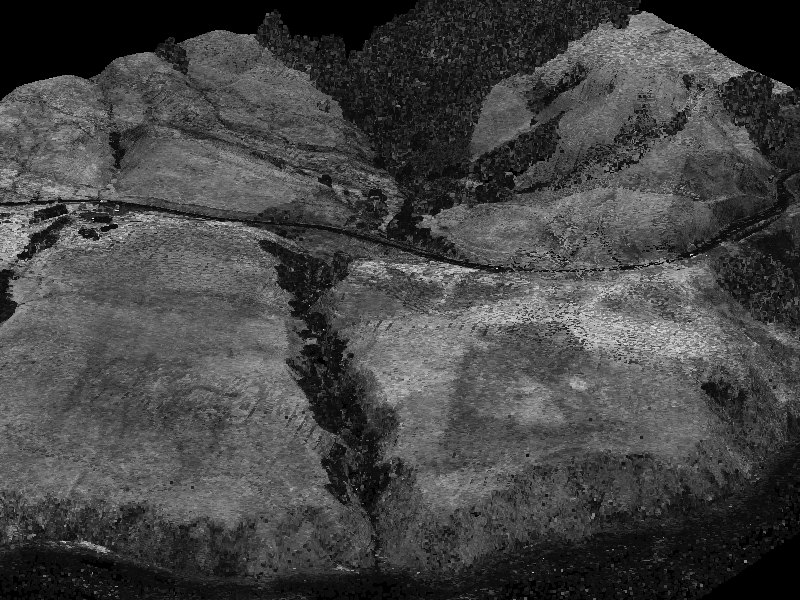

<!-- Same data, classified to ground returns only and rendered as a surface. Vegetation and structures
have been removed. -->

---

# The same terrain, hillshaded

<!-- A hillshade of the bare-earth model. Channels, terraces, roads, and old cut lines show up that
you cannot see on the ground or in a photograph. This is why LiDAR changed geomorphology and
archaeology. -->

---

# LiDAR, moving

- <a href="https://www.youtube.com/watch?v=nXlqv_k4P8Q" target="_blank">**Visualization of LIDAR data**</a> — flying through a raw point cloud
- <a href="https://www.youtube.com/watch?v=TFZ7Guej8VM" target="_blank">**FRA Nepal Forest Lidar Visualization**</a> — canopy and ground returns separating out
- <a href="https://www.youtube.com/watch?v=hCP2XaOCAlk" target="_blank">**LiDAR point cloud geovisualization: Balboa Park, San Diego**</a> — a surveyed city block

<!-- Play one, not three. The Nepal clip is the one that earns its time: you watch the canopy strip away and the ground surface appear underneath, which is the classification step the previous slides described in words. Link titles checked live on Sept 10, 2026; a fourth clip from the source deck (k6nfskNev-Q) is no longer available and was removed. -->

---

<!-- _class: lead -->

# Part 3
## Where to download one

<!-- The practical half, and the one Lab 4 depends on. Have the portals open; the interfaces move faster than the slides do. -->

---

# DEM data sources

- **3″** (3 arc seconds ≈ 90 m) DEMs from **SRTM** (space shuttle global scan)
- **30 m** DEMs derived from 1:24,000 scale maps, available for the full U.S.
- **10 m** DEM for the U.S., resampled and downscaled from 30 m for most of the U.S.
- **1 m** DEM for parts of the earth, derived from lidar

<!-- TODO(graphic): this source slide was text only; a four-tier resolution-ladder figure would carry it. None was generated for this pass. -->

<!-- These four tiers are the mental model students should leave with: coarse global, medium national, fine national, very fine and patchy. The specific dataset names below the tiers have moved on since this slide was written. -->

<!-- VERIFY: "3″ (3 arc seconds ≈ 90 m) DEMs from SRTM" — SRTM is distributed at 1 arc-second and 3 arc-second; confirm which product and which resolution is meant. -->
<!-- VERIFY: "30 m DEMs derived from 1:24,000 scale maps available for the full U.S." — this describes the legacy NED / USGS DEM lineage; confirm against what USGS actually distributes now. -->
<!-- VERIFY: "10 m DEM for the US resampled and downscaled from 30 m for most of the U.S." — check whether the 1/3 arc-second product is natively 10 m or derived from 30 m, and note that going 30 m to 10 m is upsampling, not downscaling. -->
<!-- VERIFY: "1 m DEM for parts of the earth derived from LiDAR" — confirm current coverage and the correct product name. -->
<!-- TODO(instructor): restate this slide in current USGS 3DEP terminology (3DEP product tiers and their arc-second/meter designations), and decide whether "NED" should still be named at all or only mentioned as the historical predecessor. -->

---

# Where to get global DEMs

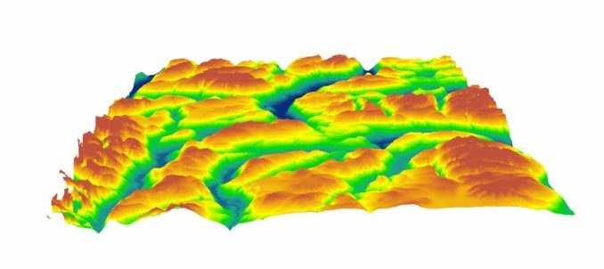

- A maintained roundup of free global elevation data:
  [gisgeography.com/free-global-dem-data-sources](https://gisgeography.com/free-global-dem-data-sources/)
- Read the entry for each dataset before you download: **coverage**, **cell size**, **vertical datum**, and **license**
- The next four slides are the sources you will actually use in this course

<!-- Have the page open. The point of the list is that "a DEM" is never just "a DEM" — you pick one, and the choice shows up in every derived surface afterward. -->

---

# USGS — The National Map

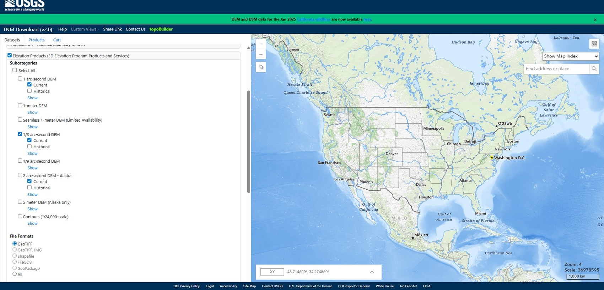

- The clearinghouse for U.S. elevation data, from the **3D Elevation Program (3DEP)**
- Download from [apps.nationalmap.gov/downloader](https://apps.nationalmap.gov/downloader/)
- Draw an area of interest, filter to **Elevation Products (3DEP)**, then pick a resolution and a format
- 3DEP publishes **1 m**, **1/3 arc-second** (about 10 m) and **1 arc-second** (about 30 m). Which exists depends on where you look

<!-- This is the portal students use for the lab. Show the Datasets tab on the left: they check the elevation product they want, draw an extent, and the download list appears under Products. Do it live rather than from the slide, because the interface moves. -->

<!-- 2026-09-10: www.nationalmap.gov now 301s to the USGS National Map program page, which is not where you download anything. The slide points at the downloader itself. -->

<!-- TODO(screenshot): ta-usgs-national-map.jpg predates the current TNM Downloader, which has Datasets / Products / Cart tabs across the top of the left panel. Re-shoot from apps.nationalmap.gov/downloader. -->

---

# NASA SRTM

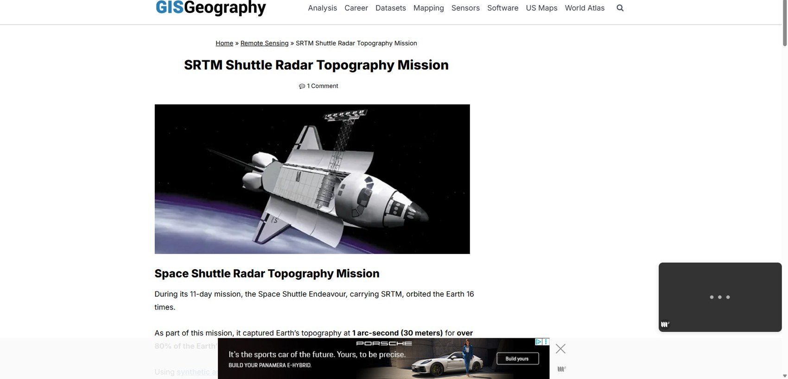

- SRTM flew aboard the Space Shuttle *Endeavour* on mission STS-99, **February 11 to 22, 2000**
- Two radar antennas, one in the payload bay and one on the end of a **200-foot mast**, measured elevation by interferometry in a single pass
- It mapped **nearly 80% of Earth's land surface** at **1 arc-second**, about 30 meters

<!-- The Shuttle Radar Topography Mission flew in February 2000. Radar interferometry from a fixed mast: two antennas, one baseline, one pass. It is still the reference global DEM for a lot of hydrology work. -->

<!-- CORRECTED 2026-09-10 against NASA Earthdata (earthdata.nasa.gov/data/instruments/srtm). The slide used to say the shuttle "orbited the Earth 16 times", which is the number of orbits in a day, not in an eleven-day mission; and "over 80% of the Earth's surface", which is wrong twice — NASA says nearly 80%, and of the *land* surface. Both were flagged VERIFY at migration. The mast length and the single-pass interferometry are from the same page and are worth saying, because they are why SRTM has voids in steep terrain: one look angle, radar shadow. -->

<!-- TODO(screenshot): ta-nasa-srtm-page.jpg is a capture of a third-party web page, advertisement included. Replace with the NASA Earthdata SRTM page or a plain coverage figure. -->

---

# NASA ASTER

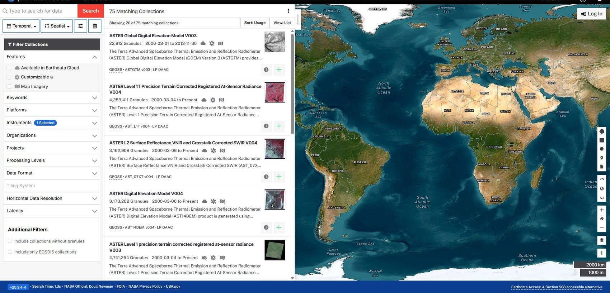

- ASTER GDEM is **1 arc-second — about 30 meters — everywhere**, not just in the United States
- Built from **stereo optical imagery** rather than radar, so it fills SRTM's voids but is noisier over snow, sand and water
- Search and download through NASA [Earthdata Search](https://search.earthdata.nasa.gov/)

<!-- ASTER GDEM is built from stereo optical imagery rather than radar, so it fills in where SRTM has voids, but it is noisier over low-contrast surfaces such as snow, sand and water. -->

<!-- CORRECTED 2026-09-10 against the NASA Earthdata catalog entry for ASTER Global Digital Elevation Model V003: "a spatial resolution of 1 arc second (approximately 30 meter horizontal posting at the equator)", globally. The slide's "90 meters global, 30 meters in the United States" was false — it looks like SRTM's 3 arc-second global product confused with ASTER. This was flagged VERIFY at migration.

Version 3 was built from ASTER scenes acquired March 2000 to November 2013, stacked and cloud-screened, with reference DEMs used to patch areas with too few scenes. That last detail is worth a sentence: parts of ASTER GDEM are not ASTER.

The source slide repeated its one sentence twice, once beginning "ASTER GDEM has..." and once "ASTER GDEM boasted..."; the duplicate was removed at migration. -->

<!-- TODO(screenshot): ta-aster-gdem-earthdata.jpg is a stale Earthdata Search capture; re-shoot from search.earthdata.nasa.gov. -->

---

# JAXA — Japan's space agency

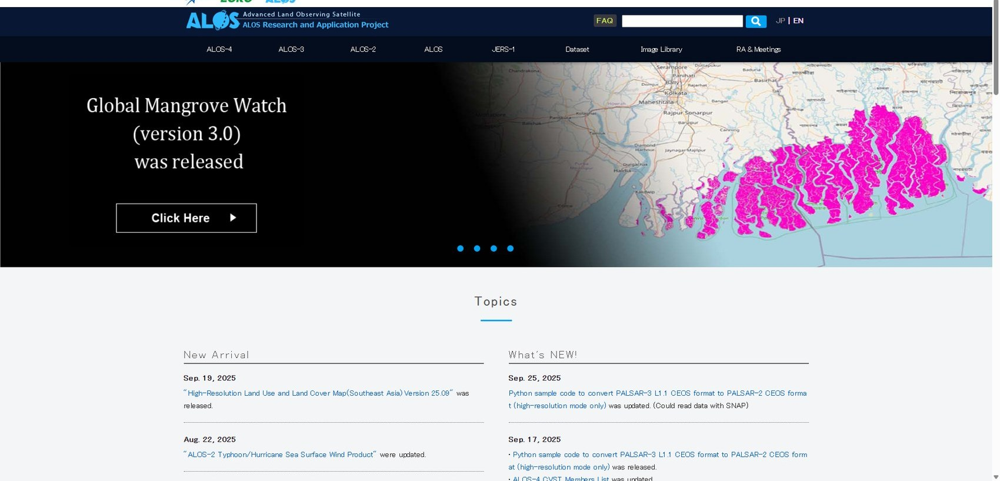

- JAXA distributes **ALOS World 3D — 30m (AW3D30)**, a global 1 arc-second DEM from the ALOS PRISM stereo instrument
- A third independent global DEM, worth having when SRTM and ASTER disagree
- [eorc.jaxa.jp/ALOS/en/dataset/aw3d30](https://www.eorc.jaxa.jp/ALOS/en/dataset/aw3d30/aw3d30_e.htm)

<!-- Worth naming so students know there is more than one global option. The useful habit is comparing two DEMs over the same area and seeing where they disagree — usually steep terrain, forest canopy and water. -->

<!-- The source slide had no text beyond its title. The product named here is AW3D30, JAXA's free global 30 m release; the commercial AW3D is 5 m and is not what students will download. Link checked live 2026-09-10.

The teaching point of having three global DEMs on three slides is the habit in the next bullet: difference two of them over the same area and look at where they disagree. It is steep terrain, forest canopy and water every time, and that is a map of where your slope analysis is least trustworthy. -->

<!-- TODO(screenshot): ta-jaxa-alos-portal.jpg is stale; re-shoot from the AW3D30 page. -->

---

# Mars DEMs!

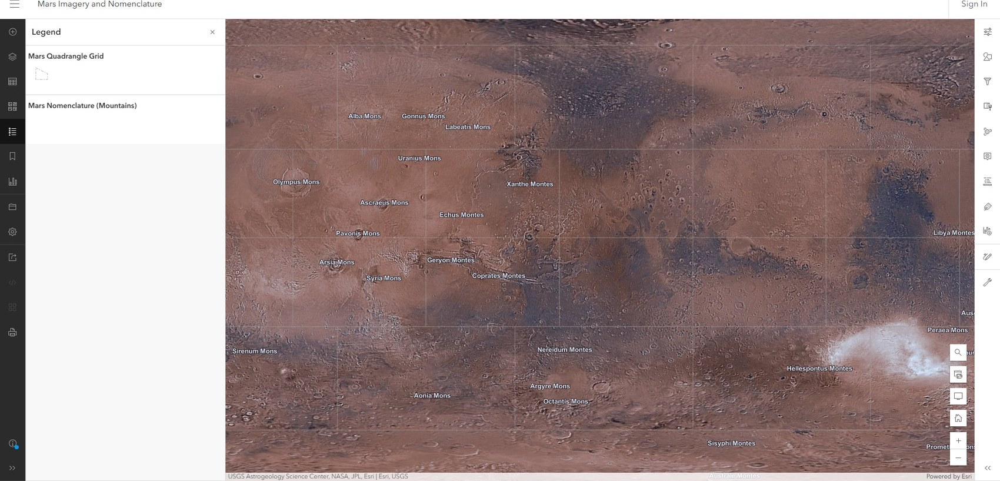

- Elevation surfaces are not a terrestrial idea: Mars is mapped, quadrangle by quadrangle, the same way
- Same data model, same derived surfaces, no field survey

<!-- A one-slide aside, but it makes the point that everything in this lecture is arithmetic on a grid of numbers. Nothing in the slope or viewshed math cares which planet the numbers came from. -->

---

# Coverage of 30 m and 3″ DEMs

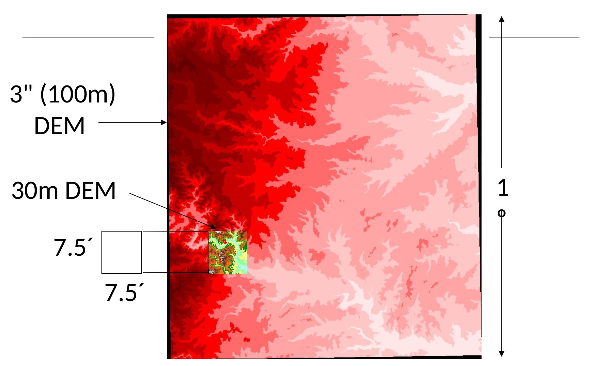

<!-- Two different things are being compared: cell size and tile extent. The 3-arc-second DEM covers a 1-degree tile; the 30 m DEM covers a 7.5-minute quadrangle, which is a small square inside it. Finer cells mean smaller tiles and more files for the same study area. -->

---

# Cell size changes what you can see

**30 m cells**

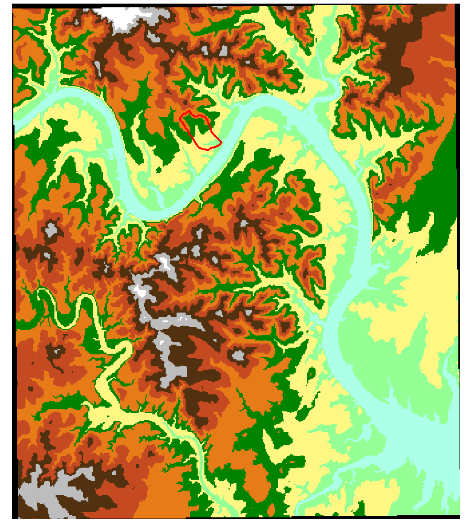

**100 m cells**

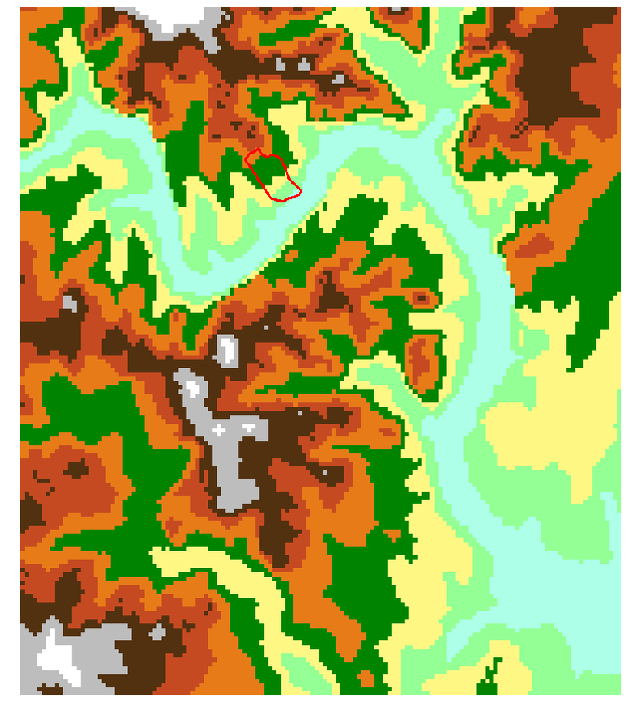

<!-- Same terrain, same symbology, two cell sizes. The red outline is the same parcel in both. At 100 m the small drainages disappear and the parcel spans only a handful of cells; any slope you compute for it is an average over a much larger footprint. -->

<!-- TODO(instructor): add the native-versus-resampled distinction here — a 10 m grid resampled from 30 m source data has 10 m cells but 30 m information, and every derived surface inherits the coarser one. Decide how to state it and whether to demonstrate it with a resampled raster. -->

---

# Before Next Class

- **Lab 4 — Cell Phone Tower Placement** is due **Saturday 11:59 pm**: [assignments/lab-04](https://byu-hydroinformatics.github.io/ce414-gis-applications/assignments/lab-04/). It needs a DEM for Utah County — download it with what you learned today
- **Thursday**: what you compute from a DEM. Slope, aspect, curvature, hillshade and viewsheds
- **Reading**: Chapter 11 of *GIS Fundamentals* (Terrain Analysis)
- **Quiz 5**, open book, on Learning Suite, due **Saturday 11:59 pm**
- **Office hours**: [calendly.com/dan-ames/office-hours](https://calendly.com/dan-ames/office-hours)

<!-- The one thing they must do before Thursday is get a DEM. Everything Thursday does is arithmetic on the grid they downloaded today, and Lab 4's slope step needs the same file. -->

<!--
Authoring notes (2026-09-10). New deck for the Tuesday session of Week 5, assembled rather than
written: the LiDAR block (nine slides) came from the Week 4 Thursday deck, and Part 1 of the Week 5
terrain deck (the elevation surface, the DEM grid, and the data sources) came from
slides/week-05/terrain-analysis.md. Both moves were the instructor's decision on 2026-09-10.

The order is deliberate: concept, then measurement, then acquisition. It ends on cell size, which is
what Thursday's slope material depends on, and the practical half is the one Lab 4 needs, since that
lab wants a DEM for Utah County by Saturday.

The seven LiDAR images moved from slides/week-04/images/ and were renamed rs- to ed-, because
nothing may reference an image outside its own week folder.

Inherited and still open from the terrain deck: the four data-portal captures (The National Map,
SRTM, ASTER on Earthdata Search, JAXA) are stale, though the facts on those slides were corrected
against NASA Earthdata on 2026-09-10. The SRTM slide's image is a third-party page with an
advertisement in it and should be replaced.
-->
