<!-- _class: lead -->
<!-- _paginate: skip -->

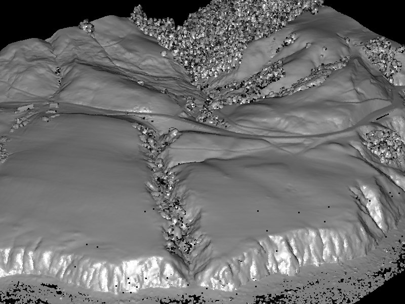

# Elevation Data and LiDAR

## Where a surface comes from before you analyze it

CE 414 Engineering Applications of GIS
Civil & Construction Engineering
Brigham Young University

Dr. Dan Ames

<!-- Week 5, Tuesday. This hour is entirely about where elevation data comes from: what a DEM is, how LiDAR measures one, and which portal to open to download one. Thursday is what you compute from it. Lab 4 needs a DEM, so the download half of this hour is the one they will use on Saturday. The image is a hillshade of a bare-earth LiDAR surface, which is both halves of the hour in one picture. -->

<!-- stamp:begin -->
<!-- _footer: 'CE 414 · Week 5 — Elevation Data and LiDARLast Updated: 2026-09-28© 2026 Daniel P. Ames · <a href="https://creativecommons.org/licenses/by/4.0/">CC BY 4.0</a>' -->
<!-- stamp:end -->

---

# Today's Goals

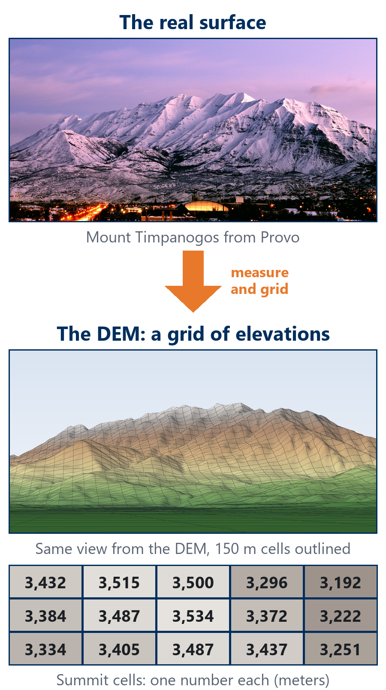

By the end of class you should be able to:

- Define an **elevation surface**, and name the ways a **DEM** can represent one
- Explain how **LiDAR** measures a surface, and what a **point cloud** is
- Say what a **return** is, and how a bare-earth model is separated from a canopy
- Name three sources of free DEMs and the **cell size** each one gives you
- Choose the right cell size for the right job

Photo: “Mount Timpanogos - 01-07-08” by a4gpa, <a href="https://creativecommons.org/licenses/by-sa/2.0/">CC BY-SA 2.0</a>, via <a href="https://commons.wikimedia.org/wiki/File:Mount_Timpanogos_-_01-07-08.jpg">Wikimedia Commons</a>. Figure CC BY-SA 2.0. Elevation: USGS 3DEP.

<!-- Frame the hour: concept, then measurement, then acquisition. They leave able to download the DEM that Lab 4 needs.

The figure is the whole hour in one picture: there is a real elevation surface out there (Timpanogos from Provo), and what we analyze is a grid of numbers that stands in for it. The lower view is drawn from the real USGS 3DEP 30 m DEM, from the photo's own viewpoint (camera fitted to the skyline), with 150 m cells outlined; the numbers are real 150 m summit cells. Built by tools/week05_terrain_figures.py. The photo is share-alike, so the combined figure carries CC BY-SA 2.0, not the deck's CC BY 4.0. -->

---

<!-- _class: lead -->

# Part 1
## What an elevation surface is

<!-- Two slides. Keep it short; most of them have met a DEM before. -->

---

# Elevation surface and DEM

- **Elevation surface**: the real ground elevation at each point
- **Digital Elevation Model (DEM)**: a digital representation of that surface
- Four ways to build one, shown here for the **same** terrain

* The <strong>square grid</strong> is the most common DEM in hydrology and engineering. It is the one we focus on, and use most, in this class.

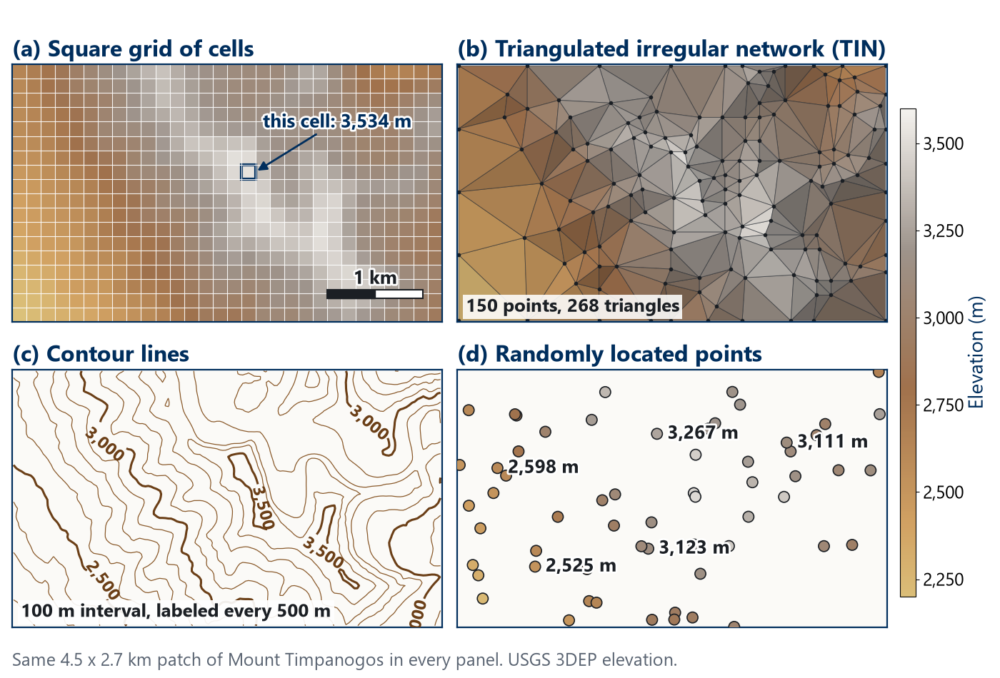

<!-- The distinction that matters: the surface is the real thing, the DEM is a model of it. Walk the four panels: (a) a grid of square cells, one value each; (b) a TIN, triangles between points chosen where the terrain changes; (c) contour lines, the form on a paper topo map; (d) scattered points, which is what a raw survey or a LiDAR point cloud gives you. All four are the same 4.5 x 2.7 km patch of the Timpanogos summit ridge, from USGS 3DEP data, built by tools/week05_terrain_figures.py. Then advance for the box: everything else today, and nearly everything this semester, assumes the square grid. -->

---

# Digital elevation grid

A grid of square cells in a coordinate system, with the land surface elevation stored as the value in each cell.

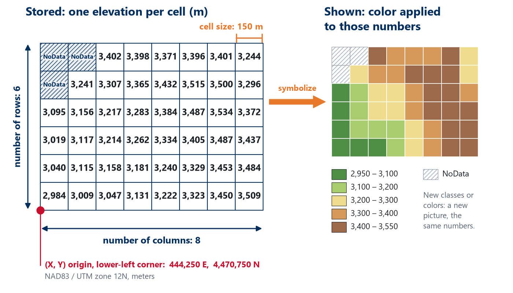

<!-- Walk the anatomy: number of rows, number of columns, cell size, an (X,Y) origin at the lower-left corner, and NoData cells where there is no value. The number in the cell is an elevation; the color is only symbology applied to that number, and a new color scheme is a new picture of the same numbers.

The values are real 150 m cells from the Timpanogos summit ridge (USGS 3DEP, NAD83 / UTM zone 12N), the same numbers as on the goals slide. 3DEP has no gaps here, so the three NoData cells in the corner are real cells masked to stand for cells outside a clip boundary. Built by tools/week05_terrain_figures.py; it replaced a low-resolution scan of the old figure. -->

---

<!-- _class: lead -->

# Part 2
## How elevation gets measured

<!-- The LiDAR half. Everything before this hour in the course has been passive remote sensing — measuring light something else emitted. LiDAR is active: it emits and times the return. That distinction is worth naming out loud before the first slide. -->

---

<!-- _class: lead -->

# LiDAR

## Light Detection And Ranging

The cutting edge: the most modern, most detailed way we measure elevation today

<!-- Before LiDAR, elevation came from field survey, from contours traced off stereo air photos, and from radar and stereo satellite imagery. Those are all still in use, and the global DEMs in Part 3 come from them, but LiDAR is what every new high-resolution DEM is built from. -->

---

# What is LiDAR and how does it work?

- Fire a pulse of laser light, measure how long it takes to come back
- Time of flight × speed of light ÷ 2 = **range**
- Combine range with the sensor's own **position and orientation** (GPS and IMU) to get an `(x, y, z)` point
- Hundreds of thousands of pulses a second gives a **point cloud**
- A single pulse can return **more than once** — treetop, branch, ground

<a href="https://www.youtube.com/watch?v=EYbhNSUnIdU&t=134s" target="_blank">

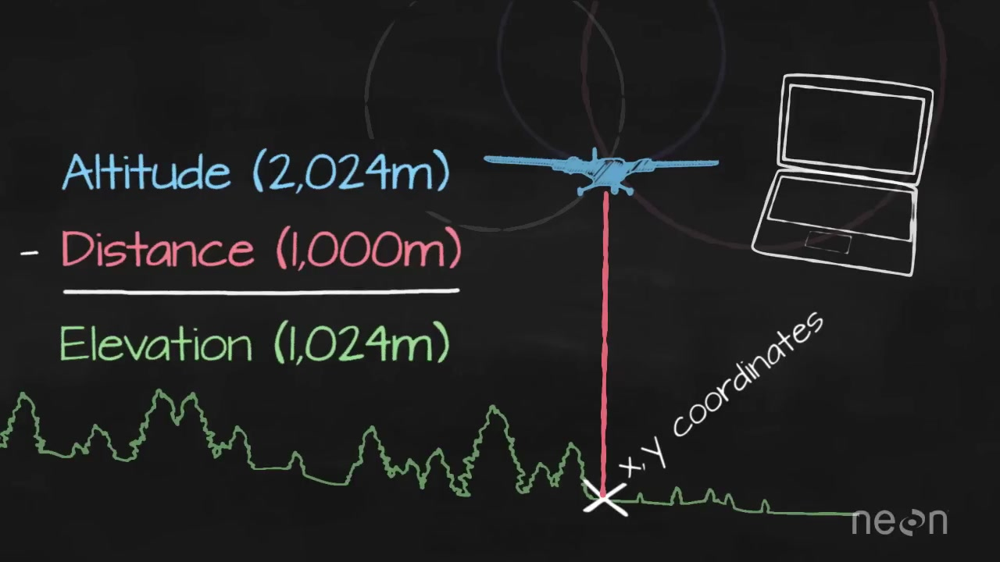

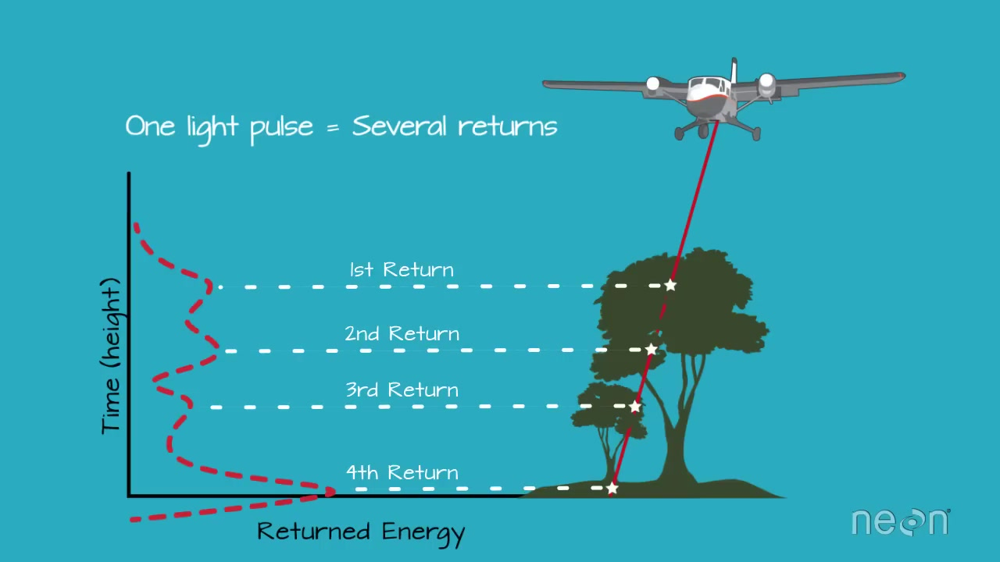

</a>

Frames from <a href="https://www.youtube.com/watch?v=EYbhNSUnIdU&t=134s" target="_blank"><em>How Does LiDAR Remote Sensing Work?</em></a> · NEON Science. Click to play from 2:14

<!-- Click either frame to open the video at 2:14. The pulse animation proper starts at about 2:57 (the plane fires its first pulse), the travel-time math runs 3:26-4:10, and the multiple-returns section is 5:45-6:46 - skip ahead to 5:45 if time is short. The two frames are from 5:39 (altitude minus distance = elevation) and 6:41 (one pulse, several returns). Multiple returns per pulse is the idea that makes the next slides make sense: it is how a laser sees the ground through a canopy.
Video checked 2026-09-28: NEON Science, uploaded 2014-11-24, 7:44, public; the &t=134s link resolves. -->

---

# A forest, in points

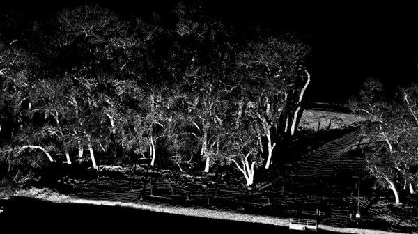

<!-- A side view through a point cloud of trees. Every white dot is one laser return. Note that there
are returns from inside and below the canopy — that is the multiple-return behavior from the last
slide, and it is why LiDAR can produce a bare-earth surface under forest. -->

---

# Mount Rushmore as a point cloud

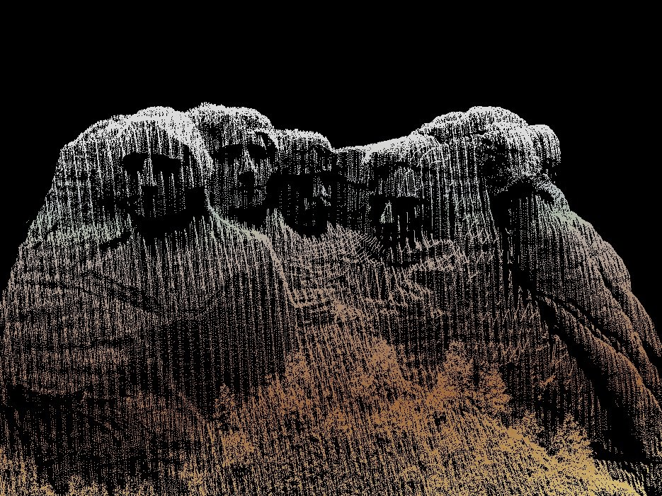

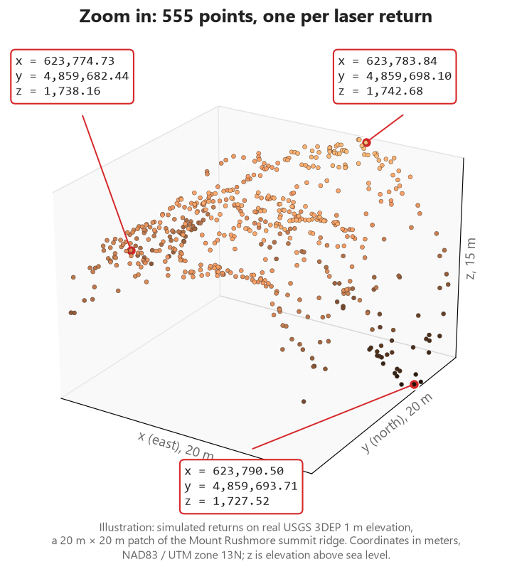

<!-- Terrestrial scanning at very high point density. The scan lines are visible as vertical striping.
Used here for documentation and change monitoring of the monument.

The right-hand figure is what you would see if you zoomed far enough into any point cloud: no surface at all, only separate (x, y, z) points, one per laser return. It is an illustration, not a zoom into this scan (the photo is 935 x 701 pixels, so each point in it is about one pixel): simulated returns on real USGS 3DEP 1 m elevation for a 20 m x 20 m patch of the Rushmore summit ridge, drawn at true vertical scale. Generated by tools/week05_lidar_figures.py. -->

---

# Where the scanner sits

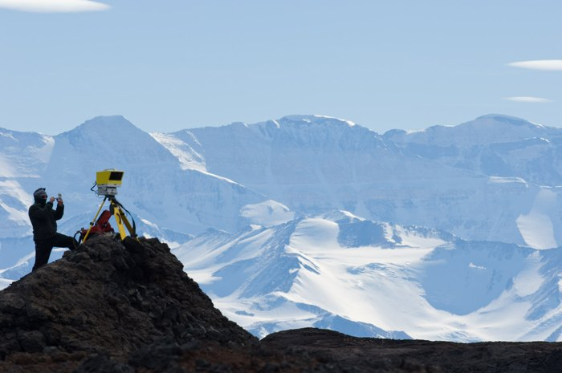

- LiDAR is a **measurement**, not a vehicle. It can ride on many **platforms**
- **Airborne**: an airplane, helicopter or drone. Covers a whole county, looking straight down
- **Ground-based (terrestrial)**: a scanner on a tripod. Covers one site, looking sideways, at much higher point density
- Ground-based scans are common for **hillsides, cliffs and mountain faces**, and for **buildings, bridges and monuments**

<!-- Terrestrial (tripod-mounted) LiDAR. Airborne LiDAR gets you a county; a terrestrial scanner gets
you one slope, one bridge, one quarry face, at far higher density. Civil engineering uses both. -->

---

# A city as a surface

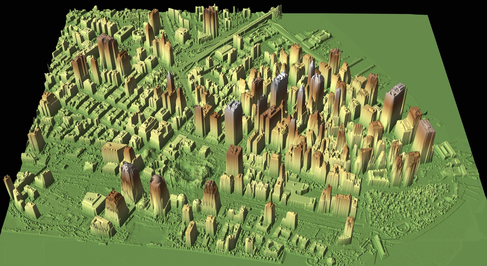

- Scanned from an **airplane**, looking straight down
- **Think about it:** why do the sides of the buildings look tall and smeared?

* An airborne scan is <strong>top-down</strong>. The laser hits roofs and the ground, but almost never a vertical wall, so the surface just stretches from the roof edge down to the street.

<!-- Buildings extracted from an airborne point cloud and rendered as a surface. Give them a few seconds on the question before the answer appears. A ground-based scanner, from the last slide, is how you would get the walls. This surface is the input to line-of-sight studies, solar potential, view analysis, and flood modeling in an urban core. -->

---

# The raw point cloud

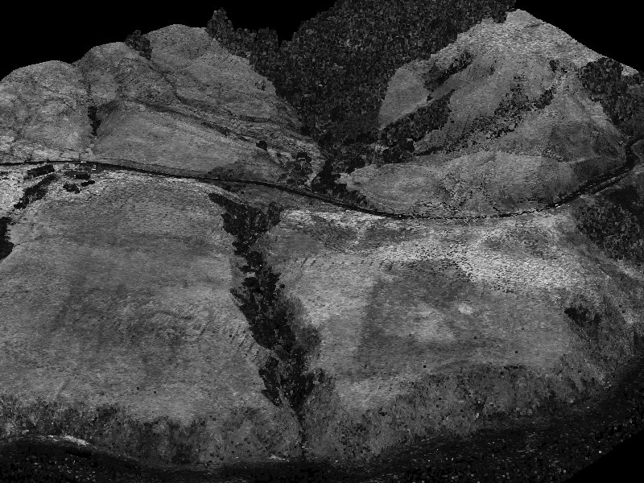

<!-- Airborne LiDAR over a canyon, every return kept. The dark, rough texture along the channel and across the upper slopes is vegetation: those points are treetops and branches, not ground. The next slide is how they get taken out. -->

---

# From returns to bare earth

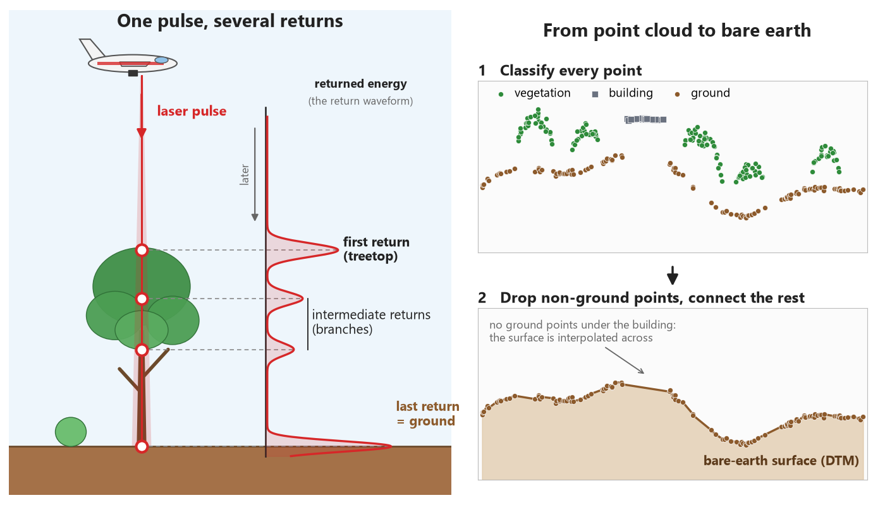

<!-- Left: one pulse, several returns. The treetop echoes first and the ground echoes last, because it is the farthest thing the pulse reaches. The last return is our best evidence of where the ground is. Right: processing. Classify every point as vegetation, building or ground, drop everything that is not ground, and connect what is left. The result is a bare-earth terrain model at high resolution. Note the callout: under a building there are no ground points at all, so the surface is interpolated across. This is a schematic with made-up geometry, drawn by tools/week05_lidar_figures.py; NEON's version of the left panel is the second frame on the "What is LiDAR" slide. -->

---

# Bare-earth terrain, hillshaded

Smooth gray: the bare-earth surface built from ground returns. Clumps: vegetation returns, left on as points so you can see what was removed.

<!-- The same canyon as the raw point cloud two slides back. The ground returns have been turned into a surface and hillshaded; the trees are still drawn as points on top of it, which is a useful way to show the classification: everything smooth is bare earth, everything lumpy is what the processing took out. Channels, terraces, roads, and old cut lines show up that
you cannot see on the ground or in a photograph. This is why LiDAR changed geomorphology and
archaeology. -->

---

<!-- _class: lead -->

# Part 3
## Where to download digital elevation model data

<!-- The practical half, and the one Lab 4 depends on. Have the portals open; the interfaces move faster than the slides do. -->

---

# Cell size changes what you can see

**30 m cells**

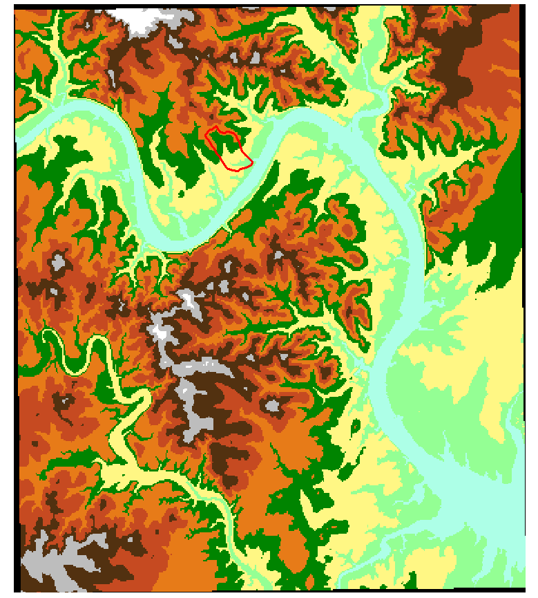

**100 m cells**

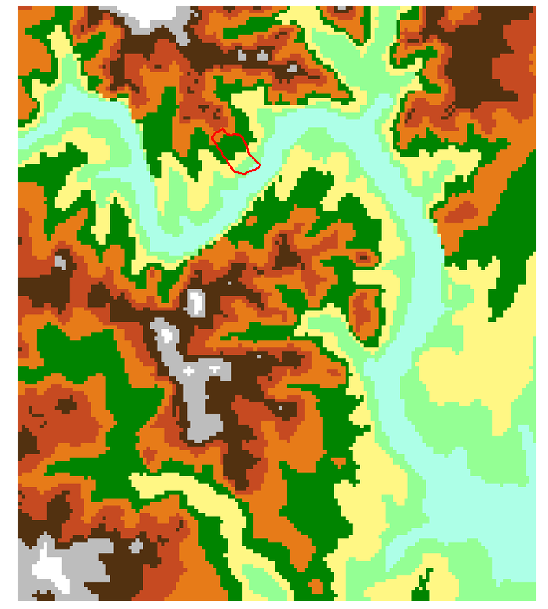

<!-- Same terrain, same symbology, two cell sizes. The red outline is the same parcel in both. At 100 m the small drainages disappear and the parcel spans only a handful of cells; any slope you compute for it is an average over a much larger footprint. -->

<!-- TODO(instructor): add the native-versus-resampled distinction here — a 10 m grid resampled from 30 m source data has 10 m cells but 30 m information, and every derived surface inherits the coarser one. Decide how to state it and whether to demonstrate it with a resampled raster. -->

---

# Coverage of 30 m and 3″ DEMs

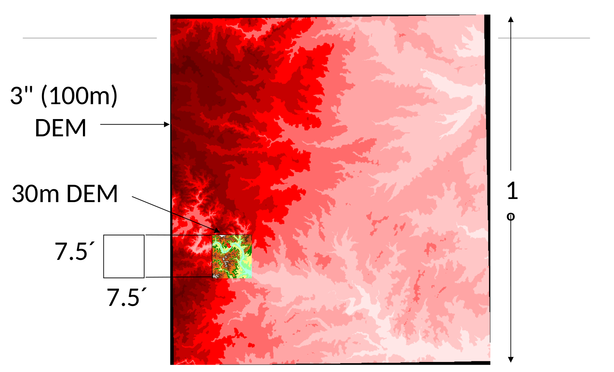

<!-- Two different things are being compared: cell size and tile extent. The 3-arc-second DEM covers a 1-degree tile; the 30 m DEM covers a 7.5-minute quadrangle, which is a small square inside it. Finer cells mean smaller tiles and more files for the same study area. -->

---

# DEM data sources

| Cell size | Product | Coverage | How it was made |
|---|---|---|---|
| **3″ ≈ 90 m** | SRTM 3 arc-second | Global, 60°N to 56°S | Shuttle radar, February 2000 |
| **1″ ≈ 30 m** | SRTM 1 arc-second, ASTER GDEM, AW3D30 | Global | Radar (SRTM) or stereo satellite images |
| **1″ ≈ 30 m** | USGS 3DEP 1 arc-second | Lower 48 and Alaska | Best available U.S. source data |
| **1/3″ ≈ 10 m** | USGS 3DEP 1/3 arc-second | Lower 48, Alaska, Hawaii, territories | Best available source, mostly lidar now |
| **1 m** | USGS 3DEP 1 meter | Growing patchwork of the U.S. | Lidar only |

- An **arc-second** is 1/3600 of a degree: about **30 m** on the ground north to south
- Global data tops out near 30 m. For anything finer you need **lidar**, and lidar exists only where someone flew it

<!-- These tiers are the mental model students should leave with: coarse global, medium national, fine national, very fine and patchy.

Verified 2026-09-28 against USGS "About 3DEP Products & Services" (usgs.gov/3d-elevation-program/about-3dep-products-services) and the 3DEP data-sources FAQ. Corrections from the old slide:
- The 10 m (1/3 arc-second) layer is NOT resampled from 30 m. USGS builds its seamless layers from "only the highest quality project data", resampled to each grid; in practice that is lidar or IfSAR where it exists and older sources where it does not. (And 30 m to 10 m would be upsampling, not downscaling.)
- "30 m derived from 1:24,000 maps" is the legacy National Elevation Dataset (NED) lineage: contours digitized from topographic quads. USGS is replacing it with lidar and IfSAR. The downloader still labels its results "National Elevation Dataset (NED)", so students will see the name; treat it as the predecessor of 3DEP.
- 1/9 arc-second (about 3 m) exists for about a quarter of the lower 48 but is no longer updated, so it is left off the table.
- New in 2025: a Seamless 1-meter DEM (listed in the downloader as "Limited Availability"). No coverage figure is published yet.
- SRTM's global 1 arc-second release was announced September 23, 2014 and rolled out through 2015; before that only the U.S. had 1 arc-second SRTM.
Arc-seconds of longitude shrink with latitude: in Provo a 1 arc-second cell is about 31 m north-south but about 24 m east-west. -->

---

# The same place, four cell sizes

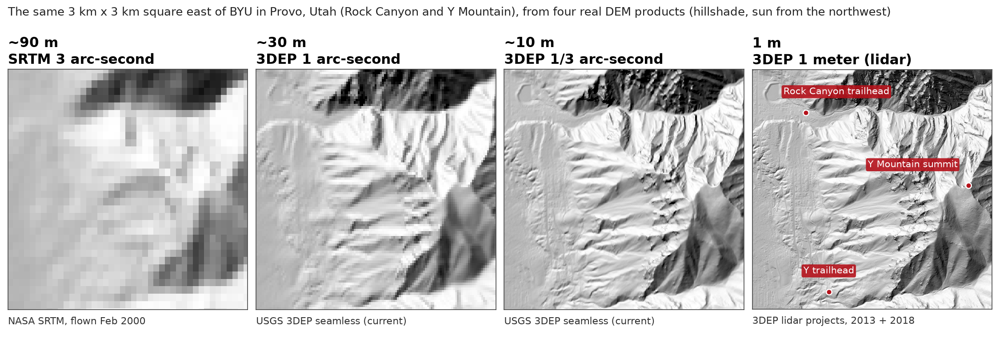

<!-- A 3 km square above BYU: Rock Canyon, Y Mountain, the Y trail. Each panel is a real downloaded product at its own native cells, not one DEM resampled four ways: SRTM GL3 (3 arc-second) tile N40W112 from OpenTopography; 3DEP 1 arc-second and 1/3 arc-second current tiles n41w112; and 3DEP 1 m tile x44y446 (UT Wasatch L3 2013, gaps filled from UT Central QL1 2018). Ask the room which panel they could plan a trail from, and which one they could size a culvert from. At 90 m, Rock Canyon is a smudge; at 1 m you can see the trail switchbacks. The 1 m panel is necessarily shown downsampled at slide size. Built by tools/week05_dem_sources.py (ladder). -->

---

# Where to get global DEMs

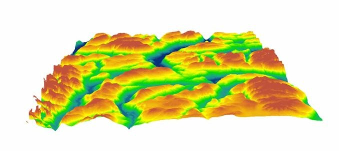

- A roundup of free global elevation data:
  [gisgeography.com/free-global-dem-data-sources](https://gisgeography.com/free-global-dem-data-sources/)
- Read the entry for each dataset before you download: **coverage**, **cell size**, **vertical datum**, and **license**
- The next three slides are the global sources, oldest first. Then The National Map, for U.S. data

<!-- Have the page open. The point of the list is that "a DEM" is never just "a DEM": you pick one, and the choice shows up in every derived surface afterward.

Checked 2026-09-28: the page resolves, "5 Free Global DEM Data Sources", last modified August 2025. It is ad-supported and a little stale (its ASTER entry still describes version 2, and it does not mention NASADEM or the Copernicus DEM), so use it as a map of the options and go to the official pages on the next slides to download. -->

---

# NASA SRTM: 26 years old

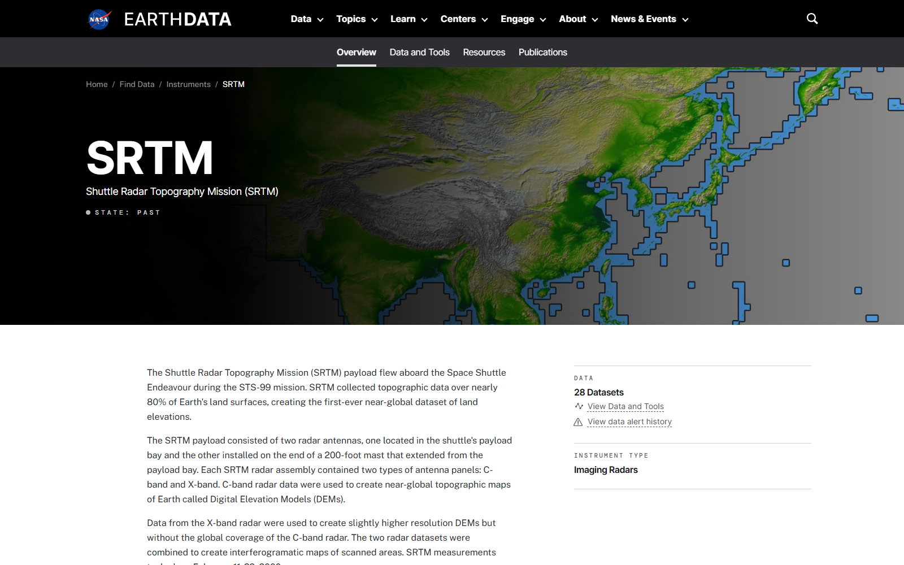

- Space Shuttle *Endeavour*, **February 2000**: the data are **26 years old**
- Radar from two antennas, one on a **200-foot mast**, in a single pass
- **Nearly 80% of Earth's land**, 60°N to 56°S, at **1 arc-second** (about 30 m)
- **Still useful**: the first near-global DEM, and the base of **NASADEM** and **HydroSHEDS** (global rivers and watersheds), so you will meet it inside other products
- [earthdata.nasa.gov/data/instruments/srtm](https://www.earthdata.nasa.gov/data/instruments/srtm)

<!-- The Shuttle Radar Topography Mission flew in February 2000. Radar interferometry from a fixed mast: two antennas, one baseline, one pass. It is first in this list because it is the oldest, and because students are likely to meet it without knowing it: NASADEM (2020) is SRTM reprocessed with ICESat control points and voids filled from ASTER GDEM and AW3D30, and HydroSHEDS version 1 is derived from SRTM 3 arc-second data. Few students will download raw SRTM for a U.S. project, since 3DEP is better, but it is still the default global DEM in a lot of hydrology work outside the U.S.

Download: the SRTMGL1 v003 product on NASA Earthdata (earthdata.nasa.gov/data/catalog/lpcloud-srtmgl1-003, needs a free Earthdata login), or USGS EarthExplorer under Digital Elevation.

CORRECTED 2026-09-10 against NASA Earthdata: the old slide said "orbited the Earth 16 times" (orbits in a day, not the mission) and "over 80% of the Earth's surface" (NASA says nearly 80%, of the land surface). The mast and single-pass geometry are why SRTM has voids in steep terrain: one look angle, radar shadow.

2026-09-28: the image is now the official NASA Earthdata SRTM page (captured headless by tools/week05_dem_sources.py; an unrelated site notice strip was hidden before capture). It replaced a third-party page that carried an advertisement. -->

---

# NASA ASTER GDEM

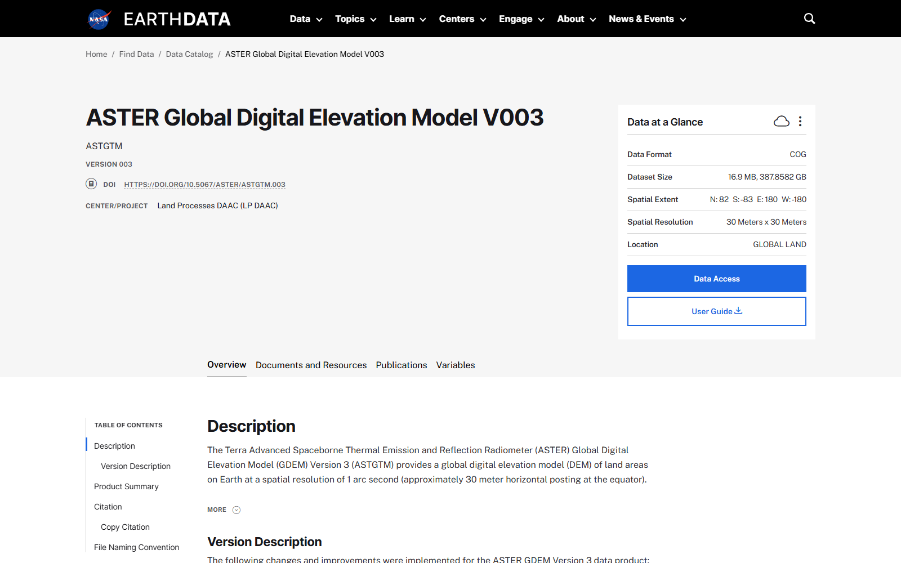

- From the **Terra** satellite (launched 1999). First released **2009**; version 3 in **2019**
- **1 arc-second, about 30 m**, from **stereo optical images**, not radar
- **Its edge over SRTM**: covers **83°N to 83°S**, about 99% of Earth's land, including the high latitudes SRTM missed. An **independent** measurement that fills SRTM's voids
- Noisier over snow, sand and water
- [earthdata.nasa.gov/data/catalog/lpcloud-astgtm-003](https://www.earthdata.nasa.gov/data/catalog/lpcloud-astgtm-003)

<!-- Dates verified 2026-09-28: Terra launched December 18, 1999 (terra.nasa.gov); GDEM version 1 released June 2009, version 2 October 2011, version 3 August 2019 (asterweb.jpl.nasa.gov/gdem.asp and the LP DAAC catalog). Version 3 was built from scenes acquired March 2000 to November 2013, stacked and cloud-screened, with reference DEMs patching areas with too few scenes, so parts of ASTER GDEM are not ASTER.

Coverage: JPL and the product description give 83°N to 83°S, "99 percent of Earth's landmass"; the Earthdata catalog's spatial-extent box reads 82°N, which looks like a rounding of the tile grid. The slide follows JPL.

Downloads through NASA Earthdata Search (search.earthdata.nasa.gov/search?q=ASTGTM) with a free Earthdata login.

CORRECTED 2026-09-10: the old slide said "90 meters global, 30 meters in the United States", which is false; ASTER GDEM is 1 arc-second everywhere. -->

---

# JAXA: Japan's space agency

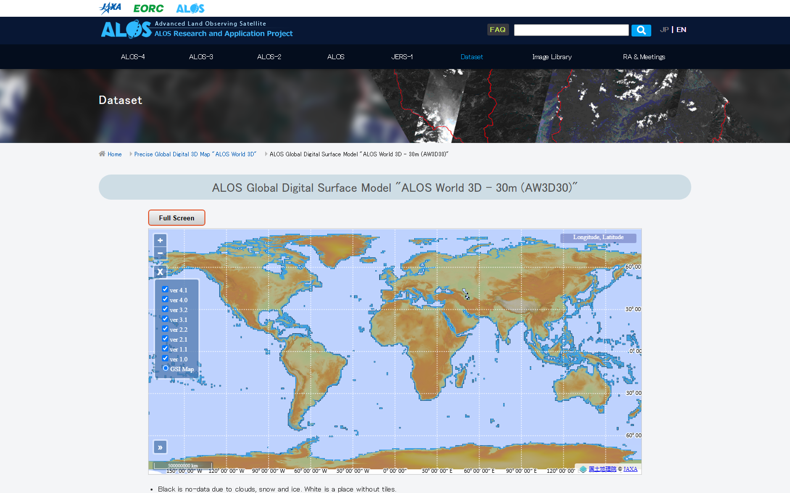

- **ALOS World 3D, 30 m (AW3D30)**: a free global 1 arc-second DEM from stereo images taken by the ALOS satellite's PRISM camera
- Current version **4.1** (April 2024)
- A third independent global DEM, worth having when SRTM and ASTER disagree
- Free, but you **register for an account** before you can download
- [eorc.jaxa.jp/ALOS/en/dataset/aw3d30](https://www.eorc.jaxa.jp/ALOS/en/dataset/aw3d30/aw3d30_e.htm)

<!-- The useful habit is comparing two DEMs over the same area and seeing where they disagree. It is steep terrain, forest canopy and water every time, and that is a map of where your slope analysis is least trustworthy.

Verified 2026-09-28: the dataset page resolves and is current. Version 4.1 was released April 2024 (19,051 tiles, global except Japan and Antarctica); the most recent update was March 2025 (two Antarctic tiles). The data index returns 401 without an account; registration is at eorc.jaxa.jp/ALOS/en/aw3d30/registration.htm. The free product is AW3D30; the commercial AW3D is 5 m and not what students will download. -->

---

# USGS: The National Map

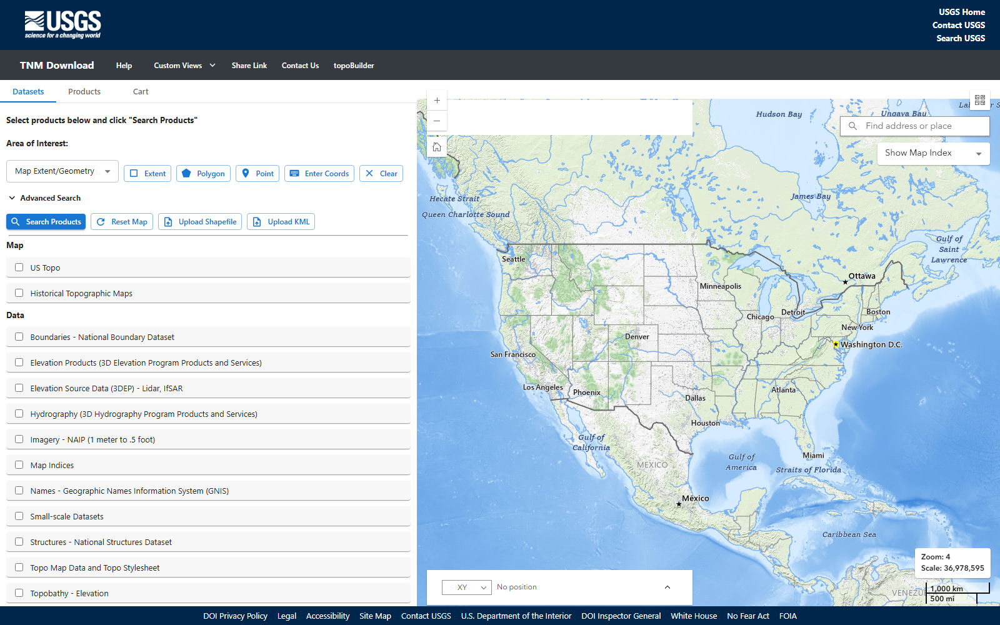

- The source for U.S. elevation data, from the **3D Elevation Program (3DEP)**
- [apps.nationalmap.gov/downloader](https://apps.nationalmap.gov/downloader/)
- Free, no account needed
- Offers **1 m**, **1/3 arc-second** (about 10 m) and **1 arc-second** (about 30 m). Which exist depends on where you look
- This is where the DEM for Lab 4 comes from

<!-- The TNM Download app, opened on its Datasets tab. The next slide walks the three steps; do it live as well if the room has time, since the interface moves.

Checked 2026-09-28: apps.nationalmap.gov/downloader returns 200. www.nationalmap.gov redirects to the USGS National Map program page, which is not where you download anything, so the slide points at the downloader itself. Captures by tools/week05_dem_sources.py (tnm), headless Chromium, nothing composited; a site notice banner was closed first. -->

---

# Downloading a DEM from The National Map

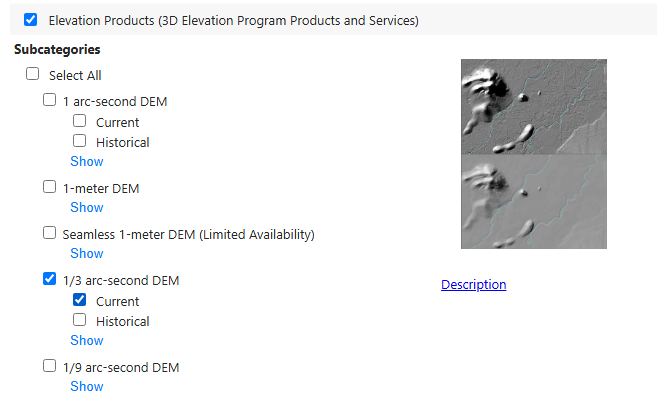
**1. Choose the product.** Check **Elevation Products (3DEP)**, pick a resolution, check **Current**

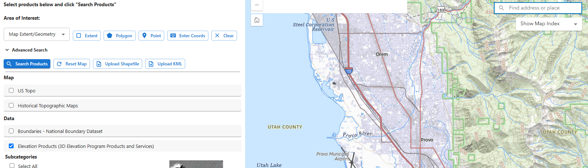
**2. Set the area.** Zoom to your site, or draw an **Extent** or **Polygon**. Then **Search Products**

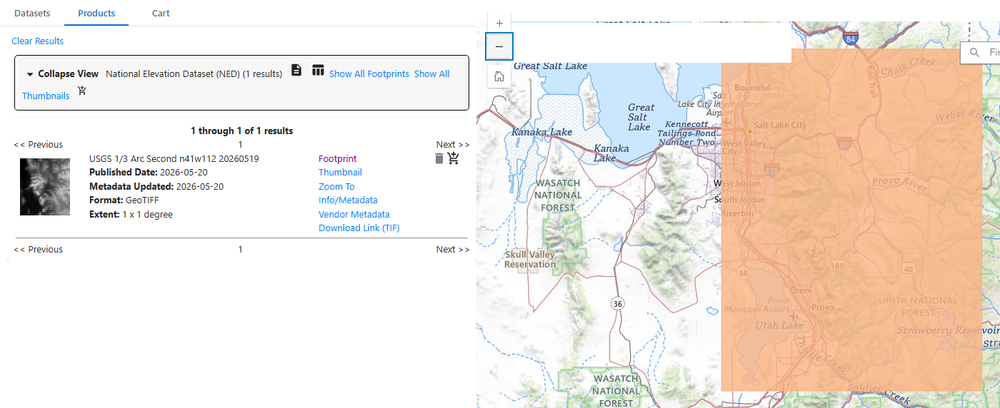

**3. Download.** The **Products** tab lists each tile, with its footprint on the map. Use **Download Link (TIF)**

Leave **Current** checked. Without it you get every older edition of the same tile

<!-- A search for Provo: 1/3 arc-second, Current, map extent as the area of interest. It returns one 1 x 1 degree tile, "USGS 1/3 Arc Second n41w112", with the footprint drawn on the map. Warn them about the Current box: without it the same search returns ten historical editions of the same tile, and they will download the wrong one. The results panel still says "National Elevation Dataset (NED)", the older name for this collection. -->

---

# Other worlds have DEMs too

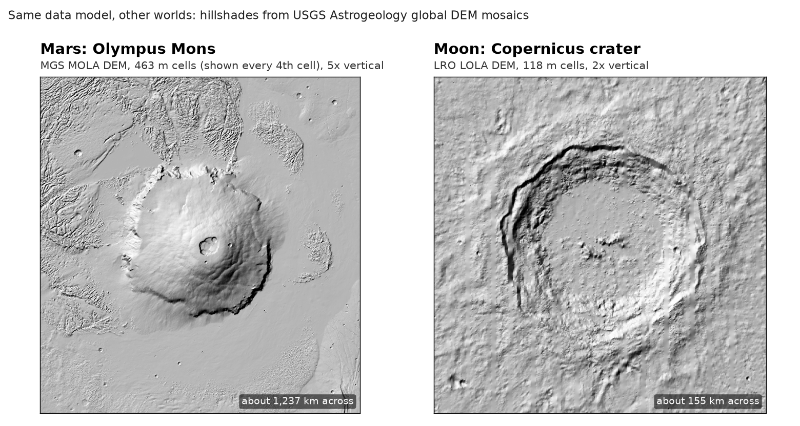

Free from USGS Astrogeology: [Mars MOLA, 463 m](https://astrogeology.usgs.gov/search/map/mars_mgs_mola_dem_463m) · [Mars MOLA–HRSC blend, 200 m](https://astrogeology.usgs.gov/search/map/mars_mgs_mola_mex_hrsc_blended_dem_global_200m) · [Moon LOLA, 118 m](https://astrogeology.usgs.gov/search/map/moon_lro_lola_dem_118m) · [Mercury MESSENGER, 665 m](https://astrogeology.usgs.gov/search/map/mercury_messenger_global_dem_665m)

<!-- A one-slide aside, but it makes the point that everything in this lecture is arithmetic on a grid of numbers. Nothing in the slope or viewshed math cares which planet the numbers came from. The summit of Olympus Mons is about 21 km above the Mars reference level in this DEM, more than twice the height of Everest above sea level, and the panel is 1,237 km across; Copernicus crater is about 155 km across.

Links checked 2026-09-28, all 200. The files are big (Mars MOLA 2 GB, Moon LOLA 8 GB, the Mars blend 11 GB), so this is not a lab download. The original MOLA and LOLA products are also at the PDS Geosciences Node (pds-geosciences.wustl.edu). The figure reads the USGS global mosaics directly (tools/week05_dem_sources.py, planetary): MOLA every 4th cell with 5x vertical exaggeration, LOLA at 2x. It replaced a scan of a Mars quadrangle map. -->

---

# Before Next Class

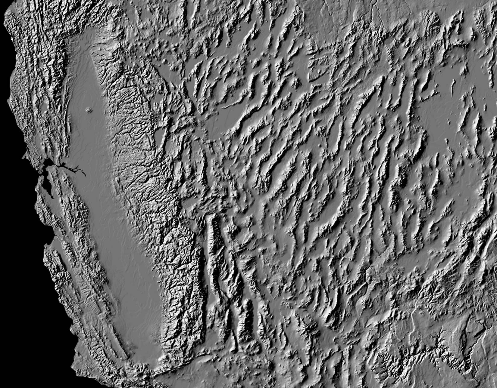

- **Lab 4 — Cell Phone Tower Placement** is due **Saturday 11:59 pm**: [assignments/lab-04](https://byu-hydroinformatics.github.io/ce414-gis-applications/assignments/lab-04/). It needs a DEM for Utah County — download it with what you learned today
- **Thursday**: what you compute from a DEM. Slope, aspect, curvature, hillshade and viewsheds
- **Reading**: Chapter 11 of *GIS Fundamentals* (Terrain Analysis)
- **Quiz 5**, open book, on Learning Suite, due **Saturday 11:59 pm**
- **Office hours**: [calendly.com/dan-ames/office-hours](https://calendly.com/dan-ames/office-hours)

<!-- The one thing they must do before Thursday is get a DEM. Everything Thursday does is arithmetic on the grid they downloaded today, and Lab 4's slope step needs the same file. -->

<!--
Authoring notes (2026-09-10). New deck for the Tuesday session of Week 5, assembled rather than
written: the LiDAR block (nine slides) came from the Week 4 Thursday deck, and Part 1 of the Week 5
terrain deck (the elevation surface, the DEM grid, and the data sources) came from
slides/week-05/terrain-analysis.md. Both moves were the instructor's decision on 2026-09-10.

The order is deliberate: concept, then measurement, then acquisition. It ends on cell size, which is
what Thursday's slope material depends on, and the practical half is the one Lab 4 needs, since that
lab wants a DEM for Utah County by Saturday.

The seven LiDAR images moved from slides/week-04/images/ and were renamed rs- to ed-, because
nothing may reference an image outside its own week folder.

Revision 2026-09-28, at the instructor's request: new real-data figures for the goals, DEM-types and
grid-anatomy slides (tools/week05_terrain_figures.py, Mount Timpanogos from USGS 3DEP); NEON video
frames, a point-cloud close-up and a multiple-returns diagram (tools/week05_lidar_figures.py);
the "LiDAR, moving" video-link slide removed; the raw point cloud and the hillshade separated by a
returns-to-bare-earth slide; Part 3 reordered so cell size comes before the sources and SRTM, the
oldest, leads them; every portal capture re-shot and every fact and link re-verified
(tools/week05_dem_sources.py). The old ta- portal captures are no longer referenced.
-->

---

<!-- _class: activity -->

# One Last Thing — Surfaces and Returns

Five questions on the hour: where a surface comes from, how LiDAR measures one, and which surface you need. **Scan the code**, or open the link below.

- Not graded, nothing recorded — it is a check that today landed
- Every answer explains itself; read the explanation before you move on
- The last two items are the ones Lab 4 will ask you again on Saturday

byu-hydroinformatics.github.io/ce414-gis-applications/quizzes/elevation-lidar/

<!-- Four to five minutes, in pairs, then a show of hands on the one that splits the room: which
echo from a single pulse comes back last. Half the room says the treetop, because it is the first
thing the pulse hits - the answer is the ground, because it is the farthest thing the pulse reaches
and its echo makes the longest round trip. That is the whole basis of a bare-earth model under
forest, so it is worth ten seconds at the board. The resolution item is the other one to watch: a coarser
grid looks the same until you look for the small drainages. If the room has no
signal, put the URL on the board; every item reads aloud just as well. -->
