<!-- _class: lead -->
<!-- _paginate: skip -->

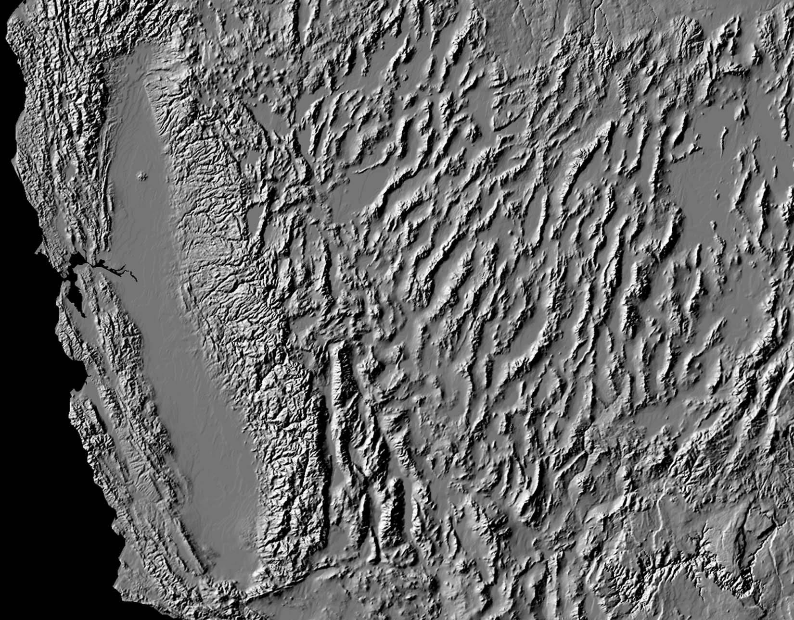

# Terrain Analysis

## What you compute from a DEM

CE 414 Engineering Applications of GIS
Dr. Dan Ames

<!-- Week 5 concepts lecture. Everything in this deck is a raster surface operation: the input is a DEM and the output is another raster that answers an engineering question. The lab this week applies it. -->

<!-- stamp:begin -->
<!-- _footer: 'CE 414 · Week 5 — Terrain AnalysisLast Updated: 2026-09-10© 2026 Daniel P. Ames · <a href="https://creativecommons.org/licenses/by/4.0/">CC BY 4.0</a>' -->
<!-- stamp:end -->

---

# Today's Goals

By the end of class you should be able to:

- Explain what **slope**, **aspect**, **curvature** and **hillshade** measure, and how each is computed from a 3 × 3 window
- Compute slope at a cell by hand, two different ways, and get the answer the software would
- Say how the **cell size** you chose on Tuesday changes every one of them
- Explain what a **viewshed** is and name three engineering uses for one

<!-- Tuesday was where the surface comes from; today is what you derive from it. Every derived surface here is raster in, raster out, computed from a moving window — which is the focal family from Week 3. Say that out loud once. -->

---

<!-- _class: lead -->

# Part 1
## Describing the surface

<!-- Divider. From here on, every slide is a raster derived from the DEM by looking at a moving 3 x 3 window. -->

---

# Some common terrain analyses

| Variable | Description | Importance |
| --- | --- | --- |
| Height | Elevation above base | Temperature, vegetation, visibility |
| Slope | Rise relative to horizontal distance | Water flow, flooding, erosion, travel cost |
| Aspect | Downhill direction of steepest slope | Temperature, vegetation, soil moisture |
| Upslope area | Watershed area above a point | Soil moisture, runoff volume and timing, erosion |
| Flow length | Mean upstream flow path length to a point | Sediment and erosion rates |
| Profile curvature | Curvature parallel to slope direction | Erosion, water flow acceleration |
| Plan curvature | Curvature perpendicular to slope direction | Water flow convergence, soil water, erosion |
| Visibility | Site obstruction from given viewpoints | Utility location, viewshed preservation |

<!-- The "Importance" column is the reason any of this is in a civil engineering course. Each row is one raster tool: the input is the DEM, the output is another raster in the units named. -->

<!-- TODO(graphic): a small figure pairing each variable with a one-glance thumbnail (slope, aspect, curvature, visibility) would carry this slide; none was generated for this pass. -->
<!-- TODO(instructor): this table is the natural place to separate susceptibility, hazard, risk and exposure — slope and curvature feed a susceptibility surface, not a risk map. Decide whether to define the four terms here or in a later week. -->

---

# Shaded relief

- Shaded relief maps are a **visualization** or symbology effect in which shadowing is applied to highlight the terrain
- **Why?**

<!-- Ask it as a real question before answering. A hillshade is not a measurement; it is a rendering of one, computed by illuminating the surface from an assumed sun azimuth and altitude. It reads as three-dimensional because the eye is good at shape from shading. In ArcGIS Pro this is the Hillshade tool in Spatial Analyst. -->

<!-- VERIFY: ArcGIS Pro tool names named in the speaker notes of this deck (Hillshade, Slope, Aspect, Curvature, Contour, Viewshed) against the Pro version the course is taught on. -->
<!-- TODO(instructor): connect the hillshade to scale and uncertainty — the illumination azimuth is a choice, and it decides which landforms appear and which vanish. Decide how much of that to say here. -->

---

# Contours

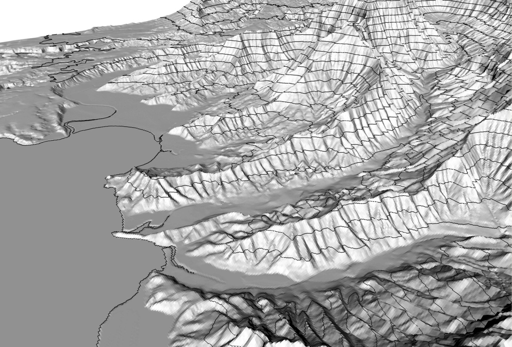

- "Connected lines of uniform elevation that run at right angles to local slope"
- Why not just use a continuous color ramp?
- What types of maps benefit from the use of contour lines?

<!-- Contours give you readable numbers off a paper or PDF map, which a color ramp cannot. They also carry slope information in their spacing. Ask the class where they have actually used contours: grading plans, site drainage, trail maps. -->

---

<!-- _class: quiz -->

# What does the terrain look like at A, B, C and D?

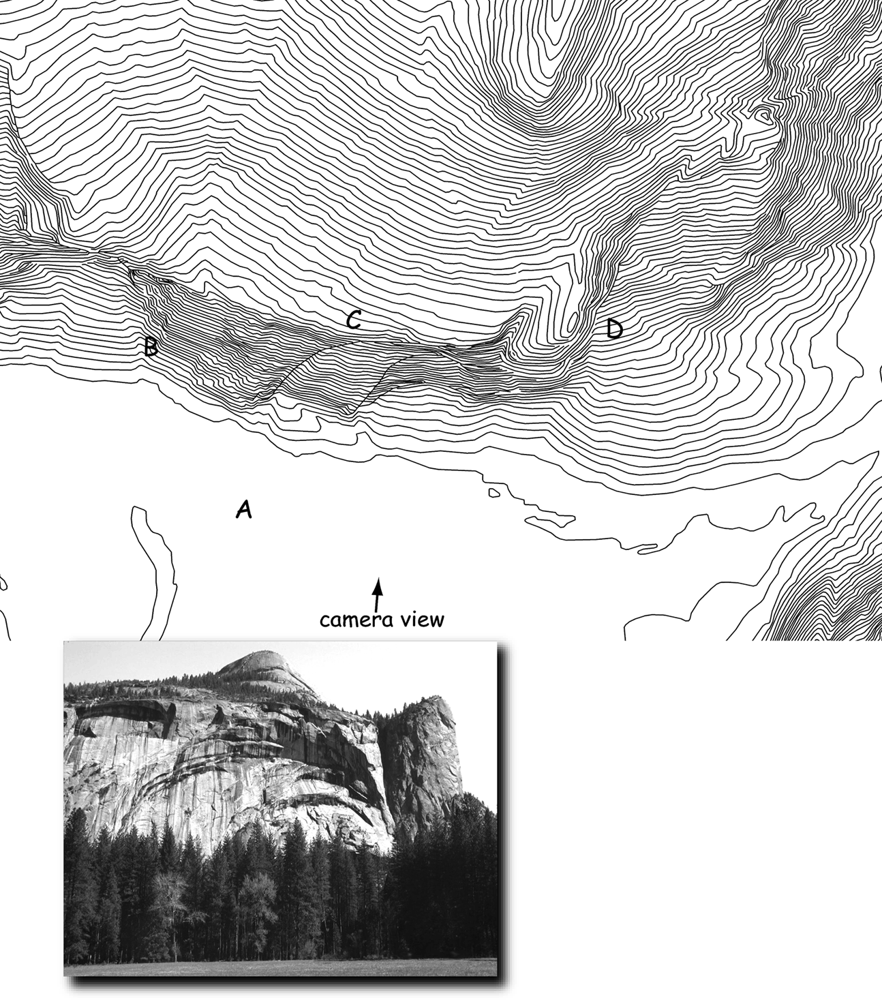

- **A?**
- **B?**
- **C?**
- **D?**
- The photo is the same terrain, from the camera position marked on the map

<!-- Let them argue before you show the photo connection. Close contours mean steep, wide spacing means flat; contours that point upstream mark a valley, contours that bulge downhill mark a ridge. Match each letter to a feature in the photograph. -->

---

<!-- _class: quiz -->

# What are the steps to convert the DEM to the contour lines?

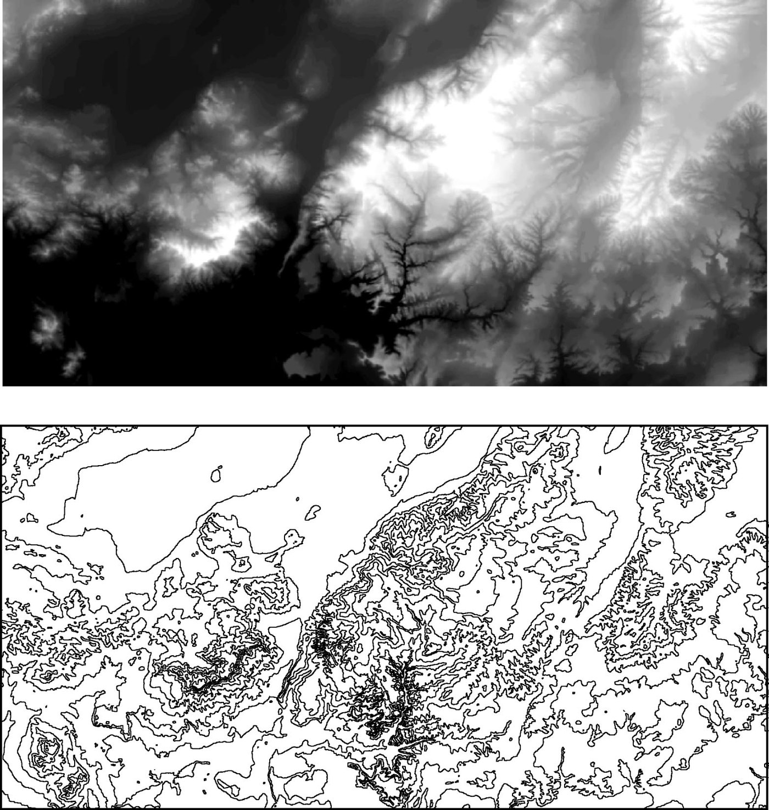

- Top: the DEM, symbolized as a gray ramp
- Bottom: contour lines derived from it
- What happens, cell by cell, in between?

<!-- Answer sketch: pick a contour interval, then for every pair of adjacent cells find where the chosen elevation falls between them and interpolate the crossing point; connect crossings into lines; smooth. The tool is Contour in Spatial Analyst. Ask what happens to the output if the interval is too small for the cell size. -->

---

# Slope

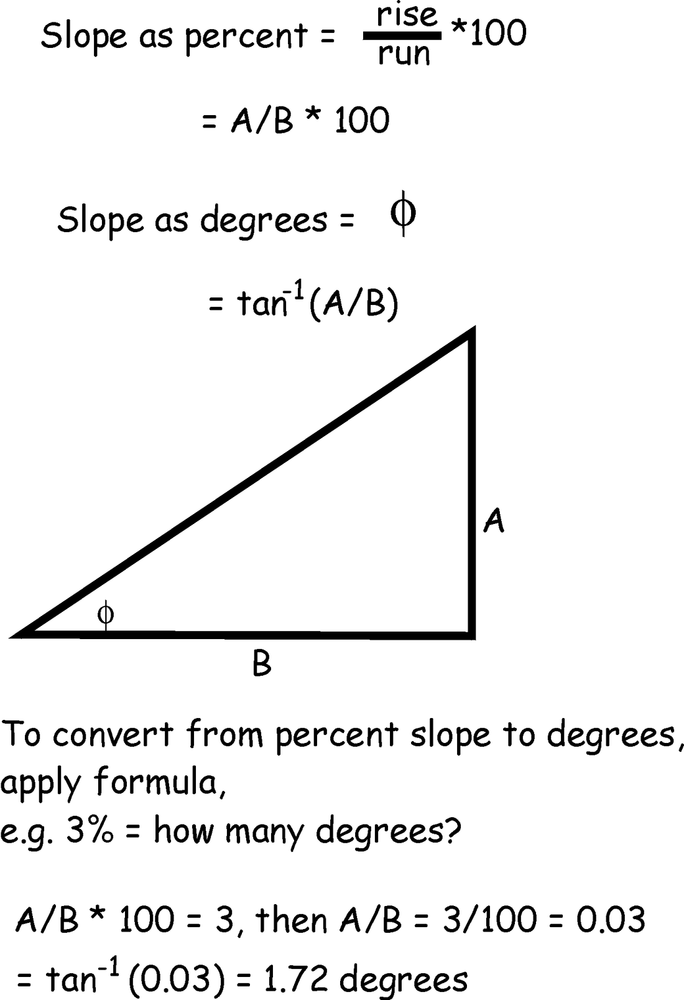

- "Slope is defined as the change in elevation (**rise**) with a change in horizontal position (**run**)"
- Often reported in **degrees** between zero (flat) and 90 (vertical). At rise/run = 1, the slope is 45 degrees
- Can also be expressed as a **percent** = (rise/run) × 100

<!-- Both units are in use and they are not interchangeable: 100 percent is 45 degrees, not 90. The worked example on the figure converts 3 percent to 1.72 degrees. Make the class do one conversion out loud. -->

---

# Slope in three dimensions

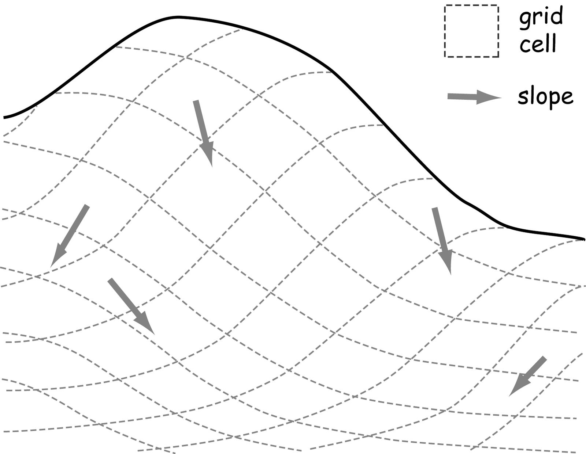

- "Slope calculations in three dimensions require the consideration of **ALL** values surrounding a cell"
- On a real surface, the steepest direction at a point is rarely aligned with a row or a column

<!-- The arrows on the figure are the direction of steepest descent at each location. Slope has a magnitude and a direction; the magnitude is the slope raster, the direction is the aspect raster. -->

---

# Slope on a grid

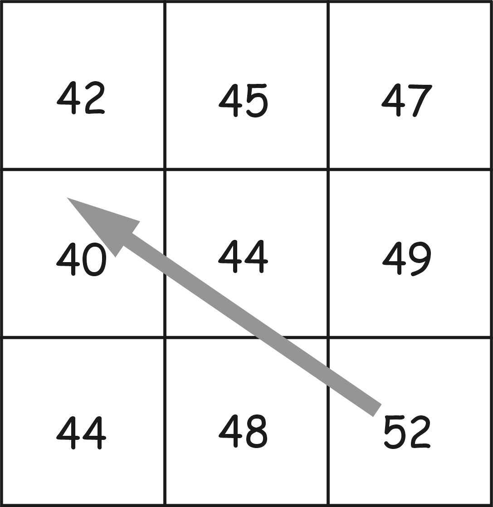

- When computing slope on a grid, we have a problem: the slope direction is seldom exactly between the centers of two cells
- So we need methods that look at **several** surrounding cells

<!-- This is why there is more than one slope algorithm. Each one is a different weighting of the eight neighbors, and they give different answers on the same DEM. -->

<!-- TODO(instructor): tie slope to scale and uncertainty here — slope computed on a 10 m grid and slope computed on a 30 m grid over the same hillside are different numbers, and neither is wrong. Decide how to frame the dependence on cell size and on DEM vertical error. -->

---

<!-- _class: quiz -->

# How would you do it?

- **What is the slope at the center cell?**
- The cell size is 10 m; the nine elevations are on the figure
- Work in pairs. Write down the method you used, not just the number

<!-- Take two or three methods from the room before showing the next slides. Common answers: steepest neighbor, average of the four cardinal neighbors, fit a plane through all nine. All three are real algorithms. -->

---

# Slope: four nearest cells

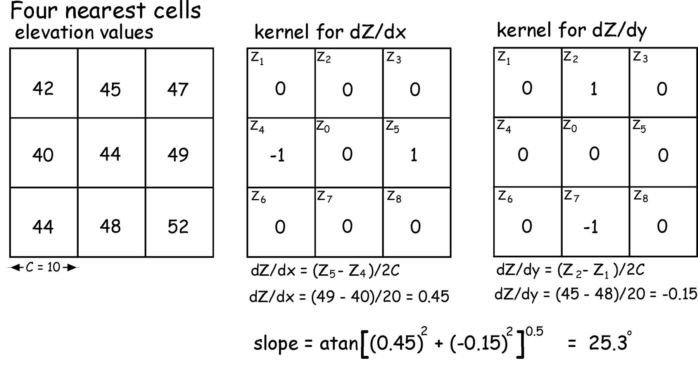

<strong>Typo in the original figure:</strong> <code>dZ/dy = (Z2 − Z1)/2C</code> should read <code>dZ/dy = (Z2 − Z7)/2C</code>. The kernel and the arithmetic, (45 − 48)/20, are both correct.

<!-- Only the four cardinal neighbors are used; the diagonals get weight zero. Two central differences give dZ/dx and dZ/dy, and the slope is the arctangent of the magnitude of that gradient: 25.3 degrees here. -->

---

<!-- _class: activity -->

# Slope: 3rd-order finite difference — try it

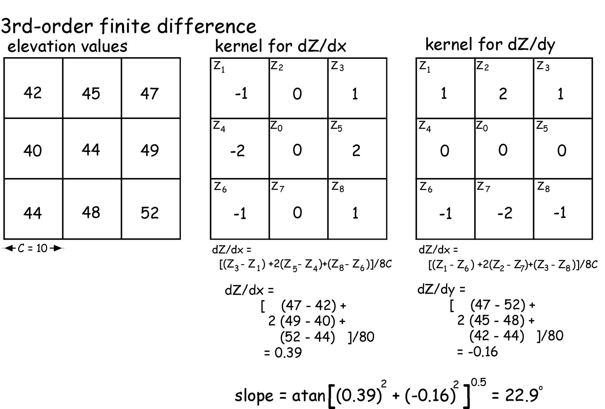

<!-- This is the method ArcGIS Pro's Slope tool uses. All eight neighbors contribute, with the cardinal ones weighted double. Same nine elevations as the previous slide, and the answer comes out 22.9 degrees instead of 25.3 — a 2.4 degree spread from the choice of algorithm alone. Have them reproduce both numbers before moving on. -->

<!-- TODO(instructor): the plan calls for a validation exercise here — students compute slope by hand and compare against the Slope tool's output for the same cell. Decide whether it belongs in this lecture, in the lab, or on the quiz, and what counts as agreement. -->

---

# Aspect

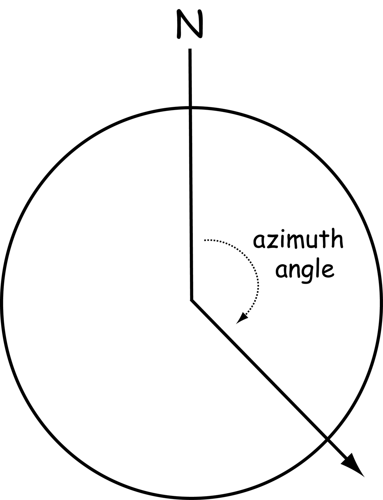

- **Aspect** is the downhill direction of the steepest slope, reported as an **azimuth** clockwise from north

$$
\text{Aspect} = 180 - \arctan\!\left(\frac{dz/dy}{dz/dx}\right) + 90\left(\frac{dz/dx}{|dz/dx|}\right)
$$

- Same partial derivatives as slope; a different thing done with them

<!-- TODO(instructor): aspect has its own scale-and-uncertainty story — on gentle slopes the direction of steepest descent is almost arbitrary, so aspect is noisiest exactly where slope is smallest, and it changes with cell size. Decide whether to make that point here or alongside the slope slide. -->

<!-- Aspect is circular data: 359 degrees and 1 degree are two degrees apart, not 358. That breaks averaging, and it is why aspect is usually reclassified into compass sectors before it is used. Flat cells have no aspect at all and are coded separately. -->

---

# Plan and profile curvature

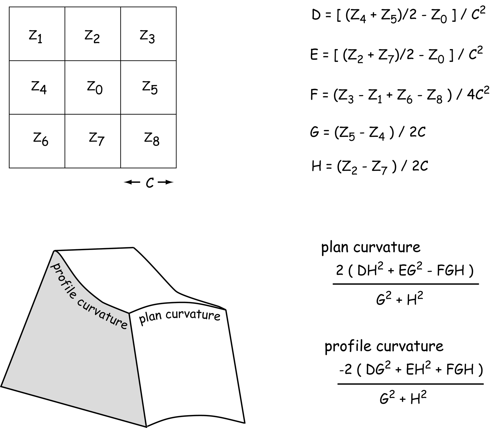

- **Profile curvature** — curvature *parallel* to the slope direction
- **Plan curvature** — curvature *perpendicular* to the slope direction
- Can you calculate curvature?
- Name some applications or uses for curvature

<!-- Curvature is the second derivative of the surface, fitted from the same 3 x 3 window. Profile curvature controls whether flow accelerates or decelerates downslope; plan curvature controls whether it converges into a hollow or spreads over a nose. Together they predict where water and sediment collect. -->

<!-- TODO(instructor): curvature is the most scale-sensitive of these surfaces — the second derivative amplifies DEM noise, so a 1 m lidar DEM and a 30 m DEM give qualitatively different curvature maps. Decide how to make that point, and whether to require smoothing before curvature in the lab. -->

---

<!-- _class: lead -->

# Part 2
## Viewsheds

<!-- Divider. Visibility is the last of the standard terrain surfaces and the one with the most direct engineering uses. -->

---

# What is a viewshed?

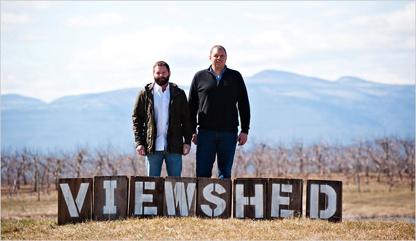

<!-- Opening gag before the definition. Ask the room for a one-sentence definition first; the wrong answers are useful. -->

---

# Not this

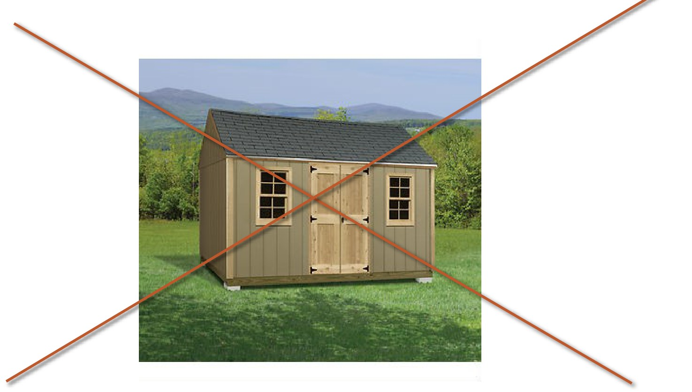

<!-- The second half of the joke: a viewshed is not a shed with a view. Then move straight to the real definition on the next slide. -->

---

# A viewshed is a rotating searchlight

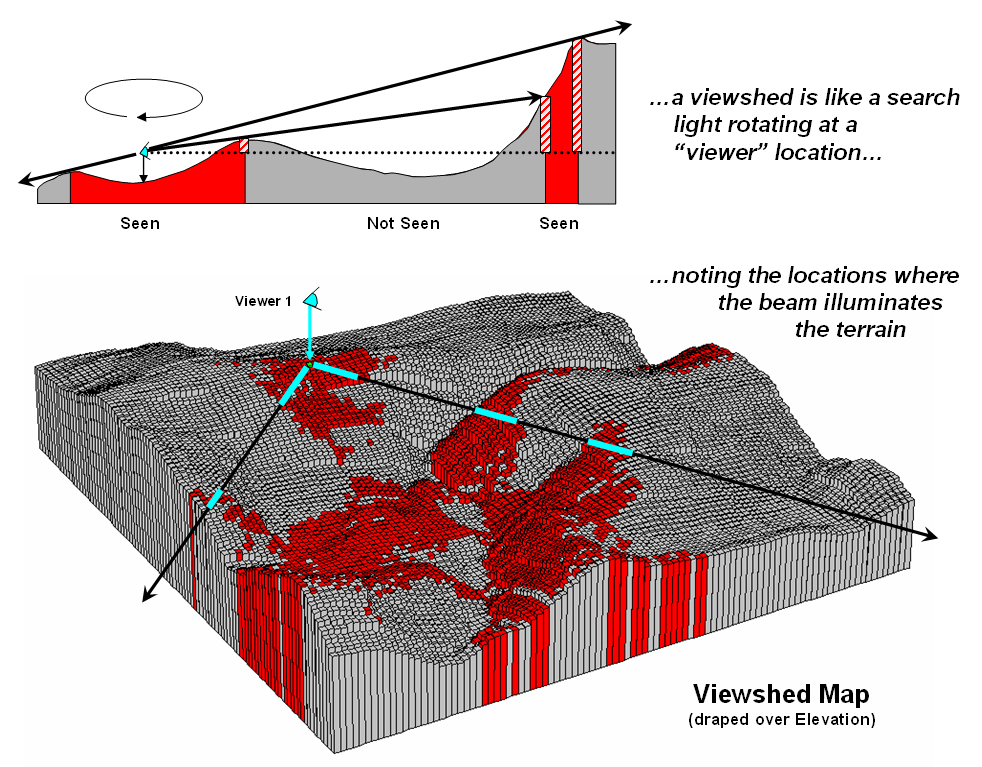

- In other words: **what could you see in all directions from the given point?**
- Sweep a beam from the viewer, mark every cell the beam reaches, and skip everything in shadow
- The output is a raster: **seen** or **not seen**, cell by cell

<!-- The profile at the top of the figure is the whole algorithm in one dimension: from the viewer, a line of sight rises at some angle, and any cell below the running maximum angle is hidden. The 3D block is the same test run outward in every direction. -->

<!-- TODO(instructor): viewshed results depend on choices the tool makes you name — observer and target offsets, earth curvature and refraction correction, the analysis radius, and the DEM's cell size. Decide how to present that as an uncertainty story rather than a parameter list. -->

---

# How to use a viewshed

- Search and rescue
- Land development and conservation
- Park management
- Solar energy potential
- Other?

The battles of Saratoga:

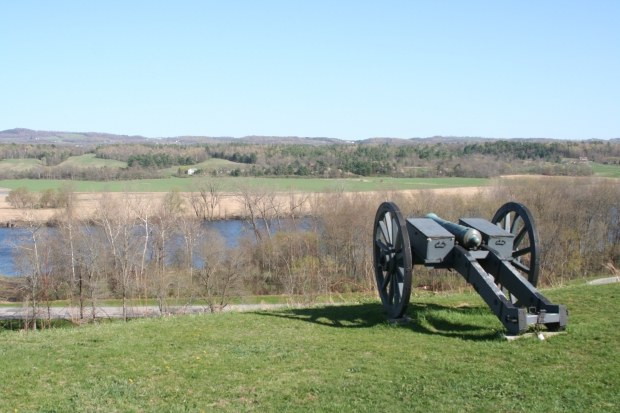

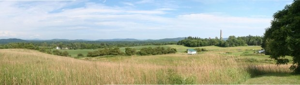

<!-- Saratoga is the worked example: the artillery positions on the bluff control the river road because of what they can see, not because of what they can reach. Collect a few more uses from the room — cell towers, wind turbines, billboards, scenic easements, sniper and security siting. -->

---

<!-- _class: activity -->

# Where this shows up in lab

- **Lab 4 — Cell Phone Tower Placement** puts today's material to work: a DEM in, a viewshed out, and a siting decision that has to be defended
- What this lecture gives you for it: what a DEM cell size means, how a derived surface is computed from a 3 × 3 window, and what a viewshed does and does not tell you
- Bring a candidate site and a reason for it

<!-- Preview slide. Point at the lab page and let them read the deliverables before they start. In ArcGIS Pro the relevant tools are Slope, Aspect, Hillshade, Contour and Viewshed, all in the Spatial Analyst toolbox. -->

<!-- TODO(graphic): a supporting figure for this slide — ideally a Pro screenshot of the Viewshed tool run over a candidate tower site — was not available for this pass. -->

---

# Before Next Class

- **Reading:** Chapter 11 of *GIS Fundamentals* (Terrain Analysis)
- **Quiz 5**, open book, on Learning Suite — due **Saturday 11:59 pm**
- **Lab 4 — Cell Phone Tower Placement** is due **Saturday 11:59 pm** — see the [Lab 4 page](https://byu-hydroinformatics.github.io/ce414-gis-applications/assignments/lab-04/)
- **Lab 5 — Watershed Delineation** is next — see the [Lab 5 page](https://byu-hydroinformatics.github.io/ce414-gis-applications/assignments/lab-05/)
- Questions? Office hours: [calendly.com/dan-ames/office-hours](https://calendly.com/dan-ames/office-hours)

<!-- TODO(graphic): no graphic on this slide; a small course-schedule or lab-thumbnail figure would carry it. -->

<!-- Conversion notes (2026-09-03): CROP (2026-09-03): the five browser captures (National Map, SRTM/GISGeography, Earthdata, JAXA ALOS, Mars DEMs) had the Chrome tab strip and address bar removed because they showed the capturing user's other open tabs and profile avatar; page content unchanged. source "CE 414 Week 5 - Terrain Analysis.pptx", 28 slides, no hidden slides and no speaker notes in the source — every note in this deck is new. 28 source slides became 35: added a title byline slide, Today's Goals, three section dividers, a Lab 4 preview, and Before Next Class; source slide 22 was split into two slides (four nearest cells / 3rd-order finite difference) because its figure is unreadable at 16:9 on one slide. No slides were dropped. The duplicated sentence on the ASTER slide was removed. Source media1 (a stock tomato photo, unused by any slide) was not carried over. Slides 2, 3, 11 and 26 were built from PowerPoint shapes and are 200 dpi renders of the PDF page, cropped. Stale non-ArcGIS screenshots kept and flagged: The National Map, the SRTM page (a third-party page with an advertisement in the capture), Earthdata Search, and the JAXA portal. There are no ArcMap-era ArcGIS captures in this deck and no ArcGIS UI at all — ArcGIS Pro tool names appear only in speaker notes and carry a VERIFY. Open items: DEM resolution and dataset claims (four VERIFY flags plus a 3DEP terminology TODO; ten VERIFY flags in the deck overall), native-vs-resampled resolution, scale/uncertainty for hillshade, slope, curvature and viewshed, a hand-versus-tool validation exercise, the susceptibility/hazard/risk/exposure distinction, the reading chapter, the Week 5/6 lab schedule, and three TODO(graphic) slides. -->

<!--
Split notes (2026-09-10). This deck used to open with Part 1, "Elevation surfaces and where DEMs
come from" — eleven slides that have moved to slides/week-05/elevation-data-lidar.md, the new
Tuesday deck, along with the LiDAR block from Week 4. What remains is what you compute from a DEM,
which is a Thursday session of 23 slides.

The two remaining parts were renumbered 1 and 2 (they were 2 and 3). Today's Goals was rewritten to
promise only what this deck now delivers, and it names the handoff: cell size was chosen on Tuesday
and every derived surface here depends on it. The deck's day in tools/build_schedule.py changed
from None to Thu.
-->
