<!-- _class: lead -->
<!-- _paginate: skip -->

# Terrain Analysis

## What you compute from a DEM

CE 414 Engineering Applications of GIS
Civil & Construction Engineering
Brigham Young University

Dr. Dan Ames

<!-- Week 5 concepts lecture. Everything in this deck is a raster surface operation: the input is a DEM and the output is another raster that answers an engineering question. The lab this week applies it. -->

<!-- stamp:begin -->
<!-- _footer: 'CE 414 · Week 5 — Terrain AnalysisLast Updated: 2026-10-01© 2026 Daniel P. Ames · <a href="https://creativecommons.org/licenses/by/4.0/">CC BY 4.0</a>' -->
<!-- stamp:end -->

---

# Today's Goals

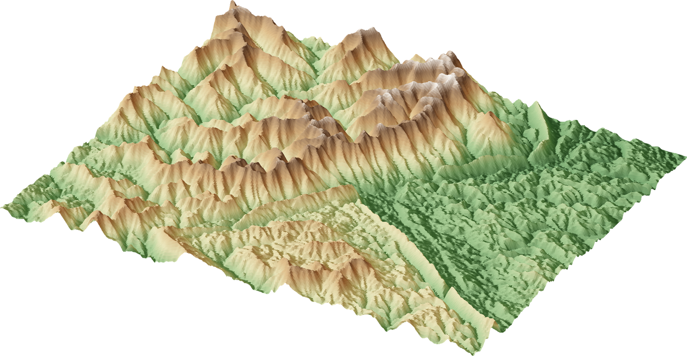

By the end of class you should be able to:

- Explain what **slope**, **aspect**, **curvature** and **hillshade** measure, and how local terrain surfaces are computed from a 3 × 3 window
- Compute **slope** at a cell **by hand**, two different ways, and get the answer the software would
- Explain why **cell size**, **vertical units** and the **slope algorithm** are part of the reported value
- Explain what a **viewshed** is

<!-- Tuesday was where the surface comes from; today is what you derive from it. Most of today's terrain surfaces are raster in, raster out, computed from a moving window — the focal pattern from Week 3. A viewshed is the exception: it is a line-of-sight calculation from an observer through the surface. Say that distinction out loud once. The image is a hillshaded, color-tinted 3D render of a real 3 arc-second DEM of the Jacksboro Fault area, Tennessee (the sample DEM that ships with matplotlib), made for this deck. -->

---

# Describe the terrain

| | Variable | Description | Importance |
| --- | --- | --- | --- |
| 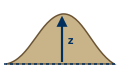 | **Height** | Elevation above base | Temperature, vegetation, visibility |
| 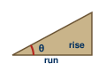 | **Slope** | Rise relative to horizontal distance | Water flow, flooding, erosion, travel cost |
|  | **Aspect** | Downhill direction of steepest slope | Temperature, vegetation, soil moisture |
|  | **Upslope area** | Watershed area above a point | Soil moisture, runoff volume and timing, erosion |
| 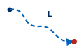 | **Flow length** | Mean upstream flow path length to a point | Sediment and erosion rates |
| 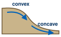 | **Profile curvature** | Curvature parallel to slope direction | Erosion, water flow acceleration |
| 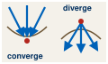 | **Plan curvature** | Curvature perpendicular to slope direction | Water flow convergence, soil water, erosion |
| 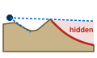 | **Visibility** | Site obstruction from given viewpoints | Utility location, viewshed preservation |

<!-- The "Importance" column is the reason any of this is in a civil engineering course. Each row is one raster tool: the input is the DEM, the output is another raster in the units named. -->

<!-- TODO(instructor): this table is the natural place to separate susceptibility, hazard, risk and exposure — slope and curvature feed a susceptibility surface, not a risk map. Decide whether to define the four terms here or in a later week. -->

---

# Scale is part of the answer

**30 m cells**

**100 m cells**

- Coarser cells smooth over smaller ridges, channels and breaks in slope
- The same hillside can produce different slope, aspect and curvature rasters at different cell sizes
- Report the DEM cell size with the terrain result; it is part of what the number means

<!-- These two images show the same terrain at two cell sizes. The point is not that one is universally
     right: the useful scale depends on the engineering question, the source data and the processing
     time you can afford. Lab 4 deliberately uses 30 m cells for a county-wide screening model. -->

---

# Shaded relief

- Shaded relief is a **visualization** (symbology) effect: shadowing is applied to highlight the terrain
- Illumination direction is a **modeling choice**, not a property of the terrain
- **Why?**

<svg xmlns="http://www.w3.org/2000/svg" viewBox="0 0 560 268" width="560" height="268" font-family="Helvetica,Arial,sans-serif"><line class="sr-ray" x1="58.5" y1="63.0" x2="123.0" y2="192.0" stroke="#f2a900" stroke-width="2.2" stroke-dasharray="10 4" stroke-linecap="round"/><line class="sr-ray" x1="64.3" y1="59.2" x2="173.0" y2="185.0" stroke="#f2a900" stroke-width="2.2" stroke-dasharray="10 4" stroke-linecap="round"/><line class="sr-ray" x1="68.4" y1="54.8" x2="223.0" y2="171.0" stroke="#f2a900" stroke-width="2.2" stroke-dasharray="10 4" stroke-linecap="round"/><line class="sr-ray" x1="72.2" y1="47.8" x2="420.0" y2="178.0" stroke="#f2a900" stroke-width="2.2" stroke-dasharray="10 4" stroke-linecap="round"/><polygon class="sr-face" points="96.0,214.0 150.0,170.0 150.0,236 96.0,236" fill="#f5f5f5" stroke="#f5f5f5" stroke-width="0.6"/><rect class="sr-strip" x="96.0" y="246" width="54.5" height="18" fill="#f5f5f5"/><polygon class="sr-face" points="150.0,170.0 196.0,200.0 196.0,236 150.0,236" fill="#656565" stroke="#656565" stroke-width="0.6"/><rect class="sr-strip" x="150.0" y="246" width="46.5" height="18" fill="#656565"/><polygon class="sr-face" points="196.0,200.0 250.0,142.0 250.0,236 196.0,236" fill="#f8f8f8" stroke="#f8f8f8" stroke-width="0.6"/><rect class="sr-strip" x="196.0" y="246" width="54.5" height="18" fill="#f8f8f8"/><polygon class="sr-face" points="250.0,142.0 296.0,196.0 296.0,236 250.0,236" fill="#2d2d2d" stroke="#2d2d2d" stroke-width="0.6"/><rect class="sr-strip" x="250.0" y="246" width="46.5" height="18" fill="#2d2d2d"/><polygon class="sr-face" points="296.0,196.0 346.0,168.0 346.0,236 296.0,236" fill="#2d2d2d" stroke="#2d2d2d" stroke-width="0.6"/><rect class="sr-strip" x="296.0" y="246" width="50.5" height="18" fill="#2d2d2d"/><polygon class="sr-face" points="346.0,168.0 392.0,206.0 392.0,236 346.0,236" fill="#2d2d2d" stroke="#2d2d2d" stroke-width="0.6"/><rect class="sr-strip" x="346.0" y="246" width="46.5" height="18" fill="#2d2d2d"/><polygon class="sr-face" points="392.0,206.0 448.0,150.0 448.0,236 392.0,236" fill="#e7e7e7" stroke="#e7e7e7" stroke-width="0.6"/><rect class="sr-strip" x="392.0" y="246" width="56.5" height="18" fill="#e7e7e7"/><polygon class="sr-face" points="448.0,150.0 500.0,196.0 500.0,236 448.0,236" fill="#2d2d2d" stroke="#2d2d2d" stroke-width="0.6"/><rect class="sr-strip" x="448.0" y="246" width="52.5" height="18" fill="#2d2d2d"/><polygon class="sr-face" points="500.0,196.0 548.0,180.0 548.0,236 500.0,236" fill="#2d2d2d" stroke="#2d2d2d" stroke-width="0.6"/><rect class="sr-strip" x="500.0" y="246" width="48.5" height="18" fill="#2d2d2d"/><polyline points="96.0,214.0 150.0,170.0 196.0,200.0 250.0,142.0 296.0,196.0 346.0,168.0 392.0,206.0 448.0,150.0 500.0,196.0 548.0,180.0" fill="none" stroke="#3a3a3a" stroke-width="1.5"/><line x1="96" y1="236" x2="548" y2="236" stroke="#3a3a3a" stroke-width="1"/><rect x="96" y="246" width="452" height="18" fill="none" stroke="#3a3a3a" stroke-width="1"/><text x="90" y="260" font-size="12" font-weight="700" fill="#002e5d" text-anchor="end">hillshade</text><g class="sr-spin"><line x1="70.0" y1="38.0" x2="79.0" y2="38.0" stroke="#f2a900" stroke-width="3" stroke-linecap="round"/><line x1="66.8" y1="50.0" x2="74.6" y2="54.5" stroke="#f2a900" stroke-width="3" stroke-linecap="round"/><line x1="58.0" y1="58.8" x2="62.5" y2="66.6" stroke="#f2a900" stroke-width="3" stroke-linecap="round"/><line x1="46.0" y1="62.0" x2="46.0" y2="71.0" stroke="#f2a900" stroke-width="3" stroke-linecap="round"/><line x1="34.0" y1="58.8" x2="29.5" y2="66.6" stroke="#f2a900" stroke-width="3" stroke-linecap="round"/><line x1="25.2" y1="50.0" x2="17.4" y2="54.5" stroke="#f2a900" stroke-width="3" stroke-linecap="round"/><line x1="22.0" y1="38.0" x2="13.0" y2="38.0" stroke="#f2a900" stroke-width="3" stroke-linecap="round"/><line x1="25.2" y1="26.0" x2="17.4" y2="21.5" stroke="#f2a900" stroke-width="3" stroke-linecap="round"/><line x1="34.0" y1="17.2" x2="29.5" y2="9.4" stroke="#f2a900" stroke-width="3" stroke-linecap="round"/><line x1="46.0" y1="14.0" x2="46.0" y2="5.0" stroke="#f2a900" stroke-width="3" stroke-linecap="round"/><line x1="58.0" y1="17.2" x2="62.5" y2="9.4" stroke="#f2a900" stroke-width="3" stroke-linecap="round"/><line x1="66.8" y1="26.0" x2="74.6" y2="21.5" stroke="#f2a900" stroke-width="3" stroke-linecap="round"/></g><circle cx="46.0" cy="38.0" r="18" fill="#ffc72c" stroke="#f2a900" stroke-width="2"/><text x="250" y="28" font-size="13" font-weight="700" fill="#2e7d32">facing the sun → bright</text><text x="250" y="46" font-size="13" font-weight="700" fill="#444">facing away or blocked → dark</text></svg>

<svg xmlns="http://www.w3.org/2000/svg" viewBox="0 0 300 260" width="300" height="260" font-family="Helvetica,Arial,sans-serif"><line class="sm-ray" x1="114.6" y1="52.3" x2="209.3" y2="147.1" stroke="#ffc72c" stroke-width="3" stroke-dasharray="14 4" stroke-linecap="round" opacity=".95"/><polygon points="216.4,154.2 205.1,151.3 213.6,142.9" fill="#ffc72c"/><line class="sm-ray" x1="99.0" y1="67.9" x2="213.6" y2="182.5" stroke="#ffc72c" stroke-width="3" stroke-dasharray="14 4" stroke-linecap="round" opacity=".95"/><polygon points="220.6,189.5 209.3,186.7 217.8,178.2" fill="#ffc72c"/><line class="sm-ray" x1="83.5" y1="83.5" x2="217.8" y2="217.8" stroke="#ffc72c" stroke-width="3" stroke-dasharray="14 4" stroke-linecap="round" opacity=".95"/><polygon points="224.9,224.9 213.6,222.0 222.0,213.6" fill="#ffc72c"/><line class="sm-ray" x1="67.9" y1="99.0" x2="182.5" y2="213.6" stroke="#ffc72c" stroke-width="3" stroke-dasharray="14 4" stroke-linecap="round" opacity=".95"/><polygon points="189.5,220.6 178.2,217.8 186.7,209.3" fill="#ffc72c"/><line class="sm-ray" x1="52.3" y1="114.6" x2="147.1" y2="209.3" stroke="#ffc72c" stroke-width="3" stroke-dasharray="14 4" stroke-linecap="round" opacity=".95"/><polygon points="154.2,216.4 142.9,213.6 151.3,205.1" fill="#ffc72c"/><g class="sm-spin"><line x1="84.0" y1="58.0" x2="94.0" y2="58.0" stroke="#f2a900" stroke-width="3.2" stroke-linecap="round"/><line x1="80.5" y1="71.0" x2="89.2" y2="76.0" stroke="#f2a900" stroke-width="3.2" stroke-linecap="round"/><line x1="71.0" y1="80.5" x2="76.0" y2="89.2" stroke="#f2a900" stroke-width="3.2" stroke-linecap="round"/><line x1="58.0" y1="84.0" x2="58.0" y2="94.0" stroke="#f2a900" stroke-width="3.2" stroke-linecap="round"/><line x1="45.0" y1="80.5" x2="40.0" y2="89.2" stroke="#f2a900" stroke-width="3.2" stroke-linecap="round"/><line x1="35.5" y1="71.0" x2="26.8" y2="76.0" stroke="#f2a900" stroke-width="3.2" stroke-linecap="round"/><line x1="32.0" y1="58.0" x2="22.0" y2="58.0" stroke="#f2a900" stroke-width="3.2" stroke-linecap="round"/><line x1="35.5" y1="45.0" x2="26.8" y2="40.0" stroke="#f2a900" stroke-width="3.2" stroke-linecap="round"/><line x1="45.0" y1="35.5" x2="40.0" y2="26.8" stroke="#f2a900" stroke-width="3.2" stroke-linecap="round"/><line x1="58.0" y1="32.0" x2="58.0" y2="22.0" stroke="#f2a900" stroke-width="3.2" stroke-linecap="round"/><line x1="71.0" y1="35.5" x2="76.0" y2="26.8" stroke="#f2a900" stroke-width="3.2" stroke-linecap="round"/><line x1="80.5" y1="45.0" x2="89.2" y2="40.0" stroke="#f2a900" stroke-width="3.2" stroke-linecap="round"/></g><circle cx="58.0" cy="58.0" r="20" fill="#ffc72c" stroke="#f2a900" stroke-width="2"/></svg>

<!-- Ask it as a real question before answering. A hillshade is not a measurement; it is a rendering of one, computed by illuminating the surface from an assumed sun azimuth and altitude. It reads as three-dimensional because the eye is good at shape from shading. In ArcGIS Pro this is the Hillshade tool in Spatial Analyst. The animation: the sun sits at the northwest corner of the map because 315 degrees azimuth is the conventional default; on the profile, faces turned toward the sun are bright, faces turned away are dark, and one rising face is dark because the peak in front of it casts a shadow. The profile draws rays fanning from a nearby sun for legibility; the real calculation assumes parallel rays from one azimuth and altitude. -->

<!-- VERIFY: ArcGIS Pro tool names named in the speaker notes of this deck (Hillshade, Slope, Aspect, Curvature, Contour, Viewshed) against the Pro version the course is taught on. -->
<!-- TODO(instructor): connect the hillshade to scale and uncertainty — the illumination azimuth is a choice, and it decides which landforms appear and which vanish. Decide how much of that to say here. -->

---

# Contours

<figure>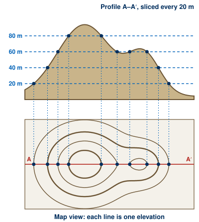<figcaption><strong>Slice</strong> the surface at fixed elevations</figcaption></figure>
<figure>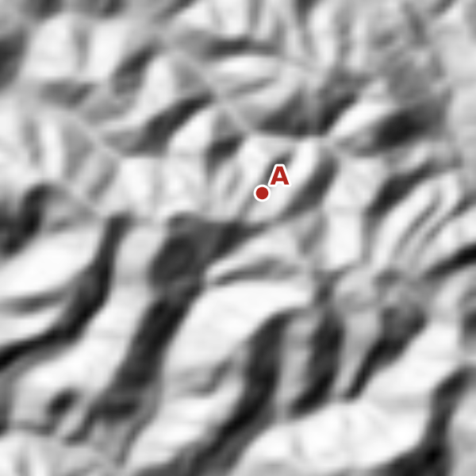<figcaption><strong>Shaded relief</strong> shape, but no numbers</figcaption></figure>
<figure>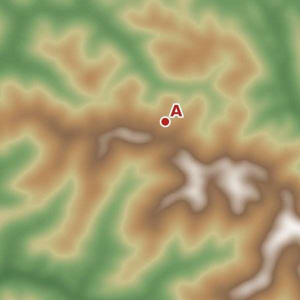<figcaption><strong>Color ramp</strong> high vs. low, roughly</figcaption></figure>
<figure>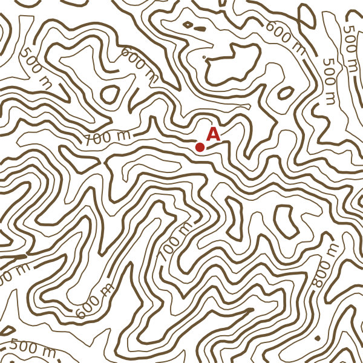<figcaption><strong>Contours</strong> A sits on the 700 m line</figcaption></figure>

- A contour is a **line of equal elevation**; it runs at right angles to the local slope
- Contours give **clean numerical elevations at fixed locations**: what grading, drainage and earthwork calculations need

<!-- Contours give you readable numbers off a paper or PDF map, which a color ramp cannot. They also carry slope information in their spacing. Ask the class where they have actually used contours: grading plans, site drainage, trail maps. Ask what elevation point A has on each of the three maps: only the contour map answers with a number. The three maps are the same 90 m x 90 cell window of the matplotlib sample DEM (Jacksboro Fault, Tennessee, 3 arc-second cells, lightly smoothed), drawn for this deck; contours every 50 m with 100 m index lines. -->

---

<!-- _class: quiz -->

# What does the terrain look like at A, B, C and D?

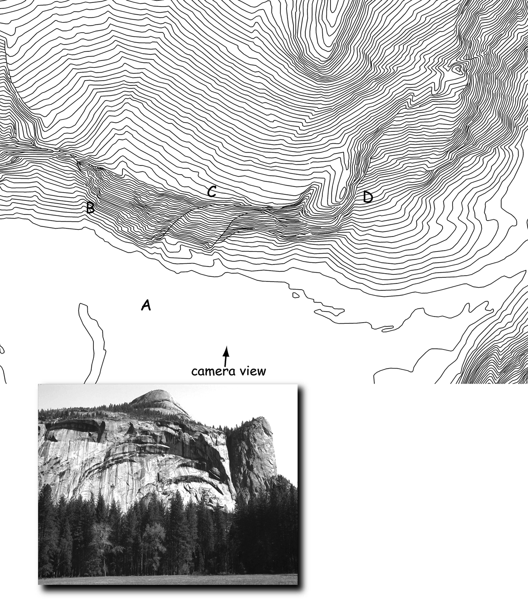

- **A?**
- **B?**
- **C?**
- **D?**
- The photo is the same terrain, from the camera position marked on the map

<!-- Let them argue before you show the photo connection. Close contours mean steep, wide spacing means flat; contours that point upstream mark a valley, contours that bulge downhill mark a ridge. Match each letter to a feature in the photograph. -->

---

<!-- _class: quiz -->

# What are the steps to convert the DEM to the contour lines?

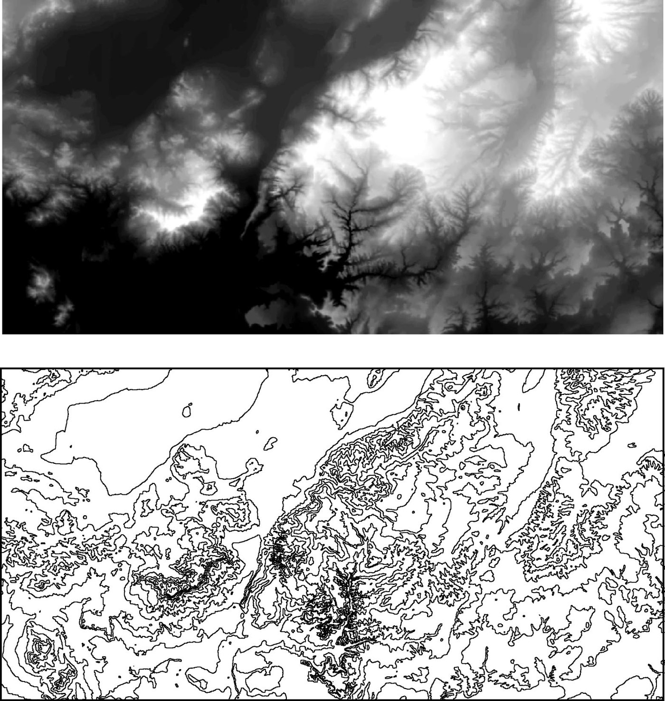

<svg xmlns="http://www.w3.org/2000/svg" viewBox="0 0 760 440" width="760" height="440" font-family="Helvetica,Arial,sans-serif"><defs><linearGradient id="ct-ramp" x1="0" y1="1" x2="0" y2="0"><stop offset="0" stop-color="#4f7a4a"/><stop offset=".5" stop-color="#c8c08a"/><stop offset="1" stop-color="#8a6a4f"/></linearGradient></defs><g class="ct-p ct-1"><rect x="0" y="0" width="370" height="212" rx="10" fill="#ffffff" stroke="#c9d8ea" stroke-width="1.5"/><circle cx="20" cy="20" r="12" fill="#002e5d"/><text x="20" y="25" font-size="14" font-weight="700" fill="#fff" text-anchor="middle">1</text><text x="40" y="26" font-size="17" font-weight="700" fill="#002e5d">Choose the interval</text><rect x="51" y="50" width="18" height="146" fill="url(#ct-ramp)" stroke="#6b5434"/><text x="46" y="195.5076923076923" font-size="12" text-anchor="end" fill="#22262e">min 412</text><text x="46" y="60.738461538461536" font-size="12" text-anchor="end" fill="#22262e">max 472</text><line x1="51" y1="173.53846153846155" x2="100" y2="173.53846153846155" stroke="#0062b8" stroke-width="2.4"/><text x="106" y="178.53846153846155" font-size="14" font-weight="700" fill="#0062b8">420 m</text><line x1="51" y1="128.6153846153846" x2="100" y2="128.6153846153846" stroke="#0062b8" stroke-width="2.4"/><text x="106" y="133.6153846153846" font-size="14" font-weight="700" fill="#0062b8">440 m</text><line x1="51" y1="83.69230769230768" x2="100" y2="83.69230769230768" stroke="#0062b8" stroke-width="2.4"/><text x="106" y="88.69230769230768" font-size="14" font-weight="700" fill="#0062b8">460 m</text><text x="190" y="92" font-size="14" fill="#22262e">Read the DEM's range,</text><text x="190" y="112" font-size="14" fill="#22262e">pick a round interval</text><text x="190" y="140" font-size="15" font-weight="700" fill="#b3261e">interval = 20 m</text><text x="190" y="162" font-size="14" fill="#22262e">→ 420, 440, 460 m</text></g><g class="ct-p ct-2"><rect x="390" y="0" width="370" height="212" rx="10" fill="#ffffff" stroke="#c9d8ea" stroke-width="1.5"/><circle cx="410" cy="20" r="12" fill="#002e5d"/><text x="410" y="25" font-size="14" font-weight="700" fill="#fff" text-anchor="middle">2</text><text x="430" y="26" font-size="17" font-weight="700" fill="#002e5d">Find where 440 falls</text><rect x="406" y="44" width="152" height="152" fill="#f4f1ea"/><line x1="425.0" y1="63.0" x2="539.0" y2="63.0" stroke="#d3c7ad" stroke-width="1"/><line x1="425.0" y1="63.0" x2="425.0" y2="177.0" stroke="#d3c7ad" stroke-width="1"/><line x1="425.0" y1="101.0" x2="539.0" y2="101.0" stroke="#d3c7ad" stroke-width="1"/><line x1="463.0" y1="63.0" x2="463.0" y2="177.0" stroke="#d3c7ad" stroke-width="1"/><line x1="425.0" y1="139.0" x2="539.0" y2="139.0" stroke="#d3c7ad" stroke-width="1"/><line x1="501.0" y1="63.0" x2="501.0" y2="177.0" stroke="#d3c7ad" stroke-width="1"/><line x1="425.0" y1="177.0" x2="539.0" y2="177.0" stroke="#d3c7ad" stroke-width="1"/><line x1="539.0" y1="63.0" x2="539.0" y2="177.0" stroke="#d3c7ad" stroke-width="1"/><circle cx="425.0" cy="63.0" r="2.5" fill="#6b5434"/><text x="425.0" y="57.0" font-size="11.5" text-anchor="middle" fill="#22262e">430</text><circle cx="463.0" cy="63.0" r="2.5" fill="#6b5434"/><text x="463.0" y="57.0" font-size="11.5" text-anchor="middle" fill="#22262e">445</text><circle cx="501.0" cy="63.0" r="2.5" fill="#6b5434"/><text x="501.0" y="57.0" font-size="11.5" text-anchor="middle" fill="#22262e">458</text><circle cx="539.0" cy="63.0" r="2.5" fill="#6b5434"/><text x="539.0" y="57.0" font-size="11.5" text-anchor="middle" fill="#22262e">472</text><circle cx="425.0" cy="101.0" r="2.5" fill="#6b5434"/><text x="425.0" y="95.0" font-size="11.5" text-anchor="middle" fill="#22262e">422</text><circle cx="463.0" cy="101.0" r="2.5" fill="#6b5434"/><text x="463.0" y="95.0" font-size="11.5" text-anchor="middle" fill="#22262e">436</text><circle cx="501.0" cy="101.0" r="2.5" fill="#6b5434"/><text x="501.0" y="95.0" font-size="11.5" text-anchor="middle" fill="#22262e">452</text><circle cx="539.0" cy="101.0" r="2.5" fill="#6b5434"/><text x="539.0" y="95.0" font-size="11.5" text-anchor="middle" fill="#22262e">466</text><circle cx="425.0" cy="139.0" r="2.5" fill="#6b5434"/><text x="425.0" y="133.0" font-size="11.5" text-anchor="middle" fill="#22262e">415</text><circle cx="463.0" cy="139.0" r="2.5" fill="#6b5434"/><text x="463.0" y="133.0" font-size="11.5" text-anchor="middle" fill="#22262e">428</text><circle cx="501.0" cy="139.0" r="2.5" fill="#6b5434"/><text x="501.0" y="133.0" font-size="11.5" text-anchor="middle" fill="#22262e">446</text><circle cx="539.0" cy="139.0" r="2.5" fill="#6b5434"/><text x="539.0" y="133.0" font-size="11.5" text-anchor="middle" fill="#22262e">457</text><circle cx="425.0" cy="177.0" r="2.5" fill="#6b5434"/><text x="425.0" y="171.0" font-size="11.5" text-anchor="middle" fill="#22262e">412</text><circle cx="463.0" cy="177.0" r="2.5" fill="#6b5434"/><text x="463.0" y="171.0" font-size="11.5" text-anchor="middle" fill="#22262e">420</text><circle cx="501.0" cy="177.0" r="2.5" fill="#6b5434"/><text x="501.0" y="171.0" font-size="11.5" text-anchor="middle" fill="#22262e">433</text><circle cx="539.0" cy="177.0" r="2.5" fill="#6b5434"/><text x="539.0" y="171.0" font-size="11.5" text-anchor="middle" fill="#22262e">447</text><line x1="463.0" y1="63.0" x2="463.0" y2="101.0" stroke="#b3261e" stroke-width="3" opacity=".6"/><circle cx="520.0" cy="177.0" r="4.5" fill="#0062b8" stroke="#fff" stroke-width="1.2"/><circle cx="501.0" cy="156.5" r="4.5" fill="#0062b8" stroke="#fff" stroke-width="1.2"/><circle cx="488.3" cy="139.0" r="4.5" fill="#0062b8" stroke="#fff" stroke-width="1.2"/><circle cx="472.5" cy="101.0" r="4.5" fill="#0062b8" stroke="#fff" stroke-width="1.2"/><circle cx="463.0" cy="84.1" r="4.5" fill="#0062b8" stroke="#fff" stroke-width="1.2"/><circle cx="450.3" cy="63.0" r="4.5" fill="#0062b8" stroke="#fff" stroke-width="1.2"/><text x="580" y="80" font-size="14" fill="#22262e">440 lies between</text><text x="580" y="100" font-size="14" fill="#22262e"><tspan font-weight="700">436</tspan> and <tspan font-weight="700">445</tspan>, so the</text><text x="580" y="120" font-size="14" fill="#22262e">crossing sits 4/9 of the</text><text x="580" y="140" font-size="14" fill="#22262e">way from 436 to 445</text><text x="580" y="168" font-size="13" font-style="italic" fill="#0062b8">linear interpolation</text></g><g class="ct-p ct-3"><rect x="0" y="228" width="370" height="212" rx="10" fill="#ffffff" stroke="#c9d8ea" stroke-width="1.5"/><circle cx="20" cy="248" r="12" fill="#002e5d"/><text x="20" y="253" font-size="14" font-weight="700" fill="#fff" text-anchor="middle">3</text><text x="40" y="254" font-size="17" font-weight="700" fill="#002e5d">Connect the crossings</text><rect x="16" y="272" width="152" height="152" fill="#f4f1ea"/><line x1="35.0" y1="291.0" x2="149.0" y2="291.0" stroke="#d3c7ad" stroke-width="1"/><line x1="35.0" y1="291.0" x2="35.0" y2="405.0" stroke="#d3c7ad" stroke-width="1"/><line x1="35.0" y1="329.0" x2="149.0" y2="329.0" stroke="#d3c7ad" stroke-width="1"/><line x1="73.0" y1="291.0" x2="73.0" y2="405.0" stroke="#d3c7ad" stroke-width="1"/><line x1="35.0" y1="367.0" x2="149.0" y2="367.0" stroke="#d3c7ad" stroke-width="1"/><line x1="111.0" y1="291.0" x2="111.0" y2="405.0" stroke="#d3c7ad" stroke-width="1"/><line x1="35.0" y1="405.0" x2="149.0" y2="405.0" stroke="#d3c7ad" stroke-width="1"/><line x1="149.0" y1="291.0" x2="149.0" y2="405.0" stroke="#d3c7ad" stroke-width="1"/><circle cx="35.0" cy="291.0" r="2.5" fill="#6b5434"/><text x="35.0" y="285.0" font-size="11.5" text-anchor="middle" fill="#9a8f7b">430</text><circle cx="73.0" cy="291.0" r="2.5" fill="#6b5434"/><text x="73.0" y="285.0" font-size="11.5" text-anchor="middle" fill="#9a8f7b">445</text><circle cx="111.0" cy="291.0" r="2.5" fill="#6b5434"/><text x="111.0" y="285.0" font-size="11.5" text-anchor="middle" fill="#9a8f7b">458</text><circle cx="149.0" cy="291.0" r="2.5" fill="#6b5434"/><text x="149.0" y="285.0" font-size="11.5" text-anchor="middle" fill="#9a8f7b">472</text><circle cx="35.0" cy="329.0" r="2.5" fill="#6b5434"/><text x="35.0" y="323.0" font-size="11.5" text-anchor="middle" fill="#9a8f7b">422</text><circle cx="73.0" cy="329.0" r="2.5" fill="#6b5434"/><text x="73.0" y="323.0" font-size="11.5" text-anchor="middle" fill="#9a8f7b">436</text><circle cx="111.0" cy="329.0" r="2.5" fill="#6b5434"/><text x="111.0" y="323.0" font-size="11.5" text-anchor="middle" fill="#9a8f7b">452</text><circle cx="149.0" cy="329.0" r="2.5" fill="#6b5434"/><text x="149.0" y="323.0" font-size="11.5" text-anchor="middle" fill="#9a8f7b">466</text><circle cx="35.0" cy="367.0" r="2.5" fill="#6b5434"/><text x="35.0" y="361.0" font-size="11.5" text-anchor="middle" fill="#9a8f7b">415</text><circle cx="73.0" cy="367.0" r="2.5" fill="#6b5434"/><text x="73.0" y="361.0" font-size="11.5" text-anchor="middle" fill="#9a8f7b">428</text><circle cx="111.0" cy="367.0" r="2.5" fill="#6b5434"/><text x="111.0" y="361.0" font-size="11.5" text-anchor="middle" fill="#9a8f7b">446</text><circle cx="149.0" cy="367.0" r="2.5" fill="#6b5434"/><text x="149.0" y="361.0" font-size="11.5" text-anchor="middle" fill="#9a8f7b">457</text><circle cx="35.0" cy="405.0" r="2.5" fill="#6b5434"/><text x="35.0" y="399.0" font-size="11.5" text-anchor="middle" fill="#9a8f7b">412</text><circle cx="73.0" cy="405.0" r="2.5" fill="#6b5434"/><text x="73.0" y="399.0" font-size="11.5" text-anchor="middle" fill="#9a8f7b">420</text><circle cx="111.0" cy="405.0" r="2.5" fill="#6b5434"/><text x="111.0" y="399.0" font-size="11.5" text-anchor="middle" fill="#9a8f7b">433</text><circle cx="149.0" cy="405.0" r="2.5" fill="#6b5434"/><text x="149.0" y="399.0" font-size="11.5" text-anchor="middle" fill="#9a8f7b">447</text><path class="ct-line" d="M73.0,405.0 L73.0,405.0 L49.6,367.0 L35.0,339.9" fill="none" stroke="#4f7a4a" stroke-width="3" stroke-linecap="round"/><circle cx="73.0" cy="405.0" r="3" fill="#4f7a4a"/><circle cx="73.0" cy="405.0" r="3" fill="#4f7a4a"/><circle cx="49.6" cy="367.0" r="3" fill="#4f7a4a"/><circle cx="35.0" cy="339.9" r="3" fill="#4f7a4a"/><path class="ct-line" d="M130.0,405.0 L111.0,384.5 L98.3,367.0 L82.5,329.0 L73.0,312.1 L60.3,291.0" fill="none" stroke="#0062b8" stroke-width="3" stroke-linecap="round"/><circle cx="130.0" cy="405.0" r="3" fill="#0062b8"/><circle cx="111.0" cy="384.5" r="3" fill="#0062b8"/><circle cx="98.3" cy="367.0" r="3" fill="#0062b8"/><circle cx="82.5" cy="329.0" r="3" fill="#0062b8"/><circle cx="73.0" cy="312.1" r="3" fill="#0062b8"/><circle cx="60.3" cy="291.0" r="3" fill="#0062b8"/><path class="ct-line" d="M149.0,354.3 L132.7,329.0 L116.4,291.0" fill="none" stroke="#8a6a4f" stroke-width="3" stroke-linecap="round"/><circle cx="149.0" cy="354.3" r="3" fill="#8a6a4f"/><circle cx="132.7" cy="329.0" r="3" fill="#8a6a4f"/><circle cx="116.4" cy="291.0" r="3" fill="#8a6a4f"/><line x1="192" y1="312" x2="216" y2="312" stroke="#4f7a4a" stroke-width="3"/><text x="224" y="317" font-size="14" font-weight="700" fill="#4f7a4a">420 m</text><line x1="192" y1="336" x2="216" y2="336" stroke="#0062b8" stroke-width="3"/><text x="224" y="341" font-size="14" font-weight="700" fill="#0062b8">440 m</text><line x1="192" y1="360" x2="216" y2="360" stroke="#8a6a4f" stroke-width="3"/><text x="224" y="365" font-size="14" font-weight="700" fill="#8a6a4f">460 m</text><text x="192" y="404" font-size="14" fill="#22262e">Join them, then smooth</text></g><g class="ct-p ct-4"><rect x="390" y="228" width="370" height="212" rx="10" fill="#ffffff" stroke="#c9d8ea" stroke-width="1.5"/><circle cx="410" cy="248" r="12" fill="#002e5d"/><text x="410" y="253" font-size="14" font-weight="700" fill="#fff" text-anchor="middle">4</text><text x="430" y="254" font-size="17" font-weight="700" fill="#002e5d">Lines never cross</text><path d="M420,298 C460,288 500,338 550,318" fill="none" stroke="#0062b8" stroke-width="3"/><path d="M420,328 C460,318 500,368 550,348" fill="none" stroke="#8a6a4f" stroke-width="3"/><text x="556" y="322" font-size="12" fill="#0062b8">440</text><text x="556" y="352" font-size="12" fill="#8a6a4f">460</text><text x="470" y="393" font-size="26" font-weight="700" fill="#2e7d32">✓</text><path d="M590,298 C640,298 670,358 730,358" fill="none" stroke="#0062b8" stroke-width="3"/><path d="M590,358 C640,358 670,298 730,298" fill="none" stroke="#8a6a4f" stroke-width="3"/><circle cx="660" cy="328" r="9" fill="none" stroke="#b3261e" stroke-width="2.5"/><text x="652" y="393" font-size="26" font-weight="700" fill="#b3261e">✗</text><text x="575" y="428" font-size="13" text-anchor="middle" fill="#22262e">One spot cannot be 440 m <tspan font-weight="700">and</tspan> 460 m</text></g></svg>

<!-- Answer sketch: pick a contour interval, then for every pair of adjacent cells find where the chosen elevation falls between them and interpolate the crossing point; connect crossings into lines; smooth. The tool is Contour in Spatial Analyst. Ask what happens to the output if the interval is too small for the cell size. The four panels play in order when the slide opens; let the room guess each step before it appears. The 4 x 4 grid values are illustrative. -->

---

<!-- _class: quiz -->

# How would you do it?

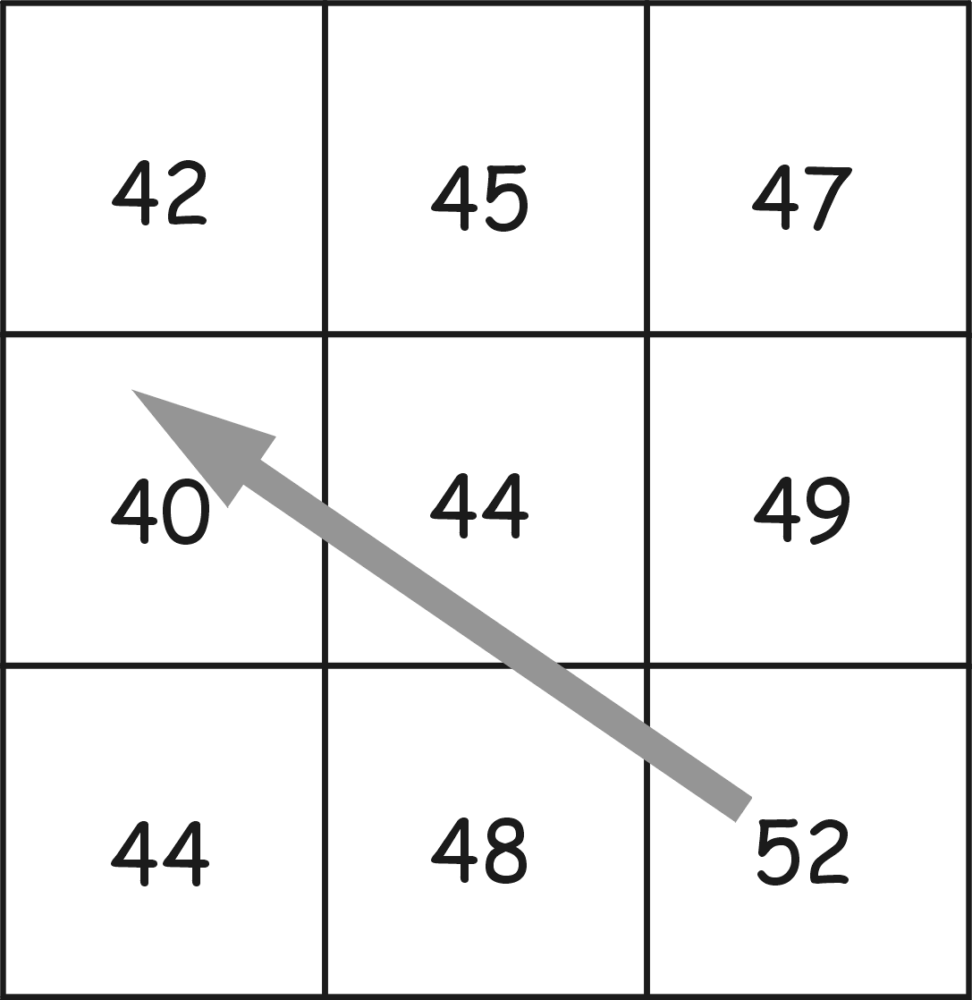

- **What is the slope at the center cell?**
- The cell size is 10 m; the nine elevations are on the figure
- Work in pairs. Write down the method you used, not just the number

<!-- First pass: announce the activity and let them look at the nine numbers, then move on through the three slope slides before they work it. Take two or three methods from the room before showing the next slides. Common answers: steepest neighbor, average of the four cardinal neighbors, fit a plane through all nine. All three are real algorithms. -->

---

# Slope

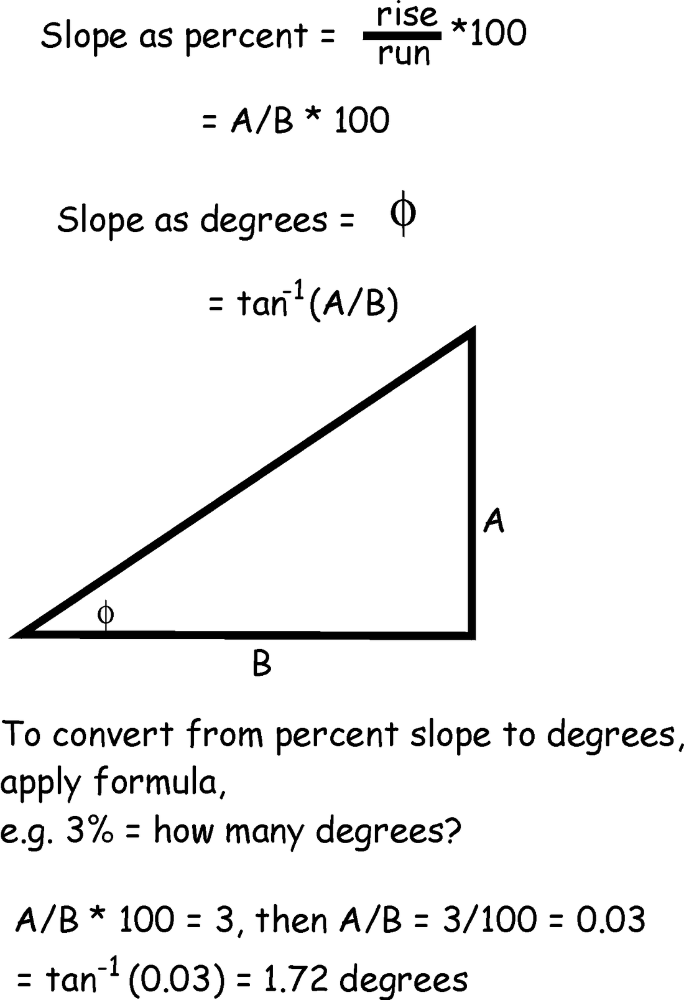

- **Slope** is the change in elevation (**rise**) with a change in horizontal position (**run**)
- Often reported in **degrees** between zero (flat) and 90 (vertical). At rise/run = 1, the slope is 45 degrees
- Can also be expressed as a **percent** = (rise/run) × 100

<!-- Both units are in use and they are not interchangeable: 100 percent is 45 degrees, not 90. The worked example on the figure converts 3 percent to 1.72 degrees. Make the class do one conversion out loud. -->

---

# Slope in three dimensions

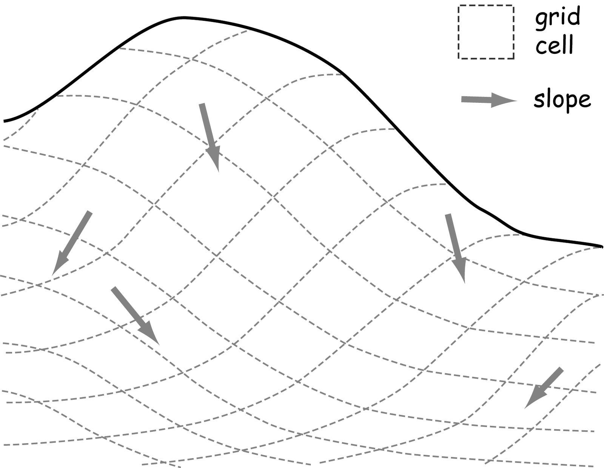

- The local neighborhood supplies the elevations used to estimate the gradient
- On a real surface, the **steepest direction** at a point is rarely aligned with a row or a column

<!-- The arrows on the figure are the direction of steepest descent at each location. Slope has a magnitude and a direction; the magnitude is the slope raster, the direction is the aspect raster. -->

---

# Slope on a grid

- When computing slope on a grid, we have a **problem**: the slope direction is seldom exactly between the centers of two cells
- So we need methods that look at **several** surrounding cells

<!-- This is why there is more than one slope algorithm. Each one is a different weighting of the eight neighbors, and they give different answers on the same DEM. -->

<!-- TODO(instructor): tie slope to scale and uncertainty here — slope computed on a 10 m grid and slope computed on a 30 m grid over the same hillside are different numbers, and neither is wrong. Decide how to frame the dependence on cell size and on DEM vertical error. -->

---

<!-- _class: quiz -->

# How would you do it?

- **What is the slope at the center cell?**
- The cell size is 10 m; the nine elevations are on the figure
- Work in pairs. Write down the method you used, not just the number

<!-- Second pass: pause here and let pairs actually work it, now that they have seen rise over run and why the steepest direction falls between cells. Take two or three methods from the room before showing the next slides. Common answers: steepest neighbor, average of the four cardinal neighbors, fit a plane through all nine. All three are real algorithms. -->

---

# Slope: four nearest cells

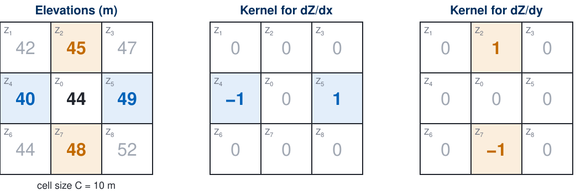

$$
\frac{dZ}{dx} = \frac{Z_5 - Z_4}{2C} = \frac{49 - 40}{20} = 0.45
\qquad
\frac{dZ}{dy} = \frac{Z_2 - Z_7}{2C} = \frac{45 - 48}{20} = -0.15
$$

$$
\textbf{slope} = \arctan\sqrt{(0.45)^2 + (-0.15)^2} = \arctan(0.474) = \mathbf{25.4^\circ}
$$

Checking against <em>GIS Fundamentals</em>? Some earlier printings of this figure show dZ/dy = (Z2 − Z1)/2C and 25.3°; it should be (Z2 − Z7)/2C, and the arithmetic gives 25.38°.

<!-- Only the four cardinal neighbors are used; the diagonals get weight zero. Two central differences give dZ/dx and dZ/dy, and the slope is the arctangent of the magnitude of that gradient: 25.4 degrees here (25.38). The book figure this slide replaces had Z1 for Z7 in the dZ/dy formula and printed 25.3; the typo is believed fixed from the 6th edition onward — verify against the edition students own. -->

---

<!-- _class: activity -->

# Slope: 3rd-order finite difference — try it

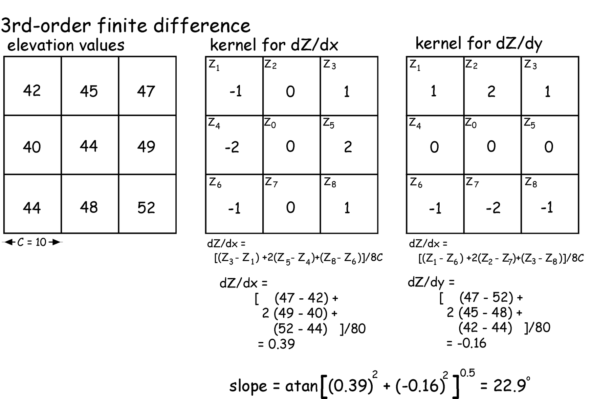

<!-- This is the method ArcGIS Pro's Slope tool uses. All eight neighbors contribute, with the cardinal ones weighted double. Same nine elevations as the previous slide, and the answer comes out 22.9 degrees instead of 25.4 — a 2.5 degree spread from the choice of algorithm alone. Have them reproduce both numbers before moving on. -->

<!-- TODO(instructor): the plan calls for a validation exercise here — students compute slope by hand and compare against the Slope tool's output for the same cell. Decide whether it belongs in this lecture, in the lab, or on the quiz, and what counts as agreement. -->

---

# Aspect

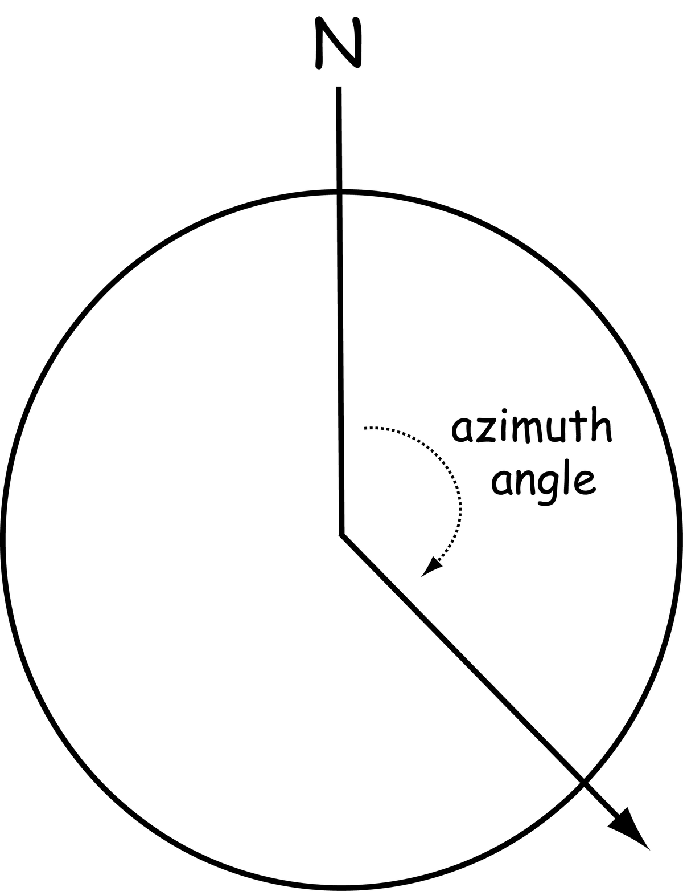

- **Aspect** is the downhill direction of the steepest slope, reported as an **azimuth** clockwise from north

$$
\text{Aspect} = 180 - \arctan\!\left(\frac{dz/dy}{dz/dx}\right) + 90\left(\frac{dz/dx}{|dz/dx|}\right)
$$

- **Same partial derivatives** as slope; a different thing done with them

<!-- TODO(instructor): aspect has its own scale-and-uncertainty story — on gentle slopes the direction of steepest descent is almost arbitrary, so aspect is noisiest exactly where slope is smallest, and it changes with cell size. Decide whether to make that point here or alongside the slope slide. -->

<!-- Aspect is circular data: 359 degrees and 1 degree are two degrees apart, not 358. That breaks averaging, and it is why aspect is usually reclassified into compass sectors before it is used. Flat cells have no aspect at all and are coded separately. -->

---

# Plan and profile curvature

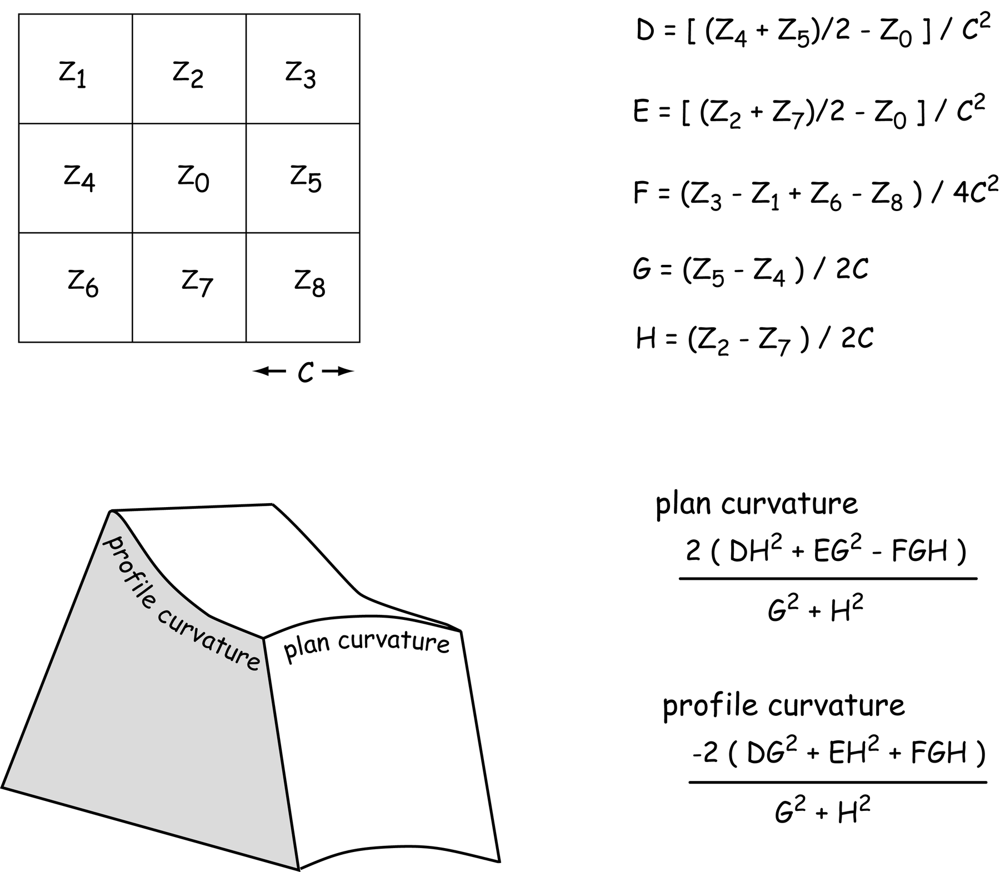

- **Profile curvature** — curvature **parallel** to the slope direction
- **Plan curvature** — curvature **perpendicular** to the slope direction
- Because curvature is a **second derivative**, it is especially **sensitive** to cell size and DEM noise
- Can you calculate curvature?
- Name some applications or uses for curvature

<!-- Curvature is the second derivative of the surface, fitted from the same 3 x 3 window. Profile curvature controls whether flow accelerates or decelerates downslope; plan curvature controls whether it converges into a hollow or spreads over a nose. Together they predict where water and sediment collect. -->

<!-- TODO(instructor): curvature is the most scale-sensitive of these surfaces — the second derivative amplifies DEM noise, so a 1 m lidar DEM and a 30 m DEM give qualitatively different curvature maps. Decide how to make that point, and whether to require smoothing before curvature in the lab. -->

---

# A viewshed is a rotating searchlight

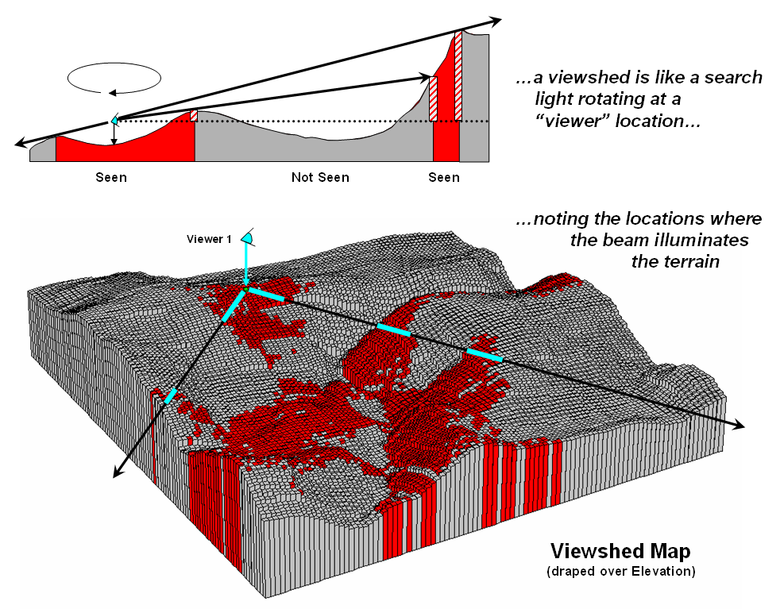

- In other words: **what could you see in all directions from the given point?**
- **Sweep a beam** from the viewer, mark every cell the beam reaches, and skip everything in shadow
- The output is a raster: **seen** or **not seen**, cell by cell

<!-- The profile at the top of the figure is the whole algorithm in one dimension: from the viewer, a line of sight rises at some angle, and any cell below the running maximum angle is hidden. The 3D block is the same test run outward in every direction. -->

<!-- TODO(instructor): viewshed results depend on choices the tool makes you name — observer and target offsets, earth curvature and refraction correction, the analysis radius, and the DEM's cell size. Decide how to present that as an uncertainty story rather than a parameter list. -->

---

# How to use a viewshed

Siting **cell towers**, **search and rescue**, **scenic protection**, **security**, wind turbines…

**Example:** a hike along the east bench of Utah County. **Which stops see the most temples?**

- Visibility is **symmetric**: if the stop can see the temple, the temple can see the stop
- So run **one viewshed from each temple** (raised to spire height) and **add the seven rasters**
- Every cell now holds a **count of temples visible**; read it at each stop
- The best stop is the one with the **highest count**

<svg xmlns="http://www.w3.org/2000/svg" viewBox="0 0 600 600" width="600" height="600" style="height:540px;width:auto;display:block;margin:-20px auto 0;" font-family="Helvetica,Arial,sans-serif"><rect x="0" y="0" width="600" height="600" fill="#f4f1ea"/><path d="M400,0 L400,20 L410,90 L395,150 L420,200 L430,260 L445,320 L460,380 L470,440 L480,500 L490,600 L600,600 L600,0 Z" fill="#c9b48a"/><path d="M470,0 L470,20 L480,90 L465,150 L490,200 L500,260 L515,320 L530,380 L540,440 L550,500 L560,600" fill="none" stroke="#8a6a4f" stroke-width="2" stroke-dasharray="1 0" opacity=".5"/><polygon points="418,190 372,203 424,222" fill="#b89f70" stroke="#8a6a4f" stroke-width="1.2"/><polygon points="462,405 400,425 468,445" fill="#b89f70" stroke="#8a6a4f" stroke-width="1.2"/><path d="M190,215 C240,200 290,225 300,265 C310,300 330,330 312,352 C300,368 322,385 300,400 C280,430 250,470 215,460 C180,450 170,400 172,350 C174,300 160,240 190,215 Z" fill="#bcd3ea" stroke="#6f9cc8" stroke-width="1.5"/><path d="M95,250 C120,240 150,265 150,300 C152,340 140,390 112,410 C95,380 85,320 95,250 Z" fill="#c9b48a" stroke="#8a6a4f" stroke-width="1.2"/><text x="232" y="425" font-size="16" font-style="italic" fill="#3b6fa0" text-anchor="middle">Utah Lake</text><text x="118" y="335" font-size="11" fill="#6b5434" text-anchor="middle" transform="rotate(-80 118 335)">Lake Mountains</text><text x="545" y="300" font-size="15" font-weight="700" fill="#6b5434" text-anchor="middle" transform="rotate(80 545 300)">WASATCH RANGE</text><text x="500" y="115" font-size="11" fill="#6b5434">▲ Mt. Timpanogos</text><text x="478" y="300" font-size="11" fill="#6b5434">▲ Y Mountain</text><path d="M424.9,40.0 L426.0,47.8 L427.1,55.6 L428.2,63.4 L429.3,71.2 L430.4,79.0 L431.5,86.8 L430.9,94.6 L428.9,102.4 L427.0,110.2 L425.0,118.0 L423.1,125.8 L421.1,133.6 L419.2,141.4 L417.2,149.2 L420.5,156.9 L424.4,164.7 L428.3,172.5 L432.2,180.3 L436.1,188.1 L440.0,195.9 L442.6,203.7 L443.9,211.5 L445.2,219.3 L446.5,227.1 L447.8,234.9 L449.1,242.7 L450.4,250.5 L451.7,258.3 L453.5,266.1 L455.5,273.9 L457.4,281.7 L459.4,289.5 L461.3,297.3 L463.3,305.1 L465.2,312.9 L467.2,320.7 L469.1,328.5 L471.1,336.3 L473.0,344.1 L475.0,351.9 L476.9,359.7 L478.9,367.5 L480.8,375.3 L482.5,383.1 L483.8,390.8 L485.1,398.6 L486.4,406.4 L487.7,414.2 L489.0,422.0 L490.3,429.8 L491.6,437.6 L492.9,445.4 L494.2,453.2 L495.5,461.0 L496.8,468.8 L498.1,476.6 L499.4,484.4 L500.7,492.2 L502.0,500.0" fill="none" stroke="#7a3e9d" stroke-width="3" stroke-dasharray="7 5"/><text x="490" y="528" font-size="12" font-weight="700" fill="#7a3e9d">bench trail</text><line class="vs-l vs-d0" x1="454.5" y1="270" x2="322" y2="262" stroke="#2e7d32" stroke-width="2.5"/><line class="vs-l vs-d1" x1="454.5" y1="270" x2="410" y2="288" stroke="#2e7d32" stroke-width="2.5"/><line class="vs-l vs-d2" x1="454.5" y1="270" x2="352" y2="322" stroke="#2e7d32" stroke-width="2.5"/><line class="vs-l vs-d3" x1="454.5" y1="270" x2="160" y2="168" stroke="#2e7d32" stroke-width="2.5"/><line class="vs-l vs-d4" x1="454.5" y1="270" x2="330" y2="205" stroke="#2e7d32" stroke-width="2.5"/><line class="vs-l vs-d5" x1="454.5" y1="270" x2="408" y2="218" stroke="#b3261e" stroke-width="2.5"/><line class="vs-l vs-d5" x1="408" y1="218" x2="330" y2="110" stroke="#b3261e" stroke-width="1.5" stroke-dasharray="3 5" opacity=".55"/><text class="vs-m vs-d5" x="408" y="224" font-size="18" font-weight="700" fill="#b3261e" text-anchor="middle">✗</text><line class="vs-l vs-d6" x1="454.5" y1="270" x2="425" y2="417" stroke="#b3261e" stroke-width="2.5"/><line class="vs-l vs-d6" x1="425" y1="417" x2="400" y2="548" stroke="#b3261e" stroke-width="1.5" stroke-dasharray="3 5" opacity=".55"/><text class="vs-m vs-d6" x="425" y="423" font-size="18" font-weight="700" fill="#b3261e" text-anchor="middle">✗</text><g transform="translate(160,168)"><polygon points="0,-17 3,-8 3,-6 -3,-6 -3,-8" fill="#002e5d"/><rect x="-7" y="-6" width="14" height="10" fill="#ffffff" stroke="#002e5d" stroke-width="2"/></g><text x="149" y="166" font-size="12.5" font-weight="700" fill="#002e5d" text-anchor="end" style="paint-order:stroke" stroke="#f4f1ea" stroke-width="4">Saratoga Springs</text><g transform="translate(330,110)"><polygon points="0,-17 3,-8 3,-6 -3,-6 -3,-8" fill="#002e5d"/><rect x="-7" y="-6" width="14" height="10" fill="#ffffff" stroke="#002e5d" stroke-width="2"/></g><text x="319" y="108" font-size="12.5" font-weight="700" fill="#002e5d" text-anchor="end" style="paint-order:stroke" stroke="#f4f1ea" stroke-width="4">Mount Timpanogos</text><g transform="translate(322,262)"><polygon points="0,-17 3,-8 3,-6 -3,-6 -3,-8" fill="#002e5d"/><rect x="-7" y="-6" width="14" height="10" fill="#ffffff" stroke="#002e5d" stroke-width="2"/></g><text x="311" y="260" font-size="12.5" font-weight="700" fill="#002e5d" text-anchor="end" style="paint-order:stroke" stroke="#f4f1ea" stroke-width="4">Orem</text><g transform="translate(330,205)"><polygon points="0,-17 3,-8 3,-6 -3,-6 -3,-8" fill="#002e5d"/><rect x="-7" y="-6" width="14" height="10" fill="#ffffff" stroke="#002e5d" stroke-width="2"/></g><text x="319" y="203" font-size="12.5" font-weight="700" fill="#002e5d" text-anchor="end" style="paint-order:stroke" stroke="#f4f1ea" stroke-width="4">Lindon</text><g transform="translate(352,322)"><polygon points="0,-17 3,-8 3,-6 -3,-6 -3,-8" fill="#002e5d"/><rect x="-7" y="-6" width="14" height="10" fill="#ffffff" stroke="#002e5d" stroke-width="2"/></g><text x="341" y="336" font-size="12.5" font-weight="700" fill="#002e5d" text-anchor="end" style="paint-order:stroke" stroke="#f4f1ea" stroke-width="4">Provo City Center</text><g transform="translate(410,288)"><polygon points="0,-17 3,-8 3,-6 -3,-6 -3,-8" fill="#002e5d"/><rect x="-7" y="-6" width="14" height="10" fill="#ffffff" stroke="#002e5d" stroke-width="2"/></g><text x="399" y="304" font-size="12.5" font-weight="700" fill="#002e5d" text-anchor="end" style="paint-order:stroke" stroke="#f4f1ea" stroke-width="4">Provo Rock Canyon</text><g transform="translate(400,548)"><polygon points="0,-17 3,-8 3,-6 -3,-6 -3,-8" fill="#002e5d"/><rect x="-7" y="-6" width="14" height="10" fill="#ffffff" stroke="#002e5d" stroke-width="2"/></g><text x="389" y="546" font-size="12.5" font-weight="700" fill="#002e5d" text-anchor="end" style="paint-order:stroke" stroke="#f4f1ea" stroke-width="4">Payson</text><circle cx="429.1" cy="70" r="10" fill="#7a3e9d" stroke="#fff" stroke-width="2"/><text x="429.1" y="74.5" font-size="12" font-weight="700" fill="#fff" text-anchor="middle">1</text><circle cx="427.0" cy="170" r="10" fill="#7a3e9d" stroke="#fff" stroke-width="2"/><text x="427.0" y="174.5" font-size="12" font-weight="700" fill="#fff" text-anchor="middle">2</text><circle class="vs-pulse" cx="454.5" cy="270" r="13" fill="#7a3e9d" opacity=".25"/><circle cx="454.5" cy="270" r="10" fill="#7a3e9d" stroke="#fff" stroke-width="2"/><text x="454.5" y="274.5" font-size="12" font-weight="700" fill="#fff" text-anchor="middle">3</text><circle cx="479.5" cy="370" r="10" fill="#7a3e9d" stroke="#fff" stroke-width="2"/><text x="479.5" y="374.5" font-size="12" font-weight="700" fill="#fff" text-anchor="middle">4</text><circle cx="497.0" cy="470" r="10" fill="#7a3e9d" stroke="#fff" stroke-width="2"/><text x="497.0" y="474.5" font-size="12" font-weight="700" fill="#fff" text-anchor="middle">5</text><g transform="translate(14,486)"><rect width="226" height="100" rx="8" fill="#ffffff" opacity=".92" stroke="#c9d8ea"/><line x1="12" y1="20" x2="40" y2="20" stroke="#2e7d32" stroke-width="3"/><text x="48" y="25" font-size="13" fill="#22262e">visible from stop 3</text><line x1="12" y1="44" x2="40" y2="44" stroke="#b3261e" stroke-width="3"/><text x="48" y="49" font-size="13" fill="#22262e">blocked by a ridge</text><circle cx="26" cy="68" r="8" fill="#7a3e9d"/><text x="48" y="73" font-size="13" fill="#22262e">trail stop</text><text x="12" y="93" font-size="11" font-style="italic" fill="#5b6472">Diagram, not to scale</text></g><g transform="translate(30,40)"><polygon points="0,-22 8,4 0,-2 -8,4" fill="#002e5d"/><text x="0" y="20" font-size="14" font-weight="700" fill="#002e5d" text-anchor="middle">N</text></g></svg>

<!-- The diagram is not to scale and the sight lines from stop 3 are illustrative, not the output of a real viewshed run; the point is the workflow. Temples shown are the seven dedicated temples in Utah County (Saratoga Springs, Mount Timpanogos, Lindon, Orem, Provo City Center, Provo Rock Canyon, Payson) at approximate positions — VERIFY the list is current before each offering. The two ridge spurs stand in for foothills that block a line of sight along the bench. In ArcGIS Pro, the Viewshed tool takes an observer offset for the spire height; adding the seven outputs with Raster Calculator gives the count. The Visibility tool can also report how many observers see each cell (VERIFY the analysis-type option name). Ask what else would change the answer: trees, buildings, observer eye height, and the DEM's cell size. -->

---

# Before Next Class

- **Reading:** Chapter 11 of *GIS Fundamentals* (Terrain Analysis)
- **Quiz 5**, open book, on Learning Suite — due **Saturday 11:59 pm**
- **Lab 4 — Cell Phone Tower Placement** is due **Saturday 11:59 pm** — see the [Lab 4 page](https://byu-hydroinformatics.github.io/ce414-gis-applications/assignments/lab-04/)
- **Lab 5 — Watershed Delineation** is next — see the [Lab 5 page](https://byu-hydroinformatics.github.io/ce414-gis-applications/assignments/lab-05/)
- Questions? Office hours: [calendly.com/dan-ames/office-hours](https://calendly.com/dan-ames/office-hours)

<!-- TODO(graphic): no graphic on this slide; a small course-schedule or lab-thumbnail figure would carry it. -->

---

<!-- _class: activity -->

# One Last Thing — Slope, Aspect, Viewshed

Six questions on **what you get out of a DEM** — contours, hillshade, aspect, slope, and what a viewshed can and cannot tell you.

**Scan the code**, or open the link below.

- Not graded, nothing recorded — it is a check that it landed
- Every answer explains itself; read the explanation before you move on
- The last two are about viewsheds: what one cell value means, and how to count what a whole hike can see

byu-hydroinformatics.github.io/ce414-gis-applications/quizzes/terrain-analysis/

<!-- Five minutes, in pairs, then a show of hands on the two that split the room. The aspect item
     catches people who read aspect as uphill, or as a compass bearing counterclockwise. The 25.4 versus 22.9 item is the other one; the point is that both answers are
     right and the method is part of the result. The temple item checks that they saw why visibility
     is symmetric. If the room has no signal, put the URL on the board;
     the items read aloud just as well. -->

<!-- Conversion notes (2026-09-03): CROP (2026-09-03): the five browser captures (National Map, SRTM/GISGeography, Earthdata, JAXA ALOS, Mars DEMs) had the Chrome tab strip and address bar removed because they showed the capturing user's other open tabs and profile avatar; page content unchanged. source "CE 414 Week 5 - Terrain Analysis.pptx", 28 slides, no hidden slides and no speaker notes in the source — every note in this deck is new. 28 source slides became 35: added a title byline slide, Today's Goals, three section dividers, a Lab 4 preview, and Before Next Class; source slide 22 was split into two slides (four nearest cells / 3rd-order finite difference) because its figure is unreadable at 16:9 on one slide. No slides were dropped. The duplicated sentence on the ASTER slide was removed. Source media1 (a stock tomato photo, unused by any slide) was not carried over. Slides 2, 3, 11 and 26 were built from PowerPoint shapes and are 200 dpi renders of the PDF page, cropped. Stale non-ArcGIS screenshots kept and flagged: The National Map, the SRTM page (a third-party page with an advertisement in the capture), Earthdata Search, and the JAXA portal. There are no ArcMap-era ArcGIS captures in this deck and no ArcGIS UI at all — ArcGIS Pro tool names appear only in speaker notes and carry a VERIFY. Open items: DEM resolution and dataset claims (four VERIFY flags plus a 3DEP terminology TODO; ten VERIFY flags in the deck overall), native-vs-resampled resolution, scale/uncertainty for hillshade, slope, curvature and viewshed, a hand-versus-tool validation exercise, the susceptibility/hazard/risk/exposure distinction, the reading chapter, the Week 5/6 lab schedule, and three TODO(graphic) slides. -->

<!--
Split notes (2026-09-10). This deck used to open with Part 1, "Elevation surfaces and where DEMs
come from" — eleven slides that have moved to slides/week-05/elevation-data-lidar.md, the new
Tuesday deck, along with the LiDAR block from Week 4. What remains is what you compute from a DEM,
which is a Thursday session of 23 slides.

The two remaining parts were renumbered 1 and 2 (they were 2 and 3). Today's Goals was rewritten to
promise only what this deck now delivers, and it names the handoff: cell size was chosen on Tuesday
and every moving-window surface here depends on it. The deck's day in tools/build_schedule.py changed
from None to Thu.
-->

<!-- Revision notes (2026-09-30): aligned the Lab 4 preview with the assigned model, which uses Slope,
     road proximity and tower density rather than Viewshed; corrected the self-check framing so the
     viewshed question is not presented as a Lab 4 deliverable; added a scale/cell-size slide; and
     made the distinction between moving-window terrain surfaces and line-of-sight viewsheds explicit. -->
