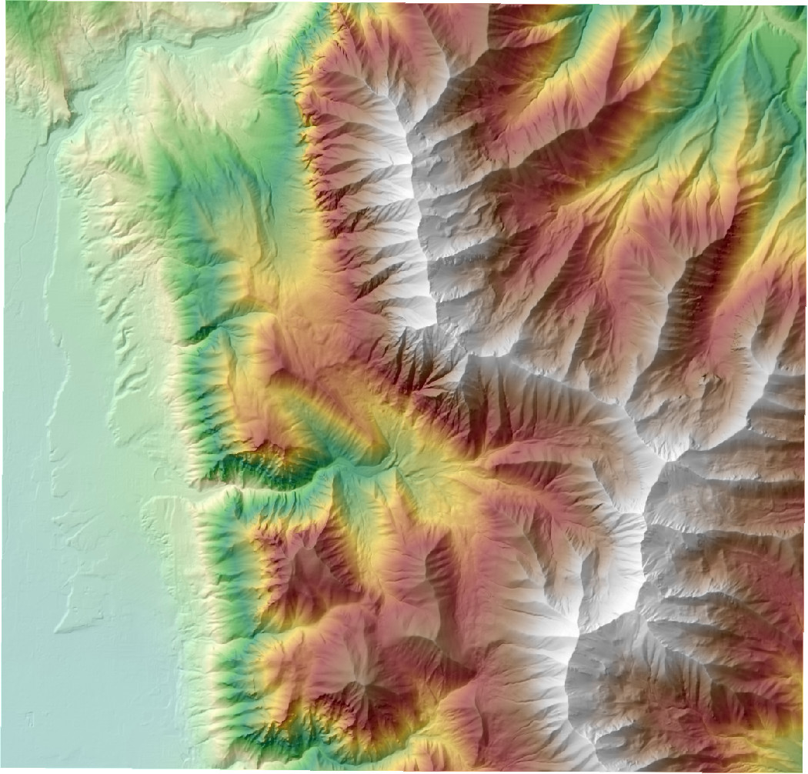
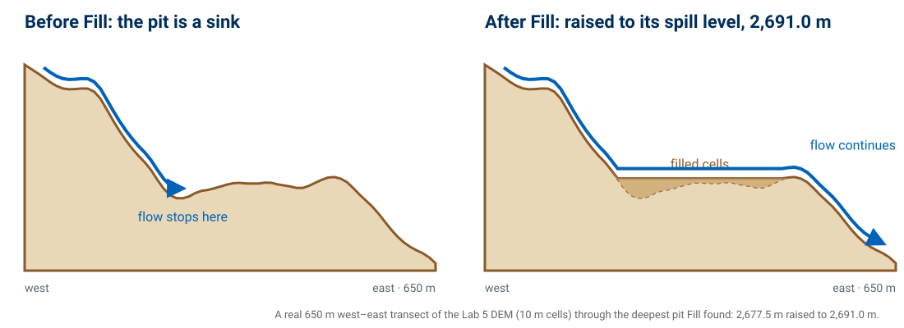
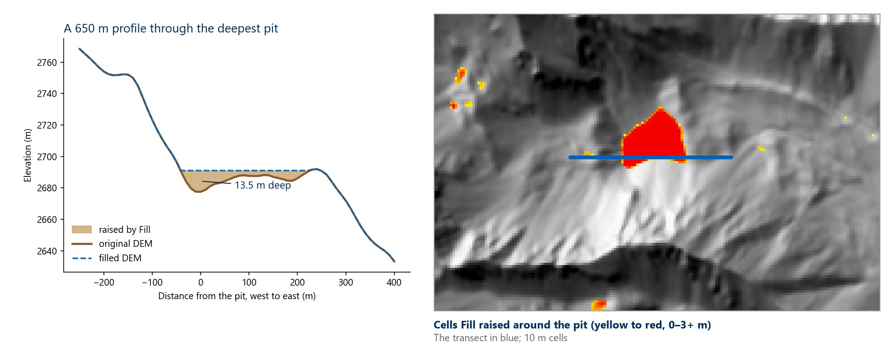
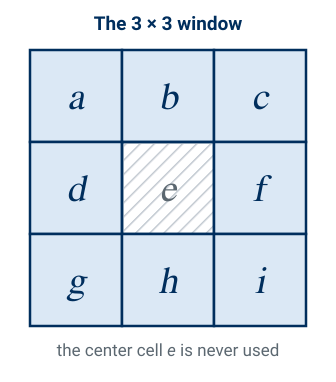
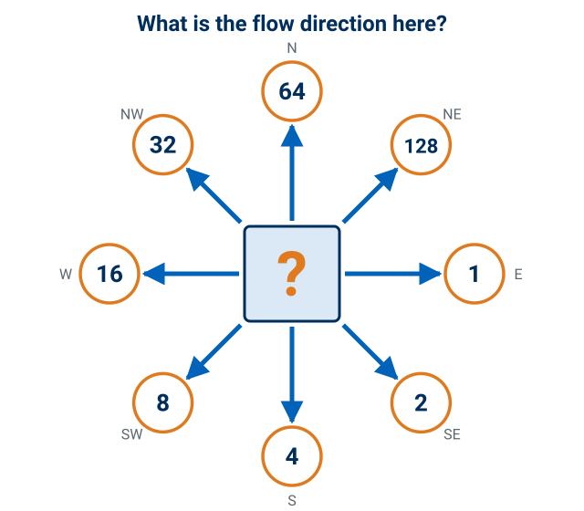
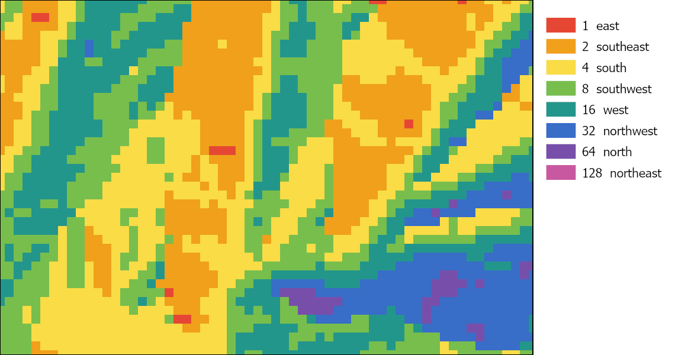

<!-- _class: lead -->
<!-- _paginate: skip -->

# Watershed Delineation

## Part A — What a Watershed Is, and Which Way Water Flows

CE 414 Engineering Applications of GIS
Civil & Construction Engineering
Brigham Young University
Dr. Dan Ames

<!-- Week 6 is two decks that share the eight-step delineation workflow between them. This one is Tuesday: Lab 5 introduced, then what a watershed is and why we manage water by them, then the first three steps (the DEM, Fill, Flow Direction) cell by cell, starting from last week's slope and aspect. Thursday's deck (Part B, watershed-delineation-b.md) picks up at flow accumulation, finishes the eight steps and the Lab 5 model, then delineates a watershed by hand and with StreamStats. -->

<!-- stamp:begin -->
<!-- _footer: 'CE 414 · Week 6 — Watershed Delineation Part ALast Updated: 2026-10-05© 2026 Daniel P. Ames · <a href="https://creativecommons.org/licenses/by/4.0/">CC BY 4.0</a>' -->
<!-- stamp:end -->

---

# Today's Goals

By the end of class you should be able to:

- Define a **watershed**, and say why water is managed by watershed rather than by political boundary
- Read the **nested hydrologic units** a place sits in
- Write a watershed's **water balance**, and say which term a DEM can tell you about
- Say why **Fill** comes first, and why some pits are real and some are not
- Tell a cell's **aspect** from its **D8 flow direction**, and read a D8 code back to a compass direction

<!-- One goal per question on the closing quiz (Which Way Does Water Go?), in the same order. The map at right: where Rock Canyon's water goes, nested from the Lab 5 basin up to the Great Salt Lake subregion. The thread for today: first what a watershed is and why its boundary matters, then the first three steps of computing that boundary from a DEM. Thursday finishes the computation. -->

---

# This Week's Lab — The Basin Above Rock Canyon

- **The job:** the basin above the Rock Canyon trailhead, its streams, and **20–40 subwatersheds**
- **One ModelBuilder model**, from a 10 m DEM and an outlet you place
- **Two checks:** USGS **StreamStats** and the **NHD**
- **Then move the stream threshold** and see what changes
- Due **Saturday 11:59 pm** — start from the report template

[Lab 5 — Watershed Delineation](https://byu-hydroinformatics.github.io/ce414-gis-applications/assignments/lab-05/)

<!-- Two minutes, not twenty: this is the lab's problem statement in one slide, so that everything this week has somewhere to land. The map at right is the lab's example baseline layout — 29 subwatersheds at a threshold of 5,000 cells. The three things to say out loud: the outlet is one the student places, the model runs from a DEM extract the lab provides (no download hunt), and the report template has every graded item as a heading. StreamStats is a check in the lab (Step 13) as well as Thursday's in-class activity. The last part, Step 14, is the one students underestimate: four runs of the model, one table. -->

---

<!-- _class: lead -->

# Part 1 — What Is a Watershed, and Why Care?

<!-- Before the algorithm, what the algorithm is for. -->

---

# This Week in One Picture — Hydrologic Terrain Processing

- Begin with a **Digital Elevation Model (DEM)**
- **Goal 1:** generate a polyline **stream network** — a "potential flow path network"
- **Goal 2:** generate polygon **watershed boundaries**
- **Motive:** generally to create input data sets for hydrologic and watershed modeling tools, i.e. for rainfall-runoff prediction modeling

<!-- "Potential flow path network" is the honest phrase: the algorithm returns where water would go on this surface, which is not the same as where a channel exists. That gap is why validation against mapped hydrography matters. The five panels are this week's chain on Lab 5's Rock Canyon data — today gets as far as flow direction, Thursday finishes it, rendered in ArcGIS Pro: the DEM, flow direction, flow accumulation, the streams and basin, and the subwatersheds. -->

---

# What Is a Watershed?

- A watershed is the **area of land where all of the water that drains off of it goes into the same place** (i.e. an "outlet")
- John Wesley Powell's definition: a bounded hydrologic system within which all living things are linked by their common water course, and around which, as humans settled, communities formed
- Watersheds come in **all shapes and sizes**, and they **cross city, state, and national boundaries**
- No matter where you are, **you're in a watershed!**

<!-- Powell's definition is quoted in full on the source slide; it is paraphrased here. Read the original aloud if you want it. The engineering definition and Powell's social one describe the same boundary and are worth contrasting. -->

---

# Remember This Map?

<!-- Some people have proposed that the 50 states be redivided based on population. What's wrong with this from a hydrology point of view? Water doesn't follow straight-line political boundaries. Let them answer before you say it. -->

---

# John Wesley Powell

- **Major John Wesley Powell**, a Civil War veteran, ethnographer, and second director of the United States Geological Survey from 1881 to 1894
- Proposed that western states be brought into the union around **watershed boundaries**

<!-- Powell's 1890 map of the arid region divided the West into drainage basins rather than rectangles. Congress ignored it. A century of interstate water compacts and litigation followed. Background reading: https://brandonletsinger.com/biography/the-united-watershed-states-of-america-a-biography-of-john-wesley-powell/ -->

---

# Why Watersheds Are Important

- Understanding watershed structure and natural processes is crucial to grasping how **human activities can degrade or improve** the condition of a watershed — its water quality, its fish and wildlife, its forests and other vegetation, and the quality of community life for people who live there
- Knowing these structural and functional characteristics, and how people affect them, sets the stage for **effective watershed management**

<!-- The bridge from "we can compute a boundary" to "the boundary is the unit management decisions get made in." Permits, TMDLs, restoration budgets and stormwater plans are all organized by watershed. -->

---

# Anatomy of a Watershed — Rock Canyon

<!-- An oblique 3D view of Rock Canyon in ArcGIS Pro, looking east from above Provo, with Lab 5's basin (yellow), stream links (blue) and subwatersheds (thin white lines) draped on imagery. Walk it from the outlet: the outlet at the trailhead, the main stem up the canyon, the tributaries, one subwatershed, up to the divide along the ridgeline and the highest point at Provo Peak. Everything inside the yellow line drains to the one red point at the bottom; everything outside it, even a few meters over the ridge, goes somewhere else. Labels are placed from the Lab 5 data (tools/week06_figures.py, anatomy). -->

---

# Watersheds Nest — From Rock Canyon to the Great Salt Lake

- Each code adds two digits to its parent: **16** Great Basin › **1602** Great Salt Lake › **160202** Jordan › **16020203** Provo › … › **160202030505** Rock Canyon

<!-- These are the USGS Watershed Boundary Dataset units that contain the Rock Canyon trailhead, pulled live from the WBD map service and drawn in ArcGIS Pro: Great Basin Region (HUC2 16), Great Salt Lake subregion (HUC4 1602, about 74,300 km²), Jordan basin (HUC6 160202), Provo subbasin (HUC8 16020203, about 1,770 km²), Outlet Provo River watershed (HUC10 1602020305, about 332 km²), and Rock Canyon-Provo River subwatershed (HUC12 160202030505, about 50 km²). The Lab 5 basin, 25.2 km², sits inside that HUC12. Each code extends its parent by two digits — the nesting is in the number. The point to land: Rock Canyon's water ends up in the Great Salt Lake, which is where next week starts. -->

---

# The Water Balance of a Watershed

- The watershed is the **accounting boundary**. A DEM tells you about only one term: **where the runoff goes**

<!-- The hydrologic cycle, drawn as a budget for one watershed — Rock Canyon's real outline from Lab 5. Precipitation in; evapotranspiration out; streamflow out at the outlet; deep groundwater out across the bottom; the difference is the change in storage (snowpack, soil water, groundwater). Ask which of these terms a DEM can tell you about. Only one, and only partly: where the water that becomes streamflow will go — the flow paths, the divide, and the outlet. Every other term needs other data: gages, weather stations, soil and snow surveys. -->

---

# What a Watershed Does

<!-- Three things a watershed does, drawn on the same real basin: it collects, stores and releases water; it carries sediment and dissolved chemistry downstream, so the channel carries more the closer it gets to the outlet (line width is drawn from each link's real contributing area); and its streams and their banks are the habitat network. The water budget, the sediment and chemical budget and the biotic structure all use the watershed as their accounting boundary — the argument for computing the boundary carefully (tools/week06_processes_svg.py). -->

---

<!-- _class: lead -->

# Part 2 — From a DEM to Flow Direction

<!-- The first three of the eight steps: the elevation surface, Fill, and Flow Direction, done on paper and in Excel before ArcGIS Pro does them at scale. Thursday picks up at step 4, flow accumulation. -->

---

# Summary of Steps

<!-- This roadmap slide comes back at every step, today and Thursday, each time with the current step highlighted. Step 1: get the elevation data, mosaic tiles together if the area of interest spans more than one, and project into a coordinate system with real ground units so cell size means something. -->

---

# Elevation Surface

- **Elevation surface** — the ground surface elevation at each point
- **Digital Elevation Model** — a digital representation of an elevation surface: a **square grid** (what this course means by DEM), a **TIN**, **contours**, or **random points**
- See last week to recall **DEM data sources** — [Week 5, DEM data sources](https://byu-hydroinformatics.github.io/ce414-gis-applications/slides/week-05/elevation-data-lidar.html#19)

<!-- Point out that "DEM" in this course almost always means the square grid, but the definition is broader. The distinction matters in step 1: a TIN or a contour set has to be converted to a grid before any of the following steps will run. The map is the Lab 5 DEM, 10 m cells around Rock Canyon, colored by elevation over its own hillshade and rendered in ArcGIS Pro. -->

---

# Summary of Steps

<!-- Step 2. In ArcGIS Pro this is the Fill tool in the Spatial Analyst Hydrology toolset. -->

---

# Filling in the Pits

<svg xmlns="http://www.w3.org/2000/svg" viewBox="0 0 825 300" width="825" height="300" style="position:absolute; left:0; top:0;"><defs><marker id="pq" viewBox="0 0 10 10" refX="9" refY="5" markerWidth="6" markerHeight="6" orient="auto"><path d="M0,0 L10,5 L0,10 z" fill="#b3261e"/></marker></defs><rect x="218" y="44" width="196" height="64" rx="8" fill="#fff4e5" stroke="#e07a1f" stroke-width="2.5"/><text x="316" y="70" text-anchor="middle" font-family="Segoe UI, Roboto, Helvetica, Arial, sans-serif" font-size="17" font-weight="700" fill="#002e5d">In the real world,</text><text x="316" y="94" text-anchor="middle" font-family="Segoe UI, Roboto, Helvetica, Arial, sans-serif" font-size="17" font-weight="700" fill="#002e5d">what happens here?</text><path d="M240,110 C215,140 195,155 175,170" fill="none" stroke="#b3261e" stroke-width="3.5" marker-end="url(#pq)"/></svg>

- A **pit** is one or more cells with **no downstream cell** around them; unfilled, it is a **sink** that stops the flow
- **Fill** raises each pit to its **spill level**, so water can continue downhill — it is the first thing done with a DEM

Some pits are <strong>real sinks</strong> in the landscape, and some are <strong>artifacts</strong> of how the DEM was created.

<!-- Two clicks. The first shows the question and the arrow at the pit in the left profile: in the real world, what happens here? Let them answer. Water ponds; it fills the hollow until it spills over the low point on the rim (the right-hand profile), or it soaks in or evaporates if it never fills. The second click: some pits are real (a pond, a closed basin, a sinkhole, the Great Salt Lake itself) and some are artifacts of how the DEM was made — interpolation, a bridge or culvert the DEM does not show, rounding. Fill treats them all the same, which is why it has an optional z-limit for keeping the deep ones. Water routed into an unfilled pit has nowhere to go, so flow accumulation downstream of it collapses and the stream network breaks into disconnected pieces. The figure is a real 650 m west-east profile of the Lab 5 DEM through the deepest pit Fill found, a closed hollow high in the mountains east of Rock Canyon: its bottom at 2,677.5 m is raised to the spill level, 2,691.0 m, 13.5 m deep (tools/week06_pit_fill_figures.py). The callouts are click-to-reveal fragments: press the right arrow or space to show each. -->

---

# Effect of Pit Filling on Elevation

<!-- Left: the same transect as a chart, original against filled. The filled surface sits above the original exactly where the original dipped, and nowhere else: Fill raises elevations, it never lowers them. Right: a close-up of the map in ArcGIS Pro, about 1.8 km by 1.2 km around that pit, with every cell Fill raised colored yellow (a few centimeters) to red (3 m or more). At this zoom each 10 m cell is visible: the pit itself is the red block on the transect, and the small yellow and orange patches around it are shallow pits, most raised by less than a meter. Across the whole Lab 5 DEM Fill raised about 12,900 cells; inside the Rock Canyon basin only 43 cells changed, the deepest by 2.35 m. This pit, 13.5 m deep, lies outside the basin. (Lab 5 check values.) -->

---

# Summary of Steps

<!-- Step 3, the heart of the method, and the step the Excel activity walks through by hand. -->

---

# Standard Slope and Aspect Calculation

- This is the **standard slope** method from last week
- **Slope** is the steepest slope of the plane fitted to the nine-cell window
- **Aspect** is the 360° compass direction of that steepest slope

$$
\frac{dz}{dx} = \frac{(c + 2f + i) - (a + 2d + g)}{8 \cdot \text{cell size}}
$$

$$
\frac{dz}{dy} = \frac{(g + 2h + i) - (a + 2b + c)}{8 \cdot \text{cell size}}
$$

$$
\text{slope} = \arctan \sqrt{\left(\frac{dz}{dx}\right)^2 + \left(\frac{dz}{dy}\right)^2}
$$

$$
\theta = \mathrm{atan2}\!\left(\frac{dz}{dy},\; -\frac{dz}{dx}\right)
\qquad
\text{aspect} =
\begin{cases}
90^\circ - \theta & \theta \le 90^\circ \\
450^\circ - \theta & \theta > 90^\circ
\end{cases}
$$

<!-- This is the ordinary Slope and Aspect pair in ArcGIS Pro: the third-order finite difference (Horn's method) from last week, written with Esri's a-to-i window. Cardinal neighbors count double; the center cell e is never used. Slope is the magnitude of the gradient; aspect is its direction, turned from a math angle (counterclockwise from east, theta) into a compass bearing (clockwise from north): 90 minus theta, wrapping past north as 450 minus theta. Last week's aspect slide wrote the same result in the textbook's form. The formulas are Esri's published ones for the Slope and Aspect tools; run on the nine cells on the next slide they give 250.3 degrees aspect and 57.8 degrees slope, the values ArcGIS Pro 3.7.1's Aspect and Slope tools reported for that cell (checked against tools/lab05/d8_patch.json). The window figure is tools/week06_d8_svgs.py. Next slide: why hydrology does not use this answer. -->

---

# Aspect vs. D8 — Which Way Is Downhill?

- For flow paths, hydrologists use a **simplified aspect**: **D8 flow direction**. Aspect can be any of 360°; D8 just picks the steepest of **8** neighbors, so it is simpler and faster to compute
- Aspect is closer to **west**; the steepest single drop is **southwest**, so the water goes there
- **Interesting fact:** aspect never uses the center cell's elevation; D8 uses only the drops **from the center cell** to each neighbor

<!-- These are nine real cells of the Lab 5 DEM (after Fill), the top-left corner of the lab's Figure B. The aspect, 250 degrees, is what ArcGIS Pro's Aspect tool reports for the center cell (250.3) — the plane fit from the previous slide. D8 asks a simpler question: which single neighbor has the steepest drop? West falls 8.9 m over 10 m; southwest falls 18.5 m over 14.1 m, which is steeper, so all of this cell's water goes southwest (code 8). Ask the room which D8 direction is closest to 250 degrees: west (270) is 20 degrees away, southwest (225) is 25. D8 still picks southwest, because it compares single drops from the center cell and the aspect plane smooths over the whole window without ever looking at the center — the deep cell at the lower left pulls harder on D8 than on the plane. That is why the Excel activity asks for both. -->

---

# Hydrologic Slope — Direction of Steepest Descent

- Keeps the **steepest** of the eight neighbors — it does not average them
- The run to a **diagonal** neighbor is longer: divide by `30·√2`, not by `30`
- Diagonal: 19 / 42.4 = **0.45**. Straight down: 15 / 30 = **0.50**. Flow goes **south**

<!-- Work this one live. The trap students fall into is comparing raw elevation differences and picking the diagonal because 19 is bigger than 15. Slope is rise over run, and the run is longer on the diagonal. The 30 here is the cell size in meters. -->
<!-- Credit: figure adapted from the watershed delineation course materials of D. Maidment, University of Texas at Austin. -->

---

# Eight Direction Pour Point Model

- Water in the center cell leaves toward **one** of its eight neighbors
- Each direction has a code, clockwise from east: `1, 2, 4, 8, 16, 32, 64, 128` (Esri, ArcGIS Pro)
- The arrows are the **choices**. The code of the **steepest** one is the answer, and that number is written **into the center cell**
- Do that for every cell and you have the **flow direction grid**

<!-- The point to land: the number does not go in the neighbor, it goes in the center cell, and it says where that cell's water goes. Reading it clockwise from east: 1 = east, 2 = southeast, 4 = south, 8 = southwest, 16 = west, 32 = northwest, 64 = north, 128 = northeast. Powers of two are used so that more than one direction could in principle be summed into one value, which is how the tool reports unresolved flat areas. Students only need to read a code back to a compass direction. If anyone has used TauDEM or GRASS: those number the same eight directions differently, so a flow-direction grid made in one package cannot be routed in another; regenerate it in the software you route with. Drawn by tools/week06_d8_svgs.py. -->

---

<!-- _class: activity -->

# In Class Activity — Aspect and D8 Flow Direction

- Let's try doing the key step, **D8 Flow Direction**, in Excel
- And set it beside **aspect**, the downhill direction from last week's slope window

<!-- Hand out or project a small elevation grid and have students compute the steepest-descent neighbor for each interior cell, then write the Esri direction code. Doing it once by hand is what makes the Flow Direction tool make sense. It sits here, after the encoding and before the flow direction grid, so students have every piece they need and then see the grid they just built by hand. -->

---

# Flow Direction Grid

- Each cell's water flows to **one** neighbor, in the direction of **steepest descent**
- The number placed in each cell is an **indicator of the flow direction** from that cell to its neighbors: **one of eight** values

<!-- Left: a schematic grid drawn two ways, the direction as an arrow and the same grid as Esri codes. Have students check one or two cells against the encoding on the pour-point slide. Right: a real flow-direction raster: ArcGIS Pro's Flow Direction on the filled Lab 5 DEM, about 600 m by 400 m of Rock Canyon's slopes, each 10 m cell colored by its D8 code. The point is the texture: neighboring cells share a direction, and the bands are hillslopes draining the same way. The lower right is a slope facing north and northwest (codes 32 and 64). -->
<!-- Credit: figure adapted from the watershed delineation course materials of D. Maidment, University of Texas at Austin. -->

---

# Grid Network

<!-- Connect every cell to the neighbor its arrow points at and the whole grid becomes a tree: every cell has exactly one downstream neighbor, and many upstream ones. Every remaining step in the workflow, Thursday's whole deck, is a question you ask about this tree. -->
<!-- Credit: figure adapted from the watershed delineation course materials of D. Maidment, University of Texas at Austin. -->

---

# Before Next Class

- **Thursday:** the rest of the eight steps — flow accumulation, the stream threshold, stream links, pour points and watersheds — then delineate one **by hand** and with **StreamStats**. Bring a laptop with **ArcGIS Pro**
- Start **Lab 5** now: Steps 0–4 use only what today covered — [Lab 5](https://byu-hydroinformatics.github.io/ce414-gis-applications/assignments/lab-05/)
- Read for **Quiz 6** (Watershed Delineation): mostly a Chapter 10 review, plus some web searching
- **Quiz 6** and **Lab 5** are both due **Saturday 11:59 pm**
- Questions? Office hours: [calendly.com/dan-ames/office-hours](https://calendly.com/dan-ames/office-hours)

<!-- Restructure notes (2026-10-05): Week 6 was re-cut so both decks carry half of the eight steps. Part A now opens with the watershed theory (Parts 1 of the old Thursday deck: what a watershed is, Powell, why they matter, anatomy, nesting, water balance, functions) and runs steps 1 to 3, the DEM to flow direction. Part B opens at flow accumulation, finishes the steps and the Lab 5 model, then does the hand-versus-StreamStats delineation. Dropped from Part A: the "Three Settings That Decide Lab 5" slide (it leaned on Fill, snapping and the threshold before any were taught), the "Watershed Delineation" big-question slide, and the non-Esri (TauDEM, QGIS, GRASS) D8 encoding slide (and, from Part B, the TauDEM flow-accumulation convention slide); the title slide's "adapted from" credit line was removed, and slides whose figures were traced from D. Maidment's (UT Austin) course materials now carry a Credit note instead. The decks were renamed watershed-delineation-a and -b to match the other two-part weeks. Rebuilt: the slope-and-aspect slide (crisp window figure plus the slope and aspect formulas as MathJax), the pour-point figure (a center cell with a question mark and eight coded arrows), the pit-fill map (zoomed on the pit), and the two flow-direction grid slides combined into one. The Excel activity moved to just before the flow direction grid. -->
<!-- Split notes (2026-10-01): the deck was split in two for Tuesday and Thursday. Part 1 (the mechanics) stays here under the same file name, so the Learning Suite link for Tuesday still works; Parts 2 and 3 (the theory and the hand-versus-StreamStats activity) moved to what-is-a-watershed.md. Rebuilt in ArcGIS Pro from Lab 5's data by tools/week06_figures.py: the elevation surface, the flow-direction grid, the threshold comparison (replacing the ArcView 200-cell screenshot), the grid-code link figure, the 10 m drainage-path map (replacing the 30 m scanned-topo figure), the labeled subwatersheds, and the subwatersheds on imagery. -->
<!-- Conversion notes (2026-09-03): Source deck "CE 414 Week 6 - Watershed Delineation.pptx", 57 slides, none hidden. All 57 source slides are represented; 62 slides here (source slide 1 became the title slide, source slide 38 — a bare "Day 2" text slide — became the Part 2 divider, and five slides were added: Today's Goals, the Part 1 and Part 3 `lead` dividers, a Lab 5 preview, and Before Next Class). No slides dropped. The nine "Summary of Steps" slides are near-duplicates that each highlight a different step; all nine are kept as roadmap markers with the active step in bold, and are intentionally text-only. Source slides 2 and 3 carry the same student-at-a-computer illustration; slide 2 now uses the workflow diagram instead, so the illustration appears once. The workflow diagram appears twice by design (preview on the big-question slide, payoff on "Example Model"). Shape-built slides (D8 grids, flow accumulation grids, slope equations, annotated StreamStats captures) were re-rendered from the PDF at 200 dpi and cropped, since the underlying art is PowerPoint shapes or WMF that browsers cannot display. Stale ArcView-era screenshots kept and flagged: ws-flow-direction-arcview.jpg, ws-streams-200-cell-threshold.png, ws-vectorized-streams-gridcode.png, ws-subwatersheds-stream-segments.png. ws-delineated-subwatersheds-streams.png is only 203x161 px in the source and is soft on a projector. Open instructor decisions are marked TODO(instructor): the 200-cell threshold's "18 hectares or 13.5 acres" unit mismatch (kept verbatim), a scale/resolution sensitivity question, validation against the NHD or StreamStats, the reading chapter, and the ocwatersheds.com citation link. TODO(graphic) marks four slides that need real captures or figures; no images were generated. Schedule links carry VERIFY comments. Software wording: the source already says ArcGIS Pro on the hands-on slides; no ArcGIS 9 / ArcMap / ArcToolbox wording was found in the text, only in the legacy screenshots. -->

---

<!-- _class: activity -->

# One Last Thing — Which Way Does Water Go?

Five questions, one for each of today's goals: what a watershed is, how they nest, the water balance, why **Fill** comes first, and **aspect** against **D8**. **Scan the code**, or open the link below.

- Not graded, nothing recorded — it is a check that today landed
- Every answer explains itself; read the explanation before you move on
- The D8 question is the one Thursday builds on: every later step reads the flow direction grid

byu-hydroinformatics.github.io/ce414-gis-applications/quizzes/watersheds/

<!-- Four minutes, in pairs, then a show of hands on the D8 item: the code is a label for a direction, not a measurement, and it is written in the cell the water leaves. The Fill item is the other one worth a word out loud: real sinks exist, and Fill does not know the difference. If the room has no signal, put the URL on the board; the items read aloud just as well. -->
