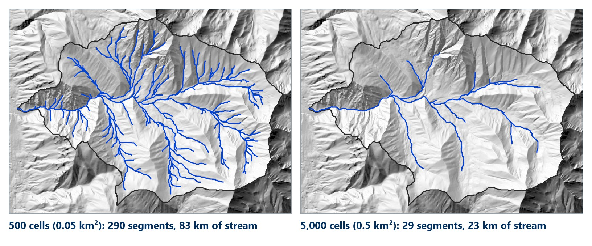
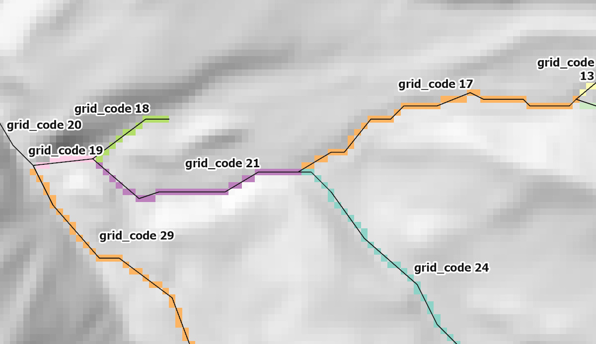
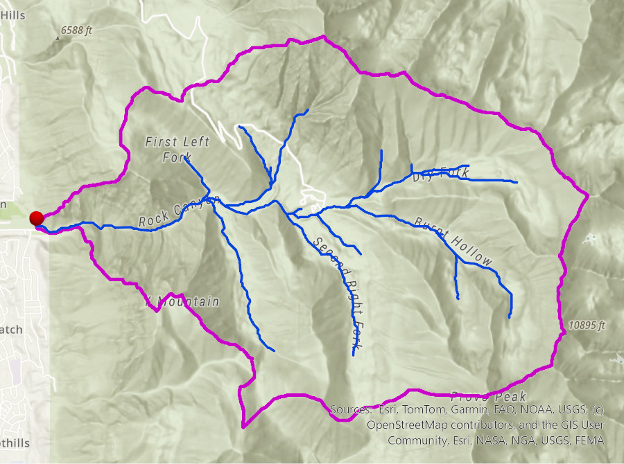
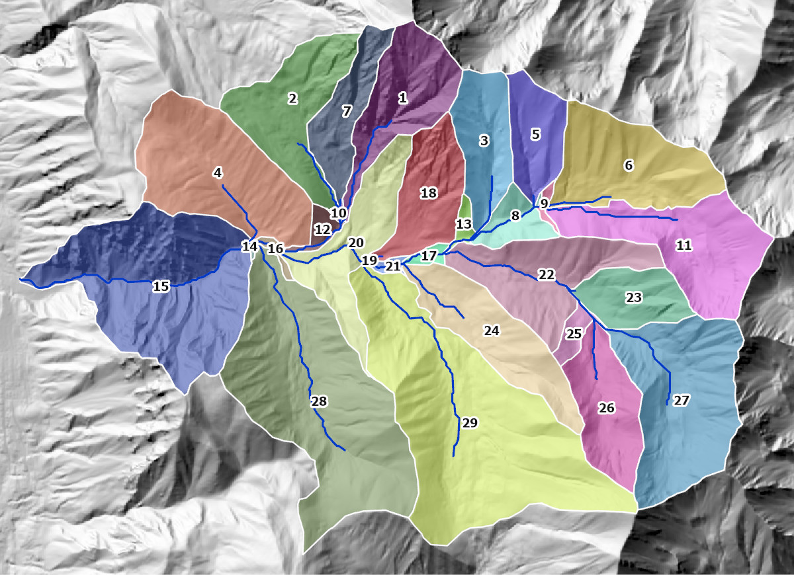
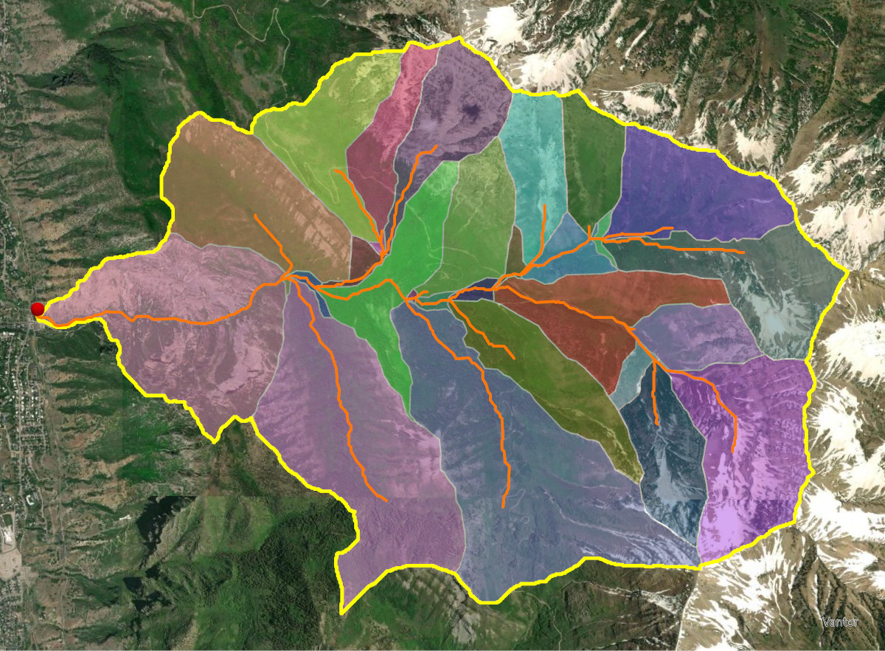

<!-- _class: lead -->
<!-- _paginate: skip -->

# Watershed Delineation

## Part B — From Flow Direction to Watersheds

CE 414 Engineering Applications of GIS
Civil & Construction Engineering
Brigham Young University
Dr. Dan Ames

<!-- Thursday of Week 6. Tuesday (Part A, watershed-delineation-a.md) covered what a watershed is and why water is managed by them, then the first three of the eight steps, ending on the flow direction grid. Today runs in three movements: how watersheds used to be delineated by hand, the same job done by USGS StreamStats, and then the rest of the eight steps (flow accumulation, the stream threshold, stream links, pour points and watersheds) finished in the Lab 5 ArcGIS Pro model. -->

<!-- stamp:begin -->
<!-- _footer: 'CE 414 · Week 6 — Watershed Delineation Part BLast Updated: 2026-10-05© 2026 Daniel P. Ames · <a href="https://creativecommons.org/licenses/by/4.0/">CC BY 4.0</a>' -->
<!-- stamp:end -->

---

# Today's Goals

By the end of class you should be able to:

- Delineate a watershed **by hand** and with **StreamStats**, and say what the automated result buys you
- Put the **eight steps** in order, and say why each needs the one before
- Explain what a **flow accumulation** grid counts, and how a **threshold** turns it into a stream network
- Say why a watershed is always the watershed **of a pour point**
- Say why a pour point must be **snapped** onto the channel

<!-- One goal per question on the closing quiz (Follow the Water), in the same order. The map at right is where Lab 5 ends up: Rock Canyon's basin cut into one subwatershed per stream link. Set the frame: first by hand, then StreamStats, then every remaining step as one raster operation reading the flow direction grid Tuesday built. Students who understand the chain can debug Lab 5; students who only memorize tool names cannot. -->

---

<!-- _class: lead -->

# Part 1 — Manual Watershed Delineation

<!-- Part 1 is hands-on and comes first: how watersheds were delineated before GIS — by hand, from contours — then the same basin from USGS StreamStats in thirty seconds, then the two compared, on the lab computers. Part 2 then opens the box StreamStats is: the rest of the eight steps, finished in the Lab 5 ArcGIS Pro model. -->

---

# Hog Pen Creek — Delineation by Hand

<!-- One click. First the quadrangle alone: a 4 km by 4 km topographic map with Hog Pen Creek running through it. Ask the class where the divide is. Everyone will point at the contour crenulations, which is exactly the right instinct. Then click to show the hand-drawn answer: the red line is the watershed divide, drawn by hand along the ridges. The rules: the divide crosses contours at right angles, it runs through high points, it never crosses the stream except at the outlet, and it closes on itself. The 20 ft and 100 ft contours, the stream center line and the outlet are labeled. This is how every watershed was delineated before GIS. -->
<!-- Credit: figure adapted from the watershed delineation course materials of D. Maidment, University of Texas at Austin. -->

---

<!-- _class: activity -->

# Watershed Delineation by Hand Digitizing — Let's Try It

- Open **ArcGIS Pro**
- Using your basemap, find **Hogle Zoo** in Salt Lake City — find **Emigration Creek**
- Create a new blank **polygon** shapefile
- Manually digitize the watershed that drains to this area by **clicking along ridge lines**
- **Save** your digitized watershed and compare with your neighbors

<!-- Give this about fifteen minutes. Turn on a hillshade or terrain basemap so ridges are visible. The comparison at the end is the point: five students will produce five different boundaries, which sets up the StreamStats comparison that follows. -->
<!-- TODO(graphic): an ArcGIS Pro screenshot of the Emigration Creek / Hogle Zoo area on a terrain basemap with a partially digitized polygon in progress. Not fabricated here; needs a real capture. -->
<!-- VERIFY: exact ArcGIS Pro path for creating a new blank polygon shapefile or feature class, so the step can name the pane and menu. -->

---

# Automated Watershed Delineation

- Let's use an automated tool provided by the U.S. Geological Survey called **StreamStats**
- Go to [https://streamstats.usgs.gov/ss/](https://streamstats.usgs.gov/ss/)

<!-- StreamStats runs this week's same eight steps on a pre-processed national DEM, then adds published regression equations for peak flows. Students are about to get in thirty seconds what took them fifteen minutes by hand. -->

---

# Automated Watershed Delineation

- Search for **Pioneer Monument State Park**, then click **"Utah"**

<!-- The state has to be selected first because the regression equations and the pre-processed terrain data are organized by state study area. The red circle marks the state selector. -->

---

# Automated Watershed Delineation

- Click **"Delineate"** and then click a point on the stream near Hogle Zoo

<!-- Two circled steps: activate the delineation tool, then place the pour point. Emphasize that clicking off the blue line gives a tiny nonsense basin. Part 2 meets the same problem with pour points in ArcGIS Pro, and fixes it by snapping. -->

---

<!-- _class: quiz -->

# Automated Watershed Delineation

- Wait for the magic…
- **How does it look?**
- **How does it compare to your manually delineated watershed?**

<!-- Collect answers before moving on. Expect the automated basin to be close on the ridges and different near the outlet, where the pour point placement dominates. Ask what would change if they had clicked 100 m upstream. -->

---

# Automated Watershed Delineation

- Click **"Download Basin"** and choose **"Shapefile"**
- This will download a **zipped shapefile** of the watershed to your downloads folder

<!-- The download is a zip containing the basin polygon and, depending on the options chosen, the flow-path lines. Students need this file for the comparison on the next slide. -->

---

<!-- _class: activity -->

# Compare the Two

- Let's compare it to the watershed you **manually delineated**
- **Unzip** the shapefile you downloaded and add it to your map in **ArcGIS Pro**
- **How does it compare?** The automated basin is **more consistent** — it repeats exactly — not necessarily more accurate
- Take a snapshot of this map, save it as an image file, and upload it to **Learning Suite** for today's classroom participation points

<!-- The deliverable is one image showing both polygons over the same basemap. Symbolize one as a hollow outline so both are visible. If time allows, have them compute the area of each and report the percent difference. -->
<!-- TODO(graphic): an ArcGIS Pro screenshot showing a hand-digitized polygon and the StreamStats basin overlaid on the Emigration Creek area, as the example of what a good submission looks like. Needs a real capture. -->

---

<!-- _class: lead -->

# Part 2 — Finish the Model in ArcGIS Pro

<!-- What StreamStats just did, opened up: steps 4 to 8 on the flow direction grid from Tuesday, then the Lab 5 ArcGIS Pro model that wires all eight together. -->

---

# Where We Left Off — the Flow Direction Tree

- Every cell holds a **D8 code**: which one of its eight neighbors its water goes to
- Linked up, the codes turn the grid into a **tree**: one way down from every cell, many ways in
- Every step today is a **question asked of that tree**: how much drains through here, which cells are streams, what drains to this point

<!-- Tuesday's last slide, as the bridge. Two minutes: have someone read one D8 code back to a compass direction before moving on. Then step 4. -->
<!-- Credit: figure adapted from the watershed delineation course materials of D. Maidment, University of Texas at Austin. -->

---

# Summary of Steps

<!-- Step 4. Flow accumulation walks the tree from the previous slide and counts how many cells drain into each cell. -->

---

# Flow Accumulation Grid — Esri convention

- A measure of the **drainage area** in units of grid cells
- **The cell itself is not included**

<!-- Follow one path with a finger: the ridge cells are 0, and the count grows downstream. Multiply a cell's value by the cell area to get drainage area in ground units. Note the zeros on the divides; that is the giveaway for the Esri convention. -->
<!-- Credit: figure adapted from the watershed delineation course materials of D. Maidment, University of Texas at Austin. -->

---

# Summary of Steps

<!-- Step 5. This is the step with a judgment call in it: the threshold is chosen, not computed. In ArcGIS Pro it is one Raster Calculator expression on flow accumulation, Con("Flow_Accumulation" > 5000, 1): 1 where the test is true and NoData everywhere else. Lab 5 adds a second test so only cells inside the delineated basin qualify. Leave out the third argument; Con(test, 1, 0) writes 0 instead of NoData and the next tool treats the whole DEM as stream. -->

---

# Flow Accumulation > 5 Cell Threshold

<!-- The outlined cells are the ones whose flow accumulation exceeds 5. That set is the stream network for this threshold. Nothing about the terrain changed; only the number we compared against. -->
<!-- Credit: figure adapted from the watershed delineation course materials of D. Maidment, University of Texas at Austin. -->

---

# Stream Network for 5 Cell Threshold Drainage Area

- All grid cells draining more than a **user-defined threshold value** (blue streams) are part of the stream network
- All grid cells located **downstream of user-defined cells** (red streams) are also part of the stream network

<!-- Two ways a cell joins the network: it passes the threshold, or it lies downstream of a point the user forced in (a gage, a culvert, a discharge location). The second rule is how you make the network include a channel the threshold would have missed. -->
<!-- Credit: figure adapted from the watershed delineation course materials of D. Maidment, University of Texas at Austin. -->

---

# Streams at Two Thresholds

- Same DEM, same flow accumulation: only the **threshold** changed, ten times over

<!-- Lab 5's own data, rendered in ArcGIS Pro: the Rock Canyon basin with a stream network at 500 cells (0.05 km² of contributing area on 10 m cells) and at 5,000 cells (0.5 km², the Lab 5 baseline). The counts are the lab's measured values: 290 segments and 83.2 km of stream at 500 cells, 29 segments and 22.9 km at 5,000. Nothing about the terrain changed; only the number we compared against. Ask what the "right" answer is; there isn't one, which is what Lab 5 Step 14 makes them test. -->
<!-- TODO(instructor): decide whether to add a scale/resolution sensitivity question here — e.g. how the delineated network and watershed change between a 30 m, a 10 m, and a 1 m lidar DEM, and whether the same cell threshold should be used. -->

---

# Summary of Steps

<!-- Step 6 is two tools. Stream Link gives every segment of the stream raster its own number (the next two slides). Stream to Feature then turns that numbered raster into line features that follow the flow direction, one line per link, so the network can be attributed, measured, and used by hydrologic models. Keep the Stream Link raster: it is also the input for the subwatersheds in step 8. -->

---

# Stream Segments

**Stream links** are the segments of a stream channel connecting

- two successive **junctions**,
- a junction and an **outlet**, or
- a **headwater** and a junction

<!-- The link is the unit of the vector stream network: one line feature, one record in the table. Junctions are where two links meet; every link has exactly one downstream end. -->
<!-- Credit: figure adapted from the watershed delineation course materials of D. Maidment, University of Texas at Austin. -->

---

# Stream Segments in a Cell Network

<!-- Each color is one stream link, and every cell in that link carries the same identifier. Left panel: colors. Right panel: the numbers actually stored in the raster. This identifier is the key that ties the raster network to the vector network on the next slide. -->
<!-- Credit: figure adapted from the watershed delineation course materials of D. Maidment, University of Texas at Austin. -->

---

# Vectorized Streams Linked Using Grid Code to Cell Equivalents

<!-- Lab 5's Stream_Links raster (one color per link) under its Stream to Feature lines, labeled with their grid_code field, rendered in ArcGIS Pro around a junction in the middle of Rock Canyon. Each line's grid_code is the value of the raster cells it was traced from: the vector line carries the link ID from the raster. That shared key is what lets you join raster-derived attributes, such as contributing area, to the line features. -->

---

# Summary of Steps

<!-- Step 7. A pour point is any cell you ask the Watershed tool to find the drainage area of. For one basin, it is the outlet you care about, moved onto the channel with Snap Pour Point (Lab 5 uses a 50 m snap distance). For subwatersheds you do not extract points at all: the Stream Link raster itself is the pour-point input, and each link, numbered in step 6, acts as the outlet of its own subwatershed. -->

---

# Watershed / Subwatershed Delineation

- Watershed delineation is the process of identifying the **drainage area of a point or set of points**
- Move the point downstream and the watershed **grows**; it always contains every watershed upstream of it

<svg xmlns="http://www.w3.org/2000/svg" viewBox="0 0 640 400" width="640" height="400" style="height:400px;width:auto;" font-family="Helvetica,Arial,sans-serif"><rect width="640" height="400" style="height:400px;width:auto;" rx="12" fill="#f4f1ea"/><path class="wsp-b" d="M540,355 C470,380 300,330 200,280 C110,240 60,150 90,80 C120,30 220,20 330,30 C430,40 560,60 590,150 C610,230 600,320 540,355Z" fill="#dbe8f5" stroke="#0062b8" stroke-width="2.5" stroke-dasharray="7 4"/><path class="wsp-a" d="M270,208 C230,240 160,230 120,190 C90,155 88,100 105,72 C135,40 200,38 250,60 C290,85 300,150 290,190 Z" fill="#9fc3e8" stroke="#002e5d" stroke-width="2.5"/><g fill="none" stroke="#0062b8" stroke-linecap="round"><path d="M120,75 C150,120 180,150 210,175 C240,195 270,205 300,230 C350,265 390,285 420,300 C470,325 510,340 540,352" stroke-width="5"/><path d="M190,60 C200,100 205,140 210,175" stroke-width="3"/><path d="M340,55 C330,120 315,180 300,230" stroke-width="3.5"/><path d="M540,110 C500,170 460,240 420,300" stroke-width="3.5"/><path d="M470,70 C480,120 490,140 500,170" stroke-width="2.5"/><path d="M110,150 C140,165 170,175 210,175" stroke-width="2.5"/></g><circle cx="270" cy="208" r="9" fill="#b3261e" stroke="#fff" stroke-width="2"/><text x="252" y="234" font-size="22" font-weight="700" fill="#b3261e">A</text><circle cx="540" cy="352" r="9" fill="#b3261e" stroke="#fff" stroke-width="2"/><text x="556" y="372" font-size="22" font-weight="700" fill="#b3261e">B</text><text class="wsp-ta" x="190" y="125" font-size="17" font-weight="700" fill="#002e5d" text-anchor="middle" style="paint-order:stroke" stroke="#9fc3e8" stroke-width="4">watershed of A</text><text class="wsp-tb" x="460" y="225" font-size="17" font-weight="700" fill="#0062b8" text-anchor="middle">watershed of B</text><text class="wsp-tb" x="460" y="246" font-size="14" fill="#0062b8" text-anchor="middle">(includes all of A's)</text></svg>

<!-- Say the definition slowly: a watershed is defined relative to a point. Change the point and you change the watershed. There is no such thing as "the" watershed of an area without an outlet. -->
<!-- The figure plays on entry: A's watershed fills first, then B's, which swallows A's. Ask before B appears: if I move the point to B, what happens to the boundary? Diagram, not a real basin. -->

---

# Watershed Outlet

- The **most downstream cells** of the stream segments are watershed outlets
- **User-defined points** (red dots) are also watershed outlets

<!-- Two sources of pour points: the ones the network gives you for free at the end of every link, and the ones you supply because you care about a specific location. In ArcGIS Pro, user-supplied points must be snapped onto the flow-accumulation network first, or the tool will return a watershed of a handful of cells. -->
<!-- Credit: figure adapted from the watershed delineation course materials of D. Maidment, University of Texas at Austin. -->

---

# Watershed Draining to an Outlet

- Using the outlet as a **pour point**, all cells that drain to the outlet are the watershed area. Linking the boundary cells forms the watershed boundary
- Watersheds are assigned the **identification number of their outlet**
- The **drainage area** of each watershed outlet is delineated

<!-- The algorithm is the reverse of flow accumulation: start at the pour point and walk upstream through the flow-direction tree, collecting every cell that eventually reaches it. The boundary falls out; it is never digitized. -->
<!-- Credit: figure adapted from the watershed delineation course materials of D. Maidment, University of Texas at Austin. -->

---

# Summary of Steps

<!-- Step 8, the payoff. The next three slides show what it looks like on real terrain. -->

---

# Watershed and Drainage Paths from a 10 m DEM

- The **automated method is more consistent** than hand delineation

<!-- Consistent, not necessarily more accurate. Two analysts hand-delineating the same basin will disagree; the algorithm will give the same answer every time from the same DEM and the same pour point. Change the DEM or move the pour point and the answer changes. The map is Lab 5's result on the topographic basemap: the basin above the Rock Canyon trailhead (magenta), its streams at 5,000 cells (blue) and the snapped outlet (red), rendered in ArcGIS Pro. Ask them to check the divide against the contours on the basemap. -->
<!-- TODO(instructor): decide whether to add a validation step here — comparing the delineated network and basin against the NHD or against a StreamStats basin for the same outlet — and what students should report when they disagree. -->

---

# Subwatersheds for Stream Segments

- Cells sharing the **same cell value** belong to the same subwatershed — the one draining to that stream link

<!-- The link identifier from the stream-links raster carries straight through into the watershed raster. That is why "same cell value" is written on the figure: the number on each subwatershed is the ID of the link it drains to. The map is Lab 5's 29 subwatersheds at 5,000 cells, each labeled with its gridcode, with the stream links in blue, rendered in ArcGIS Pro. -->

---

# Delineated Subwatersheds and Stream Networks

<!-- Every link in the network gets its own subwatershed, and together they tile the whole basin with no gaps and no overlaps. This is exactly the input a rainfall-runoff model wants: a set of subbasins, each with an area and a routing connection to the next one downstream. -->
<!-- The figure is Lab 5's own result on imagery: the basin above Rock Canyon (yellow) cut into one subwatershed per stream link, with the streams in orange and the outlet in red, rendered in ArcGIS Pro. -->

---

# Summary of Steps

<!-- All eight, start to finish. Ask the class to name the input and output of each step before moving on. -->

---

# Example Model

- The whole workflow, wired together once in **ModelBuilder**: this is the Lab 5 model, and it runs end to end on any DEM you give it

<!-- Same chain as the eight steps, now readable because they know every box. Trace it row by row. Surface: Fill, then Flow Direction (D8), then Flow Accumulation. Basin: Snap Pour Point moves the outlet up to 50 m onto the highest-accumulation cell, Watershed collects everything that drains to it, and Raster to Polygon turns Basin_Raster into one polygon. Streams: the threshold enters at Raster Calculator, Con(("%Basin_Raster%" >= 0) & ("%Flow_Accumulation%" > %Threshold%), 1), which keeps cells inside the basin whose flow accumulation exceeds the threshold; then Stream Link numbers the segments and Stream to Feature draws them as lines. Subwatersheds: a second Watershed uses the Stream Link raster as its pour points, so every link gets its own subwatershed, and a second Raster to Polygon with Create multipart features checked makes one polygon per link. Two things to point at: the threshold is applied to flow accumulation, never to the Watershed tool, and Flow_Direction feeds four different tools. The P marks are model parameters; students set them in Lab 5 Step 12. This is the Lab 5 model exported from ModelBuilder (Lab 5 Figure C); the gray oval is Flow Direction's optional drop raster, left empty. -->

---

# Back to Lab 5 — You Can Read the Whole Model Now

Lab 5 runs this week's eight steps on a real DEM in **ArcGIS Pro**, start to finish. What this week gives you for it:

- Why **Fill** comes first, and what breaks if you skip it
- How to read a **flow direction** code back to a compass direction
- That the stream **threshold** is a choice you make, applied to **flow accumulation** — not something the Watershed tool decides
- That a watershed is always the watershed **of a pour point**

[Lab 5 — Watershed Delineation](https://byu-hydroinformatics.github.io/ce414-gis-applications/assignments/lab-05/)

<!-- The layout at right is the Lab 5 example map, the baseline run of the model. The single most common lab failure is an unsnapped pour point producing a watershed of a few cells. Say so now. -->

---

# Next Week — Where Rock Canyon's Water Ends Up

- Rock Canyon drains to Utah Lake, the Jordan River, and finally the **Great Salt Lake** — a lake with **no outlet**
- When a lake has no outlet, its **level** is its water balance: everything that comes in, minus what evaporates
- Next week: **lake bathymetry**, and **Lab 6 — Lake Depth Explorer** — what the Great Salt Lake's shoreline looks like at every water level

<!-- The bridge to Week 7. The Great Salt Lake subregion (HUC4 1602) on the map at right is the basin Rock Canyon belongs to. A terminal lake turns the water-balance slide into one number students can see from the freeway: the water surface elevation. Lab 6 is built on that idea. -->

---

# Before Next Class

- **Lab 5 — Watershed Delineation** is due **Saturday 11:59 pm** — [Lab 5](https://byu-hydroinformatics.github.io/ce414-gis-applications/assignments/lab-05/)
- Take **Quiz 6** (Watershed Delineation, open book) on Learning Suite — due **Saturday 11:59 pm**
- **Lab 6 — Lake Depth Explorer** is next — [Lab 6](https://byu-hydroinformatics.github.io/ce414-gis-applications/assignments/lab-06/)
- Questions? Office hours: [calendly.com/dan-ames/office-hours](https://calendly.com/dan-ames/office-hours)

<!-- Revision notes (2026-10-05, later): the two parts were swapped so class runs manual delineation, then StreamStats, then the ArcGIS Pro steps. Part 1 is now "Manual Watershed Delineation" (the two Hog Pen Creek slides merged into one, the hand-drawn divide revealed on a click, then the Emigration Creek activity and the StreamStats slides); Part 2 is steps 4 to 8, the Example Model and Back to Lab 5. The StreamStats goal moved to the top of Today's Goals, and its question moved to the top of the Follow the Water quiz, so goals and questions stay in the same order. -->
<!-- Restructure notes (2026-10-05): this deck now opens at step 4 (flow accumulation), carrying steps 4 to 8, the Example Model and the Back to Lab 5 slide over from Part A, and keeps the hand-versus-StreamStats delineation. Its old Part 1 (what a watershed is, Powell, anatomy, nesting, water balance, functions) moved to the start of Part A. See the restructure notes in watershed-delineation-a.md. -->
<!-- Split notes (2026-10-01): this deck is Parts 2 and 3 of the original Week 6 deck (source "CE 414 Week 6 - Watershed Delineation.pptx"; its conversion notes stay in watershed-delineation.md). New here: the title and goals, the "Watersheds Nest" map (USGS WBD units around Rock Canyon, replacing a 490 px management-units diagram), the water-balance figure (on Lab 5's basin outline, replacing two small hydrologic-cycle images), the terrain-processing panels rebuilt from Lab 5's data (replacing a 584 px nine-panel figure), and the bridge to Week 7. Figures from tools/week06_figures.py and tools/week06_water_balance_svg.py. Still third-party and small: the Orange County watershed diagram (450 px) and the processes-and-functions diagram (600 px); kept because they are sourced illustrations, flagged for replacement. -->

---

<!-- _class: activity -->

# One Last Thing — Follow the Water

Five questions, one for each of today's goals: what StreamStats buys you, the order of the steps, the threshold, the watershed of a point, and snapping. **Scan the code**, or open the link below.

- Not graded, nothing recorded — it is a check that today landed
- Every answer explains itself; read the explanation before you move on
- The two it drills hardest — the **pour point** and **snapping** it — decide whether Lab 5 takes an hour or an afternoon

byu-hydroinformatics.github.io/ce414-gis-applications/quizzes/basins/

<!-- Four minutes, in pairs, then a show of hands on the consistent-versus-accurate item: most of the room will say the automated basin is more accurate, and the deck's claim is narrower than that. The threshold item is the other one worth a word: raising it thins the network, and nothing about the terrain changed. If the room has no signal, put the URL on the board; the items read aloud just as well. -->
