<!-- _class: lead -->
<!-- _paginate: skip -->

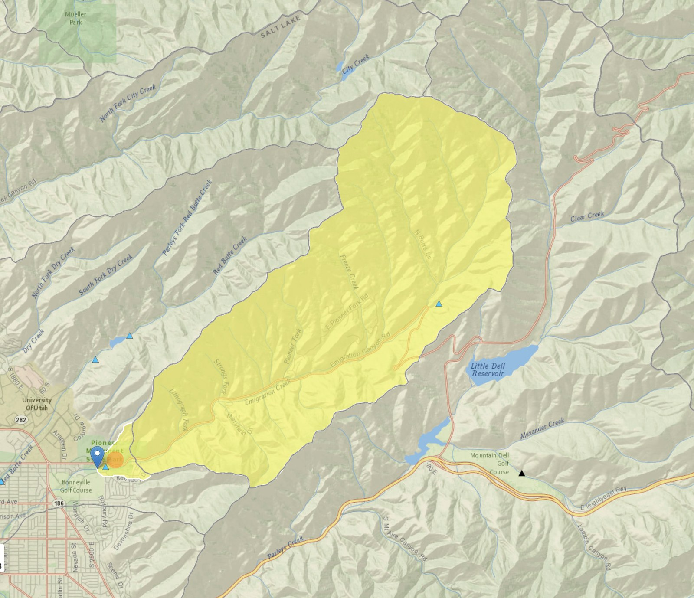

# Hydrologic Terrain Analysis

Engineering Applications of GIS
CE 414
Dr. Dan Ames

<small>Some slides adapted from David Maidment, Center for Water Resources Research, UT Austin, and Orange County Department of Public Works</small>

<!-- Week 6 runs in three parts: (1) the eight-step terrain-analysis workflow, cell by cell; (2) what a watershed actually is and why we care; (3) a hands-on comparison of hand delineation against USGS StreamStats. Lab 5 applies all of it in ArcGIS Pro. -->
<!-- VERIFY: source deck credits "Center for Water Resources Research, UT Austin"; confirm the exact center name before publishing. -->

---

# Today's Goals

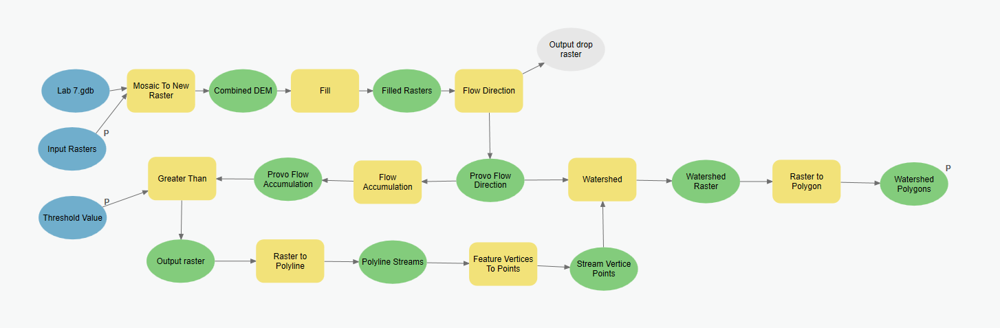

By the end of class you should be able to:

- Walk through the **eight steps** that turn a DEM into streams and watersheds
- Compute a **D8 flow direction** by hand and read Esri's direction codes
- Explain what a **flow accumulation** grid counts, and how a **threshold** turns it into a stream network
- Define a **watershed**, an **outlet**, and a **pour point**
- Delineate a watershed two ways — **by hand** and with **StreamStats** — and compare them

<!-- Set the frame: everything in Part 1 is one raster operation feeding the next. Students who understand the chain can debug Lab 5; students who only memorize tool names cannot. -->

---

<!-- _class: lead -->

# Part 1 — From a DEM to Streams and Watersheds

<!-- Part 1 is the algorithm. We do it on paper and in Excel first, then let ArcGIS Pro do it at scale. -->

---

# Watershed Delineation

**This week's big question:**

## How do you get a watershed and a stream network from a DEM?

<!-- The diagram on the right is the answer in one picture: a chain of raster tools. We come back to it at the end of Part 1 as the "Example Model" slide. Do not walk through it yet; just let them see that the answer is a pipeline, not a single button. -->

---

<!-- _class: activity -->

# In Class Activity

- Let's try doing the key step, **D8 Flow Direction**, in Excel

<!-- Hand out or project a small elevation grid and have students compute the steepest-descent neighbor for each interior cell, then write the Esri direction code. Doing it once by hand is what makes the Flow Direction tool make sense later. -->

---

# Summary of Steps

1. **Get DEM (mosaic and project as needed)**
2. Fill Pits
3. Compute Flow Direction
4. Compute Flow Accumulation
5. Find cells that exceed a threshold
6. Convert raster streams to polylines
7. Find polyline outlets (points)
8. Delineate watersheds

<!-- This roadmap slide comes back eight more times, each time with the current step in bold. Step 1: get the elevation data, mosaic tiles together if the area of interest spans more than one, and project into a coordinate system with real ground units so cell size means something. -->

---

# Elevation Surface

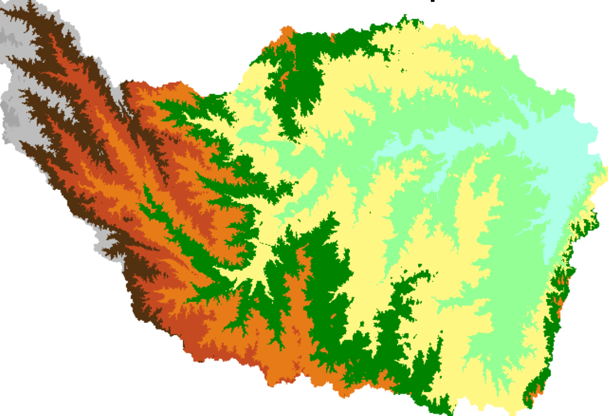

- **Elevation Surface** — the ground surface elevation at each point
- **Digital Elevation Model** — a digital representation of an elevation surface. Examples include a (square) digital elevation grid, triangular irregular network, set of digital line graph contours, or random points

<!-- Point out that "DEM" in this course almost always means the square grid, but the definition is broader. The distinction matters in step 1: a TIN or a contour set has to be converted to a grid before any of the following steps will run. -->

---

# Summary of Steps

1. Get DEM (mosaic and project as needed)
2. **Fill Pits**
3. Compute Flow Direction
4. Compute Flow Accumulation
5. Find cells that exceed a threshold
6. Convert raster streams to polylines
7. Find polyline outlets (points)
8. Delineate watersheds

<!-- Step 2. In ArcGIS Pro this is the Fill tool in the Spatial Analyst Hydrology toolset. -->

---

# Filling in the Pits

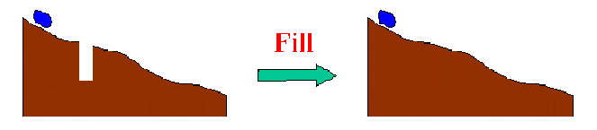

- DEM creation results in **artificial pits** in the landscape
- A pit is a set of one or more cells which has **no downstream cells** around it
- Unless these pits are filled they become **sinks** and isolate portions of the watershed
- **Pit filling** is the first thing done with a DEM

<!-- Most pits are artifacts of how the DEM was made, not real closed depressions. Water routed into an unfilled pit has nowhere to go, so flow accumulation downstream of it collapses and the stream network breaks into disconnected pieces. Real closed basins exist too, which is why Fill has an optional z-limit. -->

---

# Effect of Pit Filling on Elevation

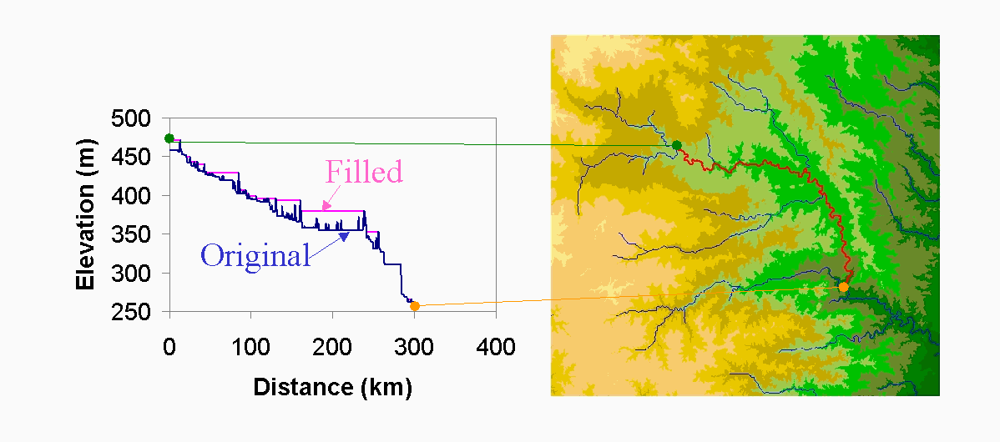

<!-- The profile shows the filled surface sitting slightly above the original in exactly the places where the original dipped. Filling raises elevations; it never lowers them. The map at right shows how small the affected area usually is relative to the whole DEM. -->

---

# Summary of Steps

1. Get DEM (mosaic and project as needed)
2. Fill Pits
3. **Compute Flow Direction**
4. Compute Flow Accumulation
5. Find cells that exceed a threshold
6. Convert raster streams to polylines
7. Find polyline outlets (points)
8. Delineate watersheds

<!-- Step 3, the heart of the method, and the step the Excel activity walks through by hand. -->

---

# Standard Slope Function

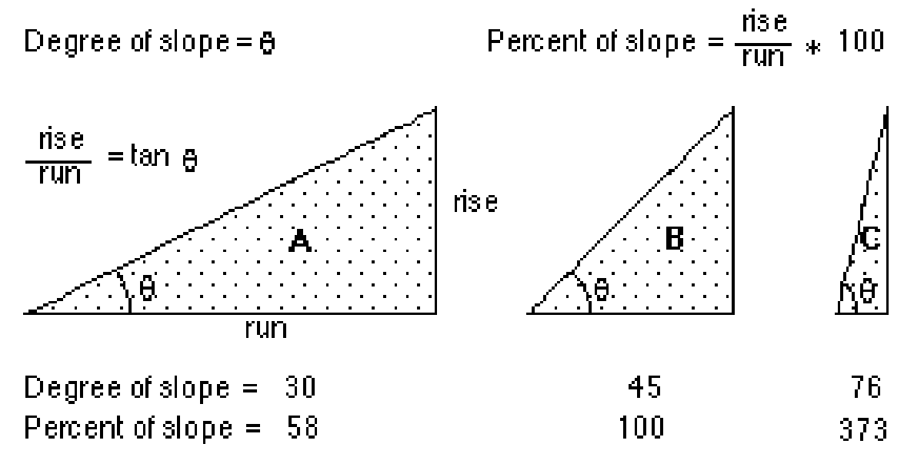

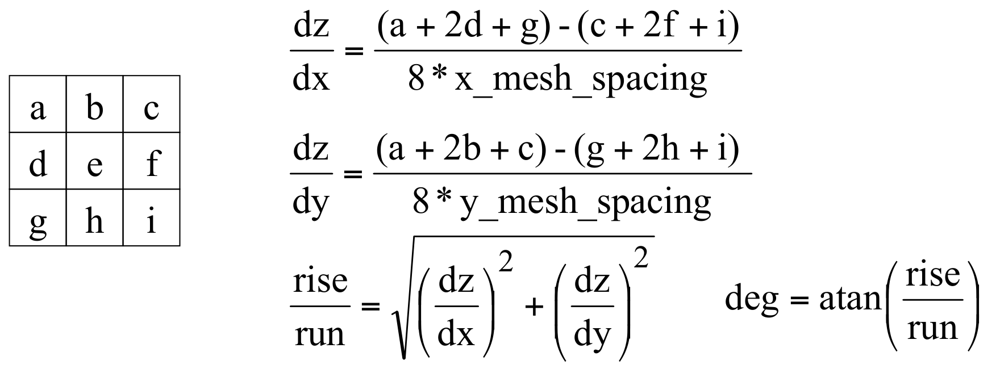

<!-- This is the ordinary Slope tool: it fits a plane through all eight neighbors of a cell using a 3-by-3 window (a through i) and reports one slope magnitude and one aspect. It is a smoothed, averaged answer. The next slide shows why hydrology needs a different question. -->

---

# Hydrologic Slope — Direction of Steepest Descent

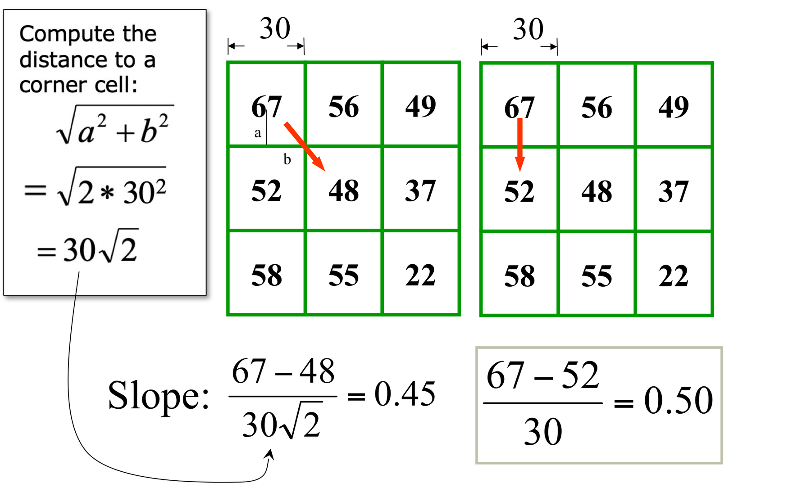

- Keeps the **steepest** of the eight neighbors — it does not average them
- The run to a **diagonal** neighbor is longer: divide by `30·√2`, not by `30`
- Diagonal: 19 / 42.4 = **0.45**. Straight down: 15 / 30 = **0.50**. Flow goes **south**

<!-- Work this one live. The trap students fall into is comparing raw elevation differences and picking the diagonal because 19 is bigger than 15. Slope is rise over run, and the run is longer on the diagonal. The 30 here is the cell size in meters. -->

---

# Eight Direction Pour Point Model

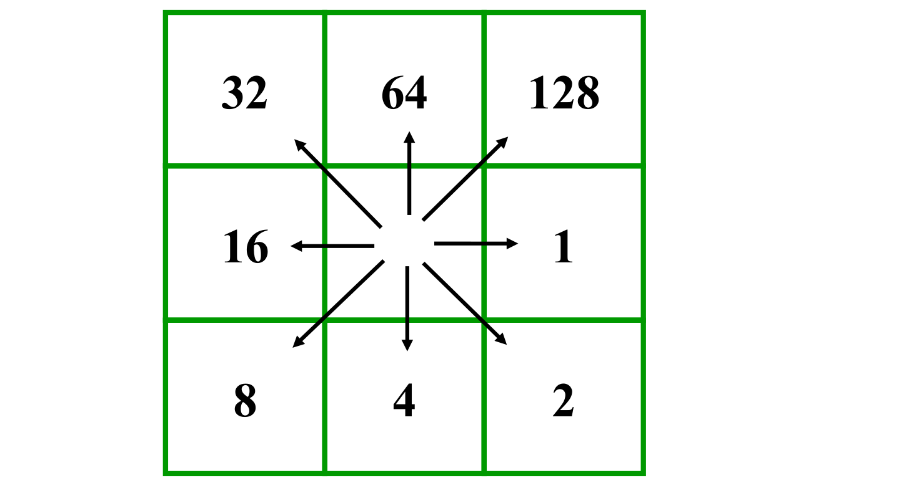

**Esri direction encoding (ArcGIS)** — each of the eight neighbors gets a power of two: `1, 2, 4, 8, 16, 32, 64, 128`

<!-- Reading the diagram clockwise from east: 1 = east, 2 = southeast, 4 = south, 8 = southwest, 16 = west, 32 = northwest, 64 = north, 128 = northeast. Powers of two are used so that multiple directions could in principle be summed into one value, which is how the tool reports unresolved flat areas. Students only need to be able to read the code back to a compass direction. -->

---

# Eight Direction Pour Point Model — D8

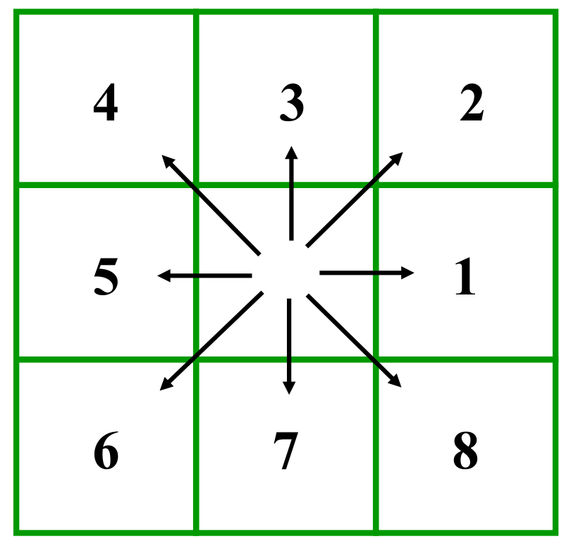

**Non-Esri direction encoding (QGIS, TauDEM, GRASS)** — the same eight neighbors numbered `1` through `8`

<!-- Same algorithm, different numbers on the output raster. This matters the moment students move a flow-direction grid between ArcGIS Pro and TauDEM or QGIS: the raster looks fine and every downstream result is wrong. Always regenerate flow direction in the software you are going to route with. -->

---

# Flow Direction Grid

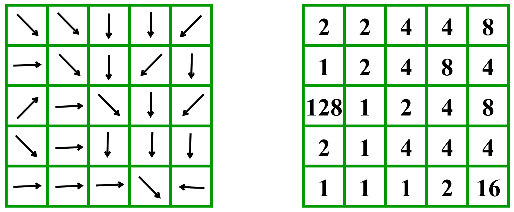

- Water flows to one of its neighbor cells according to the direction of the **steepest descent**
- Flow direction takes **one out of eight** possible values

<!-- Left panel: the direction as an arrow. Right panel: the same grid as Esri codes. These are the same raster drawn two ways. Have students check one or two cells against the encoding diagram. -->

---

# Flow Direction Grid

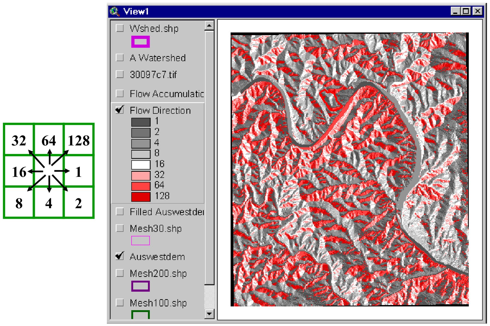

<!-- A real flow-direction raster symbolized by its eight code values, with the direction key at left. The point is the texture: neighboring cells often share a direction, and the bands you see are hillslopes draining the same way. This screenshot is from the ArcView era; it is kept for the concept, not for the interface. -->

---

# Grid Network

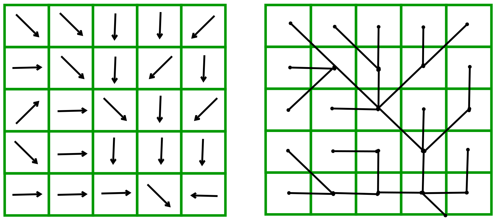

<!-- Connect every cell to the neighbor its arrow points at and the whole grid becomes a tree: every cell has exactly one downstream neighbor, and many upstream ones. Every remaining step in the workflow is a question you ask about this tree. -->

---

# Summary of Steps

1. Get DEM (mosaic and project as needed)
2. Fill Pits
3. Compute Flow Direction
4. **Compute Flow Accumulation**
5. Find cells that exceed a threshold
6. Convert raster streams to polylines
7. Find polyline outlets (points)
8. Delineate watersheds

<!-- Step 4. Flow accumulation walks the tree from the previous slide and counts how many cells drain into each cell. -->

---

# Flow Accumulation Grid — Esri convention

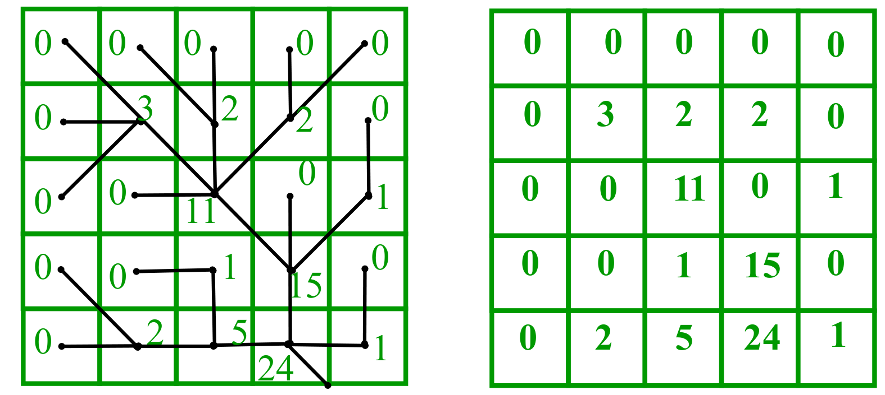

- A measure of the **drainage area** in units of grid cells
- **The cell itself is not included**

<!-- Follow one path with a finger: the ridge cells are 0, and the count grows downstream. Multiply a cell's value by the cell area to get drainage area in ground units. Note the zeros on the divides; that is the giveaway for the Esri convention. -->

---

# Contributing Area (Flow Accumulation) Grid — TauDEM convention

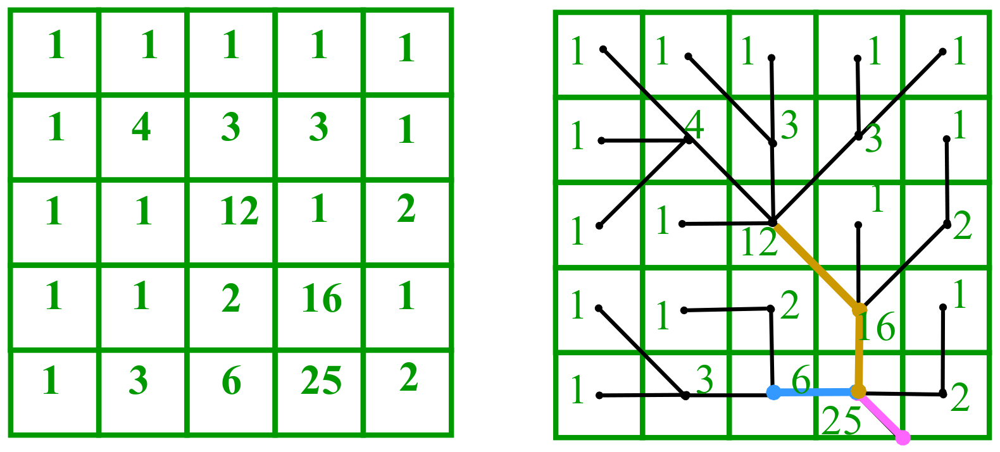

- Same algorithm, but **the cell itself is counted**, so every cell is at least `1`
- Every value is exactly **one greater** than the Esri value for the same cell

<!-- Compare the two grids side by side with the previous slide: 0 becomes 1, 3 becomes 4, 24 becomes 25. Worth mentioning because a threshold tuned in one convention is off by one in the other, and because published contributing-area figures rarely say which convention they used. -->

---

# Summary of Steps

1. Get DEM (mosaic and project as needed)
2. Fill Pits
3. Compute Flow Direction
4. Compute Flow Accumulation
5. **Find cells that exceed a threshold**
6. Convert raster streams to polylines
7. Find polyline outlets (points)
8. Delineate watersheds

<!-- Step 5. This is the step with a judgment call in it: the threshold is chosen, not computed. -->

---

# Flow Accumulation > 5 Cell Threshold

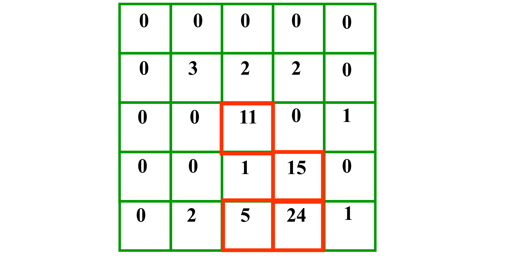

<!-- The outlined cells are the ones whose flow accumulation exceeds 5. That set is the stream network for this threshold. Nothing about the terrain changed; only the number we compared against. -->

---

# Stream Network for 5 Cell Threshold Drainage Area

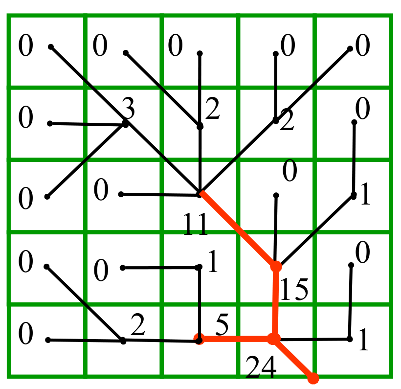

- All grid cells draining more than a **user-defined threshold value** (blue streams) are part of the stream network
- All grid cells located **downstream of user-defined cells** (red streams) are also part of the stream network

<!-- Two ways a cell joins the network: it passes the threshold, or it lies downstream of a point the user forced in (a gage, a culvert, a discharge location). The second rule is how you make the network include a channel the threshold would have missed. -->

---

# Streams with 200 cell Threshold

## (>18 hectares or 13.5 acres drainage area)

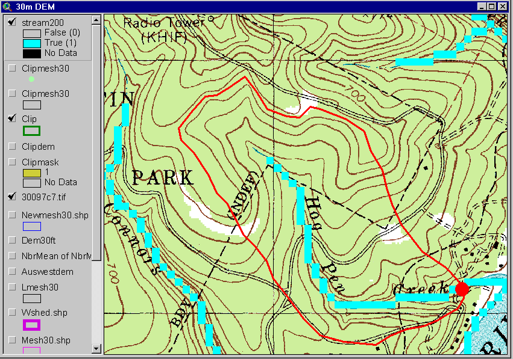

<!-- Raising the threshold from 5 cells to 200 thins the network dramatically: only channels with substantial drainage area survive. Ask what the "right" answer is; there isn't one, which is why the next question matters. -->
<!-- TODO(instructor): the source slide states "200 cell Threshold (>18 hectares or 13.5 acres drainage area)". Kept verbatim. On a 30 m DEM, 200 cells = 180,000 m2 = 18 ha, which is about 44.5 acres, not 13.5. Decide whether to correct the acreage, drop it, or state the cell size the figure assumes. -->
<!-- TODO(instructor): decide whether to add a scale/resolution sensitivity question here — e.g. how the delineated network and watershed change between a 30 m, a 10 m, and a 1 m lidar DEM, and whether the same cell threshold should be used. -->
<!-- Screenshot is ArcView-era; kept because no ArcGIS Pro equivalent has been captured. -->

---

# Summary of Steps

1. Get DEM (mosaic and project as needed)
2. Fill Pits
3. Compute Flow Direction
4. Compute Flow Accumulation
5. Find cells that exceed a threshold
6. **Convert raster streams to polylines**
7. Find polyline outlets (points)
8. Delineate watersheds

<!-- Step 6. The stream raster becomes vector line features so it can be attributed, measured, and used by hydrologic models. -->

---

# Stream Segments

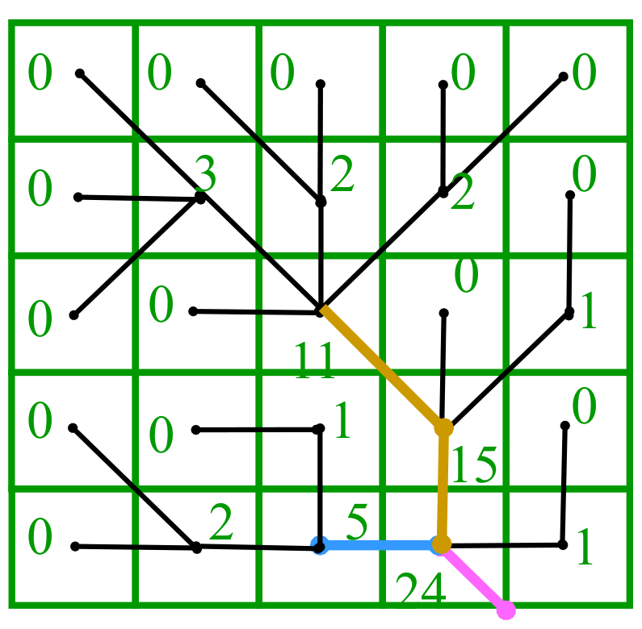

**Stream links** are the segments of a stream channel connecting

- two successive **junctions**,
- a junction and an **outlet**, or
- a **headwater** and a junction

<!-- The link is the unit of the vector stream network: one line feature, one record in the table. Junctions are where two links meet; every link has exactly one downstream end. -->

---

# Stream Segments in a Cell Network

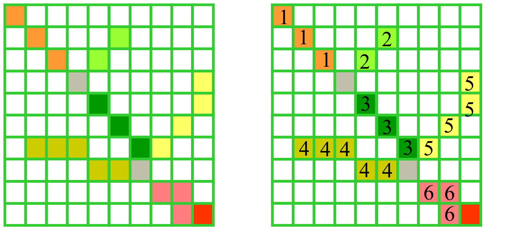

<!-- Each color is one stream link, and every cell in that link carries the same identifier. Left panel: colors. Right panel: the numbers actually stored in the raster. This identifier is the key that ties the raster network to the vector network on the next slide. -->

---

# Vectorized Streams Linked Using Grid Code to Cell Equivalents

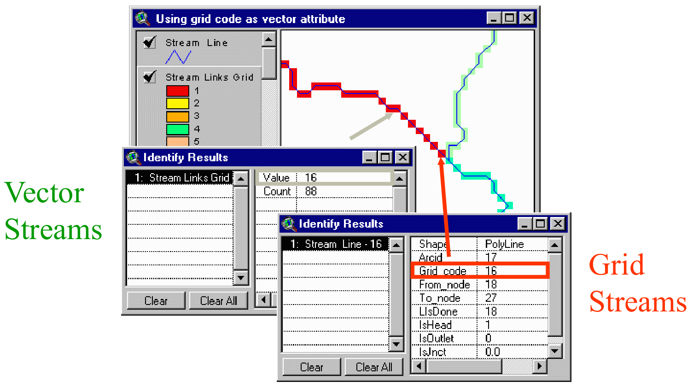

<!-- Identify the same feature in both layers and the grid code matches: the vector line carries the link ID from the raster. That shared key is what lets you join raster-derived attributes, such as contributing area, to the line features. This screenshot is from the ArcView era. -->

---

# Summary of Steps

1. Get DEM (mosaic and project as needed)
2. Fill Pits
3. Compute Flow Direction
4. Compute Flow Accumulation
5. Find cells that exceed a threshold
6. Convert raster streams to polylines
7. **Find polyline outlets (points)**
8. Delineate watersheds

<!-- Step 7. Every link's downstream end becomes a point; those points are the pour points for step 8. -->

---

# Watershed / Subwatershed Delineation

- Watershed delineation is the process of identifying the **drainage area of a point or set of points**

<!-- Say the definition slowly: a watershed is defined relative to a point. Change the point and you change the watershed. There is no such thing as "the" watershed of an area without an outlet. -->
<!-- TODO(graphic): a simple figure showing one outlet point on a stream with its contributing area shaded, and a second point further downstream with a larger shaded area, to make "watershed of a point" concrete. -->

---

# Watershed Outlet

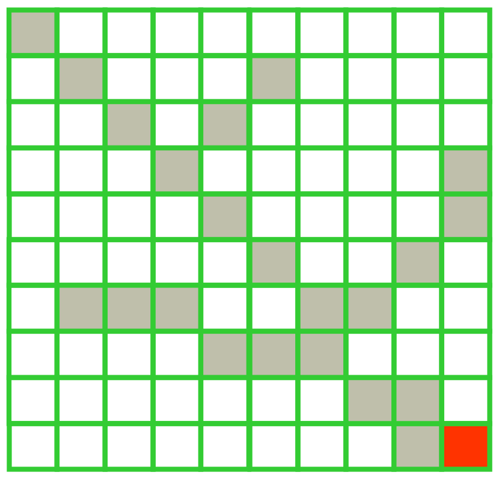

- The **most downstream cells** of the stream segments are watershed outlets
- **User-defined points** (red dots) are also watershed outlets

<!-- Two sources of pour points: the ones the network gives you for free at the end of every link, and the ones you supply because you care about a specific location. In ArcGIS Pro, user-supplied points must be snapped onto the flow-accumulation network first, or the tool will return a watershed of a handful of cells. -->

---

# Watershed Draining to an Outlet

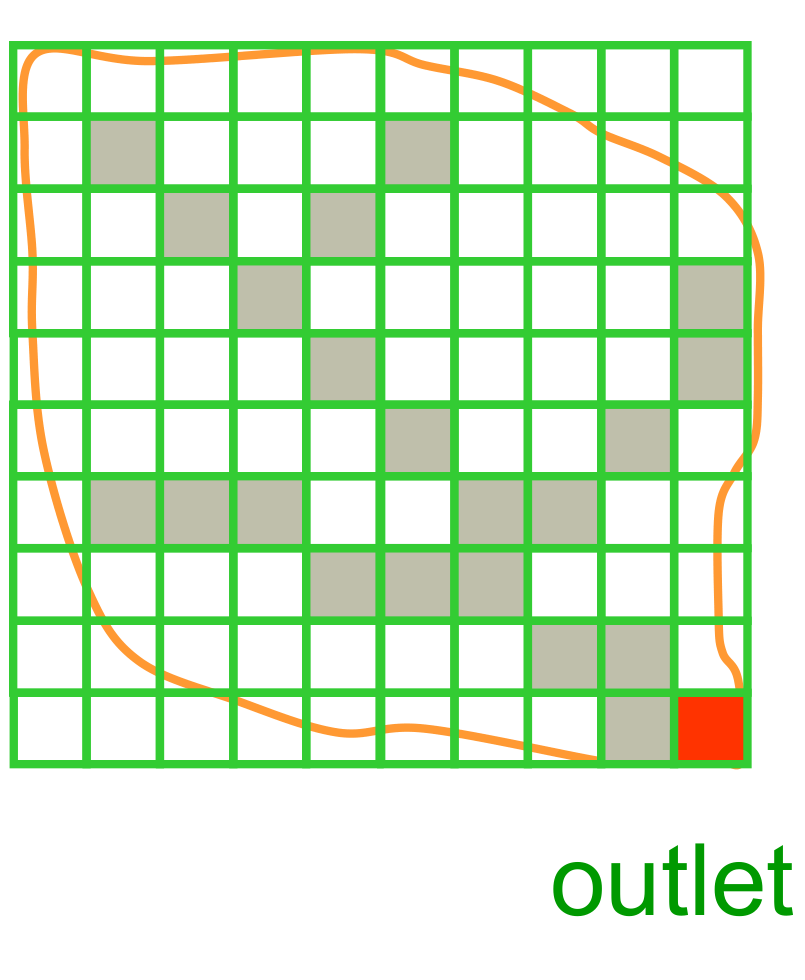

- Using the outlet as a **pour point**, all cells that drain to the outlet are the watershed area. Linking the boundary cells forms the watershed boundary
- Watersheds are assigned the **identification number of their outlet**
- The **drainage area** of each watershed outlet is delineated

<!-- The algorithm is the reverse of flow accumulation: start at the pour point and walk upstream through the flow-direction tree, collecting every cell that eventually reaches it. The boundary falls out; it is never digitized. -->

---

# Summary of Steps

1. Get DEM (mosaic and project as needed)
2. Fill Pits
3. Compute Flow Direction
4. Compute Flow Accumulation
5. Find cells that exceed a threshold
6. Convert raster streams to polylines
7. Find polyline outlets (points)
8. **Delineate watersheds**

<!-- Step 8, the payoff. The next three slides show what it looks like on real terrain. -->

---

# Watershed and Drainage Paths from a 30 m DEM

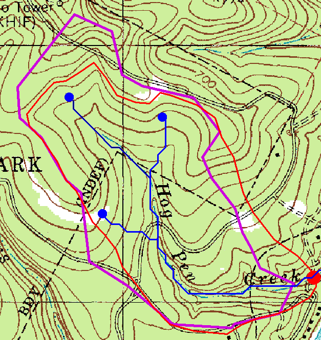

- The **automated method is more consistent** than hand delineation

<!-- Consistent, not necessarily more accurate. Two analysts hand-delineating the same basin will disagree; the algorithm will give the same answer every time from the same DEM and the same pour point. Change the DEM or move the pour point and the answer changes. -->
<!-- TODO(instructor): decide whether to add a validation step here — comparing the delineated network and basin against the NHD or against a StreamStats basin for the same outlet — and what students should report when they disagree. -->

---

# Subwatersheds for Stream Segments

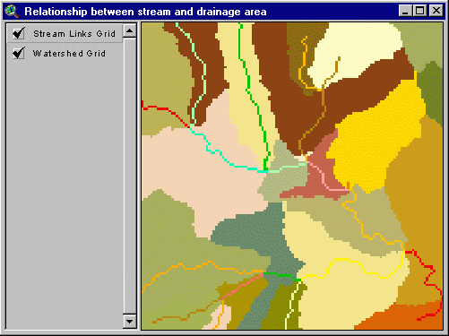

- Cells sharing the **same cell value** belong to the same subwatershed — the one draining to that stream link

<!-- The link identifier from the stream-links raster carries straight through into the watershed raster. That is why "same cell value" is written on the figure: the color of a subwatershed matches the ID of the link it drains to. This screenshot is from the ArcView era. -->

---

# Delineated Subwatersheds and Stream Networks

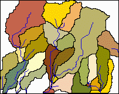

<!-- Every link in the network gets its own subwatershed, and together they tile the whole basin with no gaps and no overlaps. This is exactly the input a rainfall-runoff model wants: a set of subbasins, each with an area and a routing connection to the next one downstream. -->
<!-- TODO(graphic): this figure is only 203 x 161 px in the source deck and is soft on a projector. A replacement export at presentation resolution would help. -->

---

# Summary of Steps

1. Get DEM (mosaic and project as needed)
2. Fill Pits
3. Compute Flow Direction
4. Compute Flow Accumulation
5. Find cells that exceed a threshold
6. Convert raster streams to polylines
7. Find polyline outlets (points)
8. Delineate watersheds

<!-- All eight, start to finish. Ask the class to name the input and output of each step before moving on. -->

---

# Example Model

- The whole workflow, wired together once in **ModelBuilder**, runs end to end on any DEM you give it

<!-- Same diagram as the second slide, now readable because they know every box. Trace the chain: Fill, then Flow Direction, then Flow Accumulation, then Greater Than for the threshold, then Stream Link and Raster to Polyline, then Feature Vertices To Points for the outlets, then Watershed, then Raster to Polygon. Note that the threshold enters at the Greater Than box, operating on flow accumulation, and that the Watershed tool takes flow direction plus pour points. -->

---

<!-- _class: lead -->

# Part 2 — What Is a Watershed, and Why Care?

<!-- Source deck labels this "Hydrologic Terrain Analysis Day 2". Part 1 was the algorithm; Part 2 is what the algorithm is for. -->

---

# Hydrologic Terrain Processing

- Begin with a **Digital Elevation Model (DEM)**
- **Goal 1:** generate a polyline **stream network** — a "potential flow path network"
- **Goal 2:** generate polygon **watershed boundaries**
- **Motive:** generally to create input data sets for hydrologic and watershed modeling tools, i.e. for rainfall-runoff prediction modeling

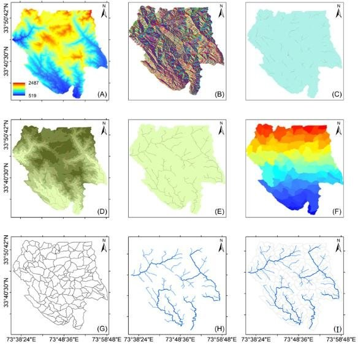

<!-- "Potential flow path network" is the honest phrase: the algorithm returns where water would go on this surface, which is not the same as where a channel exists. That gap is why validation against mapped hydrography matters. -->

---

# What Is a Watershed?

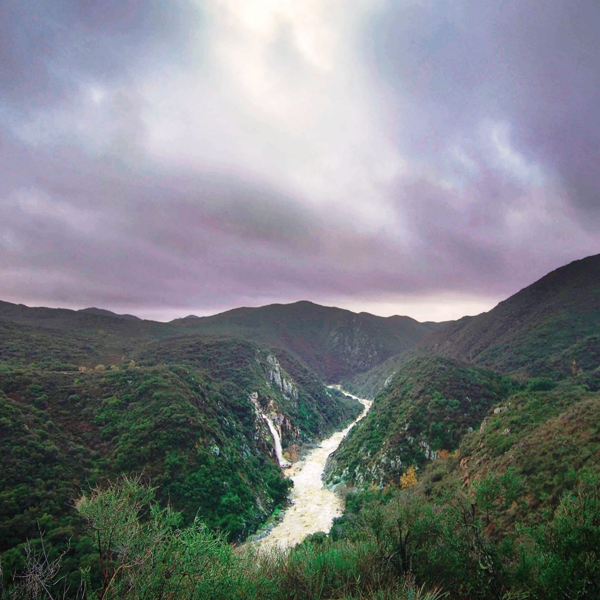

- A watershed is the **area of land where all of the water that drains off of it goes into the same place** (i.e. an "outlet")
- John Wesley Powell's definition: a bounded hydrologic system within which all living things are linked by their common water course, and around which, as humans settled, communities formed
- Watersheds come in all shapes and sizes. They cross city, state, and national boundaries
- No matter where you are, you're in a watershed!

<!-- Powell's definition is quoted in full on the source slide; it is paraphrased here. Read the original aloud if you want it. The engineering definition and Powell's social one describe the same boundary and are worth contrasting. -->

---

# Remember This Map?

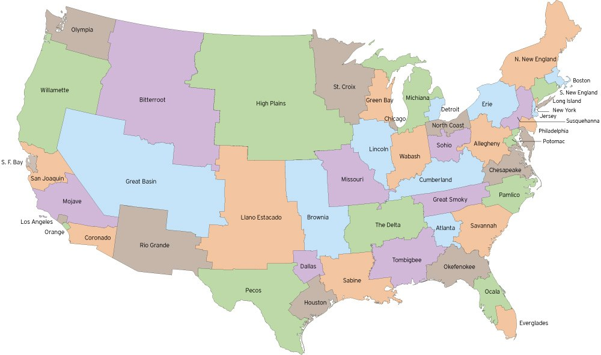

<!-- Some people have proposed that the 50 states be redivided based on population. What's wrong with this from a hydrology point of view? Water doesn't follow straight-line political boundaries. Let them answer before you say it. -->

---

# John Wesley Powell

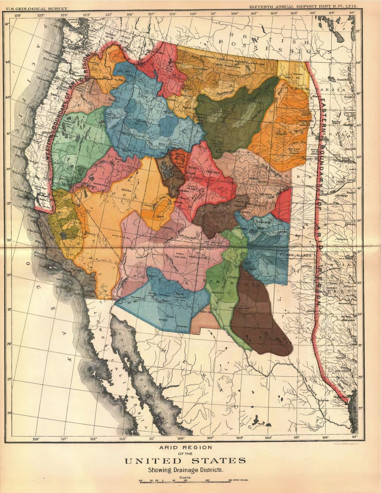

- **Major John Wesley Powell**, a Civil War veteran, ethnographer, and second director of the United States Geological Survey from 1881 to 1894
- Proposed that western states be brought into the union around **watershed boundaries**

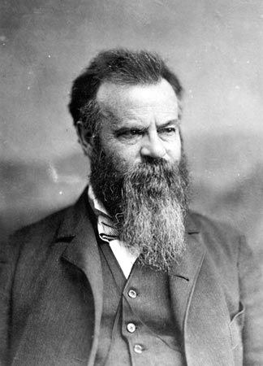

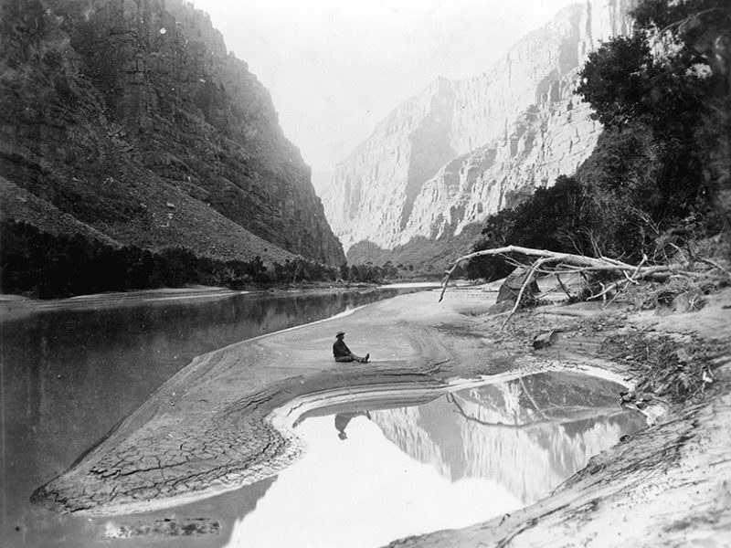

<!-- Powell's 1890 map of the arid region divided the West into drainage basins rather than rectangles. Congress ignored it. A century of interstate water compacts and litigation followed. Background reading: https://brandonletsinger.com/biography/the-united-watershed-states-of-america-a-biography-of-john-wesley-powell/ -->

---

# Why Watersheds Are Important

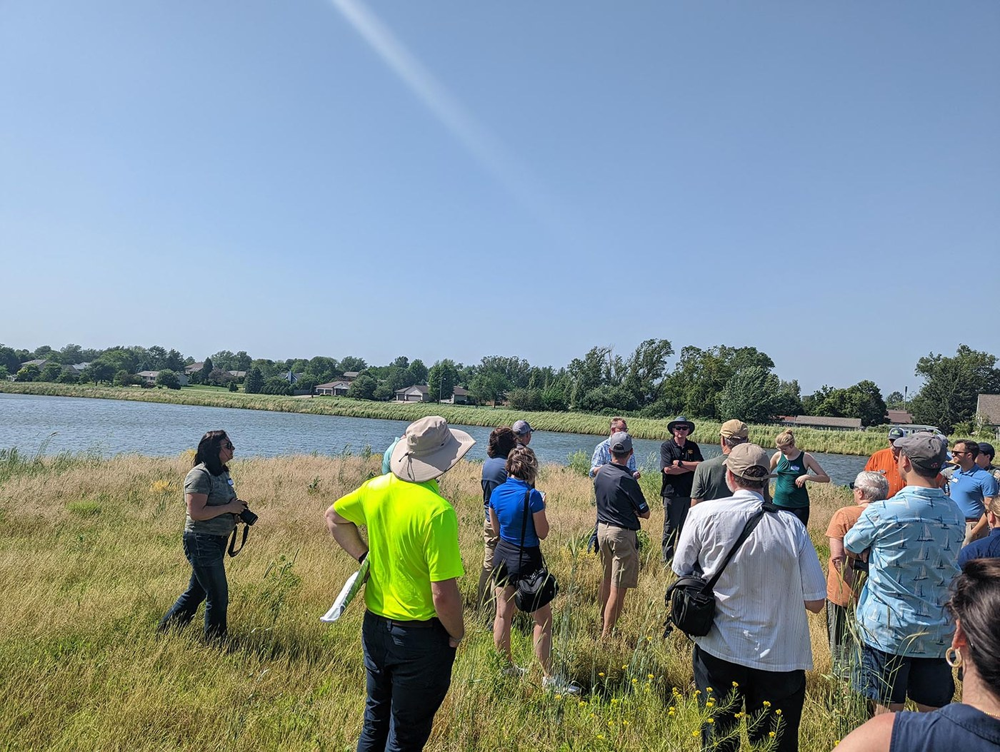

- Understanding watershed structure and natural processes is crucial to grasping how **human activities can degrade or improve** the condition of a watershed — its water quality, its fish and wildlife, its forests and other vegetation, and the quality of community life for people who live there
- Knowing these structural and functional characteristics, and how people affect them, sets the stage for **effective watershed management**

<!-- The bridge from "we can compute a boundary" to "the boundary is the unit management decisions get made in." Permits, TMDLs, restoration budgets and stormwater plans are all organized by watershed. -->

---

# Watershed Diagram

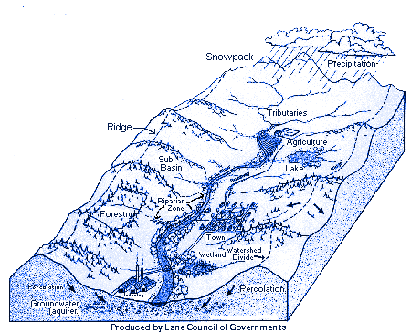

<small>Source: Orange County Watersheds, *Watershed Science for Teachers, Part 1*</small>

<!-- Walk the block diagram from ridge to river mouth: snowpack, tributaries, the watershed divide, the sub-basin, agriculture, town, the lake, percolation to groundwater. Everything inside the divide drains to one place. -->
<!-- TODO(instructor): the source slide cites http://www.ocwatersheds.com/PublicEducation/images/Watershed_Science_for_Teachers_part_1.ppt — verify whether that link still resolves, or replace the citation. -->

---

# Another Watershed Diagram

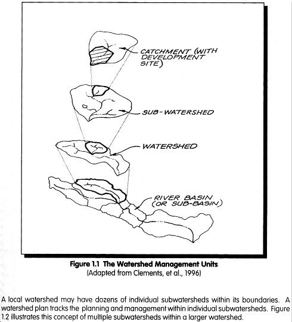

<!-- Nested scale: a catchment sits inside a subwatershed, which sits inside a watershed, which sits inside a river basin. A local watershed plan may cover dozens of subwatersheds. The nesting is exactly what the subwatershed step in Part 1 produced. -->

---

# The Hydrologic Cycle

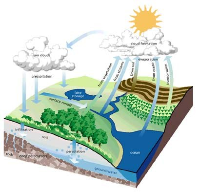

<!-- The watershed is the land-surface piece of this cycle. Everything the terrain analysis computes concerns one arrow on this diagram: surface runoff. Precipitation, evaporation, transpiration and infiltration are the other terms a rainfall-runoff model has to account for. -->

---

# What Is a Watershed

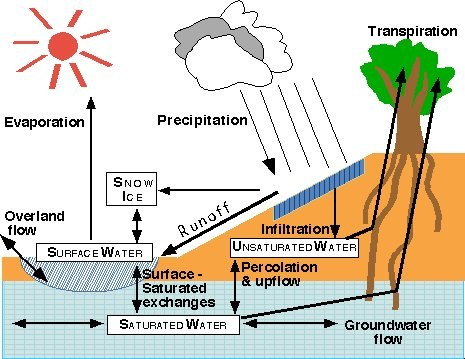

<!-- The same cycle drawn as a water balance for one hillslope: precipitation in; overland flow, infiltration to the unsaturated zone, percolation to the saturated zone, groundwater flow, evaporation and transpiration out. Ask which of these a DEM can tell you about. Only one: the direction overland flow will take. -->

---

# Watershed Processes and Functions

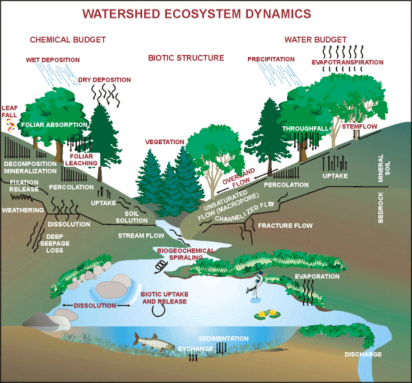

<small>Source: Orange County Watersheds, *Watershed Science for Teachers, Part 1*</small>

<!-- The chemical budget, the biotic structure and the water budget all use the watershed as their accounting boundary. This is the argument for why the boundary is worth computing carefully. -->

---

<!-- _class: lead -->

# Part 3 — Delineate One Yourself

<!-- Part 3 is hands-on: hand-digitize a watershed from contours, then let StreamStats do it, then compare. Bring laptops. -->

---

# A Case Study of Hog Pen Creek

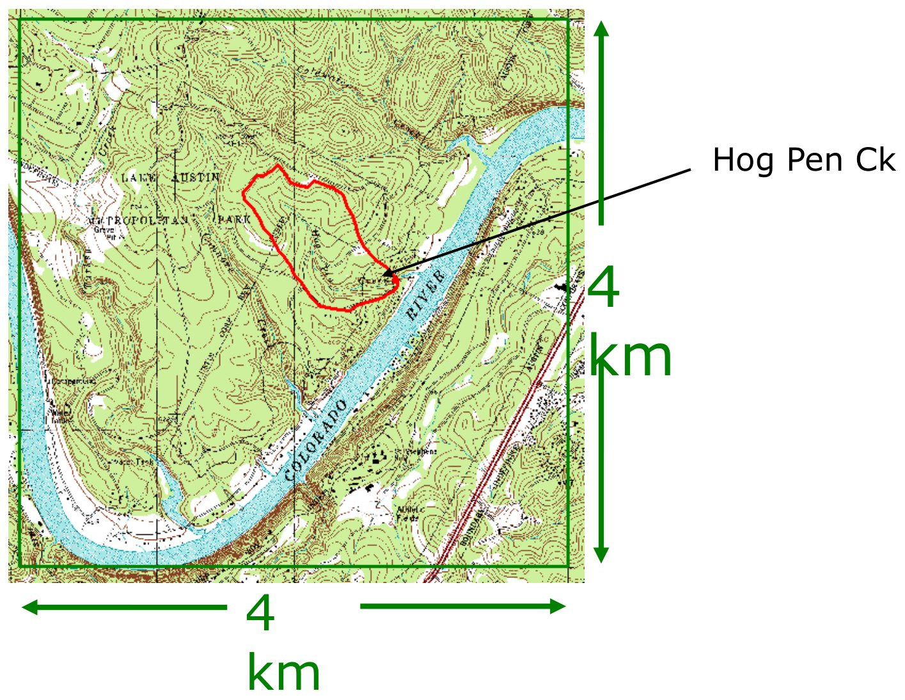

<!-- A 4 km by 4 km topographic quadrangle with Hog Pen Creek running through it. Before showing the next slide, ask the class where the divide is. Everyone will point at the contour crenulations, which is exactly the right instinct. -->

---

# Watershed Delineation by Hand Digitizing

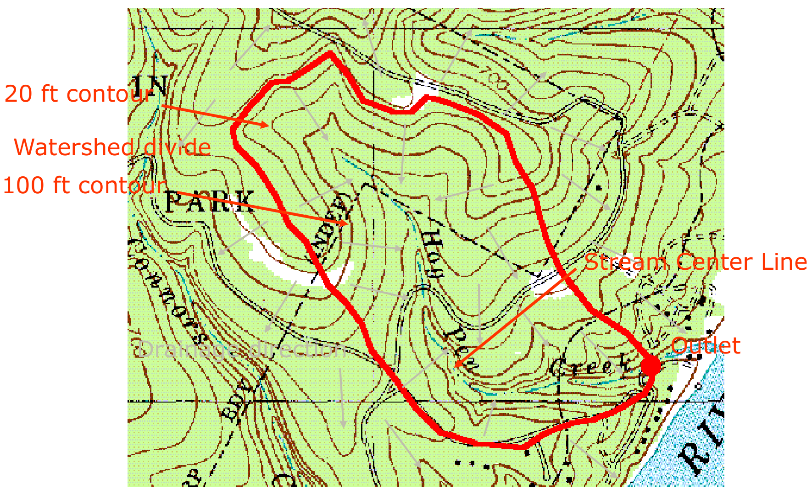

<!-- The red line is the watershed divide, drawn by hand along the ridges. The rules: the divide crosses contours at right angles, it runs through high points, it never crosses the stream except at the outlet, and it closes on itself. The 20 ft and 100 ft contours, the stream center line and the outlet are labeled. -->

---

<!-- _class: activity -->

# Watershed Delineation by Hand Digitizing — Let's Try It

- Open **ArcGIS Pro**
- Using your basemap, find **Hogle Zoo** in Salt Lake City — find **Emigration Creek**
- Create a new blank **polygon** shapefile
- Manually digitize the watershed that drains to this area by **clicking along ridge lines**
- **Save** your digitized watershed and compare with your neighbors

<!-- Give this about fifteen minutes. Turn on a hillshade or terrain basemap so ridges are visible. The comparison at the end is the point: five students will produce five different boundaries, which sets up the StreamStats comparison that follows. -->
<!-- TODO(graphic): an ArcGIS Pro screenshot of the Emigration Creek / Hogle Zoo area on a terrain basemap with a partially digitized polygon in progress. Not fabricated here; needs a real capture. -->
<!-- VERIFY: exact ArcGIS Pro path for creating a new blank polygon shapefile or feature class, so the step can name the pane and menu. -->

---

# Automated Watershed Delineation

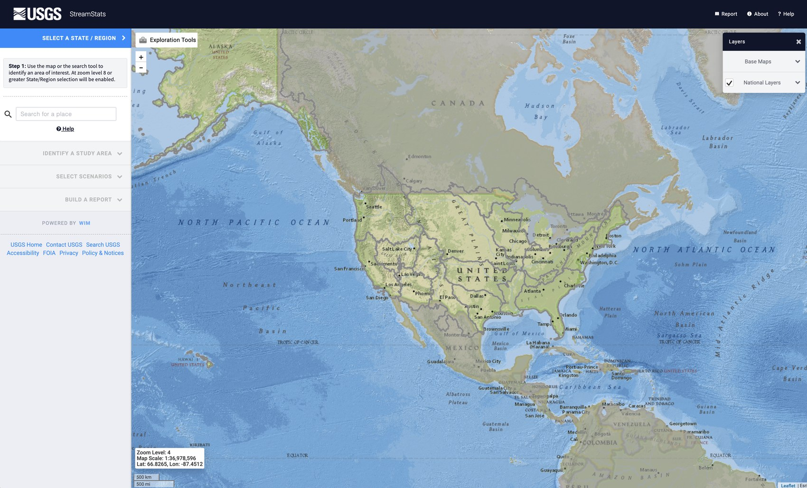

- Let's use an automated tool provided by the U.S. Geological Survey called **StreamStats**
- Go to [https://streamstats.usgs.gov/ss/](https://streamstats.usgs.gov/ss/)

<!-- StreamStats runs the same eight steps from Part 1 on a pre-processed national DEM, then adds published regression equations for peak flows. Students are about to get in thirty seconds what took them fifteen minutes by hand. -->

---

# Automated Watershed Delineation

- Search for **Pioneer Monument State Park**, then click **"Utah"**

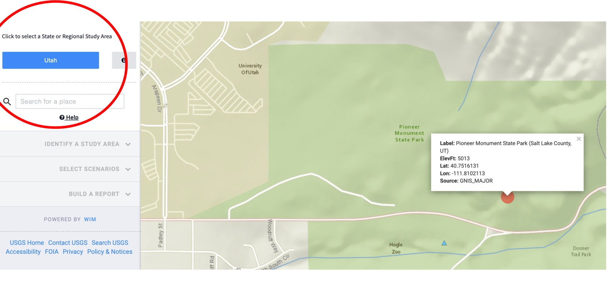

<!-- The state has to be selected first because the regression equations and the pre-processed terrain data are organized by state study area. The red circle marks the state selector. -->

---

# Automated Watershed Delineation

- Click **"Delineate"** and then click a point on the stream near Hogle Zoo

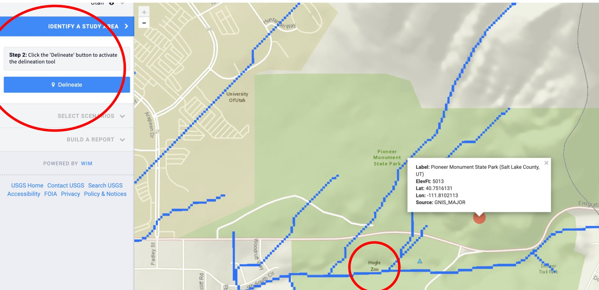

<!-- Two circled steps: activate the delineation tool, then place the pour point. Emphasize that clicking off the blue line gives a tiny nonsense basin — same snapping problem as the pour points in Part 1. -->

---

<!-- _class: quiz -->

# Automated Watershed Delineation

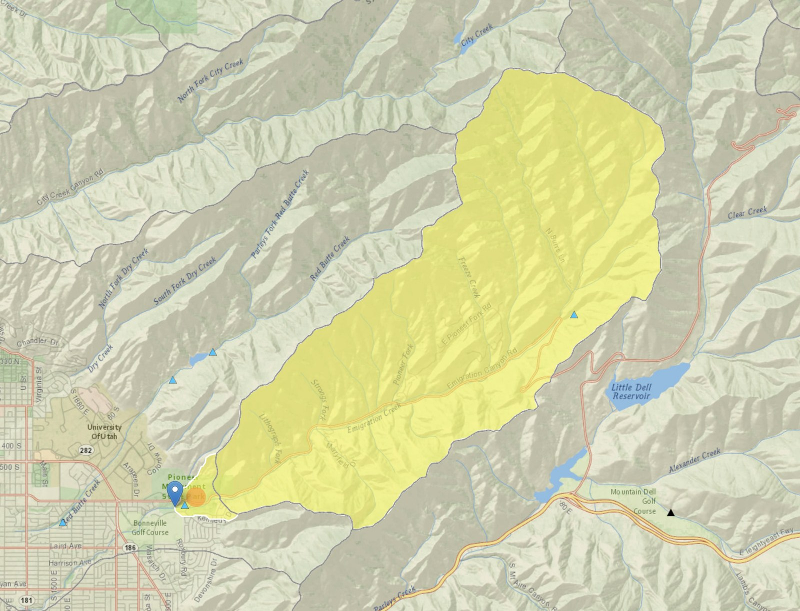

- Wait for the magic…
- **How does it look?**
- **How does it compare to your manually delineated watershed?**

<!-- Collect answers before moving on. Expect the automated basin to be close on the ridges and different near the outlet, where the pour point placement dominates. Ask what would change if they had clicked 100 m upstream. -->

---

# Automated Watershed Delineation

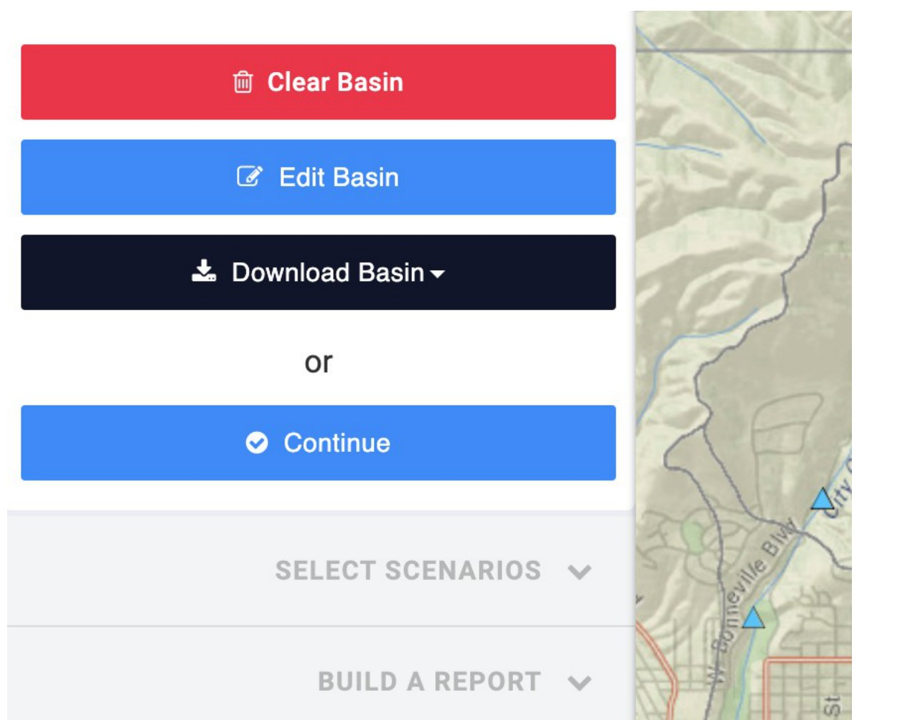

- Click **"Download Basin"** and choose **"Shapefile"**
- This will download a **zipped shapefile** of the watershed to your downloads folder

<!-- The download is a zip containing the basin polygon and, depending on the options chosen, the flow-path lines. Students need this file for the comparison on the next slide. -->

---

<!-- _class: activity -->

# Compare the Two

- Let's compare it to the watershed you **manually delineated**
- **Unzip** the shapefile you downloaded and add it to your map in **ArcGIS Pro**
- **How does it compare?**
- Take a snapshot of this map, save it as an image file, and upload it to **Learning Suite** for today's classroom participation points

<!-- The deliverable is one image showing both polygons over the same basemap. Symbolize one as a hollow outline so both are visible. If time allows, have them compute the area of each and report the percent difference. -->
<!-- TODO(graphic): an ArcGIS Pro screenshot showing a hand-digitized polygon and the StreamStats basin overlaid on the Emigration Creek area, as the example of what a good submission looks like. Needs a real capture. -->

---

# Next: Lab 5 — Watershed Delineation

Lab 5 runs the eight steps from Part 1 on a real DEM in **ArcGIS Pro**, start to finish. What today gives you for it:

- Why **Fill** comes first, and what breaks if you skip it
- How to read a **flow direction** code back to a compass direction
- That the stream **threshold** is a choice you make, applied to **flow accumulation** — not something the Watershed tool decides
- That a watershed is always the watershed **of a pour point**

[Lab 5 — Watershed Delineation](https://byu-hydroinformatics.github.io/ce414-gis-applications/assignments/lab-05/)

<!-- The single most common lab failure is an unsnapped pour point producing a two-cell watershed. Say so now. -->
<!-- VERIFY: schedule reconstructed — confirm Lab 5 is the lab that follows this week's lecture. -->

---

# Before Next Class

- Read the assigned textbook chapter <!-- TODO(instructor): reading chapter -->
- Take the open-book **quiz** on Learning Suite
- **Lab 4** is due this week — [Lab 4](https://byu-hydroinformatics.github.io/ce414-gis-applications/assignments/lab-04/)
- **Lab 5 — Watershed Delineation** is next — [Lab 5](https://byu-hydroinformatics.github.io/ce414-gis-applications/assignments/lab-05/)
- Questions? Office hours: [calendly.com/dan-ames/office-hours](https://calendly.com/dan-ames/office-hours)

<!-- Fill in the quiz due date before class. -->
<!-- VERIFY: schedule reconstructed — Lab 4 due Week 6, Lab 5 next; confirm against the published course schedule. -->

<!-- Conversion notes (2026-09-03): Source deck "CE 414 Week 6 - Watershed Delineation.pptx", 57 slides, none hidden. All 57 source slides are represented; 62 slides here (source slide 1 became the title slide, source slide 38 — a bare "Day 2" text slide — became the Part 2 divider, and five slides were added: Today's Goals, the Part 1 and Part 3 `lead` dividers, a Lab 5 preview, and Before Next Class). No slides dropped. The nine "Summary of Steps" slides are near-duplicates that each highlight a different step; all nine are kept as roadmap markers with the active step in bold, and are intentionally text-only. Source slides 2 and 3 carry the same student-at-a-computer illustration; slide 2 now uses the workflow diagram instead, so the illustration appears once. The workflow diagram appears twice by design (preview on the big-question slide, payoff on "Example Model"). Shape-built slides (D8 grids, flow accumulation grids, slope equations, annotated StreamStats captures) were re-rendered from the PDF at 200 dpi and cropped, since the underlying art is PowerPoint shapes or WMF that browsers cannot display. Stale ArcView-era screenshots kept and flagged: ws-flow-direction-arcview.jpg, ws-streams-200-cell-threshold.png, ws-vectorized-streams-gridcode.png, ws-subwatersheds-stream-segments.png. ws-delineated-subwatersheds-streams.png is only 203x161 px in the source and is soft on a projector. Open instructor decisions are marked TODO(instructor): the 200-cell threshold's "18 hectares or 13.5 acres" unit mismatch (kept verbatim), a scale/resolution sensitivity question, validation against the NHD or StreamStats, the reading chapter, and the ocwatersheds.com citation link. TODO(graphic) marks four slides that need real captures or figures; no images were generated. Schedule links carry VERIFY comments. Software wording: the source already says ArcGIS Pro on the hands-on slides; no ArcGIS 9 / ArcMap / ArcToolbox wording was found in the text, only in the legacy screenshots. -->
