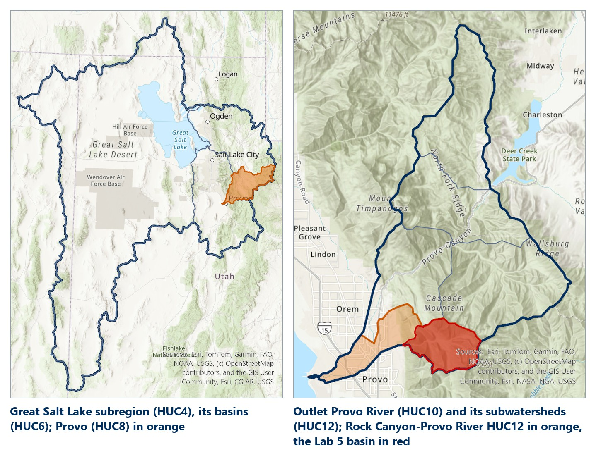
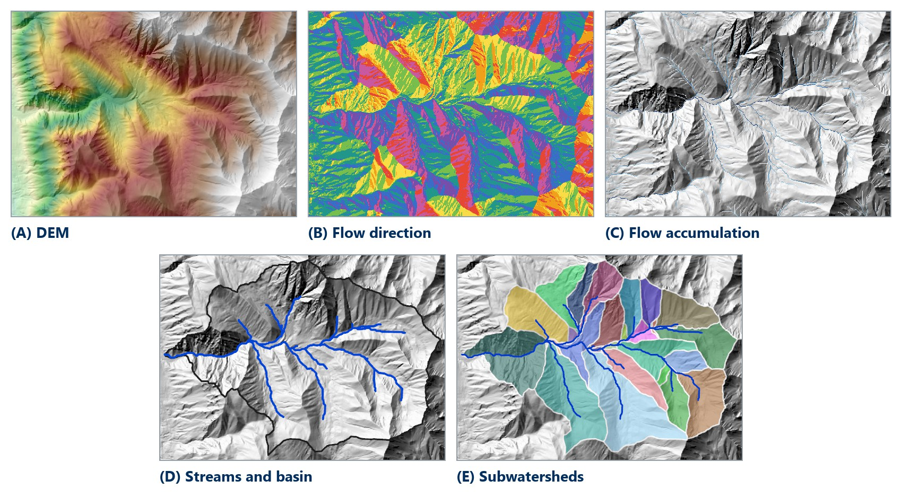
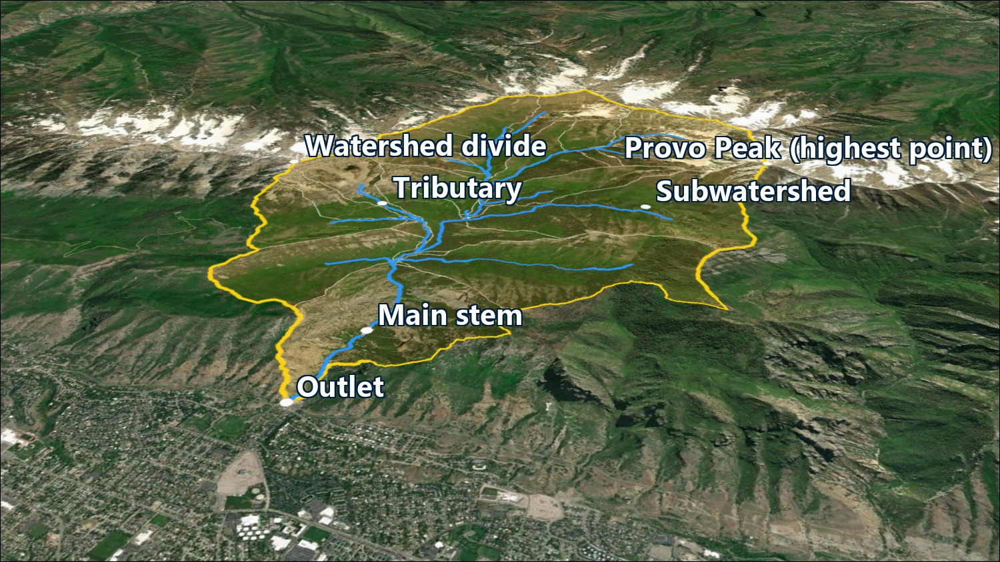
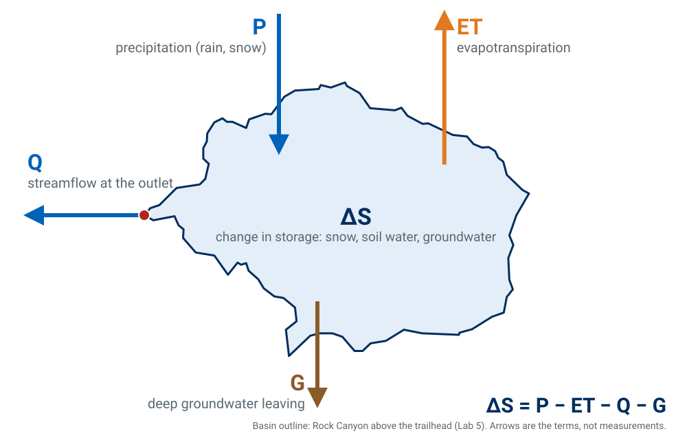
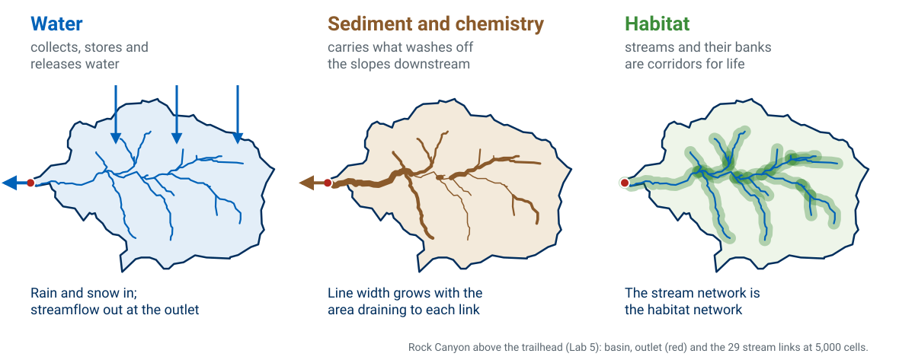

<!-- _class: lead -->
<!-- _paginate: skip -->

# What Is a Watershed?

## Part B — Watersheds and the Water Balance

CE 414 Engineering Applications of GIS
Civil & Construction Engineering
Brigham Young University
Dr. Dan Ames

Some slides adapted from D. Maidment (UT Austin) and Orange County Public Works

<!-- Thursday of Week 6. Tuesday was the mechanics: the eight steps from a DEM to streams and watersheds, and the Lab 5 model. Today is the theory those steps serve — what a watershed is, why we organize water management around them, what a DEM can and cannot tell you about a watershed's water — and a hands-on comparison of a hand-drawn divide with USGS StreamStats. -->

<!-- stamp:begin -->
<!-- _footer: 'CE 414 · Week 6 — What Is a Watershed?Last Updated: 2026-10-01© 2026 Daniel P. Ames · <a href="https://creativecommons.org/licenses/by/4.0/">CC BY 4.0</a>' -->
<!-- stamp:end -->

---

# Today's Goals

By the end of class you should be able to:

- Define a **watershed** and say why it is always the watershed **of a point**
- Explain why water is managed by **watershed**, not by political boundary
- Read the **nested hydrologic units** a place sits in, from a subwatershed to a region
- Write a watershed's **water balance**, and say which term a DEM can tell you about
- Delineate a watershed **by hand** and with **StreamStats**, and compare them

<!-- The map at right: where Rock Canyon's water goes, nested from the Lab 5 basin up to the Great Salt Lake subregion. Thursday's thread is that the boundary Tuesday's algorithm computes is the boundary everything else — law, management, water budgets — is organized around. -->

---

<!-- _class: lead -->

# Part 1 — What Is a Watershed, and Why Care?

<!-- Tuesday was the algorithm; today is what the algorithm is for. -->

---

# Tuesday in One Picture — Hydrologic Terrain Processing

- Begin with a **Digital Elevation Model (DEM)**
- **Goal 1:** generate a polyline **stream network** — a "potential flow path network"
- **Goal 2:** generate polygon **watershed boundaries**
- **Motive:** generally to create input data sets for hydrologic and watershed modeling tools, i.e. for rainfall-runoff prediction modeling

<!-- "Potential flow path network" is the honest phrase: the algorithm returns where water would go on this surface, which is not the same as where a channel exists. That gap is why validation against mapped hydrography matters. The five panels are Tuesday's chain on Lab 5's Rock Canyon data, rendered in ArcGIS Pro: the DEM, flow direction, flow accumulation, the streams and basin, and the subwatersheds. -->

---

# What Is a Watershed?

- A watershed is the **area of land where all of the water that drains off of it goes into the same place** (i.e. an "outlet")
- John Wesley Powell's definition: a bounded hydrologic system within which all living things are linked by their common water course, and around which, as humans settled, communities formed
- Watersheds come in **all shapes and sizes**, and they **cross city, state, and national boundaries**
- No matter where you are, **you're in a watershed!**

<!-- Powell's definition is quoted in full on the source slide; it is paraphrased here. Read the original aloud if you want it. The engineering definition and Powell's social one describe the same boundary and are worth contrasting. -->

---

# Remember This Map?

<!-- Some people have proposed that the 50 states be redivided based on population. What's wrong with this from a hydrology point of view? Water doesn't follow straight-line political boundaries. Let them answer before you say it. -->

---

# John Wesley Powell

- **Major John Wesley Powell**, a Civil War veteran, ethnographer, and second director of the United States Geological Survey from 1881 to 1894
- Proposed that western states be brought into the union around **watershed boundaries**

<!-- Powell's 1890 map of the arid region divided the West into drainage basins rather than rectangles. Congress ignored it. A century of interstate water compacts and litigation followed. Background reading: https://brandonletsinger.com/biography/the-united-watershed-states-of-america-a-biography-of-john-wesley-powell/ -->

---

# Why Watersheds Are Important

- Understanding watershed structure and natural processes is crucial to grasping how **human activities can degrade or improve** the condition of a watershed — its water quality, its fish and wildlife, its forests and other vegetation, and the quality of community life for people who live there
- Knowing these structural and functional characteristics, and how people affect them, sets the stage for **effective watershed management**

<!-- The bridge from "we can compute a boundary" to "the boundary is the unit management decisions get made in." Permits, TMDLs, restoration budgets and stormwater plans are all organized by watershed. -->

---

# Anatomy of a Watershed — Rock Canyon

<!-- An oblique 3D view of Rock Canyon in ArcGIS Pro, looking east from above Provo, with Lab 5's basin (yellow), stream links (blue) and subwatersheds (thin white lines) draped on imagery. Walk it from the outlet: the outlet at the trailhead, the main stem up the canyon, the tributaries, one subwatershed, up to the divide along the ridgeline and the highest point at Provo Peak. Everything inside the yellow line drains to the one red point at the bottom; everything outside it, even a few meters over the ridge, goes somewhere else. Labels are placed from the Lab 5 data (tools/week06_figures.py, anatomy). -->

---

# Watersheds Nest — From Rock Canyon to the Great Salt Lake

- Each code adds two digits to its parent: **16** Great Basin › **1602** Great Salt Lake › **160202** Jordan › **16020203** Provo › … › **160202030505** Rock Canyon

<!-- These are the USGS Watershed Boundary Dataset units that contain the Rock Canyon trailhead, pulled live from the WBD map service and drawn in ArcGIS Pro: Great Basin Region (HUC2 16), Great Salt Lake subregion (HUC4 1602, about 74,300 km²), Jordan basin (HUC6 160202), Provo subbasin (HUC8 16020203, about 1,770 km²), Outlet Provo River watershed (HUC10 1602020305, about 332 km²), and Rock Canyon-Provo River subwatershed (HUC12 160202030505, about 50 km²). The Lab 5 basin, 25.2 km², sits inside that HUC12. Each code extends its parent by two digits — the nesting is in the number. The point to land: Rock Canyon's water ends up in the Great Salt Lake, which is where next week starts. -->

---

# The Water Balance of a Watershed

- The watershed is the **accounting boundary**. A DEM tells you about only one term: **where the runoff goes**

<!-- The hydrologic cycle, drawn as a budget for one watershed — Rock Canyon's real outline from Lab 5. Precipitation in; evapotranspiration out; streamflow out at the outlet; deep groundwater out across the bottom; the difference is the change in storage (snowpack, soil water, groundwater). Ask which of these terms a DEM can tell you about. Only one, and only partly: where the water that becomes streamflow will go — the flow paths, the divide, and the outlet. Every other term needs other data: gages, weather stations, soil and snow surveys. -->

---

# What a Watershed Does

<!-- Three things a watershed does, drawn on the same real basin: it collects, stores and releases water; it carries sediment and dissolved chemistry downstream, so the channel carries more the closer it gets to the outlet (line width is drawn from each link's real contributing area); and its streams and their banks are the habitat network. The water budget, the sediment and chemical budget and the biotic structure all use the watershed as their accounting boundary — the argument for computing the boundary carefully (tools/week06_processes_svg.py). -->

---

<!-- _class: lead -->

# Part 2 — Delineate One Yourself

<!-- Part 3 is hands-on: hand-digitize a watershed from contours, then let StreamStats do it, then compare. Bring laptops. -->

---

# A Case Study of Hog Pen Creek

<!-- A 4 km by 4 km topographic quadrangle with Hog Pen Creek running through it. Before showing the next slide, ask the class where the divide is. Everyone will point at the contour crenulations, which is exactly the right instinct. -->

---

# Watershed Delineation by Hand Digitizing

<!-- The red line is the watershed divide, drawn by hand along the ridges. The rules: the divide crosses contours at right angles, it runs through high points, it never crosses the stream except at the outlet, and it closes on itself. The 20 ft and 100 ft contours, the stream center line and the outlet are labeled. -->

---

<!-- _class: activity -->

# Watershed Delineation by Hand Digitizing — Let's Try It

- Open **ArcGIS Pro**
- Using your basemap, find **Hogle Zoo** in Salt Lake City — find **Emigration Creek**
- Create a new blank **polygon** shapefile
- Manually digitize the watershed that drains to this area by **clicking along ridge lines**
- **Save** your digitized watershed and compare with your neighbors

<!-- Give this about fifteen minutes. Turn on a hillshade or terrain basemap so ridges are visible. The comparison at the end is the point: five students will produce five different boundaries, which sets up the StreamStats comparison that follows. -->
<!-- TODO(graphic): an ArcGIS Pro screenshot of the Emigration Creek / Hogle Zoo area on a terrain basemap with a partially digitized polygon in progress. Not fabricated here; needs a real capture. -->
<!-- VERIFY: exact ArcGIS Pro path for creating a new blank polygon shapefile or feature class, so the step can name the pane and menu. -->

---

# Automated Watershed Delineation

- Let's use an automated tool provided by the U.S. Geological Survey called **StreamStats**
- Go to [https://streamstats.usgs.gov/ss/](https://streamstats.usgs.gov/ss/)

<!-- StreamStats runs the same eight steps from Part 1 on a pre-processed national DEM, then adds published regression equations for peak flows. Students are about to get in thirty seconds what took them fifteen minutes by hand. -->

---

# Automated Watershed Delineation

- Search for **Pioneer Monument State Park**, then click **"Utah"**

<!-- The state has to be selected first because the regression equations and the pre-processed terrain data are organized by state study area. The red circle marks the state selector. -->

---

# Automated Watershed Delineation

- Click **"Delineate"** and then click a point on the stream near Hogle Zoo

<!-- Two circled steps: activate the delineation tool, then place the pour point. Emphasize that clicking off the blue line gives a tiny nonsense basin — same snapping problem as the pour points in Part 1. -->

---

<!-- _class: quiz -->

# Automated Watershed Delineation

- Wait for the magic…
- **How does it look?**
- **How does it compare to your manually delineated watershed?**

<!-- Collect answers before moving on. Expect the automated basin to be close on the ridges and different near the outlet, where the pour point placement dominates. Ask what would change if they had clicked 100 m upstream. -->

---

# Automated Watershed Delineation

- Click **"Download Basin"** and choose **"Shapefile"**
- This will download a **zipped shapefile** of the watershed to your downloads folder

<!-- The download is a zip containing the basin polygon and, depending on the options chosen, the flow-path lines. Students need this file for the comparison on the next slide. -->

---

<!-- _class: activity -->

# Compare the Two

- Let's compare it to the watershed you **manually delineated**
- **Unzip** the shapefile you downloaded and add it to your map in **ArcGIS Pro**
- **How does it compare?** The automated basin is **more consistent** — it repeats exactly — not necessarily more accurate
- Take a snapshot of this map, save it as an image file, and upload it to **Learning Suite** for today's classroom participation points

<!-- The deliverable is one image showing both polygons over the same basemap. Symbolize one as a hollow outline so both are visible. If time allows, have them compute the area of each and report the percent difference. -->
<!-- TODO(graphic): an ArcGIS Pro screenshot showing a hand-digitized polygon and the StreamStats basin overlaid on the Emigration Creek area, as the example of what a good submission looks like. Needs a real capture. -->

---

# Next Week — Where Rock Canyon's Water Ends Up

- Rock Canyon drains to Utah Lake, the Jordan River, and finally the **Great Salt Lake** — a lake with **no outlet**
- When a lake has no outlet, its **level** is its water balance: everything that comes in, minus what evaporates
- Next week: **lake bathymetry**, and **Lab 6 — Lake Depth Explorer** — what the Great Salt Lake's shoreline looks like at every water level

<!-- The bridge to Week 7. The Great Salt Lake subregion (HUC4 1602) on the map at right is the basin Rock Canyon belongs to. A terminal lake turns the water-balance slide into one number students can see from the freeway: the water surface elevation. Lab 6 is built on that idea. -->

---

# Before Next Class

- **Lab 5 — Watershed Delineation** is due **Saturday 11:59 pm** — [Lab 5](https://byu-hydroinformatics.github.io/ce414-gis-applications/assignments/lab-05/)
- Take **Quiz 6** (Watershed Delineation, open book) on Learning Suite — due **Saturday 11:59 pm**
- **Lab 6 — Lake Depth Explorer** is next — [Lab 6](https://byu-hydroinformatics.github.io/ce414-gis-applications/assignments/lab-06/)
- Questions? Office hours: [calendly.com/dan-ames/office-hours](https://calendly.com/dan-ames/office-hours)

<!-- Split notes (2026-10-01): this deck is Parts 2 and 3 of the original Week 6 deck (source "CE 414 Week 6 - Watershed Delineation.pptx"; its conversion notes stay in watershed-delineation.md). New here: the title and goals, the "Watersheds Nest" map (USGS WBD units around Rock Canyon, replacing a 490 px management-units diagram), the water-balance figure (on Lab 5's basin outline, replacing two small hydrologic-cycle images), the terrain-processing panels rebuilt from Lab 5's data (replacing a 584 px nine-panel figure), and the bridge to Week 7. Figures from tools/week06_figures.py and tools/week06_water_balance_svg.py. Still third-party and small: the Orange County watershed diagram (450 px) and the processes-and-functions diagram (600 px); kept because they are sourced illustrations, flagged for replacement. -->

---

<!-- _class: activity -->

# One Last Thing — What Is a Watershed?

Five questions on what a watershed is, why we manage water by it, and what a DEM can tell you about it. **Scan the code**, or open the link below.

- Not graded, nothing recorded — it is a check that today landed
- Every answer explains itself; read the explanation before you move on
- The watershed-of-a-point question is the one Lab 5's outlet depends on

byu-hydroinformatics.github.io/ce414-gis-applications/quizzes/basins/

<!-- Four minutes, in pairs, then a show of hands on the consistent-versus-accurate item: most of the
     room will say the automated basin is more accurate, and the deck's claim is narrower than that.
     If the room has no signal, put the URL on the board; the items read aloud just as well. -->
