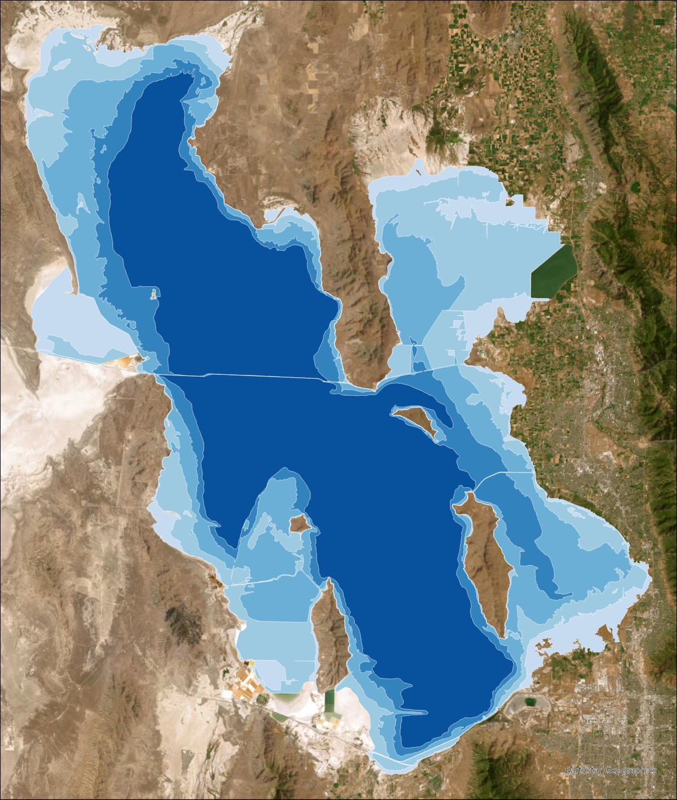
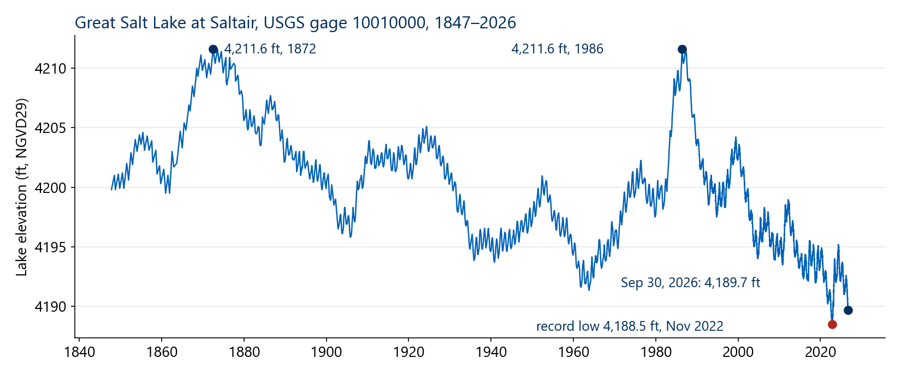
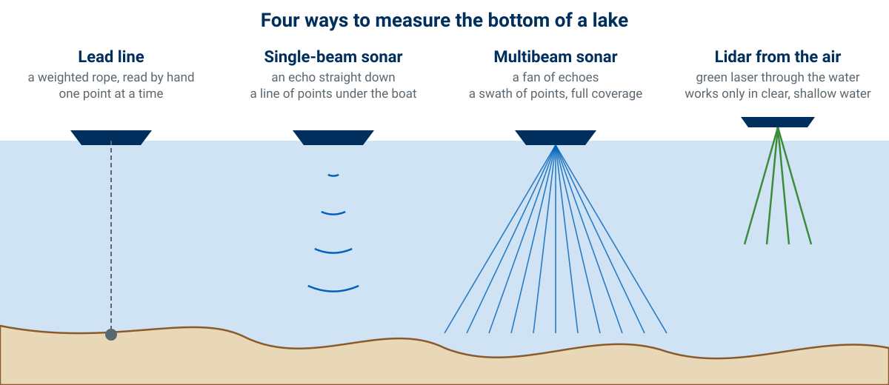
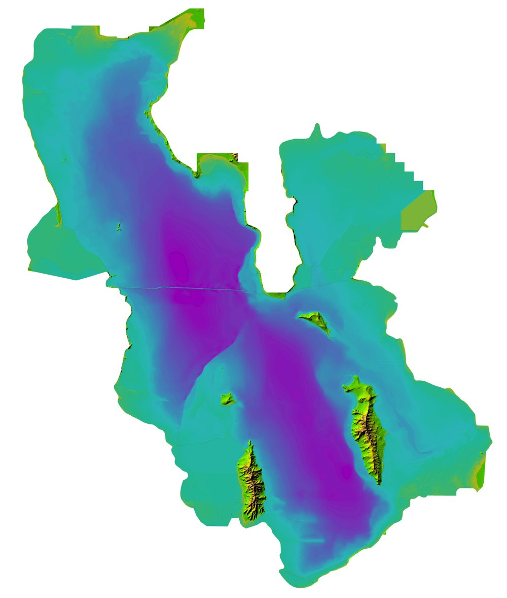
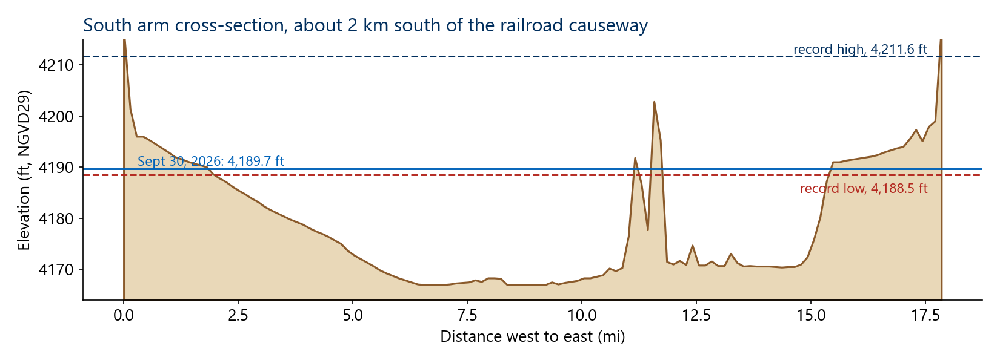
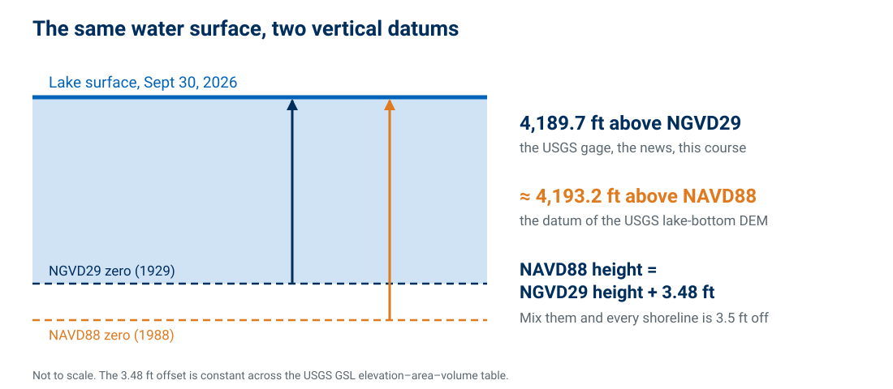
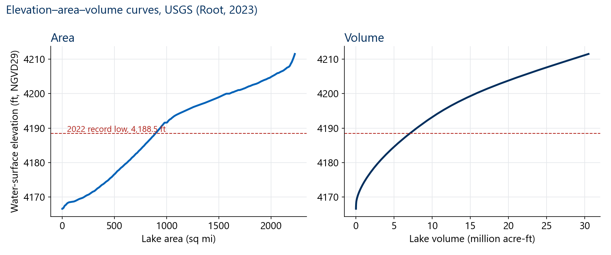
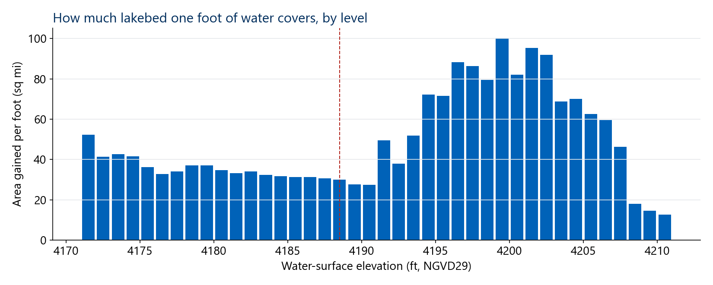
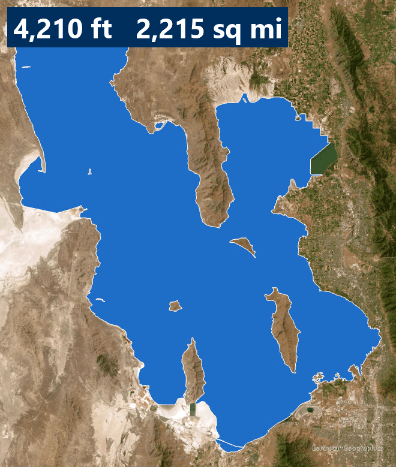
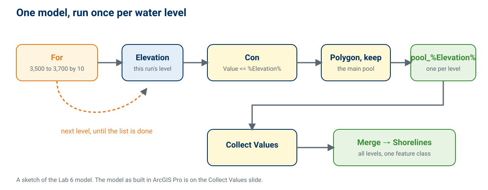

<!-- _class: lead -->
<!-- _paginate: skip -->

# Lake Bathymetry

## Part A — The Great Salt Lake, From the Bottom Up

CE 414 Engineering Applications of GIS
Civil & Construction Engineering
Brigham Young University
Dr. Dan Ames

<!-- Week 7 is two decks. This one is Tuesday: a terminal lake, how the bottom of a lake is measured and mapped, the two vertical datums, and how a lake's area and volume follow from its level. Thursday's deck (lake-depth-explorer) is ModelBuilder looping and Lab 6. Every chart in this deck is published data: the USGS gage record, the USGS elevation-area-volume table (Root, 2023), and shorelines baked from the USGS lake-bottom DEM. The title map is five of those shorelines, 4,190 to 4,210 ft. -->

<!-- stamp:begin -->
<!-- _footer: 'CE 414 · Week 7 — Lake BathymetryLast Updated: 2026-10-01© 2026 Daniel P. Ames · <a href="https://creativecommons.org/licenses/by/4.0/">CC BY 4.0</a>' -->
<!-- stamp:end -->

---

# Today's Goals

By the end of class you should be able to:

- Say why a **terminal lake's level** is its water balance
- Name four ways the **bottom of a lake** is measured, and what each one gives you
- Explain why a lake level needs a **vertical datum**, and what mixing two does
- Read an **elevation–area–volume** table, and say why one foot of level is not one foot of lake
- Say what **Lab 6** will ask you to build on Thursday

<!-- The chart at right is the whole USGS record for the lake; we come back to it on slide 5. -->

---

<!-- _class: lead -->

# Part 1 — A Lake With No Outlet

<!-- Pick up where Thursday of Week 6 ended: Rock Canyon's water ends up in the Great Salt Lake. -->

---

# Where Rock Canyon's Water Ends Up

- Rock Canyon › Provo River › Utah Lake › Jordan River › **Great Salt Lake** — and the lake has **no outlet**

<!-- The same map as Thursday of Week 6: the Great Salt Lake subregion (HUC4 1602, left) and the Rock Canyon end of it (right), from the USGS Watershed Boundary Dataset. Water leaves the Great Salt Lake only by evaporation. That is what makes its level such an honest gauge of the whole basin's water balance. -->

---

# A Terminal Lake: Its Level Is Its Water Balance

- Inflow up, level up; evaporation and diversions up, level down — the gage records the **balance**

<!-- USGS gage 10010000, Great Salt Lake at Saltair Boat Harbor, daily values 1847 to September 30, 2026, ft NGVD29, read from USGS NWIS on October 1, 2026 (the earliest values are estimates). Highest: 4,211.6 ft, both on June 27, 1872 and June 3, 1986. Lowest: 4,188.5 ft, November 7, 2022. Last value: 4,189.7 ft, September 30, 2026. Ask what a 22-foot swing does to a lake whose deepest point is only a few tens of feet below the surface — Part 3 answers it. -->

---

<!-- _class: lead -->

# Part 2 — Measuring the Bottom

<!-- A DEM of land comes from lidar or photogrammetry. Under water, light and lasers mostly fail, so bathymetry is its own craft. -->

---

# What Bathymetry Is

- **Bathymetry** is the elevation of the bottom of a water body — a DEM of the part you cannot see

<!-- Four methods, oldest to newest. A lead line gives one depth per drop. Single-beam sonar times an echo straight down and gives a line of points along the boat's track. Multibeam sonar sends a fan and gets a swath, close to full coverage. Airborne bathymetric lidar uses a green laser that passes through water — but only clear, shallow water; the Great Salt Lake's brine and its depth limit what it can see. Whatever the method, the points are interpolated to a grid: the same idea as Week 8. -->

---

# How the Great Salt Lake's Bottom Was Mapped

- USGS sonar surveys of the **south arm (2002–04)** and **north arm (2006)**, drawn as depth contours
- Contours turned into a surface with **Topo to Raster — in ArcGIS Pro**
- Merged with **2016 lidar** of the dry shore into one 0.5 m **topobathymetric DEM** (Root, 2023)

<!-- From the metadata of the USGS data release: Root, J.C., 2023, Half-meter topobathymetric elevation model and elevation-area-volume tables for Great Salt Lake, Utah, 2002-2016, doi:10.5066/P9DGG75W. The bathymetric contours are from Baskin's USGS surveys; the shore is UGRC's 2016 lidar. The full DEM is about 34 GB; Lab 6 uses a resampled extract. The point for students: a real federal product was built in the software they are using. -->
<!-- The image is the release's own thumbnail of the 0.5 m DEM (Great_Salt_Lake_TBDEM_Thumbnail.jpg, ScienceBase item 646d0ed2d34ee02593fb50a7, public domain), downsized: purple is deepest; the railroad causeway is the straight line across the middle; Antelope and Stansbury islands stand up in the south arm. Checked against the release metadata on October 2, 2026: south arm surveyed 2002-2004 and north arm 2006 (Baskin 2005, 2006), contours interpolated with Topo to Raster in ArcGIS Pro 2.9.5, mosaicked (Mosaic to New Raster) with lidar flown September 3 to November 30, 2016; the elevation-area-volume tables were computed with the Storage Capacity tool. -->

---

# A Cross-Section of the South Arm

- Most of the arm is a **flat floor** a little over 20 ft below today's surface

<!-- A 17.9-mile west-to-east profile about 2 km south of the railroad causeway, from the Tarboton and Merck Great Salt Lake bathymetry on HydroShare (a different, older DEM than the USGS 2023 one, built from the same Baskin surveys), via the hydromap-app project. The floor sits near 4,167–4,170 ft, so at 4,189.7 ft the deepest water along this line is about 20 ft. The bump near mile 11.5 is submerged structure from the original 1904 railroad trestle. Note how little the record low and today differ in depth, and how much they differ in where the shoreline is — that is Part 3. -->

---

# Two Vertical Datums

- A lake level is a **height above a datum** — say which one, or the number means nothing

<!-- The USGS gage, the news and this course report NGVD29 (the 1929 datum). The USGS lake-bottom DEM is in NAVD88 (the 1988 datum). At the Great Salt Lake, a height in NAVD88 is 3.48 ft larger than the same height in NGVD29: the USGS elevation-area-volume table carries both columns, and the difference is 3.48 ft on every row. Lab 6 has the same problem at Lake Powell: its surface ships in meters NAVD88 and Reclamation's lake record is in feet NGVD29, 2.91 ft apart there (USGS SIR 2022-5017), and Step 1 converts it — the 3.48 ft here and 2.91 ft there are a good reminder that the offset between the datums changes from place to place. The 3.48 ft was re-checked on every row of the hosted CSV, October 2, 2026. -->

---

<!-- _class: lead -->

# Part 3 — Level, Area, and Volume

<!-- A bathymetry surface turns a water level into a shoreline, an area and a volume. -->

---

# Elevation–Area–Volume Curves

<!-- The USGS elevation-area-volume table for the whole lake, 0.01 ft steps, converted here to ft NGVD29. At the 2022 record low, 4,188.5 ft: about 894 sq mi and 7.08 million acre-ft. At 4,200 ft: about 1,602 sq mi and 15.7 million acre-ft. At 4,211.5 ft, the top of the table: about 2,229 sq mi and 30.5 million acre-ft. Volume curves upward because each foot of water spreads over a bigger area the higher it gets. -->

---

# One Foot Is Not One Foot

- Near **4,190 ft** a foot of level covers about **30 sq mi**; near **4,200 ft**, up to **100 sq mi**

<!-- Computed from the USGS table: the area gained between consecutive whole feet. Between 4,188 and 4,190 ft each foot adds about 28–30 sq mi; between 4,195 and 4,203 ft each foot adds 70–100 sq mi, the most at 4,199–4,200 ft (about 100 sq mi). The lake is a very flat bowl with very flat shoulders: in that band a small change in level exposes or floods a lot of lakebed. That is why the exposed-lakebed (and dust) problem grows so fast when the lake drops through the 4,190s and 4,200s. -->

---

# Shorelines at Five Levels

- **4,210 ft** — near the 1872 and 1986 highs
- **4,200 ft** — near the long-term middle of the record
- **4,190 ft** — about where the lake is today
- Lighter blue = higher level. Farmington and Bear River **bays** dry out first; the causeway splits the **arms**

<!-- Shorelines at 4,190, 4,195, 4,200, 4,205 and 4,210 ft NGVD29, drawn in ArcGIS Pro on imagery. They were computed from the USGS 2023 DEM by the hydromap-app project (github.com/danames/hydromap-app) and agree with the USGS area table to within a fraction of a percent: 938 sq mi at 4,190 ft against the table's 937.6. Lab 6 makes these yourself. -->

---

# The Lake Falling — 4,210 to 4,190 ft

<!-- One frame every 2 ft, the area in the corner (from the shoreline polygons). Watch the eastern bays and the area south of Antelope Island empty first. This is exactly the sequence of outputs the Lab 6 model produces in one run. -->

---

<!-- _class: activity -->

# In Class Activity — Read the USGS Table

- Open the **USGS elevation–area–volume table** for the whole lake — [download the CSV](https://byu-hydroinformatics.github.io/ce414-gis-applications/data/week07-gsl-elevation-area-volume.csv) and open it in Excel
- Plot **area** and **volume** against elevation (ft NGVD29)
- How much lakebed is exposed between **4,200 ft** and the **2022 low, 4,188.5 ft**?
- At today's level, how many feet of drop expose another **100 sq mi**?

<!-- The table is in the USGS data release (doi:10.5066/P9DGG75W), file for the whole lake; it has both NAVD88 and NGVD29 columns. Answers from the table: 1,602.4 − 894.2 = 708.2 sq mi exposed between 4,200 and 4,188.5 ft; from 4,189.7 ft (929.7 sq mi) a further 100 sq mi is exposed by about 4,186.4 ft (829.5 sq mi), a drop of about 3.3 ft — have students find it themselves (checked against the CSV, October 1, 2026). -->
<!-- The CSV is the release's Great_Salt_Lake_2023_ElevAreaVolume_total.csv, hosted unchanged as docs/data/week07-gsl-elevation-area-volume.csv (public domain, 481 KB, 4,501 rows at 0.01 ft from 4,170 to 4,215 ft NAVD88; NGVD29 = NAVD88 - 3.48 ft). Answers re-checked against it October 2, 2026: 1,602.35 sq mi at 4,200 ft and 894.20 at 4,188.5 ft NGVD29. TODO(instructor): create the matching Learning Suite activity (replaces the old Week 7 "Practicing Hydrology Tools" item). -->

---

# Thursday — Lab 6, Lake Depth Explorer

- One ModelBuilder model that floods a lake surface at **every level in a list**
- The lake is **Lake Powell** — one pool behind one dam, at a new record low (3,516.6 ft, Sept 15, 2026)
- Today's ideas come straight back: a **datum** to convert, an **area table** to check against

- Before Thursday: read the [Lab 6 page](https://byu-hydroinformatics.github.io/ce414-gis-applications/assignments/lab-06/)
- Questions? Office hours: [calendly.com/dan-ames/office-hours](https://calendly.com/dan-ames/office-hours)

<!-- The diagram is a sketch of the Lab 6 model; Thursday builds it. Why Powell for the lab and the Great Salt Lake for lecture: the causeway splits the Great Salt Lake below about 4,200 ft, so "keep the water connected to one seed point" keeps only the south arm — a good report question, a bad first loop. -->

---

<!-- _class: activity -->

# One Last Thing — Lake Bathymetry

Five questions on a terminal lake, measuring the bottom, datums, and what a level does to area. **Scan the code**, or open the link below.

- Not graded, nothing recorded — it is a check that today landed
- Every answer explains itself; read the explanation before you move on
- The datum question is the one that will cost you an afternoon in Lab 6 if you miss it

byu-hydroinformatics.github.io/ce414-gis-applications/quizzes/bathymetry/

<!-- Four minutes, in pairs, then a show of hands on the one-foot question: most people expect each foot to matter equally. If the room has no signal, put the URL on the board. -->
