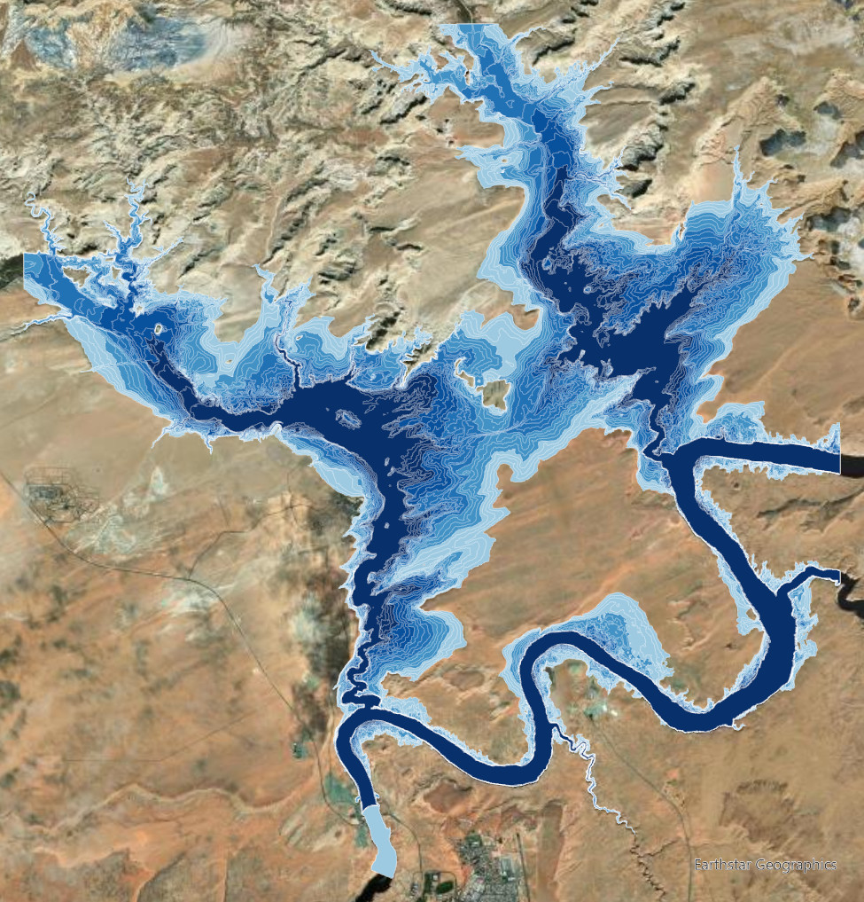
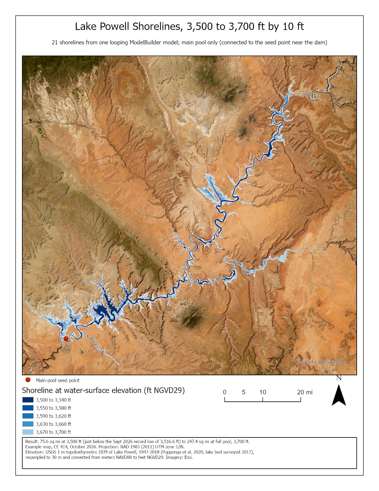
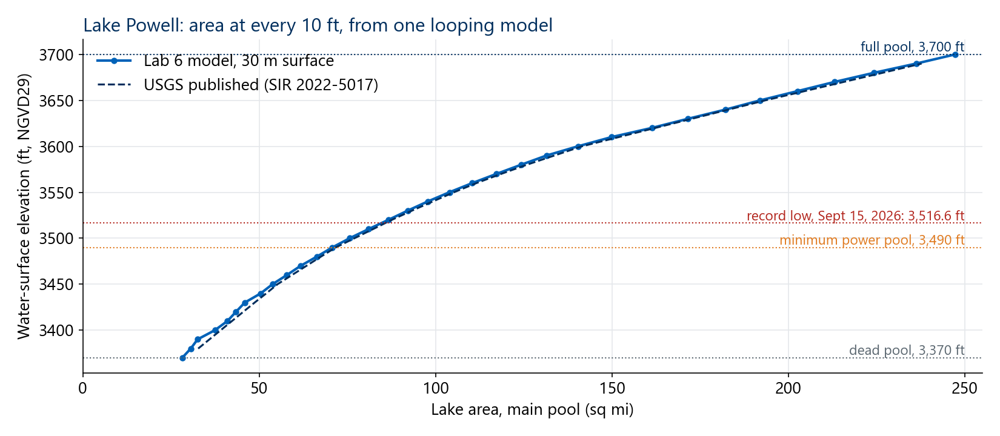

<!-- _class: lead -->
<!-- _paginate: skip -->

# Lake Depth Explorer

## Part B — Looping in ModelBuilder, and Lab 6 at Lake Powell

CE 414 Engineering Applications of GIS
Civil & Construction Engineering
Brigham Young University
Dr. Dan Ames

<!-- Thursday of Week 7. Tuesday gave the lake, its bathymetry, the datum, and the elevation-area-volume table. Today: a ModelBuilder model that runs once per water level instead of once, and Lab 6, which uses it on Lake Powell. The lab is Lake Powell, not the Great Salt Lake: Powell is one connected pool behind a dam, so the main-pool step works cleanly; the Great Salt Lake's railroad causeway splits it in two below about 4,200 ft. The title image is the Lab 6 default run on the 10 m Wahweap close-up: 21 shorelines, 3,500 to 3,700 ft. Slides marked "ArcGIS Pro screenshot to come" are placeholders: they are captured from the real Lab 6 model once the DEM extract is built. Until then, demo live. -->

<!-- stamp:begin -->
<!-- _footer: 'CE 414 · Week 7 — Lake Depth ExplorerLast Updated: 2026-10-01© 2026 Daniel P. Ames · <a href="https://creativecommons.org/licenses/by/4.0/">CC BY 4.0</a>' -->
<!-- stamp:end -->

---

# Today's Goals

By the end of class you should be able to:

- Say what an **iterator** does that running a tool twice does not
- Use **%Value%** to put the iterator's value into an expression and an output name
- Gather a loop's outputs with **Collect Values** and **Merge**
- Say what **Lab 6** asks for, and how you will know your answer is right

---

<!-- _class: lead -->

# Part 1 — One Model, Many Runs

---

# The Problem With Running a Model Once

- One water level → one Con → one shoreline
- Twenty levels → **twenty runs**, twenty names to type, twenty chances to mistype one
- What you want: say the **list of levels once**, and let the model do the rest

<!-- The map is the answer we are after, the Lab 6 example map: 21 Lake Powell shorelines in one layer. Ask how long it took them to run the Lab 5 model four times for Step 14, and what went wrong. -->

---

# An Iterator Runs the Whole Model Once per Value

<!-- Walk the loop with Lab 6's real values: the For iterator produces one value per run (3,500, 3,510, ... 3,700 ft); every tool after it runs once with that value; the outputs are collected and merged at the end. The iterator is the only new idea in Lab 6 — Con, Raster to Polygon and Select Layer By Location are tools students have met. -->
<!-- VERIFY: the sketch's tool names and where Collect Values sits against the real model when it is built. -->

---

# Where the Iterators Live

- **ModelBuilder** tab ▸ **Iterators** — **For** counts from a start to an end by a step

<!-- TODO(capture): the Iterators menu on the ModelBuilder tab in ArcGIS Pro 3.7, For highlighted. -->
<!-- VERIFY: the menu's name and location on the ModelBuilder tab in ArcGIS Pro 3.7, and the list of iterators shown, before writing them on the slide. -->
<!-- Point out that only one iterator is allowed per model, and that iterators exist only in ModelBuilder — they are why ModelBuilder is more than a diagram of tools. VERIFY that one-iterator rule in 3.7. -->

---

# The For Iterator

- **From** 3,500 · **To** 3,700 · **By** 10 → 21 runs; rename its output from **Value** to **Elevation**

<!-- TODO(capture): the For iterator's dialog filled in for the Lab 6 default range. -->
<!-- VERIFY: the parameter labels in ArcGIS Pro 3.7, and whether To is inclusive (21 runs, not 20). The arcpy verification ran 21 levels. -->

---

# %Elevation% — the Value Goes Inside the Expression

- **Con** on `powell_ft`, expression `Value <= %Elevation%`, true value `1`, false left **empty** — NoData above the water
- Output name **wet_%Elevation%** — a different name every run, or each run overwrites the last

<!-- The same inline-variable idea as Lab 4 and Lab 5 (%Threshold%), now fed by the iterator. The Lab 5 lesson about Con with no third argument carries over: NoData outside the water, not 0, or Raster to Polygon draws the land as lake too. -->
<!-- TODO(capture): the Con dialog in the Lab 6 model with this expression and output name. -->
<!-- VERIFY in ArcGIS Pro 3.7: the Con dialog labels, and that %Elevation% substitutes in both the expression and the output name. Check value at 3,550 ft: 303,538 wet cells on the 30 m surface. -->

---

# Collect Values, Then Merge

- **Collect Values** gathers one output from every run; **Merge** makes them one feature class

<!-- TODO(capture): the finished Lab 6 model, ModelBuilder Export To Graphic, laid out in rows as Lab 5's Figure C. -->
<!-- VERIFY: Collect Values' location (ModelBuilder ▸ Utilities in recent versions) and how it connects to Merge in ArcGIS Pro 3.7. -->

---

# What One Run Gives You

- **Shorelines** — one polygon per level, each with its **Elevation** and its **AreaSqMi**

<!-- TODO(capture): the merged layer and its attribute table from the GUI-built model. The slide after next shows the same result from the arcpy run. -->

---

<!-- _class: lead -->

# Part 2 — Lab 6, Lake Depth Explorer

---

# Lab 6 at a Glance

- **The lake:** **Lake Powell** — record low **3,516.6 ft on Sept 15, 2026**; full pool 3,700 ft
- **The data:** the USGS lake-bottom DEM (2017 sonar) at 30 m, plus a 10 m close-up of Wahweap — in **meters NAVD88**
- **Step 1:** convert to **feet NGVD29**: ÷ 0.3048, then − 2.91 ft
- **The model:** For › Con › Raster to Polygon › keep the main pool › label › Collect Values › Merge

[Lab 6 — Lake Depth Explorer](https://byu-hydroinformatics.github.io/ce414-gis-applications/assignments/lab-06/)

<!-- The map is the default run on the 10 m Wahweap close-up: 21 shorelines, darkest at 3,500 ft. Build and debug on this surface — a full run takes about a minute — then switch to the 30 m whole lake. Tuesday's datum lesson comes back here: Lake Powell's surface is in meters NAVD88 and Reclamation's record is in feet NGVD29, 2.91 ft apart (USGS SIR 2022-5017; NOAA VERTCON gives 2.90 ft at the dam). Skip Step 1 and every cell (955-1,441) is below 3,500, so the whole surface floods at every level. -->

---

# How You Will Know You Are Right

- The USGS published Lake Powell's area at every level from the same survey — yours should run **0.4–1.8 % below** it

<!-- Blue: the Lab 6 model run in arcpy on the 30 m surface, 3,370 to 3,700 ft by 10 (tools/lab06). Dashed: the USGS published areas (SIR 2022-5017). Check values: 75.65 sq mi at 3,500 ft (USGS 77.0), 140.37 at 3,600 (141.5), 247.36 at 3,700 (248.7). The model runs a little low everywhere because 30 m cells drop narrow canyon arms and Step 4 drops arms the coarse cells disconnect. Dead pool, 3,370 ft, leaves 28.19 sq mi. -->

---

# Choosing the Range and the Step

- About **0.54 sq mi per foot** near 3,500 ft, **1.11** near 3,700 ft — a 10 ft step says only "somewhere in these ten feet"

<!-- The range-and-step test is Lab 6 Step 7, the same pattern as Lab 5's threshold test. Measured on the 30 m surface: 0.54 sq mi per foot between 3,500 and 3,510 ft, 1.11 between 3,690 and 3,700 — the canyon widens upward, so a step that is fine near full pool hides detail lower down. A ramp that goes dry between two levels is only known to the step. Run times measured in arcpy: the default 21 levels in about 90 s; 34 levels down to dead pool in about 145 s. -->

---

<!-- _class: activity -->

# In Class Activity — Three Levels

- Build the loop on the **10 m Wahweap close-up**: For › Con › Raster to Polygon
- Run it for **three levels** of your choice
- Map them nested, and screen-capture the map for Learning Suite

<!-- TODO(instructor): this activity replaces the old Week 7 "Where is my watershed?" item; create the matching Learning Suite activity. Data: the Lab 6 package, docs/data/lab06-powell-data.zip. -->

---

# Before Next Class

- **Lab 6 — Lake Depth Explorer** (Lake Powell) — due **Saturday, October 17** — [Lab 6](https://byu-hydroinformatics.github.io/ce414-gis-applications/assignments/lab-06/)
- Next week: **interpolation** — turning scattered points into a surface, which is how every bathymetry grid is made
- Questions? Office hours: [calendly.com/dan-ames/office-hours](https://calendly.com/dan-ames/office-hours)

<!-- Week 7 decks drafted October 1, 2026; Thursday reworked the same night for Lab 6 at Lake Powell (lecture stays on the Great Salt Lake). Powell figures: tools/week07_powell_figures.py and tools/lab06/build_figures.py. Figures: tools/week07_figures.py (USGS gage, USGS EAV table, hydromap shorelines, HydroShare cross-section, ArcGIS Pro maps) and tools/week07_diagrams_svg.py (drawn diagrams and the screenshot placeholders, lb-todo-*.svg). Every lb-todo-*.svg is a placeholder for a real ArcGIS Pro capture from the Lab 6 model. -->

---

<!-- _class: activity -->

# One Last Thing — Lake Depth Explorer

Five questions on iterators, %Value%, and checking a loop's answer. **Scan the code**, or open the link below.

- Not graded, nothing recorded — it is a check that today landed
- Every answer explains itself; read the explanation before you move on
- The output-name question is the one that silently wipes out a run

byu-hydroinformatics.github.io/ce414-gis-applications/quizzes/iterators/

<!-- Four minutes, in pairs, then a show of hands on the output-name item. If the room has no signal, put the URL on the board. -->
